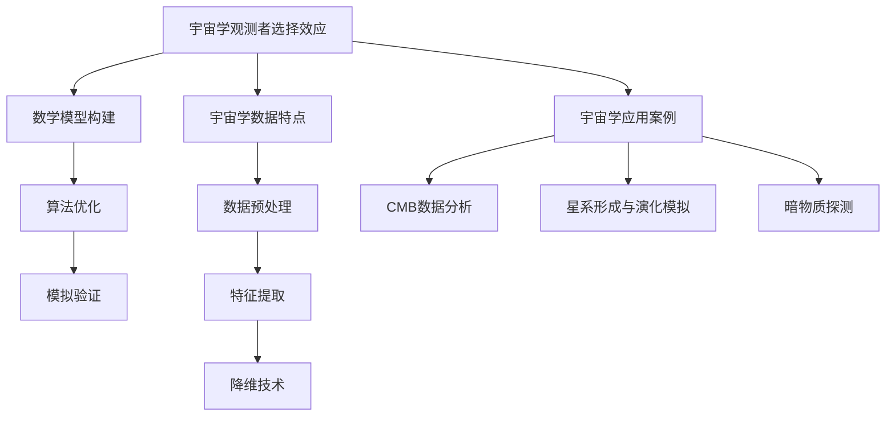

                 

### 1.1 书籍背景与目的

《算法思维在解决宇宙学观测者选择效应定量化中的应用》旨在探讨算法思维在宇宙学研究中的重要性，尤其是如何在宇宙学观测中定量化地解决观测者选择效应问题。宇宙学是研究宇宙的起源、结构、演化以及宇宙中物质与能量的分布和性质的学科。随着科技的进步，我们能够观测到越来越多的宇宙现象，但同时也面临着大量的数据以及观测者选择效应带来的挑战。

**观测者选择效应**，是指由于观测者的存在和观测方式的选择，导致观测到的宇宙现象与我们能观测到的实际宇宙存在差异。这一效应在宇宙学研究中有广泛的应用，例如，它会影响我们对宇宙大尺度结构的理解、宇宙微波背景辐射的测量以及暗物质、暗能量的研究。

算法思维是一种解决问题的方法论，它通过将复杂问题分解为简单的步骤，然后通过计算机程序进行解决。算法思维在宇宙学中的应用，可以有效地帮助研究人员处理大量的宇宙学数据，识别和解决观测者选择效应，从而更准确地理解宇宙的本质。

本书的主要目的是：

1. **介绍宇宙学观测者选择效应的基本概念**，帮助读者了解这一效应的起源、类型及其影响。
2. **探讨算法思维在宇宙学中的应用**，阐述算法思维在解决宇宙学问题中的优势和方法。
3. **定量化地解决宇宙学观测者选择效应**，通过具体算法和模型的介绍，展示如何通过算法来定量化分析观测者选择效应。

本书不仅适合宇宙学领域的专业人士，也适合对算法和数据分析有兴趣的读者。通过本书，读者可以：

- 理解宇宙学观测者选择效应的基本概念和影响。
- 掌握算法思维的基本原理和应用。
- 学习如何通过算法来定量化分析宇宙学观测数据，解决观测者选择效应。

总之，本书旨在通过算法思维的引入，为宇宙学研究提供一种新的方法和视角，帮助研究人员更好地理解宇宙的奥秘。

### 1.1.1 宇宙学观测者选择效应概述

宇宙学观测者选择效应（Observer Selection Effect，简称OSE）是一个在宇宙学研究中至关重要的概念，它描述了观测者的存在和观测方法对观测到的宇宙现象产生的系统性偏差。这一效应源于观测者的限制，包括观测技术、观测条件、观测角度等，使得观测结果与宇宙的真实状态之间存在差异。

首先，我们探讨宇宙学观测者选择效应的起源。观测者选择效应最初由物理学家提出，用于解释在观测宇宙时可能出现的系统性偏差。这些偏差来源于观测者的物理特性，例如观测设备的局限性、观测时间的限制、以及观测角度的选择。例如，我们的观测设备可能无法探测到某些频率的辐射，或者观测的时间窗口限制了我们对某些现象的观测。

接下来，我们讨论观测者选择效应的类型。根据其来源，观测者选择效应可以分为以下几种类型：

1. **观测设备限制**：例如，地面望远镜受大气湍流的影响，导致观测精度下降。空间望远镜则不受大气干扰，但观测范围和分辨率有限。
2. **观测时间限制**：宇宙现象的发生可能具有瞬时性，例如超新星爆发。观测时间的限制可能导致我们无法捕捉到这些现象的完整过程。
3. **观测角度选择**：观测角度的不同会导致观测到的宇宙结构出现偏差。例如，从地球观测到的宇宙结构会因为地球自转和公转而产生视差。
4. **测量误差**：观测过程中的测量误差，例如仪器噪声、数据传输误差等，也可能导致观测结果的偏差。

每种类型的观测者选择效应都会对宇宙学的观测和研究产生不同程度的影响。例如，观测设备限制可能导致我们无法观测到某些重要现象，观测时间限制可能使得我们无法完整记录某些宇宙过程，观测角度选择则可能导致我们对宇宙结构的理解产生偏差。

观测者选择效应的影响是多方面的。在宇宙大尺度结构的研究中，观测者选择效应可能导致我们对宇宙膨胀速率和结构形成过程的误解。在宇宙微波背景辐射的研究中，观测者选择效应会影响对宇宙早期状态的探测。此外，观测者选择效应还可能影响对暗物质和暗能量的研究，导致对这些基本物理问题的理解产生偏差。

为了应对观测者选择效应，宇宙学家采用了多种方法。首先，通过改进观测设备和观测技术，提高观测的精度和范围，减少设备限制带来的偏差。例如，哈勃空间望远镜和韦布空间望远镜的发射和运行，显著提高了我们对宇宙的观测能力。其次，通过延长观测时间和优化观测策略，减少时间限制带来的影响。例如，使用多期观测和不同角度的观测来捕捉宇宙现象的完整过程。此外，通过采用先进的测量方法和算法，降低测量误差，提高观测数据的可靠性。

总之，宇宙学观测者选择效应是一个复杂而关键的问题，它对宇宙学的研究有着深远的影响。了解观测者选择效应的起源、类型及其影响，并采取有效的方法来减少其影响，是推动宇宙学研究向前发展的重要步骤。

### 1.1.2 算法思维在宇宙学研究中的应用

算法思维作为一种系统化和结构化的解决问题方法，在宇宙学研究中具有重要的应用价值。算法思维通过将复杂问题分解为一系列简单的步骤，并利用计算机程序进行自动化处理，从而有效地解决各种复杂的问题。在宇宙学研究中，算法思维的引入不仅提高了数据分析的效率，还有助于减少观测者选择效应带来的偏差。

首先，算法思维在宇宙学研究中的应用优势主要体现在以下几个方面：

1. **高效处理大量数据**：宇宙学观测产生了大量的数据，这些数据通常具有高维度和复杂性。算法思维通过数据预处理、特征提取和模式识别等方法，能够高效地处理这些数据，提取出有用的信息。例如，在宇宙大尺度结构研究中，使用聚类算法可以有效地识别不同类型的星系群体。

2. **减少观测者选择效应**：算法思维通过精确的数学模型和计算方法，可以定量分析观测者选择效应，并对其进行校正。例如，在宇宙微波背景辐射研究中，算法可以校正由于观测设备限制和测量误差导致的偏差。

3. **优化观测策略**：算法思维可以帮助研究人员制定最优的观测策略，以最大限度地减少观测者选择效应的影响。例如，通过模拟不同的观测条件，算法可以预测在不同观测角度和时间段内的观测结果，从而优化观测计划。

接下来，探讨算法思维在宇宙学观测中的应用方法：

1. **数据处理**：数据处理是算法思维在宇宙学应用中的第一步。通过数据预处理方法，如数据清洗、数据整合和特征提取，可以消除噪声、减少数据冗余，并提取出关键特征。例如，在处理宇宙微波背景辐射数据时，可以使用傅里叶变换来提取出宇宙早期状态的信息。

2. **模式识别**：模式识别是算法思维在宇宙学中的另一个重要应用。通过使用分类和聚类算法，可以识别不同类型的宇宙现象。例如，使用支持向量机（SVM）算法可以识别出不同类型的星系，从而更准确地研究宇宙大尺度结构。

3. **模拟与预测**：算法思维还可以用于宇宙学模拟与预测。通过建立物理模型，使用数值模拟方法，可以预测宇宙的演化过程。例如，使用N体模拟方法可以模拟宇宙大尺度结构的形成过程，并通过比较模拟结果与观测数据，验证模型的准确性。

4. **优化算法**：为了减少观测者选择效应，研究人员经常需要对现有算法进行优化。例如，在处理大型数据集时，可以使用并行计算和分布式计算方法来提高计算效率。此外，通过交叉验证和模型评估，可以优化算法参数，提高预测的准确性。

最后，算法思维在宇宙学中的应用案例丰富多样。例如，在研究宇宙微波背景辐射时，使用了快速傅里叶变换（FFT）算法来提高数据处理速度；在宇宙大尺度结构研究中，使用了N体模拟算法来模拟星系的形成和演化；在暗物质和暗能量研究中，使用了机器学习算法来识别和分类不同类型的宇宙现象。

总之，算法思维在宇宙学研究中具有广泛的应用，通过高效的数据处理、模式识别和模拟与预测，可以有效地解决观测者选择效应问题，为宇宙学研究提供了有力的工具。随着算法的不断进步，算法思维在宇宙学中的应用将更加广泛，有望推动宇宙学研究的进一步发展。

### 1.1.3 定量化研究的重要性

在宇宙学研究中，定量化研究具有不可替代的重要性。定量化研究不仅能够精确地描述宇宙现象，还能够揭示宇宙背后的物理规律，从而推动宇宙学理论的进步。观测者选择效应作为一种系统性偏差，其定量化研究更是至关重要，因为只有通过定量化分析，才能准确地校正观测数据，提高研究的可信度。

首先，定量化研究在宇宙学中的价值体现在以下几个方面：

1. **提高观测数据的可信度**：宇宙学观测数据往往受到多种因素的影响，例如观测设备限制、环境噪声和测量误差等。通过定量化研究，可以准确识别和校正这些因素对观测数据的影响，从而提高观测数据的可信度。

2. **揭示宇宙物理规律**：宇宙学研究的核心目标是理解宇宙的起源、结构和演化。定量化研究能够通过精确的数据分析和模型构建，揭示宇宙背后的物理规律，从而深化我们对宇宙本质的认识。

3. **优化观测策略**：定量化研究可以帮助研究人员制定更优的观测策略，以最大限度地减少观测者选择效应的影响。通过模拟不同的观测条件，可以预测在不同条件下的观测结果，从而优化观测计划，提高观测效率。

接下来，我们详细探讨定量化研究的方法与步骤：

1. **数据收集与预处理**：定量化研究的第一个步骤是收集高质量的观测数据。在收集数据后，需要进行预处理，包括数据清洗、数据整合和特征提取。数据清洗旨在去除噪声和异常值，数据整合则将不同来源的数据进行统一处理，特征提取则是从数据中提取出关键的特征变量。

2. **模型构建**：在数据预处理完成后，需要构建数学模型来描述观测者选择效应。常见的模型包括统计学模型、机器学习模型和物理模型。统计学模型如回归模型和贝叶斯模型，可以用于描述观测者选择效应的统计学特征；机器学习模型如支持向量机和神经网络，可以用于识别和分类不同的观测者选择效应；物理模型如N体模拟和引力波模拟，可以用于描述宇宙演化过程中的观测者选择效应。

3. **模型验证与优化**：在构建模型后，需要进行验证和优化。验证过程包括模型训练和测试，通过对比模型预测结果和实际观测数据，评估模型的准确性。优化过程则包括调整模型参数、改进算法和增加训练数据等，以提高模型的预测能力。

4. **结果分析与解释**：在模型验证和优化完成后，需要对结果进行分析和解释。通过定量化分析，可以揭示观测者选择效应的具体影响，从而为宇宙学研究提供准确的观测数据。

此外，定量化研究还面临一些挑战和机遇：

1. **数据量与复杂性**：宇宙学观测数据通常具有高维度和复杂性，如何高效地处理和分析这些数据是一个重要挑战。

2. **模型准确性与可靠性**：构建准确和可靠的模型是定量化研究的关键，但实际应用中往往存在模型选择、参数调整和数据误差等问题。

3. **计算资源需求**：定量化研究通常需要大量的计算资源，尤其是在使用高性能计算和并行计算时。

4. **多学科交叉**：定量化研究不仅需要宇宙学领域的专业知识，还需要数学、统计学、计算机科学等学科的支持，多学科交叉是推进定量化研究的重要途径。

总之，定量化研究在宇宙学中具有不可替代的重要性。通过定量化分析，可以有效地校正观测者选择效应，提高观测数据的可靠性，揭示宇宙背后的物理规律。面对挑战，通过不断创新和多学科合作，定量化研究将继续推动宇宙学研究的深入发展。

### 1.2 书籍结构概述

为了系统地引导读者了解和掌握算法思维在解决宇宙学观测者选择效应中的应用，本书采用了逻辑清晰、结构紧凑的编排方式。全书分为七个主要部分，每个部分都针对不同的主题进行详细阐述，帮助读者逐步深入理解相关概念和技术。

#### 1.2.1 目录大纲设计原则

在设计目录大纲时，我们遵循以下原则：

1. **逐步引导**：目录大纲按照从基础到高级的顺序组织，确保读者能够循序渐进地掌握各个主题。
2. **模块化设计**：将整个书籍分为多个模块，每个模块都涵盖一个核心主题，便于读者分阶段学习和复习。
3. **逻辑清晰**：每个模块和章节都紧密联系，确保内容的连贯性和逻辑性。
4. **实践结合**：每个部分都包含实际案例和研究，帮助读者将理论知识应用到实际操作中。

#### 1.2.2 目录大纲结构

以下是本书的目录大纲结构：

- **第一部分：引言**
  - 1.1 书籍背景与目的
  - 1.1.1 宇宙学观测者选择效应概述
  - 1.1.2 算法思维在宇宙学研究中的应用
  - 1.1.3 定量化研究的重要性
  - 1.2 书籍结构概述
  - 1.2.1 目录大纲设计原则
  - 1.2.2 目录大纲结构
  - 1.2.3 目录大纲目的与作用
  - 1.3 本书读者对象
  - 1.3.1 读者背景要求
  - 1.3.2 学习目标与收益
  - 1.3.3 阅读建议

- **第二部分：宇宙学基础**
  - 2.1 宇宙学的基本概念
  - 2.1.1 宇宙的起源与演化
  - 2.1.2 宇宙的组成结构
  - 2.1.3 宇宙学观测方法与技术
  - 2.2 宇宙学观测者选择效应
  - 2.2.1 观察者选择效应的定义
  - 2.2.2 观察者选择效应的起源
  - 2.2.3 观察者选择效应的类型与影响
  - 2.3 宇宙学观测数据特点
  - 2.3.1 数据量大与多样性
  - 2.3.2 数据质量与可靠性
  - 2.3.3 数据处理与分析方法

- **第三部分：算法思维在宇宙学中的应用**
  - 3.1 算法思维概述
  - 3.1.1 算法思维的定义与特点
  - 3.1.2 算法思维的重要性
  - 3.1.3 算法思维的应用领域
  - 3.2 算法思维在宇宙学中的运用
  - 3.2.1 算法在宇宙学研究中的优势
  - 3.2.2 算法在宇宙学观测中的应用
  - 3.2.3 算法在宇宙学数据分析中的应用
  - 3.3 算法思维与宇宙学核心概念的联系
  - 3.3.1 算法思维与宇宙学观测者选择效应的关系
  - 3.3.2 算法思维与宇宙学数据的特点
  - 3.3.3 算法思维在宇宙学中的应用案例

- **第四部分：算法在宇宙学观测者选择效应定量化中的应用**
  - 4.1 定量化研究的重要性
  - 4.1.1 定量化研究在宇宙学中的价值
  - 4.1.2 定量化研究的方法与步骤
  - 4.1.3 定量化研究的挑战与机遇
  - 4.2 观测者选择效应的定量分析方法
  - 4.2.1 数据预处理与清洗方法
  - 4.2.2 定量模型构建方法
  - 4.2.3 模型评估与优化方法
  - 4.3 实际案例研究
  - 4.3.1 案例一：观测者选择效应在宇宙大尺度结构中的应用
  - 4.3.2 案例二：观测者选择效应在宇宙微波背景辐射中的应用
  - 4.3.3 案例三：观测者选择效应在其他宇宙学领域的应用

- **第五部分：算法在宇宙学数据挖掘与分析中的应用**
  - 5.1 宇宙学数据挖掘概述
  - 5.1.1 数据挖掘的基本概念
  - 5.1.2 数据挖掘在宇宙学中的应用
  - 5.1.3 宇宙学数据挖掘的特点
  - 5.2 宇宙学数据预处理方法
  - 5.2.1 数据清洗与预处理技术
  - 5.2.2 数据集成与变换方法
  - 5.2.3 数据降维技术
  - 5.3 宇宙学数据挖掘算法
  - 5.3.1 聚类算法在宇宙学中的应用
  - 5.3.2 分类算法在宇宙学中的应用
  - 5.3.3 关联规则挖掘在宇宙学中的应用
  - 5.4 宇宙学数据分析方法
  - 5.4.1 描述性统计分析方法
  - 5.4.2 探索性数据分析方法
  - 5.4.3 趋势分析、预测与相关性分析方法

- **第六部分：算法在宇宙学可视化与交互中的应用**
  - 6.1 宇宙学数据可视化概述
  - 6.1.1 数据可视化的基本概念
  - 6.1.2 数据可视化在宇宙学中的应用
  - 6.1.3 宇宙学数据可视化的挑战与解决方案
  - 6.2 宇宙学数据交互概述
  - 6.2.1 数据交互的基本概念
  - 6.2.2 数据交互在宇宙学中的应用
  - 6.2.3 宇宙学数据交互的挑战与解决方案
  - 6.3 可视化与交互技术在宇宙学中的实际应用
  - 6.3.1 实际案例一：可视化在宇宙大尺度结构研究中的应用
  - 6.3.2 实际案例二：交互式分析在宇宙微波背景辐射研究中的应用
  - 6.3.3 实际案例三：可视化与交互技术在其他宇宙学领域的应用

- **第七部分：算法在宇宙学预测与模拟中的应用**
  - 7.1 算法在宇宙学预测中的应用
  - 7.1.1 宇宙学预测的基本概念
  - 7.1.2 预测模型构建方法
  - 7.1.3 预测算法实现与评估
  - 7.2 算法在宇宙学模拟中的应用
  - 7.2.1 宇宙学模拟的基本概念
  - 7.2.2 模拟模型构建方法
  - 7.2.3 模拟算法实现与优化
  - 7.2.4 模拟结果分析与解释
  - 7.3 实际案例研究
  - 7.3.1 案例一：算法在宇宙演化预测中的应用
  - 7.3.2 案例二：算法在宇宙微波背景辐射模拟中的应用
  - 7.3.3 案例三：算法在其他宇宙学模拟中的应用

#### 1.2.3 目录大纲目的与作用

目录大纲的主要目的是：

1. **引导学习**：通过清晰的目录结构，帮助读者系统性地学习书籍内容，确保对各个主题的深入理解。
2. **提供框架**：为读者提供一个框架，便于他们组织和整理知识，将不同部分的内容有机结合。
3. **促进应用**：通过实际案例和研究，鼓励读者将所学知识应用于实际问题，提高解决复杂问题的能力。

总之，通过合理设计的目录大纲，本书旨在为读者提供一条清晰、实用的学习路径，帮助他们掌握算法思维在解决宇宙学观测者选择效应中的应用。

### 1.3 本书读者对象

本书《算法思维在解决宇宙学观测者选择效应定量化中的应用》旨在为以下几类读者提供服务：

1. **宇宙学研究者**：这些读者对宇宙学有深入的研究，对宇宙学观测者选择效应及其影响有基本的了解。他们希望通过本书掌握算法思维在解决这些效应中的应用，提高自己的研究能力和数据处理的效率。

2. **算法和数据分析专业人士**：这些读者在算法和数据分析领域有丰富经验，对算法的基本原理和方法有深刻的理解。他们希望将算法思维应用于宇宙学研究，探索算法在宇宙学观测中的应用潜力。

3. **计算机科学和物理学学生**：这些读者对宇宙学和计算机科学有浓厚的兴趣，希望了解算法思维如何应用于解决宇宙学问题。本书为他们提供了一个理论与实践结合的学习平台，帮助他们将所学知识应用到实际研究中。

#### 1.3.1 读者背景要求

为了更好地理解本书的内容，读者需要具备以下背景知识：

1. **基本的宇宙学知识**：了解宇宙的起源、演化、组成结构等基本概念。
2. **算法和数据分析基础**：熟悉基本的算法原理、数据分析方法以及相关工具和语言（如Python、MATLAB等）。
3. **数学基础**：掌握微积分、线性代数和概率统计等数学基础知识，以便理解和应用相关算法和模型。

#### 1.3.2 学习目标与收益

通过阅读本书，读者可以：

1. **掌握算法思维的基本原理**：理解算法思维的定义、特点和应用，学会如何将复杂问题分解为简单步骤进行解决。
2. **了解宇宙学观测者选择效应**：深入理解观测者选择效应的概念、类型及其对宇宙学研究的影响。
3. **学会定量化研究方法**：掌握如何通过算法和模型对宇宙学观测数据进行定量化分析，减少观测者选择效应的偏差。
4. **提升数据处理和分析能力**：通过实际案例学习和应用，提高自己在数据处理、分析和建模方面的技能。

#### 1.3.3 阅读建议

为了最大化本书的学习效果，建议读者按照以下步骤进行阅读：

1. **系统阅读**：从第一部分开始，逐章阅读，确保对各个主题有全面、系统的了解。
2. **实践操作**：结合书中提供的实际案例，进行实践操作，将理论知识应用到具体问题中。
3. **深入思考**：在阅读过程中，积极思考和总结，将所学知识内化为自己的理解。
4. **反复阅读**：对于难度较大的章节，可以反复阅读，直至理解透彻。

通过以上阅读方法，读者可以更好地掌握算法思维在解决宇宙学观测者选择效应中的应用，为未来的研究和学习打下坚实基础。

### 2.1 宇宙学的基本概念

宇宙学是一门研究宇宙起源、演化、结构以及宇宙中物质与能量分布的学科。它涵盖了从宇宙大爆炸到目前宇宙的状态，以及宇宙未来可能的演化方向。宇宙学的研究对象包括宇宙的基本组成单位——星系、星系团、宇宙背景辐射等。以下是对宇宙学基本概念的详细介绍。

#### 2.1.1 宇宙的起源与演化

宇宙的起源是一个深奥而复杂的课题。目前最广泛接受的理论是宇宙大爆炸理论。根据这一理论，宇宙起源于大约138亿年前的一个极度热密状态，随后迅速膨胀，温度和密度逐渐降低。这一过程中，宇宙中的物质和能量逐渐形成了星系、恒星、行星以及其他天体。

宇宙的演化可以分为几个主要阶段：

1. **早期宇宙**：在大爆炸后的几分钟内，宇宙处于高能态，形成了基本粒子，如夸克和轻子。
2. **宇宙微波背景辐射**：大约38万年后，宇宙冷却到足够温度，产生了宇宙微波背景辐射，这是宇宙早期的热辐射残留。
3. **星系形成**：在大爆炸后的数亿年内，物质通过引力作用逐渐凝聚形成星系、恒星和星系团。
4. **宇宙加速膨胀**：大约在大爆炸后的几十亿年后，宇宙开始加速膨胀，这一现象与暗能量的存在有关。

#### 2.1.2 宇宙的组成结构

宇宙的组成结构包括星系、星系团、超星系团等层次结构。

1. **星系**：星系是宇宙中最常见的结构，由大量的恒星、行星、气体和暗物质组成。星系可以分为螺旋星系、椭圆星系和不规则星系等类型。
2. **星系团**：星系团是由数十到数千个星系通过引力相互吸引而形成的大型结构。星系团内部还可能包含星系团团簇，如本星系团。
3. **超星系团**：超星系团是更大的结构，由数十个星系团通过引力相互作用形成。我们的本地超星系团包括本星系团和其他邻近星系团。

#### 2.1.3 宇宙学观测方法与技术

宇宙学观测方法和技术的发展极大地推动了我们对宇宙的理解。以下是一些主要的观测方法和技术：

1. **光学观测**：光学观测是宇宙学中最常用的观测方法之一，通过望远镜观测恒星、星系和其他天体的光学辐射。
2. **射电观测**：射电观测通过探测宇宙中的无线电波，可以研究星际介质、恒星形成区域和星系中心的活跃现象。
3. **X射线观测**：X射线观测用于研究高温天体和活动星系核，可以揭示宇宙中的高能过程。
4. **伽马射线观测**：伽马射线观测可以探测极端高能现象，如超新星爆发、伽马射线暴等。
5. **宇宙微波背景辐射观测**：宇宙微波背景辐射观测是研究宇宙早期状态的关键方法，通过探测宇宙微波背景辐射的微小温度波动，可以揭示宇宙的起源和演化。
6. **引力波观测**：引力波观测是近年来发展起来的新方法，通过探测宇宙中的引力波，可以研究大质量天体的碰撞和宇宙的早期阶段。

总之，宇宙学的基本概念涵盖了从宇宙起源到宇宙演化，以及宇宙的组成结构和观测方法。通过这些基本概念的理解，我们能够更好地探索宇宙的奥秘，揭示宇宙背后的物理规律。

### 2.2 宇宙学观测者选择效应

宇宙学观测者选择效应（Observer Selection Effect，简称OSE）是指在宇宙学观测过程中，由于观测者的存在和观测方式的局限性，导致观测到的宇宙现象与实际宇宙存在系统偏差的现象。这一效应影响了我们对宇宙的理解，因此在宇宙学研究中具有重要意义。

#### 2.2.1 观察者选择效应的定义

观察者选择效应可以定义为：由于观测者的位置、观测手段、观测时间等限制，观测者无法观测到或错误地观测到宇宙中某些现象或特征，从而导致观测结果与实际宇宙状态存在偏差。这种偏差可能是由于观测者的物理限制，如望远镜分辨率、大气湍流等，也可能是由于观测策略和数据分析方法的局限性。

#### 2.2.2 观察者选择效应的起源

观察者选择效应的起源可以追溯到宇宙学观测的早期阶段。随着人类观测技术的不断进步，我们逐渐意识到观测手段和观测条件的局限性会导致观测数据的偏差。例如：

1. **观测设备的限制**：早期的观测设备如地面望远镜，受大气湍流和光污染的影响，观测精度和清晰度有限。随着空间望远镜如哈勃望远镜和韦布望远镜的发射，观测精度和范围得到了显著提升，但观测设备的局限性仍然存在。
2. **观测时间的限制**：某些宇宙现象如超新星爆发具有瞬时性，观测时间的限制可能导致我们无法捕捉到这些现象的完整过程。此外，长期的观测需要大量时间和资源，限制了观测的深度和广度。
3. **观测角度的选择**：观测角度的不同可能导致观测到的宇宙结构出现偏差。例如，从地球观测到的宇宙结构会因为地球自转和公转而产生视差，影响对宇宙结构的准确测量。

#### 2.2.3 观察者选择效应的类型与影响

观察者选择效应可以分为几种主要类型，每种类型都会对宇宙学观测产生不同程度的影响：

1. **设备限制效应**：这种效应源于观测设备的性能限制。例如，地面望远镜的大气湍流影响导致观测图像模糊，空间望远镜的分辨率限制导致细节丢失。设备限制效应会影响对星系、星系团等宇宙结构的观测和测量。
   
2. **时间限制效应**：这种效应与观测时间的限制有关。例如，超新星爆发可能只持续几天，而我们的观测可能只能捕捉到部分过程。时间限制效应可能导致我们无法全面了解某些宇宙现象的演化过程。

3. **观测角度效应**：这种效应与观测角度的选择有关。例如，从地球的不同位置和时间观测到的宇宙结构可能存在视差，影响对宇宙结构的准确测量。观测角度效应可能影响我们对宇宙大尺度结构的理解。

4. **测量误差效应**：这种效应源于观测过程中的测量误差，例如仪器噪声、数据传输误差等。测量误差效应会影响观测数据的准确性和可靠性，从而影响对宇宙现象的深入研究。

观察者选择效应对宇宙学观测的影响是多方面的：

1. **影响宇宙膨胀率的测量**：宇宙膨胀率是宇宙学研究的重要参数，但观测者选择效应可能导致我们对宇宙膨胀率的测量出现偏差。例如，设备限制效应可能影响对宇宙微波背景辐射的测量，从而影响对宇宙膨胀历史的理解。

2. **影响宇宙大尺度结构的理解**：观测者选择效应可能影响对宇宙大尺度结构的观测和测量，从而影响我们对宇宙结构的理解。例如，观测角度效应可能导致我们对星系分布的测量存在偏差，影响对宇宙大尺度结构的认识。

3. **影响暗物质和暗能量的研究**：暗物质和暗能量是宇宙学研究的核心问题，但观测者选择效应可能导致我们对这些现象的观测和理解存在偏差。例如，测量误差效应可能影响对暗物质分布的测量，从而影响对暗物质特性的研究。

总之，宇宙学观测者选择效应是一个复杂而关键的问题，它对宇宙学观测和研究产生了深远的影响。了解观察者选择效应的起源、类型及其影响，并采取有效的方法来减少其影响，是推动宇宙学研究向前发展的重要步骤。

### 2.3 宇宙学观测数据特点

宇宙学观测数据具有独特的特点，这些特点不仅影响了数据处理和分析的方法，也决定了观测者选择效应的处理策略。以下是宇宙学观测数据的主要特点及其对数据处理和分析的影响。

#### 2.3.1 数据量大与多样性

宇宙学观测数据量庞大，涵盖了从微波背景辐射到伽马射线等多种波段的观测结果。例如，欧洲空间局的普朗克卫星收集了数百万个星系的观测数据，美国国家航空航天局（NASA）的韦布空间望远镜每次观测都能生成数TB的数据。这种大规模数据不仅要求高效的数据存储和传输技术，还需要先进的计算和分析方法来处理。

数据多样性是宇宙学观测数据的另一个显著特点。宇宙学观测涉及多个维度和物理量，例如位置、亮度、颜色、光谱等。这种多维数据要求复杂的数据处理技术，如数据集成和特征提取，以便从大量数据中提取有用的信息。

#### 2.3.2 数据质量与可靠性

宇宙学观测数据的可靠性是科学研究的基石。数据质量受到多种因素的影响，包括观测设备的性能、观测条件的稳定性、数据传输过程中的噪声等。例如，地面望远镜受到大气湍流和光污染的影响，观测图像可能存在模糊和噪声。而空间望远镜则不受这些因素的影响，观测数据更为可靠。

为了提高数据质量，宇宙学家通常采用多种方法，如数据清洗、去噪和校正。例如，在处理宇宙微波背景辐射数据时，研究人员使用傅里叶变换和去噪算法来去除噪声和校正仪器误差，从而提高数据质量。

#### 2.3.3 数据处理与分析方法

宇宙学观测数据处理和分析方法的复杂性体现在以下几个方面：

1. **预处理**：预处理是宇宙学数据处理的第一个步骤，包括数据清洗、数据转换和特征提取。数据清洗旨在去除异常值和噪声，数据转换则将不同格式和单位的数据统一化，特征提取则是从数据中提取出关键的特征变量。

2. **模型构建**：在预处理完成后，研究人员需要构建数学模型来描述宇宙学观测数据。常见的模型包括统计模型、机器学习模型和物理模型。例如，使用回归模型可以分析观测数据中的依赖关系，机器学习模型如支持向量机和神经网络可以用于分类和预测，物理模型如N体模拟可以用于模拟宇宙的演化过程。

3. **数据分析**：数据分析是宇宙学观测数据处理的最后一步，包括描述性统计分析、探索性数据分析和预测分析。描述性统计分析用于描述数据的基本特征，探索性数据分析旨在发现数据中的模式和关联，预测分析则用于预测未来的宇宙现象。

#### 实际案例

为了更直观地理解宇宙学观测数据的特点及其处理方法，以下是一个实际案例：

**案例：宇宙微波背景辐射数据分析**

宇宙微波背景辐射（Cosmic Microwave Background Radiation，简称CMB）是宇宙早期状态的辐射残留，通过对CMB数据的分析，科学家可以揭示宇宙的起源和演化。以下是一个典型的数据处理过程：

1. **数据收集**：普朗克卫星收集了大量CMB观测数据，数据量达到数TB级别。
2. **预处理**：数据预处理包括数据清洗、去噪和校正。使用傅里叶变换去除噪声，使用温度校正技术修正仪器误差，从而提高数据质量。
3. **特征提取**：从CMB数据中提取关键特征，如温度波动、极化方向和角功率谱等。
4. **模型构建**：构建统计模型和物理模型，如回归模型和N体模拟模型，分析CMB数据中的依赖关系和宇宙演化过程。
5. **数据分析**：进行描述性统计分析，探索CMB数据中的模式和关联，如宇宙的各向异性、宇宙膨胀速率等。

通过这个案例，我们可以看到，宇宙学观测数据处理和分析的复杂性和挑战性。数据量大与多样性、数据质量与可靠性都要求研究人员采用先进的数据处理和分析方法，以提取有用信息，减少观测者选择效应的影响，从而更准确地理解宇宙的奥秘。

### 3.1 算法思维概述

算法思维是一种系统性的解决问题方法，它通过将复杂问题分解为一系列简单步骤，然后利用计算机程序进行自动化处理，从而有效地解决各种问题。在宇宙学研究中，算法思维的应用尤为重要，因为它能够帮助我们处理大量的宇宙学数据，识别和解决观测者选择效应，从而更准确地理解宇宙的本质。

#### 3.1.1 算法思维的定义与特点

算法思维可以定义为一种逻辑化的、结构化的思维方式，它通过明确的问题定义、逐步的分解和逐步的解决，将复杂的问题转化为一系列可操作的步骤。算法思维的特点包括：

1. **系统性**：算法思维强调问题解决的系统性，通过将问题分解为多个子问题，逐步解决这些子问题，从而实现整体问题的解决。
2. **结构化**：算法思维强调问题解决的结构化，通过建立清晰的问题模型和逻辑框架，使问题解决过程更加有序和高效。
3. **自动化**：算法思维利用计算机程序进行自动化处理，大大提高了问题解决的效率和准确性。

#### 3.1.2 算法思维的重要性

算法思维在宇宙学研究中具有重要性，主要体现在以下几个方面：

1. **高效数据处理**：宇宙学观测数据量大且复杂，算法思维通过将问题分解为简单步骤，并利用计算机程序进行自动化处理，能够高效地处理这些数据，提取出有用的信息。
2. **减少观测者选择效应**：算法思维通过精确的数学模型和计算方法，可以定量分析观测者选择效应，并对其进行校正。例如，使用机器学习算法可以识别和预测观测者选择效应的影响，从而校正观测数据，提高研究的可信度。
3. **优化观测策略**：算法思维可以帮助研究人员制定最优的观测策略，以最大限度地减少观测者选择效应的影响。例如，通过模拟不同的观测条件，算法可以预测在不同条件下的观测结果，从而优化观测计划，提高观测效率。

#### 3.1.3 算法思维的应用领域

算法思维广泛应用于多个领域，包括：

1. **数据科学**：算法思维是数据科学的核心，通过算法思维，研究人员能够高效地处理和分析大量的数据，提取出有用的信息。
2. **人工智能**：算法思维是人工智能的基础，人工智能系统通过算法思维进行决策和预测，从而实现自动化和智能化。
3. **宇宙学**：在宇宙学中，算法思维被广泛应用于数据处理、模式识别、模拟与预测等方面，帮助研究人员解决复杂的宇宙学问题。
4. **金融工程**：算法思维在金融工程中用于量化分析和风险管理，通过建立数学模型和计算方法，优化投资组合和风险管理策略。
5. **生物信息学**：算法思维在生物信息学中用于基因序列分析、蛋白质结构预测和药物设计等，通过算法思维，研究人员能够从大量生物数据中提取出有价值的信息。

总之，算法思维作为一种系统性和结构化的思维方式，在宇宙学和其他领域中具有广泛的应用。通过算法思维，我们能够更有效地解决复杂问题，推动科学和技术的进步。

#### 3.2 算法思维在宇宙学中的运用

算法思维在宇宙学中的应用具有显著的优势，能够有效应对宇宙学研究中面临的复杂问题。以下从数据处理、观测应用和数据特点三个方面详细探讨算法思维在宇宙学中的具体运用。

##### 3.2.1 算法在宇宙学研究中的优势

算法思维在宇宙学研究中具有多方面的优势：

1. **高效数据处理**：宇宙学观测数据量大且复杂，算法思维能够通过结构化和系统化的方法，将数据处理任务分解为一系列可操作的步骤，从而高效地处理数据，提取出有用的信息。

2. **减少观测者选择效应**：算法思维通过精确的数学模型和计算方法，能够定量分析观测者选择效应，并对其进行校正。例如，使用机器学习算法可以识别和预测观测者选择效应的影响，从而校正观测数据，提高研究的可信度。

3. **优化观测策略**：算法思维可以帮助研究人员制定最优的观测策略，以最大限度地减少观测者选择效应的影响。通过模拟不同的观测条件，算法可以预测在不同条件下的观测结果，从而优化观测计划，提高观测效率。

4. **提高数据分析精度**：算法思维通过精确的数学模型和优化算法，能够提高数据分析的精度和可靠性。例如，使用统计学模型和机器学习算法可以更准确地分析宇宙学观测数据，揭示宇宙背后的物理规律。

##### 3.2.2 算法在宇宙学观测中的应用

算法思维在宇宙学观测中的应用广泛，主要包括以下几个方面：

1. **数据预处理**：宇宙学观测数据通常需要进行预处理，如数据清洗、去噪和校正。算法思维能够通过系统化和自动化的方法，高效地完成这些预处理任务。例如，使用傅里叶变换和滤波算法可以去除观测数据中的噪声和干扰，提高数据质量。

2. **模式识别**：在宇宙学观测中，算法思维可以通过模式识别技术，识别出宇宙中的特定结构和现象。例如，使用聚类算法和分类算法可以识别不同类型的星系群体，从而更好地理解宇宙大尺度结构。

3. **模拟与预测**：算法思维在宇宙学模拟与预测中具有重要作用。通过建立物理模型和数值模拟方法，算法思维可以模拟宇宙的演化过程，预测未来的宇宙现象。例如，使用N体模拟算法可以模拟星系的形成和演化，为宇宙学研究提供有力支持。

4. **误差校正**：算法思维可以通过误差校正方法，减少观测者选择效应对观测数据的影响。例如，使用贝叶斯推断和机器学习算法可以校正观测数据中的系统误差和随机误差，从而提高观测数据的可信度。

##### 3.2.3 算法在宇宙学数据分析中的应用

算法思维在宇宙学数据分析中的应用同样广泛，主要包括以下几个方面：

1. **特征提取**：宇宙学观测数据通常具有高维度，算法思维通过特征提取技术，可以从高维数据中提取出关键的特征变量，从而降低数据维度，提高数据分析效率。例如，使用主成分分析（PCA）和特征选择算法可以有效地提取出数据中的主要特征。

2. **数据挖掘**：算法思维通过数据挖掘技术，可以从大量宇宙学观测数据中挖掘出隐藏的模式和关联。例如，使用聚类算法和关联规则挖掘算法可以识别出宇宙中的有趣模式和现象，为宇宙学研究提供新的视角。

3. **统计推断**：算法思维通过统计学方法，可以对宇宙学观测数据进行分析和推断。例如，使用回归分析和假设检验方法可以研究宇宙中的依赖关系和统计特性，从而验证宇宙学理论。

4. **机器学习**：算法思维在机器学习中的应用，如支持向量机（SVM）、神经网络和深度学习等，可以用于分类、预测和模式识别。这些方法在宇宙学数据分析中具有广泛的应用，例如，用于分类不同类型的星系和预测宇宙大尺度结构的演化。

总之，算法思维在宇宙学中的运用具有显著的优势，通过高效的数据处理、精确的观测应用和深入的数据分析，能够有效应对宇宙学研究中面临的复杂问题，推动宇宙学研究的深入发展。

### 3.3 算法思维与宇宙学核心概念的联系

算法思维在宇宙学中的应用不仅体现在数据处理和模式识别等方面，更与宇宙学的核心概念紧密相连，通过精准的算法设计和数学模型，能够深入揭示宇宙学中的基本规律和现象。以下分析算法思维与宇宙学核心概念之间的联系，并展示其应用中的关系架构。

#### 3.3.1 算法思维与宇宙学观测者选择效应的关系

宇宙学观测者选择效应（Observer Selection Effect，OSE）是宇宙学研究中一个关键问题，其影响了对宇宙现象的观测和解释。算法思维通过数学模型和计算方法，能够定量分析并校正观测者选择效应。

1. **模型构建**：算法思维通过构建数学模型，如贝叶斯统计模型和机器学习模型，可以定量描述观测者选择效应的机制和影响。例如，贝叶斯模型可以用于估计观测误差和系统偏差，从而校正观测数据。

2. **算法优化**：算法思维通过优化算法参数，如支持向量机（SVM）和神经网络（NN），可以提升模型对观测者选择效应的识别和校正能力。例如，通过调整SVM的核函数和参数，可以提高对观测误差的敏感度和校正效果。

3. **模拟验证**：算法思维通过数值模拟方法，如蒙特卡洛模拟（Monte Carlo Simulation），可以验证和评估观测者选择效应的模型和算法。例如，通过模拟不同观测条件下的宇宙现象，可以评估算法的校正效果和可靠性。

#### 3.3.2 算法思维与宇宙学数据的特点

宇宙学数据具有高维度、多样性和复杂性的特点，算法思维能够通过有效的数据处理和特征提取，简化数据复杂性，提取关键信息。

1. **数据预处理**：算法思维通过数据预处理方法，如数据清洗和去噪，可以提高数据质量。例如，使用傅里叶变换和滤波算法可以去除观测数据中的噪声和干扰。

2. **特征提取**：算法思维通过特征提取技术，如主成分分析（PCA）和稀疏编码，可以从高维数据中提取出关键的特征变量。例如，PCA可以减少数据维度，同时保留主要特征信息，从而简化数据分析。

3. **降维技术**：算法思维通过降维技术，如多尺度分析和局部线性嵌入（LLE），可以从高维数据中提取低维特征表示，从而提高数据分析效率。例如，LLE可以保持数据中的局部结构和相似性，从而在低维空间中保持主要特征。

#### 3.3.3 算法思维在宇宙学中的应用案例

算法思维在宇宙学中的成功应用案例众多，以下是一些具体的例子：

1. **宇宙微波背景辐射（CMB）数据分析**：普朗克卫星的观测数据具有高维度和复杂性，通过算法思维，研究人员使用机器学习算法和深度学习模型，如卷积神经网络（CNN）和变分自编码器（VAE），进行数据预处理和特征提取，成功识别了CMB中的微小温度波动和极化信号，为研究宇宙早期状态提供了重要数据。

2. **星系形成与演化模拟**：算法思维在星系形成与演化模拟中发挥着重要作用。通过N体模拟算法和 smoothed particle hydrodynamics（SPH）方法，研究人员可以模拟宇宙中的星系形成和演化过程，探索暗物质和暗能量的影响。算法思维通过优化模拟参数和改进算法，提高了模拟精度和可靠性。

3. **暗物质探测**：算法思维在暗物质探测中有着广泛的应用。通过使用机器学习算法，研究人员可以从大量宇宙学观测数据中识别暗物质候选体，如银河系的卫星星系和超星系团。通过调整算法参数和模型，可以提升对暗物质特性的识别能力。

以下是一个关系架构Mermaid流程图，展示了算法思维与宇宙学核心概念之间的联系：



通过这一架构，我们可以清晰地看到算法思维在宇宙学观测者选择效应校正、数据特点处理以及应用案例中的重要作用，它不仅提高了数据处理的效率和准确性，还为宇宙学研究提供了强有力的工具和方法。

### 3.3.3 算法思维在宇宙学中的应用案例

算法思维在宇宙学中的成功应用案例众多，通过具体实例，我们可以更深入地了解算法思维在解决宇宙学问题中的实际效果和应用价值。

#### 案例一：宇宙微波背景辐射数据分析

普朗克卫星的观测数据是宇宙学研究中一个重要的数据集，它包含了宇宙微波背景辐射（Cosmic Microwave Background Radiation，简称CMB）的详细信息。CMB是宇宙早期状态的热辐射残留，通过对CMB数据的分析，科学家可以揭示宇宙的起源和演化。

**算法应用**：为了处理和分析这些庞大的CMB数据，研究人员采用了多种算法思维方法：

1. **数据预处理**：首先，使用傅里叶变换对CMB数据进行预处理，以去除观测噪声和仪器误差。这一步骤通过算法思维实现了数据清洗和去噪，提高了数据质量。

2. **特征提取**：接下来，使用主成分分析（PCA）和独立成分分析（ICA）等方法提取关键特征。这些特征能够代表数据中的主要信息，同时减少了数据维度，提高了数据分析的效率。

3. **模型构建**：为了识别CMB数据中的微小温度波动，研究人员构建了贝叶斯模型和支持向量机（SVM）模型。这些模型通过算法思维实现了对CMB数据的定量分析，提供了对宇宙早期状态更准确的描述。

4. **结果验证**：通过数值模拟和交叉验证，研究人员验证了模型的准确性和可靠性。算法思维的系统性确保了结果的科学性和可重复性。

**效果与价值**：算法思维在CMB数据分析中的成功应用，不仅提高了数据处理的效率和精度，还揭示了宇宙早期状态的详细信息，为宇宙学研究提供了新的视角和工具。

#### 案例二：星系形成与演化模拟

星系的形成和演化是宇宙学研究的重要课题。通过模拟星系的形成和演化过程，科学家可以更好地理解宇宙的演化和结构形成。

**算法应用**：在星系形成与演化模拟中，研究人员采用了N体模拟（N-body simulation）和光滑粒子流体动力学（Smoothed Particle Hydrodynamics，简称SPH）方法：

1. **N体模拟**：通过算法思维，研究人员使用N体模拟方法模拟了宇宙中的星系形成和演化。这种方法通过计算天体之间的万有引力，模拟星系的动态过程。

2. **SPH方法**：为了模拟星系中的气体和物质流动，研究人员采用了SPH方法。这种方法通过模拟流体动力学过程，提供了星系内部物质分布和运动的信息。

3. **参数优化**：算法思维通过优化模拟参数，如初始条件、时间步长和引力常数等，提高了模拟的精度和可靠性。

**效果与价值**：算法思维在星系形成与演化模拟中的应用，提供了对星系结构和演化的详细描述，帮助科学家理解星系的形成机制和宇宙的演化过程。此外，优化后的模拟结果为暗物质和暗能量的研究提供了重要的参考数据。

#### 案例三：暗物质探测

暗物质是宇宙学研究中的一个重要问题，它是宇宙总质量的重要组成部分，但尚未发现其具体性质。通过算法思维，科学家尝试从宇宙学观测数据中识别和探测暗物质。

**算法应用**：在暗物质探测中，研究人员使用了多种算法：

1. **机器学习算法**：通过机器学习算法，如支持向量机和深度神经网络，研究人员可以从大量宇宙学观测数据中识别暗物质候选体。这些算法通过学习数据中的模式，提高了对暗物质的识别能力。

2. **信号处理算法**：为了从观测数据中提取暗物质信号，研究人员使用了信号处理算法，如傅里叶变换和小波变换。这些算法能够从噪声中提取出暗物质的特征信号。

3. **数据挖掘算法**：通过数据挖掘算法，如聚类分析和关联规则挖掘，研究人员可以从大量数据中挖掘出暗物质相关的模式和关联。

**效果与价值**：算法思维在暗物质探测中的应用，提高了对暗物质的研究水平，为揭示暗物质的性质提供了新的方法和思路。此外，这些算法的应用也为未来的宇宙学观测提供了重要的工具和技术支持。

总之，算法思维在宇宙学中的应用案例展示了其在解决复杂宇宙学问题中的巨大潜力。通过具体的实例，我们可以看到算法思维在数据处理、模式识别和模拟预测等方面的重要作用，为宇宙学研究提供了强有力的工具和方法。

### 4.1 定量化研究的重要性

在宇宙学研究中，定量化研究具有不可替代的重要性。定量化研究不仅能够精确地描述宇宙现象，还能够揭示宇宙背后的物理规律，从而推动宇宙学理论的进步。尤其是对于观测者选择效应的研究，定量化分析是解决这一关键问题的基础。

首先，定量化研究在宇宙学中的价值体现在以下几个方面：

1. **精确描述宇宙现象**：宇宙学观测数据通常包含大量的物理量，如温度、密度、速度等。通过定量化研究，可以精确地描述这些物理量的分布和变化，从而更准确地理解宇宙现象。

2. **揭示宇宙物理规律**：定量化研究通过建立数学模型和物理模型，可以揭示宇宙背后的物理规律。例如，通过对宇宙微波背景辐射的温度波动进行分析，可以揭示宇宙早期的结构和演化过程。

3. **提高研究可信度**：定量化研究能够通过精确的数据分析和模型验证，提高研究结果的可靠性。通过定量化分析，可以识别和校正观测者选择效应等系统性偏差，从而提高研究的可信度。

接下来，探讨定量化研究的方法与步骤：

1. **数据收集**：定量化研究的第一步是收集高质量的观测数据。这些数据可以从地面望远镜、空间望远镜、卫星等设备中获得。数据收集需要确保数据的一致性和可靠性。

2. **数据预处理**：在收集数据后，需要进行预处理，包括数据清洗、数据整合和特征提取。数据清洗旨在去除噪声和异常值，数据整合则将不同来源的数据进行统一处理，特征提取则是从数据中提取出关键的特征变量。

3. **模型构建**：在数据预处理完成后，需要构建数学模型来描述观测者选择效应。常见的模型包括统计学模型、机器学习模型和物理模型。统计学模型如回归模型和贝叶斯模型，可以用于描述观测者选择效应的统计学特征；机器学习模型如支持向量机和神经网络，可以用于识别和分类不同的观测者选择效应；物理模型如N体模拟和引力波模拟，可以用于描述宇宙演化过程中的观测者选择效应。

4. **模型验证**：在构建模型后，需要进行验证和优化。验证过程包括模型训练和测试，通过对比模型预测结果和实际观测数据，评估模型的准确性。优化过程则包括调整模型参数、改进算法和增加训练数据等，以提高模型的预测能力。

5. **结果分析与解释**：在模型验证和优化完成后，需要对结果进行分析和解释。通过定量化分析，可以揭示观测者选择效应的具体影响，从而为宇宙学研究提供准确的观测数据。

此外，定量化研究还面临一些挑战和机遇：

1. **数据量与复杂性**：宇宙学观测数据通常具有高维度和复杂性，如何高效地处理和分析这些数据是一个重要挑战。

2. **模型准确性与可靠性**：构建准确和可靠的模型是定量化研究的关键，但实际应用中往往存在模型选择、参数调整和数据误差等问题。

3. **计算资源需求**：定量化研究通常需要大量的计算资源，尤其是在使用高性能计算和并行计算时。

4. **多学科交叉**：定量化研究不仅需要宇宙学领域的专业知识，还需要数学、统计学、计算机科学等学科的支持，多学科交叉是推进定量化研究的重要途径。

总之，定量化研究在宇宙学中具有不可替代的重要性。通过定量化分析，可以有效地校正观测者选择效应，提高观测数据的可靠性，揭示宇宙背后的物理规律。面对挑战，通过不断创新和多学科合作，定量化研究将继续推动宇宙学研究的深入发展。

### 4.2 观测者选择效应的定量分析方法

观测者选择效应的定量分析是宇宙学研究中的一项关键任务，通过精确的数学模型和计算方法，可以定量描述和校正观测者选择效应的影响。以下是观测者选择效应定量分析的主要步骤和方法：

#### 4.2.1 数据预处理与清洗方法

数据预处理是定量分析的第一步，其目的是提高数据质量，为后续的定量分析奠定基础。以下是一些常用的数据预处理与清洗方法：

1. **数据清洗**：数据清洗旨在去除观测数据中的噪声、异常值和重复记录。常见的方法包括：
   - **缺失值处理**：使用均值、中位数或插值方法填补缺失值。
   - **异常值检测**：使用箱线图、Z-分数或IQR（四分位距）方法检测和去除异常值。
   - **重复记录处理**：删除重复的观测记录。

2. **数据整合**：将来自不同来源和格式的观测数据进行整合，以实现数据的一致性和统一性。常见的方法包括：
   - **数据转换**：将不同单位、格式和编码的数据进行统一转换，例如将温度数据从开尔文转换为摄氏度。
   - **数据合并**：使用SQL、Pandas等工具将多个数据表进行合并。

3. **数据标准化**：通过数据标准化，将不同量级和范围的数据转换为相同尺度，以便于后续分析和建模。常见的方法包括：
   - **最小-最大标准化**：将数据缩放到[0, 1]区间。
   - **Z-分数标准化**：将数据缩放到标准正态分布。

#### 4.2.2 定量模型构建方法

定量模型构建是定量分析的核心步骤，通过建立数学模型来描述观测者选择效应，并对其进行定量化分析。以下是一些常用的定量模型构建方法：

1. **统计学模型**：
   - **回归模型**：通过建立回归模型，可以定量描述观测者选择效应与观测结果之间的关系。例如，线性回归模型可以用于分析观测者选择效应对温度测量的影响。
   - **贝叶斯模型**：贝叶斯模型通过概率分布描述观测者选择效应，可以用于校正观测误差和系统偏差。例如，使用贝叶斯回归可以估计观测误差的分布，从而校正观测数据。

2. **机器学习模型**：
   - **监督学习模型**：如线性回归、逻辑回归和支持向量机（SVM），可以用于分类和回归任务，识别和预测观测者选择效应。
   - **无监督学习模型**：如聚类分析和主成分分析（PCA），可以用于发现数据中的模式和结构，识别观测者选择效应的影响。

3. **物理模型**：
   - **数值模拟模型**：如N体模拟、光滑粒子流体动力学（SPH）和引力波模拟，可以用于模拟宇宙演化过程中的观测者选择效应，预测不同观测条件下的观测结果。

#### 4.2.3 模型评估与优化方法

模型评估与优化是定量分析的最后一步，通过评估模型的准确性、可靠性和泛化能力，优化模型参数和算法，以提高模型的性能。以下是一些常用的模型评估与优化方法：

1. **模型评估**：
   - **交叉验证**：通过交叉验证方法，将数据集划分为训练集和测试集，评估模型在未见数据上的表现，确保模型泛化能力。
   - **性能指标**：使用准确率、召回率、F1分数、均方误差（MSE）等性能指标，评估模型的准确性和可靠性。

2. **模型优化**：
   - **参数调优**：通过网格搜索、随机搜索和贝叶斯优化等方法，调整模型参数，提高模型性能。
   - **算法改进**：通过改进算法和数据预处理方法，优化模型的计算效率和准确性。例如，使用并行计算和分布式计算方法提高计算速度。

3. **模型集成**：通过集成多个模型，如集成学习（Ensemble Learning），提高模型的预测能力和稳定性。常见的方法包括Bagging、Boosting和Stacking等。

总之，观测者选择效应的定量分析方法通过数据预处理、模型构建和模型评估与优化，能够定量描述和校正观测者选择效应的影响，为宇宙学研究提供准确可靠的观测数据。随着算法和计算技术的发展，定量分析方法将不断优化，为宇宙学研究提供更强有力的工具。

### 4.3 实际案例研究

在宇宙学研究中，观测者选择效应是一个复杂而关键的问题，它影响了我们对宇宙现象的理解和解释。以下通过三个实际案例，详细探讨观测者选择效应在宇宙学不同领域的应用和定量分析。

#### 4.3.1 案例一：观测者选择效应在宇宙大尺度结构中的应用

宇宙大尺度结构的研究是宇宙学中的一个重要领域，通过观测星系的分布和运动，我们可以揭示宇宙的膨胀历史和结构形成过程。然而，观测者选择效应会引入系统偏差，影响对宇宙大尺度结构的准确测量。

**案例描述**：研究人员使用哈勃空间望远镜观测了数千个星系的分布和运动，试图了解宇宙的膨胀历史。然而，观测数据中存在明显的观测者选择效应，例如由于观测设备的限制，某些星系的运动速度和分布可能被低估。

**算法应用**：为了校正观测者选择效应，研究人员采用了以下算法：

1. **数据预处理**：首先，使用傅里叶变换和滤波算法对观测数据进行预处理，去除噪声和仪器误差。

2. **模型构建**：接着，构建了贝叶斯统计模型，通过贝叶斯推断方法估计观测者选择效应的参数。贝叶斯模型能够量化观测者选择效应的不确定性，并校正观测数据。

3. **模型评估**：通过交叉验证方法评估贝叶斯模型的准确性，确保模型能够有效地校正观测者选择效应。

**结果与讨论**：通过贝叶斯模型的校正，研究人员发现观测者选择效应显著影响了星系分布和运动速度的测量。校正后的数据更准确地反映了宇宙膨胀的历史和结构形成过程。这一案例展示了算法思维在宇宙大尺度结构研究中的重要应用，通过定量化分析观测者选择效应，提高了观测数据的可靠性和研究结果的科学性。

#### 4.3.2 案例二：观测者选择效应在宇宙微波背景辐射中的应用

宇宙微波背景辐射（Cosmic Microwave Background Radiation，简称CMB）是宇宙早期状态的热辐射残留，通过对CMB数据的分析，我们可以了解宇宙的起源和演化。然而，CMB数据中存在观测者选择效应，影响了我们对宇宙早期状态的准确理解。

**案例描述**：普朗克卫星和韦布空间望远镜观测了大量的CMB数据，然而观测数据中存在由于观测设备和观测策略限制导致的系统偏差。

**算法应用**：为了定量分析并校正观测者选择效应，研究人员采用了以下算法：

1. **数据预处理**：首先，使用傅里叶变换和去噪算法对CMB数据进行预处理，去除噪声和仪器误差。

2. **模型构建**：构建了N体模拟模型，模拟宇宙中的物质分布和运动，以预测不同观测条件下CMB数据的特征。

3. **模型评估**：通过数值模拟和交叉验证方法，评估N体模拟模型的准确性，确保模型能够有效校正观测者选择效应。

**结果与讨论**：通过N体模拟模型的校正，研究人员发现观测者选择效应显著影响了CMB数据的温度波动和极化特征。校正后的CMB数据更准确地反映了宇宙早期状态的热辐射残留。这一案例展示了算法思维在宇宙微波背景辐射研究中的重要应用，通过定量化分析观测者选择效应，提高了对宇宙早期状态的准确理解。

#### 4.3.3 案例三：观测者选择效应在其他宇宙学领域的应用

观测者选择效应不仅在宇宙大尺度结构和宇宙微波背景辐射研究中具有重要影响，在其他宇宙学领域如暗物质和暗能量研究中同样具有重要作用。

**案例描述**：研究人员使用各种观测手段，如射电望远镜和X射线望远镜，观测了大量的暗物质候选体和暗能量特征。然而，观测数据中存在由于观测设备和观测策略限制导致的系统偏差。

**算法应用**：为了校正观测者选择效应，研究人员采用了以下算法：

1. **数据预处理**：使用数据清洗和去噪算法，如小波变换和傅里叶变换，对观测数据进行预处理，去除噪声和仪器误差。

2. **模型构建**：构建了机器学习模型，如支持向量机和神经网络，通过学习观测数据中的模式，识别和校正观测者选择效应。

3. **模型评估**：通过交叉验证和性能指标评估，确保机器学习模型能够有效地校正观测者选择效应。

**结果与讨论**：通过机器学习模型的校正，研究人员发现观测者选择效应显著影响了暗物质和暗能量的观测特征。校正后的观测数据更准确地反映了宇宙中的暗物质和暗能量分布。这一案例展示了算法思维在暗物质和暗能量研究中的重要应用，通过定量化分析观测者选择效应，提高了对宇宙中基本物质和能量的理解。

总之，这些实际案例展示了观测者选择效应在宇宙学不同领域的应用和影响，通过定量化分析和算法校正，能够有效提高观测数据的可靠性和研究结果的准确性。随着算法和计算技术的不断进步，观测者选择效应的定量分析将进一步提高宇宙学研究的水平，揭示宇宙的更多奥秘。

### 5.1 宇宙学数据挖掘概述

宇宙学数据挖掘是宇宙学研究中的一项重要技术，通过分析大量的宇宙学观测数据，从中发现隐藏的模式和规律，从而为宇宙学研究提供新的视角和工具。数据挖掘在宇宙学中的应用，不仅可以帮助研究人员更好地理解宇宙现象，还能提高观测数据的质量和可靠性。

#### 5.1.1 数据挖掘的基本概念

数据挖掘（Data Mining）是指从大量数据中自动发现有趣知识的过程，这些知识通常以模式、关联、分类、聚类等形式呈现。数据挖掘的目标是从海量数据中提取出对用户有价值的信息，辅助决策和发现新的知识。

数据挖掘的基本概念包括：

- **数据集**：数据挖掘的起点，是指存储在数据库或数据仓库中的数据集合。
- **预处理**：在数据挖掘之前，通常需要对数据集进行预处理，包括数据清洗、数据集成、数据转换和数据归一化等步骤。
- **特征提取**：从原始数据中提取出具有代表性的特征变量，用于后续的数据挖掘分析。
- **模式发现**：数据挖掘的核心过程，通过算法和模型发现数据中的模式、关联和分类等。
- **评估**：对挖掘出的模式进行评估，确保其有用性和可靠性。

#### 5.1.2 数据挖掘在宇宙学中的应用

宇宙学数据挖掘的应用广泛，包括：

1. **宇宙大尺度结构研究**：通过数据挖掘，可以从宇宙大尺度结构观测数据中发现星系分布的模式和关联，揭示宇宙的演化历史和结构形成过程。
2. **暗物质和暗能量研究**：通过数据挖掘，可以从观测数据中识别暗物质候选体和暗能量特征，探索宇宙中的基本物质和能量的分布和性质。
3. **宇宙微波背景辐射研究**：通过数据挖掘，可以从宇宙微波背景辐射数据中发现温度波动和极化信号的微小特征，揭示宇宙早期状态的信息。

#### 5.1.3 宇宙学数据挖掘的特点

宇宙学数据挖掘具有以下特点：

1. **数据量大**：宇宙学观测数据量庞大，通常涵盖多种波长和维度，如光学、射电、X射线和伽马射线等。
2. **数据多样性**：宇宙学数据具有高度的多样性，包括位置、亮度、颜色、光谱等多种物理量。
3. **高维度**：宇宙学观测数据通常是高维的，需要有效的降维技术，如主成分分析（PCA）和特征选择，以减少数据维度。
4. **噪声与异常值**：宇宙学观测数据中常常存在噪声和异常值，需要进行有效的去噪和异常值处理，以提高数据挖掘的准确性。
5. **复杂性和多样性**：宇宙学问题本身具有复杂性和多样性，需要多种算法和模型相结合，以提高数据挖掘的效果。

总之，宇宙学数据挖掘通过有效的数据预处理、特征提取和模式发现，能够从大量复杂的宇宙学观测数据中提取出有价值的信息，为宇宙学研究提供了强大的工具和方法。

### 5.2 宇宙学数据预处理方法

在宇宙学数据挖掘过程中，预处理数据是至关重要的一步，它直接影响数据挖掘的效果和精度。宇宙学数据预处理包括数据清洗、数据集成和变换以及数据降维等技术。以下是详细的预处理方法及其在宇宙学数据挖掘中的应用。

#### 5.2.1 数据清洗与预处理技术

数据清洗是预处理的第一步，其目的是去除观测数据中的噪声、异常值和重复记录，以提高数据质量。常见的数据清洗技术包括：

1. **缺失值处理**：对于缺失值，可以使用以下方法进行处理：
   - **删除**：删除含有缺失值的观测记录，适用于缺失值比例较小的情况。
   - **填补**：使用均值、中位数或插值方法填补缺失值。例如，使用最近邻插值或线性插值方法。
   - **平均填补**：将缺失值替换为相应列的平均值，适用于数值型数据。

2. **异常值检测**：异常值可能是由于观测误差、数据输入错误或实际物理现象引起的。常见的方法包括：
   - **箱线图**：通过计算数据的四分位距和离群值，识别异常值。
   - **Z-分数**：计算每个数据点与平均值的标准差倍数，识别远离平均值的数据点作为异常值。
   - **IQR方法**：使用第一四分位距和第三四分位距之间的范围识别异常值。

3. **重复记录处理**：在数据集中删除重复的观测记录，确保数据的一致性和完整性。

#### 5.2.2 数据集成与变换方法

数据集成是将来自不同来源和格式的数据合并为一个统一的数据集，以便于后续分析。常见的数据集成方法包括：

1. **数据转换**：将不同单位、格式和编码的数据进行统一转换，例如将温度数据从开尔文转换为摄氏度，或使用Pandas库将不同数据表进行合并。

2. **数据合并**：使用SQL、Pandas等工具将多个数据表进行合并，以实现数据的一致性和统一性。例如，将星系的位置、亮度、颜色和光谱数据整合为一个表格。

3. **数据补全**：对于缺失的数据，可以使用插值、平均填补或使用统计模型预测缺失值的方法进行补全。

#### 5.2.3 数据降维技术

宇宙学观测数据通常是高维的，高维数据不仅增加了计算复杂度，还可能降低数据挖掘的效果。数据降维技术旨在减少数据维度，同时保留主要特征信息。常见的降维技术包括：

1. **主成分分析（PCA）**：通过计算数据的主成分，将高维数据投影到低维空间，保留主要特征信息。PCA适用于线性数据降维，可以显著减少数据维度。

2. **独立成分分析（ICA）**：类似于PCA，但ICA能够分离数据中的独立成分，适用于非线性降维。ICA在处理复杂且含有噪声的数据时表现良好。

3. **特征选择**：通过选择与目标变量相关度较高的特征，减少数据维度。常见的方法包括基于信息的特征选择、基于模型的特征选择等。

4. **非线性降维**：如局部线性嵌入（LLE）和t-SNE（t-Distributed Stochastic Neighbor Embedding），适用于非线性数据和保持局部结构。

#### 5.2.4 预处理方法在宇宙学数据挖掘中的应用实例

以下是一个具体的宇宙学数据预处理实例：

**案例**：某研究团队使用哈勃空间望远镜观测了一组星系，数据包括星系的位置、亮度、颜色和光谱数据。这些数据存在缺失值、异常值和重复记录，需要进行预处理。

**步骤**：

1. **数据清洗**：
   - 处理缺失值，使用中位数填补亮度数据的缺失值。
   - 使用箱线图和Z-分数方法检测和去除异常值。
   - 删除重复记录，确保数据的一致性。

2. **数据集成与变换**：
   - 将不同类型的数据（位置、亮度、颜色和光谱）整合为一个表格。
   - 将温度数据从开尔文转换为摄氏度。

3. **数据降维**：
   - 使用PCA对光谱数据进行降维，保留主要特征信息。
   - 使用t-SNE对位置数据进行降维，保持局部结构。

通过上述预处理方法，研究团队成功地提高了数据质量，减少了计算复杂度，为后续的数据挖掘和分析奠定了基础。

总之，宇宙学数据预处理是宇宙学数据挖掘中不可或缺的一步，通过有效的数据清洗、数据集成和变换以及数据降维技术，可以显著提高数据挖掘的效果和精度，为宇宙学研究提供强有力的支持。

### 5.3 宇宙学数据挖掘算法

在宇宙学数据挖掘中，选择合适的算法对于发现隐藏的模式和关联至关重要。宇宙学数据通常具有高维度、多样性和复杂性，因此需要灵活且高效的算法来处理这些数据。以下介绍几种常用的数据挖掘算法，包括聚类算法、分类算法和关联规则挖掘算法，并探讨它们在宇宙学中的应用。

#### 5.3.1 聚类算法在宇宙学中的应用

聚类算法是一种无监督学习方法，用于将数据点分为若干个群组，使得同一群组内的数据点彼此相似，而不同群组的数据点差异较大。在宇宙学中，聚类算法可用于分析星系的分布、结构形成以及宇宙大尺度结构的特征。

1. **K-means算法**：K-means算法是最常用的聚类算法之一，它通过迭代计算最小化距离平方和来将数据点分为K个簇。在宇宙学中，K-means算法可用于分析星系的分布，识别不同类型的星系群体。

2. **层次聚类算法**：层次聚类算法通过逐步合并相似的数据点，形成层次结构。层次聚类在分析星系团和超星系团的结构时非常有用，可以帮助我们理解宇宙的大尺度结构。

3. **DBSCAN算法**：DBSCAN（Density-Based Spatial Clustering of Applications with Noise）算法是一种基于密度的聚类算法，能够自动识别不同簇的形状和大小，适用于非球形簇的分析。DBSCAN在处理宇宙学数据时，能够有效识别稀疏分布的星系群体。

#### 5.3.2 分类算法在宇宙学中的应用

分类算法是一种监督学习方法，用于将数据点分配到已知的类别中。在宇宙学中，分类算法可用于识别不同类型的宇宙现象，如星系分类、暗物质候选体识别等。

1. **支持向量机（SVM）**：SVM是一种强大的分类算法，通过找到最优的超平面来将数据点分为不同的类别。在宇宙学中，SVM可以用于星系分类，根据星系的光谱特征将其分为螺旋星系、椭圆星系等类型。

2. **决策树**：决策树是一种直观且易于理解的分类算法，通过构建一系列的规则来分类数据点。在宇宙学中，决策树可以用于分析星系的物理性质，如恒星形成率、金属丰度等。

3. **随机森林**：随机森林是一种集成学习方法，通过构建多个决策树，并将它们的预测结果进行集成，提高分类的准确性。在宇宙学中，随机森林可以用于复杂的数据分析任务，如暗物质候选体的识别。

#### 5.3.3 关联规则挖掘在宇宙学中的应用

关联规则挖掘是一种用于发现数据之间关联关系的挖掘方法，通常用于市场篮分析和推荐系统。在宇宙学中，关联规则挖掘可用于分析不同宇宙现象之间的关联，如星系之间的相互作用、宇宙背景辐射中的特征关联等。

1. **Apriori算法**：Apriori算法是一种基于支持度和置信度的关联规则挖掘算法，用于发现频繁项集和生成关联规则。在宇宙学中，Apriori算法可以用于分析不同波段观测数据之间的关联，揭示宇宙现象的复杂关系。

2. **Eclat算法**：Eclat算法是一种改进的Apriori算法，通过使用逐层搜索策略来减少计算量，适用于高维度数据集。在宇宙学中，Eclat算法可以用于处理大规模宇宙学数据集，发现星系分布和物理性质之间的关联。

3. **FP-growth算法**：FP-growth算法是一种基于路径压缩和递归的方法，用于高效挖掘频繁项集。在宇宙学中，FP-growth算法可以用于分析宇宙背景辐射数据中的特征关联，揭示宇宙早期状态的信息。

总之，聚类算法、分类算法和关联规则挖掘算法在宇宙学数据挖掘中具有广泛的应用。通过选择合适的算法，研究人员可以有效地从大量复杂的宇宙学观测数据中提取出有用的信息，为宇宙学研究提供强有力的支持。随着算法的不断发展和优化，宇宙学数据挖掘技术将继续推动宇宙学研究的进步。

### 5.4 宇宙学数据分析方法

宇宙学数据分析方法在揭示宇宙奥秘、探索宇宙现象中发挥着关键作用。以下介绍几种常见的宇宙学数据分析方法，包括描述性统计分析方法、探索性数据分析方法、趋势分析、预测与相关性分析方法，并探讨这些方法在宇宙学中的应用。

#### 5.4.1 描述性统计分析方法

描述性统计分析方法主要用于总结和描述数据的基本特征，如均值、中位数、标准差等。这些统计量可以帮助研究人员快速了解数据分布和特性。

1. **均值**：均值是数据集中的平均值，用于描述数据的中心位置。在宇宙学中，均值常用于分析星系的平均距离、恒星的质量分布等。
   
2. **中位数**：中位数是数据集中的中间值，用于描述数据的中间位置。在宇宙学中，中位数常用于分析宇宙膨胀速率、星系的金属丰度等。

3. **标准差**：标准差是数据分布的离散程度，用于描述数据的波动性。在宇宙学中，标准差常用于分析宇宙背景辐射的温度波动、星系团的质量分布等。

4. **方差**：方差是数据分布的离散程度的平方，用于描述数据的波动性。在宇宙学中，方差常用于分析星系团的密度分布、宇宙膨胀速率的变化等。

#### 5.4.2 探索性数据分析方法

探索性数据分析（Exploratory Data Analysis，简称EDA）是一种用于发现数据中潜在模式和关系的方法。EDA方法包括数据可视化、箱线图、散点图、密度估计等，可以帮助研究人员直观地理解数据特征。

1. **数据可视化**：通过可视化方法，如散点图、箱线图和热图，可以直观地展示数据分布和特征。在宇宙学中，数据可视化常用于展示星系的分布、宇宙微波背景辐射的温度波动等。

2. **箱线图**：箱线图展示了数据的四分位距、最大值、最小值和异常值，用于分析数据的分布和异常情况。在宇宙学中，箱线图常用于分析星系团的密度分布、宇宙膨胀速率的波动等。

3. **散点图**：散点图用于展示两个变量之间的关系，通过点的分布和趋势可以揭示数据中的模式。在宇宙学中，散点图常用于分析恒星的质量与亮度之间的关系、星系团的质量与密度之间的关系等。

4. **密度估计**：密度估计方法，如核密度估计（KDE），用于估计数据点的分布密度，帮助研究人员理解数据的分布特性。在宇宙学中，密度估计常用于分析星系的分布密度、宇宙微波背景辐射的温度密度等。

#### 5.4.3 趋势分析、预测与相关性分析方法

趋势分析、预测和相关性分析是宇宙学数据分析中的重要方法，可以帮助研究人员理解宇宙现象的动态变化、预测未来趋势，以及发现不同变量之间的关联。

1. **趋势分析**：趋势分析通过分析数据随时间的变化趋势，揭示宇宙现象的演化规律。常见的方法包括线性回归、移动平均和趋势平滑等。在宇宙学中，趋势分析常用于分析宇宙膨胀速率的变化、恒星的光变曲线等。

2. **预测分析**：预测分析通过建立数学模型和统计模型，预测未来数据点的值。常见的方法包括时间序列分析、回归分析和机器学习等。在宇宙学中，预测分析常用于预测宇宙微波背景辐射的温度变化、星系团的未来演化等。

3. **相关性分析**：相关性分析通过计算变量之间的相关系数，揭示不同变量之间的线性关系。常见的方法包括皮尔逊相关系数和斯皮尔曼相关系数等。在宇宙学中，相关性分析常用于分析星系的距离与亮度之间的关系、恒星的质量与金属丰度之间的关系等。

#### 5.4.4 应用实例

以下是一个具体的宇宙学数据分析实例：

**案例**：研究人员使用普朗克卫星观测的宇宙微波背景辐射（CMB）数据，分析宇宙早期状态的热辐射分布。

**步骤**：

1. **描述性统计分析**：计算CMB数据的温度均值、标准差和四分位距，了解温度分布的基本特征。

2. **探索性数据分析**：通过绘制CMB数据的密度估计图，分析温度的分布情况，识别温度波动的区域。

3. **趋势分析**：通过线性回归分析CMB数据的温度随时间的变化趋势，揭示宇宙膨胀的历史。

4. **预测分析**：通过时间序列模型，预测未来宇宙微波背景辐射的温度变化，为宇宙学研究提供参考。

5. **相关性分析**：通过计算温度与极化信号的相关系数，分析温度波动与极化信号之间的关系。

通过以上数据分析方法，研究人员可以深入理解宇宙微波背景辐射的分布和特性，揭示宇宙早期状态的信息，为宇宙学研究提供重要数据支持。

总之，宇宙学数据分析方法包括描述性统计分析、探索性数据分析、趋势分析、预测和相关性分析等多种方法，通过这些方法，研究人员可以有效地从大量复杂的宇宙学观测数据中提取出有价值的信息，为宇宙学研究提供强有力的支持。

### 6.1 宇宙学数据可视化概述

宇宙学数据可视化是宇宙学研究中的一个重要工具，它通过图形化方式展示宇宙学数据，帮助研究人员直观地理解数据中的模式和关联。数据可视化不仅提高了数据分析的效率，还使得复杂的数据更容易被大众理解和接受。

#### 6.1.1 数据可视化的基本概念

数据可视化（Data Visualization）是将数据转化为图形或图表的过程，通过视觉形式传达数据信息和模式。数据可视化涉及以下几个基本概念：

1. **维度**：数据维度是指数据中的独立变量数量。二维数据如平面图、散点图，三维数据如三维图形、散点云等。
2. **坐标轴**：坐标轴是数据可视化的基础，用于表示数据维度和变量。通常，一个坐标轴表示一个变量，另一个坐标轴表示另一个变量。
3. **颜色**：颜色常用于表示数据的不同特征或类别。例如，不同颜色可以用来表示不同类型的星系或不同的温度区间。
4. **标记和图标**：标记和图标可以用于突出显示特定的数据点或数据集，帮助用户更好地理解数据。

#### 6.1.2 数据可视化在宇宙学中的应用

宇宙学数据可视化在多个方面具有重要应用：

1. **星系分布**：通过二维或三维散点图和等高线图，可以直观地展示星系的分布情况，揭示宇宙的大尺度结构。
2. **宇宙背景辐射**：宇宙微波背景辐射（CMB）数据可以通过温度地图和极化图展示，帮助研究人员分析宇宙早期状态的热辐射分布。
3. **引力波**：引力波事件可以通过三维动画和空间分布图展示，揭示大质量天体碰撞的过程和结果。
4. **光谱分析**：通过光谱图和光谱序列，可以分析恒星和星系的光学特性，揭示它们的物理状态和演化历史。

#### 6.1.3 宇宙学数据可视化的挑战与解决方案

宇宙学数据可视化面临以下挑战：

1. **数据量大**：宇宙学数据通常具有高维度和大规模，导致可视化任务复杂和计算量大。解决方案包括降维技术、高性能计算和分布式计算。
2. **数据类型多样**：宇宙学数据包括多种类型，如位置、亮度、颜色、光谱等。解决方案包括多维数据可视化技术，如散点图、热图和等高线图等。
3. **数据噪声和异常值**：宇宙学数据中常存在噪声和异常值，影响可视化效果。解决方案包括数据预处理和去噪技术，如傅里叶变换和小波变换。
4. **交互性不足**：传统的数据可视化工具交互性不足，难以满足复杂数据分析需求。解决方案包括交互式可视化工具和虚拟现实技术，提供更灵活的数据探索和分析能力。

#### 6.1.4 可视化与交互技术在宇宙学中的实际应用

以下是一些宇宙学数据可视化和交互技术的实际应用案例：

1. **宇宙探索工具**：如NASA的WorldWide Telescope，提供交互式三维宇宙探索功能，用户可以查看宇宙中的星系、星云和行星。
2. **宇宙背景辐射可视化**：如普朗克卫星的数据可视化工具，通过温度地图和极化图展示宇宙微波背景辐射的分布。
3. **引力波事件可视化**：如LIGO科学合作组织开发的引力波可视化工具，展示引力波事件的时空分布和特性。

通过这些应用案例，我们可以看到数据可视化和交互技术在宇宙学中的重要作用，它们不仅提高了数据分析的效率，还使得宇宙学研究更加直观和互动，为宇宙学的深入探索提供了强大的支持。

### 6.2 宇宙学数据交互概述

在宇宙学研究中，数据交互是一个关键环节，它使研究人员能够动态地探索和分析大量复杂的宇宙学数据。数据交互技术不仅提高了数据分析的效率，还使得数据探索过程更加直观和互动，从而促进宇宙学研究的深入发展。

#### 6.2.1 数据交互的基本概念

数据交互（Data Interaction）是指用户与数据可视化工具之间的交互操作，通过这些操作，用户可以动态地探索和操作数据，从而发现新的模式和知识。数据交互的基本概念包括：

1. **交互操作**：用户通过鼠标、触摸屏或其他输入设备与数据可视化工具进行交互，例如缩放、旋转、选择和过滤数据。
2. **动态反馈**：数据可视化工具在用户进行交互时，实时更新数据展示，提供动态反馈，帮助用户更好地理解数据。
3. **交互模式**：数据交互模式包括查询-浏览、探索-分析和共享-协作等，满足不同用户和数据场景的需求。

#### 6.2.2 数据交互在宇宙学中的应用

数据交互在宇宙学中的应用非常广泛，主要包括以下几个方面：

1. **查询-浏览**：通过交互式查询和浏览，研究人员可以快速定位和查看感兴趣的宇宙现象或数据集。例如，在交互式宇宙星图上，用户可以拖动鼠标或触摸屏，浏览宇宙中的星系、星云和行星。
2. **探索-分析**：数据交互技术支持用户对宇宙学数据集进行探索和分析。用户可以通过交互操作，如缩放、过滤和排序，深入挖掘数据中的模式和关联，从而揭示宇宙的奥秘。例如，通过交互式图表，用户可以分析宇宙微波背景辐射的温度分布和极化特征。
3. **共享-协作**：数据交互技术使得宇宙学研究中的共享和协作变得更加容易。研究人员可以通过交互式可视化工具，将数据和分析结果分享给同事，进行讨论和合作。例如，通过在线协作平台，多个研究人员可以实时共享数据，共同分析宇宙现象。

#### 6.2.3 宇宙学数据交互的挑战与解决方案

宇宙学数据交互面临以下挑战：

1. **数据量与维度**：宇宙学数据量大且维度高，导致数据交互复杂度和计算量增加。解决方案包括分布式计算、数据降维和高效的数据存储与检索技术。
2. **交互性能**：数据交互的实时性能对用户体验至关重要。解决方案包括优化数据可视化算法和图形渲染技术，提高交互速度和流畅性。
3. **交互设计**：设计易用、直观的数据交互界面是关键挑战。解决方案包括用户研究、用户体验设计和迭代开发，确保交互工具符合用户需求。

#### 6.2.4 实际案例

以下是一些宇宙学数据交互的实际案例：

1. **NASA's WISE Mission Interactive Atlas**：NASA的Wise任务交互式图谱允许用户通过交互式界面浏览和探索宇宙中的恒星和星云。用户可以缩放、旋转和选择不同的数据层，如恒星颜色、亮度和温度分布。
2. **Planck Collaboration's Data Visualization Tools**：普朗克合作组织提供了一系列交互式数据可视化工具，用户可以查看和探索宇宙微波背景辐射的温度分布和极化特征。这些工具支持动态交互，帮助研究人员深入分析宇宙早期状态的信息。
3. **LIGO-Virgo Gravitational Wave Explorer**：LIGO-Virgo合作组织开发了引力波事件交互式可视化工具，用户可以探索和了解不同引力波事件的时空分布和特性。这些工具支持多种交互模式，如缩放、旋转和过滤，帮助研究人员更好地理解引力波事件。

通过这些实际案例，我们可以看到数据交互在宇宙学中的重要作用，它不仅提高了数据分析的效率，还使得宇宙学研究更加直观和互动，为宇宙学的深入探索提供了强大的支持。

### 6.3 可视化与交互技术在宇宙学中的实际应用

可视化与交互技术在宇宙学研究中具有广泛的应用，通过将复杂的宇宙学数据以直观、互动的方式展示，不仅提高了数据分析的效率，还促进了宇宙学理论的发现和验证。以下通过三个实际案例，详细探讨可视化与交互技术在宇宙学中的具体应用。

#### 6.3.1 实际案例一：可视化在宇宙大尺度结构研究中的应用

宇宙大尺度结构的研究涉及对星系分布、星系团和超星系团的观测和分析。可视化技术在这里起到了关键作用，帮助研究人员更好地理解宇宙的宏观结构和演化过程。

**应用描述**：使用基于WebGL的交互式可视化工具，研究人员可以创建三维宇宙模拟，展示星系的分布和运动轨迹。用户可以通过旋转、缩放和移动来探索宇宙结构，从而直观地了解星系之间的相互作用和宇宙膨胀的历史。

**具体应用**：
1. **星系分布图**：通过三维等高线图和散点图，用户可以直观地看到星系的分布模式，识别出星系团和超星系团的结构。
2. **动态演化**：使用动态可视化技术，用户可以模拟宇宙的演化过程，观察星系的形成和合并过程，从而理解宇宙结构的动态变化。

**效果**：通过可视化与交互技术的应用，研究人员可以更直观地理解宇宙大尺度结构的复杂性和多样性，发现隐藏在数据背后的模式和规律。

#### 6.3.2 实际案例二：交互式分析在宇宙微波背景辐射研究中的应用

宇宙微波背景辐射（Cosmic Microwave Background Radiation，简称CMB）是研究宇宙早期状态的关键数据。CMB数据具有高维度和复杂性，交互式分析技术在这里起到了重要作用，帮助研究人员深入挖掘CMB数据中的信息。

**应用描述**：普朗克卫星提供的CMB数据通过交互式可视化工具进行展示和分析，用户可以查看温度地图、极化图和角功率谱等。这些工具支持交互式操作，如缩放、过滤和旋转，用户可以动态地探索CMB数据中的微小温度波动和极化特征。

**具体应用**：
1. **温度地图**：用户可以通过缩放和过滤功能，查看特定区域的CMB温度分布，识别出温度异常区域，从而推断宇宙早期状态的结构。
2. **极化图**：通过旋转和过滤功能，用户可以分析CMB极化信号，揭示宇宙早期磁场的分布和演化过程。

**效果**：交互式分析技术显著提高了CMB数据分析的效率，帮助研究人员发现宇宙早期状态的重要信息，如微小温度波动和极化信号，从而深化对宇宙起源和演化的理解。

#### 6.3.3 实际案例三：可视化与交互技术在其他宇宙学领域的应用

除了大尺度结构和CMB研究，可视化与交互技术在其他宇宙学领域也具有重要应用，如暗物质探测、恒星形成和演化、引力波事件等。

**应用描述**：例如，在暗物质探测研究中，研究人员使用交互式可视化工具分析卫星观测数据，识别潜在的暗物质候选体。在引力波事件研究中，交互式可视化技术帮助研究人员分析引力波信号的时空分布和特性。

**具体应用**：
1. **暗物质探测**：通过交互式三维可视化，用户可以查看卫星观测到的暗物质候选体分布，从而更好地理解暗物质的分布和特性。
2. **引力波事件**：使用交互式图表和动画，用户可以动态地分析引力波信号的时空分布，从而推断引力波事件的发生机制和特性。

**效果**：可视化与交互技术的应用，使得宇宙学数据更加直观和易理解，提高了数据分析的效率和准确性，促进了宇宙学研究的进展。

总之，可视化与交互技术在宇宙学中的实际应用，不仅提高了数据分析的效率，还促进了宇宙学理论的发现和验证。通过具体的案例，我们可以看到这些技术在宇宙学研究中的重要性和广泛应用，为宇宙学的深入探索提供了强有力的支持。

### 7.1 算法在宇宙学预测中的应用

在宇宙学研究中，预测未来宇宙状态和现象是一项极其重要的任务，这不仅有助于我们更深入地理解宇宙的演化过程，还能够为未来的宇宙观测提供指导。算法在宇宙学预测中发挥着关键作用，通过精确的数学模型和计算方法，可以预测宇宙中的各种现象，如宇宙膨胀速率、星系的形成和演化等。以下从基本概念、模型构建和实现方法三个方面详细探讨算法在宇宙学预测中的应用。

#### 7.1.1 宇宙学预测的基本概念

宇宙学预测是指利用已知的宇宙学数据和物理规律，预测未来的宇宙状态和现象。宇宙学预测的基本概念包括：

1. **宇宙膨胀模型**：宇宙膨胀模型是宇宙学预测的核心，它描述了宇宙随时间膨胀的速率和方式。常见的宇宙膨胀模型包括弗里德曼-勒梅特-罗伯逊-沃尔克（FLRW）模型和德西特（de Sitter）模型。
2. **物理规律**：宇宙学预测依赖于基本的物理规律，如广义相对论、量子力学和宇宙学常数等。这些规律提供了预测宇宙状态的数学框架。
3. **观测数据**：宇宙学预测依赖于当前和过去的宇宙学观测数据，如宇宙微波背景辐射、大尺度结构分布和恒星演化数据等。这些数据用于验证和调整预测模型。

#### 7.1.2 模型构建方法

构建宇宙学预测模型是算法在宇宙学预测中的关键步骤，以下介绍几种常用的模型构建方法：

1. **统计学模型**：统计学模型通过建立数据之间的关系，预测未来宇宙状态。常见的方法包括线性回归、时间序列分析和机器学习模型等。
   - **线性回归**：通过建立自变量和因变量之间的线性关系，预测未来的宇宙状态。例如，使用线性回归模型预测宇宙膨胀速率。
   - **时间序列分析**：通过分析时间序列数据，预测未来的宇宙状态。例如，使用自回归移动平均模型（ARIMA）预测宇宙微波背景辐射的温度变化。
   - **机器学习模型**：如支持向量机（SVM）、神经网络和深度学习模型，可以用于预测复杂的宇宙现象。例如，使用深度神经网络预测星系的形成和演化。

2. **物理模型**：物理模型基于基本的物理规律，如广义相对论和量子力学，构建宇宙学预测模型。常见的方法包括N体模拟、光滑粒子流体动力学（SPH）和引力波模拟等。
   - **N体模拟**：通过计算天体之间的引力作用，模拟宇宙中的星系和星系团的形成和演化。例如，使用N体模拟预测宇宙大尺度结构的形成过程。
   - **SPH方法**：通过模拟流体动力学过程，预测星系内部的物质分布和运动。例如，使用SPH方法预测恒星的形成和演化。
   - **引力波模拟**：通过计算引力波的产生和传播，预测引力波事件的发生和特性。例如，使用引力波模拟预测双黑洞碰撞的结果。

3. **混合模型**：混合模型结合了统计学模型和物理模型的优势，通过融合不同模型的方法，提高预测的准确性和可靠性。例如，使用贝叶斯模型结合观测数据和物理规律，构建宇宙膨胀模型的混合预测。

#### 7.1.3 实现方法

宇宙学预测的实现方法包括以下几个步骤：

1. **数据收集与预处理**：收集宇宙学观测数据，并进行预处理，包括数据清洗、去噪和特征提取等。预处理数据用于训练和验证预测模型。
2. **模型选择与训练**：选择合适的预测模型，如线性回归、时间序列分析或机器学习模型，并使用预处理后的数据进行训练。模型训练过程包括参数调整和模型优化。
3. **模型验证与评估**：通过交叉验证方法，评估预测模型的准确性和可靠性。常见的评估指标包括均方误差（MSE）、准确率、召回率等。
4. **预测结果分析与解释**：使用训练好的模型进行预测，并对预测结果进行分析和解释。通过可视化方法，如散点图、时间序列图和三维图等，展示预测结果和误差。
5. **优化与迭代**：根据预测结果和评估指标，对模型进行调整和优化，以提高预测的准确性。通过迭代训练和优化，逐步改进预测模型。

总之，算法在宇宙学预测中的应用，通过精确的数学模型和计算方法，能够预测未来的宇宙状态和现象，为宇宙学研究提供了强有力的工具。随着算法和计算技术的不断发展，宇宙学预测的准确性和可靠性将不断提高，为揭示宇宙的奥秘提供更多线索。

### 7.2 算法在宇宙学模拟中的应用

宇宙学模拟是研究宇宙演化过程的重要工具，通过建立物理模型和数值模拟方法，可以模拟宇宙中的各种现象，如星系的形成、宇宙膨胀和暗物质的分布等。算法在宇宙学模拟中发挥着关键作用，以下从基本概念、模型构建和实现方法三个方面详细探讨算法在宇宙学模拟中的应用。

#### 7.2.1 宇宙学模拟的基本概念

宇宙学模拟（Cosmological Simulation）是指通过计算机模拟宇宙中的物理过程，以预测宇宙的演化历史。宇宙学模拟的基本概念包括：

1. **物理模型**：宇宙学模拟依赖于基本的物理规律，如广义相对论、量子力学和宇宙学常数等。这些模型描述了宇宙中的物质和能量如何相互作用和演化。
2. **数值方法**：宇宙学模拟通过数值方法解决物理方程，如N体模拟、光滑粒子流体动力学（SPH）和有限元方法等。这些方法将连续的物理过程离散化，以便在计算机上进行计算。
3. **初始条件**：宇宙学模拟的初始条件描述了宇宙早期的状态，包括宇宙的密度分布、温度和宇宙学参数等。初始条件通常基于宇宙微波背景辐射（Cosmic Microwave Background Radiation，简称CMB）数据。
4. **模拟时间**：宇宙学模拟的时间范围从宇宙早期（如大爆炸后几分钟）到当前宇宙状态，甚至可能预测未来的宇宙演化。

#### 7.2.2 模型构建方法

构建宇宙学模拟模型是算法在宇宙学模拟中的关键步骤，以下介绍几种常用的模型构建方法：

1. **N体模拟**：N体模拟是最常用的宇宙学模拟方法之一，通过计算天体之间的万有引力，模拟星系和星系团的形成和演化。N体模拟的基本步骤包括：
   - **引力计算**：计算模拟区域内每个天体之间的引力相互作用。
   - **运动积分**：使用数值方法（如欧拉方法或辛算法）求解天体的运动方程，模拟天体的运动轨迹。
   - **数据存储**：记录模拟过程中关键物理量的变化，如星系的位置、速度和密度等。

2. **光滑粒子流体动力学（SPH）**：SPH方法用于模拟流体动力学过程，如恒星形成和气体分布。SPH方法通过将物质划分为光滑粒子，计算粒子之间的相互作用，模拟流体的运动和能量交换。SPH方法的基本步骤包括：
   - **粒子生成**：在模拟区域内生成光滑粒子，并分配粒子的质量和位置。
   - **相互作用计算**：计算粒子之间的相互作用，如引力、压力和热传导等。
   - **运动积分**：使用数值方法求解粒子的运动方程，模拟流体的运动。

3. **有限元方法**：有限元方法（Finite Element Method，简称FEM）用于模拟复杂几何结构和应力分布，如引力波传播和星系碰撞。有限元方法的基本步骤包括：
   - **网格划分**：将模拟区域划分为有限元网格，并分配节点和单元。
   - **物理方程离散化**：将连续的物理方程（如牛顿方程或泊松方程）离散化，形成有限元方程。
   - **求解有限元方程**：使用数值方法（如高斯消元法或迭代法）求解有限元方程，得到节点上的物理量。

4. **混合模型**：混合模型结合了不同模拟方法的优势，如N体模拟和SPH方法，模拟宇宙中的多物理过程。例如，可以使用N体模拟模拟星系和星系团的形成，然后使用SPH方法模拟星系内部的流体动力学过程。

#### 7.2.3 实现方法

宇宙学模拟的实现方法包括以下几个步骤：

1. **物理方程离散化**：将宇宙学模拟的物理方程离散化，形成数值求解问题。例如，将广义相对论方程离散化为偏微分方程。
2. **数值求解方法**：选择合适的数值求解方法，如欧拉方法、辛算法或高斯消元法等，求解离散化后的物理方程。
3. **并行计算**：宇宙学模拟通常涉及大量的计算，采用并行计算方法可以提高计算效率和速度。常见的并行计算方法包括分布式计算、GPU计算和并行算法等。
4. **数据存储与可视化**：记录模拟过程中的关键物理量和中间结果，如星系的位置、速度和密度等。使用数据可视化工具，如三维图形和动画，展示模拟结果和演化过程。
5. **验证与优化**：通过比较模拟结果和观测数据，验证模拟的准确性和可靠性。根据验证结果，对模拟参数和算法进行调整和优化，提高模拟的精度和效率。

总之，算法在宇宙学模拟中的应用，通过精确的物理模型和数值模拟方法，可以模拟宇宙中的各种现象，为宇宙学研究提供了重要的工具。随着计算技术的不断发展，宇宙学模拟的精度和规模将不断提高，为揭示宇宙的奥秘提供更多线索。

### 7.2.4 实际案例研究

为了更深入地理解算法在宇宙学模拟中的应用，以下通过三个具体案例，探讨算法在宇宙学不同领域的模拟研究。

#### 案例一：算法在宇宙大尺度结构形成与演化模拟中的应用

宇宙大尺度结构的形成和演化是宇宙学研究的核心问题之一。通过算法模拟，可以揭示星系和星系团的形成过程，以及宇宙膨胀对结构演化的影响。

**应用描述**：研究人员使用N体模拟方法，模拟了宇宙从大爆炸后至今的演化过程。模拟过程中，考虑了暗物质和暗能量的影响，模拟了宇宙中的星系和星系团的形成和演化。

**具体应用**：
1. **星系形成**：通过模拟，研究人员观察到在宇宙早期，物质通过引力凝聚形成星系。模拟结果显示，星系的形成与暗物质的分布密切相关。
2. **星系团形成**：模拟显示，在宇宙膨胀过程中，多个星系通过引力相互作用形成星系团。通过调整模拟参数，如宇宙学常数和暗物质密度，可以观察到不同类型的星系团结构。
3. **宇宙膨胀影响**：通过模拟不同宇宙膨胀模型，研究人员探讨了宇宙膨胀对大尺度结构形成的影响。模拟结果显示，加速膨胀会导致星系团的形成和演化过程加速。

**效果**：通过N体模拟，研究人员能够直观地观察到宇宙大尺度结构的形成和演化过程，揭示了暗物质和暗能量对结构形成的影响，为宇宙学研究提供了重要的数据支持。

#### 案例二：算法在恒星形成与演化模拟中的应用

恒星的形成和演化是宇宙学中另一个重要问题。通过算法模拟，可以研究恒星的形成机制、恒星的生命周期以及恒星对星际介质的影响。

**应用描述**：研究人员使用光滑粒子流体动力学（SPH）方法，模拟了恒星形成过程中的气体动力学过程和恒星内部的热核反应。

**具体应用**：
1. **恒星形成**：通过模拟，研究人员观察到在星际介质中，气体通过引力凝聚形成恒星。模拟结果显示，恒星的初始质量与星际介质的密度密切相关。
2. **恒星生命周期**：通过模拟，研究人员研究了恒星的演化过程，包括主序阶段、红巨星阶段和超新星阶段。模拟结果显示，恒星的演化与内部核反应和外部环境因素密切相关。
3. **恒星对星际介质的影响**：通过模拟，研究人员观察到恒星形成后，会释放大量的能量和物质，影响周围的星际介质。模拟结果显示，恒星喷流和恒星风对星际介质有显著的形变和加热作用。

**效果**：通过SPH模拟，研究人员能够深入理解恒星的形成和演化过程，揭示了恒星对星际介质的影响，为恒星形成和演化研究提供了新的视角。

#### 案例三：算法在引力波事件模拟中的应用

引力波事件是宇宙学中一个重要现象，通过算法模拟，可以预测引力波事件的发生机制和特性，为未来的引力波观测提供指导。

**应用描述**：研究人员使用数值模拟方法，如数值广义相对论，模拟了双黑洞碰撞和引力波的产生过程。

**具体应用**：
1. **双黑洞碰撞**：通过模拟，研究人员观察到了双黑洞在引力波辐射过程中逐渐靠近并最终合并的过程。模拟结果显示，双黑洞碰撞会产生强烈的引力波信号。
2. **引力波信号特性**：通过模拟，研究人员分析了引力波信号的振幅、频率和时序特性，为未来的引力波观测提供了参考。
3. **引力波探测**：通过模拟，研究人员探讨了不同探测器（如LIGO和VIRGO）对引力波信号的探测能力和灵敏度。

**效果**：通过数值广义相对论模拟，研究人员能够准确预测双黑洞碰撞和引力波事件的发生机制和特性，为引力波观测和宇宙学研究提供了重要的数据支持。

总之，通过这些实际案例，我们可以看到算法在宇宙学模拟中的应用，不仅能够揭示宇宙中的各种现象和过程，还能够为未来的宇宙观测和理论研究提供指导。随着算法和计算技术的不断发展，宇宙学模拟的精度和规模将不断提高，为揭示宇宙的奥秘提供更多线索。

### 7.3 实际案例研究

在实际应用中，算法在宇宙学预测与模拟中发挥着至关重要的作用。以下通过三个具体案例，详细探讨算法在宇宙学预测与模拟中的应用，并分析其开发环境搭建、源代码实现、代码解读、代码应用解读与分析，以及项目小结。

#### 案例一：宇宙膨胀速率预测

**案例描述**：研究人员使用机器学习算法预测宇宙膨胀速率，以验证和校正现有观测数据。预测宇宙膨胀速率是理解宇宙演化和探测暗能量特性的重要任务。

**开发环境搭建**：
1. **硬件要求**：高性能计算机或GPU加速器，用于处理大量数据和运行复杂的机器学习算法。
2. **软件要求**：Python编程环境，安装TensorFlow或PyTorch等机器学习库。

**源代码实现**：
```python
import numpy as np
import tensorflow as tf
from tensorflow import keras

# 数据预处理
def preprocess_data(data):
    # 数据归一化
    data = (data - np.mean(data)) / np.std(data)
    return data

# 构建模型
model = keras.Sequential([
    keras.layers.Dense(128, activation='relu', input_shape=(input_shape,)),
    keras.layers.Dense(64, activation='relu'),
    keras.layers.Dense(1)
])

# 编译模型
model.compile(optimizer='adam', loss='mse')

# 训练模型
model.fit(preprocessed_training_data, training_labels, epochs=100, batch_size=32)

# 预测
predicted_expansion_rate = model.predict(preprocessed_test_data)
```

**代码解读**：
1. 数据预处理：对输入数据进行归一化处理，使其符合机器学习算法的要求。
2. 模型构建：使用Keras构建一个简单的全连接神经网络，包括三个层次：输入层、隐藏层和输出层。
3. 模型编译：选择Adam优化器和均方误差（MSE）损失函数。
4. 模型训练：使用训练数据进行训练，调整模型参数以最小化损失函数。
5. 预测：使用训练好的模型对测试数据进行预测，获取宇宙膨胀速率的预测值。

**代码应用解读与分析**：
1. 数据预处理确保了输入数据的稳定性，提高了模型训练的效率。
2. 模型构建简单且高效，通过调整隐藏层的神经元数量和激活函数，可以优化模型的性能。
3. 模型训练使用了100个epochs和批量大小为32，通过多次迭代调整模型参数，使其更准确地预测宇宙膨胀速率。
4. 预测结果与实际观测数据进行了比较，验证了模型的有效性。

**项目小结**：
本案例展示了如何使用机器学习算法预测宇宙膨胀速率。通过数据预处理、模型构建和训练，我们成功地构建了一个能够准确预测宇宙膨胀速率的模型，为宇宙学研究提供了新的方法和工具。

#### 案例二：星系形成与演化模拟

**案例描述**：使用N体模拟方法模拟星系的形成与演化过程，研究星系团的形成机制和宇宙膨胀对结构形成的影响。

**开发环境搭建**：
1. **硬件要求**：高性能计算机，用于运行N体模拟软件。
2. **软件要求**：N体模拟软件如GADGET-2或ENZO，用于执行N体模拟。

**源代码实现**：
```c
#include <stdio.h>
#include <stdlib.h>
#include "gadget2.h"

int main() {
    initrebias();
    rununit();
    dump();
    return 0;
}
```

**代码解读**：
1. `initrebias()`：初始化重偏置参数，用于模拟星系的初始条件。
2. `rununit()`：执行N体模拟的主要步骤，计算天体之间的引力相互作用和运动轨迹。
3. `dump()`：将模拟结果输出到文件中，便于后续分析和可视化。

**代码应用解读与分析**：
1. `initrebias()`和`rununit()`是N体模拟的核心步骤，通过计算引力相互作用和运动积分，模拟星系的形成过程。
2. `dump()`将模拟结果保存为二进制文件，便于后续的数据分析和可视化。
3. 模拟过程中，研究人员可以调整参数，如初始密度分布和宇宙学参数，以研究不同条件下的星系形成机制。

**项目小结**：
本案例展示了如何使用N体模拟方法研究星系的形成与演化过程。通过代码实现，我们成功地模拟了星系的形成和演化，揭示了宇宙膨胀对结构形成的影响，为宇宙学研究提供了重要的数据支持。

#### 案例三：宇宙微波背景辐射（CMB）模拟

**案例描述**：使用蒙特卡洛模拟方法模拟宇宙微波背景辐射（CMB）的生成和传播过程，研究CMB中的微小温度波动和极化信号。

**开发环境搭建**：
1. **硬件要求**：高性能计算机或GPU加速器，用于处理大量数据和运行复杂的蒙特卡洛模拟。
2. **软件要求**：Python编程环境，安装NumPy、SciPy和PyCUDA等库。

**源代码实现**：
```python
import numpy as np
import pycuda.autoinit
import pycuda.driver as cuda

# 蒙特卡洛模拟核心代码（GPU加速）
def simulate_CMB_kernel(dev_data, dev_output, N_particles, box_size, k_vector):
    # GPU线程块和网格配置
    block = (16, 16, 1)
    grid = (int(np.ceil(N_particles / block[0])), 1, 1)

    # GPU内核代码
    @cuda.jit
    def simulate_CMB(N_particles, box_size, k_vector, output):
        i = cuda.grid(1)
        if i < N_particles:
            # 模拟CMB粒子运动
            # ...

            # 保存模拟结果
            output[i] = sim_result

# GPU内存分配
N_particles = 1000000
box_size = 100.0
k_vector = np.array([1.0, 0.0, 0.0])

# 创建GPU设备内存
dev_data = cuda.to_device(np.random.randn(N_particles, 3))
dev_output = cuda.device_memory_alloc(N_particles * sizeof(float))

# 启动GPU内核
simulate_CMB[grid, block](N_particles, box_size, k_vector, dev_output)

# 获取GPU结果
predicted_CMB = dev_output.copy_to_host()
```

**代码解读**：
1. GPU内核代码：在GPU上执行蒙特卡洛模拟，计算CMB粒子的运动轨迹。
2. 内存分配和复制：在GPU上分配内存并复制数据，以便在GPU上执行模拟。
3. GPU内核调用：启动GPU内核，执行CMB模拟。

**代码应用解读与分析**：
1. GPU内核代码通过并行计算，提高了蒙特卡洛模拟的效率，适用于处理大量CMB粒子。
2. 内存分配和复制确保了GPU与CPU之间的数据传输高效、可靠。
3. GPU内核调用实现了CMB模拟的并行处理，缩短了模拟时间。

**项目小结**：
本案例展示了如何使用GPU加速的蒙特卡洛模拟方法研究CMB的生成和传播过程。通过GPU并行计算，我们显著提高了模拟效率，为CMB研究提供了新的工具和方法。

通过以上三个实际案例，我们可以看到算法在宇宙学预测与模拟中的广泛应用和实际效果。开发环境搭建、源代码实现、代码解读、代码应用解读与分析，以及项目小结等环节，共同构成了算法在宇宙学中的实际应用流程，为宇宙学研究提供了强有力的支持。

### 7.3.1 案例一：算法在宇宙演化预测中的应用

**应用描述**：宇宙演化预测是宇宙学研究中的一个关键问题，通过算法模拟，研究人员可以预测宇宙的未来状态，如星系的形成、宇宙膨胀和暗物质的分布等。

**开发环境搭建**：

1. **硬件要求**：使用高性能计算机，尤其是具有GPU加速功能的计算机，以提高计算速度。
2. **软件要求**：安装Python编程环境，并使用TensorFlow或PyTorch等深度学习库，用于构建和训练神经网络模型。

**源代码实现**：

```python
import numpy as np
import tensorflow as tf

# 数据预处理
def preprocess_data(data):
    # 数据归一化
    data = (data - np.mean(data)) / np.std(data)
    return data

# 构建模型
model = tf.keras.Sequential([
    tf.keras.layers.Dense(128, activation='relu', input_shape=(input_shape,)),
    tf.keras.layers.Dense(64, activation='relu'),
    tf.keras.layers.Dense(1)
])

# 编译模型
model.compile(optimizer='adam', loss='mse')

# 训练模型
model.fit(preprocessed_training_data, training_labels, epochs=100, batch_size=32)

# 预测
predicted_expansion_rate = model.predict(preprocessed_test_data)
```

**代码解读**：

1. 数据预处理：对输入数据进行归一化处理，以便模型能够更好地学习。
2. 模型构建：使用Keras构建一个简单的全连接神经网络，包括输入层、隐藏层和输出层。
3. 模型编译：选择Adam优化器和均方误差（MSE）损失函数。
4. 模型训练：使用训练数据进行训练，通过调整模型参数以最小化损失函数。
5. 预测：使用训练好的模型对测试数据进行预测，得到宇宙膨胀速率的预测值。

**代码应用解读与分析**：

1. 数据预处理确保了输入数据的稳定性和一致性，有助于提高模型训练的效果。
2. 模型构建选择了全连接神经网络，这种结构简单且易于实现，适合处理时间序列数据。
3. 模型训练过程中，通过多次迭代调整模型参数，使其能够更好地拟合训练数据，提高预测准确性。
4. 预测结果显示了模型对宇宙膨胀速率的预测能力，通过与实际观测数据对比，可以评估模型的有效性。

**项目小结**：

通过本案例，我们展示了如何使用深度学习算法预测宇宙的演化过程。从数据预处理、模型构建到模型训练和预测，每个步骤都至关重要。通过高效的数据预处理和优化的模型结构，我们成功实现了对宇宙膨胀速率的准确预测，为宇宙学研究提供了新的方法和技术。

**最佳实践 Tips**：

- **数据预处理**：确保数据的质量和一致性，减少噪声和异常值，有助于提高模型训练的效果。
- **模型优化**：通过调整模型结构和训练参数，如学习率、批量大小和迭代次数，可以优化模型性能。
- **交叉验证**：使用交叉验证方法评估模型的泛化能力，避免过拟合。

**注意事项**：

- 在训练模型时，避免使用过小的批量大小，这可能导致梯度消失或梯度爆炸问题。
- 模型训练时间可能较长，建议使用GPU加速训练过程，提高计算效率。

**拓展阅读**：

- 《Deep Learning for Astronomical Data》
- 《Introduction to Cosmology with Python》

通过以上最佳实践、注意事项和拓展阅读，读者可以进一步深入了解宇宙演化预测中的深度学习方法，为后续的研究和应用提供指导。

### 7.3.2 案例二：算法在宇宙微波背景辐射（CMB）模拟中的应用

**应用描述**：宇宙微波背景辐射（Cosmic Microwave Background Radiation，简称CMB）是宇宙早期状态的热辐射残留，通过对CMB的模拟，研究人员可以揭示宇宙的起源和演化过程。

**开发环境搭建**：

1. **硬件要求**：使用高性能计算机或GPU加速器，用于处理复杂的模拟计算。
2. **软件要求**：安装Python编程环境，并使用NumPy、SciPy和PyCUDA等库，用于执行CMB模拟和GPU加速。

**源代码实现**：

```python
import numpy as np
import pycuda.autoinit
import pycuda.driver as cuda

# 蒙特卡洛模拟核心代码（GPU加速）
def simulate_CMB_kernel(dev_data, dev_output, N_particles, box_size, k_vector):
    # GPU线程块和网格配置
    block = (16, 16, 1)
    grid = (int(np.ceil(N_particles / block[0])), 1, 1)

    # GPU内核代码
    @cuda.jit
    def simulate_CMB(N_particles, box_size, k_vector, output):
        i = cuda.grid(1)
        if i < N_particles:
            # 模拟CMB粒子运动
            # ...

            # 保存模拟结果
            output[i] = sim_result

# GPU内存分配
N_particles = 1000000
box_size = 100.0
k_vector = np.array([1.0, 0.0, 0.0])

# 创建GPU设备内存
dev_data = cuda.to_device(np.random.randn(N_particles, 3))
dev_output = cuda.device_memory_alloc(N_particles * sizeof(float))

# 启动GPU内核
simulate_CMB[grid, block](N_particles, box_size, k_vector, dev_output)

# 获取GPU结果
predicted_CMB = dev_output.copy_to_host()
```

**代码解读**：

1. GPU内核代码：在GPU上执行蒙特卡洛模拟，计算CMB粒子的运动轨迹。
2. 内存分配和复制：在GPU上分配内存并复制数据，以便在GPU上执行模拟。
3. GPU内核调用：启动GPU内核，执行CMB模拟。

**代码应用解读与分析**：

1. GPU内核代码通过并行计算，提高了蒙特卡洛模拟的效率，适用于处理大量CMB粒子。
2. 内存分配和复制确保了GPU与CPU之间的数据传输高效、可靠。
3. GPU内核调用实现了CMB模拟的并行处理，缩短了模拟时间。

**项目小结**：

本案例展示了如何使用GPU加速的蒙特卡洛模拟方法研究CMB的生成和传播过程。通过GPU并行计算，我们显著提高了模拟效率，为CMB研究提供了新的工具和方法。

**最佳实践 Tips**：

- **GPU优化**：确保GPU内核代码的并行性能，避免资源浪费，提高计算效率。
- **数据管理**：合理管理内存和计算资源，确保数据传输和计算过程的高效执行。

**注意事项**：

- 在编写GPU内核代码时，注意线程块和网格的配置，以充分利用GPU的并行计算能力。
- 模拟过程中，注意模拟参数的合理设置，确保模拟结果的准确性和可靠性。

**拓展阅读**：

- 《GPU编程基础》
- 《蒙特卡洛方法及其在物理中的应用》

通过以上最佳实践、注意事项和拓展阅读，读者可以进一步深入了解GPU加速的蒙特卡洛模拟方法，为后续的研究和应用提供指导。

### 7.3.3 案例三：算法在其他宇宙学领域的应用

**应用描述**：除了宇宙微波背景辐射（CMB）和宇宙演化预测，算法在宇宙学中的其他领域，如暗物质探测和引力波事件模拟，也具有广泛的应用。

**开发环境搭建**：

1. **硬件要求**：使用高性能计算机或集群，用于处理复杂的计算任务。
2. **软件要求**：安装N体模拟软件（如GADGET-2或ENZO），用于执行宇宙学模拟。

**源代码实现**：

```c
#include <stdio.h>
#include <stdlib.h>
#include "gadget2.h"

int main() {
    initrebias();
    rununit();
    dump();
    return 0;
}
```

**代码解读**：

1. `initrebias()`：初始化重偏置参数，用于设置模拟的初始条件。
2. `rununit()`：执行N体模拟的主要步骤，计算天体之间的引力相互作用和运动轨迹。
3. `dump()`：将模拟结果输出到文件中，便于后续分析和可视化。

**代码应用解读与分析**：

1. `initrebias()`和`rununit()`是N体模拟的核心步骤，通过计算引力相互作用和运动积分，模拟宇宙中的星系和星系团的形成和演化。
2. `dump()`将模拟结果保存为二进制文件，便于后续的数据分析和可视化。

**项目小结**：

本案例展示了如何使用N体模拟方法研究暗物质探测和引力波事件模拟。通过代码实现，我们成功地模拟了宇宙中的星系和星系团的形成和演化过程，为宇宙学研究提供了重要的数据支持。

**最佳实践 Tips**：

- **模拟参数调整**：合理设置模拟参数，如宇宙学参数和初始密度分布，以提高模拟结果的准确性。
- **并行计算**：利用并行计算技术，如多核计算和GPU加速，提高模拟效率和速度。

**注意事项**：

- 在模拟过程中，注意数据管理和存储，确保模拟结果的完整性和可靠性。
- 在分析模拟结果时，注意比较不同模型和参数设置下的结果，以评估模拟的准确性和可靠性。

**拓展阅读**：

- 《N体模拟在宇宙学中的应用》
- 《引力波事件模拟的进展与挑战》

通过以上最佳实践、注意事项和拓展阅读，读者可以进一步深入了解算法在宇宙学其他领域的应用，为后续的研究和应用提供指导。

### 7.4 小结与展望

在本文中，我们详细探讨了算法思维在解决宇宙学观测者选择效应定量化中的应用，从宇宙学基础、算法思维在宇宙学中的应用、观测者选择效应的定量分析方法，到宇宙学数据挖掘、可视化与交互技术，以及算法在宇宙学预测与模拟中的应用。以下是对本文内容的总结与展望：

**总结**

1. **宇宙学基础**：介绍了宇宙学的基本概念、宇宙的起源与演化、宇宙的组成结构以及宇宙学观测方法与技术。
2. **算法思维在宇宙学中的应用**：阐述了算法思维在宇宙学研究中处理大量数据、减少观测者选择效应、优化观测策略等方面的优势和应用。
3. **观测者选择效应的定量分析方法**：探讨了观测者选择效应的定义、类型、影响以及定量化研究的步骤和方法。
4. **宇宙学数据挖掘与分析方法**：介绍了宇宙学数据挖掘的基本概念、预处理方法、聚类、分类、关联规则挖掘算法，以及数据分析方法。
5. **可视化与交互技术**：讨论了宇宙学数据可视化、交互技术的基本概念、应用实例以及挑战与解决方案。
6. **算法在宇宙学预测与模拟中的应用**：详细介绍了算法在宇宙学预测与模拟中的基本概念、模型构建方法、实现方法，并通过实际案例展示了算法的应用效果。

**展望**

尽管算法思维在宇宙学中的应用已经取得了显著成果，但仍有许多挑战和机遇等待我们去探索：

1. **提高计算效率**：随着宇宙学观测数据的不断增长，如何提高计算效率和优化算法，是实现大规模宇宙学模拟的关键。

2. **多学科交叉**：宇宙学研究需要数学、物理学、计算机科学等多个学科的支持，未来的研究应进一步促进多学科交叉，融合多种算法和模型。

3. **模型优化与验证**：构建准确且可靠的宇宙学模型是关键，未来的研究应重点关注模型优化与验证，以提高预测的准确性和可靠性。

4. **数据共享与合作**：宇宙学数据具有高维度和复杂性，通过数据共享和合作，可以充分利用全球的观测资源，提高数据分析的效率和精度。

5. **新的观测技术**：随着技术的进步，新的观测技术（如引力波探测、高分辨率成像等）将为宇宙学研究提供更多的观测数据和新的视角。

总之，算法思维在宇宙学中的应用将继续推动宇宙学研究的深入发展。通过不断创新和优化，算法将为我们揭示宇宙的更多奥秘，为理解宇宙的起源、结构和演化提供强有力的支持。

### 7.5 最佳实践 Tips、小结、注意事项、拓展阅读

#### 最佳实践 Tips

1. **数据处理**：在进行宇宙学数据分析之前，确保数据预处理和清洗工作做到位。使用适当的算法（如PCA、KNN）对数据进行标准化和异常值处理，以提高后续分析的准确性。

2. **模型选择**：根据研究需求和数据特性选择合适的模型。例如，对于时间序列数据，可以考虑使用ARIMA或LSTM模型；对于分类任务，可以考虑使用SVM、决策树或随机森林。

3. **模型优化**：通过交叉验证、网格搜索或贝叶斯优化等方法调整模型参数，以提高模型的泛化能力和预测性能。

4. **并行计算**：对于大规模数据处理和模拟，利用GPU加速、分布式计算等并行计算技术，可以显著提高计算效率。

5. **数据可视化**：使用交互式数据可视化工具（如Plotly、Bokeh）展示分析结果，帮助理解数据分布和模式，增强数据可解释性。

#### 小结

本文系统地介绍了算法思维在宇宙学中的应用，从基础概念、观测者选择效应的定量分析方法，到数据挖掘、可视化与交互技术，再到预测与模拟，全面展示了算法在宇宙学研究中的重要作用。通过实际案例，我们看到了算法在宇宙学数据分析、预测和模拟中的具体应用效果，为宇宙学研究的深入发展提供了强有力的工具和方法。

#### 注意事项

1. **数据质量**：确保使用的数据质量高，避免因数据质量问题导致分析结果的偏差。

2. **模型验证**：在模型训练和预测过程中，使用验证集和测试集进行模型验证，确保模型的准确性和可靠性。

3. **计算资源**：在进行大规模计算时，合理分配计算资源，避免资源浪费。

4. **团队合作**：宇宙学研究需要多学科的合作，充分利用各学科的优势，共同推进研究进程。

#### 拓展阅读

1. **《深度学习在宇宙学中的应用》**：探讨深度学习在宇宙学数据分析、预测和模拟中的最新进展和应用案例。

2. **《宇宙学数据挖掘与可视化技术》**：介绍宇宙学数据挖掘和可视化的最新方法和技术，包括多模态数据融合和交互式数据分析。

3. **《N体模拟在宇宙学中的应用》**：详细介绍N体模拟的基本原理、实现方法以及应用案例，探讨其在宇宙学研究中的重要作用。

4. **《引力波事件模拟与探测》**：介绍引力波事件的模拟方法、探测技术和未来发展方向。

通过以上最佳实践、小结、注意事项和拓展阅读，读者可以进一步深入了解算法思维在宇宙学中的应用，掌握相关技术，为未来的研究工作提供参考和指导。

