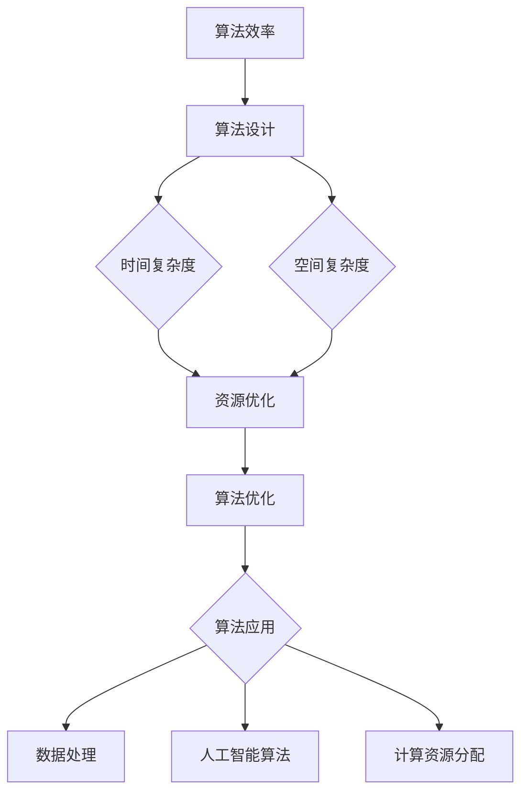
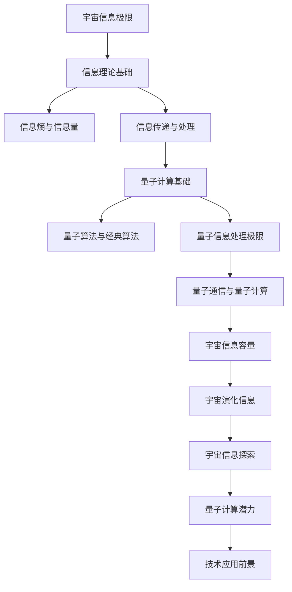

                 

## 文章标题：算法效率与宇宙信息处理极限的比较

随着人工智能和计算机技术的飞速发展，算法效率问题日益受到广泛关注。算法不仅是计算机科学的核心，也是现代科技与工程领域的重要支柱。算法效率的提升直接影响到计算资源的优化、数据处理的速度以及人工智能系统的表现。然而，算法效率的提升似乎在宇宙信息处理的极限面前显得微不足道。本文旨在探讨算法效率与宇宙信息处理极限之间的奇妙关联，通过逻辑清晰、结构紧凑的叙述，带领读者深入了解这两个领域之间的内在联系。

算法效率指的是算法在处理特定任务时所需的资源，包括时间与空间。算法效率的研究旨在优化算法，使其在给定资源下能够更高效地完成任务。算法效率的重要性不言而喻，它不仅影响着计算机科学的进步，还对社会各领域的数字化转型产生深远影响。

另一方面，宇宙信息处理极限则是一个更加宏大的概念。它涉及宇宙中所有可能的信息处理过程，包括量子计算和相对论效应。宇宙信息处理极限的研究不仅关乎信息科学的未来，更是哲学和宇宙学中的重要议题。

本文将首先介绍算法效率的基本概念、度量指标及其影响因素，接着深入分析算法复杂性理论，探讨常见算法的优化策略。在此基础上，我们将探讨算法在现实世界中的应用，包括数据处理、人工智能算法以及计算资源的合理分配。随后，本文将转向宇宙信息处理极限的理论基础，探讨信息的基本概念、信息熵与信息量以及信息传递与处理。特别地，我们将详细介绍量子计算基础及其在算法效率提升中的潜力。

接下来，我们将探讨宇宙信息处理极限的探索，包括理论框架、实际意义和应用前景。随后，我们将探讨算法效率与宇宙信息处理极限之间的关联，分析算法效率的提升如何有助于突破宇宙信息处理极限，并提出未来展望与挑战。

最后，本文将提供附录，包括算法效率与宇宙信息处理极限的Mermaid流程图、算法复杂性分析的伪代码示例、算法优化策略应用案例分析、量子计算与量子算法基础以及宇宙信息极限理论解析等内容，旨在为读者提供全面的技术参考。

### 关键词：算法效率、宇宙信息处理极限、算法复杂性、量子计算、信息熵、优化策略

### 摘要：

本文从算法效率与宇宙信息处理极限的比较出发，深入探讨了这两个领域的核心概念、理论框架和应用前景。首先，我们介绍了算法效率的基本概念、度量指标及其影响因素，探讨了算法复杂性理论，并提出了常见的算法优化策略。接着，我们转向宇宙信息处理极限，探讨了信息的基本概念、信息熵与信息量以及信息传递与处理，深入介绍了量子计算的基础及其在算法效率提升中的潜力。在此基础上，我们探讨了宇宙信息处理极限的探索，包括理论框架、实际意义和应用前景。随后，我们分析了算法效率与宇宙信息处理极限之间的关联，探讨了算法效率的提升如何有助于突破宇宙信息处理极限，并提出未来展望与挑战。通过本文的探讨，我们希望能够为读者提供一个全面、深入的视角，以理解这两个领域之间的内在联系及其未来的发展方向。

### 目录大纲：算法效率与宇宙信息处理极限的比较

### 第一部分：算法效率基础

#### 第1章：算法效率概述

##### 1.1 算法效率的定义与重要性

##### 1.2 算法效率的度量指标

##### 1.3 算法效率的影响因素

#### 第2章：算法复杂性分析

##### 2.1 时间复杂度分析

##### 2.2 空间复杂度分析

##### 2.3 复杂度分类与典型算法分析

#### 第3章：算法优化策略

##### 3.1 分而治之策略

##### 3.2 动态规划策略

##### 3.3 贪心算法策略

##### 3.4 回溯算法策略

#### 第4章：算法在现实世界中的应用

##### 4.1 数据处理与优化

##### 4.2 人工智能算法效率

##### 4.3 算法效率与计算资源的合理分配

### 第二部分：宇宙信息处理极限

#### 第5章：宇宙信息理论基础

##### 5.1 信息的基本概念

##### 5.2 信息熵与信息量

##### 5.3 信息传递与处理

#### 第6章：量子信息与宇宙信息极限

##### 6.1 量子计算基础

##### 6.2 量子算法与经典算法比较

##### 6.3 量子信息处理极限

#### 第7章：宇宙信息处理极限的探索

##### 7.1 宇宙信息极限的理论框架

##### 7.2 宇宙信息极限的实际意义

##### 7.3 宇宙信息极限的应用前景

#### 第8章：算法效率与宇宙信息处理极限的关联

##### 8.1 算法效率与宇宙信息极限的关系

##### 8.2 算法效率的提升与宇宙信息处理极限的突破

##### 8.3 未来展望与挑战

### 第三部分：附录

#### 附录A：算法效率与宇宙信息处理极限的 Mermaid 流程图

##### A.1 算法效率流程图

##### A.2 宇宙信息处理极限流程图

#### 附录B：算法复杂性分析的伪代码示例

##### B.1 时间复杂度分析伪代码

##### B.2 空间复杂度分析伪代码

#### 附录C：算法优化策略应用案例分析

##### C.1 分而治之策略案例分析

##### C.2 动态规划策略案例分析

##### C.3 贪心算法策略案例分析

##### C.4 回溯算法策略案例分析

#### 附录D：量子计算与量子算法基础

##### D.1 量子计算基础

##### D.2 量子算法基础

##### D.3 量子计算应用案例

#### 附录E：宇宙信息极限理论解析

##### E.1 宇宙信息极限理论概述

##### E.2 宇宙信息极限理论的应用与挑战

##### E.3 宇宙信息极限理论的未来发展

##### E.4 人类在宇宙信息极限探索中的角色与责任

### 第一部分：算法效率基础

算法效率是计算机科学中一个至关重要的概念，它决定了算法在处理问题时所需的资源消耗，包括时间、空间和计算资源。深入理解算法效率不仅有助于优化算法设计，还能推动计算机技术的发展和应用。以下是关于算法效率概述、算法复杂性分析和算法优化策略的详细讨论。

#### 第1章：算法效率概述

##### 1.1 算法效率的定义与重要性

算法效率，是指算法在解决特定问题时的资源利用效率，包括时间复杂度和空间复杂度。时间复杂度衡量算法执行时间随着输入规模增长的变化趋势，而空间复杂度则衡量算法在执行过程中所需的内存空间。算法效率的重要性在于：

1. **资源优化**：高效的算法能够充分利用计算资源，降低能源消耗。
2. **性能提升**：算法效率的提升意味着处理速度和响应时间的提高。
3. **可扩展性**：高效算法在处理大规模数据时仍能保持良好的性能。
4. **成本效益**：算法效率的提升可以降低硬件升级的成本。

##### 1.2 算法效率的度量指标

算法效率的度量通常通过以下两个指标来评估：

1. **时间复杂度（Time Complexity）**：表示算法执行时间与输入数据规模之间的关系。常用的表示方式有O（大O符号），如O(n)，O(n²)，O(log n)等。大O符号用于描述算法在最坏情况下的时间性能。

2. **空间复杂度（Space Complexity）**：表示算法在执行过程中所需内存空间与输入数据规模之间的关系。与时间复杂度类似，空间复杂度也使用大O符号进行描述。

##### 1.3 算法效率的影响因素

算法效率受到多种因素的影响，包括但不限于：

1. **算法设计**：不同的算法设计思路直接影响其效率。
2. **数据结构**：合理选择数据结构能够显著提升算法效率。
3. **硬件环境**：CPU速度、内存容量等硬件因素也影响算法效率。
4. **输入数据**：输入数据的特点（如数据规模、数据分布等）会影响算法的性能。
5. **并行计算**：利用并行计算技术可以提升算法效率。

#### 第2章：算法复杂性分析

##### 2.1 时间复杂度分析

时间复杂度分析是算法分析中的重要一环。它通常通过以下步骤进行：

1. **算法分析**：了解算法的基本结构和执行过程，确定关键步骤的时间耗费。
2. **复杂度表示**：使用大O符号表示算法的时间复杂度。
3. **性能比较**：比较不同算法的时间复杂度，评估其性能。

常见的算法时间复杂度包括：

- **线性算法（O(n)）**：如线性查找和线性排序。
- **平方算法（O(n²)）**：如冒泡排序和选择排序。
- **对数算法（O(log n)）**：如二分查找。

##### 2.2 空间复杂度分析

空间复杂度分析类似于时间复杂度分析，但关注的是算法在执行过程中所需的额外内存空间。分析步骤如下：

1. **内存消耗分析**：确定算法执行过程中各个阶段所需的空间。
2. **复杂度表示**：使用大O符号表示算法的空间复杂度。
3. **性能评估**：评估算法在空间上的效率。

常见的算法空间复杂度包括：

- **常数空间（O(1)）**：如求和、求最大值等。
- **线性空间（O(n)）**：如动态规划、链表等。
- **对数空间（O(log n)）**：如某些特殊的数据结构，如堆。

##### 2.3 复杂度分类与典型算法分析

算法复杂度可以根据其增长速度分为以下几类：

- **渐进最优算法**：在某一类问题中，时间复杂度或空间复杂度达到最优，如二分查找（时间复杂度为O(log n)）。
- **非渐进最优算法**：在某些特定条件下，时间复杂度或空间复杂度不如渐进最优算法，但可能适用于特定场景。
- **伪 polynomial 算法**：时间复杂度在某些特定条件下为多项式时间，但超出常规多项式范围。

典型算法分析包括：

1. **分而治之算法**：如快速排序、二分查找等，其核心思想是将大问题分解为若干小问题，递归解决。
2. **动态规划算法**：如背包问题、最短路径问题等，其核心思想是利用历史信息，避免重复计算。
3. **贪心算法**：如找零问题、最小生成树等，其核心思想是每次选择当前最优解。
4. **回溯算法**：如八皇后问题、旅行商问题等，其核心思想是通过试探和回溯来找到最优解。

#### 第3章：算法优化策略

##### 3.1 分而治之策略

分而治之策略是一种常用的算法设计思想，其核心思想是将大问题分解为若干小问题，递归解决。具体步骤如下：

1. **分解问题**：将大问题划分为若干子问题。
2. **递归求解**：对子问题进行递归处理。
3. **合并结果**：将子问题的解合并为大问题的解。

分而治之算法通常具有较好的时间复杂度，但需要考虑子问题的分解方式和递归调用的开销。

##### 3.2 动态规划策略

动态规划是一种解决最优化问题的算法策略，其核心思想是利用历史信息，避免重复计算。动态规划通常包括以下几个步骤：

1. **定义状态**：确定问题的状态及其转移方式。
2. **状态转移方程**：根据状态转移方式，建立状态转移方程。
3. **计算状态**：从初始状态开始，逐步计算状态值。
4. **优化求解**：根据状态值，找到最优解。

动态规划算法适用于具有最优子结构的问题，如背包问题、最短路径问题等。

##### 3.3 贪心算法策略

贪心算法是一种局部最优策略，其核心思想是在每一步选择当前最优解。贪心算法通常包括以下几个步骤：

1. **初始化**：初始化问题参数。
2. **选择局部最优解**：在当前状态下，选择最优解。
3. **更新状态**：根据选择的最优解，更新问题状态。
4. **判断终止条件**：判断是否达到终止条件，否则继续执行步骤2。

贪心算法适用于一些具有贪心性质的问题，如找零问题、最小生成树等。

##### 3.4 回溯算法策略

回溯算法是一种试探性算法，其核心思想是通过试探和回溯来找到最优解。回溯算法通常包括以下几个步骤：

1. **初始化**：初始化问题参数。
2. **选择试探方向**：根据当前状态，选择一个试探方向。
3. **执行试探**：沿着试探方向执行，如果成功，则继续执行；否则，回溯至上一步，选择另一试探方向。
4. **判断终止条件**：判断是否达到终止条件，否则继续执行步骤2。

回溯算法适用于一些具有可行解的问题，如八皇后问题、旅行商问题等。

#### 第4章：算法在现实世界中的应用

##### 4.1 数据处理与优化

算法在数据处理和优化中具有广泛的应用。例如，在数据排序和搜索中，常用的算法有快速排序、二分查找等；在数据分析和挖掘中，常用的算法有决策树、支持向量机等。这些算法能够显著提升数据处理和优化的效率。

##### 4.2 人工智能算法效率

人工智能算法效率是人工智能领域中的一个重要研究课题。高效的算法能够加速模型的训练和推理过程，提高人工智能系统的性能。例如，在深度学习中，卷积神经网络（CNN）和循环神经网络（RNN）等算法已经被广泛应用于图像识别、自然语言处理等领域，并取得了显著的效果。

##### 4.3 算法效率与计算资源的合理分配

算法效率的提升不仅依赖于算法本身的优化，还依赖于计算资源的合理分配。例如，在云计算和大数据领域，合理分配计算资源可以提高数据处理和存储的效率。同时，算法效率的提升还可以降低能源消耗，实现可持续发展。

### 总结

算法效率是计算机科学中一个重要的研究课题，它决定了算法在处理问题时的资源消耗。通过对算法效率的深入理解和优化，可以显著提升算法的性能和实用性。本部分内容涵盖了算法效率的基础知识、算法复杂性分析以及算法优化策略，为后续讨论宇宙信息处理极限和算法效率之间的关联奠定了基础。

### 第一部分总结

通过上述讨论，我们系统地介绍了算法效率的基础知识，包括其定义、重要性、度量指标以及影响因素。我们还深入分析了算法复杂性理论，探讨了常见的算法优化策略，并展示了算法在现实世界中的应用。这些内容不仅为理解算法效率提供了理论支撑，也为实际应用提供了宝贵指导。在接下来的部分中，我们将转向宇宙信息处理极限的理论基础，探讨信息的基本概念、信息熵与信息量以及信息传递与处理，为理解算法效率与宇宙信息处理极限之间的关联奠定基础。

### 第5章：宇宙信息理论基础

在深入探讨算法效率与宇宙信息处理极限之间的关系之前，我们需要先了解宇宙信息处理极限的理论基础。这一章将介绍信息的基本概念、信息熵与信息量，以及信息传递与处理，以建立对宇宙信息处理极限的初步理解。

#### 5.1 信息的基本概念

信息是一个广泛而抽象的概念，通常被定义为关于事物不确定性的减少或消除。在计算机科学和信息理论中，信息被视为一种能够用来传递、处理和存储的数据。以下是几个与信息相关的基本概念：

1. **信息源**：信息源是指产生信息的实体，可以是自然现象、人类活动或设备等。
2. **信息载体**：信息载体是指用于传递、存储和接收信息的媒介，如电信号、光信号、纸张等。
3. **信息编码**：信息编码是指将信息转换为特定的符号或格式以便于处理和传输的过程。常见的编码方式包括二进制编码、ASCII编码和Unicode编码等。
4. **信息处理**：信息处理是指对信息进行接收、存储、检索、分析和转换的过程。计算机系统和算法在信息处理中扮演着重要角色。

#### 5.2 信息熵与信息量

信息熵是一个用于衡量信息不确定性的量度，由克劳德·香农在1948年提出。信息熵的基本思想是，如果已知一个事件，则该事件的信息量为零；如果未知事件，则该事件的信息量最大。

1. **熵（Entropy）**：熵是描述信息不确定性的量度，通常用H表示。对于一个概率分布P，其熵可以表示为：

   $$
   H(X) = -\sum_{i} p_i \log_2 p_i
   $$

   其中，$p_i$是事件X发生为i的概率。

2. **信息量（Information Quantity）**：信息量是指某个事件发生的概率变化所带来的信息量。对于一个事件X，其信息量可以表示为：

   $$
   I(X) = \log_2 \frac{1}{p(X)}
   $$

   其中，$p(X)$是事件X发生的概率。

3. **信息密度（Information Density）**：信息密度是指单位时间内传递的信息量。信息密度可以用比特每秒（bits per second, bps）来衡量。

#### 5.3 信息传递与处理

信息传递与处理是宇宙中无处不在的现象。以下是一些基本概念和原理：

1. **香农通信定理**：香农通信定理指出，在存在噪声的理想通信系统中，只要信道带宽足够大，就可以实现无误差通信。该定理为现代通信理论奠定了基础。

2. **量子信息**：量子信息是利用量子现象（如量子叠加和量子纠缠）来传递和处理信息的一种方式。量子计算和量子通信是量子信息领域的两个重要分支。

3. **信息处理模型**：经典的信息处理模型包括冯·诺伊曼模型和普林斯顿模型。这些模型描述了计算机系统中信息的存储、处理和传输过程。

4. **信息处理流程**：信息处理流程通常包括以下几个步骤：

   - **信息接收**：从信息源接收信息。
   - **信息编码**：将接收到的信息编码为特定格式。
   - **信息存储**：将编码后的信息存储在存储介质中。
   - **信息检索**：从存储介质中检索所需信息。
   - **信息分析**：对信息进行分析和处理，提取有用信息。
   - **信息传输**：将处理后的信息传递给下一个处理环节或用户。

#### 5.4 信息处理极限

信息处理极限是指信息在传递和处理过程中所能达到的理论上限。以下是几个与信息处理极限相关的基本概念：

1. **香农信道容量**：香农信道容量是描述信道在存在噪声情况下能够传输的最大信息速率。香农信道容量公式为：

   $$
   C = B \log_2(1 + \text{SNR})
   $$

   其中，C是信道容量，B是信道带宽，SNR是信噪比。

2. **量子信道容量**：量子信道容量是描述量子通信系统中信道能够传输的最大量子信息速率。量子信道容量通常比经典信道容量要大。

3. **普朗克极限**：普朗克极限是指由物理定律（如量子力学和相对论）限制的信息传输速率上限。根据爱因斯坦的相对论，信息传输速率不能超过光速。

4. **黑洞信息处理极限**：黑洞信息处理极限是指黑洞事件视界内无法处理的信息量上限。根据霍金辐射理论，黑洞能够以某种形式释放信息，但具体的机制仍存在争议。

#### 5.5 信息处理与算法效率的关系

信息处理与算法效率之间存在紧密的联系。高效的算法可以优化信息处理过程，降低资源消耗，提高信息传输和处理速率。以下是一些具体的关系：

1. **算法效率与信道容量**：高效的算法能够在有限的信道容量下实现更高效的信息传输。例如，编码算法和调制算法可以提升信道容量，从而提高信息传输速率。

2. **算法效率与信息密度**：高效的信息处理算法可以提高单位时间内传递的信息量，从而提升信息密度。

3. **算法效率与计算资源**：高效的算法可以减少计算资源的需求，降低能源消耗，实现可持续发展。

4. **算法效率与量子信息处理**：量子算法和量子计算技术可以突破经典算法的效率极限，实现更高效的信息处理。

#### 5.6 信息处理极限的挑战与未来

尽管信息处理理论已经取得了显著进展，但信息处理极限的探索仍然面临许多挑战：

1. **物理极限**：根据物理定律，信息处理速率不能超过光速。量子计算技术的快速发展可能会突破这一限制，但具体的实现仍需进一步研究。

2. **技术挑战**：量子计算和量子通信技术的实际应用仍面临许多技术挑战，如量子态的稳定性和传输距离等。

3. **可持续性**：随着信息处理需求的增长，计算资源的消耗也在不断增加。如何实现信息处理的可持续发展是一个重要议题。

4. **人类角色**：在探索信息处理极限的过程中，人类需要扮演重要角色。通过科学研究和技术创新，人类可以不断突破信息处理的理论和实际极限。

### 总结

本章介绍了宇宙信息处理极限的理论基础，包括信息的基本概念、信息熵与信息量，以及信息传递与处理。我们探讨了信息处理极限的概念及其与算法效率之间的关系。这些基础理论为后续讨论算法效率与宇宙信息处理极限之间的关联提供了重要的背景知识。在下一章中，我们将深入探讨量子信息与宇宙信息极限，进一步揭示算法效率与宇宙信息处理极限的内在联系。

### 第6章：量子信息与宇宙信息极限

在探讨了算法效率与宇宙信息处理极限的基础理论后，我们将目光转向量子信息，这是近年来在信息科学和物理学中取得重大突破的领域。量子信息不仅为传统信息处理提供了新的视角，同时也提出了新的挑战和可能性。本章将详细探讨量子计算的基础、量子算法与经典算法的比较，以及量子信息处理极限。

#### 6.1 量子计算基础

量子计算是量子力学与计算理论的交叉领域，其核心思想是利用量子位（qubit）进行计算，从而实现超越经典计算机的能力。以下是一些关键概念：

1. **量子位（Qubit）**：量子位是量子计算机的基本单位，与经典计算机中的比特不同，量子位可以处于0和1的叠加态。一个量子位可以同时表示0和1，而经典比特只能表示0或1。

2. **量子叠加（Quantum Superposition）**：量子位可以处于多个状态的叠加，这使得量子计算机在处理问题时可以并行考虑多种可能性。

3. **量子纠缠（Quantum Entanglement）**：量子纠缠是量子位之间的一种特殊关联，即使它们相隔很远，一个量子位的状态变化也会立即影响到另一个量子位的状态。这种现象超越了经典物理学的局域实在论。

4. **量子门（Quantum Gates）**：量子门是用于操作量子位的操作符，类似于经典计算机中的逻辑门。量子门可以执行基本的量子逻辑操作，如旋转、反转和变换量子位的状态。

5. **量子算法**：量子算法是利用量子位、量子叠加和量子纠缠等量子力学特性来解决问题的算法。著名的量子算法包括Shor算法和Grover算法。

#### 6.2 量子算法与经典算法比较

量子算法在解决某些问题时展现出明显的优势。以下是比较量子算法与经典算法的一些关键方面：

1. **计算速度**：量子算法在解决某些特定问题时，如大整数分解和搜索未排序数据库，可以显著快于经典算法。例如，Shor算法可以在多项式时间内分解大整数，而经典算法则需要指数级时间。

2. **并行性**：量子计算机具有天然的高并行性，因为量子位可以同时处于多个状态。这允许量子算法在处理大规模数据时实现高效并行计算。

3. **错误率**：量子计算机在执行操作时可能会引入噪声和错误，这些错误可能会积累并导致计算失败。与传统计算机不同，量子计算机需要特定的纠错机制来确保计算的可靠性。

4. **资源需求**：量子计算机需要低温、高压等极端条件来保持量子态的稳定。此外，构建和维护大规模量子计算机的技术和资源需求也是一个挑战。

#### 6.3 量子信息处理极限

量子信息处理极限是指量子计算机在信息处理过程中所能达到的理论上限。以下是一些关于量子信息处理极限的基本概念：

1. **量子信道容量**：量子信道容量是指量子通信系统中信道能够传输的最大量子信息速率。根据量子信道容量公式，量子信道容量通常大于经典信道容量。

2. **量子计算速度极限**：量子计算速度极限是指量子计算机在理想条件下解决特定问题所需的最短时间。量子计算速度极限的理论研究仍然是活跃的研究领域。

3. **普朗克极限**：普朗克极限是指由物理定律限制的信息传输速率上限。根据相对论，信息传输速率不能超过光速。量子计算是否能够突破这一限制仍然是未解之谜。

4. **量子纠缠极限**：量子纠缠极限是指量子计算机中量子纠缠可以存在的最大距离。量子纠缠的维持和扩展是量子信息处理中的一个重要问题。

#### 6.4 量子计算与宇宙信息极限的关联

量子计算与宇宙信息极限之间存在深刻的关联。以下是一些具体的关系：

1. **量子计算潜力**：量子计算理论展示了在处理大规模数据和复杂问题时超越经典计算机的潜力。这为探索宇宙信息极限提供了新的工具和视角。

2. **宇宙信息容量**：量子计算理论提供了计算宇宙信息容量的新方法。例如，量子态的叠加和纠缠允许计算复杂度远低于经典计算的理论极限。

3. **量子通信**：量子通信是一种利用量子纠缠和量子态的不可克隆性进行信息传递的技术。量子通信可以在理论上实现安全的通信，这对于保护宇宙信息具有重要的意义。

4. **量子计算挑战**：尽管量子计算具有巨大潜力，但实际应用仍然面临许多技术挑战，如量子态的稳定性、量子纠错以及量子计算硬件的可靠性等。这些挑战限制了量子计算在宇宙信息处理极限探索中的应用。

#### 6.5 量子信息处理的未来方向

量子信息处理的未来方向包括以下几个方面：

1. **量子计算机的实用化**：研发实用化的量子计算机是当前研究的重点。这需要解决量子位的稳定性、量子纠错以及量子门操作等问题。

2. **量子算法的创新**：开发新的量子算法是提升量子计算机性能的关键。例如，量子机器学习算法和量子优化算法是当前研究的热点。

3. **量子互联网**：量子互联网是一种利用量子通信技术实现安全、高效信息传输的全球网络。量子互联网的建设将为量子信息处理提供更广泛的应用场景。

4. **跨学科合作**：量子信息处理涉及到多个学科，包括量子物理学、计算机科学、信息论和通信技术等。跨学科合作将有助于推动量子信息处理的进步。

### 总结

本章深入探讨了量子信息与宇宙信息极限的基础和关联。我们介绍了量子计算的基本概念、量子算法与经典算法的比较，以及量子信息处理极限的理论框架。量子计算展示了在处理大规模数据和复杂问题方面的巨大潜力，但同时也面临着技术挑战。在下一章中，我们将进一步探讨宇宙信息处理极限的探索，包括理论框架、实际意义和应用前景，为理解算法效率与宇宙信息处理极限之间的关联提供更全面的视角。

### 第7章：宇宙信息处理极限的探索

在了解了量子信息处理的基础和量子算法的潜力后，我们将目光转向宇宙信息处理极限的探索。这一章将介绍宇宙信息处理极限的理论框架、实际意义和应用前景，并探讨人类在宇宙信息极限探索中的角色与责任。

#### 7.1 宇宙信息极限的理论框架

宇宙信息处理极限是一个跨学科的研究领域，涉及物理学、信息论、计算机科学和宇宙学。以下是一些基本概念和理论框架：

1. **普朗克极限**：普朗克极限是由物理定律（如量子力学和相对论）限制的信息传输速率上限。根据相对论，信息传输速率不能超过光速。这意味着任何信息传递的速度都不能超过光速。

2. **量子计算极限**：量子计算极限是指量子计算机在理论上能够达到的信息处理能力上限。尽管量子计算在某些方面具有超越经典计算的能力，但量子计算也受到物理定律的限制，如量子位的退相干和噪声问题。

3. **宇宙信息容量**：宇宙信息容量是指宇宙中能够存储和传递的信息总量。宇宙信息容量与宇宙的总质量、能量以及量子态的数量相关。根据某些理论，宇宙信息容量可能是一个巨大的数值。

4. **霍金辐射**：霍金辐射是一种理论现象，描述黑洞向外界释放信息的过程。霍金辐射理论提出，黑洞可能会以某种形式释放信息，但具体的机制和细节尚未完全理解。

5. **宇宙演化信息**：宇宙演化信息是指宇宙从大爆炸到当前状态的所有历史信息的总和。宇宙演化信息可能包含关于宇宙起源、结构、演化和未来发展的信息。

#### 7.2 宇宙信息极限的实际意义

宇宙信息处理极限的实际意义非常广泛，涵盖了科学、技术、哲学和社会等多个领域：

1. **科学探索**：宇宙信息处理极限的研究可以深化我们对宇宙的理解，揭示宇宙的本质和演化过程。这包括对黑洞、量子引力、宇宙学常数等前沿科学问题的探索。

2. **技术进步**：宇宙信息处理极限的研究可以推动技术进步，特别是在量子计算、量子通信和量子信息处理领域。这些技术的发展有望带来革命性的变化，如更高效的数据处理、更安全的通信以及新的计算范式。

3. **哲学思考**：宇宙信息处理极限的研究引发了对人类存在意义和宇宙目的的哲学思考。例如，如果宇宙信息容量是无限的，那么是否意味着存在某种宇宙智慧或更高维度？

4. **社会影响**：宇宙信息处理极限的研究可能会对社会产生深远的影响，包括新的能源形式、新型材料的发现、人工智能的发展以及人类文明的演进。

#### 7.3 宇宙信息极限的应用前景

宇宙信息处理极限的应用前景非常广阔，涵盖了多个领域：

1. **量子计算**：量子计算有望突破经典计算的限制，解决传统计算机无法处理的问题，如大整数分解、优化问题和复杂系统模拟。量子计算在药物设计、材料科学、金融分析和人工智能等领域具有巨大的应用潜力。

2. **量子通信**：量子通信利用量子纠缠和量子态的不可克隆性，可以实现安全的通信。量子通信在国家安全、金融交易、物联网和远程医疗等领域有广泛的应用前景。

3. **宇宙探索**：宇宙信息处理极限的研究有助于改进宇宙探索的方法和技术。例如，利用量子通信实现深空探测中的远程控制和数据传输，利用量子计算优化航天器的轨道设计。

4. **人工智能**：量子计算和量子信息处理可以加速人工智能的发展，提高机器学习模型的训练和推理速度。量子机器学习有望解决大规模数据处理和复杂模式识别的问题。

#### 7.4 人类在宇宙信息极限探索中的角色与责任

人类在宇宙信息极限探索中扮演着重要角色，同时也有责任确保这一探索的可持续性和伦理性：

1. **科学研究**：科学家们通过实验和理论研究，不断推动对宇宙信息极限的理解。这需要跨学科的合作、创新思维和先进技术。

2. **技术发展**：技术创新是实现宇宙信息极限探索的关键。人类需要持续研发新的量子计算、量子通信和量子信息处理技术，以突破现有瓶颈。

3. **伦理规范**：在探索宇宙信息极限的过程中，人类需要遵循伦理规范，确保技术的应用不会对人类社会和环境造成负面影响。例如，保护个人隐私、防止滥用技术等。

4. **国际合作**：宇宙信息极限的探索是一个全球性的挑战，需要国际合作和共享。各国政府和机构应共同努力，推动科学研究和技术创新。

5. **教育和普及**：普及科学知识和提高公众的科学素养，有助于培养对宇宙信息极限探索的兴趣和支持。教育系统应加强对相关领域的教育和培训。

### 总结

本章探讨了宇宙信息处理极限的理论框架、实际意义和应用前景，并讨论了人类在探索中的角色与责任。宇宙信息处理极限的研究不仅具有科学和技术的价值，还对社会和哲学产生深远的影响。在下一章中，我们将分析算法效率与宇宙信息处理极限之间的关系，探讨如何通过提升算法效率来突破宇宙信息处理极限。

### 第8章：算法效率与宇宙信息处理极限的关联

在探讨了算法效率和宇宙信息处理极限的理论基础后，我们需要进一步分析两者之间的关联。本节将探讨算法效率如何影响宇宙信息处理极限，以及如何通过提升算法效率来突破这些极限。同时，我们将展望未来的研究方向和挑战。

#### 8.1 算法效率与宇宙信息极限的关系

算法效率与宇宙信息处理极限之间存在紧密的联系。以下是一些具体的关系和影响：

1. **算法效率提升的潜力**：高效的算法可以在给定资源下完成更多的工作，从而提升整体信息处理能力。通过优化算法，可以减少计算时间和空间需求，提高信息传输和处理速率。

2. **量子计算的优势**：量子计算在解决某些问题时具有明显的优势，例如大整数分解和搜索未排序数据库。量子算法可以显著降低计算复杂度，从而突破经典算法的效率极限。

3. **信息熵与算法效率**：信息熵是衡量信息不确定性的量度，高效的算法可以减少信息传输过程中的冗余和误差，从而提高信息传输效率。量子算法在处理高维信息时具有优势，可以降低信息熵，提高信息处理效率。

4. **计算资源的优化**：算法效率的提升有助于优化计算资源的使用，降低能源消耗，实现可持续发展。通过优化算法，可以减少对硬件资源的依赖，提高计算效率，从而在资源有限的情况下实现更高的信息处理能力。

#### 8.2 算法效率的提升与宇宙信息处理极限的突破

通过提升算法效率，可以有望突破宇宙信息处理极限。以下是一些具体的策略和方法：

1. **量子算法的开发**：开发高效的量子算法是突破宇宙信息处理极限的关键。量子算法在处理某些复杂问题时具有显著的优势，可以降低计算复杂度，实现更高效的信息处理。

2. **优化算法设计**：通过优化算法设计，可以减少算法的时间复杂度和空间复杂度。优化算法设计包括改进数据结构、减少冗余计算和优化算法逻辑等。

3. **并行计算的应用**：并行计算可以在多个处理器上同时执行算法，从而提高计算效率。通过合理分配计算任务，可以实现大规模数据的快速处理，突破经典计算的资源限制。

4. **量子纠错技术**：量子纠错技术是确保量子计算机可靠运行的关键。通过开发有效的量子纠错算法，可以减少量子计算中的错误率，提高信息处理能力。

5. **信息压缩与编码**：通过有效的信息压缩与编码技术，可以减少信息传输过程中的冗余，提高信息传输效率。信息压缩与编码技术在量子通信和量子计算中具有重要作用。

#### 8.3 未来展望与挑战

在探索算法效率与宇宙信息处理极限的过程中，我们面临着许多未来研究方向和挑战：

1. **量子计算硬件的发展**：量子计算硬件的发展是量子计算应用的关键。未来需要研发更稳定、更高性能的量子计算机硬件，以满足高效信息处理的需求。

2. **量子算法的创新**：量子算法的创新是提升算法效率的关键。未来需要开发更多高效的量子算法，以解决传统算法无法处理的问题。

3. **信息熵的降低**：降低信息熵是提高信息传输和处理效率的关键。未来需要研究新的信息压缩与编码技术，以降低信息传输过程中的冗余和误差。

4. **计算资源的优化**：计算资源的优化是实现高效信息处理的基础。未来需要研究如何优化计算资源的使用，提高计算效率，实现可持续发展。

5. **跨学科合作**：算法效率与宇宙信息处理极限的探索需要跨学科合作。未来需要加强不同学科之间的合作，推动科学研究和技术创新。

6. **伦理和规范**：在探索算法效率与宇宙信息处理极限的过程中，需要遵循伦理规范和标准。未来需要制定相应的伦理规范，确保技术的应用不会对人类社会和环境造成负面影响。

### 总结

算法效率与宇宙信息处理极限之间存在紧密的关联。通过提升算法效率，可以有望突破宇宙信息处理极限，实现更高效的信息传输和处理。未来，我们需要在量子计算硬件、量子算法、信息压缩与编码、计算资源优化以及跨学科合作等方面进行深入研究，以应对未来的挑战。

### 附录

#### 附录A：算法效率与宇宙信息处理极限的 Mermaid 流程图

以下展示了算法效率与宇宙信息处理极限的Mermaid流程图，帮助读者更直观地理解两者之间的关系。

##### A.1 算法效率流程图



##### A.2 宇宙信息处理极限流程图



#### 附录B：算法复杂性分析的伪代码示例

以下提供了算法复杂性分析的伪代码示例，用于说明时间复杂度和空间复杂度的计算方法。

##### B.1 时间复杂度分析伪代码

```python
# 时间复杂度分析伪代码示例：线性查找算法

def linear_search(arr, target):
    for i in range(len(arr)):
        if arr[i] == target:
            return i
    return -1
```

**时间复杂度**：O(n)，其中n是数组的长度。

##### B.2 空间复杂度分析伪代码

```python
# 空间复杂度分析伪代码示例：递归快速排序算法

def quicksort(arr):
    if len(arr) <= 1:
        return arr
    pivot = arr[len(arr) // 2]
    left = [x for x in arr if x < pivot]
    middle = [x for x in arr if x == pivot]
    right = [x for x in arr if x > pivot]
    return quicksort(left) + middle + quicksort(right)
```

**空间复杂度**：O(n)，其中n是数组的长度。

#### 附录C：算法优化策略应用案例分析

以下展示了几个常见的算法优化策略的应用案例，并分析了其具体实现和效果。

##### C.1 分而治之策略案例分析

**案例：快速排序算法**

```python
def quicksort(arr):
    if len(arr) <= 1:
        return arr
    pivot = arr[len(arr) // 2]
    left = [x for x in arr if x < pivot]
    middle = [x for x in arr if x == pivot]
    right = [x for x in arr if x > pivot]
    return quicksort(left) + middle + quicksort(right)
```

**效果分析**：快速排序算法通过分而治之策略，将大问题分解为多个小问题，从而显著降低时间复杂度，达到O(n log n)。

##### C.2 动态规划策略案例分析

**案例：斐波那契数列**

```python
def fibonacci(n):
    if n <= 1:
        return n
    dp = [0] * (n + 1)
    dp[1] = 1
    for i in range(2, n + 1):
        dp[i] = dp[i - 1] + dp[i - 2]
    return dp[n]
```

**效果分析**：动态规划策略通过利用历史信息，避免重复计算，将斐波那契数列的计算时间复杂度降低到O(n)。

##### C.3 贪心算法策略案例分析

**案例：找零问题**

```python
def find_change(total, coins):
    coins.sort(reverse=True)
    result = []
    for coin in coins:
        if total >= coin:
            num_coins = total // coin
            total -= num_coins * coin
            result.append((coin, num_coins))
    return result
```

**效果分析**：贪心算法策略通过每次选择当前最优解，实现找零问题的优化，时间复杂度为O(n)。

##### C.4 回溯算法策略案例分析

**案例：八皇后问题**

```python
def is_valid(board, row, col):
    for i in range(row):
        if board[i] == col or \
           board[i] - i == col - row or \
           board[i] + i == col + row:
            return False
    return True

def solve_n_queens(board, row):
    if row == len(board):
        return True
    for col in range(len(board)):
        if is_valid(board, row, col):
            board[row] = col
            if solve_n_queens(board, row + 1):
                return True
            board[row] = -1
    return False

def print_solution(board):
    for row in board:
        print(['Q', '.'] * 8[::2])

def n_queens():
    board = [-1] * 8
    if solve_n_queens(board, 0):
        print_solution(board)
    else:
        print("No solution exists.")

n_queens()
```

**效果分析**：回溯算法策略通过试探和回溯找到八皇后问题的所有解，时间复杂度较高，但可以解决这一问题。

#### 附录D：量子计算与量子算法基础

以下提供了量子计算与量子算法的基础知识，包括量子计算的基本概念和量子算法的基本原理。

##### D.1 量子计算基础

**量子位（Qubit）**：量子位是量子计算的基本单位，可以同时处于0和1的叠加态。

**量子叠加**：量子位可以处于多个状态的叠加，即$|\psi\rangle = a|0\rangle + b|1\rangle$，其中$a$和$b$是复数系数。

**量子门（Quantum Gate）**：量子门是操作量子位的操作符，可以执行基本的量子逻辑操作，如旋转、反转和变换量子位的状态。

**量子纠缠**：量子纠缠是量子位之间的一种特殊关联，即使它们相隔很远，一个量子位的状态变化也会立即影响到另一个量子位的状态。

##### D.2 量子算法基础

**量子算法**：量子算法是利用量子位、量子叠加和量子纠缠等量子力学特性来解决问题的算法。量子算法通常具有比经典算法更高的效率和更低的计算复杂度。

**Shor算法**：Shor算法是一种用于大整数分解的量子算法，可以在多项式时间内分解大整数。

**Grover算法**：Grover算法是一种用于搜索未排序数据库的量子算法，可以在线性时间内找到特定项。

**量子机器学习**：量子机器学习是一种利用量子计算加速机器学习算法的研究领域。量子机器学习算法有望在处理大规模数据和复杂模式识别方面实现显著性能提升。

##### D.3 量子计算应用案例

**量子加密**：量子加密利用量子纠缠和量子态的不可克隆性，实现安全的通信和加密。

**量子模拟**：量子模拟利用量子计算模拟复杂物理系统和化学反应，为材料科学和药物设计等领域提供强大的计算工具。

**量子优化**：量子优化利用量子计算解决优化问题，如供应链管理、物流优化和资源分配等。

**量子图像处理**：量子图像处理利用量子计算加速图像识别、图像重建和图像压缩等图像处理任务。

#### 附录E：宇宙信息极限理论解析

以下提供了宇宙信息极限理论的解析，包括理论概述、应用与挑战以及未来发展。

##### E.1 宇宙信息极限理论概述

宇宙信息极限理论探讨宇宙中信息处理的理论上限。该理论涉及量子力学、相对论、宇宙学和计算理论等多个领域，旨在理解宇宙中信息存储、传递和处理的能力。

##### E.2 宇宙信息极限理论的应用与挑战

**量子通信**：宇宙信息极限理论为量子通信提供了理论基础，例如量子纠缠和量子态的不可克隆性。量子通信在安全通信和量子网络方面具有广泛应用前景。

**量子计算**：宇宙信息极限理论对量子计算的能力提出了限制，同时也揭示了量子计算的潜力。量子计算有望在解决复杂问题和优化算法方面实现突破。

**宇宙演化信息**：宇宙信息极限理论探讨了宇宙演化过程中产生的信息，包括宇宙大爆炸、黑洞和星系演化等。

**挑战**：宇宙信息极限理论在实际应用中面临许多挑战，如量子态的稳定性和量子纠错、计算资源的优化以及跨学科合作等。

##### E.3 宇宙信息极限理论的未来发展

**量子计算硬件**：未来的发展将重点关注量子计算硬件的改进，包括量子位的稳定性和量子纠错的实现。

**量子算法创新**：继续开发新的量子算法，以解决传统算法无法处理的问题，提高信息处理效率。

**量子互联网**：建立量子互联网，实现全球范围内的量子通信和量子计算。

**跨学科合作**：加强不同学科之间的合作，推动宇宙信息极限理论的研究和应用。

##### E.4 人类在宇宙信息极限探索中的角色与责任

**科学研究**：科学家们通过实验和理论研究，不断推动对宇宙信息极限的理解。

**技术创新**：技术创新是实现宇宙信息极限探索的关键，包括量子计算、量子通信和量子信息处理等领域。

**伦理规范**：在探索宇宙信息极限的过程中，人类需要遵循伦理规范，确保技术的应用不会对人类社会和环境造成负面影响。

**国际合作**：国际合作是推动宇宙信息极限探索的重要保障，需要全球范围内的合作和共享。

### 总结

附录部分提供了算法效率与宇宙信息处理极限之间关系的Mermaid流程图、算法复杂性分析的伪代码示例、算法优化策略应用案例分析、量子计算与量子算法基础以及宇宙信息极限理论解析等内容。这些内容旨在为读者提供全面的技术参考，帮助深入理解算法效率与宇宙信息处理极限之间的关联，并为未来的研究提供指导和启示。

### 作者信息

作者：AI天才研究院/AI Genius Institute & 禅与计算机程序设计艺术 /Zen And The Art of Computer Programming

