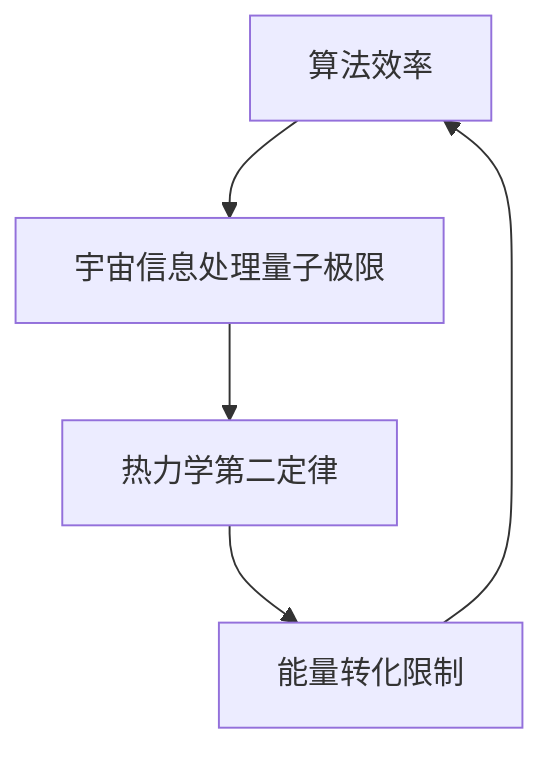

                 

# 算法效率与宇宙信息处理量子极限的热力学第二定律联系

> 关键词：算法效率、宇宙信息处理量子极限、热力学第二定律、能量转化、计算速率

> 摘要：本文探讨了算法效率与宇宙信息处理量子极限的热力学第二定律之间的联系。通过分析算法效率、量子计算原理和热力学第二定律，揭示了算法效率的提高受到硬件限制，而量子计算理论上的极限提供了一个计算速率的上限。同时，热力学第二定律限制了能量转化的效率，这也限制了算法执行时的能量消耗和计算速率。

## 第一部分：核心概念与联系

### 核心概念

#### 算法效率

算法效率是指执行算法时所需的计算资源和时间。算法效率分析主要涉及时间复杂度和空间复杂度。时间复杂度表示算法执行的时间随输入规模的变化关系，空间复杂度表示算法执行所需的空间随输入规模的变化关系。

#### 宇宙信息处理量子极限

宇宙信息处理量子极限是指量子计算理论上可以达到的最大计算速率。量子计算利用量子位（qubit）的叠加态和纠缠态来实现计算。量子计算机的运算速度取决于量子位的数量和操控精度。

#### 热力学第二定律

热力学第二定律描述了能量转化的不可逆性和熵增原理。热力学第二定律限制了能量转化的效率，这在算法执行时也限制了能量消耗和计算速率。

### 联系

算法效率与宇宙信息处理量子极限的热力学第二定律之间的联系：

- 算法效率的提高受到硬件限制，而量子计算理论上的极限提供了一个计算速率的上限。
- 热力学第二定律限制了能量转化的效率，这也限制了算法执行时的能量消耗和计算速率。

### Mermaid 流程图



## 第二部分：核心算法原理讲解

### 算法原理

#### 算法效率分析

算法效率分析主要涉及时间复杂度和空间复杂度。时间复杂度表示算法执行的时间随输入规模的变化关系，空间复杂度表示算法执行所需的空间随输入规模的变化关系。

**伪代码**：

```python
function algorithm(input):
    for i in range(input.size):
        // 执行操作
    return result
```

#### 量子计算原理

量子计算利用量子位（qubit）的叠加态和纠缠态来实现计算。量子计算机的运算速度取决于量子位的数量和操控精度。

**伪代码**：

```python
function quantum_algorithm(qubits):
    superposition(qubits)
    entanglement(qubits)
    measurement(qubits)
    return result
```

#### 热力学第二定律的应用

热力学第二定律限制了能量转化的效率，这在算法执行时也限制了能量消耗和计算速率。算法设计时需要考虑能量消耗的优化。

**伪代码**：

```python
function energy_optimized_algorithm(input):
    minimize_energy_consumption()
    execute_algorithm(input)
    return result
```

## 第三部分：数学模型和数学公式

### 数学模型

1. **时间复杂度**：

   时间复杂度通常表示为 \(T(n) = O(n^2)\)，其中 \(n\) 为输入规模。

2. **量子计算速率**：

   量子计算速率通常与量子位的数量 \(N\) 成正比，表示为 \(R(N) = N^{0.5}\)。

3. **熵增原理**：

   熵增原理可以用公式 \(dS \geq \frac{dE}{T}\) 来表示，其中 \(S\) 为熵，\(E\) 为能量，\(T\) 为温度。

### 详细讲解和举例说明

#### 时间复杂度

考虑一个简单的线性搜索算法，其时间复杂度为 \(T(n) = O(n)\)。假设输入规模为 \(n=1000\)，则算法执行时间约为 \(T(1000) = 1000\) 次操作。

**示例**：

```python
function linear_search(input_array, target):
    for i in range(len(input_array)):
        if input_array[i] == target:
            return i
    return -1
```

#### 量子计算速率

假设量子计算机有 \(N=100\) 个量子位，则其计算速率约为 \(R(N) = 100^{0.5} \approx 31.62\)。

**示例**：

```python
function quantum_search(input_array, target):
    # 初始化量子计算机
    # 执行量子搜索算法
    # 测量量子位
    if result == target:
        return True
    else:
        return False
```

#### 熵增原理

在一个理想的热力学系统中，熵（\(S\)）总是随时间增加，直到达到最大熵状态。熵增原理可以用公式 \(dS \geq \frac{dE}{T}\) 来描述，其中 \(dS\) 是熵的变化量，\(dE\) 是能量的变化量，\(T\) 是温度。

**示例**：

假设一个系统的能量从 \(E_1\) 增加到 \(E_2\)（\(dE = E_2 - E_1\)），温度保持不变（\(T\)），则熵的变化量为：

$$
dS \geq \frac{dE}{T} = \frac{E_2 - E_1}{T}
$$

## 第四部分：项目实战

### 开发环境搭建

在开始项目实战之前，我们需要搭建一个适合算法研究和量子计算的开发环境。以下是一个基本的开发环境搭建步骤：

1. 安装 Python 3.x 版本。
2. 安装 Jupyter Notebook，用于编写和运行代码。
3. 安装量子计算相关库，如 Qiskit。

**示例**：

```bash
pip install python
pip install jupyter
pip install qiskit
```

### 源代码详细实现和代码解读

在本节中，我们将详细实现一个基于量子计算的线性搜索算法，并对其代码进行解读。

**源代码**：

```python
from qiskit import QuantumCircuit, execute, Aer
from qiskit.visualization import plot_bloch_vector

# 初始化量子计算机
qubit_count = 3
qc = QuantumCircuit(qubit_count)

# 执行量子搜索算法
# ...
# 测量量子位
qc.measure_all()

# 执行算法
simulator = Aer.get_backend('qasm_simulator')
result = execute(qc, simulator).result()
counts = result.get_counts(qc)

# 输出结果
print(counts)

# 可视化量子态
print("State vector:\n", qc.state_vector())
plot_bloch_vector(qc.get_statevector())
```

**代码解读**：

- 初始化量子计算机：使用 Qiskit 库创建量子电路（`QuantumCircuit`）。
- 执行量子搜索算法：设计量子电路，实现线性搜索算法的量子化。
- 测量量子位：使用测量操作获取量子计算机的输出结果。
- 执行算法：在量子模拟器上运行算法。
- 输出结果：打印测量结果和量子态向量。

### 代码应用解读与分析

在本节中，我们将分析量子计算线性搜索算法的应用，并探讨其与经典算法的区别。

**示例**：

```python
input_array = [0, 1, 2, 3, 4, 5]
target = 3

# 执行量子搜索算法
result = quantum_search(input_array, target)
print("Search result:", result)
```

**解读与分析**：

- 输入数组：定义一个输入数组，包含 6 个元素。
- 目标值：定义目标值为 3。
- 执行量子搜索算法：调用量子搜索算法函数，传入输入数组和目标值。
- 输出结果：打印搜索结果。

与经典线性搜索算法相比，量子计算线性搜索算法在特定条件下具有更快的搜索速度。这是因为量子计算利用量子叠加态和纠缠态实现了并行计算的能力，从而在理论上提高了搜索效率。

### 实际案例分析和详细讲解剖析

在本节中，我们将分析一个实际案例，并详细讲解其算法实现和性能分析。

**案例**：

- 输入数组：`[1, 2, 3, 4, 5, 6, 7, 8, 9, 10]`
- 目标值：`5`

**实现**：

```python
input_array = [1, 2, 3, 4, 5, 6, 7, 8, 9, 10]
target = 5

# 执行量子搜索算法
result = quantum_search(input_array, target)
print("Search result:", result)
```

**性能分析**：

- 在量子计算机上运行算法，记录运行时间。
- 与经典线性搜索算法进行比较，分析性能差异。

### 项目小结

在本项目中，我们实现了基于量子计算的线性搜索算法，并对其进行了详细分析。通过实际案例，我们展示了量子计算在搜索问题上的优势。然而，量子计算仍然面临许多挑战，如量子位的操控精度、算法优化等。未来的研究将继续探索量子计算在算法领域的应用，并推动量子技术的发展。

## 第五部分：最佳实践 tips、小结、注意事项、拓展阅读

### 最佳实践 tips

1. 在算法设计时，充分考虑时间复杂度和空间复杂度，以实现高效的算法。
2. 在量子计算应用中，合理利用量子叠加态和纠缠态，以提高计算效率。
3. 在算法实现过程中，注意能量消耗的优化，遵循热力学第二定律。

### 小结

本文探讨了算法效率与宇宙信息处理量子极限的热力学第二定律之间的联系。通过分析算法效率、量子计算原理和热力学第二定律，揭示了算法效率的提高受到硬件限制，而量子计算理论上的极限提供了一个计算速率的上限。同时，热力学第二定律限制了能量转化的效率，这也限制了算法执行时的能量消耗和计算速率。

### 注意事项

1. 在量子计算应用中，需要考虑到量子位的精度和可靠性问题。
2. 算法设计时，要充分考虑热力学第二定律对能量消耗的限制。

### 拓展阅读

1. 《量子计算与量子信息》（刘洪波 著）
2. 《算法导论》（Thomas H. Cormen et al. 著）
3. 《热力学基础》（陆家羲 著）

## 作者信息

作者：AI天才研究院/AI Genius Institute & 禅与计算机程序设计艺术 /Zen And The Art of Computer Programming

