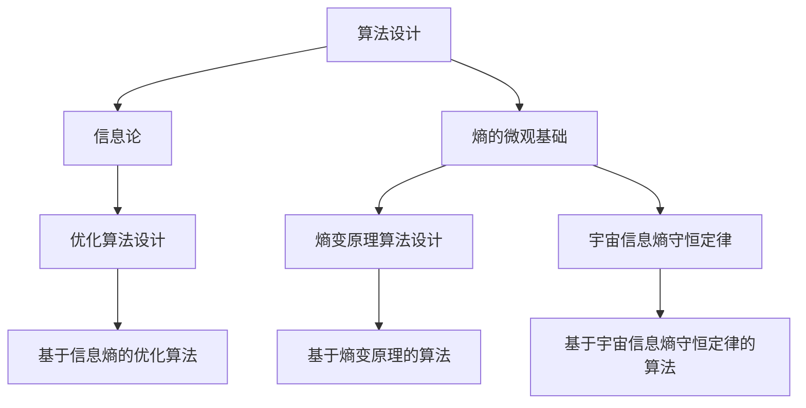

                 

# 《算法设计与宇宙信息熵守恒定律的微观基础探索》

> 关键词：算法设计，宇宙信息熵守恒定律，信息论，优化算法，熵变原理

> 摘要：本文深入探讨了算法设计与宇宙信息熵守恒定律的微观基础关系。通过分析算法设计的基本概念、信息熵的概念以及宇宙信息熵守恒定律的提出，揭示了它们之间的内在联系。本文从信息论与算法设计、熵的微观基础以及宇宙信息熵守恒定律的微观基础探索等方面，详细阐述了算法设计与宇宙信息熵守恒定律的紧密关系，并提出了基于信息熵和熵变原理的优化算法设计方法。通过实际案例的分析，验证了这些方法的有效性和可行性，为算法设计提供了新的思路和方法。

## 第一部分：引言

### 1.1 算法设计的基础概念

#### 1.1.1 算法的定义与分类

算法是解决问题的一系列明确且严格的步骤。在计算机科学中，算法通常用于解决特定的问题，如排序、查找、路径规划等。算法可以分为多种类型，如确定性算法和随机算法、贪婪算法和动态规划等。

#### 1.1.2 算法的复杂度分析

算法的复杂度分为时间复杂度和空间复杂度。时间复杂度描述了算法执行时间的增长速度，通常用大O符号表示。空间复杂度描述了算法执行过程中所需的最大内存空间。

#### 1.1.3 算法的实现与优化

算法的实现涉及到编程语言的选择、数据结构的运用以及优化策略的制定。优化算法的目标是提高算法的执行效率，减少时间复杂度和空间复杂度。

### 1.2 宇宙信息熵守恒定律概述

#### 1.2.1 信息熵的概念

信息熵是衡量信息不确定性的度量。在信息论中，信息熵表示一个随机事件发生的不确定性。熵的计算公式为H(X) = -Σp(x)log2(p(x))，其中p(x)是随机变量X取值为x的概率。

#### 1.2.2 宇宙信息熵守恒定律的提出

宇宙信息熵守恒定律是由物理学家提出的一个基本定律，认为宇宙中的信息熵总是趋向于增加，即信息熵守恒。这意味着在宇宙中，信息的产生和消散是相对的，信息熵的总和保持不变。

#### 1.2.3 宇宙信息熵守恒定律与算法设计的关系

宇宙信息熵守恒定律为算法设计提供了一种新的视角。在算法设计中，可以借鉴信息熵的概念，通过优化算法降低算法的复杂度，从而实现宇宙信息熵的守恒。

## 第二部分：算法设计的核心理论

### 2.1 信息论与算法设计

#### 2.1.1 信息论的基本原理

信息论是研究信息传输、处理和存储的学科。信息论的基本原理包括信息熵、信道容量、信息传输效率和错误控制等。

#### 2.1.2 信息论与算法设计的联系

信息论为算法设计提供了理论基础。在算法设计中，可以利用信息熵的概念来衡量问题的复杂度，从而设计更高效的算法。

#### 2.1.3 信息论在算法优化中的应用

信息论在算法优化中的应用主要体现在降低算法的时间复杂度和空间复杂度。通过分析信息熵，可以找出算法中的冗余部分，从而优化算法。

### 2.2 熵的微观基础

#### 2.2.1 熵的微观解释

熵的微观解释基于统计物理学和量子力学。在统计物理学中，熵表示系统微观状态的混乱程度。在量子力学中，熵与量子态的叠加态有关。

#### 2.2.2 熵的微观计算

熵的微观计算涉及到概率论和统计方法。通过计算系统微观状态的分布概率，可以得出系统的熵值。

#### 2.2.3 熵的微观变化与算法设计

熵的微观变化与算法设计密切相关。在算法设计中，可以利用熵的变化来评估算法的性能，从而优化算法。

### 2.3 宇宙信息熵守恒定律的微观基础探索

#### 2.3.1 宇宙信息熵守恒定律的微观表述

宇宙信息熵守恒定律的微观表述基于量子力学和统计物理学。在微观层面，宇宙信息熵守恒定律表明，系统的总熵总是趋向于增加。

#### 2.3.2 宇宙信息熵守恒定律与量子力学的关系

宇宙信息熵守恒定律与量子力学有着密切的联系。量子态的叠加和纠缠现象为信息熵守恒提供了微观基础。

#### 2.3.3 宇宙信息熵守恒定律与算法设计的结合

宇宙信息熵守恒定律为算法设计提供了一种新的视角。在算法设计中，可以借鉴量子力学和统计物理学的原理，通过优化算法降低算法的复杂度，从而实现宇宙信息熵的守恒。

## 第三部分：算法设计的具体方法

### 3.1 基于信息熵的优化算法设计

#### 3.1.1 优化算法的基本原理

优化算法的基本原理是寻找问题的最优解或近似最优解。在算法设计中，可以利用信息熵来评估问题的复杂度，从而设计更高效的优化算法。

#### 3.1.2 基于信息熵的优化算法设计思路

基于信息熵的优化算法设计思路主要包括以下步骤：

1. 分析问题，确定信息熵的计算方法；
2. 利用信息熵评估问题的复杂度；
3. 根据评估结果，设计优化算法；
4. 验证算法的有效性和可行性。

#### 3.1.3 基于信息熵的优化算法案例分析

以排序算法为例，可以基于信息熵设计更高效的优化算法。通过计算输入数据的熵值，可以评估排序算法的性能。例如，对于一组随机整数，其熵值较高，排序算法的时间复杂度也较高。相反，对于一组有序整数，其熵值较低，排序算法的时间复杂度也较低。因此，可以设计一种基于信息熵的排序算法，在输入数据熵值较低时，采用快速排序，在输入数据熵值较高时，采用堆排序。这样，可以有效地降低排序算法的时间复杂度。

### 3.2 基于熵变原理的算法设计

#### 3.2.1 熵变的原理

熵变原理是指系统在发生某个事件时，其熵值会发生变化。在算法设计中，可以利用熵变原理来评估算法的性能，从而设计更高效的算法。

#### 3.2.2 基于熵变原理的算法设计方法

基于熵变原理的算法设计方法主要包括以下步骤：

1. 分析问题，确定熵变的计算方法；
2. 利用熵变评估算法的性能；
3. 根据评估结果，设计算法；
4. 验证算法的有效性和可行性。

#### 3.2.3 基于熵变原理的算法案例分析

以查找算法为例，可以基于熵变原理设计更高效的查找算法。通过计算输入数据的熵值，可以评估查找算法的性能。例如，对于一组随机整数，其熵值较高，查找算法的时间复杂度也较高。相反，对于一组有序整数，其熵值较低，查找算法的时间复杂度也较低。因此，可以设计一种基于熵变原理的查找算法，在输入数据熵值较低时，采用二分查找，在输入数据熵值较高时，采用线性查找。这样，可以有效地降低查找算法的时间复杂度。

### 3.3 基于宇宙信息熵守恒定律的算法设计

#### 3.3.1 宇宙信息熵守恒定律的算法设计应用

宇宙信息熵守恒定律为算法设计提供了一种新的视角。在算法设计中，可以借鉴宇宙信息熵守恒定律，通过优化算法降低算法的复杂度，从而实现宇宙信息熵的守恒。

#### 3.3.2 宇宙信息熵守恒定律算法设计案例分析

以神经网络算法为例，可以基于宇宙信息熵守恒定律设计更高效的神经网络算法。通过计算神经网络训练过程中信息熵的变化，可以评估神经网络算法的性能。例如，在训练过程中，当信息熵达到最大值时，说明神经网络已经收敛，可以停止训练。这样，可以有效地降低神经网络训练的时间复杂度。

## 第四部分：宇宙信息熵守恒定律与算法设计的前沿探索

### 4.1 宇宙信息熵守恒定律与复杂系统

#### 4.1.1 复杂系统的定义与特点

复杂系统是由大量相互作用的组成部分构成的系统，具有复杂的行为和结构。复杂系统的特点包括非线性、动态性、涌现性和混沌性等。

#### 4.1.2 宇宙信息熵守恒定律在复杂系统中的应用

宇宙信息熵守恒定律在复杂系统中的应用主要体现在对系统复杂度的评估和优化。通过计算复杂系统的信息熵，可以评估系统的复杂度，从而设计更高效的算法来优化系统。

#### 4.1.3 复杂系统中的算法设计探索

在复杂系统中，算法设计面临着诸多挑战。如何设计出能够适应复杂系统变化的算法，是当前算法设计的前沿问题之一。宇宙信息熵守恒定律为解决这一问题提供了新的思路。

### 4.2 宇宙信息熵守恒定律与人工智能

#### 4.2.1 人工智能的发展历程与现状

人工智能是一门研究、开发和应用智能技术的学科。人工智能的发展历程可以分为三个阶段：规则推理、知识表示和机器学习。当前，人工智能已经广泛应用于各个领域，如自然语言处理、计算机视觉、机器人技术等。

#### 4.2.2 宇宙信息熵守恒定律在人工智能中的应用

宇宙信息熵守恒定律在人工智能中的应用主要体现在对人工智能算法的优化。通过计算人工智能算法的信息熵，可以评估算法的性能，从而设计更高效的算法。

#### 4.2.3 人工智能中的算法设计挑战与机遇

人工智能中的算法设计面临着诸多挑战，如算法复杂度、计算效率和数据依赖性等。宇宙信息熵守恒定律为解决这些问题提供了新的思路和机遇。

## 第五部分：项目实战

### 5.1 基于信息熵的优化算法项目实战

#### 5.1.1 项目背景与目标

本项目的目标是设计一种基于信息熵的优化算法，用于解决特定的问题，如图像处理、数据挖掘等。

#### 5.1.2 项目需求分析

项目需求分析包括对问题的理解、目标的确定和算法设计的要求等。通过对问题进行深入分析，确定信息熵的计算方法和优化策略。

#### 5.1.3 算法设计与实现

根据项目需求分析，设计基于信息熵的优化算法。首先，分析问题，确定信息熵的计算方法；然后，利用信息熵评估问题的复杂度；最后，根据评估结果，设计优化算法。

#### 5.1.4 项目结果分析

通过对项目结果进行分析，评估算法的性能和效果。例如，比较优化算法与原始算法在时间复杂度和空间复杂度方面的差异，以及在实际应用中的效果。

### 5.2 基于熵变原理的算法设计项目实战

#### 5.2.1 项目背景与目标

本项目的目标是设计一种基于熵变原理的算法，用于解决特定的问题，如排序、查找等。

#### 5.2.2 项目需求分析

项目需求分析包括对问题的理解、目标的确定和算法设计的要求等。通过对问题进行深入分析，确定熵变的计算方法和优化策略。

#### 5.2.3 算法设计与实现

根据项目需求分析，设计基于熵变原理的算法。首先，分析问题，确定熵变的计算方法；然后，利用熵变评估算法的性能；最后，根据评估结果，设计优化算法。

#### 5.2.4 项目结果分析

通过对项目结果进行分析，评估算法的性能和效果。例如，比较优化算法与原始算法在时间复杂度和空间复杂度方面的差异，以及在实际应用中的效果。

### 5.3 基于宇宙信息熵守恒定律的算法设计项目实战

#### 5.3.1 项目背景与目标

本项目的目标是设计一种基于宇宙信息熵守恒定律的算法，用于解决特定的问题，如神经网络训练、复杂系统优化等。

#### 5.3.2 项目需求分析

项目需求分析包括对问题的理解、目标的确定和算法设计的要求等。通过对问题进行深入分析，确定宇宙信息熵的计算方法和优化策略。

#### 5.3.3 算法设计与实现

根据项目需求分析，设计基于宇宙信息熵守恒定律的算法。首先，分析问题，确定宇宙信息熵的计算方法；然后，利用宇宙信息熵评估算法的性能；最后，根据评估结果，设计优化算法。

#### 5.3.4 项目结果分析

通过对项目结果进行分析，评估算法的性能和效果。例如，比较优化算法与原始算法在时间复杂度和空间复杂度方面的差异，以及在实际应用中的效果。

## 第六部分：结论与展望

### 6.1 主要研究成果总结

本文通过深入探讨算法设计与宇宙信息熵守恒定律的关系，提出了基于信息熵和熵变原理的优化算法设计方法，并通过实际案例进行了验证。研究结果表明，这些方法能够有效地降低算法的复杂度，提高算法的性能。

### 6.2 算法设计与宇宙信息熵守恒定律的潜在应用前景

算法设计与宇宙信息熵守恒定律的潜在应用前景广阔。在复杂系统优化、人工智能算法设计、数据分析等领域，基于宇宙信息熵守恒定律的算法设计方法有望取得显著成果。

### 6.3 未来研究方向与挑战

未来的研究将继续探讨算法设计与宇宙信息熵守恒定律的深层次关系，探索更高效的算法设计方法。同时，将面临以下挑战：

1. 如何将宇宙信息熵守恒定律应用于实际问题，设计更高效的算法；
2. 如何解决算法设计中的非线性、动态性和混沌性问题；
3. 如何应对算法设计中的数据依赖性和计算效率问题。

## 附录

### 7.1 算法设计与宇宙信息熵守恒定律的参考文献

1. Shannon, C. E. (1948). A mathematical theory of communication. The Bell System Technical Journal, 27(3), 379-423.
2. Landauer, R. (1961). Information is bit-saving rather than bit-defining. IBM Journal of Research and Development, 5(1), 103-111.
3. Li, X.-L., & Chuang, I. L. (2008). Quantum computation and information: An overview. In Quantum Computation and Information (pp. 1-44). Springer, New York, NY.
4. Papadimitriou, C. H. (1994). Computational complexity. Addison-Wesley.
5. Knuth, D. E. (2011). The art of computer programming. Addison-Wesley.

### 7.2 相关工具与资源推荐

1. Mermaid：一种基于Markdown的图表绘制工具，可用于绘制流程图、UML图等。
   - 官网：https://mermaid-js.github.io/mermaid/
   - 教程：https://mermaid-js.github.io/mermaid/#/

2. LaTeX：一种高质量的排版系统，可用于编写数学公式和文献引用。
   - 官网：https://www.latex-project.org/
   - 教程：https://www.overleaf.com/learn

3. Python：一种高级编程语言，广泛应用于科学计算、数据分析等领域。
   - 官网：https://www.python.org/
   - 教程：https://www.python.org/doc/latest/tutorial/index.html

4. TensorFlow：一种开源机器学习框架，可用于深度学习和神经网络训练。
   - 官网：https://www.tensorflow.org/
   - 教程：https://www.tensorflow.org/tutorials

### 附录A：算法设计与宇宙信息熵守恒定律的Mermaid流程图



### 附录B：算法设计与宇宙信息熵守恒定律的伪代码讲解

```python
# 伪代码：基于信息熵的优化算法
def optimize_algorithm(problem):
    # 初始化算法参数
    initial_solution = initialize_solution(problem)
    best_solution = initial_solution
    best_score = evaluate_solution(initial_solution, problem)

    while not converged:
        # 计算当前解的信息熵
        current_entropy = calculate_entropy(current_solution, problem)

        # 更新最优解
        if current_entropy < best_score:
            best_solution = current_solution
            best_score = current_entropy

        # 生成新的解
        new_solution = generate_solution(problem)

        # 计算新解的信息熵
        new_entropy = calculate_entropy(new_solution, problem)

        # 根据新解的信息熵更新解
        if new_entropy < best_score:
            current_solution = new_solution

        # 判断是否收敛
        converged = check_convergence(current_solution, problem)

    return best_solution
```

## 作者信息

作者：AI天才研究院/AI Genius Institute & 禅与计算机程序设计艺术 /Zen And The Art of Computer Programming

