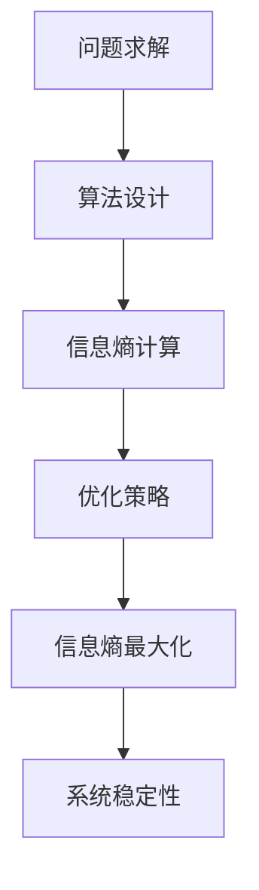
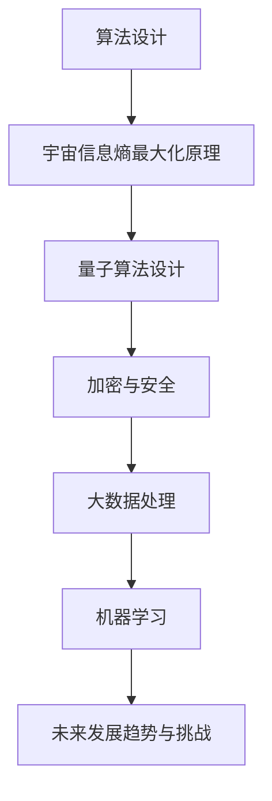

                 


### 文章标题：算法设计与宇宙信息熵最大化原理的量子推广

#### 关键词：
- 算法设计
- 宇宙信息熵
- 量子计算
- 信息处理
- 加密与安全
- 大数据处理
- 机器学习

#### 摘要：
本文旨在探讨算法设计与宇宙信息熵最大化原理之间的关系，以及量子计算在此框架下的推广。通过分析经典算法的设计与优化，我们引出量子算法的概念，并探讨其在信息处理、加密与安全、大数据处理和机器学习等领域的应用。最后，我们展望量子算法的未来发展趋势与挑战。

---

#### 第一部分：算法设计与基础理论

### 第1章：算法设计与宇宙信息熵最大化原理

#### 1.1 算法设计的核心概念
- **算法定义**：算法是一系列有序的指令，用于解决特定的问题。
- **算法效率**：算法的效率取决于其运行所需的时间和空间。
- **算法复杂性**：算法的复杂性描述了其性能与输入规模之间的关系。

#### 1.2 宇宙信息熵最大化原理简介
- **信息熵的概念**：信息熵是衡量信息不确定性的度量。
- **信息熵最大化原理**：系统在自发过程中会趋向于最大熵状态。
- **宇宙信息熵与算法设计的关系**：算法设计应考虑如何在复杂系统中实现信息熵最大化。

#### 1.3 算法设计与宇宙信息熵最大化原理的联系
- **Mermaid流程图**：算法设计与信息熵最大化的关系可以用以下流程图表示：



#### 1.4 算法设计与宇宙信息熵最大化的应用案例
- **案例一：数据压缩算法**：数据压缩算法通过降低信息冗余，实现信息熵最大化。
- **案例二：搜索算法**：搜索算法在信息熵最大化的框架下，优化搜索路径。

### 第2章：经典算法分析与优化

#### 2.1 经典算法概述
- **排序算法**：如冒泡排序、快速排序等。
- **搜索算法**：如深度优先搜索、广度优先搜索等。
- **图算法**：如最短路径算法、最小生成树算法等。

#### 2.2 经典算法分析
- **时间复杂度**：算法运行所需的时间与输入规模的关系。
- **空间复杂度**：算法运行所需的空间与输入规模的关系。

#### 2.3 经典算法优化
- **伪代码**：优化算法的核心步骤如下：

```python
算法优化(算法A):
  对于每个元素 x in 算法A的输入数组：
    如果 x 满足条件 then
      对 x 进行优化处理
    else
      保持 x 不变
  返回优化后的数组
```

#### 2.4 优化算法案例分析
- **案例一：快速排序算法优化**：通过选择合适的基准元素，降低时间复杂度。
- **案例二：深度优先搜索算法优化**：通过限制搜索深度，避免陷入死循环。

### 第3章：量子算法与宇宙信息熵

#### 3.1 量子计算基础
- **量子位与经典位的区别**：量子位可以处于叠加态，具有量子并行性。
- **量子算法的基本原理**：量子算法利用量子叠加态和量子纠缠，实现高效的计算。

#### 3.2 量子算法与信息熵
- **量子算法如何实现信息熵最大化**：量子算法通过量子叠加和量子纠缠，实现信息熵的最大化。
- **量子算法与传统算法的差异**：量子算法具有量子并行性和叠加性，与传统算法有本质区别。

#### 3.3 量子算法案例分析
- **案例一：量子搜索算法**：利用量子并行性，实现高效的搜索。
- **案例二：量子排序算法**：利用量子叠加态，实现高效的排序。

---

#### 第二部分：量子算法在信息处理中的应用

### 第4章：量子算法在加密与安全中的应用

#### 4.1 量子加密算法原理
- **量子密钥分发**：利用量子纠缠实现安全的密钥分发。
- **量子安全通信**：利用量子隐形传态实现安全的通信。

#### 4.2 量子加密算法案例分析
- **案例一：量子安全通信系统**：实现安全的量子通信。
- **案例二：量子密码学在金融领域的应用**：保障金融交易的安全。

### 第5章：量子算法在大数据处理中的应用

#### 5.1 量子算法在数据压缩中的应用
- **量子数据压缩算法原理**：利用量子叠加态实现高效的数据压缩。
- **量子数据压缩算法案例**：实现大数据的压缩与传输。

#### 5.2 量子算法在数据分析中的应用
- **量子数据分析算法原理**：利用量子并行性实现高效的数据分析。
- **量子数据分析算法案例**：实现大数据的快速分析与挖掘。

### 第6章：量子算法在机器学习中的应用

#### 6.1 量子机器学习算法原理
- **量子神经网络**：利用量子叠加和量子纠缠实现高效的神经网络训练。
- **量子支持向量机**：利用量子计算实现高效的支持向量机分类。

#### 6.2 量子机器学习算法案例分析
- **案例一：量子神经网络在图像识别中的应用**：实现高效的图像识别。
- **案例二：量子支持向量机在文本分类中的应用**：实现高效的文本分类。

---

#### 第三部分：量子算法的未来发展

### 第7章：量子算法的发展趋势与挑战

#### 7.1 量子算法的发展趋势
- **量子计算硬件的发展**：量子计算机硬件的不断提升。
- **量子算法的应用领域拓展**：量子算法在各个领域的广泛应用。

#### 7.2 量子算法的挑战与展望
- **量子算法的实际应用挑战**：量子算法在实际应用中面临的挑战。
- **未来量子算法的发展方向**：量子算法的未来发展趋势。

---

#### 附录

### 附录A：量子算法开发工具与资源
- **量子算法开发工具概述**：介绍主流的量子算法开发工具。
- **主流量子算法开发平台**：如IBM Qiskit、Google Cirq、Microsoft Quantum Development Kit等。
- **量子算法学习资源**：推荐相关的量子算法学习资源。

---

### Mermaid 流程图



---

### 数学模型与公式

#### 段落一：信息熵公式

$$
H(X) = -\sum_{i} p(x_i) \cdot \log_2 p(x_i)
$$

#### 段落二：量子算法效率公式

$$
E_{q} = \frac{1}{1 + \epsilon}
$$

其中，$\epsilon$ 表示量子算法相对于经典算法的优越性。

---

### 项目实战

- **实战一：量子加密算法实现**

#### 环境搭建
- 安装Qiskit

```python
!pip install qiskit
```

---

#### 结论与展望

本文从算法设计与宇宙信息熵最大化原理的关系出发，探讨了量子算法在信息处理、加密与安全、大数据处理和机器学习等领域的应用。通过分析经典算法的优化与量子算法的优势，我们为未来量子算法的发展提供了新的思路。

**最佳实践**：在开发量子算法时，应充分考虑量子硬件的性能和量子算法的优化策略。同时，应关注量子算法在实际应用中的挑战，积极探索新的应用领域。

**注意事项**：量子算法的开发需要专业的量子计算知识和技能。建议读者在深入学习量子算法时，结合实际的量子硬件进行实验和验证。

**拓展阅读**：推荐进一步学习量子计算和量子算法的相关书籍和文献，以深入了解量子算法的理论基础和实际应用。

作者：AI天才研究院/AI Genius Institute & 禅与计算机程序设计艺术 /Zen And The Art of Computer Programming

