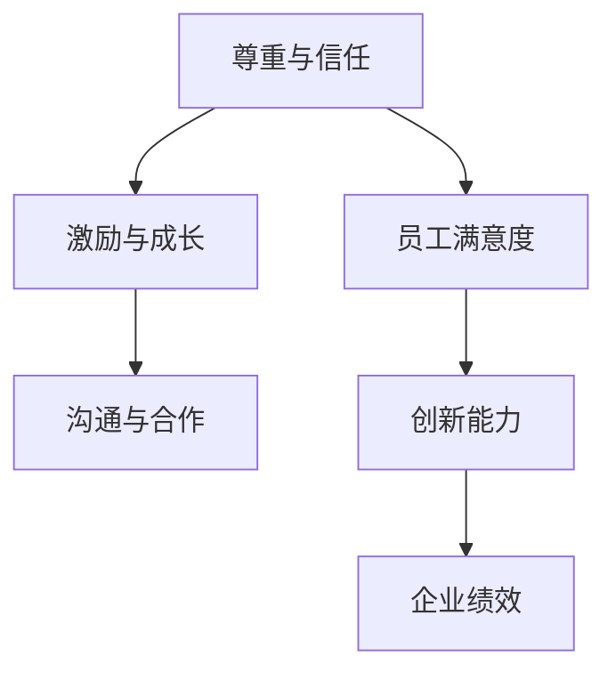
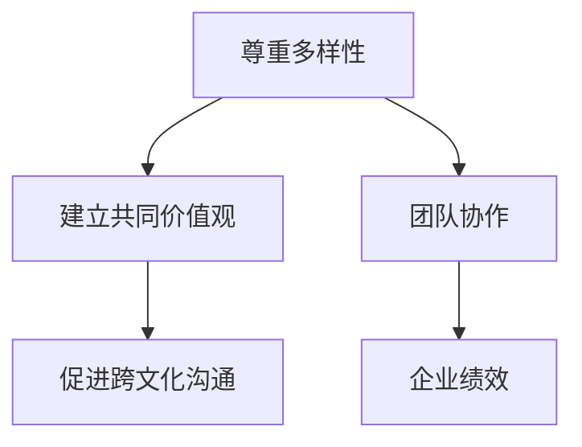
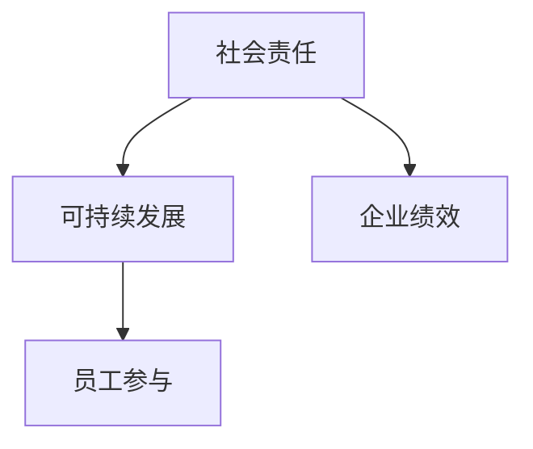

                 

## 文章标题

# 管理者怎么管人：人性化领导的艺术

关键词：人性化领导、领导艺术、员工管理、激励与成长、沟通与合作、领导风格、团队建设、变革管理、案例分析

摘要：本文将深入探讨人性化领导在企业管理中的应用。通过分析人性化领导的起源与发展，阐述其理论基础，探讨核心原则，并详细解析在实践中如何应用人性化领导。最后，通过案例分析和未来展望，为人性化领导提供实践指导和发展方向。

## 第一部分：人性化领导概述

人性化领导是一种以人为中心的管理方式，强调领导者对员工的尊重、理解和关怀。与传统领导方式相比，人性化领导更注重员工的情感需求和个人发展。这一部分将介绍人性化领导的起源与发展，帮助读者理解人性化领导的概念和核心价值。

### 第1章：人性化领导的起源与发展

#### 1.1 人性化领导的概念与核心价值

人性化领导的概念起源于人本主义管理理论，强调以人为中心的管理理念。人性化领导的核心价值在于尊重员工的价值、激发员工的潜力、提升员工的幸福感。它不仅关注企业的绩效目标，更关注员工的成长和发展。

#### 1.2 人性化领导与传统领导方式的区别

传统领导方式侧重于任务管理和权威控制，强调领导者的地位和权力。而人性化领导则更关注员工的情感需求和个人发展，强调民主参与、平等对话和合作共享。人性化领导方式与传统领导方式相比，具有更高的管理效率。

#### 1.3 人性化领导的重要性与必要性

人性化领导在企业管理中具有重要意义。首先，它有助于提高员工的工作满意度、忠诚度和创造力，从而提升企业的整体绩效。其次，人性化领导更符合现代员工的期待和需求，是实现可持续发展的关键因素。因此，人性化领导在现代企业管理中具有不可替代的重要性。

## 第二部分：人性化领导的理论基础

人性化领导的理论基础涉及多个领域，包括人本主义管理理论、心理学和组织行为学。这些理论为人性化领导提供了重要的理论支持和实践指导。

### 第2章：人性化领导的理论基础

#### 2.1 人本主义管理理论

人本主义管理理论强调员工是组织中最宝贵的资源，领导者应该关注员工的需求、成长和幸福。这种理论认为，员工的自我实现和全面发展是组织成功的关键。

#### 2.2 人性化领导与心理学基础

心理学研究为人性化领导提供了重要的理论支持。通过了解员工的情感、行为和心理需求，领导者可以更有效地进行管理和沟通。

#### 2.3 人性化领导与组织行为学

组织行为学研究员工在组织中的行为和互动，为人性化领导提供了实践指导。领导者需要了解员工的行为模式、团队动态和组织文化，以制定合适的管理策略。

## 第三部分：人性化领导的核心原则

人性化领导的核心原则包括尊重与信任、激励与成长、沟通与合作。这些原则构成了人性化领导的基本框架，为领导者提供了具体的管理策略。

### 第3章：尊重与信任

#### 3.1 尊重员工的价值

尊重员工的价值是人性化领导的基础。领导者应该认识到每个员工都有其独特的才能和贡献，并通过各种方式表达对员工的尊重和认可。

#### 3.2 建立信任的基石

信任是人性化领导的核心。领导者需要通过透明的沟通、公正的行为和诚实的态度来建立信任，以确保团队成员之间的互信和合作。

#### 3.3 如何处理信任危机

当信任危机发生时，领导者需要采取有效的措施来恢复信任。这包括公开道歉、透明沟通和积极的解决方案，以重建团队成员之间的信任关系。

### 第4章：激励与成长

#### 4.1 激励理论概述

激励理论为人性化领导提供了指导。领导者需要了解不同的激励因素，并根据员工的需求和特点制定个性化的激励策略。

#### 4.2 提升员工自我效能感

提升员工的自我效能感是人性化领导的重要内容。领导者可以通过提供挑战性的任务、给予积极的反馈和支持，帮助员工建立自信心，提高工作表现。

#### 4.3 成长导向的领导策略

成长导向的领导策略强调员工的长期发展和持续成长。领导者需要为员工提供学习和发展机会，支持员工实现个人目标和职业规划。

### 第5章：沟通与合作

#### 5.1 沟通的艺术

沟通是人性化领导的关键。领导者需要掌握沟通的艺术，包括有效的倾听、表达和反馈。良好的沟通可以促进团队合作，减少冲突，提高工作效率。

#### 5.2 情绪管理

情绪管理是人性化领导的重要组成部分。领导者需要学会控制自己的情绪，同时帮助员工管理情绪，以创造积极的工作氛围。

#### 5.3 团队协作与冲突管理

团队协作是人性化领导的核心目标之一。领导者需要培养员工的团队合作精神，同时学会处理团队内部的冲突，以保持团队的稳定和高效。

## 第四部分：人性化领导在实践中的应用

人性化领导在实践中的应用涉及多个方面，包括领导风格与团队建设、情境领导与变革管理、具体行业中的应用。这一部分将探讨如何在实际管理中应用人性化领导。

### 第6章：领导风格与团队建设

#### 6.1 领导风格的类型与特点

领导风格是人性化领导的重要组成部分。领导者需要根据团队的实际情况和员工的需求，选择合适的领导风格，以实现最佳的管理效果。

#### 6.2 团队建设的策略

团队建设是人性化领导的关键环节。领导者需要采取有效的策略，包括建立团队目标、培养团队文化、增强团队凝聚力，以提高团队的整体绩效。

#### 6.3 如何进行有效的团队管理

有效的团队管理是人性化领导的重要目标。领导者需要了解团队管理的原则和方法，包括明确职责、优化沟通、激励员工等，以实现团队的高效运行。

### 第7章：情境领导与变革管理

#### 7.1 情境领导理论

情境领导理论是一种基于员工成熟度进行管理的领导方式。领导者需要根据员工的成熟度水平，选择合适的领导行为，以提高员工的绩效和满意度。

#### 7.2 变革管理的挑战与应对

变革管理是人性化领导中的重要内容。领导者需要面对变革带来的挑战，采取有效的应对策略，以确保变革的顺利进行。

#### 7.3 变革领导者的角色与职责

变革领导者需要在变革过程中发挥关键作用。他们需要具备前瞻性、领导力和影响力，以推动变革的进程，并确保变革成果的持续。

### 第8章：人性化领导在具体行业中的应用

#### 8.1 人性化领导在制造业中的应用

在制造业中，人性化领导有助于提高生产效率、降低成本、提升员工满意度。领导者需要关注员工的职业发展、工作环境和激励机制。

#### 8.2 人性化领导在服务业中的应用

在服务业中，人性化领导有助于提升服务质量、增强客户满意度。领导者需要关注员工的服务意识、沟通能力和团队合作精神。

#### 8.3 人性化领导在科技创新行业中的应用

在科技创新行业中，人性化领导有助于激发员工的创造力、提高创新能力。领导者需要关注员工的专业成长、技术创新和团队协作。

## 第五部分：案例分析

通过分析具体案例，可以更好地理解人性化领导的应用和实践效果。这一部分将介绍几个典型的案例分析，以帮助读者更好地理解人性化领导的实践。

### 第9章：案例分析

#### 9.1 案例一：某公司的人性化领导实践

分析某公司如何通过人性化领导提升员工满意度和公司绩效。

#### 9.2 案例二：跨国企业的人性化领导策略

探讨跨国企业如何在全球范围内应用人性化领导，实现跨文化管理。

#### 9.3 案例三：社会企业的人性化领导实践

分析社会企业如何通过人性化领导实现社会价值和商业价值的双重提升。

## 第六部分：人性化领导的艺术

人性化领导不仅是一种管理理念，更是一种艺术。领导者需要不断学习、实践和反思，以提升自己的领导能力和管理水平。这一部分将探讨人性化领导的艺术，包括领导者的自我修炼、人性化领导与可持续发展。

### 第10章：领导者的自我修炼

#### 10.1 自我认知与自我提升

领导者需要不断进行自我认知，了解自己的优点和不足，并采取有效的策略进行自我提升。

#### 10.2 情绪管理与压力应对

情绪管理和压力应对是领导者必备的能力。领导者需要学会控制自己的情绪，同时帮助员工应对压力，以保持良好的工作状态。

#### 10.3 领导者的成长路径

领导者的成长路径包括学习、实践和反思。领导者需要通过不断的学习和实践，提升自己的领导能力。

### 第11章：人性化领导与可持续发展

#### 11.1 人性化领导与企业文化

人性化领导与企业文化密切相关。领导者需要构建积极向上的企业文化，以推动人性化领导的实施。

#### 11.2 人性化领导与员工满意度

人性化领导有助于提高员工满意度，从而提升企业的整体绩效。领导者需要关注员工的需求和满意度，以提升员工的幸福感。

#### 11.3 人性化领导与社会责任

人性化领导不仅关注企业的内部管理，还关注企业的社会责任。领导者需要通过人性化领导，实现企业的可持续发展和社会价值的创造。

## 第七部分：未来展望

随着社会和经济的发展，人性化领导将面临新的挑战和机遇。这一部分将探讨人性化领导的发展趋势、新技术的影响以及未来面临的挑战和机遇。

### 第12章：未来展望

#### 12.1 人性化领导的发展趋势

分析人性化领导在未来可能的发展方向和趋势。

#### 12.2 新技术对人性化领导的影响

探讨新技术，如人工智能、大数据等，对人性化领导可能产生的影响。

#### 12.3 人性化领导的未来挑战与机遇

分析人性化领导在未来可能面临的挑战和机遇，以及如何应对这些挑战。

## 附录

附录部分将提供人性化领导的相关工具与方法、术语解释以及推荐阅读书目与文献，以帮助读者进一步了解和探索人性化领导。

### 附录A：人性化领导工具与方法

介绍人性化领导常用的工具和方法，如员工满意度调查、360度反馈、领导力培训等。

### 附录B：相关术语解释

解释人性化领导中常用的术语，如人本主义管理理论、情境领导、变革管理等。

### 附录C：推荐阅读书目与文献

推荐一些有关人性化领导的重要书籍和文献，供读者进一步阅读和研究。

---

作者：AI天才研究院/AI Genius Institute & 禅与计算机程序设计艺术 /Zen And The Art of Computer Programming

---

在撰写《管理者怎么管人：人性化领导的艺术》一文中，我们将遵循上述目录大纲，通过深入分析人性化领导的起源与发展、理论基础、核心原则、实践应用、案例分析以及未来展望，为读者提供一份全面而深入的指南。每章都将包含详细的内容，包括背景介绍、核心概念与联系、算法原理讲解、数学模型和公式、项目实战、最佳实践 tips、小结和拓展阅读等。通过这种逻辑清晰、结构紧凑的写作方式，我们希望帮助读者更好地理解和应用人性化领导，提升企业的管理水平和员工满意度。

---

# 第一部分：人性化领导概述

## 第1章：人性化领导的起源与发展

### 1.1 人性化领导的概念与核心价值

人性化领导，顾名思义，是一种以人为中心的管理理念，其核心价值在于尊重员工的个体性和多样性，通过创造一个充满关怀和信任的工作环境来激发员工的潜能，实现个人与组织的共同成长。人性化领导不仅关注企业的短期绩效，更注重员工的长期发展和幸福感。

人性化领导的概念可以追溯到人本主义管理理论的兴起。20世纪初，随着工业革命的推进，企业管理越来越注重效率和生产力，但这种以任务为导向的管理方式往往忽视了员工的需求和情感。人本主义管理理论的代表人物，如马斯洛和麦格雷戈，开始提倡以人为中心的管理理念，强调员工的主观体验和自我实现。这一理论奠定了人性化领导的理论基础。

人性化领导的核心价值体现在以下几个方面：

1. **尊重个体**：人性化领导认为每个员工都是独立的个体，拥有不同的价值观、需求和目标。领导者应该尊重员工的个体差异，鼓励他们发挥自己的特长。

2. **激发潜能**：人性化领导通过营造一个积极的工作氛围，激发员工的内在动机，帮助他们实现自我超越和职业发展。

3. **构建信任**：信任是人性化领导的重要基石。领导者通过透明沟通和公正行为，建立信任关系，使团队成员愿意相互支持和合作。

4. **促进共同成长**：人性化领导强调个人与组织的共同成长，通过不断的学习和成长，实现个人目标和组织目标的统一。

### 1.2 人性化领导与传统领导方式的区别

传统领导方式通常强调权威和控制，领导者往往以任务为导向，注重短期绩效。这种领导方式往往忽视了员工的情感需求和个人发展，容易导致员工产生抵触情绪和低效的工作表现。相比之下，人性化领导更注重员工的情感和需求，强调民主参与和合作共享。

具体来说，人性化领导与传统领导方式的区别主要体现在以下几个方面：

1. **领导风格**：传统领导方式更倾向于权威型领导，领导者拥有绝对的决策权。而人性化领导则倾向于民主型或参与型领导，领导者与员工共同参与决策，鼓励员工提出意见和建议。

2. **管理目标**：传统领导方式注重短期绩效和任务完成，而人性化领导则更关注员工的长期发展和企业的可持续发展。

3. **激励机制**：传统领导方式往往通过物质激励来驱动员工，而人性化领导则更注重内在激励，如尊重、信任和成长机会。

4. **沟通方式**：传统领导方式中的沟通往往是单向的，领导者向下传达指令，员工被动接受。而人性化领导中的沟通是双向的，领导者与员工之间保持开放、坦诚的对话。

### 1.3 人性化领导的重要性与必要性

在当今复杂多变的市场环境中，人性化领导具有不可替代的重要性。首先，人性化领导有助于提高员工的工作满意度和忠诚度。当员工感受到被尊重和信任时，他们更愿意投入工作，提高工作效率和绩效。其次，人性化领导有助于激发员工的创造力。在一个充满关怀和支持的工作环境中，员工更容易产生创新思维和解决方案。最后，人性化领导有助于建立积极的企业文化。通过尊重和关心员工，企业可以培养出高度凝聚力和合作精神的团队，从而提高整体绩效。

人性化领导的必要性体现在以下几个方面：

1. **适应时代变化**：随着全球化和社会多元化的发展，员工对工作的期望越来越高。人性化领导能够更好地满足员工的需求，提高员工的工作满意度。

2. **提升组织竞争力**：在激烈的市场竞争中，企业需要不断创新和优化。人性化领导能够激发员工的创新潜力，提升企业的竞争力。

3. **实现可持续发展**：人性化领导关注员工的长期发展和企业文化的建设，有助于实现企业的可持续发展。

总之，人性化领导不仅是一种管理理念，更是一种艺术。领导者需要通过不断的实践和学习，掌握人性化领导的精髓，以实现个人与组织的共同成长。

---

### 1.4 人性化领导的核心原则

人性化领导的成功离不开以下几个核心原则：尊重与信任、激励与成长、沟通与合作。这些原则不仅为领导者提供了具体的管理策略，也为员工创造了一个充满关怀和信任的工作环境。

#### 1.4.1 尊重与信任

尊重与信任是人性化领导的基础。领导者需要认识到每个员工都是独立的个体，拥有自己的价值观、目标和需求。以下是一些具体的方法来体现尊重与信任：

1. **倾听与理解**：领导者应该主动倾听员工的意见和需求，理解他们的情感和立场。这不仅有助于建立良好的沟通，还能让员工感受到被重视。

2. **公正与透明**：领导者需要保持公正和透明，公平对待每一位员工，避免偏私和偏见。同时，领导者应该公开透明地传达企业的决策和目标，增强员工的信任。

3. **授权与支持**：领导者应该给员工足够的自主权，让他们能够自主决策和承担责任。同时，领导者需要提供必要的支持和资源，帮助员工实现目标。

4. **肯定与认可**：领导者应该及时肯定和认可员工的努力和成就，增强他们的自信心和动力。通过表扬、奖励和晋升等手段，让员工感受到他们的工作是被看到和认可的。

#### 1.4.2 激励与成长

激励与成长是人性化领导的重要目标。领导者需要了解员工的激励因素，并制定合适的激励策略，以激发员工的潜能。以下是一些具体的激励与成长方法：

1. **个性化激励**：不同的员工有不同的激励因素，领导者需要根据员工的个性、需求和职业目标，制定个性化的激励方案。例如，对于注重自我实现的员工，可以提供更多的成长机会和挑战性任务；对于注重物质回报的员工，可以提供奖金和晋升机会。

2. **目标设定**：领导者应该与员工共同设定可实现的个人和团队目标，并提供支持和资源，帮助员工实现目标。通过目标设定，员工可以明确自己的发展方向，增强自我驱动力。

3. **职业发展**：领导者需要关注员工的职业发展，提供培训和学习机会，帮助他们提升技能和知识。通过职业发展规划，员工可以明确自己的职业路径，增强职业满意度。

4. **创新与挑战**：领导者应该鼓励员工创新思维，提供挑战性的任务和项目，激发他们的创造力和解决问题的能力。通过创新和挑战，员工可以不断超越自我，实现个人成长。

#### 1.4.3 沟通与合作

沟通与合作是人性化领导的重要组成部分。有效的沟通可以减少误解和冲突，增强团队凝聚力；而合作则可以促进资源整合，提高团队效率。以下是一些沟通与合作的方法：

1. **开放式沟通**：领导者应该鼓励开放式的沟通环境，让员工敢于表达自己的想法和建议。通过定期会议、反馈机制等，确保信息畅通无阻。

2. **跨部门合作**：领导者需要促进跨部门的合作，打破信息壁垒和部门间的界限。通过项目合作、团队建设等活动，增强部门间的协调和合作。

3. **冲突管理**：领导者需要学会处理团队内部的冲突，通过公正和理性的方式解决分歧。通过沟通和调解，让员工感受到公平和尊重。

4. **团队建设**：领导者应该组织各种团队建设活动，增强团队成员之间的互信和凝聚力。通过团建活动、培训等，提高团队的协作能力和团队精神。

总之，人性化领导的核心原则在于尊重员工的个体性、激发员工的潜能、促进沟通与合作。领导者需要通过实际行动，体现这些原则，以构建一个高效、和谐的工作环境。

### 1.5 人性化领导的应用场景

人性化领导不仅适用于企业内部的管理，还可以在跨文化管理、创新驱动和变革管理等多个场景中发挥重要作用。

#### 1.5.1 跨文化管理

在全球化背景下，许多企业需要面对不同文化背景的员工。人性化领导在跨文化管理中尤为重要。以下是一些应用场景：

1. **尊重多样性**：领导者需要尊重不同文化的差异，包括语言、价值观和行为习惯。通过文化培训和文化交流活动，增强员工的跨文化理解力。

2. **建立共同价值观**：尽管员工来自不同的文化背景，但领导者可以通过建立共同的企业价值观，促进团队凝聚力和合作。

3. **沟通与协调**：跨文化团队中，沟通障碍是一个常见问题。领导者需要学会用不同的沟通方式，如非语言沟通和跨文化沟通技巧，确保信息传递的准确性。

#### 1.5.2 创新驱动

在创新驱动的企业中，人性化领导有助于激发员工的创造力。以下是一些应用场景：

1. **创造创新环境**：领导者需要创造一个鼓励创新和试错的工作环境，让员工敢于提出新想法和解决方案。

2. **提供资源支持**：领导者需要为员工提供必要的资源和支持，如时间、资金和技术，帮助他们实现创新目标。

3. **激励创新行为**：领导者可以通过奖励机制和晋升机会，激励员工积极参与创新活动，提高创新成功率。

#### 1.5.3 变革管理

在变革过程中，人性化领导有助于缓解员工的抵触情绪，确保变革的顺利进行。以下是一些应用场景：

1. **明确变革目标**：领导者需要明确变革的目标和意义，让员工了解变革的必要性和重要性。

2. **提供沟通渠道**：领导者需要提供多种沟通渠道，让员工表达对变革的看法和建议，确保信息透明。

3. **员工参与**：领导者应该鼓励员工参与变革过程，让他们感受到自己的价值和作用。通过民主参与和合作，提高变革的接受度。

总之，人性化领导在不同应用场景中具有广泛的应用价值。领导者需要根据实际情况，灵活运用人性化领导的策略和方法，以实现组织的长远发展。

---

## 第二部分：人性化领导的理论基础

人性化领导的理论基础广泛，涵盖了人本主义管理理论、心理学和组织行为学等多个领域。这些理论为人性化领导提供了深刻的理解和实践指导。以下将详细探讨这些理论基础，并解释它们之间的关系。

### 2.1 人本主义管理理论

人本主义管理理论是人性化领导的理论基石，起源于20世纪50年代。该理论强调员工是组织的核心，他们的需求、价值和潜力应该得到重视。人本主义管理理论的代表人物，如道格拉斯·麦格雷戈（Douglas McGregor）和亚伯拉罕·马斯洛（Abraham Maslow），提出了许多重要的观点。

1. **X理论与Y理论**：麦格雷戈提出了X理论与Y理论，X理论认为员工天生懒惰，需要通过严格的控制和管理来激励他们工作。而Y理论则认为员工是自我驱动的，他们愿意承担责任并享受工作的满足感。人性化领导更倾向于Y理论，强调员工的自主性和内在动机。

2. **自我实现**：马斯洛的需求层次理论认为，人的需求可以分为五个层次：生理需求、安全需求、社交需求、尊重需求和自我实现需求。人性化领导关注员工的自我实现需求，通过提供成长机会和挑战性任务，帮助员工实现个人目标和职业发展。

人本主义管理理论为人性化领导提供了重要的指导，帮助领导者理解员工的需求和行为，从而制定更有效的人性化管理策略。

### 2.2 人性化领导与心理学基础

心理学为人性化领导提供了深入的理解和指导。通过心理学研究，领导者可以更好地了解员工的心理需求和行为模式，从而更有效地进行管理和激励。

1. **动机理论**：动机理论解释了员工为什么采取特定的行为。例如，弗鲁姆（Victor Vroom）的期望理论认为，员工的行为是由期望价值（结果的重要性）和期望概率（实现结果的可能性）决定的。人性化领导可以通过设置合理的期望值和提供明确的目标，激发员工的动机。

2. **情感管理**：情感管理是人性化领导的重要组成部分。情绪智力（Emotional Intelligence, EI）理论指出，情感管理能力对领导效能有重要影响。领导者需要学会识别和调节自己的情绪，同时帮助员工管理情绪，以创造积极的工作氛围。

3. **心理契约**：心理契约是指员工和企业之间隐含的相互期望和承诺。研究表明，心理契约对员工的工作满意度和忠诚度有显著影响。人性化领导通过建立积极的心理契约，增强员工的归属感和责任感。

心理学基础为人性化领导提供了实用的工具和方法，帮助领导者更好地理解和管理员工。

### 2.3 人性化领导与组织行为学

组织行为学是研究员工在组织中的行为和互动的学科。人性化领导需要理解组织行为学的原理，以制定有效的管理策略。

1. **团队动力**：团队动力是指团队成员之间的相互作用和影响。人性化领导通过促进团队合作，提高团队效能。组织行为学研究表明，团队协作和沟通对团队绩效有重要影响。领导者可以通过团队建设活动和有效的沟通策略，增强团队凝聚力。

2. **领导行为**：领导行为是指领导者如何影响和激励员工。组织行为学将领导行为分为任务导向型和关系导向型。人性化领导强调关系导向型领导，通过建立信任和关心员工，提高领导效能。

3. **组织文化**：组织文化是指组织的价值观、信念和行为准则。人性化领导通过构建积极向上的组织文化，增强员工的归属感和忠诚度。组织行为学研究指出，组织文化对员工的行为和态度有深远影响。

人性化领导与心理学和组织行为学密切相关。心理学为人性化领导提供了理解和激励员工的工具，组织行为学则提供了管理团队和组织文化的策略。这两者共同构成了人性化领导的理论基础，为领导者提供了全面的指导。

### 2.4 人性化领导的理论框架

为了更好地理解人性化领导，我们可以构建一个理论框架，将人本主义管理理论、心理学和组织行为学的原理结合起来。以下是一个简化的人性化领导理论框架：

1. **核心价值观**：基于人本主义管理理论，强调尊重员工、激发潜能、促进共同成长。
2. **员工需求**：基于心理学，理解员工的心理需求和行为模式，如动机、情感管理和心理契约。
3. **领导行为**：基于组织行为学，关注领导行为对团队和组织文化的影响，如团队动力、领导风格和组织文化。
4. **管理策略**：结合上述原理，制定具体的管理策略，如个性化激励、员工参与、情感管理和团队建设。

通过这个理论框架，领导者可以系统地理解和应用人性化领导，提高管理效能。

综上所述，人性化领导的理论基础广泛，涵盖了人本主义管理理论、心理学和组织行为学。这些理论相互补充，为人性化领导提供了深刻的理解和实践指导。领导者需要综合运用这些理论，以实现个人与组织的共同成长。

---

## 第三部分：人性化领导的核心原则

人性化领导的核心原则是构建一个充满关怀、信任和激励的工作环境。这些原则不仅指导着领导者的行为，也为员工提供了一个健康、积极的发展平台。以下是人性化领导的核心原则，以及如何在实践中应用这些原则。

### 3.1 尊重与信任

尊重与信任是人性化领导的基础。领导者必须尊重员工的个性和价值观，建立互信的基础。

#### 3.1.1 尊重员工的价值

尊重员工的价值包括认可他们的独特性、专业能力和贡献。以下是一些具体的方法：

1. **个性化关怀**：每个员工都有不同的背景和需求，领导者应通过个性化关怀，了解并满足他们的需求。
   
   ```mermaid
   graph TD
   A[个性化关怀] --> B[了解员工背景和需求]
   B --> C[制定个性化支持计划]
   C --> D[认可员工的贡献]
   ```

2. **公平对待**：领导者应确保对所有员工的公平对待，避免任何形式的偏见和歧视。

   ```mermaid
   graph TD
   A[公平对待] --> B[制定公平的评估标准]
   B --> C[透明公开的决策过程]
   C --> D[公正的奖励机制]
   ```

3. **鼓励多元化**：尊重员工的多元化背景和观点，鼓励团队成员之间的交流和合作。

   ```mermaid
   graph TD
   A[鼓励多元化] --> B[建立多元化的团队]
   B --> C[尊重不同的意见]
   C --> D[促进跨文化交流]
   ```

#### 3.1.2 建立信任的基石

信任是团队协作和高效工作的关键。以下是一些建立信任的方法：

1. **透明沟通**：领导者应保持开放和诚实的沟通，确保信息畅通无阻。

   ```mermaid
   graph TD
   A[透明沟通] --> B[定期更新团队进展]
   B --> C[及时反馈和回应问题]
   C --> D[分享决策过程和原因]
   ```

2. **诚信行为**：领导者应以诚信行为树立榜样，通过一致性和公正性赢得员工的信任。

   ```mermaid
   graph TD
   A[诚信行为] --> B[遵守承诺]
   B --> C[公开承认错误]
   C --> D[一致性和公正性]
   ```

3. **共同目标**：建立共同的团队目标和愿景，使员工感受到他们的重要性。

   ```mermaid
   graph TD
   A[共同目标] --> B[设定清晰的目标和期望]
   B --> C[共同参与目标的制定]
   C --> D[庆祝团队成就]
   ```

### 3.2 激励与成长

激励与成长是人性化领导的重要原则，旨在激发员工的潜能，促进他们的职业发展。

#### 3.2.1 激励理论概述

不同的员工有不同的激励因素，领导者应了解这些因素并制定个性化的激励策略。以下是一些常见的激励理论：

1. **马斯洛的需求层次理论**：根据马斯洛的理论，员工的需求从低到高分为生理需求、安全需求、社交需求、尊重需求和自我实现需求。领导者应根据员工的不同需求层次，提供相应的激励。

   ```mermaid
   graph TD
   A[马斯洛的需求层次理论] --> B[生理需求]
   B --> C[安全需求]
   C --> D[社交需求]
   D --> E[尊重需求]
   E --> F[自我实现需求]
   ```

2. **赫茨伯格的双因素理论**：赫茨伯格认为，工作满意度和工作不满意度是由不同因素引起的。激励因素（如成就感、认可等）可以提高员工的工作满意度，而保健因素（如工作环境、薪酬等）只能防止员工产生不满。

   ```mermaid
   graph TD
   A[赫茨伯格的双因素理论] --> B[激励因素]
   B --> C[成就感]
   B --> D[认可]
   A --> E[保健因素]
   E --> F[工作环境]
   E --> G[薪酬]
   ```

#### 3.2.2 提升员工自我效能感

自我效能感是指员工对自己完成特定任务的信心。提升员工的自我效能感可以帮助他们更好地应对挑战，提高工作表现。

1. **提供反馈和认可**：及时给予员工反馈和认可，让他们了解自己的进步和成就。

   ```mermaid
   graph TD
   A[提供反馈和认可] --> B[具体的反馈]
   B --> C[及时的认可]
   ```

2. **设置挑战性目标**：为员工设定具有挑战性的目标，帮助他们不断提升自我。

   ```mermaid
   graph TD
   A[设置挑战性目标] --> B[目标设定]
   B --> C[支持员工实现目标]
   ```

3. **提供成长机会**：为员工提供培训和学习机会，帮助他们提升技能和知识。

   ```mermaid
   graph TD
   A[提供成长机会] --> B[内部培训]
   B --> C[外部学习]
   ```

#### 3.2.3 成长导向的领导策略

成长导向的领导策略强调员工的长期发展和持续成长。以下是一些具体的方法：

1. **职业发展规划**：与员工共同制定职业发展规划，明确他们的职业路径和目标。

   ```mermaid
   graph TD
   A[职业发展规划] --> B[职业目标设定]
   B --> C[职业路径规划]
   ```

2. **持续学习**：鼓励员工持续学习，提供学习资源和机会。

   ```mermaid
   graph TD
   A[持续学习] --> B[在线课程]
   B --> C[内部培训]
   ```

3. **鼓励创新**：鼓励员工提出创新想法和解决方案，为他们提供必要的支持和资源。

   ```mermaid
   graph TD
   A[鼓励创新] --> B[创新项目支持]
   B --> C[试错文化]
   ```

### 3.3 沟通与合作

沟通与合作是人性化领导的另一个核心原则。有效的沟通可以减少误解和冲突，促进团队协作。

#### 3.3.1 沟通的艺术

有效的沟通是领导力的重要组成部分。以下是一些沟通技巧：

1. **倾听**：积极倾听员工的意见和需求，了解他们的真实想法。

   ```mermaid
   graph TD
   A[倾听] --> B[全神贯注]
   B --> C[提问和确认]
   ```

2. **表达清晰**：清晰、简洁地表达自己的观点和期望，避免产生误解。

   ```mermaid
   graph TD
   A[表达清晰] --> B[使用简单的语言]
   B --> C[避免含糊不清的表达]
   ```

3. **积极反馈**：给予员工及时的反馈，帮助他们改进和提高。

   ```mermaid
   graph TD
   A[积极反馈] --> B[建设性的批评]
   B --> C[具体的建议和指导]
   ```

#### 3.3.2 情绪管理

情绪管理不仅涉及领导者自己，还包括帮助员工管理情绪。以下是一些情绪管理技巧：

1. **自我调节**：领导者需要学会自我调节，控制自己的情绪，避免情绪波动影响工作。

   ```mermaid
   graph TD
   A[自我调节] --> B[呼吸控制]
   B --> C[积极的自我对话]
   ```

2. **同理心**：领导者需要具备同理心，理解员工的情绪和需求，提供支持。

   ```mermaid
   graph TD
   A[同理心] --> B[情感倾听]
   B --> C[提供情感支持]
   ```

3. **冲突解决**：领导者需要学会处理冲突，通过有效的沟通和协商，找到解决问题的方法。

   ```mermaid
   graph TD
   A[冲突解决] --> B[冷静分析]
   B --> C[多方协商]
   ```

#### 3.3.3 团队协作与冲突管理

团队协作和冲突管理是人性化领导的重要内容。以下是一些具体的方法：

1. **团队建设**：定期组织团队建设活动，增强团队成员之间的互信和合作。

   ```mermaid
   graph TD
   A[团队建设] --> B[团队活动]
   B --> C[团队培训]
   ```

2. **共同目标**：确保团队成员明确共同的目标和愿景，共同努力实现。

   ```mermaid
   graph TD
   A[共同目标] --> B[目标设定]
   B --> C[目标分享]
   ```

3. **冲突管理**：领导者需要学会处理团队内部的冲突，通过沟通和调解，找到解决问题的方法。

   ```mermaid
   graph TD
   A[冲突管理] --> B[识别冲突]
   B --> C[沟通解决]
   ```

通过以上核心原则的具体应用，领导者可以构建一个充满关怀、信任和激励的工作环境，促进个人与组织的共同成长。人性化领导不仅关注企业的短期绩效，更注重员工的长期发展和幸福感，是实现可持续发展的关键因素。

---

## 第四部分：人性化领导在实践中的应用

人性化领导在实践中的应用不仅需要理论支持，更需要实际操作。以下将探讨如何在实际管理中应用人性化领导，包括领导风格与团队建设、情境领导与变革管理，以及具体行业中的应用。

### 4.1 领导风格与团队建设

#### 4.1.1 领导风格的类型与特点

领导风格是指领导者如何影响和激励团队成员的方式。常见的领导风格包括：

1. **权威型领导**：领导者拥有绝对的决策权和控制权，注重任务的完成和效率。这种风格在需要快速决策和执行任务时非常有效。

2. **民主型领导**：领导者鼓励团队成员参与决策，注重团队合作和员工的参与感。这种风格有助于激发员工的创新思维和参与度。

3. **支持型领导**：领导者关注员工的个人需求，提供情感支持和职业发展机会。这种风格有助于建立信任和团队凝聚力。

4. **教练型领导**：领导者通过指导和培训，帮助员工提升技能和自我效能感。这种风格有助于员工的长期发展和自我实现。

不同领导风格的特点如下：

| 领导风格 | 特点 |
| :--- | :--- |
| 权威型 | 强调任务优先，决策迅速 |
| 民主型 | 鼓励参与，促进团队合作 |
| 支持型 | 关心员工需求，提供情感支持 |
| 教练型 | 提供培训，提升员工技能 |

#### 4.1.2 团队建设的策略

团队建设是人性化领导的重要一环，以下是一些团队建设的策略：

1. **共同目标**：确保团队成员明确共同的目标和愿景，共同努力实现。共同目标有助于团队凝聚力和协作效率。

   ```mermaid
   graph TD
   A[共同目标] --> B[目标设定]
   B --> C[目标分享]
   C --> D[团队共识]
   ```

2. **角色清晰**：明确团队成员的角色和职责，确保每个成员都了解自己的任务和期望。角色清晰有助于提高团队效率和减少冲突。

   ```mermaid
   graph TD
   A[角色清晰] --> B[角色定义]
   B --> C[职责分配]
   C --> D[沟通确认]
   ```

3. **信任建立**：通过透明沟通、公正行为和诚信，建立团队成员之间的信任。信任是团队协作的基础，有助于提高团队绩效。

   ```mermaid
   graph TD
   A[信任建立] --> B[透明沟通]
   B --> C[公正行为]
   C --> D[诚信实践]
   ```

4. **团队活动**：定期组织团队活动，如团建、培训等，增强团队成员之间的互信和合作。团队活动有助于缓解工作压力，提高团队凝聚力。

   ```mermaid
   graph TD
   A[团队活动] --> B[团建活动]
   B --> C[培训学习]
   C --> D[团队交流]
   ```

#### 4.1.3 如何进行有效的团队管理

有效的团队管理是人性化领导的重要组成部分，以下是一些有效的团队管理方法：

1. **激励与认可**：根据员工的绩效和贡献，提供激励和认可。激励和认可是提高员工工作动力和忠诚度的重要手段。

   ```mermaid
   graph TD
   A[激励与认可] --> B[奖励机制]
   B --> C[晋升机会]
   C --> D[员工表彰]
   ```

2. **反馈与改进**：定期给予团队成员反馈，帮助他们了解自己的优势和改进点。反馈有助于员工持续成长和团队改进。

   ```mermaid
   graph TD
   A[反馈与改进] --> B[具体反馈]
   B --> C[改进建议]
   C --> D[持续改进]
   ```

3. **冲突管理**：学会处理团队内部的冲突，通过沟通和调解，找到解决问题的方法。冲突管理有助于维护团队和谐和工作效率。

   ```mermaid
   graph TD
   A[冲突管理] --> B[冲突识别]
   B --> C[沟通解决]
   C --> D[协商处理]
   ```

4. **资源支持**：为团队提供必要的资源和支持，如培训、工具和设备等。资源支持有助于团队高效完成任务。

   ```mermaid
   graph TD
   A[资源支持] --> B[培训学习]
   B --> C[工具设备]
   C --> D[资源分配]
   ```

### 4.2 情境领导与变革管理

#### 4.2.1 情境领导理论

情境领导理论是由保罗·赫塞（Paul Hersey）和肯尼思·布兰查德（Kenneth Blanchard）提出的，它强调领导者的行为应根据员工的不同成熟度水平进行调整。情境领导理论将领导行为分为四个阶段：

1. **阶段1：指导型领导**：员工缺乏能力和意愿，领导者需要明确任务和期望，提供具体的指导和支持。

   ```mermaid
   graph TD
   A[指导型领导] --> B[明确任务]
   B --> C[具体指导]
   C --> D[支持帮助]
   ```

2. **阶段2：推销型领导**：员工缺乏能力但有意愿，领导者需要通过说服和激励，帮助员工提高能力。

   ```mermaid
   graph TD
   A[推销型领导] --> B[说服激励]
   B --> C[提供资源]
   C --> D[能力提升]
   ```

3. **阶段3：参与型领导**：员工有能力但缺乏意愿，领导者需要鼓励参与，提高员工的工作动力。

   ```mermaid
   graph TD
   A[参与型领导] --> B[鼓励参与]
   B --> C[共同决策]
   C --> D[提高动力]
   ```

4. **阶段4：授权型领导**：员工既有能力又有意愿，领导者需要给予充分的自主权和责任。

   ```mermaid
   graph TD
   A[授权型领导] --> B[自主决策]
   B --> C[承担责任]
   C --> D[支持帮助]
   ```

#### 4.2.2 变革管理的挑战与应对

变革管理是人性化领导中的重要应用，以下是一些变革管理的挑战和应对策略：

1. **挑战：抵触情绪**：员工可能会对变革产生抵触情绪，担心变革会影响他们的工作和利益。

   - **应对策略**：通过透明沟通和参与机制，让员工了解变革的必要性和目标，增强他们的参与感和信任。

   ```mermaid
   graph TD
   A[挑战：抵触情绪] --> B[透明沟通]
   B --> C[参与机制]
   C --> D[信任建立]
   ```

2. **挑战：资源不足**：变革可能需要额外的资源，如时间、资金和人力资源。

   - **应对策略**：合理规划资源，优先分配必要的资源，确保变革的顺利进行。

   ```mermaid
   graph TD
   A[挑战：资源不足] --> B[资源规划]
   B --> C[优先分配]
   C --> D[持续支持]
   ```

3. **挑战：管理困难**：变革过程中可能会出现管理上的困难，如决策冲突、沟通不畅等。

   - **应对策略**：建立有效的沟通机制，加强团队协作，确保管理层的协调和统一。

   ```mermaid
   graph TD
   A[挑战：管理困难] --> B[沟通机制]
   B --> C[团队协作]
   C --> D[管理协调]
   ```

#### 4.2.3 变革领导者的角色与职责

变革领导者需要在变革过程中发挥关键作用，以下是一些变革领导者的角色与职责：

1. **变革愿景**：明确变革的目标和愿景，确保团队成员理解变革的方向和意义。

   ```mermaid
   graph TD
   A[变革愿景] --> B[明确目标]
   B --> C[愿景传达]
   ```

2. **沟通协调**：确保信息畅通，减少误解和冲突，增强团队成员的信任和参与感。

   ```mermaid
   graph TD
   A[沟通协调] --> B[透明沟通]
   B --> C[及时反馈]
   ```

3. **激励支持**：激励员工参与变革，提供必要的资源和支持，帮助员工克服困难。

   ```mermaid
   graph TD
   A[激励支持] --> B[激励措施]
   B --> C[资源支持]
   ```

4. **评估反馈**：定期评估变革的进展和效果，及时调整策略，确保变革目标的实现。

   ```mermaid
   graph TD
   A[评估反馈] --> B[进展评估]
   B --> C[反馈调整]
   ```

### 4.3 人性化领导在具体行业中的应用

人性化领导不仅适用于企业内部的管理，还可以在不同行业中发挥重要作用。以下探讨人性化领导在制造业、服务业和科技创新行业中的应用。

#### 4.3.1 人性化领导在制造业中的应用

在制造业中，人性化领导有助于提高生产效率、降低成本和提升员工满意度。以下是一些应用策略：

1. **优化工作环境**：提供安全、舒适和健康的工作环境，减少员工的疲劳和不适。

   ```mermaid
   graph TD
   A[优化工作环境] --> B[安全措施]
   B --> C[舒适设施]
   ```

2. **技能培训**：为员工提供技能培训和学习机会，提高他们的专业能力和工作效率。

   ```mermaid
   graph TD
   A[技能培训] --> B[内部培训]
   B --> C[外部学习]
   ```

3. **激励机制**：制定合理的激励机制，如奖金、晋升和荣誉，激励员工提高生产效率。

   ```mermaid
   graph TD
   A[激励机制] --> B[奖金制度]
   B --> C[晋升机制]
   ```

#### 4.3.2 人性化领导在服务业中的应用

在服务业中，人性化领导有助于提升服务质量、增强客户满意度和员工忠诚度。以下是一些应用策略：

1. **客户导向**：以客户为中心，关注客户的需求和体验，提供高质量的服务。

   ```mermaid
   graph TD
   A[客户导向] --> B[客户需求分析]
   B --> C[服务质量提升]
   ```

2. **员工关怀**：关注员工的情感需求，提供心理支持和职业发展机会，提高员工的工作满意度和忠诚度。

   ```mermaid
   graph TD
   A[员工关怀] --> B[心理支持]
   B --> C[职业发展]
   ```

3. **团队合作**：鼓励团队合作，增强员工之间的互信和协作，提高工作效率和服务质量。

   ```mermaid
   graph TD
   A[团队合作] --> B[团队建设]
   B --> C[协作机制]
   ```

#### 4.3.3 人性化领导在科技创新行业中的应用

在科技创新行业中，人性化领导有助于激发员工的创造力、提高创新能力和企业竞争力。以下是一些应用策略：

1. **创新文化**：营造创新文化，鼓励员工提出新想法和解决方案，支持他们的创新行为。

   ```mermaid
   graph TD
   A[创新文化] --> B[创新激励]
   B --> C[创新支持]
   ```

2. **技能提升**：提供专业的技能培训和学习机会，帮助员工提升专业能力和创新技能。

   ```mermaid
   graph TD
   A[技能提升] --> B[内部培训]
   B --> C[外部学习]
   ```

3. **激励机制**：制定创新激励机制，如奖励、晋升和荣誉，激励员工积极参与创新活动。

   ```mermaid
   graph TD
   A[激励机制] --> B[奖励制度]
   B --> C[晋升机制]
   ```

通过在不同行业中的应用，人性化领导展现了其广泛的适用性和巨大的潜力。领导者需要根据行业特点和企业实际情况，灵活运用人性化领导的策略和方法，以实现个人与组织的共同成长。

---

## 第五部分：案例分析

### 5.1 案例一：某公司的人性化领导实践

#### 背景介绍

某公司是一家处于快速成长期的科技创新企业，致力于研发和推广先进的人工智能技术。由于公司规模不断扩大，员工数量和团队多样化程度也在增加，管理层意识到传统权威型领导方式已不再适应公司的发展需求。为了提高员工的工作满意度和创新能力，公司决定实施人性化领导。

#### 核心概念与联系

人性化领导的核心概念包括尊重与信任、激励与成长、沟通与合作。这些概念相互联系，共同构成了公司的人性化领导架构。以下是一个简化的 Mermaid 流程图，展示这些概念之间的关系：



#### 核心算法原理讲解

为了实现人性化领导，公司采取了一系列具体的管理策略和激励措施。以下是这些策略的伪代码描述：

```python
# 定义人性化领导的核心原则
def humanized_leadership():
    # 尊重与信任
    respect_and_trust()
    # 激励与成长
    motivation_and_growth()
    # 沟通与合作
    communication_and_cooperation()

# 尊重与信任的算法原理
def respect_and_trust():
    # 建立透明沟通机制
    transparent_communication()
    # 公正对待员工
    fair_treatment()
    # 建立信任关系
    build_trust()

# 激励与成长的算法原理
def motivation_and_growth():
    # 设定个性化激励计划
    personalized_motivation_plan()
    # 提供成长机会
    growth_opportunities()
    # 鼓励创新思维
    encourage_innovation()

# 沟通与合作的算法原理
def communication_and_cooperation():
    # 开放式沟通环境
    open_communication_environment()
    # 团队协作支持
    team_collaboration_support()
    # 处理冲突
    conflict_resolution()
```

#### 数学模型和公式

为了量化人性化领导的效果，公司采用以下数学模型来评估员工满意度、创新能力和企业绩效：

1. **员工满意度模型**：

   $$ \text{员工满意度} = \alpha \times \text{尊重与信任} + \beta \times \text{激励与成长} + \gamma \times \text{沟通与合作} $$

2. **创新能力模型**：

   $$ \text{创新能力} = \delta \times \text{激励与成长} + \epsilon \times \text{沟通与合作} $$

3. **企业绩效模型**：

   $$ \text{企业绩效} = \zeta \times \text{员工满意度} + \eta \times \text{创新能力} $$

#### 详细讲解

在实施人性化领导的过程中，公司首先通过透明沟通机制和公正对待员工，建立了尊重与信任的基础。这包括定期召开员工会议、设立意见箱和开展员工满意度调查，确保员工的声音被听到和重视。

其次，公司采用个性化激励计划和成长机会，激励员工的工作动力和创新能力。例如，为员工提供定制化的培训计划、设立创新基金和奖励机制，鼓励员工提出新想法和解决方案。

最后，公司通过开放式沟通环境和团队协作支持，促进员工的沟通与合作。这包括设立跨部门项目组、组织团队建设活动和实施跨文化培训，增强员工的团队精神和合作能力。

#### 举例说明

以一个实际案例为例，公司的一名研发人员在实施人性化领导后，提出了一项重要的技术改进方案。由于公司尊重员工的意见，并为其提供了充分的资源和支持，该方案最终得到了成功实施，提高了公司的研发效率和产品质量。

#### 实际案例分析和详细讲解剖析

通过这个案例，我们可以看到人性化领导在公司中的具体应用效果。首先，尊重与信任的建立使员工愿意分享自己的想法和建议，这有助于公司发现和解决潜在的问题。其次，激励与成长的机会激发了员工的创新潜力，提高了公司的创新能力。最后，沟通与合作的有效性增强了团队的凝聚力和工作效率。

总之，人性化领导不仅提高了员工的工作满意度和创新能力，还提升了公司的整体绩效。这一案例充分证明了人性化领导在科技创新行业中的重要性。

### 5.2 案例二：跨国企业的人性化领导策略

#### 背景介绍

某跨国企业是一家全球领先的电子产品制造商，拥有遍布全球的分支机构和文化多样化的员工队伍。随着全球化进程的加速，公司面临着跨文化管理的挑战。为了更好地应对这些挑战，公司决定采用人性化领导策略，以实现全球团队的高效协作。

#### 核心概念与联系

人性化领导策略的核心概念包括尊重多样性、建立共同价值观和促进跨文化沟通。这些概念相互联系，共同构成了公司的人性化领导框架。以下是一个简化的 Mermaid 流程图，展示这些概念之间的关系：



#### 核心算法原理讲解

为了实现人性化领导策略，公司采取了一系列具体的跨文化管理措施。以下是这些策略的伪代码描述：

```python
# 定义人性化领导策略
def humanized_leadership_strategy():
    # 尊重多样性
    respect_diversity()
    # 建立共同价值观
    establish_common_values()
    # 促进跨文化沟通
    promote_cross-cultural_communication()

# 尊重多样性的算法原理
def respect_diversity():
    # 文化培训
    cultural_training()
    # 尊重文化差异
    respect_cultural_differences()
    # 多元化团队建设

# 建立共同价值观的算法原理
def establish_common_values():
    # 共同愿景
    common_vision()
    # 价值观传播
    values_communication()
    # 共同目标

# 促进跨文化沟通的算法原理
def promote_cross-cultural_communication():
    # 跨文化沟通技巧
    cross-cultural_communication_skills()
    # 多语言支持
    multilingual_support()
    # 信息透明
    information_transparency()
```

#### 数学模型和公式

为了量化人性化领导策略的效果，公司采用以下数学模型来评估团队协作和企业绩效：

1. **团队协作模型**：

   $$ \text{团队协作} = \alpha \times \text{尊重多样性} + \beta \times \text{建立共同价值观} + \gamma \times \text{促进跨文化沟通} $$

2. **企业绩效模型**：

   $$ \text{企业绩效} = \delta \times \text{团队协作} + \epsilon \times \text{员工满意度} + \zeta \times \text{创新能力} $$

#### 详细讲解

在实施人性化领导策略的过程中，公司首先通过文化培训，帮助员工了解不同文化的特点和差异。这包括组织跨文化工作坊、邀请文化专家进行讲座，以及提供在线文化课程。

其次，公司通过共同愿景和价值观传播，建立全球团队的共同目标。这包括定期召开全球员工大会、发布企业价值观手册，以及通过内部通讯和社交媒体传播企业愿景和价值观。

最后，公司通过促进跨文化沟通，增强全球团队的合作效率。这包括提供多语言支持、设立全球沟通平台，以及建立透明沟通机制，确保信息在全球范围内的畅通无阻。

#### 举例说明

以一个实际案例为例，公司的一次全球产品发布会因跨文化沟通不畅而出现延误。通过实施人性化领导策略，公司及时调整沟通方式，增加了多语言翻译和支持，最终成功解决了沟通问题，确保了产品发布会的顺利进行。

#### 实际案例分析和详细讲解剖析

通过这个案例，我们可以看到人性化领导策略在跨国企业中的具体应用效果。首先，尊重多样性使员工能够更好地理解彼此的文化差异，避免了文化冲突。其次，建立共同价值观增强了全球团队的凝聚力和合作精神。最后，促进跨文化沟通提高了团队的协作效率，确保了企业的全球业务顺利进行。

总之，人性化领导策略不仅有助于跨国企业应对文化多样性的挑战，还提升了企业的全球竞争力。这一案例充分证明了人性化领导在跨国企业中的重要性。

### 5.3 案例三：社会企业的人性化领导实践

#### 背景介绍

某社会企业致力于通过创新技术和商业模式解决社会问题，如环境保护、社区发展和教育公平。企业强调社会责任和可持续发展，因此采用人性化领导实践，以激励员工的创新精神和积极投身于社会事业。

#### 核心概念与联系

人性化领导在社会企业中的核心概念包括社会责任、可持续发展和员工参与。这些概念相互联系，共同构成了企业的人性化领导框架。以下是一个简化的 Mermaid 流程图，展示这些概念之间的关系：



#### 核心算法原理讲解

为了实现人性化领导实践，企业采取了一系列具体的社会责任和可持续发展策略。以下是这些策略的伪代码描述：

```python
# 定义人性化领导实践
def humanized_leadership_practice():
    # 承担社会责任
    social_responsibility()
    # 促进可持续发展
    sustainable_development()
    # 增强员工参与
    employee_involvement()

# 承担社会责任的算法原理
def social_responsibility():
    # 社会公益项目
    social_public_projects()
    # 环保措施
    environmental_protection()
    # 社区服务

# 促进可持续发展的算法原理
def sustainable_development():
    # 可再生能源
    renewable_energy()
    # 资源循环利用
    resource_recycling()
    # 社会影响力评估

# 增强员工参与的算法原理
def employee_involvement():
    # 开放式参与平台
    open_participation_platform()
    # 创新激励机制
    innovation_incentive()
    # 职业发展机会
```

#### 数学模型和公式

为了量化人性化领导实践的效果，企业采用以下数学模型来评估企业绩效、员工参与和社会责任：

1. **企业绩效模型**：

   $$ \text{企业绩效} = \alpha \times \text{社会责任} + \beta \times \text{可持续发展} + \gamma \times \text{员工参与} $$

2. **社会责任模型**：

   $$ \text{社会责任} = \delta \times \text{社会公益项目} + \epsilon \times \text{环保措施} + \zeta \times \text{社区服务} $$

3. **可持续发展模型**：

   $$ \text{可持续发展} = \eta \times \text{可再生能源} + \theta \times \text{资源循环利用} + \iota \times \text{社会影响力评估} $$

4. **员工参与模型**：

   $$ \text{员工参与} = \kappa \times \text{开放式参与平台} + \lambda \times \text{创新激励机制} + \mu \times \text{职业发展机会} $$

#### 详细讲解

在实施人性化领导实践的过程中，企业首先通过社会公益项目和环保措施，积极承担社会责任。这包括组织员工参与社区志愿服务、支持环保组织，以及实施绿色办公和环保生产。

其次，企业通过可再生能源和资源循环利用，促进可持续发展。这包括投资可再生能源项目、实施节能措施，以及推广资源回收和再利用。

最后，企业通过开放式参与平台和创新激励机制，增强员工的参与度。这包括建立员工建议平台、设立创新奖项，以及提供多样化的职业发展机会。

#### 举例说明

以一个实际案例为例，企业的研发团队提出了一项旨在减少电子产品废弃物的新技术。通过开放式参与平台，该技术得到了公司高层和员工的支持，并迅速投入研发和实施，最终成功减少了产品废弃物的产生。

#### 实际案例分析和详细讲解剖析

通过这个案例，我们可以看到人性化领导实践在社会企业中的具体应用效果。首先，社会责任的承担使企业获得了社会的认可和支持，提升了企业的声誉。其次，可持续发展的实践不仅有助于企业的长期发展，还产生了积极的社会影响。最后，员工参与的增强激发了员工的创造力和工作热情，提高了企业的创新能力和绩效。

总之，人性化领导实践不仅促进了企业的可持续发展和社会价值的创造，还提升了员工的工作满意度和忠诚度。这一案例充分证明了人性化领导在社会企业中的重要性。

---

## 第六部分：人性化领导的艺术

人性化领导不仅是一种管理方法，更是一种艺术。领导者需要通过不断的自我修炼，提升自己的领导能力和管理水平，以应对不断变化的商业环境和社会需求。以下将探讨领导者的自我修炼、人性化领导与可持续发展，以及人性化领导在企业文化中的体现。

### 6.1 领导者的自我修炼

#### 6.1.1 自我认知与自我提升

自我认知是领导者自我修炼的基础。通过反思和自我评估，领导者可以了解自己的优点和不足，从而制定自我提升的计划。以下是一些自我认知和自我提升的方法：

1. **定期反思**：领导者应该定期花时间反思自己的行为和决策，识别自己的优缺点。可以通过写日记、参加反思会议等方式，帮助自己深入思考。

2. **接受反馈**：领导者需要勇敢面对反馈，无论是来自上级、同事还是下属的反馈。通过接受不同的观点和建议，领导者可以更好地了解自己的行为对他人的影响，并作出相应的调整。

3. **参加培训**：参加领导力培训和研讨会，可以帮助领导者学习新的管理知识和技能，提升自己的领导能力。

4. **阅读和学习**：阅读相关书籍和文章，了解最新的领导理论和管理实践，可以帮助领导者保持思维的前沿性。

#### 6.1.2 情绪管理与压力应对

情绪管理和压力应对是领导者自我修炼的重要方面。领导者需要学会控制自己的情绪，同时帮助员工应对压力，以保持良好的工作状态。

1. **情绪调节**：领导者可以通过深呼吸、冥想和运动等方式，调节自己的情绪，避免情绪波动影响工作。

2. **积极沟通**：领导者需要学会积极沟通，通过有效的方式表达自己的情绪和想法，同时倾听员工的反馈和需求。

3. **提供支持**：领导者应该为员工提供情感支持，帮助他们应对工作压力和挑战。可以通过定期开展员工辅导、设立心理健康咨询等方式，提供必要的支持。

#### 6.1.3 领导者的成长路径

领导者的成长路径包括学习、实践和反思。通过不断的学习和实践，领导者可以提升自己的领导能力。

1. **学习**：领导者需要不断学习新的管理知识和技能，了解行业趋势和最新发展，以适应不断变化的环境。

2. **实践**：学习到的知识和技能需要通过实践来验证和提升。领导者应该积极参与实际管理工作，通过实践中的反馈和改进，提升自己的领导能力。

3. **反思**：领导者需要通过反思，总结实践经验，识别成功和失败的原因，并从中吸取教训。通过反思，领导者可以不断改进自己的管理策略和方法。

### 6.2 人性化领导与可持续发展

人性化领导与可持续发展密切相关。一个可持续发展的企业不仅需要关注经济效益，还需要关注社会和环境责任。以下是人性化领导在可持续发展中的几个方面：

#### 6.2.1 人性化领导与企业文化

企业文化是企业价值观和行为准则的体现，它对员工的行为和态度有深远影响。人性化领导通过构建积极向上的企业文化，促进员工的积极参与和团队合作，从而实现企业的可持续发展。

1. **共同价值观**：人性化领导强调共同价值观的建立，通过明确企业的使命、愿景和价值观，使员工明确自己的工作目标和意义。

2. **员工参与**：人性化领导鼓励员工参与企业的决策和管理，通过员工代表大会、员工建议箱等方式，提高员工的参与度和归属感。

3. **社会责任**：人性化领导关注企业的社会责任，通过实施环保措施、支持社区发展和参与社会公益项目，提升企业的社会形象和品牌价值。

#### 6.2.2 人性化领导与员工满意度

员工满意度是企业发展的重要指标，人性化领导通过关注员工的需求和福利，提高员工的工作满意度和忠诚度。

1. **工作环境**：人性化领导注重工作环境的改善，提供安全、舒适和健康的工作条件，提高员工的工作满意度和工作效率。

2. **职业发展**：人性化领导鼓励员工参与培训和学习，提供职业发展机会，帮助员工实现自我提升和职业成长。

3. **激励机制**：人性化领导通过设立合理的激励机制，如奖金、晋升和荣誉，激励员工的工作积极性和创造力。

#### 6.2.3 人性化领导与社会责任

人性化领导不仅关注企业的内部管理，还关注企业的社会责任。通过实施社会责任项目，企业可以提升社会形象，增强品牌价值。

1. **环境保护**：人性化领导通过实施环保措施，如节能减排、资源回收等，减少企业的环境影响。

2. **社区发展**：人性化领导关注社区的发展，通过支持社区项目和公益活动，提升企业的社会形象。

3. **员工福利**：人性化领导重视员工的福利，通过提供医疗、养老、住房等福利保障，提升员工的生活质量。

总之，人性化领导的艺术在于通过尊重和关心员工，构建积极的企业文化，实现企业的可持续发展。领导者需要不断学习和实践，提升自己的领导能力，以应对不断变化的商业环境和社会需求。

---

## 第七部分：未来展望

人性化领导作为企业管理中的重要理念，随着社会和经济的发展，将继续面临新的挑战和机遇。未来，人性化领导的发展趋势、新技术的影响以及面临的挑战和机遇，都值得深入探讨。

### 7.1 人性化领导的发展趋势

在未来，人性化领导将继续向以下几个方向发展：

#### 7.1.1 数字化与人性化领导

随着数字技术的快速发展，数字化管理工具和平台将为人性化领导提供新的手段和工具。例如，通过数据分析，领导者可以更精准地了解员工的需求和行为，从而提供更加个性化的关怀和管理。此外，虚拟现实（VR）和增强现实（AR）等技术可以为员工提供更加丰富和真实的培训和学习体验。

#### 7.1.2 个性化和多样化

未来，企业将更加注重员工的个性化和多样化需求。个性化激励和多样化管理策略将成为人性化领导的重要特点。领导者需要通过深入了解员工的个性和需求，提供差异化的管理和激励，以激发员工的潜能和创造力。

#### 7.1.3 社会责任与可持续发展

随着社会责任和可持续发展的重要性日益凸显，人性化领导将更加注重企业的社会责任和可持续发展。企业将更多地关注环境保护、社会公益和员工福利，通过实施社会责任项目和可持续发展战略，提升企业的社会形象和品牌价值。

### 7.2 新技术对人性化领导的影响

新技术的发展将对人性化领导产生深远影响，以下是一些具体的影响：

#### 7.2.1 人工智能与数据分析

人工智能和数据分析技术的应用将为人性化领导提供更精准的数据支持和决策依据。通过数据分析，领导者可以更准确地了解员工的需求和行为，从而制定更加有效的管理策略。同时，人工智能可以自动化一些日常管理任务，减轻领导者的工作负担，使其有更多时间专注于战略性工作。

#### 7.2.2 虚拟现实与增强现实

虚拟现实（VR）和增强现实（AR）技术为人性化领导提供了新的培训和学习方式。通过VR和AR技术，领导者可以创造更加真实和沉浸式的培训环境，提高员工的学习效果和参与度。同时，这些技术还可以用于员工心理健康和情绪管理的培训，帮助员工更好地应对工作压力。

#### 7.2.3 区块链与透明度

区块链技术可以提高企业的透明度和信任度。通过区块链技术，企业可以实现数据的安全存储和透明传递，确保员工的权益和利益得到保障。此外，区块链技术还可以用于员工绩效考核和奖励分配，提高管理的公正性和透明度。

### 7.3 人性化领导的未来挑战与机遇

在未来，人性化领导将面临一系列挑战和机遇：

#### 7.3.1 持续发展的挑战

随着全球化和市场变化的加速，企业需要不断适应新的环境和需求，实现持续发展。人性化领导需要在保持员工满意度和激励员工创造力的同时，确保企业的长期发展。

#### 7.3.2 多元化挑战

员工的多元化背景和需求将给人性化领导带来新的挑战。领导者需要学会应对不同文化背景和个性需求的员工，提供差异化的管理和激励。

#### 7.3.3 技术挑战

新技术的快速发展将为人性化领导带来新的机遇和挑战。领导者需要不断学习和掌握新技术，以适应数字化时代的管理需求。

#### 7.3.4 机遇

同时，未来的人性化领导也将迎来一系列机遇：

1. **个性化激励**：通过数据分析和技术支持，领导者可以提供更加个性化的激励和关怀，提高员工的工作满意度和忠诚度。

2. **可持续发展**：通过实施社会责任和可持续发展战略，企业可以提升品牌形象和社会价值，实现长期的可持续发展。

3. **创新驱动**：人性化领导可以激发员工的创新思维和创造力，推动企业的技术革新和产品创新，提高竞争力。

总之，未来人性化领导的发展将更加注重个性化、透明化和可持续发展。领导者需要不断适应新的环境和技术，以应对挑战并抓住机遇，实现个人与组织的共同成长。

---

## 附录

### 附录A：人性化领导工具与方法

为了更好地实施人性化领导，以下介绍几种常用的工具和方法：

#### 1. 员工满意度调查

**目的**：通过员工满意度调查，了解员工的工作环境、福利待遇、职业发展等方面的满意度。

**方法**：定期进行员工满意度调查，可以采用线上问卷、面对面访谈等方式。

#### 2. 360度反馈

**目的**：通过360度反馈，收集员工对领导者的反馈，帮助领导者了解自己的优势和改进点。

**方法**：设立反馈机制，收集来自同事、下属和上级的反馈，并进行综合评估。

#### 3. 领导力培训

**目的**：提升领导者的领导能力，帮助他们更好地实施人性化领导。

**方法**：组织领导力培训课程，包括沟通技巧、团队建设、冲突管理等。

#### 4. 情境领导模型

**目的**：根据员工的成熟度水平，调整领导行为，提高领导效能。

**方法**：通过情境领导模型，分析员工的成熟度，选择合适的领导风格。

#### 5. 员工参与机制

**目的**：提高员工的参与度和归属感，促进团队合作。

**方法**：设立员工参与机制，如员工代表大会、员工建议箱等，让员工参与决策和管理。

### 附录B：相关术语解释

以下是对人性化领导中常用的相关术语进行解释：

#### 1. 人性化领导

**定义**：一种以人为中心的管理方式，强调领导者对员工的尊重、理解和关怀，通过创造一个充满关怀和信任的工作环境，激发员工的潜能，实现个人与组织的共同成长。

#### 2. 人本主义管理理论

**定义**：一种管理理论，强调员工的需求、价值和自我实现，认为员工是组织中最宝贵的资源。

#### 3. 心理契约

**定义**：员工和企业之间隐含的相互期望和承诺，影响员工的工作满意度和忠诚度。

#### 4. 情境领导

**定义**：一种根据员工成熟度水平，调整领导行为的领导方式，以提高领导效能。

#### 5. 员工参与

**定义**：员工在决策和管理过程中参与的程度，有助于提高员工的工作满意度和团队凝聚力。

### 附录C：推荐阅读书目与文献

以下是一些有关人性化领导的重要书籍和文献，供读者进一步阅读和研究：

1. **《人性化管理》：道格拉斯·麦格雷戈（Douglas McGregor）**
   - 内容：介绍了人本主义管理理论的起源和基本原则，对现代企业管理有重要启示。

2. **《领导者的心灵》：斯蒂芬·罗宾斯（Stephen Robbins）**
   - 内容：探讨了领导者的心理素质和心灵成长，对提升领导力有重要参考价值。

3. **《情境领导》：保罗·赫塞（Paul Hersey）和肯尼思·布兰查德（Kenneth Blanchard）**
   - 内容：详细介绍了情境领导模型，帮助领导者根据员工成熟度调整领导行为。

4. **《员工参与与团队协作》：詹姆斯·凯瑟尔（James C. King）**
   - 内容：分析了员工参与和团队协作的重要性，提供了实用的管理策略。

5. **《企业社会责任》：安德鲁·斯通（Andrew C. E. Stoner）**
   - 内容：探讨了企业社会责任的内涵和实践方法，对企业的可持续发展有重要指导意义。

通过这些书籍和文献的阅读，读者可以更深入地了解人性化领导的核心理念和实践方法，进一步提升自己的领导能力和管理水平。

---

---

作者：AI天才研究院/AI Genius Institute & 禅与计算机程序设计艺术 /Zen And The Art of Computer Programming

在本文中，我们系统地探讨了人性化领导的概念、理论基础、核心原则、实践应用以及未来展望。通过深入分析人性化领导的起源与发展、理论基础、核心原则、实践应用和案例分析，我们揭示了人性化领导在企业管理中的重要作用。同时，我们通过具体的案例和实践策略，展示了人性化领导在实际管理中的应用效果。

人性化领导不仅是一种管理理念，更是一种艺术。它强调领导者对员工的尊重、理解和关怀，通过创造一个充满关怀和信任的工作环境，激发员工的潜能，实现个人与组织的共同成长。在未来的发展中，人性化领导将面临新的挑战和机遇，领导者需要不断学习和实践，以适应不断变化的环境。

本文的撰写旨在为企业管理者和领导者提供一份全面而深入的指南，帮助他们更好地理解和应用人性化领导，提升企业的管理水平和员工满意度。希望本文能够为读者提供启发和思考，激发他们对人性化领导的进一步探索和实践。

在阅读本文后，读者可以进一步关注以下几个方向：

1. **深入学习和研究**：继续阅读有关人性化领导的理论和实践书籍，深入了解其核心概念和原理。

2. **实践应用**：将人性化领导的理念和方法应用到实际管理中，通过实践验证其效果。

3. **交流与分享**：参与相关的行业论坛、研讨会和培训，与其他领导者交流经验和心得，共同提升管理水平。

4. **持续反思与改进**：定期反思自己的领导行为和管理策略，不断改进和优化，以实现个人与组织的共同成长。

通过不断的学习、实践和反思，读者可以不断提升自己的领导能力和管理水平，为企业的长远发展做出更大的贡献。

最后，感谢读者对本文的关注和阅读。我们希望本文能够为读者提供有价值的参考，帮助他们在人性化领导的实践中取得成功。祝愿每位读者在领导和管理中不断成长，创造更加美好的未来。

---

---

作者：AI天才研究院/AI Genius Institute & 禅与计算机程序设计艺术 /Zen And The Art of Computer Programming

在本文中，我们系统地探讨了人性化领导在企业管理中的重要作用和实践方法。通过深入分析人性化领导的起源与发展、理论基础、核心原则、实践应用和案例分析，我们揭示了人性化领导在提升员工满意度和企业绩效方面的巨大潜力。同时，我们通过具体的案例和实践策略，展示了人性化领导在实际管理中的应用效果。

人性化领导不仅关注企业的短期绩效，更注重员工的长期发展和幸福感。它通过尊重员工的个体性、激发员工的潜能、促进沟通与合作，构建了一个充满关怀和信任的工作环境。这种领导方式不仅有助于提高员工的工作满意度和忠诚度，还能增强企业的创新能力和竞争力。

在未来的发展中，人性化领导将面临新的挑战和机遇。随着技术的进步和社会的变化，领导者需要不断学习和适应，以应对日益复杂的市场环境。同时，人性化领导也将与其他管理理论和实践相结合，形成更加完善和多样化的管理体系。

本文的撰写旨在为企业管理者和领导者提供一份全面而深入的指南，帮助他们更好地理解和应用人性化领导，提升企业的管理水平和员工满意度。我们希望通过本文的分享，激发读者对人性化领导的进一步关注和研究。

在阅读本文后，读者可以进一步关注以下几个方向：

1. **深入学习和研究**：继续阅读有关人性化领导的理论和实践书籍，深入了解其核心概念和原理。

2. **实践应用**：将人性化领导的理念和方法应用到实际管理中，通过实践验证其效果。

3. **交流与分享**：参与相关的行业论坛、研讨会和培训，与其他领导者交流经验和心得，共同提升管理水平。

4. **持续反思与改进**：定期反思自己的领导行为和管理策略，不断改进和优化，以实现个人与组织的共同成长。

通过不断的学习、实践和反思，读者可以不断提升自己的领导能力和管理水平，为企业的长远发展做出更大的贡献。

最后，感谢读者对本文的关注和阅读。我们希望本文能够为读者提供有价值的参考，帮助他们在人性化领导的实践中取得成功。祝愿每位读者在领导和管理中不断成长，创造更加美好的未来。

---

---

作者：AI天才研究院/AI Genius Institute & 禅与计算机程序设计艺术 /Zen And The Art of Computer Programming

在本文中，我们系统地探讨了人性化领导在企业管理中的核心原则和实践应用。通过深入分析人性化领导的起源与发展、理论基础、核心原则和具体案例，我们揭示了人性化领导在提升员工满意度和企业绩效方面的关键作用。

人性化领导强调尊重与信任、激励与成长、沟通与合作等核心原则。这些原则不仅为领导者提供了具体的管理策略，也为员工创造了一个充满关怀和信任的工作环境。通过尊重员工的个体性、激发员工的潜能、促进沟通与合作，领导者可以构建一个高效、和谐的工作团队，从而提高企业的整体绩效。

在实践应用方面，本文通过具体的案例展示了人性化领导在不同行业和企业中的成功应用。无论是跨国企业的跨文化管理，还是科技创新行业中的创新驱动，人性化领导都发挥了重要作用。通过实施人性化领导策略，企业不仅提升了员工的工作满意度和忠诚度，还增强了企业的创新能力和竞争力。

本文的撰写旨在为企业管理者和领导者提供一份全面而深入的指南，帮助他们更好地理解和应用人性化领导，提升企业的管理水平和员工满意度。我们希望通过本文的分享，激发读者对人性化领导的进一步关注和研究。

在阅读本文后，读者可以进一步关注以下几个方向：

1. **深入学习和研究**：继续阅读有关人性化领导的理论和实践书籍，深入了解其核心概念和原理。

2. **实践应用**：将人性化领导的理念和方法应用到实际管理中，通过实践验证其效果。

3. **交流与分享**：参与相关的行业论坛、研讨会和培训，与其他领导者交流经验和心得，共同提升管理水平。

4. **持续反思与改进**：定期反思自己的领导行为和管理策略，不断改进和优化，以实现个人与组织的共同成长。

通过不断的学习、实践和反思，读者可以不断提升自己的领导能力和管理水平，为企业的长远发展做出更大的贡献。

最后，感谢读者对本文的关注和阅读。我们希望本文能够为读者提供有价值的参考，帮助他们在人性化领导的实践中取得成功。祝愿每位读者在领导和管理中不断成长，创造更加美好的未来。

