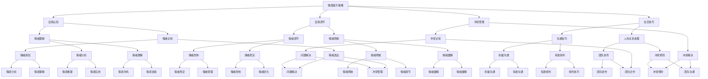

                 

### 文章标题：管理者情商：提升团队情绪管理能力

#### 关键词：情商、情绪管理、团队管理、领导力、冲突解决、沟通技巧

> 摘要：本文围绕管理者情商这一核心主题，详细探讨了情商的概念、重要性以及如何通过提升情绪管理能力来优化团队绩效。文章分为三大部分，首先阐述了情商的基础知识，包括情商的四个维度、情绪的类型与识别方法；其次介绍了团队情绪管理实践，如构建积极团队文化、情绪沟通技巧以及应对团队冲突的策略；最后分析了情商提升的方法、领导力与情商的关系以及未来发展趋势与挑战。通过本文的深入探讨，管理者可以更好地理解情商在团队管理中的关键作用，并为实际工作提供有力的指导。

## 《管理者情商：提升团队情绪管理能力》

### 第一部分：情商与情绪管理基础

在这部分中，我们将深入探讨情商的概念、情绪的类型与识别方法，以及情商提升策略。理解这些基础内容将为后续的团队情绪管理实践提供理论支持。

### 第1章：情商概述

#### 1.1 情商的定义与重要性

情商（Emotional Intelligence，简称EQ）是指个体识别、理解、管理自己和他人情绪的能力。情商的重要性体现在多个方面：

- **团队协作**：情商高的管理者能够更好地理解团队成员的情绪，从而促进团队协作和沟通。
- **领导力**：情商是领导力的核心要素，情商高的管理者能够激励和引导团队成员，提高团队整体绩效。
- **冲突解决**：情商高的管理者能够更有效地解决冲突，避免负面情绪的扩散。

#### 1.2 情商的四个维度

情商通常分为四个维度：

- **自我认知**：个体对自己的情绪和需求的认知，包括自我了解和自我反思。
- **自我调节**：个体对自己的情绪进行管理和调节，包括情绪控制和情绪释放。
- **社交技巧**：个体与他人沟通和建立良好关系的能力，包括沟通技巧和人际关系处理。
- **冲突管理**：个体在冲突情境中应对和解决问题的能力，包括冲突识别和冲突解决。

#### 1.3 情绪管理与团队情商的关系

情绪管理是情商的核心组成部分，它与团队情商有着密切的关系：

- **团队情商**：团队情商是指团队成员之间的情绪互动和管理能力。一个高情商的团队能够更好地应对外部压力和挑战，提高团队绩效。
- **情绪管理**：情绪管理是团队情商的基础，它包括情绪识别、情绪调节和情绪沟通等。有效的情绪管理能够促进团队成员之间的信任和合作。

### 第2章：情绪的类型与识别

#### 2.1 情绪的分类

情绪可以分为以下几类：

- **基本情绪**：喜、怒、哀、乐等基本情绪。
- **复杂情绪**：焦虑、恐惧、愤怒、厌恶等复杂情绪。
- **积极情绪**：快乐、满足、兴奋等积极情绪。
- **消极情绪**：沮丧、焦虑、愤怒等消极情绪。

#### 2.2 情绪识别的重要性

情绪识别是情绪管理的基础，它有助于：

- **自我认知**：了解自己的情绪，有助于自我反思和成长。
- **团队协作**：识别团队成员的情绪，有助于建立良好的团队关系和协作氛围。
- **冲突解决**：识别情绪，有助于找到冲突的根本原因，从而更有效地解决冲突。

#### 2.3 情绪识别的方法

情绪识别的方法包括：

- **自我反思**：通过自我观察和反思，了解自己的情绪。
- **情绪日记**：记录自己的情绪变化，有助于分析情绪的规律。
- **情绪测试**：通过专业的情绪测试工具，了解自己的情绪特点。

### 第3章：情商提升策略

#### 3.1 自我认知

自我认知是情商提升的基础，它包括：

- **自我反思**：定期进行自我反思，了解自己的情绪和行为。
- **情绪日记**：记录情绪变化，分析情绪的规律。
- **自我激励**：设定目标，激励自己不断成长。

#### 3.2 自我调节

自我调节是情商提升的关键，它包括：

- **情绪控制**：学会控制自己的情绪，避免情绪的失控。
- **情绪释放**：合理释放情绪，避免情绪的积累和压抑。

#### 3.3 社交技巧

社交技巧是情商提升的重要组成部分，它包括：

- **沟通技巧**：提高沟通能力，建立良好的沟通氛围。
- **人际关系处理**：学会处理复杂的人际关系，建立良好的人际网络。

#### 3.4 冲突管理

冲突管理是情商提升的重要应用，它包括：

- **冲突识别**：及时识别冲突，避免冲突的加剧。
- **冲突解决**：找到冲突的根本原因，采取有效的解决策略。

### 第二部分：团队情绪管理实践

在这一部分，我们将探讨如何通过实践提升团队情绪管理能力，包括构建积极团队文化、情绪沟通技巧以及应对团队冲突的策略。

### 第4章：构建积极团队文化

#### 4.1 团队文化的定义与作用

团队文化是指团队成员共同遵守的价值观、信念和行为准则。良好的团队文化能够：

- **增强团队凝聚力**：共同的目标和价值观能够增强团队成员之间的信任和合作。
- **提高团队绩效**：积极的团队文化能够激发团队成员的创造力和积极性，提高团队整体绩效。

#### 4.2 建立积极团队文化的策略

建立积极团队文化的策略包括：

- **明确价值观**：明确团队的价值观，确保团队成员有共同的目标和信念。
- **激励与奖励**：通过激励和奖励机制，鼓励团队成员积极参与团队活动。
- **沟通与反馈**：建立有效的沟通机制，及时反馈团队成员的工作情况。

#### 4.3 团队成员的情绪互动

团队成员的情绪互动对团队文化有着重要影响：

- **情绪识别**：团队成员应该学会识别自己的情绪，并理解他人的情绪。
- **情绪表达**：学会表达自己的情绪，并尊重他人的情绪。
- **情绪调节**：通过有效的情绪调节，避免负面情绪的扩散。

### 第5章：情绪沟通技巧

#### 5.1 有效沟通的重要性

有效沟通是团队情绪管理的关键，它能够：

- **减少误解**：通过明确的信息传递，减少误解和冲突。
- **增强信任**：通过有效的沟通，增强团队成员之间的信任。
- **提高团队绩效**：良好的沟通能够提高团队的整体绩效。

#### 5.2 情绪沟通的障碍与克服

情绪沟通的障碍包括：

- **情绪化**：情绪化的沟通容易导致误解和冲突。
- **语言障碍**：不同的人有不同的沟通风格，容易产生沟通障碍。

克服情绪沟通障碍的策略包括：

- **情绪调节**：在沟通前，学会调节自己的情绪。
- **倾听技巧**：通过倾听，理解他人的情绪和需求。
- **反馈技巧**：通过有效的反馈，确保信息的准确传递。

#### 5.3 情绪沟通的技巧

情绪沟通的技巧包括：

- **积极倾听**：通过积极的倾听，理解他人的情绪和需求。
- **表达技巧**：学会表达自己的情绪，并尊重他人的情绪。
- **非语言沟通**：通过身体语言、面部表情等，增强沟通的效果。

### 第6章：应对团队冲突

#### 6.1 团队冲突的类型与原因

团队冲突可以分为以下几类：

- **任务冲突**：由于工作任务的不同而产生的冲突。
- **关系冲突**：由于人际关系问题而产生的冲突。
- **价值观冲突**：由于价值观的不同而产生的冲突。

冲突的原因包括：

- **任务分工不明**：任务分工不明确容易导致冲突。
- **沟通不畅**：沟通不畅容易导致误解和冲突。
- **资源分配不公**：资源分配不公容易导致团队成员的不满。

#### 6.2 冲突解决的策略

冲突解决的策略包括：

- **直接沟通**：通过直接沟通，解决问题，避免冲突的加剧。
- **妥协与让步**：在无法达成一致时，通过妥协与让步，寻找共识。
- **第三方调解**：在冲突无法自行解决时，寻求第三方的调解。

#### 6.3 冲突管理中的情商应用

情商在冲突管理中的应用包括：

- **情绪识别**：通过情绪识别，了解冲突的根本原因。
- **情绪调节**：通过情绪调节，避免情绪化的决策。
- **沟通技巧**：通过有效的沟通技巧，解决冲突。

### 第7章：情商提升案例分析

在这一章中，我们将通过具体的案例，分析情商提升的策略和实践。

#### 7.1 案例一：成功提升团队情商的策略

案例一介绍了某公司通过一系列策略，成功提升了团队的情商：

- **团队建设活动**：定期组织团队建设活动，增强团队成员之间的信任和合作。
- **情绪培训**：邀请专业的情绪管理专家进行培训，提高团队成员的情绪管理能力。
- **反馈机制**：建立反馈机制，鼓励团队成员提出建议和反馈，优化团队文化。

#### 7.2 案例二：情商在危机管理中的应用

案例二描述了某公司在面临危机时，通过情商管理，成功化解了危机：

- **情绪识别**：及时识别和了解团队成员的情绪，避免情绪的失控。
- **情绪调节**：通过情绪调节，稳定团队成员的情绪，确保决策的科学性和合理性。
- **沟通技巧**：通过有效的沟通技巧，确保信息的准确传递，增强团队的凝聚力。

#### 7.3 案例三：情商提升与团队绩效的关系

案例三通过数据分析，展示了情商提升对团队绩效的积极影响：

- **绩效提升**：情商提升后，团队的整体绩效显著提升。
- **员工满意度**：员工满意度提高，离职率下降。
- **客户满意度**：客户满意度提高，业务增长。

### 第三部分：情商培养与团队发展

在这一部分，我们将探讨如何通过情商培养和领导力发展，提升团队的整体情商和绩效。

### 第8章：情商培训与开发

#### 8.1 情商培训的设计与实施

情商培训的设计与实施包括：

- **培训需求分析**：了解团队成员的情商水平和需求。
- **培训内容设计**：根据需求设计适合的培训内容。
- **培训实施**：通过实际操作，让团队成员掌握情商管理技巧。

#### 8.2 情商开发的方法与工具

情商开发的方法与工具包括：

- **自我反思**：通过自我反思，了解自己的情绪和需求。
- **情绪测试**：通过情绪测试，了解自己的情绪特点。
- **反馈机制**：通过反馈机制，了解自己的情绪管理效果。

#### 8.3 情商评估与反馈

情商评估与反馈包括：

- **评估标准**：根据情商的四个维度，制定评估标准。
- **反馈机制**：通过反馈机制，让团队成员了解自己的情绪管理效果。
- **改进措施**：根据评估结果，制定改进措施，提升情商。

### 第9章：领导力与情商

#### 9.1 领导力与情商的关系

领导力与情商密切相关：

- **情商高的领导者**：能够更好地理解团队成员的情绪，提高团队的凝聚力和绩效。
- **领导力的发展**：情商是领导力的重要组成部分，领导力的发展需要情商的支持。

#### 9.2 情商在领导力发展中的应用

情商在领导力发展中的应用包括：

- **情绪识别**：通过情绪识别，了解团队成员的情绪和需求。
- **情绪调节**：通过情绪调节，稳定团队成员的情绪，确保团队的稳定和高效。
- **沟通技巧**：通过有效的沟通技巧，增强团队的凝聚力和绩效。

#### 9.3 情商领导者的特质与行为

情商领导者的特质与行为包括：

- **自我认知**：能够自我认知，了解自己的情绪和需求。
- **情绪调节**：能够调节自己的情绪，保持情绪稳定。
- **社交技巧**：能够建立良好的人际关系，增强团队的凝聚力。

### 第10章：未来发展趋势与挑战

#### 10.1 情商研究的新进展

情商研究的新进展包括：

- **情绪神经科学**：通过情绪神经科学的研究，深入理解情绪的生理机制。
- **人工智能**：通过人工智能技术，开发情绪识别和管理工具。

#### 10.2 情商在企业中的应用前景

情商在企业中的应用前景包括：

- **团队管理**：通过情商管理，提升团队的凝聚力和绩效。
- **员工发展**：通过情商培养，提升员工的情绪管理能力，促进个人发展。

#### 10.3 情商面临的挑战与应对策略

情商面临的挑战包括：

- **文化差异**：不同文化背景下的情绪管理差异。
- **技术依赖**：过度依赖技术可能导致情绪管理的失调。

应对策略包括：

- **跨文化培训**：通过跨文化培训，提升团队成员的跨文化情绪管理能力。
- **技术辅助**：通过技术辅助，提升情绪识别和管理的准确性。

## 附录

### 附录A：情商相关研究文献推荐

1. Goleman, D. (1995). Emotional Intelligence. Bantam Books.
2. Mayer, J. D., Salovey, P., & Caruso, D. (1999). "MEG: Emotional intelligence as a standard personality dimension." Journal of Personality and Social Psychology, 76(2), 403-419.
3. Petrides, K. V., & Mikolajczak, M. (2011). "Emotional intelligence: What is it and how can it be measured?" In M. Mikolajczak & P. D. Zelizer (Eds.), Social and Emotional Development (pp. 25-43). Routledge.

### 附录B：情商提升练习与反思

1. **自我反思**：每天花几分钟时间进行自我反思，记录自己的情绪和反应。
2. **情绪日记**：每周记录一次情绪日记，分析情绪的起因和影响。
3. **情绪识别训练**：通过阅读、观看相关内容，提升情绪识别的能力。
4. **社交技巧训练**：通过参加社交活动，提升沟通和社交技巧。

### 附录C：情商工具与应用示例

1. **情绪识别工具**：使用情绪识别软件，如JoyMeter，进行情绪识别训练。
2. **情绪管理工具**：使用情绪管理工具，如EmoTrak，监控和调节情绪。
3. **团队情商测试**：使用团队情商测试工具，如Team EQ Assessment，评估团队情商水平。

### Mermaid 流程图

### 作者信息

作者：AI天才研究院/AI Genius Institute & 禅与计算机程序设计艺术/Zen And The Art of Computer Programming

---

通过本文的深入探讨，我们希望能够帮助管理者更好地理解情商在团队管理中的关键作用，并为实际工作提供有力的指导。情商的提升不仅有助于个人成长，更能促进团队的整体绩效。希望本文能对您的工作和生活有所启发。感谢您的阅读！

