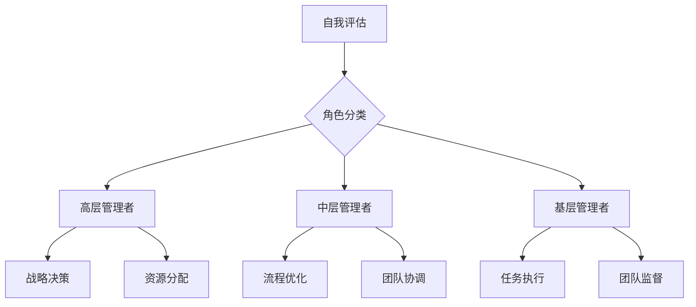
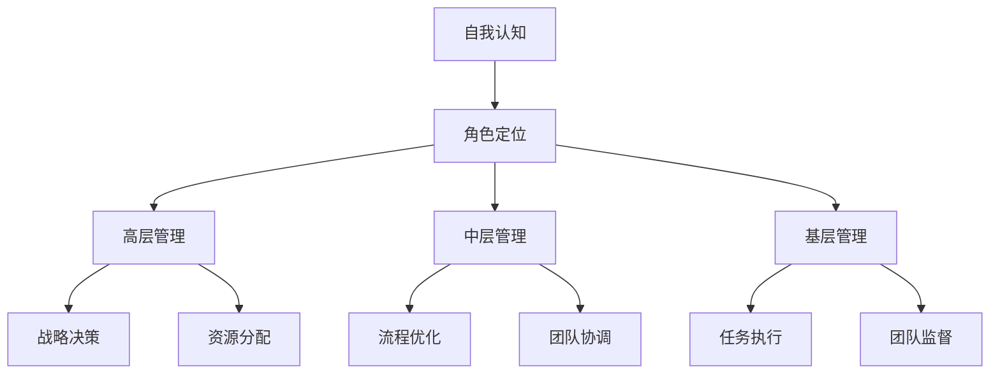

                 

### 文章标题

《管理者角色定位：在团队中找准定位》

### 关键词

管理者角色定位、团队协作、自我评估、职业发展、领导力提升

### 摘要

在快速变化的IT行业，管理者在团队中找准自己的角色定位，不仅能够提升个人领导力，还能促进团队的整体效率和业绩。本文通过逐步分析管理者的角色定位，探讨其在不同层次、部门和协作中的重要性。文章从自我评估、团队角色分析、团队协作、角色转变以及职业发展等方面进行深入探讨，并通过案例研究提供具体实践指导，旨在帮助管理者在复杂的环境中找准定位，实现个人与团队的双赢。

### 第一部分：管理者角色定位概述

#### 第1章：管理者角色定位的重要性

##### 1.1 管理者角色定位的基本概念

管理者角色定位是指个体在组织中的职责、权限、行为模式及其在团队协作中的作用。其基本概念包括：

- **角色定义**：角色是指在组织中执行特定任务和职责的个体行为模式。
- **角色定位**：定位是指个体如何根据组织目标和自身能力，选择和调整自己的角色。

角色定位的意义主要体现在以下几个方面：

- **明确职责**：通过角色定位，管理者能够清晰地了解自己的职责范围，避免职责重叠和推诿。
- **提高效率**：明确的角色定位有助于团队内部协作，减少沟通成本，提高工作效率。
- **促进成长**：角色定位有助于管理者根据自身能力和兴趣，制定职业发展规划。

##### 1.2 管理者角色定位的分类

管理者角色定位可以按照不同的维度进行分类：

- **不同层次的管理者角色**：高层管理者、中层管理者、基层管理者。
  - **高层管理者**：主要负责制定组织战略、决策和资源分配。
  - **中层管理者**：主要负责执行高层管理者制定的策略，协调各部门的工作。
  - **基层管理者**：主要负责具体项目的执行和管理，监督团队日常工作。

- **不同部门的管理者角色**：技术部门管理者、市场部门管理者、财务部门管理者等。
  - **技术部门管理者**：主要负责技术团队的建设、技术研发和项目推进。
  - **市场部门管理者**：主要负责市场分析、产品定位和营销策略。
  - **财务部门管理者**：主要负责财务管理、预算控制和风险防范。

##### 1.3 管理者角色定位的挑战

在团队协作中，管理者角色定位面临的挑战包括：

- **角色冲突**：由于不同部门和层级的职责重叠，管理者可能面临角色冲突。
- **个体角色与组织目标的平衡**：管理者需要在个人目标和组织目标之间找到平衡，确保团队协作的顺利进行。

#### 第2章：自我评估与管理角色定位

##### 2.1 自我评估的方法与工具

自我评估是管理者角色定位的第一步，它有助于管理者了解自己的能力、兴趣和职业发展方向。常用的自我评估方法与工具包括：

- **SWOT分析**：通过分析自身优势、劣势、机会和威胁，帮助管理者明确自身的定位。
- **360度反馈**：通过收集来自同事、上级和下属的评价，管理者可以更全面地了解自己的工作表现和角色定位。
- **职业兴趣测试**：通过职业兴趣测试，管理者可以了解自己适合从事哪些类型的工作，从而更好地定位自己的角色。

##### 2.2 自我认知与角色定位

自我认知是指个体对自己能力的认知和评估，它是角色定位的基础。自我认知与角色定位的关系体现在：

- **自我认知**：管理者通过自我评估，了解自己的能力和不足，从而确定适合自己的角色。
- **角色定位**：管理者根据自我认知，选择和调整在团队中的角色，以实现个人与团队的共同目标。

##### 2.3 如何进行有效的角色定位

有效的角色定位需要管理者遵循以下步骤：

1. **明确组织目标**：了解组织的整体目标和战略，确保自己的角色定位与组织目标一致。
2. **分析自身能力**：根据自我评估，确定自己的优势和劣势，找到最适合的角色。
3. **沟通与反馈**：与团队成员和上级沟通，获取反馈和建议，不断调整和优化自己的角色定位。
4. **持续学习与成长**：通过学习和实践，不断提升自己的能力和技能，以适应不断变化的工作环境。

### 第二部分：团队中的角色定位与协作

#### 第3章：团队角色分析

##### 3.1 团队角色分类

团队角色分类有助于管理者理解不同角色在团队中的职责和作用。常见的团队角色包括：

- **领导者角色**：领导者负责制定团队目标、规划工作流程和激励团队成员。
- **执行者角色**：执行者负责具体工作的执行和任务的完成。
- **支持者角色**：支持者提供必要的技术支持、资源保障和心理支持，确保团队目标的实现。
- **创新者角色**：创新者负责提出新的想法、改进方法和创新方案，推动团队的发展。

##### 3.2 不同角色在团队中的作用

不同角色在团队中的作用各有侧重：

- **领导者角色**：领导者通过决策、规划和协调，确保团队目标的实现。他们需要具备领导力、沟通能力和决策能力。
- **执行者角色**：执行者通过具体的工作任务完成团队目标。他们需要具备执行力、专业能力和团队合作精神。
- **支持者角色**：支持者通过提供必要的技术支持、资源保障和心理支持，确保团队目标的实现。他们需要具备服务意识、沟通能力和协作精神。
- **创新者角色**：创新者通过提出新的想法、改进方法和创新方案，推动团队的发展。他们需要具备创造力、洞察力和执行力。

##### 3.3 团队角色互动

团队角色互动是指不同角色在团队协作中的相互依赖和合作。有效的团队角色互动有助于提高团队的整体效率和绩效：

- **角色间的相互依赖**：领导者需要执行者的支持和创新者的创意，支持者需要领导者的指导和执行者的配合，创新者需要领导者的支持和执行者的实施。
- **角色冲突的处理**：当角色冲突发生时，管理者需要通过沟通、协调和妥协来解决问题，确保团队协作的顺利进行。

#### 第4章：团队协作与角色定位

##### 4.1 团队协作的重要性

团队协作是指团队成员共同为实现团队目标而合作的过程。其重要性体现在以下几个方面：

- **提高效率**：团队协作能够将每个人的优势结合起来，形成协同效应，提高整体工作效率。
- **激发创新**：团队协作能够激发成员之间的创意碰撞，促进新想法的产生。
- **增强凝聚力**：团队协作能够增强成员之间的信任和依赖，提高团队的凝聚力。

##### 4.2 团队角色定位与协作技巧

有效的团队角色定位与协作技巧包括：

- **明确角色定位**：每个成员都应明确自己的角色定位，了解自己在团队中的职责和作用。
- **相互尊重**：团队成员应相互尊重，理解并接受其他成员的角色定位，避免角色冲突。
- **有效沟通**：团队成员应保持有效沟通，及时分享信息、反馈意见和解决冲突。
- **灵活调整**：团队应根据项目需求和成员能力，灵活调整角色定位，确保团队目标的实现。

##### 4.3 提高团队协作效率的策略

提高团队协作效率的策略包括：

- **明确团队目标**：确保所有成员都清楚团队的目标和任务，避免目标不一致导致的工作低效。
- **建立有效的沟通机制**：通过定期会议、即时沟通工具等，确保信息的及时传递和有效沟通。
- **解决协作中的问题**：及时发现并解决协作中的问题，避免问题积累影响团队绩效。

#### 第5章：管理者的角色转变

##### 5.1 从执行者到领导者的转变

管理者从执行者角色向领导者角色的转变是一个关键过程。这一转变包括以下几个方面：

- **角色认识**：执行者需要认识到领导者的职责不仅仅是完成任务，还包括指导、激励和协调团队。
- **领导力培养**：执行者需要通过学习领导力理论和实践，提升自己的领导能力。
- **责任转变**：执行者需要从个人绩效转向团队绩效，关注整个团队的目标和成功。

##### 5.2 领导风格与角色定位

领导风格是指领导者处理团队事务的方式和方法。常见的领导风格包括：

- **权威型领导**：领导者通过权威和命令来指导团队，适合在紧急情况下快速决策。
- **民主型领导**：领导者通过征求团队成员的意见和建议来决策，适合在团队需要创新和协作的情况下。
- **参与型领导**：领导者鼓励团队成员参与决策，提高团队的参与感和责任感。

不同领导风格在角色定位中的应用：

- **权威型领导**：适用于需要快速决策和紧急应对的情况，领导者角色定位为决策者和指挥者。
- **民主型领导**：适用于需要创新和团队合作的情况，领导者角色定位为协调者和促进者。
- **参与型领导**：适用于需要团队成员积极参与和责任感提升的情况，领导者角色定位为支持者和指导者。

##### 5.3 领导力提升与角色定位

领导力提升对管理者角色定位有着重要影响。通过以下方法可以提升领导力：

- **学习领导力理论**：通过阅读领导力相关书籍和文章，了解不同领导风格和领导技巧。
- **参与领导力培训**：通过参加专业领导力培训课程，提升领导能力和实战经验。
- **实践领导力**：通过实际工作和项目，不断实践和磨练领导力。

### 第三部分：角色定位与职业发展

#### 第6章：角色定位与职业发展

##### 6.1 角色定位与职业规划

角色定位是职业规划的重要基础，它有助于管理者明确职业发展方向和目标。职业规划包括以下几个方面：

- **自我评估**：通过自我评估，了解自己的兴趣、能力和价值观，确定适合自己的职业领域和岗位。
- **目标设定**：根据自我评估结果，设定清晰的职业发展目标，包括短期和长期目标。
- **路径规划**：根据目标设定，制定职业发展路径，包括所需技能和经验的积累。
- **行动计划**：将职业发展目标分解为具体的行动计划，包括学习、实践和提升的步骤。

##### 6.2 职业发展路径的选择

不同的职业发展路径适合不同类型的管理者。常见的职业发展路径包括：

- **技术路线**：管理者通过不断学习新技术和提升专业技能，成为技术领域的专家。
- **管理路线**：管理者通过提升管理能力和领导力，逐步晋升为中层和高层管理者。
- **跨领域发展**：管理者通过跨领域学习和经验积累，拓宽职业发展空间，成为多领域的复合型人才。

选择适合自己的职业发展路径需要考虑以下因素：

- **个人兴趣和价值观**：选择与自己兴趣和价值观相符的职业路径，提高工作满意度和职业成就感。
- **行业前景**：考虑所在行业的前景和发展趋势，选择有潜力的职业发展路径。
- **个人能力和优势**：根据自己的能力和优势，选择能够充分发挥自身潜力的职业路径。

##### 6.3 职业发展中的角色转变

职业发展过程中，管理者需要面对多次角色转变。这些角色转变包括：

- **从初级职位到中级职位**：从执行者角色向管理者角色的转变，需要管理者提升领导力和管理能力。
- **从中级职位到高级职位**：从中层管理者向高层管理者的转变，需要管理者具备战略眼光和决策能力。
- **跨领域发展**：从某一领域向其他领域的转变，需要管理者具备跨领域的知识和技能。

应对职业发展中的角色转变，管理者可以采取以下策略：

- **持续学习**：通过学习新知识和技能，不断提升自己的综合素质。
- **积极沟通**：与上级、同事和下属保持良好的沟通，了解团队需求和期望。
- **勇于挑战**：接受新的工作挑战，通过实践锻炼自己的能力和信心。

#### 第7章：成功管理者角色定位的案例研究

##### 7.1 案例研究一：成功管理者的角色定位

**案例背景介绍**：某互联网公司技术部门经理李明，在公司成立初期担任技术负责人，带领团队进行技术研发和项目推进。随着公司的发展，李明晋升为技术总监，负责整个技术部门的管理和运营。

**管理者角色的成功定位**：

1. **明确角色定位**：李明明确自己的角色定位，从技术专家转向技术管理者，关注团队建设、技术战略和部门运营。
2. **提升领导力**：李明通过学习领导力理论和参与培训，提升自己的领导能力和管理技巧。
3. **协调资源**：李明积极协调各部门资源，确保团队目标的实现，推动公司整体发展。

**成功经验总结**：

- **角色明确**：管理者应明确自己的角色定位，避免角色重叠和冲突。
- **持续学习**：管理者应不断提升自己的领导力和管理能力，适应变化的工作环境。
- **资源协调**：管理者应具备协调资源的技巧，确保团队目标的实现。

##### 7.2 案例研究二：从普通员工到管理者的角色转变

**案例背景介绍**：某科技公司项目经理张强，从一名普通技术员工开始，通过不断努力和提升，最终成为项目经理，负责项目管理和团队领导。

**角色转变的过程与关键**：

1. **自我评估与职业规划**：张强通过自我评估，确定自己的职业发展方向，制定职业规划。
2. **学习与提升**：张强积极参加项目管理培训，学习项目管理知识和技能，提升自己的综合素质。
3. **积极承担职责**：张强在项目中积极承担责任，展示自己的领导才能，赢得上级和同事的认可。

**关键因素**：

- **自我评估**：明确自己的职业发展方向，制定合理的职业规划。
- **学习与提升**：通过学习新知识和技能，提升自己的综合素质。
- **承担责任**：在项目中积极承担责任，展示自己的领导才能。

##### 7.3 案例研究三：管理者的角色定位与团队建设

**案例背景介绍**：某软件开发公司部门经理王刚，在公司面临市场压力和团队士气低落的情况下，通过有效的角色定位和团队建设，成功带领团队走出困境。

**管理者角色定位在团队建设中的应用**：

1. **明确团队目标**：王刚与团队成员共同制定团队目标，确保团队目标的明确和可执行。
2. **培养团队文化**：王刚通过建立积极向上的团队文化，提升团队成员的凝聚力和工作效率。
3. **激励与支持**：王刚关注团队成员的需求和成长，提供必要的激励和支持，激发团队成员的潜力。

**成功经验总结**：

- **明确目标**：管理者应与团队共同制定明确的目标，确保团队目标的实现。
- **团队文化**：管理者应重视团队文化建设，提升团队的凝聚力和工作效率。
- **激励与支持**：管理者应关注团队成员的需求和成长，提供必要的激励和支持。

### 附录

#### 附录A：管理者角色定位工具与资源

**A.1 管理者角色定位工具介绍**

- **自我评估工具**：如SWOT分析、360度反馈等，帮助管理者了解自己的优势和不足。
- **团队角色分析工具**：如贝尔宾团队角色理论等，帮助管理者分析团队角色的分布和互动。

**A.2 管理者角色定位资源推荐**

- **经典管理书籍推荐**：如《领导者的资质》、《管理的实践》等，提供丰富的管理理论和实践经验。
- **管理者角色定位的相关课程与培训**：如PMP项目管理认证、领导力培训等，帮助管理者提升管理能力和角色定位。

#### 附录B：管理者的角色定位 Mermaid 流程图

**B.1 管理者角色定位流程图**



**B.2 管理者角色定位核心概念与联系 Mermaid 流程图**



#### 附录C：管理者的角色定位算法原理讲解与伪代码

**C.1 核心算法原理讲解**

管理者的角色定位算法是一种基于数据分析和机器学习的方法，用于识别和推荐个体在团队中的最佳角色。算法的核心原理包括：

1. **数据收集**：收集管理者的个人能力数据、团队信息、任务需求等。
2. **特征提取**：从数据中提取关键特征，如技能水平、经验、团队角色偏好等。
3. **模型训练**：使用机器学习算法，如决策树、神经网络等，训练角色定位模型。
4. **角色推荐**：根据模型输出，为管理者推荐最佳角色。

**C.2 伪代码实现**

```python
# 管理者角色定位算法伪代码

# 输入：管理者个人能力数据、团队信息、任务需求
# 输出：最佳角色推荐

def role_assignment(manager_data, team_info, task_requirement):
    # 数据预处理
    preprocess_data(manager_data, team_info, task_requirement)
    
    # 特征提取
    manager_features = extract_features(manager_data)
    team_features = extract_features(team_info)
    task_features = extract_features(task_requirement)
    
    # 模型训练
    model = train_model(manager_features, team_features, task_features)
    
    # 角色推荐
    best_role = model.predict(manager_features)
    
    return best_role
```

#### 附录D：管理者的角色定位数学模型与公式讲解

**D.1 数学模型讲解**

管理者的角色定位可以通过多种数学模型来实现，如线性规划、神经网络等。以下是线性规划模型的一个简例：

1. **目标函数**：最大化或最小化管理者的角色满意度。
2. **约束条件**：满足组织目标、团队需求和个体能力限制。

**D.2 数学公式讲解**

线性规划模型的目标函数和约束条件可以表示为：

$$
\text{最大化或最小化} \quad Z = c^T \cdot x
$$

其中，$Z$ 为目标函数，$c$ 为权重向量，$x$ 为角色分配向量。

约束条件为：

$$
Ax \leq b
$$

其中，$A$ 为约束矩阵，$b$ 为约束向量。

**D.3 举例说明**

假设一个团队有4个角色（领导者、执行者、支持者、创新者），每个角色的权重分别为 $c_1, c_2, c_3, c_4$。约束条件为每个角色的人数不超过团队总人数的一半。

目标函数为最大化团队角色满意度，即：

$$
\text{最大化} \quad Z = c_1 \cdot x_1 + c_2 \cdot x_2 + c_3 \cdot x_3 + c_4 \cdot x_4
$$

约束条件为：

$$
\begin{cases}
x_1 + x_2 + x_3 + x_4 \leq 4 \\
x_1, x_2, x_3, x_4 \geq 0
\end{cases}
$$

通过求解线性规划模型，可以得到最优的角色分配方案。

