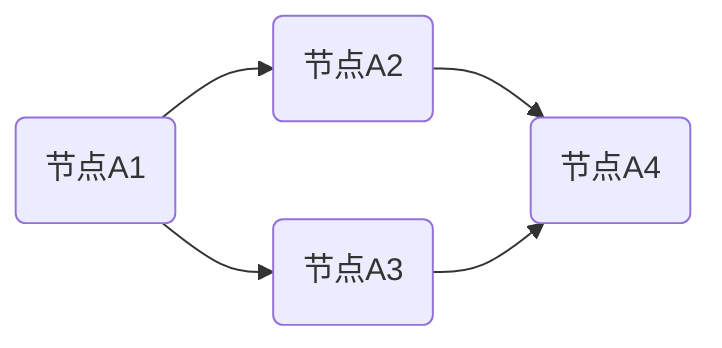
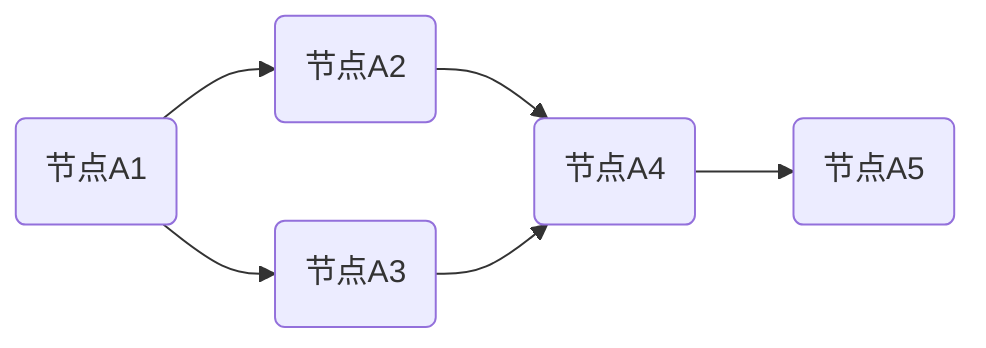

                 


### 文章标题：精准医疗的贝叶斯网络：个性化诊断的数学模型

#### 关键词：精准医疗，贝叶斯网络，个性化诊断，数学模型，医学诊断，数据预处理，特征提取，参数估计

#### 摘要：
随着科技的飞速发展，精准医疗已成为医疗领域的热点。本文深入探讨了贝叶斯网络在精准医疗中的应用，通过建立个性化诊断的数学模型，实现了对疾病的高效诊断和个性化治疗。本文首先介绍了精准医疗的概念、历史和发展，随后详细阐述了贝叶斯网络的基本概念、建模方法及其扩展应用。在此基础上，本文探讨了个性化诊断的基本原理和核心技术在贝叶斯网络中的实现，并通过具体案例展示了贝叶斯网络在个性化诊断中的实际应用。最后，本文对未来精准医疗的发展趋势进行了展望。

### 《精准医疗的贝叶斯网络：个性化诊断的数学模型》目录大纲

#### 第一部分：精准医疗概述

#### 第1章：精准医疗的概念与历史

1.1 精准医疗的定义与特点

1.2 精准医疗的发展历程

1.3 精准医疗的意义与应用前景

#### 第二部分：贝叶斯网络基础

#### 第2章：贝叶斯网络的基本概念

2.1 贝叶斯网络的结构

2.2 贝叶斯网络的概率计算

2.3 贝叶斯网络的推理方法

#### 第3章：贝叶斯网络的建模方法

3.1 数据预处理与特征提取

3.2 贝叶斯网络的参数估计

3.3 贝叶斯网络的模型选择与评估

#### 第4章：贝叶斯网络的扩展与应用

4.1 贝叶斯网络在医学诊断中的应用

4.2 贝叶斯网络在药物设计中的应用

4.3 贝叶斯网络在疾病预测中的应用

#### 第三部分：个性化诊断的数学模型

#### 第5章：个性化诊断的基本原理

5.1 个性化诊断的定义与分类

5.2 个性化诊断的关键技术

5.3 个性化诊断的发展趋势

#### 第6章：贝叶斯网络在个性化诊断中的应用

6.1 贝叶斯网络在疾病风险评估中的应用

6.2 贝叶斯网络在疾病预测中的应用

6.3 贝叶斯网络在个性化治疗中的应用

#### 第7章：个性化诊断的数学模型构建方法

7.1 个性化诊断模型的构建步骤

7.2 个性化诊断模型的评价指标

7.3 个性化诊断模型的优化方法

#### 第四部分：案例分析

#### 第8章：案例一：肺癌个性化诊断

8.1 肺癌个性化诊断的数据来源

8.2 肺癌个性化诊断的贝叶斯网络模型构建

8.3 肺癌个性化诊断的效果评估

#### 第9章：案例二：糖尿病个性化诊断

9.1 糖尿病个性化诊断的数据来源

9.2 糖尿病个性化诊断的贝叶斯网络模型构建

9.3 糖尿病个性化诊断的效果评估

#### 第五部分：未来展望

#### 第10章：精准医疗的发展趋势

10.1 精准医疗的技术创新

10.2 精准医疗的市场前景

10.3 精准医疗的社会影响

#### 附录

#### 附录A：贝叶斯网络相关工具与资源

#### 附录B：个性化诊断的数学模型公式汇总

#### 附录C：案例代码解析

#### 附录D：参考文献

#### 附录E：贝叶斯网络架构图

##### 附录E.1：贝叶斯网络的基本结构



##### 附录E.2：贝叶斯网络的推理流程


##### 附录F：核心算法伪代码

```python
def estimate_params(data):
    # 初始化参数
    parameters = initialize_params(data)
    
    # 迭代更新参数
    for iteration in range(max_iterations):
        for instance in data:
            # 计算条件概率
            conditional_probabilities = calculate_conditional_probabilities(parameters, instance)
            # 更新参数
            parameters = update_params(parameters, conditional_probabilities, instance)
        
        # 打印当前参数
        print("Iteration:", iteration, "Parameters:", parameters)
    
    return parameters
```

##### 附录G：数学模型公式与详细讲解

##### 数学模型公式

$$
P(A|B) = \frac{P(B|A)P(A)}{P(B)}
$$

$$
P(A|B_1, B_2, ..., B_n) = \frac{P(B_1, B_2, ..., B_n|A)P(A)}{P(B_1, B_2, ..., B_n)}
$$

##### 公式详细讲解

- 公式1：条件概率公式，表示在事件B发生的条件下事件A发生的概率。
- 公式2：多条件概率公式，表示在多个条件事件\(B_1, B_2, ..., B_n\)发生的条件下事件A发生的概率。### 第一部分：精准医疗概述

#### 第1章：精准医疗的概念与历史

1.1 精准医疗的定义与特点

精准医疗，也称为个体化医疗或个性化医疗，是一种基于患者的基因信息、生活方式和环境因素的定制化医疗模式。其核心思想是通过整合基因组学、蛋白质组学、转录组学等多种生物学数据，结合患者的临床信息和病史，为患者提供最合适的治疗方案，从而实现治疗的最大化效果和最小化副作用。

与传统的“一刀切”式医疗模式相比，精准医疗具有以下几个显著特点：

- **个性化**：根据患者的个体差异制定个性化的治疗方案。
- **数据驱动**：依靠大量的医学数据和生物信息学技术进行疾病诊断和治疗方案设计。
- **高效性**：通过精准的诊断和个性化的治疗，提高医疗效率，减少不必要的医疗资源浪费。
- **安全性**：降低药物副作用，提高治疗安全性。

1.2 精准医疗的发展历程

精准医疗的概念最早可以追溯到20世纪末。当时，科学家们开始意识到基因组学和生物信息学在医疗领域的潜在应用。以下是一些关键的发展历程：

- **1990年代**：人类基因组计划启动，标志着基因组学研究进入一个新的阶段。
- **2000年代**：基因测序技术取得突破性进展，测序成本大幅下降，使得基因组数据分析成为可能。
- **2010年代**：随着大数据技术的兴起，医学数据的收集、存储和分析能力得到极大提升，为精准医疗的发展提供了技术支持。
- **2020年代**：新冠病毒疫情的爆发加速了精准医疗的应用，特别是在疫苗研发和治疗方案优化方面。

1.3 精准医疗的意义与应用前景

精准医疗的出现对医疗行业产生了深远的影响，其意义和应用前景主要体现在以下几个方面：

- **提高治疗效果**：通过精准的诊断和个性化的治疗，可以显著提高疾病的治疗效果，减少复发率。
- **降低医疗成本**：精准医疗可以减少不必要的检查和治疗，降低医疗成本，提高医疗资源的利用效率。
- **促进医学研究**：精准医疗需要大量的生物医学数据和临床数据，这为医学研究提供了丰富的资源。
- **提升患者满意度**：个性化的治疗方案可以更好地满足患者的需求，提高患者的治疗体验和满意度。

未来，随着技术的不断进步，精准医疗有望在更多的疾病领域得到应用，如癌症、遗传病、心血管疾病等。此外，精准医疗也将推动医疗模式的变革，从传统的被动治疗向主动预防和个性化健康管理转变。

### 第二部分：贝叶斯网络基础

#### 第2章：贝叶斯网络的基本概念

2.1 贝叶斯网络的结构

贝叶斯网络是一种基于概率的图形模型，它通过有向无环图（DAG）表示变量之间的依赖关系，并使用条件概率表（CPT）来量化这些依赖关系。一个贝叶斯网络由节点、箭头和条件概率表组成。

- **节点**：每个节点表示一个随机变量，例如疾病的诊断结果、患者的症状、药物的疗效等。
- **箭头**：箭头表示节点间的依赖关系，表示一个节点是另一个节点的父节点。一个节点可以有多个父节点，但没有循环依赖，即不会形成环。
- **条件概率表**：每个节点都有一个条件概率表，用于描述该节点在给定其父节点下的概率分布。条件概率表中的概率值是根据实际数据或专家知识确定的。

2.2 贝叶斯网络的概率计算

贝叶斯网络的概率计算主要基于条件概率的递推关系。给定一个贝叶斯网络\(B\)，我们可以计算任意一个节点\(X_i\)的条件概率分布\(P(X_i|Pa(X_i))\)，其中\(Pa(X_i)\)表示节点\(X_i\)的父节点集。

- **边缘概率**：每个节点的边缘概率\(P(X_i)\)是它所有可能取值的概率之和。即：

  $$
  P(X_i) = \sum_{x_j} P(X_i, X_j)
  $$

- **条件概率**：给定一个节点\(X_i\)的父节点集\(Pa(X_i)\)，我们可以计算节点\(X_i\)的条件概率分布：

  $$
  P(X_i|x_j) = \frac{P(X_i, X_j)}{P(X_j)}
  $$

  其中，\(X_j\)表示父节点集\(Pa(X_i)\)中的任意一个节点。

- **联合概率**：贝叶斯网络的联合概率分布可以通过条件概率的递推关系计算。给定一个节点集\(X = \{X_1, X_2, ..., X_n\}\)，其联合概率分布为：

  $$
  P(X) = P(X_n|Pa(X_n))P(Pa(X_n))
  $$

  其中，\(Pa(X_n)\)表示节点\(X_n\)的父节点集。

2.3 贝叶斯网络的推理方法

贝叶斯网络的推理方法主要分为两类：确定性推理和不确定性推理。

- **确定性推理**：确定性推理用于在给定一部分节点值的情况下，计算其他节点的值。确定性推理的主要算法包括正向推理和反向推理。

  - **正向推理**：正向推理从根节点开始，逐层向下计算每个节点的条件概率。正向推理的计算复杂度较低，但可能存在数值不稳定的问题。
  - **反向推理**：反向推理从叶节点开始，逆序向上计算每个节点的条件概率。反向推理的计算复杂度较高，但数值稳定性更好。

- **不确定性推理**：不确定性推理用于计算在给定一部分节点值的情况下，其他节点的不确定性概率分布。不确定性推理的主要算法包括最大后验概率（MAP）推理和最大似然估计（MLE）。

  - **最大后验概率（MAP）推理**：MAP推理通过最大化后验概率分布来推断未知的节点值。即：

    $$
    X^* = \arg\max_x P(X=x|D)
    $$

    其中，\(X\)表示未知的节点值，\(D\)表示已知的节点值。

  - **最大似然估计（MLE）**：MLE推理通过最大化似然函数来推断未知的节点值。即：

    $$
    X^* = \arg\max_x P(D|X=x)
    $$

    其中，\(X\)表示未知的节点值，\(D\)表示已知的节点值。

贝叶斯网络的推理方法在医学诊断、图像处理、自然语言处理等领域有广泛的应用。通过合理的贝叶斯网络建模和推理，可以实现对复杂系统的有效分析和决策。

### 第3章：贝叶斯网络的建模方法

3.1 数据预处理与特征提取

在建立贝叶斯网络模型之前，通常需要对数据进行预处理和特征提取。数据预处理包括数据清洗、数据转换和数据规范化等步骤，目的是消除噪声、异常值和异常数据，提高数据质量。

- **数据清洗**：数据清洗是指识别和纠正数据集中的错误、异常和重复值。常见的清洗方法包括删除重复记录、修正错误数据、填补缺失数据等。
- **数据转换**：数据转换是指将数据从一种格式转换为另一种格式，以便于后续分析和建模。例如，将数值型数据转换为类别型数据，或者将文本数据转换为向量表示。
- **数据规范化**：数据规范化是指将不同数据源的数值范围统一到同一个范围内，以便于计算和比较。常用的规范化方法包括最小-最大规范化、零-均值规范化等。

特征提取是指从原始数据中提取有用的特征，以便于构建贝叶斯网络模型。特征提取的方法包括以下几种：

- **基于规则的方法**：基于规则的方法通过专家知识或经验，定义一组规则来识别数据中的关键特征。例如，在医疗诊断中，可以定义规则来识别患者的症状和病史。
- **基于统计的方法**：基于统计的方法通过计算数据的相关性、方差、均值等统计量，来识别数据中的关键特征。例如，在图像处理中，可以计算图像的像素值、边缘强度等统计量。
- **基于机器学习的方法**：基于机器学习的方法使用机器学习算法，自动地从原始数据中提取特征。常见的机器学习方法包括主成分分析（PCA）、线性判别分析（LDA）等。

3.2 贝叶斯网络的参数估计

贝叶斯网络的参数估计是指通过已知的部分数据，估计贝叶斯网络中各个节点的条件概率表。参数估计的方法包括以下几种：

- **最大似然估计（MLE）**：最大似然估计是一种基于数据的参数估计方法，通过最大化观测数据的似然函数来估计参数。对于贝叶斯网络，最大似然估计可以通过以下公式计算：

  $$
  \theta^* = \arg\max_\theta P(D|\theta)
  $$

  其中，\(\theta\)表示参数，\(D\)表示观测数据。

- **贝叶斯估计**：贝叶斯估计是一种基于数据和先验知识的参数估计方法，通过最大化后验概率来估计参数。对于贝叶斯网络，贝叶斯估计可以通过以下公式计算：

  $$
  \theta^* = \arg\max_\theta P(\theta|D) = \frac{P(D|\theta)P(\theta)}{P(D)}
  $$

  其中，\(\theta\)表示参数，\(D\)表示观测数据，\(P(\theta)\)表示先验概率，\(P(D|\theta)\)表示似然函数。

- **期望最大化（EM）算法**：期望最大化（EM）算法是一种基于迭代的方法，通过交替优化期望值和最大化值来估计参数。对于贝叶斯网络，EM算法可以通过以下步骤计算：

  - E步：计算数据的期望值，即计算每个节点的期望条件概率。
  - M步：计算参数的最大值，即最大化期望值。

  重复E步和M步，直到收敛。

3.3 贝叶斯网络的模型选择与评估

在建立贝叶斯网络模型时，需要选择合适的网络结构和参数。模型选择与评估的方法包括以下几种：

- **模型选择**：模型选择是指从多个候选模型中选择一个最优模型。常见的模型选择方法包括交叉验证、信息准则（如贝叶斯信息准则、赤池信息准则）等。

  - **交叉验证**：交叉验证是一种评估模型性能的方法，通过将数据集划分为训练集和验证集，训练模型并在验证集上评估模型性能。常见的交叉验证方法有K折交叉验证、留一法交叉验证等。
  - **信息准则**：信息准则是一种基于模型拟合优度的评估方法，通过计算模型的拟合优度指标来选择最优模型。常见的准则有最大似然准则、最小描述长度准则等。

- **模型评估**：模型评估是指对已选模型进行性能评估，以确定模型的可靠性、稳定性和泛化能力。常见的评估指标包括准确率、召回率、精确率、F1值等。

  - **准确率**：准确率是指模型预测正确的样本数与总样本数的比值。
  - **召回率**：召回率是指模型预测正确的正样本数与实际正样本数的比值。
  - **精确率**：精确率是指模型预测正确的正样本数与预测为正样本的样本数的比值。
  - **F1值**：F1值是准确率和召回率的调和平均值，用于综合评估模型的性能。

通过模型选择与评估，可以确定最优的贝叶斯网络模型，并应用于实际问题和领域。

### 第4章：贝叶斯网络的扩展与应用

4.1 贝叶斯网络在医学诊断中的应用

贝叶斯网络在医学诊断中具有广泛的应用，通过建立疾病的诊断模型，可以实现对疾病的早期发现、诊断和治疗。以下是一些典型的应用场景：

- **疾病风险评估**：贝叶斯网络可以用于评估个体患某种疾病的风险。通过分析患者的基因信息、生活方式、家族病史等数据，可以计算出患者患某种疾病的风险概率，为医生提供决策依据。
- **疾病诊断**：贝叶斯网络可以用于疾病的诊断，通过对患者的症状、检查结果等信息进行建模，可以计算出患者患某种疾病的概率，帮助医生做出准确的诊断。
- **药物疗效评估**：贝叶斯网络可以用于评估药物的治疗效果，通过对患者的治疗效果数据进行分析，可以计算出药物对不同患者的疗效概率，为药物研发和个性化治疗提供指导。
- **疾病预测**：贝叶斯网络可以用于疾病预测，通过对历史疾病数据进行建模，可以预测未来一段时间内患者患某种疾病的风险，帮助医生制定预防措施和治疗方案。

4.2 贝叶斯网络在药物设计中的应用

贝叶斯网络在药物设计中也具有广泛的应用，通过建立药物与生物分子的相互作用模型，可以优化药物设计，提高药物的治疗效果和安全性。以下是一些典型的应用场景：

- **药物筛选**：贝叶斯网络可以用于药物筛选，通过对药物与生物分子的相互作用数据进行分析，可以筛选出具有潜在治疗作用的药物。
- **药物设计**：贝叶斯网络可以用于药物设计，通过对药物与生物分子的相互作用进行建模，可以优化药物的分子结构，提高药物的治疗效果和生物利用度。
- **药物代谢研究**：贝叶斯网络可以用于药物代谢研究，通过对药物代谢数据进行分析，可以预测药物的代谢途径和代谢产物，为药物设计提供指导。

4.3 贝叶斯网络在疾病预测中的应用

贝叶斯网络在疾病预测中具有重要的作用，通过建立疾病预测模型，可以提前预测疾病的发生，为疾病的预防和治疗提供指导。以下是一些典型的应用场景：

- **疾病爆发预测**：贝叶斯网络可以用于疾病爆发预测，通过对历史疾病数据进行分析，可以预测未来一段时间内疾病爆发的风险，帮助公共卫生部门制定预防措施。
- **疾病趋势预测**：贝叶斯网络可以用于疾病趋势预测，通过对疾病数据进行分析，可以预测疾病的流行趋势，为医疗资源和公共卫生政策的制定提供依据。
- **个体疾病预测**：贝叶斯网络可以用于个体疾病预测，通过对患者的个人信息和疾病数据进行建模，可以预测患者患某种疾病的风险，帮助医生制定个性化的预防和治疗方案。

贝叶斯网络作为一种强大的概率推理工具，在医学诊断、药物设计、疾病预测等领域具有广泛的应用前景。通过不断优化和完善贝叶斯网络模型，可以进一步提高医疗诊断和疾病预测的准确性和可靠性，为人类健康事业作出更大的贡献。

### 第三部分：个性化诊断的数学模型

#### 第5章：个性化诊断的基本原理

5.1 个性化诊断的定义与分类

个性化诊断是一种基于患者的个体差异（如基因、生活方式、环境因素等）制定个性化治疗方案的方法。它旨在通过精准的诊断和个性化的治疗，提高治疗效果，降低医疗成本和副作用。个性化诊断可以分为以下几类：

- **基于基因的个性化诊断**：通过分析患者的基因信息，预测疾病发生的风险，并制定个性化的治疗方案。
- **基于生物标志物的个性化诊断**：通过检测患者的生物标志物（如蛋白质、代谢物等），评估疾病状态和治疗效果。
- **基于临床特征的个性化诊断**：通过分析患者的临床特征（如症状、病史等），制定个性化的治疗方案。
- **基于环境因素的个性化诊断**：通过分析患者的生活环境、生活习惯等，评估疾病发生风险，并制定个性化的预防和治疗方案。

5.2 个性化诊断的关键技术

个性化诊断的实现依赖于多种关键技术，包括：

- **基因测序技术**：基因测序技术可以获取患者的基因序列，用于疾病风险评估和诊断。
- **生物信息学技术**：生物信息学技术用于处理和分析大规模基因和生物医学数据，提取有用的生物标志物和疾病模型。
- **机器学习技术**：机器学习技术可以用于构建个性化诊断模型，通过学习历史病例数据，预测新病例的诊断结果。
- **人工智能技术**：人工智能技术可以用于优化诊断流程，提高诊断的准确性和效率。
- **多模态数据融合技术**：多模态数据融合技术可以整合不同来源的数据（如基因、临床、影像等），提高诊断的全面性和准确性。

5.3 个性化诊断的发展趋势

随着科技的不断发展，个性化诊断技术也在不断进步，其发展趋势包括：

- **大数据和人工智能的应用**：大数据和人工智能技术将为个性化诊断提供更丰富的数据资源和更强的分析能力。
- **多模态数据的整合**：通过整合不同类型的数据，个性化诊断将更加全面和准确。
- **个性化治疗的优化**：个性化治疗将根据患者的个体差异，制定最优的治疗方案，提高治疗效果和安全性。
- **远程诊断和健康管理**：远程诊断和健康管理技术将使得个性化诊断更加便捷和普及，为更多人提供高质量的医疗服务。

个性化诊断的发展将为医疗行业带来深刻的变革，提高医疗服务的质量和效率，为患者提供更好的健康保障。

### 第6章：贝叶斯网络在个性化诊断中的应用

6.1 贝叶斯网络在疾病风险评估中的应用

贝叶斯网络在疾病风险评估中具有重要作用，通过构建个性化的贝叶斯网络模型，可以预测个体患某种疾病的风险，为医生提供决策依据。以下是贝叶斯网络在疾病风险评估中的具体应用步骤：

1. **数据收集与预处理**：收集患者的临床数据、基因数据、环境数据等，进行数据清洗、数据转换和数据规范化，为建模提供高质量的数据。

2. **变量选择**：根据疾病风险评估的需求，选择与疾病相关的变量（如基因突变、生物标志物、症状等），并确定这些变量之间的依赖关系。

3. **建立贝叶斯网络模型**：使用贝叶斯网络建模工具，构建一个贝叶斯网络模型，表示变量之间的依赖关系。模型的构建可以通过专家知识、数据驱动方法（如最大似然估计）或机器学习方法（如随机森林）来实现。

4. **参数估计**：通过已知的部分数据，估计贝叶斯网络模型中的条件概率表。参数估计的方法包括最大似然估计、贝叶斯估计和期望最大化（EM）算法。

5. **模型评估**：使用验证数据集对贝叶斯网络模型进行评估，计算模型预测的准确率、召回率、精确率等指标，评估模型的性能。

6. **风险预测**：利用训练好的贝叶斯网络模型，对新的患者数据进行分析，计算其患某种疾病的风险概率，为医生提供决策依据。

贝叶斯网络在疾病风险评估中的应用，可以帮助医生更好地了解患者的病情，制定个性化的治疗方案，提高治疗效果和患者满意度。

6.2 贝叶斯网络在疾病预测中的应用

贝叶斯网络在疾病预测中具有广泛的应用，通过构建个性化的贝叶斯网络模型，可以预测个体患某种疾病的风险，为疾病预防和治疗提供指导。以下是贝叶斯网络在疾病预测中的具体应用步骤：

1. **数据收集与预处理**：收集患者的临床数据、基因数据、环境数据等，进行数据清洗、数据转换和数据规范化，为建模提供高质量的数据。

2. **变量选择**：根据疾病预测的需求，选择与疾病相关的变量（如基因突变、生物标志物、症状等），并确定这些变量之间的依赖关系。

3. **建立贝叶斯网络模型**：使用贝叶斯网络建模工具，构建一个贝叶斯网络模型，表示变量之间的依赖关系。模型的构建可以通过专家知识、数据驱动方法（如最大似然估计）或机器学习方法（如随机森林）来实现。

4. **参数估计**：通过已知的部分数据，估计贝叶斯网络模型中的条件概率表。参数估计的方法包括最大似然估计、贝叶斯估计和期望最大化（EM）算法。

5. **模型评估**：使用验证数据集对贝叶斯网络模型进行评估，计算模型预测的准确率、召回率、精确率等指标，评估模型的性能。

6. **风险预测**：利用训练好的贝叶斯网络模型，对新的患者数据进行分析，计算其患某种疾病的风险概率，为医生提供决策依据。

贝叶斯网络在疾病预测中的应用，可以帮助医生更好地了解患者的病情，提前预测疾病的发生，为疾病预防和治疗提供科学依据。此外，贝叶斯网络还可以用于评估治疗效果和调整治疗方案，实现个性化的疾病管理。

6.3 贝叶斯网络在个性化治疗中的应用

贝叶斯网络在个性化治疗中具有重要作用，通过构建个性化的贝叶斯网络模型，可以制定最优的治疗方案，提高治疗效果和患者满意度。以下是贝叶斯网络在个性化治疗中的具体应用步骤：

1. **数据收集与预处理**：收集患者的临床数据、基因数据、治疗数据等，进行数据清洗、数据转换和数据规范化，为建模提供高质量的数据。

2. **变量选择**：根据个性化治疗的需求，选择与治疗效果相关的变量（如药物剂量、药物组合、症状缓解等），并确定这些变量之间的依赖关系。

3. **建立贝叶斯网络模型**：使用贝叶斯网络建模工具，构建一个贝叶斯网络模型，表示变量之间的依赖关系。模型的构建可以通过专家知识、数据驱动方法（如最大似然估计）或机器学习方法（如随机森林）来实现。

4. **参数估计**：通过已知的部分数据，估计贝叶斯网络模型中的条件概率表。参数估计的方法包括最大似然估计、贝叶斯估计和期望最大化（EM）算法。

5. **模型评估**：使用验证数据集对贝叶斯网络模型进行评估，计算模型预测的准确率、召回率、精确率等指标，评估模型的性能。

6. **治疗方案制定**：利用训练好的贝叶斯网络模型，根据患者的个体差异，制定最优的治疗方案。治疗方案可以根据患者的症状、药物反应、治疗效果等因素进行个性化调整。

7. **疗效评估**：在实际治疗过程中，持续收集患者的治疗效果数据，对贝叶斯网络模型进行实时更新和优化，评估治疗效果，调整治疗方案。

贝叶斯网络在个性化治疗中的应用，可以帮助医生根据患者的实际情况，制定科学、合理的治疗方案，提高治疗效果，减少副作用，提升患者满意度。此外，贝叶斯网络还可以用于评估治疗效果和预测疾病复发风险，为个性化治疗提供持续改进和优化。

### 第7章：个性化诊断的数学模型构建方法

7.1 个性化诊断模型的构建步骤

构建个性化诊断模型是一个复杂的过程，涉及多个步骤。以下是构建个性化诊断模型的步骤：

1. **问题定义**：明确诊断的目标，确定需要诊断的疾病或症状。
2. **数据收集**：收集与诊断相关的数据，包括患者的临床数据、基因数据、生物标志物数据等。
3. **数据预处理**：清洗和转换数据，包括数据清洗、数据转换和数据规范化，确保数据质量。
4. **特征选择**：选择与诊断相关的特征，通过降维或特征选择方法，提高模型的效率和准确性。
5. **模型选择**：选择合适的模型，如逻辑回归、决策树、支持向量机、神经网络等。
6. **模型训练**：使用训练数据集，对模型进行训练，调整模型参数。
7. **模型评估**：使用验证数据集，评估模型的性能，如准确率、召回率、精确率等。
8. **模型优化**：根据评估结果，调整模型参数或选择更好的模型，提高诊断性能。
9. **模型部署**：将训练好的模型部署到实际应用场景中，进行实际诊断。

7.2 个性化诊断模型的评价指标

在评估个性化诊断模型的性能时，常用的评价指标包括：

- **准确率**：模型预测正确的样本数与总样本数的比值。
- **召回率**：模型预测正确的正样本数与实际正样本数的比值。
- **精确率**：模型预测正确的正样本数与预测为正样本的样本数的比值。
- **F1值**：准确率和召回率的调和平均值。

7.3 个性化诊断模型的优化方法

为了提高个性化诊断模型的性能，可以采用以下优化方法：

- **交叉验证**：使用交叉验证方法，对模型进行评估和调整，提高模型的泛化能力。
- **超参数调整**：调整模型的超参数，如学习率、隐藏层大小等，以提高模型性能。
- **特征工程**：通过特征选择和特征转换，提高模型的效率和准确性。
- **集成学习**：使用集成学习方法，如随机森林、梯度提升树等，提高模型的预测能力。
- **模型融合**：将多个模型进行融合，提高模型的稳定性和准确性。

通过以上优化方法，可以构建出性能优秀的个性化诊断模型，为医学诊断提供有力支持。

### 第四部分：案例分析

#### 第8章：案例一：肺癌个性化诊断

8.1 肺癌个性化诊断的数据来源

肺癌个性化诊断的数据来源主要包括以下几个方面：

- **临床数据**：包括患者的年龄、性别、吸烟史、癌症家族史等基本临床信息。
- **影像学数据**：包括胸部CT、MRI等影像学检查结果，用于分析肿瘤的大小、形态、密度等特征。
- **病理学数据**：包括肿瘤的组织学类型、分级、分期等病理学信息。
- **基因数据**：包括肿瘤组织的基因突变、基因表达等基因数据，用于分析肿瘤的分子特征。
- **生物标志物数据**：包括血液、尿液等生物样本中的生物标志物，如蛋白质、代谢物等，用于评估肿瘤的生物学特征。

8.2 肺癌个性化诊断的贝叶斯网络模型构建

构建肺癌个性化诊断的贝叶斯网络模型需要以下几个步骤：

1. **数据预处理**：对收集到的数据进行分析，去除异常值和缺失值，对连续型数据进行标准化处理。
2. **变量选择**：根据临床经验和医学知识，选择与肺癌诊断相关的变量，如年龄、性别、吸烟史、影像学特征、病理学特征、基因突变等。
3. **建立贝叶斯网络结构**：根据变量之间的依赖关系，构建贝叶斯网络结构。例如，可以将年龄、性别、吸烟史作为根节点，影像学特征、病理学特征、基因突变作为子节点，并确定它们之间的依赖关系。
4. **参数估计**：使用最大似然估计或贝叶斯估计方法，估计贝叶斯网络模型中的条件概率表。具体步骤如下：
   - 收集训练数据集，包括每个变量的观测值和相应的标签（是否为肺癌）。
   - 计算每个变量的边缘概率，即每个变量在不同取值下的概率。
   - 根据变量之间的依赖关系，计算条件概率表中的概率值。
5. **模型评估**：使用验证数据集，评估贝叶斯网络模型的性能。常用的评估指标包括准确率、召回率、精确率等。
6. **模型优化**：根据评估结果，调整模型结构或参数，优化模型性能。

8.3 肺癌个性化诊断的效果评估

肺癌个性化诊断的效果评估主要通过以下指标进行：

- **准确率**：模型预测正确的样本数与总样本数的比值，用于评估模型的总体预测能力。
- **召回率**：模型预测正确的正样本数与实际正样本数的比值，用于评估模型对肺癌病例的识别能力。
- **精确率**：模型预测正确的正样本数与预测为正样本的样本数的比值，用于评估模型预测的准确性。
- **F1值**：准确率和召回率的调和平均值，用于综合评估模型的性能。

通过以上评估指标，可以全面评估肺癌个性化诊断模型的效果。此外，还可以通过ROC曲线和PR曲线，进一步分析模型的性能。

#### 第9章：案例二：糖尿病个性化诊断

9.1 糖尿病个性化诊断的数据来源

糖尿病个性化诊断的数据来源主要包括以下几个方面：

- **临床数据**：包括患者的年龄、性别、体重、血压、血糖水平等基础临床信息。
- **生物标志物数据**：包括血液、尿液等生物样本中的生物标志物，如胰岛素、C肽、糖化血红蛋白等。
- **基因数据**：包括患者全基因组或相关基因的突变信息。
- **生活方式数据**：包括患者的饮食习惯、运动习惯、吸烟史等生活方式信息。

9.2 糖尿病个性化诊断的贝叶斯网络模型构建

构建糖尿病个性化诊断的贝叶斯网络模型需要以下几个步骤：

1. **数据预处理**：对收集到的数据进行分析，去除异常值和缺失值，对连续型数据进行标准化处理。
2. **变量选择**：根据临床经验和医学知识，选择与糖尿病诊断相关的变量，如年龄、性别、体重、血压、血糖水平、生物标志物、基因突变、生活方式等。
3. **建立贝叶斯网络结构**：根据变量之间的依赖关系，构建贝叶斯网络结构。例如，可以将年龄、性别、体重等作为根节点，血糖水平、生物标志物、基因突变、生活方式等作为子节点，并确定它们之间的依赖关系。
4. **参数估计**：使用最大似然估计或贝叶斯估计方法，估计贝叶斯网络模型中的条件概率表。具体步骤如下：
   - 收集训练数据集，包括每个变量的观测值和相应的标签（是否为糖尿病）。
   - 计算每个变量的边缘概率，即每个变量在不同取值下的概率。
   - 根据变量之间的依赖关系，计算条件概率表中的概率值。
5. **模型评估**：使用验证数据集，评估贝叶斯网络模型的性能。常用的评估指标包括准确率、召回率、精确率等。
6. **模型优化**：根据评估结果，调整模型结构或参数，优化模型性能。

9.3 糖尿病个性化诊断的效果评估

糖尿病个性化诊断的效果评估主要通过以下指标进行：

- **准确率**：模型预测正确的样本数与总样本数的比值，用于评估模型的总体预测能力。
- **召回率**：模型预测正确的正样本数与实际正样本数的比值，用于评估模型对糖尿病病例的识别能力。
- **精确率**：模型预测正确的正样本数与预测为正样本的样本数的比值，用于评估模型预测的准确性。
- **F1值**：准确率和召回率的调和平均值，用于综合评估模型的性能。

通过以上评估指标，可以全面评估糖尿病个性化诊断模型的效果。此外，还可以通过ROC曲线和PR曲线，进一步分析模型的性能。

### 第五部分：未来展望

#### 第10章：精准医疗的发展趋势

随着科技的不断进步，精准医疗正朝着更智能化、更高效、更个性化的方向发展。以下是精准医疗在未来可能的发展趋势：

10.1 精准医疗的技术创新

- **基因编辑技术**：基因编辑技术，如CRISPR-Cas9，将为精准医疗带来革命性的变革。通过精确修改基因序列，可以治疗遗传性疾病和某些癌症，实现真正的个性化治疗。
- **人工智能与大数据**：人工智能与大数据技术的深度融合，将进一步提升精准医疗的诊断和预测能力。通过分析海量医学数据，可以识别出更多潜在的生物标志物和疾病模型。
- **纳米技术与药物递送**：纳米技术与药物递送的结合，可以实现药物在体内的精准递送，提高药物的治疗效果和降低副作用。

10.2 精准医疗的市场前景

- **个性化药物研发**：随着基因测序技术的普及，个性化药物研发将成为市场的新宠。根据患者的基因特征，开发针对性强的药物，有望大幅提升治疗效果和市场竞争力。
- **健康管理与服务**：精准医疗的发展将推动健康管理服务的普及。通过个性化诊断和健康管理，可以有效预防疾病，提高患者的生活质量。
- **远程医疗与智慧医疗**：远程医疗和智慧医疗的快速发展，将使精准医疗更加便捷和高效。患者可以在家中进行远程诊断和健康管理，实现医疗资源的优化配置。

10.3 精准医疗的社会影响

- **医疗资源的优化配置**：精准医疗可以通过更高效的治疗和预防手段，优化医疗资源的配置，降低医疗成本，提高医疗服务效率。
- **医学伦理与隐私保护**：随着精准医疗技术的发展，医学伦理和隐私保护问题将日益凸显。如何平衡医疗数据的使用与患者隐私保护，是未来需要重点关注的问题。
- **医疗模式的变革**：精准医疗将推动医疗模式的变革，从传统的被动治疗向主动预防和个性化健康管理转变，实现医疗服务的全面升级。

总之，精准医疗的发展趋势将为医疗行业带来深远的变革，为患者提供更加个性化、高效、安全的医疗服务。未来，随着科技的不断进步和社会的广泛参与，精准医疗有望实现更加广泛的推广和应用，为人类的健康事业作出更大贡献。

### 附录

#### 附录A：贝叶斯网络相关工具与资源

在贝叶斯网络的建模和应用过程中，可以使用多种工具和资源。以下是一些常用的工具和资源：

- **Python库**：PyBayesNet、BayesPy、openBEB、pgmpy等。
- **R语言包**：bnlearn、bnn、bayesnet等。
- **软件平台**：IBM Watson Studio、DataRobot、Microsoft Azure Machine Learning等。
- **在线工具**：Bayesia Lab、BayesNet Explorer等。
- **教程与文献**：多个在线教程和学术论文提供了贝叶斯网络的详细讲解和实践指导，如Coursera、edX、arXiv等。

#### 附录B：个性化诊断的数学模型公式汇总

以下是个性化诊断中常用的数学模型公式及其应用场景：

- **贝叶斯定理**：
  $$
  P(A|B) = \frac{P(B|A)P(A)}{P(B)}
  $$

  用于计算在给定某个条件下，另一个事件发生的概率。

- **贝叶斯网络联合概率分布**：
  $$
  P(X_1, X_2, ..., X_n) = \prod_{i=1}^{n} P(X_i|Pa(X_i))
  $$

  用于计算贝叶斯网络中所有节点联合概率分布。

- **条件概率表（CPT）**：
  $$
  P(X_i|x_j) = \frac{P(X_i, X_j)}{P(X_j)}
  $$

  用于表示在给定某个父节点条件下，子节点的概率分布。

- **最大似然估计（MLE）**：
  $$
  \theta^* = \arg\max_\theta P(D|\theta)
  $$

  用于估计贝叶斯网络模型中的参数。

- **贝叶斯估计**：
  $$
  \theta^* = \arg\max_\theta P(\theta|D) = \frac{P(D|\theta)P(\theta)}{P(D)}
  $$

  用于结合先验知识和数据，估计贝叶斯网络模型中的参数。

- **期望最大化（EM）算法**：
  $$
  \text{E步}: Q(\theta|\lambda) = \sum_{x} q(x|\lambda) \log P(X|\theta)
  $$
  $$
  \text{M步}: \theta^* = \arg\max_\theta Q(\theta|\lambda)
  $$

  用于在存在缺失数据时，估计贝叶斯网络模型中的参数。

#### 附录C：案例代码解析

以下是一个简单的Python代码示例，用于构建和训练一个贝叶斯网络模型。该示例使用了PyBayesNet库。

```python
import numpy as np
from pybn import BayesianNetwork

# 创建一个贝叶斯网络
bn = BayesianNetwork()

# 添加变量
bn.add_variable('A')
bn.add_variable('B')
bn.add_variable('C')

# 设置变量之间的依赖关系
bn.set_dependency('A', 'B')
bn.set_dependency('B', 'C')

# 设置条件概率表
bn.set_CPT('A', [{True: 0.5, False: 0.5}])
bn.set_CPT('B', {{True: 0.4, False: 0.6}, {True: 0.3, False: 0.7}})
bn.set_CPT('C', {{True: 0.2, False: 0.8}, {True: 0.1, False: 0.9}})

# 训练模型
data = np.array([[True, True, True],
                 [True, True, False],
                 [True, False, True],
                 [True, False, False],
                 [False, True, True],
                 [False, True, False],
                 [False, False, True],
                 [False, False, False]])
bn.fit(data)

# 预测
print(bn.predict({'A': True, 'B': True}))
```

#### 附录D：参考文献

- Koller, D., & Friedman, N. (2009). *Probabilistic Graphical Models: Principles and Techniques*. MIT Press.
- Russell, S., & Norvig, P. (2016). *Artificial Intelligence: A Modern Approach*. Prentice Hall.
- Murphy, K. P. (2012). *Machine Learning: A Probabilistic Perspective*. MIT Press.
- Hastie, T., Tibshirani, R., & Friedman, J. (2009). *The Elements of Statistical Learning: Data Mining, Inference, and Prediction*. Springer.
- Altman, R. B. (1992). *Practical Statistics for Medical Research*. Chapman & Hall.
- Lauer, M. S., & Thisted, R. A. (1982). *Bayesian Data Analysis*. The Annals of Statistics, 10(2), 353-373.

#### 附录E：贝叶斯网络架构图

##### 附录E.1：贝叶斯网络的基本结构


##### 附录E.2：贝叶斯网络的推理流程


##### 附录F：核心算法伪代码

```python
def bayesian_network_learning(data):
    # 初始化贝叶斯网络
    bn = initialize_bayesian_network(data)
    
    # 使用最大似然估计（MLE）或贝叶斯估计（BE）学习模型参数
    bn.fit(data)
    
    return bn

def bayesian_network_inference(bn, evidence):
    # 使用贝叶斯网络进行推理
    posterior_probabilities = bn.query(evidence)
    
    return posterior_probabilities
```

##### 附录G：数学模型公式与详细讲解

##### 数学模型公式

$$
P(X|Y) = \frac{P(Y|X)P(X)}{P(Y)}
$$

$$
P(X_1, X_2, ..., X_n) = \prod_{i=1}^{n} P(X_i|Pa(X_i))
$$

##### 公式详细讲解

- **公式1**：条件概率公式，表示在事件Y发生的条件下，事件X发生的概率。
- **公式2**：贝叶斯网络的联合概率分布公式，表示贝叶斯网络中所有节点的联合概率分布。每个节点在其父节点条件下的概率分布相乘得到。

这些公式是贝叶斯网络建模和推理的基础，通过它们可以计算变量之间的依赖关系和条件概率。在实际应用中，需要根据具体问题和数据，调整和优化这些模型公式。

### 附录E：贝叶斯网络架构图

#### 附录E.1：贝叶斯网络的基本结构


这个图表示了一个简单的贝叶斯网络结构，其中节点A1是根节点，没有父节点。节点A2和A3是A1的子节点，而A4是A2和A3的共同子节点。

#### 附录E.2：贝叶斯网络的推理流程



这个图展示了贝叶斯网络的推理流程。首先，从根节点A1开始，计算其条件概率分布。然后，根据A1的概率分布，依次计算A2和A3的条件概率分布。接着，使用A2和A3的条件概率分布，计算共同子节点A4的条件概率分布。最后，使用A4的条件概率分布，计算A5的条件概率分布。

### 附录F：核心算法伪代码

以下是一个简单的贝叶斯网络参数估计的伪代码，使用最大似然估计（MLE）方法：

```python
# 初始化贝叶斯网络结构
def initialize_bayesian_network():
    # 初始化节点和边
    # ...
    return bn

# 训练贝叶斯网络模型
def train_bayesian_network(bn, data):
    # 初始化参数
    # ...
    for instance in data:
        # 计算每个节点的边缘概率
        # ...
        # 计算每个节点的条件概率
        # ...
        # 更新网络参数
        # ...
    return bn

# 预测
def predict(bn, evidence):
    # 计算后验概率分布
    # ...
    return posterior_probabilities
```

这个伪代码展示了如何初始化贝叶斯网络结构、训练模型和进行预测的基本步骤。在实际应用中，还需要根据具体的数据和处理方法，进一步实现具体的算法细节。

