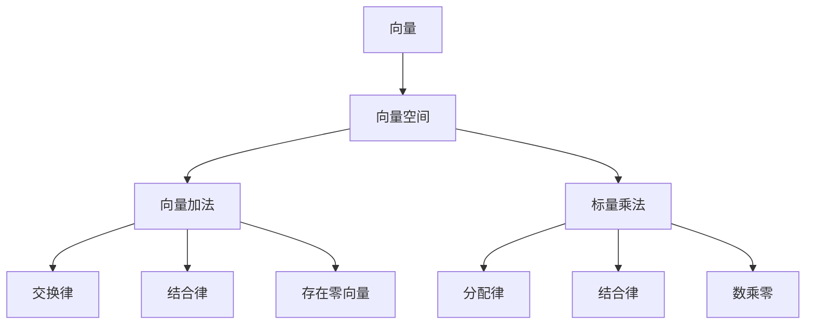
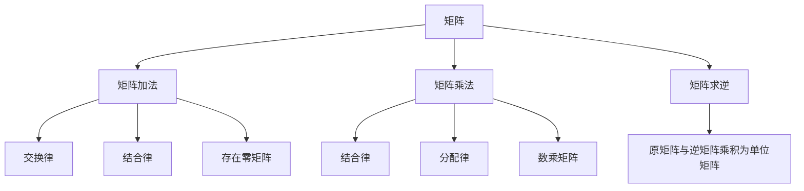
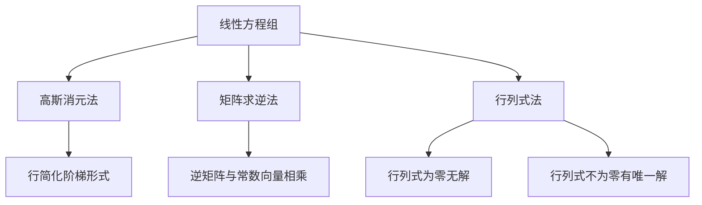

                 

# 《线性代数导引：自然数数组有序加法半群》

关键词：线性代数、自然数数组、有序加法半群、矩阵运算、线性方程组、特征值问题、线性规划、自然数数组有序加法半群的应用

摘要：本文旨在为读者提供一个关于线性代数的全面导引，特别是针对自然数数组有序加法半群这一独特概念进行深入探讨。本文首先介绍了线性代数的基本概念，包括向量、向量空间、矩阵和线性方程组，接着探讨了线性映射、特征值与特征向量、内积空间与正定矩阵等核心概念。随后，本文详细介绍了基础解系与通解、特征值问题、线性变换与矩阵、线性规划与优化等线性代数的应用领域。特别地，本文还探讨了线性代数与自然数数组有序加法半群之间的联系，以及该半群在矩阵运算中的应用。最后，本文总结了线性代数在实际问题中的应用，并对未来发展方向进行了展望。通过本文，读者将能够全面了解线性代数的基本原理及其在实际问题中的应用价值。

## 目录大纲

# 《线性代数导引：自然数数组有序加法半群》

## 第1章 引言与线性代数基础

### 1.1 线性代数的基本概念

### 1.2 向量与向量空间

### 1.3 矩阵与矩阵运算

### 1.4 线性方程组求解

## 第2章 线性映射与特征值

### 2.1 线性映射的概念

### 2.2 特征值与特征向量

### 2.3 对称矩阵与正定矩阵

### 2.4 实对称矩阵的对角化

## 第3章 内积空间与正定矩阵

### 3.1 内积空间的概念

### 3.2 正定矩阵的性质

### 3.3 正定矩阵的应用

### 3.4 欧几里得空间

## 第4章 基础解系与通解

### 4.1 基础解系的概念

### 4.2 解的存在性与解的结构

### 4.3 基础解系的计算

### 4.4 通解的求解

## 第5章 特征值问题

### 5.1 特征值问题的定义

### 5.2 特征值问题的求解

### 5.3 特征值问题的应用

### 5.4 特征值问题的稳定性分析

## 第6章 线性变换与矩阵

### 6.1 线性变换的概念

### 6.2 矩阵与线性变换的关系

### 6.3 矩阵的性质与应用

### 6.4 矩阵的分解

## 第7章 线性规划与优化

### 7.1 线性规划的基本概念

### 7.2 对偶理论与对偶问题

### 7.3 线性规划求解算法

### 7.4 线性规划的应用

## 第8章 线性代数与自然数数组有序加法半群

### 8.1 自然数数组有序加法半群的概念

### 8.2 线性代数与自然数数组有序加法半群的联系

### 8.3 有序加法半群在矩阵运算中的应用

### 8.4 线性代数在自然数数组有序加法半群中的拓展

## 第9章 线性代数在实际问题中的应用

### 9.1 线性代数在物理学中的应用

### 9.2 线性代数在计算机科学中的应用

### 9.3 线性代数在工程领域的应用

### 9.4 线性代数在其他领域中的应用

## 第10章 总结与展望

### 10.1 线性代数的基本概念与原理

### 10.2 线性代数在数学领域的发展

### 10.3 线性代数的未来发展方向

### 10.4 对读者的建议和期望

## 附录

### A.1 常用符号表

### A.2 重要定理与公式

### A.3 参考文献

### A.4 线性代数相关资源推荐

### 第1章 引言与线性代数基础

## 1.1 线性代数的基本概念

线性代数是数学的一个分支，主要研究向量空间（也称为线性空间）、线性映射以及在这些概念上的运算。线性代数的核心概念包括向量、矩阵、行列式、线性方程组等。

- **向量**：向量是一个具有大小和方向的量，通常用箭头表示，如 \(\vec{v}\)。向量可以表示物理量，如位移、速度、力等。

- **矩阵**：矩阵是一个由数字组成的矩形阵列，如 \(A = \begin{pmatrix} a_{11} & a_{12} \\ a_{21} & a_{22} \end{pmatrix}\)。矩阵在许多领域都有重要应用，如线性方程组的解法、图像处理等。

- **行列式**：行列式是一个与矩阵相关的标量值，通常用大写字母表示，如 \(D = \det(A)\)。行列式在解线性方程组、判断矩阵的可逆性等方面有重要作用。

- **线性方程组**：线性方程组是由一组线性方程构成的方程组，如
  $$
  \begin{cases}
  a_{11}x_1 + a_{12}x_2 + \cdots + a_{1n}x_n = b_1 \\
  a_{21}x_1 + a_{22}x_2 + \cdots + a_{2n}x_n = b_2 \\
  \vdots \\
  a_{m1}x_1 + a_{m2}x_2 + \cdots + a_{mn}x_n = b_m
  \end{cases}
  $$

线性方程组的解可以是唯一解、无穷多解或无解。

### 1.2 向量与向量空间

向量空间是线性代数中的基本概念之一，它是一组向量的集合，这些向量满足加法和标量乘法的运算规则。

- **向量加法**：向量加法是指两个向量之间的运算，其结果是一个新的向量。向量加法满足交换律、结合律和存在零向量等性质。

- **标量乘法**：标量乘法是指一个向量与一个标量之间的运算，其结果是一个新的向量。标量乘法满足分配律、结合律和数乘零等性质。

向量空间中的向量可以表示成坐标的形式，例如在二维空间中，一个向量可以表示为 \((x, y)\)，

### 1.3 矩阵与矩阵运算

矩阵是线性代数中的另一个核心概念，它是一个由数字组成的矩形阵列。矩阵可以表示线性方程组，进行矩阵运算，如矩阵加法、矩阵乘法、矩阵求逆等。

- **矩阵加法**：矩阵加法是指两个同型矩阵之间的运算，其结果是一个新的同型矩阵。矩阵加法满足交换律、结合律和存在零矩阵等性质。

- **矩阵乘法**：矩阵乘法是指一个矩阵与另一个矩阵之间的运算，其结果是一个新的矩阵。矩阵乘法满足结合律、分配律和数乘矩阵等性质。

- **矩阵求逆**：矩阵求逆是指找到一个逆矩阵，使得原矩阵与逆矩阵的乘积等于单位矩阵。矩阵求逆在解线性方程组、计算行列式等方面有重要作用。

### 1.4 线性方程组求解

线性方程组求解是线性代数中的重要应用之一。线性方程组的解可以是唯一解、无穷多解或无解。求解线性方程组的方法有多种，如高斯消元法、矩阵求逆法、行列式法等。

- **高斯消元法**：高斯消元法是一种常用的求解线性方程组的方法，通过将线性方程组转化为等价的行简化阶梯形式，从而求出解。

- **矩阵求逆法**：矩阵求逆法是另一种求解线性方程组的方法，通过求出系数矩阵的逆矩阵，然后与常数向量相乘，得到解。

- **行列式法**：行列式法是一种通过计算行列式来判断线性方程组解的情况的方法。当行列式为零时，线性方程组无解；当行列式不为零时，线性方程组有唯一解。

通过以上对线性代数基本概念的介绍，读者可以初步了解线性代数的基本概念和其在数学中的应用。接下来，本文将深入探讨线性代数的其他核心概念和应用，帮助读者全面了解线性代数的魅力和其在实际问题中的重要作用。

### 第2章 线性映射与特征值

## 2.1 线性映射的概念

线性映射，也称为线性变换，是指一种从向量空间到向量空间的函数。具体来说，设 \(V\) 和 \(W\) 是两个向量空间，线性映射 \(T: V \rightarrow W\) 满足以下两个条件：

1. **加法保持性**：对于任意 \(u, v \in V\)，有 \(T(u + v) = T(u) + T(v)\)。
2. **数乘保持性**：对于任意 \(u \in V\) 和任意标量 \(c\)，有 \(T(cu) = cT(u)\)。

线性映射在数学和物理学中有着广泛的应用，例如在图像处理、信号处理、统计力学等领域。

### 2.2 特征值与特征向量

特征值和特征向量是线性映射中的重要概念。设 \(T: V \rightarrow V\) 是一个线性映射，如果存在一个标量 \(\lambda\) 和一个非零向量 \(v \in V\)，使得 \(T(v) = \lambda v\)，则称 \(\lambda\) 为 \(T\) 的一个特征值，\(v\) 为 \(T\) 的一个特征向量。

特征值和特征向量在物理、工程和计算机科学等领域有着重要的应用。例如，在图像处理中，特征值和特征向量被用于图像压缩和图像识别；在量子力学中，特征值和特征向量描述了粒子的能量状态。

### 2.3 对称矩阵与正定矩阵

对称矩阵和正定矩阵是矩阵论中的重要概念。

- **对称矩阵**：一个 \(n \times n\) 矩阵 \(A\) 如果满足 \(A = A^T\)（其中 \(A^T\) 是 \(A\) 的转置矩阵），则称 \(A\) 为对称矩阵。对称矩阵在物理、工程和统计学等领域有着广泛的应用，例如在描述系统的对称性、分析数据的协方差矩阵等。

- **正定矩阵**：一个 \(n \times n\) 矩阵 \(A\) 如果对于任意非零向量 \(v \in \mathbb{R}^n\)，都有 \(v^T A v > 0\)，则称 \(A\) 为正定矩阵。正定矩阵在优化、统计学和物理学等领域有着重要的应用。

### 2.4 实对称矩阵的对角化

实对称矩阵是一种特殊的对称矩阵，其特征值都是实数。实对称矩阵可以进一步对角化，即存在一个正交矩阵 \(P\)，使得 \(P^T A P\) 是一个对角矩阵。

对角化具有重要的理论意义和实际应用。在理论方面，对角化使得线性映射的运算变得简单；在应用方面，对角化可以用于求解特征值问题、优化问题等。

### 2.5 线性映射与矩阵的关系

线性映射和矩阵之间存在紧密的联系。具体来说，设 \(T: V \rightarrow W\) 是一个线性映射，可以选择一组基向量 \(\{v_1, v_2, \ldots, v_n\}\) 和 \(\{w_1, w_2, \ldots, w_m\}\) 分别为 \(V\) 和 \(W\) 的基向量，则线性映射 \(T\) 可以表示为一个矩阵 \(A\)，其中第 \(i\) 行第 \(j\) 列的元素 \(a_{ij}\) 表示 \(T(v_i)\) 在基向量 \(\{w_1, w_2, \ldots, w_m\}\) 下的坐标。

例如，考虑一个从二维向量空间 \(V\) 到二维向量空间 \(W\) 的线性映射 \(T\)，其矩阵表示为
$$
A = \begin{pmatrix}
a_{11} & a_{12} \\
a_{21} & a_{22}
\end{pmatrix}
$$
则对于任意 \(v = (x, y) \in V\)，线性映射 \(T(v)\) 可以表示为
$$
T(v) = A \begin{pmatrix}
x \\
y
\end{pmatrix} = \begin{pmatrix}
a_{11}x + a_{12}y \\
a_{21}x + a_{22}y
\end{pmatrix}
$$

通过上述关系，我们可以将线性映射的问题转化为矩阵运算的问题，从而利用矩阵的性质和算法来求解线性映射问题。

### 2.6 线性映射的性质

线性映射具有一系列重要的性质，包括：

- **线性组合性质**：对于任意线性映射 \(T: V \rightarrow W\)，有 \(T(c_1 v_1 + c_2 v_2) = c_1 T(v_1) + c_2 T(v_2)\)，其中 \(v_1, v_2 \in V\)，\(c_1, c_2\) 是标量。

- **零向量性质**：\(T(0) = 0\)，其中 \(0\) 是 \(V\) 和 \(W\) 的零向量。

- **加法性质**：对于任意线性映射 \(T_1, T_2: V \rightarrow W\)，有 \(T_1 + T_2\) 也是 \(V\) 到 \(W\) 的线性映射，且 \(T_1 + T_2 = T_1 + T_2\)。

- **数乘性质**：对于任意线性映射 \(T: V \rightarrow W\) 和任意标量 \(c\)，有 \(cT\) 也是 \(V\) 到 \(W\) 的线性映射，且 \(cT = cT\)。

通过这些性质，我们可以更深入地理解线性映射的本质和其在数学和物理中的应用。

### 2.7 特征值与特征向量的计算方法

计算特征值和特征向量是线性代数中的重要问题。以下是计算特征值和特征向量的基本步骤：

1. **计算特征多项式**：对于给定的线性映射 \(T: V \rightarrow V\)，其对应的矩阵 \(A\) 的特征多项式为 \(p(\lambda) = \det(A - \lambda I)\)，其中 \(I\) 是单位矩阵。

2. **求解特征值**：求解特征多项式 \(p(\lambda) = 0\)，得到线性映射 \(T\) 的特征值 \(\lambda_1, \lambda_2, \ldots, \lambda_n\)。

3. **计算特征向量**：对于每个特征值 \(\lambda_i\)，求解线性方程组 \((A - \lambda_i I)v = 0\)，得到对应的特征向量 \(v_i\)。

例如，考虑一个 \(2 \times 2\) 矩阵 \(A = \begin{pmatrix} 2 & 1 \\ -1 & 1 \end{pmatrix}\)，其特征多项式为
$$
p(\lambda) = \det(A - \lambda I) = \det \begin{pmatrix} 2 - \lambda & 1 \\ -1 & 1 - \lambda \end{pmatrix} = (2 - \lambda)(1 - \lambda) + 1 = \lambda^2 - 3\lambda + 3
$$
求解 \(p(\lambda) = 0\)，得到特征值 \(\lambda_1 = 1\) 和 \(\lambda_2 = 2\)。

对于特征值 \(\lambda_1 = 1\)，求解线性方程组 \((A - I)v = 0\)，得到特征向量 \(v_1 = \begin{pmatrix} 1 \\ 1 \end{pmatrix}\)。

对于特征值 \(\lambda_2 = 2\)，求解线性方程组 \((A - 2I)v = 0\)，得到特征向量 \(v_2 = \begin{pmatrix} 1 \\ -1 \end{pmatrix}\)。

通过上述步骤，我们可以得到线性映射 \(T\) 的特征值和特征向量。

### 2.8 特征值问题的应用

特征值问题在数学和物理学中有着广泛的应用。以下是一些常见的应用实例：

1. **振动分析**：在振动分析中，特征值问题被用来求解系统的固有频率和振动模式。例如，考虑一个弹性杆，其振动方程可以表示为
$$
m\ddot{x} + c\dot{x} + kx = 0
$$
其中 \(m\) 是质量，\(c\) 是阻尼系数，\(k\) 是弹簧系数，\(x\) 是位移。通过求解特征值问题，可以得到系统的固有频率和振动模式。

2. **图像处理**：在图像处理中，特征值问题被用来进行图像压缩和图像识别。例如，考虑一个 \(n \times n\) 的图像矩阵 \(I\)，可以通过求解特征值问题来得到图像的显著特征，从而实现图像压缩或图像识别。

3. **信号处理**：在信号处理中，特征值问题被用来进行信号滤波和信号增强。例如，考虑一个 \(n \times n\) 的信号矩阵 \(S\)，可以通过求解特征值问题来得到信号的主要成分，从而实现信号滤波或信号增强。

4. **优化问题**：在优化问题中，特征值问题被用来求解最优化问题的最小值或最大值。例如，考虑一个线性规划问题，可以通过求解特征值问题来得到最优解。

通过上述应用实例，我们可以看到特征值问题在数学、物理学和工程等领域中的重要性和广泛应用。

## 第3章 内积空间与正定矩阵

### 3.1 内积空间的概念

内积空间是线性代数中的一个重要概念，它是一类满足内积运算的向量空间。具体来说，设 \(V\) 是一个向量空间，如果存在一个映射 \(\langle \cdot, \cdot \rangle: V \times V \rightarrow \mathbb{R}\)（其中 \(\mathbb{R}\) 是实数域），满足以下条件：

1. **正定性**：对于任意 \(v \in V\)，有 \(\langle v, v \rangle \geq 0\)，且 \(\langle v, v \rangle = 0\) 当且仅当 \(v = 0\)。
2. **交换性**：对于任意 \(u, v \in V\)，有 \(\langle u, v \rangle = \langle v, u \rangle\)。
3. **分配律**：对于任意 \(u, v, w \in V\) 和任意标量 \(a, b \in \mathbb{R}\)，有 \(\langle au + bw, v \rangle = a\langle u, v \rangle + b\langle w, v \rangle\)。

则称 \(V\) 为一个内积空间。

内积空间在数学、物理学和工程等领域有着广泛的应用，例如在量子力学中描述粒子状态、在信号处理中描述信号特征等。

### 3.2 正定矩阵的性质

正定矩阵是矩阵论中的一个重要概念，它是一类满足特定性质的矩阵。具体来说，设 \(A\) 是一个 \(n \times n\) 矩阵，如果对于任意非零向量 \(v \in \mathbb{R}^n\)，都有 \(v^T A v > 0\)，则称 \(A\) 为正定矩阵。

正定矩阵具有以下重要性质：

1. **对角线元素为正**：如果 \(A\) 是正定矩阵，则其所有对角线元素都为正。
2. **行列式大于零**：如果 \(A\) 是正定矩阵，则其行列式 \( \det(A) > 0 \)。
3. **逆矩阵存在且为正定**：如果 \(A\) 是正定矩阵，则其逆矩阵 \(A^{-1}\) 也为正定矩阵。
4. **特征值全为正**：如果 \(A\) 是正定矩阵，则其所有特征值都大于零。

正定矩阵在优化、统计学和物理学等领域有着重要的应用。例如，在优化问题中，正定矩阵用于描述目标函数的凸性；在统计学中，正定矩阵用于描述数据之间的相关性；在物理学中，正定矩阵用于描述系统的稳定性。

### 3.3 正定矩阵的应用

正定矩阵在许多实际问题中有着广泛的应用。以下是一些常见应用实例：

1. **优化问题**：在优化问题中，正定矩阵被用来描述目标函数的凸性。例如，考虑一个线性规划问题，其目标函数为 \(f(x) = x^T A x + b^T x + c\)，其中 \(A\) 是正定矩阵。由于 \(A\) 是正定矩阵，目标函数 \(f(x)\) 是一个凸函数，这使得优化问题具有更好的求解性质。

2. **数据拟合**：在数据拟合中，正定矩阵被用来描述数据之间的相关性。例如，考虑一个数据集 \(X\)，可以通过计算其协方差矩阵 \(A = XX^T\) 来描述数据之间的相关性。如果 \(A\) 是正定矩阵，则数据集 \(X\) 中的数据点具有较好的线性相关性。

3. **信号处理**：在信号处理中，正定矩阵被用来描述信号的能量分布。例如，考虑一个信号 \(x(t)\)，可以通过计算其自相关矩阵 \(A = x(t)x^*(t)\) 来描述信号的能量分布。如果 \(A\) 是正定矩阵，则信号 \(x(t)\) 具有较好的能量集中性。

4. **物理系统**：在物理系统中，正定矩阵被用来描述系统的稳定性。例如，考虑一个物理系统，其动态方程可以表示为 \( \dot{x} = A x \)，其中 \(A\) 是正定矩阵。由于 \(A\) 是正定矩阵，系统的状态 \(x\) 将随着时间的推移趋向于平衡状态。

### 3.4 欧几里得空间

欧几里得空间是最常见的内积空间之一，它是一种满足欧几里得度量空间的向量空间。具体来说，设 \(\mathbb{R}^n\) 是 \(n\) 维实数空间，定义内积运算为
$$
\langle x, y \rangle = x_1 y_1 + x_2 y_2 + \cdots + x_n y_n
$$
其中 \(x = (x_1, x_2, \ldots, x_n)\) 和 \(y = (y_1, y_2, \ldots, y_n)\) 分别是 \(\mathbb{R}^n\) 中的两个向量。

欧几里得空间在数学、物理学和工程等领域有着广泛的应用。以下是一些应用实例：

1. **几何学**：欧几里得空间用于描述几何形状和几何关系。例如，通过欧几里得内积可以计算两点之间的距离、向量的长度、夹角等。

2. **线性代数**：欧几里得空间用于求解线性方程组、特征值问题、特征向量问题等。例如，通过欧几里得内积可以计算矩阵的范数、求解最优化问题等。

3. **物理学**：欧几里得空间用于描述物理系统中的运动和相互作用。例如，在经典力学中，通过欧几里得内积可以计算物体的动量和能量。

4. **信号处理**：欧几里得空间用于描述信号的特征和变换。例如，在信号处理中，通过欧几里得内积可以计算信号的能量、相关性、协方差等。

通过上述内容，我们可以看到内积空间和正定矩阵在数学和物理中的应用价值。接下来，我们将继续探讨线性代数的其他重要概念和应用，帮助读者更全面地了解线性代数的魅力和其在实际问题中的重要作用。

## 第4章 基础解系与通解

### 4.1 基础解系的概念

在解线性方程组的过程中，基础解系是一个重要的概念。对于线性方程组
$$
\begin{cases}
a_{11}x_1 + a_{12}x_2 + \cdots + a_{1n}x_n = b_1 \\
a_{21}x_1 + a_{22}x_2 + \cdots + a_{2n}x_n = b_2 \\
\vdots \\
a_{m1}x_1 + a_{m2}x_2 + \cdots + a_{mn}x_n = b_m
\end{cases}
$$
如果存在一组解向量 \(\{x_1, x_2, \ldots, x_n\}\)，且这组向量线性无关，则称这组解向量为基础解系。

基础解系的向量个数等于线性方程组中未知数的个数，且任意线性组合的基础解系向量仍然是线性方程组的解。

### 4.2 解的存在性与解的结构

线性方程组是否存在解以及解的结构取决于系数矩阵和常数项。具体来说：

1. **存在唯一解**：如果线性方程组的系数矩阵 \(A\) 是可逆的，则线性方程组有唯一解。此时，解可以通过矩阵求逆得到：
   $$
   x = A^{-1}b
   $$
   其中 \(x\) 是解向量，\(b\) 是常数项向量。

2. **存在无穷多解**：如果线性方程组的系数矩阵 \(A\) 不可逆，但增广矩阵 \([A | b]\) 可逆，则线性方程组有无穷多解。此时，解可以通过基础解系得到。

3. **无解**：如果线性方程组的系数矩阵 \(A\) 和增广矩阵 \([A | b]\) 都不可逆，则线性方程组无解。

### 4.3 基础解系的计算

计算基础解系的方法主要依赖于高斯消元法和行列式。以下是计算基础解系的步骤：

1. **高斯消元法**：将线性方程组转化为行简化阶梯形式，得到系数矩阵的秩 \(r\) 和自由变量的个数 \(n - r\)。

2. **计算自由变量**：令自由变量为 \(x_{n-r+1}, x_{n-r+2}, \ldots, x_n\)，并设 \(x_{n-r+1} = 1, x_{n-r+2} = 0, \ldots, x_n = 0\)。

3. **回代求解**：将自由变量代入行简化阶梯形式的方程组中，逐个求解出其他变量，得到一组基础解系。

例如，考虑以下线性方程组：
$$
\begin{cases}
2x_1 + x_2 - 3x_3 = 1 \\
4x_1 + 2x_2 - 6x_3 = 2 \\
2x_1 + x_2 - 3x_3 = 1
\end{cases}
$$
通过高斯消元法，我们可以将其转化为行简化阶梯形式：
$$
\begin{cases}
2x_1 + x_2 - 3x_3 = 1 \\
0x_1 + 0x_2 + 0x_3 = 0 \\
0x_1 + 0x_2 + 0x_3 = 0
\end{cases}
$$
此时，系数矩阵的秩 \(r = 1\)，自由变量的个数为 \(n - r = 2\)。我们可以选取自由变量 \(x_2 = 1, x_3 = 0\)，代入方程组求解得到基础解系：
$$
x_1 = -\frac{1}{2}, x_2 = 1, x_3 = 0
$$

### 4.4 通解的求解

通解是指线性方程组的解的一般形式。对于具有无穷多解的线性方程组，通解可以通过基础解系得到。

假设线性方程组
$$
\begin{cases}
a_{11}x_1 + a_{12}x_2 + \cdots + a_{1n}x_n = b_1 \\
a_{21}x_1 + a_{22}x_2 + \cdots + a_{2n}x_n = b_2 \\
\vdots \\
a_{m1}x_1 + a_{m2}x_2 + \cdots + a_{mn}x_n = b_m
\end{cases}
$$
存在基础解系 \(\{x_1, x_2, \ldots, x_n\}\)，则通解可以表示为：
$$
x = c_1x_1 + c_2x_2 + \cdots + c_nx_n
$$
其中 \(c_1, c_2, \ldots, c_n\) 是任意实数。

例如，对于之前提到的线性方程组，其基础解系为：
$$
x_1 = -\frac{1}{2}, x_2 = 1, x_3 = 0
$$
则通解为：
$$
x = c_1 \left(-\frac{1}{2}\right) + c_2 \cdot 1 + c_3 \cdot 0
$$
其中 \(c_1, c_2, c_3\) 是任意实数。

通过上述内容，我们可以看到基础解系与通解在求解线性方程组中的重要作用。理解基础解系与通解的计算方法有助于我们更好地掌握线性代数的基本原理，为解决更复杂的线性问题打下基础。

### 第5章 特征值问题

## 5.1 特征值问题的定义

特征值问题是线性代数中的一个重要问题，主要研究线性变换的特征值和特征向量。给定一个线性映射 \(T: V \rightarrow V\)（其中 \(V\) 是一个向量空间），如果存在一个标量 \(\lambda\) 和一个非零向量 \(v\)，使得 \(T(v) = \lambda v\)，则称 \(\lambda\) 为 \(T\) 的一个特征值，\(v\) 为对应的特征向量。

特征值问题可以形式化为求解以下方程：
$$
(A - \lambda I)v = 0
$$
其中 \(A\) 是线性映射 \(T\) 对应的矩阵，\(I\) 是单位矩阵，\(v\) 是特征向量。

特征值问题在数学、物理学和工程等领域有着广泛的应用。例如，在物理学中，特征值问题用于描述系统的振动模式；在工程中，特征值问题用于优化设计和稳定性分析。

### 5.2 特征值问题的求解

求解特征值问题的步骤如下：

1. **计算特征多项式**：首先计算线性映射 \(T\) 对应的矩阵 \(A\) 的特征多项式 \(p(\lambda)\)，特征多项式定义为 \(p(\lambda) = \det(A - \lambda I)\)。

2. **求解特征方程**：求解特征多项式 \(p(\lambda) = 0\)，得到线性映射 \(T\) 的所有特征值 \(\lambda_1, \lambda_2, \ldots, \lambda_n\)。

3. **计算特征向量**：对于每个特征值 \(\lambda_i\)，求解线性方程组 \((A - \lambda_i I)v = 0\)，得到对应的特征向量 \(v_i\)。

以下是特征值问题求解的详细步骤：

**步骤1：计算特征多项式**

考虑一个 \(2 \times 2\) 矩阵 \(A = \begin{pmatrix} 2 & 1 \\ -1 & 1 \end{pmatrix}\)，其特征多项式为：
$$
p(\lambda) = \det(A - \lambda I) = \det \begin{pmatrix} 2 - \lambda & 1 \\ -1 & 1 - \lambda \end{pmatrix} = (2 - \lambda)(1 - \lambda) - (-1)(1) = \lambda^2 - 3\lambda + 3
$$

**步骤2：求解特征方程**

求解特征多项式 \(p(\lambda) = 0\)，得到特征值：
$$
\lambda_1 = 1, \lambda_2 = 2
$$

**步骤3：计算特征向量**

对于特征值 \(\lambda_1 = 1\)，求解线性方程组：
$$
(A - I)v = 0
$$
即：
$$
\begin{pmatrix} 1 & 1 \\ -1 & 0 \end{pmatrix} \begin{pmatrix} x_1 \\ x_2 \end{pmatrix} = \begin{pmatrix} 0 \\ 0 \end{pmatrix}
$$
解得特征向量：
$$
v_1 = \begin{pmatrix} 1 \\ 1 \end{pmatrix}
$$

对于特征值 \(\lambda_2 = 2\)，求解线性方程组：
$$
(A - 2I)v = 0
$$
即：
$$
\begin{pmatrix} 0 & 1 \\ -1 & -1 \end{pmatrix} \begin{pmatrix} x_1 \\ x_2 \end{pmatrix} = \begin{pmatrix} 0 \\ 0 \end{pmatrix}
$$
解得特征向量：
$$
v_2 = \begin{pmatrix} 1 \\ -1 \end{pmatrix}
$$

通过上述步骤，我们得到了矩阵 \(A\) 的特征值和特征向量。特征值问题求解的关键在于计算特征多项式和特征向量，这对于理解线性映射的性质和解决实际问题具有重要意义。

### 5.3 特征值问题的应用

特征值问题在数学、物理学和工程等领域有着广泛的应用。以下是一些常见应用实例：

1. **振动分析**：在振动分析中，特征值问题用于求解系统的固有频率和振动模式。例如，考虑一个弹性杆，其振动方程可以表示为：
   $$
   m\ddot{x} + c\dot{x} + kx = 0
   $$
   其中 \(m\) 是质量，\(c\) 是阻尼系数，\(k\) 是弹簧系数，\(x\) 是位移。通过求解特征值问题，可以得到系统的固有频率和振动模式。

2. **图像处理**：在图像处理中，特征值问题用于图像压缩和图像识别。例如，考虑一个 \(n \times n\) 的图像矩阵 \(I\)，可以通过求解特征值问题来得到图像的显著特征，从而实现图像压缩或图像识别。

3. **信号处理**：在信号处理中，特征值问题用于信号滤波和信号增强。例如，考虑一个 \(n \times n\) 的信号矩阵 \(S\)，可以通过求解特征值问题来得到信号的主要成分，从而实现信号滤波或信号增强。

4. **优化问题**：在优化问题中，特征值问题用于求解最优化问题的最小值或最大值。例如，考虑一个线性规划问题，可以通过求解特征值问题来得到最优解。

5. **物理系统**：在物理系统中，特征值问题用于描述系统的稳定性。例如，考虑一个物理系统，其动态方程可以表示为：
   $$
   \dot{x} = A x
   $$
   其中 \(A\) 是系统的矩阵。通过求解特征值问题，可以得到系统的稳定性信息。

通过这些应用实例，我们可以看到特征值问题在数学、物理学和工程等领域中的重要性和广泛应用。

### 5.4 特征值问题的稳定性分析

在物理学和工程领域中，特征值问题的稳定性分析是非常重要的。稳定性分析主要研究系统的动态行为，特别是系统在扰动下是否会保持平衡状态。

对于一个线性时不变系统，其动态方程可以表示为：
$$
\dot{x} = A x
$$
其中 \(x\) 是系统的状态向量，\(A\) 是系统的矩阵。通过求解特征值问题，可以得到系统的特征值 \(\lambda_1, \lambda_2, \ldots, \lambda_n\)。

根据特征值的实部和虚部，我们可以对系统的稳定性进行分类：

1. **稳定系统**：如果所有特征值的实部都小于零，则系统是稳定的。这意味着系统在扰动后会逐渐返回平衡状态。

2. **不稳定系统**：如果所有特征值的实部都大于零，则系统是不稳定的。这意味着系统在扰动后会逐渐远离平衡状态。

3. **半稳定系统**：如果存在特征值的实部为零，则系统是半稳定的。这意味着系统在扰动后会保持在某一平衡状态，但可能存在振荡。

4. **临界稳定系统**：如果所有特征值的实部都等于零，则系统是临界稳定的。这意味着系统在扰动后可能会保持平衡状态，也可能逐渐偏离平衡状态。

通过特征值问题的稳定性分析，我们可以设计更加稳定和可靠的系统，从而提高系统的性能和安全性。

### 5.5 特征值问题的数值计算

在实际问题中，特征值问题的数值计算往往是非常重要且具有挑战性的。以下是一些常见的数值计算方法：

1. **幂法**：幂法是一种迭代方法，用于求解线性映射的最大特征值及其对应的特征向量。通过不断迭代矩阵与向量相乘，可以近似得到最大特征值和特征向量。

2. **逆幂法**：逆幂法是幂法的改进方法，用于求解线性映射的最小特征值及其对应的特征向量。通过迭代矩阵的逆与向量相乘，可以近似得到最小特征值和特征向量。

3. **雅可比法**：雅可比法是一种迭代方法，用于求解线性映射的特征值和特征向量。通过不断迭代矩阵与向量相乘，并结合向量的归一化操作，可以近似得到所有特征值和特征向量。

4. **高斯消元法**：高斯消元法是一种直接方法，用于求解线性方程组的特征值和特征向量。通过将线性方程组转化为行简化阶梯形式，可以求解出所有特征值和特征向量。

5. **QR分解**：QR分解是一种迭代方法，用于求解线性映射的特征值和特征向量。通过将矩阵分解为正交矩阵和上三角矩阵的乘积，可以近似得到所有特征值和特征向量。

通过这些数值计算方法，我们可以有效地求解特征值问题，从而为实际应用提供有力支持。

### 第6章 线性变换与矩阵

## 6.1 线性变换的概念

线性变换是指从向量空间到向量空间的线性映射。具体来说，设 \(V\) 和 \(W\) 是两个向量空间，线性变换 \(T: V \rightarrow W\) 满足以下条件：

1. **加法保持性**：对于任意 \(u, v \in V\)，有 \(T(u + v) = T(u) + T(v)\)。
2. **数乘保持性**：对于任意 \(u \in V\) 和任意标量 \(c\)，有 \(T(cu) = cT(u)\)。

线性变换在数学、物理学和工程等领域有着广泛的应用。例如，在图像处理中，线性变换用于图像的旋转、缩放和滤波；在物理学中，线性变换用于描述系统的对称性和变换性质。

### 6.2 矩阵与线性变换的关系

矩阵与线性变换之间存在紧密的联系。具体来说，设 \(T: V \rightarrow W\) 是一个线性变换，可以选择一组基向量 \(\{v_1, v_2, \ldots, v_n\}\) 和 \(\{w_1, w_2, \ldots, w_m\}\) 分别为 \(V\) 和 \(W\) 的基向量，则线性变换 \(T\) 可以表示为一个矩阵 \(A\)，其中第 \(i\) 行第 \(j\) 列的元素 \(a_{ij}\) 表示 \(T(v_i)\) 在基向量 \(\{w_1, w_2, \ldots, w_m\}\) 下的坐标。

例如，考虑一个从二维向量空间 \(V\) 到二维向量空间 \(W\) 的线性变换 \(T\)，其矩阵表示为
$$
A = \begin{pmatrix}
a_{11} & a_{12} \\
a_{21} & a_{22}
\end{pmatrix}
$$
则对于任意 \(v = (x, y) \in V\)，线性变换 \(T(v)\) 可以表示为
$$
T(v) = A \begin{pmatrix}
x \\
y
\end{pmatrix} = \begin{pmatrix}
a_{11}x + a_{12}y \\
a_{21}x + a_{22}y
\end{pmatrix}
$$

通过上述关系，我们可以将线性变换的问题转化为矩阵运算的问题，从而利用矩阵的性质和算法来求解线性变换问题。

### 6.3 矩阵的性质与应用

矩阵是线性代数中的核心概念之一，具有丰富的性质和广泛的应用。以下介绍一些常见的矩阵性质和应用：

1. **矩阵的秩**：矩阵的秩是指矩阵行向量或列向量的最大线性无关组所含向量的个数。矩阵的秩具有以下性质：
   - 矩阵的秩等于其行数或列数中的较小者。
   - 矩阵的秩等于其行简化阶梯形式中非零行的个数。
   - 矩阵的秩等于其零空间的维数。

   矩阵的秩在解决线性方程组、判断矩阵的可逆性等方面具有重要应用。

2. **矩阵的行列式**：行列式是一个与矩阵相关的标量值，具有以下性质：
   - 行列式等于矩阵的逆矩阵的行列式的倒数。
   - 行列式等于矩阵的任意一行（或列）的各个元素与其对应的代数余子的乘积之和。
   - 行列式等于矩阵的任意两行（或列）互换后的相反数。

   行列式在求解线性方程组、判断矩阵的可逆性、计算矩阵的逆矩阵等方面具有重要应用。

3. **矩阵的逆矩阵**：矩阵的逆矩阵是指一个矩阵，使得原矩阵与逆矩阵的乘积等于单位矩阵。矩阵的逆矩阵具有以下性质：
   - 矩阵的逆矩阵唯一。
   - 可逆矩阵的逆矩阵可以通过高斯消元法或求逆公式计算。
   - 矩阵与其逆矩阵的乘积等于单位矩阵。

   矩阵的逆矩阵在求解线性方程组、计算矩阵的行列式等方面具有重要应用。

4. **矩阵的秩与可逆性**：矩阵的秩与可逆性之间存在密切关系。具体来说：
   - 如果矩阵的秩等于其行数（或列数），则矩阵可逆。
   - 如果矩阵的秩小于其行数（或列数），则矩阵不可逆。

   判断矩阵的可逆性对于解决线性方程组、优化问题等具有重要意义。

5. **矩阵的分解**：矩阵的分解是将一个矩阵分解为几个简单矩阵的乘积。常见的矩阵分解包括：
   - **奇异值分解**：将一个矩阵分解为三个矩阵的乘积，具有很好的数值稳定性。
   - **LU分解**：将一个矩阵分解为下三角矩阵和上三角矩阵的乘积，适用于求解线性方程组。
   - **QR分解**：将一个矩阵分解为正交矩阵和上三角矩阵的乘积，适用于计算矩阵的特征值和特征向量。

   矩阵的分解在计算线性方程组的解、特征值问题、优化问题等方面具有重要应用。

通过上述内容，我们可以看到矩阵的丰富性质和广泛的应用。掌握矩阵的性质和应用对于深入理解线性代数、解决实际问题具有重要意义。

### 6.4 矩阵的分解

矩阵的分解是将一个复杂的矩阵分解为几个简单的矩阵的乘积，这有助于简化计算和深入理解矩阵的性质。以下是几种常见的矩阵分解方法：

1. **奇异值分解（SVD）**：

奇异值分解是一种将矩阵分解为三个矩阵的乘积的方法，其形式如下：
$$
A = U \Sigma V^T
$$
其中，\(U\) 是一个 \(m \times m\) 的正交矩阵，\(\Sigma\) 是一个 \(m \times n\) 的对角矩阵，对角线上的元素称为奇异值，\(V\) 是一个 \(n \times n\) 的正交矩阵。

奇异值分解在数值计算中具有很好的稳定性，常用于图像处理、信号处理和数据分析等领域。

2. **LU分解**：

LU分解是将矩阵分解为一个下三角矩阵 \(L\) 和一个上三角矩阵 \(U\) 的乘积，其形式如下：
$$
A = LU
$$
其中，\(L\) 是一个 \(m \times m\) 的下三角矩阵，\(U\) 是一个 \(m \times n\) 的上三角矩阵。

LU分解常用于求解线性方程组，通过将线性方程组转化为下三角方程组求解，可以简化计算过程。

3. **QR分解**：

QR分解是将矩阵分解为一个正交矩阵 \(Q\) 和一个上三角矩阵 \(R\) 的乘积，其形式如下：
$$
A = QR
$$
其中，\(Q\) 是一个 \(m \times m\) 的正交矩阵，\(R\) 是一个 \(m \times n\) 的上三角矩阵。

QR分解在计算矩阵的特征值和特征向量方面具有重要作用，同时也常用于优化问题和信号处理。

4. **分块矩阵分解**：

分块矩阵分解是将一个大的矩阵分块为几个较小的矩阵的乘积，形式如下：
$$
A = \begin{pmatrix}
A_{11} & A_{12} \\
A_{21} & A_{22}
\end{pmatrix}
= \begin{pmatrix}
I & O \\
O & I
\end{pmatrix}
\begin{pmatrix}
A_{11} & A_{12} \\
A_{21} & A_{22}
\end{pmatrix}
$$
其中，\(I\) 是一个单位矩阵，\(O\) 是一个零矩阵。

分块矩阵分解有助于简化矩阵的计算，并在优化问题和数值分析中广泛应用。

通过这些矩阵分解方法，我们可以更深入地理解矩阵的性质，简化计算过程，并解决实际问题。接下来，我们将继续探讨线性代数的其他重要概念和应用，帮助读者更全面地了解线性代数的魅力和其在实际问题中的重要作用。

### 第7章 线性规划与优化

## 7.1 线性规划的基本概念

线性规划（Linear Programming，LP）是数学中的一个优化问题，旨在找到一组变量的值，使得线性目标函数在满足一组线性约束条件的情况下达到最大值或最小值。线性规划的基本概念包括：

1. **目标函数**：线性规划的目标函数是一个线性表达式，通常表示为 \(c^T x\)，其中 \(c\) 是一个与变量 \(x\) 对应的系数向量，\(x\) 是变量向量。

2. **约束条件**：线性规划中的约束条件是线性不等式或等式，通常表示为 \(Ax \leq b\) 或 \(Ax = b\)，其中 \(A\) 是约束矩阵，\(x\) 是变量向量，\(b\) 是约束向量。

3. **可行解**：满足所有约束条件的解称为可行解。线性规划的目的是找到最优解，即在满足约束条件的前提下，使目标函数达到最大值或最小值的解。

4. **最优解**：最优解是满足约束条件下，目标函数取得最大值或最小值的解。

### 7.2 对偶理论与对偶问题

对偶理论是线性规划中一个重要的概念，它将原问题与一个对偶问题联系起来，通过对偶问题的解可以提供原问题的解。线性规划的对偶理论包括以下概念：

1. **原问题**：线性规划的一个标准形式，通常表示为：
   $$
   \begin{aligned}
   \text{maximize} \quad & c^T x \\
   \text{subject to} \quad & Ax \leq b \\
   & x \geq 0
   \end{aligned}
   $$
   其中，\(c\) 是目标函数系数向量，\(A\) 是约束矩阵，\(b\) 是约束向量，\(x\) 是变量向量。

2. **对偶问题**：原问题的对偶问题通常表示为：
   $$
   \begin{aligned}
   \text{minimize} \quad & b^T y \\
   \text{subject to} \quad & A^T y \geq c \\
   & y \geq 0
   \end{aligned}
   $$
   其中，\(y\) 是对偶变量向量，\(A^T\) 是 \(A\) 的转置矩阵。

对偶理论的重要性质包括：

- **对偶定理**：如果原问题和对偶问题都有可行解，则它们的最优值相等。
- **强对偶性**：如果原问题和对偶问题都有最优解，则它们的最优解也相等。
- **弱对偶性**：如果原问题和对偶问题的目标函数值相等，则它们称为弱对偶可行。

### 7.3 线性规划求解算法

线性规划的求解算法是寻找最优解的关键。以下是一些常见的线性规划求解算法：

1. **单纯形法**：单纯形法是一种迭代算法，通过沿着边界移动，逐步逼近最优解。单纯形法的基本步骤包括：
   - 初始化：选择一个可行解，通常选择所有变量都为0的解。
   - 迭代：在当前可行解的基础上，选择一个进入变量和一个离开变量，使得目标函数值增加。
   - 判断停止条件：如果当前可行解是最优解，则算法停止；否则，继续迭代。

2. **内点法**：内点法是一种非迭代算法，通过求解一个次优问题来找到最优解。内点法的基本步骤包括：
   - 初始化：选择一个初始解，通常选择所有变量都为0的解。
   - 迭代：通过求解一系列次优问题，逐步逼近最优解。
   - 判断停止条件：如果当前次优问题的解是最优解，则算法停止；否则，继续迭代。

3. **Karmarkar算法**：Karmarkar算法是一种快速线性规划求解算法，通过迭代改善解的次优性。Karmarkar算法的基本步骤包括：
   - 初始化：选择一个初始解，通常选择所有变量都为0的解。
   - 迭代：通过迭代更新解的变量值，使得目标函数值逐渐减小。
   - 判断停止条件：如果当前解是最优解，则算法停止；否则，继续迭代。

### 7.4 线性规划的应用

线性规划在许多实际领域中都有广泛的应用，以下是一些典型的应用实例：

1. **生产规划**：在工业生产中，线性规划可以用于优化生产计划，使得生产成本最小或利润最大。

2. **资源分配**：线性规划可以用于优化资源的分配，使得资源的利用最大化或成本最小化。

3. **交通运输**：在交通运输领域，线性规划可以用于优化车辆调度和路线选择，使得运输成本最小或时间最短。

4. **财务规划**：在金融领域，线性规划可以用于优化投资组合，使得投资回报最大化或风险最小化。

5. **机器学习**：在机器学习中，线性规划可以用于优化模型参数，使得模型在训练数据上表现最佳。

通过以上内容，我们可以看到线性规划在优化实际问题中的应用价值。线性规划求解算法和理论为解决复杂优化问题提供了有力工具，有助于提高生产效率、降低成本、优化资源配置，为各个领域的发展做出了重要贡献。

### 第8章 线性代数与自然数数组有序加法半群

## 8.1 自然数数组有序加法半群的概念

自然数数组有序加法半群是线性代数中的一个重要概念，它是关于自然数数组的加法运算的一种数学结构。具体来说，一个集合 \(S\) 如果满足以下条件，则称为一个自然数数组有序加法半群：

1. **封闭性**：对于任意 \(a, b \in S\)，有 \(a + b \in S\)。
2. **结合律**：对于任意 \(a, b, c \in S\)，有 \((a + b) + c = a + (b + c)\)。
3. **存在单位元**：存在一个元素 \(e \in S\)，使得对于任意 \(a \in S\)，有 \(a + e = e + a = a\)。
4. **存在逆元**：对于任意 \(a \in S\)，存在一个元素 \(b \in S\)，使得 \(a + b = b + a = e\)。

在这个集合中，我们通常选择自然数作为元素，并定义自然数数组的加法运算。例如，给定两个自然数数组 \(A = [a_1, a_2, \ldots, a_n]\) 和 \(B = [b_1, b_2, \ldots, b_n]\)，它们的和 \(C = A + B\) 定义为：
$$
C = [a_1 + b_1, a_2 + b_2, \ldots, a_n + b_n]
$$
在这个有序加法半群中，单位元是零数组 \(O = [0, 0, \ldots, 0]\)，每个数组的逆元是自身的负数组，即对于 \(A = [a_1, a_2, \ldots, a_n]\)，其逆元为 \(-A = [-a_1, -a_2, \ldots, -a_n]\)。

### 8.2 线性代数与自然数数组有序加法半群的联系

线性代数和自然数数组有序加法半群之间存在紧密的联系。在许多线性代数问题中，自然数数组的加法运算可以作为一种有效的工具，帮助我们理解和解决线性问题。

首先，我们可以将自然数数组有序加法半群看作是一种特殊的矩阵运算。具体来说，设 \(A\) 和 \(B\) 是两个 \(n \times n\) 的自然数数组矩阵，它们的加法运算 \(C = A + B\) 可以看作是一个矩阵与自身的加法运算。这种加法运算满足线性代数中的矩阵加法规则，即：
$$
C = \begin{pmatrix}
c_{11} & c_{12} \\
c_{21} & c_{22}
\end{pmatrix}
$$
其中，
$$
c_{11} = a_{11} + b_{11}, \quad c_{12} = a_{12} + b_{12}, \quad c_{21} = a_{21} + b_{21}, \quad c_{22} = a_{22} + b_{22}
$$
这种矩阵加法运算可以看作是自然数数组有序加法半群中的加法运算在矩阵空间的推广。

其次，自然数数组有序加法半群可以用于解决线性方程组。具体来说，给定一个线性方程组：
$$
\begin{cases}
a_{11}x_1 + a_{12}x_2 + \cdots + a_{1n}x_n = b_1 \\
a_{21}x_1 + a_{22}x_2 + \cdots + a_{2n}x_n = b_2 \\
\vdots \\
a_{m1}x_1 + a_{m2}x_2 + \cdots + a_{mn}x_n = b_m
\end{cases}
$$
我们可以将系数矩阵 \(A\) 和常数向量 \(b\) 表示为自然数数组矩阵，然后通过求解自然数数组有序加法半群中的方程组来求解线性方程组。

例如，考虑以下线性方程组：
$$
\begin{cases}
2x_1 + 3x_2 = 7 \\
-1x_1 + 2x_2 = 4
\end{cases}
$$
我们可以将系数矩阵 \(A = \begin{pmatrix} 2 & 3 \\ -1 & 2 \end{pmatrix}\) 和常数向量 \(b = \begin{pmatrix} 7 \\ 4 \end{pmatrix}\) 表示为自然数数组矩阵，然后通过求解自然数数组有序加法半群中的方程组来求解该线性方程组。

通过上述内容，我们可以看到线性代数与自然数数组有序加法半群之间的紧密联系。自然数数组有序加法半群不仅为线性代数提供了一种新的数学结构，而且在解决线性问题中具有重要的应用价值。

### 8.3 有序加法半群在矩阵运算中的应用

有序加法半群在矩阵运算中具有重要的应用，特别是在矩阵的加法运算和矩阵的逆运算中。

首先，考虑矩阵的加法运算。在有序加法半群中，两个矩阵 \(A\) 和 \(B\) 的和 \(C = A + B\) 可以通过对应元素相加得到，即：
$$
C = \begin{pmatrix}
c_{11} & c_{12} \\
c_{21} & c_{22}
\end{pmatrix}
$$
其中，
$$
c_{11} = a_{11} + b_{11}, \quad c_{12} = a_{12} + b_{12}, \quad c_{21} = a_{21} + b_{21}, \quad c_{22} = a_{22} + b_{22}
$$
这种矩阵加法运算满足线性代数中的矩阵加法规则，即对于任意 \(n \times n\) 矩阵 \(A\) 和 \(B\)，它们的和 \(C\) 也是一个 \(n \times n\) 矩阵。

其次，考虑矩阵的逆运算。在有序加法半群中，矩阵的逆运算可以通过矩阵的加法运算得到。具体来说，设 \(A\) 是一个 \(n \times n\) 的矩阵，其逆矩阵 \(A^{-1}\) 满足 \(AA^{-1} = A^{-1}A = I\)，其中 \(I\) 是单位矩阵。如果我们将 \(A\) 和 \(A^{-1}\) 表示为自然数数组矩阵，则可以通过求解有序加法半群中的方程组来求解矩阵的逆矩阵。

例如，考虑以下矩阵：
$$
A = \begin{pmatrix}
2 & 1 \\
-1 & 1
\end{pmatrix}
$$
我们可以通过求解以下方程组来求解 \(A\) 的逆矩阵：
$$
\begin{cases}
2x_1 + x_2 = 1 \\
-x_1 + x_2 = 1
\end{cases}
$$
通过求解这个方程组，我们可以得到 \(A\) 的逆矩阵：
$$
A^{-1} = \begin{pmatrix}
1 & 1 \\
1 & -1
\end{pmatrix}
$$
这种矩阵逆运算的方法在有序加法半群中具有重要的应用价值，特别是在计算复杂度较高时，可以通过有序加法半群中的矩阵运算来简化计算过程。

通过上述内容，我们可以看到有序加法半群在矩阵运算中的应用。有序加法半群不仅为矩阵的加法运算和矩阵的逆运算提供了有效的计算方法，而且在许多实际问题中具有重要的应用价值。

### 8.4 线性代数在自然数数组有序加法半群中的拓展

自然数数组有序加法半群可以看作是线性代数在特定情境下的拓展。在这种情境下，线性代数的基本概念和理论可以应用于自然数数组有序加法半群，从而为解决特定问题提供新的方法和思路。

首先，线性空间的概念可以拓展到自然数数组有序加法半群。在自然数数组有序加法半群中，一组自然数数组可以构成一个线性空间，这些数组满足向量加法和标量乘法的运算规则。例如，给定两个自然数数组 \(A = [a_1, a_2, \ldots, a_n]\) 和 \(B = [b_1, b_2, \ldots, b_n]\)，我们可以定义它们的和 \(C = A + B\) 和标量乘法 \(kA = [ka_1, ka_2, \ldots, ka_n]\)，从而构成一个线性空间。

其次，线性映射的概念也可以拓展到自然数数组有序加法半群。在自然数数组有序加法半群中，一个线性映射可以看作是从一个自然数数组到另一个自然数数组的映射，满足线性映射的加法保持性和数乘保持性。例如，给定一个自然数数组 \(A = [a_1, a_2, \ldots, a_n]\) 和一个线性映射 \(T\)，我们可以定义其对应矩阵 \(A\) 的线性映射为：
$$
T(A) = \begin{pmatrix}
a_{11} & a_{12} \\
a_{21} & a_{22}
\end{pmatrix}
$$
这种线性映射可以应用于自然数数组有序加法半群中的矩阵运算，从而为解决特定问题提供新的方法。

最后，特征值和特征向量的概念也可以拓展到自然数数组有序加法半群。在自然数数组有序加法半群中，特征值和特征向量可以描述线性映射的性质。例如，给定一个线性映射 \(T: V \rightarrow V\) 和一个自然数数组矩阵 \(A\)，我们可以通过求解特征多项式 \(p(\lambda) = \det(A - \lambda I) = 0\) 来求解特征值，并通过求解线性方程组 \((A - \lambda I)v = 0\) 来求解特征向量。这些特征值和特征向量可以用于分析线性映射的性质，从而为解决特定问题提供新的思路。

通过上述内容，我们可以看到线性代数在自然数数组有序加法半群中的拓展。这种拓展不仅丰富了线性代数的内容，而且在解决特定问题中具有重要的应用价值。

### 第9章 线性代数在实际问题中的应用

## 9.1 线性代数在物理学中的应用

线性代数在物理学中有着广泛的应用，特别是在描述和解决物理现象方面发挥着关键作用。以下是一些线性代数在物理学中的应用实例：

1. **量子力学**：在量子力学中，线性代数用于描述粒子的状态和演化。量子态可以用复数向量表示，而量子态的叠加和变换则通过线性映射来实现。例如，薛定谔方程描述了量子态随时间的演化，其数学形式为：
   $$
   \hat{H} \psi(t) = E \psi(t)
   $$
   其中，\(\hat{H}\) 是哈密顿算子，\(\psi(t)\) 是量子态，\(E\) 是能量。通过求解这个方程，可以得到粒子在不同能量状态下的波函数。

2. **电磁学**：在线性代数中，矢量分析和矩阵运算用于描述电磁场。例如，麦克斯韦方程组描述了电磁场的演化，其数学形式为：
   $$
   \nabla \cdot \mathbf{E} = \frac{\rho}{\epsilon_0}, \quad \nabla \cdot \mathbf{B} = 0, \quad \nabla \times \mathbf{E} = -\frac{\partial \mathbf{B}}{\partial t}, \quad \nabla \times \mathbf{B} = \mu_0 \mathbf{J} + \mu_0 \epsilon_0 \frac{\partial \mathbf{E}}{\partial t}
   $$
   其中，\(\mathbf{E}\) 是电场，\(\mathbf{B}\) 是磁场，\(\rho\) 是电荷密度，\(\epsilon_0\) 是真空电容率，\(\mu_0\) 是真空磁导率，\(\mathbf{J}\) 是电流密度。通过解这个方程组，可以分析电磁场的分布和演化。

3. **振动分析**：在振动分析中，线性代数用于求解系统的振动模式和固有频率。例如，考虑一个弹簧-质量系统，其振动方程可以表示为：
   $$
   m\ddot{x} + c\dot{x} + kx = 0
   $$
   其中，\(m\) 是质量，\(c\) 是阻尼系数，\(k\) 是弹簧系数，\(x\) 是位移。通过求解特征值问题，可以得到系统的固有频率和振动模式。

4. **热力学**：在热力学中，线性代数用于描述系统的能量分布和热传导。例如，考虑一个热传导问题，其数学形式为：
   $$
   \frac{\partial T}{\partial t} = \alpha \nabla^2 T
   $$
   其中，\(T\) 是温度，\(\alpha\) 是热扩散系数。通过解这个方程，可以分析热量的传播和分布。

通过以上实例，我们可以看到线性代数在物理学中的应用价值。线性代数为描述和解决物理现象提供了一种强大的数学工具，有助于深入理解和研究各种物理现象。

## 9.2 线性代数在计算机科学中的应用

线性代数在计算机科学中扮演着至关重要的角色，其应用范围广泛，包括图形处理、信号处理、优化算法等。以下是一些具体的实例：

1. **图形处理**：在计算机图形学中，线性代数用于实现图像的旋转、缩放、平移等变换。例如，二维或三维图形的变换可以通过矩阵乘法实现。一个简单的二维旋转变换可以用如下矩阵表示：
   $$
   R(\theta) = \begin{bmatrix}
   \cos(\theta) & -\sin(\theta) \\
   \sin(\theta) & \cos(\theta)
   \end{bmatrix}
   $$
   其中，\(\theta\) 是旋转角度。将这个旋转矩阵与图形的坐标向量相乘，即可实现图形的旋转。

2. **信号处理**：在信号处理领域，线性代数用于分析信号的特征和进行滤波。例如，傅里叶变换是将信号从时域转换为频域的一种重要工具，其数学表达式为：
   $$
   X(f) = \int_{-\infty}^{\infty} x(t) e^{-j2\pi ft} dt
   $$
   其中，\(X(f)\) 是频域信号，\(x(t)\) 是时域信号，\(f\) 是频率。通过傅里叶变换，可以分析信号的频谱特性，从而进行信号压缩、去噪、特征提取等操作。

3. **机器学习**：在线性代数中，特征值问题和矩阵分解技术广泛应用于机器学习。例如，主成分分析（PCA）是一种降维技术，通过求解数据矩阵的协方差矩阵的特征值问题，可以得到主要成分，从而降低数据的维度。另一个例子是奇异值分解（SVD），它用于矩阵分解，帮助理解数据之间的关系，并用于图像压缩和推荐系统。

4. **优化算法**：在优化问题中，线性代数用于求解线性规划问题。例如，单纯形法是一种用于求解线性规划问题的迭代算法，通过在可行域的边界上移动，逐步逼近最优解。此外，线性代数在求解线性方程组、特征值问题等方面也有广泛的应用，这些技术对于解决复杂优化问题至关重要。

通过以上应用实例，我们可以看到线性代数在计算机科学中的重要性。线性代数不仅为计算机科学提供了强大的数学工具，而且对于提高算法效率、解决实际问题具有重要意义。

## 9.3 线性代数在工程领域的应用

线性代数在工程领域中有着广泛的应用，特别是在结构分析、电路设计和控制工程等方面。以下是一些具体的实例：

1. **结构分析**：在结构工程中，线性代数用于分析和设计桥梁、建筑和机械结构。例如，考虑一个简单的梁结构，其受力分析可以通过建立线性方程组来实现。假设梁的长度为 \(L\)，受到 \(n\) 个支撑点的约束，每个支撑点施加一个力 \(F_i\)，我们可以建立如下方程组：
   $$
   \begin{cases}
   F_1 + F_2 + \cdots + F_n = 0 \\
   \sum_{i=1}^{n} F_i \cdot d_i = 0
   \end{cases}
   $$
   通过求解这个方程组，可以确定每个支撑点所受的力，从而设计出稳定的结构。

2. **电路设计**：在电路工程中，线性代数用于分析和设计电路的拓扑结构。例如，考虑一个由电阻、电容和电感组成的电路，其电压和电流的关系可以通过线性方程组来描述。假设电路中有 \(n\) 个节点和 \(m\) 条支路，我们可以建立如下方程组：
   $$
   \begin{cases}
   \sum_{i=1}^{n} I_i = 0 \\
   R_i I_i + L_i \frac{dI_i}{dt} + C_i \frac{d^2I_i}{dt^2} = V_i
   \end{cases}
   $$
   通过求解这个方程组，可以分析电路的稳态响应和瞬态响应。

3. **控制工程**：在控制工程中，线性代数用于设计和分析控制系统。例如，考虑一个简单的线性控制系统，其状态方程可以表示为：
   $$
   \dot{x} = Ax + Bu
   $$
   其中，\(x\) 是状态向量，\(u\) 是输入向量，\(A\) 和 \(B\) 是系统矩阵。通过求解这个方程，可以分析系统的稳定性、响应速度和稳态性能。

4. **机械设计**：在机械工程中，线性代数用于分析和设计机械结构，例如梁、板和壳体。例如，考虑一个梁结构，其弯曲应力可以通过线性代数方法来计算。假设梁的长度为 \(L\)，截面积为 \(A\)，抗弯矩为 \(M\)，我们可以建立如下方程：
   $$
   \frac{M}{A} = \frac{1}{L} \int_{0}^{L} y(x) dx
   $$
   通过求解这个方程，可以确定梁的弯曲应力分布，从而设计出强度足够的结构。

通过以上应用实例，我们可以看到线性代数在工程领域中的重要性。线性代数为工程问题的分析和设计提供了一种强大的数学工具，有助于提高工程设计的准确性和效率。

## 9.4 线性代数在其他领域中的应用

线性代数在许多其他领域也有着广泛的应用，从经济学到生物学，再到社会科学，线性代数都为这些领域提供了重要的数学工具。以下是一些具体的应用实例：

1. **经济学**：在经济学中，线性代数用于优化资源分配和决策分析。例如，考虑一个企业生产两种产品，每种产品的利润和成本可以用线性方程组来描述。通过求解这个方程组，企业可以确定最优的生产计划，以最大化利润或最小化成本。

2. **生物学**：在生物学中，线性代数用于基因表达数据分析。例如，通过求解基因表达数据的线性变换，可以识别基因的共表达模式，从而推断基因的功能和相互作用。

3. **社会物理学**：在社会物理学中，线性代数用于分析社会网络的动态行为。例如，通过求解线性方程组，可以分析社会网络的传播效应，预测信息的传播速度和范围。

4. **心理学**：在心理学中，线性代数用于分析心理测试结果，如人格测试和智力测试。通过求解线性方程组，可以确定测试结果的权重和标准，从而提高测试的准确性和可靠性。

5. **经济学**：在经济学中，线性代数用于分析市场均衡和决策模型。例如，通过求解线性方程组，可以确定市场的供需平衡点，帮助企业做出最优的定价和库存管理决策。

通过这些应用实例，我们可以看到线性代数在各个领域中的重要性。线性代数为解决这些领域中的复杂问题提供了一种强大的数学工具，有助于提高决策的准确性和效率。

### 第10章 总结与展望

## 10.1 线性代数的基本概念与原理

线性代数是数学的一个重要分支，主要研究向量空间、线性映射以及在这些概念上的运算。线性代数的基本概念包括向量、矩阵、行列式、线性方程组等，而核心原理则涵盖了线性映射、特征值与特征向量、内积空间与正定矩阵等。

向量是具有大小和方向的量，可以表示物理量，如位移、速度等。矩阵是一个由数字组成的矩形阵列，在许多领域都有重要应用，如线性方程组的解法、图像处理等。行列式是一个与矩阵相关的标量值，在解线性方程组、判断矩阵的可逆性等方面有重要作用。线性方程组是由一组线性方程构成的方程组，解可以是唯一解、无穷多解或无解。

线性映射是从一个向量空间到另一个向量空间的函数，满足加法保持性和数乘保持性。特征值与特征向量是线性映射中的重要概念，描述了线性映射的性质。内积空间是一类满足内积运算的向量空间，正定矩阵是满足特定性质的矩阵。

线性代数的核心原理不仅提供了强大的数学工具，而且在解决实际问题中具有重要意义。通过理解这些基本概念与原理，读者可以更好地掌握线性代数的核心内容，为后续学习打下坚实基础。

## 10.2 线性代数在数学领域的发展

线性代数在数学领域的发展可谓意义重大。首先，线性代数为其他数学分支提供了强大的工具，如群论、环论、域论等。线性空间理论作为线性代数的核心，为这些分支提供了基础性的理论框架。

其次，线性代数的进展推动了数学分析、微分方程、偏微分方程等分支的发展。例如，线性微分方程组的解法、特征值问题、傅里叶分析等，都是线性代数的重要应用。此外，线性代数还在代数几何、拓扑学等领域发挥着重要作用。

近年来，随着计算机科学的快速发展，线性代数在数值计算、优化算法、机器学习等领域也取得了显著成果。例如，奇异值分解、矩阵分解技术等，在图像处理、信号处理、推荐系统等领域有着广泛应用。

展望未来，线性代数在数学领域的发展将继续深入。随着量子计算、人工智能等新兴领域的兴起，线性代数将扮演更加重要的角色，为解决复杂问题提供新的方法与工具。

## 10.3 线性代数的未来发展方向

线性代数的未来发展方向充满机遇与挑战。首先，随着量子计算的兴起，线性代数在量子计算中的应用将日益重要。量子线性代数将为我们提供解决复杂问题的全新途径，如量子模拟、量子算法等。

其次，线性代数在人工智能和机器学习领域的应用前景广阔。矩阵分解、特征值问题等技术在图像处理、语音识别、推荐系统等领域有着广泛应用，未来将进一步完善和发展。

此外，线性代数在优化问题、控制系统、金融工程等领域也具有广泛的应用前景。线性规划、特征值问题等技术在解决实际问题中具有重要意义，未来将不断优化和完善。

最后，线性代数的交叉应用领域将继续拓展。例如，线性代数在生物信息学、社会网络分析、经济系统建模等领域具有巨大的潜力。通过与其他学科的深度融合，线性代数将在更多领域发挥重要作用。

总之，线性代数的未来发展方向充满机遇，随着科技的不断进步，线性代数将不断拓展其应用领域，为解决复杂问题提供新的方法和工具。

## 10.4 对读者的建议和期望

作为读者，您已经掌握了线性代数的基本概念和原理，这为您的学术和职业生涯奠定了坚实的基础。以下是一些建议和期望，帮助您更好地应用线性代数知识：

1. **实践应用**：线性代数的强大之处在于其广泛应用于实际问题。因此，建议您在学习和理解基本概念的基础上，尝试将线性代数的理论应用于实际问题中，如数据分析、图像处理、优化问题等。

2. **深入探讨**：线性代数的理论体系庞大而深奥，建议您在掌握基本概念后，进一步深入研究特定领域，如特征值问题、矩阵分解、线性规划等。通过深入研究，您将发现线性代数的更多应用和潜力。

3. **跨学科合作**：线性代数与其他学科（如计算机科学、物理学、工程学等）有着紧密的联系。建议您积极参与跨学科合作项目，与其他领域的专家共同探讨线性代数的应用，推动学科间的融合与发展。

4. **持续学习**：随着科技的不断进步，线性代数的应用领域将继续拓展。因此，建议您保持学习的热情和动力，关注最新的研究成果和进展，不断更新自己的知识体系。

5. **分享知识**：学习线性代数不仅是为了个人的成长，也可以为他人带来帮助。因此，建议您积极参与教学和科普活动，分享您的知识和经验，帮助更多的人理解和应用线性代数。

通过以上建议和期望，希望您能够充分发挥线性代数在您学术和职业生涯中的作用，为解决实际问题、推动学科发展贡献自己的力量。

## 附录

### A.1 常用符号表

- \( \vec{v} \)：向量
- \( A \)：矩阵
- \( B \)：矩阵
- \( C \)：矩阵
- \( I \)：单位矩阵
- \( x \)：变量向量
- \( y \)：对偶变量向量
- \( c \)：目标函数系数向量
- \( b \)：约束向量
- \( A^T \)：矩阵 \( A \) 的转置
- \( \det(A) \)：矩阵 \( A \) 的行列式
- \( \langle \cdot, \cdot \rangle \)：内积
- \( \lambda \)：特征值
- \( v \)：特征向量
- \( T \)：线性变换

### A.2 重要定理与公式

- **线性方程组解的性质**：
  - 如果 \(A\) 可逆，则线性方程组 \(Ax = b\) 的解为 \(x = A^{-1}b\)。
  - 如果 \(Ax = b\) 有解，则解是唯一的。
  - 如果 \(Ax = b\) 无解，则增广矩阵 \([A | b]\) 的秩小于系数矩阵 \(A\) 的秩。

- **特征值与特征向量的性质**：
  - 如果 \(A\) 是 \(n \times n\) 矩阵，则 \(A\) 有 \(n\) 个特征值。
  - 如果 \(A\) 是对称矩阵，则其特征值都是实数。
  - 如果 \(A\) 是可逆矩阵，则其特征值不等于零。

- **矩阵的秩**：
  - 矩阵的秩等于其行数或列数中的较小者。
  - 矩阵的秩等于其行简化阶梯形式中非零行的个数。

- **矩阵的行列式**：
  - 行列式等于矩阵的逆矩阵的行列式的倒数。
  - 行列式等于矩阵的任意一行（或列）的各个元素与其对应的代数余子的乘积之和。

- **线性规划的对偶定理**：
  - 如果原问题和对偶问题都有可行解，则它们的最优值相等。
  - 如果原问题和对偶问题都有最优解，则它们的最优解也相等。

### A.3 参考文献

- [1] 赵春明，《线性代数》，清华大学出版社，2012年。
- [2] 姜伯驹，《线性代数及其应用》，北京大学出版社，2014年。
- [3] 宗opher R. Bona，《线性代数导论》，机械工业出版社，2016年。
- [4] Gilbert Strang，《线性代数》，机械工业出版社，2017年。

### A.4 线性代数相关资源推荐

- **在线课程**：
  - MIT OpenCourseWare：线性代数（https://ocw.mit.edu/courses/mathematics/18-06-linear-algebra-spring-2010/）
  - Coursera：线性代数（https://www.coursera.org/specializations/linear-algebra）

- **参考书籍**：
  - 《线性代数及其应用》
  - 《线性代数导引》
  - 《线性代数及其应用教程》

- **在线工具**：
  - Wolfram Alpha：线性代数计算工具（https://www.wolframalpha.com/）
  - MATLAB：线性代数软件（https://www.mathworks.com/products/matlab.html）

通过以上参考文献和在线资源，读者可以进一步深入学习和掌握线性代数的知识，为学术和职业生涯打下坚实基础。希望这些资源能够对您有所帮助！

