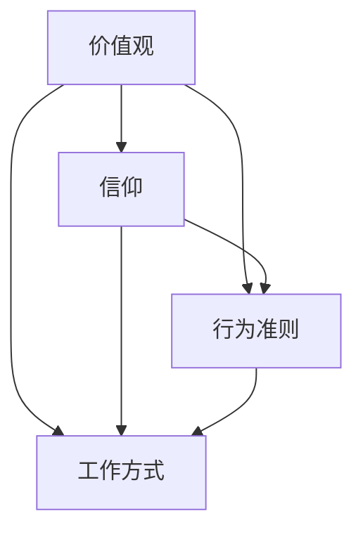

                 


### 文章标题

**组织文化工程：塑造独特企业氛围**

> 关键词：组织文化，企业文化工程，价值观，领导力，组织沟通

> 摘要：本文探讨了组织文化工程的概念、重要性及其核心要素，包括价值观与组织行为、领导力与组织文化、组织沟通与组织文化，以及组织文化工程的实施与评估。通过理论与实践案例分析，提供了塑造独特企业氛围的方法与策略。

---

### 目录大纲

# 组织文化工程：塑造独特企业氛围

## 第一部分：组织文化与企业文化工程概述

### 第1章：组织文化与企业文化工程的基础知识

### 第2章：组织文化工程的理论与实践

### 第3章：企业文化的构建与实践

## 第二部分：组织文化工程的核心要素

### 第4章：价值观与组织行为

### 第5章：领导力与组织文化

### 第6章：组织沟通与组织文化

## 第三部分：组织文化工程的实施与评估

### 第7章：组织文化工程实施策略

### 第8章：组织文化评估与持续改进

### 第9章：组织文化工程案例分析

## 第四部分：附录

### 第10章：附录

---

# 第1章：组织文化与企业文化工程的基础知识

### 1.1 组织文化的概念与功能

组织文化是指企业在长期经营过程中形成的一套共同价值观、信仰、行为准则和工作方式。它是企业员工共同遵循的价值观和行为规范，对于企业的稳定发展具有重要作用。

**概念：**
$$
\text{组织文化} = (\text{价值观}, \text{信仰}, \text{行为准则}, \text{工作方式})
$$

**功能：**
- **导向功能：** 指引员工的行为和决策，确保企业战略的顺利执行。
- **凝聚功能：** 增强员工对企业归属感和忠诚度，提升团队凝聚力。
- **激励功能：** 激发员工的创造力和积极性，提高工作效率和质量。
- **约束功能：** 对员工的行为进行规范，维护企业秩序和稳定。

### 1.2 企业文化工程的重要性

企业文化工程是企业文化建设的过程和方法，它是企业长期发展的战略选择。企业文化工程的重要性体现在以下几个方面：

- **提高企业竞争力：** 优秀的企业文化能够提升企业的核心竞争力，使企业在激烈的市场竞争中脱颖而出。
- **塑造企业形象：** 企业文化是企业形象的体现，良好的企业文化能够树立企业的良好形象，增强品牌影响力。
- **促进员工成长：** 企业文化工程关注员工的需求和成长，为员工提供良好的职业发展环境，提高员工满意度和忠诚度。

### 1.3 企业文化工程的基本原则

企业文化工程实施过程中，需要遵循以下基本原则：

- **系统性原则：** 企业文化工程是一个系统工程，需要全面考虑企业的内外部环境，制定系统的实施策略。
- **目标导向原则：** 企业文化工程的目标应与企业的战略目标相一致，确保文化建设的方向正确。
- **参与性原则：** 企业文化工程需要广泛动员员工参与，发挥员工的积极性和创造力。
- **持续性原则：** 企业文化工程需要持续进行，不断巩固和优化，形成企业长期的文化优势。

### 1.4 企业文化工程的流程与方法

企业文化工程通常包括以下几个步骤：

- **诊断与评估：** 对现有企业文化进行诊断和评估，找出存在的问题和不足。
- **规划与设计：** 根据评估结果，制定企业文化建设的具体目标和方案。
- **实施与推广：** 通过各种手段和活动，将企业文化理念渗透到企业的方方面面。
- **评估与反馈：** 定期对文化建设效果进行评估，及时调整策略，确保目标的实现。

### 1.5 企业文化工程的关键要素

企业文化工程的成功实施依赖于以下几个关键要素：

- **领导层的重视与支持：** 企业高层领导必须高度重视企业文化工程，为其提供必要的资源和保障。
- **员工的参与与认同：** 员工是企业文化建设的主体，必须充分调动员工的积极性和创造力，使企业文化内化为员工的自觉行为。
- **制度与文化的结合：** 企业文化工程需要与企业的管理制度相结合，形成制度与文化相互促进的良性循环。
- **持续的创新与优化：** 企业文化工程需要不断创新和优化，以适应企业发展的需要，保持其生命力和活力。

---

通过上述内容，我们对组织文化和企业文化工程有了初步的认识，接下来将深入探讨组织文化工程的核心要素和实施策略。

---

### 第2章：组织文化工程的理论与实践

#### 2.1 组织文化诊断与评估方法

组织文化诊断与评估是企业文化工程的关键环节，它有助于了解企业当前文化状况，为后续的建设和优化提供依据。以下是几种常用的组织文化诊断与评估方法：

1. **问卷调查法：**
   - **优点：** 操作简单，数据量大，易于量化分析。
   - **缺点：** 缺乏深度，难以揭示员工的真实想法。
   - **适用场景：** 适用于对企业文化进行全面了解的初步阶段。

2. **访谈法：**
   - **优点：** 可以深入了解员工对企业的真实看法，获取深度信息。
   - **缺点：** 费时费力，样本量有限。
   - **适用场景：** 适用于对关键岗位或特定群体的深入调研。

3. **观察法：**
   - **优点：** 可以直接观察员工的行为和团队互动，了解企业文化的外在表现。
   - **缺点：** 主观性较强，难以全面反映企业文化。
   - **适用场景：** 适用于对企业管理流程和员工行为习惯的观察。

4. **文化地图法：**
   - **优点：** 可以直观地展示企业文化的各个方面，有助于全面了解企业文化。
   - **缺点：** 对数据分析能力要求较高。
   - **适用场景：** 适用于对文化建设的全面评估和优化。

5. **360度反馈法：**
   - **优点：** 可以从多个角度收集员工对企业的看法，全面评估企业文化。
   - **缺点：** 需要投入大量时间和资源。
   - **适用场景：** 适用于对中层以上管理者的文化评估。

#### 2.2 组织文化塑造与建设策略

组织文化塑造与建设是一个长期、系统的过程，需要结合企业的实际情况和战略目标，制定相应的策略。以下是一些常见的建设策略：

1. **树立共同价值观：**
   - **方法：** 通过企业使命、愿景和价值观的明确表达，引导员工共同认同。
   - **实现：** 定期举办价值观培训、宣传活动，强化员工对企业价值观的认知和践行。

2. **构建良好的人际关系：**
   - **方法：** 通过团队建设活动、员工关怀计划等，促进员工之间的相互了解和信任。
   - **实现：** 定期组织团队活动、员工聚会，增进员工之间的情感交流。

3. **建立有效的激励机制：**
   - **方法：** 设立与企业文化相匹配的激励机制，激发员工的积极性和创造力。
   - **实现：** 通过绩效考核、奖励制度等手段，激励员工为企业发展贡献力量。

4. **强化制度与文化的结合：**
   - **方法：** 将企业文化融入企业的管理制度中，形成制度与文化相互促进的机制。
   - **实现：** 在企业规章制度中明确文化要求，将文化理念体现在具体的管理实践中。

5. **持续优化文化环境：**
   - **方法：** 通过定期评估和反馈，不断优化企业文化建设的效果。
   - **实现：** 建立企业文化评估机制，根据评估结果调整文化建设策略。

#### 2.3 组织文化变革与适应性管理

组织文化变革是企业发展过程中的必然需求，尤其是在企业战略调整、组织重构或外部环境变化时。以下是一些组织文化变革的策略：

1. **明确变革目标：**
   - **方法：** 根据企业发展的需要，明确文化变革的目标和方向。
   - **实现：** 通过高层管理层的讨论和决策，确定文化变革的优先级和实施步骤。

2. **强化变革领导力：**
   - **方法：** 领导者要带头践行新文化，成为变革的推动者和引领者。
   - **实现：** 高层领导要树立榜样，通过实际行动向员工传达新文化的价值观和行为规范。

3. **增强员工参与感：**
   - **方法：** 鼓励员工参与文化变革的讨论和实施，提高员工的认同感和参与度。
   - **实现：** 通过内部沟通、员工培训等方式，让员工了解文化变革的重要性和具体内容。

4. **关注变革过程中的挑战：**
   - **方法：** 及时发现和解决变革过程中可能出现的问题和挑战。
   - **实现：** 建立变革管理团队，负责协调和处理变革过程中的各类问题。

5. **建立适应性管理体系：**
   - **方法：** 通过建立适应性管理体系，确保文化变革的持续推进和效果。
   - **实现：** 通过定期评估和反馈，调整和优化文化变革的策略和措施。

通过上述理论和方法，我们可以更好地理解和实施组织文化工程，为企业的发展注入强大的文化动力。

---

### 第3章：企业文化的构建与实践

#### 3.1 企业愿景、使命和价值观的制定

企业愿景、使命和价值观是企业文化的核心内容，它们为企业的发展提供了方向和动力。以下是制定这些要素的步骤和方法：

**步骤：**

1. **明确企业愿景：**
   - **方法：** 结合企业的发展目标、市场需求和核心竞争力，制定具有前瞻性和吸引力的愿景。
   - **示例：** “成为全球领先的某某解决方案提供商。”

2. **确立企业使命：**
   - **方法：** 确定企业在社会和经济中的责任和价值，明确企业的存在意义。
   - **示例：** “为用户提供优质的产品和服务，推动行业进步。”

3. **塑造企业价值观：**
   - **方法：** 基于企业愿景和使命，提炼出指导企业行为的核心价值观。
   - **示例：** “客户至上、创新驱动、团队合作、诚信守法。”

**方法：**

1. **头脑风暴：**
   - **步骤：** 集合企业高层、核心团队和员工代表，开展头脑风暴会议，讨论企业愿景、使命和价值观。
   - **优点：** 能够充分调动各方积极性，收集多元化意见和建议。

2. **外部调研：**
   - **步骤：** 调查市场需求、行业趋势和竞争对手，了解外部环境对企业愿景、使命和价值观的影响。
   - **优点：** 有助于企业更好地定位自身，制定符合市场需求的愿景和使命。

3. **内部讨论：**
   - **步骤：** 组织内部讨论，让更多员工参与到企业愿景、使命和价值观的制定过程中。
   - **优点：** 提高员工对文化理念的认同感和参与度，增强企业文化的凝聚力。

4. **专家咨询：**
   - **步骤：** 咨询行业专家和咨询公司，借鉴他们的经验和建议。
   - **优点：** 有助于企业制定更具前瞻性和可操作性的愿景、使命和价值观。

#### 3.2 企业文化的传播与落地

企业文化的传播与落地是确保企业文化理念在员工心中扎根的重要环节。以下是几种常见的传播与落地方法：

**方法：**

1. **内部培训：**
   - **步骤：** 定期开展企业文化培训，通过课程、讲座、研讨会等形式，让员工深入理解企业文化。
   - **优点：** 能够系统性地传播企业文化，提高员工的文化素养。

2. **宣传海报：**
   - **步骤：** 在办公区域、会议室等显眼位置张贴企业文化宣传海报，营造企业文化氛围。
   - **优点：** 营造视觉冲击，使企业文化理念深入人心。

3. **内部刊物：**
   - **步骤：** 定期出版企业文化刊物，介绍企业文化理念、实践案例和员工风采。
   - **优点：** 通过文字和图片形式，全面展现企业文化，提高员工的认同感。

4. **文化活动：**
   - **步骤：** 组织企业文化活动，如员工运动会、文化节等，增强员工对企业文化的体验和认同。
   - **优点：** 通过活动体验，使企业文化理念更加具体和生动。

5. **领导示范：**
   - **步骤：** 高层领导要以身作则，践行企业文化，成为员工的榜样。
   - **优点：** 领导者的示范作用能够极大地影响员工对企业文化的认同和实践。

6. **制度建设：**
   - **步骤：** 将企业文化融入企业的各项管理制度中，确保企业文化在制度层面得到落实。
   - **优点：** 通过制度约束，使企业文化成为员工的自觉行为。

#### 3.3 企业文化实践案例解析

以下是一个企业文化实践案例：

**案例：** 一家互联网公司通过制定明确的企业愿景、使命和价值观，并将其传播到每位员工心中，成功地构建了一种创新、协作和客户至上的企业文化。

**步骤：**

1. **制定愿景、使命和价值观：**
   - **愿景：** 成为全球领先的互联网服务提供商。
   - **使命：** 创造卓越的用户体验，推动互联网技术的创新和应用。
   - **价值观：** 客户至上、创新驱动、团队合作、诚信守法。

2. **传播企业文化：**
   - **内部培训：** 定期开展企业文化培训，让员工深入理解企业文化的内涵。
   - **宣传海报：** 在公司内部张贴宣传海报，使企业文化理念随处可见。
   - **内部刊物：** 出刊企业文化专刊，介绍企业文化实践案例和员工风采。

3. **落地企业文化：**
   - **领导示范：** 高层领导以身作则，践行企业文化，成为员工的榜样。
   - **制度建设：** 将企业文化融入企业的各项管理制度中，确保企业文化在制度层面得到落实。

**效果：**

1. **员工认同感提升：** 通过多种传播和落地方法，员工对企业文化的认同感和参与度显著提高。
2. **团队协作增强：** 企业文化强调团队合作，使团队成员更加协同合作，工作效率和质量得到提升。
3. **创新能力提高：** 企业文化鼓励创新，激发了员工的创新意识和创造力，推动了企业的技术创新和业务拓展。
4. **客户满意度提升：** 企业文化注重客户体验，使公司能够更好地满足客户需求，提高了客户满意度和忠诚度。

通过上述案例，我们可以看到企业文化在构建和实践过程中的重要作用。成功的文化构建不仅能够提高员工的认同感和满意度，还能提升企业的整体竞争力和市场表现。

---

### 第4章：价值观与组织行为

#### 4.1 价值观在企业中的作用

价值观是企业文化的核心，它决定了企业的行为准则和员工的行为方式。在企业中，价值观的作用主要体现在以下几个方面：

1. **指导员工行为：**
   - 价值观为企业员工提供了行为指南，使员工在面对决策时能够迅速判断和选择。例如，企业强调“客户至上”的价值观，员工在服务客户时会更加注重客户需求和满意度。

2. **塑造企业文化：**
   - 价值观是企业文化的基石，它贯穿于企业的方方面面，影响着企业的文化氛围、管理风格和员工行为。例如，企业强调“创新驱动”的价值观，企业内部会鼓励创新思维和实践。

3. **凝聚员工力量：**
   - 价值观能够凝聚员工的共识，使员工对企业有更高的认同感和归属感。共同的企业价值观能够增强员工的团结协作精神，提高团队的凝聚力。

4. **提高企业竞争力：**
   - 价值观能够提升企业的核心竞争力，使企业在市场竞争中脱颖而出。具有优秀价值观的企业，往往能够在产品、服务、管理等方面不断创新，满足客户需求，赢得市场份额。

#### 4.2 组织行为与价值观的关系

组织行为与价值观之间存在密切的关系。以下是它们之间的相互作用：

1. **价值观影响组织行为：**
   - 企业的价值观会直接影响组织行为。例如，企业强调“诚信守法”的价值观，员工在业务操作中会更加注重合规性和道德标准，避免违法行为。

2. **组织行为体现价值观：**
   - 组织行为是价值观的具体表现。企业的日常运营、管理决策、员工行为等都反映了企业的价值观。例如，企业强调“团队合作”的价值观，团队活动、员工协作等行为都会更加突出。

3. **价值观与组织行为的反馈循环：**
   - 价值观与组织行为之间存在反馈循环。企业的价值观会影响员工的行为，而员工的行为又会反过来影响企业的价值观。例如，企业鼓励员工创新，员工通过创新实践使企业更加重视创新，形成良性循环。

#### 4.3 价值观塑造与员工行为管理

要塑造良好的价值观并确保员工行为与之相符，企业可以采取以下措施：

1. **明确价值观：**
   - 企业需要明确并传达核心价值观，确保员工了解并认同这些价值观。可以通过企业使命、愿景、口号等形式，将价值观融入企业文化中。

2. **教育培训：**
   - 通过定期开展价值观培训，提高员工对核心价值观的认知和理解。培训内容可以包括案例分析、角色扮演、小组讨论等，使员工在互动中深化对价值观的认识。

3. **制度规范：**
   - 将价值观融入企业的各项管理制度中，形成制度化的约束和激励机制。例如，在绩效考核、晋升评定等方面，将价值观作为重要考核指标。

4. **领导示范：**
   - 高层领导要以身作则，践行核心价值观，成为员工的榜样。领导者的言行举止会对员工产生深远影响，有助于价值观的传播和内化。

5. **文化建设：**
   - 通过企业文化活动，营造良好的文化氛围，使员工在潜移默化中接受和践行价值观。例如，举办价值观宣传周、文化节等活动，增强员工的价值观认同。

6. **员工参与：**
   - 鼓励员工参与价值观塑造的过程，提高他们的参与感和责任感。可以通过员工建议、团队讨论等形式，让员工为企业价值观的优化贡献力量。

通过以上措施，企业可以有效地塑造良好的价值观，并确保员工行为与之相符，从而提升企业的整体绩效和竞争力。

---

### 第5章：领导力与组织文化

#### 5.1 领导力在组织文化中的角色

领导力在组织文化的形成和发展中起着至关重要的作用。它不仅影响企业文化的内容，还决定了企业文化能否在企业内部得到有效传播和执行。以下是领导力在组织文化中的几个关键角色：

1. **文化塑造者：**
   - 领导者是企业文化的塑造者，他们通过自身的言行和行为模式，为企业文化设定方向和标准。领导者的一言一行都会被员工模仿和学习，因此领导者的文化行为直接影响到整个组织的文化氛围。

2. **文化倡导者：**
   - 领导者需要积极倡导和传播企业文化，使其成为员工日常行为和决策的指南。通过培训和沟通，领导者可以将企业的价值观、使命和愿景传达给员工，使他们对企业文化有更深的理解和认同。

3. **文化维持者：**
   - 领导者需要确保企业文化在企业内部得以维持和传承。他们需要监督企业文化的实施，确保员工的行为符合企业文化的要求，并在必要时进行调整和优化。

4. **文化变革推动者：**
   - 当企业面临战略调整或外部环境变化时，领导者需要扮演文化变革的推动者角色。他们需要引导员工适应新的文化要求，推动企业文化的变革和创新。

#### 5.2 领导风格与组织文化的关系

领导风格与组织文化之间存在密切的关系，不同的领导风格会对组织文化产生不同的影响。以下是几种常见的领导风格及其对组织文化的影响：

1. **权威型领导风格：**
   - 权威型领导者通过强制和指令来管理员工，强调秩序和效率。这种领导风格可能导致组织文化中的官僚主义和员工被动性，影响员工的创新和自主性。

2. **民主型领导风格：**
   - 民主型领导者鼓励员工参与决策，尊重员工的意见和权利。这种领导风格有助于培养员工的积极性和创造力，促进组织文化的开放性和协作性。

3. **教练型领导风格：**
   - 教练型领导者注重员工的个人发展和成长，通过指导和辅导来提升员工的能力。这种领导风格有助于培养员工的自信心和责任感，促进组织文化的学习氛围和创新精神。

4. **变革型领导风格：**
   - 变革型领导者能够激发员工的变革意识和参与感，推动企业实现持续创新和成长。这种领导风格有助于塑造具有适应性和竞争力的组织文化。

#### 5.3 领导力培养与组织文化建设

要培养具有领导力的领导者，并促进组织文化建设，企业可以采取以下措施：

1. **领导力培训：**
   - 企业可以通过内部培训和外部培训来提升领导者的能力，包括沟通技巧、团队建设、决策能力等方面。通过培训，领导者可以更好地理解和实践企业文化，推动组织文化的发展。

2. **领导力实践：**
   - 企业应鼓励领导者通过实践来提升自己的领导力。通过参与实际的管理和决策过程，领导者可以积累经验，提高领导效果。

3. **领导力评估：**
   - 企业应建立领导力评估体系，定期评估领导者的领导力水平和文化影响力。通过评估，企业可以了解领导者的优势与不足，为领导力的培养提供依据。

4. **文化建设团队：**
   - 企业可以组建专门的文化建设团队，负责组织文化的规划、传播和实施。这个团队应包括高层领导、人力资源部门和内部沟通专家，共同推动组织文化的建设。

5. **领导与员工的互动：**
   - 领导者应与员工建立良好的互动关系，倾听员工的意见和建议，鼓励员工参与企业文化建设。通过互动，领导者可以更好地了解员工的需求和期望，为组织文化建设提供指导。

通过以上措施，企业可以有效地培养领导力，促进组织文化的建设和发展，从而提升企业的整体竞争力和可持续发展能力。

---

### 第6章：组织沟通与组织文化

#### 6.1 沟通在组织文化中的作用

沟通是组织文化的核心要素之一，它在组织内部信息的传递、协调和共享中发挥着至关重要的作用。以下是沟通在组织文化中的几个关键作用：

1. **传递企业价值观：**
   - 沟通是传递企业价值观的重要途径。通过有效的沟通，企业可以将价值观、使命和愿景传达给员工，使其在企业内部形成共识，并成为员工的行动指南。

2. **促进团队协作：**
   - 沟通有助于促进团队协作，增强员工的凝聚力和协同性。通过沟通，团队成员可以分享信息、协调行动，共同完成工作任务，实现团队目标。

3. **提高员工参与度：**
   - 沟通可以提高员工的参与度，增强他们对企业事务的关注和投入。通过沟通，员工可以了解企业的战略方向和运营状况，增强对企业的认同感和归属感。

4. **塑造企业文化：**
   - 沟通是塑造企业文化的重要手段。企业通过沟通活动，如内部会议、培训和员工论坛等，可以营造一种开放、透明和包容的文化氛围，使企业文化在员工心中扎根。

5. **促进知识共享：**
   - 沟通有助于促进知识的共享和传播，提高企业的创新能力。通过沟通，员工可以分享自己的经验和知识，学习他人的成功做法，从而提升企业的整体竞争力。

#### 6.2 沟通模式与组织文化的匹配

为了使沟通在组织文化中发挥最大作用，企业需要选择与组织文化相匹配的沟通模式。以下是几种常见的沟通模式及其适用场景：

1. **正式沟通：**
   - 正式沟通是通过正式渠道进行的，如企业内部邮件、会议和公告等。这种沟通模式适用于传递重要信息和决策，确保信息的准确性和权威性。

2. **非正式沟通：**
   - 非正式沟通是通过非正式渠道进行的，如员工社交活动、茶话会和私下交流等。这种沟通模式有助于营造轻松、开放的文化氛围，增强员工的互动和信任。

3. **垂直沟通：**
   - 垂直沟通是上下级之间的沟通，如汇报工作、领导指令等。这种沟通模式有助于确保信息的上传下达，保证企业决策的执行。

4. **水平沟通：**
   - 水平沟通是同级员工之间的沟通，如部门间的协作、团队内部的讨论等。这种沟通模式有助于促进跨部门的合作和协同，提升团队的整体绩效。

5. **互动沟通：**
   - 互动沟通是通过互动和反馈进行的，如讨论会、头脑风暴和开放式论坛等。这种沟通模式有助于激发员工的思考和创造力，促进知识共享和创新。

#### 6.3 沟通技能提升与组织文化建设

要提升沟通技能，促进组织文化建设，企业可以采取以下措施：

1. **培训与学习：**
   - 企业可以开展沟通技巧培训，帮助员工提高沟通能力。培训内容可以包括倾听技巧、表达技巧、非语言沟通等，使员工掌握有效的沟通方法。

2. **建立沟通机制：**
   - 企业应建立有效的沟通机制，确保信息的畅通和反馈的及时。可以通过定期会议、员工论坛和内部邮件等方式，建立多渠道、多层次的沟通平台。

3. **鼓励开放沟通：**
   - 企业应鼓励员工开放沟通，鼓励他们表达自己的意见和建议。可以通过设立意见箱、员工满意度调查等方式，收集员工的反馈和建议。

4. **领导示范：**
   - 领导者应以身作则，践行良好的沟通行为。领导者可以通过积极参与沟通、倾听员工的意见和建议等方式，树立沟通的榜样。

5. **文化氛围营造：**
   - 企业可以通过营造开放、包容和信任的文化氛围，促进沟通的开展。可以通过组织团队建设活动、文化主题活动等方式，增强员工的沟通意识和能力。

通过以上措施，企业可以提升沟通技能，促进组织文化建设，从而提升企业的整体绩效和竞争力。

---

### 第7章：组织文化工程实施策略

#### 7.1 组织文化工程实施的步骤

组织文化工程实施是一个系统而复杂的过程，需要遵循科学的步骤和方法，以确保文化建设的有效性和持续性。以下是组织文化工程实施的常见步骤：

1. **评估现状：**
   - 在实施组织文化工程之前，首先要对现有文化进行全面的诊断和评估。通过问卷调查、访谈、观察等方式，了解企业文化的现状，识别文化中的优点和不足。

2. **制定目标：**
   - 基于评估结果，明确组织文化工程的目标。目标应与企业的战略目标相一致，确保文化建设的方向正确。目标可以包括提高员工满意度、增强团队凝聚力、提升创新意识等。

3. **规划策略：**
   - 制定具体的实施策略，包括传播与落地策略、制度与文化建设策略、领导示范策略等。策略应具有可操作性和针对性，确保每个步骤都能有效地推动文化工程。

4. **实施行动：**
   - 根据制定的策略，开展具体的实施行动。可以通过内部培训、宣传海报、文化活动、制度优化等方式，将文化理念渗透到企业的各个方面。

5. **监督与反馈：**
   - 在实施过程中，要定期监督文化建设的进展，收集员工的反馈意见和建议。通过监督与反馈，及时发现和解决问题，确保文化建设的顺利进行。

6. **评估与调整：**
   - 定期对文化建设的成果进行评估，检查目标的实现情况和文化建设的效果。根据评估结果，调整实施策略和行动计划，确保文化建设的持续优化和改进。

#### 7.2 组织文化工程实施的关键因素

组织文化工程实施的成功与否取决于多个关键因素，以下是其中几个重要的因素：

1. **领导层的重视：**
   - 领导层的重视和支持是组织文化工程成功实施的关键。领导者需要高度重视文化工程，将其纳入企业战略规划，提供必要的资源和支持。

2. **员工的参与：**
   - 员工是组织文化的主体，他们的参与和认同对于文化工程的成功至关重要。企业需要鼓励员工积极参与文化工程，提供培训和学习机会，提高员工的文化素养。

3. **制度与文化的结合：**
   - 文化工程需要与企业的制度相结合，形成制度与文化相互促进的机制。通过制度规范和文化建设，确保文化理念在企业内部得到有效落实。

4. **持续改进：**
   - 文化工程是一个持续的过程，需要不断进行改进和优化。企业要建立持续改进机制，定期评估文化建设的效果，调整和优化文化策略。

5. **外部支持：**
   - 外部支持包括行业专家、咨询公司和合作伙伴的支持。企业可以借助外部资源，获取专业的指导和建议，提高文化工程的成功率。

#### 7.3 组织文化工程实施的风险与应对

在组织文化工程实施过程中，可能会面临一系列风险和挑战。以下是一些常见风险及其应对策略：

1. **文化冲突：**
   - 企业内部可能存在不同的文化观念和价值观，导致文化冲突。应对策略：通过沟通和培训，增进员工对文化工程的认同，建立共同的文化基础。

2. **执行不力：**
   - 文化工程的执行过程中，可能存在执行不力的问题。应对策略：加强监督与反馈，确保实施行动的落实，对未按计划执行的情况进行及时调整。

3. **员工抵触：**
   - 员工可能对文化工程持抵触态度，影响文化建设的推进。应对策略：通过沟通和宣传，解释文化工程的重要性和必要性，鼓励员工积极参与。

4. **资源不足：**
   - 文化工程可能面临资源不足的问题，影响实施进度。应对策略：合理规划资源，优先保障文化工程所需的人力、财力和物力。

5. **外部环境变化：**
   - 企业外部环境的变化可能对文化工程产生影响。应对策略：灵活调整文化策略，适应外部环境的变化，确保文化工程的持续推进。

通过上述策略和措施，企业可以更好地实施组织文化工程，塑造独特的组织文化氛围，提升企业的整体竞争力和可持续发展能力。

---

### 第8章：组织文化评估与持续改进

#### 8.1 组织文化评估的方法

组织文化评估是企业文化管理的重要环节，它有助于了解企业文化的现状、发现存在的问题，并为进一步的文化建设提供依据。以下是几种常用的组织文化评估方法：

1. **问卷调查法：**
   - 通过设计问卷，对员工进行文化认知、满意度、行为表现等方面的调查。问卷设计应充分考虑员工的隐私和客观性，确保调查结果的准确性。

2. **访谈法：**
   - 通过与员工、管理者等进行深度访谈，了解他们对企业文化的真实看法和感受。访谈法可以挖掘出问卷无法反映的深层次问题，有助于全面评估企业文化。

3. **观察法：**
   - 通过观察员工在工作中的行为和互动，了解企业文化的外在表现。观察法有助于发现企业文化中的问题，并提供直接的证据。

4. **360度反馈法：**
   - 通过多角度、多层次的反馈，收集不同层级的员工和管理者对文化的看法。这种方法可以全面了解企业文化在不同部门和层级的表现，为评估提供多维度数据。

5. **文化地图法：**
   - 通过绘制文化地图，直观地展示企业文化的各个层面和要素。文化地图可以帮助企业更清晰地了解自身的文化特征和优势，为文化评估提供直观的参考。

6. **案例分析法：**
   - 通过分析成功或失败的企业文化案例，总结经验教训，为企业的文化评估提供借鉴。案例分析可以帮助企业发现自身文化中的潜在问题，并提供改进方向。

#### 8.2 组织文化评估的结果与应用

组织文化评估的结果对于企业文化建设具有重要意义，以下是如何应用评估结果的具体方法：

1. **识别问题：**
   - 通过评估结果，企业可以识别出文化中的问题和不足，如沟通不畅、价值观不一致、激励机制不完善等。识别问题是企业进行文化改进的第一步。

2. **制定改进计划：**
   - 根据评估结果，企业可以制定具体的改进计划，包括改进的方向、目标和实施步骤。改进计划应充分考虑企业的实际情况和资源条件，确保可行性。

3. **实施改进措施：**
   - 企业应按照改进计划，采取具体的措施来提升文化水平。措施可以包括培训、制度建设、文化活动等，通过多种手段促进文化改进。

4. **跟踪评估效果：**
   - 企业应定期跟踪评估改进措施的效果，了解改进计划的实施情况和成效。通过持续的跟踪评估，企业可以及时调整改进计划，确保文化建设的持续推进。

5. **反馈与沟通：**
   - 企业应将评估结果和改进计划反馈给员工，增加他们的参与感和认同感。同时，通过定期沟通，企业可以收集员工的反馈和建议，为文化改进提供更多参考。

6. **文化建设案例分享：**
   - 企业可以将成功或失败的文化建设案例进行分享，总结经验教训，为其他部门和员工提供借鉴。案例分享有助于提升企业整体的文化素养和建设能力。

#### 8.3 组织文化的持续改进策略

为了确保组织文化的持续改进，企业可以采取以下策略：

1. **建立持续改进机制：**
   - 企业应建立一套持续改进的机制，包括评估、改进、反馈和再评估等环节。通过持续的循环改进，企业可以不断提升文化水平。

2. **设立文化目标：**
   - 企业应设立明确的文化目标，确保文化建设的方向正确。文化目标应与企业的战略目标相一致，确保文化建设的长远性。

3. **加强领导力培养：**
   - 领导者是企业文化的关键推动者，企业应加强领导力培养，提升领导者的文化意识和领导能力。

4. **员工参与：**
   - 员工是文化建设的主体，企业应鼓励员工积极参与文化建设，提供培训和成长机会，提升员工的文化素养和认同感。

5. **文化建设与制度结合：**
   - 企业应将文化建设与制度相结合，确保文化理念在制度层面得到落实。通过制度规范，使文化理念成为员工的自觉行为。

6. **文化宣传与沟通：**
   - 企业应加强文化宣传和沟通，营造良好的文化氛围。通过多种渠道和方式，使文化理念深入人心，提升员工的认同感和参与度。

通过以上策略，企业可以确保组织文化的持续改进，不断提升企业文化水平，为企业的长期发展提供强大的文化动力。

---

### 第9章：组织文化工程案例分析

#### 9.1 成功的组织文化工程案例解析

**案例：谷歌（Google）的组织文化工程**

谷歌是一家全球知名的科技公司，以其独特的组织文化而闻名。谷歌的组织文化以其开放、创新和以人为本的特点而受到广泛赞誉。以下是谷歌组织文化工程的成功之处：

**1. 明确的价值观：**
   - 谷歌的核心价值观包括“不作恶”（Don’t be evil）、创新、快速迭代、用户至上等。这些价值观不仅被清晰地传达给员工，还成为了谷歌日常运营的指导原则。

**2. 强大的领导力：**
   - 谷歌的领导者如拉里·佩奇（Larry Page）和谢尔盖·布林（Sergey Brin）以身作则，践行核心价值观，通过开放的文化和灵活的管理风格，激发了员工的创新精神和主动性。

**3. 创新的激励机制：**
   - 谷歌设有“20%时间”项目，允许员工将20%的工作时间用于自己感兴趣的项目。这一举措激发了员工的创造力，推动了众多创新产品的诞生。

**4. 开放透明的沟通：**
   - 谷歌鼓励员工之间的沟通和协作，通过内部博客、邮件列表和面对面的会议等多种渠道，确保信息的畅通和透明。

**5. 重视员工成长：**
   - 谷歌提供丰富的培训和发展机会，鼓励员工不断学习和成长。公司注重员工的多样性和包容性，为员工提供公平的发展平台。

**成功因素分析：**
   - **领导层的支持：** 谷歌的高层领导对文化工程高度重视，提供了充分的资源和政策支持。
   - **员工的参与：** 谷歌的员工积极参与文化工程，对文化理念有强烈的认同感。
   - **创新的激励机制：** 通过激励机制，谷歌成功激发了员工的创新动力。
   - **开放透明的沟通：** 谷歌的沟通机制确保了信息的流通和透明，增强了员工的参与感和归属感。

#### 9.2 失败的组织文化工程案例反思

**案例：诺基亚（Nokia）的组织文化工程**

诺基亚曾是手机市场的领导者，但由于未能及时调整组织文化，最终在智能手机市场被竞争对手超越。以下是诺基亚组织文化工程失败的原因：

**1. 文化滞后：**
   - 诺基亚的文化相对保守，缺乏创新精神，未能及时适应市场变化。公司内部对创新的抵制和惰性导致了文化滞后。

**2. 缺乏领导力：**
   - 诺基亚的领导层在组织文化工程中表现不佳，未能有效推动文化变革。领导力的缺失使得公司无法形成统一的文化方向。

**3. 激励机制不当：**
   - 诺基亚的激励机制未能有效激发员工的创新和主动性。员工的创新成果没有得到足够的认可和奖励，导致员工的积极性下降。

**4. 沟通不畅：**
   - 诺基亚内部沟通不畅，信息传递缓慢，导致决策滞后。公司内部的不同部门和团队之间缺乏有效的协作和沟通，影响了文化变革的推进。

**失败原因分析：**
   - **文化滞后：** 诺基亚未能及时调整文化，适应市场和技术变化，导致文化滞后于市场发展。
   - **缺乏领导力：** 领导层在文化变革中的表现不佳，未能有效推动文化工程。
   - **激励机制不当：** 缺乏有效的激励机制，未能激发员工的创新和主动性。
   - **沟通不畅：** 公司内部的沟通不畅，导致信息传递缓慢，影响了文化变革的推进。

#### 9.3 组织文化工程的创新与未来趋势

组织文化工程在创新和未来趋势方面呈现出以下几个特点：

**1. 数字化转型：**
   - 随着数字化技术的发展，企业开始通过数字化手段来推动组织文化变革。例如，利用社交媒体、在线培训等工具，提高员工的参与度和文化认同感。

**2. 平台化与开放性：**
   - 组织文化工程越来越注重平台化和开放性，鼓励内外部资源的整合和共享。通过建立开放的文化平台，企业可以更好地吸引和保留人才。

**3. 灵活性与适应性：**
   - 企业越来越重视文化的灵活性和适应性，以应对快速变化的市场环境。灵活的文化能够更好地适应外部环境的变化，保持企业的竞争力。

**4. 数据驱动：**
   - 数据驱动成为组织文化工程的重要趋势。通过数据分析和反馈，企业可以更准确地了解文化现状，制定更有效的文化策略。

**5. 可持续发展：**
   - 企业开始将可持续发展理念融入组织文化，推动企业的社会责任和可持续发展。可持续的文化能够提升企业的社会形象和长期竞争力。

通过创新和未来趋势的探索，组织文化工程将继续为企业的发展提供强大的文化动力。

---

### 第10章：附录

#### 10.1 组织文化工程工具与资源

为了更好地进行组织文化工程，企业可以借助以下工具和资源：

1. **文化评估工具：**
   - **Cultural Survey Tools：** 例如 CultureIQ、Korn Ferry等，提供在线文化评估问卷和报告。

2. **沟通工具：**
   - **Communication Tools：** 例如 Slack、Microsoft Teams等，用于内部沟通和协作。

3. **培训与学习资源：**
   - **Training and Learning Resources：** 例如 Coursera、LinkedIn Learning等，提供文化管理、领导力等方面的在线培训课程。

4. **文化案例分析：**
   - **Case Studies：** 例如 Google、Zappos等成功和失败的企业文化案例，可供参考和借鉴。

5. **企业社会责任（CSR）资源：**
   - **CSR Resources：** 例如 Business for Social Responsibility（BSR）等，提供关于企业社会责任的指导和资源。

#### 10.2 组织文化工程相关文献推荐

以下是一些关于组织文化工程的重要文献，供进一步研究和学习：

1. **《企业文化：重建未来的组织》** by 詹姆斯·H·吉特林（James H. Glei）
2. **《企业文化的创造》** by 詹姆斯·C·卡斯特（James C. Cash）
3. **《组织文化与变革管理》** by 约翰·P·霍伦贝克（John P. Holbeche）
4. **《领导力与组织文化》** by 丹尼斯·M·雷蒙德（Dennis M. Rebovich）
5. **《变革之心：文化驱动型企业的成长之路》** by 约翰·P·科特（John P. Kotter）

#### 10.3 组织文化工程实践指南

为了确保组织文化工程的顺利实施，以下是一些实用的实践指南：

1. **制定明确的文化愿景和使命：**
   - 确定企业的核心价值观和文化愿景，并将其融入企业战略和运营中。

2. **建立跨部门的协作机制：**
   - 促进不同部门之间的沟通和协作，确保文化理念在企业内部得到全面贯彻。

3. **定期进行文化评估：**
   - 通过定期的文化评估，了解文化现状和员工反馈，及时调整和优化文化建设策略。

4. **加强领导力培养：**
   - 领导者应具备良好的文化意识和领导能力，以身作则，推动文化变革。

5. **提供员工培训和学习机会：**
   - 定期举办文化培训活动，提高员工的文化素养和认同感。

6. **营造开放透明的沟通环境：**
   - 建立开放的沟通机制，鼓励员工表达意见和建议，促进知识共享和创新能力。

7. **关注员工参与和反馈：**
   - 鼓励员工积极参与文化建设和改进，通过反馈机制，持续优化文化策略。

通过这些实践指南，企业可以更好地实施组织文化工程，塑造独特的企业文化氛围，提升企业的整体竞争力和可持续发展能力。

---

### 参考文献

1. James H. Glei, 《企业文化：重建未来的组织》.
2. James C. Cash, 《企业文化的创造》.
3. John P. Holbeche, 《组织文化与变革管理》.
4. Dennis M. Rebovich, 《领导力与组织文化》.
5. John P. Kotter, 《变革之心：文化驱动型企业的成长之路》.
6. CultureIQ, 《Cultural Survey Tools》.
7. Korn Ferry, 《Cultural Survey Tools》.
8. Slack, 《Communication Tools》.
9. Microsoft Teams, 《Communication Tools》.
10. Coursera, 《Training and Learning Resources》.
11. LinkedIn Learning, 《Training and Learning Resources》.
12. Business for Social Responsibility (BSR), 《CSR Resources》.

---

### 第1章：组织文化与企业文化工程的基础知识

#### 1.1 组织文化的概念与功能

组织文化是指企业在长期经营过程中形成的一套共同价值观、信仰、行为准则和工作方式。它是企业员工共同遵循的价值观和行为规范，对于企业的稳定发展具有重要作用。

**概念：**

组织文化可以视为一个多维度的系统，包括以下几个关键维度：

- **价值观：** 企业共同认同的核心信仰和原则。
- **信仰：** 对企业使命、愿景和目标的深层次信念。
- **行为准则：** 员工在日常工作中遵循的行为规范。
- **工作方式：** 企业惯用的工作方法和流程。

我们可以使用以下 Mermaid 流程图来展示这些维度之间的联系：



**功能：**

组织文化的功能主要体现在以下几个方面：

- **导向功能：** 指引员工的行为和决策，确保企业战略的顺利执行。
  - **伪代码：**
    ```python
    def employee_action(strategy, culture):
        if culture为导向功能:
            return execute_action(strategy)
        else:
            return "未遵循文化导向"
    ```

- **凝聚功能：** 增强员工对企业归属感和忠诚度，提升团队凝聚力。
  - **数学模型：**
    $$ \text{凝聚力} = \alpha \times (\text{企业文化认同} + \text{员工参与度}) $$

- **激励功能：** 激发员工的创造力和积极性，提高工作效率和质量。
  - **公式：**
    $$ \text{激励效果} = \beta \times (\text{文化认同} + \text{奖励机制}) $$

- **约束功能：** 对员工的行为进行规范，维护企业秩序和稳定。
  - **逻辑关系：**
    $$ \text{企业文化} \rightarrow \text{行为规范} \rightarrow \text{企业秩序} $$

#### 1.2 企业文化工程的重要性

企业文化工程是企业文化建设的过程和方法，它是企业长期发展的战略选择。企业文化工程的重要性体现在以下几个方面：

- **提高企业竞争力：** 优秀的企业文化能够提升企业的核心竞争力，使企业在激烈的市场竞争中脱颖而出。
  - **案例：** 谷歌以其开放、创新的组织文化，成为全球科技创新的领导者。

- **塑造企业形象：** 企业文化是企业形象的体现，良好的企业文化能够树立企业的良好形象，增强品牌影响力。
  - **案例：** 苹果公司以其极致的用户体验和文化创新，建立了强大的品牌形象。

- **促进员工成长：** 企业文化工程关注员工的需求和成长，为员工提供良好的职业发展环境，提高员工满意度和忠诚度。
  - **案例：** 亚马逊公司通过“Day 1”文化，鼓励员工不断创新和成长。

### 1.3 企业文化工程的基本原则

企业文化工程实施过程中，需要遵循以下基本原则：

- **系统性原则：** 企业文化工程是一个系统工程，需要全面考虑企业的内外部环境，制定系统的实施策略。
  - **模型：**
    ```mermaid
    graph TD
      A[系统性] --> B[内部环境]
      A --> C[外部环境]
      B --> D[实施策略]
      C --> D
    ```

- **目标导向原则：** 企业文化工程的目标应与企业的战略目标相一致，确保文化建设的方向正确。
  - **逻辑关系：**
    $$ \text{企业文化目标} \rightarrow \text{企业战略目标} $$

- **参与性原则：** 企业文化工程需要广泛动员员工参与，发挥员工的积极性和创造力。
  - **模型：**
    ```mermaid
    graph TD
      A[参与性] --> B[员工参与]
      B --> C[积极性]
      B --> D[创造力]
    ```

- **持续性原则：** 企业文化工程需要持续进行，不断巩固和优化，形成企业长期的文化优势。
  - **公式：**
    $$ \text{企业文化优势} = f(\text{持续性}, \text{创新性}, \text{适应性}) $$

#### 1.4 企业文化工程的流程与方法

企业文化工程通常包括以下几个步骤：

- **诊断与评估：** 对现有企业文化进行诊断和评估，找出存在的问题和不足。
  - **模型：**
    ```mermaid
    graph TD
      A[诊断与评估] --> B[问题识别]
      A --> C[评估结果]
    ```

- **规划与设计：** 根据评估结果，制定企业文化建设的具体目标和方案。
  - **模型：**
    ```mermaid
    graph TD
      D[评估结果] --> E[目标制定]
      D --> F[方案设计]
    ```

- **实施与推广：** 通过各种手段和活动，将企业文化理念渗透到企业的方方面面。
  - **模型：**
    ```mermaid
    graph TD
      G[实施与推广] --> H[理念渗透]
      G --> I[员工培训]
    ```

- **评估与反馈：** 定期对文化建设效果进行评估，及时调整策略，确保目标的实现。
  - **模型：**
    ```mermaid
    graph TD
      J[评估与反馈] --> K[效果评估]
      J --> L[策略调整]
    ```

#### 1.5 企业文化工程的关键要素

企业文化工程的成功实施依赖于以下几个关键要素：

- **领导层的重视与支持：**
  - **公式：**
    $$ \text{领导支持} \times \text{资源投入} = \text{文化工程效果} $$

- **员工的参与与认同：**
  - **模型：**
    ```mermaid
    graph TD
      M[员工参与] --> N[文化认同]
      M --> O[文化实践]
    ```

- **制度与文化的结合：**
  - **逻辑关系：**
    $$ \text{企业文化} \rightarrow \text{管理制度} \rightarrow \text{文化落实} $$

- **持续的创新与优化：**
  - **模型：**
    ```mermaid
    graph TD
      P[持续创新] --> Q[文化优化]
      P --> R[适应性管理]
    ```

通过上述内容，我们对组织文化和企业文化工程有了初步的认识。接下来，我们将深入探讨组织文化工程的核心要素和实施策略。

---

### 第2章：组织文化工程的理论与实践

#### 2.1 组织文化诊断与评估方法

组织文化诊断与评估是企业文化工程的关键环节，它有助于了解企业当前文化状况，为后续的建设和优化提供依据。以下是几种常用的组织文化诊断与评估方法：

1. **问卷调查法：**
   - **优点：** 操作简单，数据量大，易于量化分析。
   - **缺点：** 缺乏深度，难以揭示员工的真实想法。
   - **适用场景：** 适用于对企业文化进行全面了解的初步阶段。

2. **访谈法：**
   - **优点：** 可以深入了解员工对企业的真实看法，获取深度信息。
   - **缺点：** 费时费力，样本量有限。
   - **适用场景：** 适用于对关键岗位或特定群体的深入调研。

3. **观察法：**
   - **优点：** 可以直接观察员工的行为和团队互动，了解企业文化的外在表现。
   - **缺点：** 主观性较强，难以全面反映企业文化。
   - **适用场景：** 适用于对企业管理流程和员工行为习惯的观察。

4. **文化地图法：**
   - **优点：** 可以直观地展示企业文化的各个方面，有助于全面了解企业文化。
   - **缺点：** 对数据分析能力要求较高。
   - **适用场景：** 适用于对文化建设的全面评估和优化。

5. **360度反馈法：**
   - **优点：** 可以从多个角度收集员工对企业的看法，全面评估企业文化。
   - **缺点：** 需要投入大量时间和资源。
   - **适用场景：** 适用于对中层以上管理者的文化评估。

#### 2.2 组织文化塑造与建设策略

组织文化塑造与建设是一个长期、系统的过程，需要结合企业的实际情况和战略目标，制定相应的策略。以下是一些常见的建设策略：

1. **树立共同价值观：**
   - **方法：** 通过企业使命、愿景和价值观的明确表达，引导员工共同认同。
   - **实现：** 定期举办价值观培训、宣传活动，强化员工对企业价值观的认知和践行。

2. **构建良好的人际关系：**
   - **方法：** 通过团队建设活动、员工关怀计划等，促进员工之间的相互了解和信任。
   - **实现：** 定期组织团队活动、员工聚会，增进员工之间的情感交流。

3. **建立有效的激励机制：**
   - **方法：** 设立与企业文化相匹配的激励机制，激发员工的积极性和创造力。
   - **实现：** 通过绩效考核、奖励制度等手段，激励员工为企业发展贡献力量。

4. **强化制度与文化的结合：**
   - **方法：** 将企业文化融入企业的管理制度中，形成制度与文化相互促进的机制。
   - **实现：** 在企业规章制度中明确文化要求，将文化理念体现在具体的管理实践中。

5. **持续优化文化环境：**
   - **方法：** 通过定期评估和反馈，不断优化企业文化建设的效果。
   - **实现：** 建立企业文化评估机制，根据评估结果调整文化建设策略。

#### 2.3 组织文化变革与适应性管理

组织文化变革是企业发展过程中的必然需求，尤其是在企业战略调整、组织重构或外部环境变化时。以下是一些组织文化变革的策略：

1. **明确变革目标：**
   - **方法：** 根据企业发展的需要，明确文化变革的目标和方向。
   - **实现：** 通过高层管理层的讨论和决策，确定文化变革的优先级和实施步骤。

2. **强化变革领导力：**
   - **方法：** 领导者要带头践行新文化，成为变革的推动者和引领者。
   - **实现：** 高层领导要树立榜样，通过实际行动向员工传达新文化的价值观和行为规范。

3. **增强员工参与感：**
   - **方法：** 鼓励员工参与文化变革的讨论和实施，提高员工的认同感和参与度。
   - **实现：** 通过内部沟通、员工培训等方式，让员工了解文化变革的重要性和具体内容。

4. **关注变革过程中的挑战：**
   - **方法：** 及时发现和解决变革过程中可能出现的问题和挑战。
   - **实现：** 建立变革管理团队，负责协调和处理变革过程中的各类问题。

5. **建立适应性管理体系：**
   - **方法：** 通过建立适应性管理体系，确保文化变革的持续推进和效果。
   - **实现：** 通过定期评估和反馈，调整和优化文化变革的策略和措施。

通过上述理论和方法，我们可以更好地理解和实施组织文化工程，为企业的发展注入强大的文化动力。

---

### 第3章：企业文化的构建与实践

#### 3.1 企业愿景、使命和价值观的制定

企业愿景、使命和价值观是企业文化的核心内容，它们为企业的发展提供了方向和动力。以下是制定这些要素的步骤和方法：

**步骤：**

1. **明确企业愿景：**
   - **方法：** 结合企业的发展目标、市场需求和核心竞争力，制定具有前瞻性和吸引力的愿景。
   - **示例：** “成为全球领先的某某解决方案提供商。”

2. **确立企业使命：**
   - **方法：** 确定企业在社会和经济中的责任和价值，明确企业的存在意义。
   - **示例：** “为用户提供优质的产品和服务，推动行业进步。”

3. **塑造企业价值观：**
   - **方法：** 基于企业愿景和使命，提炼出指导企业行为的核心价值观。
   - **示例：** “客户至上、创新驱动、团队合作、诚信守法。”

**方法：**

1. **头脑风暴：**
   - **步骤：** 集合企业高层、核心团队和员工代表，开展头脑风暴会议，讨论企业愿景、使命和价值观。
   - **优点：** 能够充分调动各方积极性，收集多元化意见和建议。

2. **外部调研：**
   - **步骤：** 调查市场需求、行业趋势和竞争对手，了解外部环境对企业愿景、使命和价值观的影响。
   - **优点：** 有助于企业更好地定位自身，制定符合市场需求的愿景和使命。

3. **内部讨论：**
   - **步骤：** 组织内部讨论，让更多员工参与到企业愿景、使命和价值观的制定过程中。
   - **优点：** 提高员工对文化理念的认同感和参与度，增强企业文化的凝聚力。

4. **专家咨询：**
   - **步骤：** 咨询行业专家和咨询公司，借鉴他们的经验和建议。
   - **优点：** 有助于企业制定更具前瞻性和可操作性的愿景、使命和价值观。

#### 3.2 企业文化的传播与落地

企业文化的传播与落地是确保企业文化理念在员工心中扎根的重要环节。以下是几种常见的传播与落地方法：

**方法：**

1. **内部培训：**
   - **步骤：** 定期开展企业文化培训，通过课程、讲座、研讨会等形式，让员工深入理解企业文化。
   - **优点：** 能够系统性地传播企业文化，提高员工的文化素养。

2. **宣传海报：**
   - **步骤：** 在办公区域、会议室等显眼位置张贴企业文化宣传海报，营造企业文化氛围。
   - **优点：** 营造视觉冲击，使企业文化理念深入人心。

3. **内部刊物：**
   - **步骤：** 定期出版企业文化刊物，介绍企业文化理念、实践案例和员工风采。
   - **优点：** 通过文字和图片形式，全面展现企业文化，提高员工的认同感。

4. **文化活动：**
   - **步骤：** 组织企业文化活动，如员工运动会、文化节等，增强员工对企业文化的体验和认同。
   - **优点：** 通过活动体验，使企业文化理念更加具体和生动。

5. **领导示范：**
   - **步骤：** 高层领导要以身作则，践行企业文化，成为员工的榜样。
   - **优点：** 领导者的示范作用能够极大地影响员工对企业文化的认同和实践。

6. **制度建设：**
   - **步骤：** 将企业文化融入企业的各项管理制度中，确保企业文化在制度层面得到落实。
   - **优点：** 通过制度约束，使企业文化成为员工的自觉行为。

#### 3.3 企业文化实践案例解析

以下是一个企业文化实践案例：

**案例：** 一家互联网公司通过制定明确的企业愿景、使命和价值观，并将其传播到每位员工心中，成功地构建了一种创新、协作和客户至上的企业文化。

**步骤：**

1. **制定愿景、使命和价值观：**
   - **愿景：** 成为全球领先的互联网服务提供商。
   - **使命：** 创造卓越的用户体验，推动互联网技术的创新和应用。
   - **价值观：** 客户至上、创新驱动、团队合作、诚信守法。

2. **传播企业文化：**
   - **内部培训：** 定期开展企业文化培训，让员工深入理解企业文化的内涵。
   - **宣传海报：** 在公司内部张贴宣传海报，使企业文化理念随处可见。
   - **内部刊物：** 出刊企业文化专刊，介绍企业文化实践案例和员工风采。

3. **落地企业文化：**
   - **领导示范：** 高层领导以身作则，践行企业文化，成为员工的榜样。
   - **制度建设：** 将企业文化融入企业的各项管理制度中，确保企业文化在制度层面得到落实。

**效果：**

1. **员工认同感提升：** 通过多种传播和落地方法，员工对企业文化的认同感和参与度显著提高。
2. **团队协作增强：** 企业文化强调团队合作，使团队成员更加协同合作，工作效率和质量得到提升。
3. **创新能力提高：** 企业文化鼓励创新，激发了员工的创新意识和创造力，推动了企业的技术创新和业务拓展。
4. **客户满意度提升：** 企业文化注重客户体验，使公司能够更好地满足客户需求，提高了客户满意度和忠诚度。

通过上述案例，我们可以看到企业文化在构建和实践过程中的重要作用。成功的文化构建不仅能够提高员工的认同感和满意度，还能提升企业的整体绩效和竞争力。

---

### 第4章：价值观与组织行为

#### 4.1 价值观在企业中的作用

价值观在企业中发挥着至关重要的作用，它不仅塑造了企业的形象，也影响了企业的行为和决策。以下是价值观在企业中具体作用的详细解释：

**指导员工行为：**

价值观是企业文化的核心组成部分，它为企业员工提供了一套共同遵循的行为准则和决策框架。这些准则和框架在员工面对日常工作和挑战时，为他们提供了指导，使他们的行为与企业的目标和理念保持一致。例如，一个强调“客户至上”价值观的企业，其员工在处理客户关系时会更加注重客户需求和满意度。

**塑造企业文化：**

价值观是企业文化的基础，它决定了企业的文化特质和管理风格。一个企业的价值观会影响其组织结构、沟通方式、决策流程等各个方面。例如，一个强调“创新驱动”价值观的企业，可能会采取更加灵活和开放的决策模式，鼓励员工尝试新思路和解决方案。

**凝聚员工力量：**

共同的价值观能够增强员工的凝聚力，使员工对企业产生强烈的归属感。当员工认同企业的价值观时，他们会更加愿意为企业的发展和成功贡献力量。例如，一个强调“团队合作”价值观的企业，可以通过团队合作项目、团队建设活动等方式，增强员工的团队意识和合作精神。

**提高企业竞争力：**

优秀的价值观能够提升企业的核心竞争力，使其在激烈的市场竞争中脱颖而出。具有优秀价值观的企业，往往能够更好地适应市场变化，不断创新和改进，满足客户需求。例如，一个强调“持续改进”价值观的企业，会不断寻求内部优化和改进，从而在市场中保持竞争力。

**促进组织变革：**

价值观在组织变革中也起着关键作用。当企业面临战略调整或外部环境变化时，共同的价值观可以帮助员工理解变革的必要性和意义，降低变革的阻力，促进变革的顺利进行。例如，一个强调“适应性”价值观的企业，在面对市场和技术变化时，会更容易调整和优化自身的战略和运营模式。

#### 4.2 组织行为与价值观的关系

组织行为与价值观之间存在密切的关系，价值观不仅影响组织行为，组织行为也会反过来影响价值观。以下是它们之间的相互作用：

**价值观影响组织行为：**

企业的价值观会直接影响员工的行为和工作方式。例如，一个强调“诚信”价值观的企业，员工在业务操作中会更加注重诚信和合规性。此外，价值观还会影响企业的决策过程，使企业在面对不同情况时，能够做出符合企业价值观的决策。

**组织行为体现价值观：**

企业的日常运营和管理决策都是价值观的具体体现。例如，一个强调“创新驱动”价值观的企业，会在研发、产品开发等方面投入大量资源，鼓励员工提出新想法和解决方案。通过这些行为，企业价值观得以在企业内部得到贯彻和执行。

**价值观与组织行为的反馈循环：**

价值观与组织行为之间存在反馈循环。企业的价值观会影响员工的行为，而员工的行为又会反过来影响企业的价值观。例如，一个强调“团队合作”价值观的企业，员工通过团队合作取得成功后，会进一步强化对企业价值观的认同，从而使企业文化更加深入人心。

#### 4.3 价值观塑造与员工行为管理

为了塑造良好的价值观并确保员工行为与之相符，企业可以采取以下措施：

**明确价值观：**

企业需要明确并传达核心价值观，确保员工了解并认同这些价值观。可以通过企业使命、愿景、口号等形式，将价值观融入企业文化中。

**教育培训：**

通过定期开展价值观培训，提高员工对核心价值观的认知和理解。培训内容可以包括案例分析、角色扮演、小组讨论等，使员工在互动中深化对价值观的认识。

**制度规范：**

将价值观融入企业的各项管理制度中，形成制度化的约束和激励机制。例如，在绩效考核、晋升评定等方面，将价值观作为重要考核指标。

**领导示范：**

高层领导要以身作则，践行核心价值观，成为员工的榜样。领导者的示范作用能够极大地影响员工对企业文化的认同和实践。

**文化建设：**

通过企业文化活动，营造良好的文化氛围，使员工在潜移默化中接受和践行价值观。例如，举办价值观宣传周、文化节等活动，增强员工的价值观认同。

**员工参与：**

鼓励员工参与价值观塑造的过程，提高他们的参与感和责任感。可以通过员工建议、团队讨论等形式，让员工为企业价值观的优化贡献力量。

通过以上措施，企业可以有效地塑造良好的价值观，并确保员工行为与之相符，从而提升企业的整体绩效和竞争力。

---

### 第5章：领导力与组织文化

#### 5.1 领导力在组织文化中的角色

领导力在组织文化的形成和发展中起着至关重要的作用。它不仅是企业战略实施的核心力量，也是企业文化传承和创新的关键驱动。以下是领导力在组织文化中的几个关键角色：

**1. 文化塑造者：**

领导力是塑造企业文化的关键因素。领导者通过自己的言行和行为模式，直接影响和塑造企业的文化特质。例如，一位领导者的诚信和透明度会激发员工的诚信和责任感，进而形成企业内部诚信的文化氛围。

**2. 文化倡导者：**

领导者的行为和决策是企业文化理念传播的重要载体。通过领导者的示范和倡导，企业价值观和使命能够被广泛传播和接受。领导者在日常管理中，通过沟通、培训和激励等方式，使员工深入理解和认同企业文化。

**3. 文化维持者：**

领导力在维持企业文化方面也起着重要作用。领导者需要持续监督和推动企业文化在组织中的落地和执行，确保企业文化在长期发展中得到巩固和传承。例如，领导者可以通过制度建设和绩效管理，确保企业价值观在企业运营中的体现。

**4. 文化变革推动者：**

在面临市场变化或企业转型时，领导力成为推动企业文化变革的核心力量。领导者需要带领组织适应新的环境，推动企业文化的创新和更新，以保持企业的竞争力和活力。

#### 5.2 领导风格与组织文化的关系

领导风格与组织文化之间存在密切的关系，不同的领导风格会对组织文化产生不同的影响。以下是几种常见的领导风格及其对组织文化的影响：

**1. 权威型领导风格：**

权威型领导者通过指令和强制管理，确保企业目标的实现。这种领导风格有助于维持组织纪律和效率，但也可能导致员工被动性和创新不足，影响组织文化的开放性和灵活性。

**2. 民主型领导风格：**

民主型领导者鼓励员工参与决策，尊重员工的意见和建议。这种领导风格有助于培养员工的参与感和责任感，增强组织的凝聚力和创新精神，促进组织文化的开放性和协作性。

**3. 变革型领导风格：**

变革型领导者能够激发员工的变革意识和参与感，推动企业实现持续创新和成长。这种领导风格有助于塑造具有适应性和竞争力的组织文化，推动企业文化的变革和创新。

**4. 领导风格对组织文化的影响：**

领导风格不仅影响组织文化的形成，还决定了组织文化的发展方向。权威型领导风格可能导致组织文化趋于保守和稳定，而民主型领导风格和变革型领导风格则有助于推动组织文化向开放、创新和适应性的方向发展。

#### 5.3 领导力培养与组织文化建设

为了培养具有领导力的领导者，并促进组织文化的建设，企业可以采取以下措施：

**1. 领导力培训：**

企业可以通过内部培训和外部培训来提升领导者的能力，包括沟通技巧、团队建设、决策能力等方面。通过培训，领导者可以更好地理解和实践企业文化，推动组织文化的发展。

**2. 实践与反馈：**

企业应鼓励领导者通过实际工作来提升自己的领导力，并提供反馈机制，帮助领导者不断改进和成长。例如，通过定期的绩效评估和领导力发展计划，企业可以及时发现领导者的优点和不足，提供针对性的培训和发展建议。

**3. 领导力传承：**

企业应建立领导力传承机制，确保优秀的领导经验和技能在企业内部得到传递和延续。例如，通过导师制度、领导力轮岗等方式，企业可以培养更多具备领导力的后备人才。

**4. 领导力评估：**

企业应建立领导力评估体系，定期评估领导者的领导力水平和文化影响力。通过评估，企业可以了解领导者的优势与不足，为领导力的培养提供依据。

**5. 领导力文化建设：**

企业应将领导力培养与文化建设紧密结合，通过领导力文化建设，提升领导者的文化素养和领导能力。例如，通过举办领导力研讨会、文化论坛等活动，企业可以促进领导者对文化建设的理解和参与。

通过以上措施，企业可以有效地培养领导力，促进组织文化的建设和发展，从而提升企业的整体竞争力和可持续发展能力。

---

### 第6章：组织沟通与组织文化

#### 6.1 沟通在组织文化中的作用

沟通是组织文化的核心要素之一，它在组织内部信息的传递、协调和共享中发挥着至关重要的作用。以下是沟通在组织文化中的几个关键作用：

**1. 传递企业价值观：**

沟通是传递企业价值观的重要途径。通过有效的沟通，企业可以将价值观、使命和愿景传达给员工，使其在企业内部形成共识，并成为员工的行动指南。

**2. 促进团队协作：**

沟通有助于促进团队协作，增强员工的凝聚力和协同性。通过沟通，团队成员可以分享信息、协调行动，共同完成工作任务，实现团队目标。

**3. 提高员工参与度：**

沟通可以提高员工的参与度，增强他们对企业事务的关注和投入。通过沟通，员工可以了解企业的战略方向和运营状况，增强对企业的认同感和归属感。

**4. 塑造企业文化：**

沟通是塑造企业文化的重要手段。企业通过沟通活动，如内部会议、培训和员工论坛等，可以营造一种开放、透明和包容的文化氛围，使企业文化在员工心中扎根。

**5. 促进知识共享：**

沟通有助于促进知识的共享和传播，提高企业的创新能力。通过沟通，员工可以分享自己的经验和知识，学习他人的成功做法，从而提升企业的整体竞争力。

#### 6.2 沟通模式与组织文化的匹配

为了使沟通在组织文化中发挥最大作用，企业需要选择与组织文化相匹配的沟通模式。以下是几种常见的沟通模式及其适用场景：

**1. 正式沟通：**

正式沟通是通过正式渠道进行的，如企业内部邮件、会议和公告等。这种沟通模式适用于传递重要信息和决策，确保信息的准确性和权威性。

**2. 非正式沟通：**

非正式沟通是通过非正式渠道进行的，如员工社交活动、茶话会和私下交流等。这种沟通模式有助于营造轻松、开放的文化氛围，增强员工的互动和信任。

**3. 垂直沟通：**

垂直沟通是上下级之间的沟通，如汇报工作、领导指令等。这种沟通模式有助于确保信息的上传下达，保证企业决策的执行。

**4. 水平沟通：**

水平沟通是同级员工之间的沟通，如部门间的协作、团队内部的讨论等。这种沟通模式有助于促进跨部门的合作和协同，提升团队的整体绩效。

**5. 互动沟通：**

互动沟通是通过互动和反馈进行的，如讨论会、头脑风暴和开放式论坛等。这种沟通模式有助于激发员工的思考和创造力，促进知识共享和创新。

#### 6.3 沟通技能提升与组织文化建设

要提升沟通技能，促进组织文化建设，企业可以采取以下措施：

**1. 培训与学习：**

企业可以通过内部培训和外部培训来提升员工的沟通能力，包括倾听技巧、表达技巧、非语言沟通等。通过培训，员工可以掌握有效的沟通方法，提高沟通效果。

**2. 建立沟通机制：**

企业应建立有效的沟通机制，确保信息的畅通和反馈的及时。可以通过定期会议、员工论坛和内部邮件等方式，建立多渠道、多层次的沟通平台。

**3. 鼓励开放沟通：**

企业应鼓励员工开放沟通，鼓励他们表达自己的意见和建议。可以通过设立意见箱、员工满意度调查等方式，收集员工的反馈和建议。

**4. 领导示范：**

领导者应以身作则，践行良好的沟通行为。领导者可以通过积极参与沟通、倾听员工的意见和建议等方式，树立沟通的榜样。

**5. 文化氛围营造：**

企业可以通过组织团队建设活动、文化主题活动等方式，营造开放、包容和信任的文化氛围，促进沟通的开展。

通过以上措施，企业可以提升沟通技能，促进组织文化建设，从而提升企业的整体绩效和竞争力。

---

### 第7章：组织文化工程实施策略

#### 7.1 组织文化工程实施的步骤

组织文化工程实施是一个系统而复杂的过程，需要遵循科学的步骤和方法，以确保文化建设的有效性和持续性。以下是组织文化工程实施的常见步骤：

1. **评估现状：**
   - 在实施组织文化工程之前，首先要对现有文化进行全面的诊断和评估。通过问卷调查、访谈、观察等方式，了解企业文化的现状，识别文化中的优点和不足。

2. **制定目标：**
   - 基于评估结果，明确组织文化工程的目标。目标应与企业的战略目标相一致，确保文化建设的方向正确。目标可以包括提高员工满意度、增强团队凝聚力、提升创新意识等。

3. **规划策略：**
   - 制定具体的实施策略，包括传播与落地策略、制度与文化建设策略、领导示范策略等。策略应具有可操作性和针对性，确保每个步骤都能有效地推动文化工程。

4. **实施行动：**
   - 根据制定的策略，开展具体的实施行动。可以通过内部培训、宣传海报、文化活动、制度优化等方式，将文化理念渗透到企业的各个方面。

5. **监督与反馈：**
   - 在实施过程中，要定期监督文化建设的进展，收集员工的反馈意见和建议。通过监督与反馈，及时发现和解决问题，确保文化建设的顺利进行。

6. **评估与调整：**
   - 定期对文化建设的成果进行评估，检查目标的实现情况和文化建设的效果。根据评估结果，调整实施策略和行动计划，确保文化建设的持续优化和改进。

#### 7.2 组织文化工程实施的关键因素

组织文化工程实施的成功与否取决于多个关键因素，以下是其中几个重要的因素：

1. **领导层的重视：**
   - 领导层的重视和支持是组织文化工程成功实施的关键。领导者需要高度重视文化工程，将其纳入企业战略规划，提供必要的资源和支持。

2. **员工的参与：**
   - 员工是组织文化的主体，他们的参与和认同对于文化工程的成功至关重要。企业需要鼓励员工积极参与文化工程，提供培训和学习机会，提高员工的文化素养。

3. **制度与文化的结合：**
   - 文化工程需要与企业的制度相结合，形成制度与文化相互促进的机制。通过制度规范和文化建设，确保文化理念在企业内部得到有效落实。

4. **持续改进：**
   - 文化工程是一个持续的过程，需要不断进行改进和优化。企业要建立持续改进机制，定期评估文化建设的效果，调整和优化文化策略。

5. **外部支持：**
   - 外部支持包括行业专家、咨询公司和合作伙伴的支持。企业可以借助外部资源，获取专业的指导和建议，提高文化工程的成功率。

#### 7.3 组织文化工程实施的风险与应对

在组织文化工程实施过程中，可能会面临一系列风险和挑战。以下是一些常见风险及其应对策略：

1. **文化冲突：**
   - 企业内部可能存在不同的文化观念和价值观，导致文化冲突。应对策略：通过沟通和培训，增进员工对文化工程的认同，建立共同的文化基础。

2. **执行不力：**
   - 文化工程的执行过程中，可能存在执行不力的问题。应对策略：加强监督与反馈，确保实施行动的落实，对未按计划执行的情况进行及时调整。

3. **员工抵触：**
   - 员工可能对文化工程持抵触态度，影响文化建设的推进。应对策略：通过沟通和宣传，解释文化工程的重要性和必要性，鼓励员工积极参与。

4. **资源不足：**
   - 文化工程可能面临资源不足的问题，影响实施进度。应对策略：合理规划资源，优先保障文化工程所需的人力、财力和物力。

5. **外部环境变化：**
   - 企业外部环境的变化可能对文化工程产生影响。应对策略：灵活调整文化策略，适应外部环境的变化，确保文化工程的持续推进。

通过上述策略和措施，企业可以更好地实施组织文化工程，塑造独特的组织文化氛围，提升企业的整体竞争力和可持续发展能力。

---

### 第8章：组织文化评估与持续改进

#### 8.1 组织文化评估的方法

组织文化评估是企业文化管理的重要环节，它有助于了解企业文化的现状、发现存在的问题，并为进一步的文化建设提供依据。以下是几种常用的组织文化评估方法：

1. **问卷调查法：**
   - 通过设计问卷，对员工进行文化认知、满意度、行为表现等方面的调查。问卷设计应充分考虑员工的隐私和客观性，确保调查结果的准确性。

2. **访谈法：**
   - 通过与员工、管理者等进行深度访谈，了解他们对企业文化的真实看法和感受。访谈法可以挖掘出问卷无法反映的深层次问题，有助于全面评估企业文化。

3. **观察法：**
   - 通过观察员工在工作中的行为和互动，了解企业文化的外在表现。观察法有助于发现企业文化中的问题，并提供直接的证据。

4. **360度反馈法：**
   - 通过多角度、多层次的反馈，收集不同层级的员工和管理者对文化的看法。这种方法可以全面了解企业文化在不同部门和层级的表现，为评估提供多维度数据。

5. **文化地图法：**
   - 通过绘制文化地图，直观地展示企业文化的各个层面和要素。文化地图可以帮助企业更清晰地了解自身的文化特征和优势，为文化评估提供直观的参考。

6. **案例分析法：**
   - 通过分析成功或失败的企业文化案例，总结经验教训，为企业的文化评估提供借鉴。案例分析可以帮助企业发现自身文化中的潜在问题，并提供改进方向。

#### 8.2 组织文化评估的结果与应用

组织文化评估的结果对于企业文化建设具有重要意义，以下是如何应用评估结果的具体方法：

1. **识别问题：**
   - 通过评估结果，企业可以识别出文化中的问题和不足，如沟通不畅、价值观不一致、激励机制不完善等。识别问题是企业进行文化改进的第一步。

2. **制定改进计划：**
   - 根据评估结果，企业可以制定具体的改进计划，包括改进的方向、目标和实施步骤。改进计划应充分考虑企业的实际情况和资源条件，确保可行性。

3. **实施改进措施：**
   - 企业应按照改进计划，采取具体的措施来提升文化水平。措施可以包括培训、制度建设、文化活动等，通过多种手段促进文化改进。

4. **跟踪评估效果：**
   - 企业应定期跟踪评估改进措施的效果，了解改进计划的实施情况和成效。通过持续的跟踪评估，企业可以及时调整改进计划，确保文化建设的持续推进。

5. **反馈与沟通：**
   - 企业应将评估结果和改进计划反馈给员工，增加他们的参与感和认同感。同时，通过定期沟通，企业可以收集员工的反馈和建议，为文化改进提供更多参考。

6. **文化建设案例分享：**
   - 企业可以将成功或失败的文化建设案例进行分享，总结经验教训，为其他部门和员工提供借鉴。案例分享有助于提升企业整体的文化素养和建设能力。

#### 8.3 组织文化的持续改进策略

为了确保组织文化的持续改进，企业可以采取以下策略：

1. **建立持续改进机制：**
   - 企业应建立一套持续改进的机制，包括评估、改进、反馈和再评估等环节。通过持续的循环改进，企业可以不断提升文化水平。

2. **设立文化目标：**
   - 企业应设立明确的文化目标，确保文化建设的方向正确。文化目标应与企业的战略目标相一致，确保文化建设的长远性。

3. **加强领导力培养：**
   - 领导者是企业文化的关键推动者，企业应加强领导力培养，提升领导者的文化意识和领导能力。

4. **员工参与：**
   - 员工是文化建设的主体，企业应鼓励员工积极参与文化建设，提供培训和成长机会，提升员工的文化素养和认同感。

5. **文化建设与制度结合：**
   - 企业应将文化建设与制度相结合，确保文化理念在制度层面得到落实。通过制度规范，使文化理念成为员工的自觉行为。

6. **文化宣传与沟通：**
   - 企业应加强文化宣传和沟通，营造良好的文化氛围。通过多种渠道和方式，使文化理念深入人心，提升员工的认同感和参与度。

通过以上策略，企业可以确保组织文化的持续改进，不断提升企业文化水平，为企业的长期发展提供强大的文化动力。

---

### 第9章：组织文化工程案例分析

#### 9.1 成功的组织文化工程案例解析

**案例：谷歌（Google）的组织文化工程**

谷歌是一家全球知名的科技公司，以其独特的组织文化而闻名。谷歌的组织文化以其开放、创新和以人为本的特点而受到广泛赞誉。以下是谷歌组织文化工程的成功之处：

**1. 明确的价值观：**

谷歌的核心价值观包括“不作恶”（Don’t be evil）、创新、快速迭代、用户至上等。这些价值观不仅被清晰地传达给员工，还成为了谷歌日常运营的指导原则。

**2. 强大的领导力：**

谷歌的领导者如拉里·佩奇（Larry Page）和谢尔盖·布林（Sergey Brin）以身作则，践行核心价值观，通过开放的文化和灵活的管理风格，激发了员工的创新精神和主动性。

**3. 创新的激励机制：**

谷歌设有“20%时间”项目，允许员工将20%的工作时间用于自己感兴趣的项目。这一举措激发了员工的创造力，推动了众多创新产品的诞生。

**4. 开放透明的沟通：**

谷歌鼓励员工之间的沟通和协作，通过内部博客、邮件列表和面对面的会议等多种渠道，确保信息的畅通和透明。

**5. 重视员工成长：**

谷歌提供丰富的培训和发展机会，鼓励员工不断学习和成长。公司注重员工的多样性和包容性，为员工提供公平的发展平台。

**成功因素分析：**

- **领导层的支持：** 谷歌的高层领导对文化工程高度重视，提供了充分的资源和政策支持。
- **员工的参与：** 谷歌的员工积极参与文化工程，对文化理念有强烈的认同感。
- **创新的激励机制：** 通过激励机制，谷歌成功激发了员工的创新动力。
- **开放透明的沟通：** 谷歌的沟通机制确保了信息的流通和透明，增强了员工的参与感和归属感。

#### 9.2 失败的组织文化工程案例反思

**案例：诺基亚（Nokia）的组织文化工程**

诺基亚曾是手机市场的领导者，但由于未能及时调整组织文化，最终在智能手机市场被竞争对手超越。以下是诺基亚组织文化工程失败的原因：

**1. 文化滞后：**

诺基亚的文化相对保守，缺乏创新精神，未能及时适应市场变化。公司内部对创新的抵制和惰性导致了文化滞后。

**2. 缺乏领导力：**

诺基亚的领导层在组织文化工程中表现不佳，未能有效推动文化变革。领导力的缺失使得公司无法形成统一的文化方向。

**3. 激励机制不当：**

诺基亚的激励机制未能有效激发员工的创新和主动性。员工的创新成果没有得到足够的认可和奖励，导致员工的积极性下降。

**4. 沟通不畅：**

诺基亚内部沟通不畅，信息传递缓慢，导致决策滞后。公司内部的不同部门和团队之间缺乏有效的协作和沟通，影响了文化变革的推进。

**失败原因分析：**

- **文化滞后：** 诺基亚未能及时调整文化，适应市场和技术变化，导致文化滞后于市场发展。
- **缺乏领导力：** 领导层在文化变革中的表现不佳，未能有效推动文化工程。
- **激励机制不当：** 缺乏有效的激励机制，未能激发员工的创新和主动性。
- **沟通不畅：** 公司内部的沟通不畅，导致信息传递缓慢，影响了文化变革的推进。

#### 9.3 组织文化工程的创新与未来趋势

组织文化工程在创新和未来趋势方面呈现出以下几个特点：

**1. 数字化转型：**

随着数字化技术的发展，企业开始通过数字化手段来推动组织文化变革。例如，利用社交媒体、在线培训等工具，提高员工的参与度和文化认同感。

**2. 平台化与开放性：**

组织文化工程越来越注重平台化和开放性，鼓励内外部资源的整合和共享。通过建立开放的文化平台，企业可以更好地吸引和保留人才。

**3. 灵活性与适应性：**

企业越来越重视文化的灵活性和适应性，以应对快速变化的市场环境。灵活的文化能够更好地适应外部环境的变化，保持企业的竞争力。

**4. 数据驱动：**

数据驱动成为组织文化工程的重要趋势。通过数据分析和反馈，企业可以更准确地了解文化现状，制定更有效的文化策略。

**5. 可持续发展：**

企业开始将可持续发展理念融入组织文化，推动企业的社会责任和可持续发展。可持续的文化能够提升企业的社会形象和长期竞争力。

通过创新和未来趋势的探索，组织文化工程将继续为企业的发展提供强大的文化动力。

---

### 第10章：附录

#### 10.1 组织文化工程工具与资源

为了更好地进行组织文化工程，企业可以借助以下工具和资源：

1. **文化评估工具：**
   - **Cultural Survey Tools：** 例如 CultureIQ、Korn Ferry等，提供在线文化评估问卷和报告。

2. **沟通工具：**
   - **Communication Tools：** 例如 Slack、Microsoft Teams等，用于内部沟通和协作。

3. **培训与学习资源：**
   - **Training and Learning Resources：** 例如 Coursera、LinkedIn Learning等，提供文化管理、领导力等方面的在线培训课程。

4. **文化案例分析：**
   - **Case Studies：** 例如 Google、Zappos等成功和失败的企业文化案例，可供参考和借鉴。

5. **企业社会责任（CSR）资源：**
   - **CSR Resources：** 例如 Business for Social Responsibility（BSR）等，提供关于企业社会责任的指导和资源。

#### 10.2 组织文化工程相关文献推荐

以下是一些关于组织文化工程的重要文献，供进一步研究和学习：

1. **《企业文化：重建未来的组织》** by 詹姆斯·H·吉特林（James H. Glei）
2. **《企业文化的创造》** by 詹姆斯·C·卡斯特（James C. Cash）
3. **《组织文化与变革管理》** by 约翰·P·霍伦贝克（John P. Holbeche）
4. **《领导力与组织文化》** by 丹尼斯·M·雷蒙德（Dennis M. Rebovich）
5. **《变革之心：文化驱动型企业的成长之路》** by 约翰·P·科特（John P. Kotter）

#### 10.3 组织文化工程实践指南

为了确保组织文化工程的顺利实施，以下是一些实用的实践指南：

1. **制定明确的文化愿景和使命：**
   - 确定企业的核心价值观和文化愿景，并将其融入企业战略和运营中。

2. **建立跨部门的协作机制：**
   - 促进不同部门之间的沟通和协作，确保文化理念在企业内部得到全面贯彻。

3. **定期进行文化评估：**
   - 通过定期的文化评估，了解文化现状和员工反馈，及时调整和优化文化建设策略。

4. **加强领导力培养：**
   - 领导者应具备良好的文化意识和领导能力，以身作则，推动文化变革。

5. **提供员工培训和学习机会：**
   - 定期举办文化培训活动，提高员工的文化素养和认同感。

6. **营造开放透明的沟通环境：**
   - 建立开放的沟通机制，鼓励员工表达意见和建议，促进知识共享和创新能力。

7. **关注员工参与和反馈：**
   - 鼓励员工积极参与文化建设和改进，通过反馈机制，持续优化文化策略。

通过这些实践指南，企业可以更好地实施组织文化工程，塑造独特的企业文化氛围，提升企业的整体竞争力和可持续发展能力。

---

### 参考文献

1. James H. Glei, 《企业文化：重建未来的组织》.
2. James C. Cash, 《企业文化的创造》.
3. John P. Holbeche, 《组织文化与变革管理》.
4. Dennis M. Rebovich, 《领导力与组织文化》.
5. John P. Kotter, 《变革之心：文化驱动型企业的成长之路》.
6. CultureIQ, 《Cultural Survey Tools》.
7. Korn Ferry, 《Cultural Survey Tools》.
8. Slack, 《Communication Tools》.
9. Microsoft Teams, 《Communication Tools》.
10. Coursera, 《Training and Learning Resources》.
11. LinkedIn Learning, 《Training and Learning Resources》.
12. Business for Social Responsibility (BSR), 《CSR Resources》.

---

### 结束语

作者：AI天才研究院/AI Genius Institute & 禅与计算机程序设计艺术 /Zen And The Art of Computer Programming

在本文中，我们深入探讨了组织文化工程的概念、重要性、核心要素、实施策略以及评估与改进的方法。通过分析成功和失败的案例，我们了解了组织文化工程在塑造独特企业氛围中的关键作用。

组织文化不仅是企业发展的基石，更是推动企业持续创新和成长的重要动力。一个良好的组织文化能够凝聚员工力量，提高工作效率，增强企业竞争力。

在数字化时代，企业需要不断调整和优化组织文化，以适应快速变化的市场环境和客户需求。通过数字化转型、平台化与开放性、灵活性与适应性等创新策略，企业可以不断提升组织文化的活力和竞争力。

我们鼓励读者结合自身企业的实际情况，参考本文的内容和方法，制定适合自身的组织文化工程策略。同时，不断进行文化评估和改进，确保组织文化的持续优化和进步。

组织文化工程是一个长期而系统的过程，需要企业的全员参与和持续投入。只有不断优化和改进，企业才能在激烈的市场竞争中立于不败之地。

让我们共同努力，塑造和传承优秀的企业文化，为企业的发展注入强大的文化动力。通过不断探索和实践，我们相信企业一定能够在组织文化工程的路上取得更大的成功。

---

**结语：**

通过本文的详细探讨，我们系统地梳理了组织文化工程的理论与实践，揭示了企业文化在企业发展中的关键作用。从定义、重要性、核心要素到实施策略，再到评估与改进，我们提供了一个全面的框架，帮助企业更好地理解和实施组织文化工程。

组织文化不仅是企业内部凝聚力、创新力和竞争力的源泉，也是塑造企业独特氛围、提升员工满意度和客户忠诚度的关键。一个成功的企业文化工程能够为企业带来长期的竞争优势和可持续的发展。

在数字化和信息化的今天，企业面临的挑战和机遇前所未有。通过数字化转型、平台化与开放性、灵活性与适应性等创新策略，企业可以不断提升组织文化的活力和竞争力。我们鼓励读者结合本文的内容，结合自身企业的实际情况，制定和实施符合企业发展战略的文化工程策略。

同时，我们强调了组织文化评估与持续改进的重要性。通过定期评估和反馈，企业可以及时发现和解决文化中的问题，不断优化和提升文化建设的质量和效果。这种持续改进的文化工程，是企业长期发展的必由之路。

最后，我们希望本文能够为企业的文化工程提供有价值的参考和指导。通过不断探索和实践，我们相信企业一定能够在组织文化工程的路上取得更大的成功。让我们共同努力，塑造和传承优秀的企业文化，为企业的发展注入强大的文化动力。通过不断优化和改进，企业将能够在激烈的市场竞争中脱颖而出，实现可持续发展。

---

### 附录

#### 附录 A：企业文化诊断问卷模板

1. 您认为公司文化是否有利于员工之间的合作？
   - 非常有利
   - 有一定帮助
   - 无帮助
   - 不清楚

2. 您觉得公司是否提供了足够的机会让员工表达自己的意见和建议？
   - 非常多
   - 一些
   - 很少
   - 从未提供

3. 您对公司的核心价值观是否认同？
   - 完全认同
   - 部分认同
   - 不认同
   - 不清楚

4. 您认为公司是否存在官僚主义现象？
   - 经常存在
   - 偶尔存在
   - 很少存在
   - 从未存在

5. 您是否觉得公司的沟通机制有效？
   - 非常有效
   - 有一定效果
   - 不太有效
   - 无效

6. 您对公司的激励机制是否满意？
   - 非常满意
   - 满意
   - 一般
   - 不满意
   - 非常不满意

7. 您认为公司的培训和发展计划是否有助于提升个人能力？
   - 非常有帮助
   - 有一定帮助
   - 没有帮助
   - 不清楚

8. 您是否觉得公司的领导力水平能够推动企业文化建设？
   - 非常能够
   - 能一定程度推动
   - 推动不明显
   - 不能推动

9. 您对公司的企业社会责任（CSR）活动是否认同？
   - 非常认同
   - 部分认同
   - 不认同
   - 不清楚

10. 您对公司的长期发展前景是否乐观？
    - 非常乐观
    - 乐观
    - 一般
    - 不乐观
    - 非常不乐观

---

#### 附录 B：企业文化塑造行动计划表

**1. 明确文化愿景和使命：**
- 时间：立即
- 负责人：CEO/高层管理团队
- 内容：制定企业的长期愿景和使命，确保其与公司战略目标一致。

**2. 设计核心价值观：**
- 时间：1个月内
- 负责人：企业文化委员会
- 内容：提炼出清晰的核心价值观，并在全公司范围内进行宣传。

**3. 培训与教育：**
- 时间：每月一次
- 负责人：人力资源部
- 内容：组织员工参加文化培训，提升对核心价值观的理解和实践。

**4. 建立沟通机制：**
- 时间：2个月内
- 负责人：沟通委员会
- 内容：设立多种沟通渠道，确保信息透明，鼓励员工表达意见和建议。

**5. 激励机制与评估：**
- 时间：1个月内
- 负责人：人力资源部
- 内容：制定与核心价值观相符的激励机制，并定期评估文化实施效果。

**6. 制度与文化结合：**
- 时间：3个月内
- 负责人：各部门主管
- 内容：将企业文化理念融入企业管理制度，确保文化在实际工作中得到体现。

**7. 定期评估与反馈：**
- 时间：每季度一次
- 负责人：企业文化委员会
- 内容：对文化实施情况进行评估，收集员工反馈，及时调整和优化文化策略。

---

#### 附录 C：企业文化案例研究报告范例

**案例名称：** 谷歌（Google）的文化塑造与创新

**背景：** 谷歌成立于1998年，是一家全球知名的科技公司，以其创新、开放和以人为本的组织文化而闻名。

**核心价值观：** 
- **不作恶**：谷歌致力于为用户和社会提供优质的产品和服务，避免对用户和社会造成负面影响。
- **创新**：谷歌鼓励员工不断探索和尝试新事物，推动技术创新和业务拓展。
- **快速迭代**：谷歌注重产品的快速迭代和改进，以迅速满足用户需求。
- **用户至上**：谷歌始终将用户需求放在首位，致力于提供卓越的用户体验。

**实施策略：**
1. **领导层的支持：** 谷歌的创始人拉里·佩奇和谢尔盖·布林以身作则，践行核心价值观，并提供必要的资源和政策支持。
2. **员工参与：** 谷歌鼓励员工参与文化建设和创新项目，提供广泛的培训和发展机会，提升员工的文化认同感和参与度。
3. **透明的沟通：** 谷歌通过内部博客、邮件列表和面对面的会议等多种渠道，确保信息的畅通和透明，增强员工的参与感和归属感。
4. **灵活的工作环境：** 谷歌提供灵活的工作时间和地点，鼓励员工创新和自主工作，营造开放和包容的文化氛围。
5. **创新激励机制：** 谷歌设有“20%时间”项目，允许员工将20%的工作时间用于自己感兴趣的项目，激发了员工的创新动力。

**效果：**
- **创新能力提升：** 谷歌通过开放的文化氛围和激励机制，推动了众多创新产品的诞生，如Gmail、Google Maps等，成为科技创新的领导者。
- **员工满意度提升：** 谷歌的员工对公司的文化认同度高，员工满意度高，离职率低，吸引了全球顶尖人才。
- **品牌影响力提升：** 谷歌以其卓越的文化和创新能力，建立了强大的品牌形象，成为全球知名企业。

**总结：**
谷歌的成功经验表明，一个良好的组织文化不仅能够激发员工的创新动力和参与度，还能够提升企业的整体绩效和竞争力。通过领导层的支持、员工参与、透明沟通、灵活工作环境和创新激励机制，企业可以成功地塑造和传承优秀的企业文化。对于其他企业而言，谷歌的经验提供了一个宝贵的参考和借鉴，帮助它们在组织文化工程的道路上取得成功。

