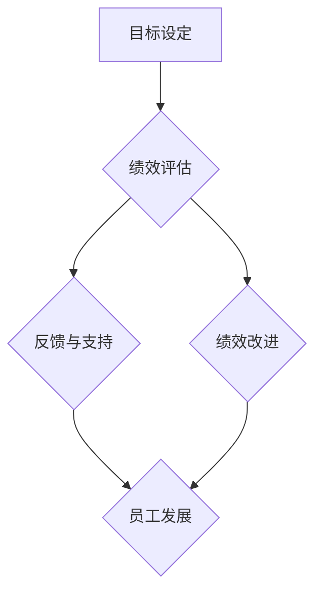

                 

### 文章标题

# 绩效文化：营造积极进取的氛围

> 关键词：绩效文化、绩效管理、员工动机、团队协作、组织成功

> 摘要：本文深入探讨了绩效文化的定义、重要性、关键要素及其在组织中的实施与评估。通过详细的案例分析，揭示了如何通过构建有效的绩效文化，激发员工潜力，提升团队协作，最终实现组织成功。

----------------------------------------------------------------

### 第一部分：绩效文化的理论基础

#### 第1章：绩效文化的定义与重要性

##### 1.1 绩效文化的定义

绩效文化是一个组织内部形成的价值观、信仰和行为模式，旨在通过明确的绩效目标和期望，激励员工追求卓越，实现个人与组织的共同成长。

**绩效文化的基本概念：**
- **共同的价值观**：组织内部的共同信仰和价值观，如诚信、创新、团队合作等。
- **明确的绩效目标和期望**：组织对员工绩效的期望和具体目标，确保员工努力的方向与组织目标一致。
- **开放的沟通**：组织内部信息畅通，员工能够自由表达意见，上下级之间、同事之间有效交流。
- **公平的评估机制**：公正、客观的绩效评估体系，确保员工的绩效得到合理评价。
- **成功的奖励和认可**：通过竞争性的薪酬福利、公开透明的奖励制度，激励员工努力工作。

##### 1.2 绩效文化的关键要素

**绩效文化的关键要素包括：**

1. **共同价值观**：
   - **概念**：共同价值观是组织内部的信仰和行为准则，反映了组织对员工的期望。
   - **作用**：共同价值观有助于形成组织内部的凝聚力和一致性，使员工在追求卓越的过程中保持一致的目标和行动。

2. **明确的目标和期望**：
   - **概念**：明确的目标和期望是绩效文化的基础，确保员工了解组织对他们的期望。
   - **作用**：明确的目标和期望有助于员工制定个人发展计划，明确自己的职业发展方向。

3. **开放沟通**：
   - **概念**：开放沟通是组织内部信息流通的重要手段，有助于上下级之间、同事之间的有效交流。
   - **作用**：开放沟通有助于建立信任和合作，提高组织的决策质量和执行力。

4. **公平的评估机制**：
   - **概念**：公平的评估机制是绩效文化的核心，确保员工的绩效得到公正评价。
   - **作用**：公平的评估机制有助于激励员工努力工作，提高组织的整体绩效。

5. **成功的奖励和认可**：
   - **概念**：成功的奖励和认可是绩效文化的激励机制，通过竞争性的薪酬福利和公开透明的奖励制度，激励员工追求卓越。
   - **作用**：成功的奖励和认可有助于提升员工的工作满意度和忠诚度，促进组织的长期发展。

##### 1.3 绩效文化的重要性

**绩效文化的重要性体现在以下几个方面：**

1. **提升员工动机和生产力**：
   - 绩效文化通过明确的目标和期望，激励员工追求卓越，提高工作动力和生产效率。

2. **增强团队协作和合作**：
   - 绩效文化鼓励员工相互支持、协同工作，提高团队的整体协作能力。

3. **促进创新和持续改进**：
   - 绩效文化鼓励员工勇于创新、不断学习，推动组织的持续改进。

4. **提升组织竞争力**：
   - 绩效文化有助于组织吸引和留住优秀人才，提升组织的整体竞争力。

#### 第2章：绩效管理的基本概念

##### 2.1 绩效管理的定义

绩效管理是一个系统化的过程，旨在通过设定目标、评估绩效、提供反馈和支持，实现个人、团队和组织目标的达成。

**绩效管理的核心概念：**
- **目标设定**：明确组织和个人目标，确保员工的工作方向与组织目标一致。
- **绩效评估**：对员工的工作绩效进行客观、公正的评价，为员工的职业发展提供依据。
- **反馈与支持**：为员工提供及时的绩效反馈和支持，帮助员工提升工作绩效。

##### 2.2 绩效指标与目标设定

**绩效指标与目标设定的基本原则：**

1. **指标类型**：
   - **定性指标**：描述员工工作质量、工作态度等主观因素。
   - **定量指标**：描述员工工作数量、工作效率等客观因素。

2. **SMART原则**：
   - **具体（Specific）**：目标要明确、具体，避免模糊不清。
   - **可衡量（Measurable）**：目标要有明确的标准，可进行量化评估。
   - **可实现（Achievable）**：目标要具有可实现性，避免过高或过低。
   - **相关（Relevant）**：目标要与组织和个人目标密切相关。
   - **时限（Time-bound）**：目标要有明确的时间限制，确保按时完成。

3. **目标设定方法**：
   - **自上而下**：由组织高层制定目标，层层分解至个人。
   - **自下而上**：由员工提出个人目标，与组织目标相协调。

##### 2.3 绩效评估的方法

**绩效评估的方法包括：**

1. **定量评估**：
   - 基于数据、事实和客观指标进行评估，如销售额、工作效率等。

2. **定性评估**：
   - 基于主观判断和观察进行评估，如员工的工作态度、团队合作能力等。

3. **综合评估**：
   - 结合定量评估和定性评估，全面、客观地评估员工的绩效。

**绩效评估的优缺点：**

- **优点**：
  - 提供客观的绩效评价，为员工的职业发展提供依据。
  - 激励员工提升工作绩效，促进组织的整体发展。

- **缺点**：
  - 可能导致员工过度关注绩效指标，忽视其他重要因素。
  - 评估过程可能存在主观偏见，影响评估的公正性。

#### 第1章 总结

绩效文化是组织成功的关键因素，通过构建有效的绩效文化，可以提升员工动机和生产力，增强团队协作和合作，促进创新和持续改进。绩效管理是实现绩效文化的重要手段，通过设定目标、评估绩效、提供反馈和支持，实现个人、团队和组织目标的达成。在绩效管理中，合理设定绩效指标和目标，采用定量评估和定性评估相结合的方法，有助于全面、客观地评估员工的绩效。通过本章的讨论，我们为后续章节的深入探讨奠定了理论基础。

---

### 第一部分：绩效文化的理论基础

#### 第3章：制定绩效政策与制度

##### 3.1 绩效政策的制定

绩效政策的制定是构建绩效文化的关键步骤，它为绩效管理提供了指导和规范。以下是制定绩效政策的几个关键要素：

1. **政策目标**：
   - 明确政策的目标，如提高员工工作满意度、增强团队合作、提升组织竞争力等。
   - 政策目标应与组织的整体战略相一致，确保绩效政策的有效性。

2. **政策制定过程**：
   - 收集和分析相关数据，了解员工需求和期望。
   - 召开跨部门会议，征求不同部门和员工的意见和建议。
   - 制定初步政策草案，并进行内部审核和讨论。
   - 根据反馈进行修订，最终形成正式政策。

3. **政策实施**：
   - 通过内部培训、宣传等方式，确保员工了解和理解绩效政策。
   - 制定详细的实施计划，包括时间表、责任人、执行步骤等。
   - 建立监督和反馈机制，确保政策的有效执行。

##### 3.2 绩效制度的建立

绩效制度是绩效政策的实际操作细则，它包括绩效考核制度、绩效反馈制度和绩效改进制度。以下是绩效制度建立的关键要素：

1. **绩效考核制度的组成部分**：
   - **考核指标**：明确考核指标，包括定量指标和定性指标。
   - **考核标准**：制定明确的考核标准，确保评估的公正性和客观性。
   - **考核周期**：确定考核周期，如月度、季度、年度等。
   - **考核流程**：规范考核流程，确保考核过程的透明和公正。

2. **绩效考核制度的设计原则**：
   - **科学性**：考核指标和标准应科学合理，符合员工的工作特点和组织目标。
   - **公平性**：考核过程应公开透明，避免主观偏见和歧视。
   - **灵活性**：考核制度应具有灵活性，适应组织的变化和发展。

3. **绩效考核制度的优缺点**：

   **优点**：
   - 提高员工的工作动力，促进绩效改进。
   - 为员工的职业发展提供依据，有利于人才选拔和培养。
   - 提高组织的整体绩效，增强竞争力。

   **缺点**：
   - 可能导致员工过度关注考核指标，忽视其他重要因素。
   - 考核过程可能存在主观偏见，影响考核的公正性。

##### 3.3 绩效管理工具与技术

1. **绩效评估工具**：
   - **KPI（关键绩效指标）**：用于衡量员工工作绩效的关键指标。
   - **360度评估**：通过多个评估者（上级、同事、下属）对员工绩效进行全面评估。
   - **绩效反馈面谈**：与员工进行一对一的面谈，提供具体的绩效反馈和建议。

2. **绩效反馈工具**：
   - **绩效反馈报告**：汇总评估结果，为员工提供全面的绩效反馈。
   - **在线绩效管理系统**：用于记录、追踪和评估员工绩效的信息系统。

3. **绩效改进工具**：
   - **个人发展计划**：为员工制定具体的培训和发展计划，提升工作能力。
   - **团队建设活动**：通过团队活动增强员工之间的合作和沟通。

#### 第3章 总结

制定绩效政策和建立绩效制度是构建绩效文化的关键步骤。绩效政策的制定需要明确目标、制定过程和实施策略，确保政策的科学性、公平性和灵活性。绩效制度的建立包括绩效考核制度、绩效反馈制度和绩效改进制度，通过规范化的考核流程和评估工具，提高绩效管理的效率和公正性。在实施过程中，需要充分利用绩效管理工具和技术，为员工提供全面的绩效反馈和支持，促进员工和组织的共同成长。

---

### 第二部分：建立绩效文化

#### 第4章：培养积极进取的氛围

##### 4.1 培养绩效文化的策略

要建立积极进取的绩效文化，组织需要采取一系列策略，从领导力培养、企业文化建设到员工激励与认可，全面提升员工的积极性。

1. **领导力培养**：
   - **领导者以身作则**：领导者的行为和态度直接影响员工的绩效文化。领导者需要通过自身的行动，展现出对绩效文化的重视和追求。
   - **领导力培训**：组织应为领导者提供领导力培训，提高其领导能力和管理水平，使其能够更好地推动绩效文化的建设。

2. **企业文化建设**：
   - **共同价值观**：组织需要明确共同价值观，并确保这些价值观在企业文化中得到体现和传承。
   - **企业文化建设活动**：通过团队建设、企业活动等，增强员工的归属感和认同感，形成积极向上的企业文化氛围。

3. **员工激励与认可**：
   - **激励机制**：建立合理的激励机制，包括薪酬、福利、晋升机会等，激发员工的工作动力。
   - **认可制度**：设立公开透明的认可制度，对员工的优秀表现给予及时的认可和奖励，提高员工的工作满意度。

##### 4.2 提升员工动机

提升员工动机是建立绩效文化的核心任务，以下是一些有效的方法：

1. **激励理论**：
   - **马斯洛需求层次理论**：通过满足员工的基本需求（如安全、尊重）和自我实现需求，提升员工的动机。
   - **赫兹伯格双因素理论**：关注员工的内在激励因素（如工作成就感、自我发展），提高员工的工作满意度。

2. **个人发展计划**：
   - **制定个人发展计划**：为员工提供明确的发展路径和目标，帮助员工规划职业发展。
   - **培训与发展**：为员工提供各种培训机会，提高其专业能力和综合素质。

3. **团队建设活动**：
   - **团队协作**：通过团队建设活动，增强员工之间的合作和信任，提高团队的整体绩效。
   - **团队沟通**：建立有效的沟通机制，促进信息共享和意见交流，提高团队的协作效率。

##### 4.3 增强团队合作

团队合作是绩效文化的重要组成部分，以下是一些增强团队合作的方法：

1. **团队协作的重要性**：
   - **协同效应**：团队协作能够发挥集体智慧，实现1+1>2的效果。
   - **共同目标**：明确的团队目标能够激发员工的共同奋斗精神，提高团队的整体绩效。

2. **团队沟通技巧**：
   - **倾听**：倾听是沟通的基础，领导者需要学会倾听员工的意见和建议。
   - **表达**：清晰、准确地表达自己的想法和意见，避免误解和冲突。
   - **反馈**：及时给予员工反馈，帮助他们了解自己的工作表现和改进方向。

3. **团队协作工具**：
   - **项目管理工具**：如Trello、Jira等，帮助团队有效管理项目进度和任务分配。
   - **协作平台**：如Slack、Microsoft Teams等，提供实时的沟通和协作平台，增强团队协作效率。

#### 第4章 总结

培养积极进取的绩效文化需要从多个方面进行努力。通过领导力培养、企业文化建设、员工激励与认可等策略，提升员工的动机和团队合作能力，为组织的长期发展奠定基础。在实施过程中，组织需要关注员工的个性化需求，提供适当的培训和发展机会，建立有效的沟通和协作机制，从而营造一个积极向上的工作氛围。通过这些策略，组织可以建立起强大的绩效文化，推动员工和组织的共同成长。

---

### 第三部分：绩效文化的实施与评估

#### 第5章：绩效文化的实施过程

##### 5.1 制定实施计划

制定实施计划是绩效文化成功实施的关键步骤。一个完善的实施计划可以帮助组织明确目标、分配资源、制定时间表，并提前识别潜在的风险。

1. **实施计划的步骤**：

   - **步骤1：明确目标**：确定绩效文化的实施目标，如提升员工满意度、增强团队合作、提高工作效率等。

   - **步骤2：资源分配**：评估所需的资源，包括人力、财务、技术等，确保资源充足且合理分配。

   - **步骤3：制定时间表**：根据实施目标，制定详细的实施时间表，明确每个阶段的任务和截止日期。

   - **步骤4：风险评估**：识别潜在的风险和挑战，制定相应的应对策略，降低实施过程中的不确定性。

2. **实施计划的时间表**：

   - **阶段1：启动阶段**（1-3个月）：
     - 建立实施团队，明确团队成员的职责和角色。
     - 制定详细的实施方案，明确实施步骤和关键节点。
     - 进行内部沟通和培训，确保全体员工了解和接受绩效文化的实施。

   - **阶段2：执行阶段**（4-9个月）：
     - 按照时间表执行实施计划，确保每个阶段的任务按时完成。
     - 定期检查实施进度，及时发现并解决问题。
     - 通过反馈机制，收集员工的意见和建议，不断优化实施过程。

   - **阶段3：评估阶段**（10-12个月）：
     - 对绩效文化的实施效果进行全面评估，包括员工满意度、团队合作水平、工作效率等。
     - 根据评估结果，制定改进措施，确保绩效文化的持续优化。

3. **实施计划的风险评估**：

   - **风险1：文化冲突**：不同部门和员工可能对绩效文化的理解不一致，导致实施过程中的阻力。
     - **应对策略**：加强内部沟通，确保各部门和员工对绩效文化的理解一致。通过培训、研讨会等方式，提高员工的接受度。

   - **风险2：员工抵触情绪**：员工可能对绩效文化的实施产生抵触情绪，影响工作积极性。
     - **应对策略**：建立有效的反馈机制，倾听员工的意见和建议，及时解决他们的关切。通过激励措施，提高员工的工作满意度。

   - **风险3：资源不足**：实施计划所需的资源可能不足，影响实施效果。
     - **应对策略**：提前评估资源需求，确保资源充足。在实施过程中，根据实际情况进行调整和补充。

##### 5.2 推广与培训

1. **内部沟通策略**：

   - **沟通目标**：确保员工了解绩效文化的目的、意义和实施步骤，提高员工的参与度和积极性。

   - **沟通方式**：
     - **正式会议**：通过召开全体会议、部门会议等形式，传达绩效文化的相关政策和要求。
     - **非正式交流**：利用日常交流、邮件、内部论坛等渠道，与员工进行互动和交流，解答他们的疑问。

2. **培训计划**：

   - **培训目标**：提高员工对绩效文化的理解，掌握必要的知识和技能，提升工作绩效。

   - **培训内容**：
     - **绩效文化理念**：讲解绩效文化的定义、重要性、关键要素等，帮助员工理解绩效文化的核心价值。
     - **绩效管理技巧**：教授绩效指标设定、绩效评估方法、绩效反馈技巧等，提升员工的绩效管理能力。
     - **团队协作技巧**：培训团队沟通、团队协作、团队建设等方面的知识和技能，增强团队合作能力。

3. **培训效果的评估**：

   - **评估方法**：
     - **问卷调查**：通过问卷调查，了解员工对培训内容的掌握程度和满意度。
     - **绩效评估**：结合员工的实际工作绩效，评估培训效果。

   - **改进措施**：
     - 根据评估结果，发现培训中的不足，及时进行调整和改进。
     - 定期回顾培训效果，确保培训的持续改进。

##### 5.3 遇到的挑战与应对策略

1. **文化冲突的解决**：

   - **挑战**：不同部门和员工对绩效文化的理解不一致，导致实施过程中的冲突和阻力。
   - **应对策略**：
     - **加强沟通**：建立有效的沟通机制，确保各部门和员工对绩效文化的理解一致。
     - **统一理念**：通过培训、研讨会等方式，统一员工对绩效文化的认识和理念。
     - **领导带头**：领导以身作则，积极推动绩效文化的实施，为员工树立榜样。

2. **员工抵触情绪的应对**：

   - **挑战**：员工对绩效文化的实施产生抵触情绪，影响工作积极性和执行力。
   - **应对策略**：
     - **倾听反馈**：建立反馈机制，倾听员工的意见和建议，及时解决他们的关切。
     - **激励措施**：通过激励措施，提高员工的工作满意度，减少抵触情绪。
     - **心理辅导**：为员工提供心理辅导和支持，帮助他们正确面对绩效文化的实施。

3. **组织变革管理**：

   - **挑战**：绩效文化的实施涉及组织结构、流程等方面的变革，可能引起员工的抵触和不安。
   - **应对策略**：
     - **变革准备**：提前进行变革准备，确保员工对变革有充分的心理准备。
     - **变革沟通**：通过有效的沟通，传达变革的必要性和好处，提高员工的接受度。
     - **变革支持**：为员工提供必要的支持和辅导，帮助他们适应变革。

#### 第5章 总结

绩效文化的实施过程是一个复杂而系统的工作，需要制定详细的实施计划、推广与培训策略，以及应对文化冲突、员工抵触情绪和变革管理的挑战。通过合理的策略和措施，组织可以有效地推进绩效文化的实施，提升员工的积极性、协作能力和绩效水平，实现组织的长期发展目标。

---

### 第三部分：绩效文化的实施与评估

#### 第6章：绩效文化的评估与改进

##### 6.1 绩效文化评估的方法

绩效文化的评估是确保绩效文化持续有效的重要环节。以下是几种常见的绩效文化评估方法：

1. **问卷调查**：

   - **优点**：方便快捷，能够收集大量数据，反映员工的普遍意见。
   - **缺点**：可能存在主观偏差，数据真实性难以保证。

2. **面谈**：

   - **优点**：能够深入了解员工的想法和感受，获取更详细的信息。
   - **缺点**：耗时较长，成本较高。

3. **数据分析**：

   - **优点**：基于客观数据进行分析，具有较高的可信度。
   - **缺点**：分析过程复杂，需要专业知识和技能。

4. **员工满意度调查**：

   - **优点**：直接反映员工对绩效文化的满意程度，有助于发现潜在问题。
   - **缺点**：数据可能受到主观因素的影响。

5. **360度评估**：

   - **优点**：通过多个评估者对员工绩效进行全面评估，提高评估的客观性。
   - **缺点**：评估过程复杂，需要大量时间和资源。

##### 6.2 评估结果的反馈与改进

1. **反馈机制的建立**：

   - **目的**：确保评估结果能够及时、准确地传递给相关人员，为改进措施提供依据。
   - **方法**：
     - **定期反馈**：定期向员工提供绩效评估结果，包括优点和需要改进的地方。
     - **个性化反馈**：根据员工的个人表现，提供针对性的反馈和建议。

2. **改进措施的制定**：

   - **目的**：针对评估结果，制定具体的改进措施，提升绩效文化的实施效果。
   - **方法**：
     - **问题分析**：分析评估结果，找出绩效文化实施中的问题和不足。
     - **解决方案**：根据问题分析，制定具体的改进措施，如培训计划、流程优化等。

3. **改进效果的跟踪**：

   - **目的**：确保改进措施得到有效执行，持续提升绩效文化的实施效果。
   - **方法**：
     - **效果评估**：定期对改进措施的效果进行评估，包括员工满意度、绩效水平等。
     - **持续改进**：根据评估结果，对改进措施进行调整和优化，确保绩效文化的持续发展。

##### 6.3 持续优化绩效文化

1. **学习与适应**：

   - **目的**：适应外部环境的变化，不断优化绩效文化。
   - **方法**：
     - **行业趋势研究**：关注行业趋势和最佳实践，了解外部环境的变化。
     - **内部经验总结**：总结内部经验，分析绩效文化的实施效果，找出改进空间。

2. **跨部门合作**：

   - **目的**：促进部门间的协作，提升整体绩效。
   - **方法**：
     - **跨部门项目**：开展跨部门项目，加强部门间的沟通与合作。
     - **联合培训**：组织跨部门的培训，提高员工的协作能力和团队意识。

3. **领导力的持续发展**：

   - **目的**：提升领导者的管理水平，为绩效文化的实施提供有力支持。
   - **方法**：
     - **领导力培训**：为领导者提供持续的学习机会，提高其领导能力和管理水平。
     - **领导力评估**：定期对领导者的绩效进行评估，确保领导力的持续提升。

#### 第6章 总结

绩效文化的评估与改进是确保绩效文化持续有效的重要环节。通过问卷调查、面谈、数据分析等多种方法，组织可以全面了解绩效文化的实施效果，发现问题和不足。针对评估结果，组织应建立反馈机制，制定具体的改进措施，并持续跟踪改进效果。同时，组织应不断学习与适应外部环境的变化，加强跨部门合作，提升领导力，确保绩效文化的持续优化与发展。通过这些措施，组织可以建立起强大的绩效文化，推动员工的积极性、协作能力和绩效水平的提升，实现组织的长期发展目标。

---

### 第四部分：案例研究

#### 第7章：成功的绩效文化案例分析

##### 7.1 案例背景介绍

本案例研究的是一家全球知名的科技公司——X公司。X公司成立于2005年，总部位于美国，是一家专注于软件开发和互联网服务的创新型企业。公司在全球范围内拥有超过10000名员工，业务涵盖了云计算、人工智能、大数据等多个领域。

X公司一直高度重视绩效文化的建设，将其视为企业长期发展的重要战略。公司通过一系列措施，构建了具有独特优势的绩效文化，实现了员工的高效协作和持续创新。

##### 7.2 案例实施过程

1. **实施策略**：

   - **明确目标**：X公司首先明确了绩效文化的实施目标，包括提升员工满意度、增强团队合作、提高工作效率等。
   - **领导带头**：公司高层领导积极参与绩效文化的实施，以身作则，为员工树立榜样。
   - **培训与沟通**：公司定期组织培训，提高员工对绩效文化的理解，并通过内部沟通平台，确保员工了解实施进展和具体措施。

2. **实施步骤**：

   - **阶段1：启动阶段**（1-3个月）：
     - 建立实施团队，明确团队成员的职责和角色。
     - 制定详细的实施方案，明确实施步骤和关键节点。
     - 进行内部沟通和培训，确保全体员工了解和接受绩效文化的实施。

   - **阶段2：执行阶段**（4-9个月）：
     - 按照时间表执行实施计划，确保每个阶段的任务按时完成。
     - 定期检查实施进度，及时发现并解决问题。
     - 通过反馈机制，收集员工的意见和建议，不断优化实施过程。

   - **阶段3：评估阶段**（10-12个月）：
     - 对绩效文化的实施效果进行全面评估，包括员工满意度、团队合作水平、工作效率等。
     - 根据评估结果，制定改进措施，确保绩效文化的持续优化。

3. **实施成果**：

   - **员工满意度提升**：通过绩效文化的实施，X公司的员工满意度显著提升，员工对工作环境、领导风格和企业文化的认可度提高。
   - **团队合作增强**：公司内部建立了良好的沟通和协作机制，员工之间的合作更加紧密，团队的整体绩效得到提升。
   - **工作效率提高**：绩效文化的实施激发了员工的工作热情和创造力，公司的整体工作效率显著提升。

##### 7.3 案例经验与启示

1. **成功经验**：

   - **领导带头**：高层领导的积极参与是绩效文化成功实施的关键。领导者的示范作用能够有效推动绩效文化的落实。
   - **培训与沟通**：系统的培训计划和持续的内部沟通是绩效文化成功实施的重要保障。通过培训，员工能够更好地理解绩效文化的理念和实践；通过沟通，员工能够及时了解实施进展和具体措施。
   - **反馈机制**：建立有效的反馈机制，能够及时发现问题并进行改进，确保绩效文化的持续优化。

2. **遇到的问题及解决方案**：

   - **问题**：在绩效文化的实施过程中，部分员工对新的管理方式和方法存在抵触情绪。
   - **解决方案**：公司通过加强沟通和培训，帮助员工了解绩效文化的优点和实施方法，逐步消除抵触情绪。同时，公司设立了反馈渠道，倾听员工的意见和建议，及时解决员工关切。

3. **对其他企业的借鉴意义**：

   - **借鉴意义**：X公司的绩效文化实施经验表明，构建有效的绩效文化需要高层领导的积极参与、系统的培训与沟通，以及有效的反馈机制。这些经验对于其他企业也具有借鉴意义，有助于它们在构建绩效文化过程中取得更好的效果。

#### 第7章 总结

X公司的案例展示了如何通过构建有效的绩效文化，提升员工满意度、增强团队合作、提高工作效率，实现企业的长期发展。其成功经验为其他企业提供了有益的借鉴，包括高层领导的积极参与、系统的培训与沟通，以及有效的反馈机制。通过学习X公司的经验，其他企业可以更好地构建自己的绩效文化，推动员工的积极性、协作能力和绩效水平的提升，实现组织的持续发展。

---

### 附录

#### 附录A：绩效文化相关资源与工具

**绩效管理软件推荐**：

- **KPI Genius**：一款功能强大的关键绩效指标管理软件，提供全面的KPI设定、数据分析和报告生成功能。
- **Lattice**：一款创新的绩效管理软件，支持360度评估、实时反馈和员工发展计划。

**绩效文化书籍推荐**：

- **《绩效文化：打造高效团队的秘密武器》**：详细介绍了绩效文化的概念、构建方法和成功案例，对组织领导者有很好的启发。
- **《绩效管理实战指南》**：涵盖了绩效管理的核心概念、流程和方法，适合绩效管理人员和企业管理者阅读。

**绩效管理培训资源**：

- **Coursera**：提供一系列关于绩效管理和领导力的在线课程，包括《绩效管理入门》、《领导力与团队管理》等。
- **LinkedIn Learning**：拥有丰富的绩效管理相关课程，涵盖绩效评估、员工激励、团队建设等多个方面。

#### 附录B：绩效文化Mermaid流程图

**绩效管理流程图**：



**绩效评估流程图**：


**绩效改进流程图**：


#### 附录C：核心算法原理与伪代码

**绩效指标计算算法**：

```plaintext
算法名称：绩效指标计算
输入：员工工作表现数据（如销售额、工作效率等）
输出：绩效得分

伪代码：
function calculatePerformanceScore(data):
    totalScore = 0
    for each metric in data:
        if metric > threshold:
            totalScore += metric * weight
        else:
            totalScore += metric
    return totalScore / len(data)
```

**绩效反馈算法**：

```plaintext
算法名称：绩效反馈计算
输入：绩效得分、员工工作表现数据
输出：反馈建议

伪代码：
function calculateFeedback(score, data):
    if score > threshold:
        feedback = "表现优秀，继续保持！"
    else if score >= threshold / 2:
        feedback = "有一定进步，需加强某些方面！"
    else:
        feedback = "表现不佳，需加大努力！"
    return feedback
```

**绩效改进算法伪代码**：

```plaintext
算法名称：绩效改进计算
输入：当前绩效得分、目标绩效得分、员工工作表现数据
输出：改进计划

伪代码：
function calculateImprovementPlan(currentScore, targetScore, data):
    improvementPlan = []
    if currentScore < targetScore:
        for each metric in data:
            if metric < threshold:
                improvementPlan.append("提高" + metric + "的完成率。")
    else:
        improvementPlan.append("继续保持当前的工作表现。")
    return improvementPlan
```

#### 附录D：最佳实践 tips、小结、注意事项、拓展阅读等内容

**最佳实践 tips**：

1. **明确目标**：在制定绩效目标和期望时，确保目标具体、可衡量、可实现、相关、时限。
2. **鼓励反馈**：建立开放、坦诚的沟通环境，鼓励员工提出意见和建议，不断优化绩效文化和管理流程。
3. **持续培训**：定期为员工提供绩效管理、领导力、团队合作等方面的培训，提升员工的综合素质。

**小结**：

本文从绩效文化的定义、重要性、关键要素、实施策略、评估方法等多个方面进行了深入探讨，结合实际案例，揭示了构建有效绩效文化的重要性。通过合理的绩效管理策略，组织可以激发员工的潜力，提升团队协作，实现组织目标。

**注意事项**：

1. **文化适应性**：在实施绩效文化时，要考虑组织的文化背景和员工的特点，确保绩效文化的适应性。
2. **持续改进**：绩效文化不是一成不变的，组织应根据外部环境和内部变化，持续优化绩效文化和管理流程。

**拓展阅读**：

1. **《绩效管理的艺术》**：详细介绍了绩效管理的理论和实践，对绩效管理人员有很好的指导作用。
2. **《员工激励与绩效管理》**：探讨了员工激励和绩效管理的关系，提供了实用的激励方法和策略。
3. **《团队协作：高效团队建设的秘密》**：介绍了团队协作的重要性和建设高效团队的方法，对提升团队合作有很好的启发。

### 作者信息

作者：AI天才研究院/AI Genius Institute & 禅与计算机程序设计艺术 /Zen And The Art of Computer Programming

