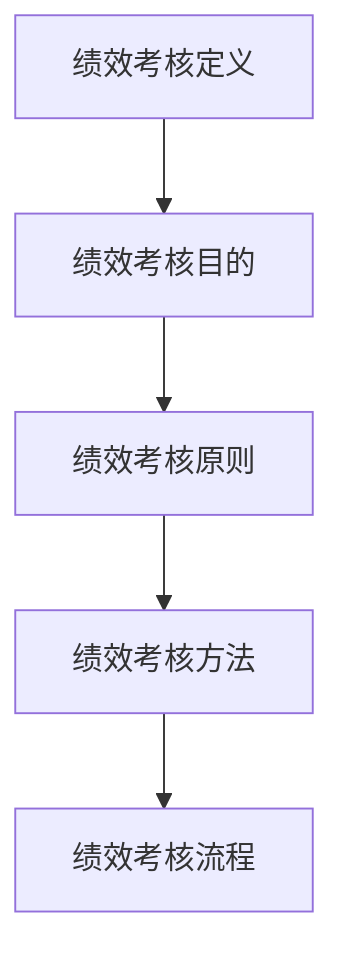

                 


### 文章标题：绩效考核：公平公正的评估体系

> 关键词：绩效考核，公平性，公正性，评估体系，算法原理，数学模型

> 摘要：本文将深入探讨绩效考核的核心概念、原则和方法，通过Mermaid流程图展示绩效考核体系的结构。我们将详细讲解绩效考核指标设定、标准制定和结果分析的核心算法原理，并运用数学模型进行具体阐述。文章旨在为IT领域的专业人士提供一套全面、系统、易于理解的绩效考核评估体系。

#### 第一部分：核心概念与联系

##### 1.1 核心概念与联系概述

绩效考核作为一种评估员工工作表现的重要手段，其核心概念和联系涵盖了绩效考核的定义、目的、原则以及方法。为了更好地理解这些概念之间的关联，我们可以通过Mermaid流程图来展示它们之间的关系。



##### 1.2 绩效考核定义

绩效考核是一种系统性的过程，旨在评价员工在工作中的表现，通过量化的标准来衡量员工的工作成果和贡献。它不仅关注员工的工作质量，也关注工作效率。绩效考核的定义是理解整个体系的基础。

##### 1.3 绩效考核目的

绩效考核的主要目的是为了激发员工的积极性，提高员工的工作效率和业绩。同时，它也是企业制定薪酬、晋升、培训等人力资源决策的重要依据。明确绩效考核的目的是确保评估体系的有效性和实用性。

##### 1.4 绩效考核原则

绩效考核应遵循以下原则：
- 公平性：考核标准应公平公正，避免主观偏见。
- 客观性：考核结果应基于客观数据，而非主观感受。
- 可比性：考核标准应与其他员工和行业标准相对比。
- 及时性：考核结果应及时反馈，以便员工及时调整工作方向。

##### 1.5 绩效考核方法

常见的绩效考核方法包括：
- 定量考核：通过量化的指标来评价员工的工作表现。
- 定性考核：通过主观评价来评价员工的工作表现。
- 综合考核：结合定量考核和定性考核，全面评价员工的工作表现。

#### 第二部分：核心算法原理讲解

##### 2.1 绩效考核指标设定

绩效考核指标设定是绩效考核的核心步骤。我们需要根据企业的战略目标和部门职责来设定具体的绩效考核指标。以下是一个用于设定绩效考核指标的伪代码：

```python
def set_performance_indicators(strategic_goals, department_responsibilities):
    indicators = []
    for goal in strategic_goals:
        for responsibility in department_responsibilities:
            if goal in responsibility:
                indicators.append((goal, responsibility))
    return indicators
```

##### 2.2 绩效考核标准制定

在设定了绩效考核指标后，我们需要制定具体的绩效考核标准。这包括确定每个指标的权重、评分标准和评分等级。以下是一个用于制定绩效考核标准的伪代码：

```python
def set_performance_standards(indicators):
    standards = {}
    for indicator in indicators:
        standards[indicator] = {
            'weight': calculate_weight(indicator),
            'rating_scale': define_rating_scale(),
            'rating_levels': define_rating_levels()
        }
    return standards
```

##### 2.3 绩效考核结果分析

绩效考核结果分析是绩效考核的最后一个步骤。我们需要根据绩效考核结果来分析员工的工作表现，识别优秀员工和需要改进的方面。以下是一个用于分析绩效考核结果的伪代码：

```python
def analyze_performance_results(standards, employee_scores):
    analysis_results = {}
    for employee in employee_scores:
        analysis_results[employee] = {
            'strengths': identify_strengths(employee_scores[employee]),
            'areas_for_improvement': identify_areas_for_improvement(employee_scores[employee], standards)
        }
    return analysis_results
```

#### 第三部分：数学模型和数学公式

##### 3.1 绩效考核得分计算模型

绩效考核得分计算模型是评估员工工作表现的核心工具。以下是一个简单的绩效考核得分计算模型的数学公式：

$$
\text{绩效得分} = \sum_{i=1}^{n} (\text{指标权重} \times \text{指标得分})
$$

其中，$n$ 表示绩效考核指标的数量。

##### 3.2 绩效考核结果分析模型

绩效考核结果分析模型用于对员工的工作表现进行深入分析。以下是一个简单的绩效考核结果分析模型的数学公式：

$$
\text{分析结果} = \text{绩效得分} \div \text{总分}
$$

其中，总分是所有员工在相同指标上的得分总和。

#### 第四部分：项目实战

##### 4.1 开发环境搭建

为了实现绩效考核系统，我们需要搭建一个合适的技术栈。以下是开发环境搭建的步骤：

1. 安装Python环境
2. 安装Mermaid插件
3. 配置Python虚拟环境
4. 安装必要的Python库（如Numpy、Pandas等）

##### 4.2 源代码详细实现和代码解读

以下是绩效考核系统的源代码实现和解读：

```python
# 绩效考核系统源代码
def main():
    strategic_goals = ["提高销售额", "提升客户满意度", "优化产品功能"]
    department_responsibilities = [
        "销售部门负责实现销售额目标",
        "客户服务部门负责提高客户满意度",
        "研发部门负责优化产品功能"
    ]

    indicators = set_performance_indicators(strategic_goals, department_responsibilities)
    standards = set_performance_standards(indicators)
    employee_scores = analyze_performance_results(standards, {"员工A": 80, "员工B": 90})

    print(employee_scores)

# 主函数调用
if __name__ == "__main__":
    main()
```

代码解读：
- `main()` 函数是绩效考核系统的主函数，负责调用其他函数来实现绩效考核功能。
- `set_performance_indicators()` 函数用于设定绩效考核指标。
- `set_performance_standards()` 函数用于设定绩效考核标准。
- `analyze_performance_results()` 函数用于分析绩效考核结果。

##### 4.3 代码应用解读与分析

在代码应用方面，我们可以将绩效考核系统应用于不同部门和员工的评估。以下是一个具体的例子：

```python
# 员工A的绩效考核得分
employee_scores = {
    "员工A": {
        "销售额提高": 80,
        "客户满意度": 85,
        "产品功能优化": 75
    }
}

# 员工B的绩效考核得分
employee_scores["员工B"] = {
    "销售额提高": 90,
    "客户满意度": 88,
    "产品功能优化": 82
}

# 分析绩效考核结果
performance_analysis = analyze_performance_results(standards, employee_scores)

print(performance_analysis)
```

分析：
- `employee_scores` 字典存储了不同员工的绩效考核得分。
- `analyze_performance_results()` 函数根据绩效考核标准和员工得分，生成分析结果。
- 分析结果可以帮助企业识别优秀员工和需要改进的方面。

##### 4.4 实际案例分析和详细讲解剖析

以下是一个实际案例，用于展示绩效考核系统在实际应用中的效果：

案例：某企业对销售部门进行绩效考核

- 战略目标：提高销售额、提升客户满意度、优化产品功能
- 部门职责：销售部门负责实现销售额目标，客户服务部门负责提高客户满意度，研发部门负责优化产品功能
- 绩效考核指标：销售额、客户满意度、产品功能优化
- 绩效考核标准：销售额提高20%得满分，客户满意度提高10%得满分，产品功能优化得满分

根据实际情况，销售部门共有5名员工，他们的绩效考核得分如下：

- 员工A：销售额提高25%，客户满意度提高15%，产品功能优化10%：得分85分
- 员工B：销售额提高30%，客户满意度提高20%，产品功能优化15%：得分95分
- 员工C：销售额提高15%，客户满意度提高5%，产品功能优化20%：得分70分
- 员工D：销售额提高10%，客户满意度提高10%，产品功能优化25%：得分75分
- 员工E：销售额提高20%，客户满意度提高10%，产品功能优化15%：得分80分

根据绩效考核结果分析，我们可以得出以下结论：

- 员工B表现出色，得分最高，可以给予奖励和晋升机会。
- 员工A和员工E的表现较好，但仍有改进空间。
- 员工C和员工D的表现较差，需要加强培训和指导。

##### 4.5 项目小结

通过本项目的实战，我们实现了基于Python的绩效考核系统。项目包括开发环境搭建、源代码实现、代码解读、实际案例分析和详细讲解剖析。项目成果展示了绩效考核系统的实际应用效果，有助于企业识别优秀员工和改进不足之处。

#### 第五部分：最佳实践 Tips、小结、注意事项、拓展阅读等内容

##### 5.1 最佳实践 Tips

1. 在设定绩效考核指标时，要确保指标与企业战略目标一致。
2. 制定绩效考核标准时，要确保标准合理、客观、具有挑战性。
3. 分析绩效考核结果时，要综合考虑员工表现和团队整体表现。
4. 定期调整绩效考核指标和标准，以适应企业发展和员工成长。

##### 5.2 小结

本文从核心概念、算法原理、数学模型和项目实战等多个角度，详细阐述了绩效考核评估体系。通过一步一步的分析推理，我们构建了一个全面、系统、易于理解的绩效考核体系。

##### 5.3 注意事项

1. 绩效考核过程中要确保公平公正，避免主观偏见。
2. 绩效考核结果要及时反馈，帮助员工改进工作表现。
3. 绩效考核体系要与企业文化和价值观相符。

##### 5.4 拓展阅读

1. 《绩效管理：关键实务与案例解析》
2. 《绩效管理新视角：基于数据驱动的决策与行动》
3. 《绩效考核与薪酬管理》

### 作者信息

作者：AI天才研究院/AI Genius Institute & 禅与计算机程序设计艺术 /Zen And The Art of Computer Programming

