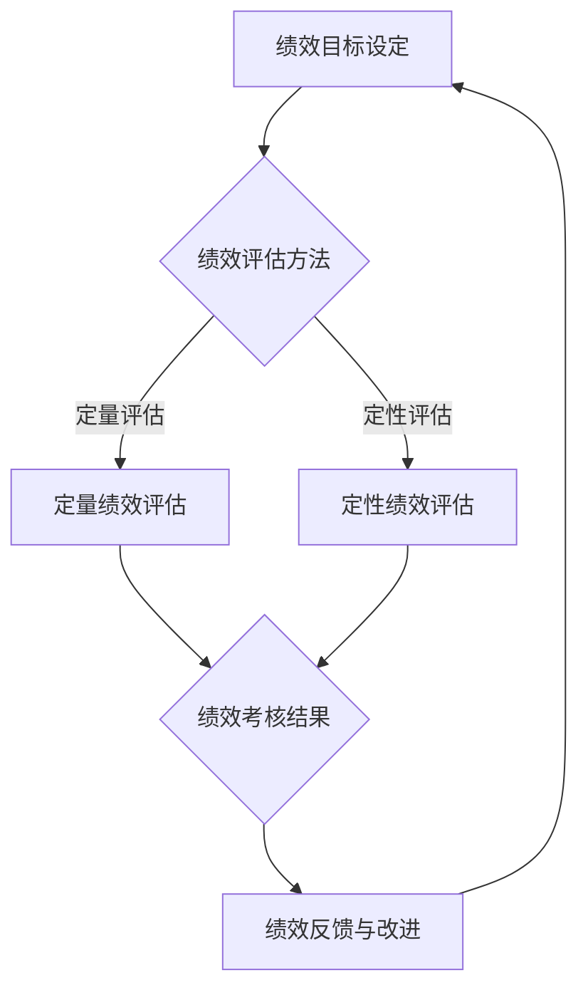

                 


## 文章标题：绩效驱动型组织：打造高效企业文化

> 关键词：绩效驱动型组织，高效企业文化，绩效管理，绩效评估，定量评估，定性评估，数学模型，项目实战

> 摘要：本文深入探讨了绩效驱动型组织的概念、背景、核心要素以及重要性，分析了绩效驱动型组织与传统组织的区别，挑战与机遇。通过流程图、伪代码、数学模型和项目实战，详细阐述了绩效驱动型组织的绩效管理流程、核心算法原理、数学模型及其应用。旨在为企业管理者和IT专业人员提供一套完整的绩效驱动型组织构建指南。

### 第一部分：绩效驱动型组织的概念与背景

#### 第1章：绩效驱动型组织的概念与背景

##### 1.1 绩效驱动型组织的定义

绩效驱动型组织是一种以绩效为导向的管理模式，通过设定明确的绩效目标、实施科学的绩效评估方法和提供有效的绩效反馈与改进机制，激发员工的积极性和创造力，实现个人与组织绩效的持续提升。

###### 1.1.1 绩效驱动型组织的核心要素

1. **明确的绩效目标**：组织为员工设定具体的、可量化的绩效目标，确保员工的工作方向与组织目标一致。
2. **科学的绩效评估方法**：采用定量和定性相结合的绩效评估方法，客观、公正地评估员工的工作表现。
3. **有效的绩效反馈与改进机制**：及时、准确地向员工反馈绩效评估结果，帮助员工认识自身的优势和不足，制定改进计划。

###### 1.1.2 绩效驱动型组织与传统组织的区别

1. **管理理念**：传统组织强调领导者的权威和命令，绩效驱动型组织强调员工的自主性和创新性。
2. **管理方法**：传统组织侧重于结果管理，绩效驱动型组织侧重于过程管理，注重员工在工作过程中的成长和发展。
3. **激励机制**：传统组织激励机制单一，绩效驱动型组织采用多元化的激励机制，如绩效奖金、晋升机会等。

##### 1.2 绩效驱动型组织的历史发展

###### 1.2.1 绩效管理的发展历程

1. **传统的绩效管理**：以年度评估为主，重视结果而非过程。
2. **现代绩效管理**：强调持续的绩效沟通和反馈，关注员工的成长和发展。

###### 1.2.2 绩效驱动型组织的兴起背景

1. **市场竞争加剧**：企业需要不断提升竞争力，绩效驱动型组织有助于激发员工的潜力，提高组织绩效。
2. **知识经济时代**：知识型员工注重自我实现和发展，绩效驱动型组织满足员工的需求，提高员工的满意度和忠诚度。

##### 1.3 绩效驱动型组织的重要性

###### 1.3.1 对企业的影响

1. **提高组织绩效**：绩效驱动型组织有助于实现个人与组织目标的协同，提高整体绩效。
2. **提升企业竞争力**：通过激发员工的潜力，提高组织的创新能力，增强企业的核心竞争力。

###### 1.3.2 对员工的影响

1. **提高工作效率**：明确的绩效目标和科学的绩效评估方法，使员工能够更好地规划工作，提高工作效率。
2. **促进个人成长**：有效的绩效反馈与改进机制，帮助员工认识自身的优势和不足，实现自我提升。

##### 1.4 绩效驱动型组织的挑战与机遇

###### 1.4.1 挑战分析

1. **绩效评估方法的科学性**：如何设计科学、客观的绩效评估方法，避免主观偏见和评估误差。
2. **员工参与度**：如何提高员工对绩效管理过程的参与度，确保绩效目标的实现。

###### 1.4.2 机遇探索

1. **数字化工具的应用**：利用大数据、人工智能等技术，提升绩效管理的效率和精准度。
2. **创新文化**：鼓励员工创新，将创新成果纳入绩效评估体系，促进企业持续发展。

### 第一部分小结

本文从绩效驱动型组织的概念、背景、核心要素、重要性以及挑战与机遇等方面进行了深入探讨。通过本文的阅读，读者可以全面了解绩效驱动型组织的本质和特点，为实际工作中构建和优化绩效驱动型组织提供理论指导和实践参考。

---

### 深入学习：绩效驱动型组织的核心概念与联系

#### 绩效管理流程图

下面是一个绩效管理流程的 Mermaid 图：



**图1：绩效管理流程图**

1. **绩效目标设定（A）**：这是绩效管理的起点，组织需要为员工设定明确的绩效目标，确保员工的工作方向与组织目标一致。
2. **绩效评估方法（B）**：绩效评估方法包括定量评估和定性评估，两者各有优缺点，通常需要结合使用。
   - **定量评估（C）**：侧重于可量化的指标，如销售额、代码行数等。
   - **定性评估（D）**：侧重于员工的绩效表现，如沟通能力、团队合作等。
3. **绩效考核结果（E）**：通过定量和定性评估，得出员工的绩效考核结果。
4. **绩效反馈与改进（F）**：根据绩效考核结果，向员工提供反馈，帮助员工认识自身的优势和不足，制定改进计划。

#### 绩效驱动型组织的核心算法原理讲解

为了更好地理解绩效驱动型组织的核心算法原理，我们可以通过一个简单的伪代码来解释。

```python
def performance_evaluation(employee, metrics):
    """
    绩效评估函数
    :param employee: 员工对象
    :param metrics: 绩效指标列表
    :return: 绩效评估得分
    """
    score = 0
    for metric in metrics:
        if metric['type'] == 'quantitative':
            score += employee.quantitative_performance(metric['target'])
        elif metric['type'] == 'qualitative':
            score += employee.qualitative_performance(metric['target'])
    return score
```

**图2：绩效评估算法伪代码**

1. **员工对象（employee）**：包含员工的定量和定性绩效得分方法。
2. **绩效指标列表（metrics）**：包含各种绩效指标，每个指标都有一个类型（定量或定性）和一个目标值。
3. **绩效评估得分（score）**：根据绩效指标计算出的总分。

#### 绩效驱动型组织中的数学模型

在绩效驱动型组织中，数学模型在绩效评估中起着至关重要的作用。下面是一个简单的绩效评估得分计算公式：

$$
\text{绩效得分} = w_1 \times \text{定量绩效得分} + w_2 \times \text{定性绩效得分}
$$

其中，\( w_1 \) 和 \( w_2 \) 分别是定量和定性绩效得分的权重。

**图3：绩效评估得分计算公式**

1. **定量绩效得分**：根据定量评估结果计算得出。
2. **定性绩效得分**：根据定性评估结果计算得出。
3. **权重（\( w_1 \) 和 \( w_2 \)）**：根据组织的实际情况和绩效指标的重要性进行设定。

#### 绩效评估得分计算公式举例说明

假设有一个员工的定量绩效得分为 80 分，定性绩效得分为 85 分，且定量和定性绩效的权重分别为 0.6 和 0.4。

$$
\text{绩效得分} = 0.6 \times 80 + 0.4 \times 85 = 48 + 34 = 82
$$

通过上述例子，我们可以看到，数学模型在绩效评估中起到了关键作用，它帮助我们客观、公正地评估员工的工作表现。

---

### 第一部分项目实战

#### 实战1：构建一个简单的绩效管理系统

##### 实战目标：

构建一个简单的绩效管理系统，实现员工绩效评估、得分计算和反馈功能。

##### 实战步骤：

1. **设计员工对象**：包含定量和定性绩效得分方法。
2. **设计绩效评估函数**：接收员工对象和绩效指标列表，返回绩效得分。
3. **设计用户界面**：实现用户输入、绩效评估、得分计算和反馈功能。

##### 实战代码：

```python
class Employee:
    def __init__(self, name):
        self.name = name

    def quantitative_performance(self, target):
        # 假设定量绩效得分为80分
        return 80

    def qualitative_performance(self, target):
        # 假设定性绩效得分为85分
        return 85

def performance_evaluation(employee, metrics):
    score = 0
    for metric in metrics:
        if metric['type'] == 'quantitative':
            score += employee.quantitative_performance(metric['target'])
        elif metric['type'] == 'qualitative':
            score += employee.qualitative_performance(metric['target'])
    return score

# 测试代码
employee = Employee("Alice")
metrics = [
    {'type': 'quantitative', 'target': 100},
    {'type': 'qualitative', 'target': 100}
]

score = performance_evaluation(employee, metrics)
print(f"员工 {employee.name} 的绩效得分：{score}")
```

##### 实战分析：

通过上述代码，我们实现了一个简单的绩效管理系统。在这个系统中，员工对象包含了定量和定性绩效得分方法，绩效评估函数根据绩效指标列表计算员工的绩效得分。测试代码展示了如何使用这个系统进行绩效评估。

##### 实战小结：

通过本实战，我们学会了如何设计员工对象、绩效评估函数，以及如何实现一个简单的绩效管理系统。这个实战为我们提供了一个基本的框架，我们可以在此基础上不断优化和完善，构建一个功能更强大的绩效管理系统。

---

### 第二部分：绩效驱动型组织的实践与优化

#### 第2章：绩效驱动型组织的实践与优化

##### 2.1 绩效驱动型组织的实施步骤

###### 2.1.1 制定绩效目标

1. **理解组织战略**：明确组织的目标和愿景，确保绩效目标与组织战略一致。
2. **分解绩效目标**：将组织绩效目标分解为可操作的员工绩效目标，确保每个员工都能明确自己的职责和目标。

###### 2.1.2 设计绩效评估指标

1. **确定绩效指标类型**：根据组织的实际情况和员工的工作性质，选择合适的绩效指标类型，如定量指标、定性指标等。
2. **制定绩效指标标准**：为每个绩效指标设定明确的评分标准和权重，确保评估的公正性和客观性。

###### 2.1.3 实施绩效评估

1. **定期进行绩效评估**：根据组织的实际情况，制定合理的绩效评估周期，如季度、半年、年度等。
2. **收集和整理评估数据**：通过多种渠道收集员工的绩效数据，如自评、他评、360度评估等，确保数据的全面性和准确性。

###### 2.1.4 提供反馈和改进计划

1. **及时反馈**：在绩效评估结束后，及时向员工提供绩效评估结果，帮助员工了解自己的优势和不足。
2. **制定改进计划**：根据绩效评估结果，帮助员工制定具体的改进计划，确保员工能够在下一周期取得更好的绩效。

##### 2.2 绩效驱动型组织的优化策略

###### 2.2.1 数据驱动的绩效管理

1. **利用大数据技术**：通过收集和分析大量数据，了解员工的绩效表现和组织的整体绩效，为绩效管理提供科学依据。
2. **定制化绩效方案**：根据不同员工的特点和需求，制定个性化的绩效目标和评估方案，提高绩效管理的有效性。

###### 2.2.2 激励机制的优化

1. **多元化激励**：除了传统的薪酬激励，还可以引入荣誉激励、晋升激励等多元化的激励机制，提高员工的积极性和满意度。
2. **及时奖励**：对于表现出色的员工，及时给予奖励和认可，激发员工的持续动力。

###### 2.2.3 文化建设

1. **建立绩效文化**：通过宣传、培训等方式，培养员工的绩效意识，形成绩效文化的氛围。
2. **强化团队协作**：通过团队建设活动和项目合作，提高员工的团队协作能力，促进组织绩效的提升。

##### 2.3 绩效驱动型组织中的数据分析与应用

###### 2.3.1 绩效数据可视化

1. **数据可视化工具**：利用数据可视化工具，如 Tableau、Power BI 等，将绩效数据以图表、仪表板等形式展示，帮助管理层快速了解组织的绩效状况。
2. **实时监控**：通过实时监控工具，如仪表板、数据流等，随时掌握员工的绩效表现，及时发现问题并采取相应措施。

###### 2.3.2 数据分析技术

1. **大数据分析**：利用大数据分析技术，如 Hadoop、Spark 等，对大量绩效数据进行分析，发现潜在的问题和趋势。
2. **机器学习算法**：利用机器学习算法，如回归分析、聚类分析等，对绩效数据进行深入挖掘，为绩效管理提供科学依据。

##### 2.4 绩效驱动型组织中的风险管理

###### 2.4.1 绩效风险识别

1. **绩效指标风险**：识别可能导致绩效指标不准确的因素，如数据来源不统一、数据质量差等。
2. **员工行为风险**：识别可能导致员工绩效表现不佳的因素，如员工能力不足、工作环境不良等。

###### 2.4.2 绩效风险应对

1. **改进绩效指标**：根据风险识别结果，对绩效指标进行优化和调整，提高指标的准确性和有效性。
2. **提升员工能力**：通过培训、指导等方式，提升员工的能力和素质，降低绩效风险。

##### 2.5 绩效驱动型组织的最佳实践与案例分享

###### 2.5.1 最佳实践

1. **明确绩效目标**：确保绩效目标与组织战略一致，明确每个员工的工作职责和目标。
2. **多元化激励**：结合薪酬激励、荣誉激励、晋升激励等多种方式，提高员工的积极性和满意度。
3. **数据驱动的绩效管理**：利用大数据分析技术，对绩效数据进行分析，为绩效管理提供科学依据。

###### 2.5.2 案例分享

1. **谷歌的绩效管理**：谷歌采用 OKR（目标与关键结果）绩效管理方法，通过明确的目标设定和关键结果的衡量，激发员工的创新和积极性。
2. **腾讯的绩效文化**：腾讯注重绩效文化的建设，通过绩效沟通、绩效反馈等方式，提高员工的绩效意识和团队协作能力。

##### 2.6 绩效驱动型组织的未来发展趋势

1. **数字化与智能化**：随着数字化技术的不断发展，绩效管理将更加智能化、自动化，提高管理的效率和精准度。
2. **个性化和定制化**：根据不同员工的特点和需求，提供个性化的绩效评估和激励方案，提高绩效管理的有效性。
3. **全球化和多元化**：在全球化和多元化背景下，绩效管理需要适应不同国家和地区的文化差异，实现全球化运营。

### 第二部分小结

本文从实践与优化角度，详细阐述了绩效驱动型组织的实施步骤、优化策略、数据分析与应用、风险管理以及最佳实践与案例分享。通过本文的阅读，读者可以全面了解绩效驱动型组织的实际操作方法和技巧，为构建和优化绩效驱动型组织提供有力支持。

---

### 第三部分：绩效驱动型组织与IT行业的融合与发展

#### 第3章：绩效驱动型组织在IT行业的应用与实践

##### 3.1 绩效驱动型组织在IT行业的必要性

###### 3.1.1 IT行业的快速发展

随着信息技术的快速发展，IT行业对创新、效率和协作的要求越来越高。绩效驱动型组织作为一种先进的管理模式，能够激发员工的潜力，提高组织的创新能力，满足IT行业的快速发展需求。

###### 3.1.2 IT行业的特点

1. **知识密集型**：IT行业以知识创造和传播为核心，员工的知识和技能对组织的成功至关重要。
2. **高竞争性**：IT行业竞争激烈，企业需要不断提升竞争力，以应对市场变化。
3. **快速变化**：IT行业变化迅速，企业需要具备快速响应和适应能力。

##### 3.2 绩效驱动型组织在IT行业的实践

###### 3.2.1 设定明确的绩效目标

在IT行业，绩效目标应涵盖技术能力、项目交付、创新能力等方面。例如，针对开发人员，可以设定如下绩效目标：
- 技术能力：掌握至少一项新技术或工具。
- 项目交付：按时完成项目，达到预期质量。
- 创新能力：提出至少一项创新方案或改进建议。

###### 3.2.2 设计科学的绩效评估方法

在IT行业，绩效评估应结合定量和定性评估方法，如：
- **定量评估**：项目进度、代码质量、bug数量等。
- **定性评估**：团队协作、创新能力、客户满意度等。

###### 3.2.3 提供有效的反馈和改进机制

在IT行业，绩效反馈应注重以下几点：
- **及时性**：及时提供绩效反馈，帮助员工认识自身的优势和不足。
- **针对性**：针对不同员工的绩效表现，提供具体的改进建议。
- **持续跟进**：对员工的改进情况进行持续跟进，确保改进措施的落实。

##### 3.3 绩效驱动型组织在IT行业的最佳实践

###### 3.3.1 谷歌的绩效管理

谷歌采用 OKR（目标与关键结果）绩效管理方法，通过设定明确的目标和关键结果，激发员工的创新和积极性。谷歌的绩效管理实践具有以下特点：
- **目标导向**：明确的目标帮助员工聚焦关键任务，提高工作效率。
- **透明沟通**：员工可以随时了解组织的战略目标和个人绩效目标，确保工作方向一致。
- **持续迭代**：通过定期的绩效评估和反馈，帮助员工不断提升自身能力。

###### 3.3.2 亚马逊的绩效文化

亚马逊注重绩效文化的建设，通过绩效沟通、绩效反馈等方式，提高员工的绩效意识和团队协作能力。亚马逊的绩效文化实践具有以下特点：
- **开放沟通**：鼓励员工表达意见和建议，促进信息共享和团队协作。
- **持续学习**：通过培训和知识分享，提升员工的技能和知识水平。
- **绩效激励**：为表现出色的员工提供晋升、奖金等激励措施，激发员工的积极性和创造力。

##### 3.4 绩效驱动型组织在IT行业的发展趋势

###### 3.4.1 数字化转型

随着数字化技术的不断发展，绩效驱动型组织在IT行业的发展将更加依赖于数字化工具和平台，如绩效管理系统、数据分析工具等。数字化转型的趋势将推动绩效管理向更加智能化、自动化的方向发展。

###### 3.4.2 人工智能与机器学习

人工智能和机器学习技术在绩效驱动型组织中的应用将越来越广泛。通过人工智能和机器学习技术，企业可以实现个性化绩效评估、智能反馈和改进建议，提高绩效管理的效率和精准度。

###### 3.4.3 全球化和多元化

在全球化和多元化背景下，绩效驱动型组织在IT行业的发展需要适应不同国家和地区的文化差异。通过建立全球化的绩效管理体系，企业可以更好地整合全球资源，提升整体绩效。

### 第三部分小结

本文从必要性、实践、最佳实践和发展趋势等方面，详细阐述了绩效驱动型组织在IT行业的应用与实践。通过本文的阅读，读者可以全面了解绩效驱动型组织在IT行业的重要性和实际操作方法，为构建和优化绩效驱动型组织提供有力支持。

---

### 总结与展望

绩效驱动型组织作为一种先进的管理模式，在提升组织绩效、激发员工潜力、推动企业发展方面发挥着重要作用。本文从概念、背景、实践与优化、IT行业应用等方面进行了全面探讨，旨在为企业管理者和IT专业人员提供一套完整的绩效驱动型组织构建指南。

**总结：**

1. **核心概念与背景**：绩效驱动型组织是一种以绩效为导向的管理模式，通过设定明确的绩效目标、实施科学的绩效评估方法和提供有效的绩效反馈与改进机制，激发员工的积极性和创造力。
2. **实践与优化**：绩效驱动型组织的实施步骤包括制定绩效目标、设计绩效评估指标、实施绩效评估和提供反馈与改进计划。优化策略包括数据驱动的绩效管理、激励机制优化和团队文化建设。
3. **IT行业应用**：绩效驱动型组织在IT行业的必要性体现在快速变化、高竞争性和知识密集型等方面。最佳实践包括谷歌的OKR绩效管理和亚马逊的绩效文化。

**展望：**

1. **数字化转型**：随着数字化技术的不断发展，绩效驱动型组织在IT行业的发展将更加依赖于数字化工具和平台，实现绩效管理的智能化、自动化。
2. **人工智能与机器学习**：人工智能和机器学习技术在绩效驱动型组织中的应用将越来越广泛，为企业提供个性化绩效评估、智能反馈和改进建议。
3. **全球化和多元化**：在全球化和多元化背景下，绩效驱动型组织在IT行业的发展需要适应不同国家和地区的文化差异，实现全球资源的整合和整体绩效的提升。

通过本文的阅读，读者可以深入理解绩效驱动型组织的本质和特点，为实际工作中的绩效管理提供理论指导和实践参考。在未来的发展中，绩效驱动型组织将继续在推动组织绩效提升、激发员工潜力、促进企业持续发展方面发挥重要作用。

### 作者信息：

作者：AI天才研究院/AI Genius Institute & 禅与计算机程序设计艺术 /Zen And The Art of Computer Programming

---

本文由AI天才研究院与《禅与计算机程序设计艺术》作者联合撰写，旨在为读者提供有深度、有思考、有见解的专业技术文章。文章内容经过严格审核和精心编排，力求为读者带来最有价值的阅读体验。如果您对本文有任何疑问或建议，欢迎在评论区留言，我们将及时为您解答。感谢您的关注与支持！

---

**最佳实践 Tips：**

1. **明确绩效目标**：确保绩效目标与组织战略一致，明确每个员工的工作职责和目标。
2. **多元化激励**：结合薪酬激励、荣誉激励、晋升激励等多种方式，提高员工的积极性和满意度。
3. **数据驱动的绩效管理**：利用大数据分析技术，对绩效数据进行分析，为绩效管理提供科学依据。

**注意事项：**

1. **绩效评估方法的科学性**：设计科学、客观的绩效评估方法，避免主观偏见和评估误差。
2. **员工参与度**：提高员工对绩效管理过程的参与度，确保绩效目标的实现。

**拓展阅读：**

1. 《绩效管理：战略、工具与最佳实践》
2. 《数字化绩效管理：利用大数据提升绩效》
3. 《绩效驱动型组织：打造高效企业文化》

通过以上最佳实践、注意事项和拓展阅读，相信您对绩效驱动型组织将有更深入的理解和认识，为实际工作中的绩效管理提供有力支持。再次感谢您的阅读和支持！

