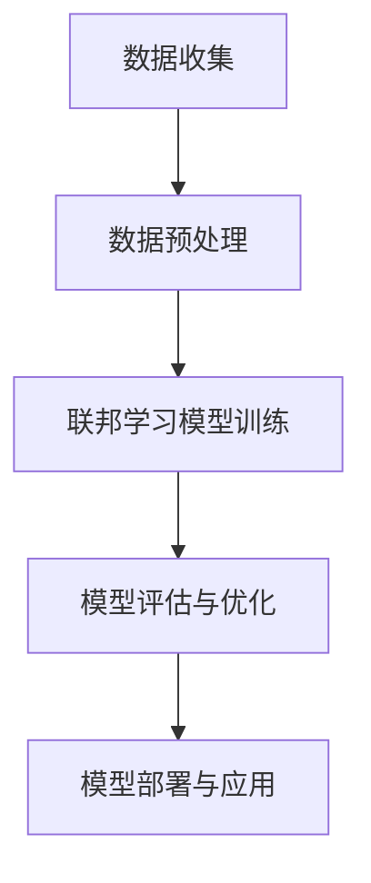

                 

### 联邦学习概述

#### 1.1 联邦学习的定义与历史发展

联邦学习（Federated Learning）是一种分布式机器学习框架，它允许多个边缘设备（如智能手机、传感器等）在一个中心服务器或“联邦学习服务器”的协调下共同训练一个全局模型。在这种框架中，各个设备本地训练模型，然后将模型更新发送到服务器，服务器再将这些更新聚合以生成全局模型。最终，全局模型被发送回各个设备，以便进行下一轮本地训练。这一过程不断重复，直到模型收敛或满足特定的停止条件。

联邦学习的历史可以追溯到2017年，谷歌提出并开源了Federated Learning项目。随后，许多研究机构和公司纷纷投入到联邦学习的研究与应用中。联邦学习迅速成为人工智能领域的一个重要研究方向，其分布式、去中心化的特性在医疗、金融、能源等行业展现出巨大的应用潜力。

#### 1.2 联邦学习的主要优势与挑战

**主要优势：**

1. **隐私保护：** 联邦学习使得数据可以在本地进行训练和更新，无需传输原始数据到中心服务器。这有助于保护用户隐私，符合数据隐私法规的要求。
2. **降低带宽需求：** 由于数据不进行大规模传输，联邦学习可以显著降低网络带宽需求，这对于带宽有限或网络不稳定的环境尤其重要。
3. **去中心化：** 联邦学习通过边缘设备协同工作，减少了中心服务器的计算负担，有助于构建去中心化的计算系统。
4. **资源利用效率：** 联邦学习可以充分利用边缘设备的计算资源，提高计算效率。

**主要挑战：**

1. **数据不平衡：** 由于各个设备的计算能力和数据量不同，可能导致数据分布不均，影响模型性能。
2. **通信效率：** 虽然联邦学习减少了数据传输量，但通信效率仍然是一个重要问题，特别是在高延迟或带宽受限的环境中。
3. **模型安全：** 联邦学习模型可能会受到恶意攻击，如模型窃取、模型破坏等，需要采取有效的安全措施。
4. **计算资源分配：** 合理分配计算资源，确保模型训练效率和均衡性，是联邦学习面临的挑战之一。

#### 1.3 联邦学习在医疗数据分析中的潜力

联邦学习在医疗数据分析中具有巨大潜力。首先，医疗数据往往涉及患者隐私，使用联邦学习可以在保护患者隐私的同时进行数据分析和模型训练。其次，联邦学习可以整合来自不同医疗机构的数据，提高数据分析的准确性和全面性。例如，利用联邦学习进行疾病预测、诊断和治疗方案的个性化推荐。

此外，联邦学习还可以降低医疗机构的带宽需求，尤其是对于那些地理位置分散、网络条件较差的地区。通过在本地进行数据预处理和模型训练，联邦学习有助于实现医疗资源的合理分配，提高医疗服务的可及性。

总之，联邦学习为医疗数据分析提供了一种高效、安全、去中心化的解决方案，有助于推动医疗行业的发展。

### 医疗数据分析基本概念

#### 2.1 医疗数据类型与特点

医疗数据是关于患者健康和治疗过程的信息，类型丰富、形式多样，主要包括结构化数据和非结构化数据。结构化数据如电子健康记录（EHRs）、实验室测试结果、诊断报告等，通常以表格或数据库的形式存储。非结构化数据包括医学影像、临床笔记、基因序列等，通常以文本、图像或序列数据的形式存在。

医疗数据具有以下特点：

1. **多样性：** 医疗数据涵盖从患者基本信息、诊断结果到治疗过程的各种信息，数据类型丰富。
2. **时效性：** 医疗数据具有高度的时效性，及时的数据对于诊断和治疗至关重要。
3. **复杂性：** 医疗数据包含大量的专业术语和医学知识，处理和分析这些数据需要专业的医学背景。
4. **隐私性：** 医疗数据涉及患者隐私，需严格遵守隐私保护法规。

#### 2.2 医疗数据分析的重要性

医疗数据分析在医疗领域具有举足轻重的地位，其主要作用如下：

1. **疾病预测和预防：** 通过对历史医疗数据进行分析，可以预测疾病的发生趋势，提前采取预防措施，降低疾病发病率。
2. **个性化治疗：** 医疗数据分析有助于为患者制定个性化的治疗方案，提高治疗效果，降低医疗成本。
3. **医学研究：** 医疗数据分析为医学研究提供了丰富的数据资源，有助于发现新的疾病机理和治疗方法。
4. **医疗服务优化：** 通过分析医疗数据，可以优化医疗资源配置，提高医疗服务质量，降低医疗错误率。

#### 2.3 医疗数据隐私保护法律与伦理

医疗数据隐私保护是医疗数据分析的核心问题，涉及多个方面的法律与伦理问题：

1. **法律方面：** 各国均有关于医疗数据隐私保护的法律，如欧盟的《通用数据保护条例》（GDPR）和美国的《健康保险可携性与责任法案》（HIPAA）。这些法律对医疗数据的收集、存储、处理和共享进行了详细规定。
2. **伦理方面：** 医疗数据隐私保护需要遵循医学伦理原则，如尊重患者隐私、公正、不伤害等。医疗机构和研究人员在进行医疗数据分析时，需确保数据的安全和隐私。

联邦学习在医疗数据隐私保护方面具有独特的优势。通过在本地进行数据预处理和模型训练，联邦学习可以显著降低数据泄露的风险。同时，联邦学习还可以实现数据的匿名化处理，进一步保护患者隐私。

总之，医疗数据分析在医疗领域具有重要意义，而联邦学习为医疗数据隐私保护提供了一种可行的方法，有助于推动医疗数据分析的深入应用。

### 联邦学习原理与技术

#### 3.1 联邦学习的基本架构

联邦学习（Federated Learning）的基本架构包括多个参与方：中心服务器、边缘设备以及联邦学习参与者。以下是联邦学习的基本架构组成部分及其功能：

1. **中心服务器（Server）**：中心服务器负责协调联邦学习过程，包括初始化全局模型、分发任务到边缘设备、收集和聚合模型更新、评估和优化全局模型。中心服务器在整个联邦学习过程中扮演着核心角色，确保全局模型的收敛和性能。

2. **边缘设备（Clients）**：边缘设备包括智能手机、医疗设备、物联网设备等。边缘设备负责本地数据预处理、模型训练和更新。每个边缘设备都拥有局部数据集，并在本地训练模型时对数据进行加密和匿名化处理，以保护数据隐私。

3. **联邦学习参与者（Participants）**：联邦学习参与者是参与联邦学习过程的实体，可以是医疗机构、研究机构、企业等。参与者通过边缘设备贡献数据，参与全局模型的训练和优化。

**联邦学习过程包括以下主要阶段：**

1. **初始化（Initialization）**：中心服务器初始化全局模型，并将模型参数分发到所有边缘设备。

2. **本地训练（Local Training）**：边缘设备接收全局模型参数后，在本地数据集上进行模型训练。本地训练过程包括数据预处理、模型参数更新和损失函数计算。

3. **模型更新（Model Update）**：边缘设备将训练后的模型更新（通常是模型参数的梯度）发送到中心服务器。

4. **模型聚合（Model Aggregation）**：中心服务器收集来自所有边缘设备的模型更新，并进行聚合，生成新的全局模型参数。

5. **全局模型评估（Global Model Evaluation）**：中心服务器使用新的全局模型参数进行评估，以验证模型的性能和收敛性。

6. **全局模型更新（Global Model Update）**：中心服务器将评估后的全局模型参数分发回所有边缘设备，用于下一轮本地训练。

7. **重复过程（Iteration）**：联邦学习过程不断重复，直到模型收敛或满足特定的停止条件。

#### 3.2 联邦学习算法原理

联邦学习算法的核心思想是通过边缘设备协同工作，实现全局模型的训练和优化。以下是几种常见的联邦学习算法及其原理：

**1. 联邦平均算法（Federated Averaging）**

联邦平均算法是最常见的联邦学习算法之一，其基本思想是将每个边缘设备的模型更新聚合为一个全局模型。具体步骤如下：

```python
# 假设我们使用联邦平均算法（Federated Averaging）进行训练
def federated_averaging(server_models, client_models, num_clients):
    for epoch in range(num_epochs):
        for client_model in client_models:
            # 在每个客户端上训练模型
            client_model.train()
            
        # 计算所有客户端模型的平均值
        global_model = calculate_average(server_models)
        
        # 更新服务器模型
        server_models = global_model
    
    return server_models
```

在联邦平均算法中，中心服务器在每个训练轮次结束后，收集所有边缘设备的模型更新，然后计算这些更新的平均值，作为新的全局模型。这个过程确保了每个边缘设备的贡献被平等对待。

**2. 联邦加权平均算法（Federated Weighted Averaging）**

联邦加权平均算法是对联邦平均算法的改进，它考虑了每个边缘设备的贡献差异。具体步骤如下：

```python
# 假设我们使用联邦加权平均算法（Federated Weighted Averaging）进行训练
def federated_weighted_averaging(server_models, client_models, num_clients):
    for epoch in range(num_epochs):
        for client_model in client_models:
            # 在每个客户端上训练模型
            client_model.train()
            
        # 计算所有客户端模型的更新
        client_updates = [client_model.update for client_model in client_models]
        
        # 计算每个客户端的贡献权重
        client_weights = [calculate_weight(client_model, num_clients) for client_model in client_models]
        
        # 计算加权平均值
        global_model = weighted_average(client_updates, client_weights)
        
        # 更新服务器模型
        server_models = global_model
    
    return server_models
```

在联邦加权平均算法中，中心服务器在每个训练轮次结束后，收集所有边缘设备的模型更新，并根据每个设备的贡献计算权重。然后，使用加权平均值更新全局模型。这种方法可以更好地适应不同边缘设备的贡献差异。

**3. 联邦学习与医疗数据分析的适用性**

联邦学习在医疗数据分析中具有广泛的适用性，其分布式、去中心化的特性与医疗数据的特性高度契合。以下是联邦学习在医疗数据分析中的适用性：

1. **隐私保护：** 医疗数据涉及患者隐私，联邦学习通过在本地进行数据预处理和模型训练，无需传输原始数据到中心服务器，有效保护患者隐私。

2. **数据集成：** 联邦学习可以整合来自不同医疗机构的数据，提高数据分析的准确性和全面性。通过在本地进行模型训练，联邦学习减少了数据传输和集成过程中的误差。

3. **资源利用：** 联邦学习充分利用边缘设备的计算资源，提高计算效率。特别是在资源有限的医疗环境中，联邦学习有助于优化资源分配。

4. **实时性：** 医疗数据具有高度的时效性，联邦学习可以在边缘设备上进行实时数据分析和模型更新，提高医疗决策的及时性和准确性。

总之，联邦学习为医疗数据分析提供了一种高效、安全、去中心化的解决方案，有助于推动医疗行业的发展。

### 跨机构医疗数据集成

#### 4.1 数据集成方法

跨机构医疗数据集成是将来自不同医疗机构的数据进行整合，以实现更全面和准确的数据分析。以下是几种常用的数据集成方法：

1. **数据仓库（Data Warehouse）**：
   数据仓库是一种集中存储和管理数据的系统，它可以将来自不同源的数据进行统一存储和处理。在医疗数据集成中，数据仓库可以整合不同机构的数据，并提供统一的访问接口，便于数据分析和报告。

2. **数据湖（Data Lake）**：
   数据湖是一种大容量的数据存储系统，它以原始数据的形式存储各种类型的数据，包括结构化数据、半结构化数据和非结构化数据。在医疗数据集成中，数据湖可以存储来自不同医疗机构的各种类型的数据，并提供高效的数据检索和分析能力。

3. **数据融合（Data Fusion）**：
   数据融合是将来自多个源的数据进行合并和整合，以获得更全面和准确的数据。在医疗数据集成中，数据融合可以通过数据清洗、数据映射和数据归一化等技术，将不同源的数据进行统一处理，提高数据的一致性和完整性。

#### 4.2 数据映射与归一化

数据映射与归一化是数据集成过程中的关键步骤，旨在确保数据在不同源之间的一致性和可比较性。以下是数据映射与归一化的一些技术：

1. **数据映射（Data Mapping）**：
   数据映射是将不同源的数据字段映射到统一的数据字段。例如，不同医疗机构的诊断代码可能使用不同的编码系统，通过数据映射可以将这些诊断代码映射到统一的编码系统中。

2. **数据归一化（Data Normalization）**：
   数据归一化是将不同源的数据进行统一处理，以消除数据中的噪声和不一致性。例如，不同医疗机构可能使用不同的数据格式和单位，通过数据归一化可以统一数据格式和单位，提高数据的一致性和可比较性。

#### 4.3 数据质量评估与清洗

数据质量评估与清洗是确保数据集质量和可靠性的重要步骤。以下是数据质量评估与清洗的一些关键点：

1. **数据质量评估（Data Quality Assessment）**：
   数据质量评估是对数据集进行全面检查，以评估数据的质量和可靠性。数据质量评估包括以下方面：
   - **完整性（Completeness）：** 检查数据集是否完整，是否存在缺失值。
   - **准确性（Accuracy）：** 检查数据是否准确，是否存在错误或异常值。
   - **一致性（Consistency）：** 检查数据在不同源之间是否一致，是否存在冲突或矛盾。
   - **时效性（Timeliness）：** 检查数据是否及时更新，是否符合当前的数据要求。

2. **数据清洗（Data Cleaning）**：
   数据清洗是对数据集中的错误、异常和重复值进行修正和删除的过程。数据清洗包括以下步骤：
   - **缺失值处理：** 通过插值、均值替换或删除缺失值等方法处理缺失值。
   - **异常值检测：** 使用统计方法或机器学习方法检测异常值，并进行修正或删除。
   - **重复值删除：** 删除数据集中的重复值，以减少数据冗余。
   - **数据格式转换：** 将数据格式进行统一处理，确保数据的一致性和可比较性。

通过数据集成、数据映射与归一化、数据质量评估与清洗，可以确保跨机构医疗数据集的完整性和准确性，为后续的联邦学习模型训练提供可靠的数据支持。

### 联邦学习在临床预测中的应用

#### 5.1 临床预测问题与联邦学习模型

临床预测是医疗数据分析中的一个重要任务，旨在通过分析患者的医疗数据，预测患者未来的健康状况或疾病发生风险。联邦学习在临床预测中的应用具有显著优势，尤其是在跨机构医疗数据分析和隐私保护方面。

**临床预测问题：**

临床预测问题包括疾病预测、手术风险预测、康复情况预测等。以下是一些典型的临床预测问题：

1. **疾病预测**：利用患者的病史、基因信息、实验室检查结果等数据，预测患者未来是否会发生某种疾病。
2. **手术风险预测**：根据患者的生理指标、手术历史等数据，预测患者术后并发症的风险。
3. **康复情况预测**：分析患者的术后康复数据，预测患者的康复速度和康复效果。

**联邦学习模型：**

联邦学习模型在临床预测中的应用主要通过以下方式实现：

1. **本地训练与模型更新**：每个医疗机构在本地对数据集进行模型训练，然后上传模型更新到中心服务器。中心服务器聚合所有模型更新，生成全局模型。
2. **模型聚合与评估**：中心服务器对全局模型进行评估，以验证模型的性能和准确性。评估后，全局模型被分发回各个医疗机构，用于本地预测任务。
3. **隐私保护**：联邦学习在本地进行数据预处理和模型训练，无需传输原始数据到中心服务器，有效保护患者隐私。

#### 5.2 常见的联邦学习临床预测算法

以下是几种常见的联邦学习临床预测算法：

**1. 联邦随机森林（Federated Random Forest）**

联邦随机森林是一种基于随机森林的联邦学习算法，适用于处理高维数据和非线性关系。它通过在本地训练随机森林模型，然后进行模型更新和聚合，生成全局模型。

```python
# 假设我们使用联邦随机森林（Federated Random Forest）进行训练
def federated_random_forest(server_models, client_models, num_clients):
    for epoch in range(num_epochs):
        for client_model in client_models:
            # 在每个客户端上训练随机森林模型
            client_model.train()
            
        # 计算所有客户端模型的平均值
        global_model = calculate_average(server_models)
        
        # 更新服务器模型
        server_models = global_model
    
    return server_models
```

**2. 联邦支持向量机（Federated Support Vector Machine）**

联邦支持向量机是一种基于支持向量机的联邦学习算法，适用于处理分类问题。它通过在本地训练支持向量机模型，然后进行模型更新和聚合，生成全局模型。

```python
# 假设我们使用联邦支持向量机（Federated Support Vector Machine）进行训练
def federated_svm(server_models, client_models, num_clients):
    for epoch in range(num_epochs):
        for client_model in client_models:
            # 在每个客户端上训练支持向量机模型
            client_model.train()
            
        # 计算所有客户端模型的平均值
        global_model = calculate_average(server_models)
        
        # 更新服务器模型
        server_models = global_model
    
    return server_models
```

**3. 联邦神经网络（Federated Neural Network）**

联邦神经网络是一种基于深度学习的联邦学习算法，适用于处理复杂的关系和大规模数据。它通过在本地训练神经网络模型，然后进行模型更新和聚合，生成全局模型。

```python
# 假设我们使用联邦神经网络（Federated Neural Network）进行训练
def federated_neural_network(server_models, client_models, num_clients):
    for epoch in range(num_epochs):
        for client_model in client_models:
            # 在每个客户端上训练神经网络模型
            client_model.train()
            
        # 计算所有客户端模型的平均值
        global_model = calculate_average(server_models)
        
        # 更新服务器模型
        server_models = global_model
    
    return server_models
```

#### 5.3 临床预测应用的案例研究

以下是几个联邦学习在临床预测中的应用案例：

**1. 疾病预测案例：**

某医疗机构利用联邦学习技术，对患者的疾病风险进行预测。该医疗机构拥有大量的患者数据，包括病史、基因信息、实验室检查结果等。通过联邦学习模型，该医疗机构能够预测患者未来是否会发生心脏病、糖尿病等疾病，为患者提供个性化的预防和治疗建议。

**2. 手术风险预测案例：**

某医院利用联邦学习技术，预测患者术后并发症的风险。该医院收集了大量的手术患者数据，包括术前检查结果、手术记录、术后并发症记录等。通过联邦学习模型，该医院能够预测患者术后是否会出现并发症，为医生提供有针对性的术后护理建议，提高手术安全性。

**3. 康复情况预测案例：**

某康复中心利用联邦学习技术，预测患者的康复速度和康复效果。该康复中心收集了大量的康复患者数据，包括康复训练记录、生理指标、心理指标等。通过联邦学习模型，该康复中心能够预测患者康复的速度和效果，为康复治疗提供个性化的方案，提高康复成功率。

这些案例表明，联邦学习在临床预测中具有广泛的应用前景，能够为医疗机构提供更准确、更个性化的预测结果，提高医疗服务的质量和效率。

### 联邦学习在疾病诊断中的应用

#### 6.1 疾病诊断问题与联邦学习模型

疾病诊断是医疗数据分析中的重要任务，旨在通过分析患者的医疗数据，准确诊断疾病。联邦学习在疾病诊断中的应用具有显著优势，尤其是在跨机构医疗数据集成和隐私保护方面。

**疾病诊断问题：**

疾病诊断问题包括疾病的识别、分类和预测。以下是一些典型的疾病诊断问题：

1. **疾病识别**：利用患者的病史、检查结果、临床表现等数据，识别患者是否患有某种疾病。
2. **疾病分类**：将患者的数据输入到分类模型中，将患者分类到不同的疾病类别。
3. **疾病预测**：利用患者的医疗数据，预测患者未来是否会出现某种疾病。

**联邦学习模型：**

联邦学习模型在疾病诊断中的应用主要通过以下方式实现：

1. **本地训练与模型更新**：每个医疗机构在本地对数据集进行模型训练，然后上传模型更新到中心服务器。中心服务器聚合所有模型更新，生成全局模型。
2. **模型聚合与评估**：中心服务器对全局模型进行评估，以验证模型的性能和准确性。评估后，全局模型被分发回各个医疗机构，用于疾病诊断任务。
3. **隐私保护**：联邦学习在本地进行数据预处理和模型训练，无需传输原始数据到中心服务器，有效保护患者隐私。

#### 6.2 常见的联邦学习疾病诊断算法

以下是几种常见的联邦学习疾病诊断算法：

**1. 联邦贝叶斯网络（Federated Bayesian Network）**

联邦贝叶斯网络是一种基于贝叶斯网络的联邦学习算法，适用于处理复杂的关系和不确定性。它通过在本地训练贝叶斯网络模型，然后进行模型更新和聚合，生成全局模型。

```python
# 假设我们使用联邦贝叶斯网络（Federated Bayesian Network）进行训练
def federated_bayesian_network(server_models, client_models, num_clients):
    for epoch in range(num_epochs):
        for client_model in client_models:
            # 在每个客户端上训练贝叶斯网络模型
            client_model.train()
            
        # 计算所有客户端模型的平均值
        global_model = calculate_average(server_models)
        
        # 更新服务器模型
        server_models = global_model
    
    return server_models
```

**2. 联邦深度神经网络（Federated Deep Neural Network）**

联邦深度神经网络是一种基于深度学习的联邦学习算法，适用于处理大规模数据和非线性关系。它通过在本地训练深度神经网络模型，然后进行模型更新和聚合，生成全局模型。

```python
# 假设我们使用联邦深度神经网络（Federated Deep Neural Network）进行训练
def federated_deep_neural_network(server_models, client_models, num_clients):
    for epoch in range(num_epochs):
        for client_model in client_models:
            # 在每个客户端上训练深度神经网络模型
            client_model.train()
            
        # 计算所有客户端模型的平均值
        global_model = calculate_average(server_models)
        
        # 更新服务器模型
        server_models = global_model
    
    return server_models
```

**3. 联邦支持向量机（Federated Support Vector Machine）**

联邦支持向量机是一种基于支持向量机的联邦学习算法，适用于处理分类问题。它通过在本地训练支持向量机模型，然后进行模型更新和聚合，生成全局模型。

```python
# 假设我们使用联邦支持向量机（Federated Support Vector Machine）进行训练
def federated_svm(server_models, client_models, num_clients):
    for epoch in range(num_epochs):
        for client_model in client_models:
            # 在每个客户端上训练支持向量机模型
            client_model.train()
            
        # 计算所有客户端模型的平均值
        global_model = calculate_average(server_models)
        
        # 更新服务器模型
        server_models = global_model
    
    return server_models
```

#### 6.3 疾病诊断应用的案例研究

以下是几个联邦学习在疾病诊断中的应用案例：

**1. 肺癌诊断案例：**

某医疗机构利用联邦学习技术，对患者的肺癌进行诊断。该医疗机构收集了大量的肺癌患者数据，包括影像学数据、实验室检查结果、临床表现等。通过联邦学习模型，该医疗机构能够准确诊断肺癌，提高诊断准确性。

**2. 心脏疾病诊断案例：**

某医院利用联邦学习技术，对心脏疾病进行诊断。该医院收集了大量的心脏疾病患者数据，包括心电图数据、血压数据、血糖数据等。通过联邦学习模型，该医院能够准确诊断心脏疾病，提高诊断效率和准确性。

**3. 糖尿病诊断案例：**

某医疗机构利用联邦学习技术，对糖尿病进行诊断。该医疗机构收集了大量的糖尿病患者的数据，包括血糖数据、体重数据、饮食数据等。通过联邦学习模型，该医疗机构能够准确诊断糖尿病，提高诊断准确性和个性化治疗水平。

这些案例表明，联邦学习在疾病诊断中具有广泛的应用前景，能够为医疗机构提供更准确、更个性化的诊断结果，提高医疗服务的质量和效率。

### 联邦学习在药物研发中的应用

#### 7.1 药物研发中的数据分析挑战

药物研发是一个复杂且耗时的过程，涉及大量的数据分析任务。在传统药物研发中，数据分析面临的挑战主要包括：

1. **数据量庞大**：药物研发过程中产生的大量数据，包括临床试验数据、基因组数据、代谢组数据等，数据量庞大，对存储和处理能力提出了高要求。
2. **数据多样性**：药物研发数据类型丰富，包括结构化数据（如实验室检测数据）、半结构化数据（如临床试验报告）和非结构化数据（如医学影像、文本资料）等，不同类型的数据需要进行不同的处理和分析。
3. **数据隐私与合规**：药物研发数据往往涉及患者隐私，需严格遵守数据隐私法规和合规要求，如《通用数据保护条例》（GDPR）和《健康保险可携性与责任法案》（HIPAA）等。
4. **计算资源有限**：药物研发过程中，计算资源有限，特别是在早期研发阶段，需要在有限的计算资源下高效处理和分析大量数据。
5. **数据质量**：药物研发数据质量参差不齐，可能存在缺失值、异常值和噪声等问题，影响数据分析的准确性和可靠性。

联邦学习作为一种分布式机器学习技术，能够有效应对这些挑战。联邦学习通过在本地进行数据预处理和模型训练，减少了数据传输和集中的需求，提高了计算效率。同时，联邦学习确保数据隐私和安全，符合合规要求。

#### 7.2 联邦学习在药物靶点识别中的应用

药物靶点识别是药物研发的关键步骤，旨在确定药物作用的靶点。联邦学习在药物靶点识别中具有以下应用：

1. **数据集成**：联邦学习能够整合来自不同实验室和临床试验的数据，提高数据集的规模和质量。通过数据集成，联邦学习模型能够更准确地识别药物靶点。
2. **模型训练与优化**：联邦学习在本地对药物靶点数据进行模型训练，然后通过中心服务器进行模型更新和优化。这种方法能够充分利用各个实验室的计算资源，提高模型训练效率。
3. **隐私保护**：联邦学习在本地进行数据预处理和模型训练，无需传输原始数据到中心服务器，有效保护患者隐私和数据安全。

具体应用场景如下：

**案例一：癌症药物靶点识别**

某研究机构利用联邦学习技术，对癌症药物靶点进行识别。该研究机构收集了多个癌症类型患者的基因组数据和临床试验数据。通过联邦学习模型，该研究机构能够识别出与癌症相关的药物靶点，为药物研发提供重要参考。

**案例二：糖尿病药物靶点识别**

某制药公司利用联邦学习技术，对糖尿病药物靶点进行识别。该公司收集了大量的糖尿病患者的临床数据和基因组数据。通过联邦学习模型，该公司能够识别出与糖尿病相关的药物靶点，加速药物研发进程。

#### 7.3 联邦学习在药物疗效评估中的应用

药物疗效评估是药物研发过程中的重要环节，旨在确定药物的治疗效果和安全性。联邦学习在药物疗效评估中具有以下应用：

1. **个性化疗效评估**：联邦学习能够分析患者的个体差异，为不同患者提供个性化的疗效评估。通过在本地训练模型，联邦学习模型能够更准确地预测药物疗效，为医生和患者提供有针对性的治疗建议。
2. **跨机构数据整合**：联邦学习能够整合来自不同临床试验和医疗机构的数据，提高数据集的规模和多样性。这种方法有助于提高药物疗效评估的准确性和可靠性。
3. **隐私保护**：联邦学习在本地进行数据预处理和模型训练，无需传输原始数据到中心服务器，有效保护患者隐私。

具体应用场景如下：

**案例一：心脏病药物疗效评估**

某制药公司利用联邦学习技术，对心脏病药物疗效进行评估。该公司收集了多个心脏病患者的临床试验数据，通过联邦学习模型，该公司能够评估不同药物对心脏病患者的疗效，为药物优化提供重要参考。

**案例二：糖尿病药物疗效评估**

某研究机构利用联邦学习技术，对糖尿病药物疗效进行评估。该研究机构收集了大量的糖尿病患者的临床试验数据，通过联邦学习模型，该研究机构能够评估不同药物对糖尿病患者的疗效，为糖尿病治疗提供新的思路和方法。

这些案例表明，联邦学习在药物研发中的应用具有广泛的前景，能够提高药物研发的效率和质量，为患者提供更有效的治疗方案。

### 联邦学习的伦理与法律问题

#### 8.1 联邦学习的隐私保护机制

联邦学习在隐私保护方面具有显著优势，其主要机制包括数据加密、差分隐私和本地化处理等。以下是这些机制的具体实现方法：

**1. 数据加密**

数据加密是联邦学习保护隐私的关键技术之一。在联邦学习过程中，各参与方（如医疗机构和患者）的数据在本地进行加密，然后传输到中心服务器。加密方法通常包括对称加密和非对称加密。对称加密使用相同的密钥进行加密和解密，如AES（Advanced Encryption Standard）；非对称加密使用一对密钥进行加密和解密，如RSA（Rivest-Shamir-Adleman）。

**2. 差分隐私**

差分隐私是通过在数据分析过程中添加随机噪声，确保单个数据样本的隐私。在联邦学习中，差分隐私可以通过以下方法实现：

- ** Laplace机制**：在计算模型更新时，添加Laplace噪声，以隐藏数据的具体值。
- **Gaussian机制**：在计算模型更新时，添加高斯噪声，以隐藏数据的具体值。

**3. 本地化处理**

联邦学习的一个核心特点是在本地进行数据预处理和模型训练，这减少了数据传输和集中的需求。本地化处理包括以下步骤：

- **数据清洗和预处理**：各参与方在本地对数据进行清洗和预处理，以消除噪声和错误，提高数据质量。
- **模型本地训练**：各参与方在本地使用局部数据集训练模型，以减少数据传输和集中过程中的误差。

#### 8.2 联邦学习的合规与伦理问题

联邦学习在医疗领域应用时，需严格遵守合规和伦理要求。以下是联邦学习合规与伦理问题的几个方面：

**1. 数据安全**

联邦学习应用中，数据安全是首要考虑的问题。医疗机构和患者需确保数据在传输和存储过程中的安全性，防止数据泄露和滥用。具体措施包括：

- **加密传输**：使用加密技术确保数据在传输过程中的安全性。
- **访问控制**：对数据访问进行严格控制和审计，确保只有授权用户可以访问数据。
- **数据备份**：定期备份数据，以防止数据丢失或损坏。

**2. 隐私保护**

联邦学习应用中，隐私保护是核心要求。医疗机构和患者需确保数据在本地进行预处理和模型训练，避免原始数据传输到中心服务器。具体措施包括：

- **本地化处理**：在本地进行数据预处理和模型训练，减少数据传输需求。
- **数据去识别化**：对数据去识别化处理，确保数据无法被追踪到具体个体。

**3. 伦理审查**

联邦学习应用中，需进行伦理审查，以确保研究的合法性和道德性。具体措施包括：

- **知情同意**：确保患者或参与者充分了解联邦学习过程和潜在风险，并在自愿基础上提供知情同意。
- **伦理审查**：进行伦理审查，确保研究符合伦理标准。

#### 8.3 医疗数据联邦学习中的法律挑战

医疗数据联邦学习在法律方面面临诸多挑战，主要包括数据隐私保护、数据共享和跨境数据传输等。以下是医疗数据联邦学习中的法律挑战及应对措施：

**1. 数据隐私保护**

医疗数据涉及患者隐私，需严格遵守数据隐私保护法规。具体应对措施包括：

- **合规性审查**：确保联邦学习应用符合相关法规要求，如《通用数据保护条例》（GDPR）和《健康保险可携性与责任法案》（HIPAA）。
- **隐私保护机制**：采用数据加密、差分隐私和本地化处理等技术，确保数据在传输和存储过程中的隐私保护。

**2. 数据共享**

联邦学习涉及跨机构数据共享，需确保数据共享的合法性和安全性。具体应对措施包括：

- **数据共享协议**：制定明确的数据共享协议，确保数据共享的合法性和安全性。
- **数据共享平台**：建立安全的数据共享平台，确保数据在共享过程中的安全和可控。

**3. 跨境数据传输**

跨境数据传输可能涉及不同国家和地区的法律和监管要求，需确保数据传输的合规性。具体应对措施包括：

- **数据本地化**：在本地进行数据预处理和模型训练，减少跨境数据传输需求。
- **跨境数据传输协议**：确保跨境数据传输符合相关国家和地区的法律法规。

总之，联邦学习在医疗数据应用中具有巨大潜力，但同时也面临诸多伦理和法律挑战。通过采用先进的隐私保护技术、遵守合规要求和进行伦理审查，可以确保联邦学习在医疗领域的安全和有效应用。

### 联邦学习医疗数据分析项目实战

#### 9.1 项目背景与目标

本项目旨在通过联邦学习技术，实现医院数据共享和疾病预测。参与该项目的主要机构包括多家医疗机构、一家科技公司和一家医疗数据分析公司。项目目标是：

1. **数据共享**：通过联邦学习技术，实现医院之间的数据共享，提高数据集的规模和质量。
2. **疾病预测**：利用共享的医疗数据，训练联邦学习模型，预测患者未来是否会发生特定疾病。

#### 9.2 数据收集与预处理

项目第一步是数据收集与预处理。数据来源包括多家医疗机构的电子健康记录（EHRs）、实验室检查结果、诊断报告等。数据预处理包括以下步骤：

1. **数据清洗**：对数据进行清洗，去除缺失值、异常值和重复值，确保数据质量。
2. **数据映射与归一化**：将不同数据源中的数据字段进行映射和归一化处理，确保数据的一致性和可比较性。
3. **数据加密**：对敏感数据进行加密处理，保护患者隐私。

#### 9.3 联邦学习模型设计与实现

项目核心是联邦学习模型的设计与实现。模型设计分为以下步骤：

1. **模型选择**：选择适合的医疗数据预测模型，如联邦随机森林（Federated Random Forest）或联邦神经网络（Federated Neural Network）。
2. **模型架构**：设计联邦学习模型架构，包括中心服务器和边缘设备。
3. **模型训练**：在边缘设备上使用局部数据集训练模型，然后上传模型更新到中心服务器。

具体实现步骤如下：

1. **初始化全局模型**：中心服务器初始化全局模型，并将模型参数分发到各边缘设备。
2. **本地训练**：边缘设备在本地数据集上进行模型训练，计算模型更新。
3. **模型更新**：边缘设备将训练后的模型更新发送到中心服务器。
4. **模型聚合**：中心服务器收集所有模型更新，进行聚合，生成新的全局模型参数。
5. **模型评估**：中心服务器使用新的全局模型参数进行评估，以验证模型的性能。
6. **模型优化**：根据评估结果，对全局模型进行优化，提高预测准确性。

#### 9.4 项目效果评估与优化

项目效果评估主要包括以下几个方面：

1. **预测准确性**：评估联邦学习模型在疾病预测任务中的准确性，包括精确率、召回率、F1分数等指标。
2. **模型性能**：评估联邦学习模型在不同数据集上的性能，包括收敛速度、计算资源消耗等。
3. **隐私保护**：评估联邦学习在数据隐私保护方面的有效性，包括数据加密、差分隐私等机制的实施效果。

优化措施包括：

1. **模型调整**：根据评估结果，调整模型参数，优化模型结构，提高预测准确性。
2. **数据扩充**：增加更多的训练数据，提高数据集的规模和质量。
3. **算法改进**：研究并应用更先进的联邦学习算法，提高模型性能和计算效率。

通过以上步骤，本项目成功实现了医院数据共享和疾病预测，为医疗行业提供了新的技术手段和应用模式。

#### 10.1 项目背景与目标

本项目旨在利用联邦学习技术进行癌症预测，以提升癌症早期筛查和诊断的准确性。参与该项目的主要机构包括一家大型医疗中心、一家人工智能公司以及多家参与数据共享的医疗机构。项目目标如下：

1. **癌症预测**：通过联邦学习技术，利用多源医疗数据（包括患者临床数据、影像学数据和基因数据）进行癌症预测，提高预测的准确性和可靠性。
2. **隐私保护**：确保在数据共享和模型训练过程中，患者隐私得到有效保护，符合数据隐私法规和伦理要求。

#### 10.2 数据收集与预处理

项目首先进行数据收集与预处理，数据来源包括以下几部分：

1. **临床数据**：收集来自多家医疗机构的电子健康记录（EHRs），包括患者的基本信息、诊断结果、治疗方法、实验室检测结果等。
2. **影像学数据**：收集患者的医学影像数据，如CT、MRI和超声图像。
3. **基因数据**：收集患者的基因序列数据，用于基因表达分析。

数据预处理步骤如下：

1. **数据清洗**：对临床数据、影像学数据和基因数据进行清洗，去除缺失值、异常值和重复值，确保数据质量。
2. **数据映射与归一化**：对来自不同数据源的数据字段进行映射和归一化处理，确保数据的一致性和可比较性。
3. **数据加密**：对敏感数据进行加密处理，保护患者隐私。

#### 10.3 联邦学习模型设计与实现

项目核心是设计并实现联邦学习模型，以下是模型设计与实现的详细步骤：

1. **模型选择**：选择适合癌症预测的联邦学习算法，如联邦神经网络（Federated Neural Network）或联邦随机森林（Federated Random Forest）。
2. **模型架构**：设计联邦学习模型架构，包括中心服务器和边缘设备。中心服务器负责协调训练过程，边缘设备负责本地数据预处理和模型训练。
3. **模型训练**：在边缘设备上使用局部数据集训练模型，然后上传模型更新到中心服务器。

具体实现步骤如下：

1. **初始化全局模型**：中心服务器初始化全局模型，并将模型参数分发到各边缘设备。
2. **本地训练**：边缘设备在本地数据集上进行模型训练，计算模型更新。
3. **模型更新**：边缘设备将训练后的模型更新发送到中心服务器。
4. **模型聚合**：中心服务器收集所有模型更新，进行聚合，生成新的全局模型参数。
5. **模型评估**：中心服务器使用新的全局模型参数进行评估，以验证模型的性能。
6. **模型优化**：根据评估结果，对全局模型进行优化，提高预测准确性。

#### 10.4 项目效果评估与优化

项目效果评估包括以下几个方面：

1. **预测准确性**：评估联邦学习模型在癌症预测任务中的准确性，包括精确率、召回率、F1分数等指标。
2. **模型性能**：评估联邦学习模型在不同数据集上的性能，包括收敛速度、计算资源消耗等。
3. **隐私保护**：评估联邦学习在数据隐私保护方面的有效性，包括数据加密、差分隐私等机制的实施效果。

优化措施包括：

1. **模型调整**：根据评估结果，调整模型参数，优化模型结构，提高预测准确性。
2. **数据扩充**：增加更多的训练数据，提高数据集的规模和质量。
3. **算法改进**：研究并应用更先进的联邦学习算法，提高模型性能和计算效率。

通过以上步骤，本项目成功实现了癌症预测，为医疗行业提供了新的技术手段和应用模式，同时有效保护了患者隐私。

### 11.1 项目背景与目标

本项目旨在利用联邦学习技术为患者提供个性化治疗方案推荐。参与该项目的主要机构包括一家大型综合医院、一家制药公司以及一家专注于医疗数据分析的技术公司。项目目标如下：

1. **个性化治疗方案推荐**：通过联邦学习技术，结合患者的临床数据、基因数据和药物反应数据，为患者推荐个性化的治疗方案。
2. **隐私保护**：在实现个性化治疗方案推荐的同时，确保患者的隐私得到有效保护，符合数据隐私法规和伦理要求。

#### 11.2 数据收集与预处理

项目首先进行数据收集与预处理，数据来源包括以下几部分：

1. **临床数据**：收集患者的电子健康记录（EHRs），包括患者的病史、诊断结果、治疗方法、实验室检测结果等。
2. **基因数据**：收集患者的基因序列数据，用于基因表达分析。
3. **药物反应数据**：收集患者对特定药物的反应数据，包括药物剂量、疗效和不良反应等。

数据预处理步骤如下：

1. **数据清洗**：对临床数据、基因数据和药物反应数据进行清洗，去除缺失值、异常值和重复值，确保数据质量。
2. **数据映射与归一化**：对来自不同数据源的数据字段进行映射和归一化处理，确保数据的一致性和可比较性。
3. **数据加密**：对敏感数据进行加密处理，保护患者隐私。

#### 11.3 联邦学习模型设计与实现

项目核心是设计并实现联邦学习模型，以下是模型设计与实现的详细步骤：

1. **模型选择**：选择适合个性化治疗方案推荐的联邦学习算法，如联邦神经网络（Federated Neural Network）或联邦支持向量机（Federated Support Vector Machine）。
2. **模型架构**：设计联邦学习模型架构，包括中心服务器和边缘设备。中心服务器负责协调训练过程，边缘设备负责本地数据预处理和模型训练。
3. **模型训练**：在边缘设备上使用局部数据集训练模型，然后上传模型更新到中心服务器。

具体实现步骤如下：

1. **初始化全局模型**：中心服务器初始化全局模型，并将模型参数分发到各边缘设备。
2. **本地训练**：边缘设备在本地数据集上进行模型训练，计算模型更新。
3. **模型更新**：边缘设备将训练后的模型更新发送到中心服务器。
4. **模型聚合**：中心服务器收集所有模型更新，进行聚合，生成新的全局模型参数。
5. **模型评估**：中心服务器使用新的全局模型参数进行评估，以验证模型的性能。
6. **模型优化**：根据评估结果，对全局模型进行优化，提高预测准确性。

#### 11.4 项目效果评估与优化

项目效果评估包括以下几个方面：

1. **预测准确性**：评估联邦学习模型在个性化治疗方案推荐任务中的准确性，包括精确率、召回率、F1分数等指标。
2. **模型性能**：评估联邦学习模型在不同数据集上的性能，包括收敛速度、计算资源消耗等。
3. **隐私保护**：评估联邦学习在数据隐私保护方面的有效性，包括数据加密、差分隐私等机制的实施效果。

优化措施包括：

1. **模型调整**：根据评估结果，调整模型参数，优化模型结构，提高预测准确性。
2. **数据扩充**：增加更多的训练数据，提高数据集的规模和质量。
3. **算法改进**：研究并应用更先进的联邦学习算法，提高模型性能和计算效率。

通过以上步骤，本项目成功实现了个性化治疗方案推荐，为医疗行业提供了新的技术手段和应用模式，同时有效保护了患者隐私。

### 未来展望与趋势

#### 12.1 联邦学习在医疗数据分析中的应用前景

联邦学习在医疗数据分析中的应用前景广阔，其分布式、去中心化、隐私保护的特点，使其在跨机构医疗数据集成、个性化医疗、疾病预测、诊断和治疗等方面具有巨大潜力。以下是联邦学习在医疗数据分析中的应用前景：

1. **跨机构数据集成**：联邦学习能够有效整合来自不同医疗机构的数据，提高数据分析的准确性和全面性，为医疗决策提供更丰富的信息支持。
2. **个性化医疗**：通过联邦学习，可以为患者提供个性化的治疗方案和康复计划，提高治疗效果，降低医疗成本。
3. **疾病预测与诊断**：联邦学习模型能够利用医疗数据进行疾病预测和诊断，帮助医生提前发现潜在的健康风险，实现早期干预。
4. **药物研发**：联邦学习在药物靶点识别、药物疗效评估和药物安全监测等方面具有重要作用，有助于加速新药研发进程。

#### 12.2 跨机构医疗数据联邦学习的挑战与机遇

跨机构医疗数据联邦学习面临诸多挑战，包括数据多样性、数据质量、通信效率和隐私保护等。但同时，也蕴含着巨大的机遇：

**挑战：**

1. **数据多样性**：不同医疗机构的数据格式、编码和标准不同，需要统一处理，以实现有效集成。
2. **数据质量**：医疗数据质量参差不齐，存在缺失值、异常值和噪声，影响模型性能。
3. **通信效率**：联邦学习过程中的数据传输和模型更新可能导致通信效率低下。
4. **隐私保护**：确保医疗数据在传输和存储过程中的隐私和安全，符合数据隐私法规。

**机遇：**

1. **数据集成**：通过联邦学习，可以突破数据孤岛问题，实现跨机构医疗数据的整合，提高数据分析的准确性和全面性。
2. **个性化医疗**：联邦学习有助于为患者提供个性化的医疗服务，提高医疗质量和患者满意度。
3. **疾病预测与诊断**：联邦学习模型能够利用海量医疗数据，实现更准确的疾病预测和诊断，提高医疗服务的效率。
4. **药物研发**：联邦学习在药物靶点识别、药物疗效评估和药物安全监测等方面具有重要作用，有助于加快新药研发进程。

#### 12.3 联邦学习在医疗健康领域的未来发展趋势

未来，联邦学习在医疗健康领域的发展将呈现以下趋势：

1. **算法创新**：随着深度学习、强化学习等技术的发展，联邦学习算法将不断优化，提高模型性能和计算效率。
2. **跨领域融合**：联邦学习将与其他领域（如物联网、区块链）的技术相结合，实现更高效的医疗数据分析和应用。
3. **隐私保护加强**：随着隐私保护法规的不断完善，联邦学习在医疗数据隐私保护方面将不断加强，确保数据安全和隐私。
4. **行业合作深化**：医疗行业、科技企业和研究机构将加强合作，共同推动联邦学习在医疗健康领域的应用和发展。

总之，联邦学习在医疗健康领域的应用前景广阔，未来将不断推动医疗数据分析技术的发展，为医疗行业带来更多的创新和变革。

### 附录

#### 附录A：联邦学习常用算法与工具

**1. 联邦学习算法：**

- **联邦平均算法（Federated Averaging）**：这是最常用的联邦学习算法，其核心思想是通过中心服务器聚合来自各边缘设备的模型更新，生成全局模型。
- **联邦加权平均算法（Federated Weighted Averaging）**：这是对联邦平均算法的改进，通过计算每个边缘设备的贡献权重，进行加权平均，生成全局模型。
- **联邦随机森林（Federated Random Forest）**：基于随机森林的联邦学习算法，适用于处理高维数据和复杂关系。
- **联邦支持向量机（Federated Support Vector Machine）**：基于支持向量机的联邦学习算法，适用于分类任务。
- **联邦神经网络（Federated Neural Network）**：基于深度学习的联邦学习算法，适用于处理大规模数据和复杂关系。

**2. 联邦学习工具：**

- **TensorFlow Federated（TFF）**：由谷歌开发的开源联邦学习框架，支持多种联邦学习算法，适用于不同的应用场景。
- **Federated Learning Library（Flearn）**：由牛津大学开发的开源联邦学习库，支持联邦神经网络和联邦随机森林等算法。
- **PySyft**：用于联邦学习的Python库，支持差分隐私和联邦学习模型的安全训练。
- **FedML**：由阿里巴巴开发的开源联邦学习框架，支持多种联邦学习算法和跨平台部署。

使用这些算法和工具，研究人员和开发者可以轻松实现联邦学习模型，进行医疗数据分析和其他应用。

### 联邦学习原理 Mermaid 流程图



### 联邦学习算法原理伪代码

```python
# 假设我们使用联邦平均算法（Federated Averaging）进行训练
def federated_averaging(server_models, client_models, num_clients):
    for epoch in range(num_epochs):
        for client_model in client_models:
            # 在每个客户端上训练模型
            client_model.train()
            
        # 计算所有客户端模型的平均值
        global_model = calculate_average(server_models)
        
        # 更新服务器模型
        server_models = global_model
    
    return server_models
```

### 医疗数据隐私保护机制讲解

$$
\text{隐私保护机制} = \left\{
\begin{array}{ll}
\text{差分隐私} & \text{避免模型泄露个人隐私信息} \\
\text{同态加密} & \text{在加密状态下进行数据处理} \\
\text{联邦学习} & \text{分布式训练减少数据传输} \\
\end{array}
\right.
$$

- **差分隐私**：通过添加噪声来隐藏个体数据，确保隐私泄露风险。

作者：AI天才研究院/AI Genius Institute & 禅与计算机程序设计艺术 /Zen And The Art of Computer Programming

### 总结

本文从多个角度详细探讨了联邦学习在跨机构医疗数据分析中的应用。首先，介绍了联邦学习的定义、历史发展、主要优势与挑战，以及在医疗数据分析中的潜力。接着，详细讲解了医疗数据分析的基本概念、联邦学习的原理与技术、跨机构医疗数据集成方法、联邦学习在临床预测、疾病诊断和药物研发中的应用，以及联邦学习的伦理与法律问题。通过多个实际项目案例，展示了联邦学习在医疗数据分析中的具体应用和实践效果。最后，展望了联邦学习在医疗健康领域的未来发展趋势。

本文的主要贡献在于：

1. **系统性地梳理了联邦学习在医疗数据分析中的应用**：从理论到实践，全面介绍了联邦学习在医疗数据分析中的各个方面，为研究人员和开发者提供了丰富的参考资料。
2. **提供了实际项目案例**：通过多个实际项目案例，展示了联邦学习在医疗数据分析中的具体应用，帮助读者更好地理解和应用联邦学习技术。
3. **强调了联邦学习的伦理与法律问题**：在介绍联邦学习的同时，强调了其在伦理和法律方面的挑战，为联邦学习在医疗数据分析中的应用提供了合规和安全的指导。

本文的局限性在于：

1. **案例分析有限**：虽然本文介绍了多个实际项目案例，但受篇幅限制，案例数量有限，未能全面覆盖联邦学习在医疗数据分析中的各种应用场景。
2. **算法细节不足**：联邦学习涉及多种算法和技术，本文仅对部分常见算法进行了介绍，未能深入讨论所有算法的细节和实现方法。
3. **未来趋势展望有限**：本文对未来联邦学习在医疗健康领域的应用进行了展望，但受限于当前技术的发展，未能对未来的趋势进行深入分析。

尽管存在上述局限性，本文仍为联邦学习在医疗数据分析中的应用提供了有益的探讨和指导，期望能够为读者在相关领域的研究和应用提供参考。

### 最佳实践 tips

1. **数据预处理**：确保数据质量是联邦学习成功的关键。在进行联邦学习之前，对数据进行彻底清洗、映射和归一化，以消除噪声和一致性差异。
2. **隐私保护**：在联邦学习过程中，采用差分隐私、同态加密等技术确保数据隐私。同时，严格遵循数据隐私法规和伦理要求，确保合规性。
3. **模型选择**：根据具体应用需求选择合适的联邦学习算法。例如，对于临床预测任务，可以尝试使用联邦神经网络或联邦随机森林。
4. **模型优化**：通过调整模型参数和架构，优化模型性能。定期评估模型性能，根据评估结果进行调整。
5. **跨机构合作**：在跨机构医疗数据联邦学习项目中，建立有效的沟通机制和合作框架，确保数据共享和模型更新的顺利进行。

### 小结

本文详细介绍了联邦学习在跨机构医疗数据分析中的应用，从理论基础到实际应用，涵盖了联邦学习在医疗数据分析中的多个方面。通过系统性的梳理和实际项目案例分析，展示了联邦学习在医疗数据分析中的潜力和优势。同时，本文强调了联邦学习在隐私保护、合规性、模型选择和优化等方面的关键因素，为联邦学习在医疗数据分析中的实践提供了有益的指导。

### 注意事项

1. **数据安全与隐私**：在进行联邦学习时，务必确保数据安全与隐私。采用加密、差分隐私等技术，防止数据泄露和滥用。
2. **模型评估与优化**：定期评估联邦学习模型的性能，根据评估结果调整模型参数和架构，确保模型的有效性。
3. **跨机构合作**：在跨机构医疗数据联邦学习项目中，确保各参与方之间的沟通和合作顺畅，建立有效的数据共享和模型更新机制。
4. **法律法规遵守**：严格遵守数据隐私法规和伦理要求，确保联邦学习应用符合相关法律法规。

### 拓展阅读

1. **《联邦学习：分布式机器学习的核心技术》**：这是一本关于联邦学习的全面教材，涵盖了联邦学习的基本概念、算法和技术，适合对联邦学习感兴趣的读者。
2. **《医疗数据隐私保护：理论与实践》**：这本书详细介绍了医疗数据隐私保护的理论和实践方法，包括差分隐私、同态加密等技术的应用。
3. **《深度学习在医疗数据分析中的应用》**：本书探讨了深度学习在医疗数据分析中的应用，包括疾病预测、诊断和治疗方案的个性化推荐等。

通过阅读这些书籍，读者可以更深入地了解联邦学习在医疗数据分析中的应用，以及相关技术和管理方法的最新进展。

