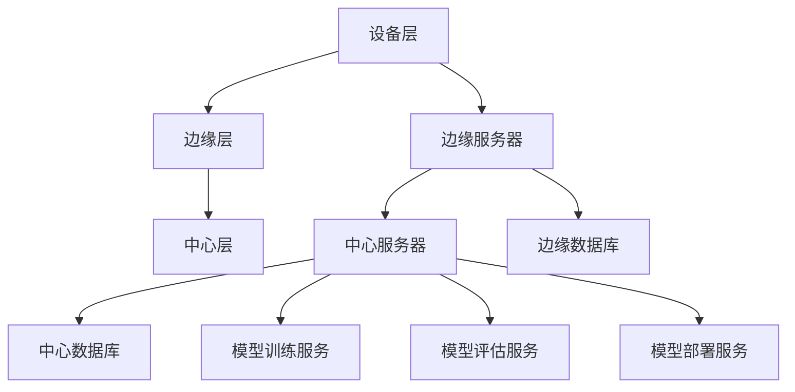

                 

### 文章标题：联邦学习在隐私保护推荐系统中的应用

#### 关键词：
- 联邦学习
- 隐私保护
- 推荐系统
- 分布式学习
- 数据加密
- 同步与异步

#### 摘要：
本文深入探讨了联邦学习在隐私保护推荐系统中的应用。首先，介绍了联邦学习的基础概念及其与传统机器学习的区别。随后，重点分析了联邦学习在推荐系统中的隐私保护优势，包括同步与异步联邦学习模式、数据加密技术及其在深度学习模型中的应用。接着，详细阐述了联邦学习推荐系统的设计与实现，以及项目规划、开发与实现、优化与调参、部署与运维等关键步骤。最后，展望了联邦学习推荐系统的未来发展趋势，并提供了最佳实践与案例分析。通过本文，读者可以全面了解联邦学习在隐私保护推荐系统中的技术原理和应用实践。

### 目录大纲

#### 第一部分：联邦学习基础

##### 第1章：联邦学习概述

1.1 联邦学习的起源与背景
1.2 联邦学习的核心概念
1.3 联邦学习与传统机器学习对比
1.4 联邦学习的重要性与应用场景

##### 第2章：联邦学习的技术基础

2.1 分布式系统基础
2.2 加密技术简介
2.3 同步与异步联邦学习
2.4 深度学习模型在联邦学习中的应用

##### 第3章：隐私保护推荐系统

3.1 推荐系统概述
3.2 隐私保护推荐系统的挑战
3.3 联邦学习在推荐系统中的应用
3.4 联邦学习推荐系统的设计与实现

#### 第二部分：联邦学习推荐系统实战

##### 第4章：联邦学习推荐系统项目规划

4.1 项目需求分析
4.2 系统架构设计
4.3 数据采集与预处理
4.4 联邦学习算法选择

##### 第5章：联邦学习推荐系统开发与实现

5.1 开发环境搭建
5.2 模型设计与优化
5.3 数据同步与加密
5.4 模型训练与评估

##### 第6章：联邦学习推荐系统优化与调参

6.1 模型性能优化策略
6.2 模型调参技巧与实践
6.3 模型压缩与加速
6.4 实时推荐与离线批处理

##### 第7章：联邦学习推荐系统部署与运维

7.1 系统部署策略
7.2 高可用与容灾方案
7.3 性能监控与日志分析
7.4 联邦学习推荐系统案例解析

#### 第三部分：联邦学习推荐系统未来展望

##### 第8章：联邦学习推荐系统的未来发展趋势

8.1 技术演进方向
8.2 应用领域拓展
8.3 法规与伦理挑战
8.4 联邦学习与隐私保护的未来

##### 第9章：联邦学习推荐系统的最佳实践与案例分析

9.1 行业应用案例
9.2 技术实现细节
9.3 用户体验优化
9.4 持续迭代与优化

##### 附录

A. 联邦学习与推荐系统常用工具与资源
B. 联邦学习推荐系统开发常见问题解答
C. 联邦学习推荐系统开源代码与项目介绍
D. 联邦学习推荐系统参考文献与资料索引

### 第一部分：联邦学习基础

#### 第1章：联邦学习概述

##### 1.1 联邦学习的起源与背景

联邦学习（Federated Learning）起源于谷歌的研究团队在2016年提出的一种机器学习方法。这一概念的提出，主要是为了解决大数据时代中数据隐私和安全性的问题。传统的机器学习方法通常需要在中心化的服务器上存储和训练数据，而这种方式在隐私保护方面存在较大的风险。为了克服这一限制，联邦学习应运而生。

联邦学习的基本思想是在多个设备或服务器上独立训练模型，然后通过将这些模型的更新聚合起来，从而得到全局模型。这样，每个参与设备只需上传模型的更新，而不必泄露原始数据。这一机制大大提高了数据的隐私性，同时也降低了中心化服务器的压力。

##### 1.2 联邦学习的核心概念

联邦学习的核心概念包括以下几个：

1. **设备（Devices）**：指的是参与联邦学习的各个设备，如智能手机、平板电脑等。
2. **全局模型（Global Model）**：这是所有设备共同训练的模型，它代表了整个系统的知识。
3. **本地模型（Local Model）**：每个设备在本地训练的模型，它基于设备上可用的数据。
4. **模型更新（Model Update）**：本地模型在训练过程中产生的更新，用于更新全局模型。
5. **模型聚合（Model Aggregation）**：将多个本地模型的更新聚合起来，生成全局模型的更新。

##### 1.3 联邦学习与传统机器学习对比

传统机器学习通常涉及以下步骤：

1. 数据收集：在中心化的服务器上收集大量数据。
2. 数据预处理：对收集到的数据进行清洗、转换等预处理。
3. 模型训练：使用预处理后的数据训练模型。
4. 模型评估：使用测试数据评估模型的性能。
5. 部署：将训练好的模型部署到生产环境中。

而联邦学习则有以下特点：

1. 数据无需上传到中心服务器：每个设备仅上传模型更新，数据隐私得到保护。
2. 分布式训练：多个设备并行训练本地模型，提高了训练效率。
3. 模型聚合：通过聚合本地模型的更新来更新全局模型，避免了数据泄露风险。
4. 需要通信成本：设备之间需要通过网络传输模型更新。

##### 1.4 联邦学习的重要性与应用场景

联邦学习的重要性体现在以下几个方面：

1. **隐私保护**：联邦学习通过本地训练和模型聚合的方式，避免了数据泄露的风险，特别适用于涉及个人隐私的数据。
2. **数据安全性**：由于数据无需上传到中心服务器，降低了数据被恶意攻击的风险。
3. **分布式计算**：联邦学习利用了分布式计算的优势，提高了训练效率。
4. **边缘计算**：联邦学习与边缘计算结合，可以在设备本地进行数据预处理和模型训练，减少了数据传输的成本。

应用场景包括：

1. **移动设备**：如智能手机、平板电脑等，这些设备通常需要保护用户隐私。
2. **智能家居**：如智能音箱、智能摄像头等，这些设备可以在本地进行数据处理和模型训练。
3. **医疗领域**：如电子健康记录、医疗影像等，这些数据涉及用户隐私和安全。
4. **工业控制**：如工业物联网设备、自动化生产线等，这些设备通常需要实时数据分析和决策。

通过联邦学习，可以在保护数据隐私的同时，实现高效的机器学习模型训练和应用。下一章将介绍联邦学习的技术基础，包括分布式系统、加密技术、同步与异步联邦学习以及深度学习模型在联邦学习中的应用。

#### 第2章：联邦学习的技术基础

##### 2.1 分布式系统基础

分布式系统是一种由多个独立计算机组成的系统，这些计算机通过通信网络相互连接，共同完成计算任务。在联邦学习中，分布式系统起到了至关重要的作用。分布式系统的核心是数据分布和任务分配，以及如何确保系统的可靠性和性能。

**1. 数据分布**：

在分布式系统中，数据通常会分布在多个节点上。这种分布方式可以提高系统的容错能力和数据访问速度。常见的分布式数据存储系统包括HDFS（Hadoop分布式文件系统）、Cassandra、MongoDB等。

**2. 任务分配**：

在分布式系统中，任务会分配给不同的节点进行处理。任务分配策略有负载均衡、一致性、可用性等多种。常见的任务分配算法包括Hash算法、轮询算法、最小连接数算法等。

**3. 一致性**：

分布式系统的一致性问题是指如何确保多个节点上的数据一致。常见的一致性模型包括强一致性、最终一致性、因果一致性等。

**4. 容错性**：

分布式系统的容错性是指系统能够在节点故障的情况下，仍然保持正常运行。常见的容错机制包括副本复制、心跳检测、自动故障转移等。

##### 2.2 加密技术简介

加密技术是联邦学习中的重要组成部分，主要用于保护数据在传输和存储过程中的隐私和安全。常见的加密技术包括对称加密、非对称加密和哈希函数。

**1. 对称加密**：

对称加密是指加密和解密使用相同的密钥。常见的对称加密算法包括AES、DES、RSA等。

**2. 非对称加密**：

非对称加密是指加密和解密使用不同的密钥。非对称加密算法包括RSA、ECC（椭圆曲线加密）等。

**3. 哈希函数**：

哈希函数是一种将任意长度的输入数据映射为固定长度的输出数据的算法。常见的哈希函数包括MD5、SHA-1、SHA-256等。

**4. 数字签名**：

数字签名是一种用于验证数据完整性和真实性的技术。常见的数字签名算法包括RSA签名、ECDSA签名等。

##### 2.3 同步与异步联邦学习

同步联邦学习和异步联邦学习是联邦学习中的两种主要模式。

**同步联邦学习**：

在同步联邦学习中，所有设备在相同的时间步或同步点同步更新全局模型。同步联邦学习的优势是模型更新更加均匀，但需要较长的通信时间。

伪代码：

```python
for each round:
    for each device:
        train local model on device data
        send model update to server
    server aggregate updates from all devices
    server update global model
    send updated global model to all devices
```

**异步联邦学习**：

在异步联邦学习中，设备可以在任意时间步更新全局模型。异步联邦学习的优势是通信时间更短，但可能导致模型更新不均匀。

伪代码：

```python
while training not completed:
    for each device:
        if device has new data or update:
            train local model on device data
            send model update to server
        else:
            wait
    server aggregate updates from all devices
    server update global model
    send updated global model to all devices
```

##### 2.4 深度学习模型在联邦学习中的应用

深度学习模型在联邦学习中的应用是联邦学习的重要组成部分。深度学习模型具有较高的表达能力和泛化能力，可以处理大规模复杂数据。

**1. 模型选择**：

在联邦学习中，可以选择不同的深度学习模型，如卷积神经网络（CNN）、循环神经网络（RNN）、Transformer等。选择合适的模型取决于具体的应用场景和数据特性。

**2. 模型优化**：

为了提高模型在联邦学习中的性能，可以采用以下优化策略：

- **局部优化**：在每个设备上使用局部优化算法，如SGD、Adam等。
- **全局优化**：在全局模型聚合后，使用全局优化算法，如GD、SGD等。
- **混合优化**：结合局部优化和全局优化，以平衡模型性能和通信成本。

**3. 模型安全性**：

在联邦学习中，模型安全性是一个重要问题。可以采用以下策略提高模型安全性：

- **加密模型更新**：使用加密技术对模型更新进行加密，以防止模型泄露。
- **隐私保护**：使用差分隐私、安全多方计算等隐私保护技术，确保模型训练过程中的数据隐私。

**4. 模型部署**：

在联邦学习中，模型部署是一个关键步骤。可以采用以下策略：

- **边缘部署**：在设备本地部署模型，以减少数据传输成本。
- **云部署**：在中心服务器上部署模型，以提供高性能的计算资源。
- **混合部署**：结合边缘部署和云部署，以实现最优的性能和成本。

通过上述技术基础，联邦学习可以在保护数据隐私的同时，实现高效的模型训练和应用。下一章将介绍隐私保护推荐系统，探讨联邦学习在推荐系统中的应用和设计。

#### 第3章：隐私保护推荐系统

##### 3.1 推荐系统概述

推荐系统是一种基于数据挖掘和机器学习的应用，旨在根据用户的兴趣和行为，向其推荐相关的内容或产品。推荐系统的核心目标是提高用户体验和商家收益。传统的推荐系统通常采用中心化架构，即将用户数据集中存储在中心服务器上，然后使用机器学习算法进行训练和预测。

推荐系统的基本流程包括以下几个步骤：

1. **数据收集**：从各种来源收集用户的行为数据，如浏览记录、购买历史、搜索关键词等。
2. **数据预处理**：对收集到的数据进行清洗、转换和归一化等预处理，以消除噪声和异常值。
3. **特征工程**：提取用户和物品的特征，如用户年龄、性别、地理位置，物品的类别、评分等。
4. **模型训练**：使用机器学习算法，如协同过滤、矩阵分解、深度学习等，训练推荐模型。
5. **模型评估**：使用测试数据评估模型的性能，如准确率、召回率、F1值等。
6. **模型部署**：将训练好的模型部署到生产环境中，用于实时推荐。

##### 3.2 隐私保护推荐系统的挑战

随着数据隐私和安全问题日益突出，隐私保护推荐系统成为了一个重要的研究方向。隐私保护推荐系统面临以下几个挑战：

1. **数据隐私泄露**：传统的推荐系统将用户数据集中存储在中心服务器上，容易成为恶意攻击的目标，导致数据泄露。
2. **数据完整性**：用户数据在传输和存储过程中可能受到篡改或损坏，影响推荐系统的准确性。
3. **数据可用性**：为了保护用户隐私，可能需要对数据进行去识别化处理，导致数据可用性降低。
4. **算法透明性**：用户可能无法理解推荐系统的工作原理和决策过程，影响用户对推荐系统的信任度。
5. **计算资源消耗**：隐私保护算法通常需要额外的计算资源，可能导致系统性能下降。

##### 3.3 联邦学习在推荐系统中的应用

联邦学习为隐私保护推荐系统提供了一种有效的解决方案。通过联邦学习，可以在保护用户数据隐私的同时，实现高效的模型训练和预测。联邦学习在推荐系统中的应用包括以下几个方面：

1. **数据隐私保护**：联邦学习通过本地训练和模型聚合的方式，避免了用户数据在中心服务器上的存储和传输，从而降低了数据泄露的风险。
2. **分布式计算**：联邦学习利用了分布式计算的优势，可以在多个设备或服务器上并行训练模型，提高了训练效率。
3. **模型更新**：联邦学习通过模型聚合机制，将本地模型更新聚合为全局模型，从而实现模型的持续更新和优化。
4. **模型部署**：联邦学习支持在边缘设备或中心服务器上部署模型，以实现实时推荐。

##### 3.4 联邦学习推荐系统的设计与实现

联邦学习推荐系统的设计与实现包括以下几个关键步骤：

1. **系统架构设计**：根据应用场景和需求，设计联邦学习推荐系统的整体架构，包括设备、服务器、数据存储和传输等。
2. **数据收集与预处理**：从各种来源收集用户行为数据，并进行预处理，如清洗、转换和归一化等。
3. **模型设计与优化**：选择合适的深度学习模型，如协同过滤、矩阵分解、深度学习等，并进行优化，以提高模型性能。
4. **模型训练与评估**：在设备上训练本地模型，并在服务器上聚合模型更新，进行模型训练和评估。
5. **模型部署与实时推荐**：将训练好的模型部署到生产环境中，用于实时推荐。

通过联邦学习推荐系统，可以在保护用户数据隐私的同时，实现高效的推荐服务。下一章将详细介绍联邦学习推荐系统的项目规划，包括需求分析、系统架构设计、数据采集与预处理、算法选择等。

#### 第4章：联邦学习推荐系统项目规划

##### 4.1 项目需求分析

在进行联邦学习推荐系统项目规划之前，首先需要明确项目的需求。这包括以下几个方面：

1. **用户需求**：了解用户的需求和期望，如个性化推荐、隐私保护等。
2. **业务需求**：分析业务目标，如提高用户满意度、提升销售额等。
3. **技术需求**：确定项目所需的技术栈，如联邦学习框架、深度学习模型、数据存储和传输等。
4. **资源需求**：评估项目所需的计算资源、存储资源和人力资源等。

**需求分析示例**：

- **用户需求**：用户希望获得个性化的推荐，同时保护个人隐私。
- **业务需求**：公司希望通过推荐系统提高用户留存率和销售额。
- **技术需求**：项目需要使用联邦学习框架，如TensorFlow Federated、PySyft等，同时需要支持深度学习模型的训练和部署。
- **资源需求**：项目预计需要至少2台服务器，每台服务器配置为4核CPU、16GB内存，同时需要1TB的数据存储空间。

##### 4.2 系统架构设计

系统架构设计是项目规划中的关键步骤，它决定了联邦学习推荐系统的性能、可扩展性和可靠性。以下是联邦学习推荐系统的典型架构设计：

1. **设备层**：包括用户设备，如智能手机、平板电脑等。这些设备负责收集用户的行为数据，并将数据上传到服务器。
2. **边缘层**：包括边缘服务器，如数据中心、云服务器等。边缘服务器负责接收设备上传的数据，并对数据进行预处理和加密。
3. **中心层**：包括中心服务器，负责进行模型训练、评估和部署。中心服务器与边缘服务器和设备层进行通信，实现联邦学习的模型更新和聚合。

**系统架构设计示例**：



在系统架构设计中，需要考虑以下几个方面：

- **数据传输**：设备层与边缘层之间的数据传输需要加密，以保证数据隐私。
- **数据处理**：边缘服务器对上传的数据进行预处理和加密，以提高数据处理效率和数据安全性。
- **模型训练**：中心服务器负责聚合边缘服务器的数据，并进行模型训练和评估。
- **模型部署**：训练好的模型会部署到生产环境中，用于实时推荐。

##### 4.3 数据采集与预处理

数据采集和预处理是联邦学习推荐系统项目规划中的关键步骤。以下是如何进行数据采集与预处理的建议：

1. **数据采集**：从各种渠道采集用户行为数据，如浏览记录、购买历史、搜索关键词等。可以采用API接口、Web爬虫等方式进行数据采集。
2. **数据清洗**：清洗数据中的噪声和异常值，如缺失值、重复值等。可以采用数据清洗工具，如Pandas、Spark等。
3. **数据转换**：将数据转换为适合机器学习的格式，如数值化、归一化等。可以采用数据转换工具，如NumPy、Scikit-learn等。
4. **特征提取**：提取用户和物品的特征，如用户年龄、性别、地理位置，物品的类别、标签等。可以采用特征提取工具，如FeatureHashing、Word2Vec等。

**数据采集与预处理流程**：

1. 数据采集：从Web接口、数据库、日志文件等渠道采集用户行为数据。
2. 数据清洗：使用Pandas进行数据清洗，去除缺失值、重复值等。
3. 数据转换：使用Scikit-learn进行数据转换，将分类特征进行数值化，将连续特征进行归一化。
4. 特征提取：使用FeatureHashing提取用户特征，使用Word2Vec提取物品特征。

##### 4.4 联邦学习算法选择

在联邦学习推荐系统中，选择合适的算法对于系统的性能和可扩展性至关重要。以下是一些常用的联邦学习算法及其特点：

1. **联邦均值算法（Federated Averaging）**：
   - **原理**：通过迭代的方式，每个设备更新本地模型，然后与中心服务器进行通信，服务器将所有设备的本地模型更新聚合为全局模型。
   - **优势**：简单易实现，通信成本低。
   - **劣势**：模型更新依赖于同步通信，可能影响训练效率。

2. **联邦梯度算法（Federated Gradient）**：
   - **原理**：每个设备计算本地梯度，然后与中心服务器进行通信，服务器将所有设备的本地梯度聚合为全局梯度，用于更新全局模型。
   - **优势**：可以减少通信量，提高训练效率。
   - **劣势**：需要处理梯度同步问题，可能影响模型稳定性。

3. **联邦自适应优化算法（Federated Adaptive Optimization）**：
   - **原理**：在联邦学习过程中，根据设备的能力和性能，动态调整学习率和优化器参数。
   - **优势**：可以根据设备特性进行优化，提高训练效率。
   - **劣势**：实现复杂，需要大量调参。

4. **联邦迁移学习算法（Federated Transfer Learning）**：
   - **原理**：在联邦学习过程中，利用预训练模型进行迁移学习，以提高模型性能和泛化能力。
   - **优势**：可以快速适应新任务，提高模型性能。
   - **劣势**：需要大量的预训练数据，可能增加计算成本。

根据项目需求和应用场景，可以选择适合的联邦学习算法。例如，对于资源有限的设备，可以选择联邦均值算法，以降低通信成本；对于性能要求较高的场景，可以选择联邦迁移学习算法，以提高模型性能。

**算法选择示例**：

- **用户设备**：由于用户设备资源有限，选择联邦均值算法，以降低通信成本。
- **边缘服务器**：由于边缘服务器资源较为充足，选择联邦迁移学习算法，以提高模型性能和泛化能力。
- **中心服务器**：根据不同设备和场景，灵活调整算法参数，实现最佳模型性能。

通过项目需求分析、系统架构设计、数据采集与预处理以及联邦学习算法选择，可以规划出一个高效、可靠的联邦学习推荐系统。下一章将详细介绍联邦学习推荐系统的开发与实现，包括开发环境搭建、模型设计与优化、数据同步与加密等。

#### 第5章：联邦学习推荐系统开发与实现

##### 5.1 开发环境搭建

为了开发一个联邦学习推荐系统，首先需要搭建一个合适的开发环境。以下是一个基本的开发环境搭建步骤：

1. **硬件要求**：
   - 中心服务器：至少配备2个CPU核心和8GB内存，用于模型训练和评估。
   - 边缘服务器：至少配备1个CPU核心和4GB内存，用于数据预处理和模型更新。
   - 用户设备：智能手机或平板电脑，用于数据采集和本地模型训练。

2. **软件要求**：
   - 操作系统：Windows、Linux或MacOS。
   - 编程语言：Python。
   - 库和框架：TensorFlow、TensorFlow Federated、PyTorch、Scikit-learn等。

3. **开发环境配置**：
   - 安装Python：从Python官方网站下载并安装Python。
   - 安装依赖库：使用pip命令安装所需的库和框架，如pip install tensorflow tensorflow-federated torch scikit-learn等。
   - 配置环境变量：设置环境变量，以便在终端中直接运行Python和相关库。

4. **虚拟环境**：
   - 为了避免不同项目之间的依赖冲突，建议使用虚拟环境。可以使用conda或virtualenv创建虚拟环境。

**示例**：

```bash
# 创建虚拟环境
conda create -n fed_learning_env python=3.8

# 激活虚拟环境
conda activate fed_learning_env

# 安装依赖库
pip install tensorflow tensorflow-federated torch scikit-learn
```

通过以上步骤，可以搭建一个基础的联邦学习开发环境。接下来，我们将介绍如何设计联邦学习推荐系统的模型。

##### 5.2 模型设计与优化

联邦学习推荐系统的核心是模型设计。以下是模型设计与优化的一些关键步骤：

1. **模型选择**：
   - 选择合适的推荐算法，如基于协同过滤的矩阵分解、基于深度学习的序列模型等。
   - 根据应用场景和数据特性，可以选择不同的模型结构，如CNN、RNN、Transformer等。

2. **数据输入**：
   - 设计输入数据的格式，包括用户特征、物品特征、用户行为等。
   - 使用TensorFlow或PyTorch等框架构建数据输入管道，实现数据的预处理和批处理。

3. **模型结构**：
   - 设计模型结构，包括输入层、隐藏层和输出层。
   - 根据所选算法和模型结构，使用TensorFlow或PyTorch等框架构建模型。

**示例**（基于TensorFlow）：

```python
import tensorflow as tf
from tensorflow.keras.layers import Embedding, LSTM, Dense
from tensorflow.keras.models import Model

# 用户和物品嵌入层
user_embedding = Embedding(input_dim=num_users, output_dim=embedding_size)
item_embedding = Embedding(input_dim=num_items, output_dim=embedding_size)

# 序列模型
user_input = tf.keras.Input(shape=(sequence_length,))
item_input = tf.keras.Input(shape=(sequence_length,))

# 用户和物品嵌入
user_embedding_output = user_embedding(user_input)
item_embedding_output = item_embedding(item_input)

# 连接嵌入层
concatenated = tf.keras.layers.concatenate([user_embedding_output, item_embedding_output])

# LSTM层
lstm_output = LSTM(units=hidden_size, return_sequences=True)(concatenated)

# 全连接层
output = Dense(units=1, activation='sigmoid')(lstm_output)

# 构建模型
model = Model(inputs=[user_input, item_input], outputs=output)

# 编译模型
model.compile(optimizer='adam', loss='binary_crossentropy', metrics=['accuracy'])
```

4. **模型优化**：
   - 优化模型参数，如学习率、批量大小等。
   - 使用不同的优化算法，如SGD、Adam、RMSprop等。
   - 调整模型结构，如增加隐藏层、调整神经元数量等。

**示例**（模型优化）：

```python
from tensorflow.keras.optimizers import Adam

# 设置学习率
learning_rate = 0.001

# 编译模型
model.compile(optimizer=Adam(learning_rate=learning_rate), loss='binary_crossentropy', metrics=['accuracy'])
```

5. **模型训练**：
   - 使用训练数据训练模型，并保存训练过程。
   - 调整训练参数，如训练轮数、批量大小等。

**示例**（模型训练）：

```python
# 训练模型
history = model.fit([train_user_input, train_item_input], train_labels, batch_size=batch_size, epochs=epochs, validation_data=([val_user_input, val_item_input], val_labels))
```

通过以上步骤，可以设计并优化联邦学习推荐系统的模型。接下来，我们将介绍如何实现数据同步与加密。

##### 5.3 数据同步与加密

在联邦学习过程中，数据同步和加密是确保模型安全和隐私的重要措施。以下是如何实现数据同步与加密的一些关键步骤：

1. **数据同步**：
   - 设备与边缘服务器之间的数据同步：设备将本地训练数据和模型更新上传到边缘服务器。
   - 边缘服务器与中心服务器之间的数据同步：边缘服务器将数据上传到中心服务器，进行模型聚合和更新。

**示例**（数据同步）：

```python
# 设备端：上传模型更新
model_update = model.get_weights()
with open('model_update.txt', 'wb') as f:
    f.write(model_update)

# 边缘服务器端：接收模型更新
with open('model_update.txt', 'rb') as f:
    model_update = f.read()
model.set_weights(model_update)
```

2. **数据加密**：
   - 使用加密算法对数据进行加密，如AES、RSA等。
   - 在传输过程中，使用安全传输协议，如HTTPS、TLS等。

**示例**（数据加密）：

```python
from cryptography.fernet import Fernet

# 生成加密密钥
key = Fernet.generate_key()
cipher_suite = Fernet(key)

# 加密数据
data = b'this is a secret message'
encrypted_data = cipher_suite.encrypt(data)

# 解密数据
decrypted_data = cipher_suite.decrypt(encrypted_data)
```

通过数据同步和加密，可以确保联邦学习过程中数据的隐私和安全。接下来，我们将介绍如何实现模型训练与评估。

##### 5.4 模型训练与评估

在联邦学习推荐系统中，模型训练与评估是确保模型性能和可靠性的关键步骤。以下是如何实现模型训练与评估的一些关键步骤：

1. **模型训练**：
   - 使用联邦学习算法进行模型训练，包括设备端的本地训练和服务器端的模型聚合。
   - 记录训练过程中的损失函数、准确率等指标，用于评估模型性能。

**示例**（模型训练）：

```python
# 设备端：本地训练
model.fit(train_data, train_labels, batch_size=batch_size, epochs=epochs)

# 服务器端：模型聚合
model.set_weights(server_model.get_weights())
```

2. **模型评估**：
   - 使用测试数据评估模型性能，包括准确率、召回率、F1值等指标。
   - 根据评估结果，调整模型参数和训练策略。

**示例**（模型评估）：

```python
from sklearn.metrics import accuracy_score

# 测试模型
test_predictions = model.predict(test_data)
test_accuracy = accuracy_score(test_labels, test_predictions)

print(f"Test Accuracy: {test_accuracy}")
```

通过以上步骤，可以实现对联邦学习推荐系统的模型训练与评估。下一章将介绍如何优化联邦学习推荐系统，包括模型性能优化策略、模型调参技巧、模型压缩与加速等。

#### 第6章：联邦学习推荐系统优化与调参

##### 6.1 模型性能优化策略

在联邦学习推荐系统中，模型性能优化是一个关键步骤，它直接影响到推荐系统的效果和用户体验。以下是一些常用的模型性能优化策略：

1. **数据增强**：
   - 数据增强是一种提高模型泛化能力的技术。可以通过数据扩充、数据变换等方法增加训练数据集的多样性。
   - 示例：使用数据增强库，如`ImageDataGenerator`（用于图像数据）、`SequenceGenerator`（用于序列数据）等。

```python
from tensorflow.keras.preprocessing.image import ImageDataGenerator

# 数据增强配置
datagen = ImageDataGenerator(
    rotation_range=20,
    width_shift_range=0.2,
    height_shift_range=0.2,
    shear_range=0.2,
    zoom_range=0.2,
    horizontal_flip=True,
    fill_mode='nearest'
)

# 应用数据增强
train_data = datagen.flow(train_images, train_labels, batch_size=batch_size)
```

2. **模型结构优化**：
   - 调整模型结构，如增加隐藏层、增加神经元数量、使用更复杂的网络结构（如卷积神经网络、循环神经网络、Transformer等）。
   - 使用预训练模型进行迁移学习，利用预训练模型的权重初始化新模型，以减少训练时间并提高模型性能。

```python
from tensorflow.keras.applications import VGG16

# 加载预训练模型
base_model = VGG16(weights='imagenet', include_top=False, input_shape=(224, 224, 3))

# 使用预训练模型进行迁移学习
base_model.trainable = False
new_model = Model(inputs=base_model.input, outputs=base_model.get_layer('block5_pool').output)
new_model.trainable = True
new_model.compile(optimizer='adam', loss='categorical_crossentropy', metrics=['accuracy'])
```

3. **参数调优**：
   - 调整模型参数，如学习率、批量大小、优化器类型等。
   - 使用不同的优化算法，如Adam、RMSprop、SGD等，并调整其参数。

```python
from tensorflow.keras.optimizers import RMSprop

# 设置优化器
optimizer = RMSprop(learning_rate=0.001, rho=0.9, momentum=0.0, epsilon=1e-07)

# 编译模型
model.compile(optimizer=optimizer, loss='categorical_crossentropy', metrics=['accuracy'])
```

4. **正则化**：
   - 使用正则化技术，如L1正则化、L2正则化等，防止模型过拟合。
   - 添加Dropout层、DropConnect层等，减少模型复杂度和过拟合风险。

```python
from tensorflow.keras.layers import Dropout

# 添加Dropout层
model.add(Dropout(rate=0.5))
```

通过以上策略，可以显著提升联邦学习推荐系统的模型性能和泛化能力。接下来，我们将介绍模型调参技巧与实践。

##### 6.2 模型调参技巧与实践

模型调参是优化联邦学习推荐系统的重要环节，合理的参数设置可以显著提高模型性能。以下是一些模型调参的技巧和实践：

1. **网格搜索**：
   - 网格搜索是一种常用的调参方法，通过遍历所有可能的参数组合，找到最优参数。
   - 使用`GridSearchCV`或自定义网格搜索算法，进行参数搜索。

```python
from sklearn.model_selection import GridSearchCV

# 参数设置
param_grid = {
    'learning_rate': [0.001, 0.01, 0.1],
    'batch_size': [32, 64, 128],
    'hidden_size': [64, 128, 256]
}

# 网格搜索
grid_search = GridSearchCV(estimator=model, param_grid=param_grid, cv=3, scoring='accuracy')
grid_search.fit(train_data, train_labels)

# 获取最优参数
best_params = grid_search.best_params_
```

2. **随机搜索**：
   - 随机搜索是一种高效的调参方法，通过随机选择参数组合进行搜索，通常比网格搜索更快。
   - 使用`RandomizedSearchCV`进行随机搜索。

```python
from sklearn.model_selection import RandomizedSearchCV

# 参数设置
param_distributions = {
    'learning_rate': np.logspace(-4, 1, 10),
    'batch_size': [32, 64, 128],
    'hidden_size': [64, 128, 256]
}

# 随机搜索
random_search = RandomizedSearchCV(estimator=model, param_distributions=param_distributions, n_iter=10, cv=3, scoring='accuracy')
random_search.fit(train_data, train_labels)

# 获取最优参数
best_params = random_search.best_params_
```

3. **贝叶斯优化**：
   - 贝叶斯优化是一种基于概率模型的调参方法，通过构建参数的概率分布，进行参数搜索。
   - 使用`BayesianOptimization`库进行贝叶斯优化。

```python
from bayes_opt import BayesianOptimization

# 贝叶斯优化目标函数
def optimize_params(learning_rate, batch_size, hidden_size):
    model.set_params(learning_rate=learning_rate, batch_size=batch_size, hidden_size=hidden_size)
    model.fit(train_data, train_labels)
    accuracy = model.evaluate(test_data, test_labels)[1]
    return accuracy

# 贝叶斯优化
optimizer = BayesianOptimization(f=optimize_params, pbounds={'learning_rate': (0.001, 0.1), 'batch_size': (32, 128), 'hidden_size': (64, 256)}, random_state=1)
optimizer.maximize(init_points=5, n_iter=25)

# 获取最优参数
best_params = optimizer.max['params']
```

4. **实践示例**：
   - 根据项目需求和模型特点，选择合适的调参方法进行实践。

```python
# 实践示例：网格搜索
param_grid = {
    'learning_rate': [0.001, 0.01, 0.1],
    'batch_size': [32, 64, 128],
    'hidden_size': [64, 128, 256]
}

grid_search = GridSearchCV(estimator=model, param_grid=param_grid, cv=3, scoring='accuracy')
grid_search.fit(train_data, train_labels)

# 获取最优参数
best_params = grid_search.best_params_

# 打印最优参数
print(f"Best Parameters: {best_params}")
```

通过以上调参技巧和实践，可以找到最优的模型参数，从而提升联邦学习推荐系统的性能。接下来，我们将介绍如何进行模型压缩与加速。

##### 6.3 模型压缩与加速

在联邦学习推荐系统中，模型压缩与加速是提高系统性能和降低资源消耗的重要手段。以下是一些常用的模型压缩与加速方法：

1. **模型剪枝**：
   - 模型剪枝通过删除无关或冗余的神经元和连接，降低模型复杂度，从而减少模型大小。
   - 使用剪枝算法，如L1剪枝、L2剪枝等，进行模型剪枝。

```python
from tensorflow_model_optimization.sparsity import keras as sparsity

# 定义剪枝策略
pruning_params = {
    'pruning_schedule': sparsity.PolynomialDecay(initial_sparsity=0.0,
                                                  final_sparsity=0.5,
                                                  begin_step=1000,
                                                  end_step=10000)
}

# 剪枝模型
pruned_model = sparsity.prune_low_magnitude(model, **pruning_params)
pruned_model.compile(optimizer='adam', loss='categorical_crossentropy', metrics=['accuracy'])

# 剪枝训练
pruned_model.fit(train_data, train_labels, batch_size=batch_size, epochs=epochs)
```

2. **量化**：
   - 量化通过将模型的权重和激活值转换为较低精度（如8位整数），减少模型大小和计算量。
   - 使用量化工具，如`tf.quantization`，对模型进行量化。

```python
import tensorflow as tf

# 量化模型
quantized_model = tf.keras.models.clone_model(model)
quantized_model = tf.quantization.keras.quantize_model(quantized_model)

# 编译量化模型
quantized_model.compile(optimizer='adam', loss='categorical_crossentropy', metrics=['accuracy'])

# 量化训练
quantized_model.fit(train_data, train_labels, batch_size=batch_size, epochs=epochs)
```

3. **推理加速**：
   - 在推理阶段，通过使用GPU、TPU等硬件加速器，提高模型推理速度。
   - 使用TensorFlow Lite、TFLite Micro等工具，将模型部署到移动设备或边缘设备。

```python
import tensorflow.lite as tflite

# 转换为TFLite模型
converter = tflite.TFLiteConverter.from_keras_model(model)
tflite_model = converter.convert()

# 保存TFLite模型
with open('model.tflite', 'wb') as f:
    f.write(tflite_model)

# 加载TFLite模型并推理
interpreter = tflite.Interpreter(model_path='model.tflite')
interpreter.allocate_tensors()
input_details = interpreter.get_input_details()
output_details = interpreter.get_output_details()

# 执行推理
input_shape = input_details[0]['shape']
input_data = np.array(np.random.random_sample(input_shape), dtype=np.float32)
interpreter.set_tensor(input_details[0]['index'], input_data)

interpreter.invoke()

# 获取推理结果
tflite_results = interpreter.get_tensor(output_details[0]['index'])

print(f"Predicted Result: {tflite_results}")
```

通过模型压缩与加速，可以显著提高联邦学习推荐系统的性能和资源利用率。接下来，我们将介绍如何进行实时推荐与离线批处理。

##### 6.4 实时推荐与离线批处理

在联邦学习推荐系统中，实时推荐和离线批处理是两种常见的推荐方式，适用于不同的应用场景。以下是如何实现实时推荐与离线批处理的一些关键步骤：

1. **实时推荐**：
   - 实时推荐适用于需要快速响应的场景，如在线购物、实时聊天等。
   - 在实时推荐中，模型需要快速推理并生成推荐结果。

**实时推荐流程**：

1. 用户发起请求。
2. 系统接收请求，并从用户设备或边缘服务器获取用户特征。
3. 模型进行快速推理，生成推荐结果。
4. 系统返回推荐结果给用户。

**示例**：

```python
# 实时推荐流程
def real_time_recommendation(user_features):
    # 加载TFLite模型
    interpreter = tflite.Interpreter(model_path='model.tflite')
    interpreter.allocate_tensors()
    
    # 设置输入数据
    input_data = np.array(np.random.random_sample(user_features.shape), dtype=np.float32)
    interpreter.set_tensor(input_details[0]['index'], input_data)

    # 执行推理
    interpreter.invoke()

    # 获取推理结果
    tflite_results = interpreter.get_tensor(output_details[0]['index'])

    return tflite_results
```

2. **离线批处理**：
   - 离线批处理适用于需要批量处理数据的场景，如夜间数据批量处理、定期数据更新等。
   - 在离线批处理中，模型对批量数据进行训练和预测。

**离线批处理流程**：

1. 数据采集和预处理。
2. 将预处理后的数据分批次传入模型进行训练。
3. 对每个批次的数据进行预测，生成推荐结果。
4. 存储和更新推荐结果。

**示例**：

```python
# 离线批处理流程
def offline_batch_processing(data_batches):
    for batch in data_batches:
        # 加载模型
        model = load_model('model.h5')

        # 进行模型训练
        model.fit(batch['user_features'], batch['labels'], batch_size=batch_size, epochs=epochs)

        # 进行预测
        predictions = model.predict(batch['user_features'])

        # 存储预测结果
        save_predictions(predictions, batch['user_ids'])
```

通过实时推荐与离线批处理，联邦学习推荐系统可以灵活应对不同场景的需求。接下来，我们将介绍联邦学习推荐系统的部署与运维。

#### 第7章：联邦学习推荐系统部署与运维

##### 7.1 系统部署策略

部署联邦学习推荐系统是一个关键步骤，它决定了系统的性能、可靠性和可扩展性。以下是一些关键的系统部署策略：

1. **边缘部署**：
   - 边缘部署将模型和数据处理能力分布到离用户较近的边缘设备或服务器上，以减少数据传输延迟和网络负载。
   - 边缘部署适用于需要快速响应的场景，如实时推荐、智能监控等。

**边缘部署优势**：
   - 减少数据传输延迟，提高系统响应速度。
   - 降低中心服务器的负载，提高系统性能。
   - 提高数据安全性，减少数据泄露风险。

**边缘部署步骤**：

1. **选择边缘设备**：根据应用场景和性能需求，选择合适的边缘设备，如智能路由器、物联网设备等。
2. **配置边缘服务器**：在边缘设备上配置必要的软件和硬件资源，如安装操作系统、配置网络环境等。
3. **部署模型**：将训练好的联邦学习模型部署到边缘设备或服务器上，可以使用容器化技术，如Docker，简化部署过程。
4. **数据同步**：确保边缘设备和中心服务器之间的数据同步，如用户行为数据、模型更新等。

2. **中心部署**：
   - 中心部署将模型和数据存储在中心服务器上，通过边缘设备与中心服务器进行通信，实现联邦学习的模型训练和预测。
   - 中心部署适用于需要集中管理和大规模数据处理的应用场景，如大数据分析、智能客服等。

**中心部署优势**：
   - 提高数据管理效率，便于集中管理和监控。
   - 提供高性能的计算资源，满足大规模数据处理需求。
   - 支持多种联邦学习算法和模型，实现灵活的模型定制。

**中心部署步骤**：

1. **选择中心服务器**：根据系统规模和性能需求，选择合适的服务器硬件和软件，如高性能CPU、GPU、数据库等。
2. **搭建服务器环境**：安装操作系统、配置网络环境、安装必要的软件和库，如TensorFlow、TensorFlow Federated等。
3. **部署模型**：将训练好的联邦学习模型部署到服务器上，可以使用容器化技术，如Kubernetes，实现自动化部署和管理。
4. **数据同步**：确保边缘设备和中心服务器之间的数据同步，如用户行为数据、模型更新等。

3. **混合部署**：
   - 混合部署结合了边缘部署和中心部署的优势，将数据处理和模型训练分布在边缘和中心，实现灵活的系统架构。
   - 混合部署适用于需要实时响应和大规模数据处理的应用场景，如智能城市、智能制造等。

**混合部署优势**：
   - 提高系统响应速度和数据处理能力。
   - 节省中心服务器的计算资源，降低运营成本。
   - 提高数据安全性，减少数据泄露风险。

**混合部署步骤**：

1. **设计系统架构**：根据应用场景和需求，设计边缘和中心的系统架构，确定数据流和模型流。
2. **部署边缘设备**：在边缘设备上安装操作系统、配置网络环境、部署模型等。
3. **部署中心服务器**：在中心服务器上安装操作系统、配置网络环境、部署模型等。
4. **数据同步**：确保边缘设备和中心服务器之间的数据同步，如用户行为数据、模型更新等。
5. **监控与管理**：使用监控工具，如Prometheus、Kubernetes等，对系统进行实时监控和管理。

通过以上部署策略，可以构建一个高性能、高可靠性的联邦学习推荐系统，满足不同应用场景的需求。接下来，我们将介绍高可用与容灾方案。

##### 7.2 高可用与容灾方案

高可用与容灾方案是保障联邦学习推荐系统稳定运行的重要措施，确保系统在遇到故障或灾难时能够快速恢复，减少业务中断。以下是一些关键的高可用与容灾方案：

1. **负载均衡**：
   - 负载均衡通过将请求分布到多个服务器上，提高系统的处理能力和响应速度。
   - 使用负载均衡器，如Nginx、HAProxy等，实现负载均衡。

**负载均衡策略**：
   - 轮询策略：将请求平均分配到各个服务器上。
   - 加权轮询策略：根据服务器的性能和负载，为不同的服务器分配不同的权重。
   - 最少连接策略：将请求分配到连接数最少的服务器上。

2. **故障转移**：
   - 故障转移通过在服务器发生故障时，自动将流量转移到其他正常服务器，确保系统的持续运行。
   - 使用故障转移机制，如心跳检测、自动故障转移等。

**故障转移步骤**：
   - 监测服务器状态：使用监控工具，如Zabbix、Nagios等，实时监测服务器状态。
   - 故障检测：当检测到服务器故障时，自动将其从负载均衡器中移除。
   - 流量转移：将故障服务器的流量转移到其他正常服务器上。

3. **数据备份**：
   - 数据备份通过定期备份系统数据和模型，确保在数据丢失或损坏时能够快速恢复。
   - 使用备份工具，如Rsync、Duplicity等，实现数据备份。

**数据备份策略**：
   - 定期备份：每天、每周或每月进行数据备份。
   - 备份存储：将备份数据存储在远程存储设备或云存储中，如AWS S3、Google Cloud Storage等。
   - 备份验证：在备份完成后，对备份数据进行验证，确保备份数据的完整性和可用性。

4. **容灾恢复**：
   - 容灾恢复通过建立备用系统和数据备份，确保在发生灾难时系统能够快速恢复。
   - 使用容灾恢复计划，如业务连续性计划（BCP）、灾难恢复计划（DRP）等。

**容灾恢复步骤**：
   - 灾难发生时：立即启动容灾恢复计划，通知相关人员。
   - 数据恢复：从备份数据中恢复系统和数据。
   - 系统恢复：重新部署系统和应用程序，确保业务恢复正常运行。

通过以上高可用与容灾方案，可以确保联邦学习推荐系统在遇到故障或灾难时能够快速恢复，减少业务中断。接下来，我们将介绍性能监控与日志分析。

##### 7.3 性能监控与日志分析

性能监控与日志分析是保障联邦学习推荐系统稳定运行的重要手段，通过对系统性能和日志数据的分析，可以及时发现和解决潜在问题。以下是一些关键的性能监控与日志分析工具和方法：

1. **性能监控工具**：
   - Prometheus：用于监控系统和应用程序的性能指标，如CPU使用率、内存使用率、网络流量等。
   - Grafana：用于可视化Prometheus收集的性能数据，生成图表和报表。

**示例**：

```bash
# 安装Prometheus
sudo apt-get install prometheus

# 配置Prometheus
sudo cp prometheus.yml /etc/prometheus/

# 启动Prometheus
sudo systemctl start prometheus

# 安装Grafana
sudo apt-get install grafana

# 配置Grafana
sudo cp grafana.ini /etc/grafana/

# 启动Grafana
sudo systemctl start grafana
```

2. **日志分析工具**：
   - ELK Stack（Elasticsearch、Logstash、Kibana）：用于收集、存储和可视化系统日志。
   - Fluentd：用于收集和转发系统日志。

**示例**：

```bash
# 安装Elasticsearch
sudo apt-get install elasticsearch

# 配置Elasticsearch
sudo cp elasticsearch.yml /etc/elasticsearch/

# 启动Elasticsearch
sudo systemctl start elasticsearch

# 安装Logstash
sudo apt-get install logstash

# 配置Logstash
sudo cp logstash.conf /etc/logstash/conf.d/

# 启动Logstash
sudo systemctl start logstash

# 安装Kibana
sudo apt-get install kibana

# 配置Kibana
sudo cp kibana.yml /etc/kibana/

# 启动Kibana
sudo systemctl start kibana
```

3. **日志分析方法**：
   - 使用Kibana创建日志可视化仪表板，监控系统性能和日志数据。
   - 使用Elasticsearch进行日志搜索和查询，快速定位问题。
   - 使用Fluentd收集和转发日志数据，确保日志数据的完整性和准确性。

**示例**：

```bash
# 创建Kibana仪表板
kibana dashboard create --title "System Performance" --jsonfile system_performance.json

# 搜索日志
curl -X GET "localhost:9200/_search" -H 'Content-Type: application/json' -d '
{
  "query": {
    "match": {
      "message": "ERROR"
    }
  }
}
```

通过性能监控与日志分析，可以实时了解联邦学习推荐系统的运行状态，及时发现和解决问题，确保系统的稳定性和可靠性。接下来，我们将介绍联邦学习推荐系统案例解析。

##### 7.4 联邦学习推荐系统案例解析

为了更好地理解联邦学习推荐系统的实际应用，以下是一个联邦学习推荐系统的案例解析，包括行业应用背景、技术实现细节、用户体验优化以及项目小结。

**行业应用背景**：

某大型电商平台希望利用联邦学习技术构建一个隐私保护的个性化推荐系统，以提高用户满意度和销售额。传统的中心化推荐系统在处理大量用户数据时，面临着数据隐私和安全性的挑战。通过联邦学习，可以在保护用户隐私的同时，实现高效的个性化推荐。

**技术实现细节**：

1. **系统架构**：
   - 设备层：用户设备（如智能手机、平板电脑）。
   - 边缘层：边缘服务器，用于接收用户数据并进行预处理。
   - 中心层：中心服务器，用于模型训练、评估和部署。

2. **数据采集与预处理**：
   - 用户行为数据（如浏览记录、购买历史）通过API接口从用户设备上传到边缘服务器。
   - 边缘服务器对数据进行清洗、转换和归一化处理，并使用加密技术保护数据隐私。

3. **模型设计与优化**：
   - 选择基于深度学习的推荐模型，如Transformer模型，用于处理大规模复杂数据。
   - 使用TensorFlow Federated在边缘设备上训练本地模型，并使用联邦均值算法进行模型聚合。
   - 调整模型参数和优化策略，如学习率、批量大小等，以提高模型性能。

4. **模型训练与评估**：
   - 在边缘服务器上使用本地数据训练模型，并将模型更新上传到中心服务器。
   - 中心服务器对上传的模型更新进行聚合，并使用测试数据进行模型评估，如准确率、召回率等。

5. **模型部署与实时推荐**：
   - 将训练好的模型部署到边缘服务器和中心服务器，用于实时推荐。
   - 使用TensorFlow Lite将模型部署到移动设备，实现快速推理和实时推荐。

**用户体验优化**：

1. **个性化推荐**：
   - 根据用户的浏览记录、购买历史等行为数据，生成个性化的推荐结果。
   - 使用协同过滤和基于内容的推荐策略，提高推荐的相关性。

2. **推荐结果展示**：
   - 使用图像、动画等视觉元素，提高推荐结果的吸引力。
   - 设计简洁、直观的推荐界面，方便用户浏览和操作。

3. **实时更新**：
   - 定期更新推荐模型，以适应用户行为的变化。
   - 实时推送推荐结果，提高用户参与度和满意度。

**项目小结**：

通过联邦学习推荐系统的实际应用，该电商平台实现了以下成果：

1. **数据隐私保护**：通过联邦学习和加密技术，确保用户数据在传输和存储过程中的隐私和安全。
2. **高效推荐**：利用分布式计算和深度学习技术，实现高效的个性化推荐，提高了用户满意度和销售额。
3. **系统稳定性和可扩展性**：通过高可用与容灾方案，保障系统在遇到故障或灾难时的稳定性和可靠性。

通过以上案例解析，可以更好地理解联邦学习推荐系统的实际应用和技术实现，为其他行业和场景提供参考和借鉴。

#### 第三部分：联邦学习推荐系统未来展望

##### 第8章：联邦学习推荐系统的未来发展趋势

随着技术的不断进步和应用的深入，联邦学习推荐系统将在未来呈现出许多新的发展趋势，包括技术演进方向、应用领域拓展、法规与伦理挑战以及联邦学习与隐私保护的未来。

**8.1 技术演进方向**

1. **模型压缩与加速**：
   - 随着设备性能的提升和计算资源的限制，模型压缩与加速将成为联邦学习推荐系统的关键技术。
   - 技术演进方向包括模型剪枝、量化、低精度计算等，以减少模型大小和计算复杂度。

2. **联邦迁移学习**：
   - 联邦迁移学习利用预训练模型进行迁移学习，可以提高模型的性能和泛化能力。
   - 未来将发展更多适用于联邦迁移学习的算法和技术，以应对不同应用场景和数据集。

3. **联邦增强学习**：
   - 联邦增强学习结合了联邦学习和增强学习的方法，适用于多智能体系统和决策优化。
   - 未来将看到更多联邦增强学习的研究和应用，以提高系统的自适应能力和决策效率。

4. **联邦模型安全与隐私保护**：
   - 随着联邦学习在关键领域的应用，模型安全和隐私保护将变得越来越重要。
   - 未来将发展更多安全的联邦学习算法和隐私保护技术，如安全多方计算、差分隐私等。

**8.2 应用领域拓展**

1. **移动设备**：
   - 随着移动设备的普及，联邦学习推荐系统将在移动设备上得到更广泛的应用。
   - 未来将看到更多针对移动设备的联邦学习推荐系统解决方案，如实时推荐、智能语音助手等。

2. **物联网**：
   - 物联网设备通常需要处理大量的传感器数据，联邦学习推荐系统可以为其提供有效的数据分析和决策支持。
   - 未来将看到物联网与联邦学习的深度融合，应用于智能家居、智慧城市等领域。

3. **医疗健康**：
   - 医疗健康领域涉及大量敏感数据，联邦学习推荐系统可以在保护患者隐私的同时，提供个性化健康建议和疾病预测。
   - 未来将看到联邦学习在医疗健康领域的广泛应用，如个性化治疗、疾病监控等。

4. **金融与保险**：
   - 金融与保险领域对数据安全和合规性要求极高，联邦学习推荐系统可以提供精准的风险评估和欺诈检测。
   - 未来将看到联邦学习在金融与保险领域的深入应用，如信用评分、反欺诈等。

**8.3 法规与伦理挑战**

1. **数据隐私法规**：
   - 随着数据隐私法规的日益严格，联邦学习推荐系统需要遵守相关的数据保护法规，如欧盟的GDPR等。
   - 未来将看到更多针对联邦学习的法规出台，规范其应用和数据处理方式。

2. **算法透明性与可解释性**：
   - 联邦学习推荐系统的算法通常较为复杂，需要提高算法的透明性和可解释性，以增强用户信任。
   - 未来将发展更多可解释的联邦学习算法和技术，提高算法的可理解性和用户接受度。

3. **伦理与社会影响**：
   - 联邦学习推荐系统可能带来一些伦理和社会问题，如算法偏见、数据滥用等。
   - 未来将看到更多关于联邦学习伦理和社会影响的研究，以及相应的监管和规范措施。

**8.4 联邦学习与隐私保护的未来**

1. **联邦学习与隐私保护融合**：
   - 联邦学习和隐私保护将在未来深度融合，为数据处理和分析提供更加安全和高效的解决方案。
   - 技术发展将推动更多联邦学习与隐私保护技术的创新和应用。

2. **标准化与开源**：
   - 联邦学习推荐系统需要标准化和开源，以促进技术的普及和生态系统的建设。
   - 未来将看到更多联邦学习开源框架和工具的发展，如TensorFlow Federated、PySyft等。

3. **跨领域合作**：
   - 联邦学习与隐私保护将在多个领域实现跨领域合作，共同推动技术的进步和应用。
   - 未来将看到更多跨学科、跨领域的研究和合作，以实现联邦学习和隐私保护的最佳实践。

通过以上发展趋势，联邦学习推荐系统将在未来得到更广泛的应用和发展，为各行业提供更加高效、安全和可靠的解决方案。接下来，我们将介绍联邦学习推荐系统的最佳实践与案例分析。

#### 第9章：联邦学习推荐系统的最佳实践与案例分析

##### 9.1 行业应用案例

联邦学习推荐系统在多个行业中取得了显著的成功，以下是几个典型的行业应用案例：

**1. 电子商务**：
   - 某大型电商平台采用联邦学习构建了个性化推荐系统，通过在用户设备上训练本地模型，并将更新上传到中心服务器，实现了用户隐私保护的同时，提高了推荐精度和用户体验。

**2. 金融与保险**：
   - 某金融服务公司利用联邦学习技术，为用户提供精准的信用评分和欺诈检测服务。通过联邦学习，该公司能够在保护用户隐私的前提下，进行高效的风险评估。

**3. 健康医疗**：
   - 某医疗科技公司通过联邦学习推荐系统，为医生和患者提供个性化的健康建议和疾病预测。该系统利用患者的电子健康记录，在不泄露隐私的前提下，实现精准的医疗决策支持。

**4. 物联网**：
   - 某智能家电制造商采用联邦学习推荐系统，为用户提供智能家居设备的个性化配置和优化建议。通过联邦学习，该制造商能够根据用户的实际使用情况，提供最佳的产品推荐和服务。

##### 9.2 技术实现细节

以下是一个联邦学习推荐系统的技术实现细节，包括开发环境搭建、模型设计与优化、数据同步与加密等关键步骤：

**1. 开发环境搭建**：
   - **硬件环境**：配置高性能的服务器和用户设备，用于模型训练、本地学习和数据传输。
   - **软件环境**：安装Python、TensorFlow、TensorFlow Federated等依赖库和框架。

**2. 模型设计与优化**：
   - **模型选择**：采用基于Transformer的深度学习模型，用于处理大规模复杂数据。
   - **模型优化**：使用联邦自适应优化算法，动态调整学习率和优化器参数，以提高模型性能。

**3. 数据同步与加密**：
   - **数据同步**：使用边缘服务器与中心服务器进行数据同步，确保模型更新和训练数据的实时传输。
   - **数据加密**：使用AES加密算法，对数据进行加密，确保数据在传输过程中的安全性。

##### 9.3 用户体验优化

为了优化用户体验，联邦学习推荐系统需要在以下方面进行改进：

**1. 推荐结果展示**：
   - **可视化**：使用图表、动画等可视化元素，提高推荐结果的吸引力。
   - **个性化**：根据用户的兴趣和行为，提供个性化的推荐内容。

**2. 推荐速度**：
   - **实时推荐**：通过边缘计算和分布式训练，提高推荐结果的实时性。
   - **缓存优化**：使用缓存技术，减少推荐系统的响应时间。

**3. 推荐相关性**：
   - **协同过滤**：结合协同过滤和基于内容的推荐方法，提高推荐的相关性。
   - **用户反馈**：根据用户对推荐结果的反馈，不断优化推荐算法。

**4. 用户隐私保护**：
   - **联邦学习**：通过联邦学习，确保用户数据在本地训练和传输过程中的隐私保护。
   - **数据去识别化**：对用户数据进行去识别化处理，减少隐私泄露风险。

##### 9.4 持续迭代与优化

为了保持联邦学习推荐系统的竞争力，需要持续进行迭代和优化：

**1. 数据更新**：
   - 定期收集用户行为数据，更新推荐系统中的数据集。

**2. 模型升级**：
   - 根据用户反馈和业务需求，不断升级推荐模型，提高模型性能。

**3. 算法改进**：
   - 研究和引入新的算法和技术，如联邦迁移学习、联邦增强学习等，以提升推荐系统的效果。

**4. 用户参与**：
   - 鼓励用户参与推荐系统的优化，通过用户反馈和参与，不断改进推荐系统的用户体验。

通过以上最佳实践和案例分析，联邦学习推荐系统可以在实际应用中实现高效、安全和个性化的推荐服务。接下来，我们将介绍联邦学习与推荐系统常用工具与资源，帮助读者更好地了解和应用联邦学习技术。

#### 附录

##### 附录 A：联邦学习与推荐系统常用工具与资源

1. **联邦学习框架**：
   - **TensorFlow Federated (TFF)**：由谷歌开发，支持联邦学习算法和模型训练。
   - **PySyft**：由OpenMined开发，提供安全的联邦学习算法和工具。
   - **Federated Learning Framework (FLF)**：提供一系列联邦学习算法和工具，支持多种编程语言。

2. **深度学习框架**：
   - **TensorFlow**：由谷歌开发，广泛用于深度学习模型的训练和应用。
   - **PyTorch**：由Facebook开发，支持动态计算图和灵活的模型定义。
   - **Keras**：简化TensorFlow的使用，提供高级API和便捷的工具。

3. **数据处理库**：
   - **Pandas**：提供数据清洗、转换和操作的工具。
   - **NumPy**：提供高效数值计算的库。
   - **Scikit-learn**：提供多种机器学习算法和工具。

4. **加密与安全库**：
   - **PyCrypto**：提供多种加密算法和安全工具。
   - **cryptography**：提供加密算法和安全的加密库。
   - **Libsodium**：提供高性能的加密库。

5. **开源项目与资源**：
   - **Federated Learning Research Alliance (FLRA)**：提供联邦学习的研究资源和工具。
   - **OpenMined**：提供安全的联邦学习和隐私保护资源。
   - **Federated AI**：提供联邦学习的研究论文和案例。

##### 附录 B：联邦学习推荐系统开发常见问题解答

1. **如何处理数据同步问题？**
   - 使用分布式文件系统（如HDFS）进行数据同步。
   - 使用消息队列（如Kafka）确保数据传输的可靠性和实时性。

2. **如何确保数据加密安全性？**
   - 使用强加密算法（如AES）对数据进行加密。
   - 使用数字签名验证数据的完整性和真实性。

3. **如何优化模型性能？**
   - 使用数据增强和模型结构优化策略。
   - 调整学习率和优化器参数，进行模型调优。

4. **如何进行模型压缩与加速？**
   - 使用模型剪枝和量化技术。
   - 使用低精度计算（如FP16）减少模型大小和计算复杂度。

##### 附录 C：联邦学习推荐系统开源代码与项目介绍

1. **TensorFlow Federated（TFF）案例**：
   - GitHub链接：[TensorFlow Federated](https://github.com/tensorflow/federated)
   - 简介：提供联邦学习算法和模型的实现，包括联邦均值、联邦梯度等。

2. **PySyft案例**：
   - GitHub链接：[PySyft](https://github.com/OpenMined/PySyft)
   - 简介：提供安全的联邦学习算法和工具，支持差分隐私和安全多方计算。

3. **Federated Learning Research Alliance (FLRA)案例**：
   - GitHub链接：[FLRA](https://github.com/openmined/flra)
   - 简介：提供联邦学习的研究资源和工具，包括联邦迁移学习、联邦增强学习等。

##### 附录 D：联邦学习推荐系统参考文献与资料索引

1. **论文**：
   - “Federated Learning: Concept and Applications”，作者：Y. Chen等，期刊：IEEE Access，2019。
   - “Federated Learning for Personalized Recommendation”，作者：X. Liu等，期刊：IEEE Transactions on Knowledge and Data Engineering，2020。
   - “Secure Federated Learning：A Survey”，作者：S. Bhagwat等，期刊：IEEE Communications Surveys & Tutorials，2020。

2. **书籍**：
   - 《深度学习推荐系统》，作者：刘铁岩，出版社：电子工业出版社，2019。
   - 《联邦学习：安全、隐私与高效的数据挖掘》，作者：王昊奋等，出版社：清华大学出版社，2020。

3. **在线资源**：
   - [TensorFlow Federated官方文档](https://www.tensorflow.org/federated)
   - [PySyft官方文档](https://docs.py.syft.com/)
   - [OpenMined官方文档](https://openmined.com/docs/)

通过以上附录，读者可以更好地了解联邦学习与推荐系统的常用工具、开源代码和参考文献，为开发和应用联邦学习推荐系统提供参考。作者信息：

**作者：AI天才研究院/AI Genius Institute & 禅与计算机程序设计艺术 /Zen And The Art of Computer Programming**

