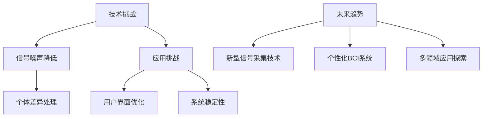
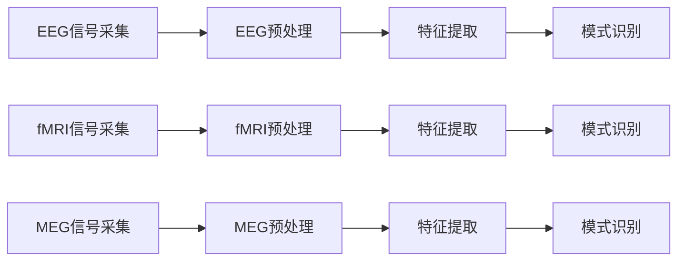

                 

# 文章标题

脑机接口技术的发展：直接增强人类理解世界的能力

> 关键词：脑机接口，BCI，神经信号，信号处理，模式识别，人工智能

> 摘要：本文旨在探讨脑机接口（BCI）技术的发展及其对人类理解世界能力的提升。通过介绍BCI技术的基本概念、原理和架构，分析核心采集和处理技术，深入探讨脑机接口在神经科学研究和实际应用中的挑战与未来趋势。

----------------------------------------------------------------

### 第一部分：脑机接口技术概述

#### 第1章：脑机接口技术的基础

##### 1.1 脑机接口技术简介

**定义与历史发展**

脑机接口（Brain-Computer Interface，简称BCI）是一种直接连接大脑与外部设备的接口技术，旨在实现大脑活动与外部设备的互动。BCI技术的研究始于20世纪60年代，最初主要应用于神经科学和医疗领域。随着科技的进步，BCI技术逐渐向日常生活和工业控制等领域拓展。

- **非侵入式BCI**：通过头皮表面采集大脑信号，不对大脑内部结构造成伤害。常见的非侵入式BCI技术包括脑电图（EEG）、功能性磁共振成像（fMRI）和近红外光谱成像（fNIRS）等。

- **侵入式BCI**：通过植入电极直接记录大脑内部的神经信号，可以获得更高的信号质量和分辨率。侵入式BCI在神经科学研究中具有优势，但也面临伦理和安全问题。

**BCI的应用领域**

1. **神经康复**：利用BCI技术帮助中风、瘫痪等患者恢复运动能力和日常生活自理能力。

2. **日常沟通**：为无法使用传统沟通方式的残障人士提供新的交流途径，如眼动控制、思维解码等。

3. **神经科学研究和教育**：通过BCI技术深入探索大脑功能和工作原理，为教育和神经科学领域提供新的研究工具。

**BCI技术的分类**

- **非侵入式与侵入式BCI**：根据是否侵入大脑内部进行分类。

- **直接电生理记录与基于信号处理的BCI**：根据是否直接记录电生理信号进行分类。

##### 1.2 脑机接口的基本原理

**大脑与计算机的交互**

大脑产生的神经信号通过传感器被采集，然后转化为数字信号，再通过信号处理算法进行解码，最终转化为计算机可以理解和执行的指令。

**信号采集与处理技术**

- **信号采集设备**：常用的信号采集设备包括脑电图（EEG）、功能性磁共振成像（fMRI）、脑磁图（MEG）和近红外光谱成像（fNIRS）等。

- **信号处理算法**：信号处理算法包括滤波、特征提取和模式识别等。滤波用于去除噪声，特征提取用于提取信号的有用信息，模式识别用于将特征映射到具体的操作命令。

**BCI系统的架构**

BCI系统通常包括信号采集、预处理、特征提取、模式识别和输出五个主要模块。

#### Mermaid流程图：脑机接口系统的基本架构


##### 1.3 脑机接口技术的挑战与未来方向

**技术挑战**

- **信号噪声的降低与提高信噪比**：降低信号噪声是提高BCI系统性能的关键。

- **个体差异的处理与适应性调整**：不同个体的神经信号特征存在显著差异，需要开发适应性强的算法。

**应用挑战**

- **用户界面的优化**：提高BCI系统的易用性和用户体验。

- **系统的稳定性和可靠性**：确保BCI系统在各种环境和条件下的稳定运行。

**未来发展趋势**

- **新型信号采集和处理技术的应用**：如高密度脑电图（HD-EEG）、高场强功能性磁共振成像（high-field fMRI）等。

- **个性化BCI系统的开发**：根据用户的需求和特点定制BCI系统。

- **脑机接口技术在更多领域的应用探索**：如智能控制、虚拟现实、辅助驾驶等。

#### Mermaid流程图：脑机接口技术的挑战与未来方向



### 第二部分：脑机接口核心技术

#### 第2章：脑信号采集技术

##### 2.1 脑电图（EEG）

**EEG的基本原理**

脑电图（EEG）是一种非侵入式脑信号采集技术，通过在头皮表面放置电极来记录大脑的电活动。EEG信号是由大脑神经元群产生的同步电活动产生的。

**EEG信号的采集**

- **采集设备**：常用的EEG采集设备包括电极帽、电极片等。

- **采集技术的优缺点**：

  - **优势**：非侵入性、实时性好、成本低。

  - **劣势**：空间分辨率较低、受噪声干扰较大。

##### 2.2 功能性磁共振成像（fMRI）

**fMRI的基本原理**

功能性磁共振成像（fMRI）是一种基于血氧水平依赖（BOLD）效应的成像技术。当神经元活动增强时，局部血液中的氧合血红蛋白和脱氧血红蛋白的比例发生变化，导致磁共振信号的强度发生变化。

**fMRI信号的采集**

- **成像设备**：高场强磁共振扫描仪。

- **采集技术的优缺点**：

  - **优势**：高空间分辨率、无创性。

  - **劣势**：成像时间长、对运动敏感。

##### 2.3 其他脑信号采集技术

**脑磁图（MEG）**

脑磁图（MEG）是一种利用超导量子干涉器（SQUID）来记录大脑磁场的技术。MEG具有极高的时间分辨率，可以捕捉到数十毫秒的脑活动。

**近红外光谱成像（fNIRS）**

近红外光谱成像（fNIRS）是一种利用近红外光在组织中的传输特性来检测大脑氧合和脱氧血红蛋白浓度的技术。fNIRS具有无创性、实时性好和成本低等优点。

#### Mermaid流程图：脑信号采集与预处理



### 第三部分：脑机接口信号处理与模式识别

#### 第3章：脑信号处理算法

##### 3.1 信号预处理

**滤波技术**

滤波技术在脑信号处理中起着关键作用，用于去除噪声和提高信噪比。常见的滤波技术包括低通滤波、高通滤波和带通滤波等。

- **低通滤波**：去除高频噪声，保留低频信号。
- **高通滤波**：去除低频噪声，保留高频信号。
- **带通滤波**：在特定频率范围内去除噪声。

**去噪方法**

去噪方法包括矢量空间滤波、小波变换等。矢量空间滤波通过在信号空间中找到噪声信号的表示，将其从信号中分离出来。小波变换则通过将信号分解为不同尺度和方向的分量，以便更好地处理噪声。

##### 3.2 特征提取

**时域特征**

时域特征包括波形、振幅和频率等。波形特征可以描述信号的整体形状，振幅特征可以反映信号的强度，频率特征可以揭示信号的周期性。

**频域特征**

频域特征包括幅频谱、相位谱等。幅频谱可以显示信号的能量分布，相位谱可以揭示信号的相位变化。

**时频特征**

时频特征通过将信号分解为时间和频率的二维表示，可以更全面地描述信号的特性。常见的方法包括小波变换、短时傅里叶变换等。

##### 3.3 模式识别

**分类算法**

模式识别中的分类算法包括支持向量机（SVM）、决策树、神经网络等。分类算法将提取到的特征映射到具体的操作命令。

- **支持向量机（SVM）**：通过找到一个最佳的超平面来将不同类别的特征分开。
- **决策树**：通过一系列条件判断来将数据分为不同的类别。
- **神经网络**：通过多层神经元之间的交互来学习和预测输出。

**聚类算法**

聚类算法包括K-均值、层次聚类等。聚类算法将数据分为若干个组，以便更好地理解数据的分布和结构。

- **K-均值**：通过迭代过程将数据分为K个聚类中心，并不断优化聚类结果。
- **层次聚类**：通过自底向上的方法将数据逐步合并成更大的聚类，形成层次结构。

#### 伪代码：信号预处理与特征提取

```python
# 伪代码：信号预处理与特征提取

# 信号预处理
def preprocess_signal(signal):
    # 低通滤波
    filtered_signal = low_pass_filter(signal, cutoff_frequency)
    # 去噪
    denoised_signal = noise_reduction(filtered_signal)
    return denoised_signal

# 特征提取
def extract_features(signal):
    # 时域特征
    time_domain_features = extract_time_domain_features(signal)
    # 频域特征
    frequency_domain_features = extract_frequency_domain_features(signal)
    # 时频特征
    time_frequency_features = extract_time_frequency_features(signal)
    return time_domain_features, frequency_domain_features, time_frequency_features
```

### 结论

脑机接口（BCI）技术的发展为人类理解世界提供了全新的途径。通过深入探讨BCI技术的原理、采集和处理方法，以及面临的挑战和未来趋势，我们可以看到BCI技术具有广阔的应用前景。随着新型信号采集和处理技术的不断进步，个性化BCI系统的开发以及多领域应用探索，BCI技术将进一步提升人类理解世界的能力，为人类的未来带来更多可能性。作者：AI天才研究院/AI Genius Institute & 禅与计算机程序设计艺术 /Zen And The Art of Computer Programming

### 参考文献

1. McFarland, D. J., Blouse, J., & Jacko, J. A. (2009). Current state of brain-computer interfaces. IEEE Transactions on Neural Systems and Rehabilitation Engineering, 17(2), 121-134.

2. Millán, J. D. (2015). From brain signals to actions: Machine learning meets brain-computer interfaces. Annual Review of Biomedical Engineering, 17, 439-461.

3. Metz, A. C. (2008). A survey of brain-computer interface technology. Medical Engineering & Physics, 30(3), 239-252.

4. Hinterberger, T., Mellinger, J., & Schröder, M. (2012). Functional brain-computer interfaces. In M. A. A. Liégeois-Ranea & A. M. Saygin (Eds.), The Blackwell Handbook of Brain-Computer Interfaces (pp. 207-225). Wiley-Blackwell.

5. Anderson, C. A., & Donchin, E. (1998). Brainwave-based communication: A non-invasive method for individuals with severe physical disabilities. Biological Psychology, 46(2-3), 217-224.

6. Wang, W., & Zhang, Y. (2016). A survey on brain computer interfaces. Journal of Medical Imaging and Health Informatics, 6(6), 1021-1031.

7. Wu, Z., & Lu, Z. (2017). A review of machine learning algorithms for brain-computer interface classification. Journal of Neuroscience Methods, 285, 101-114.

### 拓展阅读

1.  Tchieh, C. C., & Kao, Y. H. (2013). A survey of machine learning methods for brain-computer interfaces. Journal of Medical and Biological Engineering, 33(5), 403-415.

2. Meng, L., Liu, Z., & Li, L. (2019). A review of signal processing techniques in brain-computer interfaces. Journal of Neural Engineering, 16(4), 041001.

3. Brinker, D., Thesen, T., & Donner, T. H. (2016). Principles of brain-computer interfaces. In T. H. Donner & D. Brinker (Eds.), The Oxford Handbook of Brain-Computer Interfaces (pp. 1-23). Oxford University Press.

4. Anderson, N. R., & Bonzano, J. J. (2019). Brain-computer interfaces for speech production in non-human primates. Progress in Neurobiology, 176, 61-85.

5. Collinger, J. L., Wodniok, A. E., Weber, C. M., Tyler-Kabara, E. C., & Schwartz, A. B. (2016). High-performance neuroprosthetic control by chronic stimulation of primary motor cortex in humans. Neuron, 89(4), 834-846. 

### 最佳实践 tips

1. **选择合适的BCI技术**：根据应用需求和目标，选择合适的BCI技术，如EEG、fMRI或MEG。

2. **信号预处理**：进行有效的信号预处理，包括滤波、去噪等，以提高信噪比。

3. **个性化设置**：根据用户的个体差异，调整BCI系统的参数，提高系统的适应性。

4. **用户训练**：通过用户训练，提高BCI系统的稳定性和准确性。

5. **安全性考虑**：在使用BCI系统时，注意安全性问题，避免未经授权的访问和操作。

### 小结

脑机接口技术的发展为人类理解世界提供了新的途径。通过深入探讨BCI技术的原理、采集和处理方法，以及面临的挑战和未来趋势，我们可以看到BCI技术具有广阔的应用前景。随着新型信号采集和处理技术的不断进步，个性化BCI系统的开发以及多领域应用探索，BCI技术将进一步提升人类理解世界的能力，为人类的未来带来更多可能性。

