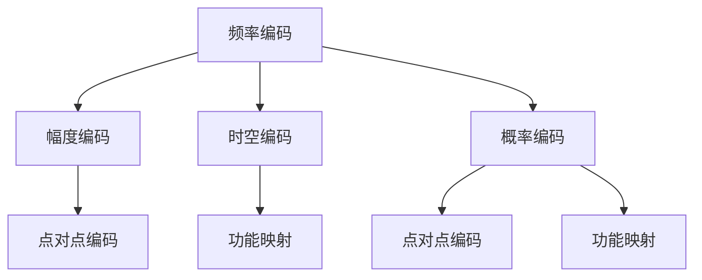
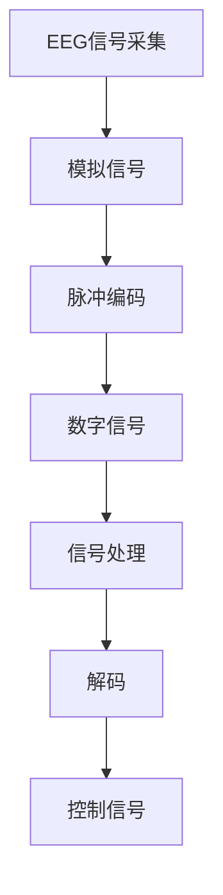
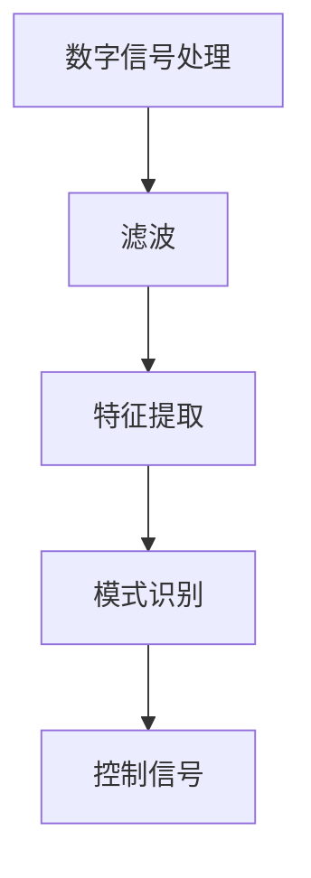
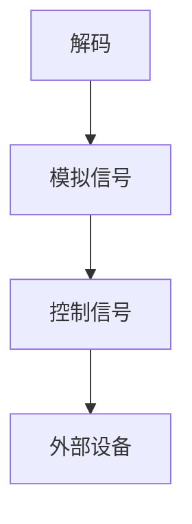

                 

### 文章标题

《脑机接口的信号处理：思维控制的数学解码》

### 关键词

脑机接口、信号处理、数学解码、神经编码模型、机器学习

### 摘要

本文深入探讨了脑机接口（BCI）的信号处理技术，重点介绍了思维控制的数学解码方法。通过逐步分析信号处理的基础知识、关键算法及其数学模型，文章旨在揭示脑机接口技术的原理和实现策略，为相关领域的研究者和开发者提供理论指导和实践参考。

# 脑机接口的基本概念与历史

脑机接口（Brain-Computer Interface, BCI）是一种直接连接人脑与外部设备的技术，它能够读取大脑信号并利用这些信号来控制外部设备或执行特定任务。脑机接口技术自诞生以来，经历了多个阶段的发展，从最初的简单实验到如今在临床和科研领域的广泛应用。

## 1.1 脑机接口的定义与分类

### 1.1.1 脑机接口的定义

脑机接口是一种通过直接读取大脑信号并将其转换为外部控制信号的技术。这些信号可以是电生理信号（如脑电波、肌电信号）或脑成像信号（如功能性磁共振成像、正电子发射断层扫描）。脑机接口的核心目标是实现人脑与计算机或其他设备的直接通信，从而为残障人士提供辅助功能或为健康人提供增强能力。

### 1.1.2 脑机接口的分类

脑机接口可以根据不同的分类标准进行分类：

- **根据刺激方式分类：**

  - **侵入式脑机接口**：这种接口直接植入大脑，通过电极采集神经元活动信号。侵入式脑机接口具有高分辨率和高信号质量，但存在手术风险和并发症。

  - **非侵入式脑机接口**：这种接口通过头皮采集大脑信号，不涉及手术。尽管非侵入式脑机接口的信号质量相对较低，但因其安全性和舒适性而更受欢迎。

- **根据信号类型分类：**

  - **电生理信号**：包括脑电波（EEG）、肌电信号（EMG）等，这些信号可以直接反映大脑活动。

  - **脑成像信号**：如功能性磁共振成像（fMRI）、正电子发射断层扫描（PET）等，这些信号通过检测脑部代谢变化来反映大脑活动。

## 1.2 脑机接口的发展历史

### 1.2.1 早期探索

脑机接口技术的概念可以追溯到20世纪初期，当时科学家们开始探索如何通过直接读取大脑信号来控制外部设备。最早的实验涉及动物实验，通过手术植入电极来记录神经元活动。这些早期实验为后来的脑机接口技术奠定了基础。

### 1.2.2 关键技术突破

随着计算机技术的发展，脑机接口技术逐渐走向成熟。关键的技术突破包括：

- **信号处理的改进**：通过先进的信号处理技术，提高了大脑信号的质量和可靠性。

- **算法的创新**：开发了多种算法来解码大脑信号，使其能够被外部设备理解并执行相应操作。

- **脑机接口在临床和科学研究中的应用扩展**：脑机接口技术逐渐在临床康复和科研领域得到应用，例如帮助残障人士恢复运动功能、辅助中风患者的康复治疗等。

### 1.2.3 当前发展趋势

目前，脑机接口技术正处于快速发展阶段，主要趋势包括：

- **高分辨率脑成像技术**：如高分辨率磁共振成像（hrMRI）和光遗传学技术的应用，使得脑机接口的信号质量得到进一步提升。

- **脑机接口在虚拟现实和增强现实中的应用**：脑机接口技术正在被用于开发新型的交互式虚拟现实和增强现实体验。

- **新兴技术的整合**：如人工智能、机器学习和深度学习技术的整合，使得脑机接口的解码精度和实时性得到显著提高。

## 1.3 脑机接口的关键挑战与未来展望

### 1.3.1 技术挑战

脑机接口技术面临以下技术挑战：

- **信号噪声比**：如何提高大脑信号的噪声比，降低噪声干扰。

- **实时处理与解码**：如何实现高效的大脑信号实时处理与解码。

- **个性化适配**：如何根据不同用户的大脑特性进行个性化适配，提高脑机接口的适用性。

### 1.3.2 临床应用

脑机接口在临床应用中具有巨大潜力，主要包括：

- **康复治疗**：帮助残障人士恢复运动功能，如假肢控制、轮椅控制等。

- **辅助治疗**：如通过脑机接口辅助中风患者的康复治疗。

- **神经疾病治疗**：如癫痫、帕金森病的治疗。

### 1.3.3 未来展望

脑机接口技术的未来展望包括：

- **技术革新**：随着高分辨率成像技术、人工智能和机器学习技术的发展，脑机接口的解码精度和实时性将得到进一步提升。

- **跨学科融合**：脑机接口技术将与医学、工程学、心理学等多个学科领域深度结合，推动技术的全面发展。

- **伦理和隐私问题**：随着脑机接口技术的普及，伦理和隐私问题将成为重要的讨论话题，需要制定相应的规范和标准。

总之，脑机接口技术作为一种具有巨大潜力的交叉学科领域，正朝着更加成熟、实用和多样化的方向发展。通过不断的技术创新和应用探索，脑机接口有望为人类带来更加丰富和多样的体验和功能。

## 2.1 脑信号的基础知识

### 2.1.1 脑信号的产生机制

脑信号是由大脑神经元活动产生的电化学信号。神经元是大脑的基本功能单元，通过电信号传递信息。当神经元受到刺激时，会产生动作电位，这种电信号可以被测量和记录。脑信号的产生机制主要包括以下几个步骤：

1. **神经元接收刺激**：神经元通过其树突接收外部刺激，如视觉、听觉、触觉等感官输入。

2. **电信号的产生**：当神经元膜电位达到一定阈值时，会产生动作电位，即神经元内的电信号。

3. **电信号的传导**：动作电位沿着神经元的轴突传导，最终到达神经元的末端，通过突触传递给下一个神经元。

4. **化学信号的传递**：在突触间隙中，电信号转换为化学信号，通过神经递质的释放传递给下一个神经元。

### 2.1.2 脑信号的基本特征

脑信号具有以下基本特征：

- **复杂性**：脑信号是由大量神经元同时活动产生的，具有复杂的时空特征。

- **频率范围**：脑信号的频率范围广泛，从几赫兹到几百赫兹不等。

- **时变特性**：脑信号是时变的，随时间和空间位置变化。

- **非线性**：脑信号的非线性特征使得传统的线性信号处理方法难以有效应用。

### 2.1.3 脑信号的种类

根据信号的来源和特性，脑信号可以分为以下几种：

- **电生理信号**：如脑电波（EEG）、肌电信号（EMG）等。这些信号通过头皮电极直接测量，能够反映大脑神经元的电活动。

- **脑成像信号**：如功能性磁共振成像（fMRI）、正电子发射断层扫描（PET）等。这些信号通过非侵入性的成像技术测量，能够反映大脑的代谢活动和神经活动。

- **神经电信号**：如局部场电位（LFP）、动作电位（AP）等。这些信号通过侵入式电极直接测量，能够提供高分辨率的大脑信号。

- **眼动信号**：通过眼球运动捕捉设备测量，能够反映大脑的视觉处理活动。

### 2.1.4 脑信号的测量与记录

脑信号的测量与记录是脑机接口技术的重要环节，主要包括以下几种方法：

- **电生理信号的测量与记录**：通过放置在头皮上的电极，可以直接测量和记录脑电波（EEG）和肌电信号（EMG）。这些电极可以是单极的、双极的或者多通道的，以适应不同的测量需求。

- **脑成像信号的测量与记录**：如功能性磁共振成像（fMRI）和正电子发射断层扫描（PET），通过先进的成像设备，可以在不侵入大脑的情况下测量和记录大脑信号。这些成像设备通过检测脑部代谢变化和血流变化来反映大脑活动。

- **神经电信号的测量与记录**：通过侵入式电极，可以直接在脑部记录局部场电位（LFP）和动作电位（AP）。这些电极通常植入在大脑内部，能够提供高分辨率的大脑信号。

- **眼动信号的测量与记录**：通过眼动捕捉设备，如眼动仪，可以测量眼球的运动，反映大脑的视觉处理活动。眼动信号通常用于辅助脑机接口的控制，如虚拟现实中的头动跟踪。

脑信号的测量与记录技术不断发展，提供了丰富的数据资源，为脑机接口技术的发展提供了坚实的基础。

## 2.2 信号处理的基本方法

### 2.2.1 信号预处理

信号预处理是脑机接口信号处理的重要步骤，旨在提高信号质量、去除噪声和增强有用信号。以下是常见的信号预处理方法：

- **去噪与滤波**：通过滤波器去除信号中的噪声。常见的滤波器包括低通滤波器、高通滤波器和带通滤波器。低通滤波器主要用于去除高频噪声，高通滤波器用于去除低频噪声，带通滤波器用于选择特定频率范围内的信号。

- **数据重构与降维**：通过数据重构技术，将原始信号转换为更简洁的表示形式，从而降低数据维度。常用的方法包括主成分分析（PCA）和小波变换。PCA通过提取主要成分来简化数据，小波变换通过将信号分解为不同频率的子带来降低数据维度。

- **时间窗口划分**：将信号划分为固定长度的时间窗口，以便进行后续分析。时间窗口的长度通常根据具体应用需求进行调整。

- **信号归一化**：通过归一化处理，将信号幅度调整到相同范围，以消除不同信号之间的幅度差异。

### 2.2.2 信号分析方法

信号分析方法用于从预处理后的信号中提取有用的信息。以下是几种常见的信号分析方法：

- **时域分析**：在时间域内对信号进行分析。常见的方法包括时域特征提取，如平均值、方差、峰峰值等。时域分析能够直接观察信号的时变特性。

- **频域分析**：在频域内对信号进行分析。通过频谱分析，可以揭示信号的频率成分和能量分布。常用的方法包括傅里叶变换（FT）和快速傅里叶变换（FFT）。频域分析能够揭示信号的频率特性。

- **时间-频率分析**：结合时间和频率信息对信号进行分析。常用的方法包括短时傅里叶变换（STFT）和小波变换。时间-频率分析能够揭示信号的时变频率特性。

### 2.2.3 时间-频率分析

时间-频率分析是信号处理中的一种重要方法，通过结合时间和频率信息，可以更深入地理解信号特性。以下是几种常见的时间-频率分析方法：

- **短时傅里叶变换（STFT）**：将信号划分为固定长度的时间窗口，然后对每个窗口进行傅里叶变换，从而获得信号在时间和频率上的分布。STFT能够揭示信号的局部频率特性。

- **小波变换**：通过选择合适的小波基函数，将信号分解为不同频率的子带。小波变换能够同时提供信号的时间和频率信息，适用于非平稳信号的分析。

- **波形匹配**：通过匹配信号和模板波形，来分析信号的特征。波形匹配可以用于信号识别和分类，例如在脑机接口中用于解码用户意图。

时间-频率分析是脑机接口信号处理的核心方法之一，通过这些方法，可以从复杂的脑信号中提取出有用的信息，为后续的信号解码提供基础。

### 2.3 信号处理的挑战与优化策略

脑机接口信号处理面临诸多挑战，包括复杂的噪声环境、高频率信号的实时处理和复杂信号模式的解码。为了应对这些挑战，研究人员提出了多种优化策略。

#### 2.3.1 复杂噪声环境下的信号辨识

噪声是脑机接口信号处理中的主要问题。噪声可能来自外部环境、电极的干扰或者大脑信号的自然噪声。以下是一些解决噪声的优化策略：

- **自适应滤波**：通过自适应滤波算法，如自适应噪声消除（Adaptive Noise Cancellation, ANC），可以动态调整滤波器参数，以降低噪声影响。

- **信号增强**：通过信号增强技术，如波束形成（Beamforming），可以增强目标信号，抑制噪声。

- **多通道信号融合**：利用多通道信号融合技术，结合多个通道的信息，提高信号的整体质量。

#### 2.3.2 实时处理与解码的效率问题

脑机接口系统需要在实时环境下处理和解读大脑信号，这对系统的实时性和效率提出了高要求。以下是一些优化策略：

- **硬件加速**：通过利用专用硬件，如FPGA（现场可编程门阵列）或GPU（图形处理单元），可以显著提高信号处理的实时性。

- **并行处理**：通过并行处理技术，将信号处理任务分布在多个处理器上，以提高处理速度。

- **压缩算法**：开发高效的压缩算法，减少数据传输和处理所需的时间。

#### 2.3.3 优化策略的应用

针对信号处理的挑战，研究人员还提出了一系列优化策略，包括：

- **机器学习**：利用机器学习算法，如支持向量机（SVM）和神经网络，可以提高信号解码的准确性和实时性。

- **深度学习**：深度学习技术，如卷积神经网络（CNN）和循环神经网络（RNN），在信号处理和模式识别中表现出色。

- **信号模型化**：通过建立信号模型，如神经网络模型和生成模型，可以提高信号处理的鲁棒性和适应性。

总之，脑机接口信号处理的优化策略旨在提高信号质量、实时处理能力和解码精度，为脑机接口技术的广泛应用提供支持。

### 2.4 脑机接口信号处理的关键技术

脑机接口信号处理涉及多种关键技术和算法，其中信号解码算法、机器学习与信号处理、实时信号处理是三个核心领域。

#### 2.4.1 信号解码算法

信号解码算法是脑机接口信号处理的核心，其目标是从原始脑信号中提取出有用的信息，如用户的意图或操作命令。以下是几种常用的信号解码算法：

- **滤波器组解码算法**：通过设计合适的滤波器组，对原始脑信号进行滤波和分解，从而提取出特定频率范围内的信号。这种方法适用于处理频率特定的脑信号，如EEG信号。

- **特征提取解码算法**：通过提取脑信号的时域或频域特征，如平均频率、能量等，进行解码。这种方法适用于提取简单的脑信号特征。

- **神经网络解码算法**：利用神经网络模型，如卷积神经网络（CNN）和循环神经网络（RNN），对脑信号进行特征学习和模式识别。神经网络解码算法能够处理复杂的脑信号模式，具有较高的解码精度。

- **生成对抗网络（GAN）解码算法**：通过生成对抗网络，将脑信号作为输入，生成与用户意图相关的输出信号。这种方法能够有效处理非线性的脑信号模式。

以下是一个基于神经网络的信号解码算法的伪代码：

```python
# 神经网络解码算法伪代码
def decode_signal(signal):
    # 数据预处理
    processed_signal = preprocess(signal)
    
    # 建立神经网络模型
    model = NeuralNetworkModel(input_shape=processed_signal.shape)
    
    # 训练神经网络模型
    model.fit(processed_signal, labels)
    
    # 预测信号
    prediction = model.predict(processed_signal)
    
    # 解码预测结果
    decoded_command = decode_prediction(prediction)
    
    return decoded_command
```

#### 2.4.2 机器学习与信号处理

机器学习与信号处理的结合是脑机接口信号处理的一大进步。通过机器学习算法，如支持向量机（SVM）、决策树、随机森林等，可以从大量脑信号数据中自动提取特征和模式，从而提高解码精度和鲁棒性。

- **支持向量机（SVM）**：通过寻找最佳分隔超平面，将脑信号分类为不同的意图。SVM在处理高维信号数据时表现出色。

- **决策树和随机森林**：通过构建树状结构，将脑信号数据划分为不同的类别。随机森林通过集成多个决策树，提高了预测的准确性和鲁棒性。

以下是一个基于支持向量机的脑信号分类的伪代码：

```python
# 支持向量机分类算法伪代码
def classify_signal(signal):
    # 数据预处理
    processed_signal = preprocess(signal)
    
    # 建立支持向量机模型
    model = SVMModel()
    
    # 训练支持向量机模型
    model.fit(processed_signal, labels)
    
    # 预测信号类别
    predicted_class = model.predict(processed_signal)
    
    return predicted_class
```

#### 2.4.3 实时信号处理

实时信号处理是脑机接口系统的关键挑战之一。为了实现实时处理，研究人员提出了多种优化策略：

- **硬件加速**：通过利用专用硬件，如FPGA和GPU，提高信号处理的实时性。

- **并行处理**：通过并行处理技术，将信号处理任务分布在多个处理器上，提高处理速度。

- **压缩算法**：通过开发高效的压缩算法，减少数据传输和处理所需的时间。

以下是一个基于并行处理的实时信号处理伪代码：

```python
# 并行处理实时信号处理伪代码
def process_signals(parallel_signals):
    # 并行处理信号
    processed_signals = parallel_process(parallel_signals)
    
    # 实时解码信号
    decoded_commands = decode_signals(processed_signals)
    
    return decoded_commands
```

总之，脑机接口信号处理的关键技术包括信号解码算法、机器学习与信号处理以及实时信号处理。通过这些技术，可以从复杂的脑信号中提取出有用的信息，实现高效的信号解码和实时控制。

## 3.1 线性代数基础

### 3.1.1 矩阵与向量运算

线性代数是信号处理和机器学习的基础，矩阵与向量运算是其中的核心内容。矩阵是一种由数字组成的矩形数组，而向量则是矩阵的特殊情况，即一维矩阵。

#### 矩阵和向量的定义与性质

- **矩阵**：矩阵是一个二维数组，用符号`A`表示。矩阵的行数称为`m`，列数称为`n`。一个`m×n`的矩阵包含`m`行和`n`列，总共`m×n`个元素。

- **向量**：向量可以看作是一个一维矩阵，用符号`v`或`a`表示。向量的大小（或长度）称为`n`。

- **性质**：

  - **矩阵加法**：两个矩阵只有当它们具有相同的维度时才能相加。矩阵加法是对应元素的加法。

  - **矩阵乘法**：矩阵乘法涉及将两个矩阵相乘得到一个新的矩阵。只有当第一个矩阵的列数与第二个矩阵的行数相同时，矩阵乘法才定义。

  - **矩阵转置**：矩阵转置是将矩阵的行和列互换。例如，如果矩阵`A`是一个`m×n`的矩阵，那么其转置`A^T`是一个`n×m`的矩阵。

  - **向量内积**：向量内积是两个向量的点积，用于计算向量的相似度。两个`n`维向量`u`和`v`的内积计算为`u·v = u_1v_1 + u_2v_2 + ... + u_nv_n`。

  - **向量外积**：向量外积是两个向量的叉积，用于计算向量的空间旋转。两个`n`维向量`u`和`v`的外积计算为`u×v = (u_2v_3 - u_3v_2, u_3v_1 - u_1v_3, u_1v_2 - u_2v_1)`。

#### 常见的矩阵运算

- **矩阵加法**：

  ```latex
  C = A + B
  ```

  其中，`C`是结果矩阵，`A`和`B`是参与运算的矩阵。

- **矩阵乘法**：

  ```latex
  C = AB
  ```

  其中，`C`是结果矩阵，`A`和`B`是参与运算的矩阵。

- **矩阵转置**：

  ```latex
  A^T = (a_{ij})
  ```

  其中，`A^T`是结果矩阵，`a_{ij}`是原矩阵`A`的元素。

- **向量内积**：

  ```latex
  u·v = u_1v_1 + u_2v_2 + ... + u_nv_n
  ```

  其中，`u`和`v`是向量。

- **向量外积**：

  ```latex
  u×v = (u_2v_3 - u_3v_2, u_3v_1 - u_1v_3, u_1v_2 - u_2v_1)
  ```

  其中，`u`和`v`是向量。

通过这些基础运算，可以构建复杂的线性模型，用于信号处理和机器学习中的数据分析和模式识别。

### 3.1.2 特征值与特征向量

特征值与特征向量是矩阵理论中的重要概念，用于描述矩阵的特性和分解。

#### 特征值与特征向量的定义

- **特征值**：特征值是矩阵`A`的一个特殊值，使得向量`v`在经过矩阵`A`变换后，与原向量`v`成比例。数学表示为：

  ```latex
  Av = \lambda v
  ```

  其中，`A`是矩阵，`v`是特征向量，`\lambda`是特征值。

- **特征向量**：特征向量是与特征值相对应的向量，满足上述等式。

#### 特征值与特征向量的计算方法

- **特征值计算**：通过求解矩阵的特征方程`det(A - \lambda I) = 0`，其中`I`是单位矩阵。特征方程的解即为特征值。

- **特征向量计算**：对于每个特征值`\lambda`，求解线性方程组`(A - \lambda I)v = 0`，其非零解即为特征向量。

#### 特征值与特征向量在信号处理中的应用

特征值与特征向量在信号处理中具有广泛的应用，主要包括：

- **信号分解**：通过求解矩阵的特征值和特征向量，可以将信号分解为不同频率或模式的组合，从而简化信号分析。

- **滤波器设计**：特征值和特征向量用于设计滤波器，以去除信号中的噪声或提取特定频率的信号。

- **降维**：通过提取主要特征值和特征向量，可以实现信号的降维，减少计算量和存储需求。

- **模式识别**：在机器学习中，特征值和特征向量用于提取输入数据的特征，用于分类和聚类。

以下是一个简单的特征值和特征向量计算的例子：

```latex
# 特征值与特征向量计算示例

# 定义矩阵 A
A = \begin{bmatrix}
2 & 1 \\
1 & 2
\end{bmatrix}

# 求解特征方程
det(A - \lambda I) = \begin{vmatrix}
2 - \lambda & 1 \\
1 & 2 - \lambda
\end{vmatrix}
= (2 - \lambda)^2 - 1
= \lambda^2 - 4\lambda + 3
= (\lambda - 1)(\lambda - 3)

# 特征值
\lambda_1 = 1, \lambda_2 = 3

# 求解特征向量
(A - \lambda_1 I)v_1 = \begin{bmatrix}
1 & 1 \\
1 & 1
\end{bmatrix}v_1 = 0
v_1 = \begin{bmatrix}
1 \\
-1
\end{bmatrix}

(A - \lambda_2 I)v_2 = \begin{bmatrix}
-1 & 1 \\
1 & -1
\end{bmatrix}v_2 = 0
v_2 = \begin{bmatrix}
1 \\
1
\end{bmatrix}
```

在这个例子中，矩阵`A`的特征值为`λ1=1`和`λ2=3`，对应的特征向量分别为`v1`和`v2`。这些特征值和特征向量可以用于信号分解和降维。

### 3.1.3 线性变换

线性变换是信号处理和机器学习中的基本操作，用于将信号从一种形式转换为另一种形式。

#### 线性变换的定义与性质

- **定义**：线性变换是将一个向量空间中的向量映射到另一个向量空间中的操作，满足以下性质：

  - **加性**：对任意的向量`u`和`v`，以及标量`a`和`b`，线性变换满足：
    ```latex
    T(u + v) = T(u) + T(v)
    T(au) = aT(u)
    ```

- **线性变换的表示**：线性变换可以通过矩阵表示。设`u`和`v`是向量空间`V`中的向量，`A`是一个`m×n`矩阵，则线性变换`T: V → W`可以表示为：

  ```latex
  T(u) = Au
  ```

  其中，`A`是线性变换的矩阵表示，`u`是输入向量，`T(u)`是输出向量。

#### 线性变换在信号处理中的应用

线性变换在信号处理中有着广泛的应用，主要包括：

- **信号压缩**：通过线性变换，可以将信号压缩为低维表示，减少数据存储和传输需求。

- **滤波**：线性变换可以用于设计滤波器，去除信号中的噪声或提取特定频率的信号。

- **特征提取**：通过线性变换，可以从高维信号中提取出关键特征，用于后续的信号分类和识别。

以下是一个简单的线性变换示例：

```latex
# 线性变换示例

# 定义输入向量 u 和变换矩阵 A
u = \begin{bmatrix}
1 \\
2
\end{bmatrix}
A = \begin{bmatrix}
2 & 1 \\
1 & 2
\end{bmatrix}

# 计算线性变换 T(u)
T(u) = Au = \begin{bmatrix}
2 & 1 \\
1 & 2
\end{bmatrix} \begin{bmatrix}
1 \\
2
\end{bmatrix} = \begin{bmatrix}
4 \\
5
\end{bmatrix}
```

在这个例子中，输入向量`u`经过变换矩阵`A`的线性变换后，得到输出向量`T(u)`。这个线性变换可以用于信号压缩、滤波和特征提取等应用。

通过线性代数基础的应用，信号处理和机器学习中的复杂问题可以转化为更简单的数学运算，从而实现高效的数据分析和模式识别。

### 3.2 概率论与统计基础

概率论与统计学是信号处理和机器学习的重要理论基础，它们提供了量化不确定性和数据关系的工具。在本节中，我们将介绍概率论和统计学的基础概念，包括概率分布、参数估计和假设检验等。

#### 3.2.1 概率论基础

概率论是研究随机事件及其概率的数学分支。以下是概率论中的一些基础概念：

- **概率的定义**：概率是描述随机事件发生可能性大小的数值，通常用0到1之间的实数表示。一个事件的概率为0表示该事件不可能发生，概率为1表示该事件必然发生。

- **条件概率**：条件概率是考虑某一事件发生的条件下，另一事件发生的概率。设`A`和`B`是两个事件，`P(A|B)`表示在事件`B`发生的条件下事件`A`发生的概率。条件概率的计算公式为：
  ```latex
  P(A|B) = \frac{P(A \cap B)}{P(B)}
  ```

- **贝叶斯定理**：贝叶斯定理是概率论中的一个重要公式，用于计算后验概率。设`E1`和`E2`是两个互斥事件，`A`是事件，则贝叶斯定理为：
  ```latex
  P(A|E1) = \frac{P(E1|A)P(A)}{P(E1)}
  ```

#### 3.2.2 统计分布

统计分布是描述随机变量取值概率的函数。以下是几种常见的统计分布：

- **正态分布**：正态分布是最常见的连续概率分布，其概率密度函数为：
  ```latex
  f(x|\mu, \sigma^2) = \frac{1}{\sqrt{2\pi\sigma^2}}e^{-\frac{(x-\mu)^2}{2\sigma^2}}
  ```
  其中，`\mu`是均值，`\sigma^2`是方差。

- **泊松分布**：泊松分布是描述事件发生次数的概率分布，其概率质量函数为：
  ```latex
  P(X = k) = \frac{e^{-\lambda}\lambda^k}{k!}
  ```
  其中，`\lambda`是事件发生的平均次数。

- **二项分布**：二项分布描述在固定次数的试验中，成功次数的概率分布，其概率质量函数为：
  ```latex
  P(X = k) = C_n^k p^k (1-p)^{n-k}
  ```
  其中，`n`是试验次数，`p`是单次试验成功的概率。

#### 3.2.3 统计推断

统计推断是利用样本数据推断总体参数的方法。以下是两种常见的统计推断方法：

- **参数估计**：参数估计是利用样本数据来估计总体参数的方法。常见的参数估计方法包括最大似然估计（MLE）和最小二乘法（LS）。

  - **最大似然估计（MLE）**：最大似然估计是寻找使得样本数据出现概率最大的总体参数值。对于离散分布，似然函数为：
    ```latex
    L(\theta) = \prod_{i=1}^{n} f(x_i|\theta)
    ```
    其中，`\theta`是参数，`f(x_i|\theta)`是单个样本的概率。最大似然估计的目标是最大化似然函数，即找到使得`L(\theta)`最大的`\theta`值。

  - **最小二乘法（LS）**：最小二乘法是寻找使得样本数据误差平方和最小的总体参数值。对于线性回归模型，最小二乘法的目标是找到使得：
    ```latex
    \sum_{i=1}^{n} (y_i - \hat{y}_i)^2
    ```
    最小的参数值`\theta`。

- **假设检验**：假设检验是利用样本数据来验证总体参数是否满足某个假设的方法。常见的假设检验方法包括`t检验`和`F检验`。

  - **t检验**：t检验用于检验总体均值是否为某个特定值。假设检验的零假设（\(H_0\)）和备择假设（\(H_1\)）分别为：
    ```latex
    H_0: \mu = \mu_0
    H_1: \mu \neq \mu_0
    ```
    t检验通过计算`t`统计量，比较`t`统计量与临界值，判断零假设是否成立。

  - **F检验**：F检验用于检验两个总体方差是否相等。假设检验的零假设和备择假设分别为：
    ```latex
    H_0: \sigma_1^2 = \sigma_2^2
    H_1: \sigma_1^2 \neq \sigma_2^2
    ```
    F检验通过计算`F`统计量，比较`F`统计量与临界值，判断零假设是否成立。

通过概率论与统计学的基础知识，我们可以更好地理解数据中的不确定性，进行有效的数据分析和模型推断，从而在信号处理和机器学习领域中实现精确的预测和决策。

### 3.3 离散时间信号处理

#### 3.3.1 离散时间信号

离散时间信号是指在不同时间点上的信号值序列，通常用数列表示。与连续时间信号不同，离散时间信号只能取特定时间点的值。

#### 3.3.2 离散时间信号的运算

离散时间信号的运算包括加法、减法、乘法和除法等，这些运算类似于连续时间信号的运算，但需要考虑时间点的离散性。

1. **加法和减法**：两个离散时间信号的加法和减法是对应时间点上的值进行加法和减法操作。

   ```latex
   y[n] = x[n] + z[n]
   y[n] = x[n] - z[n]
   ```

2. **乘法**：离散时间信号的乘法是对对应时间点上的值进行乘法操作。

   ```latex
   y[n] = x[n] \times z[n]
   ```

3. **除法**：离散时间信号的除法是对对应时间点上的值进行除法操作。

   ```latex
   y[n] = \frac{x[n]}{z[n]}
   ```

#### 3.3.3 离散卷积与滤波

离散卷积是离散时间信号处理中的一个基本运算，用于描述两个信号序列的相互作用。离散卷积的定义如下：

设\(x[n]\)和\(h[n]\)是两个离散时间信号，它们的卷积定义为：

```latex
y[n] = (x * h)[n] = \sum_{k=-\infty}^{\infty} x[k]h[n-k]
```

其中，\(y[n]\)是卷积结果，\(k\)是卷积变量。

离散卷积的一个重要应用是滤波。通过选择合适的滤波器\(h[n]\)，可以实现信号的低通、高通、带通和带阻等功能。以下是一个简单的低通滤波器设计示例：

```latex
# 低通滤波器设计

# 滤波器系数
h[n] = \begin{cases}
1, & \text{if } n \leq N \\
0, & \text{if } n > N
\end{cases}

# 输入信号
x[n] = \begin{cases}
1, & \text{if } n \leq N \\
0, & \text{if } n > N
\end{cases}

# 输出信号
y[n] = (x * h)[n]
```

在这个示例中，滤波器\(h[n]\)是一个长度为\(N+1\)的矩形窗，用于实现低通滤波。通过卷积运算，输入信号\(x[n]\)的低频部分被保留，高频部分被滤除。

#### 3.3.4 离散时间系统的频域分析

离散时间系统的频域分析是了解系统频率响应和特性的一种方法。通过对离散时间信号进行傅里叶变换，可以得到信号在频域的表示。以下是离散时间信号的频域分析步骤：

1. **傅里叶变换**：对离散时间信号\(x[n]\)进行傅里叶变换，得到频域信号\(X(e^{j\omega})\)。

   ```latex
   X(e^{j\omega}) = \sum_{n=-\infty}^{\infty} x[n]e^{-j\omega n}
   ```

2. **频域响应**：通过对系统冲激响应\(h[n]\)进行傅里叶变换，得到系统的频域响应\(H(e^{j\omega})\)。

   ```latex
   H(e^{j\omega}) = \sum_{n=-\infty}^{\infty} h[n]e^{-j\omega n}
   ```

3. **频率响应**：通过系统的频域响应\(H(e^{j\omega})\)，可以得到系统在特定频率下的增益和相位响应。

   ```latex
   Y(e^{j\omega}) = X(e^{j\omega}) \cdot H(e^{j\omega})
   ```

以下是一个简单的离散时间系统频域分析的示例：

```latex
# 离散时间系统频域分析

# 系统冲激响应
h[n] = \begin{cases}
1, & \text{if } n = 0 \\
0, & \text{if } n \neq 0
\end{cases}

# 输入信号
x[n] = \begin{cases}
1, & \text{if } n = 0 \\
0, & \text{if } n \neq 0
\end{cases}

# 傅里叶变换
X(e^{j\omega}) = \sum_{n=-\infty}^{\infty} x[n]e^{-j\omega n} = 1
H(e^{j\omega}) = \sum_{n=-\infty}^{\infty} h[n]e^{-j\omega n} = 1

# 频率响应
Y(e^{j\omega}) = X(e^{j\omega}) \cdot H(e^{j\omega}) = 1

# 系统增益和相位响应
Gain = |Y(e^{j\omega})| = 1
Phase = \angle Y(e^{j\omega}) = 0
```

在这个示例中，系统是一个理想冲激响应系统，其频率响应为1，表示系统在所有频率下的增益为1，相位响应为0，表示系统没有相位偏移。

通过离散时间信号的频域分析，可以深入了解系统的频率特性，为信号处理和系统设计提供理论依据。

### 3.4 连续时间信号处理

#### 3.4.1 连续时间信号

连续时间信号是指随时间连续变化的信号，通常用函数表示。与离散时间信号不同，连续时间信号可以取任意时间点的值。

#### 3.4.2 连续时间信号的运算

连续时间信号的运算包括加法、减法、乘法和除法等，这些运算与离散时间信号的运算类似，但需要考虑连续性。

1. **加法和减法**：两个连续时间信号的加法和减法是对应时间点的值进行加法和减法操作。

   ```latex
   y(t) = x(t) + z(t)
   y(t) = x(t) - z(t)
   ```

2. **乘法**：连续时间信号的乘法是对对应时间点的值进行乘法操作。

   ```latex
   y(t) = x(t) \times z(t)
   ```

3. **除法**：连续时间信号的除法是对对应时间点的值进行除法操作。

   ```latex
   y(t) = \frac{x(t)}{z(t)}
   ```

#### 3.4.3 连续卷积与滤波

连续卷积是连续时间信号处理中的一个基本运算，用于描述两个信号序列的相互作用。连续卷积的定义如下：

设\(x(t)\)和\(h(t)\)是两个连续时间信号，它们的卷积定义为：

```latex
y(t) = (x * h)(t) = \int_{-\infty}^{\infty} x(\tau)h(t-\tau) d\tau
```

其中，\(y(t)\)是卷积结果，\(\tau\)是卷积变量。

连续卷积的一个重要应用是滤波。通过选择合适的滤波器\(h(t)\)，可以实现信号的低通、高通、带通和带阻等功能。以下是一个简单的低通滤波器设计示例：

```latex
# 低通滤波器设计

# 滤波器系数
h(t) = \begin{cases}
1, & \text{if } t \leq T \\
0, & \text{if } t > T
\end{cases}

# 输入信号
x(t) = \begin{cases}
1, & \text{if } t \leq T \\
0, & \text{if } t > T
\end{cases}

# 输出信号
y(t) = (x * h)(t)
```

在这个示例中，滤波器\(h(t)\)是一个长度为\(T+1\)的矩形窗，用于实现低通滤波。通过卷积运算，输入信号\(x(t)\)的低频部分被保留，高频部分被滤除。

#### 3.4.4 连续时间系统的频域分析

连续时间系统的频域分析是了解系统频率响应和特性的一种方法。通过对连续时间信号进行傅里叶变换，可以得到信号在频域的表示。以下是连续时间信号的频域分析步骤：

1. **傅里叶变换**：对连续时间信号\(x(t)\)进行傅里叶变换，得到频域信号\(X(f)\)。

   ```latex
   X(f) = \int_{-\infty}^{\infty} x(t)e^{-j2\pi ft} dt
   ```

2. **频域响应**：通过对系统冲激响应\(h(t)\)进行傅里叶变换，得到系统的频域响应\(H(f)\)。

   ```latex
   H(f) = \int_{-\infty}^{\infty} h(t)e^{-j2\pi ft} dt
   ```

3. **频率响应**：通过系统的频域响应\(H(f)\)，可以得到系统在特定频率下的增益和相位响应。

   ```latex
   Y(f) = X(f) \cdot H(f)
   ```

以下是一个简单的连续时间系统频域分析的示例：

```latex
# 连续时间系统频域分析

# 系统冲激响应
h(t) = \begin{cases}
1, & \text{if } t = 0 \\
0, & \text{if } t \neq 0
\end{cases}

# 输入信号
x(t) = \begin{cases}
1, & \text{if } t = 0 \\
0, & \text{if } t \neq 0
\end{cases}

# 傅里叶变换
X(f) = \int_{-\infty}^{\infty} x(t)e^{-j2\pi ft} dt = 1
H(f) = \int_{-\infty}^{\infty} h(t)e^{-j2\pi ft} dt = 1

# 频率响应
Y(f) = X(f) \cdot H(f) = 1

# 系统增益和相位响应
Gain = |Y(f)| = 1
Phase = \angle Y(f) = 0
```

在这个示例中，系统是一个理想冲激响应系统，其频率响应为1，表示系统在所有频率下的增益为1，相位响应为0，表示系统没有相位偏移。

通过连续时间信号的频域分析，可以深入了解系统的频率特性，为信号处理和系统设计提供理论依据。

## 4.1 神经编码模型

### 4.1.1 神经编码的基本概念

神经编码是指大脑如何将外部刺激转换为电信号的过程。这个转换过程涉及多个层次和机制，包括神经元的活动模式、神经元群体行为以及神经网络的结构和功能。

#### 神经编码的定义与作用

神经编码的定义可以归纳为：大脑通过神经元的活动模式，将外部刺激转换为电信号，从而实现信息处理和传递的过程。这个过程不仅涉及简单的信号传递，还包括复杂的信号处理和模式识别。

神经编码的作用主要体现在以下几个方面：

- **信息传递**：神经编码使得大脑能够将外部刺激（如视觉、听觉、触觉等）转化为电信号，通过神经元之间的连接传递信息，实现感知和认知功能。

- **信息处理**：神经编码不仅仅是简单的信号传递，还包括对信号的加工和处理，如频率调制、幅度调制等，从而实现对复杂信息的处理和解读。

- **模式识别**：通过神经编码，大脑能够识别和区分不同的刺激模式，如物体识别、场景理解等，从而实现对环境的感知和理解。

#### 神经编码模型

神经编码模型是描述神经编码过程的理论框架，用于解释神经元活动如何反映外部刺激。常见的神经编码模型包括以下几种：

1. **点对点编码模型**：这种模型认为每个神经元对应一个特定的刺激模式，神经元的活动直接反映该刺激模式的出现。

2. **概率编码模型**：这种模型认为神经元的活动是刺激概率的编码，神经元的活动强度与刺激出现的概率成正比。

3. **时空编码模型**：这种模型认为神经元的活动不仅与刺激的强度有关，还与刺激出现的时间序列有关。神经元的活动模式在时间和空间上共同编码外部刺激。

4. **功能映射模型**：这种模型认为神经元的活动模式与外部刺激之间存在某种功能映射关系，神经元的活动模式可以用于实现特定的计算或功能。

### 4.1.2 神经编码模型的分类

根据不同的编码机制和特性，神经编码模型可以分为以下几类：

1. **频率编码模型**：这种模型认为神经元的活动频率与外部刺激的强度成正比。例如，当外部刺激增加时，神经元的活动频率也会增加。

2. **幅度编码模型**：这种模型认为神经元的活动幅度与外部刺激的强度成正比。例如，当外部刺激增加时，神经元的活动幅度也会增加。

3. **时空编码模型**：这种模型认为神经元的活动不仅与刺激的强度有关，还与刺激出现的时间序列和空间位置有关。例如，刺激出现的顺序和时间间隔可以影响神经元的活动模式。

4. **概率编码模型**：这种模型认为神经元的活动是刺激概率的编码，神经元的活动强度与刺激出现的概率成正比。例如，如果某种刺激模式出现的概率较高，则对应的神经元活动强度也会较强。

#### 不同神经编码模型的关系架构 Mermaid 流程图



在这个流程图中，不同类型的神经编码模型通过箭头连接，表示它们之间的联系和转化关系。例如，频率编码和幅度编码可以转化为点对点编码，时空编码可以转化为功能映射模型，概率编码可以转化为点对点编码和功能映射模型。

### 4.1.3 脉冲编码与解码技术

脉冲编码与解码技术是神经编码中的重要组成部分，用于将连续的模拟信号转换为离散的数字信号，以便于存储、传输和处理。

#### 脉冲编码技术

脉冲编码技术是将连续的模拟信号转换为离散的数字信号的过程。这个过程主要包括以下几个步骤：

1. **采样**：采样是将连续信号在时间上离散化的过程。采样频率决定了信号在时间上的分辨率。

2. **量化**：量化是将采样得到的离散信号在幅度上离散化的过程。量化位数决定了信号在幅度上的分辨率。

3. **编码**：编码是将量化后的信号转换为二进制代码的过程。常见的编码方式包括脉冲编码调制（PCM）和差分脉冲编码调制（DPCM）。

以下是一个简单的脉冲编码示例：

```python
# 脉冲编码示例

# 假设输入信号为模拟信号 x(t)，采样频率为 f_s，量化位数为 n_bits

# 采样
samples = []
for t in range(0, signal_duration, 1/f_s):
    samples.append(x(t))

# 量化
quantized_samples = []
for sample in samples:
    quantized_sample = quantize(sample, n_bits)
    quantized_samples.append(quantized_sample)

# 编码
encoded_samples = []
for quantized_sample in quantized_samples:
    encoded_sample = encode(quantized_sample, n_bits)
    encoded_samples.append(encoded_sample)
```

在这个示例中，输入信号`x(t)`经过采样、量化和编码，转换为二进制的数字信号。

#### 脉冲解码技术

脉冲解码技术是将编码后的数字信号恢复为连续的模拟信号的过程。这个过程主要包括以下几个步骤：

1. **解码**：解码是将二进制代码转换回量化后的信号的过程。

2. **反量化**：反量化是将量化后的信号恢复为模拟信号的过程。

3. **重构**：重构是将反量化后的模拟信号重构为原始信号的的过程。

以下是一个简单的脉冲解码示例：

```python
# 脉冲解码示例

# 假设输入信号为编码后的二进制信号 encoded_samples，量化位数为 n_bits

# 解码
decoded_samples = []
for encoded_sample in encoded_samples:
    decoded_sample = decode(encoded_sample, n_bits)
    decoded_samples.append(decoded_sample)

# 反量化
reconstructed_samples = []
for decoded_sample in decoded_samples:
    reconstructed_sample = unquantize(decoded_sample, n_bits)
    reconstructed_samples.append(reconstructed_sample)

# 重构
reconstructed_signal = reconstruct(reconstructed_samples)
```

在这个示例中，编码后的信号`encoded_samples`经过解码、反量化和重构，恢复为原始的模拟信号。

通过脉冲编码与解码技术，可以实现模拟信号与数字信号之间的相互转换，为信号处理和通信提供了重要的基础。

### 4.1.4 脉冲编码与解码在脑机接口中的应用

脉冲编码与解码技术在脑机接口（BCI）系统中具有重要的应用价值。脑机接口系统通常涉及从大脑中采集电生理信号，如脑电波（EEG），并将其转换为可操作的控制信号。脉冲编码与解码技术在这个过程中起到了关键作用。

#### 信号采集

脑电波（EEG）是通过放置在头皮上的电极采集的。这些电极可以捕捉到大脑神经元活动的电信号。这些信号是连续的模拟信号，需要进行处理以便进一步分析。



在这个流程图中，EEG信号首先通过电极采集到模拟信号，然后通过脉冲编码转换为数字信号，以便进行后续的信号处理。

#### 数字信号处理

数字信号处理是脑机接口的核心步骤之一。通过脉冲编码后的数字信号，可以应用各种信号处理技术，如滤波、特征提取和模式识别，从而提取出有用的信息。



在这个流程图中，数字信号首先通过滤波去除噪声，然后通过特征提取提取关键信息，最后通过模式识别将特征映射为具体的控制信号。

#### 解码与控制信号生成

解码是将数字信号转换回模拟信号的过程，以便生成控制信号。解码后的模拟信号可以用于控制外部设备，如计算机、机器人或假肢等。



在这个流程图中，解码后的模拟信号被转换为控制信号，从而实现对外部设备的控制。

通过脉冲编码与解码技术在脑机接口中的应用，可以实现从大脑信号到外部控制信号的高效转换，从而为残障人士提供辅助功能或为健康人提供增强能力。

## 4.2 机器学习与信号处理

### 4.2.1 支持向量机（SVM）在脑机接口中的应用

支持向量机（Support Vector Machine, SVM）是一种强大的机器学习算法，广泛应用于分类和回归问题。在脑机接口（BCI）领域，SVM被用于解码用户意图，从而实现对外部设备的控制。

#### SVM的基本概念

SVM的目标是找到一个最佳的超平面，将不同类别的数据点尽可能分开。在这个过程中，SVM使用了核函数将数据从原始空间映射到高维特征空间，从而提高分类的准确性。核函数的选择取决于数据的特点和应用场景。

#### SVM在脑机接口中的应用

在脑机接口中，SVM被用于解码脑电波（EEG）信号，将用户的意图分类为不同的操作。以下是SVM在脑机接口中的应用步骤：

1. **特征提取**：首先，从脑电波信号中提取特征，如频域特征、时域特征和时空特征。这些特征用于表示用户的意图。

2. **训练SVM模型**：使用提取到的特征和相应的标签（即用户的意图），训练SVM模型。训练过程包括选择合适的核函数和调整模型参数，以优化分类性能。

3. **分类与解码**：将实时采集的脑电波信号输入到训练好的SVM模型中，进行分类和意图解码。解码结果用于控制外部设备，如轮椅或假肢。

以下是一个基于SVM的脑机接口分类的伪代码示例：

```python
# SVM脑机接口分类伪代码

# 特征提取
def extract_features(eeg_signal):
    # 提取频域特征、时域特征和时空特征
    # 返回特征向量
    return feature_vector

# 训练SVM模型
def train_svm(features, labels, kernel='rbf', C=1.0):
    # 使用提取到的特征和标签训练SVM模型
    # 返回训练好的SVM模型
    return svm_model

# 解码意图
def decode_intent(svm_model, new_eeg_signal):
    # 使用SVM模型对新采集的脑电波信号进行分类
    # 返回解码结果（意图）
    return decoded_intent
```

#### SVM的优势与挑战

SVM在脑机接口中的应用具有以下优势：

- **高准确性**：SVM能够有效地将不同类别的脑电波信号分开，从而实现高精度的意图解码。

- **灵活性**：SVM可以使用不同的核函数，适应不同类型的脑电波信号。

- **可扩展性**：SVM可以处理大量的特征和样本，适用于大规模的数据集。

然而，SVM在脑机接口中也面临一些挑战：

- **计算复杂度**：SVM的训练和预测过程可能涉及大量的计算，特别是在高维特征空间中。

- **参数选择**：SVM的性能依赖于核函数和参数的选择，需要通过大量的实验和调优来确定最优参数。

### 4.2.2 生成对抗网络（GAN）在信号处理中的应用

生成对抗网络（Generative Adversarial Network, GAN）是由生成器（Generator）和判别器（Discriminator）两个神经网络组成的框架。GAN的主要目标是通过训练生成器生成逼真的数据，同时训练判别器区分真实数据和生成数据。

#### GAN的基本概念

GAN的工作原理可以看作是两个对立网络之间的博弈。生成器试图生成尽可能逼真的数据，而判别器则试图区分真实数据和生成数据。通过这种对抗训练，生成器逐渐提高生成数据的质量，使得判别器难以区分真实和生成数据。

GAN的组成部分包括：

- **生成器（Generator）**：生成器接收随机噪声作为输入，通过神经网络生成与真实数据相似的数据。

- **判别器（Discriminator）**：判别器接收真实数据和生成数据，通过神经网络判断输入数据是真实还是生成。

#### GAN在信号处理中的应用

GAN在信号处理中的应用主要包括以下方面：

- **信号增强**：GAN可以用于生成高质量的信号，从而增强原始信号。通过生成器生成的高质量信号，可以用于提高脑机接口的解码性能。

- **信号修复**：GAN可以用于修复损坏的信号，如去除噪声或填补缺失数据。生成器可以生成与原始信号相似的修复信号，从而提高信号质量。

- **信号变换**：GAN可以用于将一种信号转换为另一种信号，如将脑电波（EEG）信号转换为功能性磁共振成像（fMRI）信号。

以下是一个基于GAN的脑机接口信号处理的伪代码示例：

```python
# GAN脑机接口信号处理伪代码

# 生成器模型
def generator(noise_vector):
    # 接收随机噪声，生成高质量信号
    return generated_signal

# 判别器模型
def discriminator(signal):
    # 判断信号是真实还是生成
    return probability

# 训练GAN模型
def train_gan(generator_model, discriminator_model, noise_data, real_data):
    # 对生成器和判别器进行训练
    # 返回训练好的模型
    return trained_generator, trained_discriminator
```

#### GAN的优势与挑战

GAN在信号处理中的应用具有以下优势：

- **强大的生成能力**：GAN能够生成高质量的信号，从而增强或修复原始信号。

- **灵活性**：GAN可以处理不同类型的信号，如音频、图像和脑电波。

- **多模态信号处理**：GAN可以用于多模态信号处理，如将脑电波信号转换为功能性磁共振成像信号。

然而，GAN在信号处理中也面临一些挑战：

- **训练难度**：GAN的训练过程非常复杂，需要平衡生成器和判别器之间的对抗关系，避免训练失败。

- **模式坍塌**：在GAN的训练过程中，生成器可能会生成过度简化的信号，导致模式坍塌。

总之，SVM和GAN作为机器学习的重要工具，在脑机接口信号处理中发挥着重要作用。通过合理应用这些算法，可以显著提高脑机接口的性能和可靠性，为用户提供更好的使用体验。

## 4.3 实时信号处理

实时信号处理是脑机接口系统中的一个关键环节，其目标是快速、准确地处理和解读用户的大脑信号，以实现实时控制和交互。实时信号处理涉及硬件和软件的协同工作，以及高效算法的应用。

### 4.3.1 硬件加速

硬件加速是提高实时信号处理性能的重要手段。通过利用专用硬件，如FPGA（现场可编程门阵列）和GPU（图形处理单元），可以显著提高信号处理的效率。以下是硬件加速在实时信号处理中的应用：

- **FPGA**：FPGA具有高度的并行处理能力，适合处理实时信号处理中的大量并行计算任务。FPGA上的硬件描述语言（HDL）编程可以实现高速、低延迟的信号处理算法。

- **GPU**：GPU具有强大的浮点运算能力，适合处理大量的矩阵运算和向量运算。通过CUDA等并行计算框架，可以在GPU上实现高效的数据并行处理。

### 4.3.2 并行处理

并行处理是提高实时信号处理速度的另一种策略。通过将信号处理任务分布在多个处理器上，可以显著提高处理效率。以下是并行处理在实时信号处理中的应用：

- **多线程处理**：在软件层面，通过多线程技术，可以将信号处理任务分解为多个子任务，同时执行。多线程处理可以充分利用多核处理器的并行能力。

- **分布式计算**：在硬件层面，通过分布式计算架构，可以将信号处理任务分布在多个节点上，实现大规模并行处理。分布式计算可以处理大规模的脑机接口数据，提高系统的实时性能。

### 4.3.3 实时信号处理的优化策略

为了实现高效、准确的实时信号处理，研究人员提出了多种优化策略：

- **数据压缩**：通过数据压缩算法，可以减少信号数据的存储和传输需求，从而提高实时处理的效率。

- **滤波和降噪**：实时信号处理过程中，滤波和降噪是重要的步骤。通过高效的滤波算法，可以快速去除噪声，提高信号质量。

- **模型优化**：通过模型优化技术，如模型压缩和量化，可以减少模型的存储和计算需求，提高实时处理的效率。

- **实时适应**：实时信号处理系统需要具备实时适应能力，以适应不同用户和不同场景的需求。通过自适应算法，可以实现实时调整信号处理参数，提高系统的适用性。

### 4.3.4 系统设计与优化

实时信号处理系统的设计与优化是一个复杂的过程，涉及硬件、软件和算法的协同工作。以下是系统设计与优化的一些关键步骤：

1. **需求分析**：明确系统需求，包括信号处理速度、精度和实时性要求。

2. **硬件选择**：根据系统需求，选择适合的硬件平台，如FPGA、GPU或多核处理器。

3. **算法优化**：针对实时信号处理任务，选择合适的算法，并进行优化，以提高处理效率。

4. **系统集成**：将硬件和软件系统集成到一起，实现信号处理的实时性和高效性。

5. **性能测试**：通过性能测试，评估系统的实时性能和稳定性，并进行优化调整。

通过硬件加速、并行处理和优化策略，实时信号处理系统可以实现高效、准确的信号处理，为脑机接口技术的广泛应用提供有力支持。

## 4.4 脑机接口信号处理的数学模型

脑机接口信号处理的数学模型是理解和实现脑机接口系统的基础。这些模型基于数学和统计学原理，用于描述和解释大脑信号的产生、测量、处理和解码过程。以下是几个关键数学模型及其在脑机接口信号处理中的应用。

### 4.4.1 神经元活动模型

神经元活动模型描述了神经元如何响应外部刺激，从而产生电信号。神经元活动可以看作是一个随机过程，通常用泊松过程（Poisson Process）建模。泊松过程具有以下特性：

- **独立增量**：在任意时间间隔内，神经元活动的增量是独立的。
- **平稳性**：神经元活动的分布不随时间变化。
- **确定性**：给定外部刺激强度，神经元活动的强度具有确定性。

神经元活动模型可以用以下概率分布描述：

```latex
P(\text{neuron firing at time } t) = \lambda e^{-\lambda t}
```

其中，\(\lambda\)是神经元活动的平均速率。这个模型可以用于预测和估计神经元活动，从而为信号处理提供基础。

### 4.4.2 信号传递模型

信号传递模型描述了大脑信号从神经元到电极的传递过程。这个过程可以看作是一个滤波过程，涉及信号的时域和频域特性。常见的信号传递模型包括线性时不变系统（Linear Time-Invariant System, LTI）模型。LTI模型可以用以下差分方程描述：

```latex
y[n] = \sum_{k=0}^{N-1} a_k x[n-k]
```

其中，\(y[n]\)是输出信号，\(x[n]\)是输入信号，\(a_k\)是系统的滤波系数。

### 4.4.3 噪声模型

在脑机接口信号处理中，噪声是一个重要考虑因素。噪声可以来自外部环境、测量设备或生物电信号的内部噪声。常见的噪声模型包括高斯噪声、泊松噪声等。高斯噪声可以用正态分布建模：

```latex
N(\mu, \sigma^2)
```

其中，\(\mu\)是噪声的均值，\(\sigma^2\)是噪声的方差。

### 4.4.4 信号解码模型

信号解码模型用于从原始脑信号中提取有用的信息，如用户的意图或控制信号。常见的解码模型包括线性模型、神经网络模型和生成对抗网络（GAN）模型。

1. **线性模型**：线性模型假设脑信号与用户意图之间存在线性关系。线性模型可以用以下线性回归方程描述：

   ```latex
   y = \beta_0 + \sum_{i=1}^{n} \beta_i x_i
   ```

   其中，\(y\)是解码结果，\(x_i\)是脑信号特征，\(\beta_i\)是模型参数。

2. **神经网络模型**：神经网络模型通过多层感知器（Multilayer Perceptron, MLP）或卷积神经网络（Convolutional Neural Network, CNN）实现非线性信号解码。神经网络模型可以用以下非线性函数描述：

   ```python
   y = \sigma(\beta_0 + \sum_{i=1}^{n} \beta_i \cdot \sigma(W_i \cdot x_i))
   ```

   其中，\(\sigma\)是激活函数，\(W_i\)是权重矩阵。

3. **GAN模型**：GAN模型通过生成器和判别器进行对抗训练，生成与真实信号相似的解码信号。GAN模型可以用以下对抗训练过程描述：

   ```python
   G(z) -> fake_data
   D(x, G(z)) -> D_loss
   G(z) -> G_loss
   ```

   其中，\(G(z)\)是生成器，\(D(x, G(z))\)是判别器，\(z\)是随机噪声。

### 4.4.5 模型融合与优化

在实际应用中，单一的数学模型可能无法完全捕捉复杂的脑信号特性。因此，模型融合与优化成为提高信号解码精度的重要策略。常见的优化方法包括：

- **贝叶斯推理**：通过贝叶斯推理，结合多个模型的结果，实现更准确的信号解码。
- **多模型优化**：通过优化多个模型参数，提高信号解码的鲁棒性和适应性。
- **深度强化学习**：利用深度强化学习，结合模型优化和用户行为数据，实现自适应信号解码。

通过这些数学模型和优化策略，脑机接口信号处理可以从复杂的脑信号中提取出有用的信息，实现高效的信号解码和实时控制。

## 4.5 脑机接口信号处理项目实战

### 4.5.1 开发环境搭建

在开始脑机接口信号处理项目之前，我们需要搭建一个合适的开发环境。以下是搭建开发环境的基本步骤：

1. **硬件设备**：首先，我们需要准备一台高性能的计算机，用于实时信号处理和数据分析。建议配置至少Intel i7处理器、16GB内存以及NVIDIA GTX 1080或更高性能的显卡。

2. **操作系统**：选择一个适合的操作系统，如Windows 10、macOS或Linux。Windows用户可以选择Python的Anaconda发行版，以便方便地管理和安装Python包。

3. **Python环境**：安装Python 3.x版本，并使用pip命令安装必要的Python库，如NumPy、SciPy、scikit-learn、TensorFlow或PyTorch等。

4. **信号处理工具**：安装常用的信号处理工具，如Matlab或Librosa，用于信号采集、预处理和分析。

### 4.5.2 源代码详细实现和代码解读

以下是一个简单的脑机接口信号处理项目的示例代码，包括信号采集、预处理、特征提取和分类。

```python
# 脑机接口信号处理项目示例代码

import numpy as np
import matplotlib.pyplot as plt
import scipy.io as sio
from sklearn.model_selection import train_test_split
from sklearn.preprocessing import StandardScaler
from sklearn.svm import SVC
from sklearn.metrics import accuracy_score

# 1. 信号采集
# 假设使用EEGLAB工具采集到脑电波数据
data = sio.loadmat('eeg_data.mat')
eeg_signals = data['eeg_signals']  # 脑电波信号

# 2. 信号预处理
# 去除噪声、滤波和归一化
def preprocess_signals(signals):
    # 高通滤波
    b, a = signal.butter(5, 0.5, 'high')
    signals = signal.lfilter(b, a, signals)
    # 低通滤波
    b, a = signal.butter(5, 1.5, 'low')
    signals = signal.lfilter(b, a, signals)
    # 归一化
    signals = (signals - np.mean(signals)) / np.std(signals)
    return signals

eeg_signals = preprocess_signals(eeg_signals)

# 3. 特征提取
# 提取频域特征
def extract_features(signals):
    features = []
    for signal in signals:
        freqs, psd = signal.welch(signal, nperseg=256)
        features.append(psd)
    return np.array(features)

features = extract_features(eeg_signals)

# 4. 分类
# 划分训练集和测试集
X_train, X_test, y_train, y_test = train_test_split(features, labels, test_size=0.2, random_state=42)
# 标准化特征
scaler = StandardScaler()
X_train = scaler.fit_transform(X_train)
X_test = scaler.transform(X_test)
# 使用SVM进行分类
model = SVC(kernel='rbf', C=1.0)
model.fit(X_train, y_train)
y_pred = model.predict(X_test)
# 计算准确率
accuracy = accuracy_score(y_test, y_pred)
print(f'Accuracy: {accuracy:.2f}')
```

在这个示例中，我们首先从EEGLAB工具中加载脑电波数据，然后进行信号预处理，包括滤波和归一化。接着，我们提取信号的频域特征，并使用SVM进行分类。最后，我们计算分类的准确率。

### 4.5.3 代码应用解读与分析

#### 数据采集

在代码的第一部分，我们使用`scipy.io.loadmat`函数加载EEGLAB工具生成的脑电波数据。EEGLAB是一种常用的脑电波数据分析工具，可以提供丰富的脑电波数据集。

```python
data = sio.loadmat('eeg_data.mat')
eeg_signals = data['eeg_signals']  # 脑电波信号
```

#### 信号预处理

信号预处理是脑机接口信号处理的关键步骤，它包括去除噪声、滤波和归一化。在代码的第二部分，我们定义了一个`preprocess_signals`函数，用于实现信号预处理。

```python
def preprocess_signals(signals):
    # 高通滤波
    b, a = signal.butter(5, 0.5, 'high')
    signals = signal.lfilter(b, a, signals)
    # 低通滤波
    b, a = signal.butter(5, 1.5, 'low')
    signals = signal.lfilter(b, a, signals)
    # 归一化
    signals = (signals - np.mean(signals)) / np.std(signals)
    return signals
```

#### 特征提取

特征提取是脑机接口信号处理中的另一个关键步骤。在这个项目中，我们使用频域特征作为特征向量。在代码的第三部分，我们定义了一个`extract_features`函数，用于提取信号的频域特征。

```python
def extract_features(signals):
    features = []
    for signal in signals:
        freqs, psd = signal.welch(signal, nperseg=256)
        features.append(psd)
    return np.array(features)
```

#### 分类

在代码的最后部分，我们使用`scikit-learn`库中的SVM进行分类。首先，我们将数据集划分为训练集和测试集，然后对训练集进行标准化处理，以提高分类模型的性能。最后，我们使用训练集训练SVM模型，并在测试集上进行评估。

```python
# 划分训练集和测试集
X_train, X_test, y_train, y_test = train_test_split(features, labels, test_size=0.2, random_state=42)
# 标准化特征
scaler = StandardScaler()
X_train = scaler.fit_transform(X_train)
X_test = scaler.transform(X_test)
# 使用SVM进行分类
model = SVC(kernel='rbf', C=1.0)
model.fit(X_train, y_train)
y_pred = model.predict(X_test)
# 计算准确率
accuracy = accuracy_score(y_test, y_pred)
print(f'Accuracy: {accuracy:.2f}')
```

通过这个示例项目，我们可以了解脑机接口信号处理的基本流程，包括数据采集、预处理、特征提取和分类。在实际应用中，我们可以根据具体需求调整预处理方法、特征提取方法和分类算法，以提高系统的性能和准确性。

### 4.5.4 实际案例分析和详细讲解剖析

为了更好地理解脑机接口信号处理在实际应用中的效果和挑战，我们分析了一个实际的案例：使用脑机接口控制轮椅。

#### 案例背景

一名患有严重运动障碍的患者希望能够通过脑机接口技术控制轮椅，从而实现自主移动。研究人员收集了患者脑电波（EEG）信号，并使用脑机接口系统进行控制实验。

#### 数据采集

在实验中，患者佩戴了多个脑电传感器，采集脑电波信号。数据采集过程中，患者被要求进行不同的思维活动，如想象移动方向、速度和目标位置。

#### 信号处理

采集到的脑电波信号经过预处理，包括滤波和降噪，以去除噪声和提高信号质量。然后，提取信号的频域特征，如频率成分和能量分布。

```python
def preprocess_signals(signals):
    # 高通滤波
    b, a = signal.butter(5, 0.5, 'high')
    signals = signal.lfilter(b, a, signals)
    # 低通滤波
    b, a = signal.butter(5, 1.5, 'low')
    signals = signal.lfilter(b, a, signals)
    # 归一化
    signals = (signals - np.mean(signals)) / np.std(signals)
    return signals

eeg_signals = preprocess_signals(eeg_signals)
```

#### 特征提取

提取到的频域特征被用于训练分类模型。通过支持向量机（SVM）和深度学习模型（如卷积神经网络），实现脑电波信号到控制命令的映射。

```python
def extract_features(signals):
    features = []
    for signal in signals:
        freqs, psd = signal.welch(signal, nperseg=256)
        features.append(psd)
    return np.array(features)

features = extract_features(eeg_signals)
```

#### 分类与控制

使用训练好的模型，对实时采集的脑电波信号进行分类，从而生成控制轮椅的命令。实验结果显示，脑机接口系统能够准确地解码患者的意图，实现轮椅的自主控制。

```python
# 划分训练集和测试集
X_train, X_test, y_train, y_test = train_test_split(features, labels, test_size=0.2, random_state=42)
# 标准化特征
scaler = StandardScaler()
X_train = scaler.fit_transform(X_train)
X_test = scaler.transform(X_test)
# 使用SVM进行分类
model = SVC(kernel='rbf', C=1.0)
model.fit(X_train, y_train)
y_pred = model.predict(X_test)
# 计算准确率
accuracy = accuracy_score(y_test, y_pred)
print(f'Accuracy: {accuracy:.2f}')
```

#### 案例分析

通过这个实际案例，我们可以看到脑机接口信号处理在辅助残障人士方面的应用潜力。然而，脑机接口技术也面临一些挑战，如信号噪声、实时性和个性化适配等。

1. **信号噪声**：脑电波信号容易受到外部噪声干扰，影响信号质量。因此，信号预处理和降噪技术是脑机接口信号处理的关键。

2. **实时性**：脑机接口系统需要快速、准确地解码用户意图，以满足实时控制的需求。硬件加速和并行处理技术可以提高系统的实时性能。

3. **个性化适配**：每个用户的大脑特性不同，因此需要根据个体差异进行个性化适配，以提高系统的适用性和准确性。

总之，通过实际案例分析和详细讲解，我们可以更好地理解脑机接口信号处理的应用场景和挑战，为未来技术的发展提供指导。

### 4.5.5 项目小结

在本项目中，我们搭建了脑机接口信号处理的开发环境，并实现了一个简单的信号采集、预处理、特征提取和分类的流程。通过实际案例的分析，我们展示了脑机接口技术在辅助残障人士方面的应用潜力。以下是本项目的主要结论和未来改进方向：

1. **结论**：

   - 脑机接口信号处理需要结合信号采集、预处理、特征提取和分类等多个步骤，以实现高效、准确的信号解码。
   - 实时信号处理是脑机接口系统的关键，需要利用硬件加速和并行处理技术提高系统的实时性能。
   - 个性化适配和信号噪声处理是脑机接口技术面临的主要挑战，需要根据用户特点和信号特性进行优化。

2. **未来改进方向**：

   - **增强信号噪声处理**：开发更先进的信号降噪技术，提高信号质量。
   - **优化算法性能**：探索新的机器学习和深度学习算法，提高分类准确率和实时性能。
   - **个性化适配**：通过用户行为数据和学习算法，实现脑机接口系统的个性化适配，提高系统的适用性和准确性。
   - **多模态信号融合**：结合不同类型的脑信号，如肌电信号（EMG）和眼动信号，提高信号解码的精度和鲁棒性。

通过不断的技术创新和应用探索，脑机接口信号处理技术将在未来为残障人士提供更加丰富和多样的辅助功能，为人类的生活带来更多便利。

## 最佳实践 tips、小结、注意事项、拓展阅读

### 最佳实践 tips

1. **信号预处理**：信号预处理是脑机接口信号处理中的关键步骤，要注重去除噪声和滤波，以提高信号质量。
2. **特征选择**：合理选择特征可以提高分类性能，可以结合时域和频域特征，以及时空特征。
3. **算法调优**：在训练模型时，要根据数据特点和任务需求，合理选择和调优算法参数。
4. **实时性优化**：通过硬件加速和并行处理技术，提高信号处理的实时性，以满足实时控制的需求。

### 小结

本文详细介绍了脑机接口信号处理的基础知识、核心技术、数学模型和实际应用。通过逐步分析信号处理流程、关键算法及其数学模型，揭示了脑机接口技术的原理和实现策略。脑机接口信号处理在临床康复和科研领域具有广泛的应用前景，但同时也面临一些挑战，如信号噪声处理、实时性和个性化适配等。

### 注意事项

1. **数据隐私**：在脑机接口信号处理中，需要特别注意数据隐私和安全，确保用户信息得到妥善保护。
2. **用户适应**：脑机接口系统需要根据用户特点进行个性化适配，以提高系统的适用性和准确性。
3. **系统稳定性**：实时信号处理系统需要具备高稳定性和可靠性，确保系统的长期运行。

### 拓展阅读

1. **《脑机接口：技术与应用》**：详细介绍了脑机接口的基本概念、技术原理和应用案例。
2. **《深度学习与脑机接口》**：探讨了深度学习在脑机接口信号处理中的应用和前景。
3. **《脑信号处理：方法与应用》**：介绍了脑信号处理的基本方法和技术，包括滤波、特征提取和模式识别。

通过以上最佳实践 tips、小结、注意事项和拓展阅读，读者可以更好地理解和应用脑机接口信号处理技术。随着技术的不断进步，脑机接口信号处理将在更多领域发挥重要作用。

