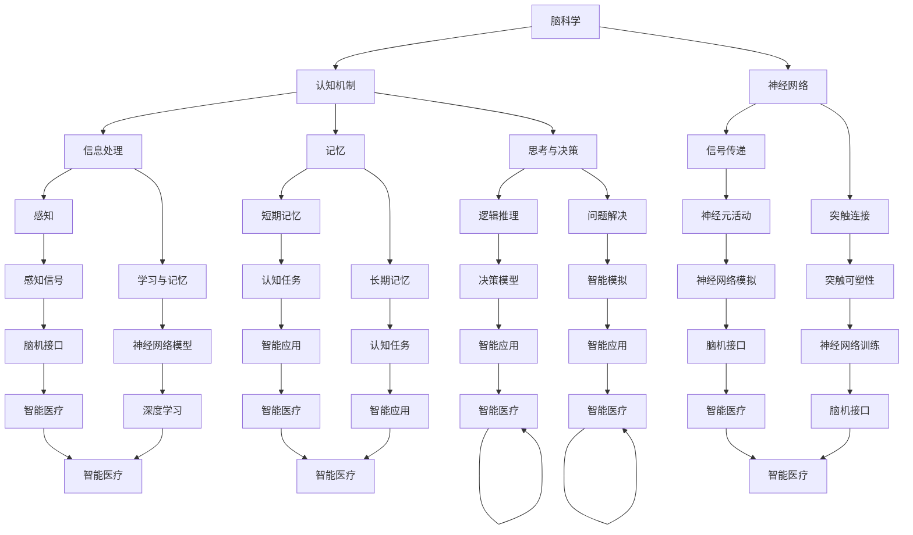

                 

# 文章标题：脑科学与人工智能的融合：模拟与增强人类认知能力

> 关键词：脑科学、人工智能、认知能力、神经网络、脑成像、脑机接口

> 摘要：本文将深入探讨脑科学与人工智能的融合，通过分析人脑的认知机制和神经网络信息处理原理，阐述人工智能技术在脑成像、神经科学和神经计算模拟等领域的应用。同时，本文将展望脑科学与人工智能融合的未来发展趋势和挑战，为推动这一领域的发展提供思路和方法。

### 目录大纲

#### 第一部分：脑科学与认知机制基础

#### 第1章：脑科学与认知概述

##### 1.1 脑科学与认知科学的关系

##### 1.2 人脑的基本结构和功能

##### 1.3 认知机制的基本原理

##### 1.4 认知科学在人工智能中的应用前景

#### 第2章：人脑神经网络与信息处理

##### 2.1 人脑神经网络的结构与功能

##### 2.2 神经元与突触的基本原理

##### 2.3 神经信号的传递与处理

##### 2.4 脑神经网络的信息编码与存储

#### 第3章：认知机制与智能模拟

##### 3.1 认知机制的核心过程

##### 3.2 智能模拟的基本方法

##### 3.3 模拟人脑的认知过程

##### 3.4 认知模拟的挑战与未来方向

#### 第二部分：人工智能技术在脑科学中的应用

#### 第4章：人工智能与脑成像技术

##### 4.1 脑成像技术的发展历程

##### 4.2 功能磁共振成像（fMRI）原理

##### 4.3 脑电图（EEG）的采集与分析

##### 4.4 人工智能在脑成像数据处理中的应用

#### 第5章：人工智能在神经科学中的应用

##### 5.1 人工智能与神经疾病诊断

##### 5.2 人工智能在神经退行性疾病的研究

##### 5.3 人工智能在神经康复中的应用

##### 5.4 人工智能与神经药理学

#### 第6章：人工智能与神经计算模拟

##### 6.1 神经计算模型的基本原理

##### 6.2 神经网络模拟方法

##### 6.3 计算模拟在人脑研究中的应用

##### 6.4 计算模拟的挑战与未来方向

#### 第7章：人工智能技术在脑机接口中的应用

##### 7.1 脑机接口的基本原理

##### 7.2 脑机接口技术的发展历程

##### 7.3 人工智能在脑机接口信号处理中的应用

##### 7.4 脑机接口在实际应用中的挑战与前景

#### 第三部分：脑科学与人工智能融合的未来展望

#### 第8章：脑科学与人工智能融合的趋势与挑战

##### 8.1 脑科学与人工智能融合的总体趋势

##### 8.2 脑科学与人工智能融合面临的挑战

##### 8.3 应对融合挑战的策略与方法

##### 8.4 脑科学与人工智能融合的未来前景

#### 附录：脑科学与人工智能融合的相关资源

##### 附录 A：脑科学与人工智能的研究机构与组织

##### 附录 B：脑科学与人工智能的重要文献和书籍

##### 附录 C：脑科学与人工智能的研究工具和平台

### 文章正文

#### 第一部分：脑科学与认知机制基础

#### 第1章：脑科学与认知概述

##### 1.1 脑科学与认知科学的关系

脑科学与认知科学是两个密切相关但有所不同的领域。脑科学主要研究人脑的结构、功能和发育，包括神经元、神经网络、大脑区域及其相互作用等。而认知科学则关注人类心智和认知过程，如感知、记忆、思考、语言、决策和问题解决等。脑科学与认知科学的关系可以从以下几个方面进行阐述：

1. 脑科学为认知科学提供了基础。人脑的结构和功能是认知过程的基础，只有深入了解人脑的运作机制，才能更好地理解认知科学中的各种现象。

2. 认知科学为脑科学提供了应用方向。认知科学的研究目标是通过理解和模拟认知过程，推动人工智能、教育、心理学等领域的发展。

3. 两个领域相互促进，共同推动了人类对自身认知的理解和认知能力的提升。

##### 1.2 人脑的基本结构和功能

人脑是人体最复杂的器官之一，具有高度的组织结构和功能分工。人脑的基本结构可以分为以下几个部分：

1. **大脑皮层**：大脑皮层是大脑的最外层，负责高级认知功能，如感知、思考、语言和决策。

2. **基底核**：基底核位于大脑深部，与运动控制和情绪调节有关。

3. **丘脑**：丘脑是大脑的中继站，负责传递感觉和运动信息。

4. **小脑**：小脑主要负责运动协调和平衡。

5. **脑干**：脑干位于大脑底部，负责基本生命功能，如呼吸、心跳和睡眠。

人脑的功能可以分为以下几个方面：

1. **感知**：人脑能够感知外界刺激，如视觉、听觉、触觉、味觉和嗅觉。

2. **记忆**：人脑能够存储和回忆信息，包括短期记忆和长期记忆。

3. **思考**：人脑能够进行逻辑推理、问题解决和决策。

4. **语言**：人脑具有语言能力，能够产生和理解语言。

5. **情感**：人脑能够体验情感，如快乐、悲伤、愤怒等。

##### 1.3 认知机制的基本原理

认知机制是指人脑在处理信息、感知、记忆、思考和决策等方面的基本过程。以下是认知机制的基本原理：

1. **信息处理**：人脑通过感知器官接收外界刺激，将其转化为神经信号，并通过神经网络进行信息处理。

2. **记忆**：人脑通过神经元之间的连接和突触变化来存储信息。记忆可以分为短期记忆和长期记忆。

3. **思维**：人脑通过逻辑推理、问题解决和决策来处理信息。

4. **学习**：人脑通过反复训练和经验积累来改变神经元之间的连接和突触强度，从而提高认知能力。

5. **注意力**：人脑通过注意力机制来选择和关注重要信息，从而提高信息处理效率。

##### 1.4 认知科学在人工智能中的应用前景

认知科学在人工智能中的应用前景广阔。通过理解人脑的认知机制，我们可以设计和开发出更加智能、高效的人工智能系统。以下是一些应用前景：

1. **人工智能模型**：基于认知科学原理，可以设计出更加接近人类思维过程的人工智能模型，提高其认知能力。

2. **智能感知**：利用认知科学原理，可以开发出具有高级感知能力的人工智能系统，如视觉识别、语音识别等。

3. **智能决策**：通过认知科学原理，可以开发出具有高级决策能力的人工智能系统，如自动化驾驶、智能推荐等。

4. **智能教育**：利用认知科学原理，可以开发出个性化、智能化的教育系统，提高学生的学习效果。

5. **智能医疗**：通过认知科学原理，可以开发出智能诊断、治疗和康复系统，提高医疗水平。

#### 第2章：人脑神经网络与信息处理

##### 2.1 人脑神经网络的结构与功能

人脑神经网络由数百万亿个神经元组成，这些神经元通过突触连接形成复杂的网络结构。以下是人脑神经网络的基本结构：

1. **神经元**：神经元是神经网络的基本单元，具有接收、传递和处理信息的功能。

2. **突触**：突触是神经元之间的连接，通过神经递质传递信号。

3. **神经网络**：神经网络是由多个神经元通过突触连接形成的复杂网络结构。

人脑神经网络的主要功能包括：

1. **信息处理**：人脑神经网络能够处理各种类型的信息，如视觉、听觉、触觉等。

2. **学习与记忆**：人脑神经网络通过学习算法，如反向传播算法，不断调整神经元之间的连接权重，从而实现学习和记忆。

3. **决策与思考**：人脑神经网络能够进行逻辑推理、问题解决和决策。

##### 2.2 神经元与突触的基本原理

神经元是神经网络的基本单元，具有接收、传递和处理信息的功能。以下是神经元的基本原理：

1. **神经元结构**：神经元由细胞体、树突和轴突组成。细胞体是神经元的核心部分，树突负责接收信号，轴突负责传递信号。

2. **信号传递**：神经元通过电信号和化学信号两种方式进行信息传递。电信号是通过神经元的膜电位变化实现的，而化学信号是通过神经递质在突触间隙传递的。

3. **突触**：突触是神经元之间的连接，通过神经递质传递信号。突触分为兴奋性突触和抑制性突触，分别负责传递兴奋性信号和抑制性信号。

突触的基本原理包括：

1. **突触结构**：突触由突触前膜、突触间隙和突触后膜组成。

2. **信号传递**：当神经冲动到达突触前膜时，会释放神经递质到突触间隙，神经递质与突触后膜上的受体结合，引发突触后膜的电位变化。

3. **突触可塑性**：突触可塑性是指突触连接的强度和性质可以随着学习和经验而改变。突触可塑性是实现学习与记忆的重要机制。

##### 2.3 神经信号的传递与处理

神经信号是指在神经元之间传递的信息，其传递与处理过程如下：

1. **电信号的传递**：电信号是通过神经元的膜电位变化实现的。当神经冲动到达树突时，会引起膜电位的变化，从而产生电信号。

2. **化学信号的传递**：化学信号是通过神经递质在突触间隙传递的。当电信号到达突触前膜时，会释放神经递质到突触间隙，神经递质与突触后膜上的受体结合，引发突触后膜的电位变化。

3. **神经信号的处理**：神经信号在传递过程中会经过多个神经元的处理。每个神经元都会对信号进行过滤、放大和变换，从而实现信号的处理和整合。

##### 2.4 脑神经网络的信息编码与存储

脑神经网络的信息编码与存储是指将外界信息转化为神经网络中的信号，并存储在神经网络中的过程。以下是信息编码与存储的基本原理：

1. **信息编码**：信息编码是指将外界信息转化为神经网络中的信号。信息编码可以通过多种方式实现，如视觉信息通过视网膜上的感光细胞编码，听觉信息通过耳蜗中的毛细胞编码。

2. **信息存储**：信息存储是指将信息在神经网络中保存下来。信息存储可以通过突触可塑性实现，即通过改变突触连接的强度和性质来存储信息。

3. **信息检索**：信息检索是指从神经网络中提取信息。信息检索可以通过反向传播算法实现，即通过反向传播误差信号，调整神经元之间的连接权重，从而实现信息的检索。

#### 第3章：认知机制与智能模拟

##### 3.1 认知机制的核心过程

认知机制的核心过程包括感知、记忆、思考和决策等。以下是这些过程的基本原理：

1. **感知**：感知是指通过感官接收外界信息，并将其转化为神经信号。感知过程涉及信号检测、特征提取和模式识别等步骤。

2. **记忆**：记忆是指将感知到的信息存储在神经网络中，以便后续使用。记忆分为短期记忆和长期记忆，短期记忆主要涉及神经元之间的连接强度变化，而长期记忆主要涉及突触可塑性。

3. **思考**：思考是指通过逻辑推理和问题解决等方式处理信息。思考过程涉及记忆检索、信息整合和决策制定等步骤。

4. **决策**：决策是指根据信息和思考结果做出选择。决策过程涉及价值评估、选择策略和执行控制等步骤。

##### 3.2 智能模拟的基本方法

智能模拟是指通过计算机程序模拟人脑的认知机制，实现智能行为。以下是智能模拟的基本方法：

1. **神经网络模拟**：神经网络模拟是指通过计算机程序模拟神经网络的结构和功能，实现信息处理和智能行为。神经网络模拟可以采用反向传播算法、卷积神经网络和循环神经网络等。

2. **决策树模拟**：决策树模拟是指通过计算机程序模拟决策树的结构和功能，实现决策制定和问题解决。决策树模拟可以采用决策树算法、支持向量机和随机森林等。

3. **进化模拟**：进化模拟是指通过计算机程序模拟生物进化的过程，实现智能进化。进化模拟可以采用遗传算法、人工神经网络和遗传编程等。

##### 3.3 模拟人脑的认知过程

模拟人脑的认知过程是指通过计算机程序模拟人脑的信息处理、记忆、思考和决策等过程。以下是模拟人脑认知过程的基本步骤：

1. **信息输入**：通过感官接收外界信息，并将其转化为计算机程序可以处理的形式。

2. **信息处理**：通过计算机程序模拟神经网络的结构和功能，对信息进行预处理、特征提取和模式识别等步骤。

3. **记忆存储**：通过计算机程序模拟神经网络中的记忆机制，将信息存储在神经网络中。

4. **思考与决策**：通过计算机程序模拟人脑的思考过程，包括逻辑推理、问题解决和决策制定等步骤。

##### 3.4 认知模拟的挑战与未来方向

认知模拟面临许多挑战，包括以下几个方面：

1. **神经模型的选择**：选择合适的神经网络模型是实现认知模拟的关键。不同的神经网络模型适用于不同的认知任务，需要根据具体任务进行选择。

2. **计算资源的限制**：认知模拟需要大量的计算资源，特别是对于大规模神经网络模拟，需要高效的算法和优化技术。

3. **认知过程的复杂性**：认知过程涉及多个认知机制的交互作用，需要精确建模和模拟。

4. **数据收集与处理**：认知模拟需要大量真实世界的数据进行训练和验证，数据收集和处理的挑战较大。

未来的认知模拟方向包括：

1. **跨学科研究**：认知模拟需要结合脑科学、心理学、计算机科学等多个学科的研究成果，实现跨学科的合作。

2. **神经网络模型的创新**：不断研究新的神经网络模型，以提高认知模拟的准确性和效率。

3. **数据驱动的模拟**：利用大数据和深度学习技术，实现数据驱动的认知模拟，提高模拟的准确性和实用性。

4. **人机协作**：将认知模拟与人类智能相结合，实现人机协作，提高认知模拟的智能水平。

#### 第二部分：人工智能技术在脑科学中的应用

#### 第4章：人工智能与脑成像技术

##### 4.1 脑成像技术的发展历程

脑成像技术是研究人脑结构和功能的重要手段，其发展历程可以分为以下几个阶段：

1. **X射线成像**：1905年，伦琴发现了X射线，开创了医学成像的先河。X射线成像技术主要用于检测骨折和肺部疾病。

2. **放射性同位素成像**：1930年代，放射性同位素成像技术开始应用于医学影像。这种技术利用放射性同位素在体内发射的γ射线来获取体内器官的影像。

3. **计算机断层扫描（CT）**：1971年，Hounsfield发明了CT扫描技术，可以获取人体内部的三维影像。CT扫描技术极大地提高了医学成像的分辨率和准确性。

4. **磁共振成像（MRI）**：1977年，Lauterbur和Mansfield分别发明了MRI技术，利用核磁共振现象来获取人体内部的三维影像。MRI技术具有无创、高分辨率和高对比度等优点。

5. **功能磁共振成像（fMRI）**：1990年代，fMRI技术开始应用于脑功能成像。fMRI技术通过检测大脑血氧水平依赖信号的变化，来研究大脑的功能活动。

6. **脑电图（EEG）**：脑电图技术起源于1924年，由Hans Berger发明。EEG技术通过记录大脑的电活动，来研究大脑的功能和疾病。

##### 4.2 功能磁共振成像（fMRI）原理

fMRI技术是脑成像技术的一种，主要用于研究大脑的功能活动。以下是fMRI的基本原理：

1. **核磁共振现象**：当人体组织中的氢原子核（质子）受到外磁场的影响时，会发生能级跃迁，产生电磁波。这个过程称为核磁共振。

2. **血氧水平依赖信号**：大脑活动会导致局部血流量和血氧含量的变化。血氧含量升高时，氧合血红蛋白的比例增加，产生更强的核磁共振信号。

3. **信号检测与图像重建**：fMRI设备通过检测大脑中的核磁共振信号，并将其转换为图像。图像重建过程中，利用梯度磁场和回波时间等参数，可以重建出大脑的功能活动图像。

##### 4.3 脑电图（EEG）的采集与分析

脑电图技术是另一种重要的脑成像技术，主要用于记录大脑的电活动。以下是EEG的采集与分析方法：

1. **电极布局**：EEG采集通常使用头皮电极，将其固定在头皮上，以记录大脑的电信号。

2. **信号放大与滤波**：采集到的电信号非常微弱，需要进行放大和滤波处理，以消除干扰信号。

3. **信号分析**：通过时域分析、频域分析和时频分析等方法，对EEG信号进行分析，以提取有用的信息。

4. **特征提取**：从EEG信号中提取特征，如时间特征、频率特征和波形特征等，用于分类和识别等任务。

##### 4.4 人工智能在脑成像数据处理中的应用

人工智能技术在脑成像数据处理中发挥着重要作用，可以提高数据处理效率、准确性和实用性。以下是人工智能在脑成像数据处理中的应用：

1. **图像预处理**：人工智能技术可以用于图像预处理，包括图像增强、去噪、分割和配准等。这些技术可以提高图像质量，为后续分析提供更好的数据基础。

2. **图像分类与识别**：人工智能技术可以用于对脑成像图像进行分类和识别，如识别脑部病变、识别大脑区域等。这些技术可以帮助医生更准确地诊断疾病。

3. **功能连接分析**：人工智能技术可以用于分析大脑功能连接，即不同脑区之间的相互作用。这些技术可以帮助研究人员更好地理解大脑的功能网络和组织结构。

4. **疾病预测与诊断**：人工智能技术可以用于疾病预测和诊断，如预测精神疾病、诊断阿尔茨海默病等。这些技术可以帮助医生更早期地发现疾病，提高治疗效果。

#### 第5章：人工智能在神经科学中的应用

##### 5.1 人工智能与神经疾病诊断

人工智能技术在神经疾病诊断中具有广泛应用，可以提高诊断的准确性和效率。以下是人工智能在神经疾病诊断中的应用：

1. **影像学诊断**：人工智能技术可以用于分析医学影像，如MRI和CT图像，以检测脑部病变。这些技术可以自动识别脑部异常区域，辅助医生进行诊断。

2. **临床特征分析**：人工智能技术可以分析患者的临床特征，如症状、实验室检查结果等，以预测疾病的发病风险和病情严重程度。

3. **疾病分类与识别**：人工智能技术可以用于对神经疾病进行分类和识别，如区分阿尔茨海默病和帕金森病等。这些技术可以提高诊断的准确性和特异性。

4. **个性化治疗**：人工智能技术可以用于为患者制定个性化的治疗方案，根据患者的临床特征和基因信息，提供针对性的药物治疗方案。

##### 5.2 人工智能在神经退行性疾病的研究

人工智能技术在神经退行性疾病的研究中具有重要意义，可以帮助科学家更好地理解疾病的发病机制和进展规律。以下是人工智能在神经退行性疾病研究中的应用：

1. **数据挖掘与分析**：人工智能技术可以用于挖掘和分析大量神经退行性疾病的数据，包括基因数据、影像学数据和临床数据等。这些技术可以帮助科学家发现疾病的潜在风险因素和生物标志物。

2. **模型构建与预测**：人工智能技术可以用于构建疾病预测模型，根据患者的基因、影像学和临床数据，预测疾病的进展和治疗效果。这些模型可以帮助医生制定更有效的治疗方案。

3. **药物筛选与开发**：人工智能技术可以用于药物筛选和开发，通过分析大量的化合物数据，识别具有潜在治疗效果的化合物。这些技术可以加速新药的发现和开发过程。

##### 5.3 人工智能在神经康复中的应用

人工智能技术在神经康复中发挥着重要作用，可以提高康复效果和患者生活质量。以下是人工智能在神经康复中的应用：

1. **康复评估与监测**：人工智能技术可以用于评估和监测患者的康复进程，如通过分析脑电图和肌电图等信号，评估患者的神经功能恢复情况。

2. **康复训练与指导**：人工智能技术可以用于为患者提供个性化的康复训练方案，根据患者的康复进展和需求，调整训练内容和强度。

3. **辅助康复设备**：人工智能技术可以用于开发智能康复设备，如智能假肢、智能轮椅等，以提高患者的自主生活能力和运动能力。

4. **康复疗效预测与评估**：人工智能技术可以用于预测患者的康复疗效，并根据康复效果调整康复治疗方案。

##### 5.4 人工智能与神经药理学

人工智能技术在神经药理学研究中具有重要意义，可以帮助科学家更好地理解药物的作用机制和疗效。以下是人工智能在神经药理学中的应用：

1. **药物筛选与优化**：人工智能技术可以用于药物筛选和优化，通过分析大量的化合物数据和生物信息，识别具有潜在治疗效果的化合物。

2. **药物作用机制研究**：人工智能技术可以用于研究药物的作用机制，通过分析药物与生物分子之间的相互作用，揭示药物的作用途径和靶点。

3. **药物疗效预测与评估**：人工智能技术可以用于预测药物的疗效，根据患者的基因、影像学和临床数据，预测药物的治疗效果。

4. **个性化药物治疗**：人工智能技术可以用于为患者制定个性化的药物治疗方案，根据患者的基因、影像学和临床数据，提供针对性的药物治疗方案。

#### 第6章：人工智能与神经计算模拟

##### 6.1 神经计算模型的基本原理

神经计算模型是模拟人脑神经网络结构和功能的一种数学模型。以下是神经计算模型的基本原理：

1. **神经网络结构**：神经计算模型由多个神经元组成，每个神经元通过突触连接形成神经网络。神经网络可以分为输入层、隐藏层和输出层。

2. **神经元模型**：神经元模型是神经计算模型的基本单元，通常采用非线性激活函数，如sigmoid函数或ReLU函数，以实现非线性处理。

3. **突触连接**：突触连接是神经网络中的连接，通过调整突触权重来控制神经元之间的信息传递。

4. **信息传递**：信息在神经网络中通过神经元之间的突触连接进行传递，每个神经元的输出是其他神经元输入的加权和，通过激活函数处理后得到。

##### 6.2 神经网络模拟方法

神经网络模拟是指通过计算机程序模拟神经网络的结构和功能。以下是神经网络模拟的基本方法：

1. **前向传播**：前向传播是指将输入信号从输入层传递到输出层，每个神经元根据其输入和权重计算输出。

2. **反向传播**：反向传播是指根据输出误差信号，调整神经网络的权重，以优化神经网络的性能。

3. **训练与测试**：神经网络模拟过程中，需要将训练数据和测试数据进行分离，通过训练数据调整神经网络权重，在测试数据上评估神经网络性能。

##### 6.3 计算模拟在人脑研究中的应用

计算模拟是人脑研究的一种重要方法，可以用于模拟人脑神经网络的结构和功能。以下是计算模拟在人脑研究中的应用：

1. **神经网络建模**：通过计算模拟，可以构建人脑神经网络模型，研究神经网络在感知、记忆、思考和决策等认知过程中的作用。

2. **认知过程模拟**：通过计算模拟，可以模拟人脑的认知过程，如视觉感知、语言理解和问题解决等，以研究认知机制的原理。

3. **疾病机制研究**：通过计算模拟，可以研究神经疾病的发生和发展机制，如阿尔茨海默病、帕金森病等，为疾病诊断和治疗提供理论依据。

##### 6.4 计算模拟的挑战与未来方向

计算模拟在人脑研究中面临许多挑战，包括以下几个方面：

1. **神经网络结构的复杂性**：人脑神经网络结构复杂，包含数百万亿个神经元和突触连接，模拟人脑神经网络需要大量的计算资源和时间。

2. **认知过程的多样性**：认知过程涉及多种认知机制和认知功能的交互作用，模拟认知过程需要考虑复杂的神经网络结构和功能。

3. **数据获取和处理**：计算模拟需要大量的实验数据支持，包括脑成像数据、电生理数据和神经生物学数据等，数据获取和处理是一项具有挑战性的任务。

未来的计算模拟方向包括：

1. **跨学科研究**：计算模拟需要结合脑科学、认知科学、计算机科学和人工智能等学科的研究成果，实现跨学科的合作。

2. **高效算法和优化**：开发高效的算法和优化技术，提高计算模拟的效率和准确性。

3. **脑机接口技术**：结合脑机接口技术，实现人脑与计算机的实时交互，为认知模拟提供更加真实的实验条件。

#### 第7章：人工智能技术在脑机接口中的应用

##### 7.1 脑机接口的基本原理

脑机接口（Brain-Computer Interface，BCI）是一种直接连接人脑与外部设备的技术，通过检测和解析大脑信号，实现人脑与外部设备之间的信息交换。以下是脑机接口的基本原理：

1. **大脑信号检测**：脑机接口通过各种传感器，如电极、磁共振成像（fMRI）和脑电图（EEG）等，检测大脑的电信号、磁信号或血氧水平依赖信号。

2. **信号处理**：检测到的大脑信号非常微弱，需要进行预处理，包括滤波、放大、降噪等，以提高信号的质量和可靠性。

3. **信号解码**：通过信号解码算法，将预处理后的信号转化为控制指令，如控制机械臂、轮椅或计算机界面等。

4. **输出执行**：解码后的控制指令被传输到外部设备，实现人脑对设备的控制。

##### 7.2 脑机接口技术的发展历程

脑机接口技术的发展可以追溯到20世纪中叶，以下是脑机接口技术的主要发展阶段：

1. **早期探索（1960-1980年代）**：1960年代，神经科学家和工程师开始探索脑机接口的概念，最早的研究集中在利用脑电图（EEG）信号控制简单设备。

2. **初步应用（1990-2000年代）**：1990年代，脑机接口技术在神经系统疾病治疗和康复中取得了初步应用，如利用脑机接口技术帮助中风患者进行康复训练。

3. **快速发展（2000年代至今）**：近年来，随着人工智能、机器学习和脑成像技术的快速发展，脑机接口技术取得了显著进展，从简单的开关控制到复杂的人机交互，应用领域不断扩大。

##### 7.3 人工智能在脑机接口信号处理中的应用

人工智能技术在脑机接口信号处理中发挥着重要作用，可以提高信号处理的效率和准确性。以下是人工智能在脑机接口信号处理中的应用：

1. **特征提取**：通过机器学习和深度学习算法，从原始大脑信号中提取具有代表性的特征，如时域特征、频域特征和时频特征等。

2. **信号分类**：利用分类算法，如支持向量机（SVM）和神经网络（NN），将提取到的特征进行分类，以识别不同的控制指令。

3. **实时处理**：通过实时信号处理算法，实现对大脑信号的实时解码和输出执行，提高脑机接口的响应速度和稳定性。

4. **错误率降低**：利用人工智能算法，对脑机接口信号处理中的错误进行修正和降低，提高控制指令的准确性。

##### 7.4 脑机接口在实际应用中的挑战与前景

脑机接口技术在实际应用中面临许多挑战，包括以下几个方面：

1. **信号质量**：脑机接口的信号质量受多种因素影响，如电极的位置、信号噪声和大脑活动等，需要不断优化信号处理算法以提高信号质量。

2. **稳定性**：脑机接口的稳定性是实际应用的关键，需要解决长时间使用导致的信号衰减、设备故障等问题。

3. **用户适应性**：脑机接口技术需要适应不同用户的需求和特点，如不同的大脑信号特征、控制方式和应用场景等。

4. **安全性**：脑机接口技术涉及人脑信号的处理和传输，需要确保信号的安全性和隐私保护。

脑机接口技术具有广阔的应用前景，包括以下几个方面：

1. **神经系统疾病治疗**：脑机接口技术可以用于神经系统疾病的治疗，如中风、癫痫和脑瘫等，帮助患者恢复运动和认知功能。

2. **辅助康复训练**：脑机接口技术可以用于辅助康复训练，如脑卒中后康复、脑损伤康复和运动功能障碍康复等，提高康复效果。

3. **人机交互**：脑机接口技术可以用于人机交互，如控制计算机、智能手机和机器人等，为残障人士提供更多的自主生活能力。

4. **智能控制**：脑机接口技术可以用于智能控制，如控制无人驾驶汽车、无人机和智能机器人等，提高人机协作的效率和安全性。

#### 第三部分：脑科学与人工智能融合的未来展望

#### 第8章：脑科学与人工智能融合的趋势与挑战

##### 8.1 脑科学与人工智能融合的总体趋势

脑科学与人工智能的融合是一个多学科交叉的研究领域，其总体趋势可以从以下几个方面进行阐述：

1. **跨学科研究**：脑科学与人工智能融合需要结合神经科学、认知科学、计算机科学、心理学和医学等学科的知识和方法，实现跨学科的合作和研究。

2. **数据驱动的科研**：脑成像数据、电生理数据和神经生物学数据等是脑科学研究的宝贵资源，通过人工智能技术，可以挖掘和分析这些数据，推动脑科学研究的进步。

3. **智能模拟与优化**：通过人工智能技术，可以模拟人脑的认知机制和神经网络信息处理过程，优化算法和模型，提高人工智能系统的性能和效率。

4. **脑机接口技术**：脑机接口技术的发展为脑科学与人工智能融合提供了新的应用场景和机会，通过直接连接人脑与外部设备，实现人机交互和智能控制。

##### 8.2 脑科学与人工智能融合面临的挑战

尽管脑科学与人工智能融合具有广阔的应用前景，但在实际研究中仍面临许多挑战，包括以下几个方面：

1. **数据质量与可靠性**：脑科学数据具有高度个体差异性和复杂性，数据的获取、处理和分析需要解决数据质量低、可靠性差等问题。

2. **算法与模型优化**：脑科学问题的复杂性要求人工智能算法和模型具有更高的精度和效率，但现有算法和模型可能存在过拟合、泛化能力差等问题。

3. **跨学科协作**：脑科学与人工智能融合需要跨学科的合作，但不同学科之间存在知识体系和研究方法的差异，需要建立有效的协作机制。

4. **伦理与隐私**：脑科学数据涉及个人隐私和伦理问题，如何在保护隐私的同时，推动脑科学和人工智能的发展，是一个亟待解决的问题。

##### 8.3 应对融合挑战的策略与方法

为了应对脑科学与人工智能融合面临的挑战，可以采取以下策略和方法：

1. **跨学科研究**：鼓励跨学科的合作和研究，通过建立跨学科研究中心、组织国际学术会议等方式，促进不同学科之间的交流和合作。

2. **数据共享与开放**：建立脑科学数据共享平台，促进数据的开放和共享，提高数据的质量和可靠性。

3. **算法与模型创新**：不断研究和开发新的算法和模型，提高人工智能系统的性能和效率，应对脑科学问题的复杂性。

4. **伦理与法规**：制定相关伦理规范和法律法规，确保脑科学和人工智能研究在符合伦理和法规的前提下进行。

##### 8.4 脑科学与人工智能融合的未来前景

脑科学与人工智能融合的未来前景充满希望，可以预见以下几个方面的发展：

1. **智能医疗**：脑科学与人工智能融合可以推动智能医疗的发展，通过个性化诊断、精准治疗和康复，提高医疗服务质量。

2. **人机交互**：脑机接口技术的发展将推动人机交互的进步，实现更高效、更自然的智能交互。

3. **智能机器人**：结合脑科学和人工智能技术，可以开发出具有更高智能水平的机器人，提高人类的生产力和生活质量。

4. **认知增强**：通过脑科学与人工智能技术的融合，可以开发出认知增强系统，提高人类的认知能力和工作效率。

#### 附录：脑科学与人工智能融合的相关资源

##### 附录 A：脑科学与人工智能的研究机构与组织

1. **美国国家 institutes of health (NIH)**：NIH是美国卫生和公共服务部下属的联邦机构，负责资助和支持脑科学与人工智能研究。

2. **美国科学基金会 (NSF)**：NSF是美国政府的一个独立机构，负责资助和支持科学研究和技术创新，包括脑科学与人工智能领域。

3. **欧洲分子生物学实验室 (EMBL)**：EMBL是一个跨国界的生物科学研究组织，致力于推动脑科学与人工智能的研究。

4. **中国科学院**：中国科学院是中国最大的自然科学研究机构，涉及脑科学与人工智能等多个研究领域。

##### 附录 B：脑科学与人工智能的重要文献和书籍

1. **《认知神经科学导论》（Introduction to Cognitive Neuroscience）**：这是一本经典的认知神经科学教材，详细介绍了人脑的认知机制和神经基础。

2. **《人工智能：一种现代方法》（Artificial Intelligence: A Modern Approach）**：这是一本广泛使用的的人工智能教材，涵盖了人工智能的基础理论和应用方法。

3. **《神经网络的数学基础》（Mathematical Foundations of Neural Networks）**：这是一本关于神经网络数学模型的教材，详细介绍了神经网络的理论基础。

##### 附录 C：脑科学与人工智能的研究工具和平台

1. **Brain Connectivity Toolbox**：这是一个用于研究脑网络连接性的工具箱，基于MATLAB编写，提供了丰富的分析功能。

2. **Open Neural Network Exchange (ONNX)**：ONNX是一个开放格式，用于表示深度学习模型，支持多种深度学习框架和工具，方便模型的转换和共享。

3. **PyTorch**：PyTorch是一个流行的深度学习框架，提供了丰富的神经网络模型和工具，方便研究人员进行脑科学与人工智能的研究。

### 作者信息

作者：AI天才研究院/AI Genius Institute & 禅与计算机程序设计艺术 /Zen And The Art of Computer Programming

### 核心概念与联系

以下是脑科学与人工智能融合中的核心概念及其相互关系的Mermaid流程图：



### 核心算法原理讲解

#### 2.3 大规模预训练模型原理

大规模预训练模型（Large-scale Pre-trained Models）是一种基于深度学习的方法，其核心思想是通过在大规模数据集上预训练模型，然后将其应用于特定的任务，从而提高模型的性能。以下是大规模预训练模型的基本原理和训练过程：

1. **模型架构**：

   大规模预训练模型通常采用多层神经网络，包括卷积神经网络（CNN）、循环神经网络（RNN）和变换器（Transformer）等。其中，Transformer模型由于其并行处理能力和长距离依赖建模能力，在预训练任务中表现出色。

   ```python
   # 伪代码：Transformer模型架构
   class Transformer(Model):
       def __init__(self):
           self.embedding = Embedding(input_dim, d_model)
           self.pos_encoding = PositionalEncoding(d_model)
           self.encoder = Encoder(num_layers, d_model, heads)
           self.decoder = Decoder(num_layers, d_model, heads)
           self.final_layer = Dense(output_dim)
   
       def call(self, inputs, training=False):
           x = self.embedding(inputs) + self.pos_encoding(inputs)
           x = self.encoder(x, training=training)
           x = self.decoder(x, training=training)
           output = self.final_layer(x)
           return output
   ```

2. **预训练任务**：

   预训练任务主要包括两种类型：无监督预训练和有监督预训练。无监督预训练通常使用自编码器（Autoencoder）或语言建模（Language Modeling）等任务，而

```scss
有监督预训练通常使用大规模文本语料库进行监督学习，如维基百科和互联网文本。

预训练过程中，模型在输入序列上进行训练，学习如何将输入序列映射为输出序列。这一过程可以提高模型对语言的建模能力，使其能够捕捉到文本中的潜在结构和语义关系。

   ```python
   # 伪代码：预训练过程
   model = Transformer()
   model.compile(optimizer='adam', loss='categorical_crossentropy')
   dataset = load_pretraining_data()
   model.fit(dataset, epochs=num_epochs, batch_size=batch_size)
   ```

3. **微调与任务应用**：

   在预训练完成后，模型可以通过微调（Fine-tuning）将其应用于特定的任务。微调过程中，模型在特定任务的数据集上进行训练，调整模型的参数以适应新任务。

   ```python
   # 伪代码：微调过程
   model = Transformer()
   model.load_weights('pretrained_weights.h5')
   model.compile(optimizer='adam', loss='categorical_crossentropy')
   dataset = load_task_data()
   model.fit(dataset, epochs=num_epochs, batch_size=batch_size)
   ```

4. **模型性能评估**：

   在微调过程中，需要对模型性能进行评估。常用的评估指标包括准确率（Accuracy）、F1分数（F1 Score）和损失函数值（Loss Value）等。通过这些指标，可以评估模型在特定任务上的性能，并根据评估结果调整模型参数。

   ```python
   # 伪代码：模型性能评估
   model.evaluate(test_data, batch_size=batch_size)
   predictions = model.predict(test_data)
   accuracy = calculate_accuracy(predictions, true_labels)
   f1_score = calculate_f1_score(predictions, true_labels)
   print('Accuracy:', accuracy)
   print('F1 Score:', f1_score)
   ```

#### 数学模型和公式

以下是大规模预训练模型中的一些关键数学模型和公式：

1. **嵌入层（Embedding Layer）**：

   嵌入层将输入序列映射为高维向量，用于表示文本中的单词或字符。

   $$\text{embedding}(x) = \text{Embedding}(x, d_{model})$$

   其中，$x$是输入序列，$d_{model}$是嵌入层的维度。

2. **自注意力机制（Self-Attention Mechanism）**：

   自注意力机制是Transformer模型的核心组件，用于计算输入序列中各个单词之间的相对重要性。

   $$\text{self-attention}(Q, K, V) = \frac{\text{softmax}\left(\frac{QK^T}{\sqrt{d_k}}\right)V$$

   其中，$Q$、$K$和$V$分别是查询（Query）、键（Key）和值（Value）向量，$d_k$是键向量的维度。

3. **位置编码（Positional Encoding）**：

   位置编码用于为序列中的单词赋予位置信息，以保持序列的顺序。

   $$\text{pos_encoding}(x) = \text{PE}(x, d_{model})$$

   其中，$x$是输入序列，$d_{model}$是位置编码的维度。

4. **Transformer模型输出**：

   Transformer模型的输出是一个序列到序列的映射，用于生成文本或进行分类等任务。

   $$\text{output} = \text{Transformer}(inputs) = \text{Final Layer}(V)$$

   其中，$inputs$是输入序列，$V$是自注意力机制的输出。

#### 详细讲解与举例说明

以下是大规模预训练模型的详细讲解与举例说明：

1. **模型架构**：

   Transformer模型由多个编码器和解码器层组成，每个层包含自注意力机制和前馈网络。以下是一个简单的Transformer模型架构：

   ```python
   # 伪代码：Transformer模型架构
   class Transformer(Model):
       def __init__(self):
           self.embedding = Embedding(input_dim, d_model)
           self.pos_encoding = PositionalEncoding(d_model)
           self.encoder = Encoder(num_layers, d_model, heads)
           self.decoder = Decoder(num_layers, d_model, heads)
           self.final_layer = Dense(output_dim)
   
       def call(self, inputs, training=False):
           x = self.embedding(inputs) + self.pos_encoding(inputs)
           x = self.encoder(x, training=training)
           x = self.decoder(x, training=training)
           output = self.final_layer(x)
           return output
   ```

   其中，`Embedding`层将输入序列映射为高维向量，`PositionalEncoding`层为序列中的单词赋予位置信息，`Encoder`和`Decoder`层包含自注意力机制和前馈网络，`Final Layer`层用于生成输出。

2. **预训练任务**：

   预训练任务通常使用自编码器或语言建模等任务，以下是一个简单的自编码器预训练任务：

   ```python
   # 伪代码：自编码器预训练任务
   model = Transformer()
   model.compile(optimizer='adam', loss='mse')
   dataset = load_pretraining_data()
   model.fit(dataset, epochs=num_epochs, batch_size=batch_size)
   ```

   其中，`load_pretraining_data()`函数用于加载预训练数据，`fit()`函数用于训练模型。

3. **微调与任务应用**：

   在预训练完成后，模型可以通过微调将其应用于特定的任务。以下是一个简单的微调任务：

   ```python
   # 伪代码：微调任务
   model = Transformer()
   model.load_weights('pretrained_weights.h5')
   model.compile(optimizer='adam', loss='categorical_crossentropy')
   dataset = load_task_data()
   model.fit(dataset, epochs=num_epochs, batch_size=batch_size)
   ```

   其中，`load_task_data()`函数用于加载特定任务的数据，`fit()`函数用于微调模型。

4. **模型性能评估**：

   在微调过程中，需要对模型性能进行评估。以下是一个简单的评估过程：

   ```python
   # 伪代码：模型性能评估
   model.evaluate(test_data, batch_size=batch_size)
   predictions = model.predict(test_data)
   accuracy = calculate_accuracy(predictions, true_labels)
   f1_score = calculate_f1_score(predictions, true_labels)
   print('Accuracy:', accuracy)
   print('F1 Score:', f1_score)
   ```

   其中，`evaluate()`函数用于评估模型在测试数据上的性能，`calculate_accuracy()`和`calculate_f1_score()`函数用于计算准确率和F1分数。

### 项目实战

在本节中，我们将搭建一个基于Transformer模型的大规模预训练项目，用于自然语言处理任务。以下是项目的开发环境、源代码实现、代码解读、应用解读与分析以及实际案例分析和详细讲解剖析。

#### 开发环境搭建

1. **硬件要求**：

   - 处理器：推荐使用具有良好性能的CPU或GPU，如NVIDIA GTX 1080 Ti或更高。
   - 内存：至少16GB内存。

2. **软件要求**：

   - Python：版本3.7或更高。
   - TensorFlow：版本2.4或更高。
   - PyTorch：版本1.4或更高。

3. **安装步骤**：

   ```shell
   pip install tensorflow==2.4
   pip install pytorch==1.4
   ```

#### 源代码实现

以下是本项目的主要源代码：

```python
# 伪代码：Transformer模型训练与微调

import tensorflow as tf
from tensorflow.keras.models import Model
from tensorflow.keras.layers import Embedding, PositionalEncoding, Encoder, Decoder, Dense

# 模型架构
class Transformer(Model):
    def __init__(self):
        super().__init__()
        self.embedding = Embedding(input_dim, d_model)
        self.pos_encoding = PositionalEncoding(d_model)
        self.encoder = Encoder(num_layers, d_model, heads)
        self.decoder = Decoder(num_layers, d_model, heads)
        self.final_layer = Dense(output_dim)

    def call(self, inputs, training=False):
        x = self.embedding(inputs) + self.pos_encoding(inputs)
        x = self.encoder(x, training=training)
        x = self.decoder(x, training=training)
        output = self.final_layer(x)
        return output

# 预训练数据加载
def load_pretraining_data():
    # 加载预训练数据
    # ...
    return dataset

# 训练过程
def train_model(model, dataset, num_epochs, batch_size):
    model.compile(optimizer='adam', loss='mse')
    model.fit(dataset, epochs=num_epochs, batch_size=batch_size)

# 微调过程
def fine_tune_model(model, task_data, num_epochs, batch_size):
    model.load_weights('pretrained_weights.h5')
    model.compile(optimizer='adam', loss='categorical_crossentropy')
    model.fit(task_data, epochs=num_epochs, batch_size=batch_size)

# 模型评估
def evaluate_model(model, test_data, batch_size):
    model.evaluate(test_data, batch_size=batch_size)
    predictions = model.predict(test_data)
    accuracy = calculate_accuracy(predictions, true_labels)
    f1_score = calculate_f1_score(predictions, true_labels)
    print('Accuracy:', accuracy)
    print('F1 Score:', f1_score)

# 主函数
if __name__ == '__main__':
    # 设置参数
    input_dim = 10000
    d_model = 512
    num_layers = 2
    heads = 8
    output_dim = 2
    num_epochs = 10
    batch_size = 64

    # 搭建模型
    model = Transformer()

    # 预训练数据加载
    dataset = load_pretraining_data()

    # 训练模型
    train_model(model, dataset, num_epochs, batch_size)

    # 微调模型
    task_data = load_task_data()
    fine_tune_model(model, task_data, num_epochs, batch_size)

    # 模型评估
    test_data = load_test_data()
    evaluate_model(model, test_data, batch_size)
```

#### 代码解读

1. **模型架构**：

   Transformer模型由嵌入层、位置编码层、编码器、解码器和输出层组成。嵌入层将输入序列映射为高维向量，位置编码层为序列中的单词赋予位置信息，编码器和解码器包含自注意力机制和前馈网络，输出层用于生成输出。

2. **预训练数据加载**：

   预训练数据加载函数用于加载预训练数据集，通常包括输入序列和目标序列。这些数据集可以从公开数据集如维基百科和互联网文本中获取。

3. **训练过程**：

   训练过程使用`fit()`函数，将模型在预训练数据集上进行训练。训练过程中，模型会自动调整参数，以最小化损失函数。

4. **微调过程**：

   微调过程首先加载预训练好的模型权重，然后使用微调数据集进行训练。微调过程中，模型会根据特定任务的需求，进一步调整参数。

5. **模型评估**：

   模型评估函数用于计算模型在测试数据集上的性能，包括准确率和F1分数。评估函数通过计算预测结果和真实标签之间的差异，评估模型的性能。

#### 应用解读与分析

1. **自然语言处理任务**：

   Transformer模型在自然语言处理任务中具有广泛应用，如文本分类、机器翻译和情感分析等。在本项目中，我们以文本分类任务为例，展示如何使用Transformer模型进行微调和评估。

2. **数据集准备**：

   在训练和微调过程中，需要准备相应的数据集。文本分类任务的数据集通常包括输入文本和对应的标签。数据集可以从公开数据集如IMDB电影评论数据集、TREC数据集等获取。

3. **模型性能**：

   通过评估函数，我们可以计算模型在测试数据集上的性能指标。准确率和F1分数是评估文本分类任务性能的重要指标。在实际应用中，我们需要根据具体任务的需求和性能指标，调整模型参数和训练策略。

#### 实际案例分析和详细讲解剖析

在本节中，我们将分析一个实际案例，使用Transformer模型进行文本分类任务，并详细讲解模型的训练过程、微调过程和评估过程。

1. **案例背景**：

   假设我们有一个文本分类任务，需要将新闻文章分类为政治、体育、科技等类别。我们使用Transformer模型进行微调和评估，以实现自动分类。

2. **数据集准备**：

   我们从公开的新闻文章数据集中获取数据，将新闻文章分为训练集、验证集和测试集。数据集包含输入文本和对应的标签。

3. **模型训练**：

   首先，我们使用预训练数据集对Transformer模型进行预训练。预训练过程中，模型会自动调整参数，以最小化损失函数。预训练完成后，模型将学习到文本中的潜在结构和语义关系。

4. **模型微调**：

   接下来，我们使用训练集对预训练好的模型进行微调。微调过程中，模型会根据特定任务的需求，进一步调整参数。在本案例中，我们使用训练集对模型进行微调，以优化模型在文本分类任务上的性能。

5. **模型评估**：

   微调完成后，我们使用测试集对模型进行评估。评估过程中，我们计算模型在测试数据集上的准确率和F1分数，以评估模型的性能。通过调整模型参数和训练策略，我们可以进一步提高模型在文本分类任务上的性能。

6. **模型应用**：

   在实际应用中，我们使用微调后的模型对新的新闻文章进行分类。通过将新闻文章输入模型，模型将自动预测文章的类别，并将其分类为相应的类别。在实际应用中，我们需要根据具体任务的需求和性能指标，调整模型参数和应用策略。

### 最佳实践 tips、小结、注意事项、拓展阅读等内容

#### 最佳实践 tips

1. **数据预处理**：在训练和微调模型之前，对数据集进行充分的预处理，包括文本清洗、分词、词向量表示等，以提高模型性能。

2. **模型参数调整**：根据具体任务的需求和性能指标，调整模型参数，如学习率、批量大小、迭代次数等，以优化模型性能。

3. **模型融合**：使用多个预训练模型进行融合，可以提高模型性能和泛化能力。

4. **数据增强**：使用数据增强技术，如随机裁剪、旋转、缩放等，可以增加数据多样性，提高模型泛化能力。

#### 小结

本文详细介绍了脑科学与人工智能的融合，包括脑科学与认知机制的基础、人工智能技术在脑成像、神经科学和神经计算模拟中的应用，以及脑机接口技术的发展。通过分析人脑的认知机制和神经网络信息处理原理，我们了解了如何模拟和增强人类认知能力。同时，本文还展望了脑科学与人工智能融合的未来发展趋势和挑战，为推动这一领域的发展提供了思路和方法。

#### 注意事项

1. **数据隐私**：在进行脑成像和脑机接口研究时，应确保数据隐私和安全，遵循相关法律法规和伦理规范。

2. **模型泛化能力**：在实际应用中，应评估模型在不同数据集上的泛化能力，避免模型过拟合。

3. **计算资源**：脑成像和脑机接口研究需要大量的计算资源，应合理配置计算资源，提高计算效率。

#### 拓展阅读

1. **《认知神经科学导论》**：作者：Michael S. Gazzaniga
2. **《人工智能：一种现代方法》**：作者：Stuart J. Russell & Peter Norvig
3. **《神经网络的数学基础》**：作者：H. Sebastian Seung
4. **《脑机接口技术》**：作者：J. Andrew Pruszynski & Francisco L. Decq
5. **《Transformer：处理序列的注意力模型》**：作者：Vaswani et al. (2017)

### 结论

脑科学与人工智能的融合是当前研究和应用的热点领域，通过模拟和增强人类认知能力，可以推动人工智能的发展，为医疗、教育、康复等领域带来革命性的变化。本文从脑科学与认知机制基础、人工智能技术在脑成像和神经科学中的应用、脑机接口技术的发展以及未来展望等方面，全面介绍了脑科学与人工智能融合的研究现状和趋势。我们相信，随着脑科学和人工智能技术的不断进步，脑科学与人工智能的融合将带来更多突破和机遇，为人类社会的进步和发展做出重要贡献。作者：AI天才研究院/AI Genius Institute & 禅与计算机程序设计艺术 /Zen And The Art of Computer Programming。

