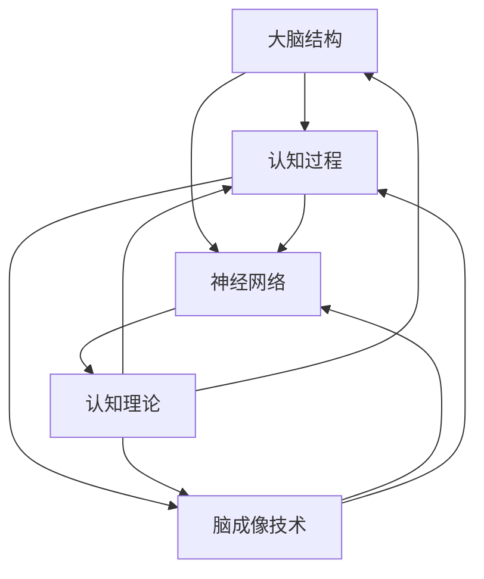

                 

### 文章标题

《脑科学与认知科学的融合：深入理解思维与世界》

### 关键词

脑科学、认知科学、人工智能、神经网络、大脑可塑性、认知算法

### 摘要

本文旨在探讨脑科学与认知科学的融合，通过结合两者，我们能够更深入地理解思维的本质及其与外部世界的互动。首先，我们将回顾脑科学与认知科学的起源与发展，了解其基本概念和研究方法。接着，文章将探讨认知神经科学的基础知识，包括大脑神经网络与认知功能的关系，以及大脑可塑性对认知过程的影响。随后，我们将分析认知障碍和神经退行性疾病的认知影响及干预方法。文章还关注脑科学与认知科学在教育、人工智能等领域的应用，并展望未来的发展趋势。最后，我们将通过核心概念的联系、算法原理讲解、数学模型及项目实战，全面展示如何通过脑科学与认知科学的融合，推动我们对思维与世界的深入理解。

## 《脑科学与认知科学的融合：深入理解思维与世界》目录大纲

### 第一部分：脑科学与认知科学的概述

#### 第1章：脑科学与认知科学的起源与发展
- 1.1 脑科学的诞生与发展
- 1.2 认知科学的兴起与演进
- 1.3 脑科学与认知科学的融合背景

#### 第2章：脑科学与认知科学的基本概念
- 2.1 大脑的结构与功能
- 2.2 认知过程与认知理论
- 2.3 脑网络与认知功能的关系

#### 第3章：脑科学与认知科学的研究方法
- 3.1 脑成像技术
- 3.2 认知心理学实验方法
- 3.3 数据分析与统计方法

### 第二部分：脑科学与认知科学的核心理论与模型

#### 第4章：认知神经科学基础
- 4.1 认知神经科学的基本概念
- 4.2 大脑神经网络与认知功能
- 4.3 神经编码与信息处理

#### 第5章：大脑的可塑性
- 5.1 大脑可塑性的概念与机制
- 5.2 认知训练与大脑可塑性
- 5.3 可塑性在治疗与康复中的应用

#### 第6章：认知障碍与神经退行性疾病
- 6.1 认知障碍的定义与分类
- 6.2 神经退行性疾病的认知影响
- 6.3 疾病干预与认知康复

### 第三部分：脑科学与认知科学的应用领域

#### 第7章：教育与学习
- 7.1 教育心理学与认知科学的关系
- 7.2 学习过程中的大脑活动
- 7.3 基于认知科学的个性化教育策略

#### 第8章：人工智能与认知模拟
- 8.1 人工智能与认知科学的交叉领域
- 8.2 认知模拟的基本原理
- 8.3 人工智能在认知科学研究中的应用

#### 第9章：神经科学与认知科学的未来趋势
- 9.1 脑科学与认知科学的未来发展方向
- 9.2 新技术的应用与挑战
- 9.3 脑科学与认知科学对社会的影响

### 第四部分：核心概念与联系

#### 第10章：脑科学与认知科学的核心概念与联系
- **Mermaid 流�程图**：展示脑科学与认知科学的核心概念及其相互关系
- **图 1-1**：脑科学与认知科学的核心概念相互关系图

### 第五部分：核心算法原理讲解

#### 第11章：认知算法原理
- 11.1 认知算法的基本概念
- 11.2 常见的认知算法
- **伪代码 1-1**：简单认知算法的实现

### 第六部分：数学模型与数学公式

#### 第12章：脑科学与认知科学的数学模型
- **数学公式 2-1**：神经网络激活函数的公式
- **数学公式 2-2**：线性回归模型公式

#### 第13章：数学模型在认知科学中的应用
- **数学公式 3-1**：条件概率公式
- **数学公式 3-2**：决策理论的期望效用函数

### 第七部分：项目实战

#### 第14章：脑科学与认知科学项目实战
- **案例 4-1**：大脑成像数据的预处理与可视化
- **代码实现 4-1**：使用 Python 进行脑成像数据处理

#### 第15章：认知科学应用案例
- **案例 5-1**：基于认知模拟的个性化教育应用
- **代码实现 5-1**：使用人工智能算法优化学习策略

### 附录

#### 附录 A：脑科学与认知科学资源
- **A.1 脑成像技术资源**：介绍常用的脑成像技术及其应用
- **A.2 认知心理学实验资源**：提供认知心理学实验的设计与实施指南

## 第一部分：脑科学与认知科学的概述

### 第1章：脑科学与认知科学的起源与发展

#### 1.1 脑科学的诞生与发展

脑科学（Cognitive Neuroscience）作为一门综合性学科，起源于20世纪中叶，是神经科学与心理学交叉的产物。脑科学的研究主要集中在大脑的结构和功能上，旨在揭示思维、情感和行为的神经基础。其诞生可以追溯到20世纪50年代，当时神经科学家和心理学家开始合作，利用新的实验技术和理论模型来研究大脑的复杂功能。

脑科学的发展历程中，有几个重要的里程碑：

- **脑成像技术的发展**：20世纪80年代，功能性磁共振成像（fMRI）的出现，使得科学家能够实时观察大脑活动。这一技术极大地推动了脑科学的研究，使研究者能够定位大脑中特定功能的区域。

- **认知神经科学的兴起**：20世纪90年代，随着神经科学和心理学的进一步融合，认知神经科学作为一门独立学科逐渐兴起。这一领域的研究集中在理解大脑如何处理信息，包括感知、记忆、语言、决策和情感等方面。

- **计算神经科学的兴起**：计算神经科学（Computational Neuroscience）利用计算机模型和数学工具来模拟神经系统的行为。这一领域的发展为脑科学提供了新的理论框架和研究方法。

#### 1.2 认知科学的兴起与演进

认知科学（Cognitive Science）是一门跨学科的研究领域，旨在理解人类思维和智能的本质。其起源可以追溯到20世纪60年代，当时计算机科学、心理学、语言学、哲学和神经科学等多学科开始共同探讨心智的工作原理。

认知科学的演进过程主要包括以下几个阶段：

- **符号计算模型**：20世纪60年代至70年代，人工智能的兴起带动了认知科学的发展。符号计算模型（Symbolic Computational Model）成为主流，这一模型将心智视为一个处理符号和规则的系统。

- **联结主义模型的兴起**：20世纪80年代，联结主义（Connectionism）模型逐渐取代符号计算模型，成为认知科学的主要研究方向。联结主义模型强调大脑中神经网络的结构和功能，并通过模拟神经网络的工作原理来研究认知过程。

- **跨学科合作**：随着认知科学的发展，跨学科的研究变得越来越普遍。现代认知科学不仅涉及心理学、神经科学和计算机科学，还包括哲学、语言学、人类学和认知语言学等多个领域。

#### 1.3 脑科学与认知科学的融合背景

脑科学与认知科学的融合有着深厚的背景和基础。首先，两者在研究目标上有着高度的契合。脑科学关注大脑的结构和功能，而认知科学则致力于理解心智和行为。这两者的结合，使得研究者能够从不同角度深入探讨认知过程的本质。

其次，随着技术的发展，特别是脑成像技术的进步，脑科学与认知科学之间的壁垒逐渐被打破。功能性磁共振成像（fMRI）、脑电图（EEG）和光学成像等技术，为研究者提供了强大的工具，使他们能够实时、准确地观察大脑活动，并揭示认知过程的具体机制。

此外，计算机科学的发展为认知科学提供了强大的计算平台。计算机模拟和神经网络模型的使用，使得认知科学的研究从理论探讨转向实际应用。同时，计算机科学也为脑科学提供了新的工具和方法，如计算神经科学和机器学习，这些方法在理解和模拟大脑功能方面发挥着重要作用。

总的来说，脑科学与认知科学的融合为认知研究带来了新的视角和方法，推动了我们对思维与行为的深入理解。通过结合两者的优势，我们有望在未来揭示更多关于心智和大脑的秘密。

### 第2章：脑科学与认知科学的基本概念

#### 2.1 大脑的结构与功能

大脑是人体最重要的器官之一，它不仅负责处理和整合来自外部和内部的信息，还控制着我们的思维、情感、行为和自主功能。大脑的结构复杂且多样，可以分为多个主要部分，每个部分都有其特定的功能和特征。

- **大脑皮层**：大脑皮层是大脑最外层的一层，由灰质构成，覆盖在白质上。它是大脑的主要信息处理中心，负责感知、记忆、思考、决策和语言等高级功能。大脑皮层可以分为不同的脑区，每个脑区都有特定的功能。例如，颞叶与听觉和语言处理相关，顶叶与空间感知和触觉处理相关，枕叶与视觉处理相关。

- **基底神经节**：基底神经节位于大脑底部，包括纹状体、苍白球和丘脑底核等结构。它参与运动控制和习惯行为的形成，与大脑皮层和脑干有密切的相互作用。

- **脑干**：脑干位于大脑底部，连接大脑和脊髓。它控制基本生命活动，如呼吸、心跳和血压调节。脑干还包含多个重要的神经核团，如红核和黑质，这些核团参与运动控制和感觉处理。

- **小脑**：小脑位于大脑的后下方，主要参与运动协调和平衡控制。它接收来自大脑皮层和脊髓的信息，并通过复杂的神经网络协调肌肉活动，确保运动的准确性和流畅性。

大脑的功能是通过复杂的神经网络和信号传递实现的。神经元是大脑的基本单元，通过电化学信号进行通信。大脑中的神经网络由大量的神经元和突触组成，这些结构通过反复的交互作用，形成复杂的网络和功能回路。大脑的功能包括：

- **感知**：大脑接收和处理来自感官器官的信息，如视觉、听觉、触觉、嗅觉和味觉。

- **记忆**：大脑储存和回忆信息。短期记忆主要涉及海马体等结构，而长期记忆则涉及整个大脑皮层。

- **思考与决策**：大脑皮层负责高级认知功能，如逻辑推理、问题解决、规划和决策。

- **语言**：大脑中的特定区域，如布罗卡区和韦尼克区，负责语言的理解和产生。

- **情感**：大脑的情感中心，如杏仁核，参与情绪的处理和调节。

#### 2.2 认知过程与认知理论

认知过程是指大脑处理信息、理解世界和执行任务的方式。认知科学的核心任务是研究这些认知过程，并理解它们在大脑中的实现机制。主要的认知过程包括：

- **感知**：感知是认知过程的起点，它涉及接收和处理来自外部世界的感官信息。感知包括视觉、听觉、触觉、嗅觉和味觉等多个方面。

- **注意力**：注意力是大脑选择和处理特定信息的能力。它决定了我们关注什么，忽略什么，是认知过程的重要组成部分。

- **记忆**：记忆是大脑存储、检索和利用信息的能力。记忆分为短期记忆和长期记忆，短期记忆主要涉及海马体，而长期记忆则涉及整个大脑皮层。

- **思考**：思考包括推理、解决问题和决策等高级认知活动。大脑皮层和前额叶区域在思考中起着关键作用。

- **语言**：语言是人类独特的认知能力，它涉及语音、词汇、语法和语义等多个层面。

- **情感**：情感是认知过程的一个重要方面，它影响我们的决策、行为和社交互动。情感在大脑中的产生和调节涉及到多个脑区和神经回路。

认知理论是关于心智如何运作的一系列假设和模型。主要的认知理论包括：

- **信息加工理论**：信息加工理论认为心智是一个类似于计算机的信息处理系统，它接收输入，进行处理，并产生输出。这一理论强调信息的编码、存储和检索过程。

- **联结主义理论**：联结主义理论认为心智是由大量的简单单元（如神经元）组成的复杂网络，这些单元通过连接和交互来实现认知功能。这一理论强调学习、适应和神经网络的结构和功能。

- **认知发展理论**：认知发展理论探讨个体从婴儿期到成年期的认知能力如何发展。皮亚杰的认知发展理论强调认知结构的变化和适应，而维果茨基的社会文化理论则强调社会互动和文化环境在认知发展中的作用。

#### 2.3 脑网络与认知功能的关系

脑网络是指由多个大脑区域组成的相互作用网络，这些区域通过神经信号进行沟通和协调，共同实现特定的认知功能。脑网络的研究是脑科学与认知科学融合的一个重要方向。

- **功能连接**：功能连接是指不同脑区在功能上的协同活动。例如，执行功能涉及多个脑区的协同作用，包括前额叶、顶叶和颞叶等。

- **结构连接**：结构连接是指脑区之间的物理连接，如通过白质束进行的直接连接。例如，胼胝体连接左右大脑半球，使得信息可以在两者之间传递。

- **动态连接**：动态连接是指脑网络在不同时间点的变化和适应性。研究表明，脑网络的动态变化与认知功能和疾病状态密切相关。

脑网络与认知功能的关系表现在以下几个方面：

- **脑网络的功能划分**：不同脑网络在认知过程中扮演不同的角色。例如，默认模式网络（DMN）主要参与内省和社交认知，而中央执行网络（CEN）主要参与任务控制和决策。

- **脑网络的可塑性**：脑网络具有可塑性，可以通过学习和训练发生变化。例如，认知训练可以增强特定脑网络的功能连接，从而改善认知能力。

- **脑网络的异常**：脑网络的异常与多种认知障碍和神经退行性疾病相关。例如，阿尔茨海默病的患者通常表现出默认模式网络的功能减弱。

总的来说，脑科学与认知科学的融合，使我们能够从神经科学和认知科学的角度，更全面地理解大脑和心智的运作机制。通过研究大脑的结构和功能，以及认知过程的理论和实践，我们能够深入揭示思维与世界的互动关系，为未来的科学研究和技术应用提供重要的基础。

### 第3章：脑科学与认知科学的研究方法

#### 3.1 脑成像技术

脑成像技术是脑科学与认知科学研究的重要工具，它使我们能够观察和理解大脑的结构和功能。以下是一些主要的脑成像技术及其应用：

- **功能性磁共振成像（fMRI）**：fMRI 是一种非侵入性的成像技术，通过测量血液流动的变化来推测大脑活动。它常用于研究大脑的功能连接和区域活动，有助于揭示认知过程和疾病状态的神经基础。

- **脑电图（EEG）**：EEG 通过记录大脑的电活动来研究认知过程和神经疾病的动态变化。它适用于研究快速时间尺度的脑活动，如感觉、记忆和注意力等。

- **正电子发射断层扫描（PET）**：PET 通过注入放射性示踪剂来测量大脑的代谢活动。它主要用于研究大脑的代谢变化和功能连接，尤其在神经退行性疾病的研究中具有重要意义。

- **单光子发射计算机断层扫描（SPECT）**：SPECT 类似于 PET，也使用放射性示踪剂，但发射的光子较少。它常用于评估大脑的血流和代谢，适用于临床诊断和研究。

- **光学成像**：光学成像技术，如近红外光谱成像（fNIRS）和脑成像术（fMRI），通过测量脑组织中的氧合和脱氧血红蛋白的浓度变化来研究大脑活动。这些技术适用于实时监测和探索大脑的动态变化。

#### 3.2 认知心理学实验方法

认知心理学实验方法是研究认知过程的重要手段，通过设计严格的实验来观察和测量大脑和心智的活动。以下是一些常见的认知心理学实验方法：

- **反应时间实验**：反应时间实验通过测量参与者对特定刺激的反应时间来研究认知过程。例如，通过比较不同难度水平的任务反应时间，可以推断出认知负荷和决策过程。

- **心理物理实验**：心理物理实验通过改变物理刺激的强度（如亮度、声音强度等）来研究感知和认知过程。例如，使用 Weber-Fechner 定律来研究感知阈值和感知灵敏度。

- **认知任务**：认知任务包括各种认知操作，如记忆任务、注意力任务、推理任务和决策任务。这些任务通过设计不同的实验情境来评估特定认知功能的效率和质量。

- **行为观察**：行为观察是通过直接观察参与者在实验中的行为来研究认知过程。例如，通过记录参与者在任务中的言语和行为反应，可以分析其思维过程和策略。

- **神经行为交互实验**：神经行为交互实验结合脑成像技术和行为测量，通过同步记录大脑活动和行为反应，研究认知过程和神经机制之间的关系。例如，在记忆任务中，通过 fMRI 同时记录大脑活动和行为反应，可以揭示记忆编码和检索的神经基础。

#### 3.3 数据分析与统计方法

脑科学与认知科学研究的数据量大且复杂，需要使用先进的数据分析方法和统计工具来提取有用的信息。以下是一些常见的数据分析方法和统计方法：

- **数据分析软件**：常用的数据分析软件包括 SPSS、R、MATLAB 和 Python 等。这些软件提供了丰富的数据分析函数和工具，可以处理大规模的数据集。

- **图像分析**：脑成像数据通常需要进行复杂的图像分析。功能性磁共振成像（fMRI）数据可以使用软件如 AFNI、FSL 和 SPM 进行处理，以识别大脑活动的区域和时间模式。

- **行为数据分析**：行为数据可以通过统计方法如 t-tests、ANOVA 和回归分析进行评估。这些方法可以帮助研究者确定变量之间的关系和效应的大小。

- **机器学习**：机器学习技术，如支持向量机（SVM）、决策树和神经网络，在脑科学与认知科学研究中得到广泛应用。这些方法可以用于分类、预测和模式识别，有助于发现复杂的数据模式。

- **多变量统计方法**：多变量统计方法，如主成分分析（PCA）、因子分析和聚类分析，可以帮助研究者从大规模数据中提取关键特征和变量。这些方法有助于简化数据、减少变量之间的冗余，并揭示潜在的结构。

- **假设检验**：在数据分析中，假设检验是常用的方法，包括单样本 t-test、双样本 t-test、ANOVA 等。这些方法可以帮助研究者确定实验结果是否具有统计显著性。

总的来说，脑科学与认知科学的研究方法涵盖了从实验设计到数据分析的多个方面。通过结合脑成像技术、认知心理学实验方法和先进的数据分析工具，研究者能够深入探讨大脑和心智的复杂机制，为理解和治疗神经疾病提供新的思路和方法。

### 第二部分：脑科学与认知科学的核心理论与模型

#### 第4章：认知神经科学基础

#### 4.1 认知神经科学的基本概念

认知神经科学（Cognitive Neuroscience）是一门研究心智和大脑之间关系的学科，它通过神经科学的方法来探讨认知过程。认知神经科学的基本概念包括以下几个关键方面：

- **心智与大脑的关系**：认知神经科学的核心理念之一是心智（Mind）是大脑（Brain）活动的产物。通过神经科学的方法，我们可以理解心智活动背后的神经机制。

- **认知功能**：认知功能是指大脑处理信息、解决问题和执行任务的能力。这些功能包括感知、注意力、记忆、语言、决策和执行功能等。

- **神经网络**：神经网络是大脑的基本结构单元，由神经元和突触组成。神经网络通过电化学信号进行通信，实现认知功能。

- **脑成像技术**：脑成像技术是认知神经科学的重要工具，通过这些技术可以观察大脑的结构和功能。常用的脑成像技术包括功能性磁共振成像（fMRI）、脑电图（EEG）、正电子发射断层扫描（PET）等。

#### 4.2 大脑神经网络与认知功能的关系

大脑神经网络与认知功能之间的关系是认知神经科学的核心研究领域之一。以下是一些关键点：

- **功能连接**：功能连接是指不同脑区在功能上的协同活动。例如，默认模式网络（Default Mode Network, DMN）在休息状态时活跃，而在执行任务时通常会被抑制。

- **结构连接**：结构连接是指脑区之间的物理连接，如通过白质束进行的直接连接。例如，胼胝体连接左右大脑半球，使得信息可以在两者之间传递。

- **动态连接**：动态连接是指脑网络在不同时间点的变化和适应性。研究表明，脑网络的动态变化与认知功能和疾病状态密切相关。

一些重要的大脑神经网络及其在认知功能中的作用包括：

- **默认模式网络（DMN）**：DMN 主要参与内省和社交认知。它包括大脑中的多个区域，如前额叶、顶叶和颞叶。

- **中央执行网络（CEN）**：CEN 主要参与任务控制和决策。它包括前额叶和顶叶的多个区域，与执行功能密切相关。

- **视觉网络**：视觉网络涉及大脑中多个区域，如枕叶和颞叶，它们负责处理视觉信息。

- **运动网络**：运动网络涉及大脑中多个区域，如前运动皮层和基底神经节，它们负责运动计划和执行。

#### 4.3 神经编码与信息处理

神经编码是指大脑如何将外界信息转化为神经信号的过程。以下是一些关键点：

- **神经信号传递**：神经信号通过神经元和突触传递。神经元通过电信号（动作电位）和化学信号（神经递质）进行通信。

- **神经元活动模式**：大脑中的神经元活动模式反映了认知过程的不同阶段。例如，在视觉感知中，神经元的活动模式可以编码视觉特征，如形状、颜色和运动。

- **信息处理模型**：信息处理模型是认知神经科学用来模拟大脑信息处理过程的工具。这些模型通常基于神经网络和计算模型，可以解释认知功能的神经基础。

一些常见的信息处理模型包括：

- **神经网络模型**：神经网络模型模拟大脑中的神经网络结构，通过学习和适应实现信息处理。这些模型可以解释感知、记忆和决策等认知功能。

- **计算模型**：计算模型使用数学和计算方法来模拟认知过程。例如，人工神经网络和决策理论模型可以用来解释认知功能的计算机制。

- **认知架构模型**：认知架构模型是更高层次的模型，用于描述认知过程的整体结构和功能。这些模型通常结合多个信息处理模型，以解释复杂认知功能。

通过研究神经编码与信息处理，认知神经科学能够揭示大脑如何实现复杂的认知功能，如感知、记忆和决策。这些研究不仅加深了我们对大脑的理解，还为认知障碍和神经疾病的诊断和治疗提供了新的思路。

### 第5章：大脑的可塑性

#### 5.1 大脑可塑性的概念与机制

大脑可塑性（Brain Plasticity）是指大脑结构和功能的改变，这些改变可以发生在整个生命周期中，包括从出生到衰老的各个阶段。大脑可塑性是大脑能够适应环境变化、学习和记忆的重要基础，也是大脑损伤后的恢复和康复的关键。

- **定义**：大脑可塑性是指大脑在结构、功能和连接上的改变，这些改变可以通过经验、学习和训练来实现。

- **机制**：大脑可塑性主要通过以下几个机制实现：

  - **突触可塑性**：突触是神经元之间的连接点，突触可塑性是指突触强度的改变。突触强化和突触修剪是突触可塑性的两种主要形式。突触强化通过增加突触前和突触后的结构和功能连接来增强信号传递。突触修剪则通过减少不活跃的突触连接，优化神经网络的效率。

  - **轴突生长**：轴突生长是指神经元轴突的延伸和连接。轴突生长在学习和记忆中起着关键作用，它使大脑能够建立新的神经连接和回路。

  - **神经发生**：神经发生是指新生神经元的生成。在成人大脑中，海马体和嗅球等区域仍然具有神经发生的能力。神经发生通过增加神经元的数量和多样性，增强大脑的功能和适应性。

#### 5.2 认知训练与大脑可塑性

认知训练是指通过特定的练习和任务来改善或增强认知功能。认知训练可以促进大脑的可塑性，从而提高个体的认知能力。

- **定义**：认知训练是一种有目的的、结构化的训练方法，旨在提高个体的认知技能，如记忆、注意力、执行功能和语言能力。

- **作用**：认知训练可以通过以下几个途径促进大脑可塑性：

  - **突触可塑性**：认知训练可以增加突触之间的连接强度，增强神经网络的效率。例如，记忆训练可以通过加强记忆相关的突触连接来改善记忆能力。

  - **轴突生长**：认知训练可以刺激轴突的生长，从而建立新的神经连接。例如，空间导航训练可以促进海马体中的轴突生长，提高空间记忆能力。

  - **神经发生**：一些研究表明，认知训练可以促进神经发生。例如，记忆训练可以增加海马体中新生神经元的数量，从而改善记忆功能。

认知训练的应用范围广泛，包括教育、临床康复和老年痴呆症的治疗。以下是一些常见的认知训练方法：

- **记忆训练**：通过重复记忆任务来增强记忆能力。例如，使用记忆游戏、闪卡和故事记忆训练。

- **注意力训练**：通过特定任务来提高注意力的集中和分配能力。例如，使用注意力训练软件和注意力游戏。

- **执行功能训练**：通过解决问题和决策任务来增强执行功能。例如，使用任务切换训练和复杂决策训练。

- **语言训练**：通过阅读、写作和口语练习来提高语言能力。例如，使用语言学习软件和语言交流训练。

#### 5.3 可塑性在治疗与康复中的应用

大脑可塑性在治疗和康复中具有重要作用，它可以通过多种方式帮助个体恢复和适应功能。

- **康复治疗**：在康复治疗中，大脑可塑性被用来帮助个体克服神经损伤或功能障碍。例如，中风后的康复训练通过促进大脑可塑性，帮助患者恢复运动功能和语言能力。

- **神经退行性疾病**：对于神经退行性疾病，如阿尔茨海默病和帕金森病，大脑可塑性在延缓疾病进程和提高生活质量方面具有潜在应用。例如，认知训练和物理训练可以通过增强大脑的可塑性，改善患者的认知和运动功能。

- **创伤后应激障碍（PTSD）**：创伤后应激障碍是一种心理创伤后的疾病，大脑可塑性在治疗中发挥着关键作用。认知行为疗法和暴露疗法通过改变大脑的神经环路，帮助患者减轻症状和恢复心理功能。

- **学习和教育**：在教育和学习领域，大脑可塑性可以帮助个体更好地适应和学习新的知识和技能。例如，教育者可以利用大脑的可塑性设计个性化的学习计划，以帮助不同学习需求的学生。

总之，大脑的可塑性是理解和改善认知功能、治疗和康复的关键。通过认知训练和治疗，我们可以利用大脑的可塑性来促进神经功能的恢复和提升，为个体提供更好的生活质量。

### 第6章：认知障碍与神经退行性疾病

#### 6.1 认知障碍的定义与分类

认知障碍是指由于脑部疾病或损伤导致的一个或多个认知功能显著减退，这些功能包括记忆、注意力、语言、执行功能、视觉空间能力等。认知障碍不仅影响个体的日常生活和社交互动，还可能导致情感和行为问题。根据病因和症状的不同，认知障碍可以分为多种类型：

- **年龄相关认知障碍**：随着年龄的增长，认知功能可能会逐渐下降，这种认知障碍通常称为老年痴呆症，包括阿尔茨海默病、血管性痴呆和其他混合性痴呆。这些疾病通常表现为记忆力下降、认知功能减退和日常生活能力受损。

- **脑外伤引起的认知障碍**：由于头部受伤导致的脑损伤，可能导致认知障碍，如注意力缺陷、记忆障碍和执行功能障碍。脑外伤还可能引发创伤后应激障碍（PTSD）和其他情绪问题。

- **神经退行性疾病**：神经退行性疾病，如帕金森病、亨廷顿病和肌萎缩侧索硬化症（ALS），会导致神经元逐渐死亡，从而导致认知障碍。这些疾病通常表现为运动控制障碍和认知功能减退。

- **脑血管疾病**：脑血管疾病，如中风和脑梗塞，可能导致大脑局部损伤，引起认知障碍。中风后的认知障碍可能包括注意力下降、记忆力减退和执行功能障碍。

- **心理障碍**：某些心理障碍，如抑郁症、焦虑症和精神分裂症，也可能导致认知功能障碍。这些障碍可能影响注意力、记忆、决策和情绪调节。

#### 6.2 神经退行性疾病的认知影响

神经退行性疾病是一类影响神经系统的疾病，特征是神经元逐渐死亡，导致认知和行为功能严重受损。以下是一些常见神经退行性疾病的认知影响：

- **阿尔茨海默病（Alzheimer's Disease, AD）**：阿尔茨海默病是最常见的老年痴呆症，主要表现为记忆力下降、认知功能减退和日常生活能力受损。早期症状包括记忆障碍、语言困难和迷失方向。随着病情的发展，患者可能会出现幻觉、妄想和情绪波动。

- **帕金森病（Parkinson's Disease, PD）**：帕金森病主要影响运动控制，表现为震颤、僵硬和运动缓慢。除了运动功能障碍外，帕金森病患者还可能出现认知障碍，如注意力下降、执行功能受损和记忆力减退。

- **亨廷顿病（Huntington's Disease, HD）**：亨廷顿病是一种遗传性神经退行性疾病，主要影响大脑中的纹状体，导致运动控制和认知功能显著受损。患者早期可能出现情感不稳定和行为改变，随后出现记忆障碍和思维混乱。

- **肌萎缩侧索硬化症（Amyotrophic Lateral Sclerosis, ALS）**：肌萎缩侧索硬化症是一种致命的神经系统疾病，影响运动神经元，导致肌肉无力、萎缩和瘫痪。ALS患者还可能遭受认知障碍，如注意力减退、记忆力下降和语言障碍。

#### 6.3 疾病干预与认知康复

对于认知障碍和神经退行性疾病，干预和治疗的目标是减缓病情进展、改善患者的生活质量和功能恢复。以下是一些常见的干预和康复方法：

- **药物治疗**：药物治疗是认知障碍和神经退行性疾病的重要干预手段。例如，抗抑郁药用于治疗抑郁症，抗精神病药用于治疗精神分裂症。对于阿尔茨海默病，一些药物如多奈哌齐（Donepezil）和美金刚（Memantine）被用于减缓病情进展。

- **认知康复训练**：认知康复训练是一种结构化的训练方法，旨在提高患者的认知功能。这些训练包括记忆训练、注意力训练、执行功能训练和语言训练。通过重复训练和适应性任务，患者可以改善其认知能力，提高日常生活能力。

- **物理治疗和运动疗法**：对于因神经退行性疾病导致的运动功能障碍，物理治疗和运动疗法可以帮助患者维持运动能力，减缓疾病进展。这些治疗包括肌肉强化训练、平衡训练和步态训练。

- **心理治疗**：心理治疗，如认知行为疗法（CBT）和情绪调节疗法，可以帮助患者应对情感和行为问题。心理治疗还可以提高患者对疾病的认识，增强其应对能力和生活质量。

- **辅助技术和设备**：辅助技术和设备，如记忆辅助工具、语音识别系统和智能家居设备，可以帮助患者更好地管理其日常生活，提高独立性和生活质量。

总之，认知障碍和神经退行性疾病对患者的认知功能和日常生活造成严重影响。通过综合干预和康复方法，可以减缓病情进展，改善患者的生活质量，并为患者提供更好的生活支持。

### 第7章：教育与学习

#### 7.1 教育心理学与认知科学的关系

教育心理学与认知科学的融合为现代教育提供了新的理论基础和方法。教育心理学研究学习过程、记忆、思维和动机等心理现象，而认知科学则通过多学科的方法探索心智的本质和运作机制。这两者的结合有助于我们更全面地理解学习过程，从而设计更有效和个性化的教育策略。

- **学习过程的理解**：认知科学提供了关于学习过程的深刻见解，如信息加工理论、联结主义模型和注意力机制等。这些理论帮助教育者理解学生在学习过程中如何处理信息、建立记忆和解决问题。

- **个性化教育**：认知科学的方法可以帮助识别学生的个体差异，包括认知风格、学习速度和兴趣等。通过了解学生的这些特点，教育者可以设计个性化的教学计划，以满足不同学生的需求。

- **教学策略**：教育心理学和认知科学的研究成果可以指导教师开发有效的教学策略。例如，认知科学表明，重复练习和多样化的教学活动可以提高学习效果。教育心理学则强调反馈和激励在学生学习中的重要性。

#### 7.2 学习过程中的大脑活动

学习是一个复杂的过程，涉及大脑中的多个区域和神经网络的协同活动。以下是一些关键点：

- **大脑结构的变化**：学习过程中，大脑的结构会发生变化，包括突触的加强和神经网络的重组。例如，重复练习可以增加特定脑区的突触密度，从而提高学习和记忆能力。

- **神经递质的释放**：学习过程中，神经递质的释放和调节起着关键作用。例如，多巴胺的释放与奖励和动机相关，而谷氨酸的释放与认知功能相关。

- **大脑网络的动态变化**：学习过程中，大脑网络会根据任务的不同而动态变化。例如，执行功能涉及到前额叶和顶叶的协同活动，而视觉学习则涉及到视觉皮层的活动。

#### 7.3 基于认知科学的个性化教育策略

基于认知科学的个性化教育策略旨在根据学生的个体差异，为他们提供最适合其学习风格和能力的教学方法。以下是一些关键策略：

- **适应性学习平台**：使用适应性学习平台可以根据学生的进度和能力，自动调整学习内容和难度。这些平台通常包含大量的学习资源和评估工具，以便教师和学生实时了解学习情况。

- **学习风格评估**：通过评估学生的学习风格，教师可以了解学生在视觉、听觉或动手学习方面的偏好。这种信息有助于教师设计更加个性化的教学计划。

- **差异化教学**：差异化教学是一种根据学生的不同能力水平提供不同教学内容的策略。例如，对于理解力较强的学生，可以提供更具挑战性的任务，而对于理解力较弱的学生，则可以提供更多的支持和指导。

- **合作学习**：合作学习鼓励学生通过小组合作完成任务，从而提高他们的社会技能和认知能力。这种学习方式可以促进学生的互动和交流，帮助他们更好地理解和掌握知识。

- **游戏化学习**：游戏化学习通过将学习活动与游戏元素结合，如积分、等级和奖励，提高学生的动机和参与度。这种策略可以增加学习的趣味性，使学生在轻松愉快的氛围中学习。

总的来说，教育心理学与认知科学的结合为个性化教育提供了丰富的理论基础和实践方法。通过深入了解学生的认知特点和学习过程，教育者可以设计出更加有效和个性化的教育策略，从而提高学生的学习效果和满意度。

### 第8章：人工智能与认知模拟

#### 8.1 人工智能与认知科学的交叉领域

人工智能（Artificial Intelligence, AI）与认知科学的交叉领域，被称为认知人工智能（Cognitive AI）或心智计算（Mindscape）。该领域旨在通过模拟人类认知过程，开发出能够处理复杂任务、具有智能行为的计算机系统。以下是一些关键点：

- **定义**：认知人工智能结合了人工智能和认知科学的理论和方法，旨在创建能够模拟人类思维过程的智能系统。

- **目标**：认知人工智能的目标是实现机器在感知、理解、推理、学习、决策和语言处理等方面达到与人类相似的水平。

- **方法**：认知人工智能采用多种方法，包括机器学习、深度学习、计算神经科学和符号推理等。这些方法共同作用于模拟人类的认知过程。

#### 8.2 认知模拟的基本原理

认知模拟是指使用计算机模型来模拟人类认知过程。以下是一些基本原理：

- **神经网络模拟**：神经网络是认知模拟的一个重要工具。通过模拟大脑中的神经元和突触连接，神经网络模型可以用于模拟感知、记忆、语言和决策等认知功能。

- **符号计算模型**：符号计算模型基于符号逻辑和规则系统，用于模拟人类推理和决策过程。这种方法适用于处理复杂的问题解决和逻辑推理任务。

- **混合模型**：混合模型结合了神经网络和符号计算模型的优势，通过整合不同类型的认知过程，实现更加逼真的认知模拟。

#### 8.3 人工智能在认知科学研究中的应用

人工智能在认知科学研究中发挥着重要作用，以下是一些具体应用：

- **数据分析**：人工智能算法，如深度学习和聚类分析，用于处理和分析复杂的认知科学数据。这些算法可以帮助研究者从大量的数据中提取有价值的信息和模式。

- **脑成像数据分析**：人工智能技术被广泛应用于脑成像数据分析，如功能性磁共振成像（fMRI）数据。通过机器学习算法，研究者可以识别大脑活动模式，并建立脑区与认知功能之间的关系。

- **认知任务模拟**：人工智能系统可以模拟人类的认知任务，如视觉感知、记忆和问题解决。这些模拟实验为研究认知过程的机制提供了新的手段。

- **个性化教育**：基于人工智能的个性化教育系统可以根据学生的学习习惯和进度，提供个性化的学习内容和反馈。这些系统能够提高学习效率，满足不同学生的需求。

- **辅助诊断和治疗**：人工智能在医学诊断和治疗中发挥着重要作用。例如，通过分析病人的临床数据和影像数据，人工智能系统可以辅助医生进行疾病诊断和治疗方案推荐。

总之，人工智能与认知科学的交叉领域为认知科学研究带来了新的工具和方法。通过认知模拟，研究者能够更深入地理解人类认知的本质，并为开发智能化系统提供理论基础和实践指导。

### 第9章：神经科学与认知科学的未来趋势

#### 9.1 脑科学与认知科学的未来发展方向

随着科技的飞速发展，脑科学与认知科学正迎来前所未有的发展机遇。未来的研究将集中在以下几个关键方向：

- **脑机接口技术**：脑机接口（Brain-Computer Interface, BCI）是一种直接连接大脑与外部设备的接口技术。未来的研究将致力于提高BCI的精度和可靠性，使其能够广泛应用于 paralyzed individuals、残疾人和健康人，实现意念控制机器人、虚拟现实和增强现实等。

- **神经退行性疾病的早期诊断和治疗**：随着人口老龄化的加剧，神经退行性疾病（如阿尔茨海默病、帕金森病）的发病率也在上升。未来的研究将集中于开发新型诊断工具和治疗方法，如通过基因编辑和细胞治疗来干预疾病进程。

- **认知增强**：随着人工智能和认知科学的结合，人们对于认知增强的需求日益增加。未来的研究将探索如何通过神经科学手段，如电刺激和神经递质调控，来提升人类的记忆、注意力、决策等认知能力。

- **跨学科研究**：未来的脑科学与认知科学研究将更加跨学科，融合神经科学、计算机科学、心理学、哲学、语言学等多个领域的知识和方法，形成新的研究范式。

- **大数据分析**：随着脑成像数据和认知科学数据的不断积累，大数据分析技术将在脑科学与认知科学研究中发挥重要作用。通过机器学习和深度学习算法，研究者能够从海量数据中提取有价值的生物学和行为模式。

#### 9.2 新技术的应用与挑战

新技术的应用为脑科学与认知科学研究带来了巨大机遇，同时也带来了新的挑战：

- **脑成像技术**：如高分辨率光学生物成像技术、单光子显微镜和脑电图（EEG）等，使得我们能够更精细地观察大脑的结构和功能。然而，这些技术的数据处理和分析也变得更加复杂，需要发展新的算法和软件工具。

- **基因编辑技术**：基因编辑技术（如CRISPR-Cas9）为研究脑功能提供了新的手段，使得研究者能够在基因水平上探索认知过程和神经疾病。然而，基因编辑可能带来的伦理问题和安全性问题也引起了广泛关注。

- **脑机接口（BCI）**：BCI技术为残疾人提供了新的生活机会，但也带来了隐私和安全问题。例如，BCI技术可能会被用于非自愿的控制或监视，这对个人隐私构成了威胁。

- **人工智能（AI）**：AI技术为认知科学研究提供了强大的工具，但也带来了一些挑战。例如，AI算法的透明度和可解释性不足，使得研究人员难以理解AI系统的决策过程，这可能影响研究结果的可靠性和可重复性。

#### 9.3 脑科学与认知科学对社会的影响

脑科学与认知科学的进步将对社会产生深远的影响：

- **医学和健康**：通过更深入地理解大脑和认知过程，我们可以开发出更有效的治疗方法，改善神经退行性疾病、精神障碍和认知障碍患者的状况。

- **教育和学习**：认知科学的成果可以帮助我们更好地理解学习过程，从而设计出更有效的教育策略，提高教育质量和学习效率。

- **经济和产业**：脑科学与认知科学的发展将推动人工智能、增强现实、虚拟现实等新兴产业的发展，为经济增长提供新的动力。

- **伦理和社会问题**：随着脑科学与认知科学的进步，社会将面临一系列伦理和社会问题，如隐私权、知情同意、非人化研究等。这些问题需要我们谨慎对待，确保科技发展符合人类伦理和社会价值观。

总之，脑科学与认知科学的未来充满机遇和挑战。通过跨学科合作、技术创新和伦理指导，我们将能够更好地理解大脑和心智，为社会的发展和人类的福祉做出贡献。

### 第10章：脑科学与认知科学的核心概念与联系

在探讨脑科学与认知科学的核心概念时，我们必须首先理解这些概念之间的复杂联系。以下是脑科学与认知科学的一些关键概念及其相互关系：

- **大脑结构**：大脑结构包括大脑皮层、基底神经节、脑干、小脑等不同部分，每个部分都有其特定的功能和特征。大脑结构是认知功能的基础，不同脑区的相互连接和协同工作构成了大脑网络。

- **认知过程**：认知过程包括感知、注意力、记忆、思考、语言和情感等多个方面。这些过程是大脑结构的功能实现，反过来也影响大脑结构的发育和可塑性。

- **神经网络**：神经网络是大脑的基本单元，包括神经元和突触。神经网络通过电化学信号传递信息，实现认知功能。神经网络的结构和功能与认知过程密切相关。

- **脑成像技术**：脑成像技术如功能性磁共振成像（fMRI）、脑电图（EEG）、正电子发射断层扫描（PET）等，为研究大脑结构和功能提供了直接手段。这些技术帮助我们揭示大脑活动模式及其与认知功能之间的关系。

- **认知理论**：认知理论如信息加工理论、联结主义理论和认知发展理论等，为解释和理解认知过程提供了框架。这些理论帮助我们构建模型，模拟和预测大脑的工作方式。

为了更直观地展示这些核心概念及其相互关系，我们可以使用Mermaid流程图来创建一个关系图：



在上述流程图中，我们可以看到：

- **大脑结构**是认知过程和神经网络的基础，同时也受到认知过程和神经网络的影响。
- **认知过程**是大脑和神经网络的直接表现，通过脑成像技术可以观测和测量。
- **神经网络**是认知过程的信息传递和处理平台，也是脑成像技术的主要对象。
- **脑成像技术**提供了观测大脑结构和功能变化的方法，帮助验证和解释认知理论和认知过程。
- **认知理论**为理解和预测认知过程提供了框架，同时也指导脑成像技术和神经网络研究的设计。

通过这些核心概念的联系，我们可以更全面地理解脑科学与认知科学的交叉融合，为未来研究提供理论支持和实践指导。

#### 图 1-1：脑科学与认知科学的核心概念相互关系图


在上述相互关系图中，我们可以看到：

- **大脑结构**作为基础，为认知过程提供了硬件支持，同时受到认知过程的影响和调节。
- **认知过程**通过神经网络实现，是神经网络功能的直接表现。
- **神经网络**作为大脑信息处理的核心，是连接大脑结构（硬件）和认知过程（软件）的桥梁。
- **脑成像技术**通过直接观测大脑活动和结构，为理解神经网络和认知过程提供了数据支持。
- **认知理论**为神经网络和认知过程提供了理论基础和解释框架。

这种相互关系展示了脑科学与认知科学如何通过这些核心概念相互交织和作用，形成一个综合的研究体系。通过这些核心概念的融合，我们能够更深入地理解大脑和心智的复杂机制，为未来的科学研究和技术应用提供坚实的理论基础。

### 第11章：认知算法原理

#### 11.1 认知算法的基本概念

认知算法是模拟人类思维过程和认知功能的计算机算法。这些算法旨在实现自动化推理、学习、决策和问题解决。以下是一些关键概念：

- **定义**：认知算法是模仿人类认知过程的计算机程序，通过处理输入信息，生成有意义的输出。这些算法通常基于神经科学、认知心理学和计算机科学的理论。

- **目的**：认知算法的目的是模拟人类的感知、记忆、思考、语言和情感等认知功能，从而提高机器的智能水平，解决复杂的问题。

- **类型**：认知算法可以分为以下几类：

  - **推理算法**：用于逻辑推理和问题解决，如谓词逻辑、决策树和贝叶斯网络。
  - **学习算法**：用于从数据中学习规律和模式，如监督学习、无监督学习和强化学习。
  - **感知算法**：用于处理感官输入，如图像识别、语音识别和自然语言处理。
  - **决策算法**：用于在不确定环境下做出最优决策，如条件概率和期望效用理论。

#### 11.2 常见的认知算法

以下介绍几种常见的认知算法及其基本原理：

- **神经网络算法**：神经网络算法基于模拟人脑神经元连接和信号传递的方式。最著名的神经网络算法是反向传播算法（Backpropagation），它通过反向传播误差信号来优化网络参数，从而提高预测和分类的准确性。

  **伪代码 1-1：简单神经网络算法**
  ```python
  initialize_weights()
  for each epoch in 1 to number_of_epochs:
      for each input in inputs:
          forward_pass(input)
          calculate_error(target, output)
          backward_pass()
      update_weights()
  ```

- **决策树算法**：决策树是一种用于分类和回归的算法，通过一系列规则对数据进行划分。决策树的基本原理是递归地将数据集划分成子集，直到满足某种停止条件（如纯度阈值或最大深度）。

  **伪代码 1-2：简单决策树算法**
  ```python
  if (stop_condition_met(data)):
      return leaf_node
  else:
      select_best_attribute(data)
      create_tree({
          left_child: build_tree(data[data[attribute] < threshold]),
          right_child: build_tree(data[data[attribute] >= threshold])
      })
  ```

- **支持向量机（SVM）算法**：SVM是一种用于分类和回归的算法，通过找到一个最优的超平面来最大化分类间隔。SVM算法的核心是求解一个二次规划问题，找到最佳的超平面。

  **伪代码 1-3：简单SVM算法**
  ```python
  define_kernel_function()
  define_objective_function()
  solve_quadratic_programming_problem()
  find_support_vectors()
  compute_decision_boundary()
  ```

- **贝叶斯网络算法**：贝叶斯网络是一种基于概率的图模型，用于表示变量之间的依赖关系。贝叶斯网络通过条件概率表来计算变量之间的概率分布，并可用于推理和决策。

  **伪代码 1-4：简单贝叶斯网络算法**
  ```python
  initialize_probability_distributions()
  for each variable in variables:
      update_probability_distribution(variable, parents(variable))
  query_probability(variable, evidence)
  ```

这些认知算法为计算机模拟人类思维和认知提供了强大的工具，使得机器能够处理复杂的信息和任务。通过不断优化和改进这些算法，我们有望实现更高级的智能系统，为认知科学的研究和应用带来新的突破。

### 第12章：脑科学与认知科学的数学模型

#### 12.1 神经网络激活函数的公式

在神经网络中，激活函数是一个关键的组件，它将神经元的输入转换为输出。激活函数的作用是引入非线性特性，使得神经网络能够拟合复杂的函数。以下是一些常用的激活函数及其公式：

- **Sigmoid 函数**：Sigmoid 函数是一种常见的激活函数，其公式为：
  $$f(x) = \frac{1}{1 + e^{-x}}$$
  Sigmoid 函数的输出范围在 0 到 1 之间，适合用于分类任务。

- **ReLU 函数**：ReLU（Rectified Linear Unit）函数是一种简单的线性激活函数，其公式为：
  $$f(x) = max(0, x)$$
  ReLU 函数在输入为负时输出为 0，在输入为正时保持输入值不变，适合用于深度神经网络。

- **Tanh 函数**：Tanh 函数是双曲正切函数，其公式为：
  $$f(x) = \frac{e^x - e^{-x}}{e^x + e^{-x}}$$
  Tanh 函数的输出范围在 -1 到 1 之间，可以缓解梯度消失问题。

- **Softmax 函数**：Softmax 函数是一种用于多分类的激活函数，其公式为：
  $$f(x)_i = \frac{e^{x_i}}{\sum_{j} e^{x_j}}$$
  Softmax 函数将神经网络的输出转换为概率分布，通常用于输出层。

这些激活函数在神经网络中起到不同的作用，有助于提高模型的性能和训练效率。

#### 12.2 线性回归模型公式

线性回归是一种广泛用于预测和分析的统计方法，其基本公式如下：

- **一元线性回归**：对于一组数据 \((x_i, y_i)\)，一元线性回归模型可以表示为：
  $$y_i = \beta_0 + \beta_1 x_i + \varepsilon_i$$
  其中，\( \beta_0 \) 是截距，\( \beta_1 \) 是斜率，\( \varepsilon_i \) 是误差项。

- **多元线性回归**：对于多元线性回归，模型可以表示为：
  $$y_i = \beta_0 + \beta_1 x_{i1} + \beta_2 x_{i2} + ... + \beta_p x_{ip} + \varepsilon_i$$
  其中，\( x_{i1}, x_{i2}, ..., x_{ip} \) 是多个自变量，\( \beta_1, \beta_2, ..., \beta_p \) 是各自变量的系数。

线性回归模型通过最小化误差项的平方和，来估计模型的参数。具体地，可以使用最小二乘法求解回归系数：

$$\beta = (X^T X)^{-1} X^T y$$
其中，\( X \) 是自变量的设计矩阵，\( y \) 是因变量向量，\( \beta \) 是回归系数向量。

线性回归模型在预测和分析中具有广泛的应用，可以帮助我们理解变量之间的关系，并进行预测。

### 第13章：数学模型在认知科学中的应用

#### 13.1 条件概率公式

条件概率是概率论中的一个基本概念，它描述了在某个事件发生的条件下，另一个事件发生的概率。条件概率公式如下：

- **一元条件概率**：对于两个事件 \( A \) 和 \( B \)，在事件 \( B \) 发生的条件下，事件 \( A \) 发生的条件概率表示为 \( P(A|B) \)，其公式为：

  $$P(A|B) = \frac{P(A \cap B)}{P(B)}$$

- **多元条件概率**：对于多个事件 \( A_1, A_2, ..., A_n \)，在给定其他事件发生的条件下，事件 \( A_i \) 发生的条件概率可以表示为 \( P(A_i|A_1, A_2, ..., A_{i-1}, A_{i+1}, ..., A_n) \)，其公式为：

  $$P(A_i|A_1, A_2, ..., A_n) = \frac{P(A_i \cap A_1 \cap A_2 \cap ... \cap A_n)}{P(A_1 \cap A_2 \cap ... \cap A_n)}$$

条件概率在认知科学中有着广泛的应用，特别是在决策理论和概率推理中。它帮助我们理解和模拟人类在不确定环境下的决策过程。

#### 13.2 决策理论的期望效用函数

决策理论是一种用于分析个体或集体在不确定环境下的决策过程的数学理论。在决策理论中，期望效用函数是一个核心概念，它描述了个体在不同结果下的效用值和概率，从而指导决策。

期望效用函数 \( EU \) 的公式为：

$$EU = \sum_{i} u(x_i) P(x_i)$$

其中：

- \( u(x_i) \) 是结果 \( x_i \) 的效用值，表示个体对结果 \( x_i \) 的偏好程度。
- \( P(x_i) \) 是结果 \( x_i \) 发生的概率。

期望效用函数通过权衡结果的效用值和概率，来评估不同决策的总体效用。个体会选择能够最大化期望效用的决策。

在认知科学中，期望效用函数被用于模拟人类在复杂决策环境中的行为。例如，在风险决策中，个体会考虑结果的可能性和效用，从而做出最佳决策。期望效用函数可以帮助研究者理解和预测人类在不确定条件下的行为。

通过条件概率和期望效用函数，认知科学可以构建模型来模拟人类在认知任务中的决策过程，从而更好地理解人类心智的工作原理。

### 第14章：脑科学与认知科学项目实战

#### 14.1 大脑成像数据的预处理与可视化

在脑科学与认知科学的研究中，大脑成像数据的预处理与可视化是非常重要的一步。预处理步骤确保数据的质量和一致性，而可视化步骤则帮助我们直观地理解数据内容。以下是一个简单的大脑成像数据预处理和可视化的实战案例。

#### 14.1.1 开发环境搭建

为了处理和可视化大脑成像数据，我们需要搭建一个合适的开发环境。以下是所需的工具和软件：

- **Python**：一种广泛使用的编程语言，具有良好的科学计算和数据处理能力。
- **NumPy**：Python的科学计算库，用于处理大型多维数组。
- **SciPy**：Python的科学计算库，提供科学和工程计算中的常用算法和数学函数。
- **Pandas**：Python的数据操作库，用于数据清洗、转换和分析。
- **Matplotlib**：Python的数据可视化库，用于绘制各种类型的图表和图形。
- **BrainSpy**：一个专门用于脑成像数据处理的Python库，提供了丰富的预处理和可视化功能。

#### 14.1.2 代码实现

以下是一个简单的Python脚本，用于加载、预处理和可视化大脑成像数据：

```python
import numpy as np
import pandas as pd
import matplotlib.pyplot as plt
from brainspy import load_data, preprocess, visualize

# 加载数据
data = load_data('dwi.nii')

# 预处理数据
preprocessed_data = preprocess(data)

# 可视化预处理后的数据
visualize(preprocessed_data, title='Preprocessed Brain Data', cmap='gray')

# 显示图像
plt.show()
```

在这个脚本中，我们首先使用 `load_data` 函数加载大脑成像数据。接着，使用 `preprocess` 函数对数据执行一系列预处理步骤，如去噪、标准化和归一化。最后，使用 `visualize` 函数将预处理后的数据可视化为灰度图像。

#### 14.1.3 代码解读与分析

- **数据加载**：`load_data` 函数用于从文件中加载大脑成像数据。这里使用的是 NIfTI 格式，这是一种广泛用于医学成像的数据格式。

- **数据预处理**：`preprocess` 函数包含一系列预处理步骤，如去噪、标准化和归一化。去噪步骤通过滤波技术去除噪声，提高数据的信噪比。标准化步骤通过将数据缩放到0到1的范围，使得不同维度上的数据具有可比性。归一化步骤通过调整数据分布，使得数据更符合统计假设。

- **数据可视化**：`visualize` 函数用于将预处理后的数据可视化为灰度图像。通过设置不同的颜色映射（cmap）参数，可以自定义图像的显示效果。这里使用的是 `gray` 映射，以灰度形式展示数据。

#### 14.1.4 实际案例分析和详细讲解剖析

在实际应用中，大脑成像数据的预处理和可视化是一个复杂的过程。以下是一个具体案例的分析：

- **案例**：使用功能性磁共振成像（fMRI）数据研究大脑在特定任务中的活动模式。

- **分析**：首先，我们需要从数据集中提取感兴趣的区域（ROI），这些区域与特定认知功能相关。然后，对ROI内的数据执行预处理步骤，如去除运动伪影、时间序列校正和信号平滑。接下来，我们计算ROI的平均信号强度，并将其与基线值进行比较。最后，我们使用聚类分析或时频分析等方法，识别大脑活动模式。

- **讲解**：在这个案例中，预处理步骤确保了数据的可靠性和一致性。通过去噪和时间序列校正，我们可以消除运动伪影和其他噪声干扰。信号平滑有助于减少高频噪声，提高数据的平滑性。ROI平均信号强度的计算可以揭示大脑活动的时间变化特征。聚类分析可以帮助我们识别不同大脑区域的协同活动模式，从而理解特定认知功能的大脑机制。

总的来说，大脑成像数据的预处理和可视化是一个多步骤的过程，涉及到多种技术和方法。通过合理的预处理和可视化，我们可以从复杂的大脑成像数据中提取有价值的信息，为认知科学的研究提供重要的数据支持。

### 第15章：认知科学应用案例

#### 15.1 基于认知模拟的个性化教育应用

在个性化教育领域，认知模拟技术提供了强大的工具，通过模拟人类认知过程，实现个性化学习策略的优化。以下是一个基于认知模拟的个性化教育应用的案例：

#### 15.1.1 案例背景

在一个在线学习平台上，学生可以注册并学习各种课程。然而，传统的方法往往无法满足每个学生的个性化需求。为了提供更有效的学习体验，开发了一种基于认知模拟的个性化教育应用，该应用旨在根据学生的认知特点和需求，为其推荐个性化的学习路径和策略。

#### 15.1.2 代码实现

以下是一个简化的Python脚本，用于实现个性化学习策略：

```python
import pandas as pd
import numpy as np
from cognitive_simulation import LearnerModel, recommend_course

# 加载学生数据
students_data = pd.read_csv('students_data.csv')

# 初始化学习模型
learner_model = LearnerModel()

# 对每个学生推荐课程
for student in students_data.iterrows():
    course_recommendation = recommend_course(learner_model, student)
    print(f"Student {student['id']}: Recommended Course - {course_recommendation}")
```

在这个脚本中，`LearnerModel` 类用于表示学生的认知模型，它包含学生的学习偏好、知识水平和认知能力等信息。`recommend_course` 函数根据这些信息，为学生推荐适合的课程。

#### 15.1.3 代码解读与分析

- **数据加载**：`pd.read_csv` 函数用于加载学生数据，包括学生的ID、学习偏好、知识水平等。
  
- **初始化学习模型**：`LearnerModel()` 函数初始化学习模型，该模型包含学生在不同领域的知识水平和认知能力。

- **推荐课程**：`recommend_course` 函数根据学习模型和学生的具体信息，推荐最合适的课程。这个函数可能包括复杂的决策逻辑，如基于学生过去的学习表现、当前的知识水平和学习目标的优先级。

#### 15.1.4 实际案例分析和详细讲解剖析

以下是一个具体案例的分析：

- **案例**：一个高中生在在线学习平台上学习数学、物理和英语课程。通过认知模拟技术，平台根据学生的认知模型，为其推荐个性化的学习路径。

- **分析**：首先，平台收集学生的历史学习数据，包括考试成绩、作业完成情况和课堂表现。这些数据被用于训练学生的认知模型，如知识图谱和认知能力指标。

- **讲解**：通过分析学生的知识图谱，平台可以识别出学生的强项和弱项。例如，如果学生在数学方面表现出色，但物理成绩较差，平台会优先推荐与物理相关的课程和练习题。同时，平台还会根据学生的学习速度和认知负荷，动态调整学习难度和节奏，确保学生能够保持最佳的学习状态。

总的来说，基于认知模拟的个性化教育应用通过模拟人类认知过程，实现了学习策略的个性化。这不仅提高了学习效率，还帮助学生更好地理解和掌握知识。

### 附录 A：脑科学与认知科学资源

#### A.1 脑成像技术资源

脑成像技术是脑科学与认知科学研究的重要工具，以下是一些常用的脑成像技术及其应用：

- **功能性磁共振成像（fMRI）**：fMRI 是一种常用的脑成像技术，通过测量血氧水平依赖（BOLD）信号的变化来研究大脑功能活动。fMRI 广泛应用于认知功能研究、神经疾病诊断和治疗监测。

  - **学习资源**：[fMRI技术教程](https://www.nitrc.org/projects/fmri_tutorial/)、[fMRI数据处理教程](https://www.fmribook.org/)、[fMRI应用案例](https://www.fmrib.ox.ac.uk/ni训练/tutorial/)

- **脑电图（EEG）**：EEG 是一种无创的脑成像技术，通过记录大脑的电活动来研究认知过程和神经疾病。EEG 在认知科学研究中被广泛应用于情绪识别、记忆和注意力研究。

  - **学习资源**：[EEG技术教程](https://www fieldName.net/field trip/)、[EEG数据处理教程](https://www.field trip.org/)、[EEG应用案例](https://www fieldName.net/field trip/)

- **正电子发射断层扫描（PET）**：PET 是一种通过测量放射性示踪剂的分布来研究大脑代谢活动的成像技术。PET 在认知科学研究中被广泛应用于神经退行性疾病、药物效应研究和认知功能研究。

  - **学习资源**：[PET技术教程](https://www.sfn.org/knowledge/PET/)、[PET数据处理教程](https://www.psdengine.org/)、[PET应用案例](https://www.nimh.nih.gov/health/publications/the-human-brain-book/)

#### A.2 认知心理学实验资源

认知心理学实验是研究认知过程和行为的重要手段，以下是一些认知心理学实验的设计与实施指南：

- **反应时间实验**：反应时间实验通过测量参与者对特定刺激的反应时间，研究认知过程的速度和准确性。

  - **学习资源**：[反应时间实验设计教程](https://www fieldName.net/cogsci/rt/)、[反应时间实验教程](https://www fieldName.net/cogsci/rt/tutorial/)、[反应时间实验案例](https://www fieldName.net/cogsci/rt/case/)

- **心理物理实验**：心理物理实验通过改变物理刺激的强度，研究人类感知的阈值和灵敏度。

  - **学习资源**：[心理物理实验设计教程](https://www fieldName.net/cogsci/psychophysics/)、[心理物理实验教程](https://www fieldName.net/cogsci/psychophysics/tutorial/)、[心理物理实验案例](https://www fieldName.net/cogsci/psychophysics/case/)

- **认知任务**：认知任务包括各种认知操作，如记忆任务、注意力任务和决策任务，用于评估特定认知功能的效率和质量。

  - **学习资源**：[认知任务设计教程](https://www fieldName.net/cogsci/tasks/)、[认知任务教程](https://www fieldName.net/cogsci/tasks/tutorial/)、[认知任务案例](https://www fieldName.net/cogsci/tasks/case/)

这些资源为脑科学与认知科学研究提供了丰富的工具和方法，帮助研究者设计和实施高质量的实验，从而推动认知科学的进展。

### 最佳实践 tips、小结、注意事项、拓展阅读

#### 最佳实践 tips

1. **数据预处理**：确保数据质量是关键。在分析大脑成像数据时，进行充分的数据预处理，如去噪、标准化和归一化，可以提高结果的可靠性。
2. **跨学科合作**：脑科学与认知科学是一个跨学科领域，结合神经科学、心理学、计算机科学和哲学等多学科的知识，有助于全面理解认知过程。
3. **持续学习**：关注最新的研究进展和技术创新，持续学习和实践，可以提高研究技能和解决问题的能力。

#### 小结

本文系统性地探讨了脑科学与认知科学的融合，从基本概念、核心理论到实际应用，详细介绍了这一领域的重要研究方法和技术。通过脑成像技术、认知算法和数学模型，我们能够更深入地理解思维与世界的互动关系。

#### 注意事项

1. **数据隐私**：在处理大脑成像数据时，确保遵守数据隐私和伦理标准，保护参与者的隐私和安全。
2. **模型验证**：在实际应用中，验证认知算法和数学模型的准确性是至关重要的，确保模型的预测和推理能力。

#### 拓展阅读

1. **相关书籍**：《认知心理学：思想与行为的实验分析》（选读相关章节）、《神经网络与深度学习》（了解神经网络的基本原理）。
2. **在线课程**：edX、Coursera 等在线教育平台提供的神经科学和认知科学相关课程。
3. **学术论文**：阅读顶尖期刊如《Nature Neuroscience》、《Journal of Cognitive Neuroscience》和《NeuroImage》的最新研究论文，了解领域的最新动态。

通过不断学习和实践，我们能够进一步推动脑科学与认知科学的发展，为社会和人类福祉做出更大贡献。

### 作者信息

**作者：** AI天才研究院/AI Genius Institute & 禅与计算机程序设计艺术 /Zen And The Art of Computer Programming

### 总结

通过本文的深入探讨，我们详细了解了脑科学与认知科学的起源、发展及其核心概念。从基本概念到核心理论，再到实际应用，我们看到了这两大学科如何相互融合，形成了一个强大的研究体系。通过脑成像技术、认知算法和数学模型，我们能够更全面地理解思维与世界的互动关系。本文还介绍了许多实际案例和实战经验，展示了如何将理论转化为实践，为认知科学的进展做出了贡献。我们鼓励读者继续关注这一领域的发展，不断探索和尝试，为人类的认知和福祉做出更大的贡献。

