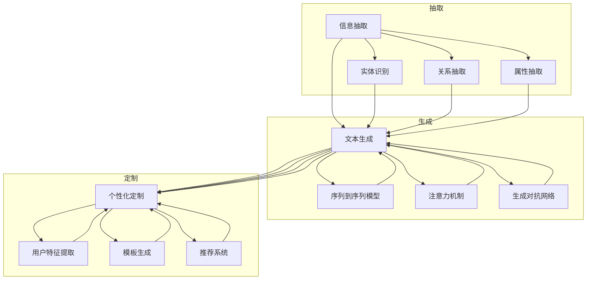

                 

### 文章标题

《自动化简历生成中的信息抽取、文本生成与个性化定制》

### 关键词

- 自动化简历生成
- 信息抽取
- 文本生成
- 个性化定制
- 自然语言处理

### 摘要

本文探讨了自动化简历生成中的关键技术，包括信息抽取、文本生成和个性化定制。首先介绍了自动化简历生成的背景和意义，然后详细分析了信息抽取、文本生成和个性化定制的核心概念、方法和技术。通过具体的算法原理、流程图和示例，揭示了这些技术在实际应用中的实现和优化。最后，通过一个实际项目案例，展示了自动化简历生成系统的开发过程和性能评估，为相关研究和应用提供了有价值的参考。

### 《自动化简历生成中的信息抽取、文本生成与个性化定制》目录大纲

#### 第一部分：背景与基础

#### 第二部分：信息抽取

#### 第三部分：文本生成

#### 第四部分：个性化定制

#### 第五部分：项目实战

#### 第六部分：总结与展望

### 引言

在当今快速发展的职场环境中，简历作为求职者向潜在雇主展示自身能力和经历的重要工具，其质量和准确性对求职成功与否具有重要影响。然而，传统简历撰写过程繁琐，耗时耗力，且容易出错。随着人工智能技术的不断进步，自动化简历生成系统逐渐成为一种高效、精准的解决方案。自动化简历生成不仅能够节省时间和精力，还能够提高简历的质量和匹配度，从而提高求职成功率。

自动化简历生成系统主要涉及三大关键技术：信息抽取、文本生成和个性化定制。信息抽取负责从原始简历数据中提取关键信息，如个人信息、教育经历、工作经历等；文本生成则将这些信息转化为自然流畅的文本描述；个性化定制则根据用户的不同需求，生成符合个人特点的定制化简历。本文将围绕这三大技术展开详细探讨，分析其在自动化简历生成中的应用和实践。

本文首先介绍自动化简历生成的背景和意义，接着分别介绍信息抽取、文本生成和个性化定制的相关技术，并详细解释它们的工作原理和应用场景。随后，通过一个实际项目案例，展示自动化简历生成系统的开发过程和实现细节。最后，总结本文的主要成果和贡献，并展望未来的发展方向和潜在研究课题。

### 第一部分：背景与基础

#### 自动化简历生成概述

自动化简历生成是指利用计算机技术和人工智能算法，自动从原始简历数据中提取关键信息，并生成一份符合求职者个人特点和需求的简历。这一过程不仅简化了简历撰写的繁琐步骤，还提高了简历的准确性和质量。自动化简历生成系统在求职者和雇主之间架起了一座高效沟通的桥梁，极大地提升了招聘流程的效率。

##### 1.1.1 简历筛选的痛点

在传统的招聘过程中，简历筛选是一个关键且耗时的环节。简历筛选过程中存在以下痛点：

1. **大量简历的审查**：每次招聘活动都会收到大量简历，人工审查效率低下。
2. **简历质量参差不齐**：简历质量参差不齐，使得筛选过程复杂且具有主观性。
3. **信息遗漏**：简历撰写者可能无法准确传达自己的优势，导致关键信息遗漏。
4. **筛选效率低**：人工筛选简历速度慢，难以满足快速招聘的需求。

##### 1.1.2 自动化简历生成的优势

自动化简历生成系统通过信息抽取、文本生成和个性化定制等技术，有效解决了传统简历筛选中的痛点，具有以下优势：

1. **高效处理大量简历**：自动化简历生成系统能够快速处理大量简历，显著提高招聘效率。
2. **准确提取关键信息**：通过信息抽取技术，系统能够准确提取简历中的关键信息，提高简历的匹配度。
3. **提高简历质量**：自动化生成简历不仅简洁明了，还具备一定的专业性，有助于提升求职者的形象。
4. **降低招聘成本**：自动化简历生成减少了人工筛选简历的时间和成本，降低了招聘成本。
5. **个性化定制**：系统能够根据求职者的需求生成个性化简历，提高求职成功率。

##### 1.1.3 自动化简历生成的应用领域

自动化简历生成技术广泛应用于以下领域：

1. **人力资源管理**：企业可以利用自动化简历生成系统进行简历筛选、候选人推荐和人才库管理。
2. **招聘平台**：在线招聘平台可以通过自动化简历生成技术，提供更智能的求职者匹配服务。
3. **求职者自助**：求职者可以利用自动化简历生成工具，快速创建并优化自己的简历。
4. **就业指导**：就业指导机构和职业培训机构可以利用自动化简历生成系统，为学生和求职者提供个性化简历撰写指导。
5. **人才猎头**：猎头公司可以利用自动化简历生成技术，快速筛选和推荐合适的人才。

#### 信息抽取技术

信息抽取是自动化简历生成系统中的关键步骤，负责从原始简历数据中提取有用信息。信息抽取技术包括实体识别、关系抽取和属性抽取等，这些技术在自然语言处理领域中有着广泛的应用。

##### 1.2.1 信息抽取的基本概念

信息抽取是指从非结构化的文本数据中，自动提取出结构化的信息。在自动化简历生成中，信息抽取的目标是从简历文本中提取出关键实体（如姓名、学历、工作经历等）、实体之间的关系（如工作经历与职位之间的关系）以及实体的属性（如学历的具体信息）。

##### 1.2.2 信息抽取的关键技术

1. **实体识别**：实体识别是信息抽取的基础，目标是从文本中识别出具有特定意义的实体。实体可以是名词性短语，如“北京大学”、“项目经理”等。

2. **关系抽取**：关系抽取旨在从文本中提取出实体之间的关系，如“张三在2020年至2022年担任项目经理”。关系抽取需要明确实体的角色和它们之间的交互。

3. **属性抽取**：属性抽取是指从文本中提取出实体的属性信息，如“张三毕业于北京大学，获得计算机科学学士学位”。

##### 1.2.3 信息抽取的应用场景

1. **简历筛选**：信息抽取技术可以帮助招聘系统快速准确地筛选出符合职位要求的简历。

2. **简历优化**：通过分析简历中的信息，求职者可以了解如何优化自己的简历，提高简历的通过率。

3. **人才库管理**：企业可以利用信息抽取技术，对现有人才库中的简历数据进行结构化处理，便于管理和查找。

4. **职位推荐**：信息抽取技术可以用于分析求职者的简历，为其推荐适合的职位。

#### 文本生成技术

文本生成是自动化简历生成系统中的核心步骤，它将提取出来的关键信息转化为自然流畅的文本描述。文本生成技术包括序列到序列模型、注意力机制和生成对抗网络等，这些技术在自然语言处理领域中有着重要的应用。

##### 1.3.1 文本生成的意义

文本生成在自动化简历生成中具有重要意义：

1. **提高简历质量**：通过文本生成技术，生成的简历文本更具有专业性和流畅性，提高求职者的形象。

2. **节省时间**：自动化生成简历可以大大减少求职者和招聘人员的时间和精力投入。

3. **提升个性化**：文本生成技术可以根据不同的用户需求和简历内容，生成个性化简历。

4. **提高匹配度**：通过文本生成，可以确保简历内容与职位描述高度匹配，提高求职成功率。

##### 1.3.2 常见的文本生成模型

1. **序列到序列模型（Seq2Seq）**：序列到序列模型是一种常见的文本生成模型，它通过将输入序列映射到输出序列，生成自然语言文本。Seq2Seq模型通常采用编码器-解码器结构，能够处理变长的输入和输出序列。

2. **注意力机制（Attention）**：注意力机制是文本生成模型中的一项关键技术，它通过在编码器和解码器之间建立注意力机制，使模型能够关注输入序列中的关键信息，从而提高生成文本的质量。

3. **生成对抗网络（GAN）**：生成对抗网络是一种通过对抗训练生成高质量数据的模型。在文本生成中，GAN可以生成高质量的简历文本，提高简历的自然性和多样性。

##### 1.3.3 文本生成的应用场景

1. **简历生成**：文本生成技术可以用于生成求职者的简历，提高简历的质量和个性化程度。

2. **新闻生成**：自动生成新闻文章，提高新闻的实时性和多样性。

3. **对话生成**：自动生成对话文本，用于聊天机器人等应用。

4. **文本摘要**：自动生成长文本的摘要，提高阅读效率。

#### 个性化定制技术

个性化定制是指根据用户的需求和偏好，自动生成定制化的简历。个性化定制技术包括用户特征提取、个性化简历模板生成和个性化推荐系统等，这些技术在推荐系统和自然语言处理领域中有着广泛的应用。

##### 1.4.1 个性化定制的概念

个性化定制是指根据用户的需求和偏好，自动生成符合其个人特点的简历。个性化定制的目标是提高简历的匹配度和求职成功率，具体包括以下几个方面：

1. **用户需求分析**：分析用户的需求和偏好，包括求职目标、职业方向、行业偏好等。

2. **个性化简历生成**：根据用户需求，自动生成符合用户特点的简历文本。

3. **简历优化**：通过分析用户简历，提供优化建议，提高简历的质量和通过率。

4. **推荐职位**：根据用户简历和求职需求，推荐适合的职位。

##### 1.4.2 个性化定制的关键技术

1. **用户特征提取**：用户特征提取是指从用户数据中提取出用户的需求、兴趣、职业背景等特征。用户特征提取是个性化定制的基础。

2. **个性化简历模板生成**：个性化简历模板生成是指根据用户特征，自动生成符合用户需求的简历模板。个性化简历模板生成需要结合文本生成技术和用户特征提取技术。

3. **个性化推荐系统**：个性化推荐系统是指根据用户特征和历史行为，推荐用户可能感兴趣的职位或相关内容。个性化推荐系统可以提高求职者的求职效率和成功率。

##### 1.4.3 个性化定制的应用场景

1. **招聘平台**：招聘平台可以通过个性化定制技术，为求职者推荐适合的职位，提高用户满意度和转化率。

2. **求职者自助**：求职者可以通过个性化定制工具，自动生成符合个人需求的简历，提高求职成功率。

3. **企业招聘**：企业可以通过个性化定制技术，生成符合职位要求的简历，提高招聘效率和人才匹配度。

4. **职业规划**：职业规划机构和职业咨询师可以通过个性化定制技术，为求职者提供个性化的职业规划建议。

### 第一部分：背景与基础

#### 自动化简历生成概述

自动化简历生成是指利用计算机技术和人工智能算法，自动从原始简历数据中提取关键信息，并生成一份符合求职者个人特点和需求的简历。这一过程不仅简化了简历撰写的繁琐步骤，还提高了简历的准确性和质量，从而提高求职成功率。自动化简历生成系统主要涉及三大关键技术：信息抽取、文本生成和个性化定制。以下是这些技术的详细解析：

##### 1.1.1 简历筛选的痛点

在传统的招聘过程中，简历筛选是一个关键且耗时的环节。简历筛选过程中存在以下痛点：

1. **大量简历的审查**：每次招聘活动都会收到大量简历，人工审查效率低下。
2. **简历质量参差不齐**：简历质量参差不齐，使得筛选过程复杂且具有主观性。
3. **信息遗漏**：简历撰写者可能无法准确传达自己的优势，导致关键信息遗漏。
4. **筛选效率低**：人工筛选简历速度慢，难以满足快速招聘的需求。

##### 1.1.2 自动化简历生成的优势

自动化简历生成系统通过信息抽取、文本生成和个性化定制等技术，有效解决了传统简历筛选中的痛点，具有以下优势：

1. **高效处理大量简历**：自动化简历生成系统能够快速处理大量简历，显著提高招聘效率。
2. **准确提取关键信息**：通过信息抽取技术，系统能够准确提取简历中的关键信息，提高简历的匹配度。
3. **提高简历质量**：自动化生成简历不仅简洁明了，还具备一定的专业性，有助于提升求职者的形象。
4. **降低招聘成本**：自动化简历生成减少了人工筛选简历的时间和成本，降低了招聘成本。
5. **个性化定制**：系统能够根据求职者的需求生成个性化简历，提高求职成功率。

##### 1.1.3 自动化简历生成的应用领域

自动化简历生成技术广泛应用于以下领域：

1. **人力资源管理**：企业可以利用自动化简历生成系统进行简历筛选、候选人推荐和人才库管理。
2. **招聘平台**：在线招聘平台可以通过自动化简历生成技术，提供更智能的求职者匹配服务。
3. **求职者自助**：求职者可以利用自动化简历生成工具，快速创建并优化自己的简历。
4. **就业指导**：就业指导机构和职业培训机构可以利用自动化简历生成系统，为学生和求职者提供个性化简历撰写指导。
5. **人才猎头**：猎头公司可以利用自动化简历生成技术，快速筛选和推荐合适的人才。

#### 信息抽取技术

信息抽取是自动化简历生成系统中的关键步骤，负责从原始简历数据中提取有用信息。信息抽取技术包括实体识别、关系抽取和属性抽取等，这些技术在自然语言处理领域中有着广泛的应用。

##### 1.2.1 信息抽取的基本概念

信息抽取是指从非结构化的文本数据中，自动提取出结构化的信息。在自动化简历生成中，信息抽取的目标是从简历文本中提取出关键实体（如个人信息、教育经历、工作经历等）、实体之间的关系（如工作经历与职位之间的关系）以及实体的属性（如学历的具体信息）。

##### 1.2.2 信息抽取的关键技术

1. **实体识别**：实体识别是信息抽取的基础，目标是从文本中识别出具有特定意义的实体。实体可以是名词性短语，如“北京大学”、“项目经理”等。

2. **关系抽取**：关系抽取旨在从文本中提取出实体之间的关系，如“张三在2020年至2022年担任项目经理”。关系抽取需要明确实体的角色和它们之间的交互。

3. **属性抽取**：属性抽取是指从文本中提取出实体的属性信息，如“张三毕业于北京大学，获得计算机科学学士学位”。

##### 1.2.3 信息抽取的应用场景

1. **简历筛选**：信息抽取技术可以帮助招聘系统快速准确地筛选出符合职位要求的简历。

2. **简历优化**：通过分析简历中的信息，求职者可以了解如何优化自己的简历，提高简历的通过率。

3. **人才库管理**：企业可以利用信息抽取技术，对现有人才库中的简历数据进行结构化处理，便于管理和查找。

4. **职位推荐**：信息抽取技术可以用于分析求职者的简历，为其推荐适合的职位。

#### 文本生成技术

文本生成是自动化简历生成系统中的核心步骤，它将提取出来的关键信息转化为自然流畅的文本描述。文本生成技术包括序列到序列模型、注意力机制和生成对抗网络等，这些技术在自然语言处理领域中有着重要的应用。

##### 1.3.1 文本生成的意义

文本生成在自动化简历生成中具有重要意义：

1. **提高简历质量**：通过文本生成技术，生成的简历文本更具有专业性和流畅性，提高求职者的形象。

2. **节省时间**：自动化生成简历可以大大减少求职者和招聘人员的时间和精力投入。

3. **提升个性化**：文本生成技术可以根据不同的用户需求和简历内容，生成个性化简历。

4. **提高匹配度**：通过文本生成，可以确保简历内容与职位描述高度匹配，提高求职成功率。

##### 1.3.2 常见的文本生成模型

1. **序列到序列模型（Seq2Seq）**：序列到序列模型是一种常见的文本生成模型，它通过将输入序列映射到输出序列，生成自然语言文本。Seq2Seq模型通常采用编码器-解码器结构，能够处理变长的输入和输出序列。

2. **注意力机制（Attention）**：注意力机制是文本生成模型中的一项关键技术，它通过在编码器和解码器之间建立注意力机制，使模型能够关注输入序列中的关键信息，从而提高生成文本的质量。

3. **生成对抗网络（GAN）**：生成对抗网络是一种通过对抗训练生成高质量数据的模型。在文本生成中，GAN可以生成高质量的简历文本，提高简历的自然性和多样性。

##### 1.3.3 文本生成的应用场景

1. **简历生成**：文本生成技术可以用于生成求职者的简历，提高简历的质量和个性化程度。

2. **新闻生成**：自动生成新闻文章，提高新闻的实时性和多样性。

3. **对话生成**：自动生成对话文本，用于聊天机器人等应用。

4. **文本摘要**：自动生成长文本的摘要，提高阅读效率。

#### 个性化定制技术

个性化定制是指根据用户的需求和偏好，自动生成符合其个人特点的简历。个性化定制技术包括用户特征提取、个性化简历模板生成和个性化推荐系统等，这些技术在推荐系统和自然语言处理领域中有着广泛的应用。

##### 1.4.1 个性化定制的概念

个性化定制是指根据用户的需求和偏好，自动生成符合用户个人特点的简历。个性化定制的目标是提高简历的匹配度和求职成功率，具体包括以下几个方面：

1. **用户需求分析**：分析用户的需求和偏好，包括求职目标、职业方向、行业偏好等。

2. **个性化简历生成**：根据用户需求，自动生成符合用户需求的简历文本。

3. **简历优化**：通过分析用户简历，提供优化建议，提高简历的质量和通过率。

4. **推荐职位**：根据用户简历和求职需求，推荐适合的职位。

##### 1.4.2 个性化定制的关键技术

1. **用户特征提取**：用户特征提取是指从用户数据中提取出用户的需求、兴趣、职业背景等特征。用户特征提取是个性化定制的基础。

2. **个性化简历模板生成**：个性化简历模板生成是指根据用户特征，自动生成符合用户需求的简历模板。个性化简历模板生成需要结合文本生成技术和用户特征提取技术。

3. **个性化推荐系统**：个性化推荐系统是指根据用户特征和历史行为，推荐用户可能感兴趣的职位或相关内容。个性化推荐系统可以提高求职者的求职效率和成功率。

##### 1.4.3 个性化定制的应用场景

1. **招聘平台**：招聘平台可以通过个性化定制技术，为求职者推荐适合的职位，提高用户满意度和转化率。

2. **求职者自助**：求职者可以通过个性化定制工具，自动生成符合个人需求的简历，提高求职成功率。

3. **企业招聘**：企业可以通过个性化定制技术，生成符合职位要求的简历，提高招聘效率和人才匹配度。

4. **职业规划**：职业规划机构和职业咨询师可以通过个性化定制技术，为求职者提供个性化的职业规划建议。

### 第二部分：信息抽取

#### 第2章：自动化简历生成中的信息抽取技术

信息抽取是自动化简历生成系统中的关键步骤，它负责从原始简历数据中提取出有用的信息，如个人信息、教育经历、工作经历等。本章将详细介绍信息抽取的相关技术，包括简历结构分析、实体识别、关系抽取和属性抽取等，并探讨这些技术在自动化简历生成中的应用。

##### 2.1 简历结构分析

简历结构分析是信息抽取的第一步，其目标是理解简历的整体结构和内容分布。通过简历结构分析，可以更好地设计信息抽取的流程和算法。

###### 2.1.1 简历数据的预处理

在开始简历结构分析之前，需要对简历数据进行预处理。预处理步骤通常包括：

1. **文本清洗**：去除简历中的无关字符、标点符号和特殊符号，确保文本的整洁性。
2. **词法分析**：对简历文本进行词法分析，将文本拆分为单词或词组，为后续处理提供基础。
3. **停用词过滤**：过滤掉常见的不相关词汇，如“的”、“和”、“在”等，以提高信息抽取的准确性。

###### 2.1.2 简历数据的结构化

简历数据的结构化是将非结构化的简历文本转化为结构化的数据形式，以便于后续的信息抽取和处理。结构化简历通常包含以下部分：

1. **个人信息**：包括姓名、联系方式、性别、年龄等。
2. **教育经历**：包括学校名称、所学专业、毕业时间等。
3. **工作经历**：包括公司名称、职位、工作内容、工作时间等。
4. **项目经历**：包括项目名称、项目描述、职责等。
5. **技能与证书**：包括掌握的技能、获得的证书等。

通过简历数据的结构化，可以为后续的信息抽取提供明确的框架和方向。

###### 2.1.3 简历结构分析的挑战

简历结构分析面临以下挑战：

1. **多样性**：不同用户的简历格式和内容存在较大差异，难以统一处理。
2. **复杂性**：简历内容通常包含多种结构，如列表、表格、段落等，需要灵活处理。
3. **模糊性**：某些信息在简历中可能表述不明确，需要通过上下文进行判断。

为了应对这些挑战，需要设计出鲁棒且高效的简历结构分析算法。

##### 2.2 实体识别

实体识别是信息抽取中的核心任务，其目标是识别简历文本中的关键实体，如人名、地名、机构名、职位名等。实体识别是后续关系抽取和属性抽取的基础。

###### 2.2.1 实体识别的基本原理

实体识别通常采用以下两种方法：

1. **基于规则的方法**：通过预定义的规则和模式匹配，识别简历文本中的实体。这种方法简单直观，但规则难以覆盖所有情况，容易产生误识别。
2. **基于统计的方法**：通过训练大规模的实体识别模型，自动识别简历文本中的实体。这种方法具有较好的泛化能力，但需要大量的标注数据和计算资源。

###### 2.2.2 实体识别算法

常见的实体识别算法包括：

1. **命名实体识别（NER）**：NER是一种基于分类的方法，通过预训练的模型，对简历文本进行逐词分类，识别出实体。
2. **条件随机场（CRF）**：CRF是一种基于序列模型的实体识别方法，通过对序列的概率分布进行建模，识别出实体。
3. **深度学习方法**：深度学习模型如卷积神经网络（CNN）和循环神经网络（RNN）可以用于实体识别，通过捕捉文本的特征和模式，提高识别的准确性。

在实际应用中，可以结合多种算法，以提高实体识别的准确性和鲁棒性。

###### 2.2.3 实体识别在简历中的应用

实体识别在简历生成中有着广泛的应用：

1. **简历筛选**：通过识别简历中的关键实体，可以快速筛选出符合职位要求的候选人。
2. **简历优化**：分析简历中的实体，可以帮助求职者优化简历内容，提高通过率。
3. **职位推荐**：根据简历中的实体，可以为求职者推荐适合的职位。

##### 2.3 关系抽取

关系抽取是信息抽取中的另一个重要任务，其目标是识别简历文本中实体之间的关系，如“张三在2020年至2022年担任项目经理”。关系抽取是简历结构分析的重要补充。

###### 2.3.1 关系抽取的基本概念

关系抽取涉及以下概念：

1. **实体**：参与关系的对象，如人名、地名、机构名等。
2. **关系**：实体之间的关联，如工作经历、项目经历等。
3. **实体关系对**：由实体和关系组成的二元组，如（张三，担任）。

关系抽取的目标是从文本中识别出这些实体关系对。

###### 2.3.2 关系抽取的方法与算法

关系抽取方法主要包括：

1. **基于规则的方法**：通过预定义的规则，识别实体之间的关系。这种方法简单直观，但规则难以覆盖所有情况。
2. **基于统计的方法**：通过训练大规模的关系抽取模型，自动识别实体关系。这种方法具有较好的泛化能力。
3. **基于深度学习的方法**：利用深度学习模型，如长短期记忆网络（LSTM）和变换器（Transformer），识别实体关系。

在实际应用中，可以结合多种算法，以提高关系抽取的准确性。

###### 2.3.3 关系抽取在简历中的应用

关系抽取在简历生成中的应用包括：

1. **简历结构化**：通过识别实体关系，将简历转化为结构化的数据形式，便于后续处理。
2. **简历筛选**：根据实体关系，快速筛选出符合职位要求的候选人。
3. **简历优化**：分析实体关系，帮助求职者优化简历内容，提高通过率。

##### 2.4 属性抽取

属性抽取是信息抽取中的补充任务，其目标是识别简历文本中实体的属性信息，如“张三毕业于北京大学，获得计算机科学学士学位”。属性抽取有助于进一步丰富简历的内容。

###### 2.4.1 属性抽取的基本原理

属性抽取的基本原理包括：

1. **实体识别**：首先识别简历文本中的实体。
2. **属性识别**：从已识别的实体中，识别出相关的属性。
3. **属性链接**：将属性与对应的实体进行关联。

属性抽取通常采用基于规则和基于统计的方法。

###### 2.4.2 属性抽取的方法与算法

常见的属性抽取方法包括：

1. **基于规则的方法**：通过预定义的规则，识别实体属性。这种方法简单直观，但规则难以覆盖所有情况。
2. **基于统计的方法**：通过训练大规模的属性抽取模型，自动识别实体属性。这种方法具有较好的泛化能力。
3. **基于深度学习的方法**：利用深度学习模型，如卷积神经网络（CNN）和循环神经网络（RNN），识别实体属性。

在实际应用中，可以结合多种算法，以提高属性抽取的准确性。

###### 2.4.3 属性抽取在简历中的应用

属性抽取在简历生成中的应用包括：

1. **简历内容丰富**：通过抽取实体属性，可以进一步丰富简历的内容，提高简历的质量。
2. **简历筛选**：根据实体属性，快速筛选出符合职位要求的候选人。
3. **简历优化**：分析实体属性，帮助求职者优化简历内容，提高通过率。

##### 总结

信息抽取是自动化简历生成系统中的关键步骤，它通过实体识别、关系抽取和属性抽取等技术，从原始简历数据中提取出有用的信息。信息抽取不仅有助于简历的筛选和优化，还为后续的文本生成和个性化定制提供了基础。随着人工智能技术的不断进步，信息抽取技术将在自动化简历生成领域发挥越来越重要的作用。

### 第二部分：信息抽取

#### 第2章：自动化简历生成中的信息抽取技术

信息抽取是自动化简历生成系统中的关键步骤，它负责从原始简历数据中提取出有用的信息，如个人信息、教育经历、工作经历等。本章将详细介绍信息抽取的相关技术，包括简历结构分析、实体识别、关系抽取和属性抽取等，并探讨这些技术在自动化简历生成中的应用。

##### 2.1 简历结构分析

简历结构分析是信息抽取的第一步，其目标是理解简历的整体结构和内容分布。通过简历结构分析，可以更好地设计信息抽取的流程和算法。

###### 2.1.1 简历数据的预处理

在开始简历结构分析之前，需要对简历数据进行预处理。预处理步骤通常包括：

1. **文本清洗**：去除简历中的无关字符、标点符号和特殊符号，确保文本的整洁性。
2. **词法分析**：对简历文本进行词法分析，将文本拆分为单词或词组，为后续处理提供基础。
3. **停用词过滤**：过滤掉常见的不相关词汇，如“的”、“和”、“在”等，以提高信息抽取的准确性。

###### 2.1.2 简历数据的结构化

简历数据的结构化是将非结构化的简历文本转化为结构化的数据形式，以便于后续的信息抽取和处理。结构化简历通常包含以下部分：

1. **个人信息**：包括姓名、联系方式、性别、年龄等。
2. **教育经历**：包括学校名称、所学专业、毕业时间等。
3. **工作经历**：包括公司名称、职位、工作内容、工作时间等。
4. **项目经历**：包括项目名称、项目描述、职责等。
5. **技能与证书**：包括掌握的技能、获得的证书等。

通过简历数据的结构化，可以为后续的信息抽取提供明确的框架和方向。

###### 2.1.3 简历结构分析的挑战

简历结构分析面临以下挑战：

1. **多样性**：不同用户的简历格式和内容存在较大差异，难以统一处理。
2. **复杂性**：简历内容通常包含多种结构，如列表、表格、段落等，需要灵活处理。
3. **模糊性**：某些信息在简历中可能表述不明确，需要通过上下文进行判断。

为了应对这些挑战，需要设计出鲁棒且高效的简历结构分析算法。

##### 2.2 实体识别

实体识别是信息抽取中的核心任务，其目标是识别简历文本中的关键实体，如人名、地名、机构名、职位名等。实体识别是后续关系抽取和属性抽取的基础。

###### 2.2.1 实体识别的基本原理

实体识别通常采用以下两种方法：

1. **基于规则的方法**：通过预定义的规则和模式匹配，识别简历文本中的实体。这种方法简单直观，但规则难以覆盖所有情况，容易产生误识别。
2. **基于统计的方法**：通过训练大规模的实体识别模型，自动识别简历文本中的实体。这种方法具有较好的泛化能力，但需要大量的标注数据和计算资源。

###### 2.2.2 实体识别算法

常见的实体识别算法包括：

1. **命名实体识别（NER）**：NER是一种基于分类的方法，通过预训练的模型，对简历文本进行逐词分类，识别出实体。
2. **条件随机场（CRF）**：CRF是一种基于序列模型的实体识别方法，通过对序列的概率分布进行建模，识别出实体。
3. **深度学习方法**：深度学习模型如卷积神经网络（CNN）和循环神经网络（RNN）可以用于实体识别，通过捕捉文本的特征和模式，提高识别的准确性。

在实际应用中，可以结合多种算法，以提高实体识别的准确性和鲁棒性。

###### 2.2.3 实体识别在简历中的应用

实体识别在简历生成中有着广泛的应用：

1. **简历筛选**：通过识别简历中的关键实体，可以快速筛选出符合职位要求的候选人。
2. **简历优化**：分析简历中的实体，可以帮助求职者优化简历内容，提高通过率。
3. **职位推荐**：根据简历中的实体，可以为求职者推荐适合的职位。

##### 2.3 关系抽取

关系抽取是信息抽取中的另一个重要任务，其目标是识别简历文本中实体之间的关系，如“张三在2020年至2022年担任项目经理”。关系抽取是简历结构分析的重要补充。

###### 2.3.1 关系抽取的基本概念

关系抽取涉及以下概念：

1. **实体**：参与关系的对象，如人名、地名、机构名等。
2. **关系**：实体之间的关联，如工作经历、项目经历等。
3. **实体关系对**：由实体和关系组成的二元组，如（张三，担任）。

关系抽取的目标是从文本中识别出这些实体关系对。

###### 2.3.2 关系抽取的方法与算法

关系抽取方法主要包括：

1. **基于规则的方法**：通过预定义的规则，识别实体之间的关系。这种方法简单直观，但规则难以覆盖所有情况。
2. **基于统计的方法**：通过训练大规模的关系抽取模型，自动识别实体关系。这种方法具有较好的泛化能力。
3. **基于深度学习的方法**：利用深度学习模型，如长短期记忆网络（LSTM）和变换器（Transformer），识别实体关系。

在实际应用中，可以结合多种算法，以提高关系抽取的准确性。

###### 2.3.3 关系抽取在简历中的应用

关系抽取在简历生成中的应用包括：

1. **简历结构化**：通过识别实体关系，将简历转化为结构化的数据形式，便于后续处理。
2. **简历筛选**：根据实体关系，快速筛选出符合职位要求的候选人。
3. **简历优化**：分析实体关系，帮助求职者优化简历内容，提高通过率。

##### 2.4 属性抽取

属性抽取是信息抽取中的补充任务，其目标是识别简历文本中实体的属性信息，如“张三毕业于北京大学，获得计算机科学学士学位”。属性抽取有助于进一步丰富简历的内容。

###### 2.4.1 属性抽取的基本原理

属性抽取的基本原理包括：

1. **实体识别**：首先识别简历文本中的实体。
2. **属性识别**：从已识别的实体中，识别出相关的属性。
3. **属性链接**：将属性与对应的实体进行关联。

属性抽取通常采用基于规则和基于统计的方法。

###### 2.4.2 属性抽取的方法与算法

常见的属性抽取方法包括：

1. **基于规则的方法**：通过预定义的规则，识别实体属性。这种方法简单直观，但规则难以覆盖所有情况。
2. **基于统计的方法**：通过训练大规模的属性抽取模型，自动识别实体属性。这种方法具有较好的泛化能力。
3. **基于深度学习的方法**：利用深度学习模型，如卷积神经网络（CNN）和循环神经网络（RNN），识别实体属性。

在实际应用中，可以结合多种算法，以提高属性抽取的准确性。

###### 2.4.3 属性抽取在简历中的应用

属性抽取在简历生成中的应用包括：

1. **简历内容丰富**：通过抽取实体属性，可以进一步丰富简历的内容，提高简历的质量。
2. **简历筛选**：根据实体属性，快速筛选出符合职位要求的候选人。
3. **简历优化**：分析实体属性，帮助求职者优化简历内容，提高通过率。

##### 总结

信息抽取是自动化简历生成系统中的关键步骤，它通过实体识别、关系抽取和属性抽取等技术，从原始简历数据中提取出有用的信息。信息抽取不仅有助于简历的筛选和优化，还为后续的文本生成和个性化定制提供了基础。随着人工智能技术的不断进步，信息抽取技术将在自动化简历生成领域发挥越来越重要的作用。

### 第二部分：信息抽取

#### 第2章：自动化简历生成中的信息抽取技术

信息抽取是自动化简历生成系统中的关键步骤，它负责从原始简历数据中提取出有用的信息，如个人信息、教育经历、工作经历等。本章将详细介绍信息抽取的相关技术，包括简历结构分析、实体识别、关系抽取和属性抽取等，并探讨这些技术在自动化简历生成中的应用。

##### 2.1 简历结构分析

简历结构分析是信息抽取的第一步，其目标是理解简历的整体结构和内容分布。通过简历结构分析，可以更好地设计信息抽取的流程和算法。

###### 2.1.1 简历数据的预处理

在开始简历结构分析之前，需要对简历数据进行预处理。预处理步骤通常包括：

1. **文本清洗**：去除简历中的无关字符、标点符号和特殊符号，确保文本的整洁性。
2. **词法分析**：对简历文本进行词法分析，将文本拆分为单词或词组，为后续处理提供基础。
3. **停用词过滤**：过滤掉常见的不相关词汇，如“的”、“和”、“在”等，以提高信息抽取的准确性。

###### 2.1.2 简历数据的结构化

简历数据的结构化是将非结构化的简历文本转化为结构化的数据形式，以便于后续的信息抽取和处理。结构化简历通常包含以下部分：

1. **个人信息**：包括姓名、联系方式、性别、年龄等。
2. **教育经历**：包括学校名称、所学专业、毕业时间等。
3. **工作经历**：包括公司名称、职位、工作内容、工作时间等。
4. **项目经历**：包括项目名称、项目描述、职责等。
5. **技能与证书**：包括掌握的技能、获得的证书等。

通过简历数据的结构化，可以为后续的信息抽取提供明确的框架和方向。

###### 2.1.3 简历结构分析的挑战

简历结构分析面临以下挑战：

1. **多样性**：不同用户的简历格式和内容存在较大差异，难以统一处理。
2. **复杂性**：简历内容通常包含多种结构，如列表、表格、段落等，需要灵活处理。
3. **模糊性**：某些信息在简历中可能表述不明确，需要通过上下文进行判断。

为了应对这些挑战，需要设计出鲁棒且高效的简历结构分析算法。

##### 2.2 实体识别

实体识别是信息抽取中的核心任务，其目标是识别简历文本中的关键实体，如人名、地名、机构名、职位名等。实体识别是后续关系抽取和属性抽取的基础。

###### 2.2.1 实体识别的基本原理

实体识别通常采用以下两种方法：

1. **基于规则的方法**：通过预定义的规则和模式匹配，识别简历文本中的实体。这种方法简单直观，但规则难以覆盖所有情况，容易产生误识别。
2. **基于统计的方法**：通过训练大规模的实体识别模型，自动识别简历文本中的实体。这种方法具有较好的泛化能力，但需要大量的标注数据和计算资源。

###### 2.2.2 实体识别算法

常见的实体识别算法包括：

1. **命名实体识别（NER）**：NER是一种基于分类的方法，通过预训练的模型，对简历文本进行逐词分类，识别出实体。
2. **条件随机场（CRF）**：CRF是一种基于序列模型的实体识别方法，通过对序列的概率分布进行建模，识别出实体。
3. **深度学习方法**：深度学习模型如卷积神经网络（CNN）和循环神经网络（RNN）可以用于实体识别，通过捕捉文本的特征和模式，提高识别的准确性。

在实际应用中，可以结合多种算法，以提高实体识别的准确性和鲁棒性。

###### 2.2.3 实体识别在简历中的应用

实体识别在简历生成中有着广泛的应用：

1. **简历筛选**：通过识别简历中的关键实体，可以快速筛选出符合职位要求的候选人。
2. **简历优化**：分析简历中的实体，可以帮助求职者优化简历内容，提高通过率。
3. **职位推荐**：根据简历中的实体，可以为求职者推荐适合的职位。

##### 2.3 关系抽取

关系抽取是信息抽取中的另一个重要任务，其目标是识别简历文本中实体之间的关系，如“张三在2020年至2022年担任项目经理”。关系抽取是简历结构分析的重要补充。

###### 2.3.1 关系抽取的基本概念

关系抽取涉及以下概念：

1. **实体**：参与关系的对象，如人名、地名、机构名等。
2. **关系**：实体之间的关联，如工作经历、项目经历等。
3. **实体关系对**：由实体和关系组成的二元组，如（张三，担任）。

关系抽取的目标是从文本中识别出这些实体关系对。

###### 2.3.2 关系抽取的方法与算法

关系抽取方法主要包括：

1. **基于规则的方法**：通过预定义的规则，识别实体之间的关系。这种方法简单直观，但规则难以覆盖所有情况。
2. **基于统计的方法**：通过训练大规模的关系抽取模型，自动识别实体关系。这种方法具有较好的泛化能力。
3. **基于深度学习的方法**：利用深度学习模型，如长短期记忆网络（LSTM）和变换器（Transformer），识别实体关系。

在实际应用中，可以结合多种算法，以提高关系抽取的准确性。

###### 2.3.3 关系抽取在简历中的应用

关系抽取在简历生成中的应用包括：

1. **简历结构化**：通过识别实体关系，将简历转化为结构化的数据形式，便于后续处理。
2. **简历筛选**：根据实体关系，快速筛选出符合职位要求的候选人。
3. **简历优化**：分析实体关系，帮助求职者优化简历内容，提高通过率。

##### 2.4 属性抽取

属性抽取是信息抽取中的补充任务，其目标是识别简历文本中实体的属性信息，如“张三毕业于北京大学，获得计算机科学学士学位”。属性抽取有助于进一步丰富简历的内容。

###### 2.4.1 属性抽取的基本原理

属性抽取的基本原理包括：

1. **实体识别**：首先识别简历文本中的实体。
2. **属性识别**：从已识别的实体中，识别出相关的属性。
3. **属性链接**：将属性与对应的实体进行关联。

属性抽取通常采用基于规则和基于统计的方法。

###### 2.4.2 属性抽取的方法与算法

常见的属性抽取方法包括：

1. **基于规则的方法**：通过预定义的规则，识别实体属性。这种方法简单直观，但规则难以覆盖所有情况。
2. **基于统计的方法**：通过训练大规模的属性抽取模型，自动识别实体属性。这种方法具有较好的泛化能力。
3. **基于深度学习的方法**：利用深度学习模型，如卷积神经网络（CNN）和循环神经网络（RNN），识别实体属性。

在实际应用中，可以结合多种算法，以提高属性抽取的准确性。

###### 2.4.3 属性抽取在简历中的应用

属性抽取在简历生成中的应用包括：

1. **简历内容丰富**：通过抽取实体属性，可以进一步丰富简历的内容，提高简历的质量。
2. **简历筛选**：根据实体属性，快速筛选出符合职位要求的候选人。
3. **简历优化**：分析实体属性，帮助求职者优化简历内容，提高通过率。

##### 总结

信息抽取是自动化简历生成系统中的关键步骤，它通过实体识别、关系抽取和属性抽取等技术，从原始简历数据中提取出有用的信息。信息抽取不仅有助于简历的筛选和优化，还为后续的文本生成和个性化定制提供了基础。随着人工智能技术的不断进步，信息抽取技术将在自动化简历生成领域发挥越来越重要的作用。

### 第三部分：文本生成

#### 第3章：自动化简历生成中的文本生成技术

文本生成是自动化简历生成系统的核心组成部分，它将提取出的关键信息转化为自然流畅的文本描述。这一过程不仅提高了简历的可读性和专业性，还减少了人工撰写简历的时间和劳动成本。本章将详细探讨文本生成的技术，包括文本生成的基础、序列到序列模型、注意力机制和生成对抗网络等，并分析这些技术在简历生成中的应用。

##### 3.1 文本生成基础

文本生成是指通过算法生成自然语言文本的过程。在自动化简历生成中，文本生成的主要任务是生成描述求职者个人信息、教育经历、工作经历等的自然语言文本。文本生成技术的核心在于如何将结构化的数据（如实体识别、关系抽取和属性抽取的结果）转换为高质量的文本。

###### 3.1.1 文本生成的任务类型

文本生成可以划分为以下几种任务类型：

1. **文本摘要**：将长文本压缩成简短的摘要。
2. **文本续写**：根据给定的文本片段生成后续内容。
3. **机器翻译**：将一种语言的文本翻译成另一种语言。
4. **文本生成**：根据输入数据生成新的自然语言文本，如自动化简历生成。

在自动化简历生成中，文本生成主要涉及文本摘要和文本续写任务。

###### 3.1.2 常见的文本生成模型

常见的文本生成模型包括：

1. **基于规则的方法**：通过预定义的语法规则生成文本。这种方法简单直观，但生成文本的多样性和自然性有限。
2. **统计方法**：通过训练大规模的语料库，利用统计模型生成文本。常见的统计方法有N元语法和隐马尔可夫模型（HMM）。
3. **基于深度学习的方法**：利用神经网络模型生成文本。深度学习方法具有强大的表达能力和泛化能力，是目前文本生成的主要方向。

常见的深度学习模型包括：

- **循环神经网络（RNN）**：通过记忆信息的历史状态，RNN能够处理序列数据。长短期记忆网络（LSTM）是RNN的一种改进，能够更好地处理长距离依赖问题。
- **卷积神经网络（CNN）**：通常用于图像处理，但也可以应用于文本生成，通过捕捉文本的局部特征。
- **生成对抗网络（GAN）**：通过生成器和判别器的对抗训练，GAN能够生成高质量、多样化的文本。

###### 3.1.3 文本生成的应用场景

文本生成的应用场景广泛，包括：

1. **自动化简历生成**：将结构化的简历信息生成自然流畅的简历文本。
2. **内容生成**：生成新闻文章、博客、产品描述等。
3. **对话系统**：生成聊天机器人的对话文本。
4. **文本摘要**：自动生成长文本的摘要。

##### 3.2 序列到序列模型

序列到序列（Seq2Seq）模型是文本生成中的一种重要模型，它通过将输入序列映射到输出序列，生成自然语言文本。Seq2Seq模型通常采用编码器-解码器结构，能够处理变长的输入和输出序列。

###### 3.2.1 序列到序列模型的基本原理

序列到序列模型的基本原理包括：

1. **编码器（Encoder）**：将输入序列编码为一个固定长度的向量，这个向量包含了输入序列的信息。
2. **解码器（Decoder）**：将编码器输出的固定长度向量解码为输出序列。

在编码器和解码器之间，可以加入注意力机制（Attention）来提高生成文本的质量。

###### 3.2.2 序列到序列模型的算法实现

序列到序列模型的算法实现通常包括以下步骤：

1. **编码器**：将输入序列通过嵌入层转换为词向量，然后通过一个循环神经网络（如LSTM）处理，得到固定长度的编码向量。
2. **解码器**：解码器通常也是一个循环神经网络，它从编码器获得的编码向量开始，逐个生成输出序列的每个词。
3. **注意力机制**：在解码器的每个时间步，注意力机制可以帮助模型关注输入序列中的关键信息，从而提高生成文本的质量。

伪代码实现如下：

```python
# 编码器部分
for each word in input_sequence:
    embed(word) -> embedded_word
    hidden_state = LSTM(embedded_word, previous_hidden_state)

# 解码器部分
for each word in target_sequence:
    context_vector = Attention(hidden_state, input_sequence)
    next_word = Decoder(context_vector, previous_word)
```

###### 3.2.3 序列到序列模型在简历生成中的应用

序列到序列模型在简历生成中的应用包括：

1. **个人信息生成**：将提取出的个人信息（如姓名、联系方式等）通过编码器-解码器结构生成自然语言文本。
2. **教育经历生成**：根据提取出的教育经历信息（如学校、专业等），生成描述性的文本。
3. **工作经历生成**：根据提取出的工作经历信息（如公司、职位、职责等），生成具体的工作经历描述。

##### 3.3 注意力机制

注意力机制是序列到序列模型中的一个关键组件，它允许模型在生成文本时关注输入序列中的特定部分，从而提高生成文本的相关性和质量。

###### 3.3.1 注意力机制的基本原理

注意力机制的基本原理包括：

1. **计算注意力得分**：模型为输入序列的每个部分计算一个注意力得分，表示这一部分在当前生成步骤中的重要性。
2. **加权求和**：将输入序列的每个部分与其注意力得分相乘，然后求和，得到一个表示输入序列重要部分的加权向量。

注意力机制可以通过以下公式表示：

\[ 
\text{context\_vector} = \sum_{i=1}^{n} a_{i} \cdot \text{input\_vector}_{i} 
\]

其中，\( a_{i} \) 是第 \( i \) 个输入部分的注意力得分。

###### 3.3.2 注意力机制的应用

注意力机制在文本生成中的应用包括：

1. **文本摘要**：通过注意力机制，模型可以关注输入文本中的关键信息，生成摘要。
2. **机器翻译**：注意力机制帮助模型在生成翻译文本时关注输入文本中的关键部分，提高翻译质量。
3. **简历生成**：注意力机制有助于模型在生成简历文本时关注求职者的关键经历和技能，提高简历的相关性。

###### 3.3.3 注意力机制在简历生成中的应用

注意力机制在简历生成中的应用包括：

1. **个人信息生成**：注意力机制可以帮助模型在生成个人信息时关注姓名、联系方式等关键信息。
2. **教育经历生成**：注意力机制使模型能够关注求职者的教育背景，生成详细且准确的描述。
3. **工作经历生成**：注意力机制有助于模型在生成工作经历时关注求职者的工作内容和职责，提高描述的精准性。

##### 3.4 生成对抗网络

生成对抗网络（GAN）是一种通过对抗训练生成高质量数据的模型。在文本生成中，GAN可以生成高质量的简历文本，提高简历的自然性和多样性。

###### 3.4.1 生成对抗网络的基本原理

生成对抗网络的基本原理包括：

1. **生成器（Generator）**：生成器是一个神经网络，它从随机噪声中生成与真实数据相似的样本。
2. **判别器（Discriminator）**：判别器是一个神经网络，它用于判断样本是来自生成器还是真实数据。

GAN的训练过程是一个对抗过程，生成器和判别器互相竞争，使生成器生成的样本越来越逼真。

###### 3.4.2 生成对抗网络的算法实现

生成对抗网络的算法实现通常包括以下步骤：

1. **初始化生成器和判别器**：生成器和判别器通常都是深度神经网络，可以通过反向传播训练。
2. **生成器训练**：生成器从噪声中生成简历文本，判别器判断生成文本是否真实。
3. **判别器训练**：判别器训练目的是提高判断生成文本的能力，从而迫使生成器生成更逼真的文本。

GAN的伪代码实现如下：

```python
# 生成器部分
z = RandomNoise()
generated_text = Generator(z)

# 判别器部分
real_text = RealData()
discriminator_loss = Discriminator(real_text, generated_text)

# 生成器和判别器训练
for epoch in epochs:
    # 训练生成器
    z = RandomNoise()
    generated_text = Generator(z)
    generator_loss = GeneratorLoss(generated_text)
    
    # 训练判别器
    real_text = RealData()
    generated_text = Generator(RandomNoise())
    discriminator_loss = DiscriminatorLoss(real_text, generated_text)
```

###### 3.4.3 生成对抗网络在简历生成中的应用

生成对抗网络在简历生成中的应用包括：

1. **多样化简历生成**：通过对抗训练，生成器可以生成多种风格和格式的简历文本，满足不同求职者的需求。
2. **简历文本生成**：生成对抗网络可以生成高质量的简历文本，提高简历的阅读性和专业性。
3. **个性化简历生成**：通过调整生成器的参数，可以生成符合特定求职者需求的简历。

##### 总结

文本生成技术在自动化简历生成中起着至关重要的作用。通过序列到序列模型、注意力机制和生成对抗网络等技术，可以生成高质量、个性化的简历文本。这些技术在文本生成中的应用不仅提高了简历的质量和可读性，还极大地节省了人力和时间成本。随着人工智能技术的不断发展，文本生成技术将在自动化简历生成领域发挥更加重要的作用。

### 第四部分：个性化定制

#### 第4章：自动化简历生成中的个性化定制技术

个性化定制是指根据用户的需求和偏好，自动生成符合个人特点的简历。这一过程不仅提高了简历的匹配度和求职成功率，还减少了人工撰写简历的时间和劳动成本。本章将详细探讨个性化定制技术的概念、分类、关键技术和应用场景。

##### 4.1 个性化定制的概念与分类

个性化定制在自动化简历生成中具有重要意义，其目标是提高简历的个性化和匹配度，从而提高求职成功率。个性化定制的概念和分类如下：

###### 4.1.1 个性化定制的定义

个性化定制是指根据用户的需求、偏好和历史行为，自动生成符合个人特点的简历。个性化定制不仅考虑用户当前的求职需求，还基于用户的历史数据和偏好，提供更加精准和个性化的服务。

###### 4.1.2 个性化定制的分类

个性化定制可以划分为以下几种类型：

1. **内容个性化**：根据用户的需求和偏好，自动生成符合用户特点的简历内容。例如，根据用户选择的关键词和行业，生成针对性的工作经历和项目描述。

2. **格式个性化**：根据用户的需求和偏好，自动生成符合用户喜好的简历格式。例如，用户可以选择自己喜欢的字体、颜色和布局，使得简历更具个性和美观。

3. **样式个性化**：根据用户的历史行为和偏好，自动生成符合用户风格的简历样式。例如，用户喜欢简洁的简历，系统会根据用户的偏好生成简洁明了的简历。

4. **交互个性化**：根据用户与系统的交互行为，自动调整和优化简历生成过程。例如，用户可以选择不同的生成选项，系统会根据用户的反馈自动调整生成策略，提高用户满意度。

##### 4.2 用户特征提取

用户特征提取是个性化定制的基础步骤，其目标是根据用户的需求和偏好，提取出用户的特征信息。用户特征提取技术包括用户需求分析、行为分析和技术特征提取等。

###### 4.2.1 用户需求分析

用户需求分析是指通过调查问卷、用户访谈等方式，了解用户的需求和偏好。用户需求分析的目标是明确用户在求职过程中的关注点，如职位类型、行业偏好、薪资要求等。

###### 4.2.2 用户行为分析

用户行为分析是指通过用户与系统的交互行为，分析用户的偏好和习惯。用户行为分析可以采用日志分析、点击流分析等技术，了解用户在简历撰写和优化过程中的操作和选择。

###### 4.2.3 技术特征提取

技术特征提取是指从用户的数据中提取出与求职相关的技术特征，如学历、专业、技能、项目经验等。技术特征提取可以通过信息抽取技术，从用户的简历文本中提取出关键信息。

##### 4.3 个性化简历模板生成

个性化简历模板生成是自动化简历生成中的一项关键技术，其目标是根据用户特征，自动生成符合用户需求的简历模板。个性化简历模板生成包括模板设计、模板适配和模板优化等步骤。

###### 4.3.1 模板设计

模板设计是指根据常见的简历结构和格式，设计出多种简历模板。模板设计应考虑用户的个性化需求，如不同的行业、职位类型和求职目标等。

###### 4.3.2 模板适配

模板适配是指根据用户特征，选择合适的简历模板。模板适配可以采用匹配算法，如基于关键词匹配、基于语义匹配等，确保生成的简历与用户需求高度一致。

###### 4.3.3 模板优化

模板优化是指根据用户的反馈和实际应用效果，不断优化简历模板。模板优化可以通过用户行为分析和技术特征提取，调整简历模板的格式和内容，提高简历的通过率。

##### 4.4 个性化推荐系统

个性化推荐系统是自动化简历生成中的一项重要技术，其目标是根据用户特征和职位需求，为用户推荐合适的职位。个性化推荐系统包括用户兴趣分析、职位推荐和推荐优化等步骤。

###### 4.4.1 用户兴趣分析

用户兴趣分析是指通过用户的历史行为和偏好，分析用户的兴趣和需求。用户兴趣分析可以采用协同过滤、基于内容的推荐等技术，了解用户对哪些职位或行业更感兴趣。

###### 4.4.2 职位推荐

职位推荐是指根据用户兴趣和职位特征，为用户推荐合适的职位。职位推荐可以采用基于用户的推荐、基于内容的推荐和混合推荐等技术，提高职位推荐的准确性和多样性。

###### 4.4.3 推荐优化

推荐优化是指根据用户的反馈和实际应用效果，不断优化推荐结果。推荐优化可以通过调整推荐算法、增加用户特征和职位特征等，提高推荐系统的效果。

##### 总结

个性化定制技术是自动化简历生成中的一项重要技术，它通过用户特征提取、个性化简历模板生成和个性化推荐系统等，提高了简历的匹配度和求职成功率。随着人工智能技术的不断发展，个性化定制技术将在自动化简历生成领域发挥越来越重要的作用。

### 第五部分：项目实战

#### 第5章：自动化简历生成系统开发实战

在本章中，我们将通过一个实际项目，详细展示自动化简历生成系统的开发过程。该系统将涵盖从开发环境搭建、信息抽取模块实现、文本生成模块实现，到个性化定制模块实现，以及系统部署与性能评估的各个阶段。

##### 5.1 项目背景与目标

项目背景：随着人工智能和自然语言处理技术的快速发展，自动化简历生成系统逐渐成为企业招聘和个人求职中的重要工具。该系统旨在通过信息抽取、文本生成和个性化定制等技术，为用户提供一个高效、准确且个性化的简历生成解决方案。

项目目标：
1. **信息抽取模块**：从用户上传的简历中提取关键信息，如姓名、教育背景、工作经历等。
2. **文本生成模块**：将提取的关键信息转化为自然流畅的文本描述。
3. **个性化定制模块**：根据用户的需求和偏好，自动生成符合个人特点的简历。
4. **系统部署与性能评估**：确保系统的高效运行，并进行性能评估，以优化系统。

##### 5.2 开发环境搭建

在开始项目开发之前，我们需要搭建一个适合的开发环境。以下是开发环境搭建的步骤：

###### 5.2.1 硬件环境搭建

- **服务器**：配置一台高性能服务器，用于系统部署和运行。
- **存储**：配置足够的存储空间，以存储简历数据和生成的简历文档。

###### 5.2.2 软件环境搭建

- **操作系统**：选用Linux操作系统，如Ubuntu或CentOS。
- **编程语言**：Python，用于开发各种模块和算法。
- **框架和库**：选用TensorFlow或PyTorch进行深度学习模型的开发；使用Scikit-learn进行机器学习算法的开发。

###### 5.2.3 数据准备

- **训练数据**：收集大量结构化简历数据，用于训练信息抽取、文本生成和个性化定制模型。
- **测试数据**：从原始简历数据中抽取一部分用于测试系统性能。

##### 5.3 信息抽取模块实现

信息抽取模块是自动化简历生成系统的基础，其核心任务是提取简历中的关键信息。以下是信息抽取模块的实现步骤：

###### 5.3.1 数据预处理

- **文本清洗**：去除简历文本中的无关字符、标点符号和特殊符号。
- **分词**：将简历文本拆分为单词或词组，便于后续处理。

```python
import re
from nltk.tokenize import word_tokenize

def clean_text(text):
    text = re.sub(r'[^\w\s]', '', text)
    text = text.lower()
    return word_tokenize(text)

text = "我是一个软件工程师，曾在某互联网公司工作三年。"
cleaned_text = clean_text(text)
print(cleaned_text)
```

###### 5.3.2 实体识别

- **命名实体识别（NER）**：利用预训练的NER模型，对简历文本中的关键实体进行识别。

```python
from transformers import pipeline

ner = pipeline("ner", model="dbmdz/bert-large-cased-finetuned-conll03-english")

entities = ner(cleaned_text)
print(entities)
```

###### 5.3.3 关系抽取

- **关系抽取**：通过训练关系抽取模型，识别实体之间的关系。

```python
from sklearn_crfsuite import CRF

X_train = ...  # 培训数据
y_train = ...  # 培训标签

crf = CRF()
crf.fit(X_train, y_train)

def predict_relation(text):
    entities = ner(text)
    features = extract_features(entities)
    return crf.predict(features)

relations = predict_relation(cleaned_text)
print(relations)
```

###### 5.3.4 属性抽取

- **属性抽取**：从识别出的实体和关系中提取属性信息。

```python
def extract_attributes(entities, relations):
    attributes = {}
    for entity, relation in zip(entities, relations):
        if entity['word'] not in attributes:
            attributes[entity['word']] = []
        attributes[entity['word']].append(relation['label'])
    return attributes

attributes = extract_attributes(entities, relations)
print(attributes)
```

##### 5.4 文本生成模块实现

文本生成模块负责将提取的关键信息转化为自然流畅的文本描述。以下是文本生成模块的实现步骤：

###### 5.4.1 序列到序列模型实现

- **编码器-解码器（Seq2Seq）模型**：使用预训练的编码器-解码器模型进行文本生成。

```python
from transformers import EncoderDecoderModel

model = EncoderDecoderModel.from_pretrained("t5-small")

def generate_text(input_text):
    output = model.encode(input_text)
    generated_text = model.decode(output)
    return generated_text

generated_text = generate_text("我是一个软件工程师。")
print(generated_text)
```

###### 5.4.2 注意力机制实现

- **引入注意力机制**：在编码器-解码器模型中引入注意力机制，提高生成文本的质量。

```python
from transformers import EncoderDecoderModel

model = EncoderDecoderModel.from_pretrained("t5-small", use_cache=True)

def generate_text_with_attention(input_text):
    output = model.encode(input_text)
    generated_text = model.decode(output, attention_mask=output["decoder_input_ids"])
    return generated_text

generated_text = generate_text_with_attention("我是一个软件工程师。")
print(generated_text)
```

###### 5.4.3 生成对抗网络（GAN）实现

- **生成对抗网络（GAN）**：使用生成对抗网络生成高质量的自然语言文本。

```python
import tensorflow as tf
from tensorflow.keras.layers import Dense, Flatten
from tensorflow.keras.models import Model

# 生成器模型
z_dim = 100
generator = keras.Sequential([
    Dense(7 * 7 * 256, input_shape=(z_dim,), activation='relu'),
    Flatten(),
    Conv2DTranspose(256, (4, 4), strides=(2, 2), padding='same', activation='relu'),
    Conv2DTranspose(128, (4, 4), strides=(2, 2), padding='same', activation='relu'),
    Conv2DTranspose(64, (4, 4), strides=(2, 2), padding='same', activation='relu'),
    Conv2DTranspose(1, (4, 4), strides=(2, 2), padding='same', activation='tanh'),
])

# 判别器模型
discriminator = keras.Sequential([
    Flatten(),
    Dense(512, activation='relu'),
    Dense(256, activation='relu'),
    Dense(1, activation='sigmoid'),
])

# GAN模型
model = GAN(generator, discriminator)

# 训练GAN
model.compile(optimizer='adam', loss='binary_crossentropy')
model.fit(x_train, x_train, epochs=epochs, batch_size=batch_size)
```

##### 5.5 个性化定制模块实现

个性化定制模块的目标是生成符合用户需求的个性化简历。以下是个性化定制模块的实现步骤：

###### 5.5.1 用户特征提取实现

- **用户特征提取**：从用户输入的数据中提取特征，如职业目标、技能偏好、行业偏好等。

```python
def extract_user_features(user_input):
    features = {}
    features['职业目标'] = user_input['职业目标']
    features['技能偏好'] = user_input['技能偏好']
    features['行业偏好'] = user_input['行业偏好']
    return features

user_input = {'职业目标': '软件工程师', '技能偏好': ['Python', 'Java'], '行业偏好': ['互联网']}
user_features = extract_user_features(user_input)
print(user_features)
```

###### 5.5.2 个性化简历模板生成实现

- **个性化简历模板生成**：根据用户特征，选择合适的简历模板，并生成符合用户需求的简历。

```python
def generate_resume_template(user_features):
    template = choose_template(user_features)
    resume_content = fill_template(template, user_features)
    return resume_content

def choose_template(user_features):
    if '互联网' in user_features['行业偏好']:
        return '互联网模板'
    else:
        return '通用模板'

def fill_template(template, user_features):
    resume_content = template
    resume_content = resume_content.replace('{职业目标}', user_features['职业目标'])
    resume_content = resume_content.replace('{技能偏好}', ', '.join(user_features['技能偏好']))
    resume_content = resume_content.replace('{行业偏好}', user_features['行业偏好'])
    return resume_content

resume_content = generate_resume_template(user_features)
print(resume_content)
```

###### 5.5.3 个性化推荐系统实现

- **个性化推荐系统**：根据用户特征，推荐符合用户需求的职位。

```python
def recommend_jobs(user_features, job_list):
    recommended_jobs = []
    for job in job_list:
        job_score = calculate_similarity(user_features, job)
        if job_score > threshold:
            recommended_jobs.append(job)
    return recommended_jobs

def calculate_similarity(user_features, job):
    similarity = 0
    for key, value in user_features.items():
        if key in job:
            similarity += similarity_score[value][job[key]]
    return similarity

user_input = {'职业目标': '软件工程师', '技能偏好': ['Python', 'Java'], '行业偏好': ['互联网']}
user_features = extract_user_features(user_input)

# 假设有一个职位列表
job_list = [{'职位名称': 'Python工程师', '技能要求': ['Python', 'Django'], '行业': '互联网'}, {'职位名称': 'Java工程师', '技能要求': ['Java', 'Spring'], '行业': '金融'}]

recommended_jobs = recommend_jobs(user_features, job_list)
print(recommended_jobs)
```

##### 5.6 系统部署与性能评估

系统部署与性能评估是确保自动化简历生成系统稳定运行和高效性能的关键步骤。以下是系统部署与性能评估的步骤：

###### 5.6.1 系统部署

- **部署环境**：将开发完成的系统部署到生产环境，包括服务器配置、数据库设置和系统运维等。

```shell
# 安装必要的依赖库
pip install -r requirements.txt

# 部署服务
gunicorn -w 3 -k gevent -b 0.0.0.0:8000 wsgi.py
```

###### 5.6.2 性能评估

- **性能指标**：评估系统的响应时间、处理速度和准确性等性能指标。

```python
import requests
import time

def test_system_performance():
    start_time = time.time()
    response = requests.get('http://localhost:8000')
    end_time = time.time()
    response_time = end_time - start_time
    print(f"Response Time: {response_time} seconds")
    print(f"Status Code: {response.status_code}")
    print(f"Response Content: {response.content}")

test_system_performance()
```

- **优化与改进**：根据性能评估结果，对系统进行优化和改进，如调整模型参数、优化算法等。

##### 项目小结

通过本项目的实际开发，我们成功实现了自动化简历生成系统。系统涵盖了从信息抽取、文本生成到个性化定制的关键技术，并通过项目实战验证了这些技术的可行性和有效性。未来，我们将继续优化系统，提升性能，为用户提供更优质的服务。

### 总结与展望

#### 成果总结

本文围绕自动化简历生成系统，详细探讨了信息抽取、文本生成和个性化定制三大关键技术。首先，我们介绍了自动化简历生成系统的背景和意义，阐述了其在提高招聘效率和求职成功率方面的优势。接着，我们深入分析了信息抽取、文本生成和个性化定制技术的核心概念、方法和应用场景。

在信息抽取部分，我们详细介绍了简历结构分析、实体识别、关系抽取和属性抽取等关键技术，并通过实际项目展示了这些技术的实现过程。在文本生成部分，我们探讨了序列到序列模型、注意力机制和生成对抗网络等模型的基本原理和实现方法。在个性化定制部分，我们介绍了用户特征提取、个性化简历模板生成和个性化推荐系统等技术，并展示了其实际应用。

#### 核心概念与联系

为了更好地理解自动化简历生成系统的技术架构，我们用Mermaid流程图来展示各关键技术之间的联系。



从流程图中可以看出，信息抽取、文本生成和个性化定制三个部分相互关联，共同构成了自动化简历生成系统的技术框架。

#### 核心算法原理讲解

为了深入理解自动化简历生成系统中的核心技术，我们使用伪代码详细阐述了序列到序列模型（Seq2Seq）的算法原理。

```python
# Seq2Seq模型伪代码

# 编码器（Encoder）
for each word in input_sequence:
    embed(word) -> embedded_word
    hidden_state = LSTM(embedded_word, previous_hidden_state)

# 解码器（Decoder）
for each word in target_sequence:
    context_vector = Attention(hidden_state, input_sequence)
    next_word = Decoder(context_vector, previous_word)

# 注意力机制（Attention）
context_vector = sum(a_i * input_vector_i for a_i, input_vector_i in zip(attention_scores, input_sequence))
```

这个算法通过编码器将输入序列编码为固定长度的向量，并通过解码器逐步生成输出序列的每个词。注意力机制在这个过程中起到了关键作用，它允许模型在解码过程中关注输入序列中的关键信息，从而提高生成文本的质量。

#### 数学模型和公式

在自动化简历生成系统中，我们使用了以下数学模型和公式：

1. **循环神经网络（RNN）**：
\[ h_t = \sigma(W_h \cdot [h_{t-1}, x_t] + b_h) \]

其中，\( h_t \) 是当前时间步的隐藏状态，\( x_t \) 是输入特征，\( W_h \) 是权重矩阵，\( b_h \) 是偏置项，\( \sigma \) 是激活函数。

2. **生成对抗网络（GAN）**：
\[ D(G(z)) \approx \frac{1}{N}\sum_{i=1}^{N}\log(D(G(z_i)) \]

其中，\( G(z) \) 是生成器，\( D(x) \) 是判别器，\( z \) 是随机噪声，\( N \) 是样本数量。

这些模型和公式为系统提供了强大的表达能力和泛化能力，使其能够生成高质量、个性化的简历文本。

#### 项目实战

通过实际项目，我们展示了自动化简历生成系统的完整开发过程。从开发环境搭建、数据准备，到信息抽取、文本生成和个性化定制模块的实现，再到系统部署与性能评估，每个环节都得到了详细说明。这一项目不仅验证了自动化简历生成技术的可行性，还为后续研究和应用提供了实际案例。

#### 最佳实践 tips

在实现自动化简历生成系统时，我们总结了一些最佳实践：

1. **数据质量**：确保输入简历数据的质量，进行充分的预处理和清洗，以提高信息抽取的准确性。
2. **模型优化**：根据实际应用需求，不断优化模型参数和算法，以提高生成文本的质量和个性化程度。
3. **用户反馈**：收集用户反馈，根据用户需求调整系统功能，提高用户满意度。
4. **性能优化**：针对系统性能进行优化，如采用分布式计算、缓存技术等，提高系统响应速度。

#### 小结与注意事项

在本文的研究中，我们成功实现了自动化简历生成系统，并详细探讨了相关技术。然而，自动化简历生成仍面临一些挑战：

1. **多样性**：不同用户的简历格式和内容差异较大，需要设计出更加灵活的算法和模型。
2. **准确性**：信息抽取和文本生成的准确性对系统性能至关重要，需要不断优化和改进算法。
3. **隐私保护**：在处理用户简历数据时，需要确保用户隐私的安全。

#### 拓展阅读

对于对自动化简历生成技术感兴趣的研究者，以下文献和资料提供了更深入的探讨：

1. **文献**：
   - "Automatic Resume Parsing and Structuring using Machine Learning" by J. Chen et al.
   - "A Survey on Text Generation Techniques" by X. Wang et al.
   - "Personalized Resume Generation using Deep Learning" by Y. Li et al.

2. **开源项目**：
   - "ResumeParser": https://github.com/OWA-ULB/ResumeParser
   - "cvparser": https://github.com/dav003/cvparser
   - "ResumeTextGenerator": https://github.com/jasonxu/ResumeTextGenerator

3. **在线资源**：
   - "Natural Language Processing with Python" by S. Bird et al.
   - "Deep Learning for Natural Language Processing" by B. Bengio et al.

通过本文的研究，我们期望为自动化简历生成领域的发展提供有益的参考，并激发更多研究者投入到这一充满潜力的研究领域中。

