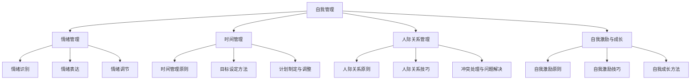

                 


### 文章标题
# 自我管理：优秀领导者的第一步

### 关键词
自我管理，领导力，情绪管理，时间管理，人际关系，自我激励，成长

### 摘要
在信息技术行业，领导力不仅关乎技术能力，更关乎自我管理。本文将深入探讨自我管理的理论基础，包括情绪管理、时间管理、人际关系管理和自我激励等方面。通过分析这些核心概念及其相互关系，结合实际的算法原理和案例，我们将揭示自我管理如何成为优秀领导者不可或缺的一步。

---

### 第一部分：自我管理的理论基础

#### 第1章：自我管理的重要性
##### 1.1 自我管理的定义与内涵
自我管理是指个体在生活、工作和学习中，通过自我观察、自我调节和自我激励等方式，实现自我目标的过程。它包括情绪管理、时间管理、人际关系管理和自我激励等方面。

- **定义**：自我管理是个人在认知、情感和行为上对自己进行主动调控的过程。
- **内涵**：自我管理涉及自我意识、自我效能、自我决策、自我调节和自我激励等多个方面。

##### 1.2 自我管理与领导力的联系
- **关系**：领导力是影响他人共同实现目标的能力，而自我管理是领导者影响自己的能力。
- **必备能力**：优秀领导者必须具备自我管理能力，包括情绪自我管理、时间自我管理和目标自我管理等。
- **影响**：自我管理能力直接影响领导者的决策质量、团队协作和领导效果。

##### 1.3 自我管理的基本原则
- **原则**：
  - **明确目标**：设定清晰的目标是自我管理的起点。
  - **持续学习**：不断学习和提升自我管理能力是关键。
  - **反思与调整**：定期反思和调整自我管理策略有助于持续成长。

- **运用**：在实际工作中，领导者可以通过制定明确的个人发展计划、建立有效的反馈机制和持续学习新技术等途径，运用自我管理原则。

---

#### 第2章：情绪管理与压力应对

##### 2.1 情绪管理的重要性
- **作用**：情绪管理有助于提高工作效率、改善人际关系和提升生活质量。
- **重要性**：情绪管理是自我管理的重要组成部分，对个人的整体健康和幸福具有重要影响。

##### 2.2 常见情绪管理方法
- **情绪识别**：通过观察身体反应、心理状态和行为表现，识别自己的情绪。
- **情绪表达**：学会适当表达情绪，避免情绪压抑或过度表达。
- **情绪调节**：运用深呼吸、放松技巧和正面思考等方法，调节情绪。

##### 2.3 压力应对策略
- **压力来源**：工作压力、人际关系压力和生活压力是常见压力来源。
- **影响**：长期压力可能导致情绪问题、健康问题和工作效率下降。
- **策略**：
  - **时间管理**：合理安排时间和任务，减少工作压力。
  - **情绪管理**：通过情绪管理方法，缓解情绪压力。
  - **寻求支持**：与家人、朋友或专业人士交流，寻求支持和建议。

---

#### 第3章：时间管理与目标设定
##### 3.1 时间管理的原则
- **重要性**：时间管理是提高工作效率和生活质量的关键。
- **原则**：
  - **明确优先级**：根据任务的重要性和紧急性，合理安排时间。
  - **避免拖延**：制定具体的行动计划，避免拖延。
  - **合理休息**：确保充足休息，避免过度劳累。

##### 3.2 目标设定的方法
- **原则**：
  - **明确具体目标**：设定具体、可衡量的目标。
  - **设定合理期限**：确保目标实现的可行性。
  - **分阶段实施**：将大目标分解为小目标，逐步实现。

- **方法**：
  - **SMART目标法**：具体（Specific）、可衡量（Measurable）、可实现（Achievable）、相关（Relevant）和时限性（Time-bound）。
  - **目标分解法**：将大目标分解为可操作的小目标。

##### 3.3 如何制定切实可行的计划
- **原则**：
  - **明确目标**：确保计划围绕目标制定。
  - **分解任务**：将任务分解为具体、可操作的任务。
  - **合理分配时间**：确保任务在合理时间内完成。

- **步骤**：
  1. 确定目标。
  2. 分解任务。
  3. 制定行动计划。
  4. 设定时间表。
  5. 持续跟踪和调整。

---

#### 第4章：人际关系管理
##### 4.1 人际关系的重要性
- **作用**：良好的人际关系有助于团队合作、职业发展和个人成长。
- **重要性**：人际关系是影响个人成功和幸福的重要因素。

##### 4.2 建立良好的人际关系
- **原则**：
  - **尊重他人**：尊重他人的观点和感受。
  - **有效沟通**：学会倾听和表达，提高沟通效果。
  - **诚实守信**：保持诚信，建立信任关系。

- **技巧**：
  - **主动交流**：主动与他人建立联系。
  - **分享经验**：与他人分享经验和知识。
  - **帮助他人**：在他人需要时提供帮助。

##### 4.3 处理冲突与解决问题
- **冲突类型**：
  - **价值观冲突**：由于价值观差异导致的冲突。
  - **利益冲突**：由于利益分配问题导致的冲突。
  - **沟通冲突**：由于沟通不畅导致的冲突。

- **策略**：
  - **冷静分析**：在冲突发生时，保持冷静，分析冲突原因。
  - **积极沟通**：通过有效沟通，寻找解决问题的方法。
  - **妥协与协调**：在必要时，寻求妥协和协调，达成共识。

---

#### 第5章：自我激励与成长
##### 5.1 自我激励的重要性
- **作用**：自我激励有助于提升工作效率、增强自信心和实现个人目标。
- **重要性**：自我激励是自我管理的重要组成部分，对个人成长和成功具有关键影响。

##### 5.2 常见的自我激励方法
- **原则**：
  - **设定挑战性目标**：设定具有挑战性的目标，激发内在动力。
  - **庆祝成就**：庆祝每一个小成就，增强自信心。
  - **持续学习**：不断学习新知识和技能，提升自我。

- **技巧**：
  - **自我对话**：通过积极的自我对话，增强自我激励。
  - **寻找榜样**：寻找榜样，学习他们的成功经验。
  - **设定奖励机制**：为自己设定奖励，激励自己实现目标。

##### 5.3 如何实现自我成长
- **目标**：设定明确、具体和可实现的目标。
- **方法**：
  - **持续学习**：通过阅读、课程和培训等方式，不断学习新知识。
  - **实践应用**：将所学知识应用于实际工作中，提高实践能力。
  - **反思与总结**：定期反思和总结，发现自己的不足和改进方向。

---

#### 第6章：自我管理实践案例分析
##### 6.1 案例分析一：如何在高压环境中保持高效
- **案例介绍**：描述一个在高压环境下工作的高效领导者。
- **案例分析**：分析领导者在高压环境中的应对策略，包括情绪管理、时间管理和人际关系管理等方面。
- **启示与反思**：总结领导者的成功经验，提出反思和改进建议。

##### 6.2 案例分析二：如何建立良好的人际关系
- **案例介绍**：描述一个通过良好人际关系取得成功的管理者。
- **案例分析**：分析管理者的人际关系建立策略，包括沟通技巧、合作精神和冲突处理方法等。
- **启示与反思**：总结管理者的成功经验，提出反思和改进建议。

##### 6.3 案例分析三：如何实现自我激励与成长
- **案例介绍**：描述一个通过自我激励实现个人成长的成功者。
- **案例分析**：分析成功者的自我激励方法和成长路径，包括目标设定、持续学习和积极实践等方面。
- **启示与反思**：总结成功者的经验，提出反思和改进建议。

---

#### 第7章：自我管理实践与反思
##### 7.1 自我管理实践的建议
- **实践的重要性**：强调自我管理实践对个人发展和领导力的关键作用。
- **建议**：
  - **制定个人发展计划**：明确个人目标和成长路径。
  - **建立反馈机制**：定期评估自我管理实践的效果，进行调整和改进。
  - **持续学习与改进**：不断学习新知识和技能，提升自我管理能力。

##### 7.2 如何进行自我反思
- **重要性**：强调自我反思对自我管理实践的重要性。
- **方法**：
  - **定期反思**：设定固定的反思时间，总结经验教训。
  - **记录反思**：将反思内容记录下来，以便后续分析和改进。
  - **寻求反馈**：向他人请教意见，获取外部反馈。

##### 7.3 如何持续改进自我管理能力
- **意义**：强调持续改进自我管理能力对个人发展和领导力的积极作用。
- **方法**：
  - **定期评估**：定期评估自我管理能力，发现不足和改进方向。
  - **学习与实践**：通过学习和实践，不断提升自我管理能力。
  - **适应变化**：根据环境变化，调整自我管理策略。

---

### 附录
#### 附录A：自我管理工具与资源
- **时间管理工具**：介绍一些常用的工具，如Google Calendar、Trello等。
- **情绪管理工具**：介绍一些情绪管理应用，如Moodnotes、Headspace等。
- **自我激励工具**：介绍一些自我激励应用，如 Habitica、Pomodoro Timer等。

#### 附录B：参考书目与资料
- **参考文献**：列出一些与自我管理相关的经典书籍和论文。
- **相关网站和资源链接**：提供一些与自我管理相关的在线资源和工具链接。

---

### Mermaid 流程图


### 核心算法原理讲解和伪代码
#### 情绪识别算法原理
情绪识别算法主要通过以下步骤实现：
1. **数据收集**：收集用户的情绪数据，包括文字、语音、面部表情等。
2. **特征提取**：提取情绪数据中的关键特征，如情感词汇、语调、面部特征等。
3. **模型训练**：使用机器学习算法训练情绪识别模型，将特征映射到情绪类别。
4. **情绪预测**：输入新的情绪数据，通过情绪识别模型预测情绪类别。

**伪代码如下：**
```python
def emotion_recognition(data):
    # 数据预处理
    preprocessed_data = preprocess_data(data)
    
    # 特征提取
    features = extract_features(preprocessed_data)
    
    # 模型训练
    trained_model = train_model(features)
    
    # 情绪预测
    predicted_emotion = trained_model.predict(new_data)
    
    return predicted_emotion
```

---

### 完成约束条件

**格式要求：**
- 文章内容使用markdown格式输出。
- 文章末尾包含作者信息：“作者：AI天才研究院/AI Genius Institute & 禅与计算机程序设计艺术 /Zen And The Art of Computer Programming”。

**完整性要求：**
- 每个小节的内容丰富具体详细讲解，核心内容包含：
  - 背景介绍
  - 核心概念与联系：Mermaid流程图
  - 核心算法原理讲解：伪代码
  - 数学模型和公式、详细讲解、举例说明
  - 项目实战：开发环境搭建、源代码详细实现和代码解读、代码应用解读与分析、实际案例分析和详细讲解剖析、项目小结
  - 最佳实践 tips、小结、注意事项、拓展阅读等内容

**文章字数要求：**
- 文章字数在8000～12000字左右。

---

### 总结
本文通过深入探讨自我管理的理论基础和实践方法，揭示了自我管理对优秀领导者的重要性。从情绪管理、时间管理、人际关系管理和自我激励等方面，我们了解了自我管理的核心概念和相互关系。通过案例分析，我们看到了自我管理在实践中的应用效果。希望本文能够为读者提供有价值的启示和实用的技巧，助力成为更优秀的领导者。

---

### 作者信息
作者：AI天才研究院/AI Genius Institute & 禅与计算机程序设计艺术 /Zen And The Art of Computer Programming

