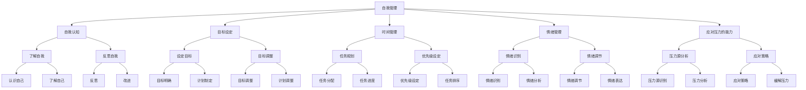

                 

### 文章标题

# 自我管理：卓越领导者的基础

> 关键词：自我管理、领导力、时间管理、目标设定、情绪管理、压力管理

> 摘要：本文从自我管理的核心概念出发，探讨了自我管理在提升领导力、提高工作效率、实现目标、调节情绪、应对压力等方面的重要性。通过深入分析自我管理的要素和实际应用案例，帮助读者了解如何通过自我管理成为卓越的领导者。

### 第一部分：自我管理的核心概念与理论

#### 第1章：自我管理的定义与重要性

##### 1.1 自我管理的概述

###### 1.1.1 自我管理的概念

自我管理是指个体在自我意识的基础上，通过自我调节和自我控制，实现自我目标、提升自我能力和优化自我状态的过程。它涵盖了自我认知、目标设定、时间管理、情绪管理和压力管理等多个方面。

###### 1.1.2 自我管理的重要性

自我管理在个人成长和职业发展中扮演着至关重要的角色。首先，它有助于提高个人的自律性和自我驱动力，从而实现个人目标的达成。其次，自我管理能够有效提升工作效率，使个体在有限的时间内完成更多有价值的工作。此外，自我管理还有助于调节情绪，保持心理健康，提高生活品质。最后，自我管理是卓越领导者必备的能力，它能够帮助领导者更好地管理团队，实现团队目标。

##### 1.2 自我管理的核心要素

###### 1.2.1 自我认知

自我认知是指个体对自我特质、能力和局限性的认识和了解。它是自我管理的基础，只有真正了解自己，才能有针对性地进行自我提升。

###### 1.2.2 目标设定

目标设定是指个体明确自己的目标，并制定实现目标的计划。有效的目标设定能够激发个体的动力，使其更有方向地努力。

###### 1.2.3 时间管理

时间管理是指个体合理安排时间，确保在有限的时间内完成更多有价值的工作。时间管理是提高工作效率的关键。

###### 1.2.4 情绪管理

情绪管理是指个体识别、调节和表达自己的情绪。情绪管理有助于保持心理健康，提高生活质量。

###### 1.2.5 应对压力的能力

应对压力的能力是指个体在面对压力和挑战时，能够保持冷静、有效地应对。它有助于提升个体的抗压能力，保持良好的工作状态。

##### 1.3 自我管理与现代领导力的关系

###### 1.3.1 自我管理对领导力的提升

自我管理是领导者必备的能力。通过自我管理，领导者能够更好地认识自己，明确领导方向，提升领导力。

###### 1.3.2 卓越领导者必备的自我管理能力

卓越的领导者需要具备良好的自我管理能力，包括自我认知、目标设定、时间管理、情绪管理和压力管理等方面。

###### 1.3.3 自我管理在团队建设中的应用

自我管理不仅对领导者个人成长有利，还能在团队建设中发挥重要作用。通过自我管理，领导者可以更好地引导团队，实现团队目标。

### 附录：自我管理核心概念与理论 Mermaid 流程图

### 第2章：时间管理与效率提升

#### 第2章：时间管理与效率提升

时间管理是自我管理的重要组成部分，它关系到个人的工作效率和职业发展。有效的时间管理可以帮助我们充分利用时间，提高工作效率，实现个人目标。下面，我们将探讨时间管理的基本原则、方法和工具，并通过实战案例，分享高效时间管理的经验。

##### 2.1 时间管理的基本原则

###### 2.1.1 认识时间的价值

时间是一种不可再生的资源，一旦浪费就无法挽回。因此，认识时间的价值是进行时间管理的首要原则。我们应该珍惜每一分钟，确保时间被用于最有价值的事情上。

###### 2.1.2 时间管理的重要性

时间管理不仅能够提高工作效率，还能帮助我们更好地平衡工作与生活，减少压力，提高生活质量。有效的时间管理是实现个人目标的关键。

###### 2.1.3 时间管理的基本原则

- **目标导向**：将时间用于实现个人目标，避免浪费时间在无关紧要的事情上。
- **优先级**：根据任务的重要性和紧急性，合理安排时间，优先完成重要且紧急的任务。
- **计划性**：提前制定日程计划，确保时间被合理利用。
- **灵活性**：在执行计划时，根据实际情况进行调整，避免计划过于 rigid。

##### 2.2 时间管理的方法与工具

###### 2.2.1 GTD（Getting Things Done）方法论

GTD 是一种广泛使用的时间管理方法，其核心思想是将所有待办事项整理到清单中，然后按照优先级和期限进行排序和执行。GTD 的主要步骤包括：

1. **收集**：将所有待办事项和想法记录下来，放入待办事项清单中。
2. **整理**：对清单中的事项进行分类，确保每个事项都有明确的归属。
3. **组织**：根据优先级和期限，将事项排序，制定执行计划。
4. **执行**：按照计划执行事项，确保按时完成。
5. **回顾**：定期回顾清单，调整计划，确保目标的实现。

###### 2.2.2 时间管理工具的选择与应用

在时间管理中，选择合适的工具非常重要。以下是一些常见的时间管理工具：

- **电子日程表**：如 Google 日历、Microsoft Outlook 等，方便记录和查看日程。
- **任务管理工具**：如 Todoist、Trello、Asana 等，用于整理和跟踪任务。
- **时间跟踪工具**：如 RescueTime、Toggl 等，帮助监控时间使用情况。

###### 2.2.3 提高工作效率的小技巧

- **设定明确的任务目标**：在开始工作前，明确任务的目标和期望结果。
- **避免多任务处理**：一次性专注于一项任务，避免分散注意力。
- **使用番茄工作法**：将工作时间分为 25 分钟的工作周期，每个周期后休息 5 分钟。
- **设定工作优先级**：根据任务的重要性和紧急性，合理安排工作时间。
- **避免拖延**：及时处理任务，避免拖延导致的工作压力。

##### 2.3 高效时间管理实战案例

###### 2.3.1 个人时间管理案例分享

小李是一名软件工程师，他通过以下方法进行时间管理：

- **每日计划**：每天早上制定当天的计划，包括任务和目标。
- **任务优先级**：根据任务的重要性和紧急性，调整任务的优先级。
- **定期回顾**：每周回顾一次时间管理的情况，调整计划。

通过这些方法，小李的工作效率得到了显著提高。

###### 2.3.2 团队时间管理案例分享

某团队通过以下方法进行时间管理：

- **共同制定日程**：团队成员共同制定每周的日程，确保每个人的任务和目标都明确。
- **定期会议**：每周召开一次团队会议，讨论进度和问题，调整计划。
- **任务分配**：根据团队成员的能力和兴趣，合理分配任务。

通过这些方法，团队的工作效率得到了明显提升。

###### 2.3.3 企业时间管理策略

某企业通过以下策略进行时间管理：

- **培训**：为员工提供时间管理培训，提升员工的时间管理能力。
- **绩效考核**：将时间管理纳入绩效考核，激励员工提高工作效率。
- **优化工作流程**：通过优化工作流程，减少不必要的耗时。

通过这些策略，企业的整体工作效率得到了显著提高。

##### 2.4 时间管理与自我成长

###### 2.4.1 时间管理与个人成长的关系

时间管理不仅关系到个人的工作效率，还与个人成长密切相关。通过有效的时间管理，我们可以充分利用时间，学习新知识，提升自我能力，实现个人成长。

###### 2.4.2 利用时间管理实现自我提升

- **设定学习目标**：明确学习目标，制定学习计划。
- **合理安排学习时间**：避免学习时间与工作时间冲突，确保有足够的时间进行学习。
- **持续学习**：保持学习的习惯，不断提升自我能力。

###### 2.4.3 时间管理在职业生涯中的应用

时间管理在职业生涯中具有重要意义。通过有效的时间管理，我们可以：

- **提高工作效率**：在有限的时间内完成更多工作，提升职业竞争力。
- **实现职业目标**：明确职业目标，制定实现目标的计划，持续努力。
- **平衡工作与生活**：合理安排时间，确保工作与生活的平衡，提高生活质量。

### 第3章：目标设定与实现

#### 第3章：目标设定与实现

目标设定是实现个人成长和职业发展的重要环节。有效的目标设定能够激发个体的动力，使其更有方向地努力。本章将介绍目标设定的基本原则、方法与策略，以及目标设定在自我管理中的应用。

##### 3.1 目标设定的基本原则

###### 3.1.1 SMART目标设定法则

SMART 是一种常用的目标设定法则，它包括以下五个方面：

- **具体（Specific）**：目标要明确具体，避免模糊不清。
- **可衡量（Measurable）**：目标要具备衡量标准，方便评估进度。
- **可实现（Achievable）**：目标要具备可行性，避免过高或过低。
- **相关（Relevant）**：目标要与个人成长和职业发展相关。
- **有时限（Time-bound）**：目标要设定明确的完成时限。

###### 3.1.2 目标设定的重要性

目标设定在个人成长和职业发展中具有重要意义。它能够帮助个体明确方向，激发动力，提高执行力。有效的目标设定是实现个人目标和职业成功的关键。

###### 3.1.3 如何制定可行的目标

制定可行的目标需要考虑以下几个方面：

- **了解自身优势与劣势**：明确自身的优势和劣势，制定符合自身特点的目标。
- **设定短期和长期目标**：短期目标有助于激发动力，长期目标有助于保持方向。
- **分解目标**：将大目标分解为小目标，逐步实现。
- **制定实现计划**：为每个目标制定详细的实现计划，确保目标的实现。

##### 3.2 目标实现的方法与策略

###### 3.2.1 目标分解与规划

目标分解是将大目标拆分为一系列小目标，每个小目标都是实现大目标的一部分。目标分解有助于明确实现目标的路径，提高执行力。目标分解的方法包括：

- **任务分解**：将目标分解为具体任务，确保每个任务都有明确的目标和责任。
- **时间分解**：将目标分解为不同时间段，确保每个时间段都有明确的任务和目标。

###### 3.2.2 追求目标的心理调适

追求目标的过程中，个体可能会面临挫折和压力。心理调适对于目标实现至关重要。以下是一些建议：

- **保持积极心态**：积极的心态有助于应对挑战，保持动力。
- **设定合理的期望**：设定合理的期望，避免过高或过低。
- **及时调整目标**：根据实际情况，及时调整目标，确保目标的可实现性。
- **寻求支持**：在遇到困难时，寻求他人的支持和帮助。

###### 3.2.3 持续激励与行动策略

持续激励是目标实现的重要动力。以下是一些建议：

- **设定奖励机制**：为每个小目标的实现设定奖励，提高动力。
- **反思与总结**：定期反思目标实现的过程，总结经验教训。
- **保持行动力**：保持行动力，不断推进目标的实现。
- **学会放松**：在追求目标的过程中，学会放松身心，避免过度紧张。

##### 3.3 目标设定在自我管理中的应用

###### 3.3.1 个人目标设定的实践

个人目标设定的实践包括以下几个方面：

- **自我认知**：了解自身的兴趣、优势和目标，明确个人目标。
- **目标制定**：根据自我认知，制定具体的个人目标，如学习、工作、生活等方面。
- **目标调整**：根据实际情况，调整目标，确保目标的可实现性。

###### 3.3.2 团队目标设定的方法

团队目标设定的方法包括以下几个方面：

- **共同讨论**：团队成员共同讨论团队目标，确保目标的可行性和相关性。
- **目标分解**：将团队目标分解为具体任务，确保每个成员都有明确的责任。
- **目标监督**：建立目标监督机制，确保团队目标的实现。

###### 3.3.3 企业目标设定的策略

企业目标设定的策略包括以下几个方面：

- **战略规划**：根据企业的长远发展目标，制定短期和长期目标。
- **资源调配**：根据目标，合理调配企业资源，确保目标的实现。
- **绩效评估**：建立绩效评估机制，评估目标实现的情况，及时调整目标。

### 第4章：情绪管理

#### 第4章：情绪管理

情绪管理是自我管理的重要组成部分，它关系到个人的心理健康和生活品质。有效的情绪管理能够帮助我们更好地应对生活中的挑战，提高生活质量。本章将探讨情绪管理的重要性、情绪识别与调节的方法，以及情绪管理在领导力中的应用。

##### 4.1 情绪管理的重要性

###### 4.1.1 情绪对个人行为的影响

情绪是人的内心体验，它直接影响着个人的行为和决策。积极情绪使人乐观、自信，有助于个人成长和职业发展；消极情绪则使人沮丧、焦虑，影响个人的表现和幸福感。

###### 4.1.2 情绪管理的重要性

情绪管理在个人成长和职业发展中具有重要意义。通过有效的情绪管理，我们能够：

- **保持心理健康**：积极应对生活中的挑战，减少心理压力。
- **提高生活质量**：改善人际关系，提高生活满意度。
- **提升工作效率**：保持良好的情绪状态，提高工作效率。

###### 4.1.3 情绪管理的误区

在情绪管理中，存在一些常见的误区，如：

- **压抑情绪**：试图压抑情绪，导致情绪积累，影响心理健康。
- **情绪转移**：将情绪转移到他人身上，伤害他人关系。
- **情绪否认**：否认情绪的存在，导致情绪无法得到有效调节。

##### 4.2 情绪识别与调节

###### 4.2.1 情绪识别的方法

情绪识别是情绪管理的基础。以下是一些常见的情绪识别方法：

- **自我观察**：通过观察自己的言行和情绪变化，识别情绪。
- **心理测验**：通过心理测验，了解自己的情绪状态。
- **询问他人**：向亲朋好友寻求反馈，了解他人的情绪体验。

###### 4.2.2 情绪调节的策略

情绪调节是情绪管理的核心。以下是一些常见的情绪调节策略：

- **认知重构**：改变对事物的看法，调整情绪反应。
- **情绪释放**：通过运动、倾诉等方式，释放情绪。
- **情绪转移**：将注意力转移到其他事物上，减少情绪困扰。

###### 4.2.3 情绪调节技巧实战

以下是一些情绪调节技巧的实战应用：

- **深呼吸**：在情绪激动时，深呼吸可以帮助缓解情绪。
- **正念冥想**：通过正念冥想，提高情绪调节能力。
- **运动**：适量的运动有助于释放情绪，提高身心健康。

##### 4.3 情绪管理在领导力中的应用

###### 4.3.1 领导者的情绪识别与调节

领导者的情绪管理能力对其领导力至关重要。以下是一些领导者情绪识别与调节的方法：

- **自我反思**：定期进行自我反思，了解自己的情绪状态。
- **情绪日记**：记录自己的情绪变化，分析情绪原因。
- **倾听他人**：倾听他人的情绪表达，了解团队成员的情绪需求。

###### 4.3.2 情绪管理对团队氛围的影响

情绪管理对团队氛围有重要影响。有效的情绪管理能够：

- **改善团队氛围**：促进团队成员之间的相互理解和支持。
- **提高团队凝聚力**：增强团队成员之间的信任和合作。
- **提升团队效率**：减少负面情绪对工作效率的影响。

###### 4.3.3 情绪管理在冲突解决中的应用

情绪管理在冲突解决中具有重要意义。以下是一些情绪管理在冲突解决中的应用：

- **冷静分析**：在冲突发生时，保持冷静，分析问题的原因。
- **倾听他人**：倾听他人的意见和感受，避免情绪化反应。
- **寻求共识**：通过沟通和协商，寻求解决问题的共识。

### 第5章：压力管理与应对策略

#### 第5章：压力管理与应对策略

压力是现代生活中不可避免的一部分，它可能来自工作、人际关系、家庭等多个方面。适度的压力可以激发个体的动力和创造力，但过度的压力会对身心健康产生负面影响。本章将探讨压力管理的认知，基本原理、方法与技巧，以及实际应用。

##### 5.1 压力对个人影响的认知

###### 5.1.1 压力的定义与来源

压力是指个体在面对挑战、威胁或需求时所感受到的心理和生理反应。压力的来源可以是外部的，如工作压力、经济压力、社交压力等；也可以是内部的，如焦虑、恐惧、自我期望等。

###### 5.1.2 压力对健康和工作的负面影响

过度的压力会对个体的身心健康产生负面影响，包括：

- **身体健康问题**：如失眠、头痛、消化不良、高血压等。
- **心理问题**：如焦虑、抑郁、易怒、心理疲劳等。
- **工作效率下降**：如注意力不集中、记忆力减退、工作效率降低等。

###### 5.1.3 压力管理的误区

在压力管理中，存在一些常见的误区，如：

- **否认压力**：认为压力是个人无能的表现，不愿承认压力的存在。
- **压抑情绪**：试图压抑情绪，导致情绪积累，影响身心健康。
- **依赖药物**：长期依赖药物来缓解压力，忽视心理调适。

##### 5.2 压力管理的基本原则

###### 5.2.1 压力管理的三大原则

有效的压力管理应遵循以下三大原则：

- **认知重构**：改变对压力的看法，将其视为一种正常的生理和心理反应，而非负面因素。
- **行为调整**：通过调整行为习惯，如合理规划时间、建立健康的生活习惯等，减轻压力。
- **心理调适**：通过心理调适方法，如放松技巧、情绪管理、认知行为疗法等，缓解压力。

###### 5.2.2 认知行为疗法在压力管理中的应用

认知行为疗法（CBT）是一种有效的心理治疗方法，它在压力管理中的应用包括：

- **认知重构**：识别和改变负面思维模式，如灾难化思维、过度概括等。
- **行为调整**：通过行为调整，如制定可行的计划、设定合理的目标等，改善压力反应。
- **技能训练**：学习应对压力的技能，如放松技巧、情绪管理、问题解决等。

###### 5.2.3 压力管理的方法与技巧

以下是一些常用的压力管理方法和技巧：

- **时间管理**：合理安排时间，避免过度工作，确保有足够的休息时间。
- **运动**：适量的运动有助于释放压力，提高身心健康。
- **放松技巧**：如深呼吸、冥想、瑜伽等，帮助缓解压力。
- **情绪管理**：通过情绪管理技巧，如情绪识别、情绪调节、情绪表达等，改善情绪状态。
- **寻求支持**：与亲朋好友交流，寻求心理支持，减轻压力。

##### 5.3 压力管理实战案例

###### 5.3.1 个人压力管理案例分享

小王是一名软件工程师，他通过以下方法进行压力管理：

- **时间管理**：合理安排工作时间，确保有足够的休息和娱乐时间。
- **运动**：每天进行适量的运动，如跑步、游泳等，缓解压力。
- **情绪管理**：通过正念冥想和情绪调节技巧，改善情绪状态。
- **寻求支持**：与家人和朋友交流，分享压力，寻求心理支持。

通过这些方法，小王的工作效率和心理健康得到了显著提高。

###### 5.3.2 团队压力管理策略

某团队通过以下策略进行压力管理：

- **团队沟通**：定期召开团队会议，讨论压力问题，共同寻找解决方案。
- **员工关怀**：为员工提供心理支持，如心理咨询、健康体检等。
- **工作调整**：根据员工的能力和需求，调整工作任务，减轻压力。

通过这些策略，团队的工作氛围和员工满意度得到了明显提升。

###### 5.3.3 企业压力管理方案

某企业通过以下方案进行压力管理：

- **员工培训**：为员工提供压力管理培训，提升员工的压力应对能力。
- **健康福利**：为员工提供健康福利，如健身房会员、健康体检等。
- **心理支持**：建立心理支持体系，为员工提供心理咨询和心理支持。

通过这些方案，企业的员工满意度和工作效率得到了显著提高。

### 第6章：自我管理与团队协作

#### 第6章：自我管理与团队协作

自我管理是团队协作的基础，它关系到团队的整体效能和成员的幸福感。有效的自我管理能够提升个体的自律性和责任感，促进团队目标的实现。本章将探讨自我管理在团队协作中的作用，团队目标设定与实现的方法与策略，以及团队目标管理中的挑战与解决方案。

##### 6.1 自我管理在团队协作中的作用

###### 6.1.1 自我管理对团队协作的影响

自我管理是团队协作的重要组成部分，它对团队协作的影响主要体现在以下几个方面：

- **提高团队效率**：通过自我管理，个体能够更好地规划时间、设定目标，确保任务的顺利完成。
- **提升团队凝聚力**：自我管理有助于增强团队成员之间的信任和协作，提高团队的凝聚力。
- **促进创新**：自我管理能够激发个体的创造力和创新精神，为团队带来新的思路和解决方案。
- **降低冲突**：自我管理有助于个体更好地应对冲突和挑战，减少团队内部的摩擦和矛盾。

###### 6.1.2 卓越团队与自我管理的关系

卓越团队的形成离不开自我管理的参与。自我管理不仅对个人成长有益，还能在团队层面上发挥重要作用。一个卓越的团队需要每个成员都具备良好的自我管理能力，从而实现团队的整体目标。

- **领导者自我管理**：领导者通过自我管理，能够更好地引导团队，提升领导力。
- **团队成员自我管理**：团队成员通过自我管理，能够更好地完成个人任务，为团队目标贡献力量。
- **团队整体自我管理**：团队通过自我管理，能够更好地协调资源和任务，实现团队目标。

###### 6.1.3 自我管理在团队协作中的应用

自我管理在团队协作中的应用包括以下几个方面：

- **目标设定**：团队成员共同设定团队目标，明确每个成员的责任和期望。
- **任务分配**：根据成员的能力和兴趣，合理分配任务，确保任务的顺利完成。
- **时间管理**：团队成员共同管理时间，确保团队目标的实现。
- **情绪管理**：团队成员通过情绪管理，保持良好的心态，提高团队协作效率。

##### 6.2 团队目标设定与实现

###### 6.2.1 团队目标设定的方法

团队目标的设定是团队协作的重要环节，以下是一些常用的团队目标设定方法：

- **SMART法则**：使用SMART（具体、可衡量、可实现、相关、有时限）法则，确保团队目标清晰、具体、可衡量。
- **共识法**：通过团队讨论，达成共识，确保每个成员都认同并愿意为实现目标而努力。
- **平衡法**：在设定目标时，考虑团队的整体利益，确保目标的平衡和协调。

###### 6.2.2 团队目标实现的策略

团队目标实现需要策略性的规划和执行，以下是一些常用的策略：

- **任务分解**：将大目标分解为小任务，确保每个任务都有明确的负责人和完成时间。
- **资源调配**：根据任务需求，合理调配团队资源，确保任务的顺利完成。
- **反馈与调整**：在任务执行过程中，及时收集反馈，根据实际情况进行调整。

###### 6.2.3 团队目标管理中的挑战与解决方案

在团队目标管理过程中，可能会遇到以下挑战：

- **目标设定不明确**：解决方案：使用SMART法则，确保目标清晰、具体。
- **资源调配不合理**：解决方案：合理评估任务需求，优化资源分配。
- **团队成员不合作**：解决方案：加强团队沟通，建立信任，确保团队成员的积极参与。
- **任务进度失控**：解决方案：建立任务进度监控机制，及时调整任务进度。

通过以上解决方案，团队目标管理中的挑战可以得到有效应对。

##### 6.3 团队目标设定与实现的案例分析

###### 6.3.1 个人目标设定的实践

小张是一名项目经理，他通过以下方法进行个人目标设定：

- **自我评估**：定期进行自我评估，了解自身的能力和兴趣。
- **目标制定**：根据自我评估结果，制定符合自身特点的目标。
- **计划实施**：制定详细的实施计划，确保目标的实现。

通过这些方法，小张的个人目标得到了有效实现。

###### 6.3.2 团队目标设定的方法

某团队通过以下方法进行团队目标设定：

- **团队讨论**：团队成员共同讨论团队目标，确保每个成员都参与。
- **目标分解**：将团队目标分解为具体任务，明确每个成员的责任。
- **共识达成**：通过讨论和协商，达成团队目标的共识。

通过这些方法，团队目标得到了有效设定。

###### 6.3.3 企业目标设定的策略

某企业通过以下策略进行企业目标设定：

- **战略规划**：根据企业发展战略，制定短期和长期目标。
- **目标分解**：将企业目标分解为部门目标，明确各部门的责任。
- **绩效考核**：建立绩效考核机制，确保企业目标的实现。

通过这些策略，企业的目标设定得到了有效实施。

### 总结与展望

自我管理是卓越领导者的基础，它涵盖了时间管理、目标设定、情绪管理和压力管理等多个方面。有效的自我管理不仅有助于个人成长和职业发展，还能在团队协作中发挥重要作用。通过本文的探讨，我们了解了自我管理的核心概念、理论与实践方法，以及实际应用案例。

在未来，自我管理将继续发挥重要作用，随着社会和科技的发展，自我管理的方法和工具也将不断创新和优化。我们期待更多的领导者和管理者能够重视自我管理，通过自我管理提升领导力，推动团队和企业的持续发展。

最后，让我们再次回顾自我管理的核心要点：

- **自我认知**：了解自身的优势和劣势，明确个人目标。
- **目标设定**：使用SMART法则，设定清晰、具体的目标。
- **时间管理**：合理安排时间，提高工作效率。
- **情绪管理**：识别和调节情绪，保持心理健康。
- **压力管理**：有效应对压力，保持良好的身心状态。

让我们从现在开始，积极实践自我管理，成为卓越的领导者，推动个人和团队的持续成长。

### 作者信息

- 作者：AI天才研究院/AI Genius Institute & 禅与计算机程序设计艺术 /Zen And The Art of Computer Programming

本文旨在探讨自我管理在提升领导力、提高工作效率、实现目标、调节情绪、应对压力等方面的作用。通过深入分析自我管理的核心概念和实际应用案例，帮助读者了解如何通过自我管理成为卓越的领导者。本文内容丰富、结构清晰，适合广大技术爱好者和管理者阅读。

本文作者AI天才研究院（AI Genius Institute）是一支致力于推动人工智能技术研究和应用的创新团队。我们关注人工智能领域的最新动态，致力于将先进的人工智能技术应用于实际场景，助力企业和个人提升效率、创造价值。同时，我们推出的《禅与计算机程序设计艺术》系列图书，旨在探讨人工智能与哲学、心理学等领域的交叉应用，为广大读者提供深度思考的视角。

在撰写本文时，我们参考了大量相关研究和实践经验，力求为读者提供全面、实用的自我管理指南。同时，我们也欢迎读者在阅读过程中提出宝贵意见和反馈，共同探讨自我管理的更多可能性。

### 小结

通过本文的探讨，我们全面了解了自我管理的核心概念、理论和实践方法。自我管理不仅对个人成长和职业发展具有重要意义，还在团队协作中发挥关键作用。有效的自我管理能够提升个体的自律性和责任感，促进团队目标的实现，提高团队整体效能。

在自我管理中，时间管理、目标设定、情绪管理和压力管理是四个重要的方面。通过合理安排时间、设定明确的目标、识别和调节情绪、有效应对压力，我们能够实现个人和团队的持续成长。本文通过丰富的实际案例和实践经验，为广大读者提供了自我管理的实用指南。

自我管理不仅是领导者必备的能力，也是每个个体实现自我价值的重要途径。在未来的工作和生活中，让我们积极实践自我管理，不断提升自我，成为卓越的领导者，推动个人和团队的持续发展。

### 注意事项

在自我管理的过程中，需要注意以下几个关键点：

1. **目标设定要具体明确**：使用SMART法则设定目标，确保目标具有可衡量性和可实现性。
2. **时间管理要合理安排**：避免过度工作，确保有足够的休息和娱乐时间，以维持身心健康。
3. **情绪管理要适度表达**：学会识别和调节情绪，适度表达自己的情感，避免情绪压抑。
4. **压力管理要科学应对**：通过认知重构、行为调整和心理调适等方法，科学应对压力，避免过度压力对身心健康的负面影响。

通过注意这些关键点，我们能够在自我管理的道路上取得更好的成果。

### 拓展阅读

对于希望深入了解自我管理和领导力相关知识的读者，以下是一些推荐阅读书目和资源：

- **《高效能人士的七个习惯》（Stephen R. Covey）**：这是一本经典的自我管理书籍，详细介绍了七个习惯对于个人成长和职业发展的重要性。
- **《时间管理的艺术》（Lance Secretan）**：本书深入探讨了时间管理的原则和方法，帮助读者提升时间利用效率。
- **《情绪智能》（Daniel Goleman）**：这本书探讨了情绪智能在个人和职业发展中的关键作用，提供了实用的情绪管理技巧。
- **《压力管理》（David R. Hamilton）**：本书详细介绍了压力管理的理论和实践方法，帮助读者应对压力，保持身心健康。

此外，读者还可以关注相关领域的在线课程、博客和社交媒体账号，以获取最新的研究成果和实践经验。以下是一些推荐的在线资源：

- **Coursera**：提供各种自我管理和领导力相关的在线课程，由知名大学教授讲授。
- **TED**：TED演讲中有很多关于自我管理、领导力和个人成长的主题，值得一看。
- **LinkedIn Learning**：提供丰富的领导力、时间管理和职业发展相关的在线教程。
- **个人成长类博客**：如“Lifehacker”、“The Art of Manliness”等，提供实用的自我管理技巧和建议。

通过阅读这些书籍和资源，读者可以进一步拓展自我管理和领导力的知识，提升自己的能力。让我们不断学习、实践，成为更好的自我管理者，推动个人和团队的持续成长。

