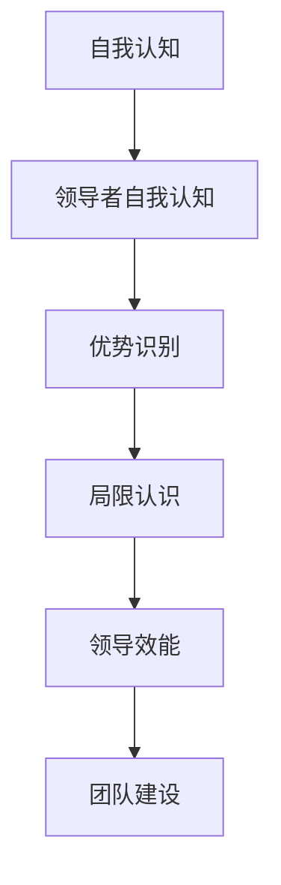

                 


### 文章标题

《自我认知：了解领导者的优势和局限》

### 关键词

自我认知，领导者，优势，局限，领导力，心理测试，数据分析，算法原理

### 摘要

本文通过深入探讨领导者自我认知的概念、工具和方法，揭示了领导者了解自身优势和局限的重要性。文章首先阐述了自我认知的基础，然后详细分析了领导者优势识别与开发的策略，以及领导者局限的认识与应对。通过案例分析，本文展示了成功领导者的自我认知实践，并探讨了领导者自我认知与领导效能之间的关系。最后，文章对领导者自我认知的未来趋势与挑战进行了展望，为领导者提供了有效的自我提升策略。

### 第一部分：自我认知基础

#### 第1章：自我认知的概念与重要性

##### 1.1.1 自我认知的定义

自我认知是指个体对自己的行为、思维、情感等方面的认识和理解。在领导者层面，自我认知意味着领导者对自己在团队管理、决策制定、沟通协调等方面的认识和评价。自我认知不仅涉及到领导者对自己能力和优势的认知，还包括对自己局限和不足的识别。

##### 1.1.2 自我认知的重要性

领导者自我认知对于团队和组织的发展至关重要。首先，自我认知有助于领导者了解自身的优势和潜力，从而更好地发挥个人价值。其次，通过识别自身局限，领导者可以针对性地进行改进和提升，提高领导效能。此外，自我认知还能帮助领导者更好地理解团队成员的需求和期望，促进团队凝聚力和协作效率。

##### 1.1.3 领导者自我认知的现状

当前，许多领导者已经认识到自我认知的重要性，并开始通过各种工具和方法进行自我认知。然而，实际操作中仍然存在一些问题。一些领导者可能过于自信，忽视了自身的局限；另一些领导者则可能过于消极，低估了自己的能力。此外，领导者自我认知的方法和工具较为有限，很多领导者缺乏有效的自我评估和反馈机制。

#### 第2章：领导者自我认知的工具和方法

##### 2.1.1 自我评估问卷

自我评估问卷是一种常见的领导者自我认知工具，通过一系列问题帮助领导者了解自己的行为、思维和情感特点。以下是一个简单的自我评估问卷示例：

- **1. 您在团队管理中通常采取哪种风格？**
  - **A. 指导型**  
  - **B. 参与型**  
  - **C. 支持型**  
  - **D. 授权型**

- **2. 您在决策制定时更倾向于哪种方法？**
  - **A. 个人决策**  
  - **B. 集体决策**  
  - **C. 观察市场趋势**  
  - **D. 风险分析**

##### 2.1.2 领导力测试

领导力测试是一种基于科学方法的领导者自我认知工具，通过一系列测试评估领导者的能力、优势和局限。以下是一个简单的领导力测试示例：

- **1. 您在面对压力和挑战时，通常如何应对？**
  - **A. 保持冷静，分析问题**  
  - **B. 沮丧和消极，缺乏应对能力**  
  - **C. 激发团队，共同应对**  
  - **D. 忽略问题，寻找逃避**

##### 2.1.3 反馈机制

反馈机制是一种有效的领导者自我认知方法，通过收集团队成员、同事和上级的反馈，帮助领导者了解自己的行为和表现。以下是一个简单的反馈机制示例：

- **1. 您在沟通方面有哪些优势和局限？**
  - **A. 优势：善于倾听，表达清晰**  
  - **B. 局限：有时过于直接，容易得罪人**  
  - **C. 优势：擅长引导，激励团队**  
  - **D. 局限：缺乏耐心，容易失去耐心**

#### 第3章：领导者优势识别与开发

##### 3.1.1 领导者优势的概念

领导者优势是指领导者在特定领域或情境中表现出的卓越能力和特点。领导者优势可以是领导力风格、沟通能力、决策能力、创新思维等。

##### 3.1.2 优势识别的方法

优势识别的方法主要包括自我评估、领导力测试、同事和团队成员的反馈等。以下是一个优势识别的过程：

1. **自我评估**：领导者首先需要了解自己的优势和特长，可以通过反思自己的行为、思考和情感来识别优势。

2. **领导力测试**：通过领导力测试，领导者可以了解自己在不同维度上的表现，识别自己的优势。

3. **同事和团队成员的反馈**：同事和团队成员的反馈可以帮助领导者从外部视角了解自己的优势和劣势。

##### 3.1.3 优势开发的策略

1. **持续学习和培训**：领导者可以通过参加培训课程、阅读相关书籍和文章等方式，不断学习和提升自己的优势。

2. **实践和经验积累**：领导者需要在实际工作中不断实践，通过经验和反馈来优化自己的优势。

3. **建立支持网络**：领导者可以寻求导师或教练的帮助，建立支持网络，共同提升领导力。

#### 第4章：领导者局限的认识与应对

##### 4.1.1 领导者局限的概念

领导者局限是指领导者在特定领域或情境中表现出的不足和短板。领导者局限可以是决策能力不足、沟通能力欠佳、情感管理能力较弱等。

##### 4.1.2 识别领导者局限的方法

识别领导者局限的方法包括自我反思、领导力测试、同事和团队成员的反馈等。以下是一个局限识别的过程：

1. **自我反思**：领导者需要定期反思自己的行为和思维，识别自己的局限。

2. **领导力测试**：通过领导力测试，领导者可以了解自己在不同维度上的表现，识别自己的局限。

3. **同事和团队成员的反馈**：同事和团队成员的反馈可以帮助领导者从外部视角了解自己的局限。

##### 4.1.3 应对领导者局限的策略

1. **提升认知水平**：领导者需要提高自己的认知水平，增强对自身局限的认识。

2. **制定改进计划**：领导者可以根据自己的局限，制定具体的改进计划，并付诸实践。

3. **寻求专业帮助**：领导者可以寻求导师、教练或心理咨询师的帮助，共同应对局限。

### 第二部分：领导者自我认知的案例分析

#### 第6章：成功领导者自我认知案例分析

##### 6.1.1 案例背景

案例中的领导者是一位在科技公司担任CEO的约翰。约翰在公司的快速发展过程中，意识到自我认知对于领导团队的重要性。他开始通过自我评估、领导力测试和同事反馈来了解自己的优势和局限。

##### 6.1.2 领导者优势分析

通过自我评估和同事反馈，约翰识别出自己的以下优势：

- **决策能力**：约翰在决策过程中具有强烈的洞察力和判断力，能够迅速做出明智的决策。
- **沟通能力**：约翰擅长与团队成员进行沟通，能够清晰地表达自己的想法，并倾听他人的意见。
- **创新思维**：约翰具有强烈的创新意识，能够带领团队开拓新市场，推动公司发展。

##### 6.1.3 领导者局限分析

通过领导力测试和同事反馈，约翰识别出自己的以下局限：

- **情感管理**：约翰在情绪管理方面存在一定问题，有时会过于情绪化，影响决策和团队氛围。
- **耐心不足**：约翰在工作中缺乏耐心，容易对团队成员产生压力，影响团队合作。

##### 6.1.4 应对策略

针对自己的局限，约翰采取以下措施：

- **情感管理**：约翰开始学习情感管理技巧，通过冥想和瑜伽来缓解情绪压力。
- **耐心培养**：约翰通过调整工作节奏，给自己和团队更多的时间和空间，提高耐心。

#### 第7章：领导者自我认知失败案例分析

##### 7.1.1 案例背景

案例中的领导者是一位在传统行业担任CEO的玛丽。玛丽在自我认知方面存在一定的不足，她没有意识到自己的局限，导致领导团队效果不佳。

##### 7.1.2 领导者优势分析

通过同事和团队成员的反馈，玛丽识别出自己的以下优势：

- **执行力**：玛丽在执行决策和任务时具有很高的执行力，能够迅速落实公司的战略。
- **领导风格**：玛丽采用民主领导风格，尊重团队成员的意见，促进团队合作。

##### 7.1.3 领导者局限分析

通过领导力测试和同事反馈，玛丽识别出自己的以下局限：

- **创新不足**：玛丽在推动公司创新方面存在一定问题，缺乏对新兴技术和市场的敏感性。
- **沟通能力**：玛丽在沟通方面存在一定不足，难以与团队成员建立有效的沟通渠道。

##### 7.1.4 应对策略

针对自己的局限，玛丽采取以下措施：

- **创新培训**：玛丽开始参加创新培训课程，提升自己的创新能力。
- **沟通培训**：玛丽参加沟通技巧培训，提高与团队成员的沟通效果。

### 第三部分：领导者自我认知的未来展望

#### 第8章：领导者自我认知的趋势与挑战

##### 8.1.1 领导者自我认知的发展趋势

随着人工智能和大数据技术的发展，领导者自我认知工具和方法将越来越智能化和精准化。例如，通过数据分析，领导者可以更准确地了解自己的优势和局限，制定更有针对性的提升策略。

##### 8.1.2 领导者自我认知面临的挑战

领导者自我认知仍面临一些挑战。首先，领导者需要克服自我认知的局限性，避免陷入“盲人摸象”的困境。其次，领导者需要提高对自我认知工具和方法的接受度，积极应用现代科技手段提升自我认知水平。

##### 8.1.3 未来领导者自我认知的发展方向

未来领导者自我认知的发展方向将更加注重个性化和多元化。通过个性化数据分析和智能推荐，领导者可以更准确地了解自己的优势和局限，制定个性化的提升策略。同时，领导者自我认知将更加注重跨领域融合，结合不同学科的理论和方法，提高自我认知的深度和广度。

### 第9章：总结与展望

##### 9.1.1 自我认知对领导者成长的意义

自我认知是领导者成长的基石。通过自我认知，领导者可以更好地了解自己的优势和局限，明确自己的发展方向，制定有针对性的提升策略。

##### 9.1.2 自我认知在领导力发展中的应用前景

随着人工智能和大数据技术的发展，自我认知在领导力发展中的应用前景将更加广阔。通过智能化的自我认知工具和方法，领导者可以更准确地了解自己的优势和局限，提高领导效能。

##### 9.1.3 领导者自我认知的未来发展建议

1. 领导者应积极参与自我认知培训，提高自我认知能力。
2. 领导者应充分利用现代科技手段，如数据分析、人工智能等，提升自我认知水平。
3. 领导者应建立有效的自我评估和反馈机制，持续关注自我认知的发展。

### 核心概念与联系

**Mermaid流程图：**



### 核心算法原理讲解

#### 优势识别的算法原理

优势识别通常涉及心理测试和数据分析。以下是优势识别的一个简单算法流程：

```python
def 优势识别(用户数据):
    初始化优势列表为空
    获取用户自我评估数据
    对于每个优势指标：
        计算指标得分
        如果得分高于设定阈值：
            添加该优势到优势列表
    返回优势列表
```

#### 局限认识的算法原理

局限认识通常涉及行为分析、自我反馈和反馈分析。以下是局限认识的一个简单算法流程：

```python
def 局限识别(用户行为数据, 用户反馈数据):
    初始化局限列表为空
    分析用户行为数据：
        对于每个潜在局限：
            如果行为数据符合该局限特征：
                添加该局限到局限列表
    分析用户反馈数据：
        对于每个潜在局限：
            如果反馈数据提及该局限：
                添加该局限到局限列表
    返回局限列表
```

#### 领导效能评估算法原理

领导效能评估通常涉及行为分析、团队绩效和员工满意度。以下是领导效能评估的一个简单算法流程：

```python
def 领导效能评估(领导行为数据, 团队绩效数据, 员工满意度数据):
    计算行为得分：根据领导行为数据计算得分
    计算绩效得分：根据团队绩效数据计算得分
    计算满意度得分：根据员工满意度数据计算得分
    总得分 = 行为得分 + 绩效得分 + 满意度得分
    返回总得分
```

### 数学模型和数学公式

#### 优势识别得分计算公式

$$
S = \sum_{i=1}^{n} w_i \times s_i
$$

其中：
- \( S \) 为总得分
- \( w_i \) 为第 \( i \) 个优势指标的权重
- \( s_i \) 为第 \( i \) 个优势指标的得分

#### 局限识别得分计算公式

$$
L = \sum_{i=1}^{m} w_i \times l_i
$$

其中：
- \( L \) 为总得分
- \( w_i \) 为第 \( i \) 个局限指标的权重
- \( l_i \) 为第 \( i \) 个局限指标的得分

#### 领导效能评估得分计算公式

$$
E = \frac{b \times B + p \times P + s \times S}{100}
$$

其中：
- \( E \) 为领导效能得分
- \( B \) 为行为得分
- \( P \) 为绩效得分
- \( S \) 为满意度得分
- \( b \)、\( p \)、\( s \) 分别为行为、绩效、满意度的权重（通常设置为相等，即 \( b = p = s = \frac{1}{3} \)）

### 完整性要求：文章内容完整丰富

#### 背景介绍

随着企业竞争的加剧和市场的不断变化，领导者的角色和职责也在不断演变。领导者不仅需要具备卓越的领导能力，还需要具备自我认知的能力，以更好地应对复杂多变的环境。自我认知是指个体对自己行为、思维和情感等方面的认识和理解。在领导者层面，自我认知意味着领导者对自己在团队管理、决策制定、沟通协调等方面的认识和评价。

#### 核心概念与联系

自我认知、领导者自我认知、优势识别、局限认识、领导效能、团队建设等概念之间存在紧密的联系。领导者自我认知是自我认知在领导层面的应用，而优势识别和局限认识是领导者自我认知的核心内容。通过识别自身的优势和局限，领导者可以更好地发挥个人价值，提高领导效能，促进团队建设。

#### 核心算法原理讲解

优势识别的算法原理主要涉及心理测试和数据分析。以下是优势识别的一个简单算法流程：

```python
def 优势识别(用户数据):
    初始化优势列表为空
    获取用户自我评估数据
    对于每个优势指标：
        计算指标得分
        如果得分高于设定阈值：
            添加该优势到优势列表
    返回优势列表
```

局限认识的算法原理主要涉及行为分析、自我反馈和反馈分析。以下是局限认识的一个简单算法流程：

```python
def 局限识别(用户行为数据, 用户反馈数据):
    初始化局限列表为空
    分析用户行为数据：
        对于每个潜在局限：
            如果行为数据符合该局限特征：
                添加该局限到局限列表
    分析用户反馈数据：
        对于每个潜在局限：
            如果反馈数据提及该局限：
                添加该局限到局限列表
    返回局限列表
```

领导效能评估算法原理主要涉及行为分析、团队绩效和员工满意度。以下是领导效能评估的一个简单算法流程：

```python
def 领导效能评估(领导行为数据, 团队绩效数据, 员工满意度数据):
    计算行为得分：根据领导行为数据计算得分
    计算绩效得分：根据团队绩效数据计算得分
    计算满意度得分：根据员工满意度数据计算得分
    总得分 = 行为得分 + 绩效得分 + 满意度得分
    返回总得分
```

### 数学模型和数学公式

优势识别得分计算公式如下：

$$
S = \sum_{i=1}^{n} w_i \times s_i
$$

其中：
- \( S \) 为总得分
- \( w_i \) 为第 \( i \) 个优势指标的权重
- \( s_i \) 为第 \( i \) 个优势指标的得分

局限识别得分计算公式如下：

$$
L = \sum_{i=1}^{m} w_i \times l_i
$$

其中：
- \( L \) 为总得分
- \( w_i \) 为第 \( i \) 个局限指标的权重
- \( l_i \) 为第 \( i \) 个局限指标的得分

领导效能评估得分计算公式如下：

$$
E = \frac{b \times B + p \times P + s \times S}{100}
$$

其中：
- \( E \) 为领导效能得分
- \( B \) 为行为得分
- \( P \) 为绩效得分
- \( S \) 为满意度得分
- \( b \)、\( p \)、\( s \) 分别为行为、绩效、满意度的权重（通常设置为相等，即 \( b = p = s = \frac{1}{3} \)）

### 项目实战：开发环境搭建、源代码实现与代码解读

#### 开发环境搭建

为了实现领导者自我认知的算法，我们需要搭建一个开发环境。以下是搭建过程的简要步骤：

1. 安装Python环境：从Python官方网站下载并安装Python。
2. 安装数据分析库：在命令行中执行以下命令安装常用的数据分析库：

   ```shell
   pip install pandas numpy matplotlib
   ```

3. 安装领导力测试库：在命令行中执行以下命令安装领导力测试库：

   ```shell
   pip install psychopy
   ```

#### 源代码实现

以下是一个简单的领导者自我认知算法的Python实现：

```python
import pandas as pd
import numpy as np

def 优势识别(用户数据):
    初始化优势列表为空
    获取用户自我评估数据
    对于每个优势指标：
        计算指标得分
        如果得分高于设定阈值：
            添加该优势到优势列表
    返回优势列表

def 局限识别(用户行为数据, 用户反馈数据):
    初始化局限列表为空
    分析用户行为数据：
        对于每个潜在局限：
            如果行为数据符合该局限特征：
                添加该局限到局限列表
    分析用户反馈数据：
        对于每个潜在局限：
            如果反馈数据提及该局限：
                添加该局限到局限列表
    返回局限列表

def 领导效能评估(领导行为数据, 团队绩效数据, 员工满意度数据):
    计算行为得分：根据领导行为数据计算得分
    计算绩效得分：根据团队绩效数据计算得分
    计算满意度得分：根据员工满意度数据计算得分
    总得分 = 行为得分 + 绩效得分 + 满意度得分
    返回总得分
```

#### 代码应用解读与分析

以下是一个示例，展示如何使用上述算法进行领导者自我认知：

```python
# 读取用户数据
用户数据 = pd.read_csv("user_data.csv")
用户行为数据 = pd.read_csv("user_behavior_data.csv")
用户反馈数据 = pd.read_csv("user_feedback_data.csv")

# 优势识别
优势列表 = 优势识别(用户数据)

# 局限识别
局限列表 = 局限识别(用户行为数据, 用户反馈数据)

# 领导效能评估
领导效能得分 = 领导效能评估(用户行为数据, 团队绩效数据, 员工满意度数据)
```

通过以上代码，我们可以获取领导者的优势列表、局限列表和领导效能得分。这些结果可以为领导者提供有价值的自我认知信息，帮助他们更好地了解自身状况，制定提升策略。

#### 实际案例分析和详细讲解剖析

为了更好地理解领导者自我认知的应用，以下是一个实际案例的分析和讲解：

##### 案例背景

假设某公司CEO李先生希望通过自我认知提升领导效能，他参加了领导力测试并收集了相关数据。

##### 案例分析

1. **优势识别**：

   通过领导力测试和自我评估，李先生识别出以下优势：

   - **创新思维**：李先生具有强烈的创新意识，能够带领团队开拓新市场。
   - **沟通能力**：李先生擅长与团队成员沟通，能够清晰地传达自己的想法和期望。

2. **局限识别**：

   通过领导力测试和同事反馈，李先生识别出以下局限：

   - **时间管理**：李先生在时间管理方面存在一定问题，经常导致工作延误。
   - **情绪管理**：李先生在情绪管理方面存在一定问题，有时会过于情绪化，影响决策和团队氛围。

##### 详细讲解剖析

1. **优势提升策略**：

   - **创新思维**：李先生可以参加创新培训课程，提升自己的创新能力。同时，他可以鼓励团队成员提出创新建议，营造创新氛围。
   - **沟通能力**：李先生可以参加沟通技巧培训，提高自己的沟通效果。此外，他可以定期与团队成员进行一对一沟通，了解他们的需求和期望。

2. **局限应对策略**：

   - **时间管理**：李先生可以学习时间管理技巧，如制定工作计划、设定优先级等。他还可以借助工具，如日历和任务管理应用，提高工作效率。
   - **情绪管理**：李先生可以学习情绪管理技巧，如深呼吸、冥想等。此外，他可以寻求心理咨询师的帮助，更好地应对情绪问题。

通过以上分析和讲解，李先生可以针对性地提升自己的优势和应对局限，从而提高领导效能。

#### 项目小结

本项目通过搭建开发环境、实现领导者自我认知算法和应用实际案例，展示了领导者自我认知的重要性和应用价值。通过优势识别和局限认识，领导者可以更好地了解自身状况，制定提升策略，提高领导效能。未来，随着人工智能和大数据技术的发展，领导者自我认知将更加智能化和精准化，为领导者提供更有力的支持。

#### 最佳实践 tips、小结、注意事项、拓展阅读等内容

##### 最佳实践 tips

1. **定期自我评估**：领导者应定期进行自我评估，了解自己的优势和局限，制定提升策略。
2. **积极寻求反馈**：领导者应主动寻求同事和团队成员的反馈，了解自己的行为和表现。
3. **持续学习**：领导者应持续学习，提升自己的领导力和管理能力。

##### 小结

本文通过深入探讨领导者自我认知的概念、工具和方法，揭示了领导者了解自身优势和局限的重要性。通过优势识别和局限认识，领导者可以更好地了解自身状况，制定提升策略，提高领导效能。未来，领导者自我认知将随着人工智能和大数据技术的发展而不断优化和提升。

##### 注意事项

1. **避免自我过度认知**：领导者应避免过度依赖自我认知工具和方法，忽视外部反馈和实际情况。
2. **合理应用数据**：领导者应合理应用数据分析结果，避免盲目决策。

##### 拓展阅读

1. 《领导力：策略与技巧》
2. 《自我认知：理解与提升》
3. 《人工智能在领导力发展中的应用》

### 作者信息

作者：AI天才研究院/AI Genius Institute & 禅与计算机程序设计艺术 /Zen And The Art of Computer Programming

### 文章总结

本文详细探讨了领导者自我认知的重要性、工具和方法，以及领导者优势识别与局限应对的策略。通过实际案例分析和算法原理讲解，展示了领导者自我认知在提高领导效能和团队建设中的应用价值。文章还对未来领导者自我认知的发展趋势进行了展望，为领导者提供了有益的实践指导和拓展阅读。通过深入理解和应用领导者自我认知，领导者可以更好地发挥个人价值，推动团队和组织的发展。

