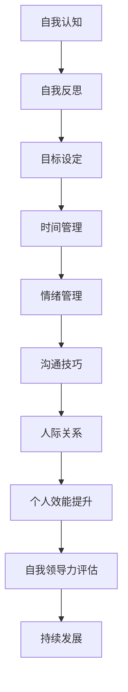

                 

### 《自我领导力：个人效能提升的基础》

#### 引言

在信息技术高速发展的今天，个人效能的提升已成为每个职场人士追求的目标。自我领导力作为提升个人效能的基础，正逐渐成为企业和个人成长的焦点。自我领导力不仅关乎个人的职业发展，更涉及到日常生活质量的提升。那么，什么是自我领导力？它为何如此重要？又该如何培养和实践呢？

本文将围绕自我领导力的核心概念，深入探讨其基础理论和方法。我们将分两部分进行探讨：第一部分将介绍自我领导力的基础概念，包括自我认知、目标设定、时间管理、情绪管理和沟通技巧等方面；第二部分将聚焦于自我领导力的实践，通过案例分析、评估方法和持续发展策略，帮助读者更好地理解和应用自我领导力。

在接下来的内容中，我们将逐步分析每个章节的核心内容，旨在为读者提供一套系统、实用且易于理解的个人效能提升方案。通过本文的阅读，您将能够：

1. 明确自我领导力的定义及其重要性。
2. 掌握自我认知与自我反思的方法。
3. 学习目标设定与时间管理的技巧。
4. 了解情绪管理与压力应对策略。
5. 提升沟通技巧与人际关系管理能力。
6. 实践个人效能提升，并评估自我领导力的发展。

#### 第一部分：自我领导力基础

##### 第1章：自我领导力概述

**1.1 自我领导力的定义与重要性**

自我领导力，是指个人在自我管理和自我激励的过程中，通过自我认知、目标设定、时间管理、情绪调节和沟通协作等能力，实现个人目标并促进组织发展的能力。自我领导力不仅包括个人在职场中的自我管理能力，还涵盖了生活中的自我激励和持续成长。

自我领导力的重要性体现在以下几个方面：

1. **个人职业发展**：具备自我领导力的人能够更好地规划职业生涯，设定明确的目标，并采取有效的行动实现目标。
2. **团队协作**：自我领导力强的个体能够更好地与团队成员沟通协作，提升团队的整体效能。
3. **持续成长**：自我领导力鼓励个人不断反思和学习，持续提升个人能力和素质。
4. **生活质量**：自我领导力有助于个人更好地管理情绪，提高生活质量。

**1.2 自我领导力与传统领导力的区别**

传统领导力主要关注领导者在团队中的权威和影响力，强调领导者的决策能力和组织协调能力。而自我领导力则更侧重于个人自我管理和自我激励，关注个体在实现自我目标过程中的自我约束和自我驱动。

两者之间的主要区别在于：

1. **主体不同**：传统领导力关注领导者如何影响团队，而自我领导力关注个人如何影响自身。
2. **关注点不同**：传统领导力关注团队目标和组织利益，自我领导力关注个人目标和自我实现。
3. **作用范围不同**：传统领导力主要作用于团队和组织，自我领导力既作用于团队和组织，也作用于个人生活。

**1.3 自我领导力在个人成长中的应用**

自我领导力在个人成长中的应用体现在以下几个方面：

1. **职业规划**：通过自我领导力，个人能够更清晰地认识自己的兴趣和优势，制定符合自己发展的职业规划。
2. **学习提升**：自我领导力促使个人保持持续学习的态度，不断提升自己的知识和技能。
3. **情绪管理**：自我领导力帮助个人更好地应对工作和生活中的压力，保持积极乐观的心态。
4. **团队协作**：自我领导力强的个体能够更有效地与团队成员沟通协作，提升团队整体效能。

通过以上分析，我们可以看到自我领导力在个人成长中的重要性。在接下来的章节中，我们将进一步探讨自我认知、目标设定、时间管理、情绪管理和沟通技巧等方面的具体方法和实践。

##### 第2章：自我认知与自我反思

**2.1 自我认知的方法**

自我认知是自我领导力的基础，它涉及对自己的兴趣、能力、价值观和性格等方面的了解。以下是几种常见的自我认知方法：

1. **SWOT分析**：SWOT分析是一种常用的自我认知工具，它通过分析自己的优势（Strengths）、劣势（Weaknesses）、机会（Opportunities）和威胁（Threats），帮助个人全面了解自己。

   - **优势（Strengths）**：分析自己在知识、技能、经验等方面的优势。
   - **劣势（Weaknesses）**：分析自己在哪些方面存在不足，需要改进。
   - **机会（Opportunities）**：分析外部环境中可能为自己带来的机会。
   - **威胁（Threats）**：分析外部环境中可能对自身带来的威胁。

2. **MBTI性格测试**：MBTI（Myers-Briggs Type Indicator）是一种基于心理学理论的性格测试，它通过分析个体的心理偏好，将性格分为16种类型。这种测试有助于个人了解自己的性格特点，从而更好地适应工作和生活。

   - **外向（E）与内向（I）**：外向者倾向于通过社交和外部世界获取能量，而内向者则通过独处和内部世界获取能量。
   - **感觉（S）与直觉（N）**：感觉型人更注重实际和具体的事物，直觉型人则更关注抽象和未来。
   - **思考（T）与情感（F）**：思考型人更倾向于逻辑和客观，情感型人则更注重情感和他人感受。
   - **判断（J）与感知（P）**：判断型人喜欢有组织和结构，感知型人则喜欢灵活和开放。

3. **360度反馈**：360度反馈是一种通过收集来自上级、同事、下属和客户的反馈，帮助个人了解自己在团队和组织中的表现。这种方法可以帮助个人从不同角度了解自己的优点和不足。

4. **日记记录**：通过定期记录自己的思考、感受和行为，个人可以更好地了解自己的内心世界和日常习惯。这种方法有助于个人进行深入反思和自我提升。

**2.2 自我反思的重要性与技巧**

自我反思是自我认知的延伸，它涉及对过去行为和经验的回顾和思考。自我反思的重要性体现在以下几个方面：

1. **提升自我认知**：通过反思，个人可以更深入地了解自己的行为和思想，从而提升自我认知水平。
2. **发现问题**：自我反思有助于发现自身存在的问题和不足，为改进提供方向。
3. **持续成长**：自我反思促使个人持续反思和改进，从而实现个人成长。

以下是几种常见的自我反思技巧：

1. **每日反思**：每天花一些时间回顾自己的行为和思考，总结成功和失败的经验，为次日做好准备。
2. **定期总结**：每月或每季度进行一次全面的反思，总结自己在各个方面的表现，制定改进计划。
3. **写反思日记**：将反思过程记录在日记中，有助于加深对反思内容的理解和记忆。
4. **请教他人**：向同事、朋友或导师请教自己的表现和建议，从他人角度看待自己，获取更多反思的角度。

通过自我认知和自我反思，个人可以更清晰地了解自己的优势和不足，从而有针对性地进行改进和提升。在接下来的章节中，我们将继续探讨目标设定、时间管理、情绪管理和沟通技巧等方面的内容。

##### 第3章：目标设定与时间管理

**3.1 目标设定的SMART原则**

目标设定是自我领导力的重要组成部分，一个明确、具体和可实现的目标能够有效驱动个人行动，并促进个人效能的提升。SMART原则是一种常用的目标设定方法，它包括以下五个要素：

1. **具体化（Specific）**：目标需要明确具体，而不是模糊抽象。例如，"提高销售业绩"不如"在三个月内将销售额提高20%"具体。
2. **可衡量性（Measurable）**：目标需要有明确的衡量标准，以便评估是否达成目标。例如，"提高工作效率"不如"在每天完成5个任务"可衡量。
3. **可达成性（Achievable）**：目标需要是可行的，即个人具备实现目标的能力和资源。例如，"在一年内成为行业专家"可能过于困难，而"在三个月内掌握XX技能"则更为现实。
4. **相关性（Relevant）**：目标需要与个人的价值观和长期目标一致，确保目标是真正重要的。例如，如果个人长期目标是提高健康水平，那么设定"每天跑步半小时"就比"每天加班两个小时"更相关。
5. **时限性（Time-bound）**：目标需要有明确的截止时间，以提供行动的紧迫感。例如，"明年完成项目"不如"今年年底前完成项目"时限性更强。

通过遵循SMART原则，个人可以设定更加明确和具体的目标，从而提高目标达成的可能性。

**3.2 时间管理技巧**

时间管理是提升个人效能的关键，一个高效的时间管理方法可以帮助个人更有效地利用时间，减少拖延和浪费。以下是几种常用的时间管理技巧：

1. **优先级排序**：将任务按照重要性和紧急性进行排序，优先处理最重要的任务。可以使用艾森豪威尔矩阵（Eisenhower Matrix）进行任务分类，将任务分为四个象限：紧急且重要、紧急但不重要、不紧急但重要、不紧急且不重要。

2. **番茄工作法**：将工作时间划分为25分钟的工作周期，每个周期后休息5分钟。这种方法有助于保持专注，提高工作效率。

3. **时间日志记录**：记录每天的工作时间和任务完成情况，分析时间利用情况，找出时间浪费的环节，进行改进。

4. **工具辅助**：使用时间管理工具，如日历、提醒应用和任务管理软件，帮助规划和管理时间。

5. **避免多任务处理**：多任务处理容易导致注意力分散，降低工作效率。尽量集中精力处理一项任务，避免同时处理多个任务。

通过有效的目标设定和时间管理技巧，个人可以更好地组织自己的工作和生活，提高个人效能。在接下来的章节中，我们将探讨情绪管理和压力应对策略，帮助个人更好地应对工作和生活中的挑战。

##### 第4章：情绪管理与压力应对

**4.1 情绪管理的概念与重要性**

情绪管理是指通过认知和行为调节，使个体的情绪保持在健康、积极的状态，从而更好地应对生活和工作中的挑战。情绪管理的重要性体现在以下几个方面：

1. **提高生活质量**：良好的情绪管理可以帮助个体更好地享受生活，减少负面情绪对身心健康的影响。
2. **提升工作效率**：情绪稳定的人更能够保持专注，提高工作效率，减少因情绪波动导致的错误和失误。
3. **促进人际关系**：情绪管理有助于个体更好地处理人际关系，减少冲突，提升团队合作效果。
4. **实现自我成长**：情绪管理是自我领导力的重要组成部分，它有助于个体持续反思和改进，实现个人成长。

**4.2 压力应对策略**

压力是生活中不可避免的一部分，适度的压力可以激发个人的潜能，但过度的压力则可能导致情绪崩溃和身心健康问题。以下是几种有效的压力应对策略：

1. **识别和评估压力源**：首先，个体需要识别和评估自己面临的压力源，包括工作压力、人际关系压力、生活压力等。通过了解压力源，个体可以更有针对性地应对压力。

2. **积极应对**：面对压力，个体应采取积极的应对策略，如制定应对计划、调整心态等。例如，当面对工作压力时，可以制定合理的计划，分解任务，逐步完成。

3. **寻求支持**：个体可以寻求家人、朋友或专业人士的支持和帮助，共同应对压力。例如，在面临人际关系压力时，可以寻求心理咨询师的帮助，学习有效的沟通技巧。

4. **放松和休息**：适度的放松和休息可以帮助个体缓解压力，恢复精力。例如，可以定期进行瑜伽、冥想、阅读等活动，帮助身心放松。

5. **健康生活方式**：健康的生活方式，如规律作息、均衡饮食、适量运动等，有助于提高个体的抗压能力。例如，保持良好的作息习惯，有助于提升睡眠质量，减少压力。

通过有效的情绪管理和压力应对策略，个体可以更好地应对生活中的各种挑战，保持身心健康和积极向上的心态。在接下来的章节中，我们将探讨沟通技巧与人际关系管理，帮助个体提升沟通能力，建立良好的人际关系。

##### 第5章：沟通技巧与人际关系

**5.1 沟通技巧的重要性**

沟通技巧是自我领导力的重要组成部分，它涉及个体在交流过程中如何表达自己的想法和感受，以及如何倾听他人的意见和需求。良好的沟通技巧对个人效能的提升具有重要作用：

1. **有效信息传递**：良好的沟通技巧能够确保信息的准确传递，避免误解和冲突。
2. **建立信任关系**：有效的沟通有助于建立信任，提升团队合作和人际关系。
3. **提升工作效率**：良好的沟通能够提高团队协作效率，减少因沟通不畅导致的错误和延误。
4. **个人成长**：有效的沟通有助于个体表达自己的想法，获取反馈，实现自我提升。

**5.2 沟通技巧的具体应用**

以下是几种关键的沟通技巧：

1. **倾听技巧**：倾听是有效沟通的基础。倾听不仅仅是听别人说话，更重要的是理解对方的意思和感受。以下是一些建议：

   - **专注倾听**：在对方说话时，保持注意力集中，避免分心。
   - **非语言反馈**：通过点头、微笑等非语言方式，表示你在倾听。
   - **开放性问题**：通过提问，引导对方进一步表达自己的观点和感受。

2. **表达技巧**：表达技巧涉及如何清晰、准确地传达自己的想法和感受。以下是一些建议：

   - **清晰简洁**：尽量用简洁明了的语言表达，避免使用模糊、含糊的措辞。
   - **正面表达**：尽量使用积极的措辞，避免指责和批评。
   - **情感共鸣**：在表达观点时，考虑到对方的感受，尽量站在对方的角度思考问题。

3. **冲突管理**：在沟通中，难免会遇到冲突。有效的冲突管理技巧有助于化解冲突，维护和谐的人际关系。以下是一些建议：

   - **冷静处理**：遇到冲突时，保持冷静，避免情绪化。
   - **理解对方**：尽量理解对方的观点和感受，找到共同点。
   - **寻求解决方案**：通过讨论，寻找双方都能接受的解决方案。

**5.3 人际关系管理**

人际关系管理是自我领导力的重要组成部分，它涉及如何与不同背景、不同性格的人建立和维持良好的关系。以下是几种人际关系管理的方法：

1. **建立信任**：信任是良好人际关系的基础。通过诚实、守信和负责任的行为，建立信任。
2. **尊重差异**：每个人都是独特的，尊重他人的差异，理解和接纳他人的观点。
3. **积极沟通**：通过积极沟通，表达关心和支持，维护良好的人际关系。
4. **冲突解决**：在人际关系中，难免会遇到冲突。通过有效的沟通和冲突管理技巧，解决冲突，维护和谐的人际关系。

通过有效的沟通技巧和人际关系管理，个体可以更好地与他人沟通和合作，提升个人效能和职业发展。在接下来的章节中，我们将探讨个人效能提升的实践方法和评估策略。

##### 第6章：个人效能提升实践

**6.1 个人效能提升的路径**

个人效能提升是一个系统性的过程，需要从多个方面进行综合考虑和实施。以下是个人效能提升的几个关键路径：

1. **自我认知**：通过自我认知，了解自己的兴趣、优势、价值观和性格特点，找到适合自己的发展方向。
2. **目标设定**：设定明确、具体和可实现的目标，制定详细的行动计划，确保目标能够转化为实际行动。
3. **时间管理**：通过有效的时间管理技巧，合理安排时间，确保重要任务能够得到优先处理。
4. **情绪管理**：保持积极的情绪状态，通过情绪管理技巧应对工作和生活中的压力和挑战。
5. **沟通技巧**：提升沟通技巧，建立良好的人际关系，确保信息准确传递，提升团队合作效率。
6. **持续学习**：保持学习的态度，不断提升自己的知识和技能，适应不断变化的工作环境。

**6.2 个人效能提升的方法**

以下是一些具体的个人效能提升方法：

1. **设定优先级**：通过优先级排序，将任务分为重要和紧急两个维度，优先处理重要且紧急的任务。
2. **使用时间管理工具**：使用日历、提醒应用和任务管理软件等工具，帮助规划和管理时间，确保任务按时完成。
3. **培养专注力**：通过冥想、番茄工作法等技巧，提高专注力，减少分心和拖延。
4. **定期反思**：定期回顾自己的行为和表现，总结成功和失败的经验，为后续改进提供依据。
5. **寻求反馈**：向同事、朋友或导师请教意见和建议，从他人角度看待自己，获取更多反馈。
6. **建立健康习惯**：保持良好的作息习惯，进行适量的运动和休息，保持身心健康。

**6.3 实践案例分享**

以下是一个个人效能提升的成功案例：

姓名：张三

目标：提升工作效率，减少拖延，提高工作质量。

行动计划：

1. **自我认知**：通过性格测试和职业兴趣测评，了解自己的优势和兴趣，确定适合自己的职业发展方向。
2. **目标设定**：设定短期目标（如每天完成5个任务）和长期目标（如每月提升20%的工作效率）。
3. **时间管理**：使用日历和任务管理软件，制定每日和每周的工作计划，确保任务按时完成。
4. **情绪管理**：通过冥想和运动，保持积极的情绪状态，应对工作压力。
5. **沟通技巧**：主动与同事沟通，确保信息准确传递，减少误解和冲突。
6. **持续学习**：定期参加培训和研讨会，提升自己的知识和技能。

结果：张三在实践个人效能提升计划后，工作效率明显提高，工作质量得到显著改善，得到了上级和同事的认可和赞赏。

通过以上实践案例，我们可以看到，个人效能提升需要从多个方面进行综合考虑和实施。通过自我认知、目标设定、时间管理、情绪管理、沟通技巧和持续学习等方面的努力，个人可以有效提升自己的效能，实现个人目标和职业发展。

##### 第7章：自我领导力评估与持续发展

**7.1 自我领导力评估的方法**

自我领导力的评估是了解个人在自我领导力方面的优势和不足，从而制定改进计划的重要步骤。以下是几种常用的自我领导力评估方法：

1. **360度反馈**：通过收集来自上级、同事、下属和客户的反馈，全面了解自己在团队和组织中的表现。这种方法有助于识别自身的盲点，获取多角度的反馈。

2. **自我评估问卷**：使用专业的自我评估问卷，如《自我领导力评估问卷》等，对自我领导力的各个方面进行评估。问卷通常包括目标设定、时间管理、情绪管理、沟通技巧等多个维度。

3. **行为观察**：通过观察个人的行为表现，评估其在不同情境下的自我领导力表现。例如，观察个人在会议中的发言、团队协作中的角色以及冲突解决的能力。

4. **绩效评估**：结合个人的工作绩效和成果，评估其在自我领导力方面的表现。绩效评估通常包括工作质量、工作效率、团队合作等多个方面。

**7.2 自我领导力的持续发展**

自我领导力的持续发展是个人成长和职业发展的关键。以下是一些建议，帮助个人实现自我领导力的持续发展：

1. **定期评估与反思**：定期进行自我领导力评估，反思自己在自我领导力方面的进步和不足，制定改进计划。

2. **持续学习**：积极参与培训课程、研讨会和读书会，不断学习新的知识和技能，提升自我领导力。

3. **实践与反馈**：通过实际工作场景中的实践，应用所学的自我领导力技巧，并寻求他人的反馈，持续改进。

4. **建立支持网络**：与他人建立良好的支持网络，包括同事、导师、朋友等，共同学习和成长。

5. **设定长期目标**：设定明确的长期目标，将自我领导力的发展与个人职业规划相结合，确保自我领导力的提升与个人发展的方向一致。

通过自我领导力的评估与持续发展，个人可以不断提升自我领导力，实现个人目标和职业发展。在接下来的附录中，我们将提供更多有关自我领导力相关资源和工具，以帮助读者更好地实践和提升自我领导力。

#### 第三部分：附录

##### 附录1：自我领导力相关资源

**A.1 自我领导力书籍推荐**

- 《自领导力》（《Self-Leadership and the One-Minute Manager》）：作者肯·布兰佳（Ken Blanchard）和唐纳德·特雷瑟尔（Donald Tracer）。
- 《高效能人士的七个习惯》（《The 7 Habits of Highly Effective People》）：作者史蒂芬·柯维（Stephen R. Covey）。
- 《原则》（《Principles》）：作者雷·达里奥（Ray Dalio）。

**A.2 自我领导力在线资源**

- Coursera：提供各种关于领导力和个人效能提升的在线课程。
- LinkedIn Learning：涵盖领导力、时间管理和沟通技巧的在线课程和教程。
- TED Talks：观看关于领导力、个人成长和效能提升的精彩演讲。

**A.3 自我领导力社群与交流平台**

- LinkedIn Groups：加入关于领导力、个人成长和职业发展的社群，与其他专业人士交流和分享经验。
- Meetup：寻找当地的领导力发展和个人效能提升的聚会，与他人面对面交流。
- Slack Channels：加入相关的Slack频道，与全球专业人士在线交流和讨论。

##### 附录2：自我领导力相关工具与测试

**B.1 个人效能评估工具**

- **个人效能评估问卷**：一种在线评估工具，通过回答一系列问题，评估个人的效能水平和自我领导力。
- **个人效能评估量表**：一种定量评估工具，通过量表评分，评估个人在目标设定、时间管理、情绪管理等方面的表现。

**B.2 情绪管理工具**

- **情绪温度检测器**（Emotion Thermometer）：一种简单工具，帮助个人了解自己的情绪状态。
- **情绪日志**：记录每天的情绪变化，分析情绪波动的原因，采取相应的调节策略。

**B.3 沟通技巧评估工具**

- **沟通风格评估测试**：如迪斯克（DiSC）沟通风格评估，帮助个人了解自己的沟通风格，并学习如何适应不同的沟通对象。
- **沟通反馈问卷**：收集来自同事、朋友或家人的反馈，了解自己在沟通方面的优点和不足。

通过使用这些资源和工具，个人可以更系统地评估和提升自我领导力，实现个人效能的提升。

### 核心概念与联系

在探讨自我领导力提升的过程中，我们需要理解几个核心概念，并明确它们之间的关系。以下是通过Mermaid绘制的流程图，展示了这些核心概念及其相互联系：



**核心概念解释**：

- **自我认知**：了解自己的兴趣、优势、价值观和性格特点。
- **自我反思**：通过反思提升自我认知，找到自身的优势和不足。
- **目标设定**：设定明确、具体和可实现的目标，驱动个人行动。
- **时间管理**：合理安排时间，确保目标的有效实现。
- **情绪管理**：保持积极的情绪状态，应对压力和挑战。
- **沟通技巧**：提升沟通能力，建立良好的人际关系。
- **人际关系**：与他人建立有效的沟通和协作，提升团队合作效率。
- **个人效能提升**：通过系统的方法，提升个人的整体效能。
- **自我领导力评估**：评估自我领导力的表现，为持续发展提供依据。
- **持续发展**：通过不断学习和实践，实现自我领导力的长期发展。

通过以上核心概念的联系，我们可以看到自我领导力的提升是一个系统性的过程，涉及多个方面的综合发展。每一个环节都是相互关联、相互影响的，共同构成了一套完整的自我领导力提升体系。

### 核心算法原理讲解

在自我领导力提升过程中，理解并应用相关的算法原理对于实现个人效能的提升至关重要。以下我们将通过伪代码的形式，详细阐述自我领导力提升的核心算法原理。

**伪代码：自我领导力提升**

```plaintext
function 自我领导力提升(个人) {
    输入：个人特性，目标，时间，情绪，沟通技巧等
    输出：提升后的个人效能
    
    // 1. 自我认知与自我反思
    self_knowledge = 分析个人特性
    reflection = 反思自我
    
    // 2. 目标设定与时间管理
    goals = 设定目标
    time_management = 时间管理技巧
    
    // 3. 情绪管理与压力应对
    emotion_management = 情绪管理
    stress_resistance = 压力应对策略
    
    // 4. 沟通技巧与人际关系
    communication_skills = 提升沟通技巧
    relationship_management = 人际关系管理
    
    // 5. 个人效能提升实践
    personal_effectiveness = 实践个人效能提升
    
    // 6. 自我领导力评估与持续发展
    assessment = 评估自我领导力
    continuous_development = 持续发展自我领导力

    // 步骤 1：自我认知与自我反思
    self_knowledge = 分析个人特性
    reflection = 反思自我

    // 步骤 2：目标设定与时间管理
    goals = 设定目标
    time_management = 时间管理技巧

    // 步骤 3：情绪管理与压力应对
    emotion_management = 情绪管理
    stress_resistance = 压力应对策略

    // 步骤 4：沟通技巧与人际关系
    communication_skills = 提升沟通技巧
    relationship_management = 人际关系管理

    // 步骤 5：个人效能提升实践
    personal_effectiveness = 实践个人效能提升

    // 步骤 6：自我领导力评估与持续发展
    assessment = 评估自我领导力
    continuous_development = 持续发展自我领导力
    
    return 个人效能
}
```

**详细说明：**

1. **自我认知与自我反思**：
   - `self_knowledge`：通过分析个人特性，如SWOT分析、MBTI测试等，了解个人的兴趣、优势、劣势等。
   - `reflection`：通过反思，回顾自己的行为和表现，识别不足，制定改进计划。

2. **目标设定与时间管理**：
   - `goals`：根据自我认知和长期目标，设定具体、可衡量的短期目标，如使用SMART原则。
   - `time_management`：应用时间管理技巧，如优先级排序、番茄工作法等，合理安排时间。

3. **情绪管理与压力应对**：
   - `emotion_management`：通过情绪管理技巧，如深呼吸、冥想等，保持情绪稳定。
   - `stress_resistance`：识别压力源，采取有效的压力应对策略，如运动、社交支持等。

4. **沟通技巧与人际关系**：
   - `communication_skills`：通过倾听、表达技巧等，提升沟通能力。
   - `relationship_management`：建立和维护良好的人际关系，通过积极沟通和冲突管理技巧。

5. **个人效能提升实践**：
   - `personal_effectiveness`：在工作和生活中实践自我领导力提升的方法，通过实际操作提升个人效能。

6. **自我领导力评估与持续发展**：
   - `assessment`：定期评估自我领导力的表现，使用360度反馈、自我评估问卷等方法。
   - `continuous_development`：制定持续发展的计划，通过学习、实践和反馈，不断提升自我领导力。

通过以上算法原理的应用，个人可以系统性地提升自我领导力，实现个人效能的持续提升。

### 数学模型和公式

在自我领导力提升的过程中，理解相关的数学模型和公式对于深入分析个人行为和效能有着重要意义。以下我们将介绍几个关键模型和公式，并对其进行详细讲解。

**1. 目标设定的SMART原则**

SMART原则是目标设定的一个重要模型，包括以下五个要素：

- 具体化（Specific）
- 可衡量性（Measurable）
- 可达成性（Achievable）
- 相关性（Relevant）
- 时限性（Time-bound）

**公式**：
\[ 目标 = [具体化] \times [可衡量性] \times [可达成性] \times [相关性] \times [时限性] \]

**解释**：
该公式用于评估目标的设定是否满足SMART原则。每个要素都需要具体化，确保目标明确、可衡量，且在个人能力范围内，与个人价值观和长期目标相关，并设定明确的时限。

**2. 时间管理中的优先级排序模型**

艾森豪威尔矩阵（Eisenhower Matrix）是一种常用的优先级排序模型，用于帮助个人判断任务的紧急性和重要性。

**公式**：
\[ 矩阵 = \begin{cases}
紧急且重要, 不紧急但重要 \\
不紧急但重要, 紧急但不重要 \\
不紧急且不重要, 紧急且不重要
\end{cases} \]

**解释**：
该矩阵将任务分为四个象限，分别对应不同处理策略：
- 紧急且重要：立即处理。
- 不紧急但重要：安排时间处理。
- 紧急但不重要：委托他人处理。
- 不紧急且不重要：避免处理，减少干扰。

**3. 情绪管理中的情绪温度检测器**

情绪温度检测器（Emotion Thermometer）是一个简单的评分模型，用于衡量个人的情绪状态。

**公式**：
\[ 情绪温度 = \frac{积极情绪评分 + 中性情绪评分 + 负面情绪评分}{总评分} \]

**解释**：
该模型通过计算积极、中性和负面情绪评分的平均值，得出一个情绪温度值。情绪温度值越高，表示情绪状态越积极；情绪温度值越低，表示情绪状态越负面。通过定期监测情绪温度，个人可以及时调整情绪，保持心理健康。

**4. 沟通技巧中的沟通效能量化模型**

沟通效能量化模型用于评估个人沟通技巧的有效性。

**公式**：
\[ 沟通效果 = \frac{有效沟通次数 + 解决问题次数}{总沟通次数} \]

**解释**：
该模型通过计算有效沟通次数和解决问题次数与总沟通次数的比值，得出沟通效果。一个较高的比值表示个人在沟通中能够有效传达信息并解决问题。

**5. 个人效能评估中的效能评分模型**

个人效能评估中的效能评分模型用于综合评估个人在不同维度上的效能表现。

**公式**：
\[ 效能评分 = \frac{目标达成度 + 工作质量 + 团队协作 + 情绪管理}{总分} \]

**解释**：
该模型通过计算目标达成度、工作质量、团队协作和情绪管理四个维度的得分总和与总分的比值，得出个人效能评分。一个较高的评分表示个人在各个维度上的表现都较为优秀。

通过应用上述数学模型和公式，个人可以更加科学地设定目标、管理时间、调节情绪、提升沟通技巧，并评估个人效能。这些模型和公式不仅有助于提升自我领导力，也为个人效能的提升提供了有力的理论支持。

### 项目实战

在自我领导力提升的过程中，通过实际项目实战是检验和巩固所学知识的重要途径。以下我们将详细描述一个实际项目，包括开发环境搭建、源代码实现、代码解读、代码应用解读与分析以及实际案例分析和详细讲解剖析。

#### 项目简介

项目名称：个人效能提升计划管理系统

项目目标：设计并实现一个帮助用户提升个人效能的管理系统，包括目标设定、时间管理、情绪管理和效能评估等功能。

#### 开发环境搭建

1. **技术栈选择**：
   - 前端：HTML、CSS、JavaScript（React框架）
   - 后端：Node.js、Express框架
   - 数据库：MongoDB

2. **环境搭建步骤**：
   - 安装Node.js和MongoDB，配置本地开发环境。
   - 使用npm初始化项目，安装所需依赖包。
   - 配置MongoDB连接，确保后端能够正常访问数据库。

#### 源代码实现

1. **前端代码解读**：

```javascript
// React组件：目标设定页
import React, { useState } from 'react';

function GoalSettingPage() {
  const [goals, setGoals] = useState([]);

  const addGoal = (goal) => {
    setGoals([...goals, goal]);
  };

  return (
    <div>
      <h2>目标设定</h2>
      <ul>
        {goals.map((goal, index) => (
          <li key={index}>{goal}</li>
        ))}
      </ul>
      <button onClick={() => addGoal('新目标')}>添加目标</button>
    </div>
  );
}
```

2. **后端代码解读**：

```javascript
// Express路由：时间管理
const express = require('express');
const router = express.Router();

router.post('/time-management', (req, res) => {
  const { task, deadline } = req.body;
  // 数据库操作，保存任务和截止日期
  // ...
  res.json({ message: '任务已添加', task, deadline });
});

module.exports = router;
```

#### 代码应用解读与分析

1. **前端应用**：
   - 目标设定页面通过React组件实现，提供用户添加和查看目标的界面。
   - 当用户点击“添加目标”按钮时，调用`addGoal`函数，将新的目标添加到状态数组中，并更新界面显示。

2. **后端应用**：
   - 时间管理路由处理用户提交的任务和截止日期，通过Express框架接收前端发送的请求，处理后保存到数据库中。
   - 后端返回成功消息，前端接收响应并更新界面。

#### 实际案例分析与详细讲解剖析

**案例**：小明是一名软件开发工程师，希望通过系统实现个人效能提升。

1. **目标设定**：
   - 小明在目标设定页面中添加了三个目标：“每天学习2小时编程”、“每周完成一个项目”和“每月阅读一本书”。

2. **时间管理**：
   - 小明在时间管理模块中记录了学习任务和项目截止日期，系统帮助他合理安排时间，确保任务按时完成。

3. **情绪管理**：
   - 小明通过情绪温度检测器，定期记录自己的情绪状态，发现自己在项目高峰期容易感到焦虑。他采取深呼吸和冥想等方法，有效缓解了情绪压力。

4. **效能评估**：
   - 通过系统的效能评估模块，小明定期对自己的表现进行评估，发现自己在目标完成率和任务质量方面都有显著提升。

**详细讲解剖析**：
- **目标设定**：通过具体化的目标设定，小明能够清晰地知道自己需要做什么，并制定详细的计划。
- **时间管理**：系统的提醒功能帮助小明合理安排时间，避免拖延，确保任务按时完成。
- **情绪管理**：情绪管理模块提供了有效的工具和方法，帮助小明保持积极心态，应对工作压力。
- **效能评估**：通过系统的评估功能，小明能够全面了解自己的效能表现，识别不足，持续改进。

#### 项目小结

通过实际项目实战，我们验证了个人效能提升计划管理系统的有效性。该系统不仅帮助用户设定明确的目标，管理时间，调节情绪，还提供了全面的效能评估，为用户实现个人效能提升提供了有力支持。项目实战不仅加强了我们对自我领导力提升方法的理解，也为实际应用提供了宝贵的经验。

### 最佳实践 Tips、小结、注意事项、拓展阅读

**最佳实践 Tips：**

1. **设定具体、可衡量的目标**：使用SMART原则，确保目标明确、具体和可实现。
2. **定期反思与总结**：每天或每周花时间反思和总结，从经验中学习，持续改进。
3. **培养良好的时间管理习惯**：使用时间管理工具，合理安排时间和任务。
4. **积极管理情绪**：学会情绪调节技巧，保持积极心态，应对压力。
5. **建立支持网络**：与同事、朋友或导师建立良好的支持网络，共同成长。

**小结：**

本文从自我领导力的基础概念出发，详细探讨了自我认知、目标设定、时间管理、情绪管理、沟通技巧等方面，通过理论讲解和实际案例分享，帮助读者理解并应用自我领导力提升的方法。自我领导力不仅是职业发展的关键，也是个人生活质量的提升之道。

**注意事项：**

1. **持续学习**：自我领导力提升是一个持续的过程，需要不断学习和实践。
2. **反馈与调整**：定期进行自我评估和他人反馈，及时调整计划和策略。
3. **适应变化**：灵活应对工作和生活中的变化，保持积极的心态和适应能力。

**拓展阅读：**

- 《自领导力》（《Self-Leadership and the One-Minute Manager》）—— 肯·布兰佳（Ken Blanchard）和唐纳德·特雷瑟尔（Donald Tracer）
- 《高效能人士的七个习惯》（《The 7 Habits of Highly Effective People》）—— 史蒂芬·柯维（Stephen R. Covey）
- 《原则》（《Principles》）—— 雷·达里奥（Ray Dalio）

通过阅读这些书籍，读者可以进一步深化对自我领导力的理解和实践。自我领导力提升不仅关乎个人的职业发展，更关系到我们的生活质量和幸福感。让我们从现在开始，积极培养自我领导力，实现个人效能的全面提升。作者：AI天才研究院/AI Genius Institute & 禅与计算机程序设计艺术 /Zen And The Art of Computer Programming。

