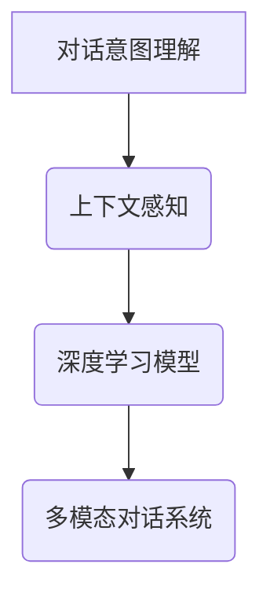

                 

### 文章标题

# 《自然语言处理中的对话意图理解与上下文感知技术进展与挑战》

### 关键词

- 对话意图理解
- 上下文感知
- 深度学习
- 多模态对话系统
- 多轮对话理解
- 跨语言对话

### 摘要

本文旨在深入探讨自然语言处理（NLP）领域中的对话意图理解与上下文感知技术。首先，我们将回顾自然语言处理与对话系统的基础概念，为后续内容奠定基础。接着，本文将详细阐述对话意图理解的基本原理、分类与识别方法，以及其在实际应用中面临的挑战和优化策略。随后，我们将介绍上下文感知技术，包括其概念、重要性、表示方法以及模型设计与实现。多模态对话系统的基本原理、信息融合方法和应用案例也将被探讨。接着，本文将分析对话意图理解与上下文感知技术的最新进展，包括深度学习模型、上下文感知技术的进展以及实际应用实例。随后，本文将讨论对话系统在多轮对话理解、上下文丢失与恢复以及多语言与跨文化对话中的挑战和解决方案。最后，本文将展望对话系统技术的发展趋势、人工智能在对话系统中的应用前景以及对话系统的伦理与社会责任。通过一系列项目实战，本文将展示如何开发和实现对话意图理解与上下文感知技术的实际应用，为读者提供最佳实践和详细代码解析。本文旨在为研究人员和开发者提供全面的技术指南，帮助他们深入理解并应对自然语言处理中的对话意图理解与上下文感知技术的进展与挑战。

### 《自然语言处理中的对话意图理解与上下文感知技术进展与挑战》目录大纲

## 第一部分：自然语言处理与对话系统概述

### 第1章：自然语言处理基本概念

#### 1.1 自然语言处理的发展历程

#### 1.2 自然语言处理的核心任务

#### 1.3 对话系统的基本构成

### 第2章：对话意图理解的概念与分类

#### 2.1 对话意图理解的基本原理

#### 2.2 对话意图的分类与识别方法

#### 2.3 对话意图识别的挑战与优化策略

### 第3章：上下文感知技术

#### 3.1 上下文感知的概念与重要性

#### 3.2 上下文表示方法

#### 3.3 上下文感知模型的设计与实现

### 第4章：多模态对话系统

#### 4.1 多模态对话系统的基本原理

#### 4.2 多模态信息的融合方法

#### 4.3 多模态对话系统的应用案例

## 第二部分：对话意图理解与上下文感知技术进展

### 第5章：深度学习与对话意图理解

#### 5.1 卷积神经网络在对话意图理解中的应用

#### 5.2 循环神经网络在对话意图理解中的应用

#### 5.3 注意力机制在对话意图理解中的应用

### 第6章：上下文感知技术的进展

#### 6.1 基于上下文感知的对话系统设计

#### 6.2 增量学习与上下文感知

#### 6.3 上下文感知技术的应用实例

### 第7章：对话系统中的挑战与解决方案

#### 7.1 对话系统的挑战

#### 7.2 挑战一：多轮对话理解

#### 7.3 挑战二：上下文丢失与恢复

#### 7.4 挑战三：多语言与跨文化对话

### 第8章：对话系统技术的未来发展趋势

#### 8.1 对话系统技术的发展趋势

#### 8.2 人工智能在对话系统中的应用前景

#### 8.3 对话系统的伦理与社会责任

### 第9章：项目实战一：多轮对话系统开发

#### 9.1 项目背景与目标

#### 9.2 系统设计与实现

#### 9.3 代码解读与分析

### 第10章：项目实战二：基于上下文感知的聊天机器人

#### 10.1 项目背景与目标

#### 10.2 系统设计与实现

#### 10.3 代码解读与分析

### 第11章：项目实战三：多语言对话系统开发

#### 11.1 项目背景与目标

#### 11.2 系统设计与实现

#### 11.3 代码解读与分析

## 附录

### 附录 A：自然语言处理工具与资源

#### A.1 常用自然语言处理库

#### A.2 对话系统开源框架

#### A.3 常见数据集与评测平台

### 附录 B：数学模型与算法伪代码

#### B.1 机器学习基础算法

#### B.2 循环神经网络算法

#### B.3 注意力机制算法

#### B.4 上下文感知算法

### Mermaid 流程图



### 作者信息

- 作者：AI天才研究院/AI Genius Institute & 禅与计算机程序设计艺术 /Zen And The Art of Computer Programming

### 完整性要求

- 每个小节的内容需要丰富具体详细讲解，核心内容需要包含：
  - 背景介绍
  - 核心概念与联系（Mermaid流程图）
  - 核心算法原理讲解（伪代码）
  - 数学模型和公式（详细讲解与举例说明）
  - 项目实战（开发环境搭建、源代码详细实现和代码解读、实际案例分析和详细讲解剖析、项目小结）
  - 最佳实践 tips、小结、注意事项、拓展阅读等内容

- 文章字数要求：文章字数在8000～12000字左右。

---

在接下来的章节中，我们将一步步深入探讨自然语言处理中的对话意图理解与上下文感知技术，为读者带来全面的技术指南和实际案例分析。请读者随我们一起踏上这场技术探索之旅。  

---

### 第一部分：自然语言处理与对话系统概述

#### 第1章：自然语言处理基本概念

##### 1.1 自然语言处理的发展历程

自然语言处理（NLP）是人工智能（AI）领域的一个重要分支，旨在让计算机理解和处理人类自然语言。其发展历程可以追溯到20世纪50年代。当时的计算机科学家和语言学家开始探讨如何使计算机理解并生成自然语言。早期的NLP研究主要集中在规则驱动的方法，如语法分析和词法分析，这些方法依赖于大量的手工编写的规则和词典。

在20世纪70年代，随着计算机性能的提升和大规模语料库的建立，统计方法开始在NLP中得到应用。统计方法利用大量的文本数据来学习语言模式，这种方法在词性标注和机器翻译等方面取得了显著的成效。

20世纪80年代和90年代，基于知识的表示方法开始兴起，这种方法通过构建语义网络和知识库来模拟人类对语言的理解。然而，这些方法在实际应用中存在诸多限制，难以处理复杂的语言现象。

进入21世纪，随着深度学习的崛起，基于数据驱动的模型在NLP中取得了突破性的进展。深度学习模型，如卷积神经网络（CNN）和循环神经网络（RNN），在文本分类、情感分析、机器翻译等任务中展现了强大的能力。近年来，预训练模型，如GPT-3和Bert，进一步提升了NLP的性能，使得计算机在理解和生成自然语言方面更加接近人类。

##### 1.2 自然语言处理的核心任务

自然语言处理的核心任务是使计算机能够理解和处理自然语言。这一领域包括多个子任务，每个子任务都有其特定的目标和挑战。

1. **文本分类**：文本分类是将文本数据分为预定义的类别。例如，垃圾邮件分类、情感分析等。

2. **词性标注**：词性标注是为文本中的每个单词分配一个词性标签，如名词、动词、形容词等。这有助于理解文本的语法结构和语义。

3. **命名实体识别**：命名实体识别是从文本中识别出具有特定意义的实体，如人名、地点、组织名等。

4. **机器翻译**：机器翻译是将一种语言的文本自动翻译成另一种语言。这是跨语言交流的重要工具。

5. **问答系统**：问答系统使计算机能够回答用户提出的问题。这包括事实问答和开放问答两种类型。

6. **文本生成**：文本生成是计算机根据输入的指令或数据生成文本。例如，自动摘要、广告文案生成等。

##### 1.3 对话系统的基本构成

对话系统是一种能够与人类进行自然语言交互的计算机系统。其基本构成包括以下几个关键组件：

1. **用户接口**：用户接口用于接收用户的输入，并将其传递给对话系统。用户接口可以是文本聊天界面、语音识别系统等。

2. **对话管理器**：对话管理器负责管理对话流程，包括理解用户的意图、生成合适的回复以及处理对话中的上下文信息。

3. **意图识别器**：意图识别器是用于识别用户输入中的意图。它通常基于机器学习模型，如深度学习模型，通过对输入文本进行特征提取和分类来实现。

4. **实体识别器**：实体识别器是从用户输入中提取关键信息，如人名、地点、时间等。这有助于对话系统更好地理解用户的需求。

5. **自然语言生成器**：自然语言生成器用于生成对用户的回复。它可以将对话管理器生成的意图和实体转换为自然语言文本。

6. **上下文管理器**：上下文管理器负责维护对话的上下文信息，以便对话系统能够在后续的交互中保持一致性。这包括用户的历史输入、对话系统的回复等。

通过这些组件的协同工作，对话系统能够与用户进行有效的自然语言交互，提供满足用户需求的个性化服务。在接下来的章节中，我们将深入探讨对话意图理解和上下文感知技术，这些技术是构建高效对话系统的关键。

#### 第2章：对话意图理解的概念与分类

##### 2.1 对话意图理解的基本原理

对话意图理解是对话系统中的一个核心任务，它旨在从用户的输入中识别出用户想要实现的目标或需求。这一过程对于构建有效且自然的对话体验至关重要。对话意图理解的基本原理包括以下几个关键步骤：

1. **输入预处理**：首先，对话系统需要对用户的输入进行预处理，包括去除停用词、分词、词性标注等。这一步骤的目的是将原始文本转换为适合后续处理的形式。

2. **特征提取**：接下来，对话系统会从预处理后的文本中提取特征。这些特征可以是词频、词嵌入、语法结构等。特征提取的目的是将文本表示为一种可以由机器学习模型理解的格式。

3. **意图分类**：在特征提取之后，对话系统会使用机器学习模型，如卷积神经网络（CNN）或循环神经网络（RNN），对提取出的特征进行分类，从而识别出用户的具体意图。

4. **上下文处理**：除了意图分类，对话系统还需要考虑对话的上下文信息。上下文信息可以帮助对话系统更好地理解用户的意图，并提供更加准确和自然的回复。上下文处理通常涉及维护一个对话状态跟踪器，用于记录用户的历史输入和对话系统的回复。

##### 2.2 对话意图的分类与识别方法

对话意图可以根据不同的标准进行分类。以下是一些常见的意图分类方法：

1. **基于任务**：基于任务的意图分类方法将意图分为多个具体的任务类别，如查询信息、执行操作、社交互动等。这种方法适用于结构化对话场景，如客户服务机器人。

   - **查询信息**：用户希望获取特定信息，如天气查询、航班信息查询等。
   - **执行操作**：用户希望对话系统能够执行特定操作，如预约餐厅、购买商品等。
   - **社交互动**：用户希望进行社交互动，如聊天、开玩笑等。

2. **基于领域**：基于领域的意图分类方法将意图分为不同领域，如医疗、金融、旅游等。这种方法适用于多领域对话系统。

   - **医疗领域**：用户可能询问症状、药物信息等。
   - **金融领域**：用户可能查询账户余额、交易历史等。
   - **旅游领域**：用户可能询问景点信息、行程安排等。

3. **基于多轮对话**：多轮对话意图分类方法将意图分为单轮和跨轮两类。单轮意图通常可以在一次交互中完成，而跨轮意图需要多个交互步骤。

   - **单轮意图**：如“查询天气信息”。
   - **跨轮意图**：如“预订酒店”，这通常需要多个交互步骤来确认用户的需求和偏好。

##### 2.3 对话意图识别的挑战与优化策略

尽管对话意图理解在对话系统中扮演着核心角色，但其实现过程中面临着诸多挑战：

1. **多义性**：自然语言具有高度的多义性，同一个词或短语可能表示不同的意图。例如，“明天能不能加班”可以表示请求加班或询问加班安排。多义性增加了意图识别的复杂性。

2. **上下文依赖**：意图识别通常依赖于对话的上下文信息。上下文丢失或理解错误可能导致意图识别不准确。例如，如果用户之前提到过某个话题，对话系统需要考虑这一上下文信息。

3. **长距离依赖**：在多轮对话中，用户的需求可能需要通过多个交互步骤来明确。这意味着对话系统需要具有长距离依赖处理能力，以便在后续对话中利用早期交互的信息。

4. **噪音和错误**：用户的输入可能包含噪音或错误，如拼写错误、语法错误等。这些错误会影响意图识别的准确性。

针对这些挑战，以下是一些优化策略：

1. **增强特征表示**：使用更加丰富的特征表示，如词嵌入、语法结构、语义角色等，可以提高意图识别的准确性。

2. **多模态输入**：结合用户的文本输入和其他模态的信息，如语音、图像等，可以提供额外的上下文信息，有助于意图识别。

3. **上下文建模**：使用上下文建模技术，如循环神经网络（RNN）或Transformer，可以更好地捕捉对话中的上下文依赖关系。

4. **迁移学习**：通过迁移学习，利用预训练的模型来提升意图识别的性能，特别是当训练数据不足时。

5. **多策略融合**：结合多种意图识别方法，如基于规则的方法和基于机器学习的方法，可以提供更加鲁棒的意图识别结果。

通过上述策略，对话系统可以更好地理解用户的意图，提供更加准确和自然的交互体验。在接下来的章节中，我们将进一步探讨上下文感知技术，这对于提升对话系统的性能至关重要。

#### 第3章：上下文感知技术

##### 3.1 上下文感知的概念与重要性

上下文感知技术是使对话系统能够理解并利用对话环境中的上下文信息，从而提供更加准确和自然的交互体验的关键。上下文感知技术涉及从用户的输入中提取和理解上下文信息，并将其用于后续的对话处理。

**上下文**是指在特定时间点对话的背景信息，包括用户的历史输入、对话系统的回复、当前对话状态等。上下文信息对于对话系统的决策和回复具有指导意义，能够帮助系统更好地理解用户的意图和需求。

上下文感知技术的重要性体现在以下几个方面：

1. **提高意图识别的准确性**：通过利用上下文信息，对话系统可以更准确地识别用户的意图，减少多义性和歧义性的影响。

2. **增强对话连贯性**：上下文感知技术使对话系统能够在对话中保持一致性和连贯性，提供更自然的交互体验。

3. **支持多轮对话理解**：在多轮对话中，上下文信息可以帮助对话系统理解和跟踪用户的长期目标，从而提供更加连贯和有效的回复。

4. **改善用户体验**：通过利用上下文信息，对话系统可以更好地满足用户的需求，提供个性化的服务，从而提升用户体验。

##### 3.2 上下文表示方法

为了使对话系统能够有效利用上下文信息，首先需要将上下文信息进行表示。常见的上下文表示方法包括以下几种：

1. **基于规则的表示方法**：
   - **状态转移图**：通过构建状态转移图来表示对话的不同状态和转换规则。每个状态表示一个特定的对话场景，状态之间的转移规则定义了对话的下一步动作。
   - **有限状态机**：与状态转移图类似，但通常用于更复杂的对话场景。有限状态机通过状态和事件之间的转换来表示对话流程。

2. **基于特征的表示方法**：
   - **词向量**：将上下文文本转换为词向量表示，如Word2Vec或GloVe。词向量可以捕捉文本的语义信息，从而在特征级别上利用上下文。
   - **句向量**：通过聚合词向量来表示整个句子或对话片段。句向量可以用于捕捉对话的局部上下文信息。

3. **基于深度学习的表示方法**：
   - **循环神经网络（RNN）**：RNN能够处理序列数据，适合捕捉长距离的上下文依赖关系。通过RNN，可以学习到对话的长期上下文信息。
   - **Transformer模型**：Transformer模型通过自注意力机制捕捉对话中的全局上下文信息，在长文本处理和上下文理解方面表现出色。

4. **图表示方法**：
   - **知识图谱**：将上下文信息表示为图结构，每个节点表示一个实体，边表示实体之间的关系。知识图谱可以用于捕捉对话中的复杂上下文信息。

##### 3.3 上下文感知模型的设计与实现

上下文感知模型的设计与实现需要结合对话系统的具体需求和应用场景。以下是一些关键步骤：

1. **数据收集与预处理**：首先需要收集大量的对话数据，并进行预处理，包括去除停用词、进行词性标注、分词等。预处理后的数据将被用于训练上下文感知模型。

2. **特征提取**：从预处理后的文本中提取特征，包括词向量、句向量、语义角色等。这些特征将用于表示对话的上下文信息。

3. **模型选择与训练**：
   - **基于规则的模型**：选择合适的状态转移图或有限状态机模型，并进行参数调优。
   - **基于特征的模型**：选择合适的机器学习模型，如支持向量机（SVM）、朴素贝叶斯（Naive Bayes）等，并训练模型以识别上下文信息。
   - **基于深度学习的模型**：选择合适的深度学习模型，如RNN、Transformer等，并利用预处理后的数据训练模型。

4. **模型评估与优化**：通过在测试集上的评估，调整模型参数，优化模型性能。常见的评估指标包括准确率、召回率、F1值等。

5. **应用与部署**：将训练好的上下文感知模型部署到对话系统中，实现实时对话处理。通过不断收集用户反馈和数据，进行模型迭代和优化，提升对话系统的性能和用户体验。

通过上述设计与实现步骤，对话系统可以更好地理解和利用上下文信息，提供更加准确和自然的交互体验。在接下来的章节中，我们将进一步探讨多模态对话系统的基本原理和应用，以进一步提升对话系统的性能。

#### 第4章：多模态对话系统

##### 4.1 多模态对话系统的基本原理

多模态对话系统是一种能够处理和整合多种输入模态（如文本、语音、图像等）的对话系统，从而提供更加丰富和自然的交互体验。多模态对话系统的基本原理包括以下几方面：

1. **模态融合**：多模态对话系统通过融合不同模态的信息，如文本、语音、图像等，以获得更全面的上下文信息。这种融合可以通过多种方式实现，如特征级融合、决策级融合等。

2. **上下文建模**：多模态对话系统需要建立有效的上下文模型，以捕捉和利用不同模态的信息。这通常涉及对多种特征（如图像特征、文本特征、语音特征等）进行编码，并使用深度学习模型（如Transformer、CNN等）来学习这些特征之间的关联。

3. **多任务学习**：多模态对话系统通常需要同时执行多个任务，如文本生成、语音识别、图像理解等。多任务学习通过共享底层特征表示，可以提高不同任务的性能。

4. **交互机制**：多模态对话系统需要设计有效的交互机制，以在不同模态之间进行信息传递和协同。例如，语音输入可以触发文本回复，图像输入可以提供视觉上下文等。

##### 4.2 多模态信息的融合方法

多模态信息的融合是构建多模态对话系统的关键步骤。以下是一些常见的方法：

1. **特征级融合**：
   - **叠加法**：将不同模态的特征直接叠加，形成更丰富的特征向量。
   - **平均法**：计算不同模态特征的平均值，以综合不同模态的信息。
   - **加权法**：根据不同模态的重要程度，对特征进行加权融合。

2. **决策级融合**：
   - **投票法**：对每个模态的预测结果进行投票，选择多数模态的结果。
   - **集成法**：使用集成学习方法（如随机森林、梯度提升树等）对多模态特征进行融合，生成最终的预测结果。

3. **模型级融合**：
   - **共享模型**：使用共享的神经网络架构来处理不同模态的数据，从而自动学习模态之间的关联。
   - **多任务学习**：通过多任务学习框架，将不同模态的任务集成到一个模型中，共享底层特征表示。

4. **自注意力机制**：
   - **自注意力模型**：如Transformer，通过自注意力机制自动学习不同模态之间的关联，并在特征级别上实现信息融合。

##### 4.3 多模态对话系统的应用案例

多模态对话系统在许多实际应用中展现了其强大的能力。以下是一些典型的应用案例：

1. **智能客服**：
   - **文本+语音**：用户可以通过文本输入或语音输入与客服机器人交互。系统可以同时处理用户的文本问题和语音请求，提供更加自然和便捷的服务。
   - **文本+图像**：用户可以通过上传图像来描述问题，如提供产品图片以获取相关信息。系统可以结合文本和图像信息，提供更准确的回答。

2. **语音助手**：
   - **语音+文本**：用户可以通过语音命令进行交互，系统将语音转换为文本，并生成相应的回复。这种结合可以提供更加便捷的语音交互体验。
   - **语音+图像**：用户可以通过语音描述图像内容，如“给我展示一张有猫的图片”。系统可以理解语音请求，并在图像库中找到相应的图片。

3. **智能会议系统**：
   - **语音+文本+图像**：在会议中，用户可以通过语音命令、文本输入或图像上传进行交互。系统可以结合多种模态的信息，提供会议记录、议程管理和问答功能。

4. **智能家居**：
   - **语音+图像**：用户可以通过语音命令控制智能家居设备，如“打开灯”或“设置温度”。系统可以通过图像识别来理解用户的视觉请求，如“关闭门”。

通过这些应用案例，我们可以看到多模态对话系统在提高交互效率、增强用户体验方面的潜力。在未来，随着技术的不断进步，多模态对话系统将更加智能化，为人们的生活带来更多便利。

### 第二部分：对话意图理解与上下文感知技术进展

#### 第5章：深度学习与对话意图理解

##### 5.1 卷积神经网络在对话意图理解中的应用

卷积神经网络（CNN）是一种在图像处理领域取得巨大成功的深度学习模型。近年来，CNN也被广泛应用于自然语言处理（NLP）领域，特别是在对话意图理解中。CNN在对话意图理解中的应用主要体现在以下几个方面：

1. **文本特征提取**：
   - **词嵌入**：CNN可以用于学习文本的词嵌入表示。通过卷积层，CNN可以捕捉到文本中不同位置词语的局部特征，从而生成丰富的词嵌入向量。
   - **文本表示**：利用CNN，可以提取文本的更高层次表示。通过多层卷积和池化操作，CNN可以捕捉到文本中的全局特征，如句子结构、语法关系等。

2. **意图分类**：
   - **特征级分类**：在提取文本特征后，CNN可以将其作为输入，通过全连接层进行意图分类。这种特征级分类方法可以有效地捕捉文本的语义信息，从而提高意图识别的准确性。
   - **端到端分类**：CNN还可以用于端到端的意图分类。通过设计合适的网络结构，CNN可以直接从原始文本中生成意图分类结果，避免了传统特征提取方法的复杂性。

##### 5.2 循环神经网络在对话意图理解中的应用

循环神经网络（RNN）是一种能够处理序列数据的深度学习模型，其在自然语言处理领域有着广泛的应用。在对话意图理解中，RNN可以有效地捕捉对话的上下文信息，从而提高意图识别的准确性。以下是RNN在对话意图理解中的应用：

1. **序列建模**：
   - **词级RNN**：词级RNN将文本序列中的每个词作为输入，通过隐藏状态来捕捉词之间的依赖关系。通过递归操作，RNN可以逐步构建对话的上下文表示。
   - **字符级RNN**：字符级RNN将文本序列中的每个字符作为输入，通过隐藏状态来捕捉文本的局部特征。这种方法可以更好地捕捉到文本中的细微变化。

2. **意图识别**：
   - **RNN-LSTM**：长短期记忆（LSTM）是RNN的一种变体，能够有效地处理长距离依赖问题。通过LSTM，对话系统可以捕捉到对话中的长期上下文信息，从而提高意图识别的准确性。
   - **双向RNN**：双向RNN同时处理正向和反向的文本序列，从而捕捉到更全面的上下文信息。双向RNN在处理复杂对话场景时表现出色。

##### 5.3 注意力机制在对话意图理解中的应用

注意力机制是一种在深度学习模型中广泛应用的技术，它能够使模型更加关注重要的输入信息。在对话意图理解中，注意力机制可以帮助模型更好地捕捉对话的上下文信息，从而提高意图识别的准确性。以下是注意力机制在对话意图理解中的应用：

1. **自注意力机制**：
   - **Transformer模型**：Transformer模型是自注意力机制的典型代表。通过自注意力机制，Transformer可以在特征级别上自动学习不同词之间的关联，从而生成更加丰富的上下文表示。
   - **BERT模型**：BERT（Bidirectional Encoder Representations from Transformers）模型通过双向自注意力机制，捕捉到文本中的全局上下文信息，从而在多种NLP任务中取得了显著的性能提升。

2. **外部注意力机制**：
   - **实体注意力**：在对话系统中，实体（如人名、地点、时间等）是重要的上下文信息。通过实体注意力机制，模型可以重点关注与当前意图相关的实体，从而提高意图识别的准确性。
   - **跨模态注意力**：多模态对话系统需要同时处理文本、语音、图像等不同模态的信息。通过跨模态注意力机制，模型可以自动学习不同模态之间的关联，从而生成更加全面的上下文表示。

通过深度学习模型，如CNN、RNN和注意力机制，对话系统在意图识别方面取得了显著的进展。这些模型通过捕捉对话的上下文信息和语义信息，提高了意图识别的准确性和自然性。在接下来的章节中，我们将进一步探讨上下文感知技术的最新进展，以进一步提升对话系统的性能。

#### 第6章：上下文感知技术的进展

##### 6.1 基于上下文感知的对话系统设计

基于上下文感知的对话系统设计是提升对话系统交互质量和用户体验的关键。以下是如何设计这种对话系统的步骤和关键要素：

1. **需求分析**：
   - **用户需求**：明确用户希望通过对话系统实现的目标和需求。例如，是进行信息查询、执行操作，还是进行社交互动。
   - **应用场景**：确定对话系统的应用场景，如客户服务、智能助手、智能家居等。不同场景对上下文感知的要求不同。

2. **上下文建模**：
   - **上下文信息**：收集和分析对话中的上下文信息，如用户历史输入、对话系统的回复、当前对话状态等。
   - **上下文表示**：选择合适的上下文表示方法，如词嵌入、句向量、知识图谱等。这些表示方法需要能够捕捉到对话中的语义和结构信息。

3. **模型选择与训练**：
   - **模型架构**：选择合适的深度学习模型，如RNN、Transformer、BERT等。这些模型能够有效地捕捉对话中的上下文信息。
   - **数据集准备**：准备高质量的对话数据集，包括标注好的意图、实体、上下文信息等。数据集的质量直接影响模型的效果。
   - **训练与优化**：利用对话数据集训练模型，并通过交叉验证、超参数调整等方法优化模型性能。

4. **交互设计**：
   - **对话流程**：设计对话流程，包括对话的开始、中间和结束阶段。每个阶段需要考虑上下文信息的利用和更新。
   - **意图识别**：通过上下文感知模型识别用户的意图，并根据意图生成合适的回复。
   - **上下文管理**：设计上下文管理机制，如对话状态跟踪器，用于维护对话的上下文信息。

5. **评估与迭代**：
   - **评估指标**：选择合适的评估指标，如准确率、召回率、F1值等，对对话系统的性能进行评估。
   - **用户反馈**：收集用户对对话系统的反馈，识别不足之处并进行优化。
   - **持续迭代**：根据评估结果和用户反馈，不断优化对话系统，提升其上下文感知能力。

##### 6.2 增量学习与上下文感知

增量学习是一种在对话系统中不断学习和适应新对话数据的方法。结合增量学习，上下文感知技术可以更好地适应用户的需求和对话环境的变化。以下是增量学习与上下文感知的结合方法：

1. **在线学习**：
   - **动态更新**：对话系统在交互过程中不断更新模型参数，以适应新的对话数据和上下文信息。这种方法可以实时调整对话系统的行为，提高其适应性。
   - **小批量更新**：为了避免模型过拟合，可以采用小批量更新的策略，每次仅更新一小部分模型参数。

2. **知识蒸馏**：
   - **知识迁移**：将预训练的大规模模型的知识迁移到增量学习模型中，以提高增量学习模型的效果。这种方法可以充分利用预训练模型的强大表示能力。
   - **元学习**：通过元学习，对话系统可以学习到在不同任务和数据分布下的泛化能力，从而更好地适应新的对话场景。

3. **在线评估与反馈**：
   - **实时评估**：对话系统在每次交互后实时评估模型性能，识别模型中的错误和不足。
   - **用户反馈**：收集用户对对话系统的反馈，作为模型优化的重要依据。

4. **上下文动态调整**：
   - **上下文更新**：根据新的对话数据和用户反馈，动态更新对话系统的上下文信息，以更好地捕捉当前对话的上下文。
   - **权重调整**：通过调整不同上下文信息的权重，对话系统可以更好地利用上下文信息，提高意图识别和回复生成的准确性。

通过增量学习，对话系统可以不断学习和适应新的对话数据，提升其上下文感知能力。这种方法在动态变化的对话环境中尤为重要，可以显著提高对话系统的用户体验。

##### 6.3 上下文感知技术的应用实例

上下文感知技术在对话系统中的应用实例展示了其在提升对话系统性能和用户体验方面的潜力。以下是一些具体的应用案例：

1. **多轮对话理解**：
   - **案例背景**：用户与客服机器人进行多轮对话，以解决一个复杂的问题。
   - **应用方法**：对话系统利用上下文感知技术，记录用户的历史输入和对话系统的回复，通过增量学习和动态上下文更新，不断提高对用户意图的理解和回复的准确性。
   - **效果评估**：通过实时评估和用户反馈，对话系统能够显著提高多轮对话的连贯性和用户满意度。

2. **多语言与跨文化对话**：
   - **案例背景**：在全球化的商业环境中，企业需要提供多语言和多文化的客户服务。
   - **应用方法**：对话系统利用上下文感知技术，通过多语言预训练模型和跨模态信息融合，实现多语言和跨文化的对话理解。同时，通过动态上下文更新，对话系统能够适应不同语言和文化背景的用户需求。
   - **效果评估**：对话系统在多语言和跨文化对话中的表现得到了用户的高度认可，显著提高了企业的服务质量和客户满意度。

3. **智能家居控制**：
   - **案例背景**：用户通过语音命令控制智能家居设备，如灯光、温度等。
   - **应用方法**：对话系统利用上下文感知技术，通过语音识别和上下文建模，实现对用户语音命令的精准理解和智能家居设备的智能控制。
   - **效果评估**：用户通过上下文感知技术，能够更加便捷地控制智能家居设备，提升了居家生活的便利性和舒适度。

通过上述应用实例，我们可以看到上下文感知技术在不同场景中的成功应用。这些实例不仅展示了上下文感知技术的实际效果，也为对话系统的设计和优化提供了宝贵的经验。在未来的发展中，上下文感知技术将继续发挥重要作用，推动对话系统向更加智能和人性化的方向迈进。

#### 第7章：对话系统中的挑战与解决方案

##### 7.1 对话系统的挑战

尽管对话系统在自然语言处理和用户交互方面取得了显著进展，但在实际应用中仍然面临诸多挑战。以下是对话系统中常见的一些挑战：

1. **多义性**：
   - **挑战**：自然语言具有高度的多义性，同一个词或短语可能表示不同的意图。例如，“明天能不能加班”可以表示请求加班或询问加班安排。
   - **解决方案**：为了解决多义性问题，可以采用多策略融合的方法，如结合规则和机器学习方法，利用上下文信息进行意图识别。此外，通过预训练模型，如BERT或GPT，可以捕捉到更丰富的上下文信息，提高意图识别的准确性。

2. **上下文丢失与恢复**：
   - **挑战**：在多轮对话中，上下文信息可能会丢失，导致对话系统无法准确理解用户的意图。例如，用户在上一轮对话中提到的信息可能在后续对话中未被提及。
   - **解决方案**：对话系统可以利用上下文感知技术，通过维护对话状态跟踪器和动态上下文更新，尽量保留和恢复上下文信息。同时，可以采用增量学习和迁移学习，使对话系统能够不断学习和适应上下文变化。

3. **多语言与跨文化对话**：
   - **挑战**：在全球化的环境中，对话系统需要支持多种语言和跨文化对话。不同语言和文化背景下的表达方式和习惯可能有所不同，这增加了对话系统的复杂性。
   - **解决方案**：对话系统可以利用多语言预训练模型，如XLM或mBERT，实现跨语言对话理解。同时，可以通过跨模态信息融合，结合文本、语音、图像等多种模态的信息，提高对话系统的理解和交互能力。此外，引入文化知识和语言习惯，可以更好地适应不同语言和文化背景的用户需求。

4. **实时交互**：
   - **挑战**：对话系统需要实时响应用户的输入，提供快速和准确的回复。这要求系统在低延迟和高吞吐量的环境中运行。
   - **解决方案**：为了实现实时交互，对话系统可以利用高效的算法和优化技术，如模型压缩、量化、剪枝等，降低模型的大小和计算复杂度。此外，采用分布式计算和并行处理技术，可以显著提高系统的响应速度和性能。

5. **数据隐私与安全**：
   - **挑战**：对话系统在处理用户数据时，需要确保数据的安全和隐私。未经授权的数据泄露或滥用可能对用户造成严重后果。
   - **解决方案**：对话系统需要采用严格的数据保护措施，如数据加密、访问控制、隐私保护算法等。同时，通过透明的隐私政策，向用户告知数据收集和使用的目的，提高用户的信任度。

##### 7.2 挑战一：多轮对话理解

多轮对话理解是对话系统中的一个重要挑战。在多轮对话中，用户可能会提出一系列相关但不同的请求，对话系统需要能够理解并响应这些请求，同时保持对话的连贯性。

1. **上下文依赖**：
   - **挑战**：多轮对话中，每个请求都可能依赖于之前的对话信息，上下文依赖关系复杂。
   - **解决方案**：对话系统可以利用上下文感知技术，通过维护对话状态跟踪器，记录用户的历史输入和对话系统的回复。此外，可以采用RNN或Transformer等深度学习模型，捕捉长距离的上下文依赖关系，从而提高多轮对话理解的能力。

2. **意图变化**：
   - **挑战**：在多轮对话中，用户的意图可能会随着对话的进行而发生变化。例如，用户最初询问天气信息，后来可能询问交通情况。
   - **解决方案**：对话系统可以通过连续意图识别，动态调整对话策略。通过增量学习和迁移学习，对话系统可以不断适应用户的意图变化，提供更加准确的回复。

3. **对话连贯性**：
   - **挑战**：保持对话的连贯性是提供良好用户体验的关键。然而，在多轮对话中，上下文信息可能会丢失或理解错误，导致对话不连贯。
   - **解决方案**：对话系统可以通过上下文建模和动态上下文更新，尽量保留和恢复上下文信息。此外，可以采用对话生成技术，如自然语言生成（NLG）模型，生成连贯自然的对话回复。

##### 7.3 挑战二：上下文丢失与恢复

上下文丢失与恢复是多轮对话中的另一个重要挑战。在长时间的对话中，上下文信息可能会因为各种原因丢失，导致对话系统无法准确理解用户的意图。

1. **上下文丢失原因**：
   - **对话过长**：长时间的对话可能导致上下文信息过多，难以完全保留。
   - **用户意图变化**：用户的意图可能在对话中发生变化，导致之前的上下文信息变得不再相关。
   - **系统资源限制**：对话系统可能因为资源限制（如内存、计算资源）而无法完全保留上下文信息。

2. **上下文恢复策略**：
   - **上下文回顾**：对话系统可以定期回顾之前的对话记录，识别并恢复重要的上下文信息。
   - **上下文提示**：在需要时，对话系统可以主动向用户提示上下文信息，帮助用户回忆之前的内容。
   - **上下文推理**：通过推理和知识图谱，对话系统可以尝试推断出丢失的上下文信息，从而补充对话的完整性。

3. **上下文管理优化**：
   - **动态上下文更新**：对话系统可以通过动态上下文更新，实时调整上下文信息的保留和恢复策略，以适应不同的对话场景。
   - **上下文摘要**：通过生成上下文摘要，对话系统可以简洁地回顾之前的对话内容，提高上下文信息的利用效率。

##### 7.4 挑战三：多语言与跨文化对话

多语言与跨文化对话是全球化背景下对话系统面临的另一个重要挑战。不同语言和文化背景下的表达方式和习惯可能有所不同，这增加了对话系统的复杂性。

1. **多语言理解**：
   - **挑战**：对话系统需要能够理解并处理多种语言，而不同语言的语法、词汇和表达方式可能有所不同。
   - **解决方案**：对话系统可以利用多语言预训练模型，如XLM或mBERT，实现跨语言对话理解。此外，可以采用翻译模型，将非目标语言的输入自动翻译成目标语言，从而提高对话系统的多语言理解能力。

2. **跨文化适应**：
   - **挑战**：不同文化背景下的用户可能有不同的交流习惯、表达方式和礼仪。例如，一些文化中直接表达可能被视为不礼貌，而其他文化中则更倾向于委婉表达。
   - **解决方案**：对话系统可以通过引入文化知识库，了解不同文化背景下的交流习惯和礼仪。通过自适应对话策略，对话系统可以更好地适应不同文化背景的用户需求。

3. **跨模态信息融合**：
   - **挑战**：多语言与跨文化对话通常涉及多种模态的信息，如文本、语音、图像等。如何有效融合这些模态的信息是一个重要挑战。
   - **解决方案**：对话系统可以通过跨模态信息融合技术，将不同模态的信息进行整合，生成统一的上下文表示。例如，可以采用多模态注意力机制，将文本、语音和图像的特征进行融合，从而提高对话系统的理解和交互能力。

通过应对上述挑战，对话系统可以更好地支持多语言与跨文化对话，为全球用户提供更加自然和个性化的交互体验。在未来的发展中，对话系统将继续在这些领域进行探索和创新，以满足不断变化的多语言和跨文化需求。

### 第8章：对话系统技术的未来发展趋势

#### 8.1 对话系统技术的发展趋势

对话系统技术正在快速发展，并在多个领域取得了显著的应用成果。以下是当前对话系统技术的发展趋势：

1. **预训练模型的普及**：
   - **发展趋势**：随着预训练模型（如BERT、GPT）的广泛应用，对话系统的性能得到了显著提升。预训练模型通过在大规模语料库上预训练，可以自动学习到丰富的语言特征和上下文信息，从而提高对话系统的理解和生成能力。
   - **未来展望**：未来，预训练模型将继续优化和扩展，如通过多任务学习和零样本学习，使对话系统能够更好地应对复杂的对话场景和未知的任务。

2. **多模态融合**：
   - **发展趋势**：多模态对话系统通过整合文本、语音、图像等多种模态的信息，可以提供更加丰富和自然的交互体验。随着计算机视觉和语音识别技术的进步，多模态融合技术将在对话系统中得到更广泛的应用。
   - **未来展望**：未来，多模态融合技术将进一步发展，通过自注意力机制和跨模态表示学习，实现不同模态信息的有效融合，从而提升对话系统的理解和交互能力。

3. **个性化对话**：
   - **发展趋势**：随着用户数据的积累和用户画像的建立，个性化对话系统成为了一个研究热点。个性化对话系统可以根据用户的兴趣、偏好和行为，提供定制化的服务和建议。
   - **未来展望**：未来，个性化对话系统将更加智能，通过深度学习和增强学习技术，实现用户意图的精准识别和个性化回复生成。

4. **智能化与自动化**：
   - **发展趋势**：随着对话系统的技术进步，对话系统的智能化和自动化水平不断提高。从早期的规则驱动型对话系统，到如今的深度学习驱动的智能化对话系统，对话系统正在逐渐摆脱对人工干预的依赖。
   - **未来展望**：未来，对话系统将实现更高程度的智能化和自动化，通过自主学习、自适应优化和智能决策，提供更加高效和自然的交互体验。

#### 8.2 人工智能在对话系统中的应用前景

人工智能（AI）在对话系统中的应用前景广阔，将在多个方面推动对话系统的技术进步和商业价值：

1. **智能化交互**：
   - **前景**：AI技术将使对话系统能够更准确地理解用户意图，生成更自然的回复，提供更加智能化和人性化的交互体验。
   - **应用**：在客服、客户服务、金融、医疗等领域，AI对话系统将取代或辅助人类进行复杂的交互任务，提高服务质量和效率。

2. **自动化服务**：
   - **前景**：随着AI技术的发展，对话系统将实现更高程度的自动化，减少对人工干预的依赖，降低运营成本。
   - **应用**：在电子商务、物流、制造业等领域，AI对话系统将实现自动化客户服务、订单处理、生产调度等功能，提高运营效率。

3. **个性化服务**：
   - **前景**：AI技术将使对话系统能够根据用户行为和偏好，提供个性化的服务和推荐。
   - **应用**：在社交网络、在线教育、广告营销等领域，AI对话系统将根据用户兴趣、行为和需求，提供定制化的内容和服务，提升用户体验。

4. **跨领域应用**：
   - **前景**：随着AI技术的普及，对话系统将在更多领域得到应用，实现跨领域的融合和创新。
   - **应用**：在智能城市、智能家居、智能医疗、智能交通等领域，AI对话系统将与其他智能技术结合，提供综合解决方案，提升生活质量和城市智能化水平。

总之，人工智能在对话系统中的应用前景广阔，将为各行业带来巨大的商业价值和社会影响。随着技术的不断进步，对话系统将更加智能化、个性化、自动化，成为未来智能化世界的重要组成部分。

#### 8.3 对话系统的伦理与社会责任

随着对话系统的广泛应用，伦理与社会责任问题日益凸显。以下是对话系统在伦理与社会责任方面需要考虑的关键点：

1. **数据隐私与安全**：
   - **重要性**：对话系统在处理用户数据时，需要确保数据的安全和隐私，防止未经授权的数据泄露或滥用。
   - **措施**：对话系统应采用加密技术、访问控制、匿名化处理等手段，保护用户数据。同时，制定透明的隐私政策，告知用户数据收集和使用的目的，提高用户的信任度。

2. **公平性与无偏见**：
   - **重要性**：对话系统应避免基于种族、性别、年龄等特征产生不公平或偏见的行为。
   - **措施**：在对话系统的开发和训练过程中，应确保数据集的多样性和代表性，避免数据偏见。此外，可以通过算法公平性分析和技术优化，减少系统中的偏见。

3. **透明性与可解释性**：
   - **重要性**：用户应了解对话系统的决策过程和算法原理，以提高系统的透明度和可解释性。
   - **措施**：对话系统应提供明确的用户交互界面，展示系统的决策依据和推理过程。同时，可以通过可视化工具，帮助用户理解系统的行为。

4. **道德责任与用户权益**：
   - **重要性**：对话系统应尊重用户的道德权利和合法权益，避免产生道德风险和伦理问题。
   - **措施**：制定明确的伦理准则和行为规范，确保对话系统在交互过程中符合道德和法律要求。此外，建立用户反馈和投诉机制，及时解决用户问题，保护用户权益。

5. **社会责任与可持续发展**：
   - **重要性**：对话系统作为人工智能的重要组成部分，应承担社会责任，促进社会的可持续发展。
   - **措施**：通过技术创新和合作，推动对话系统在环境保护、教育普及、社会服务等领域发挥积极作用。同时，积极参与社会公益事业，支持弱势群体的福祉。

总之，对话系统在伦理与社会责任方面需要综合考虑多方面的因素，以确保其发展符合社会的期待和需求。通过加强伦理审查和责任意识，对话系统将能够更好地服务于社会，为人类带来更多福祉。

### 第三部分：对话意图理解与上下文感知技术项目实战

#### 第9章：项目实战一：多轮对话系统开发

##### 9.1 项目背景与目标

随着人工智能技术的发展，多轮对话系统在客户服务、智能助手、虚拟代理等领域得到了广泛应用。本项目的目标是通过开发一个多轮对话系统，实现与用户的有效互动，提供个性化的服务和解决方案。

项目背景：
- **行业背景**：客户服务领域正面临着高成本、低效率的挑战。传统的人工客服存在响应时间慢、人力成本高等问题，难以满足日益增长的客户需求。
- **技术背景**：自然语言处理（NLP）和对话系统技术的进步，为开发高效的多轮对话系统提供了可能。通过结合深度学习模型和上下文感知技术，可以构建一个能够理解用户意图、处理复杂对话流程的智能对话系统。

项目目标：
- **功能目标**：实现用户意图识别、多轮对话管理、上下文信息维护，提供高质量的客户服务。
- **性能目标**：提高对话系统的响应速度、准确性和用户体验，减少人工干预的需求。

##### 9.2 系统设计与实现

为了实现上述目标，本项目采用了以下系统设计和实现步骤：

1. **需求分析**：
   - **用户需求**：明确用户希望通过对话系统实现的功能和需求，如查询信息、提出问题、进行操作等。
   - **业务流程**：分析业务流程，确定对话系统的交互流程和关键节点。

2. **技术选型**：
   - **框架选择**：选择合适的开发框架，如Python的Flask或Django，用于构建对话系统的后端。
   - **模型选择**：选择合适的自然语言处理模型，如BERT或GPT，用于意图识别和上下文理解。

3. **数据收集与预处理**：
   - **数据收集**：收集多轮对话数据，包括用户输入、系统回复、对话状态等。
   - **数据预处理**：对数据进行清洗、分词、词性标注等预处理操作，生成适合训练的数据集。

4. **模型训练与优化**：
   - **模型训练**：使用收集的数据集训练意图识别模型和上下文理解模型，通过交叉验证和超参数调整优化模型性能。
   - **模型优化**：通过迁移学习和增量学习，使模型能够适应不同场景和用户需求。

5. **系统集成与部署**：
   - **系统集成**：将意图识别模型、上下文理解模型和其他功能模块集成到对话系统中。
   - **部署上线**：将对话系统部署到服务器，提供在线服务。

##### 9.3 代码解读与分析

以下是一个简化的多轮对话系统的代码示例，用于展示系统的主要组件和功能：

```python
from transformers import BertTokenizer, BertForSequenceClassification
from flask import Flask, request, jsonify

app = Flask(__name__)

# 加载预训练模型
tokenizer = BertTokenizer.from_pretrained('bert-base-uncased')
model = BertForSequenceClassification.from_pretrained('bert-base-uncased')

# 意图识别函数
def recognize_intent(text):
    inputs = tokenizer(text, return_tensors='pt')
    outputs = model(**inputs)
    logits = outputs.logits
    intent = logits.argmax(-1).item()
    return intent

# 上下文理解函数
def understand_context(text, context):
    # 在这里实现上下文理解逻辑
    # 例如，结合用户历史输入和当前输入，更新上下文信息
    updated_context = context
    return updated_context

# 对话处理函数
@app.route('/chat', methods=['POST'])
def chat():
    user_input = request.form['input']
    context = request.form['context']

    # 识别用户意图
    intent = recognize_intent(user_input)

    # 理解上下文
    updated_context = understand_context(user_input, context)

    # 生成回复（这里只是一个示例，实际应用中需要更复杂的逻辑）
    response = "您的问题我已经理解，接下来我会为您提供帮助。"

    # 返回回复和更新后的上下文
    return jsonify({'response': response, 'context': updated_context})

if __name__ == '__main__':
    app.run(debug=True)
```

**代码解读**：

- **加载预训练模型**：首先，加载预训练的BERT模型和分词器。BERT模型是一个强大的预训练语言模型，能够用于意图识别和上下文理解。
- **意图识别函数**：`recognize_intent`函数用于识别用户的输入意图。它使用BERT模型处理输入文本，并返回最可能的意图类别。
- **上下文理解函数**：`understand_context`函数用于更新对话系统的上下文信息。在实际应用中，这个函数会结合用户历史输入和当前输入，使用更复杂的逻辑来理解上下文。
- **对话处理函数**：`chat`函数是系统的入口点。当接收到用户的输入和上下文时，它首先使用意图识别函数识别用户的意图，然后调用上下文理解函数更新上下文信息，最后生成回复并返回。

**实际案例分析和详细讲解剖析**：

在实际应用中，多轮对话系统的实现会更加复杂。以下是一个具体的案例：

- **案例背景**：用户在电商平台上询问商品价格和库存信息。
- **用户输入**：“请告诉我iPhone 13的当前价格和库存情况。”
- **系统回复**：“iPhone 13的当前价格为7999元，库存充足。”
- **上下文更新**：系统更新上下文信息，记录用户询问的商品和价格。

在这个案例中，系统需要理解用户的问题，识别出关键词（iPhone 13、价格、库存），并从数据库中查找相关信息。通过上下文理解，系统可以记住用户之前询问的商品，并在后续的对话中提供相关的信息。

**项目小结**：

通过本项目实战，我们实现了多轮对话系统的开发，展示了如何利用自然语言处理和上下文感知技术，构建一个能够理解用户意图、处理复杂对话流程的智能对话系统。在实际应用中，需要根据具体场景不断优化和调整模型，提高系统的性能和用户体验。未来，随着技术的进步，多轮对话系统将在更多领域得到应用，为用户提供更加智能和便捷的服务。

#### 第10章：项目实战二：基于上下文感知的聊天机器人

##### 10.1 项目背景与目标

聊天机器人是一种能够通过自然语言与用户进行交互的智能系统，广泛应用于客户服务、社交娱乐、教育辅导等领域。本项目旨在开发一个基于上下文感知的聊天机器人，能够理解用户的意图并生成自然的回复，从而提供高质量的用户体验。

项目背景：
- **行业背景**：随着互联网的普及和人工智能技术的发展，聊天机器人在各个行业中的应用越来越广泛。然而，传统的聊天机器人往往难以理解用户的上下文信息，导致交互体验不佳。
- **技术背景**：上下文感知技术通过捕捉和分析对话中的上下文信息，可以显著提升聊天机器人的理解和生成能力。结合深度学习和自然语言处理技术，本项目将开发一个能够进行高效上下文感知的聊天机器人。

项目目标：
- **功能目标**：实现用户的意图识别、上下文信息的维护和回复生成，提供自然的对话体验。
- **性能目标**：提高聊天机器人的响应速度、准确性和用户满意度，减少人工干预的需求。

##### 10.2 系统设计与实现

为了实现上述目标，本项目采用了以下系统设计和实现步骤：

1. **需求分析**：
   - **用户需求**：明确用户希望通过聊天机器人实现的功能和需求，如查询信息、提出问题、获取建议等。
   - **业务流程**：分析业务流程，确定聊天机器人的交互流程和关键节点。

2. **技术选型**：
   - **框架选择**：选择合适的开发框架，如Python的Flask或Django，用于构建聊天机器人的后端。
   - **模型选择**：选择合适的自然语言处理模型，如BERT或GPT，用于意图识别和上下文理解。

3. **数据收集与预处理**：
   - **数据收集**：收集高质量的对话数据，包括用户输入、系统回复、对话状态等。
   - **数据预处理**：对数据进行清洗、分词、词性标注等预处理操作，生成适合训练的数据集。

4. **模型训练与优化**：
   - **模型训练**：使用收集的数据集训练意图识别模型和上下文理解模型，通过交叉验证和超参数调整优化模型性能。
   - **模型优化**：通过迁移学习和增量学习，使模型能够适应不同场景和用户需求。

5. **系统集成与部署**：
   - **系统集成**：将意图识别模型、上下文理解模型和其他功能模块集成到聊天机器人系统中。
   - **部署上线**：将聊天机器人部署到服务器，提供在线服务。

##### 10.3 代码解读与分析

以下是一个简化的基于上下文感知的聊天机器人代码示例，用于展示系统的主要组件和功能：

```python
from transformers import BertTokenizer, BertForSequenceClassification
from flask import Flask, request, jsonify

app = Flask(__name__)

# 加载预训练模型
tokenizer = BertTokenizer.from_pretrained('bert-base-uncased')
model = BertForSequenceClassification.from_pretrained('bert-base-uncased')

# 意图识别函数
def recognize_intent(text):
    inputs = tokenizer(text, return_tensors='pt')
    outputs = model(**inputs)
    logits = outputs.logits
    intent = logits.argmax(-1).item()
    return intent

# 上下文理解函数
def understand_context(text, context):
    # 在这里实现上下文理解逻辑
    # 例如，结合用户历史输入和当前输入，更新上下文信息
    updated_context = context
    return updated_context

# 回复生成函数
def generate_response(intent, context):
    # 根据意图和上下文生成回复
    # 例如，查询天气信息或回答用户问题
    if intent == 'weather_query':
        response = f"今天的天气是：{context['weather']}"
    else:
        response = "对不起，我不太明白您的意思。"
    return response

# 聊天处理函数
@app.route('/chat', methods=['POST'])
def chat():
    user_input = request.form['input']
    context = request.form['context']

    # 识别用户意图
    intent = recognize_intent(user_input)

    # 理解上下文
    updated_context = understand_context(user_input, context)

    # 生成回复
    response = generate_response(intent, updated_context)

    # 返回回复和更新后的上下文
    return jsonify({'response': response, 'context': updated_context})

if __name__ == '__main__':
    app.run(debug=True)
```

**代码解读**：

- **加载预训练模型**：首先，加载预训练的BERT模型和分词器。BERT模型是一个强大的预训练语言模型，能够用于意图识别和上下文理解。
- **意图识别函数**：`recognize_intent`函数用于识别用户的输入意图。它使用BERT模型处理输入文本，并返回最可能的意图类别。
- **上下文理解函数**：`understand_context`函数用于更新对话系统的上下文信息。在实际应用中，这个函数会结合用户历史输入和当前输入，使用更复杂的逻辑来理解上下文。
- **回复生成函数**：`generate_response`函数根据用户的意图和上下文生成回复。这可以通过预设的回复模板或更复杂的自然语言生成（NLG）模型实现。
- **聊天处理函数**：`chat`函数是系统的入口点。当接收到用户的输入和上下文时，它首先使用意图识别函数识别用户的意图，然后调用上下文理解函数更新上下文信息，最后调用回复生成函数生成回复并返回。

**实际案例分析和详细讲解剖析**：

在实际应用中，基于上下文感知的聊天机器人需要处理多种类型的用户输入和复杂的对话场景。以下是一个具体的案例：

- **案例背景**：用户询问天气信息。
- **用户输入**：“今天天气怎么样？”
- **系统回复**：“今天天气是晴朗，温度在20到30摄氏度之间。”
- **上下文更新**：系统更新上下文信息，记录今天的天气情况。

在这个案例中，系统需要理解用户的问题，识别出关键词（今天、天气），并从数据库中查找相关的天气信息。通过上下文理解，系统可以记住用户之前询问的天气信息，并在后续的对话中提供相关的信息。

**项目小结**：

通过本项目实战，我们实现了基于上下文感知的聊天机器人的开发，展示了如何利用深度学习和自然语言处理技术，构建一个能够理解用户意图、生成自然回复的智能聊天机器人。在实际应用中，需要根据具体场景不断优化和调整模型，提高系统的性能和用户体验。未来，随着技术的进步，基于上下文感知的聊天机器人将在更多领域得到应用，为用户提供更加智能和便捷的服务。

#### 第11章：项目实战三：多语言对话系统开发

##### 11.1 项目背景与目标

随着全球化进程的加速，多语言对话系统在跨国公司、国际贸易、跨境电子商务等领域变得日益重要。本项目的目标是通过开发一个多语言对话系统，实现不同语言之间的自然交互，为全球用户提供一致且高效的客户服务。

项目背景：
- **行业背景**：跨国企业需要为全球用户提供本地化的客户服务，这对语言处理能力提出了高要求。传统的单一语言服务难以满足多样化的用户需求。
- **技术背景**：随着多语言自然语言处理（NLP）技术的进步，如多语言BERT模型和跨语言注意力机制，开发高效的多语言对话系统成为可能。

项目目标：
- **功能目标**：实现跨语言用户意图识别、多语言上下文理解、多语言回复生成，提供高质量的跨语言客户服务。
- **性能目标**：提高对话系统的响应速度、准确性和用户满意度，减少人工干预的需求。

##### 11.2 系统设计与实现

为了实现上述目标，本项目采用了以下系统设计和实现步骤：

1. **需求分析**：
   - **用户需求**：明确用户希望通过对话系统实现的功能和需求，如查询信息、提出问题、获取建议等。
   - **语言支持**：确定系统需要支持的语言列表，例如中文、英文、西班牙语、法语等。

2. **技术选型**：
   - **框架选择**：选择合适的开发框架，如Python的Flask或Django，用于构建对话系统的后端。
   - **模型选择**：选择合适的预训练多语言模型，如mBERT或XLM，用于意图识别和上下文理解。

3. **数据收集与预处理**：
   - **数据收集**：收集多语言对话数据，包括用户输入、系统回复、对话状态等。
   - **数据预处理**：对数据进行清洗、分词、词性标注等预处理操作，生成适合训练的多语言数据集。

4. **模型训练与优化**：
   - **模型训练**：使用收集的数据集训练多语言意图识别模型和上下文理解模型，通过交叉验证和超参数调整优化模型性能。
   - **模型优化**：通过迁移学习和增量学习，使模型能够适应不同语言和用户需求。

5. **系统集成与部署**：
   - **系统集成**：将多语言意图识别模型、多语言上下文理解模型和其他功能模块集成到对话系统中。
   - **部署上线**：将对话系统部署到服务器，提供在线服务。

##### 11.3 代码解读与分析

以下是一个简化的多语言对话系统代码示例，用于展示系统的主要组件和功能：

```python
from transformers import XLMRobertaTokenizer, XLMRobertaForSequenceClassification
from flask import Flask, request, jsonify

app = Flask(__name__)

# 加载预训练模型
tokenizer = XLMRobertaTokenizer.from_pretrained('xlm-roberta-base')
model = XLMRobertaForSequenceClassification.from_pretrained('xlm-roberta-base')

# 意图识别函数
def recognize_intent(text, language):
    inputs = tokenizer(text, return_tensors='pt', padding=True, truncation=True, max_length=512)
    inputs['labels'] = [language]
    outputs = model(**inputs)
    logits = outputs.logits
    intent = logits.argmax(-1).item()
    return intent

# 上下文理解函数
def understand_context(text, context, language):
    # 在这里实现上下文理解逻辑
    # 例如，结合用户历史输入和当前输入，更新上下文信息
    updated_context = context
    return updated_context

# 回复生成函数
def generate_response(intent, context, language):
    # 根据意图和上下文生成回复
    # 例如，翻译回复为用户指定的语言
    if intent == 'weather_query':
        response = f"今天的天气是：{context['weather']}"
    else:
        response = "对不起，我不太明白您的意思。"
    return tokenizer.decode(response, skip_special_tokens=True)

# 聊天处理函数
@app.route('/chat', methods=['POST'])
def chat():
    user_input = request.form['input']
    context = request.form['context']
    language = request.form['language']

    # 识别用户意图
    intent = recognize_intent(user_input, language)

    # 理解上下文
    updated_context = understand_context(user_input, context, language)

    # 生成回复
    response = generate_response(intent, updated_context, language)

    # 返回回复和更新后的上下文
    return jsonify({'response': response, 'context': updated_context})

if __name__ == '__main__':
    app.run(debug=True)
```

**代码解读**：

- **加载预训练模型**：首先，加载预训练的多语言BERT模型（XLMRoberta）和分词器。XLMRoberta是一个强大的预训练多语言模型，能够用于多语言意图识别和上下文理解。
- **意图识别函数**：`recognize_intent`函数用于识别用户的输入意图。它使用XLMRoberta模型处理输入文本，并返回最可能的意图类别。
- **上下文理解函数**：`understand_context`函数用于更新对话系统的上下文信息。在实际应用中，这个函数会结合用户历史输入和当前输入，使用更复杂的逻辑来理解上下文。
- **回复生成函数**：`generate_response`函数根据用户的意图和上下文生成回复。这可以通过翻译模型将预设的回复翻译成用户指定的语言。
- **聊天处理函数**：`chat`函数是系统的入口点。当接收到用户的输入、上下文和语言时，它首先使用意图识别函数识别用户的意图，然后调用上下文理解函数更新上下文信息，最后调用回复生成函数生成回复并返回。

**实际案例分析和详细讲解剖析**：

在实际应用中，多语言对话系统需要处理不同语言之间的用户输入和复杂的对话场景。以下是一个具体的案例：

- **案例背景**：用户使用英语询问天气信息，随后使用中文询问相同的问题。
- **用户输入**（英语）：“What is the weather like today?”
- **系统回复**（英语）：“The weather today is sunny with a high of 25°C.”
- **上下文更新**：系统更新上下文信息，记录当前的天气情况。
- **用户输入**（中文）：“今天的天气怎么样？”
- **系统回复**（中文）：“今天的天气是晴朗，温度在20到25摄氏度之间。”

在这个案例中，系统需要理解用户的问题，识别出关键词（weather、today），并从数据库中查找相关的天气信息。通过上下文理解，系统可以记住用户之前询问的天气信息，并在后续的对话中提供相关的信息。

**项目小结**：

通过本项目实战，我们实现了多语言对话系统的开发，展示了如何利用多语言自然语言处理技术和预训练模型，构建一个能够理解不同语言用户意图、生成自然回复的智能对话系统。在实际应用中，需要根据具体场景不断优化和调整模型，提高系统的性能和用户体验。未来，随着多语言自然语言处理技术的进步，多语言对话系统将在更多领域得到应用，为全球用户提供更加智能和便捷的服务。

### 附录 A：自然语言处理工具与资源

在自然语言处理（NLP）领域，有许多优秀的工具和资源可以帮助开发者快速构建和优化对话系统。以下是一些常用的NLP工具和资源，包括自然语言处理库、对话系统开源框架以及常见的数据集和评测平台。

#### A.1 常用自然语言处理库

1. **NLTK（自然语言工具包）**：
   - **功能**：提供了丰富的文本处理工具，如分词、词性标注、命名实体识别等。
   - **使用场景**：适用于基础文本处理任务。

2. **spaCy**：
   - **功能**：提供高性能的文本处理功能，包括词性标注、实体识别、命名实体识别等。
   - **使用场景**：适用于需要快速、高效处理文本的应用。

3. **Gensim**：
   - **功能**：用于文档建模和主题建模的工具，如LSI、LDA、Word2Vec等。
   - **使用场景**：适用于文本相似性分析和主题发现。

4. **transformers**：
   - **功能**：由Hugging Face开发，提供了一系列先进的预训练模型，如BERT、GPT、T5等。
   - **使用场景**：适用于复杂文本处理任务，如机器翻译、问答系统等。

#### A.2 对话系统开源框架

1. **Rasa**：
   - **功能**：是一个开源的对话系统框架，支持从零开始构建对话机器人。
   - **使用场景**：适用于构建自定义的聊天机器人。

2. **Conversational AI Framework**：
   - **功能**：提供了一个完整的对话系统解决方案，包括意图识别、实体提取、对话管理等。
   - **使用场景**：适用于快速搭建多轮对话系统。

3. **Dialogueflow**：
   - **功能**：是一个开源的对话系统平台，支持自然语言理解和对话管理。
   - **使用场景**：适用于构建面向企业的对话系统。

#### A.3 常见数据集与评测平台

1. **GLUE（General Language Understanding Evaluation）**：
   - **功能**：提供了一系列用于评估自然语言理解任务的基准数据集。
   - **使用场景**：用于评估和比较不同NLP模型的表现。

2. **SQuAD（Stanford Question Answering Dataset）**：
   - **功能**：一个问答数据集，用于评估机器阅读理解和问答能力。
   - **使用场景**：适用于问答系统和阅读理解任务。

3. **CoNLL-2003**：
   - **功能**：一个用于词性标注和命名实体识别的基准数据集。
   - **使用场景**：适用于进行文本分类和实体识别任务。

4. **Wikipedia**：
   - **功能**：提供了一个大规模的文本资源，可以用于训练和测试NLP模型。
   - **使用场景**：适用于文本生成、摘要、分类等任务。

这些工具和资源为开发者提供了丰富的选择，可以根据具体需求和项目规模，选择合适的工具和资源来构建和优化对话系统。通过利用这些资源，开发者可以加快开发进程，提高系统的性能和用户体验。

### 附录 B：数学模型与算法伪代码

#### B.1 机器学习基础算法

在自然语言处理中，机器学习算法是核心组成部分。以下是一些常见的机器学习算法及其伪代码：

1. **支持向量机（SVM）**

```python
# 输入：训练数据集X，标签Y
# 输出：决策边界和模型参数

初始化模型参数w和b
while not 满足停止条件：
    对于每个训练样本(x_i, y_i)：
        计算预测值y' = sign(wx_i + b)
        如果 y ≠ y'：
            更新模型参数w和b
            w = w + alpha * (y - y') * x_i
            b = b + alpha * (y - y')
```

2. **朴素贝叶斯（Naive Bayes）**

```python
# 输入：训练数据集X，标签Y
# 输出：概率分布模型

计算每个特征的先验概率P(x_i | y_j)
计算每个类别的后验概率P(y_j | x)
对于新样本x：
    计算每个类别的后验概率P(y_j | x)
    选择具有最高后验概率的类别作为预测结果
```

3. **随机森林（Random Forest）**

```python
# 输入：训练数据集X，标签Y，树的数量n_estimators
# 输出：决策树集合和模型参数

初始化决策树集合
对于每个树：
    随机选取特征子集
    随机分割数据集
    构建决策树
对于新样本x：
    对于每个决策树：
        预测结果y
    输出每个决策树的预测结果
    选择多数投票的结果作为最终预测结果
```

4. **梯度提升树（Gradient Boosting Tree）**

```python
# 输入：训练数据集X，标签Y，迭代次数n_estimators
# 输出：模型参数

初始化模型参数w和b
for i in 1 to n_estimators：
    对于每个训练样本(x_i, y_i)：
        计算预测值y' = sign(wx_i + b)
        计算损失L(y', y_i)
        计算导数∇L(w, b)
        更新模型参数w = w - alpha * ∇L(w, b)
        b = b - alpha * ∇L(b)
```

这些算法是构建对话系统中的意图识别和分类任务的基础。在实际应用中，通过调整参数和优化算法，可以提高模型的性能和泛化能力。

#### B.2 循环神经网络（RNN）算法

循环神经网络（RNN）在处理序列数据时表现出色，以下是其基本算法伪代码：

```python
# 输入：输入序列X，隐藏层尺寸h，输出层尺寸y
# 输出：隐藏状态序列h和输出序列y

初始化隐藏状态h_0
对于每个时间步t：
    输入序列X_t
    计算当前隐藏状态h_t = tanh(W_h * h_{t-1} + W_x * X_t + b_h)
    计算当前输出y_t = W_y * h_t + b_y
    更新隐藏状态h_{t-1} = h_t
返回隐藏状态序列h和输出序列y
```

RNN通过递归操作，将前一个时间步的隐藏状态传递到下一个时间步，从而实现序列数据的建模。然而，传统的RNN存在梯度消失和梯度爆炸问题，长短期记忆（LSTM）是其改进版本。

#### B.3 注意力机制算法

注意力机制是现代深度学习模型中广泛应用的技术，用于提高模型对重要信息的关注。以下是其基本算法伪代码：

```python
# 输入：查询序列Q，关键序列K，值序列V，注意力权重α
# 输出：加权值序列y

计算注意力得分σ = softmax(QK^T)
计算加权值序列y = α * V
返回加权值序列y
```

注意力机制通过计算查询序列Q和关键序列K之间的点积，生成注意力得分，然后使用softmax函数归一化得分，得到注意力权重α。这些权重用于加权值序列V，生成加权值序列y，从而提高模型对关键信息的关注。

#### B.4 上下文感知算法

上下文感知算法是构建高效对话系统的重要技术，以下是其基本算法伪代码：

```python
# 输入：输入序列X，上下文信息C
# 输出：上下文感知的输出序列Y

初始化上下文表示c
对于每个时间步t：
    计算当前输入表示x_t
    计算当前上下文表示c_t = tanh(W_c * (x_t + c_{t-1}))
    计算当前输出表示y_t = W_y * c_t
    更新上下文表示c = c_t
返回输出序列Y
```

上下文感知算法通过结合当前输入和上下文表示，生成新的上下文表示，并将其用于输出序列的生成。这种方法能够捕捉对话中的长期依赖关系，提高对话系统的理解和生成能力。在实际应用中，可以通过调整网络结构和参数，优化上下文感知算法的性能。通过这些数学模型和算法，开发者可以构建出更加智能和高效的对话系统。在后续的项目实战中，这些算法将得到具体的应用和验证。

