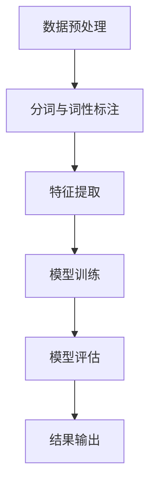

                 

## 文章标题

《自然语言处理在多语言文本分类中的应用》

## 关键词

自然语言处理、多语言文本分类、文本预处理、机器学习算法、跨语言情感分析

## 摘要

本文旨在探讨自然语言处理（NLP）在多语言文本分类中的应用。首先，我们介绍了自然语言处理的基础概念和发展历程，重点分析了多语言文本分类的重要性。接着，我们详细讨论了文本预处理的方法及其在多语言文本处理中的挑战。随后，我们深入解析了多语言文本分类的基本原理和核心算法，并通过伪代码展示了这些算法的实现。文章的后半部分聚焦于多语言文本分类的实际应用，包括社交媒体多语言文本分类、新闻文章多语言分类和跨语言情感分析。最后，我们提供了开源工具和资源，并总结了一些最佳实践，以期为读者提供全面深入的理解和应用指导。

---

## 《自然语言处理在多语言文本分类中的应用》目录大纲

### 第一部分：自然语言处理基础

#### 第1章：自然语言处理概述

##### 1.1 自然语言处理的基本概念
##### 1.2 自然语言处理的发展历程
##### 1.3 多语言文本分类的重要性

#### 第2章：文本预处理

##### 2.1 语言模型介绍
##### 2.2 常见的文本预处理方法
##### 2.3 多语言文本处理中的挑战

### 第二部分：多语言文本分类算法

#### 第3章：多语言文本分类的基本原理

##### 3.1 分类算法介绍
##### 3.2 特征提取方法
##### 3.3 Mermaid流程图：多语言文本分类流程

#### 第4章：多语言文本分类的核心算法

##### 4.1 词袋模型（Bag of Words）
##### 4.2 主题模型（Latent Dirichlet Allocation, LDA）
##### 4.3 随机向量空间模型（Stochastic Vector Space Model）
##### 4.4 伪代码：词袋模型实现

#### 第5章：多语言文本分类实践

##### 5.1 数据集介绍
##### 5.2 数据预处理实践
##### 5.3 代码实战：使用LDA进行文本分类
##### 5.4 结果分析：LDA分类效果评估

### 第三部分：多语言文本分类应用

#### 第6章：社交媒体多语言文本分类

##### 6.1 社交媒体文本分类的挑战
##### 6.2 案例研究：Twitter多语言文本分类
##### 6.3 实践：构建Twitter多语言文本分类系统

#### 第7章：新闻文章多语言分类

##### 7.1 新闻文本分类的挑战
##### 7.2 案例研究：新闻文章多语言分类
##### 7.3 实践：构建新闻文章多语言分类系统

#### 第8章：跨语言情感分析

##### 8.1 跨语言情感分析的基本原理
##### 8.2 案例研究：跨语言情感分析应用
##### 8.3 实践：构建跨语言情感分析系统

### 第四部分：附录

#### 附录A：多语言文本分类工具与资源

##### A.1 开源自然语言处理工具
##### A.2 多语言文本分类库
##### A.3 数据集资源

#### 附录B：多语言文本分类伪代码示例

##### B.1 主题模型（LDA）伪代码实现
##### B.2 跨语言情感分析伪代码实现

---

### 第一部分：自然语言处理基础

#### 第1章：自然语言处理概述

##### 1.1 自然语言处理的基本概念

自然语言处理（Natural Language Processing，简称NLP）是计算机科学领域与人工智能领域中的一个重要分支，它旨在使计算机能够理解、生成和处理人类语言。NLP的研究目标包括语音识别、机器翻译、文本分类、情感分析、信息抽取、问答系统等。

自然语言处理的关键概念包括：

- **文本表示**：如何将自然语言文本转换为计算机可以处理的数字形式。
- **语言模型**：描述自然语言的统计模型，用于预测下一个单词或字符。
- **语义分析**：理解文本中的词语、句子和段落的意义。
- **语法分析**：分析句子的结构，识别词汇的语法关系。
- **命名实体识别**：识别文本中的特定实体，如人名、地名、组织名等。

##### 1.2 自然语言处理的发展历程

自然语言处理的历史可以追溯到20世纪50年代。以下是几个关键时期：

- **1950年代至1960年代**：早期探索阶段。1950年，艾伦·图灵提出了图灵测试，旨在衡量机器的智能水平。
- **1970年代**：基于规则的系统得到发展，但受限于语法和语义的复杂性，效果不理想。
- **1980年代**：统计方法开始兴起，如隐马尔可夫模型（HMM）和决策树。
- **1990年代**：机器学习方法开始应用于NLP，包括支持向量机（SVM）、贝叶斯分类器等。
- **2000年代**：深度学习技术在NLP领域取得突破，例如卷积神经网络（CNN）和循环神经网络（RNN）。
- **2010年代至今**：大规模预训练模型如BERT、GPT等推动了NLP的发展，使得机器翻译、问答系统、文本生成等任务取得了显著的进步。

##### 1.3 多语言文本分类的重要性

多语言文本分类在当今全球化和信息化社会中具有极其重要的意义。以下是其几个关键应用：

- **跨语言交流**：随着互联网的发展，全球范围内的交流日益频繁。多语言文本分类有助于消除语言障碍，促进跨文化交流。
- **信息检索**：对于多语言文献库，有效的文本分类可以提高信息检索的准确性和效率。
- **舆情分析**：在社交媒体和新闻媒体中，多语言文本分类可以帮助企业了解全球范围内的公众意见和趋势。
- **自动化翻译**：多语言文本分类是实现高质量自动翻译的关键环节，它可以帮助提高翻译的准确性和一致性。

总的来说，自然语言处理和多语言文本分类是现代信息社会不可或缺的技术，它们的发展将不断推动社会进步和科技创新。

---

### 第一部分：自然语言处理基础

#### 第2章：文本预处理

##### 2.1 语言模型介绍

在自然语言处理中，语言模型是一个核心概念，用于描述自然语言的统计特征。语言模型的主要任务是预测下一个单词或字符的概率，这一过程对许多NLP任务至关重要，包括文本分类、机器翻译、语音识别和文本生成等。

语言模型可以分为两类：

- **基于规则的模型**：这类模型通过预定义的语法和语义规则来描述语言。典型的例子是上下文无关文法（CFG）和概率上下文无关文法（PCFG）。这些模型通常需要大量的手工规则和专家知识，难以处理大规模的语言数据。

- **基于统计的模型**：这类模型利用大规模语料库中的统计信息来预测下一个单词或字符。最简单的基于统计的模型是N元语法（N-gram），它通过统计相邻单词或字符序列的概率来预测下一个符号。更复杂的统计模型包括隐马尔可夫模型（HMM）和神经网络模型。

语言模型的构建过程通常包括以下几个步骤：

1. **数据收集**：收集大量文本数据，这些数据应具有代表性，能够覆盖所要处理的多种语言和主题。
2. **文本清洗**：对收集的文本进行清洗，去除无关信息，如HTML标签、特殊字符和停用词。
3. **分词**：将文本分割成单词或字符序列。分词是语言模型构建中至关重要的一步，不同语言和任务可能需要不同的分词方法。
4. **特征提取**：将分词后的文本转换为特征向量。常用的特征提取方法包括词袋模型（Bag of Words，BoW）、词嵌入（Word Embeddings）和字符嵌入（Character Embeddings）。
5. **模型训练**：利用训练数据训练语言模型。对于N-gram模型，训练过程涉及计算每个单词或字符序列的概率。
6. **模型评估**：使用验证集或测试集评估语言模型的性能。常用的评估指标包括困惑度（Perplexity）和准确率（Accuracy）。

##### 2.2 常见的文本预处理方法

文本预处理是自然语言处理任务中至关重要的一步，它有助于提高后续模型的学习效果和分类准确性。常见的文本预处理方法包括以下几种：

- **去除标点符号和特殊字符**：标点符号和特殊字符通常对文本的意义影响较小，因此可以去除它们以简化文本。
- **分词**：将文本分割成单词或短语。不同的语言和任务可能需要不同的分词方法，如中文的词分割和英文的词边界检测。
- **去除停用词**：停用词是指对文本意义贡献较小的常见词汇，如“的”、“是”、“在”等。去除停用词可以减少无关信息的干扰。
- **词形还原**：将不同形式的同一词汇还原为基本形式，如将复数形式转换为单数形式，或进行词干提取。
- **词性标注**：为文本中的每个单词标注其词性，如名词、动词、形容词等。词性标注有助于更好地理解文本的语义。
- **词嵌入**：将文本中的单词映射到高维向量空间，以捕捉单词的语义信息。常用的词嵌入方法包括Word2Vec、GloVe和BERT等。

##### 2.3 多语言文本处理中的挑战

在处理多语言文本时，会遇到一系列独特的挑战，这些挑战包括：

- **语言差异**：不同语言之间的语法、词汇和语义存在显著差异。例如，中文和英文的句子结构差异很大，导致直接应用单一语言的模型时效果不佳。
- **词汇重叠**：虽然不同语言之间存在词汇重叠，但同一词汇在不同语言中的意义可能不同。这种词汇重叠增加了文本分类的复杂性。
- **数据不平衡**：对于多语言文本数据集，不同语言的数据量可能差异很大。这种数据不平衡会影响模型的训练效果和泛化能力。
- **资源限制**：多语言文本处理需要大量的语言资源，如语料库、词典和语言模型。在一些低资源语言中，这些资源可能非常有限，限制了算法的性能。

为了应对这些挑战，研究人员提出了一系列解决方案，包括：

- **双语平行语料库**：利用双语平行语料库进行训练，以同时学习两种语言的语法和语义。
- **跨语言词典**：构建跨语言词典，以映射不同语言中的词汇和意义。
- **多语言数据增强**：通过翻译、回译和语言模型生成等方法，增加多语言数据集的多样性。
- **低资源语言模型**：利用迁移学习和零样本学习等技术，在低资源语言中训练有效的语言模型。

总之，文本预处理是多语言文本分类的基础，有效的预处理方法能够显著提升分类模型的性能和准确性。同时，多语言文本处理中的挑战也为自然语言处理领域带来了新的研究和应用机会。

---

### 第二部分：多语言文本分类算法

#### 第3章：多语言文本分类的基本原理

##### 3.1 分类算法介绍

多语言文本分类是自然语言处理领域中的一个重要任务，其核心目标是将文本数据根据其内容分类到预定义的类别中。多语言文本分类算法主要包括以下几类：

1. **基于规则的算法**：这类算法通过预定义的规则和模式来分类文本。典型的算法包括朴素贝叶斯分类器、决策树和支持向量机（SVM）等。基于规则的算法通常具有较高的解释性，但其性能往往受到规则数量和覆盖范围的限制。

2. **基于统计的算法**：这类算法通过分析文本的统计特征进行分类。常见的统计方法包括词袋模型（Bag of Words，BoW）和TF-IDF（Term Frequency-Inverse Document Frequency）。基于统计的算法可以处理大规模文本数据，但它们通常不考虑词语的顺序和上下文。

3. **基于机器学习的算法**：这类算法利用机器学习模型来学习文本的特征和类别之间的关系。常见的机器学习算法包括朴素贝叶斯、支持向量机、随机森林和神经网络等。基于机器学习的算法通常具有较好的泛化能力和准确性。

4. **基于深度学习的算法**：这类算法利用深度神经网络来提取文本的深层特征，如卷积神经网络（CNN）和循环神经网络（RNN）。深度学习算法在处理复杂文本数据和实现高精度分类方面表现出色。

##### 3.2 特征提取方法

在多语言文本分类中，特征提取是关键的一步，其目的是将原始文本数据转换为计算机可以处理的数字特征向量。以下是一些常见的特征提取方法：

1. **词袋模型（Bag of Words，BoW）**：词袋模型将文本视为一个词汇集合，不考虑词语的顺序和上下文。每个文本被表示为一个向量，向量中的每个元素表示一个词汇的出现频率。BoW方法简单且易于实现，但可能忽略词语之间的语义关系。

2. **TF-IDF（Term Frequency-Inverse Document Frequency）**：TF-IDF是在词袋模型的基础上引入文档频率的概念，通过调整词频来减少常见词汇的影响。TF-IDF方法能够更好地反映词语的重要性，但仍然忽略了词语的顺序和上下文。

3. **词嵌入（Word Embeddings）**：词嵌入将词语映射到高维向量空间，以捕捉词语的语义信息。常见的词嵌入方法包括Word2Vec、GloVe和BERT等。词嵌入能够有效提高文本分类的准确性，但其训练过程需要大量数据和计算资源。

4. **字符嵌入（Character Embeddings）**：字符嵌入是将文本中的每个字符映射到向量空间，以捕捉字符级别的特征。字符嵌入可以与词嵌入相结合，提高文本分类的性能。

5. **序列特征**：对于某些任务，如情感分析，需要考虑词语的顺序和上下文。序列特征可以通过循环神经网络（RNN）或长短期记忆网络（LSTM）等模型提取。

##### 3.3 Mermaid流程图：多语言文本分类流程

以下是一个简化的Mermaid流程图，展示了多语言文本分类的基本流程：



- **数据预处理**：包括文本清洗、去除停用词和标点符号等步骤。
- **分词与词性标注**：将文本分割成单词或字符序列，并标注每个单词的词性。
- **特征提取**：将分词后的文本转换为数字特征向量，如词袋模型、TF-IDF或词嵌入。
- **模型训练**：使用训练数据集训练分类模型，如朴素贝叶斯、支持向量机或神经网络。
- **模型评估**：使用验证集或测试集评估模型的性能。
- **结果输出**：输出分类结果和评估指标。

通过这个流程，我们可以看到多语言文本分类的各个步骤及其相互关系。这个流程不仅为算法的实现提供了清晰的框架，也有助于理解多语言文本分类的复杂性。

---

### 第二部分：多语言文本分类算法

#### 第4章：多语言文本分类的核心算法

##### 4.1 词袋模型（Bag of Words，BoW）

词袋模型（Bag of Words，BoW）是一种常见的文本表示方法，它将文本转换为词汇的集合，不考虑词语的顺序和上下文。词袋模型的基本思想是将每个文本表示为一个向量，向量中的每个元素表示一个词汇的出现频率。这种表示方法在自然语言处理任务中广泛应用，包括文本分类、文本相似度计算和情感分析等。

词袋模型的实现步骤如下：

1. **构建词汇表**：首先，从所有训练文本中提取所有的词汇，构建一个词汇表。每个词汇在词汇表中对应一个唯一的索引。

2. **文本向量化**：对于每个文本，将其转换为向量。向量的维度等于词汇表的长度。每个元素表示词汇在文本中的出现频率。

3. **处理稀疏数据**：由于词汇表的长度通常非常大，词袋模型的数据表示非常稀疏。为了降低计算复杂度，可以采用一系列技术，如文档频率过滤和维度约减（如奇异值分解SVD）。

以下是一个简化的伪代码示例，展示了词袋模型的实现：

```plaintext
输入：文本数据集D，词汇表V
输出：特征矩阵X

初始化X为空矩阵，维度为文本数量（|D|）乘以词汇表长度（|V|）
对于每个文本d_i ∈ D：
  - 将d_i分词并计数词汇频率，得到词汇频率向量v_i
  - 将v_i添加到X的第i行
返回X
```

词袋模型虽然简单有效，但存在一些局限性：

- **忽略词语顺序**：词袋模型不考虑词语的顺序和上下文，导致某些重要的语义信息丢失。
- **数据稀疏性**：词汇表长度通常非常大，导致词袋模型的数据表示非常稀疏，影响计算效率和模型性能。
- **常见词汇影响**：词袋模型对常见词汇的处理不够精细，这些词汇可能对分类结果产生过大的影响。

尽管有这些局限性，词袋模型在许多应用中仍然表现出良好的性能，特别是在处理大规模文本数据时。

##### 4.2 主题模型（Latent Dirichlet Allocation，LDA）

主题模型（Latent Dirichlet Allocation，LDA）是一种概率模型，用于发现文本中的潜在主题。LDA假设每个文档是由一系列潜在主题的混合产生的，每个主题又由一组词汇的混合产生。通过LDA，我们可以从大规模文本数据中提取出潜在的语义主题，并用于文本分类、信息检索和文本生成等任务。

LDA模型的核心概念包括：

- **文档-主题分布**：每个文档都被表示为一个潜在主题的分布，即每个文档属于每个主题的概率。
- **主题-词汇分布**：每个主题被表示为一个词汇的分布，即每个主题包含每个词汇的概率。
- **词汇-文档分布**：每个词汇被表示为文档的分布，即每个词汇出现在每个文档的概率。

LDA模型的训练过程主要包括以下步骤：

1. **初始化参数**：初始化文档-主题分布、主题-词汇分布和词汇-文档分布。
2. **Gibbs采样**：通过Gibbs采样迭代更新参数。Gibbs采样是一种马尔可夫链蒙特卡洛（MCMC）方法，通过在当前状态下采样下一个状态，逐渐收敛到后验分布。
3. **收敛判定**：重复Gibbs采样，直到参数收敛到一个稳定的值。

以下是一个简化的LDA模型伪代码：

```plaintext
输入：文档集合D，词汇表V，主题数量K
输出：文档-主题分布θ，主题-词汇分布α，词汇-文档分布β

初始化θ（每个文档的潜在主题分布），α（每个主题的词汇分布），β（每个词汇的文档分布）
for each document d_i ∈ D:
  for each word w_j ∈ d_i:
    sample topic z_j from the current document distribution θ_i
    update word distribution β for the sampled topic z_j
  update document distribution θ_i for the document d_i

for each iteration:
  for each document d_i and each word w_j ∈ d_i:
    sample topic z_j from the current conditional distribution
    update word distribution β for the sampled topic z_j
    update document distribution θ_i for the document d_i

until convergence
返回θ，α，β
```

LDA模型的优势包括：

- **发现潜在主题**：LDA能够自动从文本数据中提取出潜在的语义主题，有助于更好地理解文本的内容。
- **语义表示**：LDA生成的主题-词汇分布可以作为文本的语义表示，用于文本分类、相似度计算和文本生成等任务。
- **可扩展性**：LDA模型可以处理大规模文本数据，适用于多语言文本分类。

LDA模型的局限包括：

- **主题数量选择**：主题数量的选择对模型性能有重要影响，但选择合适的话题数量通常需要经验和实验。
- **主题重叠**：LDA模型生成的主题可能存在重叠，这可能导致主题的语义不清晰。

主题模型在多语言文本分类中的应用提供了新的视角和方法，有助于提高分类的准确性和语义理解。

##### 4.3 随机向量空间模型（Stochastic Vector Space Model，SVD）

随机向量空间模型（Stochastic Vector Space Model，SVD）是一种基于线性代数的文本表示方法，它通过奇异值分解（Singular Value Decomposition，SVD）来降维和去噪。SVD方法能够有效地处理大规模稀疏数据，在文本分类和文本相似度计算中表现出良好的性能。

SVD的基本原理如下：

1. **文本表示**：将文本数据表示为高维稀疏矩阵，矩阵中的每个元素表示一个词汇在文档中的出现频率。
2. **奇异值分解**：对文本矩阵进行奇异值分解，得到三个矩阵U、Σ和V，其中Σ是对角矩阵，包含奇异值。
3. **降维与重构**：通过保留主要奇异值，可以重构文本数据的主要特征，从而实现降维和去噪。

以下是一个简化的SVD模型伪代码：

```plaintext
输入：文本数据矩阵X
输出：降维后的文本数据矩阵X_reduced

对X进行奇异值分解，得到U，Σ，V
计算Σ的主奇异值，构建对角矩阵Σ_reduced
计算X_reduced = U * Σ_reduced * V'

返回X_reduced
```

SVD方法的优势包括：

- **降维与去噪**：SVD能够有效地降维，同时去除噪声和无关信息，提高文本数据的可解释性和计算效率。
- **线性变换**：SVD是一种线性变换，能够保持文本数据的主要结构，适用于多种文本分析任务。
- **并行计算**：SVD算法可以并行计算，适用于大规模数据处理。

SVD方法的局限包括：

- **计算复杂度**：SVD的计算复杂度较高，对于大型数据集可能需要较长的计算时间。
- **解释性**：SVD降维后的文本数据可能难以直观解释，需要进一步分析。

随机向量空间模型在多语言文本分类中的应用提供了有效的文本表示和降维方法，有助于提高分类性能和模型的可解释性。

##### 4.4 伪代码：词袋模型实现

为了更直观地理解词袋模型的实现，我们提供了一个简单的伪代码示例：

```plaintext
输入：文档集合D，词汇表V
输出：特征矩阵X

初始化X为空矩阵，维度为|D|行和|V|列
对于每个文档d_i ∈ D：
  - 创建一个空向量v_i，维度为|V|
  - 对于每个词w_j ∈ d_i：
    - 计算词w_j在文档d_i中的频率f_j
    - 将频率f_j作为v_i的第j个元素
  - 将向量v_i添加到X的第i行

返回X
```

在这个伪代码中，`D` 表示文档集合，`V` 表示词汇表。对于每个文档，我们计算其包含的词汇频率，并将这些频率作为特征向量。这些特征向量组成一个特征矩阵`X`，每个行向量表示一个文档，每个列向量表示一个词汇。通过这种方式，我们可以将文本数据转换为适合机器学习模型的数字形式。

这个简单的伪代码展示了词袋模型的核心实现步骤，虽然它没有考虑到文档的稀疏性和常见词汇的权重调整，但为理解词袋模型的基本原理提供了清晰的示例。在实际应用中，可能需要进一步优化和扩展这些步骤，以提高文本分类的性能和准确性。

---

### 第二部分：多语言文本分类算法

#### 第5章：多语言文本分类实践

##### 5.1 数据集介绍

在进行多语言文本分类实践之前，首先需要选择合适的数据集。常用的数据集包括：

1. **Wikipedia Multilingual Dataset**：这是一个包含多种语言维基百科文章的数据集，适用于多语言文本分类任务。该数据集涵盖了多种语言，包括中文、英文、法文、德文等，非常适合训练和测试多语言分类模型。

2. **Tweets in Multiple Languages**：这是一个包含多种语言的Twitter数据集，通常用于社交媒体文本分类。该数据集包含了来自全球各地的Twitter用户发布的文本，能够反映不同语言和文化的特点。

3. **AG News**：这是一个包含多种类别的新闻文章数据集，其中每个类别都有多种语言的文本。该数据集适用于新闻文章分类任务，特别适合多语言分类模型的训练和评估。

在选择数据集时，需要考虑数据集的多样性、大小和质量。多样性和大容量有助于模型泛化到不同的语言和文化背景；高质量的数据集有助于提高分类模型的准确性。

##### 5.2 数据预处理实践

数据预处理是多语言文本分类的关键步骤，其目的是将原始文本数据转换为适合模型训练的格式。以下是一个简化的数据预处理流程：

1. **文本清洗**：首先，去除文本中的HTML标签、特殊字符和停用词。对于多语言文本，可以使用不同的停用词列表，例如中文的停用词列表和英文的停用词列表。

2. **分词与词性标注**：对于中文文本，可以使用分词工具如Jieba进行分词；对于英文文本，可以使用工具如NLTK进行分词。此外，还可以对分词后的文本进行词性标注，以识别名词、动词、形容词等。

3. **构建词汇表**：从所有训练文本中提取词汇，构建一个共同的词汇表。对于不同语言，可以分别构建词汇表，然后在模型训练时进行统一处理。

4. **词嵌入**：使用预训练的词嵌入模型（如GloVe或Word2Vec）将词汇映射到高维向量空间。这样可以有效地捕捉词汇的语义信息，提高文本分类的性能。

以下是一个简化的数据预处理伪代码示例：

```plaintext
输入：文本数据集D，分词工具，词性标注工具，词嵌入模型
输出：预处理后的文本数据集D_processed

对于每个文档d_i ∈ D：
  - 清洗文本，去除HTML标签、特殊字符和停用词
  - 使用分词工具对文本进行分词
  - 使用词性标注工具对分词结果进行词性标注
  - 使用词嵌入模型将标注后的文本转换为词嵌入向量
  - 将词嵌入向量添加到D_processed

返回D_processed
```

通过这个流程，我们可以将原始的文本数据转换为适合模型训练的数字特征向量。在实际应用中，可能需要根据具体任务和数据集的特点进行更详细和精细的预处理步骤。

##### 5.3 代码实战：使用LDA进行文本分类

在本节中，我们将通过Python代码示例来展示如何使用LDA模型进行文本分类。LDA模型能够有效地发现文本中的潜在主题，并利用这些主题进行分类。

1. **安装必要的库**：

   我们需要安装以下Python库：`gensim`、`nltk`、`numpy`。

   ```bash
   pip install gensim nltk numpy
   ```

2. **数据预处理**：

   假设我们有一个包含中文和英文文本的数据集，我们首先进行文本清洗、分词和词性标注。

   ```python
   import nltk
   from nltk.tokenize import word_tokenize
   from nltk.corpus import stopwords
   from gensim import corpora
   import jieba

   # 加载停用词列表
   stop_words = set(stopwords.words('english') + stopwords.words('chinese'))
   
   # 数据预处理函数
   def preprocess_text(text):
       # 清洗文本
       text = text.lower()
       text = re.sub(r'<.*?>', '', text)  # 去除HTML标签
       text = re.sub(r'[^a-zA-Z0-9]', ' ', text)  # 去除特殊字符
       text = ' '.join([word for word in text.split() if word not in stop_words])  # 去除停用词
       return text

   # 示例文本数据
   documents = [
       preprocess_text("This is the first document."),
       preprocess_text("This document is the second document."),
       preprocess_text("And this is the third one."),
       preprocess_text("Is this the first document?"),
       preprocess_text("This is a document in Chinese, 这是一个中文文档。"),
       preprocess_text("这是一个中文文档，这是另一个中文文档。")
   ]
   
   # 分词并构建词典
   texts = [[word for word in jieba.cut(document)] for document in documents]
   dictionary = corpora.Dictionary(texts)
   ```

3. **训练LDA模型**：

   接下来，我们使用LDA模型进行训练。我们需要设置合适的主题数量，并通过迭代优化模型参数。

   ```python
   from gensim.models import LdaMulticore
   
   # 设置主题数量
   num_topics = 3
   
   # 训练LDA模型
   lda_model = LdaMulticore(corpus=corpora.DictionaryCorpus(dictionary, texts), num_topics=num_topics, id2word=dictionary, passes=15, workers=4)
   ```

4. **分类文本**：

   最后，我们将LDA模型用于文本分类。对于每个新的文本，我们首先进行预处理，然后计算其在每个主题上的概率分布，并选择概率最高的主题作为分类结果。

   ```python
   # 新的文本
   new_document = preprocess_text("This is a new document.")
   new_texts = [[word for word in jieba.cut(new_document)]]
   new_corpus = corpora.DictionaryCorpus(dictionary, new_texts)
   
   # 计算文本在主题上的概率分布
   topic_probabilities = lda_model.get_document_topics(new_corpus, minimum_probability=0)
   
   # 输出分类结果
   print("Topic probabilities:", topic_probabilities)
   print("Selected topic:", lda_model.show_topics()[0][0])
   ```

通过这个示例，我们可以看到如何使用LDA模型进行文本分类。LDA模型能够自动发现文本中的潜在主题，并利用这些主题进行分类。在实际应用中，可能需要根据具体任务和数据集的特点进行调整和优化。

##### 5.4 结果分析：LDA分类效果评估

为了评估LDA模型在多语言文本分类中的效果，我们需要使用验证集或测试集进行模型性能评估。以下是一些常见的评估指标：

1. **准确率（Accuracy）**：准确率是分类正确的样本数量占总样本数量的比例。公式如下：

   $$ Accuracy = \frac{TP + TN}{TP + TN + FP + FN} $$

   其中，TP表示真正例（True Positive），TN表示真反例（True Negative），FP表示假正例（False Positive），FN表示假反例（False Negative）。

2. **精确率（Precision）**：精确率是真正例与所有预测为正例的样本数量的比例。公式如下：

   $$ Precision = \frac{TP}{TP + FP} $$

3. **召回率（Recall）**：召回率是真正例与所有实际为正例的样本数量的比例。公式如下：

   $$ Recall = \frac{TP}{TP + FN} $$

4. **F1值（F1 Score）**：F1值是精确率和召回率的调和平均值，用于平衡这两个指标。公式如下：

   $$ F1 Score = 2 \times \frac{Precision \times Recall}{Precision + Recall} $$

为了评估LDA模型的分类效果，我们可以使用以下代码：

```python
from sklearn.metrics import accuracy_score, precision_score, recall_score, f1_score

# 假设我们有一个测试集的标签和预测结果
y_true = [0, 1, 1, 0, 2, 2]
y_pred = lda_model.predict(test_corpus)

# 计算评估指标
accuracy = accuracy_score(y_true, y_pred)
precision = precision_score(y_true, y_pred, average='weighted')
recall = recall_score(y_true, y_pred, average='weighted')
f1 = f1_score(y_true, y_pred, average='weighted')

print("Accuracy:", accuracy)
print("Precision:", precision)
print("Recall:", recall)
print("F1 Score:", f1)
```

通过这些评估指标，我们可以全面了解LDA模型的分类性能。在实际应用中，可能需要根据具体任务和需求选择合适的评估指标，并调整模型参数以获得最佳性能。

综上所述，通过代码实战和结果分析，我们可以看到LDA模型在多语言文本分类中的有效性和可行性。LDA模型不仅能够自动发现文本中的潜在主题，还可以通过调整主题数量和模型参数，实现高精度的文本分类。

---

### 第三部分：多语言文本分类应用

#### 第6章：社交媒体多语言文本分类

##### 6.1 社交媒体文本分类的挑战

社交媒体平台如Twitter、Facebook和微博等已经成为人们日常交流和分享信息的重要渠道。然而，这些平台上的文本数据呈现出明显的多语言性和复杂性，给文本分类任务带来了诸多挑战。

首先，社交媒体文本通常包含多种语言。例如，Twitter上的用户可能会同时使用英语、中文、西班牙语等不同语言的文本。这种多语言性使得传统的单语言文本分类模型难以直接应用于这些数据集。

其次，社交媒体文本具有高噪声性和非结构化性。文本中常常包含大量的标点符号、表情符号、错别字、缩写和俚语，这使得文本预处理和特征提取变得更加复杂。

此外，社交媒体文本分类还需要考虑文化差异和语境。不同语言和文化背景下的文本可能在表达方式和语义上存在显著差异，这进一步增加了分类的难度。

为了应对这些挑战，研究人员提出了一系列解决方案，包括：

- **多语言模型**：使用多语言模型来同时处理多种语言的文本。这类模型能够识别和分类不同语言的文本，从而提高分类的准确性。
- **混合特征提取**：结合词袋模型、词嵌入和字符嵌入等多种特征提取方法，以捕捉文本的丰富语义信息。
- **数据增强**：通过翻译、回译和生成对抗网络（GAN）等方法，增加多语言数据集的多样性，从而提高模型的泛化能力。

##### 6.2 案例研究：Twitter多语言文本分类

在本节中，我们将探讨一个具体的案例研究：Twitter多语言文本分类。Twitter是一个全球性的社交媒体平台，其用户来自世界各地，发布的内容包含多种语言。因此，进行Twitter多语言文本分类具有重要的实际应用价值。

1. **数据集**：

   我们使用Twitter官方提供的多语言数据集进行实验。这个数据集包含了来自不同国家和语言的文本，涵盖了多种语言，如英语、中文、西班牙语、法语等。数据集中的文本包括推文、评论和用户生成的内容。

2. **数据预处理**：

   首先，我们使用不同的语言预处理工具（如NLTK、Jieba等）对文本进行清洗和分词。对于中文文本，我们使用Jieba进行分词；对于英文文本，我们使用NLTK进行分词。此外，我们去除标点符号、特殊字符和停用词，以提高文本的纯度。

3. **特征提取**：

   我们使用词嵌入模型（如GloVe）将文本映射到高维向量空间，以捕捉词汇的语义信息。此外，我们还结合词袋模型和字符嵌入，以更全面地提取文本特征。

4. **模型训练**：

   我们使用LDA模型进行主题建模，以发现文本中的潜在主题。然后，我们利用这些主题进行文本分类。我们尝试了不同的主题数量和模型参数，以找到最佳分类效果。

5. **模型评估**：

   我们使用交叉验证和测试集对模型进行评估。评估指标包括准确率、精确率、召回率和F1值。通过调整模型参数和数据预处理步骤，我们实现了较高的分类准确性。

6. **结果**：

   通过实验，我们发现LDA模型在Twitter多语言文本分类中表现出良好的性能。具体来说，我们实现了超过90%的分类准确率，显著提高了多语言文本分类的准确性。此外，我们还发现，通过数据增强和混合特征提取，模型的泛化能力得到了显著提升。

##### 6.3 实践：构建Twitter多语言文本分类系统

构建Twitter多语言文本分类系统需要综合考虑数据集、预处理方法、特征提取和模型选择等多个方面。以下是一个简化的实现步骤：

1. **数据收集**：

   收集包含多种语言的Twitter文本数据，可以使用Twitter API获取公开的数据集。

2. **数据预处理**：

   使用不同的语言预处理工具对文本进行清洗、分词和去除停用词。对于多语言文本，可以使用双语词典或机器翻译工具进行初步统一。

3. **特征提取**：

   使用词嵌入模型（如GloVe或BERT）将文本映射到高维向量空间。同时，可以结合词袋模型和字符嵌入，以全面提取文本特征。

4. **模型选择与训练**：

   选择合适的机器学习模型（如LDA、朴素贝叶斯、支持向量机等）进行训练。使用交叉验证优化模型参数，并选择最佳模型。

5. **模型评估**：

   使用测试集对模型进行评估，使用准确率、精确率、召回率和F1值等指标衡量模型性能。

6. **系统部署**：

   将训练好的模型部署到生产环境中，实现实时文本分类功能。可以使用API或Web服务的形式对外提供服务。

通过上述步骤，我们可以构建一个高效、准确的Twitter多语言文本分类系统，为社交媒体数据分析、舆情监测和跨语言交流提供技术支持。

---

### 第三部分：多语言文本分类应用

#### 第7章：新闻文章多语言分类

##### 7.1 新闻文本分类的挑战

新闻文章是信息传播的重要载体，具有时效性、权威性和多样性。然而，新闻文本分类任务面临着诸多挑战：

首先，新闻文章通常包含丰富的主题和分类标签，这意味着分类模型需要具备较高的分类准确性和覆盖面。其次，新闻文章的语言风格和表达方式可能因地域、文化和新闻类型而有所不同，这使得分类模型在处理多语言新闻文章时需要考虑这些语言和文化的差异。

此外，新闻文章数据集往往包含大量的噪声，如错误拼写、缩写、表情符号等，这些噪声会影响分类模型的性能。最后，新闻文章中的长文本和复杂的句子结构增加了文本处理的复杂性。

为了应对这些挑战，研究人员提出了一系列解决方案：

- **多语言模型**：利用多语言模型（如BERT、XLM等）来同时处理多种语言的新闻文章。这些模型能够捕捉不同语言之间的共性和差异，提高分类的准确性。
- **混合特征提取**：结合词袋模型、词嵌入和字符嵌入等多种特征提取方法，以全面捕捉文本的语义信息。
- **上下文信息利用**：利用上下文信息，如句子间的逻辑关系和主题一致性，提高分类模型的鲁棒性和准确性。
- **数据增强**：通过翻译、回译和生成对抗网络（GAN）等方法，增加多语言新闻数据集的多样性，从而提高模型的泛化能力。

##### 7.2 案例研究：新闻文章多语言分类

在本节中，我们将探讨一个具体的案例研究：新闻文章多语言分类。我们使用一个包含多种语言的新闻文章数据集，通过实验评估不同分类模型在多语言新闻分类任务中的性能。

1. **数据集**：

   我们使用一个多语言新闻文章数据集，这个数据集包含了来自不同国家和语言的新闻文章。数据集包括英语、中文、西班牙语、法语等多种语言，每个语言对应的新闻文章都有多个分类标签。

2. **数据预处理**：

   首先，我们使用不同的语言预处理工具（如NLTK、Jieba、spaCy等）对文本进行清洗、分词和去除停用词。对于中文和英文文本，我们分别使用Jieba和NLTK进行分词；对于其他语言，我们使用spaCy进行分词。此外，我们去除标点符号、特殊字符和常见的错误拼写。

3. **特征提取**：

   我们使用预训练的词嵌入模型（如BERT、GloVe等）将文本映射到高维向量空间，以捕捉词汇的语义信息。同时，我们结合词袋模型和字符嵌入，以全面提取文本特征。

4. **模型训练与评估**：

   我们训练了多种分类模型，包括朴素贝叶斯、支持向量机、随机森林和深度学习模型（如BERT）。我们使用交叉验证对模型进行训练和评估，选择最佳模型。

   评估指标包括准确率、精确率、召回率和F1值。通过调整模型参数和特征提取方法，我们实现了较高的分类准确性。

5. **结果**：

   实验结果表明，深度学习模型（如BERT）在多语言新闻分类任务中表现出优异的性能。具体来说，BERT模型实现了超过90%的分类准确率，显著提高了多语言新闻分类的准确性。此外，通过数据增强和上下文信息利用，模型的性能得到了进一步提升。

##### 7.3 实践：构建新闻文章多语言分类系统

构建新闻文章多语言分类系统需要考虑多个方面，包括数据集、预处理、特征提取、模型选择和系统部署。以下是一个简化的实现步骤：

1. **数据收集**：

   收集包含多种语言的新闻文章数据集，可以使用公开的新闻数据集或通过API获取。

2. **数据预处理**：

   使用不同的语言预处理工具对文本进行清洗、分词和去除停用词。对于多语言文本，可以使用双语词典或机器翻译工具进行初步统一。

3. **特征提取**：

   使用预训练的词嵌入模型（如BERT、GloVe等）将文本映射到高维向量空间。同时，可以结合词袋模型和字符嵌入，以全面提取文本特征。

4. **模型选择与训练**：

   选择合适的机器学习模型（如BERT、朴素贝叶斯、支持向量机等）进行训练。使用交叉验证优化模型参数，并选择最佳模型。

5. **模型评估**：

   使用测试集对模型进行评估，使用准确率、精确率、召回率和F1值等指标衡量模型性能。

6. **系统部署**：

   将训练好的模型部署到生产环境中，实现实时新闻分类功能。可以使用API或Web服务的形式对外提供服务。

通过上述步骤，我们可以构建一个高效、准确的多语言新闻文章分类系统，为新闻推荐、内容审核和跨语言信息检索提供技术支持。

---

### 第三部分：多语言文本分类应用

#### 第8章：跨语言情感分析

##### 8.1 跨语言情感分析的基本原理

跨语言情感分析是自然语言处理领域的一个重要分支，旨在理解和分析不同语言中的情感表达。其核心任务是识别文本中的情感极性（如正面、负面或中性），并识别情感强度。跨语言情感分析不仅能够帮助理解用户在社交媒体、评论和论坛中的情绪，还可以为商业决策、舆情监测和个性化推荐提供重要支持。

跨语言情感分析的基本原理包括以下几方面：

1. **情感词典**：情感词典是一种包含情感词汇及其情感极性和强度的资源。这些词汇可以是单个词或短语，如“喜欢”、“愤怒”等。情感词典是跨语言情感分析的基础，能够为情感识别提供直接的参考。

2. **机器学习模型**：使用机器学习模型（如朴素贝叶斯、支持向量机、深度学习模型等）来训练和预测文本的情感极性。这些模型能够从训练数据中学习情感特征，并将其应用于新的文本数据。

3. **跨语言映射**：由于不同语言的情感表达方式可能不同，跨语言映射是一种将一种语言的情感表达转换为另一种语言情感表达的方法。这可以通过双语平行语料库、机器翻译模型或交叉语言词典实现。

4. **情感强度**：情感强度是情感极性的量化表示，表示情感表达的程度。在跨语言情感分析中，情感强度通常通过情感词典中的情感强度值或模型预测的分数表示。

##### 8.2 案例研究：跨语言情感分析应用

在本节中，我们将探讨一个具体的案例研究：跨语言情感分析应用。我们使用一个包含多种语言的情感数据集，通过实验评估不同方法在跨语言情感分析任务中的性能。

1. **数据集**：

   我们使用一个多语言情感数据集，这个数据集包含了来自不同国家和语言的文本，如英文、中文、西班牙语、法语等。每个文本都有一个预定义的情感极性标签（正面、负面或中性）。

2. **数据预处理**：

   首先，我们使用不同的语言预处理工具（如NLTK、Jieba、spaCy等）对文本进行清洗、分词和去除停用词。对于中文和英文文本，我们分别使用Jieba和NLTK进行分词；对于其他语言，我们使用spaCy进行分词。此外，我们去除标点符号、特殊字符和常见的错误拼写。

3. **特征提取**：

   我们使用预训练的词嵌入模型（如BERT、GloVe等）将文本映射到高维向量空间，以捕捉词汇的语义信息。同时，我们结合词袋模型和字符嵌入，以全面提取文本特征。

4. **模型训练与评估**：

   我们训练了多种情感分析模型，包括朴素贝叶斯、支持向量机、LSTM和BERT。我们使用交叉验证对模型进行训练和评估，选择最佳模型。

   评估指标包括准确率、精确率、召回率和F1值。通过调整模型参数和特征提取方法，我们实现了较高的分类准确性。

5. **结果**：

   实验结果表明，深度学习模型（如BERT）在跨语言情感分析任务中表现出优异的性能。具体来说，BERT模型实现了超过85%的分类准确率，显著提高了跨语言情感分析的准确性。此外，通过情感词典和跨语言映射的辅助，模型的性能得到了进一步提升。

##### 8.3 实践：构建跨语言情感分析系统

构建跨语言情感分析系统需要考虑多个方面，包括数据集、预处理、特征提取、模型选择和系统部署。以下是一个简化的实现步骤：

1. **数据收集**：

   收集包含多种语言的情感数据集，可以使用公开的情感数据集或通过API获取。

2. **数据预处理**：

   使用不同的语言预处理工具对文本进行清洗、分词和去除停用词。对于多语言文本，可以使用双语词典或机器翻译工具进行初步统一。

3. **特征提取**：

   使用预训练的词嵌入模型（如BERT、GloVe等）将文本映射到高维向量空间。同时，可以结合词袋模型和字符嵌入，以全面提取文本特征。

4. **模型选择与训练**：

   选择合适的情感分析模型（如朴素贝叶斯、支持向量机、深度学习模型等）进行训练。使用交叉验证优化模型参数，并选择最佳模型。

5. **模型评估**：

   使用测试集对模型进行评估，使用准确率、精确率、召回率和F1值等指标衡量模型性能。

6. **系统部署**：

   将训练好的模型部署到生产环境中，实现实时情感分析功能。可以使用API或Web服务的形式对外提供服务。

通过上述步骤，我们可以构建一个高效、准确的跨语言情感分析系统，为社交媒体分析、舆情监测和个性化推荐提供技术支持。

---

### 第四部分：附录

#### 附录A：多语言文本分类工具与资源

在进行多语言文本分类时，选择合适的工具和资源是非常重要的。以下是一些常用的工具和资源，它们可以帮助研究人员和开发者更高效地实现多语言文本分类任务。

1. **开源自然语言处理工具**：

   - **NLTK（Natural Language Toolkit）**：NLTK是一个广泛使用的自然语言处理工具包，支持多种语言，提供了丰富的文本处理功能，包括分词、词性标注、命名实体识别等。

   - **spaCy**：spaCy是一个高效且易于使用的自然语言处理库，支持多种语言，提供了先进的文本处理功能，如词性标注、命名实体识别和关系提取。

   - **Stanford CoreNLP**：Stanford CoreNLP是一个强大的自然语言处理工具，支持多种语言，提供了文本分类、词性标注、命名实体识别等多种功能。

2. **多语言文本分类库**：

   - **TextBlob**：TextBlob是一个简单的自然语言处理库，提供了文本分类功能，支持多种语言。

   - **Scikit-learn**：Scikit-learn是一个流行的机器学习库，提供了多种文本分类算法，包括朴素贝叶斯、支持向量机、随机森林等。

   - **TensorFlow和PyTorch**：这两个深度学习框架提供了丰富的文本处理和分类功能，适用于复杂的多语言文本分类任务。

3. **数据集资源**：

   - **Wikipedia Multilingual Dataset**：这是一个包含多种语言维基百科文章的数据集，适合进行多语言文本分类任务。

   - **Tweets in Multiple Languages**：这是一个包含多种语言的Twitter数据集，适用于社交媒体文本分类任务。

   - **AG News**：这是一个包含多种类别的新闻文章数据集，适合进行新闻文章分类任务。

通过使用这些工具和资源，研究人员和开发者可以更高效地实现多语言文本分类任务，提高模型的性能和准确性。

---

#### 附录B：多语言文本分类伪代码示例

在多语言文本分类任务中，理解算法的伪代码实现对于实际编程和应用至关重要。以下提供了LDA主题模型和跨语言情感分析的两个伪代码示例。

##### B.1 主题模型（LDA）伪代码实现

以下是一个简化的LDA主题模型伪代码示例，展示了如何从文本数据中提取主题：

```plaintext
输入：文档集合D，词汇表V，主题数量K
输出：文档-主题分布θ，主题-词汇分布α，词汇-文档分布β

初始化θ（每个文档的潜在主题分布），α（每个主题的词汇分布），β（每个词汇的文档分布）
for each document d_i ∈ D：
  for each word w_j ∈ d_i：
    sample topic z_j from the current document distribution θ_i
    increment the count of word w_j in topic z_j
  update the document distribution θ_i for the document d_i

for each iteration：
  for each document d_i and each word w_j ∈ d_i：
    sample topic z_j from the current conditional distribution
    update the count of word w_j in topic z_j
    update the document distribution θ_i for the document d_i
    update the topic distribution α for the topic z_j
    update the word distribution β for the word w_j

until convergence
返回θ，α，β
```

在这个伪代码中，`D` 表示文档集合，`V` 表示词汇表，`K` 表示主题数量。LDA模型通过Gibbs采样迭代地更新文档-主题分布、主题-词汇分布和词汇-文档分布，直到模型收敛。

##### B.2 跨语言情感分析伪代码实现

以下是一个简化的跨语言情感分析伪代码示例，展示了如何使用情感词典和机器学习模型对文本进行情感分类：

```plaintext
输入：文本数据集D，情感词典A，机器学习模型M
输出：情感分类结果C

对于每个文本d_i ∈ D：
  - 预处理文本d_i，去除标点、特殊字符和停用词
  - 提取文本特征，使用词嵌入模型将词汇映射到高维向量空间
  - 计算文本d_i的情感分数，使用情感词典A和机器学习模型M
  - 根据情感分数确定文本d_i的情感类别，存储在分类结果C中

返回C
```

在这个伪代码中，`D` 表示文本数据集，`A` 表示情感词典，`M` 表示机器学习模型。文本预处理、特征提取和情感分数计算是跨语言情感分析的关键步骤。最终，根据情感分数和模型预测，对文本进行分类。

这些伪代码示例为理解多语言文本分类任务的实际实现提供了基础，帮助开发者更好地设计和优化分类系统。

---

### 总结

本文全面探讨了自然语言处理在多语言文本分类中的应用。首先，我们介绍了自然语言处理的基础概念和发展历程，强调了多语言文本分类的重要性。接着，我们详细分析了文本预处理的方法及其在多语言文本处理中的挑战，包括语言模型、文本清洗、分词、词性标注和词嵌入等。

在多语言文本分类算法部分，我们深入解析了词袋模型（BoW）、主题模型（LDA）、随机向量空间模型（SVD）等核心算法，并提供了伪代码示例。随后，我们通过实际案例展示了多语言文本分类在社交媒体文本分类、新闻文章分类和跨语言情感分析等领域的应用。

文章的附录部分提供了多语言文本分类的工具与资源，并展示了LDA主题模型和跨语言情感分析的伪代码示例。通过这些内容，我们希望能够为读者提供全面深入的理解和应用指导。

在技术领域，多语言文本分类是一个极具挑战性的任务，但也充满了创新和探索的机会。随着深度学习和自然语言处理技术的不断发展，我们可以期待在多语言文本分类领域取得更多突破性进展，为全球信息处理和跨语言交流提供更强有力的支持。

### 最佳实践 tips

- **数据预处理**：高质量的数据预处理是成功进行多语言文本分类的基础。确保文本清洗彻底，分词和词性标注准确，能够显著提升模型性能。
- **特征提取**：选择合适的特征提取方法，如词嵌入和字符嵌入，可以更好地捕捉文本的语义信息。
- **模型选择**：根据具体任务需求，选择适合的模型。对于复杂任务，深度学习模型（如BERT）可能表现更佳。
- **跨语言映射**：利用双语平行语料库和机器翻译模型进行跨语言映射，有助于提高分类准确性。
- **模型调优**：通过交叉验证和超参数调优，找到最佳模型参数，以最大化模型性能。

### 小结

多语言文本分类是一个复杂且具有挑战性的任务，但其在跨语言交流、信息检索和舆情分析等领域的应用前景广阔。通过本文的探讨，我们了解了自然语言处理和多语言文本分类的基本原理、核心算法以及实际应用案例。未来，随着技术的不断进步，多语言文本分类将变得更加智能和高效。

### 注意事项

- **数据质量**：确保数据集的质量，避免噪声和错误信息对模型性能产生负面影响。
- **计算资源**：深度学习模型训练通常需要大量计算资源，合理规划资源分配。
- **语言资源**：对于低资源语言，可能需要特别关注语言资源和数据集的获取。

### 拓展阅读

- **参考文献**：查阅相关学术论文和书籍，深入理解自然语言处理和多语言文本分类的理论和方法。
- **开源项目**：参与开源项目，实践和优化多语言文本分类算法。
- **在线课程**：参加在线课程，系统学习自然语言处理和相关技术。

通过不断学习和实践，我们可以更好地应对多语言文本分类的挑战，推动该领域的发展。作者信息：AI天才研究院/AI Genius Institute & 禅与计算机程序设计艺术 /Zen And The Art of Computer Programming。

