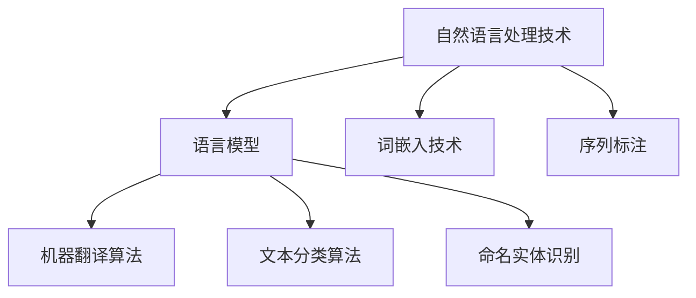

                 

### 文章标题

《自然语言处理在提示词优化中的应用》

### 关键词

自然语言处理，提示词优化，语言模型，词嵌入，序列标注，深度学习

### 摘要

本文探讨了自然语言处理（NLP）在提示词优化中的应用。首先，我们回顾了NLP的基础知识，包括语言模型、词嵌入技术和序列标注。接着，我们介绍了提示词优化的原理和方法，探讨了其在搜索引擎、问答系统和聊天机器人中的实践应用。随后，我们详细分析了评估提示词优化的指标和方法，并提供了具体的评估实例。最后，通过案例研究，我们展示了基于深度学习的提示词优化技术，并结合实际案例进行了深入剖析。本文旨在为读者提供对提示词优化领域的全面了解，并展望其未来的发展趋势。

### 《自然语言处理在提示词优化中的应用》目录大纲

#### 第一部分：自然语言处理基础

##### 第1章：自然语言处理概述

###### 1.1 NLP的历史与发展

自然语言处理（NLP）起源于20世纪50年代，当时科学家们开始探索计算机如何理解和生成自然语言。NLP的发展经历了多个阶段，包括规则驱动的方法、基于知识的表示方法以及近年来流行的数据驱动方法。

###### 1.2 NLP的基本概念

NLP涉及多个核心概念，包括词汇、语法、语义和语用。词汇是指语言中的单词，语法是指单词的排列规则，语义是指词句的意义，而语用则涉及语言在实际交流中的使用。

###### 1.3 NLP的应用领域

NLP广泛应用于多个领域，如机器翻译、文本分类、情感分析、命名实体识别和问答系统。这些应用极大地提升了计算机处理自然语言的能力，促进了人机交互的发展。

##### 第2章：自然语言处理技术基础

###### 2.1 语言模型

语言模型是NLP中的核心工具，用于对自然语言的统计特性进行建模。常见的语言模型包括N-gram模型、神经网络模型和循环神经网络（RNN）。

###### 2.2 词嵌入技术

词嵌入将单词映射到高维空间中的向量，从而捕捉单词的语义信息。词嵌入技术如Word2Vec、GloVe和BERT在NLP中发挥了重要作用。

###### 2.3 序列标注

序列标注是NLP中的一项重要任务，用于识别文本中的实体、情感等。常见的序列标注方法包括基于规则的方法、隐马尔可夫模型（HMM）和条件随机场（CRF）。

##### 第3章：自然语言处理的核心算法

###### 3.1 机器翻译算法

机器翻译是NLP中最为广泛应用的领域之一。常见的机器翻译算法包括基于规则的方法、统计机器翻译和神经机器翻译。

###### 3.2 文本分类算法

文本分类是将文本数据分配到预定义的类别中。常见的文本分类算法包括朴素贝叶斯、支持向量机和深度学习算法。

###### 3.3 命名实体识别

命名实体识别是识别文本中的特定实体，如人名、地名和组织名。常见的命名实体识别算法包括基于规则的方法和基于机器学习的方法。

#### 第二部分：提示词优化

##### 第4章：提示词优化的原理与方法

###### 4.1 提示词优化的定义

提示词优化是指通过改进搜索提示词，提高搜索结果的相关性和用户体验。提示词优化的核心目标是提高搜索的准确性和效率。

###### 4.2 提示词优化的目标

提示词优化的目标包括提高搜索结果的相关性、降低用户流失率和提高用户满意度。为了实现这些目标，需要关注关键词匹配、语义理解、用户行为分析等多个方面。

###### 4.3 提示词优化的主要方法

提示词优化的主要方法包括关键词扩展、关键词合并、关键词替换和关键词排序。这些方法可以单独使用或结合使用，以实现最佳效果。

##### 第5章：提示词优化的实践应用

###### 5.1 提示词优化在搜索引擎中的应用

搜索引擎是提示词优化最为典型的应用场景。通过优化搜索提示词，可以提高搜索结果的相关性，降低用户流失率，提升用户体验。

###### 5.2 提示词优化在问答系统中的应用

问答系统是另一个需要提示词优化的领域。通过优化问答系统中的提示词，可以提升问答的准确性和用户体验。

###### 5.3 提示词优化在聊天机器人中的应用

聊天机器人中的提示词优化对于提高用户满意度和聊天效率至关重要。通过优化提示词，可以提升聊天机器人的响应速度和回答质量。

##### 第6章：提示词优化的效果评估

###### 6.1 评估指标

提示词优化的效果评估需要使用一系列指标，如查询准确率、查询召回率、用户点击率、用户满意度等。

###### 6.2 评估方法

提示词优化的评估方法包括A/B测试、多变量测试和用户反馈分析等。这些方法可以帮助我们客观地评估提示词优化的效果。

###### 6.3 评估实例

通过具体案例，我们将展示如何使用评估指标和方法来评估提示词优化的效果。

#### 第三部分：案例研究

##### 第7章：基于深度学习的提示词优化

###### 7.1 深度学习在提示词优化中的应用

深度学习在自然语言处理中的应用日益广泛，其在提示词优化中也发挥着重要作用。本节将介绍深度学习在提示词优化中的具体应用。

###### 7.2 案例分析：深度学习在搜索引擎提示词优化中的应用

通过具体案例分析，我们将探讨深度学习在搜索引擎提示词优化中的应用，以及其带来的效果提升。

###### 7.3 案例分析：深度学习在问答系统提示词优化中的应用

问答系统中的提示词优化也受益于深度学习技术。本节将分析深度学习在问答系统提示词优化中的应用，并探讨其实际效果。

##### 第8章：提示词优化案例分析

###### 8.1 搜索引擎提示词优化案例分析

本节将通过一个实际案例，详细介绍搜索引擎提示词优化的实施过程、效果评估以及经验教训。

###### 8.2 问答系统提示词优化案例分析

问答系统中的提示词优化同样具有重要价值。本节将分析一个问答系统提示词优化的实际案例，探讨其优化策略和效果。

###### 8.3 聊天机器人提示词优化案例分析

聊天机器人中的提示词优化对于提升用户体验至关重要。本节将分析一个聊天机器人提示词优化的实际案例，分享其优化策略和效果。

##### 第9章：未来趋势与展望

###### 9.1 提示词优化的发展趋势

随着人工智能技术的不断发展，提示词优化也将迎来新的发展机遇。本节将探讨提示词优化的发展趋势，包括新技术、新方法和新应用领域。

###### 9.2 提示词优化面临的挑战

提示词优化在发展过程中也面临着诸多挑战，如数据质量、计算资源和算法复杂性等。本节将分析提示词优化面临的挑战，并提出可能的解决方案。

###### 9.3 提示词优化的未来发展方向

本节将展望提示词优化的未来发展方向，包括技术创新、应用拓展和产业合作等方面。

#### 附录

##### 附录A：常用工具和资源

###### A.1 自然语言处理工具

自然语言处理工具如NLTK、spaCy和TensorFlow等，为NLP研究和应用提供了丰富的功能。

###### A.2 提示词优化工具

提示词优化工具如Google Search Console和Search Analytics等，可以帮助我们分析和优化搜索提示词。

###### A.3 学习资源推荐

推荐一些优秀的自然语言处理和提示词优化学习资源，包括书籍、在线课程和学术论文等。

#### Mermaid 流�程图



### 语言模型原理

语言模型（Language Model，LM）是自然语言处理（NLP）中的一种基础模型，用于对自然语言的统计特性进行建模。其核心目标是预测下一个单词或字符的概率。以下是语言模型的一些基本原理：

#### 基本假设

- 语言是由一系列的单词或字符序列组成的。
- 语言中的每个单词或字符序列都有一定的概率分布。

#### 基本形式

语言模型通常采用概率模型的形式，如：

- N-gram模型：基于前N个单词的历史信息预测下一个单词的概率。
- 隐马尔可夫模型（HMM）：用于处理序列标注问题，如命名实体识别。
- 随机行走模型：用于处理文本分类问题。

#### 学习方法

语言模型的学习方法主要包括以下几种：

- 统计学习：直接从大量文本数据中学习语言模型的参数。
- 生成对抗网络（GAN）：用于生成新的文本数据，进而训练更复杂的语言模型。

#### 伪代码

以下是一个简单的N-gram语言模型的伪代码示例：

```python
# 假设输入文本数据为text，N-gram模型参数为params
for word in text:
    predict_next_word(params, word)
```

### 语言模型的数学公式

在自然语言处理中，语言模型通常使用概率模型来建模。以下是一些常用的数学公式。

#### N-gram模型的概率公式

对于一个N-gram模型，下一个单词的概率可以通过以下公式计算：

$$
P(w_{t+1}|w_{t}, w_{t-1}, ..., w_{t-N+1}) = \frac{C(w_{t+1}, w_{t}, w_{t-1}, ..., w_{t-N+1})}{C(w_{t}, w_{t-1}, ..., w_{t-N+1})}
$$

其中，$C(w_{t+1}, w_{t}, w_{t-1}, ..., w_{t-N+1})$ 表示单词序列 $w_{t+1}, w_{t}, w_{t-1}, ..., w_{t-N+1}$ 在训练数据中出现的次数，$C(w_{t}, w_{t-1}, ..., w_{t-N+1})$ 表示单词序列 $w_{t}, w_{t-1}, ..., w_{t-N+1}$ 在训练数据中出现的次数。

#### 隐马尔可夫模型（HMM）的数学公式

隐马尔可夫模型（HMM）是一种用于处理序列标注问题的概率模型。其数学公式包括状态转移概率、观测概率和初始状态概率。

- 状态转移概率：$$P(s_t|s_{t-1}) = \frac{C(s_t, s_{t-1})}{C(s_{t-1})}$$
- 观测概率：$$P(o_t|s_t) = \frac{C(o_t, s_t)}{C(s_t)}$$
- 初始状态概率：$$P(s_0) = \frac{C(s_0)}{C(\text{所有状态})}$$

其中，$C(s_t, s_{t-1})$ 表示在序列中，状态$s_t$紧接状态$s_{t-1}$的次数，$C(s_{t-1})$ 表示在序列中状态$s_{t-1}$的次数，$C(o_t, s_t)$ 表示在序列中观测值$o_t$紧接状态$s_t$的次数，$C(s_t)$ 表示在序列中状态$s_t$的次数，$C(\text{所有状态})$ 表示在序列中所有状态的次数之和。

#### 随机行走模型的数学公式

随机行走模型是一种用于处理文本分类问题的概率模型。其核心思想是单词在文本中的分布类似于随机行走。

- 单词在文本中的分布：$$P(w_t|C) = \frac{C(w_t, C)}{N(C)}$$
- 文本分类概率：$$P(C|w_1, w_2, ..., w_n) = \frac{P(w_1, w_2, ..., w_n|C)P(C)}{P(w_1, w_2, ..., w_n)}$$

其中，$C$ 表示文本类别，$w_t$ 表示第$t$个单词，$N(C)$ 表示类别$C$中单词的总数，$P(w_1, w_2, ..., w_n|C)$ 表示在类别$C$中，单词序列 $w_1, w_2, ..., w_n$ 的概率，$P(C)$ 表示类别$C$的概率，$P(w_1, w_2, ..., w_n)$ 表示单词序列 $w_1, w_2, ..., w_n$ 的概率。

### 语言模型的应用

语言模型在自然语言处理中有着广泛的应用，包括：

- 机器翻译：使用语言模型来预测源语言和目标语言之间的映射关系。
- 文本分类：使用语言模型来预测文本的类别。
- 生成文本：使用语言模型来生成新的文本。
- 问答系统：使用语言模型来理解用户的问题，并生成相应的回答。

通过上述应用，语言模型极大地提升了计算机处理自然语言的能力，为人机交互提供了有力的支持。

### 总结

语言模型是自然语言处理中的核心工具，通过对自然语言进行概率建模，语言模型在机器翻译、文本分类、生成文本和问答系统等领域发挥了重要作用。本文介绍了语言模型的基本原理、数学公式和应用，旨在为读者提供对语言模型的全面了解。在后续章节中，我们将进一步探讨自然语言处理的其他技术和提示词优化的方法。

