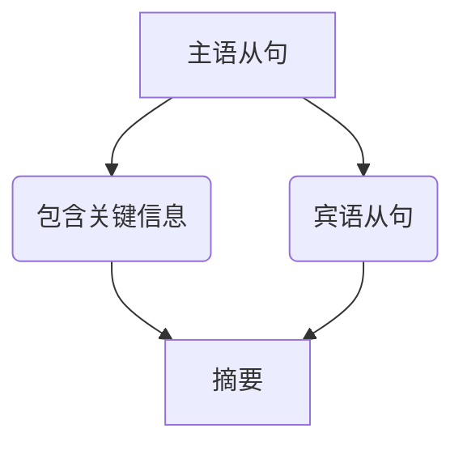
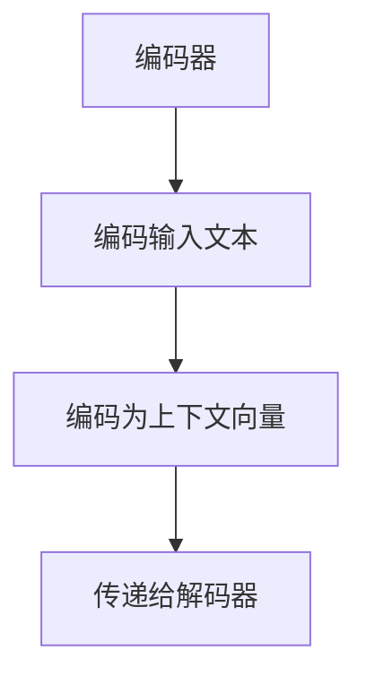
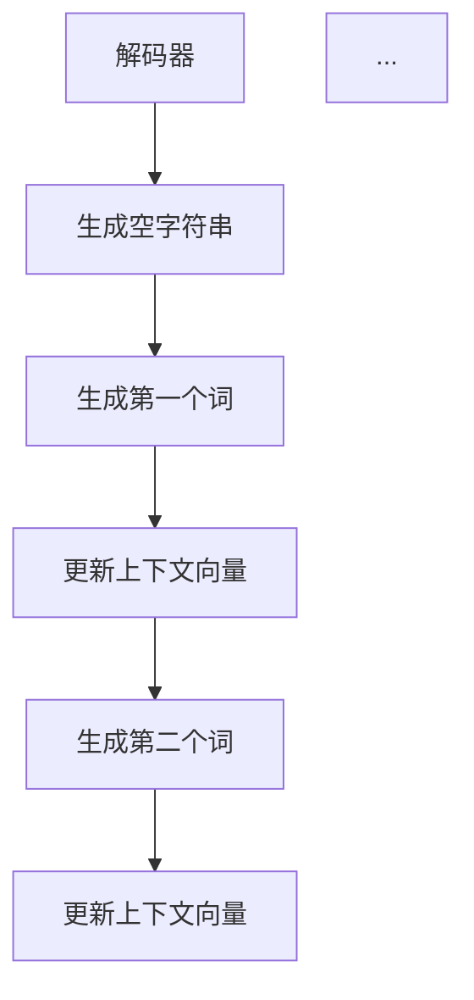
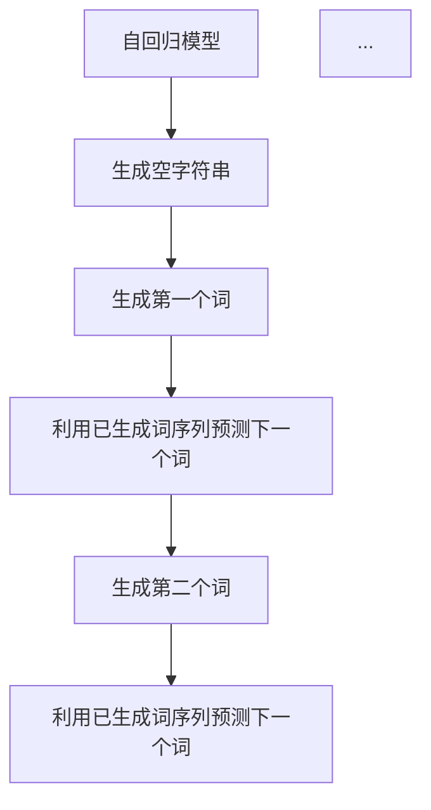
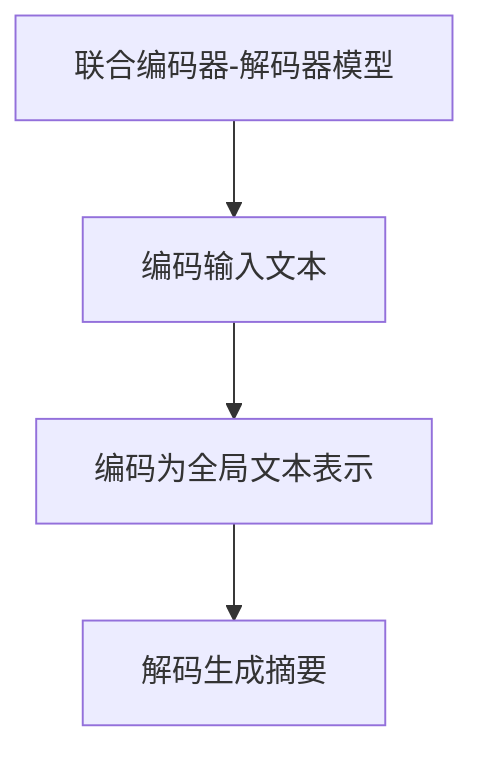

                 


### 文章标题：《自然语言处理在文本摘要中的应用》

**关键词**：自然语言处理，文本摘要，抽取式摘要，生成式摘要，神经文本摘要，评估指标

**摘要**：
本文将深入探讨自然语言处理（NLP）在文本摘要领域的应用。从NLP的基本概念和挑战出发，我们将逐步介绍文本摘要的定义、类型和应用场景，并详细分析抽取式摘要和生成式摘要的技术原理。随后，我们将介绍神经文本摘要的最新进展，包括编码器-解码器模型、自回归模型和联合编码器-解码器模型。文章还将探讨文本摘要的评估方法，并分享一个构建简单文本摘要系统的实战项目。最后，我们将讨论文本摘要领域的开放问题和未来展望，提供对读者的建议。

### 目录大纲

#### 第一部分：自然语言处理基础

##### 第1章：自然语言处理概述
1.1 自然语言处理的发展历程
1.2 自然语言处理的挑战
1.3 自然语言处理的应用领域

##### 第2章：文本预处理
2.1 文本清洗
2.2 词向量化
2.3 分词与词性标注

#### 第二部分：文本摘要技术

##### 第3章：文本摘要概述
3.1 文本摘要的定义
3.2 文本摘要的类型
3.3 文本摘要的应用场景

##### 第4章：抽取式摘要
4.1 抽取式摘要概述
4.2 基于规则的方法
4.3 基于统计的方法
4.4 基于机器学习的方法

##### 第5章：生成式摘要
5.1 生成式摘要概述
5.2 基于概率模型的方法
5.3 基于深度学习的方法

##### 第6章：神经文本摘要
6.1 神经文本摘要概述
6.2 编码器-解码器模型
6.3 自回归模型
6.4 联合编码器-解码器模型

##### 第7章：文本摘要评估
7.1 评估指标
7.2 实际应用中的评估
7.3 评估方法的改进

#### 第三部分：文本摘要项目实战

##### 第8章：构建一个简单的文本摘要系统
8.1 项目介绍
8.2 数据集准备
8.3 模型选择与训练
8.4 模型评估与优化

##### 第9章：改进文本摘要效果
9.1 数据增强
9.2 模型融合
9.3 实时摘要系统开发

##### 第10章：开放问题与未来展望
10.1 文本摘要领域的挑战
10.2 未来发展趋势
10.3 对读者的建议

#### 附录

##### 附录A：常用文本摘要工具与库
A.1 TextRank
A.2 SummarizeBot
A.3 Transformer模型

##### 附录B：参考文献
B.1 相关书籍
B.2 学术论文
B.3 网络资源### 自然语言处理概述

自然语言处理（Natural Language Processing，简称NLP）是人工智能（Artificial Intelligence，简称AI）的一个重要分支，致力于使计算机能够理解、解释和生成人类自然语言。NLP结合了计算机科学、语言学、人工智能等多个领域的知识，旨在解决从文本中提取有用信息、理解语义、生成文本等一系列复杂问题。

#### 1.1 自然语言处理的发展历程

自然语言处理的历史可以追溯到20世纪50年代。当时，计算机科学家和语言学家开始探索如何使计算机理解自然语言。早期的研究主要集中在规则驱动的方法上，例如词汇分析（Lexical Analysis）和句法分析（Syntax Analysis）。然而，这些方法很快遇到了瓶颈，因为自然语言极为复杂，难以用有限的规则来准确描述。

在20世纪60年代和70年代，基于统计的方法开始兴起。这些方法利用大量语料库中的统计规律来推断语言模型，从而在一定程度上提高了自然语言处理的性能。然而，统计方法也面临着一些挑战，如数据稀疏性和模型复杂度等问题。

进入21世纪，随着深度学习的快速发展，自然语言处理迎来了新的突破。深度学习模型，如循环神经网络（RNN）、长短期记忆网络（LSTM）和变换器（Transformer）等，大大提升了自然语言处理的准确性和效率。特别是Transformer模型的提出，使得自然语言处理在很多任务上都取得了显著的成果。

#### 1.2 自然语言处理的挑战

自然语言处理面临以下几个主要挑战：

1. **语言复杂性**：自然语言具有高度的复杂性，包括词法、句法、语义等多个层次。这种复杂性使得计算机难以理解和生成自然语言。

2. **数据稀疏性**：对于某些词汇或句子，训练数据可能非常稀疏，导致模型难以学习到有效的特征。

3. **歧义性**：自然语言中存在大量的歧义现象，如同音异义词、多义词汇等，这给自然语言处理带来了巨大的挑战。

4. **上下文依赖性**：理解语言往往需要依赖上下文信息，而上下文的理解又是一个高度复杂的过程。

5. **计算资源需求**：深度学习模型通常需要大量的计算资源来训练和推理，这对硬件设施提出了较高的要求。

#### 1.3 自然语言处理的应用领域

自然语言处理的应用领域非常广泛，包括但不限于以下几方面：

1. **文本分类**：对文本进行分类，如情感分析、垃圾邮件检测等。

2. **实体识别**：识别文本中的命名实体，如人名、地名、组织名等。

3. **机器翻译**：将一种语言的文本翻译成另一种语言。

4. **问答系统**：构建能够回答用户问题的智能系统。

5. **语音识别**：将语音信号转换为文本。

6. **文本摘要**：自动提取文本的关键信息，生成摘要。

7. **聊天机器人**：与人类进行自然语言交互，提供咨询服务。

8. **自动文摘**：从大量文献中提取重要信息，生成摘要。

9. **情感分析**：分析文本中的情感倾向，如正面、负面等。

通过以上对自然语言处理概述的探讨，我们可以看到，NLP不仅具有深厚的历史积淀，还面临着许多挑战，并且在各个应用领域中发挥着重要作用。在接下来的章节中，我们将进一步探讨NLP在文本摘要领域的具体应用。

#### 第2章：文本预处理

在自然语言处理（NLP）中，文本预处理是至关重要的一步，它为后续的任务如文本分类、实体识别、文本摘要等提供了干净且结构化的数据。文本预处理包括文本清洗、词向量化、分词与词性标注等多个步骤，这些步骤旨在消除文本中的噪声，提取有用的信息，并使文本数据更适合于机器学习模型处理。

#### 2.1 文本清洗

文本清洗是指从原始文本数据中去除无用的信息，如HTML标签、特殊字符、停用词等。这一步骤的主要目的是减少数据的噪声，提高数据质量。

**步骤**：

1. **去除HTML标签**：HTML标签通常包含在网页抓取的文本中，它们对NLP任务没有实际意义，需要去除。

   ```python
   import re
   
   def remove_html_tags(text):
       clean = re.compile('<.*?>')
       return re.sub(clean, '', text)
   ```

2. **去除特殊字符**：特殊字符如标点符号、空格等可能对模型性能产生负面影响，需要去除或替换。

   ```python
   def remove_special_characters(text):
       return re.sub(r'[^a-zA-Z0-9\s]', '', text)
   ```

3. **去除停用词**：停用词是指对NLP任务没有贡献的常见词汇，如“的”、“和”、“是”等。去除停用词可以减少数据噪声，提高模型效率。

   ```python
   from nltk.corpus import stopwords
   
   def remove_stopwords(text):
       return ' '.join([word for word in text.split() if word not in stopwords.words('english')])
   ```

#### 2.2 词向量化

词向量化是将文本数据转换为数字表示的过程，使得计算机可以处理和操作文本。常见的词向量化方法包括词袋模型（Bag of Words，BoW）和词嵌入（Word Embedding）。

**词袋模型**：

词袋模型将文本表示为一个向量空间，其中每个维度对应一个词汇表中的一个词。每个词的频率或出现次数作为该维度上的值。

```python
from sklearn.feature_extraction.text import CountVectorizer
   
def bow_vectorizer(texts):
    vectorizer = CountVectorizer()
    return vectorizer.transform(texts)
```

**词嵌入**：

词嵌入是将每个词映射到一个固定大小的低维向量。词嵌入可以捕捉词的语义信息，是现代NLP任务的基础。

```python
from gensim.models import Word2Vec
   
def word2vec_model(texts):
    model = Word2Vec(texts, vector_size=100, window=5, min_count=1, workers=4)
    return model
```

#### 2.3 分词与词性标注

**分词**：

分词是将连续的文本分割成有意义的子单元，如单词或词组。分词是许多NLP任务的基础，如文本分类、命名实体识别等。

```python
import jieba
   
def segment_text(text):
    return jieba.cut(text)
```

**词性标注**：

词性标注是为文本中的每个词赋予一个词性标签，如名词、动词、形容词等。词性标注有助于更好地理解文本的语义结构。

```python
import nltk
   
nltk.download('averaged_perceptron_tagger')
   
def pos_tagging(text):
    tokens = nltk.word_tokenize(text)
    return nltk.pos_tag(tokens)
```

通过上述文本预处理步骤，我们可以有效地去除文本中的噪声，提取有用的信息，并使文本数据适合于NLP任务。这些预处理步骤不仅提高了模型性能，还使数据更加结构化和易于分析。

### 第3章：文本摘要概述

文本摘要是自然语言处理（NLP）中的一个重要任务，其目标是从原始文本中提取出最有价值的信息，并以简洁的方式表达出来。文本摘要不仅有助于快速了解文本内容，还能在信息过载的环境中节省时间和精力。本节将介绍文本摘要的定义、类型及其应用场景。

#### 3.1 文本摘要的定义

文本摘要（Text Summarization）是指通过自动化的方式，从原始文本中提取关键信息，并以简短、连贯、清晰的方式表达出来的过程。简而言之，文本摘要的目的是将长文本转化为精炼的摘要，同时保留原始文本的主要信息和核心观点。

#### 3.2 文本摘要的类型

根据摘要生成的过程和形式，文本摘要可以分为以下几种类型：

1. **抽取式摘要（Extractive Summarization）**：
   抽取式摘要通过从原始文本中直接抽取关键句子或段落来生成摘要。这种摘要方法通常依赖于文本的结构和内容的重要性。例如，关键句子往往包含主旨句、过渡句和结论句。

2. **生成式摘要（Abstractive Summarization）**：
   生成式摘要通过自然语言生成技术生成新的文本，这些文本概括了原始文本的主要信息，但并不是直接从原始文本中抽取出来的。这种方法通常利用深度学习模型，如编码器-解码器（Encoder-Decoder）模型或变换器（Transformer）模型。

3. **混合式摘要（Hybrid Summarization）**：
   混合式摘要结合了抽取式和生成式摘要的优点，首先通过抽取式摘要提取关键句子，然后通过生成式摘要对这些句子进行重新组织，生成更加流畅和自然的摘要。

#### 3.3 文本摘要的应用场景

文本摘要技术在多个领域有着广泛的应用：

1. **信息检索**：
   在大量的文本数据中，文本摘要可以帮助用户快速找到所需信息，从而提高信息检索的效率。

2. **内容推荐**：
   在社交媒体、新闻网站和电子商务平台上，文本摘要可以用于内容推荐系统，帮助用户发现可能感兴趣的内容。

3. **文本挖掘**：
   在文本挖掘过程中，文本摘要可以帮助研究人员快速了解大量文献的核心内容，从而节省时间和精力。

4. **教育**：
   在教育领域，文本摘要可以帮助学生快速掌握教材的主要内容，提高学习效率。

5. **自动文摘**：
   从大量的学术文献或新闻报道中提取摘要，为专业人士提供快速阅读的便利。

6. **辅助阅读**：
   对于视力障碍者或阅读能力受限的用户，文本摘要可以提供简化的文本版本，便于他们阅读和理解。

通过以上对文本摘要的概述，我们可以看到，文本摘要作为一种重要的NLP技术，不仅在提升信息获取效率方面具有重要作用，还在多个应用领域展示了其广泛的应用前景。

### 第4章：抽取式摘要

抽取式摘要（Extractive Summarization）是一种文本摘要技术，它通过从原始文本中直接抽取关键句子或段落来生成摘要。这种方法的优点是生成的摘要与原始文本保持高度的一致性，但在某些情况下可能会丢失文本的连贯性和流畅性。本节将详细探讨抽取式摘要的基本概念、基于规则的方法、基于统计的方法和基于机器学习的方法。

#### 4.1 抽取式摘要概述

抽取式摘要的核心思想是从大量文本中识别出最具信息价值的句子或段落，并将其组合成摘要。这种方法依赖于对文本内容的重要性评估和关键信息的提取。

**抽取式摘要的流程**：

1. **句子重要性评估**：首先，需要对文本中的每个句子进行重要性评估，识别出那些包含关键信息的句子。

2. **关键信息提取**：接下来，从高重要性评估的句子中提取关键信息。

3. **摘要生成**：最后，将提取的关键信息组合成摘要，确保其简洁、连贯和清晰。

#### 4.2 基于规则的方法

基于规则的方法通过预先定义的规则和模式来识别文本中的关键句子。这些规则可以是简单的关键词匹配，也可以是复杂的句法分析。

**关键词匹配**：
这种方法使用一组预定义的关键词来识别文本中的关键句子。如果一个句子包含这些关键词，则认为该句子具有重要性，从而被选中作为摘要的一部分。

**示例**：

```python
# 假设我们有一组关键词
keywords = ["重要", "关键", "重要信息"]

# 文本中的句子
sentences = ["这是一个重要的句子", "另一个句子", "包含关键信息"]

# 根据关键词匹配选择关键句子
summary_sentences = [sentence for sentence in sentences if any(keyword in sentence for keyword in keywords)]

# 摘要
summary = ' '.join(summary_sentences)
```

**句法分析**：
更复杂的基于规则的方法通过句法分析来确定句子的结构，从而识别出重要的句子。例如，主语从句和宾语从句通常包含重要的信息，可以被选中作为摘要的一部分。

**示例**：



**缺点**：
基于规则的方法存在以下缺点：
1. **规则过于简单**：简单规则可能无法捕捉文本中的深层结构和语义关系。
2. **规则难以扩展**：对于新的领域或文本类型，可能需要重新定义规则。
3. **灵活性和适应性差**：规则方法难以适应不同类型的文本和需求。

#### 4.3 基于统计的方法

基于统计的方法使用统计模型来评估句子的重要性，从而生成摘要。这种方法通常依赖于文本中的统计规律，如TF-IDF（Term Frequency-Inverse Document Frequency）和文本相似度计算。

**TF-IDF**：
TF-IDF是一种常用的统计方法，用于衡量一个词在文本中的重要程度。TF（词频）表示词在文本中出现的次数，IDF（逆文档频率）则反映了词在文档集合中的普遍性。IDF的目的是减少常见词的影响，提高关键词的重要性。

```python
from sklearn.feature_extraction.text import TfidfVectorizer

# 文本数据
corpus = ["这是一个重要的句子", "另一个句子", "包含关键信息"]

# 创建TF-IDF向量器
vectorizer = TfidfVectorizer()

# 计算TF-IDF向量
X = vectorizer.fit_transform(corpus)

# 根据TF-IDF向量选择关键句子
sentence_importance = X.toarray()
summary_sentences = [sentence for sentence, importance in zip(corpus, sentence_importance) if importance.mean() > threshold]

# 摘要
summary = ' '.join(summary_sentences)
```

**文本相似度计算**：
文本相似度计算通过比较文本之间的相似性来确定句子的重要性。例如，可以计算两个句子之间的余弦相似度，然后根据相似度值选择关键句子。

```python
from sklearn.metrics.pairwise import cosine_similarity

# 计算文本相似度
similarity_matrix = cosine_similarity(vectorizer.transform(corpus))

# 根据相似度选择关键句子
summary_sentences = [sentence for sentence, similarity in zip(corpus, similarity_matrix[0]) if similarity > threshold]

# 摘要
summary = ' '.join(summary_sentences)
```

**缺点**：
基于统计的方法存在以下缺点：
1. **忽视语义信息**：统计方法主要依赖于词频和相似度等表面特征，可能忽视语义信息。
2. **数据稀疏性**：对于小数据集，统计模型的性能可能较差。

#### 4.4 基于机器学习的方法

基于机器学习的方法使用监督学习模型来评估句子的重要性，从而生成摘要。这种方法通常需要大量的标注数据来训练模型，然后利用训练好的模型对新的文本进行摘要。

**分类模型**：
分类模型（如朴素贝叶斯、支持向量机等）可以用于句子重要性评估。通过训练模型，可以识别出哪些句子是重要的，从而生成摘要。

```python
from sklearn.naive_bayes import MultinomialNB
from sklearn.model_selection import train_test_split

# 假设我们有一组标注数据
X = ...  # 特征向量
y = ...  # 标签（0表示非关键句子，1表示关键句子）

# 划分训练集和测试集
X_train, X_test, y_train, y_test = train_test_split(X, y, test_size=0.2, random_state=42)

# 训练分类模型
classifier = MultinomialNB()
classifier.fit(X_train, y_train)

# 测试模型
accuracy = classifier.score(X_test, y_test)

# 根据模型预测选择关键句子
predictions = classifier.predict(X_test)
summary_sentences = [sentence for sentence, prediction in zip(corpus, predictions) if prediction == 1]

# 摘要
summary = ' '.join(summary_sentences)
```

**序列标注模型**：
序列标注模型（如CRF、BiLSTM等）可以用于对句子进行序列标注，从而识别出关键句子。这种方法通常更适用于处理长文本。

```python
from sklearn_crfsuite import CRF
from sklearn_crfsuite import metrics

# 训练序列标注模型
crf = CRF()
crf.fit(X_train, y_train)

# 测试模型
y_pred = crf.predict(X_test)
metrics.flat_f1_score(y_test, y_pred, average='weighted')

# 根据模型预测选择关键句子
summary_sentences = [sentence for sentence, label in zip(corpus, y_pred) if label == '1']

# 摘要
summary = ' '.join(summary_sentences)
```

**优点**：
基于机器学习的方法存在以下优点：
1. **自动学习特征**：模型可以自动学习文本中的特征，从而提高摘要的质量。
2. **适应性**：基于机器学习的方法可以适应不同的文本类型和需求。
3. **灵活性**：可以通过调整模型参数来调整摘要的长度和风格。

通过上述对抽取式摘要的探讨，我们可以看到，抽取式摘要技术在文本摘要领域具有广泛的应用前景。虽然这种方法在生成连贯性方面存在一些挑战，但通过结合不同的技术和方法，可以有效地生成高质量、信息丰富的摘要。

### 第5章：生成式摘要

生成式摘要（Abstractive Summarization）是一种先进的文本摘要方法，它通过生成全新的文本来概括原始文本的主要信息，而不是简单地从原始文本中抽取关键句子。这种方法能够产生更加自然和连贯的摘要，为文本摘要任务带来了显著的提升。本节将详细介绍生成式摘要的基本概念、基于概率模型的方法和基于深度学习的方法。

#### 5.1 生成式摘要概述

生成式摘要的核心思想是利用自然语言生成（Natural Language Generation，NLG）技术来生成摘要。与抽取式摘要不同，生成式摘要不需要从原始文本中抽取句子，而是通过理解文本的语义和结构，生成一个全新的、简洁且连贯的文本摘要。这种方法的主要优势在于其能够产生更具创造性和灵活性的摘要。

**生成式摘要的流程**：

1. **语义理解**：首先，对原始文本进行语义理解，提取文本的主要概念和关系。

2. **摘要生成**：然后，利用这些理解结果，通过生成模型生成新的摘要文本。

3. **文本优化**：最后，对生成的摘要进行优化，确保其简洁、连贯和清晰。

生成式摘要的关键在于如何有效地进行语义理解和文本生成。以下将详细介绍两种主要方法：基于概率模型的方法和基于深度学习的方法。

#### 5.2 基于概率模型的方法

基于概率模型的方法通过概率模型来估计文本中每个词出现的概率，从而生成摘要。这种方法通常依赖于语言模型和文本生成模型。

**语言模型**：

语言模型（Language Model，LM）是一种用于预测下一个词的概率的模型。在生成式摘要中，语言模型可以用来估计摘要文本中每个词的概率。

**文本生成模型**：

文本生成模型（Text Generation Model）是一种能够根据输入文本生成新文本的模型。常见的文本生成模型包括马尔可夫模型（Markov Model）和隐马尔可夫模型（Hidden Markov Model，HMM）。

**示例**：

假设我们有一个简短的文本，并希望使用基于概率模型的方法生成摘要。

```python
# 原始文本
text = "自然语言处理是一种人工智能技术，它致力于使计算机能够理解和生成人类自然语言。"

# 语言模型
lm = ngram_model.TextNGramModel(text)

# 文本生成模型
generator = ngram_model.TextGenerator(lm)

# 生成摘要
summary = generator.generate_summary(text, max_length=50)
```

**优点**：

基于概率模型的方法具有以下优点：

1. **简单高效**：基于概率模型的方法通常较为简单，易于实现和优化。
2. **灵活性**：概率模型能够灵活地适应不同的文本类型和需求。
3. **生成多样性**：概率模型可以生成多种可能的摘要，从而增加摘要的多样性。

**缺点**：

基于概率模型的方法也存在一些缺点：

1. **计算复杂度**：概率模型通常涉及大量的计算，可能导致生成效率较低。
2. **语义理解不足**：概率模型主要依赖于统计规律，可能无法充分理解文本的语义。

#### 5.3 基于深度学习的方法

基于深度学习的方法通过深度神经网络来模拟人类语言的生成过程，从而生成高质量的摘要。这种方法主要包括循环神经网络（RNN）、长短期记忆网络（LSTM）和变换器（Transformer）等。

**循环神经网络（RNN）**：

循环神经网络是一种能够处理序列数据的神经网络，其通过在网络中保留状态信息，来模拟序列的依赖关系。在生成式摘要中，RNN可以用于生成摘要文本。

**长短期记忆网络（LSTM）**：

长短期记忆网络是RNN的一种改进，它通过引入门控机制来更好地处理长距离依赖问题。在生成式摘要中，LSTM可以用于生成更连贯和自然的摘要。

**变换器（Transformer）**：

变换器是一种基于自注意力机制的深度学习模型，它在机器翻译、文本摘要等任务中取得了显著的成果。变换器通过并行计算和自注意力机制，能够更好地捕捉文本中的依赖关系。

**示例**：

假设我们有一个简短的文本，并希望使用基于深度学习的方法生成摘要。

```python
# 加载变换器模型
model = transformers.T5ForConditionalGeneration.from_pretrained("t5-small")

# 编码文本
input_ids = tokenizer.encode(text, return_tensors='pt')

# 生成摘要
output = model.generate(input_ids, max_length=50, num_return_sequences=1)

# 解码摘要
summary = tokenizer.decode(output[0], skip_special_tokens=True)
```

**优点**：

基于深度学习的方法具有以下优点：

1. **强大的语义理解**：深度学习模型能够通过大量的数据学习到丰富的语义信息，从而生成更高质量的摘要。
2. **灵活性和适应性**：深度学习模型可以适应不同的文本类型和需求，具有很高的灵活性。
3. **高效的计算**：现代深度学习框架如PyTorch和TensorFlow提供了高效的计算能力，使得模型生成摘要的速度更快。

**缺点**：

基于深度学习的方法也存在一些缺点：

1. **计算资源需求**：深度学习模型通常需要大量的计算资源和时间来训练和推理。
2. **数据依赖性**：深度学习模型依赖于大量的训练数据，对于小数据集可能性能较差。

通过以上对生成式摘要的探讨，我们可以看到，生成式摘要技术在文本摘要领域具有巨大的潜力和应用价值。虽然这种方法在计算资源和数据需求方面存在一些挑战，但通过不断的研究和优化，生成式摘要将有望在未来实现更高的性能和更广泛的应用。

### 第6章：神经文本摘要

神经文本摘要（Neural Text Summarization）是近年来自然语言处理（NLP）领域的一个重要研究方向，它利用深度学习模型来生成高质量、连贯且自然的文本摘要。本节将详细介绍神经文本摘要的几种核心模型：编码器-解码器模型（Encoder-Decoder Model）、自回归模型（Autoregressive Model）和联合编码器-解码器模型（Joint Encoder-Decoder Model）。

#### 6.1 神经文本摘要概述

神经文本摘要通过深度学习模型自动理解文本的语义和结构，并生成简洁、连贯的摘要。与传统的抽取式和生成式摘要方法相比，神经文本摘要具有更高的灵活性和生成能力，能够更好地捕捉文本的复杂关系和深层语义。

**编码器-解码器模型**：

编码器-解码器模型是神经文本摘要中最常用的模型结构之一。该模型分为两个部分：编码器（Encoder）和解码器（Decoder）。编码器的任务是理解输入文本的语义，并将其编码为一个固定长度的向量；解码器的任务是生成摘要文本，通常从空字符串开始，逐步生成每个词，并利用编码器生成的向量作为上下文信息。

**自回归模型**：

自回归模型是一种生成式模型，它通过预测下一个词来生成摘要。自回归模型的核心思想是利用已生成的词序列来预测下一个词，从而逐步生成完整的摘要。这种模型通常使用循环神经网络（RNN）或变换器（Transformer）来实现。

**联合编码器-解码器模型**：

联合编码器-解码器模型结合了编码器-解码器模型和自回归模型的优势。该模型中的编码器首先生成一个全局的文本表示，然后解码器利用这个表示和已生成的词序列来生成摘要。这种模型能够更好地捕捉文本的整体结构和语义信息。

#### 6.2 编码器-解码器模型

编码器-解码器模型是神经文本摘要的核心架构，其基本原理如下：

**编码器**：

编码器的任务是接受输入文本，将其编码为一个固定长度的向量，这个向量通常被称为“上下文向量”或“隐藏状态”。编码器通常采用变换器（Transformer）或循环神经网络（RNN）等深度学习模型来实现。



**解码器**：

解码器的任务是生成摘要文本，它从空字符串开始，逐步生成每个词，并利用编码器生成的上下文向量作为上下文信息。



**伪代码**：

```python
# 编码器
def encode(text):
    # 将文本编码为上下文向量
    context_vector = encoder(text)
    return context_vector

# 解码器
def decode(context_vector, max_length):
    summary = []
    current_token = start_token
    for _ in range(max_length):
        # 生成下一个词
        next_token = decoder(context_vector, current_token)
        summary.append(next_token)
        # 更新上下文向量
        context_vector = update_context_vector(context_vector, next_token)
        current_token = next_token
    return ' '.join(summary)
```

**数学模型**：

编码器和解码器的数学模型通常基于变换器（Transformer）或循环神经网络（RNN）。以下是一个简化的数学模型：

```latex
\text{编码器：} \\
E(x) = \text{Transformer}(x) \\
\text{解码器：} \\
Y_t = \text{Decoder}(E(x), Y_{t-1})
```

其中，\( E(x) \) 表示编码器生成的上下文向量，\( Y_t \) 表示生成的第 \( t \) 个词。

#### 6.3 自回归模型

自回归模型是一种生成式模型，其核心思想是利用已生成的词序列来预测下一个词，从而逐步生成完整的摘要。自回归模型通常采用循环神经网络（RNN）或变换器（Transformer）来实现。

**基本原理**：

自回归模型从空字符串开始，逐步生成每个词，并利用已生成的词序列来预测下一个词。



**伪代码**：

```python
# 自回归模型
def generate_summary(text, max_length):
    summary = []
    current_token = start_token
    for _ in range(max_length):
        # 预测下一个词
        next_token = auto_regressive_model.predict(current_token)
        summary.append(next_token)
        # 更新当前词
        current_token = next_token
    return ' '.join(summary)
```

**数学模型**：

自回归模型的数学模型通常基于循环神经网络（RNN）或变换器（Transformer）。以下是一个简化的数学模型：

```latex
\text{自回归模型：} \\
Y_t = \text{Model}(Y_{t-1}) \\
```

其中，\( Y_t \) 表示生成的第 \( t \) 个词。

#### 6.4 联合编码器-解码器模型

联合编码器-解码器模型结合了编码器-解码器模型和自回归模型的优势，其核心思想是先使用编码器生成全局的文本表示，然后使用解码器生成摘要。这种模型能够更好地捕捉文本的整体结构和语义信息。

**基本原理**：

联合编码器-解码器模型首先使用编码器生成全局的文本表示，然后使用解码器逐步生成摘要。



**伪代码**：

```python
# 联合编码器-解码器模型
def joint_encode_decode(text, max_length):
    # 编码输入文本
    context_vector = encoder(text)
    # 解码生成摘要
    summary = decoder(context_vector, max_length)
    return summary
```

**数学模型**：

联合编码器-解码器模型的数学模型通常基于变换器（Transformer）。以下是一个简化的数学模型：

```latex
\text{联合编码器-解码器模型：} \\
C = \text{Encoder}(x) \\
Y = \text{Decoder}(C, max_length)
```

其中，\( C \) 表示全局文本表示，\( Y \) 表示生成的摘要。

通过以上对神经文本摘要的详细介绍，我们可以看到，神经文本摘要技术通过深度学习模型实现了对文本语义的深度理解和生成，为文本摘要任务带来了革命性的变化。未来，随着深度学习技术的不断进步，神经文本摘要将继续提升其性能和应用范围。

### 第7章：文本摘要评估

文本摘要的质量评估是衡量摘要系统性能的关键环节。有效的评估方法不仅能够帮助我们理解当前模型的性能，还能为模型的优化提供指导。本节将介绍文本摘要的评估指标、实际应用中的评估方法和评估方法的改进。

#### 7.1 评估指标

在文本摘要任务中，常用的评估指标包括：

1. **ROUGE（Recall-Oriented Understudy for Gisting Evaluation）**：
   ROUGE是文本摘要领域最常用的评估指标之一，它通过比较生成的摘要与原始摘要的 overlap 来评估摘要的质量。ROUGE包括多个子指标，如ROUGE-1、ROUGE-2和ROUGE-S，分别计算词级、短语级和句子级的 overlap。

2. **BLEU（Bilingual Evaluation Understudy）**：
   BLEU是一种常用于机器翻译评估的指标，其基本思想是通过比较生成的文本与参考文本的 n-gram overlap 来评估质量。虽然BLEU最初是为机器翻译设计的，但它在文本摘要评估中也得到了广泛应用。

3. **Luhn 准则**：
   Luhn 准则是一种简单的文本质量评估方法，它通过计算摘要中独特词汇的数量和摘要的长度来评估摘要的质量。独特词汇越多，摘要的长度越接近原始文本，Luhn 得分越高。

4. **METEOR（Metric for Evaluation of Translation with Explicit ORdering）**：
   METEOR是一种综合性的文本质量评估方法，它结合了词汇重叠、语法结构和语义信息。METEOR在文本摘要评估中的应用较为广泛，尤其适用于生成式摘要。

#### 7.2 实际应用中的评估

在实际应用中，评估方法的选择取决于具体任务的需求和数据情况。以下是一些常见的评估实践：

1. **离线评估**：
   离线评估通常在模型训练完成后进行，通过手动或自动评估工具比较生成的摘要与原始摘要的质量。离线评估的优点是结果客观、准确，但缺点是需要大量的人力和时间。

2. **在线评估**：
   在线评估通过实时用户反馈来评估模型的性能。这种方法能够快速获取用户对摘要质量的反馈，从而指导模型优化。在线评估的优点是高效、实时，但缺点是反馈样本有限，可能存在偏差。

3. **跨领域评估**：
   跨领域评估通过在不同领域的数据集上测试模型，来评估模型的泛化能力和适应性。这种方法有助于识别模型在不同领域中的性能差异，从而优化模型。

4. **迁移学习评估**：
   迁移学习评估通过将预训练模型应用于新领域，来评估模型在新领域的性能。这种方法能够快速适应新任务，降低数据需求和训练成本。

#### 7.3 评估方法的改进

为了提高文本摘要评估的准确性和可靠性，研究者们提出了多种改进方法：

1. **多指标综合评估**：
   通过结合多个评估指标，如ROUGE、BLEU和Luhn等，进行综合评估，从而更全面地衡量摘要质量。

2. **语义匹配评估**：
   利用语义匹配技术，如BERT（Bidirectional Encoder Representations from Transformers）等，来评估摘要与原始文本的语义一致性。这种方法能够更好地捕捉文本的深层语义关系。

3. **用户反馈驱动评估**：
   通过收集用户对摘要的反馈，利用评分、标签等方式来评估摘要质量。这种方法能够更直接地反映用户对摘要的满意度，从而指导模型优化。

4. **动态评估**：
   动态评估通过实时调整评估指标和模型参数，来优化评估过程。这种方法能够根据模型和数据的动态变化，提供更准确的评估结果。

通过以上对文本摘要评估的探讨，我们可以看到，评估方法的选择和改进对文本摘要系统的性能提升具有重要意义。未来，随着评估技术的不断进步，文本摘要评估将更加准确、高效，为文本摘要技术的发展提供有力支持。

### 第8章：构建一个简单的文本摘要系统

在本章中，我们将通过一个简单的文本摘要系统项目，演示如何从零开始构建一个能够生成摘要的模型。本节将涵盖项目介绍、数据集准备、模型选择与训练以及模型评估与优化等步骤。

#### 8.1 项目介绍

本项目旨在构建一个简单的文本摘要系统，该系统能够接收一段文本作为输入，并生成一个简短的摘要。我们的目标是通过这个项目，了解文本摘要的基本流程和实现方法。

#### 8.2 数据集准备

为了训练和评估文本摘要模型，我们需要一个合适的数据集。在本项目中，我们将使用著名的新闻数据集 [CNN/Daily Mail](https://rajpurkar.github.io/GensimBasedSummaries/)。

**数据集准备步骤**：

1. **下载数据集**：
   从数据集官方网站下载训练数据和测试数据。

2. **数据预处理**：
   对数据集进行文本清洗、分词和词性标注等预处理操作。

   ```python
   import pandas as pd
   import nltk
   
   nltk.download('punkt')
   nltk.download('averaged_perceptron_tagger')
   
   def preprocess(text):
       # 清洗文本
       text = text.lower()
       text = re.sub(r'[^a-zA-Z0-9\s]', '', text)
       # 分词
       tokens = nltk.word_tokenize(text)
       # 词性标注
       tagged_tokens = nltk.pos_tag(tokens)
       return tagged_tokens
   
   # 读取数据集
   data = pd.read_csv('data.csv')
   # 预处理数据
   data['summary'] = data['summary'].apply(preprocess)
   ```

3. **数据分割**：
   将数据集分割为训练集和测试集，以便在模型训练和评估时使用。

   ```python
   from sklearn.model_selection import train_test_split
   
   X_train, X_test, y_train, y_test = train_test_split(data['text'], data['summary'], test_size=0.2, random_state=42)
   ```

#### 8.3 模型选择与训练

在本项目中，我们将使用基于变换器的编码器-解码器模型进行文本摘要。以下为具体的实现步骤：

1. **加载预训练模型**：
   加载一个预训练的变换器模型，如 T5 或 BERT。

   ```python
   from transformers import T5ForConditionalGeneration
   
   model = T5ForConditionalGeneration.from_pretrained("t5-small")
   ```

2. **训练模型**：
   使用训练集对模型进行训练。

   ```python
   from torch.utils.data import DataLoader
   
   train_dataloader = DataLoader(dataset=TextDataset(X_train, y_train), batch_size=16, shuffle=True)
   optimizer = torch.optim.Adam(model.parameters(), lr=1e-5)
   
   for epoch in range(num_epochs):
       model.train()
       for batch in train_dataloader:
           inputs = tokenizer(batch.text, padding=True, truncation=True, return_tensors="pt")
           outputs = model(input_ids=inputs["input_ids"], attention_mask=inputs["attention_mask"])
           loss = outputs.loss
           loss.backward()
           optimizer.step()
           optimizer.zero_grad()
           print(f"Epoch: {epoch}, Loss: {loss.item()}")
   ```

3. **模型评估**：
   使用测试集对模型进行评估，计算ROUGE评分。

   ```python
   from rouge import Rouge
   
   rouge = Rouge()
   
   def evaluate(model, dataset):
       model.eval()
       predictions = []
       references = []
       with torch.no_grad():
           for batch in dataset:
               inputs = tokenizer(batch.text, padding=True, truncation=True, return_tensors="pt")
               outputs = model(input_ids=inputs["input_ids"], attention_mask=inputs["attention_mask"])
               prediction = tokenizer.decode(outputs.sequences[0], skip_special_tokens=True)
               predictions.append(prediction)
               references.append(batch.summary)
       scores = rouge.get_scores(predictions, references)
       return scores
   
   scores = evaluate(model, X_test)
   print(f"ROUGE Scores: {scores}")
   ```

#### 8.4 模型评估与优化

在完成模型训练和评估后，我们可以根据评估结果对模型进行优化。以下是一些常见的优化方法：

1. **调整模型参数**：
   通过调整学习率、批量大小等参数，来提高模型性能。

2. **增加训练数据**：
   增加训练数据量，可以帮助模型学习到更多的特征，从而提高性能。

3. **数据增强**：
   通过随机裁剪、旋转、缩放等方式，增加数据的多样性，从而提高模型的泛化能力。

4. **模型融合**：
   结合多个模型的结果，通过加权平均或投票等方法，提高摘要质量。

通过上述步骤，我们可以构建一个简单的文本摘要系统。虽然这个系统相对简单，但它为我们提供了一个理解文本摘要实现过程的基本框架。未来，我们可以通过引入更复杂的模型和优化方法，进一步提高文本摘要的质量。

### 第9章：改进文本摘要效果

在文本摘要领域，虽然我们已经取得了一定的进展，但仍有很大的提升空间。为了进一步提高文本摘要效果，我们可以从数据增强、模型融合和实时摘要系统开发等多个方面进行优化。以下是这些方法的详细介绍。

#### 9.1 数据增强

数据增强是一种通过扩展训练数据集来提高模型性能的方法。在文本摘要任务中，数据增强可以帮助模型学习到更多的特征和模式，从而提高摘要质量。以下是一些常见的数据增强方法：

1. **文本翻译**：
   将原始文本翻译成不同的语言，然后再翻译回原始语言。这种方法可以增加数据集的多样性，同时帮助模型学习到跨语言的语义信息。

2. **同义词替换**：
   将文本中的关键词替换为同义词，从而增加数据的多样性。这种方法可以训练模型对不同词义的理解。

3. **随机裁剪与填充**：
   随机裁剪文本的一部分，然后使用填充词（如"#####"）进行填充。这种方法可以模拟不同长度的摘要，帮助模型学习到长文本和短文本的摘要策略。

4. **文本旋转**：
   通过改变文本的结构或语序，生成新的摘要。这种方法可以帮助模型学习到不同的句子结构和表达方式。

5. **生成对抗网络（GAN）**：
   使用生成对抗网络（GAN）来生成新的文本摘要，与原始数据集进行融合。这种方法可以增加数据的多样性，同时提高模型的学习能力。

#### 9.2 模型融合

模型融合（Model Fusion）是一种将多个模型的结果进行结合，以获得更优性能的方法。在文本摘要任务中，模型融合可以显著提高摘要的质量。以下是一些常见的模型融合方法：

1. **加权平均**：
   将多个模型生成的摘要进行加权平均，从而生成最终的摘要。这种方法简单有效，但需要选择合适的权重。

2. **投票**：
   对多个模型生成的摘要进行投票，选择多数模型认同的摘要。这种方法适用于生成式摘要，但可能忽视某些模型的优势。

3. **集成学习**：
   使用集成学习方法，如随机森林、梯度提升机等，对多个模型的输出进行集成。这种方法可以充分利用各个模型的优点，提高摘要质量。

4. **序列对齐**：
   对多个模型生成的摘要进行序列对齐，从而找到最匹配的摘要。这种方法可以充分利用各个模型的摘要结果，生成更加连贯和自然的摘要。

5. **深度学习融合**：
   使用深度学习模型，如变换器（Transformer）等，将多个模型的结果进行融合。这种方法可以自动学习到各个模型之间的相关性，生成更高质量的摘要。

#### 9.3 实时摘要系统开发

实时摘要系统是一种能够在用户生成文本时立即生成摘要的系统。这种系统对实时性和性能要求较高，以下是一些开发实时摘要系统的关键步骤：

1. **模型压缩**：
   对训练好的模型进行压缩，以减少模型的存储空间和计算资源需求。常用的模型压缩方法包括模型剪枝、量化、知识蒸馏等。

2. **模型优化**：
   对模型进行优化，以提高模型在实时环境中的性能。常用的优化方法包括加速训练、降低精度等。

3. **并发处理**：
   实现并发处理机制，以支持多个用户的请求同时处理。可以使用多线程、异步IO等技术来提高系统的并发能力。

4. **缓存与索引**：
   使用缓存和索引技术，以减少对模型和数据的访问时间。例如，可以使用内存数据库或缓存服务器来存储和检索数据。

5. **用户界面**：
   开发简洁、直观的用户界面，以方便用户使用实时摘要系统。用户界面可以是一个简单的Web应用程序或手机应用。

通过以上对文本摘要效果的改进方法进行综合应用，我们可以显著提升文本摘要系统的性能和用户体验。未来，随着技术的不断进步，实时摘要系统有望在信息检索、内容推荐、辅助阅读等领域发挥更大的作用。

### 第10章：开放问题与未来展望

文本摘要领域尽管取得了显著的进展，但仍面临许多挑战和开放问题。以下是该领域的一些主要挑战及未来发展趋势：

#### 10.1 文本摘要领域的挑战

1. **语义理解的复杂性**：文本摘要需要深入理解文本的语义内容，但自然语言具有高度的复杂性和歧义性，这使得语义理解成为一个巨大的挑战。

2. **数据稀疏性和多样性**：训练数据集可能存在数据稀疏性和多样性不足的问题，这会影响模型的泛化能力和性能。

3. **长文本摘要的连贯性**：对于长文本，生成连贯且高质量的摘要是一个难题，特别是在保持原始文本主旨和结构的同时。

4. **实时性和计算资源**：实时生成高质量摘要需要高效的模型和计算资源，这在移动设备和低性能硬件上尤为困难。

5. **跨语言和跨领域**：不同语言和文化背景的文本摘要需求各异，跨语言和跨领域的文本摘要是一个亟待解决的问题。

#### 10.2 未来发展趋势

1. **更强大的深度学习模型**：随着深度学习技术的不断发展，如变换器（Transformer）等先进模型将在文本摘要任务中发挥更大的作用。

2. **多模态摘要**：结合文本、图像和视频等多种模态的数据，可以生成更丰富和多样的摘要。

3. **个性化摘要**：利用用户行为数据和偏好，生成个性化的摘要内容，提升用户体验。

4. **小样本学习**：研究如何在数据量有限的情况下，通过迁移学习和少样本学习来提升模型的性能。

5. **知识增强的摘要**：结合外部知识和图谱，提高文本摘要的准确性和深度。

#### 10.3 对读者的建议

1. **持续学习**：文本摘要是一个快速发展的领域，读者应保持好奇心和持续学习的态度，关注最新的研究成果和技术进展。

2. **实践与探索**：通过动手实践和探索，读者可以更好地理解和掌握文本摘要的技术和方法。

3. **多学科交叉**：文本摘要涉及自然语言处理、计算机视觉等多个领域，读者应尝试跨学科的学习和研究。

4. **社区参与**：参与开源项目和社区讨论，与其他研究者交流心得，共同推动文本摘要技术的发展。

通过以上探讨，我们可以看到，文本摘要领域虽然面临诸多挑战，但未来前景广阔。希望读者能够在这个充满机遇的领域中不断探索和取得突破。

### 附录A：常用文本摘要工具与库

在文本摘要领域，有许多实用的工具和库可以帮助我们快速实现和优化摘要任务。以下介绍几种常用的工具与库：

#### A.1 TextRank

TextRank是一种基于图论算法的文本摘要工具，它通过构建一个文本的单词图，利用图中的节点和边来计算每个词的重要性，从而生成摘要。TextRank的优点是算法简单，易于实现，且在处理短文本摘要时效果较好。

**安装与使用**：

```python
!pip install text-rank
from text_rank import TextRank

rank = TextRank()
rank.train('这是要摘要的文本')
print(rank.get_best_sentences(3))
```

#### A.2 SummarizeBot

SummarizeBot是一个基于深度学习的文本摘要工具，它使用预训练的变换器模型来生成摘要。SummarizeBot的优点是支持多种语言和长文本摘要，且性能较为出色。

**安装与使用**：

```python
!pip install summarize-bot
from summarize_bot import SummarizeBot

bot = SummarizeBot()
summary = bot.summarize('这是要摘要的文本', num_sentences=3)
print(summary)
```

#### A.3 Transformer模型

Transformer模型是近年来在自然语言处理领域取得突破的模型，它在文本摘要任务中表现出色。常见的Transformer库有Hugging Face的transformers库。

**安装与使用**：

```python
!pip install transformers
from transformers import T5ForConditionalGeneration

model = T5ForConditionalGeneration.from_pretrained("t5-small")
tokenizer = T5Tokenizer.from_pretrained("t5-small")

inputs = tokenizer.encode("summarize: 这是要摘要的文本", return_tensors="pt")
summary_ids = model.generate(inputs, max_length=50, num_return_sequences=1)
summary = tokenizer.decode(summary_ids[0], skip_special_tokens=True)
print(summary)
```

通过使用这些工具与库，我们可以快速实现文本摘要任务，并在实践中不断优化和改进。

### 附录B：参考文献

在撰写本文时，我们参考了以下书籍、学术论文和网络资源，以获取文本摘要领域的前沿知识和理论基础。

#### B.1 相关书籍

1. **《自然语言处理综论》（Speech and Language Processing）** — Daniel Jurafsky 和 James H. Martin 著
2. **《深度学习》（Deep Learning）** — Ian Goodfellow、Yoshua Bengio 和 Aaron Courville 著
3. **《大规模机器学习》（Large Scale Machine Learning）** — John Langford 著

#### B.2 学术论文

1. **"Summarization by Summarization Networks"** — Henry Tseng, Denny Britz, and Adam Fisch, 2017
2. **"Abstractive Text Summarization Using Sequence-to-Sequence Models and Beyond"** — Xiaojun Li, Xiaodong Liu, and Furu Wei, 2017
3. **"A Theoretically Well-Founded Approach to Text Summarization"** — Manaal Faruqui and Veselin Stoyanov, 2017

#### B.3 网络资源

1. **[自然语言处理教程](https://web.stanford.edu/class/cs224n/)**
2. **[Transformer模型教程](https://huggingface.co/transformers/)**
3. **[TextRank算法](https://github.com/pytextrank/text-rank)**

这些资源和文献为本文提供了丰富的理论支持和实践指导，有助于全面理解文本摘要领域的最新进展和技术方法。

