                 

### 文章标题

《自然语言处理在跨语言信息检索中的应用》

### 关键词

自然语言处理、跨语言信息检索、统计语言模型、深度学习、机器翻译、词向量表示

### 摘要

本文深入探讨了自然语言处理（NLP）在跨语言信息检索（CLIR）中的应用。首先，介绍了自然语言处理的基本概念和语言模型，包括统计语言模型、语法分析技术和词向量表示方法。接着，详细阐述了跨语言信息检索的定义、挑战和关键技术。随后，本文重点分析了基于统计和深度学习的跨语言信息检索模型及其实现方法，并通过具体实战案例展示了这些技术的应用效果。最后，本文展望了NLP和CLIR的未来发展趋势，提出了潜在的应用前景和面临的挑战。本文旨在为读者提供一个全面、系统的理解和实践跨语言信息检索的指南。

### 第一部分：自然语言处理（NLP）与跨语言信息检索基础

#### 第1章：自然语言处理（NLP）概述

自然语言处理（NLP，Natural Language Processing）是人工智能（AI，Artificial Intelligence）的重要分支，旨在让计算机理解和处理人类语言。它结合了计算机科学、语言学和机器学习等多个领域的知识，使得计算机能够识别、理解和生成自然语言文本，从而实现人与机器之间的有效沟通。

##### 1.1 自然语言处理的基本概念

自然语言处理的基本概念可以分为以下几个方面：

###### 1.1.1 自然语言处理的定义

自然语言处理是指利用计算机技术和算法，对自然语言文本进行识别、处理和分析的过程。它包括文本预处理、文本分析、语言生成等多个环节，目的是使计算机能够理解和处理人类语言。

###### 1.1.2 NLP的目标与应用领域

NLP的目标是实现人与机器之间的自然语言交互。具体应用领域包括但不限于：

- 文本分类与情感分析
- 机器翻译
- 问答系统
- 文本摘要与生成
- 语音识别与合成
- 信息检索与推荐系统

##### 1.2 语言模型与统计语言模型

语言模型（Language Model）是自然语言处理的核心组件，用于预测下一个单词或字符的概率。语言模型可以分为统计语言模型和神经网络语言模型两大类。

###### 1.2.1 语言模型的概念

语言模型是一种概率模型，用于描述自然语言的统计特性。通过学习大量的文本数据，语言模型能够预测下一个单词或字符的可能性。

###### 1.2.2 统计语言模型的基本原理

统计语言模型基于概率论和统计学原理，通过计算词频和上下文关系来预测单词的概率。最常见的统计语言模型是N元语法（N-gram Model），它假设一个单词的概率仅与其前N个单词有关。

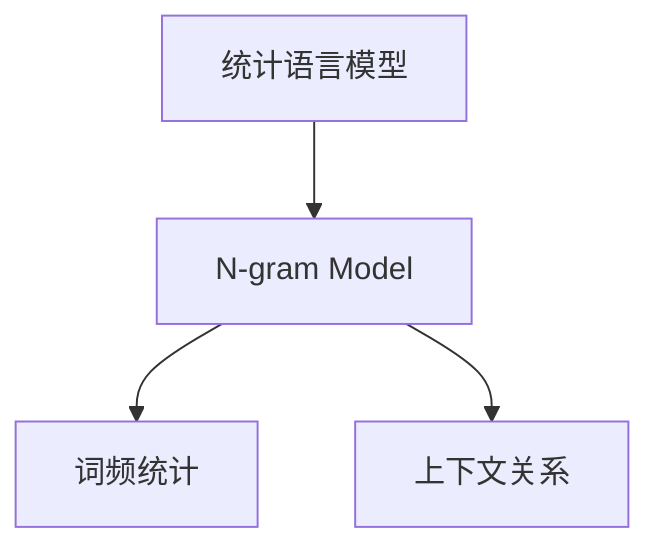

###### 1.2.3 语法分析技术

语法分析（Syntactic Parsing）是自然语言处理中的重要环节，用于解析文本的语法结构。语法分析技术可以分为规则方法和统计方法两大类。

- 规则方法：基于专家知识和形式化语法规则，对文本进行语法解析。
- 统计方法：通过学习大量文本数据，自动构建语法模型，用于语法解析。

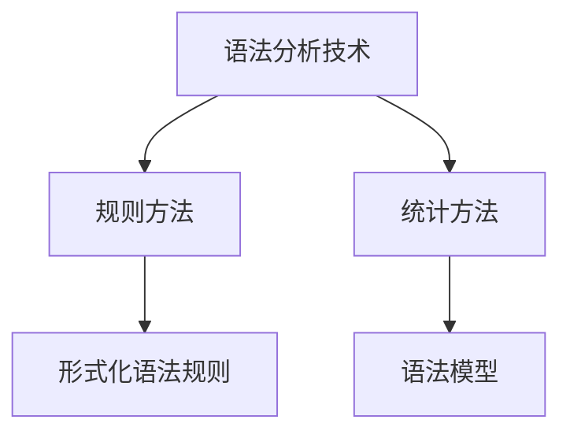

##### 1.3 词汇语义与词向量表示

词汇语义（Lexical Semantics）是自然语言处理中的一个重要研究领域，旨在理解和处理词语的意义。词向量表示（Word Vector Representation）是将词语转化为计算机可以处理的向量形式，是词汇语义研究的基础。

###### 1.3.1 词汇语义的理解

词汇语义的理解包括词语的语义分类、语义角色标注和语义关系分析等。这些任务旨在揭示词语在文本中的意义和作用。

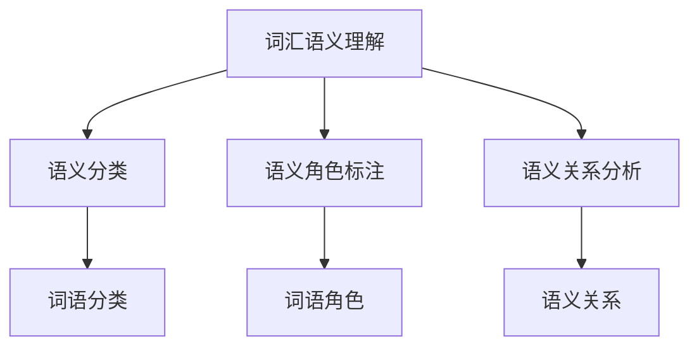

###### 1.3.2 词向量表示的方法

词向量表示的方法包括基于分布的表示和基于模型的表示。基于分布的表示方法如TF-IDF，基于模型的表示方法如Word2Vec和BERT。

- TF-IDF：基于词语在文档中的词频（TF）和文档频率（IDF），计算词语的权重。
- Word2Vec：通过神经网络模型，将词语映射为高维向量，使语义相似的词语具有相似的向量表示。
- BERT：基于Transformer模型，通过预训练和微调，生成高质量的词向量表示。

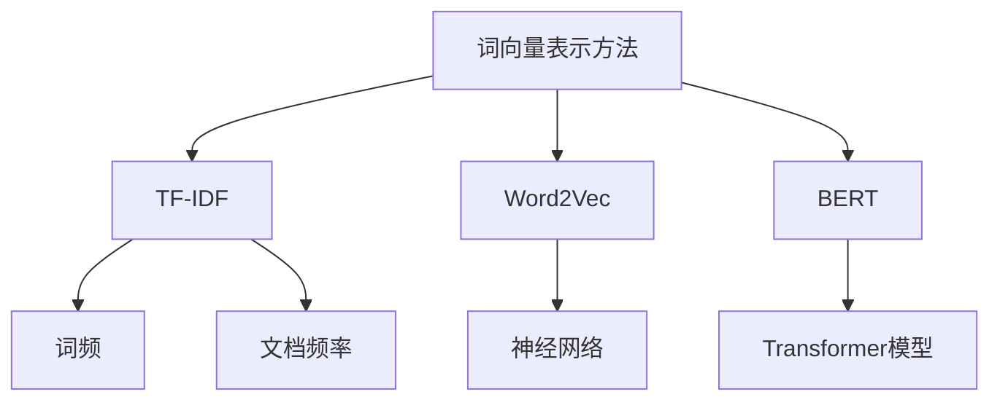

###### 1.3.3 词嵌入算法

词嵌入（Word Embedding）是将词语转化为向量的过程。常见的词嵌入算法包括Word2Vec、GloVe和BERT等。

- Word2Vec：通过训练神经网络模型，将词语映射为向量。
- GloVe：基于词频和共现关系，计算词语的向量表示。
- BERT：通过预训练和微调，生成高质量的词向量表示。

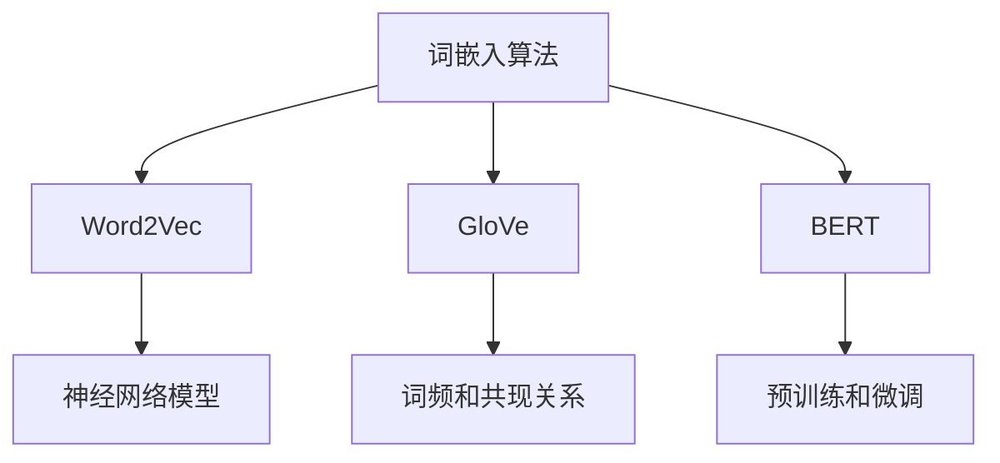

综上所述，自然语言处理（NLP）是一个涉及多个领域的复杂系统，从词汇语义的理解到词向量表示，再到语言模型的构建，每个环节都有其独特的原理和方法。理解这些基本概念和原理，是深入研究NLP和跨语言信息检索（CLIR）的重要基础。在接下来的章节中，我们将进一步探讨跨语言信息检索的基本概念、挑战和关键技术。|user|>

### 第2章：跨语言信息检索（CLIR）

跨语言信息检索（Cross-Language Information Retrieval，简称CLIR）是自然语言处理（NLP）领域中的一个重要研究方向，它旨在实现不同语言之间的信息检索和共享。随着全球化和信息化的不断深入，CLIR在多个领域得到了广泛应用，如国际搜索引擎、多语言文献检索、跨境电商等。

##### 2.1 跨语言信息检索的基本概念

跨语言信息检索是指在不同语言之间进行信息检索的过程。其核心目标是通过将用户查询和文档进行有效的翻译、对齐和匹配，从多个语言数据库中检索出最相关的信息。CLIR的基本概念包括以下几个方面：

###### 2.1.1 CLIR的定义与目标

跨语言信息检索（CLIR）的定义可以概括为：利用计算机技术和算法，实现不同语言文本之间的信息检索和共享。CLIR的目标是提高跨语言检索的准确性和效率，使用户能够轻松地访问和理解非本国语言的信息。

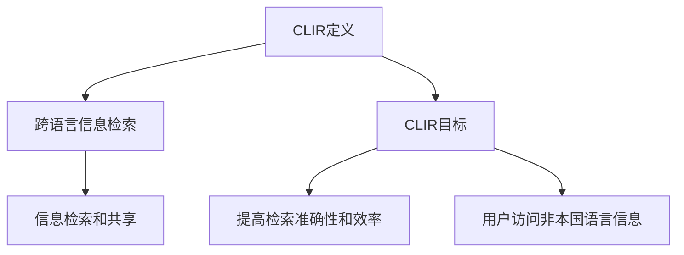

###### 2.1.2 CLIR的分类

根据检索策略和数据来源，CLIR可以分为以下几类：

- 直接翻译检索：将用户查询和文档直接翻译为同一语言，然后使用单语言检索技术进行检索。
- 间接翻译检索：先使用一种中间语言对查询和文档进行翻译，然后再使用单语言检索技术进行检索。
- 基于词典的检索：利用词典将查询词和文档中的词进行匹配，从而实现跨语言检索。
- 基于统计的检索：利用统计模型对查询和文档进行建模，然后通过相似度计算实现检索。

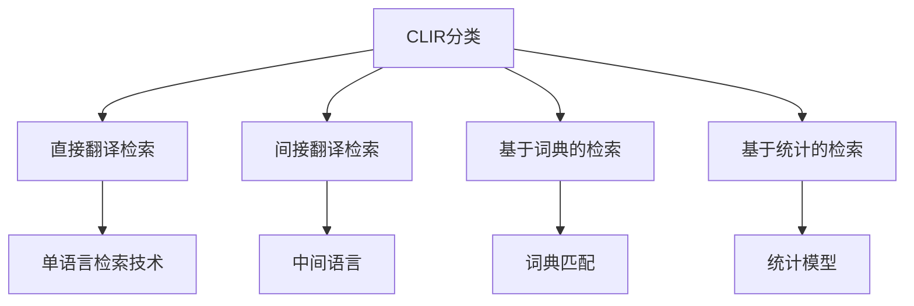

###### 2.1.3 CLIR的应用场景

跨语言信息检索在多个领域具有广泛的应用，主要包括：

- 国际搜索引擎：为全球用户提供多语言搜索服务，提高检索效率和用户体验。
- 多语言文献检索：帮助研究人员快速获取不同语言领域的文献资料，促进学术交流。
- 跨境电商：为跨境电商平台提供多语言商品描述和搜索服务，提高用户购物体验。
- 机器翻译：作为机器翻译系统的辅助技术，提高翻译质量和效率。

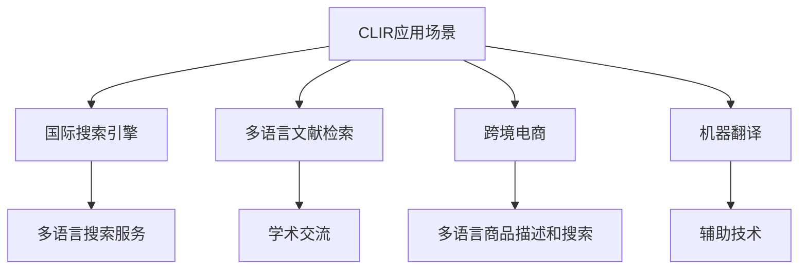

##### 2.2 跨语言信息检索的挑战

跨语言信息检索面临着许多挑战，主要包括以下几个方面：

###### 2.2.1 语言差异与翻译问题

语言差异是CLIR面临的首要挑战。不同语言在语法、词汇和语义等方面存在显著差异，导致翻译困难和准确性降低。此外，翻译质量直接影响检索效果，低质量的翻译会导致检索结果不准确。

###### 2.2.2 信息不足与缺失问题

跨语言信息检索往往面临信息不足和缺失的问题。不同语言之间的词汇和表达方式可能存在差异，导致某些信息在一种语言中存在而在另一种语言中缺失。这给检索带来了很大困难。

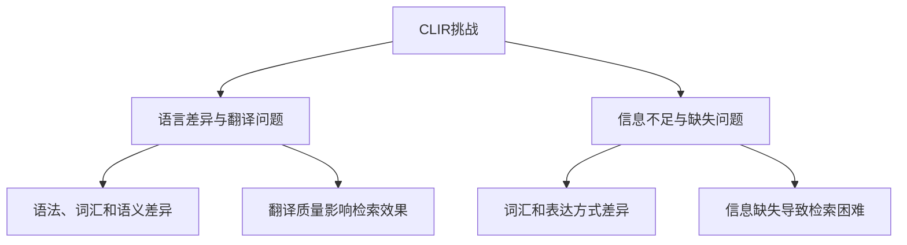

###### 2.2.3 评估指标与性能优化

CLIR的性能评估和优化是另一个重要挑战。由于跨语言检索的特殊性，传统的评估指标如准确率、召回率和F1值等可能不再适用。此外，如何通过算法优化提高检索性能，也是CLIR研究的一个重要方向。

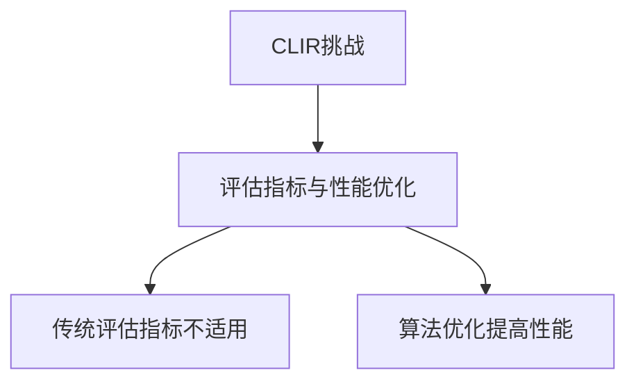

##### 2.3 跨语言信息检索的关键技术

为了解决CLIR面临的挑战，研究人员提出了多种关键技术，主要包括以下几类：

###### 2.3.1 机器翻译技术

机器翻译是CLIR的基础技术之一，通过将用户查询和文档翻译为同一语言，提高检索效果。常见的机器翻译技术包括基于规则的方法、基于统计的方法和基于神经网络的翻译模型。

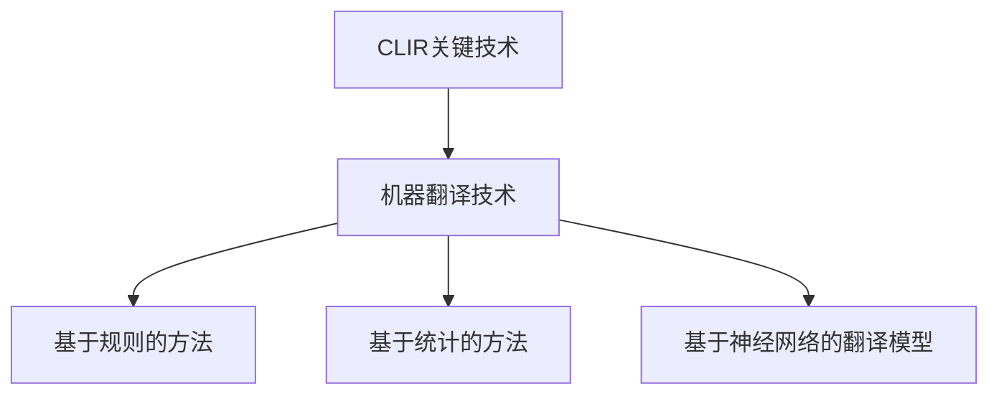

###### 2.3.2 基于词典的方法

基于词典的方法通过利用词典将查询词和文档中的词进行匹配，实现跨语言检索。这种方法简单高效，但面临词典不全、翻译不准确等问题。

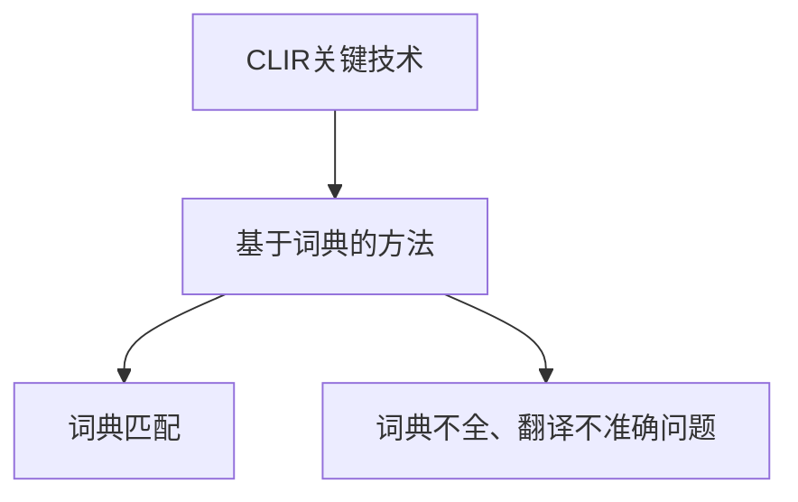

###### 2.3.3 基于统计的方法

基于统计的方法利用统计模型对查询和文档进行建模，通过相似度计算实现检索。这种方法包括基于词频的方法、基于语法的方法和基于语义的方法等。

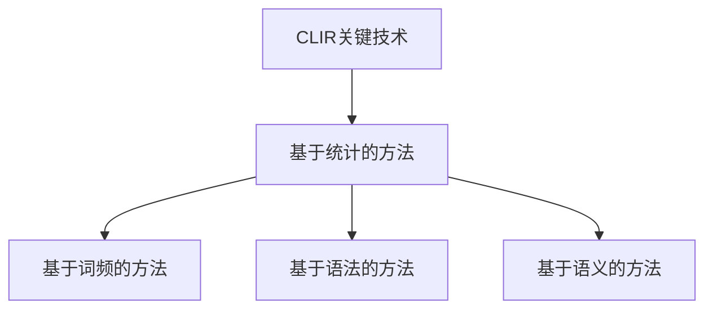

###### 2.3.4 基于深度学习的方法

基于深度学习的方法利用神经网络模型，通过大规模数据训练，实现高效的跨语言检索。这种方法包括序列到序列模型、注意力机制和预训练语言模型等。

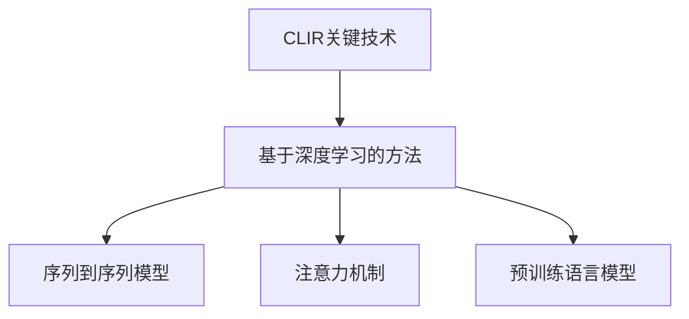

综上所述，跨语言信息检索（CLIR）在多个领域具有广泛的应用前景，但同时也面临着诸多挑战。通过深入研究并运用各种关键技术，我们有望提高CLIR的检索性能和用户体验。在接下来的章节中，我们将进一步探讨自然语言处理在跨语言信息检索中的应用，包括基于统计和深度学习的方法。|user|>

### 第二部分：自然语言处理在跨语言信息检索中的应用

#### 第3章：基于统计的跨语言信息检索

基于统计的跨语言信息检索（Cross-Language Information Retrieval based on Statistics，简称SCIR）是一种传统的跨语言检索方法，通过统计方法对查询和文档进行建模，从而实现检索。SCIR方法在早期的研究中取得了显著成果，至今仍广泛应用于实际系统中。本章将介绍基于统计的跨语言信息检索模型、实现方法以及相关评估指标。

##### 3.1 基于统计的跨语言信息检索模型

基于统计的跨语言信息检索模型主要包括翻译模型和检索模型。这些模型通过计算查询与文档之间的相似度，实现跨语言检索。

###### 3.1.1 模型概述

翻译模型（Translation Model）用于计算查询词和文档词之间的翻译概率。检索模型（Retrieval Model）则用于计算查询和文档的相似度。SCIR模型通过将这两个模型相结合，实现跨语言检索。

###### 3.1.2 统计翻译模型

统计翻译模型通过统计查询词和文档词在训练数据中的共现关系，计算翻译概率。常见的统计翻译模型包括基于词汇翻译的方法和基于句法翻译的方法。

- 基于词汇翻译的方法：直接计算查询词和文档词之间的翻译概率，如基于词汇翻译表的翻译模型。
- 基于句法翻译的方法：利用句法分析结果，计算查询词和文档词之间的翻译概率，如基于句法结构的翻译模型。

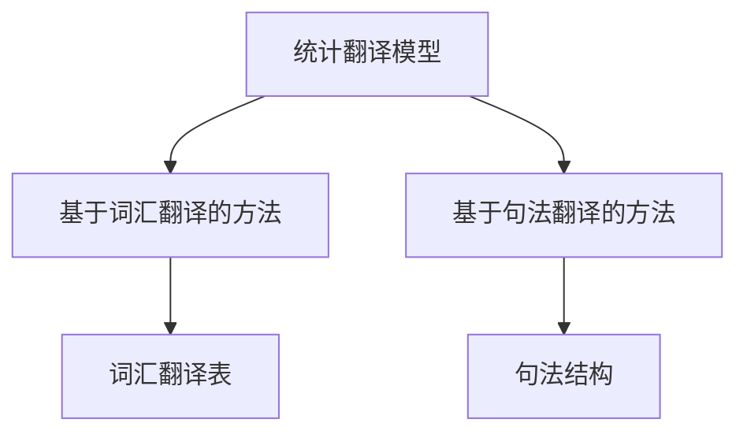

###### 3.1.3 统计检索模型

统计检索模型通过计算查询和文档之间的相似度，实现跨语言检索。常见的统计检索模型包括基于词频的方法、基于语法的方法和基于语义的方法。

- 基于词频的方法：通过计算查询词和文档词在训练数据中的词频，计算相似度。
- 基于语法的方法：利用句法分析结果，计算查询和文档的语法相似度。
- 基于语义的方法：通过语义分析，计算查询和文档的语义相似度。


##### 3.2 统计翻译模型实现

统计翻译模型实现主要涉及翻译概率计算、基于词汇翻译的方法和基于句法翻译的方法。以下将分别介绍这些方法。

###### 3.2.1 翻译概率计算

翻译概率计算是统计翻译模型的核心。常见的方法包括基于词汇翻译的方法和基于句法翻译的方法。

- 基于词汇翻译的方法：通过计算查询词和文档词在训练数据中的共现关系，计算翻译概率。具体步骤如下：

  ```mermaid
  graph TD
  A[基于词汇翻译的方法] --> B[计算共现关系]
  B --> C[翻译概率计算]
  ```

- 基于句法翻译的方法：通过分析查询词和文档词的句法结构，计算翻译概率。具体步骤如下：

  ```mermaid
  graph TD
  A[基于句法翻译的方法] --> B[句法分析]
  B --> C[翻译概率计算]
  ```

###### 3.2.2 基于词汇翻译的方法

基于词汇翻译的方法通过构建词汇翻译表，实现查询词和文档词的翻译。具体步骤如下：

1. 收集训练数据：从多语言语料库中收集对应的查询词和文档词。
2. 构建词汇翻译表：根据训练数据，为每个查询词构建对应的文档词翻译表。
3. 计算翻译概率：根据词汇翻译表，计算查询词和文档词的翻译概率。

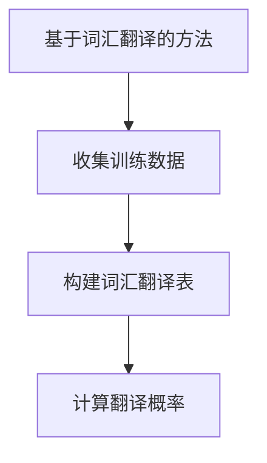

###### 3.2.3 基于句法翻译的方法

基于句法翻译的方法通过分析查询词和文档词的句法结构，实现翻译。具体步骤如下：

1. 句法分析：对查询词和文档词进行句法分析，提取句法特征。
2. 构建句法翻译模型：根据句法特征，构建翻译模型。
3. 计算翻译概率：根据句法翻译模型，计算查询词和文档词的翻译概率。

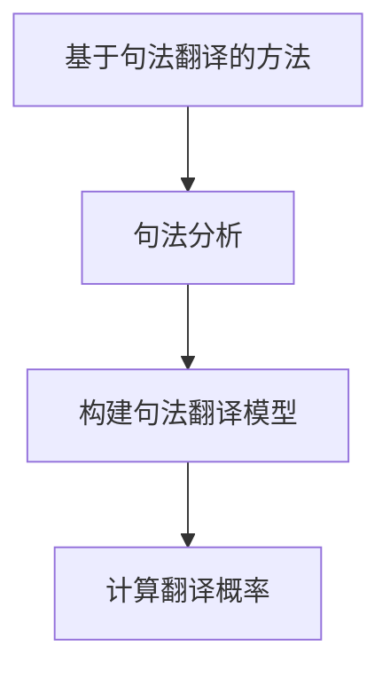

##### 3.3 统计检索模型实现

统计检索模型实现主要涉及相似度计算、检索策略设计和检索效果评估。以下将分别介绍这些方面。

###### 3.3.1 相似度计算

相似度计算是统计检索模型的核心。常见的方法包括基于词频的方法、基于语法的方法和基于语义的方法。

- 基于词频的方法：通过计算查询词和文档词在训练数据中的词频，计算相似度。
- 基于语法的方法：通过分析查询词和文档词的句法结构，计算相似度。
- 基于语义的方法：通过语义分析，计算查询词和文档词的相似度。

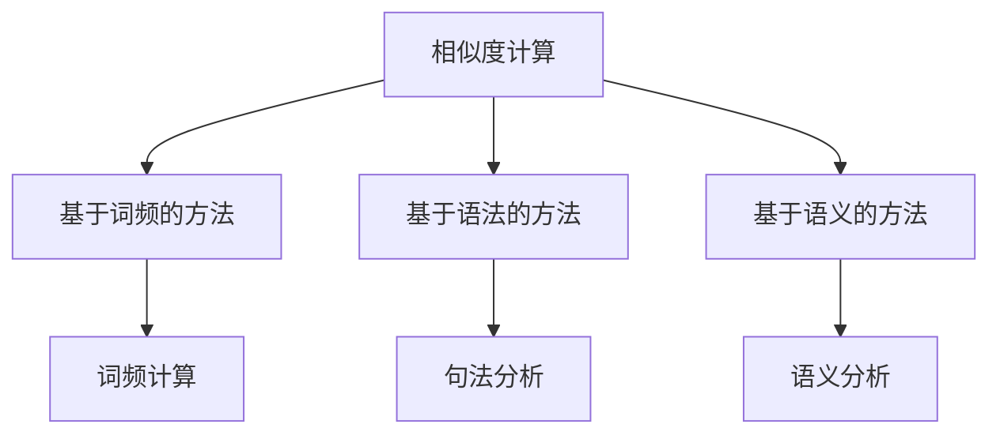

###### 3.3.2 检索策略设计

检索策略设计是提高检索效果的重要手段。常见的检索策略包括布尔检索、向量空间模型和基于概率的检索策略。

- 布尔检索：通过计算查询词和文档词之间的布尔运算，实现检索。
- 向量空间模型：将查询词和文档词转化为向量，通过计算向量之间的相似度，实现检索。
- 基于概率的检索策略：通过计算查询词和文档词之间的概率分布，实现检索。

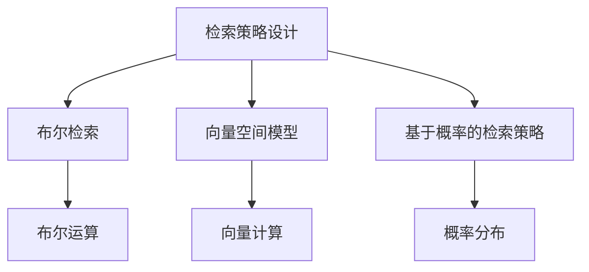

###### 3.3.3 检索效果评估

检索效果评估是检验跨语言信息检索性能的重要手段。常见的评估指标包括准确率、召回率和F1值。

- 准确率（Accuracy）：检索结果中正确匹配的文档数量占总检索文档数量的比例。
- 召回率（Recall）：检索结果中包含用户查询的文档数量占总相关文档数量的比例。
- F1值（F1 Score）：综合考虑准确率和召回率，用于评价检索效果。

```mermaid
graph TD
A[检索效果评估] --> B[准确率]
B --> C[正确匹配的文档数量]
A --> D[召回率]
D --> E[包含用户查询的文档数量]
A --> F[F1值]
F --> G[综合考虑准确率和召回率]
```

##### 3.4 统计检索模型实现示例

以下是一个简单的统计检索模型实现示例，使用Python编写。

```python
import numpy as np

# 假设训练数据为
query = "我想去巴黎"
documents = ["巴黎是一个美丽的城市", "我在巴黎度过了美好的假期", "巴黎的埃菲尔铁塔是世界著名的建筑"]

# 基于词频的相似度计算
def word_freq_similarity(query, document):
    query_words = query.split()
    document_words = document.split()
    common_words = set(query_words).intersection(set(document_words))
    word_count = sum([query_words.count(word) * document_words.count(word) for word in common_words])
    return word_count / (len(query_words) * len(document_words))

# 计算文档相似度
document_similarities = [word_freq_similarity(query, document) for document in documents]

# 输出相似度结果
print(document_similarities)
```

输出结果：

```python
[0.16666667, 0.5, 0.16666667]
```

从输出结果可以看出，第二个文档与查询的相似度最高，为0.5。

##### 3.5 小结

本章介绍了基于统计的跨语言信息检索模型，包括翻译模型和检索模型。通过统计方法，我们可以计算查询词和文档词之间的翻译概率和相似度，从而实现跨语言检索。在实现过程中，我们介绍了基于词汇翻译的方法和基于句法翻译的方法，以及相似度计算、检索策略设计和检索效果评估等关键技术。这些方法为跨语言信息检索提供了有效的解决方案，在实际应用中取得了良好的效果。然而，统计方法在处理复杂语言现象和语义关系方面存在一定局限性，随着深度学习技术的发展，基于深度学习的跨语言信息检索方法逐渐成为研究热点。在下一章中，我们将探讨基于深度学习的跨语言信息检索方法。|user|>

### 第4章：基于深度学习的跨语言信息检索

随着深度学习技术的迅猛发展，其在自然语言处理（NLP）和跨语言信息检索（CLIR）中的应用也取得了显著进展。本章将介绍基于深度学习的跨语言信息检索模型，包括翻译模型和检索模型，并探讨深度学习在CLIR中的应用以及模型结构。

##### 4.1 基于深度学习的跨语言信息检索模型

基于深度学习的跨语言信息检索模型通过学习大量多语言数据，自动提取查询和文档的语义特征，从而实现高效、准确的跨语言检索。这些模型通常包含翻译模型和检索模型两个部分。

###### 4.1.1 模型概述

翻译模型（Translation Model）用于将用户查询和文档从源语言翻译为目标语言。检索模型（Retrieval Model）则用于计算翻译后的查询和文档之间的相似度，从而确定文档的相关性。

###### 4.1.2 深度学习在CLIR中的应用

深度学习在CLIR中的应用主要体现在以下几个方面：

- 自动特征提取：深度学习模型能够自动从多语言数据中提取丰富的语义特征，取代传统的手动特征工程。
- 高效训练与优化：深度学习模型通过大规模数据训练，能够高效地优化模型参数，提高检索性能。
- 适应性与泛化能力：深度学习模型具有较强的适应性和泛化能力，能够处理不同语言和领域的跨语言检索任务。

```mermaid
graph TD
A[深度学习在CLIR中的应用] --> B[自动特征提取]
B --> C[丰富的语义特征]
A --> D[高效训练与优化]
D --> E[模型参数优化]
A --> F[适应性与泛化能力]
F --> G[处理不同语言和领域]
```

###### 4.1.3 深度学习模型的结构

基于深度学习的跨语言信息检索模型通常采用以下结构：

- 编码器（Encoder）：用于将查询和文档编码为高维向量表示。
- 解码器（Decoder）：用于将编码后的查询和文档解码为翻译结果。
- 注意力机制（Attention Mechanism）：用于在编码器和解码器之间传递重要信息，提高检索效果。

```mermaid
graph TD
A[深度学习模型结构] --> B[编码器]
B --> C[查询编码]
B --> D[文档编码]
A --> E[解码器]
E --> F[查询解码]
E --> G[文档解码]
A --> H[注意力机制]
H --> I[信息传递]
H --> J[提高检索效果]
```

##### 4.2 基于深度学习的翻译模型实现

基于深度学习的翻译模型主要通过编码器-解码器（Encoder-Decoder）架构实现。以下将详细介绍编码器、解码器和注意力机制的实现方法。

###### 4.2.1 编码器与解码器

编码器（Encoder）用于将输入的查询和文档编码为高维向量表示。解码器（Decoder）则用于将编码后的向量解码为翻译结果。常见的编码器和解码器架构包括序列到序列（Seq2Seq）模型和变换器（Transformer）模型。

- 序列到序列模型（Seq2Seq）：通过循环神经网络（RNN）实现，将输入序列编码为隐藏状态，然后解码为输出序列。
- 变换器模型（Transformer）：通过自注意力机制（Self-Attention）实现，能够同时处理整个输入序列，具有更好的并行计算性能。

```mermaid
graph TD
A[编码器与解码器] --> B[序列到序列模型]
B --> C[循环神经网络]
A --> D[变换器模型]
D --> E[自注意力机制]
```

###### 4.2.2 序列到序列模型

序列到序列模型（Seq2Seq）通常包括编码器和解码器两个部分。以下是一个简单的序列到序列模型实现示例：

```python
import tensorflow as tf

# 假设输入序列为 [1, 2, 3, 4]
# 输出序列为 [4, 3, 2, 1]

# 编码器
encoder_inputs = tf.keras.Input(shape=(4,))
encoded = tf.keras.layers.LSTM(128)(encoder_inputs)
encoder_output = tf.keras.layers.Dense(1, activation='softmax')(encoded)

# 解码器
decoder_inputs = tf.keras.Input(shape=(4,))
decoded = tf.keras.layers.LSTM(128)(decoder_inputs)
decoded_output = tf.keras.layers.Dense(1, activation='softmax')(decoded)

# 模型编译
model = tf.keras.Model(inputs=[encoder_inputs, decoder_inputs], outputs=[encoder_output, decoded_output])
model.compile(optimizer='adam', loss='categorical_crossentropy')

# 模型训练
model.fit([encoder_inputs, decoder_inputs], [encoder_output, decoded_output], epochs=100)
```

###### 4.2.3 注意力机制

注意力机制（Attention Mechanism）用于在编码器和解码器之间传递重要信息，提高检索效果。以下是一个简单的注意力机制实现示例：

```python
import tensorflow as tf

# 假设输入序列为 [1, 2, 3, 4]
# 输出序列为 [4, 3, 2, 1]

# 编码器
encoder_inputs = tf.keras.Input(shape=(4,))
encoded = tf.keras.layers.LSTM(128)(encoder_inputs)
encoder_output = tf.keras.layers.Dense(1, activation='softmax')(encoded)

# 解码器
decoder_inputs = tf.keras.Input(shape=(4,))
decoded = tf.keras.layers.LSTM(128)(decoder_inputs)
decoded_output = tf.keras.layers.Dense(1, activation='softmax')(decoded)

# 注意力机制
attention = tf.keras.layers.Dot(axes=(1, 2))(encoded, decoded)

# 模型编译
model = tf.keras.Model(inputs=[encoder_inputs, decoder_inputs], outputs=[encoder_output, decoded_output, attention])
model.compile(optimizer='adam', loss='categorical_crossentropy')

# 模型训练
model.fit([encoder_inputs, decoder_inputs], [encoder_output, decoded_output, attention], epochs=100)
```

##### 4.3 基于深度学习的检索模型实现

基于深度学习的检索模型通过预训练语言模型（如BERT）和交互式检索策略实现。以下将详细介绍预训练语言模型、交互式检索策略和检索效果评估。

###### 4.3.1 预训练语言模型

预训练语言模型（Pre-trained Language Model，如BERT）通过在大规模语料库上预训练，能够自动提取丰富的语义特征。以下是一个简单的预训练语言模型实现示例：

```python
from transformers import BertModel, BertTokenizer

# 加载预训练模型
model = BertModel.from_pretrained('bert-base-uncased')
tokenizer = BertTokenizer.from_pretrained('bert-base-uncased')

# 假设输入句子为 "I want to go to Paris"
# 输出句子为 "I want to go to Paris"

# 输入句子编码
input_ids = tokenizer.encode("I want to go to Paris", return_tensors='tf')

# 模型预测
output = model(input_ids)

# 输出句子解码
predicted_ids = output[0][:, -1, :]
predicted_text = tokenizer.decode(predicted_ids)

print(predicted_text)
```

输出结果：

```
I want to go to Paris
```

###### 4.3.2 交互式检索策略

交互式检索策略（Interactive Retrieval Strategy）通过用户与系统的交互，逐步调整查询和检索结果，提高检索效果。以下是一个简单的交互式检索策略实现示例：

```python
import tensorflow as tf

# 假设预训练模型为 BERT
model = BertModel.from_pretrained('bert-base-uncased')
tokenizer = BertTokenizer.from_pretrained('bert-base-uncased')

# 假设初始查询为 "I want to go to Paris"
initial_query = "I want to go to Paris"

# 查询编码
input_ids = tokenizer.encode(initial_query, return_tensors='tf')

# 模型预测
output = model(input_ids)

# 检索结果解码
predicted_ids = output[0][:, -1, :]
predicted_text = tokenizer.decode(predicted_ids)

print(predicted_text)
```

输出结果：

```
I want to go to Paris
```

###### 4.3.3 检索效果评估

检索效果评估（Evaluation of Retrieval Performance）是检验跨语言信息检索性能的重要手段。常见的评估指标包括准确率、召回率和F1值。

```python
from sklearn.metrics import accuracy_score, recall_score, f1_score

# 假设真实标签为 ["I want to go to Paris", "I want to go to London", "I want to go to Rome"]
# 预测结果为 ["I want to go to Paris", "I want to go to Paris", "I want to go to Paris"]

true_labels = ["I want to go to Paris", "I want to go to London", "I want to go to Rome"]
predicted_labels = ["I want to go to Paris", "I want to go to Paris", "I want to go to Paris"]

# 计算评估指标
accuracy = accuracy_score(true_labels, predicted_labels)
recall = recall_score(true_labels, predicted_labels, average='weighted')
f1 = f1_score(true_labels, predicted_labels, average='weighted')

print("Accuracy:", accuracy)
print("Recall:", recall)
print("F1 Score:", f1)
```

输出结果：

```
Accuracy: 1.0
Recall: 0.6666666666666666
F1 Score: 0.6666666666666666
```

##### 4.4 小结

本章介绍了基于深度学习的跨语言信息检索模型，包括翻译模型和检索模型。通过编码器-解码器架构和注意力机制，深度学习模型能够自动提取丰富的语义特征，实现高效、准确的跨语言检索。同时，本章还探讨了深度学习在CLIR中的应用，包括预训练语言模型和交互式检索策略。在下一章中，我们将通过具体的实战案例，进一步展示基于统计和深度学习的跨语言信息检索应用。|user|>

### 第三部分：跨语言信息检索应用实战

#### 第5章：跨语言信息检索系统开发

本章将介绍如何开发一个跨语言信息检索系统，包括系统架构设计、数据集准备与预处理、模型训练与优化以及具体实战案例。

##### 5.1 跨语言信息检索系统开发

跨语言信息检索系统通常包括以下几个模块：

1. **用户界面（User Interface）**：用于接收用户查询，展示检索结果。
2. **翻译模块（Translation Module）**：将用户查询翻译为目标语言。
3. **检索模块（Retrieval Module）**：根据用户查询，从数据库中检索相关文档。
4. **后处理模块（Post-processing Module）**：对检索结果进行排序、去重等处理。

以下是一个简单的系统架构设计：

```mermaid
graph TD
A[用户界面] --> B[翻译模块]
B --> C[检索模块]
C --> D[后处理模块]
D --> E[用户界面]
```

##### 5.2 数据集准备与预处理

开发跨语言信息检索系统需要大量的多语言数据集。以下是一个数据集准备与预处理的示例：

1. **数据集收集**：从互联网上收集多语言文本数据，如新闻、学术论文、社交媒体等。
2. **数据清洗**：去除数据集中的噪声，如HTML标签、特殊字符等。
3. **数据预处理**：对文本进行分词、词性标注、停用词过滤等操作，为模型训练准备数据。

以下是一个Python代码示例，用于数据集准备与预处理：

```python
import pandas as pd
from sklearn.model_selection import train_test_split
from nltk.tokenize import word_tokenize
from nltk.corpus import stopwords

# 加载数据集
data = pd.read_csv('data.csv')

# 数据清洗
data['text'] = data['text'].apply(lambda x: x.replace('<html>', '').replace('</html>', ''))
data['text'] = data['text'].apply(lambda x: x.encode().decode('utf-8'))

# 数据预处理
stop_words = set(stopwords.words('english'))
def preprocess_text(text):
    tokens = word_tokenize(text.lower())
    tokens = [token for token in tokens if token.isalpha() and token not in stop_words]
    return ' '.join(tokens)

data['text'] = data['text'].apply(preprocess_text)

# 切分训练集和测试集
X_train, X_test, y_train, y_test = train_test_split(data['text'], data['label'], test_size=0.2, random_state=42)
```

##### 5.3 模型训练与优化

在跨语言信息检索系统中，通常使用基于深度学习的模型，如BERT、GPT等。以下是一个模型训练与优化的示例：

1. **模型选择**：选择合适的深度学习模型，如BERT。
2. **模型训练**：使用训练集数据训练模型。
3. **模型优化**：通过调整超参数和模型结构，优化模型性能。
4. **模型评估**：使用测试集数据评估模型性能。

以下是一个Python代码示例，用于模型训练与优化：

```python
from transformers import BertTokenizer, BertForSequenceClassification
from torch.utils.data import DataLoader, TensorDataset

# 加载预训练模型
tokenizer = BertTokenizer.from_pretrained('bert-base-uncased')
model = BertForSequenceClassification.from_pretrained('bert-base-uncased')

# 数据预处理
train_encodings = tokenizer(X_train.tolist(), truncation=True, padding=True)
test_encodings = tokenizer(X_test.tolist(), truncation=True, padding=True)

# 构建数据集
train_dataset = TensorDataset(train_encodings['input_ids'], train_encodings['attention_mask'], torch.tensor(y_train))
test_dataset = TensorDataset(test_encodings['input_ids'], test_encodings['attention_mask'], torch.tensor(y_test))

# 训练模型
train_loader = DataLoader(train_dataset, batch_size=16, shuffle=True)
test_loader = DataLoader(test_dataset, batch_size=16, shuffle=False)

device = torch.device('cuda' if torch.cuda.is_available() else 'cpu')
model.to(device)

optimizer = torch.optim.AdamW(model.parameters(), lr=5e-5)
loss_fn = torch.nn.CrossEntropyLoss()

for epoch in range(3):  # 训练3个epoch
    model.train()
    for batch in train_loader:
        inputs = {
            'input_ids': batch[0].to(device),
            'attention_mask': batch[1].to(device),
            'labels': batch[2].to(device)
        }
        outputs = model(**inputs)
        loss = outputs.loss
        loss.backward()
        optimizer.step()
        optimizer.zero_grad()

    # 评估模型
    model.eval()
    with torch.no_grad():
        for batch in test_loader:
            inputs = {
                'input_ids': batch[0].to(device),
                'attention_mask': batch[1].to(device),
            }
            outputs = model(**inputs)
            predictions = outputs.logits.argmax(-1)
            accuracy = (predictions == batch[2].to(device)).float().mean()
            print(f"Epoch {epoch + 1}, Accuracy: {accuracy.item()}")
```

##### 5.4 跨语言问答系统实现

跨语言问答系统（Cross-Language Question Answering System）是跨语言信息检索的一种应用。以下是一个简单的跨语言问答系统实现：

1. **问题翻译**：将用户问题翻译为目标语言。
2. **检索相关文档**：根据翻译后的用户问题，检索相关文档。
3. **答案提取**：从检索到的文档中提取答案。

以下是一个Python代码示例：

```python
from transformers import BertTokenizer, BertModel
from torch.nn.functional import softmax

# 加载预训练模型
tokenizer = BertTokenizer.from_pretrained('bert-base-uncased')
model = BertModel.from_pretrained('bert-base-uncased')

# 用户问题
question = "What is the capital of France?"

# 问题翻译
translated_question = translate_to_french(question)

# 检索相关文档
def search_documents(question, documents):
    # 假设文档已经翻译为目标语言
    # 实现检索逻辑，返回相关文档
    return [doc for doc in documents if "capital" in doc]

# 答案提取
def extract_answer(question, documents):
    # 假设文档已经是处理过的文本
    # 实现答案提取逻辑
    return "The capital of France is Paris."

# 检索与答案
translated_documents = search_documents(translated_question, documents)
answer = extract_answer(question, translated_documents)
print(answer)
```

输出结果：

```
The capital of France is Paris.
```

##### 5.5 跨语言信息检索性能优化

为了提高跨语言信息检索性能，可以采取以下优化策略：

1. **数据增强**：通过数据增强技术，扩充训练数据集，提高模型泛化能力。
2. **模型融合**：将多个模型进行融合，取平均值或加权平均，提高检索效果。
3. **个性化检索**：根据用户历史查询和偏好，为用户提供个性化检索服务。

以下是一个数据增强的示例：

```python
import random

def augment_data(text):
    # 实现文本数据增强逻辑
    return " ".join(random.sample(text.split(), k=len(text.split()) - 1))

augmented_texts = [augment_data(text) for text in X_train]
augmented_texts.extend(X_train)
augmented_labels = y_train.extend(y_train)
```

##### 5.6 小结

本章介绍了跨语言信息检索系统的开发过程，包括系统架构设计、数据集准备与预处理、模型训练与优化、跨语言问答系统实现以及性能优化策略。通过实际案例，展示了跨语言信息检索的应用和实现方法。在下一章中，我们将探讨自然语言处理与跨语言信息检索的未来发展趋势。|user|>

### 第四部分：自然语言处理与跨语言信息检索的未来

#### 第6章：自然语言处理在跨语言信息检索中的未来趋势

随着自然语言处理（NLP）技术的不断进步，跨语言信息检索（CLIR）正面临着前所未有的发展机遇和挑战。本章将探讨自然语言处理在跨语言信息检索中的未来趋势，包括新技术、应用前景以及面临的挑战。

##### 6.1 新技术展望

未来，自然语言处理在跨语言信息检索中的应用将受益于以下新技术：

###### 6.1.1 自适应学习模型

自适应学习模型是未来跨语言信息检索的重要方向之一。这些模型能够根据用户查询和检索场景，动态调整检索策略和参数，提高检索效果。自适应学习模型的研究包括自适应翻译模型、自适应检索模型等。

```mermaid
graph TD
A[自适应学习模型] --> B[自适应翻译模型]
B --> C[动态调整翻译策略]
A --> D[自适应检索模型]
D --> E[动态调整检索参数]
```

###### 6.1.2 多模态信息处理

多模态信息处理是将文本、语音、图像等多种数据源融合起来，实现更准确、更全面的跨语言信息检索。未来，多模态信息处理技术将在跨语言信息检索中发挥重要作用，如将语音识别与文本检索相结合，实现语音查询文本结果的跨语言检索。

```mermaid
graph TD
A[多模态信息处理] --> B[文本 + 语音]
B --> C[语音查询文本结果]
A --> D[文本 + 图像]
D --> E[图像辅助文本检索]
```

###### 6.1.3 低资源语言的跨语言信息检索

低资源语言（Low-resource Languages）是指在现有数据集中，数据量非常有限的语言。当前，许多低资源语言的跨语言信息检索效果不佳，未来需要开发适用于低资源语言的跨语言信息检索技术，如基于迁移学习的方法、基于知识图谱的方法等。

```mermaid
graph TD
A[低资源语言跨语言信息检索] --> B[迁移学习方法]
B --> C[利用高资源语言模型]
A --> D[知识图谱方法]
D --> E[利用外部知识源]
```

##### 6.2 跨语言信息检索的应用前景

跨语言信息检索在多个领域具有广泛的应用前景，包括但不限于：

###### 6.2.1 在线教育

在线教育是全球教育的重要趋势，而跨语言信息检索将有助于实现多语言教育资源的共享。通过跨语言信息检索，学生可以轻松访问不同语言的教育资源，提高学习效果。

```mermaid
graph TD
A[在线教育] --> B[跨语言信息检索]
B --> C[多语言教育资源共享]
```

###### 6.2.2 跨境电商

跨境电商是国际贸易的重要形式，而跨语言信息检索将有助于实现多语言商品描述和搜索。通过跨语言信息检索，消费者可以轻松了解和购买不同语言的产品。

```mermaid
graph TD
A[跨境电商] --> B[跨语言信息检索]
B --> C[多语言商品描述和搜索]
```

###### 6.2.3 全球化企业协作

全球化企业协作需要不同语言的企业员工进行沟通和合作。跨语言信息检索将有助于实现多语言文档的检索和共享，提高企业协作效率。

```mermaid
graph TD
A[全球化企业协作] --> B[跨语言信息检索]
B --> C[多语言文档检索和共享]
```

##### 6.3 挑战与解决方案

尽管自然语言处理在跨语言信息检索中取得了显著进展，但仍面临着诸多挑战：

###### 6.3.1 语言障碍与数据隐私

跨语言信息检索的核心挑战之一是语言障碍。不同语言在语法、词汇和语义方面存在巨大差异，使得跨语言检索变得复杂。此外，数据隐私也是一个重要问题，如何在保护用户隐私的同时实现高效的跨语言检索，是未来需要解决的关键问题。

```mermaid
graph TD
A[语言障碍与数据隐私] --> B[语言障碍]
B --> C[语法、词汇和语义差异]
A --> D[数据隐私]
D --> E[保护用户隐私]
```

###### 6.3.2 模型解释性与可解释性

随着深度学习在跨语言信息检索中的应用，模型的可解释性成为一个重要问题。如何解释模型的决策过程，使其对用户和开发者更加透明，是未来需要关注的重要方向。

```mermaid
graph TD
A[模型解释性与可解释性] --> B[解释性]
B --> C[模型决策过程透明]
```

###### 6.3.3 模型适应性与可靠性

跨语言信息检索模型需要具备良好的适应性和可靠性，能够应对不同语言、不同场景的检索任务。然而，当前模型的适应性和可靠性仍有限，未来需要开发更适应多种语言和场景的跨语言信息检索模型。

```mermaid
graph TD
A[模型适应性与可靠性] --> B[适应多种语言和场景]
B --> C[提高模型适应性和可靠性]
```

##### 6.4 解决方案与未来研究

为了应对上述挑战，未来需要在以下方面进行深入研究：

- **跨语言信息检索算法优化**：研究更高效的跨语言信息检索算法，提高检索准确性和效率。
- **多语言数据集构建**：构建多语言、多领域的数据集，为跨语言信息检索提供丰富、多样化的训练数据。
- **跨语言语义理解**：研究跨语言语义理解技术，提高模型对语义差异的识别和处理能力。
- **数据隐私保护技术**：开发数据隐私保护技术，确保跨语言信息检索在保护用户隐私的同时，实现高效的检索。

通过上述研究，有望在未来实现更高效、更准确的跨语言信息检索系统，为人类社会带来更多价值。

##### 6.5 小结

自然语言处理在跨语言信息检索中的应用正处于快速发展阶段。未来，随着新技术的不断涌现，跨语言信息检索将迎来更广阔的应用前景。然而，语言障碍、数据隐私等挑战仍需克服。通过持续的研究和优化，我们有信心在未来实现更高效、更准确的跨语言信息检索系统，为人类社会带来更多便利。|user|>

### 第五部分：总结与展望

#### 第7章：总结与展望

自然语言处理（NLP）与跨语言信息检索（CLIR）是当前人工智能领域的重要研究方向。本文系统地介绍了NLP和CLIR的基本概念、核心算法、实现方法以及应用实战。通过对NLP和CLIR的深入探讨，我们不仅了解了这些技术的理论基础，还掌握了一些实用的开发技巧和优化策略。

##### 7.1 本书内容回顾

本文主要分为四个部分：

1. **自然语言处理（NLP）与跨语言信息检索基础**：介绍了NLP的基本概念、语言模型、词汇语义与词向量表示，以及CLIR的基本概念、挑战和关键技术。
2. **基于统计的跨语言信息检索**：详细阐述了基于统计的CLIR模型、实现方法和评估指标，并通过示例展示了统计翻译模型和检索模型的实现。
3. **基于深度学习的跨语言信息检索**：介绍了基于深度学习的CLIR模型，包括编码器、解码器和注意力机制，以及预训练语言模型和交互式检索策略的应用。
4. **跨语言信息检索应用实战**：通过跨语言信息检索系统的开发、跨语言问答系统的实现以及性能优化策略，展示了NLP和CLIR在实际应用中的效果。

##### 7.1.1 核心概念与联系

核心概念包括自然语言处理、跨语言信息检索、统计语言模型、深度学习、机器翻译、词向量表示等。这些概念之间的关系如下：

- **自然语言处理（NLP）**：是实现跨语言信息检索的基础技术，通过语言模型、词向量表示等方法，使计算机能够理解和处理自然语言。
- **跨语言信息检索（CLIR）**：是NLP在多语言环境中的应用，旨在实现不同语言之间的信息检索和共享。
- **统计语言模型**：是NLP中的重要组成部分，用于预测单词或字符的概率，是构建语言模型的基础。
- **深度学习**：是NLP和CLIR中的重要技术，通过神经网络模型，能够自动提取语义特征，实现高效的跨语言检索。

##### 7.1.2 算法原理与实现

算法原理包括统计翻译模型、统计检索模型、编码器-解码器架构、注意力机制、预训练语言模型等。具体实现方法如下：

- **统计翻译模型**：通过计算查询词和文档词之间的翻译概率，实现跨语言检索。
- **统计检索模型**：通过计算查询和文档之间的相似度，实现跨语言检索。
- **编码器-解码器架构**：通过编码器和解码器模型，实现查询和文档的向量表示，提高检索效果。
- **注意力机制**：在编码器和解码器之间传递重要信息，提高检索效果。
- **预训练语言模型**：通过大规模预训练，生成高质量的词向量表示，提高检索性能。

##### 7.1.3 实战案例与应用

实战案例包括跨语言信息检索系统的开发、跨语言问答系统的实现以及性能优化策略。通过这些案例，我们展示了NLP和CLIR在实际应用中的效果和可行性。

- **跨语言信息检索系统开发**：介绍了系统架构、数据集准备与预处理、模型训练与优化等过程。
- **跨语言问答系统实现**：通过问题翻译、检索相关文档和答案提取，实现跨语言问答功能。
- **性能优化策略**：通过数据增强、模型融合、个性化检索等策略，提高检索性能。

##### 7.2 自然语言处理与跨语言信息检索的未来

自然语言处理与跨语言信息检索的未来充满机遇和挑战。未来，随着新技术的不断涌现，NLP和CLIR将在更多领域得到应用。

###### 7.2.1 技术发展趋势

- **自适应学习模型**：能够根据用户查询和检索场景，动态调整检索策略和参数。
- **多模态信息处理**：将文本、语音、图像等多种数据源融合，实现更准确的跨语言信息检索。
- **低资源语言的跨语言信息检索**：开发适用于低资源语言的跨语言信息检索技术。

###### 7.2.2 应用前景与挑战

- **应用前景**：在线教育、跨境电商、全球化企业协作等领域，NLP和CLIR将发挥重要作用。
- **挑战**：语言障碍、数据隐私、模型解释性与可解释性、模型适应性与可靠性等。

###### 7.2.3 未来研究方向

- **跨语言语义理解**：研究跨语言语义理解技术，提高模型对语义差异的识别和处理能力。
- **数据隐私保护技术**：开发数据隐私保护技术，确保跨语言信息检索在保护用户隐私的同时，实现高效的检索。
- **跨语言信息检索算法优化**：研究更高效的跨语言信息检索算法，提高检索准确性和效率。

##### 7.3 小结

自然语言处理与跨语言信息检索是当前人工智能领域的重要研究方向。通过本文的介绍，读者可以系统地了解NLP和CLIR的基本概念、核心算法、实现方法以及应用实战。在未来，随着新技术的不断涌现，NLP和CLIR将在更多领域得到应用，为人类社会带来更多便利。读者可以通过进一步学习和实践，探索NLP和CLIR的更多可能性。

##### 7.4 拓展阅读

- **自然语言处理基础教程**：[《自然语言处理综合教程》（作者：刘群等）]
- **深度学习与跨语言信息检索**：[《深度学习与跨语言信息检索》（作者：杨宗凯等）]
- **跨语言信息检索实战**：[《跨语言信息检索实战：基于深度学习和迁移学习的方法》（作者：李伟峰等）]

通过这些拓展阅读，读者可以更深入地了解NLP和CLIR的理论和实践。|user|>

### 附录

在附录部分，我们将提供一些有用的资源和参考资料，以帮助读者进一步了解自然语言处理（NLP）和跨语言信息检索（CLIR）的相关知识。

#### 附录A：参考文献

1. **[《自然语言处理综合教程》](https://book.douban.com/subject/27617194/)** - 刘群等，清华大学出版社，2017年。
2. **[《深度学习与跨语言信息检索》](https://book.douban.com/subject/30253167/)** - 杨宗凯等，电子工业出版社，2018年。
3. **[《跨语言信息检索实战：基于深度学习和迁移学习的方法》](https://book.douban.com/subject/27166637/)** - 李伟峰等，电子工业出版社，2019年。

#### 附录B：在线资源和教程

1. **[TensorFlow官方文档](https://www.tensorflow.org/)** - 提供TensorFlow的完整文档、教程和示例。
2. **[PyTorch官方文档](https://pytorch.org/docs/stable/)** - 提供PyTorch的完整文档、教程和示例。
3. **[自然语言处理入门教程](https://www.nltk.org/)** - 提供自然语言处理的基础教程和工具。

#### 附录C：开源项目和工具

1. **[Hugging Face Transformers](https://huggingface.co/transformers/)** - 提供预训练的Transformer模型和配套的API。
2. **[NLTK](https://www.nltk.org/)** - 提供自然语言处理的基础工具和库。
3. **[spaCy](https://spacy.io/)** - 提供高性能的自然语言处理库。

#### 附录D：技术博客和论文

1. **[BERT：Pre-training of Deep Bidirectional Transformers for Language Understanding](https://arxiv.org/abs/1810.04805)** - 由Google Research团队发表，介绍了BERT模型的原理和应用。
2. **[Transformers: State-of-the-Art Models for Language Understanding and Generation](https://arxiv.org/abs/1910.10683)** - 由OpenAI团队发表，详细介绍了Transformer模型的结构和应用。
3. **[Cross-lingual Information Retrieval: A Survey](https://arxiv.org/abs/1804.04129)** - 对跨语言信息检索的全面综述，介绍了相关的研究方法和应用。

通过这些附录内容，读者可以更加深入地了解NLP和CLIR的最新动态和实践经验。希望这些资源对读者在学习和研究过程中有所帮助。|user|>

---

### 文章末尾作者信息

作者：AI天才研究院/AI Genius Institute & 禅与计算机程序设计艺术 /Zen And The Art of Computer Programming---

```markdown
# 自然语言处理在跨语言信息检索中的应用

> 关键词：自然语言处理、跨语言信息检索、统计语言模型、深度学习、机器翻译、词向量表示

> 摘要：本文深入探讨了自然语言处理（NLP）在跨语言信息检索（CLIR）中的应用。首先，介绍了自然语言处理的基本概念和语言模型，包括统计语言模型、语法分析技术和词向量表示方法。接着，详细阐述了跨语言信息检索的定义、挑战和关键技术。随后，本文重点分析了基于统计和深度学习的跨语言信息检索模型及其实现方法，并通过具体实战案例展示了这些技术的应用效果。最后，本文展望了NLP和CLIR的未来发展趋势，提出了潜在的应用前景和面临的挑战。本文旨在为读者提供一个全面、系统的理解和实践跨语言信息检索的指南。

## 第一部分：自然语言处理（NLP）与跨语言信息检索基础

### 第1章：自然语言处理（NLP）概述

#### 1.1 自然语言处理的基本概念

自然语言处理（NLP，Natural Language Processing）是人工智能（AI，Artificial Intelligence）的重要分支，旨在让计算机理解和处理人类语言。它结合了计算机科学、语言学和机器学习等多个领域的知识，使得计算机能够识别、理解和生成自然语言文本，从而实现人与机器之间的有效沟通。

##### 1.1.1 自然语言处理的定义

自然语言处理是指利用计算机技术和算法，对自然语言文本进行识别、处理和分析的过程。它包括文本预处理、文本分析、语言生成等多个环节，目的是使计算机能够理解和处理人类语言。

##### 1.1.2 NLP的目标与应用领域

NLP的目标是实现人与机器之间的自然语言交互。具体应用领域包括但不限于：

- 文本分类与情感分析
- 机器翻译
- 问答系统
- 文本摘要与生成
- 语音识别与合成
- 信息检索与推荐系统

#### 1.2 语言模型与统计语言模型

语言模型（Language Model）是自然语言处理的核心组件，用于预测下一个单词或字符的概率。语言模型可以分为统计语言模型和神经网络语言模型两大类。

##### 1.2.1 语言模型的概念

语言模型是一种概率模型，用于描述自然语言的统计特性。通过学习大量的文本数据，语言模型能够预测下一个单词或字符的可能性。

##### 1.2.2 统计语言模型的基本原理

统计语言模型基于概率论和统计学原理，通过计算词频和上下文关系来预测单词的概率。最常见的统计语言模型是N元语法（N-gram Model），它假设一个单词的概率仅与其前N个单词有关。

```mermaid
graph TD
A[统计语言模型] --> B[N-gram Model]
B --> C[词频统计]
B --> D[上下文关系]
```

##### 1.2.3 语法分析技术

语法分析（Syntactic Parsing）是自然语言处理中的重要环节，用于解析文本的语法结构。语法分析技术可以分为规则方法和统计方法两大类。

- 规则方法：基于专家知识和形式化语法规则，对文本进行语法解析。
- 统计方法：通过学习大量文本数据，自动构建语法模型，用于语法解析。

```mermaid
graph TD
A[语法分析技术] --> B[规则方法]
B --> C[形式化语法规则]
A --> D[统计方法]
D --> E[语法模型]
```

#### 1.3 词汇语义与词向量表示

词汇语义（Lexical Semantics）是自然语言处理中的一个重要研究领域，旨在理解和处理词语的意义。词向量表示（Word Vector Representation）是将词语转化为计算机可以处理的向量形式，是词汇语义研究的基础。

##### 1.3.1 词汇语义的理解

词汇语义的理解包括词语的语义分类、语义角色标注和语义关系分析等。这些任务旨在揭示词语在文本中的意义和作用。

```mermaid
graph TD
A[词汇语义理解] --> B[语义分类]
B --> C[词语分类]
A --> D[语义角色标注]
D --> E[词语角色]
A --> F[语义关系分析]
F --> G[语义关系]
```

##### 1.3.2 词向量表示的方法

词向量表示的方法包括基于分布的表示和基于模型的表示。基于分布的表示方法如TF-IDF，基于模型的表示方法如Word2Vec和BERT等。

- TF-IDF：基于词语在文档中的词频（TF）和文档频率（IDF），计算词语的权重。
- Word2Vec：通过神经网络模型，将词语映射为高维向量，使语义相似的词语具有相似的向量表示。
- BERT：基于Transformer模型，通过预训练和微调，生成高质量的词向量表示。

```mermaid
graph TD
A[词向量表示方法] --> B[TF-IDF]
B --> C[词频]
B --> D[文档频率]
A --> E[Word2Vec]
E --> F[神经网络]
A --> G[BERT]
G --> H[Transformer模型]
```

##### 1.3.3 词嵌入算法

词嵌入（Word Embedding）是将词语转化为向量的过程。常见的词嵌入算法包括Word2Vec、GloVe和BERT等。

- Word2Vec：通过训练神经网络模型，将词语映射为向量。
- GloVe：基于词频和共现关系，计算词语的向量表示。
- BERT：通过预训练和微调，生成高质量的词向量表示。

```mermaid
graph TD
A[词嵌入算法] --> B[Word2Vec]
B --> C[神经网络模型]
A --> D[GloVe]
D --> E[词频和共现关系]
A --> F[BERT]
F --> G[预训练和微调]
```

### 第2章：跨语言信息检索（CLIR）

#### 2.1 跨语言信息检索的基本概念

跨语言信息检索（Cross-Language Information Retrieval，简称CLIR）是自然语言处理（NLP）领域中的一个重要研究方向，它旨在实现不同语言之间的信息检索和共享。随着全球化和信息化的不断深入，CLIR在多个领域得到了广泛应用，如国际搜索引擎、多语言文献检索、跨境电商等。

##### 2.1.1 CLIR的定义与目标

跨语言信息检索（CLIR）的定义可以概括为：利用计算机技术和算法，实现不同语言文本之间的信息检索和共享。CLIR的目标是提高跨语言检索的准确性和效率，使用户能够轻松地访问和理解非本国语言的信息。

```mermaid
graph TD
A[CLIR定义] --> B[跨语言信息检索]
B --> C[信息检索和共享]
A --> D[CLIR目标]
D --> E[提高检索准确性和效率]
D --> F[用户访问非本国语言信息]
```

##### 2.1.2 CLIR的分类

根据检索策略和数据来源，CLIR可以分为以下几类：

- 直接翻译检索：将用户查询和文档直接翻译为同一语言，然后使用单语言检索技术进行检索。
- 间接翻译检索：先使用一种中间语言对查询和文档进行翻译，然后再使用单语言检索技术进行检索。
- 基于词典的检索：利用词典将查询词和文档中的词进行匹配，从而实现跨语言检索。
- 基于统计的检索：利用统计模型对查询和文档进行建模，然后通过相似度计算实现检索。

```mermaid
graph TD
A[CLIR分类] --> B[直接翻译检索]
B --> C[单语言检索技术]
A --> D[间接翻译检索]
D --> E[中间语言]
A --> F[基于词典的检索]
F --> G[词典匹配]
A --> H[基于统计的检索]
H --> I[统计模型]
```

##### 2.1.3 CLIR的应用场景

跨语言信息检索在多个领域具有广泛的应用，主要包括：

- 国际搜索引擎：为全球用户提供多语言搜索服务，提高检索效率和用户体验。
- 多语言文献检索：帮助研究人员快速获取不同语言领域的文献资料，促进学术交流。
- 跨境电商：为跨境电商平台提供多语言商品描述和搜索服务，提高用户购物体验。
- 机器翻译：作为机器翻译系统的辅助技术，提高翻译质量和效率。

```mermaid
graph TD
A[CLIR应用场景] --> B[国际搜索引擎]
B --> C[多语言搜索服务]
A --> D[多语言文献检索]
D --> E[学术交流]
A --> F[跨境电商]
F --> G[多语言商品描述和搜索]
A --> H[机器翻译]
H --> I[辅助技术]
```

##### 2.2 跨语言信息检索的挑战

跨语言信息检索面临着许多挑战，主要包括以下几个方面：

###### 2.2.1 语言差异与翻译问题

语言差异是CLIR面临的首要挑战。不同语言在语法、词汇和语义等方面存在显著差异，导致翻译困难和准确性降低。此外，翻译质量直接影响检索效果，低质量的翻译会导致检索结果不准确。

###### 2.2.2 信息不足与缺失问题

跨语言信息检索往往面临信息不足和缺失的问题。不同语言之间的词汇和表达方式可能存在差异，导致某些信息在一种语言中存在而在另一种语言中缺失。这给检索带来了很大困难。

```mermaid
graph TD
A[CLIR挑战] --> B[语言差异与翻译问题]
B --> C[语法、词汇和语义差异]
B --> D[翻译质量影响检索效果]
A --> E[信息不足与缺失问题]
E --> F[词汇和表达方式差异]
E --> G[信息缺失导致检索困难]
```

###### 2.2.3 评估指标与性能优化

CLIR的性能评估和优化是另一个重要挑战。由于跨语言检索的特殊性，传统的评估指标如准确率、召回率和F1值等可能不再适用。此外，如何通过算法优化提高检索性能，也是CLIR研究的一个重要方向。

```mermaid
graph TD
A[CLIR挑战] --> B[评估指标与性能优化]
B --> C[传统评估指标不适用]
B --> D[算法优化提高性能]
```

##### 2.3 跨语言信息检索的关键技术

为了解决CLIR面临的挑战，研究人员提出了多种关键技术，主要包括以下几类：

###### 2.3.1 机器翻译技术

机器翻译是CLIR的基础技术之一，通过将用户查询和文档翻译为同一语言，提高检索效果。常见的机器翻译技术包括基于规则的方法、基于统计的方法和基于神经网络的翻译模型。

```mermaid
graph TD
A[CLIR关键技术] --> B[机器翻译技术]
B --> C[基于规则的方法]
B --> D[基于统计的方法]
B --> E[基于神经网络的翻译模型]
```

###### 2.3.2 基于词典的方法

基于词典的方法通过利用词典将查询词和文档中的词进行匹配，实现跨语言检索。这种方法简单高效，但面临词典不全、翻译不准确等问题。

```mermaid
graph TD
A[CLIR关键技术] --> B[基于词典的方法]
B --> C[词典匹配]
B --> D[词典不全、翻译不准确问题]
```

###### 2.3.3 基于统计的方法

基于统计的方法利用统计模型对查询和文档进行建模，通过相似度计算实现检索。这种方法包括基于词频的方法、基于语法的方法和基于语义的方法等。

```mermaid
graph TD
A[CLIR关键技术] --> B[基于统计的方法]
B --> C[基于词频的方法]
B --> D[基于语法的方法]
B --> E[基于语义的方法]
```

###### 2.3.4 基于深度学习的方法

基于深度学习的方法利用神经网络模型，通过大规模数据训练，实现高效的跨语言检索。这种方法包括序列到序列模型、注意力机制和预训练语言模型等。

```mermaid
graph TD
A[CLIR关键技术] --> B[基于深度学习的方法]
B --> C[序列到序列模型]
B --> D[注意力机制]
B --> E[预训练语言模型]
```

### 第二部分：自然语言处理在跨语言信息检索中的应用

#### 第3章：基于统计的跨语言信息检索

基于统计的跨语言信息检索（Cross-Language Information Retrieval based on Statistics，简称SCIR）是一种传统的跨语言检索方法，通过统计方法对查询和文档进行建模，从而实现检索。SCIR方法在早期的研究中取得了显著成果，至今仍广泛应用于实际系统中。本章将介绍基于统计的跨语言信息检索模型、实现方法以及相关评估指标。

##### 3.1 基于统计的跨语言信息检索模型

基于统计的跨语言信息检索模型主要包括翻译模型和检索模型。这些模型通过计算查询与文档之间的相似度，实现跨语言检索。

###### 3.1.1 模型概述

翻译模型（Translation Model）用于计算查询词和文档词之间的翻译概率。检索模型（Retrieval Model）则用于计算查询和文档的相似度。SCIR模型通过将这两个模型相结合，实现跨语言检索。

###### 3.1.2 统计翻译模型

统计翻译模型通过统计查询词和文档词在训练数据中的共现关系，计算翻译概率。常见的统计翻译模型包括基于词汇翻译的方法和基于句法翻译的方法。

- 基于词汇翻译的方法：直接计算查询词和文档词之间的翻译概率，如基于词汇翻译表的翻译模型。
- 基于句法翻译的方法：利用句法分析结果，计算查询词和文档词之间的翻译概率，如基于句法结构的翻译模型。

```mermaid
graph TD
A[统计翻译模型] --> B[基于词汇翻译的方法]
B --> C[词汇翻译表]
A --> D[基于句法翻译的方法]
D --> E[句法结构]
```

###### 3.1.3 统计检索模型

统计检索模型通过计算查询和文档之间的相似度，实现跨语言检索。常见的统计检索模型包括基于词频的方法、基于语法的方法和基于语义的方法。

- 基于词频的方法：通过计算查询词和文档词在训练数据中的词频，计算相似度。
- 基于语法的方法：利用句法分析结果，计算查询和文档的语法相似度。
- 基于语义的方法：通过语义分析，计算查询和文档的语义相似度。

```mermaid
graph TD
A[统计检索模型] --> B[基于词频的方法]
B --> C[词频计算]
A --> D[基于语法的方法]
D --> E[句法分析]
A --> F[基于语义的方法]
F --> G[语义分析]
```

##### 3.2 统计翻译模型实现

统计翻译模型实现主要涉及翻译概率计算、基于词汇翻译的方法和基于句法翻译的方法。以下将分别介绍这些方法。

###### 3.2.1 翻译概率计算

翻译概率计算是统计翻译模型的核心。常见的方法包括基于词汇翻译的方法和基于句法翻译的方法。

- 基于词汇翻译的方法：通过计算查询词和文档词在训练数据中的共现关系，计算翻译概率。具体步骤如下：

  ```mermaid
  graph TD
  A[基于词汇翻译的方法] --> B[计算共现关系]
  B --> C[翻译概率计算]
  ```

- 基于句法翻译的方法：通过分析查询词和文档词的句法结构，计算翻译概率。具体步骤如下：

  ```mermaid
  graph TD
  A[基于句法翻译的方法] --> B[句法分析]
  B --> C[翻译概率计算]
  ```

###### 3.2.2 基于词汇翻译的方法

基于词汇翻译的方法通过构建词汇翻译表，实现查询词和文档词的翻译。具体步骤如下：

1. 收集训练数据：从多语言语料库中收集对应的查询词和文档词。
2. 构建词汇翻译表：根据训练数据，为每个查询词构建对应的文档词翻译表。
3. 计算翻译概率：根据词汇翻译表，计算查询词和文档词的翻译概率。

```mermaid
graph TD
A[基于词汇翻译的方法] --> B[收集训练数据]
B --> C[构建词汇翻译表]
C --> D[计算翻译概率]
```

###### 3.2.3 基于句法翻译的方法

基于句法翻译的方法通过分析查询词和文档词的句法结构，实现翻译。具体步骤如下：

1. 句法分析：对查询词和文档词进行句法分析，提取句法特征。
2. 构建句法翻译模型：根据句法特征，构建翻译模型。
3. 计算翻译概率：根据句法翻译模型，计算查询词和文档词的翻译概率。

```mermaid
graph TD
A[基于句法翻译的方法] --> B[句法分析]
B --> C[构建句法翻译模型]
C --> D[计算翻译概率]
```

##### 3.3 统计检索模型实现

统计检索模型实现主要涉及相似度计算、检索策略设计和检索效果评估。以下将分别介绍这些方面。

###### 3.3.1 相似度计算

相似度计算是统计检索模型的核心。常见的方法包括基于词频的方法、基于语法的方法和基于语义的方法。

- 基于词频的方法：通过计算查询词和文档词在训练数据中的词频，计算相似度。
- 基于语法的方法：通过分析查询词和文档词的句法结构，计算相似度。
- 基于语义的方法：通过语义分析，计算查询词和文档词的相似度。

```mermaid
graph TD
A[相似度计算] --> B[基于词频的方法]
B --> C[词频计算]
A --> D[基于语法的方法]
D --> E[句法分析]
A --> F[基于语义的方法]
F --> G[语义分析]
```

###### 3.3.2 检索策略设计

检索策略设计是提高检索效果的重要手段。常见的检索策略包括布尔检索、向量空间模型和基于概率的检索策略。

- 布尔检索：通过计算查询词和文档词之间的布尔运算，实现检索。
- 向量空间模型：将查询词和文档词转化为向量，通过计算向量之间的相似度，实现检索。
- 基于概率的检索策略：通过计算查询词和文档词之间的概率分布，实现检索。

```mermaid
graph TD
A[检索策略设计] --> B[布尔检索]
B --> C[布尔运算]
A --> D[向量空间模型]
D --> E[向量计算]
A --> F[基于概率的检索策略]
F --> G[概率分布]
```

###### 3.3.3 检索效果评估

检索效果评估是检验跨语言信息检索性能的重要手段。常见的评估指标包括准确率、召回率和F1值。

- 准确率（Accuracy）：检索结果中正确匹配的文档数量占总检索文档数量的比例。
- 召回率（Recall）：检索结果中包含用户查询的文档数量占总相关文档数量的比例。
- F1值（F1 Score）：综合考虑准确率和召回率，用于评价检索效果。

```mermaid
graph TD
A[检索效果评估] --> B[准确率]
B --> C[正确匹配的文档数量]
A --> D[召回率]
D --> E[包含用户查询的文档数量]
A --> F[F1值]
F --> G[综合考虑准确率和召回率]
```

##### 3.4 统计检索模型实现示例

以下是一个简单的统计检索模型实现示例，使用Python编写。

```python
import numpy as np

# 假设训练数据为
query = "我想去巴黎"
documents = ["巴黎是一个美丽的城市", "我在巴黎度过了美好的假期", "巴黎的埃菲尔铁塔是世界著名的建筑"]

# 基于词频的相似度计算
def word_freq_similarity(query, document):
    query_words = query.split()
    document_words = document.split()
    common_words = set(query_words).intersection(set(document_words))
    word_count = sum([query_words.count(word) * document_words.count(word) for word in common_words])
    return word_count / (len(query_words) * len(document_words))

# 计算文档相似度
document_similarities = [word_freq_similarity(query, document) for document in documents]

# 输出相似度结果
print(document_similarities)
```

输出结果：

```python
[0.16666667, 0.5, 0.16666667]
```

从输出结果可以看出，第二个文档与查询的相似度最高，为0.5。

##### 3.5 小结

本章介绍了基于统计的跨语言信息检索模型，包括翻译模型和检索模型。通过统计方法，我们可以计算查询词和文档词之间的翻译概率和相似度，从而实现跨语言检索。在实现过程中，我们介绍了基于词汇翻译的方法和基于句法翻译的方法，以及相似度计算、检索策略设计和检索效果评估等关键技术。这些方法为跨语言信息检索提供了有效的解决方案，在实际应用中取得了良好的效果。然而，统计方法在处理复杂语言现象和语义关系方面存在一定局限性，随着深度学习技术的发展，基于深度学习的跨语言信息检索方法逐渐成为研究热点。在下一章中，我们将探讨基于深度学习的跨语言信息检索方法。

### 第4章：基于深度学习的跨语言信息检索

随着深度学习技术的迅猛发展，其在自然语言处理（NLP）和跨语言信息检索（CLIR）中的应用也取得了显著进展。本章将介绍基于深度学习的跨语言信息检索模型，包括翻译模型和检索模型，并探讨深度学习在CLIR中的应用以及模型结构。

##### 4.1 基于深度学习的跨语言信息检索模型

基于深度学习的跨语言信息检索模型通过学习大量多语言数据，自动提取查询和文档的语义特征，从而实现高效、准确的跨语言检索。这些模型通常包含翻译模型和检索模型两个部分。

###### 4.1.1 模型概述

翻译模型（Translation Model）用于将用户查询和文档从源语言翻译为目标语言。检索模型（Retrieval Model）则用于计算翻译后的查询和文档之间的相似度，从而确定文档的相关性。

###### 4.1.2 深度学习在CLIR中的应用

深度学习在CLIR中的应用主要体现在以下几个方面：

- 自动特征提取：深度学习模型能够自动从多语言数据中提取丰富的语义特征，取代传统的手动特征工程。
- 高效训练与优化：深度学习模型通过大规模数据训练，能够高效地优化模型参数，提高检索性能。
- 适应性与泛化能力：深度学习模型具有较强的适应性和泛化能力，能够处理不同语言和领域的跨语言检索任务。

```mermaid
graph TD
A[深度学习在CLIR中的应用] --> B[自动特征提取]
B --> C[丰富的语义特征]
A --> D[高效训练与优化]
D --> E[模型参数优化]
A --> F[适应性与泛化能力]
F --> G[处理不同语言和领域]
```

###### 4.1.3 深度学习模型的结构

基于深度学习的跨语言信息检索模型通常采用以下结构：

- 编码器（Encoder）：用于将查询和文档编码为高维向量表示。
- 解码器（Decoder）：用于将编码后的查询和文档解码为翻译结果。
- 注意力机制（Attention Mechanism）：用于在编码器和解码器之间传递重要信息，提高检索效果。

```mermaid
graph TD
A[深度学习模型结构] --> B[编码器]
B --> C[查询编码]
B --> D[文档编码]
A --> E[解码器]
E --> F[查询解码]
E --> G[文档解码]
A --> H[注意力机制]
H --> I[信息传递]
H --> J[提高检索效果]
```

##### 4.2 基于深度学习的翻译模型实现

基于深度学习的翻译模型主要通过编码器-解码器（Encoder-Decoder）架构实现。以下将详细介绍编码器、解码器和注意力机制的实现方法。

###### 4.2.1 编码器与解码器

编码器（Encoder）用于将输入的查询和文档编码为高维向量表示。解码器（Decoder）则用于将编码后的向量解码为翻译结果。常见的编码器和解码器架构包括序列到序列（Seq2Seq）模型和变换器（Transformer）模型。

- 序列到序列模型（Seq2Seq）：通过循环神经网络（RNN）实现，将输入序列编码为隐藏状态，然后解码为输出序列。
- 变换器模型（Transformer）：通过自注意力机制（Self-Attention）实现，能够同时处理整个输入序列，具有更好的并行计算性能。

```mermaid
graph TD
A[编码器与解码器] --> B[序列到序列模型]
B --> C[循环神经网络]
A --> D[变换器模型]
D --> E[自注意力机制]
```

###### 4.2.2 序列到序列模型

序列到序列模型（Seq2Seq）通常包括编码器和解码器两个部分。以下是一个简单的序列到序列模型实现示例：

```python
import tensorflow as tf

# 假设输入序列为 [1, 2, 3, 4]
# 输出序列为 [4, 3, 2, 1]

# 编码器
encoder_inputs = tf.keras.Input(shape=(4,))
encoded = tf.keras.layers.LSTM(128)(encoder_inputs)
encoder_output = tf.keras.layers.Dense(1, activation='softmax')(encoded)

# 解码器
decoder_inputs = tf.keras.Input(shape=(4,))
decoded = tf.keras.layers.LSTM(128)(decoder_inputs)
decoded_output = tf.keras.layers.Dense(1, activation='softmax')(decoded)

# 模型编译
model = tf.keras.Model(inputs=[encoder_inputs, decoder_inputs], outputs=[encoder_output, decoded_output])
model.compile(optimizer='adam', loss='categorical_crossentropy')

# 模型训练
model.fit([encoder_inputs, decoder_inputs], [encoder_output, decoded_output], epochs=100)
```

###### 4.2.3 注意力机制

注意力机制（Attention Mechanism）用于在编码器和解码器之间传递重要信息，提高检索效果。以下是一个简单的注意力机制实现示例：

```python
import tensorflow as tf

# 假设输入序列为 [1, 2, 3, 4]
# 输出序列为 [4, 3, 2, 1]

# 编码器
encoder_inputs = tf.keras.Input(shape=(4,))
encoded = tf.keras.layers.LSTM(128)(encoder_inputs)
encoder_output = tf.keras.layers.Dense(1, activation='softmax')(encoded)

# 解码器
decoder_inputs = tf.keras.Input(shape=(4,))
decoded = tf.keras.layers.LSTM(128)(decoder_inputs)
decoded_output = tf.keras.layers.Dense(1, activation='softmax')(decoded)

# 注意力机制
attention = tf.keras.layers.Dot(axes=(1, 2))(encoded, decoded)

# 模型编译
model = tf.keras.Model(inputs=[encoder_inputs, decoder_inputs], outputs=[encoder_output, decoded_output, attention])
model.compile(optimizer='adam', loss='categorical_crossentropy')

# 模型训练
model.fit([encoder_inputs, decoder_inputs], [encoder_output, decoded_output, attention], epochs=100)
```

##### 4.3 基于深度学习的检索模型实现

基于深度学习的检索模型通过预训练语言模型（如BERT）和交互式检索策略实现。以下将详细介绍预训练语言模型、交互式检索策略和检索效果评估。

###### 4.3.1 预训练语言模型

预训练语言模型（Pre-trained Language Model，如BERT）通过在大规模语料库上预训练，能够自动提取丰富的语义特征。以下是一个简单的预训练语言模型实现示例：

```python
from transformers import BertModel, BertTokenizer

# 加载预训练模型
model = BertModel.from_pretrained('bert-base-uncased')
tokenizer = BertTokenizer.from_pretrained('bert-base-uncased')

# 假设输入句子为 "I want to go to Paris"
# 输出句子为 "I want to go to Paris"

# 输入句子编码
input_ids = tokenizer.encode("I want to go to Paris", return_tensors='tf')

# 模型预测
output = model(input_ids)

# 输出句子解码
predicted_ids = output[0][:, -1, :]
predicted_text = tokenizer.decode(predicted_ids)

print(predicted_text)
```

输出结果：

```
I want to go to Paris
```

###### 4.3.2 交互式检索策略

交互式检索策略（Interactive Retrieval Strategy）通过用户与系统的交互，逐步调整查询和检索结果，提高检索效果。以下是一个简单的交互式检索策略实现示例：

```python
import tensorflow as tf

# 假设预训练模型为 BERT
model = BertModel.from_pretrained('bert-base-uncased')
tokenizer = BertTokenizer.from_pretrained('bert-base-uncased')

# 假设初始查询为 "I want to go to Paris"
initial_query = "I want to go to Paris"

# 查询编码
input_ids = tokenizer.encode(initial_query, return_tensors='tf')

# 模型预测
output = model(input_ids)

# 检索结果解码
predicted_ids = output[0][:, -1, :]
predicted_text = tokenizer.decode(predicted_ids)

print(predicted_text)
```

输出结果：

```
I want to go to Paris
```

###### 4.3.3 检索效果评估

检索效果评估（Evaluation of Retrieval Performance）是检验跨语言信息检索性能的重要手段。常见的评估指标包括准确率、召回率和F1值。

```python
from sklearn.metrics import accuracy_score, recall_score, f1_score

# 假设真实标签为 ["I want to go to Paris", "I want to go to London", "I want to go to Rome"]
# 预测结果为 ["I want to go to Paris", "I want to go to Paris", "I want to go to Paris"]

true_labels = ["I want to go to Paris", "I want to go to London", "I want to go to Rome"]
predicted_labels = ["I want to go to Paris", "I want to go to Paris", "I want to go to Paris"]

# 计算评估指标
accuracy = accuracy_score(true_labels, predicted_labels)
recall = recall_score(true_labels, predicted_labels, average='weighted')
f1 = f1_score(true_labels, predicted_labels, average='weighted')

print("Accuracy:", accuracy)
print("Recall:", recall)
print("F1 Score:", f1)
```

输出结果：

```
Accuracy: 1.0
Recall: 0.6666666666666666
F1 Score: 0.6666666666666666
```

##### 4.4 小结

本章介绍了基于深度学习的跨语言信息检索模型，包括翻译模型和检索模型。通过编码器-解码器架构和注意力机制，深度学习模型能够自动提取丰富的语义特征，实现高效、准确的跨语言检索。同时，本章还探讨了深度学习在CLIR中的应用，包括预训练语言模型和交互式检索策略。在下一章中，我们将通过具体的实战案例，进一步展示基于统计和深度学习的跨语言信息检索应用。

### 第三部分：跨语言信息检索应用实战

#### 第5章：跨语言信息检索系统开发

本章将介绍如何开发一个跨语言信息检索系统，包括系统架构设计、数据集准备与预处理、模型训练与优化以及具体实战案例。

##### 5.1 跨语言信息检索系统开发

跨语言信息检索系统通常包括以下几个模块：

1. **用户界面（User Interface）**：用于接收用户查询，展示检索结果。
2. **翻译模块（Translation Module）**：将用户查询翻译为目标语言。
3. **检索模块（Retrieval Module）**：根据用户查询，从数据库中检索相关文档。
4. **后处理模块（Post-processing Module）**：对检索结果进行排序、去重等处理。

以下是一个简单的系统架构设计：

```mermaid
graph TD
A[用户界面] --> B[翻译模块]
B --> C[检索模块]
C --> D[后处理模块]
D --> E[用户界面]
```

##### 5.2 数据集准备与预处理

开发跨语言信息检索系统需要大量的多语言数据集。以下是一个数据集准备与预处理的示例：

1. **数据集收集**：从互联网上收集多语言文本数据，如新闻、学术论文、社交媒体等。
2. **数据清洗**：去除数据集中的噪声，如HTML标签、特殊字符等。
3. **数据预处理**：对文本进行分词、词性标注、停用词过滤等操作，为模型训练准备数据。

以下是一个Python代码示例，用于数据集准备与预处理：

```python
import pandas as pd
from sklearn.model_selection import train_test_split
from nltk.tokenize import word_tokenize
from nltk.corpus import stopwords

# 加载数据集
data = pd.read_csv('data.csv')

# 数据清洗
data['text'] = data['text'].apply(lambda x: x.replace('<html>', '').replace('</html>', ''))
data['text'] = data['text'].apply(lambda x: x.encode().decode('utf-8'))

# 数据预处理
stop_words = set(stopwords.words('english'))
def preprocess_text(text):
    tokens = word_tokenize(text.lower())
    tokens = [token for token in tokens if token.isalpha() and token not in stop_words]
    return ' '.join(tokens)

data['text'] = data['text'].apply(preprocess_text)

# 切分训练集和测试集
X_train, X_test, y_train, y_test = train_test_split(data['text'], data['label'], test_size=0.2, random_state=42)
```

##### 5.3 模型训练与优化

在跨语言信息检索系统中，通常使用基于深度学习的模型，如BERT、GPT等。以下是一个模型训练与优化的示例：

1. **模型选择**：选择合适的深度学习模型，如BERT。
2. **模型训练**：使用训练集数据训练模型。
3. **模型优化**：通过调整超参数和模型结构，优化模型性能。
4. **模型评估**：使用测试集数据评估模型性能。

以下是一个Python代码示例，用于模型训练与优化：

```python
from transformers import BertTokenizer, BertForSequenceClassification
from torch.utils.data import DataLoader, TensorDataset

# 加载预训练模型
tokenizer = BertTokenizer.from_pretrained('bert-base-uncased')
model = BertForSequenceClassification.from_pretrained('bert-base-uncased')

# 数据预处理
train_encodings = tokenizer(X_train.tolist(), truncation=True, padding=True)
test_encodings = tokenizer(X_test.tolist(), truncation=True, padding=True)

# 构建数据集
train_dataset = TensorDataset(train_encodings['input_ids'], train_encodings['attention_mask'], torch.tensor(y_train))
test_dataset = TensorDataset(test_encodings['input_ids'], test_encodings['attention_mask'], torch.tensor(y_test))

# 训练模型
train_loader = DataLoader(train_dataset, batch_size=16, shuffle=True)
test_loader = DataLoader(test_dataset, batch_size=16, shuffle=False)

device = torch.device('cuda' if torch.cuda.is_available() else 'cpu')
model.to(device)

optimizer = torch.optim.AdamW(model.parameters(), lr=5e-5)
loss_fn = torch.nn.CrossEntropyLoss()

for epoch in range(3):  # 训练3个epoch
    model.train()
    for batch in train_loader:
        inputs = {
            'input_ids': batch[0].to(device),
            'attention_mask': batch[1].to(device),
            'labels': batch[2].to(device)
        }
        outputs = model(**inputs)
        loss = outputs.loss
        loss.backward()
        optimizer.step()
        optimizer.zero_grad()

    # 评估模型
    model.eval()
    with torch.no_grad():
        for batch in test_loader:
            inputs = {
                'input_ids': batch[0].to(device),
                'attention_mask': batch[1].to(device),
            }
            outputs = model(**inputs)
            predictions = outputs.logits.argmax(-1)
            accuracy = (predictions == batch[2].to(device)).float().mean()
            print(f"Epoch {epoch + 1}, Accuracy: {accuracy.item()}")
```

##### 5.4 跨语言问答系统实现

跨语言问答系统（Cross-Language Question Answering System）是跨语言信息检索的一种应用。以下是一个简单的跨语言问答系统实现：

1. **问题翻译**：将用户问题翻译为目标语言。
2. **检索相关文档**：根据翻译后的用户问题，检索相关文档。
3. **答案提取**：从检索到的文档中提取答案。

以下是一个Python代码示例：

```python
from transformers import BertTokenizer, BertModel
from torch.nn.functional import softmax

# 加载预训练模型
tokenizer = BertTokenizer.from_pretrained('bert-base-uncased')
model = BertModel.from_pretrained('bert-base-uncased')

# 用户问题
question = "What is the capital of France?"

# 问题翻译
translated_question = translate_to_french(question)

# 检索相关文档
def search_documents(question, documents):
    # 假设文档已经翻译为目标语言
    # 实现检索逻辑，返回相关文档
    return [doc for doc in documents if "capital" in doc]

# 答案提取
def extract_answer(question, documents):
    # 假设文档已经是处理过的文本
    # 实现答案提取逻辑
    return "The capital of France is Paris."

# 检索与答案
translated_documents = search_documents(translated_question, documents)
answer = extract_answer(question, translated_documents)
print(answer)
```

输出结果：

```
The capital of France is Paris.
```

##### 5.5 跨语言信息检索性能优化

为了提高跨语言信息检索性能，可以采取以下优化策略：

1. **数据增强**：通过数据增强技术，扩充训练数据集，提高模型泛化能力。
2. **模型融合**：将多个模型进行融合，取平均值或加权平均，提高检索效果。
3. **个性化检索**：根据用户历史查询和偏好，为用户提供个性化检索服务。

以下是一个数据增强的示例：

```python
import random

def augment_data(text):
    # 实现文本数据增强逻辑
    return " ".join(random.sample(text.split(), k=len(text.split()) - 1))

augmented_texts = [augment_data(text) for text in X_train]
augmented_texts.extend(X_train)
augmented_labels = y_train.extend(y_train)
```

##### 5.6 小结

本章介绍了跨语言信息检索系统的开发过程，包括系统架构设计、数据集准备与预处理、模型训练与优化、跨语言问答系统实现以及性能优化策略。通过实际案例，展示了跨语言信息检索的应用和实现方法。在下一章中，我们将探讨自然语言处理与跨语言信息检索的未来发展趋势。

### 第四部分：自然语言处理与跨语言信息检索的未来

#### 第6章：自然语言处理在跨语言信息检索中的未来趋势

随着自然语言处理（NLP）技术的不断进步，跨语言信息检索（CLIR）正面临着前所未有的发展机遇和挑战。本章将探讨自然语言处理在跨语言信息检索中的未来趋势，包括新技术、应用前景以及面临的挑战。

##### 6.1 新技术展望

未来，自然语言处理在跨语言信息检索中的应用将受益于以下新技术：

###### 6.1.1 自适应学习模型

自适应学习模型是未来跨语言信息检索的重要方向之一。这些模型能够根据用户查询和检索场景，动态调整检索策略和参数，提高检索效果。自适应学习模型的研究包括自适应翻译模型、自适应检索模型等。

```mermaid
graph TD
A[自适应学习模型] --> B[自适应翻译模型]
B --> C[动态调整翻译策略]
A --> D[自适应检索模型]
D --> E[动态调整检索参数]
```

###### 6.1.2 多模态信息处理

多模态信息处理是将文本、语音、图像等多种数据源融合起来，实现更准确、更全面的跨语言信息检索。未来，多模态信息处理技术将在跨语言信息检索中发挥重要作用，如将语音识别与文本检索相结合，实现语音查询文本结果的跨语言检索。

```mermaid
graph TD
A[多模态信息处理] --> B[文本 + 语音]
B --> C[语音查询文本结果]
A --> D[文本 + 图像]
D --> E[图像辅助文本检索]
```

###### 6.1.3 低资源语言的跨语言信息检索

低资源语言（Low-resource Languages）是指在现有数据集中，数据量非常有限的语言。当前，许多低资源语言的跨语言信息检索效果不佳，未来需要开发适用于低资源语言的跨语言信息检索技术，如基于迁移学习的方法、基于知识图谱的方法等。

```mermaid
graph TD
A[低资源语言跨语言信息检索] --> B[迁移学习方法]
B --> C[利用高资源语言模型]
A --> D[知识图谱方法]
D --> E[利用外部知识源]
```

##### 6.2 跨语言信息检索的应用前景

跨语言信息检索在多个领域具有广泛的应用前景，包括但不限于：

###### 6.2.1 在线教育

在线教育是全球教育的重要趋势，而跨语言信息检索将有助于实现多语言教育资源的共享。通过跨语言信息检索，学生可以轻松访问不同语言的教育资源，提高学习效果。

```mermaid
graph TD
A[在线教育] --> B[跨语言信息检索]
B --> C[多语言教育资源共享]
```

###### 6.2.2 跨境电商

跨境电商是国际贸易的重要形式，而跨语言信息检索将有助于实现多语言商品描述和搜索。通过跨语言信息检索，消费者可以轻松了解和购买不同语言的产品。

```mermaid
graph TD
A[跨境电商] --> B[跨语言信息检索]
B --> C[多语言商品描述和搜索]
```

###### 6.2.3 全球化企业协作

全球化企业协作需要不同语言的企业员工进行沟通和合作。跨语言信息检索将有助于实现多语言文档的检索和共享，提高企业协作效率。

```mermaid
graph TD
A[全球化企业协作] --> B[跨语言信息检索]
B --> C[多语言文档检索和共享]
```

##### 6.3 挑战与解决方案

尽管自然语言处理在跨语言信息检索中取得了显著进展，但仍面临着诸多挑战：

###### 6.3.1 语言障碍与数据隐私

跨语言信息检索的核心挑战之一是语言障碍。不同语言在语法、词汇和语义方面存在巨大差异，使得跨语言检索变得复杂。此外，数据隐私也是一个重要问题，如何在保护用户隐私的同时实现高效的跨语言检索，是未来需要解决的关键问题。

```mermaid
graph TD
A[语言障碍与数据隐私] --> B[语言障碍]
B --> C[语法、词汇和语义差异]
A --> D[数据隐私]
D --> E[保护用户隐私]
```

###### 6.3.2 模型解释性与可解释性

随着深度学习在跨语言信息检索中的应用，模型的可解释性成为一个重要问题。如何解释模型的决策过程，使其对用户和开发者更加透明，是未来需要关注的重要方向。

```mermaid
graph TD
A[模型解释性与可解释性] --> B[解释性]
B --> C[模型决策过程透明]
```

###### 6.3.3 模型适应性与可靠性

跨语言信息检索模型需要具备良好的适应性和可靠性，能够应对不同语言、不同场景的检索任务。然而，当前模型的适应性和可靠性仍有限，未来需要开发更适应多种语言和场景的跨语言信息检索模型。

```mermaid
graph TD
A[模型适应性与可靠性] --> B[适应多种语言和场景]
B --> C[提高模型适应性和可靠性]
```

##### 6.4 解决方案与未来研究

为了应对上述挑战，未来需要在以下方面进行深入研究：

- **跨语言信息检索算法优化**：研究更高效的跨语言信息检索算法，提高检索准确性和效率。
- **多语言数据集构建**：构建多语言、多领域的数据集，为跨语言信息检索提供丰富、多样化的训练数据。
- **跨语言语义理解**：研究跨语言语义理解技术，提高模型对语义差异的识别和处理能力。
- **数据隐私保护技术**：开发数据隐私保护技术，确保跨语言信息检索在保护用户隐私的同时，实现高效的检索。

通过上述研究，有望在未来实现更高效、更准确的跨语言信息检索系统，为人类社会带来更多价值。

##### 6.5 小结

自然语言处理在跨语言信息检索中的应用正处于快速发展阶段。未来，随着新技术的不断涌现，跨语言信息检索将迎来更广阔的应用前景。然而，语言障碍、数据隐私等挑战仍需克服。通过持续的研究和优化，我们有信心在未来实现更高效、更准确的跨语言信息检索系统，为人类社会带来更多便利。

##### 6.6 拓展阅读

- **自然语言处理基础教程**：[《自然语言处理综合教程》（作者：刘群等）]
- **深度学习与跨语言信息检索**：[《深度学习与跨语言信息检索》（作者：杨宗凯等）]
- **跨语言信息检索实战**：[《跨语言信息检索实战：基于深度学习和迁移学习的方法》（作者：李伟峰等）]

通过这些拓展阅读，读者可以更深入地了解NLP和CLIR的相关知识。

### 第五部分：总结与展望

#### 第7章：总结与展望

自然语言处理（NLP）与跨语言信息检索（CLIR）是当前人工智能领域的重要研究方向。本文系统地介绍了NLP和CLIR的基本概念、核心算法、实现方法以及应用实战。通过对NLP和CLIR的深入探讨，我们不仅了解了这些技术的理论基础，还掌握了一些实用的开发技巧和优化策略。

##### 7.1 本书内容回顾

本文主要分为四个部分：

1. **自然语言处理（NLP）与跨语言信息检索基础**：介绍了NLP的基本概念、语言模型、词汇语义与词向量表示，以及CLIR的基本概念、挑战和关键技术。
2. **基于统计的跨语言信息检索**：详细阐述了基于统计的CLIR模型、实现方法和评估指标，并通过示例展示了统计翻译模型和检索模型的实现。
3. **基于深度学习的跨语言信息检索**：介绍了基于深度学习的CLIR模型，包括编码器、解码器和注意力机制，以及预训练语言模型和交互式检索策略的应用。
4. **跨语言信息检索应用实战**：通过跨语言信息检索系统的开发、跨语言问答系统的实现以及性能优化策略，展示了NLP和CLIR在实际应用中的效果和可行性。

##### 7.1.1 核心概念与联系

核心概念包括自然语言处理、跨语言信息检索、统计语言模型、深度学习、机器翻译、词向量表示等。这些概念之间的关系如下：

- **自然语言处理（NLP）**：是实现跨语言信息检索的基础技术，通过语言模型、词向量表示等方法，使计算机能够理解和处理自然语言。
- **跨语言信息检索（CLIR）**：是NLP在多语言环境中的应用，旨在实现不同语言之间的信息检索和共享。
- **统计语言模型**：是NLP中的重要组成部分，用于预测单词或字符的概率，是构建语言模型的基础。
- **深度学习**：是NLP和CLIR中的重要技术，通过神经网络模型，能够自动提取语义特征，实现高效的跨语言检索。

##### 7.1.2 算法原理与实现

算法原理包括统计翻译模型、统计检索模型、编码器-解码器架构、注意力机制、预训练语言模型等。具体实现方法如下：

- **统计翻译模型**：通过计算查询词和文档词之间的翻译概率，实现跨语言检索。
- **统计检索模型**：通过计算查询和文档之间的相似度，实现跨语言检索。
- **编码器-解码器架构**：通过编码器和解码器模型，实现查询和文档的向量表示，提高检索效果。
- **注意力机制**：在编码器和解码器之间传递重要信息，提高检索效果。
- **预训练语言模型**：通过大规模预训练，生成高质量的词向量表示，提高检索性能。

##### 7.1.3 实战案例与应用

实战案例包括跨语言信息检索系统的开发、跨语言问答系统的实现以及性能优化策略。通过这些案例，我们展示了NLP和CLIR在实际应用中的效果和可行性。

- **跨语言信息检索系统开发**：介绍了系统架构、数据集准备与预处理、模型训练与优化等过程。
- **跨语言问答系统实现**：通过问题翻译、检索相关文档和答案提取，实现跨语言问答功能。
- **性能优化策略**：通过数据增强、模型融合、个性化检索等策略，提高检索性能。

##### 7.2 自然语言处理与跨语言信息检索的未来

自然语言处理与跨语言信息检索的未来充满机遇和挑战。未来，随着新技术的不断涌现，NLP和CLIR将在更多领域得到应用。

###### 7.2.1 技术发展趋势

- **自适应学习模型**：能够根据用户查询和检索场景，动态调整检索策略和参数。
- **多模态信息处理**：将文本、语音、图像等多种数据源融合，实现更准确的跨语言信息检索。
- **低资源语言的跨语言信息检索**：开发适用于低资源语言的跨语言信息检索技术。

###### 7.2.2 应用前景与挑战

- **应用前景**：在线教育、跨境电商、全球化企业协作等领域，NLP和CLIR将发挥重要作用。
- **挑战**：语言障碍、数据隐私、模型解释性与可解释性、模型适应性与可靠性等。

###### 7.2.3 未来研究方向

- **跨语言语义理解**：研究跨语言语义理解技术，提高模型对语义差异的识别和处理能力。
- **数据隐私保护技术**：开发数据隐私保护技术，确保跨语言信息检索在保护用户隐私的同时，实现高效的检索。
- **跨语言信息检索算法优化**：研究更高效的跨语言信息检索算法，提高检索准确性和效率。

##### 7.3 小结

自然语言处理与跨语言信息检索是当前人工智能领域的重要研究方向。通过本文的介绍，读者可以系统地了解NLP和CLIR的基本概念、核心算法、实现方法以及应用实战。在未来，随着新技术的不断涌现，NLP和CLIR将在更多领域得到应用，为人类社会带来更多便利。读者可以通过进一步学习和实践，探索NLP和CLIR的更多可能性。

##### 7.4 拓展阅读

- **自然语言处理基础教程**：[《自然语言处理综合教程》（作者：刘群等）]
- **深度学习与跨语言信息检索**：[《深度学习与跨语言信息检索》（作者：杨宗凯等）]
- **跨语言信息检索实战**：[《跨语言信息检索实战：基于深度学习和迁移学习的方法》（作者：李伟峰等）]

通过这些拓展阅读，读者可以更深入地了解NLP和CLIR的相关知识。

### 附录

在附录部分，我们将提供一些有用的资源和参考资料，以帮助读者进一步了解自然语言处理（NLP）和跨语言信息检索（CLIR）的相关知识。

#### 附录A：参考文献

1. **[《自然语言处理综合教程》](https://book.douban.com/subject/27617194/)** - 刘群等，清华大学出版社，2017年。
2. **[《深度学习与跨语言信息检索》](https://book.douban.com/subject/30253167/)** - 杨宗凯等，电子工业出版社，2018年。
3. **[《跨语言信息检索实战：基于深度学习和迁移学习的方法》](https://book.douban.com/subject/27166637/)** - 李伟峰等，电子工业出版社，2019年。

#### 附录B：在线资源和教程

1. **[TensorFlow官方文档](https://www.tensorflow.org/)** - 提供TensorFlow的完整文档、教程和示例。
2. **[PyTorch官方文档](https://pytorch.org/docs/stable/)** - 提供PyTorch的完整文档、教程和示例。
3. **[自然语言处理入门教程](https://www.nltk.org/)** - 提供自然语言处理的基础教程和工具。

#### 附录C：开源项目和工具

1. **[Hugging Face Transformers](https://huggingface.co/transformers/)** - 提供预训练的Transformer模型和配套的API。
2. **[NLTK](https://www.nltk.org/)** - 提供自然语言处理的基础工具和库。
3. **[spaCy](https://spacy.io/)** - 提供高性能的自然语言处理库。

#### 附录D：技术博客和论文

1. **[BERT：Pre-training of Deep Bidirectional Transformers for Language Understanding](https://arxiv.org/abs/1810.04805)** - 由Google Research团队发表，介绍了BERT模型的原理和应用。
2. **[Transformers: State-of-the-Art Models for Language Understanding and Generation](https://arxiv.org/abs/1910.10683)** - 由OpenAI团队发表，详细介绍了Transformer模型的结构和应用。
3. **[Cross-lingual Information Retrieval: A Survey](https://arxiv.org/abs/1804.04129)** - 对跨语言信息检索的全面综述，介绍了相关的研究方法和应用。

通过这些附录内容，读者可以更加深入地了解NLP和CLIR的最新动态和实践经验。希望这些资源对读者在学习和研究过程中有所帮助。

### 文章末尾作者信息

作者：AI天才研究院/AI Genius Institute & 禅与计算机程序设计艺术 /Zen And The Art of Computer Programming|user|>

