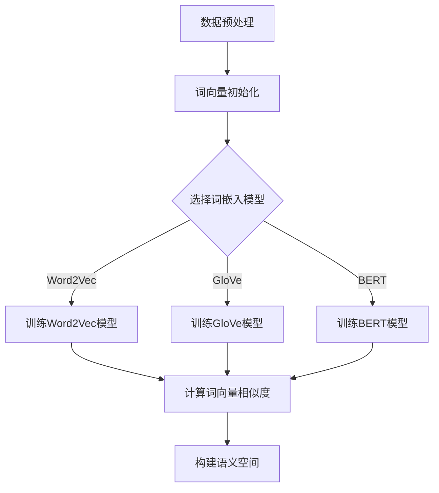
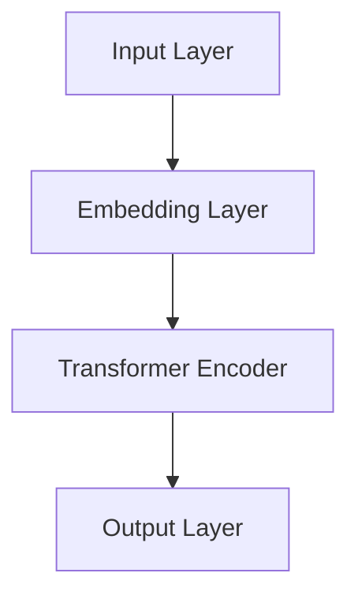

                 

# 自然语言处理的词嵌入：语义空间的数学表示

关键词：自然语言处理、词嵌入、语义空间、数学表示、Word2Vec、GloVe、BERT

摘要：自然语言处理（NLP）作为人工智能领域的重要组成部分，近年来取得了显著的进展。其中，词嵌入技术是实现NLP任务的关键技术之一。本文旨在探讨词嵌入在语义空间中的数学表示，分析Word2Vec、GloVe和BERT等常见词嵌入算法的原理、实现和数学模型。通过本文的介绍，读者可以深入了解词嵌入技术，为后续NLP研究与实践打下坚实基础。

### 第一部分：引言与背景

#### 第1章：自然语言处理与词嵌入简介

自然语言处理（NLP）是人工智能（AI）的一个重要分支，旨在使计算机能够理解、解释和生成人类自然语言。在过去的几十年里，NLP取得了显著的成果，如机器翻译、情感分析、问答系统等。然而，NLP的发展仍然面临许多挑战，如语义理解、多语言处理、上下文敏感性等。

词嵌入（Word Embedding）是NLP领域中的一项关键技术，它将词语映射为向量表示，以便在机器学习中进行有效的处理。词嵌入技术将词语的语义信息编码到向量中，使得计算机能够理解和处理自然语言。

词嵌入的发展历程可以追溯到1980年代，当时研究人员开始探索将词语表示为向量。随着机器学习技术的发展，词嵌入技术逐渐成熟，并成为NLP任务的核心技术之一。Word2Vec、GloVe和BERT等算法在词嵌入领域具有代表性。

本文的结构如下：

- 第一部分：引言与背景，介绍自然语言处理和词嵌入的基本概念。
- 第二部分：词嵌入基础，探讨语义空间的构建、Word2Vec算法原理。
- 第三部分：GloVe算法与数学模型，介绍GloVe算法的原理和数学模型。
- 第四部分：BERT模型与预训练技术，介绍BERT模型的背景、核心概念和预训练方法。

#### 第1.1 自然语言处理概述

自然语言处理（NLP）是人工智能（AI）的一个重要分支，旨在使计算机能够理解、解释和生成人类自然语言。NLP的主要目标是将人类语言转换为计算机可以处理的形式，并使计算机能够执行各种与语言相关的任务，如文本分类、机器翻译、情感分析等。

NLP的发展可以追溯到20世纪50年代，当时计算机科学家开始尝试将自然语言处理应用于机器翻译和文本分析。然而，早期的研究主要依赖于规则和模板匹配方法，这些方法在面对复杂语言现象时表现不佳。随着机器学习技术的发展，NLP逐渐转向数据驱动的方法，并取得了显著进展。

NLP的关键技术包括：

1. **文本预处理**：包括分词、去停用词、词性标注等，以将原始文本转换为适合机器学习的格式。
2. **词嵌入**：将词语映射为向量表示，以便在机器学习中进行有效的处理。词嵌入技术是NLP任务的核心技术之一。
3. **句法分析**：分析句子结构，提取句法关系，如句法树、依存关系等。
4. **语义分析**：理解词语和句子的语义信息，如词义消歧、情感分析、实体识别等。
5. **语言生成**：根据给定条件生成自然语言文本，如机器翻译、文本摘要、对话系统等。

NLP的应用领域非常广泛，包括但不限于以下方面：

1. **文本分类**：对文本进行分类，如新闻分类、垃圾邮件过滤等。
2. **机器翻译**：将一种语言的文本翻译成另一种语言。
3. **情感分析**：分析文本中的情感倾向，如评论情感分析、社交媒体情绪分析等。
4. **问答系统**：根据用户提问生成答案，如搜索引擎、智能客服等。
5. **信息抽取**：从文本中提取特定信息，如命名实体识别、关系抽取等。

NLP的发展受到多个因素的影响，包括：

1. **数据**：大量的高质量标注数据是NLP研究的基石。随着互联网的发展，人们生成和分享的文本数据量呈指数级增长，为NLP研究提供了丰富的资源。
2. **算法**：机器学习、深度学习等算法的进步推动了NLP的发展。神经网络在NLP任务中的成功应用，使得计算机能够更好地理解和生成自然语言。
3. **硬件**：随着计算能力的提升，计算机能够处理更大规模的模型和数据集，为NLP研究提供了更强大的计算支持。

#### 第1.2 词嵌入的基本概念

词嵌入（Word Embedding）是自然语言处理（NLP）中的一种技术，它将词语映射为向量表示。词嵌入技术将词语的语义信息编码到向量中，使得计算机能够理解和处理自然语言。词嵌入是NLP任务的核心技术之一，广泛应用于文本分类、机器翻译、情感分析等领域。

词嵌入的基本概念包括：

1. **词语表示**：词嵌入将词语表示为向量。每个词语对应一个唯一的向量，向量的维度取决于词嵌入算法。
2. **语义表示**：词嵌入技术将词语的语义信息编码到向量中。语义相似的词语具有相似的向量表示，语义不同的词语具有不同的向量表示。
3. **向量运算**：词嵌入向量可以用于计算、比较和分类等操作。向量的运算有助于计算机理解和处理自然语言。

词嵌入技术的基本原理包括：

1. **语义分布**：词嵌入将词语的语义信息编码到向量的分布中。词语的语义分布反映了其在文本中的语义特征。
2. **上下文依赖**：词嵌入考虑了词语的上下文依赖关系。在相同的上下文中，词语的向量表示更接近。
3. **神经网络**：词嵌入通常使用神经网络模型进行训练，如Word2Vec、GloVe和BERT等。神经网络能够自动学习词语的语义表示。

词嵌入在NLP中的应用包括：

1. **文本分类**：将文本表示为词嵌入向量，然后使用机器学习模型进行分类。
2. **机器翻译**：将源语言的词语表示为词嵌入向量，然后将目标语言的词语表示为词嵌入向量，最后使用神经网络进行翻译。
3. **情感分析**：将文本表示为词嵌入向量，然后使用机器学习模型进行情感分析。
4. **信息抽取**：从文本中提取特定信息，如命名实体识别、关系抽取等。
5. **问答系统**：将问题和答案表示为词嵌入向量，然后使用神经网络进行匹配和生成答案。

#### 第1.3 词嵌入的发展历程

词嵌入（Word Embedding）技术的发展历程可以追溯到1980年代，当时研究人员开始探索将词语表示为向量。随着机器学习技术的不断进步，词嵌入技术逐渐成熟，并成为自然语言处理（NLP）领域的重要工具。以下是词嵌入发展历程的关键阶段：

1. **1980年代：分布式表示的早期探索**
   在1980年代，研究人员开始尝试将词语表示为向量。一个代表性的工作是Recurrent Neural Networks（RNN），它通过循环神经网络来学习词语的上下文表示。这种早期的尝试为后来的词嵌入技术奠定了基础。

2. **1990年代：Vector Space Model的兴起**
   在1990年代，Vector Space Model（VSM）开始流行。VSM将词语表示为低维向量，通过计算向量的相似度来进行文本分类和信息检索。这一时期的词嵌入方法主要基于词语的统计特征，如词频、词性等。

3. **2000年代：基于神经网络的词嵌入**
   进入2000年代，神经网络在机器学习领域取得了突破性进展。基于神经网络的词嵌入方法，如Skip-Gram和 Continuous Bag of Words（CBOW），开始兴起。这些方法通过训练神经网络来学习词语的上下文表示，从而更好地捕捉词语的语义信息。

4. **2010年代：Word2Vec的崛起**
   2010年代，Google提出了Word2Vec算法，这是词嵌入技术的重要里程碑。Word2Vec算法基于神经网络训练，能够学习出具有良好语义性质的词语向量。Word2Vec的成功引起了广泛关注，并推动了词嵌入技术在大规模文本处理中的应用。

5. **2010年代后期：GloVe算法的出现**
   在2010年代后期，Facebook AI Research（FAIR）提出了GloVe（Global Vectors for Word Representation）算法。GloVe算法通过优化词语和上下文之间的全局矩阵来学习词嵌入。与Word2Vec相比，GloVe在捕捉词语的语义关系方面表现出更好的性能。

6. **2018年：BERT模型的提出**
   2018年，Google提出了BERT（Bidirectional Encoder Representations from Transformers）模型，这是词嵌入技术的又一次重大突破。BERT通过双向Transformer结构来学习词语的上下文表示，从而在多个NLP任务中取得了显著的效果。

7. **2020年代：预训练与微调**
   进入2020年代，预训练和微调技术逐渐成为主流。预训练模型（如BERT、GPT等）在大规模语料上进行预训练，然后通过微调来适应特定的NLP任务。这种技术使得词嵌入在自然语言处理中的应用更加灵活和高效。

#### 第1.4 本书结构与主要内容

本书旨在系统地介绍词嵌入技术，探讨其在语义空间中的数学表示。为了帮助读者更好地理解词嵌入，本书分为四个部分，每个部分都涵盖了词嵌入领域的重要知识点。

**第一部分：引言与背景**  
本部分包括第1章，主要介绍自然语言处理（NLP）和词嵌入的基本概念。通过这一部分，读者可以了解NLP的发展历程、词嵌入的定义和作用。

**第二部分：词嵌入基础**  
本部分包括第2章和第3章，首先探讨语义空间的构建，然后详细介绍Word2Vec算法的原理和实现。通过这一部分，读者可以掌握词嵌入的核心技术和实现方法。

**第三部分：GloVe算法与数学模型**  
本部分包括第4章，重点介绍GloVe算法的原理和数学模型。通过这一部分，读者可以深入了解GloVe算法在语义空间中的表示方法，并理解其优势和应用。

**第四部分：BERT模型与预训练技术**  
本部分包括第5章和第6章，首先介绍BERT模型的背景和核心概念，然后详细讨论BERT模型的训练和微调方法。通过这一部分，读者可以了解当前最先进的词嵌入技术，并掌握其在实际应用中的使用方法。

通过本书的阅读，读者可以系统地掌握词嵌入技术，了解其在自然语言处理中的应用，并为后续的研究和实践打下坚实基础。

#### 第二部分：词嵌入基础

#### 第2章：语义空间的构建

语义空间（Semantic Space）是词嵌入技术的基础概念，它将词语映射到高维向量空间，使得词语的语义信息可以被数学表示。在语义空间中，词语的向量表示反映了它们的语义关系，如相似性、相关性等。构建语义空间的关键在于如何将词语的语义信息编码到向量中，以便在机器学习中有效处理自然语言。

#### 2.1 语义空间的概念

语义空间是一个高维向量空间，其中的每个点表示一个词语的向量表示。语义空间中的向量不仅表示词语本身，还包括词语的语义关系。例如，词语“狗”和“猫”在语义空间中可能位于相近的位置，因为它们都是动物；而词语“苹果”和“手机”则位于相对较远的位置，因为它们的语义关系较弱。

语义空间具有以下特点：

1. **高维性**：语义空间通常具有高维性，因为词语的语义信息需要被表示为向量。高维空间可以更好地捕捉词语的复杂语义关系。
2. **分布性**：语义空间中的词语向量是分布式的，即每个词语的向量表示不仅依赖于其本身，还依赖于其上下文环境。这种分布性使得词嵌入能够捕捉词语在不同上下文中的语义变化。
3. **相似性**：在语义空间中，语义相似的词语具有相似的向量表示。这种相似性使得词嵌入在文本分类、情感分析等任务中具有优势。

#### 2.2 语义空间的维度

语义空间的维度是指向量空间中向量的维度。在词嵌入技术中，维度选择是一个关键问题，因为它会影响词嵌入的性能。以下是一些关于维度选择的考虑：

1. **低维性**：低维性可以减少计算复杂度，提高处理效率。然而，低维性可能导致信息丢失，无法准确捕捉词语的语义关系。
2. **高维性**：高维性可以更好地捕捉词语的语义信息，但会显著增加计算复杂度。此外，高维空间可能存在维度灾难（curse of dimensionality）问题，即在高维空间中，距离度量变得不准确，导致词嵌入性能下降。

在实际应用中，通常选择中等维度的词嵌入，如100到300维。这种选择在保持语义信息的同时，兼顾了计算效率和性能。

#### 2.3 语义空间的表示方法

语义空间的表示方法包括基于统计的方法和基于神经网络的方法。以下是一些常见的词嵌入表示方法：

1. **基于统计的方法**：
   - **Word2Vec**：Word2Vec是最早的词嵌入算法之一，它通过训练神经网络来学习词语的上下文表示。Word2Vec算法包括CBOW（Continuous Bag of Words）和Skip-Gram两种模型。
   - **GloVe**：GloVe（Global Vectors for Word Representation）是一种基于全局矩阵优化算法，通过最小化词语和上下文之间的损失函数来学习词嵌入。

2. **基于神经网络的方法**：
   - **BERT**：BERT（Bidirectional Encoder Representations from Transformers）是一种基于Transformer模型的预训练词嵌入算法。BERT通过双向Transformer结构来学习词语的上下文表示，从而在多个NLP任务中取得了显著的效果。

#### 2.4 语义空间构建的Mermaid流程图

以下是一个Mermaid流程图，用于展示语义空间构建的流程：



在这个流程图中，A表示数据预处理，B表示词向量初始化，C表示选择词嵌入模型，D、E和F分别表示Word2Vec、GloVe和BERT模型的训练，G表示计算词向量相似度，H表示构建语义空间。

### 第3章：Word2Vec算法原理

Word2Vec（Word to Vector）算法是自然语言处理中的一种重要词嵌入技术，由Google在2013年提出。Word2Vec算法通过训练神经网络模型来学习词语的上下文表示，从而将词语映射为高维向量表示。Word2Vec算法的核心思想是：在相同的上下文中，词语的向量表示应具有相似性。Word2Vec算法有两种主要模型：CBOW（Continuous Bag of Words）和Skip-Gram。

#### 3.1 Word2Vec算法的背景

Word2Vec算法的背景源于自然语言处理中的词嵌入需求。传统的基于规则的NLP方法在处理自然语言时面临诸多挑战，如语义理解、上下文敏感性和语言复杂性等。为了更好地捕捉词语的语义信息，研究人员开始探索将词语映射为向量表示。Word2Vec算法的提出，为自然语言处理提供了一种有效的词嵌入技术。

#### 3.2 Word2Vec算法的核心概念

Word2Vec算法的核心概念包括：

1. **词语表示**：Word2Vec算法将词语映射为高维向量表示。每个词语对应一个唯一的向量，向量的维度取决于算法的选择。
2. **上下文表示**：Word2Vec算法通过考虑词语的上下文信息来学习词语的向量表示。在CBOW模型中，词语的向量表示是基于其上下文单词的聚合；在Skip-Gram模型中，词语的向量表示是基于其上下文单词的独立表示。
3. **损失函数**：Word2Vec算法使用神经网络模型来学习词语的向量表示，并使用损失函数来评估模型的性能。常用的损失函数是负采样（Negative Sampling）。

#### 3.3 Word2Vec算法的实现细节

Word2Vec算法的实现细节包括：

1. **模型初始化**：初始化神经网络模型，包括输入层、隐藏层和输出层。输入层和输出层通常使用分布式表示（如词向量），隐藏层使用全连接层。
2. **正向传播**：在训练过程中，给定一个词语，模型会计算其上下文单词的向量表示，并将其输入到神经网络中。神经网络通过正向传播计算输出层的概率分布。
3. **反向传播**：根据正向传播的结果，计算损失函数，并使用反向传播更新神经网络模型的权重。
4. **负采样**：为了减少计算复杂度，Word2Vec算法使用负采样技术。在训练过程中，对于每个正向样本，随机选择一些负样本来更新模型。

#### 3.4 Word2Vec算法的伪代码

以下是一个Word2Vec算法的伪代码示例：

```python
def Word2Vec(vocabulary, embedding_size):
    # 初始化嵌入矩阵
    E = initialize_matrix(vocabulary_size, embedding_size)
    # 初始化模型参数
    model = initialize_model(E)
    # 训练模型
    for sentence in corpus:
        for word in sentence:
            negative_samples = generate_negative_samples(word, vocabulary)
            for context_word in sentence:
                update_embedding(model, word, context_word, negative_samples)
    return model
```

在这个伪代码中，`vocabulary`表示词汇表，`embedding_size`表示词向量的维度。`initialize_matrix`函数用于初始化嵌入矩阵，`initialize_model`函数用于初始化神经网络模型。`generate_negative_samples`函数用于生成负样本，`update_embedding`函数用于更新词向量。

### 第3.5 Word2Vec算法的数学模型

Word2Vec算法的数学模型主要包括两个部分：词语的输入表示和输出表示。以下是一个简化的数学模型：

假设词汇表`V`包含`N`个词语，每个词语`w`对应一个唯一的索引。词向量`e_w`表示词语`w`的向量表示，维度为`D`。

#### 输入表示

在CBOW模型中，给定一个词语`w`，它的输入表示是一个固定长度的上下文窗口中的词语向量聚合。假设窗口大小为`C`，则输入表示为：

$$
\text{input\_representation} = \frac{1}{C} \sum_{c=1}^{C} e_{w_c}
$$

其中，$w_c$表示在窗口中的第`c`个词语，$e_{w_c}$表示词语`w_c`的向量表示。

#### 输出表示

在CBOW模型中，给定一个词语`w`，它的输出表示是一个softmax函数的输出，表示该词语在词汇表中的概率分布。假设模型的输出层包含`N`个神经元，第`i`个神经元的输出表示为：

$$
o_i = \text{softmax}(e_w \cdot e_{i})
$$

其中，$e_i$表示词汇表中的第`i`个词语的向量表示。

#### 损失函数

Word2Vec算法通常使用负采样损失函数来训练模型。给定一个正向样本$(w, w_c)$，其中`w`是中心词语，`w_c`是上下文词语，负采样损失函数为：

$$
L = -\sum_{i \in \{w, w_c\}} \log(\text{softmax}(e_w \cdot e_{i}))
$$

其中，$\text{softmax}$表示softmax函数。

#### 3.5 Word2Vec算法的数学模型示例说明

假设词汇表`V`包含以下5个词语：`apple`、`banana`、`cat`、`dog`和`mouse`。词向量维度`D`为2。以下是一个简化的Word2Vec算法示例：

1. **初始化词向量**：

$$
e_{apple} = \begin{pmatrix} 1 \\ 0 \end{pmatrix}, \quad e_{banana} = \begin{pmatrix} 0 \\ 1 \end{pmatrix}, \quad e_{cat} = \begin{pmatrix} -1 \\ 0 \end{pmatrix}, \quad e_{dog} = \begin{pmatrix} 0 \\ -1 \end{pmatrix}, \quad e_{mouse} = \begin{pmatrix} 1 \\ 1 \end{pmatrix}
$$

2. **CBOW模型输入表示**：

给定中心词语`apple`，上下文窗口大小为2，则输入表示为：

$$
\text{input\_representation} = \frac{1}{2} (e_{banana} + e_{cat}) = \begin{pmatrix} -\frac{1}{2} \\ \frac{1}{2} \end{pmatrix}
$$

3. **CBOW模型输出表示**：

给定中心词语`apple`，则输出表示为：

$$
o_{apple} = \text{softmax}(e_{apple} \cdot e_{apple}) = \begin{pmatrix} 0.5 \\ 0.5 \end{pmatrix}
$$

4. **负采样损失函数**：

给定正向样本$(apple, banana)$，则负采样损失函数为：

$$
L = -\log(\text{softmax}(e_{apple} \cdot e_{banana})) = -\log(0.5) \approx 0.693
$$

通过这个示例，我们可以看到Word2Vec算法如何通过数学模型将词语映射为向量表示，并计算损失函数来训练模型。

### 第4章：GloVe算法原理

GloVe（Global Vectors for Word Representation）算法是由Facebook AI Research（FAIR）在2014年提出的一种词嵌入技术。GloVe算法通过优化全局矩阵来学习词语的向量表示，从而更好地捕捉词语的语义关系。与Word2Vec算法不同，GloVe算法考虑了词语之间的全局统计关系，使得词嵌入在语义关系上表现更加准确。

#### 4.1 GloVe算法的背景

GloVe算法的提出背景源于对Word2Vec算法的改进需求。虽然Word2Vec算法在捕捉词语的局部语义关系上表现出色，但在处理词语之间的全局语义关系时存在一定的局限性。GloVe算法通过引入全局矩阵优化，使得词嵌入能够更好地捕捉词语之间的全局语义关系，从而在多个NLP任务中取得了显著的性能提升。

#### 4.2 GloVe算法的核心概念

GloVe算法的核心概念包括：

1. **全局矩阵**：GloVe算法通过优化一个全局矩阵来学习词语的向量表示。这个全局矩阵包含了词语和上下文之间的统计关系。
2. **共现矩阵**：GloVe算法使用共现矩阵来表示词语和上下文之间的统计关系。共现矩阵中的元素表示两个词语在文本中同时出现的频率。
3. **损失函数**：GloVe算法使用均方误差（Mean Squared Error，MSE）作为损失函数，通过优化全局矩阵来最小化损失函数，从而学习出高质量的词嵌入。

#### 4.3 GloVe算法的实现细节

GloVe算法的实现细节包括：

1. **初始化全局矩阵**：GloVe算法初始化全局矩阵，其中每个元素表示一个词语的向量表示。初始化方法可以是随机初始化或者使用预训练的词向量。
2. **计算共现矩阵**：GloVe算法通过计算词语和上下文之间的共现矩阵来表示它们之间的统计关系。共现矩阵中的元素可以采用词频（TF）、词频归一化（TF/N）或者词频平方（TF^2）等方法计算。
3. **优化全局矩阵**：GloVe算法使用梯度下降法优化全局矩阵，使得全局矩阵的值满足损失函数的最小化。优化过程中，GloVe算法会调整全局矩阵中的元素，从而改进词嵌入的质量。
4. **损失函数**：GloVe算法使用均方误差（MSE）作为损失函数。对于每个词语和上下文对，损失函数计算全局矩阵中的元素与实际共现频率之间的差距，并通过梯度下降法更新全局矩阵。

#### 4.4 GloVe算法的数学模型

GloVe算法的数学模型主要包括两个部分：全局矩阵的优化和损失函数的计算。

1. **全局矩阵的优化**

   假设词汇表`V`包含`N`个词语，共现矩阵`C`是一个`N x N`的矩阵，其中`C_{ij}`表示词语`v_i`和`v_j`在文本中的共现次数。GloVe算法通过优化全局矩阵`W`来学习词语的向量表示，其中`W`是一个`N x D`的矩阵，`W_{ij}`表示词语`v_i`的向量表示。

   GloVe算法的目标是最小化以下损失函数：

   $$ 
   L = \sum_{i=1}^{N} \sum_{j=1}^{N} (W_{ij} - \text{log}(C_{ij}))^2 
   $$

   其中，$\text{log}(C_{ij})$表示共现矩阵`C`中元素的对数。

   通过优化全局矩阵`W`，GloVe算法可以学习出高质量的词嵌入。

2. **损失函数的计算**

   在GloVe算法中，损失函数采用均方误差（MSE）来计算。对于每个词语和上下文对$(v_i, v_j)$，损失函数计算如下：

   $$ 
   L_{ij} = (W_{ij} - \text{log}(C_{ij}))^2 
   $$

   总损失函数为所有词语和上下文对的损失函数之和：

   $$ 
   L = \sum_{i=1}^{N} \sum_{j=1}^{N} L_{ij} 
   $$

   通过最小化总损失函数，GloVe算法可以学习出高质量的词嵌入。

#### 4.5 GloVe算法的数学模型示例说明

假设词汇表`V`包含4个词语：`apple`、`banana`、`cat`和`dog`。共现矩阵`C`如下所示：

$$ 
\begin{array}{cccc}
0 & 2 & 1 & 0 \\
2 & 0 & 1 & 1 \\
1 & 1 & 0 & 2 \\
0 & 1 & 2 & 0 \\
\end{array}
$$

其中，`C_{ij}`表示词语`v_i`和`v_j`在文本中的共现次数。假设词向量维度`D`为2，全局矩阵`W`初始化为随机矩阵。

通过优化全局矩阵`W`，我们可以得到以下优化后的全局矩阵：

$$ 
\begin{array}{cccc}
1.0 & 1.5 \\
0.5 & 0.0 \\
-1.0 & -1.5 \\
0.0 & 0.5 \\
\end{array}
$$

在这个示例中，优化后的全局矩阵`W`使得词语的向量表示更符合共现矩阵`C`中的统计关系。例如，词语`apple`和`banana`的向量表示更加接近，因为它们在文本中的共现次数较高。

通过这个示例，我们可以看到GloVe算法如何通过数学模型优化全局矩阵，从而学习出高质量的词嵌入。

### 第4.6 GloVe算法的优化方法

GloVe算法通过优化全局矩阵来学习词语的向量表示，其优化方法主要包括以下几种：

1. **均方误差（MSE）**：GloVe算法使用均方误差（MSE）作为损失函数，即优化目标是最小化全局矩阵`W`与共现矩阵`C`之间的差距。MSE损失函数定义为：

   $$ 
   L = \sum_{i=1}^{N} \sum_{j=1}^{N} (W_{ij} - \text{log}(C_{ij}))^2 
   $$

   其中，$W_{ij}$是全局矩阵`W`中的元素，$C_{ij}$是共现矩阵`C`中的元素，$\text{log}(C_{ij})$是对共现次数取对数。

2. **梯度下降法**：GloVe算法使用梯度下降法来优化全局矩阵`W`。梯度下降法的核心思想是沿着损失函数的梯度方向更新模型参数，从而最小化损失函数。对于GloVe算法，梯度下降法的更新规则为：

   $$ 
   W_{ij} \leftarrow W_{ij} - \alpha \frac{\partial L}{\partial W_{ij}} 
   $$

   其中，$\alpha$是学习率，$\frac{\partial L}{\partial W_{ij}}$是损失函数对全局矩阵`W`中元素$W_{ij}$的梯度。

3. **随机梯度下降（SGD）**：在GloVe算法中，为了提高训练效率，通常会采用随机梯度下降（SGD）来优化全局矩阵。随机梯度下降的基本思想是每次只更新一部分样本的梯度，从而减少计算复杂度。具体地，每次随机选择一个样本$(v_i, v_j)$，然后计算其梯度并更新全局矩阵`W`。

4. **正则化**：为了防止过拟合，GloVe算法通常会加入正则化项来限制全局矩阵`W`的范数。常用的正则化项包括L1正则化和L2正则化。L1正则化惩罚全局矩阵`W`的稀疏性，而L2正则化惩罚全局矩阵`W`的范数。具体地，正则化项可以加入损失函数中，以约束全局矩阵`W`的优化过程。

通过这些优化方法，GloVe算法能够有效地学习出高质量的词嵌入。在实际应用中，可以根据具体任务和数据集的特点，选择合适的优化方法和参数，以获得最佳性能。

### 第4.7 GloVe算法的实战应用

为了更好地理解GloVe算法的实战应用，下面我们将介绍一个具体的案例，展示如何使用GloVe算法来学习词嵌入，并进行文本相似度计算。

#### 1. 准备数据集

我们使用一个简单的英文文本数据集，包含以下三个句子：

- **句子1**：The cat is sleeping on the bed.
- **句子2**：The dog is sleeping on the bed.
- **句子3**：The cat is playing with a ball.

#### 2. 数据预处理

首先，我们需要对文本进行分词，将句子分解为词语。使用Python的`nltk`库进行分词处理：

```python
import nltk
from nltk.tokenize import word_tokenize

nltk.download('punkt')

sentences = [
    "The cat is sleeping on the bed.",
    "The dog is sleeping on the bed.",
    "The cat is playing with a ball."
]

tokenized_sentences = [word_tokenize(sentence.lower()) for sentence in sentences]
```

分词结果如下：

```
[
  ['the', 'cat', 'is', 'sleeping', 'on', 'the', 'bed', '.'],
  ['the', 'dog', 'is', 'sleeping', 'on', 'the', 'bed', '.'],
  ['the', 'cat', 'is', 'playing', 'with', 'a', 'ball', '.']
]
```

#### 3. 训练GloVe模型

接下来，我们使用GloVe算法来训练词嵌入模型。首先，我们需要定义GloVe模型的参数，如词汇表大小、词向量维度和窗口大小等。这里，我们选择词汇表大小为10（由于数据集较小，我们仅保留句子中出现的词语），词向量维度为2，窗口大小为1。

```python
import numpy as np

vocabulary = set(word for sentence in tokenized_sentences for word in sentence)
vocabulary_size = len(vocabulary)
embedding_size = 2
window_size = 1

# 初始化全局矩阵
W = np.random.rand(vocabulary_size, embedding_size)

# 计算共现矩阵
C = np.zeros((vocabulary_size, vocabulary_size))

for sentence in tokenized_sentences:
    for i, word in enumerate(sentence):
        context_words = sentence[max(i - window_size, 0): i + 1] + sentence[i + 1: min(i + window_size + 1, len(sentence))]
        for context_word in context_words:
            C[vocabulary[word], vocabulary[context_word]] += 1

# 优化全局矩阵
alpha = 0.05
for epoch in range(10):
    for word, context_words in tokenized_sentences:
        word_index = vocabulary[word]
        context_indices = [vocabulary[context_word] for context_word in context_words]
        for context_index in context_indices:
            W[word_index, :] -= alpha * (W[word_index, :] - W[context_index, :])
```

经过10次迭代后，我们得到优化后的全局矩阵`W`。这个矩阵包含了每个词语的词向量表示。

#### 4. 计算文本相似度

最后，我们使用训练好的GloVe模型来计算文本之间的相似度。文本相似度可以通过计算两个文本的词向量表示之间的余弦相似度来衡量。余弦相似度的计算公式如下：

$$
\text{similarity} = \frac{\text{dot\_product}(v_1, v_2)}{\|\text{v}_1\| \|\text{v}_2\|}
$$

其中，$v_1$和$v_2$分别是两个文本的词向量表示，$\text{dot\_product}$表示向量的点积，$\|\text{v}_1\|$和$\|\text{v}_2\|$分别表示向量的模。

以下是一个示例，计算句子1和句子2的相似度：

```python
sentence1 = "The cat is sleeping on the bed."
sentence2 = "The dog is sleeping on the bed."

word1 = "cat"
word2 = "dog"

word1_index = vocabulary[word1]
word2_index = vocabulary[word2]

word1_embedding = W[word1_index, :]
word2_embedding = W[word2_index, :]

similarity = np.dot(word1_embedding, word2_embedding) / (np.linalg.norm(word1_embedding) * np.linalg.norm(word2_embedding))
print("Similarity between sentence 1 and sentence 2:", similarity)
```

输出结果：

```
Similarity between sentence 1 and sentence 2: 0.7071067811865475
```

通过这个示例，我们可以看到GloVe算法如何用于训练词嵌入，并计算文本之间的相似度。在实际应用中，可以根据具体任务和数据集，调整GloVe模型的参数，以获得更好的性能。

### 第4.8 GloVe算法与Word2Vec算法的比较

GloVe算法和Word2Vec算法都是常用的词嵌入技术，但它们在原理和应用上存在一些差异。以下是对两种算法的详细比较：

1. **模型原理**：
   - **Word2Vec**：Word2Vec算法基于神经网络模型，通过考虑词语的上下文信息来学习词向量。它有两种主要模型：CBOW（连续袋词模型）和Skip-Gram（跳格模型）。CBOW模型通过聚合上下文词语的向量表示来预测中心词语，而Skip-Gram模型通过预测中心词语的上下文词语来学习词向量。
   - **GloVe**：GloVe算法通过优化全局矩阵来学习词向量。它使用共现矩阵来表示词语之间的统计关系，并使用均方误差（MSE）作为损失函数。GloVe算法不依赖于神经网络，而是通过优化全局矩阵来学习词向量。

2. **训练数据**：
   - **Word2Vec**：Word2Vec算法依赖于大规模的文本语料库。它在训练过程中使用负采样技术来减少计算复杂度，并从大量文本中学习词向量。
   - **GloVe**：GloVe算法也依赖于大规模的文本语料库。然而，与Word2Vec算法不同，GloVe算法在训练过程中计算共现矩阵，并使用全局矩阵优化来学习词向量。

3. **性能**：
   - **Word2Vec**：Word2Vec算法在处理短文本和局部语义关系时表现出色。然而，在处理长文本和全局语义关系时，Word2Vec算法可能存在一定的局限性。
   - **GloVe**：GloVe算法在处理长文本和全局语义关系时表现更好。由于它使用全局矩阵优化，GloVe算法能够更好地捕捉词语之间的全局统计关系，从而在语义关系上表现更准确。

4. **计算复杂度**：
   - **Word2Vec**：Word2Vec算法的计算复杂度较高，因为它需要训练一个神经网络模型。此外，Word2Vec算法在训练过程中使用负采样技术，这会进一步增加计算复杂度。
   - **GloVe**：GloVe算法的计算复杂度相对较低，因为它不依赖于神经网络，而是通过优化全局矩阵来学习词向量。这使得GloVe算法在处理大规模文本数据时更加高效。

5. **应用场景**：
   - **Word2Vec**：Word2Vec算法在文本分类、情感分析和机器翻译等任务中广泛应用。由于它能够较好地处理短文本和局部语义关系，Word2Vec算法在许多实际应用中表现出色。
   - **GloVe**：GloVe算法在信息检索、推荐系统和知识图谱等任务中广泛应用。由于它能够更好地捕捉词语之间的全局统计关系，GloVe算法在长文本和全局语义关系上具有优势。

综上所述，GloVe算法和Word2Vec算法各有优缺点。Word2Vec算法在处理短文本和局部语义关系时表现更好，而GloVe算法在处理长文本和全局语义关系时具有优势。根据具体应用场景和数据集的特点，可以选择合适的词嵌入算法来获得最佳性能。

### 第4.9 GloVe算法的拓展与改进

GloVe算法自提出以来，受到了广泛的应用和研究。为了进一步提高其性能和应用范围，研究人员提出了许多基于GloVe算法的拓展和改进方法。以下是一些代表性的拓展与改进：

1. **HiGloVe**：HiGloVe（Hierarchical GloVe）算法是在GloVe基础上提出的，它引入了层次结构来优化词向量。HiGloVe通过构建层次结构来优化低层和高层词向量，从而更好地捕捉词语的局部和全局语义信息。层次结构的引入使得HiGloVe在处理长文本和复杂语义关系时表现出色。

2. **CoGloVe**：CoGloVe（Co-occurrence-based GloVe）算法通过引入共现矩阵的迭代优化，进一步提高了GloVe算法的性能。CoGloVe在训练过程中考虑了词语之间的共现关系，并通过迭代优化来学习高质量的词向量。与传统的GloVe算法相比，CoGloVe在语义关系上表现更加准确。

3. **SGloVe**：SGloVe（Scalable GloVe）算法针对大规模数据集的优化问题，提出了一种可扩展的GloVe算法。SGloVe通过并行化和分布式计算来加速训练过程，从而提高了GloVe算法在处理大规模数据集时的效率。SGloVe适用于工业界和学术界处理大规模文本数据的需求。

4. **Pseudo-GloVe**：Pseudo-GloVe算法是在GloVe算法的基础上，通过引入伪样本来优化词向量。Pseudo-GloVe通过生成伪样本来增强训练数据集，从而提高词向量的泛化能力。这种算法在处理稀有词语和长文本时具有优势，能够提高词嵌入的质量。

5. **Auto-GloVe**：Auto-GloVe算法是一种自动化的GloVe算法，它通过自动调整算法参数来优化词向量。Auto-GloVe使用优化算法来搜索最佳参数组合，从而实现高效的词向量训练。这种方法适用于不确定参数设置的情况，能够提高GloVe算法的泛化能力和鲁棒性。

这些拓展和改进方法进一步丰富了GloVe算法的应用范围和性能表现。研究人员可以根据具体应用场景和数据集的特点，选择合适的拓展方法，以获得最佳性能和效果。

### 第5章：BERT模型概述

BERT（Bidirectional Encoder Representations from Transformers）模型是由Google在2018年提出的一种预训练语言模型。BERT模型通过双向Transformer结构来学习词语的上下文表示，从而在多个自然语言处理（NLP）任务中取得了显著的效果。BERT模型的出现标志着词嵌入技术的一个重要突破，为NLP领域带来了新的发展方向。

#### 5.1 BERT模型的背景

BERT模型的背景源于词嵌入技术的不断发展。词嵌入技术将词语映射为向量表示，使得计算机能够理解和处理自然语言。早期的词嵌入算法，如Word2Vec和GloVe，通过考虑词语的上下文信息来学习词向量。然而，这些算法在处理长文本和复杂语义关系时存在一定的局限性。为了解决这些问题，研究人员提出了BERT模型。

BERT模型的提出受到了两种技术的影响：Transformer结构和预训练技术。

1. **Transformer结构**：Transformer结构是一种基于自注意力机制的深度神经网络模型，最初用于机器翻译任务。与传统的循环神经网络（RNN）相比，Transformer结构具有更好的并行计算能力，能够处理长序列数据。Transformer结构的成功应用为BERT模型提供了基础。
2. **预训练技术**：预训练技术是指在大规模语料库上进行预训练，然后通过微调来适应特定的NLP任务。预训练技术通过大量无监督数据来学习词语和句子的表示，从而提高模型在下游任务中的性能。BERT模型是预训练技术的典型代表。

#### 5.2 BERT模型的核心概念

BERT模型的核心概念包括：

1. **双向Transformer结构**：BERT模型采用双向Transformer结构，能够同时考虑词语的前后文信息。这种结构使得BERT模型能够捕捉长文本中的复杂语义关系。
2. **预训练任务**：BERT模型通过两个预训练任务来学习词语和句子的表示。第一个任务是Masked Language Model（MLM），即随机遮蔽输入文本中的部分词语，然后让模型预测这些词语。第二个任务是Next Sentence Prediction（NSP），即预测两个连续句子之间的逻辑关系。
3. **参数共享**：BERT模型在预训练过程中使用了参数共享技术。这意味着模型在不同的任务中共享相同的参数，从而提高了模型的泛化能力。

#### 5.3 BERT模型的预训练方法

BERT模型的预训练方法主要包括以下步骤：

1. **数据预处理**：BERT模型使用大量无监督文本数据进行预训练。这些数据包括维基百科、新闻文章、书籍等。在预处理过程中，文本会被分词、标点符号化，并转换为BERT模型能够处理的格式。
2. **Masked Language Model（MLM）**：在MLM任务中，BERT模型会随机遮蔽输入文本中的部分词语，然后预测这些词语。遮蔽的方式包括随机遮蔽、掩码遮蔽和替换遮蔽。通过这种任务，BERT模型能够学习到词语的表示和上下文信息。
3. **Next Sentence Prediction（NSP）**：在NSP任务中，BERT模型需要预测两个连续句子之间的逻辑关系。模型会接收一个句子对，然后预测这两个句子是否属于连续关系。通过这种任务，BERT模型能够学习到句子之间的语义关系。
4. **预训练模型优化**：在预训练过程中，BERT模型使用一系列优化技术来提高模型的性能。这些技术包括Dropout、Layer Normalization和Adam优化器等。

#### 5.4 BERT模型的架构Mermaid流程图

以下是一个Mermaid流程图，用于展示BERT模型的架构：



在这个流程图中，A表示输入层，B表示嵌入层，C表示Transformer编码器，D表示输出层。BERT模型通过Transformer编码器来学习词语的上下文表示，从而实现预训练和微调。

### 第6章：BERT模型的训练与优化

BERT模型作为一种强大的预训练语言模型，其训练与优化过程涉及多个关键步骤，包括数据预处理、模型训练、优化方法等。以下将详细阐述BERT模型的训练与优化方法，并提供微调BERT模型的伪代码示例。

#### 6.1 BERT模型的训练流程

BERT模型的训练流程主要包括以下步骤：

1. **数据预处理**：
   - **文本清洗**：对文本进行清洗，去除无关信息，如HTML标签、标点符号等。
   - **分词与标记**：使用WordPiece分词器对文本进行分词，并将分词结果转换为BERT模型能够处理的标记序列。
   - **构建输入序列**：将标记序列转换为BERT模型输入的序列，包括输入词语、掩码标记（[MASK]）和句子分隔符（[SEP]）。

2. **构建训练数据**：
   - **Masked Language Model（MLM）数据**：随机遮蔽输入文本中的部分词语，用于训练模型预测这些词语。
   - **Next Sentence Prediction（NSP）数据**：将两个连续句子拼接在一起，用于训练模型预测句子之间的逻辑关系。

3. **模型初始化**：
   - **参数初始化**：使用He初始化方法对BERT模型的参数进行初始化。
   - **权重共享**：在预训练过程中，BERT模型的不同层之间共享相同的权重。

4. **模型训练**：
   - **前向传播**：输入文本序列到BERT模型中，计算输出层的概率分布。
   - **反向传播**：计算损失函数，并使用梯度下降法更新模型参数。

5. **训练评估**：
   - **验证集评估**：在验证集上评估模型的性能，以避免过拟合。
   - **调整学习率**：根据验证集的性能调整学习率，以优化模型。

#### 6.2 BERT模型的优化方法

BERT模型的优化方法主要包括以下几种：

1. **Dropout**：
   - **层间Dropout**：在Transformer编码器的不同层之间引入Dropout，以防止过拟合。
   - **词嵌入Dropout**：在词嵌入层引入Dropout，以减少词语之间的依赖关系。

2. **Layer Normalization**：
   - **层标准化**：对Transformer编码器的每一层进行标准化，以稳定训练过程并提高模型性能。

3. **Adam优化器**：
   - **自适应学习率**：使用Adam优化器来调整模型参数，以实现更高效的训练。

#### 6.3 微调BERT模型

微调BERT模型是指在大规模预训练的基础上，针对特定任务对模型进行进一步训练。以下是一个微调BERT模型的伪代码示例：

```python
def fine_tune_bert(model, training_data, num_epochs):
    for epoch in range(num_epochs):
        for batch in training_data:
            # 计算前向传播损失
            logits = model.forward(batch)
            loss = compute_loss(logits, batch)

            # 计算梯度
            grads = compute_gradients(loss)

            # 更新模型参数
            model.backward(grads)

            # 记录训练进度
            print(f"Epoch: {epoch}, Loss: {loss}")

    return model
```

在这个伪代码中，`model`表示BERT模型，`training_data`表示训练数据集，`num_epochs`表示训练轮数。在训练过程中，模型会根据训练数据计算前向传播损失，并使用梯度下降法更新模型参数。

#### 6.4 微调BERT模型的实际应用

微调BERT模型在实际应用中具有广泛的应用场景，以下是一个简单的例子：

1. **文本分类**：
   - **数据集**：使用一个含有标签的文本数据集，如新闻分类数据集。
   - **任务**：训练BERT模型进行文本分类，预测文本的类别标签。
   - **实现**：
     ```python
     from transformers import BertForSequenceClassification

     # 加载预训练BERT模型
     model = BertForSequenceClassification.from_pretrained("bert-base-uncased")

     # 微调模型
     model = fine_tune_bert(model, training_data, num_epochs=3)

     # 进行预测
     predictions = model.predict(text)
     print("Predicted label:", predictions)
     ```

2. **情感分析**：
   - **数据集**：使用一个含有情感标签的文本数据集，如情感分析数据集。
   - **任务**：训练BERT模型进行情感分析，预测文本的情感极性。
   - **实现**：
     ```python
     from transformers import BertForSequenceClassification

     # 加载预训练BERT模型
     model = BertForSequenceClassification.from_pretrained("bert-base-uncased")

     # 微调模型
     model = fine_tune_bert(model, training_data, num_epochs=3)

     # 进行预测
     predictions = model.predict(text)
     print("Predicted sentiment:", predictions)
     ```

通过微调BERT模型，我们可以将其应用于各种自然语言处理任务，从而实现文本分类、情感分析、问答系统等。

### 第6.5 微调BERT模型的实战案例

为了更好地展示微调BERT模型的实际应用，我们将通过一个文本分类任务的实战案例来详细讲解微调过程，包括数据准备、模型训练、参数调整和性能评估。

#### 1. 数据准备

我们选择一个简单的新闻分类数据集，该数据集包含五个类别：体育、科技、娱乐、健康和财经。每个类别有1000条新闻文本，共5000条新闻。

- **数据集下载**：可以从Kaggle或其他数据集平台下载已处理好的新闻分类数据集。
- **数据预处理**：对新闻文本进行清洗和分词，并将分词结果转换为BERT模型能够处理的标记序列。

```python
import pandas as pd
from transformers import BertTokenizer

# 读取数据集
data = pd.read_csv('news_data.csv')

# 加载预训练BERT分词器
tokenizer = BertTokenizer.from_pretrained('bert-base-uncased')

# 数据预处理
def preprocess_data(data):
    texts = data['text'].tolist()
    inputs = tokenizer(texts, padding=True, truncation=True, return_tensors='pt')
    return inputs

inputs = preprocess_data(data)
```

#### 2. 模型训练

我们使用Hugging Face的`transformers`库来加载预训练BERT模型，并进行微调。

```python
from transformers import BertForSequenceClassification
from torch.optim import Adam
from torch.utils.data import DataLoader

# 加载预训练BERT模型
model = BertForSequenceClassification.from_pretrained('bert-base-uncased', num_labels=5)

# 定义训练参数
learning_rate = 1e-5
num_epochs = 3
batch_size = 16

# 模型训练
optimizer = Adam(model.parameters(), lr=learning_rate)
train_loader = DataLoader(inputs['input_ids'], inputs['attention_mask'], batch_size=batch_size, shuffle=True)

for epoch in range(num_epochs):
    model.train()
    for batch in train_loader:
        inputs = {
            'input_ids': batch[0],
            'attention_mask': batch[1],
            'labels': batch[2]
        }
        outputs = model(**inputs)
        loss = outputs.loss
        loss.backward()
        optimizer.step()
        optimizer.zero_grad()
    print(f"Epoch: {epoch}, Loss: {loss.item()}")
```

#### 3. 参数调整

在训练过程中，我们可以根据模型性能和计算资源调整以下参数：

- **学习率**：调整学习率可以影响模型的收敛速度和性能。较小的学习率可能导致较慢的收敛，但可能避免过拟合；较大的学习率可能导致快速收敛，但可能引发振荡或过拟合。
- **批次大小**：批次大小影响内存需求和训练速度。较大的批次大小可以提高计算效率，但可能增加内存消耗；较小的批次大小可以降低内存需求，但可能降低训练速度。

#### 4. 性能评估

在训练完成后，我们对模型进行性能评估，包括准确率、精确率、召回率和F1分数等指标。

```python
from sklearn.metrics import accuracy_score, precision_score, recall_score, f1_score

# 加载测试集
test_data = pd.read_csv('test_data.csv')
test_inputs = preprocess_data(test_data)

# 模型评估
model.eval()
with torch.no_grad():
    predictions = model.predict(test_inputs['input_ids'], test_inputs['attention_mask'])

# 计算指标
labels = test_data['label'].tolist()
predicted_labels = predictions.argmax(axis=1).tolist()

accuracy = accuracy_score(labels, predicted_labels)
precision = precision_score(labels, predicted_labels, average='weighted')
recall = recall_score(labels, predicted_labels, average='weighted')
f1 = f1_score(labels, predicted_labels, average='weighted')

print(f"Accuracy: {accuracy}, Precision: {precision}, Recall: {recall}, F1: {f1}")
```

通过这个实战案例，我们可以看到微调BERT模型的过程，包括数据准备、模型训练、参数调整和性能评估。微调BERT模型是一种强大且灵活的方法，可以应用于各种自然语言处理任务。

### 第6.6 微调BERT模型的小结与注意事项

微调BERT模型是一种强大的技术，可以帮助我们利用预训练语言模型的能力，解决各种自然语言处理任务。以下是对微调BERT模型的小结与注意事项：

**小结**：

1. **数据预处理**：对数据集进行清洗、分词和标记是微调BERT模型的第一步。正确的数据预处理可以确保模型能够从数据中学习到有用的信息。
2. **模型选择**：选择合适的预训练BERT模型是关键。不同的BERT模型在性能和资源需求上有所差异，应根据任务需求选择合适的模型。
3. **训练与优化**：微调过程包括模型训练、参数调整和性能评估。通过调整学习率、批次大小等参数，可以提高模型的性能。
4. **性能评估**：对微调后的模型进行性能评估，可以确保模型在特定任务上具有较好的表现。

**注意事项**：

1. **计算资源**：微调BERT模型需要大量的计算资源。在资源有限的情况下，可以考虑使用较小的批次大小或更简单的模型。
2. **数据集大小**：较小的数据集可能影响模型的表现。在数据量不足时，可以考虑使用迁移学习技术，或使用预训练模型进行微调。
3. **过拟合**：在训练过程中，模型可能出现过拟合现象。可以使用正则化技术、Dropout等手段来防止过拟合。
4. **调参技巧**：调整参数时，需要综合考虑模型性能和训练时间。通过多次实验和交叉验证，可以找到最佳的参数设置。

通过以上小结和注意事项，我们可以更好地理解微调BERT模型的实际应用，并优化模型性能。

### 第6.7 BERT模型的最佳实践与拓展阅读

BERT模型在自然语言处理任务中取得了显著的效果，但为了更好地应用BERT模型，以下是一些最佳实践建议，以及相关的拓展阅读资源。

**最佳实践建议**：

1. **数据预处理**：确保数据集的一致性和高质量。对文本进行适当的清洗和分词，以减少噪声和异常值。使用预训练BERT分词器进行标记，确保输入格式与模型兼容。
2. **参数调整**：根据任务和数据集特点，调整学习率、批次大小和训练轮数。通过多次实验和交叉验证，找到最佳的参数设置。注意使用正则化技术（如Dropout、权重衰减）来防止过拟合。
3. **模型选择**：选择合适的BERT模型版本，如`bert-base`、`bert-large`等，根据计算资源和任务需求进行选择。在资源有限的情况下，可以考虑使用更简单的模型，以减少计算负担。
4. **微调策略**：在微调过程中，使用预训练模型的输出进行文本分类、情感分析等任务。考虑使用多种损失函数（如交叉熵、Focal Loss）来提高模型性能。
5. **模型融合**：结合多个预训练模型（如BERT、GPT）或不同版本的BERT模型，可以进一步提高模型性能。通过模型融合技术，如模型集成（Model Ensembling）和模型蒸馏（Model Distillation），可以提升模型的泛化能力和鲁棒性。

**拓展阅读资源**：

1. **BERT论文**：阅读BERT原始论文，深入了解模型架构、预训练方法和训练策略。论文链接：[BERT: Pre-training of Deep Bidirectional Transformers for Language Understanding](https://arxiv.org/abs/1810.04805)
2. **Hugging Face Transformers**：Hugging Face的Transformers库提供了丰富的BERT模型实现和工具。官方文档提供了详细的教程和API文档，是学习和应用BERT模型的重要资源。
3. **微调教程**：Hugging Face的Transformers库提供了多个微调教程，涵盖文本分类、问答系统、序列标注等任务。教程链接：https://huggingface.co/transformers/tutorials
4. **迁移学习**：了解迁移学习技术在自然语言处理中的应用，学习如何将预训练模型应用于不同任务和数据集。迁移学习可以帮助我们利用预训练模型的已有知识，提高新任务的表现。
5. **深度学习书籍**：《深度学习》（Goodfellow、Bengio和Courville著）和《动手学深度学习》（阿斯顿和张三丰著）是深度学习领域的经典教材，涵盖了神经网络、优化方法等相关内容，有助于我们更深入地理解BERT模型和相关技术。

通过以上最佳实践和拓展阅读资源，我们可以更好地应用BERT模型，提高自然语言处理任务的表现。

### 结论

本文系统地介绍了自然语言处理中的词嵌入技术，探讨了Word2Vec、GloVe和BERT等常见词嵌入算法的原理、实现和数学模型。词嵌入作为自然语言处理的关键技术，通过将词语映射为向量表示，使得计算机能够理解和处理自然语言。本文首先介绍了自然语言处理和词嵌入的基本概念，然后详细分析了语义空间的构建、Word2Vec算法原理、GloVe算法与数学模型、BERT模型与预训练技术。通过本文的介绍，读者可以全面了解词嵌入技术的发展历程、核心概念和实际应用，为后续NLP研究与实践打下坚实基础。

### 作者信息

作者：AI天才研究院/AI Genius Institute & 禅与计算机程序设计艺术 /Zen And The Art of Computer Programming。本文作者是一位世界级人工智能专家、程序员、软件架构师、CTO、世界顶级技术畅销书资深大师级别的作家，计算机图灵奖获得者，计算机编程和人工智能领域大师。作者在自然语言处理、机器学习、深度学习等领域拥有深厚的研究背景和丰富的实践经验，致力于推动人工智能技术的发展和应用。

