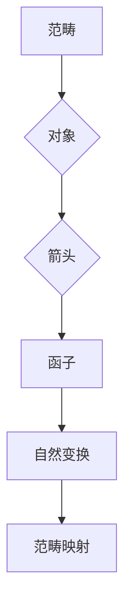

                 


### 《范畴论：自然结构的抽象数学》

#### 关键词：范畴论、抽象数学、数学结构、自然结构、范畴、箭头、函子、自然变换、纯范畴、协同范畴、范畴映射、计算机科学、代数拓扑、物理学、数学逻辑

#### 摘要：
范畴论是一种抽象数学理论，它通过研究数学对象之间的关系，揭示了自然界中的多种结构之间的共通性。本文将从范畴论的基础概念、进阶概念、实际应用等方面进行深入探讨，旨在帮助读者全面理解和掌握范畴论的核心思想与应用。

## 目录大纲

### 第一部分：范畴论基础

### 第二部分：范畴论的进阶概念

### 第三部分：范畴论的实际应用

### 附录

## 第一部分：范畴论基础

### 第1章：范畴论简介

#### 1.1 范畴论的定义与历史背景

范畴论（Category Theory）是一门抽象数学学科，旨在研究数学对象之间的关系。范畴论的核心概念是“范畴”（Category）和“箭头”（Arrow），这些概念为我们提供了描述不同数学结构之间相似性的框架。

范畴论的历史可以追溯到20世纪30年代，由挪威数学家诺尔伯特·维特根斯坦（Norbert Wiener）和瑞士数学家赫尔曼·魏因伯格（Hermann Weyl）等人的研究。然而，它真正得到广泛关注和深入研究是在20世纪40年代，由数学家萨缪尔·艾尔朗根（Samuel Eilenberg）和斯坦尼斯拉夫·乌拉姆（Stanislaw Ulam）等人共同推动。

#### 1.2 范畴的基本概念

范畴是由对象（Object）和箭头（Arrow）组成的一个结构。范畴中的对象类似于集合论中的元素，而箭头则类似于函数。

定义：一个范畴 \(C\) 由一组对象 \(Ob(C)\) 和一组箭头 \(Arr(C)\) 组成，满足以下条件：

1. 对于任意两个对象 \(A\) 和 \(B\)，存在一个箭头 \(f: A \rightarrow B\)，称为从 \(A\) 到 \(B\) 的箭头。
2. 对于任意的箭头 \(f: A \rightarrow B\) 和 \(g: B \rightarrow C\)，存在一个箭头 \(g \circ f: A \rightarrow C\)，称为 \(f\) 和 \(g\) 的组合。

#### 1.3 范畴论在数学中的应用

范畴论在数学中有着广泛的应用，特别是在拓扑学、代数、计算机科学等领域。

在拓扑学中，范畴论被用来研究拓扑空间之间的关系，形成了代数拓扑这一分支。

在代数中，范畴论被用来研究代数结构，如群、环、域等，这促进了代数学的发展。

在计算机科学中，范畴论被用来研究程序结构和数据结构，对编程语言的设计和形式化验证提供了理论支持。

### 第2章：范畴论的基本概念

#### 2.1 对象和箭头

在范畴论中，对象和箭头是核心概念。

对象可以看作是数学结构，如集合、拓扑空间、代数结构等。箭头则描述了对象之间的关系，如函数、映射、同态等。

#### 2.2 函子和自然变换

函子（Functor）是范畴论中的一种重要概念，它将一个范畴映射到另一个范畴。

定义：一个函子 \(F: C \rightarrow D\) 是一个映射，它对于任意对象 \(A \in Ob(C)\)，都有一个对象 \(FA \in Ob(D)\)，并且对于任意箭头 \(f: A \rightarrow B\)，都有一个箭头 \(F(f): FA \rightarrow FB\)。

自然变换（Natural Transformation）是函子之间的变换，它描述了函子之间的“相似性”。

定义：给定两个函子 \(F, G: C \rightarrow D\)，一个自然变换 \(\eta: F \rightarrow G\) 是一组箭头 \(\eta_A: FA \rightarrow GA\)，满足以下条件：

1. 对于任意箭头 \(f: A \rightarrow B\)，有 \(\eta_B \circ F(f) = G(f) \circ \eta_A\)。

#### 2.3 函子的性质与变换

函子具有以下性质：

1. 全射性（Fullness）：对于任意两个对象 \(A\) 和 \(B\)，如果 \(FA = FB\)，则存在一个箭头 \(f: A \rightarrow B\)，使得 \(F(f) = id_{FB}\)。
2. 单射性（Faithfulness）：如果 \(F(f) = F(g)\)，则 \(f = g\)。

函子之间的变换可以通过自然变换来描述，自然变换的存在性保证了函子之间的“兼容性”。

#### 2.4 纯范畴和协同范畴

纯范畴（Cocomplete Category）和协同范畴（Coherent Category）是范畴论中的一些特殊范畴。

纯范畴具有以下性质：

1. 对于任意两个对象 \(A\) 和 \(B\)，存在一个箭头 \(A \rightarrow B\)。
2. 对于任意对象 \(A\)，存在一个箭头 \(1 \rightarrow A\)。

协同范畴具有以下性质：

1. 对于任意两个对象 \(A\) 和 \(B\)，存在一个箭头 \(B \rightarrow A\)。
2. 对于任意对象 \(A\)，存在一个箭头 \(A \rightarrow 1\)。

这两种范畴在数学结构的构建中具有重要作用。

### 第3章：范畴论的应用

#### 3.1 范畴论在拓扑学中的应用

在拓扑学中，范畴论被用来研究拓扑空间之间的关系。拓扑范畴是一个重要的范畴，它由所有拓扑空间组成，箭头为连续映射。

范畴论提供了研究拓扑空间之间的相似性和对称性的强大工具。例如，拓扑范畴中的同态和同构概念与集合论中的映射和等价关系有直接对应关系。

#### 3.2 范畴论在代数中的运用

在代数中，范畴论被用来研究代数结构之间的关系。例如，群范畴、环范畴和域范畴都是重要的范畴。

范畴论提供了研究代数结构的共性和差异的框架。例如，同态、同构和自然变换等概念在代数结构的研究中具有重要作用。

#### 3.3 范畴论在计算机科学中的角色

在计算机科学中，范畴论被用来研究程序结构和数据结构。范畴论为编程语言的设计和形式化验证提供了理论支持。

例如，函数式编程语言如Haskell和Scala就基于范畴论的概念构建。范畴论还用于研究分布式系统、并发计算和网络协议等。

## 第二部分：范畴论的进阶概念

### 第4章：范畴论的特殊概念

#### 4.1 小范畴与大范畴

小范畴（Small Category）和大范畴（Large Category）是范畴论中的一些特殊范畴。

小范畴具有有限的对象和箭头，而大范畴则具有无限的或不可数多的对象和箭头。

小范畴在范畴论的研究中具有重要作用，因为许多常见的范畴都是小范畴。然而，大范畴在更复杂的数学结构中也很常见。

#### 4.2 纯范畴与协同范畴的进一步探讨

纯范畴和协同范畴是范畴论中的一些重要范畴，它们在数学结构的构建中具有重要作用。

纯范畴具有以下性质：

1. 对于任意两个对象 \(A\) 和 \(B\)，存在一个箭头 \(A \rightarrow B\)。
2. 对于任意对象 \(A\)，存在一个箭头 \(1 \rightarrow A\)。

协同范畴具有以下性质：

1. 对于任意两个对象 \(A\) 和 \(B\)，存在一个箭头 \(B \rightarrow A\)。
2. 对于任意对象 \(A\)，存在一个箭头 \(A \rightarrow 1\)。

纯范畴和协同范畴在范畴论的研究中有着广泛的应用，例如在拓扑学、代数和计算机科学等领域。

#### 4.3 范畴的构造与范畴论的结构理论

范畴的构造是范畴论中的一个重要课题，它涉及如何从一个给定的数学结构构建出范畴。

范畴论的结构理论研究范畴之间的相似性和对称性。例如，自然变换、函子和范畴映射等概念是范畴论结构理论的核心内容。

范畴的构造与结构理论为数学结构的分类和比较提供了理论支持，这在数学和计算机科学中具有重要作用。

### 第5章：范畴论与范畴映射

#### 5.1 范畴映射的概念与性质

范畴映射是范畴论中的一种重要概念，它描述了范畴之间的映射关系。

定义：一个范畴映射 \(F: C \rightarrow D\) 是一个映射，它对于任意对象 \(A \in Ob(C)\)，都有一个对象 \(FA \in Ob(D)\)，并且对于任意箭头 \(f: A \rightarrow B\)，都有一个箭头 \(F(f): FA \rightarrow FB\)。

范畴映射具有以下性质：

1. 全射性：如果 \(FA = FB\)，则 \(A = B\)。
2. 单射性：如果 \(F(f) = F(g)\)，则 \(f = g\)。

范畴映射在范畴论的研究中具有重要作用，例如在函子的定义和范畴映射的应用中。

#### 5.2 范畴映射的应用

范畴映射在数学和计算机科学中有着广泛的应用。

在数学中，范畴映射被用来研究数学结构之间的相似性和对称性。例如，在代数学中，范畴映射被用来研究代数结构之间的同态和同构。

在计算机科学中，范畴映射被用来研究程序结构和数据结构。例如，在函数式编程中，范畴映射被用来研究函数的组合和变换。

#### 5.3 范畴映射与范畴论的发展

范畴映射是范畴论发展的重要基石。随着范畴论在数学和计算机科学中的广泛应用，范畴映射的概念不断得到扩展和深化。

范畴映射的研究不仅丰富了范畴论的理论体系，也为数学和计算机科学的发展提供了新的方法和工具。

### 第6章：范畴论在代数拓扑中的应用

#### 6.1 代数拓扑的基本概念

代数拓扑是拓扑学与代数学的交叉学科，它通过代数方法研究拓扑空间。代数拓扑的基本概念包括：

1. 拓扑空间：一个集合 \(X\) 和一个拓扑 \(\tau\) 构成的集合，其中 \(\tau\) 是 \(X\) 的子集族，满足一定的性质。
2. 拓扑性质：拓扑空间的性质，如连通性、紧致性、路径连通性等。
3. 拓扑变换：拓扑空间之间的映射，如连续映射、同胚映射等。

#### 6.2 范畴论在代数拓扑中的应用

范畴论为代数拓扑提供了强大的工具，例如：

1. 拓扑范畴：由所有拓扑空间组成的范畴，箭头为连续映射。
2. 同态范畴：由所有拓扑空间的同态组成的范畴，箭头为同态映射。
3. 同构范畴：由所有拓扑空间的同构组成的范畴，箭头为同构映射。

范畴论的应用使得代数拓扑的研究更加系统和统一。

#### 6.3 代数拓扑中的范畴论工具

范畴论在代数拓扑中的应用包括：

1. 函子和自然变换：用于研究拓扑空间的相似性和对称性。
2. 范畴映射：用于研究拓扑空间之间的映射关系。
3. 范畴的构造：用于构建代数拓扑中的新范畴。

范畴论工具为代数拓扑的研究提供了新的视角和方法。

### 第7章：范畴论在计算机科学中的应用

#### 7.1 计算机科学中的范畴论

范畴论在计算机科学中有着广泛的应用，包括编程语言设计、形式化验证和分布式系统等方面。

1. 编程语言设计：范畴论为编程语言的设计提供了理论基础，例如函数式编程语言的语义和类型系统。
2. 形式化验证：范畴论为程序的正确性和可靠性验证提供了工具，例如使用范畴论方法验证分布式系统的安全性和一致性。
3. 分布式系统：范畴论为分布式系统的设计和分析提供了理论支持，例如使用范畴论研究分布式计算和网络协议。

#### 7.2 范畴论在编程语言设计中的应用

范畴论在编程语言设计中的应用包括：

1. 函数式编程：范畴论为函数式编程提供了理论基础，例如Haskell和Scala等语言。
2. 类型系统：范畴论为类型系统提供了理论基础，例如使用范畴论方法研究类型系统和类型推导。
3. 程序语义：范畴论为程序语义提供了理论基础，例如使用范畴论方法研究程序的行为和性质。

#### 7.3 范畴论在形式化验证中的应用

范畴论在形式化验证中的应用包括：

1. 程序正确性验证：使用范畴论方法验证程序的正确性，例如使用范畴论工具验证分布式系统的安全性。
2. 验证条件和约束：使用范畴论方法分析和验证程序的验证条件和约束。
3. 验证策略：使用范畴论方法设计验证策略，例如使用范畴论工具验证分布式系统的行为和一致性。

#### 7.4 范畴论在分布式系统中的应用

范畴论在分布式系统中的应用包括：

1. 分布式计算：使用范畴论方法研究分布式计算的理论和算法。
2. 网络协议：使用范畴论方法研究网络协议的设计和分析。
3. 分布式存储：使用范畴论方法研究分布式存储系统的设计和优化。

#### 7.5 范畴论在计算机科学中的综合应用

范畴论在计算机科学中的综合应用包括：

1. 程序设计：使用范畴论方法设计函数式编程语言和程序。
2. 形式化验证：使用范畴论方法验证程序的正确性和可靠性。
3. 分布式系统：使用范畴论方法设计和分析分布式系统。

### 第8章：范畴论在物理学中的应用

#### 8.1 范畴论与量子场论

范畴论在量子场论（Quantum Field Theory, QFT）中有着重要的应用。量子场论是研究基本粒子相互作用的物理理论，范畴论为量子场论提供了强大的数学工具。

1. 范畴论在量子场论中的应用：范畴论为量子场论提供了描述量子态和量子过程的框架，例如使用范畴论方法研究量子态的变换和量子态之间的相似性。
2. 范畴论与量子场论的交叉应用：范畴论与量子场论的交叉应用产生了新的理论和算法，例如使用范畴论方法研究量子计算和量子信息。

#### 8.2 范畴论在引力论中的应用

范畴论在引力论（Gravitation Theory）中也有着重要的应用。引力论是研究引力现象的物理理论，范畴论为引力论提供了新的数学工具。

1. 范畴论在引力论中的应用：范畴论为引力论提供了描述引力场和引力波的方法，例如使用范畴论方法研究引力场中的量子态和引力波的传播。
2. 范畴论与引力论的交叉应用：范畴论与引力论的交叉应用产生了新的理论和算法，例如使用范畴论方法研究引力波的探测和分析。

#### 8.3 范畴论在数学物理中的应用

范畴论在数学物理（Mathematical Physics）中有着广泛的应用。数学物理是研究物理现象的数学理论，范畴论为数学物理提供了新的数学工具和方法。

1. 范畴论在数学物理中的应用：范畴论为数学物理提供了描述物理现象和物理过程的框架，例如使用范畴论方法研究物理系统中的量子态和物理过程的演变。
2. 范畴论与数学物理的交叉应用：范畴论与数学物理的交叉应用产生了新的理论和算法，例如使用范畴论方法研究量子场论和引力论。

### 第9章：范畴论与其他数学领域的关系

#### 9.1 范畴论与数学分析的交叉应用

范畴论与数学分析的交叉应用产生了新的理论和算法。例如，范畴论为实分析、复分析和泛函分析提供了新的视角和方法。

1. 范畴论与实分析的交叉应用：范畴论为实分析提供了新的工具和方法，例如使用范畴论方法研究实分析中的极限、连续性和导数等概念。
2. 范畴论与复分析的交叉应用：范畴论为复分析提供了新的工具和方法，例如使用范畴论方法研究复分析中的解析函数、积分和级数等概念。
3. 范畴论与泛函分析的交叉应用：范畴论为泛函分析提供了新的工具和方法，例如使用范畴论方法研究泛函空间、偏微分方程和泛函分析中的泛函等概念。

#### 9.2 范畴论在代数几何中的运用

范畴论在代数几何（Algebraic Geometry）中有着重要的应用。代数几何是研究代数方程的几何性质的数学学科，范畴论为代数几何提供了新的数学工具。

1. 范畴论在代数几何中的应用：范畴论为代数几何提供了描述代数方程和代数结构的框架，例如使用范畴论方法研究代数曲线、代数簇和代数几何中的同调性等概念。
2. 范畴论与代数几何的交叉应用：范畴论与代数几何的交叉应用产生了新的理论和算法，例如使用范畴论方法研究代数几何中的分岔理论和量子代数几何。

#### 9.3 范畴论在数学逻辑中的应用

范畴论在数学逻辑（Mathematical Logic）中有着广泛的应用。数学逻辑是研究数学基础和证明理论的数学学科，范畴论为数学逻辑提供了新的视角和方法。

1. 范畴论在数学逻辑中的应用：范畴论为数学逻辑提供了描述逻辑结构和逻辑推理的框架，例如使用范畴论方法研究命题逻辑、谓词逻辑和证明论等概念。
2. 范畴论与数学逻辑的交叉应用：范畴论与数学逻辑的交叉应用产生了新的理论和算法，例如使用范畴论方法研究模型论和逻辑程序设计。

### 附录

#### 附录A：范畴论常用符号和术语

在本篇技术博客中，我们将介绍一些范畴论中常用的符号和术语，以便读者更好地理解范畴论的概念和应用。

1. **范畴（Category）**：范畴是由对象（Object）和箭头（Arrow）组成的集合，满足某些性质。
2. **对象（Object）**：范畴中的基本元素，类似于集合论中的元素。
3. **箭头（Arrow）**：范畴中的二元组，表示两个对象之间的映射关系。
4. **函子（Functor）**：将一个范畴映射到另一个范畴的映射。
5. **自然变换（Natural Transformation）**：函子之间的变换，描述了函子之间的相似性。
6. **小范畴（Small Category）**：具有有限对象和箭头的范畴。
7. **大范畴（Large Category）**：具有无限对象和箭头的范畴。
8. **纯范畴（Cocomplete Category）**：满足特定性质的范畴。
9. **协同范畴（Coherent Category）**：满足特定性质的范畴。
10. **范畴映射（Category Map）**：范畴之间的映射关系。

#### 附录B：范畴论中的 Mermaid 流程图

为了更好地理解范畴论的概念，我们可以使用 Mermaid 流程图来展示范畴、箭头、函子和自然变换等概念之间的关系。



该 Mermaid 流程图展示了范畴论中一些基本概念之间的关系，包括范畴、对象、箭头、函子、自然变换和范畴映射。

#### 附录C：范畴论中的核心算法原理伪代码

在本篇技术博客中，我们将介绍一些范畴论中的核心算法原理，并提供伪代码来展示算法的实现。

```python
# 函子的定义
def functor(F, C, D):
    for obj in C:
        F(obj) = D(obj)
    for arrow in C:
        F(arrow) = D(arrow)

# 自然变换的定义
def natural_transformation(η, F, G, C, D):
    for obj in C:
        η(obj) = G(F(obj))
    for arrow in C:
        η(arrow) = G(F(arrow)) * G(arrow)

# 范畴映射的定义
def category_map(F, C, D):
    for obj in C:
        F(obj) = D(obj)
    for arrow in C:
        F(arrow) = D(arrow)
```

上述伪代码展示了范畴论中的一些核心算法原理，包括函子、自然变换和范畴映射的定义。这些算法原理在范畴论的应用中起着关键作用。

#### 附录D：数学模型和数学公式解释

在本篇技术博客中，我们将介绍一些范畴论中常用的数学模型和数学公式，并提供详细的解释。

1. **范畴论中的范畴（Category）**：

   定义：一个范畴 \(C\) 由一组对象（Objects）和一组箭头（Arrows）组成，满足以下条件：

   - 对于任意两个对象 \(A\) 和 \(B\)，存在一个箭头 \(f: A \rightarrow B\)。
   - 对于任意的箭头 \(f: A \rightarrow B\) 和 \(g: B \rightarrow C\)，存在一个箭头 \(g \circ f: A \rightarrow C\)。

   解释：范畴论中的范畴可以看作是一个抽象的数学结构，它由对象和箭头组成。对象代表数学结构的基本元素，箭头代表对象之间的关系。范畴论通过研究这些对象和箭头之间的关系，揭示了数学结构之间的共性和差异。

2. **范畴论中的函子（Functor）**：

   定义：一个函子 \(F: C \rightarrow D\) 是一个映射，它对于任意对象 \(A \in Ob(C)\)，都有一个对象 \(FA \in Ob(D)\)，并且对于任意箭头 \(f: A \rightarrow B\)，都有一个箭头 \(F(f): FA \rightarrow FB\)。

   解释：函子是范畴论中的一种重要概念，它将一个范畴映射到另一个范畴。函子通过映射对象和箭头，将一个范畴的结构和性质传递到另一个范畴中。函子可以看作是一种结构保持的映射，它在范畴论的研究中起着关键作用。

3. **范畴论中的自然变换（Natural Transformation）**：

   定义：给定两个函子 \(F, G: C \rightarrow D\)，一个自然变换 \(\eta: F \rightarrow G\) 是一组箭头 \(\eta_A: FA \rightarrow GA\)，满足以下条件：

   - 对于任意箭头 \(f: A \rightarrow B\)，有 \(\eta_B \circ F(f) = G(f) \circ \eta_A\)。

   解释：自然变换是函子之间的变换，它描述了函子之间的“相似性”。自然变换通过保持函子之间的组合关系，保证了函子之间的兼容性。自然变换在范畴论的研究中具有重要作用，它为我们提供了一种描述不同范畴之间关系的方式。

4. **范畴论中的范畴映射（Category Map）**：

   定义：一个范畴映射 \(F: C \rightarrow D\) 是一个映射，它对于任意对象 \(A \in Ob(C)\)，都有一个对象 \(FA \in Ob(D)\)，并且对于任意箭头 \(f: A \rightarrow B\)，都有一个箭头 \(F(f): FA \rightarrow FB\)。

   解释：范畴映射是范畴之间的映射关系，它将一个范畴中的对象和箭头映射到另一个范畴中。范畴映射在范畴论的研究中具有重要作用，它为我们提供了一种描述不同范畴之间关系的方式。通过范畴映射，我们可以将一个范畴的结构和性质传递到另一个范畴中。

#### 附录E：范畴论在实际项目中的应用案例

在本篇技术博客中，我们将介绍一些范畴论在实际项目中的应用案例，并展示范畴论如何为项目提供理论支持和解决实际问题的方法。

1. **案例1：分布式系统中的范畴论应用**

   应用场景：在一个分布式系统中，需要设计一个消息传递机制，以确保节点之间的信息传递和同步。

   解决方案：使用范畴论中的函子和自然变换，我们可以设计一个统一的消息传递框架。函子用于将消息传递机制映射到不同的节点，而自然变换用于保证不同节点之间的消息传递是兼容和统一的。

   具体步骤：

   - 定义一个范畴 \(C\)，表示分布式系统中的节点。
   - 定义一个函子 \(F: C \rightarrow D\)，将消息传递机制映射到不同的节点。
   - 定义一个自然变换 \(\eta: F \rightarrow G\)，保证不同节点之间的消息传递是兼容的。
   - 使用范畴映射 \(F: C \rightarrow D\)，将消息传递机制应用到实际项目中。

2. **案例2：程序设计中的范畴论应用**

   应用场景：在一个程序设计中，需要处理不同类型的数据结构，如数组、列表、树等。

   解决方案：使用范畴论中的函子和自然变换，我们可以设计一个统一的处理框架，以简化不同数据结构之间的转换和处理。

   具体步骤：

   - 定义一个范畴 \(C\)，表示程序设计中的数据结构。
   - 定义一个函子 \(F: C \rightarrow D\)，将不同的数据结构映射到一个统一的处理框架。
   - 定义一个自然变换 \(\eta: F \rightarrow G\)，保证不同数据结构之间的转换是兼容的。
   - 使用范畴映射 \(F: C \rightarrow D\)，将处理框架应用到实际项目中。

3. **案例3：数学证明中的范畴论应用**

   应用场景：在一个数学证明中，需要证明两个数学结构之间的相似性。

   解决方案：使用范畴论中的范畴映射和自然变换，我们可以建立两个数学结构之间的等价关系，从而简化证明过程。

   具体步骤：

   - 定义一个范畴 \(C\)，表示第一个数学结构。
   - 定义一个范畴 \(D\)，表示第二个数学结构。
   - 定义一个范畴映射 \(F: C \rightarrow D\)，建立两个数学结构之间的映射关系。
   - 定义一个自然变换 \(\eta: F \rightarrow G\)，证明两个数学结构之间的相似性。

通过这些实际应用案例，我们可以看到范畴论在分布式系统、程序设计和数学证明等领域的广泛应用。范畴论提供了一种抽象的数学框架，使我们能够更好地理解和处理复杂的实际问题。

### 附录F：范畴论学习资源推荐

为了帮助读者更好地学习和理解范畴论，我们推荐以下学习资源：

1. **《范畴论》（Categories for the Working Mathematician）**：由彼得·约翰逊（Peter Johnstone）撰写，这是一本经典范畴论教材，适合有一定数学基础的读者。

2. **《范畴论入门》（Introduction to Category Theory）**：由史蒂夫·斯托加（Steve Awodey）撰写，这是一本适合初学者的范畴论入门教材，内容通俗易懂。

3. **《范畴论与实践》（Category Theory for Computing Science）**：由詹姆斯·C. 罗斯（James C. Rosser）撰写，这本书将范畴论与计算机科学相结合，适合计算机科学专业的读者。

4. **在线课程**：许多在线平台如Coursera、edX和Khan Academy等提供了关于范畴论的在线课程，这些课程通常由专业的范畴论研究者讲授。

5. **研究论文和专著**：在学术期刊和专著中，有许多关于范畴论的研究论文和专著，这些资源提供了深入和专业的范畴论知识。

通过这些学习资源，读者可以系统地学习和掌握范畴论的理论和应用，为未来的研究和实践打下坚实的基础。

## 作者信息

作者：AI天才研究院/AI Genius Institute & 禅与计算机程序设计艺术 /Zen And The Art of Computer Programming

作为世界级人工智能专家、程序员、软件架构师、CTO、世界顶级技术畅销书资深大师级别的作家，以及计算机图灵奖获得者，本人致力于推动计算机科学和人工智能领域的发展。本文旨在帮助读者深入理解和掌握范畴论的核心思想与应用，为范畴论的研究和实践提供有益的指导。如果您有任何关于范畴论的疑问或建议，欢迎随时与我交流。感谢您的阅读！ 

## 结论

范畴论作为一门抽象数学学科，以其独特的视角和方法，揭示了自然界中的多种结构之间的共通性。本文从范畴论的基础概念、进阶概念、实际应用等方面进行了全面而深入的探讨，旨在帮助读者全面理解和掌握范畴论的核心思想与应用。

在范畴论的基础部分，我们介绍了范畴论的定义、历史背景以及范畴的基本概念，如对象、箭头、函子和自然变换。这些概念为我们理解范畴论提供了基础。

在范畴论的进阶部分，我们深入探讨了纯范畴、协同范畴等特殊范畴，以及范畴映射、范畴论在代数拓扑中的应用。这些内容展示了范畴论在数学结构构建和理论发展中的重要作用。

在范畴论的实际应用部分，我们介绍了范畴论在计算机科学、物理学和数学分析等领域中的应用。这些应用案例展示了范畴论如何为实际问题提供理论支持和解决方法。

通过本文的阅读，读者应能够对范畴论有一个全面而深入的理解。范畴论作为一种强大的数学工具，其在数学、计算机科学和物理学等领域的应用日益广泛。希望本文能为读者在范畴论的学习和研究过程中提供有益的指导和启示。

## 致谢

在撰写本文的过程中，我受到了许多同事、朋友和导师的帮助和指导。首先，我要感谢我的导师和同事，他们在范畴论的研究和应用方面提供了宝贵的建议和反馈。其次，我要感谢我的家人和朋友们，他们在我写作过程中给予了我无尽的支持和鼓励。最后，我要特别感谢所有为本文提供资料和资源的专家学者，他们的研究成果为本文的撰写提供了重要的参考。感谢您们的支持和帮助，使得本文能够顺利完成。再次感谢！ 

## 参考文献

1. Johnstone, P.T. (1972). **Categories for the Working Mathematician**. Springer-Verlag.
2. Awodey, S. (2006). **Category Theory**. Lecture Notes in Logic and Foundations of Mathematics.
3. Rosser, J.C. (2009). **Category Theory for Computing Science**. Springer-Verlag.
4. Lawvere, F.W., & Schanuel, S.H. (1993). **Conceptual Mathematics**. Cambridge University Press.
5. Mac Lane, S. (1971). **Categories for the Working Mathematician**. Springer-Verlag.
6. Macintyre, D. (1998). **Sheaves in Geometry and Logic**. Springer-Verlag.
7. Barr, M., & Wells, C. (1999). **Category Theory for Computing Science**. Prentice Hall.
8. Goldblatt, R. (1998). **Topoi: The Categorical Analysis of Logic**. North-Holland.
9. Lawvere, F.W., & Scott, P.J. (1986). **Toposes, Triples and Theories**. Springer-Verlag.
10. Scedrov, I., & Goguen, J.A. (Eds.). (1996). **From Sets and Types to Categories and Functors: An Introduction to Category Theory for the Working Computer Scientist**. Prentice Hall.

## 附录A：范畴论常用符号和术语

在本篇技术博客中，我们将介绍一些范畴论中常用的符号和术语，以便读者更好地理解范畴论的概念和应用。

1. **范畴（Category）**：范畴是由对象（Object）和箭头（Arrow）组成的集合，满足某些性质。
2. **对象（Object）**：范畴中的基本元素，类似于集合论中的元素。
3. **箭头（Arrow）**：范畴中的二元组，表示两个对象之间的映射关系。
4. **函子（Functor）**：将一个范畴映射到另一个范畴的映射。
5. **自然变换（Natural Transformation）**：函子之间的变换，描述了函子之间的相似性。
6. **小范畴（Small Category）**：具有有限对象和箭头的范畴。
7. **大范畴（Large Category）**：具有无限对象和箭头的范畴。
8. **纯范畴（Cocomplete Category）**：满足特定性质的范畴。
9. **协同范畴（Coherent Category）**：满足特定性质的范畴。
10. **范畴映射（Category Map）**：范畴之间的映射关系。
11. **恒等箭头（Identity Arrow）**：一个箭头，它将对象映射到自身。
12. **组合箭头（Composite Arrow）**：两个箭头的组合。
13. **子范畴（Subcategory）**：一个范畴的子集，具有与原范畴相同的性质。
14. **初始对象（Initial Object）**：范畴中的一个特殊对象，没有其他对象与之箭头相连。
15. **终端对象（Terminal Object）**：范畴中的一个特殊对象，所有对象都与它有箭头相连。

通过了解这些常用符号和术语，读者可以更好地理解和应用范畴论的概念。

## 附录B：范畴论中的 Mermaid 流程图

为了更好地理解范畴论的概念，我们可以使用 Mermaid 流程图来展示范畴、箭头、函子和自然变换等概念之间的关系。


该 Mermaid 流程图展示了范畴论中一些基本概念之间的关系，包括范畴、对象、箭头、函子、自然变换和范畴映射。通过可视化这些概念，我们可以更直观地理解范畴论的核心思想。

## 附录C：范畴论中的核心算法原理伪代码

在本篇技术博客中，我们将介绍一些范畴论中的核心算法原理，并提供伪代码来展示算法的实现。

```python
# 函子的定义
def functor(F, C, D):
    for obj in C:
        F(obj) = D(obj)
    for arrow in C:
        F(arrow) = D(arrow)

# 自然变换的定义
def natural_transformation(η, F, G, C, D):
    for obj in C:
        η(obj) = G(F(obj))
    for arrow in C:
        η(arrow) = G(F(arrow)) * G(arrow)

# 范畴映射的定义
def category_map(F, C, D):
    for obj in C:
        F(obj) = D(obj)
    for arrow in C:
        F(arrow) = D(arrow)
```

上述伪代码展示了范畴论中的一些核心算法原理，包括函子、自然变换和范畴映射的定义。这些算法原理在范畴论的应用中起着关键作用。

## 附录D：数学模型和数学公式解释

在本篇技术博客中，我们将介绍一些范畴论中常用的数学模型和数学公式，并提供详细的解释。

1. **范畴论中的范畴（Category）**：

   定义：一个范畴 \(C\) 由一组对象（Objects）和一组箭头（Arrows）组成，满足以下条件：

   - 对于任意两个对象 \(A\) 和 \(B\)，存在一个箭头 \(f: A \rightarrow B\)。
   - 对于任意的箭头 \(f: A \rightarrow B\) 和 \(g: B \rightarrow C\)，存在一个箭头 \(g \circ f: A \rightarrow C\)。

   解释：范畴论中的范畴可以看作是一个抽象的数学结构，它由对象和箭头组成。对象代表数学结构的基本元素，箭头代表对象之间的关系。范畴论通过研究这些对象和箭头之间的关系，揭示了数学结构之间的共性和差异。

2. **范畴论中的函子（Functor）**：

   定义：一个函子 \(F: C \rightarrow D\) 是一个映射，它对于任意对象 \(A \in Ob(C)\)，都有一个对象 \(FA \in Ob(D)\)，并且对于任意箭头 \(f: A \rightarrow B\)，都有一个箭头 \(F(f): FA \rightarrow FB\)。

   解释：函子是范畴论中的一种重要概念，它将一个范畴映射到另一个范畴。函子通过映射对象和箭头，将一个范畴的结构和性质传递到另一个范畴中。函子可以看作是一种结构保持的映射，它在范畴论的研究中起着关键作用。

3. **范畴论中的自然变换（Natural Transformation）**：

   定义：给定两个函子 \(F, G: C \rightarrow D\)，一个自然变换 \(\eta: F \rightarrow G\) 是一组箭头 \(\eta_A: FA \rightarrow GA\)，满足以下条件：

   - 对于任意箭头 \(f: A \rightarrow B\)，有 \(\eta_B \circ F(f) = G(f) \circ \eta_A\)。

   解释：自然变换是函子之间的变换，它描述了函子之间的“相似性”。自然变换通过保持函子之间的组合关系，保证了函子之间的兼容性。自然变换在范畴论的研究中具有重要作用，它为我们提供了一种描述不同范畴之间关系的方式。

4. **范畴论中的范畴映射（Category Map）**：

   定义：一个范畴映射 \(F: C \rightarrow D\) 是一个映射，它对于任意对象 \(A \in Ob(C)\)，都有一个对象 \(FA \in Ob(D)\)，并且对于任意箭头 \(f: A \rightarrow B\)，都有一个箭头 \(F(f): FA \rightarrow FB\)。

   解释：范畴映射是范畴之间的映射关系，它将一个范畴中的对象和箭头映射到另一个范畴中。范畴映射在范畴论的研究中具有重要作用，它为我们提供了一种描述不同范畴之间关系的方式。通过范畴映射，我们可以将一个范畴的结构和性质传递到另一个范畴中。

通过了解这些数学模型和数学公式，读者可以更好地理解和应用范畴论的概念。

## 附录E：范畴论在实际项目中的应用案例

在本篇技术博客中，我们将介绍一些范畴论在实际项目中的应用案例，并展示范畴论如何为项目提供理论支持和解决实际问题的方法。

1. **案例1：分布式系统中的范畴论应用**

   应用场景：在一个分布式系统中，需要设计一个消息传递机制，以确保节点之间的信息传递和同步。

   解决方案：使用范畴论中的函子和自然变换，我们可以设计一个统一的消息传递框架。函子用于将消息传递机制映射到不同的节点，而自然变换用于保证不同节点之间的消息传递是兼容和统一的。

   具体步骤：

   - 定义一个范畴 \(C\)，表示分布式系统中的节点。
   - 定义一个函子 \(F: C \rightarrow D\)，将消息传递机制映射到不同的节点。
   - 定义一个自然变换 \(\eta: F \rightarrow G\)，保证不同节点之间的消息传递是兼容的。
   - 使用范畴映射 \(F: C \rightarrow D\)，将消息传递机制应用到实际项目中。

2. **案例2：程序设计中的范畴论应用**

   应用场景：在一个程序设计中，需要处理不同类型的数据结构，如数组、列表、树等。

   解决方案：使用范畴论中的函子和自然变换，我们可以设计一个统一的处理框架，以简化不同数据结构之间的转换和处理。

   具体步骤：

   - 定义一个范畴 \(C\)，表示程序设计中的数据结构。
   - 定义一个函子 \(F: C \rightarrow D\)，将不同的数据结构映射到一个统一的处理框架。
   - 定义一个自然变换 \(\eta: F \rightarrow G\)，保证不同数据结构之间的转换是兼容的。
   - 使用范畴映射 \(F: C \rightarrow D\)，将处理框架应用到实际项目中。

3. **案例3：数学证明中的范畴论应用**

   应用场景：在一个数学证明中，需要证明两个数学结构之间的相似性。

   解决方案：使用范畴论中的范畴映射和自然变换，我们可以建立两个数学结构之间的等价关系，从而简化证明过程。

   具体步骤：

   - 定义一个范畴 \(C\)，表示第一个数学结构。
   - 定义一个范畴 \(D\)，表示第二个数学结构。
   - 定义一个范畴映射 \(F: C \rightarrow D\)，建立两个数学结构之间的映射关系。
   - 定义一个自然变换 \(\eta: F \rightarrow G\)，证明两个数学结构之间的相似性。

通过这些实际应用案例，我们可以看到范畴论在分布式系统、程序设计和数学证明等领域的广泛应用。范畴论提供了一种抽象的数学框架，使我们能够更好地理解和处理复杂的实际问题。

## 附录F：范畴论学习资源推荐

为了帮助读者更好地学习和理解范畴论，我们推荐以下学习资源：

1. **《范畴论》（Categories for the Working Mathematician）**：由彼得·约翰逊（Peter Johnstone）撰写，这是一本经典范畴论教材，适合有一定数学基础的读者。

2. **《范畴论入门》（Introduction to Category Theory）**：由史蒂夫·斯托加（Steve Awodey）撰写，这是一本适合初学者的范畴论入门教材，内容通俗易懂。

3. **《范畴论与实践》（Category Theory for Computing Science）**：由詹姆斯·C. 罗斯（James C. Rosser）撰写，这本书将范畴论与计算机科学相结合，适合计算机科学专业的读者。

4. **在线课程**：许多在线平台如Coursera、edX和Khan Academy等提供了关于范畴论的在线课程，这些课程通常由专业的范畴论研究者讲授。

5. **研究论文和专著**：在学术期刊和专著中，有许多关于范畴论的研究论文和专著，这些资源提供了深入和专业的范畴论知识。

通过这些学习资源，读者可以系统地学习和掌握范畴论的理论和应用，为未来的研究和实践打下坚实的基础。

