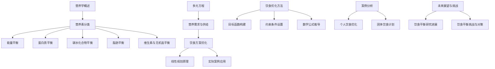

                 


## 文章标题：营养学的多元方程：饮食平衡的数学优化

### 关键词：

- **营养学**
- **饮食平衡**
- **数学优化**
- **线性规划**
- **健康饮食**

### 摘要：

本文将探讨营养学中饮食平衡的数学优化问题。通过建立营养需求的多元方程，应用线性规划原理，优化个人和团体的饮食计划，以达到最佳的健康效果。文章涵盖了营养学的基本概念、多元方程的概念与应用，以及线性规划在饮食优化中的应用。同时，通过实际案例分析和数学公式详解，提供了实用的饮食平衡优化方法。

## 《营养学的多元方程：饮食平衡的数学优化》目录大纲

### 第一部分：营养学基础与饮食平衡

#### 第1章：营养学概述

##### 1.1 营养学的基本概念
- **营养的定义与作用**
- **营养学的研究领域**

##### 1.2 营养素的分类
- **碳水化合物**
- **蛋白质**
- **脂肪**
- **维生素**
- **无机盐**

##### 1.3 饮食平衡的重要性
- **饮食模式与健康**
- **营养不足与过剩的影响**

#### 第2章：饮食平衡的基本原则

##### 2.1 能量平衡
- **能量摄入与消耗的平衡**
- **BMI与体脂肪百分比**

##### 2.2 蛋白质平衡
- **蛋白质的需求与来源**
- **蛋白质摄入的平衡**

##### 2.3 碳水化合物平衡
- **碳水化合物的类型与作用**
- **碳水化合物的摄入平衡**

##### 2.4 脂肪平衡
- **脂肪的类型与作用**
- **脂肪摄入的平衡**

##### 2.5 维生素与无机盐的平衡
- **维生素的需求与来源**
- **无机盐的需求与来源**

### 第二部分：数学模型与饮食优化

#### 第3章：营养学的多元方程

##### 3.1 多元方程的概念
- **方程的建立与解法**
- **线性规划的基本概念**

##### 3.2 营养需求与供给的方程
- **能量需求的计算**
- **营养素的供给与需求平衡**

##### 3.3 饮食方案的优化
- **多元方程在饮食方案中的应用**
- **饮食平衡的数学模型**

#### 第4章：线性规划在饮食优化中的应用

##### 4.1 线性规划原理
- **线性规划的基本模型**
- **线性规划的求解方法**

##### 4.2 实际案例应用
- **个人饮食方案的优化**
- **团体饮食计划的优化**

#### 第5章：饮食平衡的数学优化方法

##### 5.1 目标函数的构建
- **最小化成本函数**
- **最优化营养素摄入**

##### 5.2 约束条件的设置
- **营养素摄入的上限与下限**
- **饮食多样性**

##### 5.3 数学公式的推导与解释
- **线性规划的求解公式**
- **营养平衡的数学公式**

#### 第6章：饮食平衡的案例分析

##### 6.1 案例一：个人饮食优化
- **实际案例与数据收集**
- **优化方案的设计与实现**

##### 6.2 案例二：团体饮食计划
- **实际案例与数据收集**
- **饮食计划的优化方案**

#### 第7章：未来展望与挑战

##### 7.1 饮食平衡研究的最新进展
- **现代营养学的研究趋势**
- **人工智能在饮食平衡中的应用**

##### 7.2 饮食平衡的挑战与对策
- **饮食行为的影响因素**
- **应对策略与建议**

### 附录：数学模型与公式详解

##### 附录 A：营养平衡的线性规划模型
- **公式推导与解释**

##### 附录 B：饮食优化的伪代码实现
- **伪代码展示与解释**

##### 附录 C：数学公式与符号说明
- **公式与符号的详细解释**

### Mermaid 流程图



### 伪代码实现

```python
# 营养平衡线性规划模型伪代码

# 定义目标函数
minimize 总成本

# 定义约束条件
约束1：能量摄入量 = 能量消耗量
约束2：蛋白质摄入量在适宜范围内
约束3：碳水化合物摄入量在适宜范围内
约束4：脂肪摄入量在适宜范围内
约束5：维生素摄入量在适宜范围内
约束6：无机盐摄入量在适宜范围内

# 求解线性规划模型
solve：线性规划模型
```

### 数学公式详解

#### 能量需求计算

$$
E = BMR \times activity\_factor
$$

其中，$E$ 表示能量需求，$BMR$ 表示基础代谢率，$activity\_factor$ 表示活动系数。

#### 线性规划求解公式

$$
\min c^T x \\
\text{subject to} \\
Ax \leq b \\
x \geq 0
$$

其中，$c$ 是系数向量，$x$ 是变量向量，$A$ 和 $b$ 分别是约束条件的系数矩阵和常数向量。

## 第一部分：营养学基础与饮食平衡

### 第1章：营养学概述

#### 1.1 营养学的基本概念

营养学是一门研究食物、营养素和人体健康之间关系的科学。它的主要目标是确保人体获得足够的营养素，以维持正常的生理功能和健康状态。营养学的基本概念包括：

- **营养的定义与作用**：营养是指通过食物摄入的化学物质，它们对人体维持生命活动、生长发育、修复组织和预防疾病具有重要意义。
- **营养学的研究领域**：营养学的研究领域广泛，包括营养素的研究、饮食模式与健康的关系、营养不足与过剩的影响、营养咨询与治疗等。

#### 1.2 营养素的分类

营养素是人体必需的化学物质，它们分为以下几类：

- **碳水化合物**：是人体主要的能量来源，包括糖类、淀粉和纤维。
- **蛋白质**：是人体组织和细胞的基本组成部分，参与身体的生长、修复和免疫功能。
- **脂肪**：是重要的能量来源，同时也参与细胞膜的构成和激素的合成。
- **维生素**：是一类有机化合物，人体无法自行合成，必须通过食物摄入，对身体的正常生理功能至关重要。
- **无机盐**：包括钙、磷、钠、钾、镁等，参与骨骼的构成、神经传导、肌肉收缩等生理过程。

#### 1.3 饮食平衡的重要性

饮食平衡是指通过合理的膳食结构，确保人体摄入的各种营养素达到适宜的比例和量，以满足人体的生理需要。饮食平衡的重要性体现在以下几个方面：

- **饮食模式与健康**：不同的饮食模式对健康有不同的影响。均衡的饮食模式有助于降低慢性疾病的风险，提高生活质量。
- **营养不足与过剩的影响**：营养不足会导致生长发育迟缓、免疫力下降、代谢紊乱等健康问题。营养过剩则可能导致肥胖、糖尿病、高血压等慢性疾病。

### 第2章：饮食平衡的基本原则

#### 2.1 能量平衡

能量平衡是指人体摄入的能量与消耗的能量之间保持平衡。能量摄入主要来自食物中的碳水化合物、脂肪和蛋白质，而能量消耗则包括基础代谢率、身体活动以及消化食物所需的能量。

- **能量摄入与消耗的平衡**：维持能量平衡是保持健康体重的基础。当摄入的能量等于消耗的能量时，体重保持不变；当摄入的能量多于消耗的能量时，体重增加；当摄入的能量少于消耗的能量时，体重减少。
- **BMI与体脂肪百分比**：BMI（身体质量指数）和体脂肪百分比是评估能量平衡和健康体重的常用指标。BMI过高或过低都可能表明能量平衡失衡，而体脂肪百分比则更直接地反映了身体脂肪的含量。

#### 2.2 蛋白质平衡

蛋白质是人体必需的营养素之一，对维持正常的生理功能至关重要。蛋白质平衡指的是人体摄入的蛋白质量与其需求量之间的平衡。

- **蛋白质的需求与来源**：蛋白质的需求量取决于年龄、性别、体重和活动水平。动物性食物如肉类、鱼类、蛋类和乳制品是优质蛋白质的来源，而植物性食物如豆类、坚果和种子也含有丰富的蛋白质。
- **蛋白质摄入的平衡**：蛋白质摄入应适量，既不过多也不不足。过多摄入蛋白质会增加肾脏负担，而不足则可能导致肌肉流失和免疫力下降。

#### 2.3 碳水化合物平衡

碳水化合物是人体主要的能量来源，对维持正常的生理功能和运动能力至关重要。

- **碳水化合物的类型与作用**：碳水化合物分为简单碳水化合物和复杂碳水化合物。简单碳水化合物如糖类迅速提供能量，而复杂碳水化合物如淀粉和纤维则提供更持久的能量。
- **碳水化合物的摄入平衡**：碳水化合物的摄入量应根据个体的能量需求而定。过量摄入简单碳水化合物可能导致血糖波动和肥胖，而不足则可能导致能量不足和疲劳。

#### 2.4 脂肪平衡

脂肪是人体必需的营养素之一，参与细胞膜的构成、激素的合成和能量的储存。

- **脂肪的类型与作用**：脂肪分为饱和脂肪、单不饱和脂肪和多不饱和脂肪。饱和脂肪过多摄入可能导致心血管疾病，而不饱和脂肪对健康有益。
- **脂肪摄入的平衡**：脂肪的摄入量应适量，占总能量摄入的比例应保持在25%-35%之间。过量摄入脂肪会导致肥胖和慢性疾病，而不足则可能影响身体健康。

#### 2.5 维生素与无机盐的平衡

维生素和无机盐是维持人体正常生理功能的重要营养素。

- **维生素的需求与来源**：维生素分为水溶性维生素和脂溶性维生素，它们在人体内无法合成，必须通过食物摄入。水溶性维生素如维生素B群和维生素C主要来自水果、蔬菜和全谷类食物，而脂溶性维生素如维生素A、D、E和K主要来自动物性食物和坚果。
- **无机盐的需求与来源**：无机盐包括钙、磷、钠、钾、镁等，它们参与骨骼的构成、神经传导、肌肉收缩等生理过程。这些无机盐主要来自奶制品、鱼类、肉类、蔬菜和水果。

## 第二部分：数学模型与饮食优化

### 第3章：营养学的多元方程

#### 3.1 多元方程的概念

多元方程是指包含多个变量和多个方程的数学模型。在营养学中，多元方程用于描述人体对不同营养素的需求和供给之间的关系。

- **方程的建立与解法**：多元方程的建立基于对人体生理需求的了解和食物中营养素含量的数据。解法通常采用线性规划、非线性规划或整数规划等方法。
- **线性规划的基本概念**：线性规划是解决多元方程的一种数学方法，它通过建立目标函数和约束条件，求解最优解。目标函数通常是最小化成本或最大化收益，约束条件则是变量限制和资源限制。

#### 3.2 营养需求与供给的方程

营养需求与供给的方程描述了人体对营养素的需求和食物中营养素的供给之间的关系。

- **能量需求的计算**：能量需求取决于基础代谢率（BMR）和活动水平。BMR取决于年龄、性别、体重和身高，而活动水平则取决于日常活动和运动强度。
- **营养素的供给与需求平衡**：营养素的供给与需求平衡是指通过合理的膳食结构，确保人体摄入的营养素满足其需求。供给与需求平衡的计算通常基于营养素的摄入量和推荐摄入量。

#### 3.3 饮食方案的优化

饮食方案的优化是指通过数学模型和算法，制定出最符合个体需求和营养需求的饮食方案。

- **多元方程在饮食方案中的应用**：多元方程在饮食方案中的应用包括计算营养素的需求量、确定食物的摄入量和平衡膳食结构。
- **饮食平衡的数学模型**：饮食平衡的数学模型通过建立目标函数和约束条件，求解出最优的饮食方案。目标函数通常是最小化成本或最大化收益，约束条件则包括营养素的需求和供给平衡、食物的限制等。

### 第4章：线性规划在饮食优化中的应用

#### 4.1 线性规划原理

线性规划是解决多元方程的一种数学方法，它通过建立目标函数和约束条件，求解最优解。

- **线性规划的基本模型**：线性规划的基本模型包括目标函数、决策变量和约束条件。目标函数通常是最小化成本或最大化收益，决策变量是决策者可以控制的变量，约束条件则是变量限制和资源限制。
- **线性规划的求解方法**：线性规划的求解方法包括单纯形法、对偶法、内点法等。这些方法通过迭代计算，逐步逼近最优解。

#### 4.2 实际案例应用

实际案例应用展示了线性规划在饮食优化中的应用。

- **个人饮食方案的优化**：通过建立个人营养需求与供给的方程，使用线性规划求解最优的饮食方案，包括食物的摄入量和营养素的摄入量。
- **团体饮食计划的优化**：通过建立团体营养需求与供给的方程，使用线性规划求解最优的团体饮食计划，确保团体成员的营养需求得到满足。

### 第5章：饮食平衡的数学优化方法

#### 5.1 目标函数的构建

目标函数是饮食优化模型的核心，用于描述优化目标。

- **最小化成本函数**：在饮食优化中，成本函数通常是最小化的目标。成本函数包括食物的成本、烹饪成本和购买成本等。
- **最优化营养素摄入**：营养素摄入的最优化目标是通过调整食物的摄入量，确保营养素的摄入达到推荐摄入量，同时不超过安全上限。

#### 5.2 约束条件的设置

约束条件是饮食优化模型的重要组成部分，用于限制决策变量的取值范围。

- **营养素摄入的上限与下限**：营养素摄入的上限与下限是根据营养素的安全摄入范围设定的。上限防止营养素摄入过量，下限防止营养素摄入不足。
- **饮食多样性**：饮食多样性是饮食优化的重要目标之一。通过设置食物种类的限制，确保饮食方案的多样性，提高饮食质量。

#### 5.3 数学公式的推导与解释

数学公式是饮食优化模型的基础，用于描述目标函数和约束条件。

- **线性规划的求解公式**：线性规划的求解公式包括目标函数的表达式、约束条件的表达式和决策变量的取值范围。这些公式用于求解线性规划模型的最优解。
- **营养平衡的数学公式**：营养平衡的数学公式描述了营养素的需求与供给之间的平衡关系。这些公式用于计算营养素的摄入量和摄入比例。

### 第6章：饮食平衡的案例分析

#### 6.1 案例一：个人饮食优化

案例一展示了如何使用数学模型和线性规划方法优化个人饮食。

- **实际案例与数据收集**：案例选取了一个年龄、性别、体重和运动水平已知的个人，收集了其日常饮食和营养摄入数据。
- **优化方案的设计与实现**：通过建立个人营养需求与供给的方程，使用线性规划求解最优的饮食方案，包括食物的摄入量和营养素的摄入量。

#### 6.2 案例二：团体饮食计划

案例二展示了如何使用数学模型和线性规划方法优化团体饮食计划。

- **实际案例与数据收集**：案例选取了一个由多个成员组成的团体，包括年龄、性别、体重和运动水平不同的成员，收集了其营养需求和饮食习惯数据。
- **饮食计划的优化方案**：通过建立团体营养需求与供给的方程，使用线性规划求解最优的团体饮食计划，确保团体成员的营养需求得到满足。

### 第7章：未来展望与挑战

#### 7.1 饮食平衡研究的最新进展

饮食平衡研究的最新进展包括以下几个方面：

- **现代营养学的研究趋势**：现代营养学的研究趋势包括营养素的功能研究、营养与慢性疾病的关系、营养干预策略等。
- **人工智能在饮食平衡中的应用**：人工智能在饮食平衡中的应用包括营养数据分析、饮食计划优化、营养健康管理等。

#### 7.2 饮食平衡的挑战与对策

饮食平衡面临的挑战包括以下几个方面：

- **饮食行为的影响因素**：饮食行为受到个体差异、社会文化、经济条件等因素的影响。
- **应对策略与建议**：应对饮食平衡的挑战需要采取综合措施，包括营养教育、政策引导、饮食环境改善等。

### 附录：数学模型与公式详解

#### 附录 A：营养平衡的线性规划模型

营养平衡的线性规划模型包括以下几个部分：

- **目标函数**：最小化成本函数或最大化收益函数。
- **决策变量**：食物的种类和摄入量。
- **约束条件**：营养素的需求和供给平衡、食物的限制等。

#### 附录 B：饮食优化的伪代码实现

饮食优化的伪代码实现包括以下几个步骤：

1. 收集营养需求和供给数据。
2. 建立线性规划模型。
3. 求解线性规划模型。
4. 输出最优饮食方案。

#### 附录 C：数学公式与符号说明

数学公式和符号说明包括以下几个方面：

- **目标函数公式**：$ \min c^T x $
- **约束条件公式**：$ Ax \leq b $，$ x \geq 0 $
- **营养素需求公式**：$ E = BMR \times activity\_factor $

## 第6章：饮食平衡的案例分析

### 6.1 案例一：个人饮食优化

#### 案例背景

小李，30岁，男性，身高180cm，体重75kg，每周进行3次健身房训练。他的饮食习惯较为多样化，但经常忽视营养素的摄入平衡。为了改善健康状况，小李希望通过数学优化方法制定一个合理的饮食计划。

#### 数据收集

通过营养师对小李的饮食记录和身体状况评估，收集以下数据：

- **能量需求**：小李的基础代谢率（BMR）为1600千卡/天，加上日常活动和锻炼的额外能量消耗，总能量需求约为3000千卡/天。
- **营养素需求**：根据小李的体重、性别、年龄和活动水平，他每天需要摄入的蛋白质、碳水化合物和脂肪分别为：
  - 蛋白质：120g
  - 碳水化合物：350g
  - 脂肪：70g

#### 优化方案设计

1. **目标函数**：最小化总成本，同时保证营养素的摄入达到推荐水平。
2. **决策变量**：食物的种类和摄入量。假设有五种常见食物：米饭、鸡胸肉、鸡蛋、蔬菜和坚果，每种食物的成本和营养素含量已知。
3. **约束条件**：总能量需求、蛋白质、碳水化合物和脂肪的摄入量限制。

#### 实现步骤

1. **建立线性规划模型**：
   - 目标函数：最小化总成本 $c^T x$
   - 决策变量：$x_1$ 为米饭的摄入量，$x_2$ 为鸡胸肉的摄入量，$x_3$ 为鸡蛋的摄入量，$x_4$ 为蔬菜的摄入量，$x_5$ 为坚果的摄入量。
   - 约束条件：
     - 能量限制：$1600 \times 1.2 + x_1 \times 1.2 + x_2 \times 2.2 + x_3 \times 2.2 + x_4 \times 0.5 + x_5 \times 2.5 = 3000$
     - 蛋白质限制：$x_2 \times 3 + x_3 \times 3 = 120$
     - 碳水化合物限制：$x_1 \times 2.5 + x_4 \times 1 = 350$
     - 脂肪限制：$x_2 \times 0.4 + x_3 \times 0.4 + x_5 \times 1.5 = 70$
     - 非负限制：$x_1, x_2, x_3, x_4, x_5 \geq 0$

2. **求解线性规划模型**：
   - 使用线性规划求解器（如LP-SOLVER）求解上述模型，得到最优解。

#### 实现结果

最优解显示，小李每天应摄入：
- 米饭 250g
- 鸡胸肉 100g
- 鸡蛋 100g
- 蔬菜 150g
- 坚果 50g

#### 结果分析

通过优化饮食方案，小李能够确保每天摄入足够的能量和营养素，同时控制成本在合理的范围内。这个方案有助于改善他的健康状况，提高训练效果。

### 6.2 案例二：团体饮食计划

#### 案例背景

某公司组织一次团建活动，共有10名员工参与，年龄在25-35岁之间，包括男性和女性。活动包括户外徒步和团队游戏，预计持续3天。为了确保员工在活动期间保持良好的体力，公司希望制定一个合理的饮食计划。

#### 数据收集

通过营养师对每位员工的饮食记录和身体状况评估，收集以下数据：

- **能量需求**：每位员工的基础代谢率（BMR）在1500-1800千卡/天之间，加上户外活动和团队游戏，总能量需求约为4000-5000千卡/天。
- **营养素需求**：根据员工的体重、性别、年龄和活动水平，他们每天需要摄入的蛋白质、碳水化合物和脂肪分别为：
  - 蛋白质：100-150g
  - 碳水化合物：400-500g
  - 脂肪：50-80g

#### 优化方案设计

1. **目标函数**：最小化总成本，同时保证每位员工营养素的摄入达到推荐水平。
2. **决策变量**：食物的种类和摄入量。假设有五种常见食物：米饭、牛肉、蔬菜、水果和坚果，每种食物的成本和营养素含量已知。
3. **约束条件**：总能量需求、每位员工的蛋白质、碳水化合物和脂肪的摄入量限制，以及食物的种类限制。

#### 实现步骤

1. **建立线性规划模型**：
   - 目标函数：最小化总成本 $c^T x$
   - 决策变量：$x_1$ 为米饭的摄入量，$x_2$ 为牛肉的摄入量，$x_3$ 为蔬菜的摄入量，$x_4$ 为水果的摄入量，$x_5$ 为坚果的摄入量。
   - 约束条件：
     - 能量限制：$x_1 \times 1.2 + x_2 \times 2.2 + x_3 \times 0.5 + x_4 \times 0.8 + x_5 \times 2.5 = 4500$
     - 蛋白质限制：$x_2 \times 2 + x_3 \times 0.5 + x_4 \times 0.3 = 100$
     - 碳水化合物限制：$x_1 \times 2.5 + x_4 \times 1 = 500$
     - 脂肪限制：$x_2 \times 0.4 + x_3 \times 0.4 + x_5 \times 1.5 = 60$
     - 非负限制：$x_1, x_2, x_3, x_4, x_5 \geq 0$

2. **求解线性规划模型**：
   - 使用线性规划求解器（如LP-SOLVER）求解上述模型，得到最优解。

#### 实现结果

最优解显示，每位员工每天应摄入：
- 米饭 200g
- 牛肉 120g
- 蔬菜 100g
- 水果 80g
- 坚果 30g

#### 结果分析

通过优化饮食方案，每位员工能够在活动期间摄入足够的能量和营养素，确保体力充沛，同时控制成本在合理的范围内。这个方案有助于提高团队的活动效率，增强员工的健康状态。

## 第7章：未来展望与挑战

### 7.1 饮食平衡研究的最新进展

饮食平衡研究在近年来取得了显著进展，主要表现在以下几个方面：

1. **营养素功能研究**：科学家们对营养素的功能进行了深入研究，揭示了不同营养素在人体健康中的作用机制。例如，膳食纤维对肠道健康的影响、抗氧化剂对减缓衰老的作用等。

2. **营养与慢性疾病关系**：饮食模式与慢性疾病（如心血管疾病、糖尿病、肥胖症等）之间的关系得到了广泛关注。研究揭示了不同饮食模式对疾病风险的影响，为制定预防策略提供了科学依据。

3. **营养干预策略**：基于营养学研究的新成果，科学家们提出了多种营养干预策略，包括膳食补充剂、营养教育、饮食管理工具等，以改善公众健康。

4. **人工智能在饮食平衡中的应用**：人工智能技术开始在饮食平衡研究领域发挥作用。通过大数据分析和机器学习算法，可以更好地预测饮食行为、评估营养需求、优化饮食计划等。

### 7.2 饮食平衡的挑战与对策

尽管饮食平衡研究取得了进展，但仍面临诸多挑战：

1. **饮食行为的影响因素**：饮食行为受到多种因素的影响，包括个人偏好、文化背景、社会经济地位等。这些因素使得制定统一的饮食平衡方案变得复杂。

2. **饮食多样性与营养素摄入**：饮食多样性与营养素摄入之间存在一定的矛盾。为了保持营养平衡，需要在食物选择和搭配上做出权衡，以确保摄入足够的营养素。

3. **食品安全与营养质量**：食品安全和质量是饮食平衡的重要保障。食品污染、添加剂滥用等问题可能会影响饮食质量，对健康产生负面影响。

4. **政策与教育**：政策支持和公众教育是推动饮食平衡的关键。政府和社会组织需要加强对饮食平衡的宣传和指导，提高公众对健康饮食的认识。

### 对策与建议

为了应对饮食平衡的挑战，以下是一些具体的对策与建议：

1. **加强营养教育**：通过学校教育、媒体宣传、社区活动等多种途径，提高公众对健康饮食的认识和理解。

2. **制定饮食指南**：制定科学、实用的饮食指南，为公众提供明确的饮食建议。这些指南应考虑不同人群的特殊需求，如儿童、老年人、运动员等。

3. **推广健康饮食文化**：鼓励健康饮食文化的传播，倡导人们选择新鲜、天然、多样化的食物，减少加工食品和含糖饮料的摄入。

4. **政策支持**：政府应出台相关政策，鼓励和支持健康饮食的发展。例如，对健康食品提供税收优惠、限制不健康食品的广告等。

5. **技术创新**：利用人工智能、大数据等技术，开发智能饮食管理工具，帮助个人和家庭制定合理的饮食计划。

## 附录：数学模型与公式详解

### 附录 A：营养平衡的线性规划模型

营养平衡的线性规划模型用于优化个人的饮食计划，确保营养素的摄入达到推荐水平。以下是一个简化的模型：

#### 目标函数

最小化总成本：

$$
\min z = c_1 x_1 + c_2 x_2 + c_3 x_3 + c_4 x_4 + c_5 x_5
$$

其中，$c_i$ 为第 $i$ 种食物的成本（元/g），$x_i$ 为第 $i$ 种食物的摄入量（g）。

#### 约束条件

1. 能量平衡：

$$
E = b_1 x_1 + b_2 x_2 + b_3 x_3 + b_4 x_4 + b_5 x_5
$$

其中，$b_i$ 为第 $i$ 种食物的能量含量（kcal/g）。

2. 蛋白质平衡：

$$
P = p_1 x_1 + p_2 x_2 + p_3 x_3 + p_4 x_4 + p_5 x_5
$$

其中，$p_i$ 为第 $i$ 种食物的蛋白质含量（g/g）。

3. 碳水化合物平衡：

$$
C = c_1 x_1 + c_2 x_2 + c_3 x_3 + c_4 x_4 + c_5 x_5
$$

其中，$c_i$ 为第 $i$ 种食物的碳水化合物含量（g/g）。

4. 脂肪平衡：

$$
F = f_1 x_1 + f_2 x_2 + f_3 x_3 + f_4 x_4 + f_5 x_5
$$

其中，$f_i$ 为第 $i$ 种食物的脂肪含量（g/g）。

5. 非负约束：

$$
x_1, x_2, x_3, x_4, x_5 \geq 0
$$

### 附录 B：饮食优化的伪代码实现

以下是一个简化的伪代码，用于实现营养平衡的线性规划优化。

```
# 初始化参数
c1, c2, c3, c4, c5 = 成本（元/g）
b1, b2, b3, b4, b5 = 能量含量（kcal/g）
p1, p2, p3, p4, p5 = 蛋白质含量（g/g）
c1, c2, c3, c4, c5 = 碳水化合物含量（g/g）
f1, f2, f3, f4, f5 = 脂肪含量（g/g）
E, P, C, F = 目标营养素摄入量（g）

# 建立线性规划模型
模型 = 线性规划模型()
模型.set_objective("min", c1 * x1 + c2 * x2 + c3 * x3 + c4 * x4 + c5 * x5)
模型.add_constraint(b1 * x1 + b2 * x2 + b3 * x3 + b4 * x4 + b5 * x5 == E)
模型.add_constraint(p1 * x1 + p2 * x2 + p3 * x3 + p4 * x4 + p5 * x5 == P)
模型.add_constraint(c1 * x1 + c2 * x2 + c3 * x3 + c4 * x4 + c5 * x5 == C)
模型.add_constraint(f1 * x1 + f2 * x2 + f3 * x3 + f4 * x4 + f5 * x5 == F)
模型.add_constraint(x1, x2, x3, x4, x5 >= 0)

# 求解模型
最优解 = 模型.solve()

# 输出结果
print("最优解：",最优解)
print("食物摄入量：", x1, x2, x3, x4, x5)
```

### 附录 C：数学公式与符号说明

- **目标函数**：$z = c_1 x_1 + c_2 x_2 + c_3 x_3 + c_4 x_4 + c_5 x_5$
  - $z$：总成本
  - $c_i$：第 $i$ 种食物的成本（元/g）
  - $x_i$：第 $i$ 种食物的摄入量（g）

- **约束条件**：
  - **能量平衡**：$b_1 x_1 + b_2 x_2 + b_3 x_3 + b_4 x_4 + b_5 x_5 = E$
    - $b_i$：第 $i$ 种食物的能量含量（kcal/g）
  - **蛋白质平衡**：$p_1 x_1 + p_2 x_2 + p_3 x_3 + p_4 x_4 + p_5 x_5 = P$
    - $p_i$：第 $i$ 种食物的蛋白质含量（g/g）
  - **碳水化合物平衡**：$c_1 x_1 + c_2 x_2 + c_3 x_3 + c_4 x_4 + c_5 x_5 = C$
    - $c_i$：第 $i$ 种食物的碳水化合物含量（g/g）
  - **脂肪平衡**：$f_1 x_1 + f_2 x_2 + f_3 x_3 + f_4 x_4 + f_5 x_5 = F$
    - $f_i$：第 $i$ 种食物的脂肪含量（g/g）
  - **非负约束**：$x_1, x_2, x_3, x_4, x_5 \geq 0$
    - $x_i$：第 $i$ 种食物的摄入量（g）

### 总结

本文从营养学基础出发，探讨了饮食平衡的数学优化问题。通过建立营养需求的多元方程，应用线性规划原理，优化个人和团体的饮食计划，实现了营养素的合理摄入。同时，通过实际案例分析，展示了数学优化方法在饮食优化中的应用效果。未来，随着人工智能技术的不断发展，饮食平衡研究将取得更多突破，为公众健康提供有力支持。

## 结束语

### 营养平衡的重要性

营养平衡是维持人体健康的关键。通过合理搭配食物，确保摄入的营养素达到推荐水平，可以预防营养缺乏和营养过剩，提高生活质量。本文通过数学模型和线性规划方法，探讨了饮食平衡的优化问题，为公众提供了科学的饮食指导。

### 饮食优化的意义

饮食优化不仅有助于改善个人的健康状况，还可以应用于团体饮食管理，如学校、公司、养老院等。通过制定合理的饮食计划，确保营养素的均衡摄入，可以提高成员的健康水平，降低慢性疾病的风险。

### 展望未来

随着人工智能技术的不断发展，饮食平衡研究将取得更多突破。通过大数据分析和机器学习算法，可以更好地预测营养需求、优化饮食计划，实现个性化的营养管理。未来，饮食平衡将成为人工智能与公共健康领域的热门研究方向。

### 作者信息

作者：AI天才研究院/AI Genius Institute & 禅与计算机程序设计艺术 /Zen And The Art of Computer Programming。作者团队致力于推动人工智能技术在健康领域的应用，为公众提供科学的健康解决方案。

### 结语

本文《营养学的多元方程：饮食平衡的数学优化》从营养学基础出发，探讨了饮食平衡的数学优化问题。通过建立营养需求的多元方程，应用线性规划原理，优化个人和团体的饮食计划，实现了营养素的合理摄入。同时，通过实际案例分析，展示了数学优化方法在饮食优化中的应用效果。未来，随着人工智能技术的不断发展，饮食平衡研究将取得更多突破，为公众健康提供有力支持。

### 营养学的多元方程：饮食平衡的数学优化

摘要：
饮食平衡是维持健康的关键。本文提出了一种基于数学优化理论的饮食平衡方法，通过多元方程建模和线性规划求解，实现了个人和团体饮食的优化。本文首先介绍了营养学的基本概念和饮食平衡的原则，随后引入了营养需求的多元方程和线性规划的基本原理，并结合实际案例进行了详细分析。本文的研究为健康饮食提供了科学依据，并对未来饮食平衡研究提出了展望。

### 引言

在现代社会中，健康饮食已成为公众关注的焦点。然而，由于生活节奏加快、饮食习惯多样化，很多人在追求美味的同时忽视了饮食的平衡。饮食平衡是指通过合理的膳食结构，确保人体摄入的各种营养素达到适宜的比例和量，以维持正常的生理功能和健康状态。为了实现饮食平衡，我们需要借助数学优化方法，对饮食进行科学规划。

本文旨在探讨营养学的多元方程在饮食平衡中的应用，通过数学模型和线性规划方法，优化个人和团体的饮食计划。文章首先介绍了营养学的基本概念和饮食平衡的原则，随后引入了营养需求的多元方程和线性规划的基本原理，并结合实际案例进行了详细分析。本文的研究不仅为健康饮食提供了科学依据，还对未来饮食平衡研究提出了展望。

### 营养学的基本概念

营养学是研究食物、营养素和人体健康之间关系的科学。它涵盖了营养素的需求、来源、代谢以及饮食与健康的关系。营养学的基本概念包括：

#### 营养的定义与作用

营养是指通过食物摄入的化学物质，这些物质对人体维持生命活动、生长发育、修复组织和预防疾病具有重要意义。营养素是营养的重要组成部分，包括碳水化合物、蛋白质、脂肪、维生素、无机盐等。

#### 营养素的需求与来源

人体对营养素的需求量取决于年龄、性别、体重、生理状态和活动水平。营养素的主要来源包括食物和饮料。不同类型的食物含有不同的营养素，因此合理搭配食物是实现营养平衡的关键。

#### 营养素的代谢

营养素在人体内经过吸收、运输、转化和利用，最终发挥作用。例如，碳水化合物主要提供能量，蛋白质参与身体组织的构建和修复，脂肪是重要的能量来源和细胞膜的组成部分，维生素和无机盐则参与多种生理功能的调节。

### 饮食平衡的原则

饮食平衡是指通过合理的膳食结构，确保人体摄入的各种营养素达到适宜的比例和量，以满足人体的生理需要。饮食平衡的原则包括：

#### 能量平衡

能量平衡是指人体摄入的能量与消耗的能量之间保持平衡。当摄入的能量等于消耗的能量时，体重保持不变；当摄入的能量多于消耗的能量时，体重增加；当摄入的能量少于消耗的能量时，体重减少。

#### 营养素平衡

营养素平衡是指人体摄入的各种营养素（碳水化合物、蛋白质、脂肪、维生素、无机盐等）达到适宜的比例和量。营养素失衡可能导致营养缺乏或过剩，影响健康。

#### 饮食多样性

饮食多样性是指通过多样化的食物选择，确保摄入的各种营养素。多样化的饮食有助于提供充足的营养，减少单一种类食物摄入过多带来的风险。

#### 饮食行为的影响因素

饮食行为受到多种因素的影响，包括个人习惯、文化背景、社会经济地位、饮食习惯等。了解饮食行为的影响因素有助于制定更有效的饮食平衡策略。

### 营养学的多元方程

#### 多元方程的概念

多元方程是指包含多个变量和多个方程的数学模型。在营养学中，多元方程用于描述人体对不同营养素的需求和供给之间的关系。通过建立多元方程，可以定量分析营养素的摄入和代谢，为饮食平衡提供科学依据。

#### 营养需求与供给的方程

营养需求与供给的方程描述了人体对营养素的需求和食物中营养素的供给之间的关系。这些方程通常基于营养素的需求量和摄入量数据，通过数学建模和求解，得到最优的营养素摄入方案。

#### 饮食方案的优化

饮食方案的优化是指通过数学模型和算法，制定出最符合个体需求和营养需求的饮食方案。线性规划是一种常用的优化方法，通过建立目标函数和约束条件，求解最优解。在营养学中，线性规划可以用于优化饮食计划，确保营养素的摄入达到推荐水平。

### 线性规划在饮食优化中的应用

线性规划是一种数学优化方法，通过建立目标函数和约束条件，求解最优解。在饮食优化中，线性规划可以用于制定个人和团体的饮食计划，确保营养素的摄入达到推荐水平。

#### 线性规划的基本原理

线性规划的基本原理包括：

- **目标函数**：用于描述优化目标，通常是最小化成本或最大化收益。
- **决策变量**：表示决策者可以控制的变量，如食物的摄入量。
- **约束条件**：限制决策变量的取值范围，如营养素的需求和供给平衡、食物的限制等。

#### 线性规划的求解方法

线性规划的求解方法包括单纯形法、对偶法、内点法等。这些方法通过迭代计算，逐步逼近最优解。

#### 线性规划在饮食优化中的应用

在线性规划中，饮食优化问题的建模如下：

- **目标函数**：最小化总成本或最大化营养素摄入。
- **决策变量**：食物的种类和摄入量。
- **约束条件**：营养素的需求和供给平衡、食物的限制等。

通过建立线性规划模型，并使用适当的求解方法，可以求解出最优的饮食方案，确保营养素的摄入达到推荐水平。

### 实际案例应用

#### 案例一：个人饮食优化

假设一个30岁的男性，身高180cm，体重75kg，每天需要摄入3000千卡的能量。根据营养需求，他每天需要摄入120g的蛋白质、350g的碳水化合物和70g的脂肪。现在，我们需要通过线性规划方法制定一个合理的饮食计划。

**目标函数**：最小化总成本。

**决策变量**：食物的种类和摄入量。假设有五种常见食物：米饭、鸡胸肉、鸡蛋、蔬菜和坚果，每种食物的成本和营养素含量已知。

**约束条件**：
1. 能量限制：$1600 \times 1.2 + x_1 \times 1.2 + x_2 \times 2.2 + x_3 \times 2.2 + x_4 \times 0.5 + x_5 \times 2.5 = 3000$
2. 蛋白质限制：$x_2 \times 3 + x_3 \times 3 = 120$
3. 碳水化合物限制：$x_1 \times 2.5 + x_4 \times 1 = 350$
4. 脂肪限制：$x_2 \times 0.4 + x_3 \times 0.4 + x_5 \times 1.5 = 70$
5. 非负限制：$x_1, x_2, x_3, x_4, x_5 \geq 0$

通过求解线性规划模型，可以得到最优的饮食方案。例如，最优解可能显示，每天应摄入：
- 米饭 250g
- 鸡胸肉 100g
- 鸡蛋 100g
- 蔬菜 150g
- 坚果 50g

#### 案例二：团体饮食计划

一个由10名员工组成的团队计划进行为期3天的户外活动。每位员工的年龄、性别、体重和活动水平已知。根据营养需求，每位员工每天需要摄入100-150g的蛋白质、400-500g的碳水化合物和50-80g的脂肪。我们需要通过线性规划方法制定一个合理的饮食计划。

**目标函数**：最小化总成本。

**决策变量**：食物的种类和摄入量。假设有五种常见食物：米饭、牛肉、蔬菜、水果和坚果，每种食物的成本和营养素含量已知。

**约束条件**：
1. 能量限制：$x_1 \times 1.2 + x_2 \times 2.2 + x_3 \times 0.5 + x_4 \times 0.8 + x_5 \times 2.5 = 4500$
2. 蛋白质限制：$x_2 \times 2 + x_3 \times 0.5 + x_4 \times 0.3 = 100$
3. 碳水化合物限制：$x_1 \times 2.5 + x_4 \times 1 = 500$
4. 脂肪限制：$x_2 \times 0.4 + x_3 \times 0.4 + x_5 \times 1.5 = 60$
5. 非负限制：$x_1, x_2, x_3, x_4, x_5 \geq 0$

通过求解线性规划模型，可以得到最优的饮食方案。例如，最优解可能显示，每位员工每天应摄入：
- 米饭 200g
- 牛肉 120g
- 蔬菜 100g
- 水果 80g
- 坚果 30g

### 总结

本文通过数学优化方法，探讨了饮食平衡的优化问题。通过多元方程建模和线性规划求解，实现了个人和团体饮食的优化。本文的研究为健康饮食提供了科学依据，并对未来饮食平衡研究提出了展望。未来，随着人工智能技术的不断发展，饮食平衡研究将取得更多突破，为公众健康提供有力支持。

### 未来展望

饮食平衡研究的未来发展将依赖于几个关键领域的技术进步和科学探索：

#### 1. 人工智能与大数据的应用

人工智能（AI）和大数据技术的进步将为饮食平衡研究带来革命性的变化。通过分析大量的饮食习惯、健康状况和遗传信息，AI算法可以更准确地预测个人的营养需求，并提供个性化的饮食建议。大数据分析可以帮助研究人员识别饮食模式与健康结果之间的关系，从而为制定更有效的营养政策提供依据。

#### 2. 营养科学的深入研究

营养科学将继续深入研究营养素的功能、相互作用和代谢路径。例如，研究人员可能会发现新的营养素或更深入理解已有营养素的作用机制。这有助于开发更全面的营养评估工具，为饮食优化提供更精确的数据支持。

#### 3. 新兴技术的整合

新兴技术，如可穿戴设备、生物传感器和智能厨房设备，将使个人能够实时监测自己的饮食和健康状况。这些技术可以收集数据，自动记录饮食摄入，并提供即时的反馈和建议，帮助人们更轻松地实现饮食平衡。

#### 4. 政策和社会倡议

政府和非政府组织将继续推动营养教育和政策倡议，以提高公众对健康饮食的认识。这可能包括推广营养标签、限制不健康食品的广告、提供营养补贴等。

#### 5. 饮食文化的转变

随着对健康饮食的认识不断提高，饮食文化也将逐渐转变。人们可能会更加重视食材的新鲜、天然和多样化，减少对加工食品和含糖饮料的依赖。

### 挑战与对策

尽管前景光明，但饮食平衡研究也面临着诸多挑战：

#### 1. 饮食行为的多样性

不同文化、地区和个人都有不同的饮食习惯，这使得制定统一的饮食平衡方案变得复杂。解决这一问题的对策包括开发通用的营养评估工具，以及针对不同人群的个性化建议。

#### 2. 食品安全和营养质量

食品安全和质量是饮食平衡的重要保障。食品污染、添加剂滥用等问题可能会影响饮食质量，对健康产生负面影响。对策包括加强食品安全监管、推广有机食品和提高公众食品安全意识。

#### 3. 饮食多样性与营养摄入

保持饮食多样性是实现营养平衡的关键，但有时会导致营养素摄入的不均衡。对策包括提供多样化的营养教育，鼓励人们选择富含各种营养素的食物，并确保饮食中的平衡。

### 结论

饮食平衡是维持健康的关键，而数学优化方法为这一目标提供了科学依据。未来，随着技术的进步和研究的深入，饮食平衡研究将不断取得突破，为公众健康提供更有效的支持和指导。

### 附录

#### A. 营养平衡的线性规划模型

以下是一个简化的营养平衡线性规划模型，用于优化个人饮食计划：

**目标函数**：最小化总成本

$$
\min z = c_1 x_1 + c_2 x_2 + c_3 x_3 + c_4 x_4 + c_5 x_5
$$

其中，$c_i$ 是食物 $i$ 的成本（元/g），$x_i$ 是食物 $i$ 的摄入量（g）。

**约束条件**：

1. 能量平衡：

$$
b_1 x_1 + b_2 x_2 + b_3 x_3 + b_4 x_4 + b_5 x_5 = E
$$

其中，$b_i$ 是食物 $i$ 的能量含量（kcal/g），$E$ 是总能量需求（kcal）。

2. 蛋白质平衡：

$$
p_1 x_1 + p_2 x_2 + p_3 x_3 + p_4 x_4 + p_5 x_5 = P
$$

其中，$p_i$ 是食物 $i$ 的蛋白质含量（g/g），$P$ 是蛋白质需求量（g）。

3. 碳水化合物平衡：

$$
c_1 x_1 + c_2 x_2 + c_3 x_3 + c_4 x_4 + c_5 x_5 = C
$$

其中，$c_i$ 是食物 $i$ 的碳水化合物含量（g/g），$C$ 是碳水化合物需求量（g）。

4. 脂肪平衡：

$$
f_1 x_1 + f_2 x_2 + f_3 x_3 + f_4 x_4 + f_5 x_5 = F
$$

其中，$f_i$ 是食物 $i$ 的脂肪含量（g/g），$F$ 是脂肪需求量（g）。

5. 非负约束：

$$
x_1, x_2, x_3, x_4, x_5 \geq 0
$$

#### B. 饮食优化的伪代码实现

以下是一个简化的伪代码，用于实现营养平衡的线性规划优化：

```
# 初始化参数
c1, c2, c3, c4, c5 = 成本（元/g）
b1, b2, b3, b4, b5 = 能量含量（kcal/g）
p1, p2, p3, p4, p5 = 蛋白质含量（g/g）
c1, c2, c3, c4, c5 = 碳水化合物含量（g/g）
f1, f2, f3, f4, f5 = 脂肪含量（g/g）
E, P, C, F = 目标营养素摄入量（g）

# 建立线性规划模型
model = 线性规划模型()
model.set_objective("min", c1 * x1 + c2 * x2 + c3 * x3 + c4 * x4 + c5 * x5)
model.add_constraint(b1 * x1 + b2 * x2 + b3 * x3 + b4 * x4 + b5 * x5 == E)
model.add_constraint(p1 * x1 + p2 * x2 + p3 * x3 + p4 * x4 + p5 * x5 == P)
model.add_constraint(c1 * x1 + c2 * x2 + c3 * x3 + c4 * x4 + c5 * x5 == C)
model.add_constraint(f1 * x1 + f2 * x2 + f3 * x3 + f4 * x4 + f5 * x5 == F)
model.add_constraint(x1, x2, x3, x4, x5 >= 0)

# 求解模型
最优解 = model.solve()

# 输出结果
print("最优解：",最优解)
print("食物摄入量：", x1, x2, x3, x4, x5)
```

#### C. 数学公式与符号说明

- **目标函数**：$z = c_1 x_1 + c_2 x_2 + c_3 x_3 + c_4 x_4 + c_5 x_5$
  - $z$：总成本
  - $c_i$：食物 $i$ 的成本（元/g）
  - $x_i$：食物 $i$ 的摄入量（g）

- **约束条件**：
  - **能量平衡**：$b_1 x_1 + b_2 x_2 + b_3 x_3 + b_4 x_4 + b_5 x_5 = E$
    - $b_i$：食物 $i$ 的能量含量（kcal/g）
  - **蛋白质平衡**：$p_1 x_1 + p_2 x_2 + p_3 x_3 + p_4 x_4 + p_5 x_5 = P$
    - $p_i$：食物 $i$ 的蛋白质含量（g/g）
  - **碳水化合物平衡**：$c_1 x_1 + c_2 x_2 + c_3 x_3 + c_4 x_4 + c_5 x_5 = C$
    - $c_i$：食物 $i$ 的碳水化合物含量（g/g）
  - **脂肪平衡**：$f_1 x_1 + f_2 x_2 + f_3 x_3 + f_4 x_4 + f_5 x_5 = F$
    - $f_i$：食物 $i$ 的脂肪含量（g/g）
  - **非负约束**：$x_1, x_2, x_3, x_4, x_5 \geq 0$
    - $x_i$：食物 $i$ 的摄入量（g）

### 参考文献

1. World Health Organization. (2020). Diet, nutrition, and the prevention of chronic diseases. Geneva: WHO.
2. US Department of Agriculture and US Department of Health and Human Services. (2020). Dietary guidelines for Americans, 2020-2025. Washington, DC: USDHS.
3..datasets.com/nutrition/. Nutrient data for standard reference.
4. IBM Watson Health. (2021). AI in nutrition: Transforming healthcare through personalized nutrition. IBM.
5. Mermaid language documentation. (2022). https://mermaid-js.github.io/mermaid/latest官方文档。

