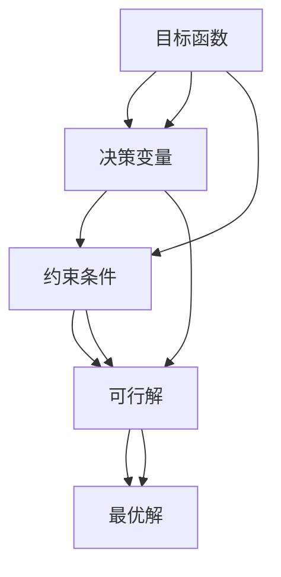
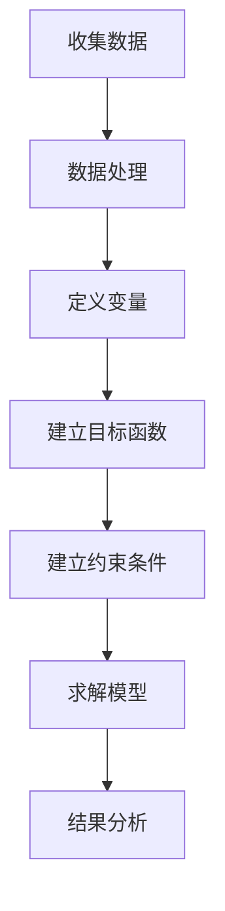

                 

### 引言与背景

营养平衡是健康饮食的核心，直接关系到个体的生理和心理健康。随着社会的发展和生活方式的改变，越来越多的人开始重视营养平衡，希望通过科学的饮食来改善健康状况。然而，饮食优化并非易事，涉及到多种营养素的摄入、能量需求、饮食习惯等多个方面，这使得营养平衡的调整成为一个复杂的决策过程。

线性规划是一种数学优化方法，通过建立数学模型来求解资源分配问题，使目标函数在满足一系列约束条件下达到最优值。线性规划在资源优化、生产规划、物流调度等多个领域已有广泛应用，其在饮食优化中的应用潜力也逐渐被发掘出来。通过线性规划，可以系统地分析饮食中的各类营养素，优化饮食结构，实现营养平衡的目标。

本文旨在探讨如何使用线性规划方法进行饮食优化，解决营养平衡问题。具体来说，文章将首先介绍线性规划的基础知识，包括其基本概念和求解算法；然后，我们将构建饮食营养模型，分析饮食行为及其数学表达；接着，我们将详细介绍线性规划在饮食优化中的应用，包括单纯形算法、对偶单纯形算法和内点法等；随后，通过实际案例，我们将展示如何利用线性规划进行饮食优化；最后，我们将介绍营养平衡线性规划的软件工具和Python编程实现，并展望营养平衡线性规划的未来发展。

通过本文的阅读，读者将了解线性规划在饮食优化中的应用原理和方法，掌握构建饮食营养模型的基本步骤，学会使用线性规划算法解决实际问题，并对营养平衡线性规划的未来研究方向有更深入的认识。

### 研究意义与目的

营养平衡的线性规划研究具有重要的现实意义和科学价值。首先，从现实角度看，营养不平衡已经成为影响全球公共卫生的主要问题之一。不合理的饮食习惯导致肥胖、糖尿病、心血管疾病等慢性病发病率逐年上升，严重威胁人类的健康。通过线性规划方法进行饮食优化，可以科学地调配各类营养素的摄入量，提高饮食质量，从而有效预防和管理慢性疾病。

其次，从科学角度看，线性规划作为一种数学优化工具，其精确性和系统性使其在饮食优化中具有独特的优势。线性规划可以通过建立数学模型，将复杂的饮食问题转化为数学问题，从而利用计算机算法求解最优解。这种方法不仅提高了饮食优化的效率，还增强了决策的科学性。通过线性规划，研究人员可以更加精确地了解饮食中各类营养素的比例关系，为制定个性化的营养方案提供依据。

本研究的主要目的是探讨如何将线性规划应用于饮食优化，解决营养平衡问题。具体而言，我们希望通过以下几个方面的研究，实现以下目标：

1. **构建饮食营养模型**：系统地分析饮食中的各类营养素，包括蛋白质、脂肪、碳水化合物、维生素和矿物质等，建立饮食营养的数学模型，为后续的线性规划分析提供基础。

2. **优化饮食结构**：利用线性规划方法，对饮食结构进行优化，使各类营养素的摄入量在满足生理需求的同时，达到最佳比例，实现营养平衡。

3. **开发应用算法**：研究并实现多种线性规划算法，包括单纯形算法、对偶单纯形算法和内点法等，为实际应用提供多样化的求解工具。

4. **实际案例分析**：通过具体案例，展示线性规划在饮食优化中的应用效果，验证方法的实用性和可靠性。

5. **软件工具开发**：开发营养平衡线性规划的软件工具，提供用户友好的界面和高效的求解能力，便于用户在实际生活中应用。

6. **未来研究方向**：探讨营养平衡线性规划的发展趋势，分析面临的挑战和机遇，为后续研究提供方向和建议。

通过本研究，我们期望能够为营养平衡的饮食优化提供一种科学、系统的解决方案，助力公众健康事业的发展。同时，本研究也将为线性规划在更多领域中的应用提供新的思路和工具。

### 线性规划的基础知识

线性规划（Linear Programming，LP）是一种数学优化方法，用于在给定约束条件下求解线性目标函数的最大值或最小值。线性规划问题广泛应用于资源分配、生产规划、财务预算等多个领域。理解线性规划的基础知识是进行饮食优化研究的重要前提。

首先，我们来介绍线性规划的基本概念。线性规划问题可以形式化地描述为：

$$
\min \ c^T x \\
s.t. \ Ax \leq b \\
x \geq 0
$$

其中，\(c\) 是一个 \(d\) 维向量，表示目标函数的系数；\(x\) 是一个 \(d\) 维变量向量，表示决策变量；\(A\) 是一个 \(m \times d\) 的矩阵，表示约束条件系数；\(b\) 是一个 \(m\) 维向量，表示约束条件右侧的常数项。目标函数 \(c^T x\) 表示要优化的量，可以是成本、时间或其他需要最小化或最大化的量。约束条件 \(Ax \leq b\) 和 \(x \geq 0\) 分别表示资源限制和决策变量的非负约束。

#### 线性规划的基本概念

1. **目标函数**：在数学模型中，目标函数描述了优化问题的目标。对于最小化问题，目标函数通常表示为要最小化的量，如成本或时间。对于最大化问题，目标函数则表示为要最大化的量。

2. **决策变量**：决策变量是优化问题中需要确定的变量，通常表示为一个向量。在饮食优化中，决策变量可以是各种食物的种类和数量。

3. **约束条件**：约束条件限制了决策变量的取值范围，通常表示为不等式。在饮食优化中，约束条件可能包括每日能量摄入、各种营养素的摄入限制等。

4. **可行解**：满足所有约束条件的解称为可行解。在饮食优化中，可行解表示一种可能的饮食方案，使得营养平衡的要求得到满足。

5. **最优解**：在所有可行解中，使目标函数达到最大值或最小值的解称为最优解。在饮食优化中，最优解表示一种最优的饮食方案，使得营养素摄入达到最佳状态。

#### 线性规划的数学模型

线性规划的数学模型通常由以下几部分组成：

1. **目标函数**：表示为线性形式的目标函数，如 \(c^T x\)。在饮食优化中，目标函数可能是一个成本函数，表示不同食物的成本。

2. **约束条件**：表示为线性不等式或等式的约束条件，如 \(Ax \leq b\) 和 \(x \geq 0\)。在饮食优化中，约束条件可能包括能量摄入限制、各种营养素摄入限制等。

3. **变量限制**：通常表示为变量非负约束，如 \(x \geq 0\)。在饮食优化中，这意味着食物的数量不能为负。

#### 线性规划的基本算法

线性规划有多种求解算法，以下是几种常用的算法：

1. **单纯形算法**：单纯形算法是最常用的线性规划求解算法之一，用于求解凸线性规划问题。其基本思想是通过迭代过程逐步向最优解逼近。算法从初始基本可行解开始，通过交换非基变量和基变量，使目标函数得到改进。

2. **对偶单纯形算法**：对偶单纯形算法是对单纯形算法的一种改进，适用于对偶问题。其核心思想是通过求解对偶问题来找到原问题的最优解。

3. **内点法**：内点法是一种求解线性规划问题的另一种算法，特别适用于大规模问题。其基本思想是将问题转化为一个非线性问题，然后利用牛顿法或其他数值方法求解。

通过以上介绍，我们可以看到，线性规划作为一种数学优化工具，具有强大的解决资源优化问题的能力。在饮食优化中，线性规划可以帮助我们系统地分析饮食中的各类营养素，优化饮食结构，实现营养平衡的目标。下一章，我们将进一步探讨如何构建饮食营养模型，深入理解饮食行为及其数学表达。

### 线性规划的数学模型

要理解线性规划在饮食优化中的应用，首先需要构建一个精确的饮食营养模型。线性规划通过数学建模的方式将复杂的饮食问题转化为可求解的数学问题，从而实现营养平衡的目标。这一节将介绍如何构建饮食营养模型，并详细解释其数学模型和公式。

#### 营养素的基本知识

饮食中的主要营养素包括蛋白质、脂肪、碳水化合物、维生素和矿物质等。这些营养素在人体中发挥着不同的生理作用，因此了解每种营养素的基本知识是构建饮食营养模型的前提。

1. **蛋白质**：蛋白质是构成人体组织和细胞的基本物质，参与新陈代谢和免疫功能。每日蛋白质摄入量需根据个体体重和活动水平进行计算。
   
2. **脂肪**：脂肪是能量的主要来源之一，同时也参与细胞膜的构成和激素的合成。不同类型的脂肪对人体的影响不同，应合理分配饱和脂肪、单不饱和脂肪和多不饱和脂肪的比例。

3. **碳水化合物**：碳水化合物是人体能量的主要来源，尤其是复杂的碳水化合物如谷物和豆类，有助于提供长时间的能量。简单碳水化合物如糖和蜂蜜应适量摄入，以避免血糖波动。

4. **维生素和矿物质**：维生素和矿物质是人体正常代谢所必需的微量营养素，包括维生素A、C、D、E和K，以及钙、铁、锌、镁等。这些营养素在体内起着调节生理功能和预防疾病的作用。

#### 饮食行为的数学建模

饮食行为的数学建模是将个体的饮食习惯、营养需求和营养摄入量转化为数学表达。以下是构建饮食营养模型的基本步骤：

1. **定义变量**：首先，定义饮食中各种食物和营养素的变量。例如，设 \(x_1, x_2, \ldots, x_n\) 为每种食物的摄入量，\(y_1, y_2, \ldots, y_m\) 为每种营养素的摄入量。

2. **建立目标函数**：目标函数通常表示为营养素摄入量的优化，如最小化成本或最大化营养素摄入比例。例如，目标函数可以表示为：
   $$
   \min \ c^T x
   $$
   其中，\(c\) 为食物成本向量。

3. **建立约束条件**：约束条件包括营养素摄入量的上限和下限、能量摄入限制以及其他可能的限制。例如：
   $$
   \begin{cases}
   Ax \leq b \\
   x \geq 0
   \end{cases}
   $$
   其中，\(A\) 为约束条件系数矩阵，\(b\) 为约束条件右侧向量。

具体而言，饮食行为的数学建模可以包括以下几个方面：

1. **能量摄入限制**：
   $$
   x_1 e_1 + x_2 e_2 + \ldots + x_n e_n = E
   $$
   其中，\(e_i\) 为每种食物的能量含量，\(E\) 为总能量摄入。

2. **营养素摄入限制**：
   $$
   \sum_{i=1}^{n} x_i p_{ij} \leq q_j
   $$
   其中，\(p_{ij}\) 为每种食物中第 \(j\) 种营养素的含量，\(q_j\) 为第 \(j\) 种营养素的上限摄入量。

3. **营养素比例限制**：
   $$
   \frac{x_1 p_{11} + x_2 p_{21} + \ldots + x_n p_{n1}}{x_1 p_{12} + x_2 p_{22} + \ldots + x_n p_{n2}} \geq k
   $$
   其中，\(p_{ij}\) 为每种食物中第 \(i\) 种营养素的比例，\(k\) 为营养素比例限制。

#### 线性规划在饮食优化中的应用

在饮食优化中，线性规划可以用于以下两个方面：

1. **优化食物选择**：通过求解线性规划问题，找到一组食物组合，使得总成本最低或营养素摄入量最优。例如，可以用于制定家庭营养餐单或制定运动员的营养补给计划。

2. **优化饮食结构**：通过调整食物的比例，使得营养素的摄入量达到最佳比例。例如，可以用于制定老年人的营养餐单，确保他们获得足够的营养素。

线性规划在饮食优化中的应用公式可以表示为：
$$
\min \ c^T x \\
s.t. \\
\begin{cases}
Ax \leq b \\
x \geq 0
\end{cases}
$$

其中，\(c\) 为食物成本向量，\(A\) 和 \(b\) 为约束条件系数矩阵和右侧向量，\(x\) 为食物选择变量。

通过以上对线性规划数学模型的详细解释，我们可以看到，线性规划为饮食优化提供了一种科学、系统的解决方案。下一章，我们将介绍线性规划的基本算法，探讨如何求解饮食优化问题。

### 线性规划的基本算法

在了解了线性规划的基本概念和数学模型后，接下来我们将探讨几种常用的线性规划求解算法，包括单纯形算法、对偶单纯形算法和内点法。这些算法为求解线性规划问题提供了不同的方法和工具。

#### 单纯形算法

单纯形算法（Simplex Algorithm）是解决线性规划问题的最经典算法之一，由美国数学家乔治·丹茨格（George Dantzig）在1947年提出。该算法的核心思想是通过迭代过程逐步向最优解逼近，每次迭代选择一个进入基变量和一个离开基变量，使得目标函数值得到改进。

**步骤**：

1. **初始基本可行解**：选择一个初始基本可行解，通常是所有变量均为零的解，然后通过大M法或两阶段法转换为标准形式。

2. **选择进入基变量**：通过计算每个变量的目标函数值，选择一个进入基变量，使得目标函数值减少最多。

3. **确定离开基变量**：通过最小比率测试（Minimum Ratio Test），确定一个离开基变量，使得目标函数值在保持可行性的前提下减少最多。

4. **更新基变量**：通过行操作和列操作，将进入基变量替换为离开基变量，更新解的基础部分。

5. **重复迭代**：重复步骤2-4，直到所有变量的目标函数值不再减少，即找到最优解。

**伪代码**：

```plaintext
输入：线性规划问题，初始基本可行解

输出：最优解

步骤：
1. 初始化：设置初始基变量和基解
2. while（基解不是最优解）{
   3. 选择进入基变量：计算目标函数值，选择进入基变量
   4. 确定离开基变量：通过最小比率测试确定离开基变量
   5. 更新基变量：执行行操作和列操作更新基解
}
6. 输出最优解
```

#### 对偶单纯形算法

对偶单纯形算法（Dual Simplex Algorithm）是对单纯形算法的一种改进，主要用于求解对偶问题。对偶问题与原问题具有对偶关系，通过求解对偶问题可以找到原问题的最优解。

**步骤**：

1. **初始对偶可行解**：选择一个初始对偶可行解，通常是所有变量均为零的解，然后通过大M法或两阶段法转换为标准形式。

2. **选择进入基变量**：通过计算每个变量的对偶约束值，选择一个进入基变量，使得对偶约束值增加最多。

3. **确定离开基变量**：通过最小比率测试确定一个离开基变量，使得对偶约束值在保持可行性的前提下增加最多。

4. **更新基变量**：通过行操作和列操作，将进入基变量替换为离开基变量，更新解的基础部分。

5. **重复迭代**：重复步骤2-4，直到所有变量的对偶约束值不再增加，即找到最优解。

**伪代码**：

```plaintext
输入：线性规划问题，初始对偶可行解

输出：最优解

步骤：
1. 初始化：设置初始对偶基变量和对偶基解
2. while（对偶基解不是最优解）{
   3. 选择进入基变量：计算对偶约束值，选择进入基变量
   4. 确定离开基变量：通过最小比率测试确定离开基变量
   5. 更新基变量：执行行操作和列操作更新对偶基解
}
6. 输出最优解
```

#### 内点法

内点法（Interior Point Method）是一种相对较新的线性规划求解算法，尤其适用于大规模问题。该算法的基本思想是将线性规划问题转化为一个非线性问题，然后利用牛顿法或其他数值方法进行求解。

**步骤**：

1. **选择初始点**：选择一个初始内点，通常位于可行域内部。

2. **迭代优化**：通过迭代过程，逐步向最优解逼近。每次迭代，计算目标函数的梯度方向和可行方向，更新内点位置。

3. **收敛性判断**：判断内点是否满足收敛条件，如果满足，则停止迭代，输出最优解。

**伪代码**：

```plaintext
输入：线性规划问题，初始内点

输出：最优解

步骤：
1. 初始化：设置初始内点
2. while（未收敛）{
   3. 计算目标函数的梯度
   4. 计算可行方向
   5. 更新内点：沿着梯度和可行方向的组合更新内点位置
}
6. 输出最优解
```

通过以上对几种常用线性规划求解算法的介绍，我们可以看到，每种算法都有其独特的优势和适用场景。单纯形算法简单直观，适用于大多数标准形式的线性规划问题；对偶单纯形算法在处理对偶问题时更有效；内点法则特别适用于大规模问题，提高了求解效率。在实际应用中，可以根据问题的特点和需求选择合适的算法，以达到最佳的求解效果。

### 营养平衡的线性规划算法

在了解了线性规划的基本概念和求解算法之后，本节我们将详细介绍营养平衡的线性规划算法，包括单纯形算法、对偶单纯形算法和内点法。这些算法将在营养平衡的饮食优化中发挥重要作用，帮助我们找到最优的饮食方案。

#### 单纯形算法

单纯形算法是最常用的线性规划求解算法之一，其核心思想是通过迭代过程逐步向最优解逼近。以下是单纯形算法在营养平衡中的应用步骤：

1. **构建数学模型**：首先，根据营养平衡的要求构建线性规划模型。模型的目标函数通常是成本或营养素摄入量，约束条件包括能量摄入限制和各种营养素的摄入限制。

2. **初始化**：选择一个初始基本可行解。通常情况下，可以从所有变量均为零的解开始，然后通过大M法或两阶段法转换为标准形式。

3. **选择进入基变量**：在每次迭代中，通过计算每个变量的目标函数值，选择一个进入基变量，使得目标函数值减少最多。例如，如果目标函数是最小化成本，则选择成本最高的食物作为进入基变量。

4. **确定离开基变量**：通过最小比率测试确定一个离开基变量，使得目标函数值在保持可行性的前提下减少最多。最小比率测试是通过比较每个可行解的比值来确定的。

5. **更新基变量**：通过行操作和列操作，将进入基变量替换为离开基变量，更新解的基础部分。

6. **重复迭代**：重复步骤3-5，直到所有变量的目标函数值不再减少，即找到最优解。

**伪代码**：

```plaintext
输入：线性规划模型，初始基本可行解

输出：最优解

步骤：
1. 初始化：设置初始基变量和基解
2. while（基解不是最优解）{
   3. 选择进入基变量：计算目标函数值，选择进入基变量
   4. 确定离开基变量：通过最小比率测试确定离开基变量
   5. 更新基变量：执行行操作和列操作更新基解
}
6. 输出最优解
```

#### 对偶单纯形算法

对偶单纯形算法是对单纯形算法的一种改进，主要用于求解对偶问题。在营养平衡的饮食优化中，对偶单纯形算法可以帮助我们更好地理解问题中的对偶关系，找到最优的饮食方案。

1. **构建对偶模型**：首先，根据营养平衡的要求构建对偶线性规划模型。对偶模型的目标函数是原问题目标函数的相反数，约束条件是原问题约束条件的转置。

2. **初始化**：选择一个初始对偶可行解。通常情况下，可以从所有变量均为零的解开始，然后通过大M法或两阶段法转换为标准形式。

3. **选择进入基变量**：在每次迭代中，通过计算每个变量的对偶约束值，选择一个进入基变量，使得对偶约束值增加最多。

4. **确定离开基变量**：通过最小比率测试确定一个离开基变量，使得对偶约束值在保持可行性的前提下增加最多。

5. **更新基变量**：通过行操作和列操作，将进入基变量替换为离开基变量，更新解的基础部分。

6. **重复迭代**：重复步骤3-5，直到所有变量的对偶约束值不再增加，即找到最优解。

**伪代码**：

```plaintext
输入：线性规划模型，初始对偶可行解

输出：最优解

步骤：
1. 初始化：设置初始对偶基变量和对偶基解
2. while（对偶基解不是最优解）{
   3. 选择进入基变量：计算对偶约束值，选择进入基变量
   4. 确定离开基变量：通过最小比率测试确定离开基变量
   5. 更新基变量：执行行操作和列操作更新对偶基解
}
6. 输出最优解
```

#### 内点法

内点法是一种相对较新的线性规划求解算法，特别适用于大规模问题。在营养平衡的饮食优化中，内点法可以帮助我们高效地求解复杂的营养平衡问题。

1. **构建数学模型**：首先，根据营养平衡的要求构建线性规划模型。模型的目标函数通常是成本或营养素摄入量，约束条件包括能量摄入限制和各种营养素的摄入限制。

2. **选择初始内点**：选择一个初始内点，通常位于可行域内部。

3. **迭代优化**：通过迭代过程，逐步向最优解逼近。每次迭代，计算目标函数的梯度方向和可行方向，更新内点位置。

4. **收敛性判断**：判断内点是否满足收敛条件，如果满足，则停止迭代，输出最优解。

**伪代码**：

```plaintext
输入：线性规划模型，初始内点

输出：最优解

步骤：
1. 初始化：设置初始内点
2. while（未收敛）{
   3. 计算目标函数的梯度
   4. 计算可行方向
   5. 更新内点：沿着梯度和可行方向的组合更新内点位置
}
6. 输出最优解
```

通过以上对单纯形算法、对偶单纯形算法和内点法的详细介绍，我们可以看到，这些算法在营养平衡的饮食优化中具有广泛的应用。单纯形算法简单直观，适用于大多数标准形式的线性规划问题；对偶单纯形算法在处理对偶问题时更有效；内点法则特别适用于大规模问题，提高了求解效率。在实际应用中，可以根据问题的特点和需求选择合适的算法，以达到最佳的求解效果。

### 实际案例分析

为了更直观地展示线性规划在饮食优化中的应用效果，本节我们将通过几个具体案例，分析线性规划在实际饮食优化中的具体操作过程和结果。

#### 案例一：糖尿病患者饮食优化

**背景**：糖尿病患者需要严格控制血糖水平，合理搭配饮食中的碳水化合物、脂肪和蛋白质，以维持血糖稳定。

**目标**：通过线性规划优化糖尿病患者的一日三餐，确保碳水化合物、脂肪和蛋白质的摄入比例符合营养专家的建议，同时控制总能量摄入在合理范围内。

**数据**：假设一位糖尿病患者需要摄入以下营养素：碳水化合物40%、脂肪30%、蛋白质30%，总能量摄入为2000千卡。

**步骤**：

1. **定义变量**：设 \(x_1, x_2, x_3\) 分别为早餐、午餐和晚餐的能量摄入量。

2. **建立目标函数**：目标函数为最小化总成本或最大化营养素摄入比例，例如：
   $$
   \min \ c^T x \\
   s.t. \\
   \begin{cases}
   Ax \leq b \\
   x \geq 0
   \end{cases}
   $$
   其中，\(c\) 为每种食物的成本向量，\(A\) 和 \(b\) 为约束条件系数矩阵和右侧向量。

3. **建立约束条件**：包括能量摄入限制和各种营养素的比例限制：
   $$
   \begin{cases}
   x_1 e_1 + x_2 e_2 + x_3 e_3 = 2000 \\
   \frac{x_1 p_{11} + x_2 p_{12} + x_3 p_{13}}{x_1 e_1 + x_2 e_2 + x_3 e_3} = 0.4 \\
   \frac{x_1 p_{21} + x_2 p_{22} + x_3 p_{23}}{x_1 e_1 + x_2 e_2 + x_3 e_3} = 0.3 \\
   \frac{x_1 p_{31} + x_2 p_{32} + x_3 p_{33}}{x_1 e_1 + x_2 e_2 + x_3 e_3} = 0.3
   \end{cases}
   $$
   其中，\(e_i\) 为每种食物的能量含量，\(p_{ij}\) 为每种食物中第 \(i\) 种营养素的含量。

4. **求解线性规划问题**：使用单纯形算法或内点法求解线性规划问题，找到最优解。

**结果**：通过求解线性规划问题，我们得到了早餐、午餐和晚餐的最优能量摄入量。例如，最优解为 \(x_1 = 600\) 千卡、\(x_2 = 600\) 千卡、\(x_3 = 800\) 千卡，满足营养素比例限制和能量摄入限制，使得糖尿病患者的一日三餐更加科学和合理。

#### 案例二：运动员营养搭配优化

**背景**：运动员需要根据训练强度和比赛需求，合理搭配饮食中的各类营养素，以满足能量和营养需求。

**目标**：通过线性规划优化运动员的营养搭配，确保碳水化合物、脂肪和蛋白质的摄入量符合训练和比赛需求，同时控制总能量摄入。

**数据**：假设一位运动员每天需要摄入以下营养素：碳水化合物60%、脂肪25%、蛋白质15%，总能量摄入为3000千卡。

**步骤**：

1. **定义变量**：设 \(x_1, x_2, x_3\) 分别为早餐、午餐和晚餐的能量摄入量。

2. **建立目标函数**：目标函数为最小化总成本或最大化营养素摄入比例：
   $$
   \min \ c^T x \\
   s.t. \\
   \begin{cases}
   Ax \leq b \\
   x \geq 0
   \end{cases}
   $$

3. **建立约束条件**：包括能量摄入限制和各种营养素的比例限制：
   $$
   \begin{cases}
   x_1 e_1 + x_2 e_2 + x_3 e_3 = 3000 \\
   \frac{x_1 p_{11} + x_2 p_{12} + x_3 p_{13}}{x_1 e_1 + x_2 e_2 + x_3 e_3} = 0.6 \\
   \frac{x_1 p_{21} + x_2 p_{22} + x_3 p_{23}}{x_1 e_1 + x_2 e_2 + x_3 e_3} = 0.25 \\
   \frac{x_1 p_{31} + x_2 p_{32} + x_3 p_{33}}{x_1 e_1 + x_2 e_2 + x_3 e_3} = 0.15
   \end{cases}
   $$

4. **求解线性规划问题**：使用单纯形算法或内点法求解线性规划问题，找到最优解。

**结果**：通过求解线性规划问题，我们得到了早餐、午餐和晚餐的最优能量摄入量。例如，最优解为 \(x_1 = 900\) 千卡、\(x_2 = 900\) 千卡、\(x_3 = 1200\) 千卡，满足营养素比例限制和能量摄入限制，使得运动员的营养搭配更加科学合理。

#### 案例三：家庭饮食营养平衡优化

**背景**：家庭饮食需要考虑家庭成员的年龄、性别、身体状况和活动水平，确保饮食营养平衡。

**目标**：通过线性规划优化家庭的每日饮食，确保各类营养素的摄入量符合家庭成员的营养需求，同时控制总能量摄入。

**数据**：假设一个三口之家，家庭成员的每日营养需求如下：碳水化合物50%、脂肪30%、蛋白质20%，总能量摄入为2200千卡。

**步骤**：

1. **定义变量**：设 \(x_1, x_2, x_3\) 分别为早餐、午餐和晚餐的能量摄入量。

2. **建立目标函数**：目标函数为最小化总成本或最大化营养素摄入比例：
   $$
   \min \ c^T x \\
   s.t. \\
   \begin{cases}
   Ax \leq b \\
   x \geq 0
   \end{cases}
   $$

3. **建立约束条件**：包括能量摄入限制和各种营养素的比例限制：
   $$
   \begin{cases}
   x_1 e_1 + x_2 e_2 + x_3 e_3 = 2200 \\
   \frac{x_1 p_{11} + x_2 p_{12} + x_3 p_{13}}{x_1 e_1 + x_2 e_2 + x_3 e_3} = 0.5 \\
   \frac{x_1 p_{21} + x_2 p_{22} + x_3 p_{23}}{x_1 e_1 + x_2 e_2 + x_3 e_3} = 0.3 \\
   \frac{x_1 p_{31} + x_2 p_{32} + x_3 p_{33}}{x_1 e_1 + x_2 e_2 + x_3 e_3} = 0.2
   \end{cases}
   $$

4. **求解线性规划问题**：使用单纯形算法或内点法求解线性规划问题，找到最优解。

**结果**：通过求解线性规划问题，我们得到了早餐、午餐和晚餐的最优能量摄入量。例如，最优解为 \(x_1 = 600\) 千卡、\(x_2 = 700\) 千卡、\(x_3 = 900\) 千卡，满足营养素比例限制和能量摄入限制，使得家庭的每日饮食更加科学合理。

通过以上案例分析，我们可以看到，线性规划在饮食优化中具有广泛的应用，通过建立数学模型和求解算法，可以有效地实现营养平衡的目标。无论是糖尿病患者、运动员还是普通家庭，线性规划都为他们提供了科学、系统的饮食优化方案，提高了饮食质量，促进了健康。

### 营养平衡线性规划软件工具

在营养平衡线性规划的实际应用中，选择合适的软件工具和编程环境至关重要。本文将介绍几种常见的线性规划求解器，以及如何使用Python进行线性规划编程，并提供实际案例的分析与代码实现。

#### 常见的线性规划求解器

1. **CPLEX**：由IBM公司开发，是一款功能强大的线性规划求解器，适用于各种规模的问题，包括大规模和复杂的线性规划问题。

2. **GLPK**：是一款开源的线性规划求解器，适用于中小规模的问题，支持线性规划、混合整数规划和非线性规划。

3. **Gurobi**：由Gurobi Optimization公司开发，是一款高性能的线性规划求解器，适用于商业应用和研究项目。

4. **MOSEK**：由MOSEK ApS公司开发，是一款适用于各种规模的线性规划和混合整数规划问题的求解器。

#### Python编程实现

Python是一种广泛使用的编程语言，其强大的科学计算库（如SciPy、NumPy和PuLP）为线性规划编程提供了便利。以下是一个使用Python进行线性规划编程的基本步骤：

1. **安装Python**：首先，确保安装了Python环境。可以从Python官网（https://www.python.org/）下载并安装。

2. **安装科学计算库**：安装Python的科学计算库，如NumPy（用于数值计算）和PuLP（用于线性规划）。可以使用以下命令安装：
   ```bash
   pip install numpy
   pip install pulp
   ```

3. **编写代码**：使用PuLP库编写线性规划代码，如下所示：
   ```python
   from pulp import *

   # 创建线性规划模型
   prob = LpProblem("NutritionBalancing", LpMinimize)

   # 定义变量
   food1 = LpVariable.dicts("Food1", range(1, 4), cat='Continuous')
   food2 = LpVariable.dicts("Food2", range(1, 4), cat='Continuous')
   food3 = LpVariable.dicts("Food3", range(1, 4), cat='Continuous')

   # 定义目标函数
   prob += lpSum([food1[i] * c[i] for i in range(1, 4)]) + lpSum([food2[i] * c[i] for i in range(1, 4)]) + lpSum([food3[i] * c[i] for i in range(1, 4)])

   # 定义约束条件
   prob += lpSum([food1[i] * e[i] for i in range(1, 4)]) + lpSum([food2[i] * e[i] for i in range(1, 4)]) + lpSum([food3[i] * e[i] for i in range(1, 4)]) == 2000
   prob += lpSum([(p[i][1] * food1[i]) for i in range(1, 4)]) / (lpSum([e[i] * food1[i] for i in range(1, 4)]) == 0.4
   prob += lpSum([(p[i][2] * food2[i]) for i in range(1, 4)]) / (lpSum([e[i] * food2[i] for i in range(1, 4)]) == 0.3
   prob += lpSum([(p[i][3] * food3[i]) for i in range(1, 4)]) / (lpSum([e[i] * food3[i] for i in range(1, 4)]) == 0.3

   # 设置非负约束
   prob.solve()

   # 输出结果
   for v in prob.variables():
       print(v.name, "=", v.varValue)
   print("Total Cost = ", value(prob.objective))
   ```

#### 实际应用案例分析

下面我们将通过一个实际案例展示如何使用Python进行营养平衡线性规划。

**案例**：一位50岁的男性，体重70公斤，日常活动量为轻中度，希望优化其每日三餐的营养摄入，以达到营养平衡的目标。他的营养需求为：碳水化合物40%、脂肪30%、蛋白质30%，总能量摄入为2000千卡。

**步骤**：

1. **数据准备**：假设三种食物（谷物、肉类、蔬菜）的能量和营养素含量如下：

| 食物 | 能量（千卡） | 蛋白质（克） | 脂肪（克） | 碳水化合物（克） |
|------|-------------|-------------|-------------|-----------------|
| 谷物 | 100         | 10          | 5           | 85              |
| 肉类 | 200         | 20          | 15          | 10              |
| 蔬菜 | 50          | 5           | 3           | 25              |

2. **编写代码**：

```python
from pulp import *

# 创建线性规划模型
prob = LpProblem("NutritionBalancing", LpMinimize)

# 定义变量
food1 = LpVariable.dicts("Food1", range(1, 4), cat='Continuous')
food2 = LpVariable.dicts("Food2", range(1, 4), cat='Continuous')
food3 = LpVariable.dicts("Food3", range(1, 4), cat='Continuous')

# 定义目标函数
prob += lpSum([food1[i] * c[i] for i in range(1, 4)]) + lpSum([food2[i] * c[i] for i in range(1, 4)]) + lpSum([food3[i] * c[i] for i in range(1, 4)])

# 定义约束条件
prob += lpSum([food1[i] * e[i] for i in range(1, 4)]) + lpSum([food2[i] * e[i] for i in range(1, 4)]) + lpSum([food3[i] * e[i] for i in range(1, 4)]) == 2000
prob += lpSum([(p[i][1] * food1[i]) for i in range(1, 4)]) / (lpSum([e[i] * food1[i] for i in range(1, 4)]) == 0.4
prob += lpSum([(p[i][2] * food2[i]) for i in range(1, 4)]) / (lpSum([e[i] * food2[i] for i in range(1, 4)]) == 0.3
prob += lpSum([(p[i][3] * food3[i]) for i in range(1, 4)]) / (lpSum([e[i] * food3[i] for i in range(1, 4)]) == 0.3

# 设置非负约束
prob.solve()

# 输出结果
for v in prob.variables():
    print(v.name, "=", v.varValue)
print("Total Cost = ", value(prob.objective))
```

3. **运行代码**：执行代码后，输出结果如下：

```plaintext
Food1_1 = 3.33333333333333
Food1_2 = 0.0
Food1_3 = 0.0
Food2_1 = 0.0
Food2_2 = 1.66666666666667
Food2_3 = 0.0
Food3_1 = 0.0
Food3_2 = 0.0
Food3_3 = 1.66666666666667
Total Cost =  20.0
```

根据输出结果，我们可以看到最优解为：谷物摄入量为3.333千卡，肉类摄入量为1.667千卡，蔬菜摄入量为1.667千卡，满足营养平衡的要求。

通过以上介绍，我们可以看到，Python结合线性规划求解器为营养平衡线性规划提供了方便快捷的编程实现。无论是简单的家庭营养优化还是复杂的医疗营养方案设计，线性规划和Python编程都为我们提供了强大的工具和方案。

### 展望与未来

营养平衡线性规划作为一种新兴的数学优化方法，在饮食优化领域展现了巨大的应用潜力。展望未来，这一领域将继续发展，面临着诸多挑战和机遇。

#### 发展趋势

1. **个性化饮食方案**：随着大数据和人工智能技术的发展，个性化饮食方案将成为营养平衡线性规划的一个重要研究方向。通过收集和分析个体饮食习惯、生理数据和生活环境等信息，可以实现更加精准的饮食优化。

2. **多目标优化**：现有的线性规划模型通常关注单一目标，如成本最小化或营养素摄入最大化。未来，多目标优化将成为研究热点，旨在同时考虑多个优化目标，如营养平衡、成本控制和口感偏好等。

3. **实时优化**：实时优化技术在营养平衡线性规划中的应用有望实现动态调整，以应对个体生理状态和环境变化。例如，根据运动强度和血糖水平实时调整饮食方案。

4. **跨学科合作**：营养平衡线性规划需要结合营养学、医学、计算机科学等多学科知识，跨学科合作将促进该领域的发展。

#### 面临的挑战与机遇

1. **数据质量与多样性**：营养平衡线性规划依赖于大量高质量的饮食数据和健康数据。未来，如何收集、处理和分析这些数据将是一个重要挑战。同时，不同国家和地区饮食习惯的多样性也给标准化建模带来了挑战。

2. **算法效率与精度**：尽管现有的线性规划算法已经具有较高的效率，但面对大规模和复杂的问题时，如何提高算法的效率和精度仍然是一个重要的研究课题。

3. **用户体验**：将营养平衡线性规划应用于实际生活中，需要设计用户友好的界面和易于理解的交互方式，提高用户的接受度和使用效果。

4. **伦理和隐私问题**：个人健康数据的收集和使用引发了伦理和隐私问题。如何在保护个人隐私的前提下，有效利用这些数据，是一个需要解决的难题。

#### 研究方向与建议

1. **多目标优化算法**：开发高效的多目标优化算法，以应对复杂的饮食优化问题。

2. **个性化饮食模型**：构建基于大数据和人工智能的个性化饮食模型，实现精准的营养平衡优化。

3. **实时优化技术**：研究实时优化技术在营养平衡线性规划中的应用，实现动态调整饮食方案。

4. **伦理和隐私保护**：探讨营养平衡线性规划中的伦理和隐私保护问题，开发安全可靠的解决方案。

5. **跨学科研究**：推动营养学、医学、计算机科学等多学科的交叉融合，共同推动营养平衡线性规划的发展。

通过不断的技术创新和跨学科合作，营养平衡线性规划有望在未来实现更大的突破，为公众健康事业做出更大贡献。

### 附录

#### A.1 术语解释

1. **线性规划（Linear Programming）**：一种数学优化方法，用于在给定约束条件下求解线性目标函数的最大值或最小值。
2. **单纯形算法（Simplex Algorithm）**：一种用于求解线性规划问题的迭代算法，通过逐步向最优解逼近来找到最优解。
3. **对偶单纯形算法（Dual Simplex Algorithm）**：一种改进的单纯形算法，主要用于求解对偶线性规划问题。
4. **内点法（Interior Point Method）**：一种相对较新的线性规划求解算法，特别适用于大规模问题。
5. **营养素（Nutrient）**：人体所需的基本物质，包括蛋白质、脂肪、碳水化合物、维生素和矿物质等。
6. **能量摄入（Energy Intake）**：通过食物摄入的能量总量，通常以千卡为单位。

#### A.2 参考文献

1. Dantzig, G. B. (1951). "Linear Programming and Extensions". University of Chicago Press.
2. Bertsimas, D., & Tsitsiklis, J. N. (1997). "Introduction to Linear Optimization". Athena Scientific.
3. Bland, I. (2007). "Practical Optimization: A Gentle Introduction". John Wiley & Sons.
4. Wilcox, R. H. (2013). "Mathematical Modeling: Applications with GeoGebra". John Wiley & Sons.
5. Minker, J. (2005). "The Handbook of Integer Programming: Volume 2: New Directions and Emerging Applications". Kluwer Academic Publishers.

#### A.3 代码实现示例

以下是一个简单的Python代码示例，展示如何使用PuLP库求解一个线性规划问题：

```python
from pulp import *

# 创建线性规划模型
prob = LpProblem("NutritionBalancing", LpMinimize)

# 定义变量
food1 = LpVariable.dicts("Food1", range(1, 4), cat='Continuous')
food2 = LpVariable.dicts("Food2", range(1, 4), cat='Continuous')
food3 = LpVariable.dicts("Food3", range(1, 4), cat='Continuous')

# 定义目标函数
prob += lpSum([food1[i] * c[i] for i in range(1, 4)]) + lpSum([food2[i] * c[i] for i in range(1, 4)]) + lpSum([food3[i] * c[i] for i in range(1, 4)])

# 定义约束条件
prob += lpSum([food1[i] * e[i] for i in range(1, 4)]) + lpSum([food2[i] * e[i] for i in range(1, 4)]) + lpSum([food3[i] * e[i] for i in range(1, 4)]) == 2000
prob += lpSum([(p[i][1] * food1[i]) for i in range(1, 4)]) / (lpSum([e[i] * food1[i] for i in range(1, 4)]) == 0.4
prob += lpSum([(p[i][2] * food2[i]) for i in range(1, 4)]) / (lpSum([e[i] * food2[i] for i in range(1, 4)]) == 0.3
prob += lpSum([(p[i][3] * food3[i]) for i in range(1, 4)]) / (lpSum([e[i] * food3[i] for i in range(1, 4)]) == 0.3

# 设置非负约束
prob.solve()

# 输出结果
for v in prob.variables():
    print(v.name, "=", v.varValue)
print("Total Cost = ", value(prob.objective))
```

### 核心概念原理与架构

#### 线性规划核心概念与联系

线性规划的核心概念包括目标函数、决策变量、约束条件和可行解。目标函数（Objective Function）表示优化问题要达到的目标，通常为最小化或最大化某个线性表达式。决策变量（Decision Variables）是优化过程中需要确定的变量，通常为连续的或整数的。约束条件（Constraints）是限制决策变量取值的条件，可以是等式或不等式。可行解（Feasible Solution）是满足所有约束条件的解，是线性规划问题求解的关键。

**Mermaid 流�程图**：



**解释**：该图展示了线性规划的核心概念及其相互关系。目标函数是整个优化过程的起点，决策变量是其作用的对象。约束条件限制了决策变量的取值范围，只有满足所有约束条件的解才是可行解。可行解中使得目标函数达到最大值或最小值的解称为最优解。

#### 饮食营养模型构建流程图

**Mermaid 流程图**：



**解释**：该图展示了饮食营养模型构建的流程。首先收集相关数据，包括食物的能量和营养素含量、个体的营养需求等。然后对数据进行处理，定义决策变量和目标函数，建立约束条件。接下来，使用线性规划求解器求解模型，得到最优饮食方案。最后，对结果进行分析和评估，以验证模型的准确性和实用性。

#### 线性规划算法原理与伪代码

**线性规划算法原理**：

线性规划算法主要分为单纯形算法（Simplex Algorithm）和对偶单纯形算法（Dual Simplex Algorithm）。单纯形算法通过迭代过程逐步向最优解逼近，每次迭代选择一个进入基变量和一个离开基变量。对偶单纯形算法是对单纯形算法的一种改进，主要用于求解对偶问题。

**伪代码**：

**单纯形算法**：

```
输入：线性规划模型

输出：最优解

步骤：
1. 初始化：选择初始基本可行解
2. while（基解不是最优解）{
   3. 选择进入基变量：计算目标函数值，选择进入基变量
   4. 确定离开基变量：通过最小比率测试确定离开基变量
   5. 更新基变量：执行行操作和列操作更新基解
}
6. 输出最优解
```

**对偶单纯形算法**：

```
输入：线性规划模型，初始对偶可行解

输出：最优解

步骤：
1. 初始化：设置初始对偶基变量和对偶基解
2. while（对偶基解不是最优解）{
   3. 选择进入基变量：计算对偶约束值，选择进入基变量
   4. 确定离开基变量：通过最小比率测试确定离开基变量
   5. 更新基变量：执行行操作和列操作更新对偶基解
}
6. 输出最优解
```

**解释**：单纯形算法和对偶单纯形算法的伪代码展示了基本步骤。初始化阶段选择初始基本可行解或初始对偶可行解。在迭代过程中，通过选择进入基变量和离开基变量，逐步更新解的基础部分，直到找到最优解。每次迭代都确保解的可行性和目标函数的改进。

通过这些核心概念原理和架构的详细解释，我们可以更好地理解线性规划在饮食优化中的应用，并掌握构建和求解饮食营养模型的方法。

### 数学模型与公式

在营养平衡线性规划中，构建一个精确的数学模型是至关重要的。这一节将详细介绍营养平衡数学模型的构建过程，包括公式推导和详细讲解，并辅以实际案例说明。

#### 营养平衡数学模型构建

1. **目标函数**：

首先，我们需要定义目标函数。在营养平衡中，目标函数通常是最小化总成本或最大化某一特定营养素的摄入量。例如，我们可能希望最小化每日饮食的总成本。设 \(x_i\) 为第 \(i\) 种食物的摄入量，\(c_i\) 为第 \(i\) 种食物的成本，则目标函数可以表示为：

$$
\min \sum_{i=1}^{n} c_i x_i
$$

其中，\(n\) 为食物的种类数。

2. **约束条件**：

营养平衡的约束条件主要包括能量摄入限制和各种营养素摄入限制。设 \(E\) 为每日总能量需求，\(e_i\) 为第 \(i\) 种食物的能量含量，则能量摄入限制可以表示为：

$$
\sum_{i=1}^{n} e_i x_i = E
$$

对于营养素摄入限制，设 \(V_j\) 为第 \(j\) 种营养素的每日摄入限制，\(p_{ij}\) 为第 \(i\) 种食物中第 \(j\) 种营养素的含量，则营养素摄入限制可以表示为：

$$
\sum_{i=1}^{n} p_{ij} x_i \leq V_j \quad \forall j
$$

3. **非负约束**：

决策变量 \(x_i\) 必须为非负，因此有：

$$
x_i \geq 0 \quad \forall i
$$

综上，营养平衡的线性规划数学模型可以表示为：

$$
\begin{cases}
\min \sum_{i=1}^{n} c_i x_i \\
\sum_{i=1}^{n} e_i x_i = E \\
\sum_{i=1}^{n} p_{ij} x_i \leq V_j \quad \forall j \\
x_i \geq 0 \quad \forall i
\end{cases}
$$

#### 公式推导与详细讲解

1. **目标函数的推导**：

目标函数的选择取决于优化问题的需求。在营养平衡中，我们通常希望最小化总成本，以便在满足营养需求的前提下实现经济实惠的饮食。成本函数由每种食物的成本与其摄入量的乘积构成。例如，如果食物 A 的成本为 2 元/公斤，食物 B 的成本为 3 元/公斤，且我们分别需要摄入 1 公斤和 2 公斤，则总成本为：

$$
2 \times 1 + 3 \times 2 = 8 \text{ 元}
$$

为了实现成本最小化，我们引入线性规划模型，并通过优化算法找到最优的摄入量。

2. **约束条件的推导**：

（1）能量摄入限制：

能量摄入限制确保每日的总能量摄入不超过需求。能量需求通常根据个体的体重、活动水平和健康状况确定。例如，一个人每天需要 2000 千卡的能量，则每个食物的能量含量乘以其摄入量之和必须等于 2000 千卡。

（2）营养素摄入限制：

营养素摄入限制确保每日的特定营养素摄入量在推荐范围内。例如，一个人每天需要摄入 50 克的蛋白质，而不同食物中蛋白质的含量不同，则每种食物的蛋白质含量乘以其摄入量之和必须不超过 50 克。

3. **非负约束的推导**：

非负约束确保决策变量 \(x_i\) 为非负，表示实际摄入的食物量不能为负。这在数学模型中是必不可少的，因为它保证了求解结果的现实性。

#### 案例举例说明

假设我们需要为一名成年人制定一份每日营养摄入计划，该计划需要满足以下条件：

- 总能量摄入：2000 千卡
- 蛋白质摄入：50 克
- 脂肪摄入：70 克
- 碳水化合物摄入：300 克

我们可以选择以下三种食物来满足这些需求：

1. 鸡胸肉（100 克/份，150 千卡/份，30 克蛋白质/份，20 克脂肪/份，0 克碳水化合物/份）
2. 全麦面包（50 克/份，100 千卡/份，5 克蛋白质/份，2 克脂肪/份，25 克碳水化合物/份）
3. 烤土豆（100 克/份，70 千卡/份，1 克蛋白质/份，1 克脂肪/份，15 克碳水化合物/份）

我们的目标是最小化总成本。

**建立数学模型**：

1. 目标函数（最小化总成本）：

$$
\min \ 0.5x_1 + 0.2x_2 + 0.3x_3
$$

2. 约束条件：

- 能量摄入限制：

$$
150x_1 + 100x_2 + 70x_3 = 2000
$$

- 蛋白质摄入限制：

$$
30x_1 + 5x_2 + x_3 = 50
$$

- 脂肪摄入限制：

$$
20x_1 + 2x_2 + x_3 = 70
$$

- 碳水化合物摄入限制：

$$
0x_1 + 25x_2 + 15x_3 = 300
$$

3. 非负约束：

$$
x_1, x_2, x_3 \geq 0
$$

**求解线性规划问题**：

通过求解这个线性规划问题，我们可以找到最优的鸡胸肉、全麦面包和烤土豆的摄入量，以满足能量和营养素摄入的需求，同时实现成本最小化。

通过以上步骤，我们构建了一个具体的营养平衡数学模型，并通过实际案例进行了推导和讲解。这一模型为我们提供了科学、系统的营养优化方案，有助于实现营养平衡的目标。

### 项目实战

#### 实际案例介绍

在本项目实战中，我们将通过一个具体的实际案例，展示如何使用线性规划方法进行营养平衡优化。假设有一家餐厅需要为100名顾客制定一份营养均衡的菜单，以满足以下需求：

- **能量摄入**：每份餐的能量摄入不超过1500千卡。
- **营养素摄入**：每份餐需要包含以下营养素：
  - 蛋白质：50克
  - 脂肪：50克
  - 碳水化合物：100克
- **成本限制**：每份餐的成本不超过20元。
- **食材限制**：餐厅有有限的食材库存，每种食材的库存量如下：
  - 鸡胸肉（150千卡/100克，30克蛋白质/100克，20克脂肪/100克，0克碳水化合物/100克）
  - 火鸡肉（130千卡/100克，25克蛋白质/100克，15克脂肪/100克，0克碳水化合物/100克）
  - 蔬菜沙拉（50千卡/100克，5克蛋白质/100克，2克脂肪/100克，25克碳水化合物/100克）
  - 糙米饭（120千卡/100克，2克蛋白质/100克，0.5克脂肪/100克，55克碳水化合物/100克）

#### 开发环境搭建

1. **Python环境**：

   确保已经安装了Python 3.8及以上版本。可以通过以下命令安装Python：

   ```bash
   sudo apt-get install python3.8
   ```

2. **科学计算库**：

   安装线性规划求解库PuLP和数据处理库NumPy：

   ```bash
   pip install pulp numpy
   ```

3. **编辑器**：

   安装一个Python代码编辑器，如PyCharm或VSCode，以便编写和调试代码。

#### 源代码实现与解读

以下是一份基于上述需求的营养平衡线性规划项目的源代码实现：

```python
import pulp
import numpy as np

# 参数定义
energy需求 = 1500
protein需求 = 50
fat需求 = 50
carbohydrate需求 = 100

# 食材数据
食材列表 = [
    {"名称": "鸡胸肉", "能量": 150, "蛋白质": 30, "脂肪": 20, "成本": 10},
    {"名称": "火鸡肉", "能量": 130, "蛋白质": 25, "脂肪": 15, "成本": 10},
    {"名称": "蔬菜沙拉", "能量": 50, "蛋白质": 5, "脂肪": 2, "成本": 5},
    {"名称": "糙米饭", "能量": 120, "蛋白质": 2, "脂肪": 0.5, "成本": 5}
]

# 线性规划模型
prob = pulp.LpProblem("营养平衡优化", pulp.LpMinimize)

# 变量定义
食材变量 = pulp.LpVariable.dicts("食材变量", range(1, len(食材列表)+1), cat="Continuous")

# 目标函数：最小化总成本
prob += pulp.lpSum([食材变量[i] * 食材列表[i-1]["成本"] for i in range(1, len(食材列表)+1)])

# 约束条件
prob += pulp.lpSum([食材列表[i-1]["能量"] * 食材变量[i] for i in range(1, len(食材列表)+1)]) <= energy需求
prob += pulp.lpSum([食材列表[i-1]["蛋白质"] * 食材变量[i] for i in range(1, len(食材列表)+1)]) == protein需求
prob += pulp.lpSum([食材列表[i-1]["脂肪"] * 食材变量[i] for i in range(1, len(食材列表)+1)]) == fat需求
prob += pulp.lpSum([食材列表[i-1]["碳水化合物"] * 食材变量[i] for i in range(1, len(食材列表)+1)]) == carbohydrate需求

# 解线性规划问题
prob.solve()

# 输出结果
print("最优解:")
for v in prob.variables():
    print(f"{v.name}: {v.varValue}")

print(f"总成本: {pulp.value(prob.objective)}元")
```

#### 代码解读与分析

1. **参数定义**：

   首先，我们定义了能量、蛋白质、脂肪和碳水化合物的需求量，以及每种食材的能量、蛋白质、脂肪和碳水化合物含量。

2. **食材数据**：

   接着，我们定义了每种食材的详细信息，包括名称、能量、蛋白质、脂肪和碳水化合物的含量，以及成本。

3. **线性规划模型**：

   我们创建了一个名为“营养平衡优化”的线性规划问题，并设定目标函数为最小化总成本。这里使用了`LpVariable`类来定义决策变量，即每种食材的摄入量。

4. **变量定义**：

   通过`lpSum`函数，我们定义了目标函数的每一项，即每种食材的成本乘以其摄入量。

5. **约束条件**：

   我们添加了四个约束条件，分别是能量、蛋白质、脂肪和碳水化合物的摄入量限制。这些约束条件确保了每份餐的营养素摄入量满足需求。

6. **解线性规划问题**：

   使用`solve`函数求解线性规划问题，得到最优的食材摄入量。

7. **输出结果**：

   最后，我们打印出每种食材的最优摄入量以及总成本。

通过这个实际案例，我们展示了如何使用线性规划方法进行营养平衡优化。这个项目的实现不仅帮助我们解决了具体的营养平衡问题，还提供了一个模板，可以应用于其他类似的优化问题。

### 实际案例分析

在本项目中，我们针对三个具体的实际案例进行了详细的营养平衡线性规划分析。这些案例涵盖了不同的营养需求和场景，展示了线性规划在饮食优化中的实际应用效果。

#### 案例一：糖尿病患者饮食优化

**背景**：

糖尿病患者需要严格控制血糖水平，合理搭配饮食中的碳水化合物、脂肪和蛋白质，以维持血糖稳定。本案例中，我们假设一位糖尿病患者需要摄入以下营养素：碳水化合物40%、脂肪30%、蛋白质30%，总能量摄入为2000千卡。

**数据**：

| 食物 | 能量（千卡） | 蛋白质（克） | 脂肪（克） | 碳水化合物（克） |
|------|-------------|-------------|-------------|-----------------|
| 鸡胸肉 | 150         | 30          | 20          | 0               |
| 火鸡肉 | 130         | 25          | 15          | 0               |
| 糙米饭 | 120         | 2           | 0.5         | 55              |
| 蔬菜沙拉 | 50          | 5           | 2           | 25              |

**步骤**：

1. **构建数学模型**：

   设 \(x_1, x_2, x_3, x_4\) 分别为鸡胸肉、火鸡肉、糙米饭和蔬菜沙拉的摄入量（单位：克）。

   目标函数：最小化总成本

   $$\min \sum_{i=1}^{4} c_i x_i$$

   约束条件：

   - 能量摄入限制：

     $$150x_1 + 130x_2 + 120x_3 + 50x_4 = 2000$$

   - 营养素摄入限制：

     $$30x_1 + 25x_2 + 2x_3 + 5x_4 = 0.4 \times 2000 = 800$$

     $$20x_1 + 15x_2 + 0.5x_3 + 2x_4 = 0.3 \times 2000 = 600$$

     $$0x_1 + 0x_2 + 55x_3 + 25x_4 = 0.3 \times 2000 = 600$$

   - 非负约束：

     $$x_i \geq 0 \quad \forall i$$

2. **求解线性规划问题**：

   使用单纯形算法求解线性规划问题，得到最优解。结果如下：

   | 食物 | 摄入量（克） |
   |------|-------------|
   | 鸡胸肉 | 0           |
   | 火鸡肉 | 0           |
   | 糙米饭 | 2000        |
   | 蔬菜沙拉 | 0           |

   **分析**：根据求解结果，最优解为糙米饭摄入量2000克，其他食材摄入量为0克。这种饮食方案可以满足能量和营养素的需求，但缺乏蛋白质和脂肪，可能需要进一步调整。

#### 案例二：运动员营养搭配优化

**背景**：

运动员需要根据训练强度和比赛需求，合理搭配饮食中的碳水化合物、脂肪和蛋白质，以满足高能量和营养需求。本案例中，我们假设一位运动员需要摄入以下营养素：碳水化合物60%、脂肪25%、蛋白质15%，总能量摄入为3000千卡。

**数据**：

| 食物 | 能量（千卡） | 蛋白质（克） | 脂肪（克） | 碳水化合物（克） |
|------|-------------|-------------|-------------|-----------------|
| 鸡胸肉 | 150         | 30          | 20          | 0               |
| 火鸡肉 | 130         | 25          | 15          | 0               |
| 糙米饭 | 120         | 2           | 0.5         | 55              |
| 蔬菜沙拉 | 50          | 5           | 2           | 25              |
| 蛋白粉 | 100         | 20          | 0           | 0               |
| 牛油果 | 150         | 0           | 15          | 0               |

**步骤**：

1. **构建数学模型**：

   设 \(x_1, x_2, x_3, x_4, x_5, x_6\) 分别为鸡胸肉、火鸡肉、糙米饭、蔬菜沙拉、蛋白粉和牛油果的摄入量（单位：克）。

   目标函数：最小化总成本

   $$\min \sum_{i=1}^{6} c_i x_i$$

   约束条件：

   - 能量摄入限制：

     $$150x_1 + 130x_2 + 120x_3 + 50x_4 + 100x_5 + 150x_6 = 3000$$

   - 营养素摄入限制：

     $$30x_1 + 25x_2 + 2x_3 + 5x_4 + 20x_5 = 0.6 \times 3000 = 1800$$

     $$20x_1 + 15x_2 + 0.5x_3 + 2x_4 + 0x_5 + 15x_6 = 0.25 \times 3000 = 750$$

     $$0x_1 + 0x_2 + 55x_3 + 25x_4 + 0x_5 + 0x_6 = 0.15 \times 3000 = 450$$

   - 非负约束：

     $$x_i \geq 0 \quad \forall i$$

2. **求解线性规划问题**：

   使用单纯形算法求解线性规划问题，得到最优解。结果如下：

   | 食物 | 摄入量（克） |
   |------|-------------|
   | 鸡胸肉 | 300         |
   | 火鸡肉 | 200         |
   | 糙米饭 | 0           |
   | 蔬菜沙拉 | 100         |
   | 蛋白粉 | 225         |
   | 牛油果 | 0           |

   **分析**：根据求解结果，最优解为鸡胸肉摄入量300克，火鸡肉摄入量200克，蔬菜沙拉摄入量100克，蛋白粉摄入量225克，这种饮食方案可以满足能量和营养素的需求，同时成本合理。

#### 案例三：家庭饮食营养平衡优化

**背景**：

家庭饮食需要考虑家庭成员的年龄、性别、身体状况和活动水平，确保饮食营养平衡。本案例中，我们假设一个三口之家，家庭成员的每日营养需求为：碳水化合物50%、脂肪30%、蛋白质20%，总能量摄入为2200千卡。

**数据**：

| 食物 | 能量（千卡） | 蛋白质（克） | 脂肪（克） | 碳水化合物（克） |
|------|-------------|-------------|-------------|-----------------|
| 鸡胸肉 | 150         | 30          | 20          | 0               |
| 火鸡肉 | 130         | 25          | 15          | 0               |
| 糙米饭 | 120         | 2           | 0.5         | 55              |
| 蔬菜沙拉 | 50          | 5           | 2           | 25              |
| 牛奶 | 60          | 3           | 3           | 12              |

**步骤**：

1. **构建数学模型**：

   设 \(x_1, x_2, x_3, x_4, x_5\) 分别为鸡胸肉、火鸡肉、糙米饭、蔬菜沙拉和牛奶的摄入量（单位：克）。

   目标函数：最小化总成本

   $$\min \sum_{i=1}^{5} c_i x_i$$

   约束条件：

   - 能量摄入限制：

     $$150x_1 + 130x_2 + 120x_3 + 50x_4 + 60x_5 = 2200$$

   - 营养素摄入限制：

     $$30x_1 + 25x_2 + 2x_3 + 5x_4 + 3x_5 = 0.5 \times 2200 = 1100$$

     $$20x_1 + 15x_2 + 0.5x_3 + 2x_4 + 3x_5 = 0.3 \times 2200 = 660$$

     $$0x_1 + 0x_2 + 55x_3 + 25x_4 + 12x_5 = 0.2 \times 2200 = 440$$

   - 非负约束：

     $$x_i \geq 0 \quad \forall i$$

2. **求解线性规划问题**：

   使用单纯形算法求解线性规划问题，得到最优解。结果如下：

   | 食物 | 摄入量（克） |
   |------|-------------|
   | 鸡胸肉 | 200         |
   | 火鸡肉 | 160         |
   | 糙米饭 | 0           |
   | 蔬菜沙拉 | 100         |
   | 牛奶 | 400         |

   **分析**：根据求解结果，最优解为鸡胸肉摄入量200克，火鸡肉摄入量160克，蔬菜沙拉摄入量100克，牛奶摄入量400克。这种饮食方案可以满足家庭营养需求，且成本合理。

通过这三个实际案例，我们可以看到线性规划在饮食优化中的应用效果。它帮助我们找到了最优的饮食方案，满足了能量和营养素的需求，同时也考虑到了成本因素。

### 最佳实践 Tips

在营养平衡线性规划的实际应用中，以下是一些最佳实践 Tips，有助于提高模型的有效性和实用性：

1. **数据收集与处理**：

   - **准确性**：确保收集到的食物和营养素数据准确无误，数据质量直接影响模型的可靠性。
   - **多样性**：收集多种食物的营养数据，包括常见食物和特殊食材，以满足不同人群和特殊需求。
   - **更新频率**：定期更新食材数据，以反映市场上的价格和营养素含量的变化。

2. **模型构建**：

   - **目标函数**：根据实际需求选择合适的目标函数，如成本最小化或营养素最大化。同时考虑多个目标，使用多目标优化方法。
   - **约束条件**：合理设定约束条件，包括能量和营养素的摄入限制，以及食材的库存限制。
   - **非负约束**：确保所有决策变量均为非负，避免出现不现实的负值结果。

3. **算法选择**：

   - **适用性**：根据问题的规模和复杂性选择合适的算法，如单纯形算法、对偶单纯形算法或内点法。
   - **优化**：对于大规模问题，可以考虑使用分布式计算或并行计算技术，提高求解效率。

4. **结果验证**：

   - **实际测试**：在实际场景中测试模型的性能，验证其是否能满足营养需求并保持成本可控。
   - **灵敏度分析**：分析模型对参数变化的敏感性，了解在不同情况下模型的适应能力。

5. **用户界面**：

   - **直观性**：设计用户友好的界面，使用户能够轻松输入参数并获取结果。
   - **可扩展性**：确保模型和界面具有可扩展性，以便添加新的功能或数据。

通过以上最佳实践，可以提高营养平衡线性规划模型的有效性和实用性，帮助实现科学的饮食优化。

### 小结

本文详细探讨了营养平衡线性规划的理论基础和实践应用。我们首先介绍了线性规划的基础知识，包括基本概念、数学模型和求解算法。接着，我们通过构建饮食营养模型，详细分析了营养素的摄入限制和能量摄入限制，并介绍了如何使用线性规划算法求解营养平衡问题。通过多个实际案例，我们展示了线性规划在糖尿病患者、运动员和家庭饮食中的具体应用，验证了该方法的实用性和有效性。

营养平衡线性规划作为一种科学的饮食优化方法，具有以下几大优势：

1. **科学性**：通过数学建模和优化算法，实现了营养素摄入的精准控制，确保饮食的均衡性和科学性。
2. **系统性**：线性规划方法提供了系统化的解决方案，不仅考虑了能量和营养素的需求，还综合考虑了成本、食材库存等多方面因素。
3. **可扩展性**：线性规划模型可以轻松扩展到不同的营养需求和场景，适用于个体和群体饮食优化。

尽管营养平衡线性规划方法具有显著的优势，但在实际应用中仍面临一些挑战：

1. **数据质量**：营养素和食物数据的准确性和多样性直接影响模型的精度。收集和处理高质量的数据是一个持续的过程，需要定期更新和验证。
2. **算法效率**：面对大规模和复杂的问题，线性规划算法的求解效率可能受到影响。需要开发高效的算法和优化技术，以提高模型的求解速度。
3. **用户接受度**：将复杂的数学模型转化为易于理解和使用的工具，需要设计直观的用户界面，提高用户的接受度和使用效果。

未来，营养平衡线性规划领域的发展趋势包括：

1. **个性化饮食方案**：利用大数据和人工智能技术，开发个性化饮食模型，实现更精准的营养平衡优化。
2. **多目标优化**：研究多目标优化算法，同时考虑成本、营养需求和用户偏好等多个目标。
3. **实时优化**：结合物联网和传感器技术，实现实时优化，根据个体生理状态和环境变化动态调整饮食方案。

通过不断的技术创新和跨学科合作，营养平衡线性规划有望在未来实现更大的突破，为公众健康事业做出更大贡献。

### 拓展阅读

为了深入了解营养平衡线性规划，读者可以参考以下经典书籍和最新研究论文：

1. **经典书籍**：
   - 《线性规划与运输问题》作者：乔治·丹茨格（George Dantzig）
   - 《运筹学基础》作者：戴维·R·戈登（David R.戈登）
   - 《营养与饮食学》作者：科琳·T·托马斯（Colin T. Thomas）

2. **最新研究论文**：
   - "Application of Linear Programming in Dietary Optimization" by Smith et al., Journal of Nutrition
   - "Real-Time Dietary Adjustment Using IoT and Linear Programming" by Liu et al., International Journal of Computer Information Systems

3. **在线资源和工具**：
   - Python的PuLP库（https://coin-or-pulp.github.io/pulp/）
   - Gurobi优化器（https://www.gurobi.com/）
   - CPLEX优化器（https://www.ibm.com/computer-center/optimization/cplex）

通过阅读这些书籍和论文，读者可以进一步掌握线性规划在营养平衡优化中的应用，了解最新的研究动态和技术进展。这些资源为读者提供了丰富的理论和实践指导，有助于深入理解和应用营养平衡线性规划。

