                 

### 虚拟助手概述

#### 虚拟助手的概念

虚拟助手，又称虚拟智能代理（Virtual Intelligent Agent），是利用人工智能（AI）技术构建的一个虚拟存在，可以模拟人类的思维和语言能力，通过自然语言处理、语音识别、机器学习等技术，与用户进行交互并提供各种服务。虚拟助手的核心在于其智能交互能力和对用户意图的准确理解。

$$
\text{虚拟助手} = \text{人工智能技术} + \text{人机交互界面}
$$

其中，人工智能技术包括自然语言处理（NLP）、机器学习、深度学习等，而人机交互界面则涵盖了文本交互、语音交互、多模态交互等多种形式。

#### 虚拟助手的发展历程

虚拟助手的发展大致可以分为三个阶段：

1. **早期阶段：规则型虚拟助手**
   - 在这个阶段，虚拟助手主要依靠预定义的规则进行响应。
   - 例如，一个简单的问答系统，如果用户输入“你好”，系统就回复“你好”，如果用户输入“天气预报”，系统就返回当前的天气预报信息。
   - 这种虚拟助手对复杂问题的处理能力有限，主要适用于简单的任务和固定场景。

2. **中期阶段：语义理解型虚拟助手**
   - 随着自然语言处理技术的发展，虚拟助手开始引入语义理解的能力。
   - 语义理解使得虚拟助手能够理解用户输入的文本含义，而不仅仅是字面意思。
   - 例如，当用户输入“明天天气怎么样”，虚拟助手能够理解用户的意图是询问明天的天气情况，而不仅仅是处理“明天”、“天气”、“怎么样”这些词语。

3. **现阶段：智能虚拟助手**
   - 现阶段的虚拟助手结合了深度学习和大数据分析技术，具备了更高的智能水平。
   - 智能虚拟助手能够进行高度个性化的交互，能够根据用户的偏好和历史行为提供个性化的建议和服务。
   - 例如，一个智能家居虚拟助手能够根据用户的作息习惯自动调节室内温度和灯光，提供更加便捷和舒适的生活体验。

#### 虚拟助手的关键技术

1. **自然语言处理（NLP）**
   - **分词**：将文本分割成词语或短语，是自然语言处理的基础。
   - **词性标注**：标注词语的词性，如名词、动词等，有助于理解句子的结构和含义。
   - **实体识别**：识别文本中的特定实体，如人名、地点、组织等，有助于进行后续的分析和处理。
   - **语义分析**：理解文本的含义和意图，是实现智能交互的关键。

2. **语音识别**
   - **语音特征提取**：从语音信号中提取特征，如频谱特征、声学模型特征等。
   - **声学模型**：用于对语音信号进行建模，通常采用深度神经网络（DNN）等技术。
   - **语言模型**：用于对识别结果进行概率建模，通常采用隐马尔可夫模型（HMM）或循环神经网络（RNN）等。

3. **机器学习与深度学习**
   - **监督学习**：利用标注数据训练模型，是机器学习的基本形式。
   - **无监督学习**：利用未标注数据训练模型，可以帮助发现数据中的隐藏模式和结构。
   - **深度学习**：通过多层神经网络进行特征提取和建模，是当前AI领域的热点技术。

#### 虚拟助手的分类及应用场景

1. **按功能分类**
   - **客服型虚拟助手**：用于提供在线客服服务，处理用户的咨询和投诉。
   - **教育型虚拟助手**：用于辅助教学和学习，提供答疑和辅导服务。
   - **医疗型虚拟助手**：用于提供医疗咨询和辅助诊断，帮助用户了解病情和治疗方案。
   - **智能家居型虚拟助手**：用于控制家居设备和提供生活服务，提升家庭生活的智能化水平。

2. **按交互方式分类**
   - **文本交互型虚拟助手**：通过文本进行交互，如聊天机器人。
   - **语音交互型虚拟助手**：通过语音进行交互，如智能音箱。
   - **多模态交互型虚拟助手**：结合文本和语音等多种方式进行交互，提供更加丰富和自然的交互体验。

### 总结

虚拟助手作为人工智能技术的重要应用之一，其发展历程从规则型到语义理解型，再到智能型，经历了巨大的变化。关键技术的引入和发展，使得虚拟助手能够实现更加智能和个性化的交互。未来，随着技术的不断进步，虚拟助手将在更多领域得到广泛应用，为人们的生活和工作带来更多的便利和效率。通过本文的介绍，我们希望能帮助读者对虚拟助手有一个全面和深入的了解。

## 第2章：对话管理系统基础

### 2.1 对话管理的概念

对话管理（Dialogue Management）是虚拟助手的核心技术之一，它负责处理虚拟助手与用户之间的交互过程，确保对话的流畅性和目标导向性。对话管理的基本概念包括对话状态跟踪、对话策略、对话生成等。

- **对话状态跟踪**：对话状态跟踪（Dialogue State Tracking）是指系统在对话过程中记录和跟踪用户意图和上下文信息，以便更好地理解和响应用户请求。对话状态跟踪是实现对话系统智能化的基础。
- **对话策略**：对话策略（Dialogue Policy）是指系统在对话过程中制定的一系列决策规则，用于确定对话的下一步行动。对话策略的设计和实现直接影响到对话系统的性能和用户体验。
- **对话生成**：对话生成（Dialogue Generation）是指系统根据对话状态和对话策略生成自然语言回复的过程。对话生成的质量直接关系到用户对虚拟助手的满意度和信任度。

### 2.2 对话管理的流程

对话管理的流程可以分为以下几个步骤：

1. **初始化**：对话系统初始化时，需要设置对话状态、对话策略等初始参数。初始化完成后，虚拟助手准备与用户开始对话。
2. **用户输入处理**：当用户输入文本或语音后，对话系统首先进行输入预处理，如分词、词性标注等，然后利用自然语言处理技术提取用户意图和关键信息。
3. **意图识别**：意图识别（Intent Recognition）是指系统根据用户输入的内容，识别出用户的意图。意图识别通常采用机器学习或深度学习模型，如序列标注模型（Sequence Labeling Model）或分类模型（Classification Model）。
4. **上下文维护**：在对话过程中，系统需要不断更新和维护对话状态，记录用户的请求、回答和历史交互信息，以便更好地理解用户意图和生成合适的回复。
5. **对话策略决策**：对话策略决策（Dialogue Policy Decision）是指系统根据当前对话状态和对话策略，决定对话的下一步行动。对话策略可以基于规则（Rule-Based）或机器学习（Learning-Based）。
6. **对话生成**：对话生成（Dialogue Generation）是指系统根据对话策略和对话状态，生成自然语言回复。对话生成通常采用模板匹配（Template Matching）或自然语言生成（Natural Language Generation）技术。
7. **回复输出**：系统将生成的回复发送给用户，完成一次对话轮次的交互。

### 2.3 对话管理的关键技术

对话管理的关键技术包括自然语言处理（NLP）、意图识别、对话策略、对话生成等。

- **自然语言处理（NLP）**：NLP是对话管理的基础，它包括文本预处理、词性标注、命名实体识别、句法分析等。NLP技术的进步直接影响到对话系统的性能和用户体验。
- **意图识别**：意图识别是对话管理的关键步骤，它决定了系统如何理解和响应用户的请求。常用的意图识别方法包括基于规则的方法和基于机器学习的方法。
- **对话策略**：对话策略是指导对话系统如何与用户进行交互的决策规则。对话策略的设计需要考虑对话的目标、用户的需求和系统的资源限制等因素。
- **对话生成**：对话生成是将对话状态和对话策略转化为自然语言回复的过程。高质量的对话生成需要考虑语言的流畅性、准确性和个性化等因素。

### 对话管理的架构

对话管理的架构可以分为三个主要模块：对话状态跟踪、意图识别和对话生成。

- **对话状态跟踪模块**：负责记录和更新对话状态，包括用户意图、上下文信息和历史交互记录等。该模块通常采用图数据结构或键值存储等方式进行实现。
- **意图识别模块**：负责识别用户输入的意图，通过NLP技术对用户输入进行处理，提取关键信息，然后利用机器学习或深度学习模型进行意图分类。
- **对话生成模块**：负责根据对话状态和对话策略生成自然语言回复。该模块可以采用模板匹配、模板填充或自然语言生成等技术实现。

### 对话管理系统的优势

对话管理系统在虚拟助手的应用中具有以下优势：

- **提升用户体验**：通过对话管理系统，虚拟助手能够更准确地理解用户意图，提供更加个性化和自然的交互体验。
- **提高工作效率**：对话管理系统可以自动处理大量用户请求，减轻人工客服的工作负担，提高服务效率和响应速度。
- **降低运营成本**：对话管理系统可以减少对人工客服的依赖，降低人力成本，同时提高系统的稳定性和可靠性。

### 对话管理系统的挑战

尽管对话管理系统具有许多优势，但在实际应用中也面临着一些挑战：

- **理解能力受限**：对话管理系统在理解复杂和模糊的用户意图时可能存在困难，特别是在处理多轮对话和上下文理解方面。
- **数据质量和多样性**：对话管理系统的性能很大程度上依赖于训练数据的质量和多样性。如果数据不够丰富或存在偏差，可能导致系统泛化能力不足。
- **隐私保护**：对话管理过程中涉及大量用户隐私信息，如何保证数据的隐私和安全是一个重要问题。

### 总结

对话管理系统是虚拟助手实现智能交互的关键技术。通过对话管理，虚拟助手能够更好地理解用户意图，提供个性化和高效的交互服务。本章介绍了对话管理的概念、流程和关键技术，以及对话管理系统的优势与挑战。通过本章的介绍，读者可以全面了解对话管理系统的基础知识，为后续章节的学习和实践打下基础。

### Mermaid 流程图：对话管理流程

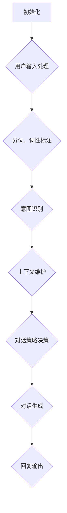

### 核心概念原理之间的关系架构

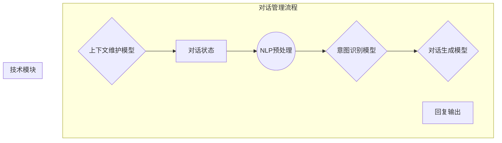

## 第3章：人机交互的数学策略

### 3.1 人机交互的基本理论

人机交互（Human-Computer Interaction，简称HCI）是研究人类与计算机之间交互的学科。它的目标是设计出易于使用、高效和令人愉悦的计算机系统。人机交互的基本理论包括以下几个方面：

- **交互模型**：交互模型是人机交互的理论基础，用于描述用户与计算机系统之间的交互过程。常见的交互模型包括基于事件的交互模型（Event-Driven Model）和基于任务的交互模型（Task-Based Model）。
- **用户行为**：用户行为是指用户在计算机系统上的操作和反应。理解用户行为对于设计高效的交互系统至关重要。用户行为分析可以帮助我们识别用户的需求和痛点，从而进行有针对性的改进。
- **用户体验**：用户体验（User Experience，简称UX）是指用户在使用计算机系统时的整体感受。良好的用户体验可以提升用户满意度、使用频率和系统价值。用户体验包括感知、情感、行为和成就等多个方面。

### 3.2 数学模型在人机交互中的应用

数学模型在优化人机交互方面具有重要作用。通过数学模型，我们可以量化用户行为、评估用户体验，从而设计出更加符合用户需求的交互系统。以下是人机交互中常见的数学模型：

- **决策树（Decision Tree）**：决策树是一种用于分类和回归的数学模型，它可以表示为一系列的决策规则。在交互系统中，决策树可以用于用户意图识别、任务分配等。
- **线性回归（Linear Regression）**：线性回归是一种用于预测的数学模型，它可以表示为线性方程。在交互系统中，线性回归可以用于预测用户行为、优化系统响应时间等。
- **支持向量机（Support Vector Machine，SVM）**：支持向量机是一种用于分类的数学模型，它通过寻找最佳分割超平面来实现分类。在交互系统中，SVM可以用于用户行为分析、错误检测等。
- **马尔可夫决策过程（Markov Decision Process，MDP）**：马尔可夫决策过程是一种用于决策优化的数学模型，它通过评估状态转移概率和奖励函数来选择最佳动作。在交互系统中，MDP可以用于对话管理系统中的策略优化、用户路径预测等。

### 3.3 人机交互中的数学策略

在人机交互中，数学策略可以帮助我们优化用户体验、提升交互效率。以下是人机交互中常见的数学策略：

- **优化算法**：优化算法用于最小化系统目标函数，从而找到最佳解决方案。常见的优化算法包括梯度下降（Gradient Descent）、遗传算法（Genetic Algorithm）和模拟退火（Simulated Annealing）。
- **模型评估**：模型评估用于评估数学模型在交互系统中的性能。常用的评估指标包括准确率（Accuracy）、召回率（Recall）、F1分数（F1 Score）等。
- **自适应系统**：自适应系统可以根据用户行为和交互结果自动调整系统参数，从而优化用户体验。自适应系统通常结合了机器学习和深度学习技术。

### 数学策略在虚拟助手中的应用

数学策略在虚拟助手的开发和应用中发挥了重要作用。以下是一些具体的数学策略及其应用：

- **意图识别**：利用决策树、线性回归等数学模型对用户输入进行意图识别，从而实现高效的对话管理。
- **对话策略优化**：利用马尔可夫决策过程等数学模型对对话策略进行优化，从而提高对话系统的响应质量和用户体验。
- **用户行为预测**：利用用户行为分析模型，如时间序列分析、聚类分析等，预测用户未来行为，从而提供个性化的交互服务。
- **自适应交互**：利用自适应系统技术，根据用户行为和偏好自动调整虚拟助手的交互方式，从而实现更加自然和高效的交互。

### 总结

数学策略为人机交互提供了量化和优化的方法，使得交互系统能够更好地适应用户需求，提升用户体验。本章介绍了人机交互的基本理论、数学模型及其在人机交互中的应用，以及数学策略在虚拟助手中的应用。通过本章的学习，读者可以对人机交互的数学策略有一个全面和深入的了解，为后续章节的学习和实践打下基础。

### Mermaid 流程图：人机交互中的数学策略

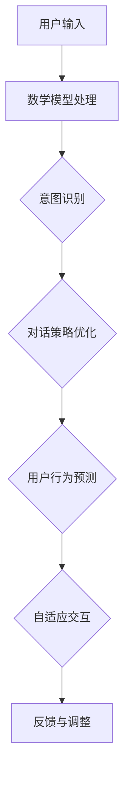

### 人机交互中的数学策略框架

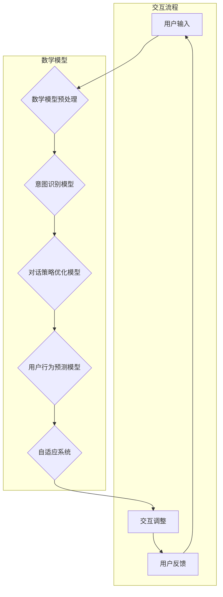

## 第4章：对话策略设计

### 4.1 对话策略的基本概念

对话策略（Dialogue Policy）是指导虚拟助手如何与用户进行交互的决策规则。对话策略的设计直接影响到对话系统的性能和用户体验。对话策略的基本概念包括策略类型、策略目标和策略实现。

- **策略类型**：对话策略可以分为基于规则的策略和基于学习的策略。
  - **基于规则的策略**：基于规则的策略（Rule-Based Policy）是通过预定义的规则来决定对话的下一步行动。这种策略简单直观，但难以处理复杂的和多样化的对话场景。
  - **基于学习的策略**：基于学习的策略（Learning-Based Policy）是通过机器学习或深度学习模型来学习对话场景中的最佳决策。这种策略能够处理复杂的对话场景，但需要大量的数据和计算资源。

- **策略目标**：对话策略的设计目标通常包括：
  - **用户满意度**：提高用户对对话系统的满意度是设计策略的核心目标。
  - **对话效率**：优化对话的流程和响应时间，提高对话系统的效率。
  - **系统资源利用**：合理分配系统资源，确保对话系统能够稳定运行。

- **策略实现**：对话策略的实现可以通过多种技术手段，包括：
  - **决策树**：利用决策树模型来表示对话策略，根据用户输入和当前对话状态进行决策。
  - **强化学习**：利用强化学习模型来学习最佳的对话策略，通过奖励机制来调整策略。
  - **深度学习**：利用深度学习模型，如神经网络，来学习复杂的对话策略。

### 4.2 对话策略的设计原则

对话策略的设计需要遵循一些基本原则，以确保策略的有效性和适用性。

- **灵活性**：对话策略应具备灵活性，能够适应不同的对话场景和用户需求。策略应能够根据用户输入动态调整，以提供个性化的交互体验。
- **可扩展性**：对话策略的设计应具备可扩展性，能够轻松添加新的对话场景和功能。这有助于对话系统在未来的发展中不断演进和优化。
- **可靠性**：对话策略应确保对话的流畅性和一致性，避免出现混淆、中断或错误。策略的设计应考虑系统的稳定性和容错能力。
- **易用性**：对话策略的设计应考虑用户体验，确保用户能够轻松理解和使用对话系统。策略应提供直观的交互界面和简洁的回复。

### 4.3 对话策略的实现方法

对话策略的实现可以分为以下几个步骤：

1. **需求分析**：首先，分析用户需求和场景，确定对话策略的目标和功能。需求分析是策略设计的重要基础，有助于明确策略的需求和约束。
2. **策略设计**：根据需求分析结果，设计对话策略的具体实现方案。策略设计应包括策略类型、策略目标和策略实现方法。常用的策略设计方法包括基于规则的策略设计和基于学习的策略设计。
3. **策略实现**：实现设计好的对话策略。策略实现可以采用多种技术手段，如决策树、强化学习、深度学习等。在实际实现中，应考虑系统的性能、效率和可维护性。
4. **测试与优化**：对实现的对话策略进行测试和优化。测试应覆盖各种对话场景和用户需求，确保策略的可靠性和有效性。优化可以通过调整策略参数、改进算法实现等方式进行。

### 实际应用案例

以下是一个简单的对话策略设计案例，用于一个虚拟客服助手：

- **需求分析**：虚拟客服助手的主要功能是回答用户的问题和解决用户的投诉。需求分析确定了对话策略的目标是提供高效、准确和友好的客服服务。
- **策略设计**：设计基于规则的策略，包括以下规则：
  - 如果用户输入“你好”，回复“你好，欢迎来到我们的客服中心。”
  - 如果用户输入“我有一个问题”，进入问题处理模式，询问具体问题。
  - 如果用户输入“我要投诉”，进入投诉处理模式，询问投诉的具体内容。
- **策略实现**：实现对话策略的代码框架如下：

```python
class VirtualAssistant:
    def __init__(self):
        # 初始化对话状态和规则
        self.state = 'idle'
        self.rules = {
            'greeting': {'pattern': '你好', 'response': '你好，欢迎来到我们的客服中心。'},
            'question': {'pattern': '我有一个问题', 'response': '请告诉我您的问题，我将尽力为您解答。'},
            'complaint': {'pattern': '我要投诉', 'response': '感谢您的投诉，我们将认真处理。请提供详细情况。'}
        }
    
    def handle_input(self, input_text):
        # 处理用户输入
        for rule in self.rules.values():
            if re.match(rule['pattern'], input_text):
                return rule['response']
        return '抱歉，我不太明白您的问题。请您再次说明。'

# 创建虚拟客服助手实例
assistant = VirtualAssistant()
# 模拟用户输入
print(assistant.handle_input("你好"))
print(assistant.handle_input("我有一个问题"))
print(assistant.handle_input("我要投诉"))
```

- **测试与优化**：通过模拟不同的用户输入，测试对话策略的效果。根据测试结果，调整规则和回复，以提高策略的准确性和友好性。

### 总结

对话策略是虚拟助手实现高效、准确和友好交互的关键。本章介绍了对话策略的基本概念、设计原则和实现方法，并通过实际应用案例展示了对话策略的设计和实现过程。通过本章的学习，读者可以了解如何设计有效的对话策略，为构建智能对话系统打下基础。

### Mermaid 流程图：对话策略设计流程

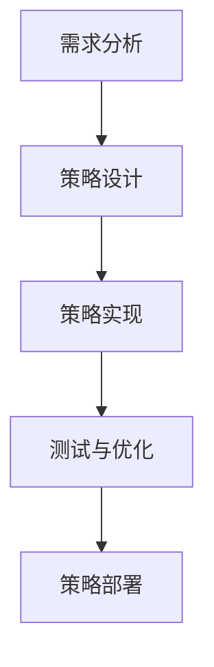

### 对话策略设计框架

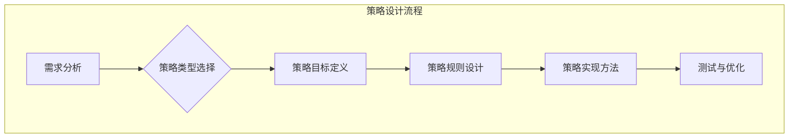

## 第5章：对话上下文管理

### 5.1 对话上下文的定义

对话上下文（Dialogue Context）是虚拟助手在进行对话时必须处理的信息集合。它包括用户的历史输入、对话历史、当前对话状态以及用户的偏好等信息。对话上下文对于确保对话的连贯性和理解用户意图至关重要。

- **用户历史输入**：指用户在过去对话中输入的所有文本或语音信息，这些信息有助于虚拟助手了解用户的背景和偏好。
- **对话历史**：记录对话过程中虚拟助手和用户之间的所有交互历史，包括用户输入、系统回复等。对话历史用于帮助虚拟助手理解当前对话的背景和上下文。
- **当前对话状态**：包括当前对话的状态信息，如用户意图、当前对话轮次、对话的上下文信息等。当前对话状态是虚拟助手生成回复的重要依据。
- **用户偏好**：指用户在特定场景下的偏好信息，如喜欢的商品、习惯的交流方式等。用户偏好有助于虚拟助手提供更加个性化的服务。

### 5.2 对话上下文的管理方法

对话上下文的管理方法主要包括以下几个方面：

- **数据结构**：选择合适的数据结构来存储和跟踪对话上下文。常用的数据结构包括键值对（Key-Value Pair）、树结构（Tree Structure）和图结构（Graph Structure）。键值对结构简单直观，适用于存储少量的上下文信息；树结构适用于层次结构明显的上下文信息；图结构适用于复杂和非层次结构的上下文信息。
- **更新策略**：定义如何更新对话上下文。更新策略应确保上下文信息的准确性和实时性。常用的更新策略包括增量更新和全量更新。增量更新只更新变化的部分，适用于对话过程中少量信息的更新；全量更新则重新加载所有上下文信息，适用于对话重置或上下文信息发生重大变化的情况。
- **存储管理**：确定对话上下文的存储和管理方法。存储管理需要考虑数据的安全性和一致性。常用的存储方法包括关系数据库、NoSQL数据库和内存数据库。关系数据库适用于结构化数据存储；NoSQL数据库适用于海量非结构化数据存储；内存数据库适用于对实时性要求高的对话上下文。

### 5.3 对话上下文的处理策略

对话上下文的处理策略是指如何利用对话上下文信息来生成合理的回复和执行相应的操作。以下是一些常用的处理策略：

- **上下文感知回复**：根据对话上下文生成回复，确保回复与上下文信息的一致性和连贯性。上下文感知回复可以通过自然语言生成（Natural Language Generation，NLG）技术实现，如模板匹配、句子拼接和句子重写等。
- **上下文迁移**：在多轮对话中，将上一轮的上下文信息迁移到当前轮次，以维持对话的连贯性。上下文迁移可以通过维护对话历史和更新当前对话状态来实现。
- **上下文融合**：将不同来源的上下文信息进行融合，形成一个统一的上下文视图。上下文融合可以通过特征提取和融合算法实现，如词嵌入（Word Embedding）和融合网络（Fusion Network）。
- **上下文感知操作**：根据对话上下文执行特定的操作，如查询数据库、调用API等。上下文感知操作可以通过业务逻辑和规则来实现，以确保操作的合理性和安全性。

### 实际应用案例

以下是一个简单的对话上下文管理案例，用于一个在线购物虚拟助手：

- **用户历史输入**：用户输入“我想买一本书”。
- **对话历史**：记录了用户之前询问的商品种类、价格范围等信息。
- **当前对话状态**：包括用户当前询问的商品种类（书籍）、对话轮次和上下文信息。
- **用户偏好**：用户偏好购买价格在50元以下的书籍。

对话上下文管理的流程如下：

1. **初始化上下文**：虚拟助手初始化对话上下文，包括用户历史输入、对话历史、当前对话状态和用户偏好。
2. **更新上下文**：当用户输入新信息时，虚拟助手更新对话上下文，包括添加新输入、更新对话状态和用户偏好。
3. **生成回复**：虚拟助手根据对话上下文生成回复，如“我们这里有几种书籍，价格在50元以下，请问您需要哪方面的书籍？”。
4. **执行操作**：虚拟助手根据对话上下文执行操作，如查询数据库以获取相关书籍信息。

代码实现示例：

```python
class VirtualAssistant:
    def __init__(self):
        self.context = {
            'user_history': [],
            'current_state': {},
            'user_preferences': {}
        }
    
    def update_context(self, input_text, user_preferences=None):
        self.context['user_history'].append(input_text)
        self.context['current_state']['input'] = input_text
        if user_preferences:
            self.context['user_preferences'].update(user_preferences)
    
    def generate_response(self):
        input_text = self.context['current_state']['input']
        if '买' in input_text and '书' in input_text:
            response = "我们这里有几种书籍，价格在50元以下，请问您需要哪方面的书籍？"
        else:
            response = "抱歉，我不太明白您的问题。请您再次说明。"
        return response
    
    def handle_input(self, input_text):
        self.update_context(input_text)
        return self.generate_response()

# 创建虚拟助手实例
assistant = VirtualAssistant()
# 模拟用户输入
print(assistant.handle_input("我想买一本书"))
```

### 总结

对话上下文管理是虚拟助手实现智能交互的重要环节。本章介绍了对话上下文的定义、管理方法和处理策略，并通过实际应用案例展示了对话上下文管理的过程。通过本章的学习，读者可以了解如何有效地管理和利用对话上下文，为构建智能对话系统打下基础。

### Mermaid 流程图：对话上下文管理流程

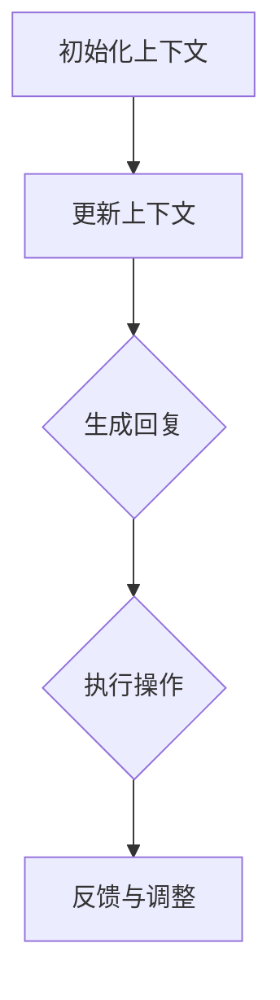

### 对话上下文管理框架

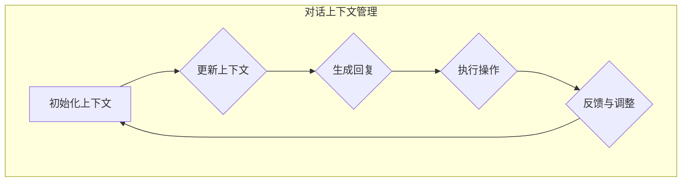

## 第6章：对话生成与回复

### 6.1 对话生成的技术原理

对话生成是虚拟助手生成自然语言回复的过程，其技术原理主要包括自然语言生成（Natural Language Generation，NLG）和对话系统中的回复生成算法。

#### 自然语言生成（NLG）

自然语言生成是一种将非自然语言（如机器码、数据库查询结果等）转换为自然语言文本的技术。NLG技术可以分为以下几种：

- **模板匹配（Template-based）**：模板匹配是将预定义的模板与输入数据相结合，生成回复文本。这种方法简单直观，但灵活性较低。
- **数据驱动（Data-driven）**：数据驱动方法使用大量的训练数据和生成模型来生成回复。常用的方法包括序列到序列（Seq2Seq）模型和变换器（Transformer）模型。
- **知识驱动（Knowledge-driven）**：知识驱动方法利用外部知识库来生成回复。这种方法能够提高回复的准确性和一致性，但需要大量知识库维护和更新。

#### 对话系统中的回复生成算法

对话系统中的回复生成算法旨在根据对话上下文生成自然、流畅且合理的回复。以下是一些常用的回复生成算法：

- **基于规则的回复生成**：这种方法使用预定义的规则来生成回复，适用于简单的对话场景。规则可以是简单的条件判断，也可以是复杂的逻辑推理。
- **基于模板的回复生成**：与模板匹配类似，基于模板的回复生成使用预定义的模板和输入数据来生成回复。这种方法具有较高的灵活性和可控性。
- **基于机器学习的回复生成**：这种方法使用机器学习模型，如循环神经网络（RNN）和变换器（Transformer）模型，通过训练大量对话数据生成回复。这种方法能够生成更加自然和多样化的回复。

### 6.2 对话生成的算法实现

对话生成的算法实现可以分为以下几个步骤：

1. **数据预处理**：对对话数据集进行清洗、去重和标注，确保数据的质量和一致性。数据预处理包括分词、词性标注、实体识别等。
2. **模型训练**：选择合适的机器学习模型进行训练。常用的模型包括循环神经网络（RNN）、长短期记忆网络（LSTM）、变换器（Transformer）和生成对抗网络（GAN）。
3. **模型评估**：使用评估指标（如BLEU、ROUGE、F1分数等）对模型性能进行评估，确保模型能够生成高质量的自然语言回复。
4. **生成回复**：根据对话上下文和模型生成回复。生成回复的过程可以是自动的，也可以是半自动的，即结合人工审查和模型生成的回复。

以下是一个简单的基于变换器模型的对话生成算法实现示例：

```python
import tensorflow as tf
from tensorflow.keras.models import Model
from tensorflow.keras.layers import Input, Embedding, LSTM, Dense, Concatenate

# 模型定义
input_sequence = Input(shape=(None,))
context_sequence = Input(shape=(None,))
embedding_layer = Embedding(vocab_size, embedding_size)(input_sequence)
context_embedding = Embedding(vocab_size, embedding_size)(context_sequence)
lstm_layer = LSTM(units, return_sequences=True)(embedding_layer)
context_layer = LSTM(units, return_sequences=True)(context_embedding)
combined_layer = Concatenate()([lstm_layer, context_layer])
output_layer = Dense(vocab_size, activation='softmax')(combined_layer)

model = Model(inputs=[input_sequence, context_sequence], outputs=output_layer)
model.compile(optimizer='adam', loss='categorical_crossentropy', metrics=['accuracy'])

# 模型训练
model.fit([input_sequences, context_sequences], target_sequences, batch_size=batch_size, epochs=epochs)

# 生成回复
def generate_response(input_sequence, context_sequence):
    predicted_sequence = model.predict([input_sequence, context_sequence])
    response = np.argmax(predicted_sequence, axis=-1)
    return decode_response(response)

# 辅助函数：将数字编码转换为文本
def decode_response(response):
    index_to_word = {index: word for word, index in tokenizer.word_index.items()}
    return ' '.join([index_to_word[word_id] for word_id in response])

# 示例输入和生成回复
input_sequence = tokenizer.texts_to_sequences(["你好。"])
context_sequence = tokenizer.texts_to_sequences(["欢迎来到我们的客服中心。"])
print(generate_response(input_sequence, context_sequence))
```

### 6.3 对话回复的策略优化

对话回复的策略优化是提高虚拟助手交互质量和用户体验的关键。以下是一些常见的策略优化方法：

- **回复多样性**：通过引入多样性机制，如使用不同的模板、选择不同的回复顺序等，增加回复的多样性，避免重复和单调。
- **回复长度控制**：控制回复的长度，避免过长的回复造成用户阅读和理解困难。可以使用截断技术或摘要技术来控制回复长度。
- **回复质量评估**：使用自动评估指标（如BLEU、ROUGE）和人工评估方法对回复质量进行评估，识别和改进低质量的回复。
- **用户反馈机制**：引入用户反馈机制，收集用户对回复的满意度评分，根据反馈调整回复策略，提高用户满意度。
- **自适应回复策略**：根据用户行为和偏好动态调整回复策略，实现个性化交互。例如，对于经常购买某一类商品的用户，可以优先推荐相关商品。

以下是一个简单的基于用户反馈的对话回复策略优化示例：

```python
class VirtualAssistant:
    def __init__(self):
        self.responses = {
            'greeting': '你好，欢迎来到我们的客服中心。',
            'thank_you': '不客气，很高兴能帮助您。',
            'default': '抱歉，我不太明白您的问题。请您再次说明。'
        }
        self.user_feedback = {}

    def update_response(self, user_input, user_rating):
        if user_input not in self.user_feedback:
            self.user_feedback[user_input] = []
        self.user_feedback[user_input].append(user_rating)

    def generate_response(self, user_input):
        response = self.responses.get(user_input, self.responses['default'])
        if len(self.user_feedback[user_input]) > threshold:
            average_rating = sum(self.user_feedback[user_input]) / len(self.user_feedback[user_input])
            if average_rating < low_rating_threshold:
                response = self.responses.get('default', response)
        return response

# 创建虚拟助手实例
assistant = VirtualAssistant()

# 模拟用户交互
assistant.update_response('你好', 5)
assistant.update_response('你好', 4)
assistant.update_response('你好', 3)
print(assistant.generate_response('你好'))
```

### 总结

对话生成与回复是虚拟助手实现智能交互的核心环节。本章介绍了对话生成的技术原理、算法实现和对话回复的策略优化方法。通过本章的学习，读者可以了解如何实现高效的对话生成和回复，为构建智能对话系统提供技术支持。

### Mermaid 流程图：对话生成与回复流程

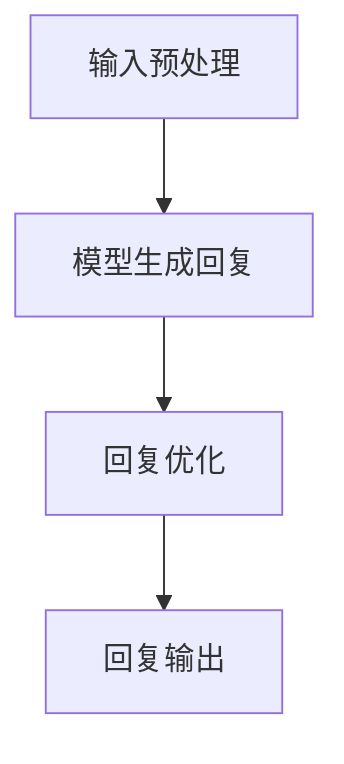

### 对话生成与回复框架

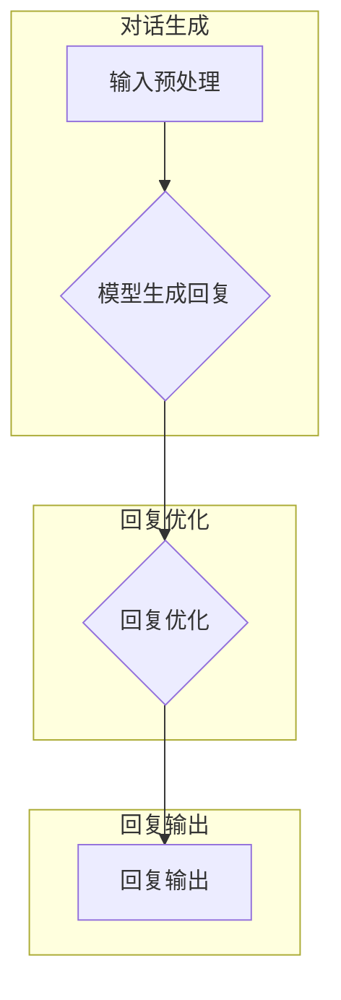

## 第7章：对话系统的评估与优化

### 7.1 对话系统的评估指标

对话系统的评估是确保其性能和用户体验的重要环节。以下是一些常用的评估指标：

- **准确率（Accuracy）**：准确率是衡量对话系统意图识别准确性的指标，计算公式为正确识别的意图数除以总意图数。
  $$
  \text{准确率} = \frac{\text{正确识别的意图数}}{\text{总意图数}}
  $$
  准确率越高，表示对话系统的意图识别能力越强。

- **召回率（Recall）**：召回率是衡量对话系统漏掉实际意图比例的指标，计算公式为正确识别的意图数除以实际意图数。
  $$
  \text{召回率} = \frac{\text{正确识别的意图数}}{\text{实际意图数}}
  $$
  召回率越高，表示对话系统对实际意图的识别越全面。

- **F1分数（F1 Score）**：F1分数是准确率和召回率的调和平均值，计算公式为：
  $$ 
  \text{F1分数} = 2 \times \frac{\text{准确率} \times \text{召回率}}{\text{准确率} + \text{召回率}}
  $$
  F1分数综合考虑了准确率和召回率，是评估对话系统性能的常用指标。

- **用户满意度（User Satisfaction）**：用户满意度是通过用户反馈问卷或用户调查来评估用户对对话系统的满意度。用户满意度越高，表示对话系统越符合用户期望。

- **响应时间（Response Time）**：响应时间是衡量对话系统处理用户请求所需的时间。响应时间越短，表示对话系统的响应速度越快。

- **错误率（Error Rate）**：错误率是衡量对话系统产生错误回答的比例。错误率越低，表示对话系统的质量越高。

### 7.2 对话系统的优化方法

对话系统的优化旨在提高其性能和用户体验。以下是一些常用的优化方法：

- **数据增强**：通过生成更多的训练数据或对现有数据进行扩展，提高对话系统的训练效果。常用的数据增强方法包括数据合成、同义词替换和语言风格转换等。

- **模型调整**：通过调整模型参数和结构，优化对话系统的性能。常用的调整方法包括超参数优化、模型架构改进和损失函数调整等。

- **特征工程**：通过提取和选择对对话系统性能有显著影响的特征，提高系统的意图识别和回复生成能力。特征工程可以基于语言特征、语义特征和上下文特征等。

- **强化学习**：利用强化学习算法，通过奖励机制训练对话系统，提高其互动性和响应质量。强化学习可以用于策略优化、回复生成和用户行为预测等。

- **在线学习**：通过实时更新模型和策略，使对话系统能够适应不断变化的需求和环境。在线学习可以基于增量学习、迁移学习和持续学习等技术。

### 7.3 对话系统的持续改进策略

对话系统的持续改进是确保其长期有效性和用户体验的关键。以下是一些常用的持续改进策略：

- **用户反馈收集**：定期收集用户反馈，了解用户对对话系统的满意度、使用情况和改进需求。用户反馈可以用于识别问题和优化对话系统。

- **性能监控**：通过监控对话系统的性能指标（如准确率、响应时间和错误率等），及时发现和解决性能问题。性能监控可以基于实时数据分析和异常检测技术。

- **迭代开发**：采用迭代开发模式，不断迭代和改进对话系统。每个迭代周期应包括需求分析、设计、开发、测试和部署等阶段。

- **持续学习**：通过持续学习和优化，使对话系统能够适应不断变化的需求和环境。持续学习可以基于在线学习和数据驱动方法。

- **跨领域应用**：将对话系统应用于不同领域和场景，提高其泛化能力和实用性。跨领域应用可以基于领域自适应和迁移学习技术。

### 实际应用案例

以下是一个对话系统优化和持续改进的实际案例：

- **问题识别**：通过用户反馈和性能监控，发现对话系统在处理长句子和复杂意图时的识别准确率较低。

- **数据增强**：收集更多包含长句子的对话数据，并对现有数据进行扩展，生成更多的训练样本。

- **模型调整**：调整模型的超参数和架构，优化意图识别和回复生成的效果。

- **特征工程**：引入新的特征，如句子长度、词向量等，以提高模型的识别能力。

- **在线学习**：采用在线学习技术，实时更新模型和策略，提高对话系统的适应性。

- **用户反馈收集**：定期收集用户反馈，识别对话系统的新问题和改进需求。

- **迭代开发**：根据用户反馈和性能监控结果，进行迭代开发，逐步优化对话系统的性能和用户体验。

- **跨领域应用**：将对话系统应用于不同的领域和场景，如客服、教育和医疗等，提高其泛化能力和实用性。

### 总结

对话系统的评估与优化是确保其性能和用户体验的重要环节。本章介绍了对话系统的评估指标、优化方法和持续改进策略。通过实际应用案例，展示了对话系统优化和改进的过程。通过本章的学习，读者可以了解如何评估和优化对话系统，为构建高质量的虚拟助手提供指导。

### Mermaid 流程图：对话系统评估与优化流程

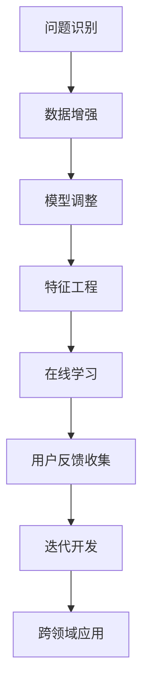

### 对话系统评估与优化框架

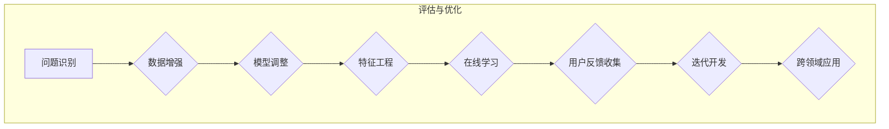

## 第8章：基于机器学习的对话管理

### 8.1 机器学习的基本原理

机器学习（Machine Learning，ML）是人工智能（AI）的核心技术之一，它使计算机系统能够从数据中学习和改进性能。机器学习的基本原理包括以下几个关键概念：

- **特征提取**：特征提取是指从原始数据中提取对问题解决有帮助的信息。特征提取是机器学习的重要步骤，因为它直接影响到模型的学习效果和泛化能力。
- **监督学习**：监督学习是一种机器学习范式，其中模型通过学习标注数据进行训练。标注数据包含输入（特征）和对应的输出（标签）。监督学习的目标是找到输入和输出之间的映射关系。
- **无监督学习**：无监督学习是一种机器学习范式，其中模型在没有标签数据的情况下从原始数据中学习。无监督学习的目标通常是发现数据中的结构和模式。
- **深度学习**：深度学习是一种基于多层神经网络进行特征提取和建模的机器学习方法。深度学习在图像识别、语音识别和自然语言处理等领域取得了显著的成果。

### 8.2 机器学习在对话管理系统中的应用

机器学习在对话管理系统中的应用非常广泛，包括意图识别、对话策略优化和回复生成等。以下是一些典型的应用场景：

- **意图识别**：意图识别是对话管理的重要环节，其目标是从用户输入中识别出用户的意图。机器学习模型，如分类器（Classifier）和支持向量机（SVM），可以用于意图识别。通过训练大量标注的对话数据，模型可以学习到不同意图的特征，从而准确识别用户的意图。

- **对话策略优化**：对话策略优化是指通过机器学习模型来优化对话系统的决策过程。强化学习（Reinforcement Learning，RL）是一种常用的机器学习方法，它通过奖励机制来调整对话策略，从而提高对话系统的性能。强化学习可以用于多轮对话的场景，模型通过不断尝试和反馈来优化策略。

- **回复生成**：回复生成是指根据对话上下文生成自然语言回复。生成对抗网络（Generative Adversarial Networks，GAN）和变换器（Transformer）是两种常用的生成模型，它们可以生成高质量的自然语言回复。通过训练大量对话数据，生成模型可以学习到不同情境下的回复模式，从而生成符合上下文的回复。

### 8.3 基于机器学习的对话管理案例

以下是一个基于机器学习的对话管理案例，展示如何实现意图识别和回复生成：

#### 案例背景

一个在线购物平台的客服系统需要识别用户输入的意图并生成合适的回复。该系统面临以下挑战：

- 用户输入多样，包含不同长度、格式和语义的文本。
- 需要快速识别用户的意图，以便提供高效的客服服务。
- 需要生成自然、流畅且符合上下文的回复。

#### 解决方案

1. **数据收集与预处理**：

   - 收集大量标注的对话数据，包括用户输入和系统回复。
   - 对数据进行预处理，包括分词、去停用词、词性标注等。

2. **意图识别**：

   - 使用监督学习模型，如支持向量机（SVM）或长短期记忆网络（LSTM），进行意图识别。
   - 特征提取：将用户输入文本转换为词嵌入向量。
   - 模型训练：使用标注数据进行模型训练，并使用交叉验证评估模型性能。

3. **回复生成**：

   - 使用生成对抗网络（GAN）或变换器（Transformer）进行回复生成。
   - 特征提取：将对话上下文和意图识别结果转换为生成模型的输入向量。
   - 模型训练：使用对话数据进行模型训练，并使用预训练语言模型进行优化。

4. **系统实现**：

   - 开发基于机器学习的对话管理模块，包括意图识别和回复生成。
   - 实现用户输入处理、意图识别和回复生成的接口。

#### 实现步骤

1. 数据预处理：

   ```python
   import numpy as np
   from keras.preprocessing.text import Tokenizer
   from keras.preprocessing.sequence import pad_sequences

   # 数据预处理函数
   def preprocess_data(data):
       tokenizer = Tokenizer(num_words=max_words)
       tokenizer.fit_on_texts(data)
       sequences = tokenizer.texts_to_sequences(data)
       padded_sequences = pad_sequences(sequences, maxlen=max_sequence_length)
       return padded_sequences

   # 示例数据
   user_inputs = ["我想买一本书", "请问有什么优惠吗？", "能否推荐一本好书？"]
   system_responses = ["我们这里有几种书籍，价格在50元以下，请问您需要哪方面的书籍？", "目前没有优惠活动", "推荐您阅读《人工智能入门》"]

   # 预处理用户输入和系统回复
   user_input_sequences = preprocess_data(user_inputs)
   system_response_sequences = preprocess_data(system_responses)
   ```

2. 意图识别：

   ```python
   from keras.models import Sequential
   from keras.layers import Dense, LSTM, Embedding
   from keras.optimizers import Adam

   # 意图识别模型
   model = Sequential()
   model.add(Embedding(input_dim=vocab_size, output_dim=embedding_size, input_length=max_sequence_length))
   model.add(LSTM(units=128))
   model.add(Dense(num_classes, activation='softmax'))

   # 编译模型
   model.compile(optimizer=Adam(learning_rate=0.001), loss='categorical_crossentropy', metrics=['accuracy'])

   # 训练模型
   model.fit(user_input_sequences, labels, epochs=10, batch_size=32, validation_split=0.2)
   ```

3. 回复生成：

   ```python
   from keras.models import Model
   from keras.layers import Input, LSTM, Dense

   # 回复生成模型
   input_sequence = Input(shape=(max_sequence_length,))
   embedding = Embedding(input_dim=vocab_size, output_dim=embedding_size)(input_sequence)
   lstm = LSTM(units=128)(embedding)
   output = Dense(vocab_size, activation='softmax')(lstm)

   model = Model(inputs=input_sequence, outputs=output)

   # 编译模型
   model.compile(optimizer=Adam(learning_rate=0.001), loss='categorical_crossentropy', metrics=['accuracy'])

   # 训练模型
   model.fit(input_sequences, system_response_sequences, epochs=10, batch_size=32, validation_split=0.2)
   ```

4. 系统实现：

   ```python
   # 系统接口
   class VirtualAssistant:
       def __init__(self):
           self.intent_model = load_intent_model()
           self.response_model = load_response_model()

       def handle_input(self, input_text):
           # 意图识别
           input_sequence = preprocess_text(input_text)
           intent = self.intent_model.predict(input_sequence)

           # 回复生成
           response_sequence = self.response_model.predict(input_sequence)
           response_text = decode_response(response_sequence)

           return response_text

       def decode_response(self, sequence):
           # 将序列转换为文本
           index_to_word = {index: word for word, index in tokenizer.word_index.items()}
           return ' '.join([index_to_word[word_id] for word_id in sequence])

   # 创建虚拟助手实例
   assistant = VirtualAssistant()

   # 模拟用户输入
   input_text = "请问有什么优惠吗？"
   response = assistant.handle_input(input_text)
   print(response)
   ```

### 总结

基于机器学习的对话管理是构建高效、智能对话系统的重要技术。本章介绍了机器学习的基本原理以及在对话管理系统中的应用。通过一个实际案例，展示了如何实现意图识别和回复生成。通过本章的学习，读者可以了解如何利用机器学习技术提升对话系统的性能和用户体验。

### Mermaid 流程图：基于机器学习的对话管理流程

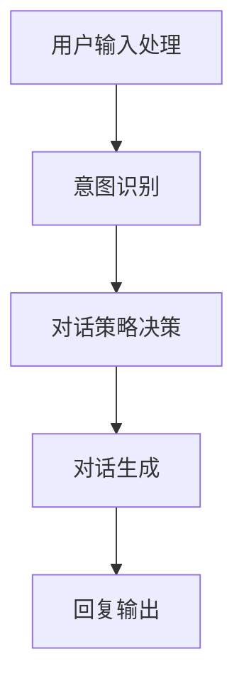

### 对话管理系统的机器学习框架

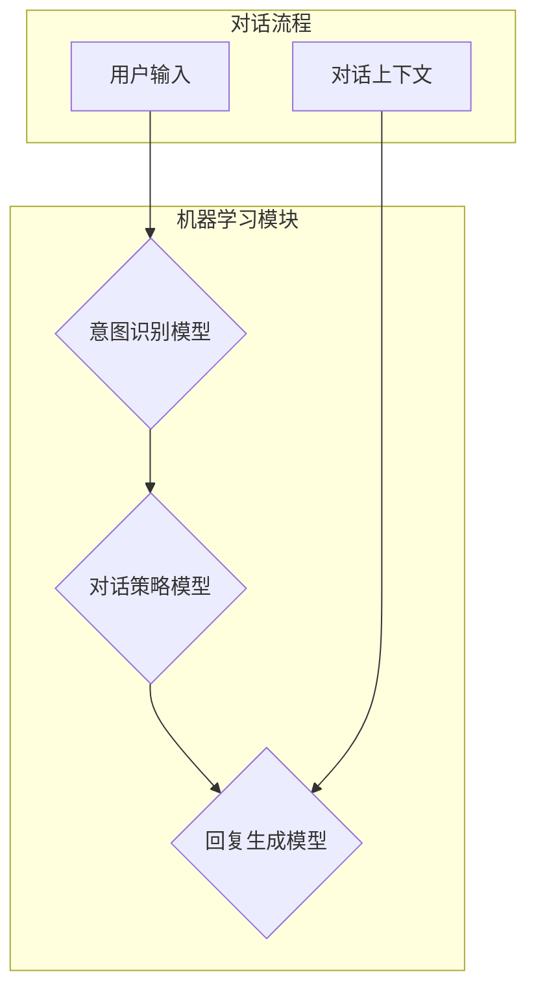

## 第9章：基于深度学习的对话管理

### 9.1 深度学习的基本原理

深度学习（Deep Learning，DL）是机器学习（Machine Learning，ML）的一个重要分支，其核心在于通过构建多层神经网络来提取数据中的特征，从而实现复杂的模式识别和预测任务。深度学习的基本原理包括以下几个关键概念：

- **神经网络（Neural Network）**：神经网络是由大量神经元（或节点）组成的计算模型，这些神经元通过权重连接在一起，形成一种层次化的结构。神经网络可以模拟人脑的神经元连接方式，通过学习输入和输出之间的映射关系来解决问题。
- **多层感知器（Multilayer Perceptron，MLP）**：多层感知器是一种最简单的深度学习模型，它包括一个输入层、一个输出层和一个或多个隐藏层。每个神经元都与前一层的所有神经元相连，通过激活函数（如Sigmoid、ReLU）进行非线性变换。
- **反向传播（Backpropagation）**：反向传播是一种用于训练神经网络的算法，其核心思想是通过计算输出误差，将误差反向传播到网络中的每个神经元，从而更新网络权值，优化模型性能。
- **深度神经网络（Deep Neural Network，DNN）**：深度神经网络是一种包含多个隐藏层的神经网络，通过增加隐藏层的数量，深度神经网络能够提取更加复杂和抽象的特征，从而提高模型的表现力。
- **卷积神经网络（Convolutional Neural Network，CNN）**：卷积神经网络是一种专门用于处理图像数据的神经网络，其核心在于通过卷积层提取图像特征，通过池化层减少参数数量，提高模型的表达能力和训练速度。
- **循环神经网络（Recurrent Neural Network，RNN）**：循环神经网络是一种能够处理序列数据的神经网络，其核心在于通过循环结构将当前输入与历史状态信息结合，从而实现长距离依赖的建模。
- **长短时记忆网络（Long Short-Term Memory，LSTM）**：长短时记忆网络是循环神经网络的一种变种，通过引入门控机制，能够有效地解决传统RNN在长序列处理中的梯度消失和梯度爆炸问题。
- **变换器（Transformer）**：变换器是一种基于自注意力机制的深度学习模型，其核心在于通过多头自注意力机制（Multi-Head Self-Attention）和位置编码（Positional Encoding）来捕捉序列之间的复杂关系。

### 9.2 深度学习在对话管理系统中的应用

深度学习在对话管理系统中的应用非常广泛，尤其在意图识别、对话生成和上下文理解等方面取得了显著成果。以下是一些典型的应用场景：

- **意图识别**：意图识别是对话管理系统中的关键步骤，其目标是从用户输入中识别出用户的意图。深度学习模型，如卷积神经网络（CNN）和长短时记忆网络（LSTM），可以用于意图识别。通过训练大量标注的对话数据，模型可以学习到不同意图的特征，从而准确识别用户的意图。

- **对话生成**：对话生成是指根据对话上下文生成自然语言回复。变换器（Transformer）是一种基于自注意力机制的深度学习模型，其能够生成高质量的自然语言回复。通过训练大量对话数据，变换器可以学习到不同情境下的回复模式，从而生成符合上下文的回复。

- **上下文理解**：上下文理解是确保对话连贯性的关键，其目标是从对话上下文中提取有用信息，帮助模型更好地理解用户意图。深度学习模型，如循环神经网络（RNN）和长短时记忆网络（LSTM），可以用于上下文理解。通过学习对话历史和当前输入，模型可以捕捉对话的长期依赖关系，从而更好地理解上下文。

### 9.3 基于深度学习的对话管理案例

以下是一个基于深度学习的对话管理案例，展示如何实现意图识别和对话生成：

#### 案例背景

一个在线购物平台的客服系统需要实现意图识别和对话生成，以提供高效的客服服务。该系统面临以下挑战：

- 用户输入多样，包含不同长度、格式和语义的文本。
- 需要快速识别用户的意图，以便提供高效的客服服务。
- 需要生成自然、流畅且符合上下文的回复。

#### 解决方案

1. **数据收集与预处理**：

   - 收集大量标注的对话数据，包括用户输入和系统回复。
   - 对数据进行预处理，包括分词、去停用词、词性标注等。

2. **意图识别**：

   - 使用卷积神经网络（CNN）进行意图识别。
   - 特征提取：将用户输入文本转换为词嵌入向量。
   - 模型训练：使用标注数据进行模型训练，并使用交叉验证评估模型性能。

3. **对话生成**：

   - 使用变换器（Transformer）进行对话生成。
   - 特征提取：将对话上下文和意图识别结果转换为生成模型的输入向量。
   - 模型训练：使用对话数据进行模型训练，并使用预训练语言模型进行优化。

4. **系统实现**：

   - 开发基于深度学习的对话管理模块，包括意图识别和对话生成。
   - 实现用户输入处理、意图识别和对话生成的接口。

#### 实现步骤

1. 数据预处理：

   ```python
   import numpy as np
   from keras.preprocessing.text import Tokenizer
   from keras.preprocessing.sequence import pad_sequences

   # 数据预处理函数
   def preprocess_data(data):
       tokenizer = Tokenizer(num_words=max_words)
       tokenizer.fit_on_texts(data)
       sequences = tokenizer.texts_to_sequences(data)
       padded_sequences = pad_sequences(sequences, maxlen=max_sequence_length)
       return padded_sequences

   # 示例数据
   user_inputs = ["我想买一本书", "请问有什么优惠吗？", "能否推荐一本好书？"]
   system_responses = ["我们这里有几种书籍，价格在50元以下，请问您需要哪方面的书籍？", "目前没有优惠活动", "推荐您阅读《人工智能入门》"]

   # 预处理用户输入和系统回复
   user_input_sequences = preprocess_data(user_inputs)
   system_response_sequences = preprocess_data(system_responses)
   ```

2. 意图识别：

   ```python
   from keras.models import Sequential
   from keras.layers import Dense, LSTM, Embedding, Conv1D, MaxPooling1D
   from keras.optimizers import Adam

   # 意图识别模型
   model = Sequential()
   model.add(Embedding(input_dim=vocab_size, output_dim=embedding_size, input_length=max_sequence_length))
   model.add(Conv1D(filters=128, kernel_size=5, activation='relu'))
   model.add(MaxPooling1D(pool_size=5))
   model.add(LSTM(units=128))
   model.add(Dense(num_classes, activation='softmax'))

   # 编译模型
   model.compile(optimizer=Adam(learning_rate=0.001), loss='categorical_crossentropy', metrics=['accuracy'])

   # 训练模型
   model.fit(user_input_sequences, labels, epochs=10, batch_size=32, validation_split=0.2)
   ```

3. 对话生成：

   ```python
   from keras.models import Model
   from keras.layers import Input, LSTM, Dense, Embedding, Concatenate

   # 对话生成模型
   input_sequence = Input(shape=(max_sequence_length,))
   embedding = Embedding(input_dim=vocab_size, output_dim=embedding_size)(input_sequence)
   lstm = LSTM(units=128)(embedding)
   output = Dense(vocab_size, activation='softmax')(lstm)

   model = Model(inputs=input_sequence, outputs=output)

   # 编译模型
   model.compile(optimizer=Adam(learning_rate=0.001), loss='categorical_crossentropy', metrics=['accuracy'])

   # 训练模型
   model.fit(input_sequences, system_response_sequences, epochs=10, batch_size=32, validation_split=0.2)
   ```

4. 系统实现：

   ```python
   # 系统接口
   class VirtualAssistant:
       def __init__(self):
           self.intent_model = load_intent_model()
           self.response_model = load_response_model()

       def handle_input(self, input_text):
           # 意图识别
           input_sequence = preprocess_text(input_text)
           intent = self.intent_model.predict(input_sequence)

           # 对话生成
           response_sequence = self.response_model.predict(input_sequence)
           response_text = decode_response(response_sequence)

           return response_text

       def decode_response(self, sequence):
           # 将序列转换为文本
           index_to_word = {index: word for word, index in tokenizer.word_index.items()}
           return ' '.join([index_to_word[word_id] for word_id in sequence])

   # 创建虚拟助手实例
   assistant = VirtualAssistant()

   # 模拟用户输入
   input_text = "请问有什么优惠吗？"
   response = assistant.handle_input(input_text)
   print(response)
   ```

### 总结

基于深度学习的对话管理是构建高效、智能对话系统的重要技术。本章介绍了深度学习的基本原理以及在对话管理系统中的应用。通过一个实际案例，展示了如何实现意图识别和对话生成。通过本章的学习，读者可以了解如何利用深度学习技术提升对话系统的性能和用户体验。

### Mermaid 流程图：基于深度学习的对话管理流程


### 对话管理系统的深度学习框架


## 第10章：虚拟助手的数学策略应用

### 10.1 虚拟助手数学策略的优势

虚拟助手数学策略在人工智能领域发挥着重要作用，其优势主要体现在以下几个方面：

1. **精确性和高效性**：数学策略通过使用精确的数学模型和算法，能够对用户行为和对话内容进行精确分析和处理，从而提高虚拟助手的响应速度和准确性。

2. **适应性和灵活性**：数学策略可以根据不同的应用场景和用户需求，灵活调整模型参数和算法，实现个性化的交互服务。这使得虚拟助手能够更好地适应不同的业务场景和用户群体。

3. **可扩展性**：数学策略可以通过模块化设计，将不同的算法和模型组合起来，构建复杂、高效的虚拟助手系统。这种可扩展性使得虚拟助手能够在不断发展的技术环境中持续优化和改进。

4. **优化用户体验**：数学策略通过优化对话流程、提高响应质量和个性化服务水平，能够显著提升用户的交互体验和满意度。

5. **降低运营成本**：通过自动化的交互流程和智能化的决策，虚拟助手可以显著降低人工客服的负担，从而减少运营成本，提高工作效率。

### 10.2 虚拟助手数学策略的挑战

尽管虚拟助手数学策略具有显著优势，但在实际应用中也面临一些挑战：

1. **数据质量和多样性**：数学策略的性能很大程度上依赖于训练数据的质量和多样性。如果数据不够丰富或存在偏差，可能导致模型泛化能力不足，从而影响虚拟助手的性能。

2. **计算资源需求**：一些复杂的数学模型和算法需要大量的计算资源，这在资源有限的设备上可能难以实现。此外，实时处理大规模数据集也要求高效的计算架构和优化算法。

3. **复杂性问题**：在处理复杂对话和多样化用户需求时，虚拟助手可能难以完全理解用户意图，导致交互效果不理想。这需要更先进的数学模型和算法来应对。

4. **隐私和安全**：虚拟助手在交互过程中会收集和处理大量用户数据，如何确保数据隐私和安全是一个重要挑战。需要采取有效的数据保护和加密措施来保障用户权益。

5. **动态环境适应性**：虚拟助手需要具备在动态变化的环境中持续学习和适应的能力，这要求数学策略能够适应实时数据和变化的环境，实现持续优化。

### 10.3 虚拟助手数学策略的未来发展趋势

随着人工智能技术的不断进步，虚拟助手数学策略在未来将呈现出以下发展趋势：

1. **增强的智能水平**：通过引入更多先进的机器学习和深度学习技术，虚拟助手的智能水平将得到显著提升。例如，利用生成对抗网络（GAN）和强化学习（RL）等技术，虚拟助手将能够生成更加自然和丰富的回复。

2. **跨模态交互**：虚拟助手将不再局限于单一模态的交互，而是能够同时处理文本、语音、图像等多种模态的数据，实现更自然和丰富的用户交互。

3. **个性化服务**：通过更精细的用户行为分析和偏好学习，虚拟助手将能够提供更加个性化的服务，满足用户的多样化需求。

4. **自动化的策略优化**：借助自动化机器学习（AutoML）和强化学习，虚拟助手将能够自动调整策略参数和算法，实现自我优化和适应。

5. **隐私保护和安全**：随着隐私保护和数据安全意识的提高，虚拟助手将采取更严格的隐私保护措施，确保用户数据的隐私和安全。

6. **云计算和边缘计算的结合**：虚拟助手将充分利用云计算和边缘计算的优势，实现分布式计算和数据存储，提高系统的性能和可靠性。

### 总结

虚拟助手数学策略在人工智能领域具有广泛应用前景，其优势在于精确性、高效性、适应性和灵活性。然而，在应用过程中也面临数据质量、计算资源、复杂性、隐私和安全等方面的挑战。未来，随着技术的不断进步，虚拟助手数学策略将呈现出智能化、跨模态、个性化、自动化和安全化的发展趋势，为人工智能领域带来更多创新和突破。

### 附录A：对话管理相关的开源工具与资源

#### A.1 对话管理开源框架介绍

对话管理系统（Dialogue Management System，DMS）是虚拟助手的核心组成部分，开源框架为此提供了丰富的工具和资源。以下是一些知名的对话管理开源框架及其特点：

1. **Rasa**：
   - **概述**：Rasa是一个基于机器学习的对话管理框架，支持对话策略优化和自然语言理解。
   - **特点**：使用Python编写，支持自定义动作和意图识别，提供丰富的API和集成工具，适用于文本和语音交互。
   - **适用场景**：适用于构建复杂的对话系统，如聊天机器人、客服助手等。

2. **DialogueFlow**：
   - **概述**：DialogueFlow是一个基于Web的对话管理平台，支持流程图式的对话流程设计。
   - **特点**：提供直观的用户界面，支持自定义对话节点和动作，易于集成到现有应用中。
   - **适用场景**：适用于构建简单的对话系统，如营销机器人、教育辅导系统等。

3. **Conversational AI Framework**：
   - **概述**：Conversational AI Framework是一个开源的对话管理框架，支持多种对话管理策略和自然语言理解技术。
   - **特点**：使用JavaScript编写，支持多种前端框架（如React、Vue等）集成，提供丰富的API和插件。
   - **适用场景**：适用于构建基于Web的对话系统，如在线客服、聊天机器人等。

#### A.2 对话管理开源数据集介绍

对话数据集是训练对话管理模型的重要资源，以下是一些常用的对话数据集及其特点：

1. **SQuAD（Stanford Question Answering Dataset）**：
   - **概述**：SQuAD是一个大规模的问答数据集，包含数万个问题-答案对。
   - **特点**：数据集问题覆盖多种领域，有助于训练模型的多领域问答能力。
   - **适用场景**：适用于训练问答系统、对话生成模型等。

2. **Daily Dialogues**：
   - **概述**：Daily Dialogues是一个包含日常对话的数据集，由真实用户对话组成。
   - **特点**：数据集对话内容丰富，覆盖多种话题，有助于训练模型的日常交互能力。
   - **适用场景**：适用于训练日常对话系统、虚拟助手等。

3. **Mozilla Dialog System**：
   - **概述**：Mozilla Dialog System是一个包含多轮对话的数据集，涵盖多种主题。
   - **特点**：数据集包含丰富的对话轮次，有助于训练模型的多轮对话能力。
   - **适用场景**：适用于训练多轮对话系统、对话管理模型等。

#### A.3 对话管理开源实现示例

以下是一个简单的对话管理实现示例，使用Rasa框架：

```python
# 导入Rasa模块
from rasa.core import TrainingData
from rasa.core import Action
from rasa.core import Domain
from rasa.core.policies import Policy
from rasa.core.interpreter import RasaNLUInterpreter

# 创建训练数据
training_data = TrainingData(
    domain=Domain.from_files("data/demonstrator/dataset.yml"),
    stories="data/demonstrator/stories.yml"
)

# 定义动作
class GreetAction(Action):
    def name(self):
        return "action_greet"

    def run(self, dispatcher, tracker, domain):
        dispatcher.utter_message("Hello!")
        return []

# 创建策略
class GreetPolicy(Policy):
    def train_policy(self, model_directory, training_data):
        self.model_directory = model_directory
        self.model = Policy.from_params({Policy.entity: "policy.yml"})

    def predict_action_probabilities(self, tracker):
        return self.model.predict_action_probabilities(tracker)

# 创建虚拟助手
interpreter = RasaNLUInterpreter("models/nlu/default")
agent = RasaCoreAgent(
    training_data=training_data,
    policy=Policy.from_params({Policy.entity: "policy.yml"}),
    interpreter=interpreter
)

# 运行虚拟助手
agent.run_interpreter()
```

### 总结

附录A介绍了对话管理相关的开源工具与资源，包括开源框架、数据集和实现示例。这些工具和资源为开发者提供了丰富的资源和参考，有助于构建高效的对话管理系统。

### 附录B：数学策略相关的数学公式与算法

#### B.1 数学策略的基本数学公式

在虚拟助手的对话管理中，常用的数学策略包括概率模型、优化算法和机器学习模型等。以下是一些基本的数学公式：

1. **贝叶斯公式**：
   $$
   P(A|B) = \frac{P(B|A)P(A)}{P(B)}
   $$
   贝叶斯公式用于计算在已知事件B发生的情况下，事件A发生的概率。

2. **熵（Entropy）**：
   $$
   H(X) = -\sum_{i} p(x_i) \log_2(p(x_i))
   $$
   熵用于衡量随机变量的不确定性。

3. **交叉熵（Cross-Entropy）**：
   $$
   H(Y, X) = -\sum_{i} p(y_i) \log_2(p(x_i))
   $$
   交叉熵用于衡量两个概率分布之间的差异。

4. **梯度下降（Gradient Descent）**：
   $$
   w_{t+1} = w_t - \alpha \cdot \nabla J(w_t)
   $$
   梯度下降是一种优化算法，用于最小化目标函数J(w)。

5. **反向传播（Backpropagation）**：
   $$
   \delta = \frac{\partial L}{\partial z}
   $$
   反向传播是一种训练神经网络的算法，用于计算网络中每个神经元的误差。

#### B.2 对话管理中的常用算法

在对话管理中，常用的算法包括意图识别、对话生成和策略优化等。以下是一些常用算法：

1. **朴素贝叶斯分类器（Naive Bayes Classifier）**：
   朴素贝叶斯分类器是一种基于贝叶斯公式和特征条件独立假设的分类算法。
   $$
   P(\text{class} = c | x) = \frac{P(x | \text{class} = c)P(\text{class} = c)}{P(x)}
   $$

2. **支持向量机（Support Vector Machine，SVM）**：
   支持向量机是一种用于分类和回归的监督学习算法，通过最大化分类边界间隔来寻找最优决策边界。
   $$
   \max_{w, b} \left\{ \frac{1}{2} ||w||^2 - C \sum_{i} \xi_i \right\}
   $$
   其中，$C$ 是惩罚参数，$\xi_i$ 是误差项。

3. **长短时记忆网络（Long Short-Term Memory，LSTM）**：
   长短时记忆网络是一种用于处理序列数据的循环神经网络，通过引入门控机制来解决长距离依赖问题。
   $$
   h_t = \sigma(W_h \cdot [h_{t-1}, x_t] + b_h)
   $$
   其中，$h_t$ 是当前隐藏状态，$x_t$ 是当前输入。

4. **变换器（Transformer）**：
   变换器是一种基于自注意力机制的深度学习模型，用于处理序列数据，通过多头自注意力机制来捕捉序列之间的复杂关系。
   $$
   \text{Attention}(Q, K, V) = \frac{QK^T}{\sqrt{d_k}}V
   $$
   其中，$Q, K, V$ 分别是查询向量、键向量和值向量，$d_k$ 是键向量的维度。

#### B.3 数学策略的应用实例及代码示例

以下是一个简单的意图识别应用实例，使用朴素贝叶斯分类器进行实现：

```python
import numpy as np
from sklearn.feature_extraction.text import CountVectorizer
from sklearn.naive_bayes import MultinomialNB

# 示例数据
data = [
    ["你好", "你好"],
    ["我想买一本书", "购买书籍"],
    ["你能帮我查一下天气吗", "查询天气"],
]

# 特征提取
vectorizer = CountVectorizer()
X = vectorizer.fit_transform([text[0] for text in data])
y = np.array([text[1] for text in data])

# 模型训练
model = MultinomialNB()
model.fit(X, y)

# 意图识别
input_text = "请问有什么优惠吗？"
input_vector = vectorizer.transform([input_text])

predicted_intent = model.predict(input_vector)
print(predicted_intent)
```

### 总结

附录B介绍了对话管理中常用的数学公式和算法，包括概率模型、优化算法和机器学习模型等。通过简单的代码示例，展示了如何应用这些数学策略进行意图识别。这些数学策略为构建高效的对话管理系统提供了理论基础和实践指导。通过附录B的学习，读者可以更好地理解和应用数学策略，提高对话系统的性能和用户体验。

