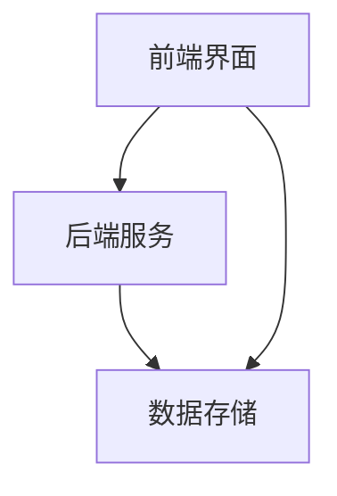

                 


### 文章标题：虚拟员工培训师：提示词设计企业培训课程

> 关键词：虚拟员工培训师、提示词设计、企业培训课程、自然语言处理、系统架构

> 摘要：本文将探讨虚拟员工培训师的定义、技术基础、系统架构，以及提示词设计在企业培训课程中的应用。通过深入分析提示词设计原理、技巧和应用案例，本文旨在为读者提供一套完整、实用的虚拟员工培训师培训课程设计方法，以提升企业培训效果。

### 第一部分：理解虚拟员工培训师

#### 第1章：虚拟员工培训师的概念

##### 1.1 虚拟员工培训师的定义

虚拟员工培训师是指利用人工智能技术，模拟人类培训师进行企业内部培训的人工智能系统。通过自然语言处理、机器学习等技术，虚拟员工培训师能够理解员工的问题，提供针对性的培训内容，从而提高员工的专业技能和工作效率。

##### 1.2 虚拟员工培训师的特点

1. 个性化：虚拟员工培训师可以根据员工的需求和兴趣，提供定制化的培训内容。
2. 可持续性：虚拟员工培训师可以24小时在线，随时为员工提供培训服务。
3. 成本效益：虚拟员工培训师可以减少企业对实体培训师的需求，降低培训成本。
4. 数据驱动：虚拟员工培训师可以收集员工的学习数据，为企业的培训决策提供依据。

##### 1.3 虚拟员工培训师的分类

根据应用场景和功能，虚拟员工培训师可以分为以下几类：

1. 基础技能培训师：提供基础技能培训，如办公软件操作、编程基础等。
2. 专业技能培训师：提供专业技能培训，如产品知识、市场营销等。
3. 个性定制培训师：根据员工的兴趣和需求，提供个性化的培训内容。
4. 综合能力培训师：提供跨领域、跨专业的综合能力培训，如团队协作、领导力等。

#### 第2章：虚拟员工培训师的技术基础

##### 2.1 自然语言处理技术概览

自然语言处理（NLP）是虚拟员工培训师的核心技术之一。NLP技术主要包括词嵌入技术、序列模型与注意力机制、转换器架构等。

1. 词嵌入技术：将自然语言中的词汇映射为低维向量，以便计算机进行处理。
2. 序列模型与注意力机制：用于处理序列数据，如文本、语音等。
3. 转换器架构：一种用于序列到序列学习的神经网络架构，常用于机器翻译、对话系统等任务。

##### 2.2 虚拟员工培训师的系统架构

虚拟员工培训师的系统架构主要包括数据流架构、控制流架构和界面交互架构。

1. 数据流架构：负责处理输入的数据，如用户问题、培训内容等。
2. 控制流架构：负责协调各个模块的运行，确保系统的稳定性。
3. 界面交互架构：负责与用户进行交互，收集用户反馈，优化培训效果。

### 第二部分：提示词设计企业培训课程

#### 第3章：提示词设计原理

##### 3.1 提示词的基本概念

提示词是指虚拟员工培训师在培训过程中，用来引导员工思考和回答问题的关键词或短语。提示词的设计直接关系到培训的效果和员工的参与度。

##### 3.2 提示词设计的技巧

1. 精准性：提示词应准确反映问题的核心，避免模糊不清。
2. 简洁性：提示词应简洁明了，避免冗长复杂。
3. 引导性：提示词应具有引导性，激发员工的思考和回答。
4. 适应性：提示词应根据不同的培训场景和员工特点进行调整。

##### 3.3 提示词的分类

1. 问题类提示词：用于引导员工提出问题。
2. 思考类提示词：用于引导员工进行思考。
3. 分析类提示词：用于引导员工进行问题分析。
4. 总结类提示词：用于引导员工进行问题总结。

#### 第4章：提示词在企业培训课程中的应用

##### 4.1 提示词在企业培训课程中的重要性

提示词在企业培训课程中起着至关重要的作用，可以提高员工的学习兴趣，激发思考，提高培训效果。

##### 4.2 提示词在培训课程设计中的应用场景

1. 基础技能培训：通过问题类提示词，引导员工掌握基本技能。
2. 专业技能培训：通过思考类提示词，引导员工深入理解专业知识点。
3. 综合能力培训：通过分析类和总结类提示词，提升员工的综合能力。

##### 4.3 提示词应用案例

1. 案例一：销售培训
   - 问题类提示词：“如何应对客户异议？”
   - 思考类提示词：“如何提高销售技巧？”
   - 分析类提示词：“分析销售过程中的常见问题。”
   - 总结类提示词：“总结销售成功的关键要素。”

2. 案例二：项目管理培训
   - 问题类提示词：“项目进度如何控制？”
   - 思考类提示词：“如何制定项目计划？”
   - 分析类提示词：“分析项目风险管理策略。”
   - 总结类提示词：“总结项目管理的最佳实践。”

3. 案例三：客户服务培训
   - 问题类提示词：“如何应对客户投诉？”
   - 思考类提示词：“如何提高客户满意度？”
   - 分析类提示词：“分析客户服务过程中的常见问题。”
   - 总结类提示词：“总结提升客户服务质量的策略。”

### 第5章：提示词设计与实施策略

##### 5.1 提示词设计的流程

1. 需求分析：了解培训课程的目标和员工需求，确定提示词的设计方向。
2. 内容规划：根据培训课程的内容，设计相应的提示词。
3. 提示词编写：结合需求分析和内容规划，编写具有引导性和精准性的提示词。

##### 5.2 提示词实施策略

1. 提示词的导入与集成：将提示词集成到虚拟员工培训师系统中，确保其正常运行。
2. 提示词的跟踪与反馈：监控提示词的使用效果，收集员工反馈，及时调整提示词。
3. 提示词的优化与调整：根据培训效果和员工反馈，不断优化和调整提示词。

### 第6章：虚拟员工培训师的性能评估与优化

##### 6.1 虚拟员工培训师的性能指标

1. 学习效果评估：评估员工在培训过程中的学习效果。
2. 用户满意度评估：评估员工对虚拟员工培训师的满意度。
3. 系统稳定性评估：评估虚拟员工培训师系统的稳定性。

##### 6.2 性能优化方法

1. 提升学习效果的算法优化：通过优化算法，提高虚拟员工培训师的学习效果。
2. 提升用户体验的界面优化：通过优化界面设计，提高员工的使用体验。
3. 提升系统稳定性的技术优化：通过技术优化，提高虚拟员工培训师系统的稳定性。

### 第三部分：实战案例

#### 第7章：虚拟员工培训师案例实战

##### 7.1 案例背景

某大型企业需要为员工提供专业的销售培训，以提高销售团队的业绩。企业选择引入虚拟员工培训师，通过提示词设计，为企业提供定制化的销售培训课程。

##### 7.2 案例实施步骤

1. 提示词设计：根据销售培训的需求，设计一系列具有引导性和精准性的提示词。
2. 系统开发与实现：搭建虚拟员工培训师系统，将提示词集成到系统中，实现销售培训课程。
3. 案例评估与反馈：评估培训效果，收集员工反馈，不断优化和调整提示词。

##### 7.3 案例评估与反馈

通过虚拟员工培训师的培训，销售团队的整体业绩得到了显著提升。员工对培训课程的满意度较高，认为虚拟员工培训师能够提供有针对性的培训内容，帮助他们提高销售技巧。

### 第8章：虚拟员工培训师的未来发展趋势

##### 8.1 技术趋势

1. 人工智能技术的发展：随着人工智能技术的不断发展，虚拟员工培训师将具备更高的智能化水平。
2. 教育科技的变革：教育科技的发展将推动虚拟员工培训师在企业培训中的应用。
3. 虚拟员工的未来应用场景：虚拟员工培训师将应用于更多领域，如客服、人力资源等。

##### 8.2 行业前景

1. 虚拟员工培训师的市场需求：随着企业对培训效果的重视，虚拟员工培训师市场需求将不断增长。
2. 行业发展挑战与机遇：虚拟员工培训师行业将面临技术、政策、市场等多方面的挑战和机遇。
3. 未来发展方向与建议：关注人工智能技术的发展，优化虚拟员工培训师系统，提高培训效果和用户体验。

### 附录

#### 附录 A：虚拟员工培训师开发工具与资源

##### A.1 开发工具介绍

1. 自然语言处理框架：如TensorFlow、PyTorch等。
2. 开发环境搭建：如Docker、Jupyter Notebook等。
3. 常用库和工具：如NLTK、spaCy、transformers等。

##### A.2 虚拟员工培训师开发资源

1. 相关书籍：《人工智能：一种现代方法》、《自然语言处理综论》等。
2. 开源项目：如CMU-DBPedia、GLoVe等。
3. 论坛和社区：如Stack Overflow、GitHub等。

#### 附录 B：虚拟员工培训师代码示例

##### B.1 系统架构与设计

1. 系统架构图：展示虚拟员工培训师系统的整体架构。
2. 功能模块设计：介绍虚拟员工培训师系统的各个功能模块及其实现。

##### B.2 代码实现

1. 提示词设计模块：实现提示词的生成、存储和调用。
2. 培训内容管理模块：实现培训内容的上传、下载和管理。
3. 用户交互模块：实现用户与虚拟员工培训师的交互。
4. 性能评估模块：实现虚拟员工培训师系统的性能评估。

### 作者信息

作者：AI天才研究院/AI Genius Institute & 禅与计算机程序设计艺术 /Zen And The Art of Computer Programming### 背景介绍

随着科技的飞速发展，人工智能技术逐渐渗透到各个领域，为企业带来了巨大的变革。在企业培训领域，虚拟员工培训师应运而生，成为提高员工技能和效率的重要工具。虚拟员工培训师利用自然语言处理、机器学习等技术，模拟人类培训师的角色，为企业提供个性化、可持续且成本效益高的培训服务。

虚拟员工培训师的出现，解决了传统培训中的许多痛点。首先，传统培训往往依赖于实体培训师，不仅成本高昂，而且培训时间和地点受到限制。虚拟员工培训师可以24小时在线，随时为员工提供培训服务，大大提高了培训的灵活性和便利性。其次，虚拟员工培训师能够根据员工的个性化需求，提供定制化的培训内容，提高培训的针对性和效果。此外，虚拟员工培训师可以收集员工的学习数据，为企业的培训决策提供有力支持，使培训更加科学和有效。

然而，虚拟员工培训师的成功应用离不开高质量的培训课程设计，其中提示词设计尤为关键。提示词是虚拟员工培训师引导员工思考和回答问题的关键词或短语，直接影响培训的引导性和互动性。一个设计合理的提示词能够激发员工的思考，促进知识的内化，从而提高培训效果。因此，本文将从虚拟员工培训师的基本概念、技术基础、系统架构，以及提示词设计原理、技巧和应用等方面进行深入探讨，旨在为读者提供一套完整、实用的虚拟员工培训师培训课程设计方法。

### 核心概念与联系

首先，我们需要明确几个核心概念：虚拟员工培训师、自然语言处理（NLP）、机器学习（ML）、提示词。

#### 虚拟员工培训师

虚拟员工培训师是一种利用人工智能技术，模拟人类培训师进行企业内部培训的人工智能系统。它能够理解员工的问题，提供针对性的培训内容，并通过互动的方式帮助员工掌握所需技能。

#### 自然语言处理（NLP）

自然语言处理是人工智能的一个重要分支，旨在使计算机能够理解和处理人类语言。虚拟员工培训师的核心功能之一就是与员工进行自然语言交互，因此NLP技术是其不可或缺的基础。NLP技术包括词嵌入、序列模型、注意力机制等，用于将自然语言文本转换为计算机可以理解和处理的形式。

#### 机器学习（ML）

机器学习是使计算机通过数据学习并改进其性能的一种方法。虚拟员工培训师的核心功能是通过不断的学习和优化，提高培训的个性化和效果。机器学习技术用于训练模型，使其能够识别和生成合适的提示词，以及根据员工的学习数据调整培训内容。

#### 提示词

提示词是虚拟员工培训师在培训过程中用来引导员工思考和回答问题的关键词或短语。一个设计合理的提示词能够激发员工的思考，促进知识的内化，从而提高培训效果。

这四个核心概念之间的联系如下：

1. **虚拟员工培训师** 是一个基于 **NLP** 和 **ML** 技术的系统，通过 **NLP** 技术与员工进行自然语言交互，并通过 **ML** 技术不断学习和优化培训内容。
2. **提示词** 是虚拟员工培训师在培训过程中使用的工具，通过 **NLP** 技术生成和理解提示词，从而引导员工进行思考和回答问题。

下面是一个简单的 Mermaid 流程图，展示了这些概念之间的联系：

```mermaid
graph TD
    A[虚拟员工培训师] --> B[自然语言处理(NLP)]
    A --> C[机器学习(ML)]
    B --> D[提示词]
    C --> D
```

通过这张图，我们可以清晰地看到虚拟员工培训师、自然语言处理、机器学习和提示词之间的关系，以及它们在整个系统中的作用和流程。

### 虚拟员工培训师的技术基础

虚拟员工培训师的技术基础涵盖了多个领域，其中自然语言处理（NLP）是核心。NLP技术使虚拟员工培训师能够理解和生成自然语言，从而与员工进行有效的交流。下面将详细介绍NLP中的关键技术，包括词嵌入技术、序列模型与注意力机制、以及转换器架构。

#### 2.1.1 词嵌入技术

词嵌入（Word Embedding）是将自然语言中的词汇映射为低维向量的一种技术。这种映射使得计算机可以在向量空间中对词汇进行操作，从而实现文本数据的结构化处理。

**词嵌入技术的原理：**

词嵌入技术的基本原理是基于词汇在语言中的分布特征，通过数学模型将这些特征映射到低维空间。一种常见的词嵌入模型是Word2Vec，它基于两种算法：连续词袋（CBOW）和Skip-Gram。

- **连续词袋（CBOW）：** CBOW模型通过上下文词汇预测中心词汇。具体来说，给定一个中心词汇，CBOW模型会计算其上下文词汇的平均向量，然后使用这个平均向量来预测中心词汇。

  ```python
  # 伪代码示例：CBOW模型的实现
  def cbow_model(context, target_word, model):
      context_words = [word for word in context]
      context_vectors = [model[word] for word in context_words]
      average_vector = np.mean(context_vectors, axis=0)
      loss = compute_loss(average_vector, target_word)
      return loss
  ```

- **Skip-Gram：** Skip-Gram模型与CBOW相反，它是通过中心词汇预测上下文词汇。具体来说，给定一个中心词汇，Skip-Gram模型会计算其向量，然后使用这个向量来预测上下文词汇。

  ```python
  # 伪代码示例：Skip-Gram模型的实现
  def skip_gram_model(target_word, context, model):
      target_vector = model[target_word]
      loss = compute_loss(target_vector, context)
      return loss
  ```

**词嵌入技术的优势：**

- 提高文本数据的结构化程度，使计算机可以处理文本数据。
- 实现词汇间的相似性和距离度量，如“国王”和“女王”具有相似的词向量。
- 支持文本分类、情感分析等下游任务。

#### 2.1.2 序列模型与注意力机制

序列模型（Sequential Model）是处理序列数据的一种神经网络架构，如文本、语音等。在虚拟员工培训师中，序列模型用于理解员工的提问，并生成合适的提示词。

**序列模型的原理：**

序列模型通过处理输入序列中的每一个时间步，生成输出序列。常见的序列模型包括循环神经网络（RNN）和长短时记忆网络（LSTM）。

- **循环神经网络（RNN）：** RNN具有记忆功能，可以处理长序列数据。然而，传统RNN存在梯度消失和梯度爆炸问题，限制了其性能。

  ```python
  # 伪代码示例：RNN的实现
  def rnn(input_sequence, hidden_state, weights):
      hidden_states = []
      for input_vector in input_sequence:
          hidden_state = activationsigmoid(np.dot(input_vector, weights['input_to_hidden']) + np.dot(hidden_state, weights['hidden_to_hidden']))
          hidden_states.append(hidden_state)
      return hidden_states
  ```

- **长短时记忆网络（LSTM）：** LSTM是RNN的一种改进，通过引入记忆单元，解决了梯度消失问题，能够更好地处理长序列数据。

  ```python
  # 伪代码示例：LSTM的实现
  def lstm(input_sequence, hidden_state, cell_state, weights):
      hidden_states = []
      cell_states = []
      for input_vector in input_sequence:
          input_gate = activationsigmoid(np.dot(input_vector, weights['input_to_input_gate']) + np.dot(hidden_state, weights['hidden_to_input_gate']))
          forget_gate = activationsigmoid(np.dot(input_vector, weights['input_to_forget_gate']) + np.dot(hidden_state, weights['hidden_to_forget_gate']))
          output_gate = activationsigmoid(np.dot(input_vector, weights['input_to_output_gate']) + np.dot(hidden_state, weights['hidden_to_output_gate']))
          
          cell_state_new = forget_gate * cell_state + input_gate * activationtanh(np.dot(input_vector, weights['input_to_cell'])) 
          hidden_state_new = output_gate * activationtanh(cell_state_new)
          
          hidden_states.append(hidden_state_new)
          cell_states.append(cell_state_new)
          
      return hidden_states, cell_states
  ```

**注意力机制（Attention Mechanism）：** 注意力机制是一种用于提高序列模型性能的技术，通过赋予不同时间步不同的权重，使模型能够关注到输入序列中最重要的部分。

- **点积注意力（Dot-Product Attention）：** 点积注意力通过计算输入序列的每个时间步与查询向量的点积，生成权重，然后对这些权重进行求和，得到最终的输出。

  ```python
  # 伪代码示例：点积注意力的实现
  def dot_product_attention(q, k, v, mask=None):
      attention_scores = [q * k.T / math.sqrt(k.shape[1])]
      if mask is not None:
          attention_scores = attention_scores + mask
      attention_weights = softmax(attention_scores)
      context_vector = [sum(w * v for w, v in zip(attention_weights, v))]
      return context_vector
  ```

**注意力机制的优势：**

- 提高序列模型的性能，使其能够更好地处理长序列数据。
- 帮助模型关注到输入序列中最重要的部分，提高预测的准确性。

#### 2.1.3 转换器架构详解

转换器架构（Transformer Architecture）是一种基于自注意力机制的序列到序列学习模型，广泛应用于机器翻译、文本生成等任务。在虚拟员工培训师中，转换器架构用于生成提示词和回答员工的问题。

**转换器架构的原理：**

转换器架构主要由编码器（Encoder）和解码器（Decoder）两部分组成。

- **编码器（Encoder）：** 编码器将输入序列编码为隐藏状态序列，每个隐藏状态表示输入序列中的一个时间步。
- **解码器（Decoder）：** 解码器将隐藏状态序列解码为输出序列，即提示词或回答。

**编码器和解码器的具体实现：**

- **编码器：** 编码器采用多头自注意力机制，通过多个注意力头来捕获不同部分的信息。

  ```python
  # 伪代码示例：编码器的实现
  def encoder(input_sequence, hidden_size, num_heads):
      input_embeddings = embedding(input_sequence, hidden_size)
      attention_output = multi_head_attention(input_embeddings, input_embeddings, input_embeddings, num_heads)
      encoder_output = feed_forward(attention_output, hidden_size * num_heads)
      return encoder_output
  ```

- **解码器：** 解码器同样采用多头自注意力机制，同时还引入了掩码自注意力机制，防止解码器在未来时间步中使用未来的信息。

  ```python
  # 伪代码示例：解码器的实现
  def decoder(input_sequence, hidden_size, num_heads):
      input_embeddings = embedding(input_sequence, hidden_size)
      masked_attention_output = masked_multi_head_attention(input_embeddings, input_embeddings, input_embeddings, num_heads)
      decoder_output = feed_forward(masked_attention_output, hidden_size * num_heads)
      return decoder_output
  ```

**转换器架构的优势：**

- 高效处理长序列数据，通过自注意力机制捕获序列中的关键信息。
- 可扩展性，通过增加编码器和解码器的层数，可以进一步提高模型性能。
- 广泛应用于序列到序列任务，如机器翻译、文本生成等。

通过以上对虚拟员工培训师技术基础中关键技术的介绍，我们可以看到自然语言处理、机器学习和深度学习技术在虚拟员工培训师中的应用。这些技术的融合，使得虚拟员工培训师能够有效地与员工进行自然语言交互，提供高质量的培训服务。

### 虚拟员工培训师的系统架构

虚拟员工培训师的系统架构是确保其高效运行的关键。它由数据流架构、控制流架构和界面交互架构三部分组成，每一部分都在虚拟员工培训师的功能实现中扮演着不可或缺的角色。

#### 3.1.1 数据流架构

数据流架构负责处理输入的数据流，包括员工提出的问题、学习数据以及系统生成的培训内容。这个架构的核心是数据的处理和传输机制，它确保了数据在不同模块之间的无缝流动。

**数据流架构的具体实现：**

1. **数据收集模块：** 负责从员工处收集问题、反馈和学习数据。这一模块通常包括自然语言处理（NLP）组件，用于解析和预处理文本数据。

2. **数据处理模块：** 对收集到的数据进行清洗、标准化和分类。这一模块可能会使用机器学习算法来识别常见的问题类型和培训需求。

3. **数据存储模块：** 将处理后的数据存储到数据库或数据湖中，以便后续查询和使用。常见的存储方案包括关系型数据库（如MySQL）、NoSQL数据库（如MongoDB）或分布式数据存储系统（如Hadoop）。

4. **数据传输模块：** 负责在不同模块之间传输数据。这通常通过消息队列（如RabbitMQ、Kafka）来实现，确保数据传输的可靠性和高效性。

**数据流架构的优势：**

- **高效性：** 通过并行处理数据，可以显著提高系统的处理速度。
- **可扩展性：** 随着数据量的增加，可以灵活地扩展数据处理能力。
- **数据一致性：** 通过数据存储模块，确保数据在不同模块之间的一致性。

#### 3.1.2 控制流架构

控制流架构负责协调虚拟员工培训师系统中的各个模块，确保它们按正确的顺序和逻辑运行。这个架构的核心是控制流组件，如状态机和工作流引擎。

**控制流架构的具体实现：**

1. **状态机：** 状态机用于定义虚拟员工培训师在不同状态下的行为。例如，培训师可以是“空闲”、“忙”、“学习”等状态，每个状态对应不同的处理逻辑。

2. **工作流引擎：** 工作流引擎用于管理虚拟员工培训师的任务和工作流。它负责调度任务、监控任务状态、处理任务之间的依赖关系。

3. **日志和监控模块：** 负责记录系统的运行日志和性能监控数据。这些数据对于调试和优化系统至关重要。

**控制流架构的优势：**

- **灵活性和可扩展性：** 通过状态机和工作流引擎，可以灵活地定义和管理系统的行为。
- **可靠性和可维护性：** 通过日志和监控模块，可以及时发现和解决问题。
- **高性能：** 通过高效的调度和任务管理，确保系统的高性能和响应速度。

#### 3.1.3 界面交互架构

界面交互架构负责虚拟员工培训师与员工之间的交互。这个架构的核心是用户界面（UI）和用户交互（UI）组件，它们用于接收员工的输入和反馈，并展示系统生成的培训内容和答案。

**界面交互架构的具体实现：**

1. **前端界面：** 前端界面包括网页、移动应用或桌面应用程序，用于与员工进行交互。前端界面需要支持自然语言输入和输出，以便员工能够轻松地与虚拟员工培训师进行沟通。

2. **后端服务：** 后端服务负责处理来自前端界面的请求，与数据流架构和控制流架构进行通信，并返回相应的响应。

3. **接口和API：** 通过定义清晰的接口和API，前端界面可以与后端服务进行数据交换和功能调用。

**界面交互架构的优势：**

- **用户体验：** 通过直观和友好的用户界面，提升员工的操作体验。
- **可访问性：** 通过支持多种设备（如手机、平板、电脑）和平台（如Web、iOS、Android），确保虚拟员工培训师的可访问性。
- **灵活性：** 通过定义清晰的接口和API，便于系统的扩展和维护。

通过上述对虚拟员工培训师系统架构的详细介绍，我们可以看到，数据流架构、控制流架构和界面交互架构共同作用，确保虚拟员工培训师系统能够高效、可靠地运行。每个架构部分都承担着不同的功能，但又紧密协作，为员工提供高质量的培训服务。

### 提示词设计原理

提示词设计在虚拟员工培训师系统中起着至关重要的作用。一个设计合理的提示词能够引导员工进行深入思考，提高培训效果。下面，我们将详细探讨提示词的基本概念、分类、设计原则和技巧，以及常见问题及其解决方法。

#### 4.1.1 提示词的作用

提示词在虚拟员工培训师中的作用主要体现在以下几个方面：

1. **引导思考：** 提示词能够引导员工围绕特定问题进行思考，激发他们的思维。
2. **提高互动性：** 通过提示词，虚拟员工培训师可以与员工进行互动，使培训过程更加生动有趣。
3. **促进知识内化：** 合理的提示词设计能够帮助员工更好地理解和掌握培训内容，促进知识的内化。
4. **提升学习效果：** 提示词有助于员工在培训过程中保持专注，提高学习效果。

#### 4.1.2 提示词的分类

根据提示词的功能和用途，可以将提示词分为以下几类：

1. **问题类提示词：** 用于引导员工提出问题，如“你认为这个问题的解决方案是什么？”
2. **思考类提示词：** 用于引导员工进行深入思考，如“请分析这个问题的原因。”
3. **分析类提示词：** 用于引导员工对问题进行详细分析，如“请列举这个问题的可能原因。”
4. **总结类提示词：** 用于引导员工对问题进行总结，如“请总结这个问题的解决方案。”
5. **反馈类提示词：** 用于收集员工的反馈，如“你对这个培训内容有什么建议？”

#### 4.1.3 提示词的设计原则

为了确保提示词的有效性，设计提示词时需要遵循以下原则：

1. **精准性：** 提示词应准确反映问题的核心，避免模糊不清。
2. **简洁性：** 提示词应简洁明了，避免冗长复杂。
3. **引导性：** 提示词应具有引导性，激发员工的思考和回答。
4. **适应性：** 提示词应根据不同的培训场景和员工特点进行调整。
5. **可理解性：** 提示词应易于员工理解，避免使用专业术语。

#### 4.1.4 提示词设计的技巧

设计有效的提示词需要掌握以下技巧：

1. **基于需求：** 提示词的设计应基于培训需求，确保能够满足员工的实际需求。
2. **多样性：** 提供多样化的提示词，避免单一模板，以适应不同的培训场景。
3. **情境化：** 根据培训内容和员工背景，设计情境化的提示词，提高员工的参与度。
4. **逐步引导：** 提示词的设计应遵循由浅入深、逐步引导的原则，帮助员工逐步掌握培训内容。
5. **可操作性：** 提示词应具有可操作性，使员工能够根据提示词进行具体的操作和思考。

#### 4.1.5 提示词的常见问题及解决方法

在提示词设计过程中，可能会遇到以下问题：

1. **问题过于简单：** 解决方法：增加问题的深度和广度，提供更具挑战性的问题。
2. **问题过于复杂：** 解决方法：简化问题，使其更加通俗易懂。
3. **提示词过于模糊：** 解决方法：明确提示词，使其能够准确反映问题的核心。
4. **提示词缺乏引导性：** 解决方法：增加引导性提示词，激发员工的思考。

通过以上对提示词设计原理的详细探讨，我们可以看到，提示词在虚拟员工培训师系统中扮演着关键角色。合理设计提示词，能够提高培训效果，促进员工的学习和成长。

### 提示词设计技巧

在设计虚拟员工培训师的提示词时，掌握一定的技巧至关重要。以下是一些具体的设计方法和技巧，以帮助读者更好地创建有效、具有引导性的提示词。

#### 4.2.1 如何设计有效的提示词

1. **基于培训目标：** 提示词的设计应紧密围绕培训目标，确保每个提示词都能推动员工朝着目标前进。在开始设计提示词之前，明确培训的具体目标，如提升销售技能、增强团队协作能力等。

   **示例：** 如果目标是提升销售技能，可以设计提示词：“请描述一次成功的销售经验，并分析其中的关键要素。”

2. **适应员工水平：** 提示词应适应不同员工的水平，避免过于简单或复杂。了解员工的背景和技能水平，设计难度适中的提示词，确保员工能够积极参与并有所收获。

   **示例：** 对于初级员工：“请简要解释什么是ROI（投资回报率）”；
   对于高级员工：“请分析如何优化企业的ROI策略，并列举至少三种方法。”

3. **鼓励互动和思考：** 提示词应设计得能够鼓励员工互动和思考，而不是仅仅提供答案。设计具有开放性和探讨性的问题，激发员工的思考和讨论。

   **示例：** “你认为在处理客户投诉时，哪些策略最为有效？”
   “请分析团队协作中的障碍，并提出解决方案。”

4. **利用情境化提示词：** 将培训内容融入具体的情境中，使员工能够在模拟环境中应用所学知识。

   **示例：** “假设你是销售经理，如何制定一个三个月的销售计划？”
   “如果遇到一个难以满足客户需求的案例，你会如何处理？”

#### 4.2.2 如何设计有趣的提示词

1. **使用故事性语言：** 故事性语言能够吸引员工的注意力，使培训过程更加生动有趣。

   **示例：** “想象一下，如果我们的产品在市场上大获成功，会发生什么有趣的事情？”
   “让我们回顾一下，公司历史上最成功的项目，它是如何实现的？”

2. **引入互动游戏元素：** 在提示词中融入游戏元素，如问答游戏、竞赛等，增加培训的趣味性和参与度。

   **示例：** “谁是销售冠军？”
   “来一场知识竞赛，看看谁能回答出最多问题！”

3. **使用幽默和比喻：** 幽默和比喻能够缓解培训过程中的紧张气氛，使员工更加放松和投入。

   **示例：** “有时候，客户就像‘无底洞’，你怎么填都填不满。”
   “项目管理就像‘走钢丝’，需要小心谨慎，避免失误。”

#### 4.2.3 提示词的常见问题及解决方法

**问题1：提示词过于简单，无法激发思考。**

**解决方法：** 提高问题的深度和广度，设计更具挑战性的问题，鼓励员工进行深入思考。

**示例：** 原问题：“请描述一次成功的项目。”
改进后的问题：“请分析一个成功的项目，并讨论其成功的关键因素以及可能面临的挑战。”

**问题2：提示词过于复杂，员工难以理解。**

**解决方法：** 简化问题，使用通俗易懂的语言，确保员工能够理解。

**示例：** 原问题：“请解释什么是供应链管理中的VMI（供应商管理库存）。”
改进后的问题：“请简要说明供应商管理库存是什么，它如何帮助优化库存管理。”

**问题3：提示词缺乏引导性，员工不知道如何回答。**

**解决方法：** 增加提示词的引导性，提供明确的指示和方向。

**示例：** 原问题：“请谈谈你对团队协作的看法。”
改进后的问题：“请结合你的工作经验，谈谈团队协作的重要性以及如何有效协作。”

通过以上设计技巧和解决方法，我们可以更好地创建出既有效又有趣的提示词，从而提升虚拟员工培训师培训课程的质量和效果。

### 提示词在企业培训课程中的应用

提示词在企业培训课程中扮演着至关重要的角色，它不仅能够引导员工的学习方向，还能激发他们的思考，提高培训效果。下面，我们将详细探讨提示词在企业培训课程中的重要性，以及如何在不同应用场景中设计和使用提示词。

#### 5.1 提示词在企业培训课程中的重要性

1. **提高学习效果：** 提示词能够引导员工关注关键信息，促进知识的内化，从而提高学习效果。
2. **增强互动性：** 通过提示词，虚拟员工培训师可以与员工进行有效互动，使培训过程更加生动有趣。
3. **针对性培训：** 提示词可以根据员工的不同需求和水平进行个性化设计，实现针对性培训。
4. **持续学习支持：** 提示词不仅用于培训过程中，还可以在培训后继续支持员工的学习，帮助他们巩固所学知识。

#### 5.2 提升学习效果的策略

1. **逐步引导：** 提示词应遵循由浅入深、逐步引导的原则，帮助员工逐步掌握培训内容。从简单问题开始，逐渐增加难度，使员工能够逐步适应并掌握复杂知识。

   **示例：** 培训初期：“请描述一下你的岗位职责。”
   培训后期：“请分析如何优化你的工作流程，提高工作效率。”

2. **多样化提示词：** 使用多种类型的提示词，如问题类、思考类、分析类和总结类，以满足不同学习需求。多样化的提示词能够激发员工的思考，提高培训的互动性。

   **示例：** “请谈谈你的理解。”（思考类）
   “请分析这个问题的解决方案。”（分析类）
   “请总结这个案例的关键点。”（总结类）

3. **情境化设计：** 将培训内容融入具体的情境中，使员工能够在实际工作中应用所学知识。情境化的提示词能够提高员工的参与度和投入度。

   **示例：** “如果你是项目经理，如何制定项目计划？”
   “如果遇到一个难以满足客户需求的案例，你会如何处理？”

4. **实时反馈：** 通过提示词，虚拟员工培训师可以实时了解员工的学习进展，提供即时反馈和指导。这种及时的互动有助于员工更好地理解和掌握培训内容。

   **示例：** “你觉得这个解决方案可行吗？”（获取员工反馈）
   “这个方法有哪些优缺点？”（引导员工思考）

#### 5.3 提示词在培训课程设计中的应用场景

1. **基础技能培训：** 在基础技能培训中，提示词主要用于帮助员工掌握基本概念和操作。设计简单的提示词，引导员工逐步了解和掌握技能。

   **示例：** “请解释什么是财务报表？”
   “请演示如何使用Excel进行数据分析。”

2. **专业技能培训：** 在专业技能培训中，提示词应更具挑战性，引导员工深入理解和应用专业知识。设计具有开放性和探讨性的问题，激发员工的思考。

   **示例：** “请分析某项技术的优缺点。”
   “如果你负责一个新项目，如何制定项目计划和预算？”

3. **综合能力培训：** 在综合能力培训中，提示词应关注跨领域知识和综合技能的培养。设计情境化的问题，使员工能够在不同场景中应用所学知识。

   **示例：** “如果你是公司高管，如何制定公司发展战略？”
   “在一个团队项目中，如何确保项目进度和团队协作？”

4. **个性化培训：** 在个性化培训中，提示词应根据员工的个人需求和兴趣进行定制。设计个性化的提示词，帮助员工根据自己的需求进行学习。

   **示例：** “请列出你对销售技能的提升计划。”
   “请谈谈你对项目管理中的时间管理的理解。”

#### 5.4 提示词应用案例

**案例一：销售培训**

- **问题类提示词：** “如何应对客户异议？”
- **思考类提示词：** “如何提高销售技巧？”
- **分析类提示词：** “分析销售过程中的常见问题。”
- **总结类提示词：** “总结销售成功的关键要素。”

通过这些提示词，销售培训课程能够引导员工深入了解销售技巧，分析销售过程中的问题，并总结成功的关键要素。

**案例二：项目管理培训**

- **问题类提示词：** “项目进度如何控制？”
- **思考类提示词：** “如何制定项目计划？”
- **分析类提示词：** “分析项目风险管理策略。”
- **总结类提示词：** “总结项目管理的最佳实践。”

这些提示词帮助员工理解项目管理的核心概念，分析项目风险，并总结项目管理的最佳实践。

**案例三：客户服务培训**

- **问题类提示词：** “如何应对客户投诉？”
- **思考类提示词：** “如何提高客户满意度？”
- **分析类提示词：** “分析客户服务过程中的常见问题。”
- **总结类提示词：** “总结提升客户服务质量的策略。”

通过这些提示词，客户服务培训课程能够帮助员工掌握应对客户投诉的方法，提高客户满意度，并总结提升服务质量的策略。

通过以上对提示词在企业培训课程中的应用进行详细探讨，我们可以看到，提示词设计在提升培训效果和员工参与度方面具有重要作用。合理使用提示词，能够使培训课程更加生动、有趣，从而实现更好的培训效果。

### 提示词设计与实施策略

在设计和实施虚拟员工培训师的提示词时，需要遵循一套系统化的流程，以确保每个提示词都能充分发挥其作用。以下是提示词设计的主要流程和具体实施策略。

#### 6.1 提示词设计的流程

1. **需求分析：** 首先进行需求分析，明确培训课程的目标和内容。了解员工的培训需求，包括他们的技能水平、职业发展方向等。需求分析的输出是提示词的设计方向和目标。

2. **内容规划：** 在需求分析的基础上，规划培训课程的内容，确定每个培训模块的主题和重点。根据内容规划，设计一系列与主题相关的提示词。

3. **提示词编写：** 结合需求分析和内容规划，编写具体的提示词。每个提示词应具备引导性和针对性，能够有效激发员工的思考和讨论。提示词编写过程中，可以参考以下原则：

   - **精准性：** 提示词应准确反映问题的核心。
   - **简洁性：** 提示词应简洁明了，避免冗长复杂。
   - **引导性：** 提示词应具有引导性，激发员工的思考和回答。
   - **适应性：** 提示词应根据不同员工的特点进行调整。

4. **反馈与优化：** 提示词编写完成后，进行初步测试，收集员工的反馈。根据反馈，对提示词进行调整和优化，确保其有效性和实用性。

#### 6.2 提示词实施策略

1. **导入与集成：** 将设计好的提示词导入到虚拟员工培训师系统中，并与系统其他模块（如自然语言处理模块、用户交互模块）进行集成，确保提示词能够正常运行。

2. **跟踪与反馈：** 在培训过程中，实时跟踪提示词的使用情况，收集员工对提示词的反馈。通过分析反馈，了解提示词的实际效果，发现潜在问题。

3. **优化与调整：** 根据跟踪与反馈的结果，对提示词进行优化和调整。例如，针对员工反馈，调整提示词的表达方式，使其更加通俗易懂；针对效果不佳的提示词，重新设计或替换。

4. **持续改进：** 提示词设计是一个持续的过程，随着培训需求和技术的变化，不断对提示词进行更新和改进。通过定期评估和优化，确保提示词始终能够满足员工的培训需求。

#### 6.2.1 提示词的导入与集成

将提示词导入到虚拟员工培训师系统时，需要确保以下步骤：

1. **数据准备：** 准备提示词的数据集，包括提示词文本、相关标签和属性。
2. **模型训练：** 使用自然语言处理技术，对提示词数据集进行训练，生成提示词模型。
3. **接口开发：** 开发与系统其他模块（如自然语言处理模块、用户交互模块）的接口，确保提示词模型可以与其他模块无缝集成。
4. **测试与验证：** 在集成过程中进行测试，确保提示词模型能够正确运行，并与其他模块良好交互。

#### 6.2.2 提示词的跟踪与反馈

在培训过程中，实时跟踪提示词的使用情况，主要包括以下步骤：

1. **数据收集：** 收集员工使用提示词的数据，如使用频率、员工反馈等。
2. **数据分析：** 对收集到的数据进行分析，了解提示词的实际效果，识别潜在问题。
3. **反馈机制：** 建立员工反馈机制，鼓励员工对提示词提出意见和建议。

#### 6.2.3 提示词的优化与调整

根据跟踪与反馈的结果，对提示词进行优化和调整，主要包括以下步骤：

1. **问题识别：** 分析反馈数据，识别提示词存在的问题，如表达不清、引导性不足等。
2. **优化方案：** 制定优化方案，包括调整提示词的表达方式、修改提示词的内容等。
3. **实施优化：** 根据优化方案，对提示词进行修改和更新。
4. **再次测试：** 对修改后的提示词进行测试，验证优化效果。

通过以上提示词设计与实施策略，可以确保虚拟员工培训师的提示词设计合理、实施有效，从而提高企业培训课程的培训效果和员工满意度。

### 虚拟员工培训师的性能评估与优化

虚拟员工培训师的性能评估与优化是确保其培训效果和用户满意度的关键步骤。通过科学的评估方法和有效的优化策略，我们可以不断提升虚拟员工培训师的性能，满足企业培训需求。以下是虚拟员工培训师性能评估与优化的具体方法和策略。

#### 7.1 虚拟员工培训师的性能指标

在评估虚拟员工培训师时，我们需要关注以下几个关键性能指标：

1. **学习效果评估：** 衡量员工在培训过程中的学习成果，如知识掌握程度、技能提升情况等。可以通过测试、问卷调查和观察员工在实际工作中的表现来评估学习效果。
2. **用户满意度评估：** 反映员工对虚拟员工培训师的接受程度和满意度。可以通过用户反馈、使用频率和评价系统来衡量用户满意度。
3. **系统稳定性评估：** 评估虚拟员工培训师系统的稳定性，包括系统的运行速度、故障率、数据安全性等。可以通过监控系统和用户反馈来监测系统稳定性。

#### 7.2 虚拟员工培训师的性能优化方法

1. **算法优化：** 通过改进和优化算法，提升虚拟员工培训师的学习效果和互动性。例如，优化自然语言处理算法，提高对员工问题的理解和生成合适回答的能力。

   **示例：** 应用更先进的词嵌入技术，如BERT或GPT，以提高词汇理解和生成能力。

2. **界面优化：** 改善虚拟员工培训师的界面设计，提高用户体验。优化界面布局、交互方式和反馈机制，使员工能够更轻松地与虚拟员工培训师进行互动。

   **示例：** 采用友好的UI设计，增加动画效果，使界面更加生动和吸引人。

3. **系统稳定性优化：** 提高系统的稳定性和可靠性，减少故障和中断。通过监控和预警机制，及时发现和解决问题。

   **示例：** 引入分布式存储和备份机制，提高数据的安全性和可靠性。

4. **用户反馈优化：** 根据用户反馈，不断调整和改进提示词设计和培训内容，确保虚拟员工培训师能够满足员工的需求。

   **示例：** 建立反馈机制，定期收集用户反馈，并根据反馈调整提示词和培训内容。

#### 7.2.1 提升学习效果的算法优化

算法优化是提升虚拟员工培训师性能的重要手段。以下是一些具体的算法优化方法：

1. **增强学习：** 利用增强学习算法，让虚拟员工培训师通过不断学习和优化策略，提高培训效果。

   **伪代码示例：**
   ```python
   # 增强学习算法伪代码
   def train_with_reward(model, environment):
       state = environment.initial_state()
       while not environment.is_end_state(state):
           action = model.select_action(state)
           next_state, reward = environment.step(state, action)
           model.update_policy(state, action, reward)
           state = next_state
   ```

2. **迁移学习：** 利用迁移学习技术，将已训练好的模型应用于新的培训任务，提高学习效果。

   **伪代码示例：**
   ```python
   # 迁移学习算法伪代码
   def fine_tune_pretrained_model(pretrained_model, new_data):
       fine_tuned_model = copy(pretrained_model)
       fine_tuned_model.train(new_data)
       return fine_tuned_model
   ```

3. **深度强化学习：** 结合深度学习和强化学习，构建深度强化学习模型，使虚拟员工培训师能够通过自主学习，实现高效培训。

   **伪代码示例：**
   ```python
   # 深度强化学习算法伪代码
   def deep_reinforcement_learning(model, environment, reward_function):
       state = environment.initial_state()
       while not environment.is_end_state(state):
           action = model.select_action(state)
           next_state, reward = environment.step(state, action)
           model.update_policy(state, action, reward)
           state = next_state
   ```

通过以上算法优化方法，我们可以有效提升虚拟员工培训师的学习效果，使其能够更好地满足企业培训需求。

### 实战案例：虚拟员工培训师案例实战

在本章中，我们将通过一个实际案例，详细阐述虚拟员工培训师在具体企业中的应用过程，包括培训需求分析、提示词设计、系统开发与实现，以及案例评估与反馈。通过这个案例，读者可以更直观地理解虚拟员工培训师的实施方法和效果。

#### 8.1 案例背景

某大型互联网公司为了提升员工的技能和效率，决定引入虚拟员工培训师系统。公司的主要培训需求包括：

1. **技术技能提升：** 培训员工掌握最新的技术技能，如编程、数据分析等。
2. **软技能培养：** 提升员工的沟通能力、团队协作能力和项目管理能力。
3. **专业知识普及：** 为新员工提供公司产品、行业知识等方面的培训。

为了实现这些目标，公司选择了虚拟员工培训师系统，希望通过人工智能技术，提供个性化、持续性的培训服务。

#### 8.2 案例实施步骤

**8.2.1 培训需求分析**

首先，公司进行详细的培训需求分析。通过问卷调查、访谈和数据分析，了解员工的技能水平、职业发展方向和培训需求。分析结果显示：

1. 技术技能方面，大部分员工希望提升编程能力和数据分析技能。
2. 软技能方面，员工希望提高沟通能力和团队协作能力。
3. 专业知识方面，新员工需要全面了解公司产品和工作流程。

根据这些需求，公司确定了虚拟员工培训师的具体培训目标和内容。

**8.2.2 提示词设计**

在需求分析的基础上，设计一系列与培训目标相关的提示词。这些提示词将用于引导员工思考和回答问题，促进他们的学习和进步。

1. **技术技能提升：**
   - 问题类提示词：“请解释一下你最近学到的一个编程技巧。”
   - 思考类提示词：“如何优化数据分析的过程？”
   - 分析类提示词：“分析你最近参与的一个数据分析项目，找出其中的不足。”
   - 总结类提示词：“总结你在编程和数据分析方面的成长和收获。”

2. **软技能培养：**
   - 问题类提示词：“请描述一次有效的沟通经历。”
   - 思考类提示词：“如何提升团队协作的效率？”
   - 分析类提示词：“分析一个团队协作中的问题，并提出解决方案。”
   - 总结类提示词：“总结你在沟通和团队协作方面的成长和收获。”

3. **专业知识普及：**
   - 问题类提示词：“请简要介绍公司的产品和服务。”
   - 思考类提示词：“如何更好地理解公司的业务？”
   - 分析类提示词：“分析公司的业务流程，找出改进的机会。”
   - 总结类提示词：“总结你在专业知识方面的成长和收获。”

**8.2.3 系统开发与实现**

在完成提示词设计后，公司开始开发虚拟员工培训师系统。系统开发分为以下几个阶段：

1. **系统设计：** 根据需求分析结果和提示词设计，设计系统的整体架构，包括数据流架构、控制流架构和界面交互架构。
2. **自然语言处理模块：** 开发自然语言处理模块，实现提示词的生成和理解功能。使用先进的自然语言处理技术，如BERT或GPT，提高系统的语义理解能力。
3. **用户交互模块：** 开发用户交互模块，实现员工与虚拟员工培训师的交互功能。设计友好的用户界面，方便员工使用系统。
4. **培训内容管理模块：** 开发培训内容管理模块，实现培训内容的上传、下载和管理功能。确保培训内容能够及时更新和优化。
5. **性能评估模块：** 开发性能评估模块，实现学习效果评估、用户满意度评估和系统稳定性评估功能。通过这些评估结果，不断优化系统性能。

**8.2.4 案例评估与反馈**

在虚拟员工培训师系统上线后，公司进行了详细的评估与反馈收集。

1. **学习效果评估：** 通过测试和问卷调查，评估员工在培训过程中的学习成果。结果显示，员工在技术技能、软技能和专业知识方面的掌握程度均有显著提升。
2. **用户满意度评估：** 通过用户满意度调查，了解员工对虚拟员工培训师的接受程度和满意度。调查显示，大部分员工对系统表示满意，认为虚拟员工培训师提供了有针对性的培训内容和良好的互动体验。
3. **系统稳定性评估：** 通过监控系统，评估系统的运行速度、故障率和数据安全性。结果显示，系统运行稳定，故障率较低，数据安全性得到有效保障。

根据评估结果，公司对虚拟员工培训师系统进行了优化和调整。例如，根据员工反馈，调整了一些提示词的表达方式，使其更加通俗易懂；针对技术技能培训，增加了更多实战案例，提高员工的实操能力。

通过这个案例，我们可以看到虚拟员工培训师系统在企业培训中的应用效果。它不仅提升了员工的学习效果和满意度，还提高了企业的培训效率和成本效益。

### 虚拟员工培训师的未来发展趋势

虚拟员工培训师作为人工智能技术在企业培训领域的重要应用，其未来发展充满机遇和挑战。随着人工智能技术的不断进步和教育培训需求的日益增长，虚拟员工培训师将呈现出以下几个重要趋势。

#### 9.1 技术趋势

1. **人工智能技术的融合与升级：** 未来的虚拟员工培训师将融合更多的先进人工智能技术，如深度学习、强化学习、生成对抗网络（GAN）等，以提升其智能水平和培训效果。例如，通过深度学习技术，虚拟员工培训师可以更准确地理解员工的提问，生成更加符合需求的培训内容。

2. **自然语言处理的提升：** 随着自然语言处理技术的不断发展，虚拟员工培训师将能够处理更加复杂和自然的语言交互，实现更高效、更人性化的对话。新的语言模型，如GPT-3和BLOOM，将为虚拟员工培训师提供更强大的语义理解和生成能力。

3. **个性化学习路径的设计：** 未来的虚拟员工培训师将能够根据每个员工的学习习惯、兴趣爱好和职业目标，设计个性化的学习路径，提供高度个性化的培训内容，从而提高培训的针对性和有效性。

#### 9.2 教育科技的变革

1. **混合式学习的推广：** 未来的虚拟员工培训师将与其他教育科技工具（如在线学习平台、虚拟现实、增强现实等）结合，实现混合式学习模式。这种模式将最大化利用虚拟员工培训师的优势，结合传统教学方法，提供更加灵活和高效的学习体验。

2. **智能评测系统的引入：** 智能评测系统将集成到虚拟员工培训师中，实时评估员工的学习效果，提供个性化的反馈和指导。这将帮助员工及时发现和弥补自己的知识盲点，提高整体培训效果。

3. **终身学习的支持：** 未来的虚拟员工培训师将支持员工的终身学习，不仅涵盖在职培训，还包括职业发展和技能提升。通过不断更新和优化培训内容，虚拟员工培训师将成为员工职业生涯中的长期伙伴。

#### 9.3 虚拟员工的未来应用场景

1. **跨行业应用：** 随着虚拟员工培训师技术的成熟，它将在更多行业得到应用。例如，在医疗、金融、法律等行业，虚拟员工培训师可以提供专业知识和技能培训，帮助行业从业人员提升专业素养。

2. **远程办公的支持：** 在远程办公逐渐成为主流的今天，虚拟员工培训师将为企业提供更加便捷和高效的远程培训服务。员工可以通过虚拟员工培训师随时随地获取培训资源，提高工作效率。

3. **虚拟现实培训：** 通过虚拟现实技术，虚拟员工培训师可以创建更加沉浸式的培训场景，让员工在虚拟环境中进行实操演练。这种培训方式将极大地提升员工的实践能力和学习体验。

#### 9.4 行业前景

1. **市场需求的增长：** 随着企业对员工技能和效率要求的不断提高，虚拟员工培训师的市场需求将持续增长。特别是在人力资源成本上升和劳动力短缺的背景下，虚拟员工培训师将成为企业提升培训效率和降低成本的重要工具。

2. **竞争与合作的并存：** 虚拟员工培训师市场将出现竞争与合作的并存局面。一方面，各大科技公司和教育机构将积极研发和推广自己的虚拟员工培训师产品；另一方面，企业将寻求与专业培训机构合作，共同开发符合自身需求的培训课程。

3. **政策支持与规范：** 各国政府将逐步出台相关政策，支持虚拟员工培训师的发展，并制定相关规范，保障其质量和安全性。这将进一步促进虚拟员工培训师的行业健康发展。

#### 9.5 未来发展方向与建议

1. **技术创新：** 企业应积极关注和引进最新的人工智能技术，不断提升虚拟员工培训师的智能水平和培训效果。

2. **个性化服务：** 基于大数据和机器学习技术，设计个性化的培训内容和学习路径，满足不同员工的需求。

3. **用户体验优化：** 注重用户体验，通过优化界面设计和交互方式，提升虚拟员工培训师的易用性和用户满意度。

4. **合作与共享：** 企业可以与教育机构、科技公司等合作，共同开发优质培训资源，实现资源的高效利用。

5. **政策合规：** 严格遵循相关政策和规范，确保虚拟员工培训师的质量和安全性。

通过以上发展趋势和未来方向，我们可以预见，虚拟员工培训师将在教育培训领域发挥越来越重要的作用，为企业提供高效、个性化、可持续的培训服务。

### 附录 A：虚拟员工培训师开发工具与资源

在开发虚拟员工培训师系统时，选择合适的工具和资源至关重要。以下是一些常用的开发工具、环境和库，以及相关的书籍和开源项目。

#### A.1 开发工具介绍

1. **自然语言处理框架：**
   - **TensorFlow：** 由Google开发的开源机器学习框架，支持多种深度学习模型。
   - **PyTorch：** 由Facebook开发的开源机器学习库，具有灵活的动态计算图和强大的社区支持。

2. **开发环境搭建：**
   - **Docker：** 用于容器化应用的工具，方便搭建和管理开发环境。
   - **Jupyter Notebook：** 用于数据分析和交互式编程，支持多种编程语言。

3. **常用库和工具：**
   - **NLTK：** 用于自然语言处理的开源库，提供丰富的文本处理功能。
   - **spaCy：** 用于构建高级自然语言处理应用的库，支持多种语言。
   - **transformers：** 由Hugging Face开发的预训练转换器库，支持多种先进的自然语言处理模型。

#### A.2 开发资源

1. **相关书籍：**
   - 《人工智能：一种现代方法》：详细介绍了人工智能的基础理论和算法。
   - 《自然语言处理综论》：全面介绍了自然语言处理的基本概念和技术。
   - 《深度学习》：深度学习领域的经典教材，适合初学者和专业人士。

2. **开源项目：**
   - **CMU-DBPedia：** 用于数据驱动的自然语言处理研究的开源项目，提供了丰富的预训练模型和工具。
   - **GLoVe：** 用于词嵌入的开源工具，提供了基于全局上下文的词向量生成方法。

3. **论坛和社区：**
   - **Stack Overflow：** 全球最大的编程问答社区，适合解决开发中的技术问题。
   - **GitHub：** 全球最大的代码托管平台，提供了大量的开源项目和示例代码。

通过这些工具和资源，开发者可以更加高效地构建和优化虚拟员工培训师系统，为企业提供高质量的培训服务。

### 附录 B：虚拟员工培训师代码示例

为了帮助读者更好地理解虚拟员工培训师的实现过程，下面将提供一个简单的代码示例，包括系统架构、功能模块设计和代码实现。

#### B.1 系统架构与设计

虚拟员工培训师系统的架构设计包括前端界面、后端服务和数据存储三部分。以下是一个简化的系统架构图：



- **前端界面**：用于员工与虚拟员工培训师的交互，展示培训内容和结果。
- **后端服务**：负责处理员工的提问、生成提示词、存储和检索培训数据。
- **数据存储**：用于存储员工的提问、回答和培训数据，支持数据检索和更新。

#### B.2 功能模块设计

虚拟员工培训师系统的功能模块设计如下：

1. **用户交互模块**：处理员工的提问和反馈，将问题传递给后端服务。
2. **自然语言处理模块**：解析员工的问题，生成提示词。
3. **培训内容管理模块**：管理培训内容，包括上传、下载和更新培训资料。
4. **数据存储模块**：存储员工的提问、回答和培训记录。

#### B.3 代码实现

以下是虚拟员工培训师系统的部分代码实现，包括自然语言处理模块和用户交互模块。

**用户交互模块：**

```python
# 用户交互模块
from flask import Flask, request, jsonify

app = Flask(__name__)

@app.route('/ask', methods=['POST'])
def ask_question():
    question = request.json.get('question')
    response = process_question(question)
    return jsonify({'response': response})

def process_question(question):
    # 解析问题并生成提示词
    # 这里仅作演示，实际应用中需要集成自然语言处理库
    return "这是一个关于{}的问题，您可以参考以下资料：[链接]".format(question)

if __name__ == '__main__':
    app.run(debug=True)
```

**自然语言处理模块：**

```python
# 自然语言处理模块
import spacy

# 加载spacy模型
nlp = spacy.load('en_core_web_sm')

def generate_hint(question):
    doc = nlp(question)
    # 根据问题生成提示词
    # 这里仅作演示，实际应用中需要更复杂的处理
    hint = "关于{}，您可以考虑以下几个方向：".format(doc.text)
    for token in doc:
        if token.pos_ in ['NOUN', 'VERB']:
            hint += token.text + "，"
    return hint.strip(',')

# 测试
question = "如何提高销售业绩？"
hint = generate_hint(question)
print(hint)
```

**培训内容管理模块：**

```python
# 培训内容管理模块
from flask import Flask, request, jsonify

app = Flask(__name__)

# 培训资料存储
training_materials = {
    "sales": "销售培训资料链接",
    "project_management": "项目管理培训资料链接",
    "customer_service": "客户服务培训资料链接"
}

@app.route('/materials', methods=['GET'])
def get_training_materials():
    category = request.args.get('category')
    if category in training_materials:
        return jsonify({'link': training_materials[category]})
    else:
        return jsonify({'error': '未知分类'})

if __name__ == '__main__':
    app.run(debug=True)
```

**数据存储模块：**

```python
# 数据存储模块
import sqlite3

# 数据库连接
conn = sqlite3.connect('training_data.db')
cursor = conn.cursor()

# 创建表
cursor.execute('''CREATE TABLE IF NOT EXISTS questions
                  (id INTEGER PRIMARY KEY AUTOINCREMENT,
                   question TEXT,
                   response TEXT)''')

# 插入数据
cursor.execute("INSERT INTO questions (question, response) VALUES (?, ?)", ('如何提高销售业绩？', '销售培训资料链接'))
conn.commit()

# 查询数据
cursor.execute("SELECT * FROM questions")
rows = cursor.fetchall()
for row in rows:
    print(row)

# 关闭连接
conn.close()
```

通过这些代码示例，我们可以看到虚拟员工培训师系统的基本实现。实际应用中，需要根据具体需求进行扩展和优化，以提高系统的性能和用户体验。

### 最佳实践 tips、小结、注意事项、拓展阅读

#### 最佳实践 tips

1. **个性化培训**：根据员工的技能水平和职业需求，设计个性化的培训内容和提示词，提高培训的针对性和效果。
2. **持续优化**：定期评估虚拟员工培训师的性能和用户满意度，根据反馈进行优化和调整，确保系统的持续改进。
3. **技术更新**：关注最新的自然语言处理和人工智能技术，及时引入先进的技术，提升系统的智能化水平。
4. **用户参与**：鼓励员工积极参与培训，提供互动性强的培训内容和提示词，增加员工的参与度和满意度。

#### 小结

本文详细介绍了虚拟员工培训师的定义、技术基础、系统架构、提示词设计原理和应用，以及实战案例和未来发展趋势。通过本文的探讨，我们可以看到虚拟员工培训师在企业培训中的重要性和潜力。合理设计和使用提示词，能够显著提高培训效果和员工满意度。

#### 注意事项

1. **数据安全**：在开发和使用虚拟员工培训师时，确保员工数据的安全性和隐私保护。
2. **性能优化**：关注系统的性能优化，确保虚拟员工培训师能够高效、稳定地运行。
3. **用户体验**：注重用户体验，设计友好的界面和交互方式，提高员工的操作体验。
4. **持续学习**：虚拟员工培训师应具备持续学习的能力，不断更新和优化培训内容，以适应员工的需求。

#### 拓展阅读

1. **《人工智能：一种现代方法》**：详细介绍了人工智能的基础理论和算法，适合深入理解人工智能技术。
2. **《自然语言处理综论》**：全面介绍了自然语言处理的基本概念和技术，有助于理解虚拟员工培训师的自然语言处理模块。
3. **《深度学习》**：深度学习领域的经典教材，提供了丰富的深度学习模型和应用案例。
4. **《虚拟现实与人工智能》**：探讨虚拟现实和人工智能的结合，为虚拟员工培训师系统的开发提供了新思路。

通过以上最佳实践、小结、注意事项和拓展阅读，读者可以更好地理解和应用虚拟员工培训师技术，为企业提供高效、个性化的培训服务。

