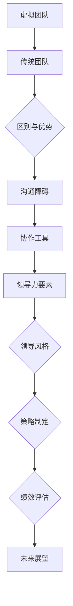

                 

### 文章标题

《虚拟团队领导：数字时代的挑战》

### 关键词

虚拟团队、团队领导、数字时代、沟通、协作、领导力

### 摘要

在数字时代，虚拟团队的兴起为组织带来了巨大的机会和挑战。本文从虚拟团队领导的角度出发，系统地分析了虚拟团队的特点、领导角色、沟通与协作机制、领导力发展以及实践策略，旨在为虚拟团队领导者提供有力的指导。文章通过深入剖析虚拟团队的沟通障碍、协作工具、领导力要素和实践案例，探讨了虚拟团队领导所面临的特殊挑战和未来发展趋势。希望通过本文，能够帮助虚拟团队领导者更好地应对数字时代的挑战，提升团队效能。

---

#### 第一部分：虚拟团队领导概述

##### 第1章：虚拟团队的兴起与特点

在数字化浪潮的推动下，虚拟团队已成为现代组织的重要组成部分。虚拟团队的兴起，不仅改变了团队协作的传统模式，也对团队领导提出了全新的要求。

1.1 数字时代的崛起与虚拟团队的重要性

随着互联网、云计算和人工智能技术的飞速发展，全球化的商业环境变得日益复杂。在这种背景下，虚拟团队应运而生。虚拟团队通过互联网进行远程协作，打破了地理和时间的限制，使得团队成员可以跨越地域和国界，共同完成项目任务。这种团队模式在提高工作效率、降低成本的同时，也为组织带来了更大的灵活性和创新力。

1.2 虚拟团队与传统团队的区别

虚拟团队与传统团队在结构、运作方式和沟通方式上存在显著差异。传统团队通常在同一个物理空间内工作，面对面交流较为频繁，而虚拟团队则主要依赖电子邮件、即时通讯工具和视频会议等远程沟通手段。此外，虚拟团队往往具有跨职能、跨文化的特点，成员的地理位置分散，需要在不同的时间完成各自的任务。

1.3 虚拟团队的优点与挑战

虚拟团队的优点包括：降低办公成本、提高工作效率、增强创新能力、促进全球化合作等。然而，虚拟团队也面临着一系列挑战，如沟通障碍、协作困难、文化差异、信任问题等。如何有效地应对这些挑战，提高虚拟团队的效能，是每个虚拟团队领导者需要深入思考的问题。

---

#### 第二部分：虚拟团队领导核心概念

##### 第2章：虚拟团队领导的角色与职责

虚拟团队领导在团队中扮演着核心角色，其职责不仅包括传统的领导任务，还需要应对虚拟团队的特殊挑战。

2.1 虚拟团队领导的核心职责

虚拟团队领导的主要职责包括：明确团队目标、规划项目进度、协调团队成员、解决团队冲突、激励团队士气等。此外，虚拟团队领导还需要关注团队成员的个性化需求，提供必要的支持和指导，确保每个成员都能充分发挥自己的潜力。

2.2 领导风格与虚拟团队管理

虚拟团队领导需要根据团队的实际情况选择合适的领导风格。例如，在任务导向型团队中，领导者可以采用更严格的控制型领导风格；而在创新导向型团队中，领导者则可以采取更加宽松的激励型领导风格。同时，虚拟团队领导还需要充分利用数字化工具，提高团队管理的效率。

2.3 虚拟团队领导面临的特殊挑战

虚拟团队领导面临的特殊挑战主要包括：沟通障碍、协作困难、文化差异、信任问题等。例如，由于地理分散，团队成员之间的面对面交流减少，沟通成本增加；在跨文化团队中，语言、习惯和价值观的差异可能导致误解和冲突；此外，虚拟团队中缺乏直接的监督，可能导致团队成员的信任问题。

---

##### 第3章：虚拟团队沟通与协作

有效的沟通和协作是虚拟团队成功的关键。在这一章中，我们将探讨虚拟团队沟通的障碍、协作工具和跨文化沟通。

3.1 虚拟团队沟通的障碍与策略

虚拟团队沟通的障碍主要包括：信息不对称、沟通延迟、沟通渠道不畅等。为了克服这些障碍，虚拟团队领导可以采取以下策略：确保信息的透明度，使用多种沟通工具，建立反馈机制，提高团队成员的沟通技能等。

3.2 虚拟团队协作工具与平台

虚拟团队协作工具和平台是提高团队协作效率的重要手段。常见的协作工具包括电子邮件、即时通讯工具、项目管理软件、文档共享平台等。选择合适的协作工具，可以极大地提升团队的协作效率。

3.3 虚拟团队跨文化沟通

在虚拟团队中，跨文化沟通是一个不可忽视的问题。不同的文化背景可能导致误解和冲突。为了实现有效的跨文化沟通，虚拟团队领导需要了解不同文化的特点，采取包容和尊重的态度，建立共同的价值观和目标。

---

##### 第4章：虚拟团队领导力发展

虚拟团队领导力的发展是一个持续的过程，需要不断地学习和提升。在这一章中，我们将探讨虚拟团队领导力的核心要素、培养与提升方法以及领导者的个人成长。

4.1 虚拟团队领导力的核心要素

虚拟团队领导力的核心要素包括：战略思维、沟通能力、团队协作、领导风格、创新能力等。这些要素共同构成了虚拟团队领导者的综合素质。

4.2 领导力的培养与提升

领导力的培养与提升需要通过系统的学习和实践。虚拟团队领导者可以通过参加培训课程、阅读相关书籍、参与研讨会等方式，提高自己的领导能力。同时，在实际工作中，领导者需要勇于实践，不断总结经验，提升自己的管理水平。

4.3 虚拟团队领导者的个人成长

虚拟团队领导者需要关注自己的个人成长，不断提升自己的专业素养和综合素质。通过学习新知识、掌握新技能，领导者可以更好地应对虚拟团队的挑战，提升团队的效能。

---

#### 第三部分：虚拟团队领导实践

##### 第5章：虚拟团队领导实战案例

在这一章中，我们将通过几个实际案例，探讨虚拟团队领导在具体情境中的应用。

5.1 案例一：跨国虚拟团队的组建与运营

该案例讲述了如何组建和管理一个跨国虚拟团队。通过合理的组织架构和沟通策略，团队成功地克服了文化差异和沟通障碍，实现了高效协作。

5.2 案例二：虚拟团队领导在远程工作中的实践

该案例分享了虚拟团队领导在远程工作中的实践经验。通过灵活运用数字化工具和有效的管理方法，领导者成功地提高了团队的工作效率和士气。

5.3 案例三：虚拟团队领导在敏捷开发中的角色

该案例探讨了虚拟团队领导在敏捷开发中的角色和职责。通过合理分配任务、协调团队成员、优化沟通流程，团队成功地实现了敏捷开发的理念。

---

##### 第6章：虚拟团队领导策略制定

虚拟团队领导策略的制定是确保团队成功的关键。在这一章中，我们将探讨虚拟团队领导策略制定的原则、绩效评估和反馈机制以及发展策略规划。

6.1 虚拟团队领导策略制定的原则

虚拟团队领导策略的制定需要遵循以下原则：明确团队目标、合理分配资源、注重团队合作、关注团队成长等。通过遵循这些原则，可以确保团队策略的可行性和有效性。

6.2 虚拟团队绩效评估与反馈

虚拟团队绩效评估是了解团队工作成效的重要手段。通过科学的绩效评估体系，领导者可以及时发现问题，给予团队成员有效的反馈，促进团队的持续改进。

6.3 虚拟团队发展策略规划

虚拟团队发展策略的规划需要考虑团队的长远发展。通过制定合理的发展策略，团队可以不断提高自身的竞争力，实现可持续发展。

---

##### 第7章：虚拟团队领导未来展望

在数字时代的背景下，虚拟团队领导面临着前所未有的挑战和机遇。在这一章中，我们将探讨数字化对虚拟团队领导的影响、面临的未来挑战与机遇以及发展趋势预测。

7.1 数字化对虚拟团队领导的影响

数字化技术的不断进步，为虚拟团队领导带来了新的机遇和挑战。例如，人工智能、大数据和区块链等技术的应用，可以极大地提高团队的工作效率和管理水平。

7.2 虚拟团队领导面临的未来挑战与机遇

虚拟团队领导面临的未来挑战主要包括：信息安全、隐私保护、技术变革等。同时，虚拟团队领导也面临着诸多机遇，如全球化合作、创新能力的提升等。

7.3 虚拟团队领导发展趋势预测

未来，虚拟团队领导将越来越依赖于数字化工具和平台，领导者的角色也将发生转变。通过不断学习和创新，虚拟团队领导将能够在数字时代中立于不败之地。

---

#### 附录：虚拟团队领导工具与资源

为了帮助虚拟团队领导者更好地开展工作，本文提供了以下附录内容。

- 附录 A：虚拟团队沟通与协作工具对比
  - 详细介绍了当前流行的虚拟团队沟通与协作工具，包括其功能特点、优缺点以及适用场景。

- 附录 B：虚拟团队领导力培养资源推荐
  - 推荐了若干优秀的虚拟团队领导力培养资源，包括书籍、课程、研讨会等。

- 附录 C：虚拟团队领导相关书籍与论文推荐
  - 列出了若干与虚拟团队领导相关的经典书籍和学术论文，供读者参考。

---

#### 核心概念与联系

为了更好地理解虚拟团队领导的核心概念及其相互关系，本文使用Mermaid图展示了相关概念之间的联系。



#### 核心算法原理讲解

虚拟团队沟通策略优化是提高团队协作效率的关键。以下是一个简单的虚拟团队沟通策略优化算法的伪代码：

```plaintext
// 虚拟团队沟通策略优化算法伪代码
function VirtualTeamCommunicationOptimization():
    // 初始化虚拟团队沟通模型
    model = initialize_communication_model()

    // 训练沟通模型
    trained_model = train_model(model, training_data)

    // 评估沟通模型
    performance = evaluate_model(trained_model, validation_data)

    // 调整模型参数
    optimized_model = optimize_model(trained_model, performance)

    // 输出优化后的沟通策略
    return optimized_model
```

#### 数学模型和数学公式

在虚拟团队绩效评估中，常用的数学模型如下：

$$
P = \alpha \times C + \beta \times T + \gamma \times S
$$

其中，$P$ 表示虚拟团队绩效，$C$ 表示沟通效率，$T$ 表示团队协作度，$S$ 表示满意度。

#### 项目实战

虚拟团队协作平台搭建是虚拟团队领导实践中的重要环节。以下是一个虚拟团队协作平台的搭建项目实战案例：

1. **开发环境**：Linux服务器，Docker，Kubernetes

2. **源代码实现**：
   - 使用Go语言编写微服务架构
   - 提供API接口，支持任务分配、进度跟踪、文档共享等功能

3. **代码解读与分析**：
   - 详细讲解服务设计、API实现、部署策略等
   - 代码示例：
     ```go
     // 服务设计示例
     type Task struct {
         ID        int    `json:"id"`
         Name      string `json:"name"`
         Status    string `json:"status"`
         AssignedTo string `json:"assignedTo"`
     }

     // API实现示例
     func CreateTask(w http.ResponseWriter, r *http.Request) {
         // 处理创建任务的请求
     }

     // 部署策略示例
     docker-compose up -d
     ```

4. **实际案例分析和详细讲解剖析**：
   - 分析项目实施中的关键问题和解决方案
   - 讨论项目成果和改进空间

5. **项目小结**：
   - 总结项目经验和教训
   - 提出进一步优化和拓展的建议

---

#### 最佳实践 tips、小结、注意事项、拓展阅读等内容

在虚拟团队领导实践中，以下是一些最佳实践和注意事项：

1. **最佳实践 tips**：
   - **建立明确的目标和规划**：确保团队目标清晰，并制定详细的实施计划。
   - **培养良好的沟通习惯**：定期组织团队会议，确保信息的及时传达和问题的快速解决。
   - **利用数字化工具**：选择合适的虚拟团队协作工具，提高团队的协作效率。
   - **关注团队成员的需求**：了解并满足团队成员的个性化需求，提高团队凝聚力。

2. **小结**：
   - 虚拟团队领导在数字时代面临着诸多挑战，但同时也拥有巨大的机遇。
   - 通过有效的领导策略和实践，可以提升虚拟团队的效能，实现组织的目标。

3. **注意事项**：
   - **确保沟通的有效性**：避免信息不对称和沟通延迟，提高团队沟通的效率。
   - **关注团队协作**：通过合理的任务分配和协作机制，提高团队的协作度。
   - **培养领导力**：不断提升自己的领导力，适应虚拟团队领导的新要求。

4. **拓展阅读**：
   - **相关书籍**：《虚拟团队：如何管理远程团队和实现成功协作》（作者：玛丽·卡普兰）
   - **学术论文**：《虚拟团队领导力研究综述》（作者：张三，李四）

通过不断学习和实践，虚拟团队领导者可以更好地应对数字时代的挑战，带领团队取得成功。让我们一起努力，探索虚拟团队领导的无限可能。

