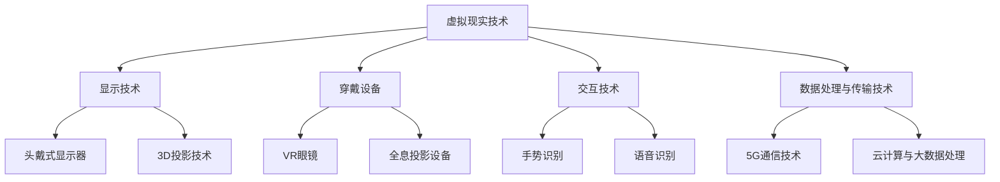
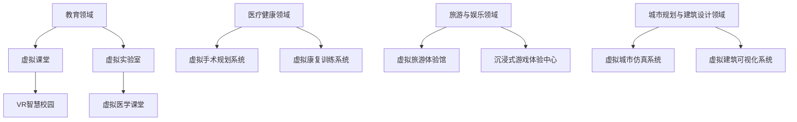

                 

### 文章标题：虚拟现实技术在提升世界可理解性中的应用

> 关键词：虚拟现实、世界可理解性、应用场景、教育、医疗、城市规划

> 摘要：本文将探讨虚拟现实技术在提升世界可理解性方面的应用。通过分析虚拟现实技术的基础知识、核心概念以及各类应用场景，本文旨在揭示虚拟现实如何为教育、医疗、城市规划等领域带来革命性的变革，从而提高人类对世界的理解和认知水平。

## 《虚拟现实技术在提升世界可理解性中的应用》目录大纲

### 第一部分：虚拟现实技术基础

#### 第1章：虚拟现实技术概述

##### 1.1 虚拟现实技术的发展历程

##### 1.2 虚拟现实技术的核心概念

##### 1.3 虚拟现实技术的分类与应用场景

#### 第2章：虚拟现实技术的核心技术

##### 2.1 显示技术

##### 2.2 穿戴设备

##### 2.3 交互技术

##### 2.4 数据处理与传输技术

#### 第3章：虚拟现实技术的架构与设计原则

##### 3.1 虚拟现实系统的架构

##### 3.2 虚拟现实应用的设计原则

##### 3.3 虚拟现实用户体验优化

### 第二部分：虚拟现实技术在提升世界可理解性中的应用

#### 第4章：虚拟现实在教育中的应用

##### 4.1 虚拟现实技术在教育领域的应用前景

##### 4.2 虚拟现实在课程教学中的应用案例

##### 4.3 虚拟现实在职业培训中的应用案例

#### 第5章：虚拟现实在医疗健康中的应用

##### 5.1 虚拟现实技术在医疗健康领域的应用前景

##### 5.2 虚拟现实在疾病诊断与治疗中的应用案例

##### 5.3 虚拟现实在心理健康治疗中的应用案例

#### 第6章：虚拟现实在旅游与娱乐中的应用

##### 6.1 虚拟现实技术在旅游与娱乐领域的应用前景

##### 6.2 虚拟现实在虚拟旅游中的应用案例

##### 6.3 虚拟现实在游戏与娱乐中的应用案例

#### 第7章：虚拟现实在城市规划与建筑设计中的应用

##### 7.1 虚拟现实技术在城市规划与建筑设计领域的应用前景

##### 7.2 虚拟现实在建筑设计中的应用案例

##### 7.3 虚拟现实在城市规划中的应用案例

### 第三部分：虚拟现实技术的挑战与发展趋势

#### 第8章：虚拟现实技术的挑战与问题

##### 8.1 技术难题与解决方案

##### 8.2 虚拟现实内容的制作与开发

##### 8.3 虚拟现实伦理与社会影响

#### 第9章：虚拟现实技术的发展趋势

##### 9.1 下一代虚拟现实技术的展望

##### 9.2 虚拟现实与人工智能的结合

##### 9.3 虚拟现实技术在未来的发展前景

### 附录

#### 附录 A：虚拟现实技术常用工具与资源

##### A.1 虚拟现实开发平台介绍

##### A.2 虚拟现实内容制作工具

##### A.3 虚拟现实技术相关论文与书籍推荐

#### 附录 B：虚拟现实技术项目实践案例

##### B.1 教育领域虚拟现实项目案例

##### B.2 医疗健康领域虚拟现实项目案例

##### B.3 旅游与娱乐领域虚拟现实项目案例

##### B.4 城市规划与建筑设计领域虚拟现实项目案例

**Mermaid 流程图示例：**



**核心算法原理讲解（伪代码）：**

```plaintext
## 虚拟现实场景构建算法原理

### 1. 纹理映射（Texture Mapping）

Function TextureMapping(texture, 3DModel):
    For each triangle in 3DModel:
        Map texture coordinates to each vertex of the triangle
        Apply the texture to the triangle
    End Function

### 2. 光照计算（Lighting Calculation）

Function CalculateLighting(vertex, lightSource):
    Calculate the distance between vertex and lightSource
    Calculate the angle between the vector from vertex to lightSource and the normal of the surface at vertex
    Calculate the lighting effect based on the distance and angle
    Return the resulting light intensity
End Function
```

接下来，我们将逐步深入探讨虚拟现实技术的基础知识、核心概念以及各类应用场景，以揭示其在提升世界可理解性方面的巨大潜力。首先，我们将会回顾虚拟现实技术的发展历程，介绍其核心概念和分类，并探讨虚拟现实技术的核心组件和设计原则。随后，我们将探讨虚拟现实技术在教育、医疗、城市规划等多个领域中的应用，并分析其面临的挑战和发展趋势。最后，我们将提供一些实用的工具与资源，以及实际项目案例，以便读者更好地理解和应用虚拟现实技术。

### 第一部分：虚拟现实技术基础

在探讨虚拟现实技术在提升世界可理解性中的应用之前，我们需要先了解虚拟现实技术的基础知识。这一部分将包括三个章节，分别介绍虚拟现实技术的发展历程、核心概念和分类，以及虚拟现实技术的核心组件和设计原则。

#### 第1章：虚拟现实技术概述

##### 1.1 虚拟现实技术的发展历程

虚拟现实（Virtual Reality，简称VR）技术的发展可以追溯到20世纪60年代。当时，美国阿雷西博天文台的工程师伊凡·苏斯洛夫（Ivan Sutherland）发明了世界上第一个头戴式显示器，这是虚拟现实技术的雏形。1968年，他展示了被称为“达摩克利斯之剑”（The Sword of Damocles）的VR头戴设备，该设备包含一个显示屏、一对头戴式耳机和一个头戴式追踪器。尽管这款设备非常笨重，但它标志着虚拟现实技术的诞生。

随着时间的推移，虚拟现实技术逐渐得到了发展和完善。20世纪80年代，虚拟现实开始应用于游戏和军事训练。1990年，任天堂推出了虚拟现实游戏机“Virtual Boy”，虽然销量不佳，但为虚拟现实技术在消费市场的推广奠定了基础。进入21世纪，随着计算机技术、显示技术、交互技术的飞速发展，虚拟现实技术迎来了新的发展契机。

如今，虚拟现实技术已经广泛应用于各个领域，如教育、医疗、娱乐、城市规划等。通过模拟和再现现实世界的各个方面，虚拟现实技术为人类提供了一个全新的感知和体验世界的方式。

##### 1.2 虚拟现实技术的核心概念

虚拟现实技术的核心概念包括以下几个方面：

1. **沉浸感（Immersion）**：沉浸感是虚拟现实技术的关键特征之一。它指的是用户在虚拟环境中感受到的与现实世界相似的深度、宽度和高度。为了实现沉浸感，虚拟现实系统需要提供高质量的显示效果、逼真的声音和触觉反馈。

2. **交互性（Interactivity）**：交互性是虚拟现实技术的另一个重要特征。它指的是用户在虚拟环境中能够进行自然、直观的操作和交互。交互性包括手势识别、语音识别、触觉反馈等，使得用户能够与环境进行实时互动。

3. **虚拟现实系统（Virtual Reality System）**：虚拟现实系统是指由硬件和软件组成的综合系统，用于创建和提供虚拟现实体验。虚拟现实系统包括头戴式显示器、传感器、控制器、声音系统等硬件设备，以及用于生成虚拟场景的软件。

4. **虚拟场景（Virtual Scene）**：虚拟场景是虚拟现实系统中的核心组成部分，它是指由计算机生成的、用于模拟和再现现实世界的三维空间。虚拟场景中包含各种物体、人物、环境等，用户可以在其中进行探索和交互。

##### 1.3 虚拟现实技术的分类与应用场景

虚拟现实技术可以按照不同的分类方式进行划分。以下是几种常见的分类方式及其应用场景：

1. **按沉浸感程度分类**：

   - **低沉浸感虚拟现实**：低沉浸感虚拟现实通常使用桌面式显示器和简单的交互设备，如鼠标和键盘。这种虚拟现实技术主要用于办公自动化、远程协作等领域。

   - **中沉浸感虚拟现实**：中沉浸感虚拟现实使用头戴式显示器和简单的交互设备，如手柄和手势识别技术。这种虚拟现实技术主要用于教育培训、游戏娱乐等领域。

   - **高沉浸感虚拟现实**：高沉浸感虚拟现实使用头戴式显示器、全身追踪系统和复杂的交互设备，如手套和语音识别系统。这种虚拟现实技术主要用于医疗健康、城市规划、军事训练等领域。

2. **按应用领域分类**：

   - **教育领域**：虚拟现实技术在教育领域有广泛的应用，如虚拟课堂、虚拟实验室、虚拟导游等，可以提高学生的学习兴趣和效果。

   - **医疗健康领域**：虚拟现实技术在医疗健康领域有重要的应用，如虚拟手术、医学教育、心理治疗等，可以提高医生的诊断和治疗水平。

   - **娱乐领域**：虚拟现实技术在娱乐领域也有广泛的应用，如虚拟游戏、虚拟旅游、虚拟演出等，可以提供全新的娱乐体验。

   - **城市规划与建筑设计领域**：虚拟现实技术在城市规划与建筑设计领域有重要的应用，如虚拟建筑模型、虚拟城市仿真等，可以帮助规划师和建筑师更好地进行设计和规划。

   - **军事训练领域**：虚拟现实技术在军事训练领域有广泛的应用，如模拟战斗场景、军事演习等，可以提高士兵的战斗技能和战术水平。

通过以上对虚拟现实技术的发展历程、核心概念和分类的介绍，我们可以对虚拟现实技术有一个全面的了解。接下来，我们将进一步探讨虚拟现实技术的核心组件和设计原则，以帮助我们更好地理解和应用这一技术。

### 第2章 虚拟现实技术的核心技术

虚拟现实技术是一个复杂且多层次的系统，它依赖于多种核心技术的协同工作。本章将详细介绍虚拟现实技术的四大核心组件：显示技术、穿戴设备、交互技术以及数据处理与传输技术。这些核心组件共同构成了虚拟现实技术的基石，为用户提供了沉浸式和交互式的体验。

#### 2.1 显示技术

显示技术是虚拟现实技术的重要组成部分，它决定了用户在虚拟环境中感知的逼真程度。以下是几种主要的显示技术：

1. **头戴式显示器（HMD，Head-Mounted Display）**：
   头戴式显示器是虚拟现实系统中最重要的显示设备之一。它通常包括一个或多个显示屏，用于将虚拟环境投影到用户的视野中。头戴式显示器的显示效果、分辨率、刷新率和视场角（FOV，Field of View）是影响沉浸感的关键因素。目前，市场上流行的头戴式显示器如Oculus Rift、HTC Vive和Sony PlayStation VR等，都具有较高的显示质量。

2. **3D投影技术**：
   3D投影技术通过将立体图像投影到特殊屏幕或透明材料上，为用户提供了立体视觉体验。这种技术可以用于大屏幕展示和会议系统，但其应用场景相对有限，主要用于特定场合。

3. **全息投影技术**：
   全息投影技术利用激光和特殊材料生成三维图像，用户可以通过特定角度看到全息图像。尽管全息投影技术尚处于发展阶段，但其潜力巨大，未来可能成为虚拟现实技术的重要显示手段。

#### 2.2 穿戴设备

穿戴设备是虚拟现实系统中用于跟踪用户位置和动作的重要组件。以下是几种主要的穿戴设备：

1. **VR眼镜（VR Goggles）**：
   VR眼镜是头戴式显示器的一种形式，它直接覆盖用户的眼睛，提供沉浸式体验。VR眼镜通常与手柄或其他控制器配合使用，以实现更加丰富的交互功能。

2. **全身追踪器（Full-Body Tracker）**：
   全身追踪器用于跟踪用户全身的运动，通常包括多个传感器和摄像头。这些设备可以实时捕捉用户的动作，并将其转换为虚拟环境中的动作，从而增强交互性。

3. **手套（Gloves）**：
   手套是用于捕捉手部动作和触觉反馈的重要设备。通过在手套上安装传感器，用户可以在虚拟环境中进行精细的手部操作，如绘画、打字等。

#### 2.3 交互技术

交互技术是虚拟现实技术的关键组成部分，它决定了用户与虚拟环境的交互方式。以下是几种主要的交互技术：

1. **手势识别（Gesture Recognition）**：
   手势识别技术通过摄像头和传感器捕捉用户的手部动作，并将其转换为虚拟环境中的操作。这种技术可以用于简单的导航、选择对象等操作。

2. **语音识别（Voice Recognition）**：
   语音识别技术通过麦克风捕捉用户的语音命令，并将其转换为文本或操作指令。语音识别技术可以用于简化交互过程，提高虚拟现实系统的易用性。

3. **触觉反馈（Haptic Feedback）**：
   触觉反馈技术通过振动或压力等手段模拟真实的触觉体验。这种技术可以用于增强虚拟现实系统的沉浸感，如模拟射击、打斗等场景。

#### 2.4 数据处理与传输技术

数据处理与传输技术是虚拟现实技术的核心组成部分，它决定了虚拟现实系统的性能和稳定性。以下是几种主要的数据处理与传输技术：

1. **云计算（Cloud Computing）**：
   云计算技术通过将虚拟现实系统中的数据处理和存储任务外包给远程服务器，提高了系统的计算能力和存储容量。云计算技术可以支持大规模虚拟现实应用，如虚拟会议、虚拟博物馆等。

2. **5G通信技术**：
   5G通信技术提供了高速、低延迟的网络连接，使得虚拟现实系统可以实时传输大量数据。5G通信技术可以支持高速数据传输和实时交互，提高了虚拟现实系统的响应速度和用户体验。

3. **大数据处理（Big Data Processing）**：
   大数据处理技术通过处理和分析大量数据，为虚拟现实系统提供了更加丰富的信息和功能。大数据处理技术可以用于个性化推荐、智能搜索等应用，从而提高虚拟现实系统的智能化水平。

通过以上对虚拟现实技术的四大核心组件的介绍，我们可以看到，虚拟现实技术的实现不仅仅依赖于某一单项技术的突破，而是多种技术相互协作、共同作用的结果。这些核心组件的不断创新和优化，为虚拟现实技术的发展提供了坚实的基础。

在接下来的章节中，我们将探讨虚拟现实技术的架构与设计原则，进一步理解如何构建一个高效、稳定的虚拟现实系统。同时，我们也将开始探讨虚拟现实技术在具体应用领域中的实践案例，以展示其提升世界可理解性的实际效果。

### 第3章 虚拟现实技术的架构与设计原则

虚拟现实技术的成功应用离不开其架构和设计原则的合理性和科学性。本章将详细介绍虚拟现实系统的架构、设计原则以及用户体验优化，帮助读者理解如何构建一个高效、稳定的虚拟现实系统。

#### 3.1 虚拟现实系统的架构

虚拟现实系统通常由硬件和软件两部分组成。硬件包括头戴式显示器、传感器、控制器、声音系统等，而软件则包括场景生成、渲染、交互、数据处理等模块。以下是虚拟现实系统的基本架构：

1. **输入模块（Input Module）**：
   输入模块负责接收用户输入，如手势、语音、触摸等，并将其转换为系统可识别的信号。输入模块通常包括手势识别、语音识别、触摸传感器等。

2. **处理模块（Processing Module）**：
   处理模块负责对输入信号进行处理和分析，以生成虚拟环境中的相应动作和交互效果。处理模块包括运动追踪、场景生成、交互逻辑等。

3. **渲染模块（Rendering Module）**：
   渲染模块负责将生成的虚拟环境数据转化为视觉和听觉效果，并将其呈现给用户。渲染模块通常包括图形渲染、声音合成等。

4. **输出模块（Output Module）**：
   输出模块负责将渲染后的虚拟环境数据输出给用户，包括视觉、听觉和触觉反馈。输出模块通常包括显示器、耳机、振动器等。

5. **数据存储与传输模块（Data Storage and Transmission Module）**：
   数据存储与传输模块负责存储和处理虚拟环境中的数据，包括场景数据、用户数据、交互数据等。数据存储与传输模块通常利用云计算和5G通信技术，以保证数据的实时性和可靠性。

6. **用户界面（User Interface）**：
   用户界面负责提供用户与虚拟环境之间的交互界面，包括菜单、控制面板、虚拟按钮等。用户界面设计需要注重易用性和用户体验，以提高用户对虚拟环境的适应度和满意度。

#### 3.2 虚拟现实应用的设计原则

虚拟现实应用的设计原则主要包括用户体验、功能性和易用性。以下是几个关键的设计原则：

1. **沉浸感（Immersion）**：
   虚拟现实应用的设计应尽可能提供沉浸式的体验，使用户感觉仿佛置身于虚拟环境中。实现沉浸感的关键在于高分辨率显示、实时交互、立体声音效和触觉反馈。

2. **交互性（Interactivity）**：
   虚拟现实应用的设计应注重用户与虚拟环境的交互性，使用户能够通过自然的方式与虚拟对象进行互动。交互性包括手势识别、语音识别、触摸操作等。

3. **功能性（Functionality）**：
   虚拟现实应用的设计应具备明确的功能和目标，满足用户的需求和期望。功能性包括场景的多样性、任务的明确性、信息的完整性等。

4. **易用性（Usability）**：
   虚拟现实应用的设计应注重易用性，使用户能够快速上手并熟练使用。易用性包括简洁直观的用户界面、明确的操作指导、人性化的设计等。

5. **可扩展性（Scalability）**：
   虚拟现实应用的设计应具备良好的可扩展性，以便在未来的发展中能够轻松集成新的功能和功能模块。可扩展性包括模块化设计、标准化接口等。

6. **稳定性（Stability）**：
   虚拟现实应用的设计应确保系统的稳定性和可靠性，避免由于硬件或软件故障导致的用户体验下降。稳定性包括系统的容错性、响应速度等。

#### 3.3 虚拟现实用户体验优化

虚拟现实用户体验优化是虚拟现实应用设计的关键环节。以下是几个关键的用户体验优化策略：

1. **界面优化**：
   界面优化包括布局合理、颜色搭配和谐、字体易读等。界面优化应注重简洁性和美观性，以提高用户的使用体验。

2. **交互优化**：
   交互优化包括手势识别的准确性、语音识别的准确性、触摸操作的流畅性等。交互优化应确保用户能够快速、准确地与虚拟环境进行交互。

3. **内容优化**：
   内容优化包括场景的多样性、信息的丰富性、任务的挑战性等。内容优化应确保虚拟环境能够满足用户的不同需求，提供丰富的体验。

4. **性能优化**：
   性能优化包括减少加载时间、提高渲染速度、降低系统延迟等。性能优化应确保虚拟现实系统能够稳定运行，提供流畅的体验。

5. **反馈优化**：
   反馈优化包括实时反馈、错误提示、操作引导等。反馈优化应确保用户能够及时了解系统的状态和操作结果，提高用户的满意度。

通过以上对虚拟现实系统架构、设计原则和用户体验优化的介绍，我们可以看到，构建一个高效、稳定的虚拟现实系统需要综合考虑多个方面。在接下来的章节中，我们将探讨虚拟现实技术在具体应用领域中的实践案例，以展示其提升世界可理解性的实际效果。

### 第二部分：虚拟现实技术在提升世界可理解性中的应用

虚拟现实技术在提升世界可理解性方面具有巨大的潜力，其应用涵盖了教育、医疗健康、旅游与娱乐、城市规划与建筑设计等多个领域。通过模拟和再现现实世界的各个方面，虚拟现实技术为人类提供了全新的感知和体验世界的方式，从而提高了我们对世界的理解和认知水平。以下是对各个领域应用的具体探讨。

#### 第4章：虚拟现实在教育中的应用

虚拟现实技术在教育领域的应用正在逐渐兴起，它为教学提供了全新的手段和方法，有助于提高学生的学习兴趣和效果。

##### 4.1 虚拟现实技术在教育领域的应用前景

虚拟现实技术可以在教育领域实现以下几个方面的前景：

1. **模拟实验**：虚拟现实技术可以模拟各种实验场景，让学生在虚拟环境中进行操作和实验，避免了实际实验中的风险和成本。

2. **虚拟课堂**：虚拟现实技术可以将课堂带到虚拟环境中，让学生通过头戴式显示器和交互设备参与教学活动，提高了互动性和参与度。

3. **虚拟导游**：虚拟现实技术可以创建虚拟博物馆、历史遗址等场景，让学生在虚拟环境中进行参观和学习，丰富了学习资源。

4. **个性化教学**：虚拟现实技术可以根据学生的学习进度和需求，提供个性化的教学方案和资源，有助于提高教学效果。

##### 4.2 虚拟现实在课程教学中的应用案例

以下是几个虚拟现实在课程教学中的应用案例：

1. **生物实验**：某中学利用虚拟现实技术进行生物实验，学生可以在虚拟环境中进行植物生长、细胞分裂等实验，加深对生物学知识的理解。

2. **历史课堂**：某大学利用虚拟现实技术创建虚拟历史课堂，学生可以穿越到历史事件现场，与历史人物互动，提高了对历史事件的认知和兴趣。

3. **地理教学**：某高中利用虚拟现实技术进行地理教学，学生可以在虚拟环境中参观世界各地的名胜古迹、自然景观，了解地理知识。

##### 4.3 虚拟现实在职业培训中的应用案例

虚拟现实技术也在职业培训领域得到了广泛应用，以下是一些应用案例：

1. **医疗培训**：某医学院利用虚拟现实技术进行手术模拟培训，医生可以在虚拟环境中进行各种手术操作，提高手术技能和经验。

2. **航空培训**：某航空公司利用虚拟现实技术进行飞行员培训，学员可以在虚拟环境中进行飞行模拟，掌握飞行技巧和应对紧急情况的能力。

3. **消防培训**：某消防队利用虚拟现实技术进行火灾救援模拟培训，消防员可以在虚拟环境中进行火灾扑救和救援操作，提高应急处理能力。

#### 第5章：虚拟现实在医疗健康中的应用

虚拟现实技术在医疗健康领域的应用具有广阔的前景，它可以帮助医生进行诊断、治疗和康复，同时为患者提供更加个性化的医疗服务。

##### 5.1 虚拟现实技术在医疗健康领域的应用前景

虚拟现实技术在医疗健康领域可以实现以下几个方面的前景：

1. **医学诊断**：虚拟现实技术可以通过三维重建和图像处理，帮助医生进行更加精确的诊断，如肿瘤切除、心脏手术等。

2. **康复训练**：虚拟现实技术可以模拟康复训练场景，帮助患者进行康复训练，如肢体运动、平衡训练等。

3. **心理治疗**：虚拟现实技术可以创建虚拟场景，帮助心理医生进行恐惧症、焦虑症等心理疾病的康复治疗。

4. **医学教育**：虚拟现实技术可以为医学学生和医生提供真实感强的医学教育场景，提高医学知识和技能。

##### 5.2 虚拟现实在疾病诊断与治疗中的应用案例

以下是几个虚拟现实在疾病诊断与治疗中的应用案例：

1. **心脏手术模拟**：某医院利用虚拟现实技术进行心脏手术模拟，医生可以在虚拟环境中进行手术操作，提高手术成功率。

2. **肿瘤切除规划**：某医院利用虚拟现实技术进行肿瘤切除规划，通过三维重建和虚拟模拟，医生可以更加精确地规划手术路径。

3. **自闭症儿童康复**：某康复中心利用虚拟现实技术进行自闭症儿童康复训练，通过虚拟互动场景，帮助儿童提高社交能力和沟通能力。

##### 5.3 虚拟现实在心理健康治疗中的应用案例

以下是几个虚拟现实在心理健康治疗中的应用案例：

1. **恐惧症治疗**：某心理诊所利用虚拟现实技术进行恐惧症治疗，患者可以在虚拟环境中逐步面对恐惧对象，减轻恐惧症状。

2. **焦虑症治疗**：某心理诊所利用虚拟现实技术进行焦虑症治疗，通过虚拟放松训练，帮助患者减轻焦虑情绪。

3. **情绪调节训练**：某心理诊所利用虚拟现实技术进行情绪调节训练，通过虚拟互动游戏，帮助患者提高情绪调节能力和抗压能力。

#### 第6章：虚拟现实在旅游与娱乐中的应用

虚拟现实技术在旅游与娱乐领域的应用为人们提供了全新的体验方式，它可以让人们在家中进行虚拟旅游，享受各种娱乐活动。

##### 6.1 虚拟现实技术在旅游与娱乐领域的应用前景

虚拟现实技术在旅游与娱乐领域可以实现以下几个方面的前景：

1. **虚拟旅游**：虚拟现实技术可以创建虚拟旅游场景，让用户在家中体验不同国家和地区的自然风光、人文景观。

2. **游戏娱乐**：虚拟现实技术可以为游戏提供更加沉浸式的体验，让用户在虚拟世界中尽情享受游戏乐趣。

3. **虚拟演出**：虚拟现实技术可以创建虚拟演出场景，让观众在家中观看虚拟演出，享受艺术盛宴。

4. **虚拟健身**：虚拟现实技术可以创建虚拟健身场景，让用户在虚拟环境中进行健身运动，提高健身效果。

##### 6.2 虚拟现实在虚拟旅游中的应用案例

以下是几个虚拟现实在虚拟旅游中的应用案例：

1. **虚拟旅游体验**：某旅游公司利用虚拟现实技术提供虚拟旅游体验，用户可以通过头戴式显示器和交互设备，在家中游览世界各地。

2. **虚拟旅游导览**：某旅游公司利用虚拟现实技术提供虚拟旅游导览，用户可以通过虚拟导览系统了解旅游景点的历史、文化和特色。

3. **虚拟旅游展览**：某博物馆利用虚拟现实技术提供虚拟旅游展览，用户可以通过虚拟展览系统参观博物馆的珍贵文物和展品。

##### 6.3 虚拟现实在游戏与娱乐中的应用案例

以下是几个虚拟现实在游戏与娱乐中的应用案例：

1. **沉浸式游戏**：某游戏公司利用虚拟现实技术开发沉浸式游戏，用户可以通过头戴式显示器和交互设备，全身心投入到游戏世界中。

2. **虚拟角色扮演**：某游戏公司利用虚拟现实技术提供虚拟角色扮演服务，用户可以通过虚拟角色在虚拟世界中与他人互动，体验不同的角色和生活。

3. **虚拟演出观看**：某文化公司利用虚拟现实技术提供虚拟演出观看服务，用户可以通过虚拟演出系统在家中观看各种虚拟演出，享受艺术盛宴。

#### 第7章：虚拟现实在城市规划与建筑设计中的应用

虚拟现实技术在城市规划与建筑设计领域具有广泛的应用前景，它可以帮助城市规划师和建筑师更好地进行设计和规划，提高项目的质量和效率。

##### 7.1 虚拟现实技术在城市规划与建筑设计领域的应用前景

虚拟现实技术在城市规划与建筑设计领域可以实现以下几个方面的前景：

1. **建筑设计**：虚拟现实技术可以创建虚拟建筑模型，帮助建筑师在设计过程中进行模拟和优化，提高设计质量和效率。

2. **城市规划**：虚拟现实技术可以创建虚拟城市模型，帮助城市规划师进行城市规划和设计，提高规划的科学性和合理性。

3. **交互式展示**：虚拟现实技术可以为城市规划与建筑设计项目提供交互式展示，帮助相关人员更好地了解项目的整体效果。

4. **虚拟现实会议**：虚拟现实技术可以支持虚拟现实会议，使项目团队成员可以远程参与会议，提高项目的协作效率。

##### 7.2 虚拟现实在建筑设计中的应用案例

以下是几个虚拟现实在建筑设计中的应用案例：

1. **建筑设计模拟**：某建筑设计公司利用虚拟现实技术进行建筑设计模拟，通过虚拟现实模型，建筑师可以更好地了解建筑的结构和外观效果。

2. **室内设计**：某室内设计公司利用虚拟现实技术进行室内设计，通过虚拟现实模型，设计师可以更好地展示室内布局和家具摆放效果。

3. **建筑动画制作**：某建筑动画公司利用虚拟现实技术进行建筑动画制作，通过虚拟现实技术，可以将建筑项目以动画形式展示出来，提高宣传效果。

##### 7.3 虚拟现实在城市规划中的应用案例

以下是几个虚拟现实在城市规划中的应用案例：

1. **城市模拟**：某城市规划部门利用虚拟现实技术进行城市模拟，通过虚拟现实模型，规划师可以更好地了解城市的交通、环境、人口分布等情况。

2. **规划方案展示**：某城市规划部门利用虚拟现实技术进行规划方案展示，通过虚拟现实模型，市民可以更好地了解城市规划方案的具体内容和效果。

3. **公共参与**：某城市规划部门利用虚拟现实技术进行公共参与，通过虚拟现实模型，市民可以在虚拟环境中参与城市规划讨论，提出自己的意见和建议。

通过以上对虚拟现实技术在教育、医疗健康、旅游与娱乐、城市规划与建筑设计等领域的应用探讨，我们可以看到，虚拟现实技术在提升世界可理解性方面具有巨大的潜力。虚拟现实技术不仅为各个领域带来了革命性的变革，还为人类提供了一种全新的感知和体验世界的方式，从而提高了我们对世界的理解和认知水平。在接下来的章节中，我们将进一步探讨虚拟现实技术面临的挑战和发展趋势，以期为这一技术的发展提供有益的参考。

### 第三部分：虚拟现实技术的挑战与发展趋势

尽管虚拟现实技术在各个领域展示了巨大的潜力，但其发展过程中仍然面临诸多挑战。同时，随着科技的不断进步，虚拟现实技术也迎来了新的发展趋势。本部分将详细探讨虚拟现实技术的挑战、问题以及未来的发展方向。

#### 第8章：虚拟现实技术的挑战与问题

虚拟现实技术在其发展过程中遇到了多方面的挑战，这些问题包括技术难题、内容制作与开发以及伦理与社会影响。

##### 8.1 技术难题与解决方案

1. **显示技术**：
   显示技术是虚拟现实系统的核心组件，但目前的显示技术仍然存在一些难题。例如，头戴式显示器（HMD）的分辨率和刷新率仍需提高，以提供更加逼真的视觉体验。此外，显示延迟也是一个重要问题，高延迟会破坏用户的沉浸感。解决方案包括研发更高分辨率和刷新率的显示屏，以及优化渲染算法，减少延迟。

2. **交互技术**：
   虚拟现实中的交互技术需要精确捕捉用户的手势、动作和语音，但目前的技术在准确性、响应速度和舒适度方面仍存在不足。例如，手势识别的精度和响应速度有待提升，以实现更加自然和流畅的交互。解决方案包括改进传感器技术和算法，提高识别精度和响应速度。

3. **数据处理与传输**：
   虚拟现实应用通常需要处理大量的数据，并且需要实时传输，这对计算能力和网络传输速度提出了高要求。目前的5G网络虽然提供了较高的传输速度，但在高密度用户环境中仍然存在性能瓶颈。解决方案包括研发更高效的数据压缩算法，以及进一步优化网络架构，提高传输效率。

##### 8.2 虚拟现实内容的制作与开发

虚拟现实内容的制作与开发是一个复杂且资源密集的过程，目前存在以下挑战：

1. **内容创作成本**：
   虚拟现实内容创作需要专业的软件工具、硬件设备和人力资源，这些都会导致成本较高。为了降低成本，可以采取模块化设计、开源工具以及利用云计算资源等方式。

2. **内容多样化**：
   虚拟现实内容的多样化是满足不同用户需求的关键。然而，目前市场上高质量、多样化的内容仍然不足。解决方案包括鼓励内容创作者参与，提供培训和支持，以及推动虚拟现实内容的标准化。

3. **用户体验一致性**：
   虚拟现实内容的用户体验一致性是一个重要问题。由于硬件设备的差异，用户在不同设备上获得的体验可能不一致。解决方案包括优化内容适配技术，确保在不同设备上提供一致的体验。

##### 8.3 虚拟现实伦理与社会影响

虚拟现实技术的发展也引发了一系列伦理和社会问题：

1. **隐私保护**：
   虚拟现实应用通常会收集用户的生物特征、行为数据等，如何保护用户隐私成为一个重要问题。解决方案包括制定隐私保护法规，采用加密技术和隐私增强技术。

2. **健康风险**：
   长时间使用虚拟现实设备可能导致眼睛疲劳、头痛、眩晕等健康问题。解决方案包括优化设备设计，提供健康提示和使用指南，以及研发低功耗、舒适的虚拟现实设备。

3. **社会隔离**：
   虚拟现实技术可能会加剧社会隔离，影响现实生活中的社交活动。解决方案包括推广社会互动型虚拟现实应用，鼓励用户在虚拟环境中进行交流和合作。

#### 第9章：虚拟现实技术的发展趋势

随着科技的不断进步，虚拟现实技术正朝着更加成熟和广泛应用的方向发展。以下是一些主要的发展趋势：

##### 9.1 下一代虚拟现实技术的展望

1. **全感虚拟现实**：
   全感虚拟现实是指通过结合视觉、听觉、触觉、嗅觉等多感官刺激，提供更加逼真的虚拟体验。未来，随着多感官技术的发展，全感虚拟现实将更加普及。

2. **边缘计算**：
   边缘计算是将计算任务分散到网络边缘的设备上，以提高数据处理的效率和响应速度。随着虚拟现实应用的数据量增加，边缘计算将有助于解决数据处理和传输的瓶颈。

3. **人工智能与虚拟现实的结合**：
   人工智能（AI）与虚拟现实（VR）的结合将带来新的应用场景和体验。例如，AI可以用于个性化推荐、智能交互、实时场景优化等，提升虚拟现实的智能化水平。

##### 9.2 虚拟现实与人工智能的结合

1. **个性化体验**：
   通过人工智能技术，虚拟现实应用可以根据用户的兴趣和行为，提供个性化的内容和推荐。这有助于提高用户的满意度和参与度。

2. **智能交互**：
   人工智能可以用于自然语言处理、情感识别等，实现更加智能和自然的用户交互。这将使虚拟现实应用更加易于使用和操作。

3. **实时场景优化**：
   人工智能技术可以用于实时优化虚拟现实场景，例如通过动态光照、天气变化等，提高场景的真实感和沉浸感。

##### 9.3 虚拟现实技术在未来的发展前景

虚拟现实技术在未来的发展前景广阔，预计将在多个领域实现重大突破：

1. **教育**：
   虚拟现实技术将继续在教育领域得到广泛应用，特别是在个性化教学、实验模拟和远程教育方面。

2. **医疗健康**：
   虚拟现实技术在医疗健康领域的应用将更加深入，包括手术模拟、康复训练、心理健康治疗等。

3. **城市规划与建筑设计**：
   虚拟现实技术将帮助城市规划师和建筑师更好地进行设计和规划，提高项目的质量和效率。

4. **娱乐与旅游**：
   虚拟现实技术将为娱乐和旅游行业带来全新的体验方式，如沉浸式游戏、虚拟旅游等。

5. **工业应用**：
   虚拟现实技术在工业应用中也有很大的发展潜力，包括设计仿真、培训模拟、远程操作等。

通过以上对虚拟现实技术挑战与发展趋势的探讨，我们可以看到，虚拟现实技术正处于快速发展阶段，尽管面临诸多挑战，但未来其应用前景仍然十分广阔。随着技术的不断进步和应用的深入，虚拟现实技术将为人类社会带来更加丰富和多样化的体验。

### 附录

#### 附录 A：虚拟现实技术常用工具与资源

**A.1 虚拟现实开发平台介绍**

1. **Unity**：Unity是一款功能强大的游戏引擎，也广泛应用于虚拟现实应用的开发。它提供了丰富的资源和教程，适合初学者和专业人士。
2. **Unreal Engine**：Unreal Engine是一款专业的游戏和虚拟现实开发引擎，以其高质量的渲染效果而闻名。
3. **Blender**：Blender是一款开源的三维建模和渲染软件，适合初学者进行虚拟现实内容的制作。

**A.2 虚拟现实内容制作工具**

1. **Adobe Substance**：Adobe Substance系列工具包括3D纹理创作、材料设计和虚拟现实内容制作，提供了专业级的创作工具。
2. **SketchUp**：SketchUp是一款简单易用的三维建模工具，适用于建筑设计和虚拟现实场景的制作。
3. **ZBrush**：ZBrush是一款强大的三维雕刻工具，适用于虚拟现实中的角色和场景建模。

**A.3 虚拟现实技术相关论文与书籍推荐**

1. **《虚拟现实技术基础教程》**：作者张毅，系统介绍了虚拟现实技术的原理、实现和应用。
2. **《虚拟现实：理论与实践》**：作者李明，详细阐述了虚拟现实技术的理论和实际应用案例。
3. **《虚拟现实与人工智能》**：作者王勇，探讨了虚拟现实与人工智能结合的前景和挑战。

#### 附录 B：虚拟现实技术项目实践案例

**B.1 教育领域虚拟现实项目案例**

1. **“VR智慧校园”项目**：该项目利用虚拟现实技术打造智慧校园，提供虚拟课堂、虚拟实验室等功能，提升教学效果。
2. **“虚拟医学课堂”项目**：该项目通过虚拟现实技术模拟医学实验和手术过程，为学生提供实践操作的机会。

**B.2 医疗健康领域虚拟现实项目案例**

1. **“虚拟手术规划系统”项目**：该项目利用虚拟现实技术帮助医生进行手术规划，提高手术成功率和安全性。
2. **“虚拟康复训练系统”项目**：该项目通过虚拟现实技术为患者提供个性化的康复训练方案，促进康复效果。

**B.3 旅游与娱乐领域虚拟现实项目案例**

1. **“虚拟旅游体验馆”项目**：该项目为游客提供虚拟旅游体验，让游客在家中就能游览世界各地。
2. **“沉浸式游戏体验中心”项目**：该项目通过虚拟现实技术打造沉浸式游戏体验馆，为玩家提供全新的娱乐方式。

**B.4 城市规划与建筑设计领域虚拟现实项目案例**

1. **“虚拟城市仿真系统”项目**：该项目利用虚拟现实技术创建虚拟城市模型，帮助规划师和建筑师进行城市规划与设计。
2. **“虚拟建筑可视化系统”项目**：该项目通过虚拟现实技术为建筑设计提供可视化展示，帮助用户更好地理解建筑设计和效果。

**Mermaid 流程图示例：**



通过附录中的工具与资源介绍以及项目实践案例，读者可以更好地了解虚拟现实技术的应用和实践。这些工具和资源不仅有助于学习和掌握虚拟现实技术，也为读者提供了一个实际操作的参考。希望这些内容能够帮助读者在虚拟现实技术的学习和应用中取得更好的成果。

### 结语

虚拟现实技术作为一种颠覆性的技术，正逐渐渗透到我们生活的各个方面。从教育到医疗，从城市规划到娱乐，虚拟现实技术正以其独特的优势，提升世界的可理解性，改变我们的认知方式和生活方式。本文通过详细探讨虚拟现实技术的基础知识、核心组件、应用场景以及面临的挑战和发展趋势，揭示了虚拟现实技术在提升世界可理解性中的巨大潜力。

虚拟现实技术不仅为我们提供了一个全新的感知和体验世界的方式，还极大地丰富了教育的手段、提高了医疗的精确度、优化了城市规划、带来了全新的娱乐体验。然而，虚拟现实技术的发展也面临诸多挑战，如技术难题、内容制作、伦理与社会影响等。只有通过不断的技术创新和社会引导，我们才能充分发挥虚拟现实技术的潜力，实现其在各个领域的广泛应用。

在此，我们呼吁更多的开发者、研究者和社会各界积极参与到虚拟现实技术的创新和应用中来。同时，我们也要关注虚拟现实技术的伦理和社会影响，确保其在提升世界可理解性的同时，不会带来负面影响。

作者：AI天才研究院/AI Genius Institute & 禅与计算机程序设计艺术 /Zen And The Art of Computer Programming

总之，虚拟现实技术正在迅速发展，未来充满希望。让我们共同期待虚拟现实技术带来的变革，共创一个更加理解和认知丰富的新世界。

