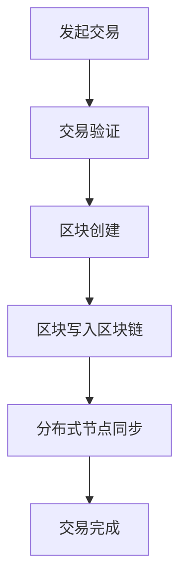
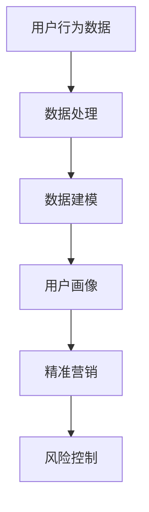
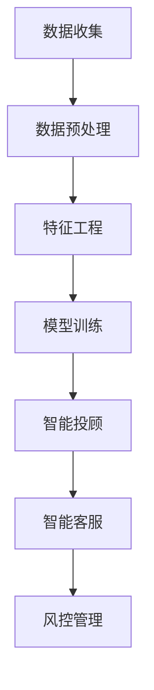
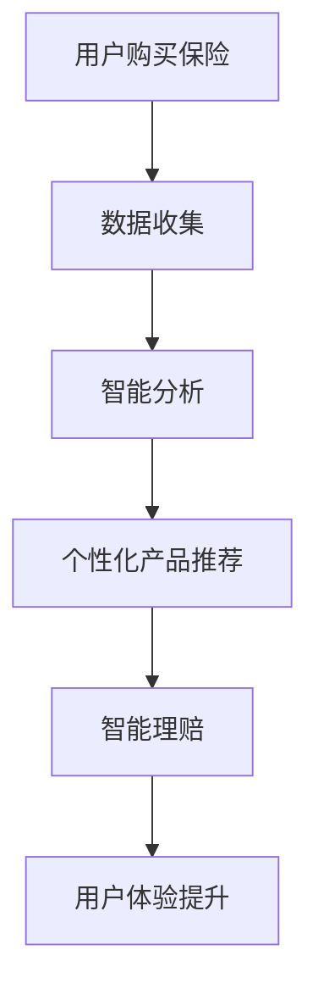
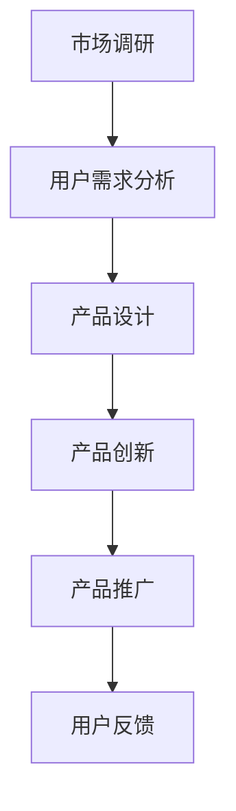
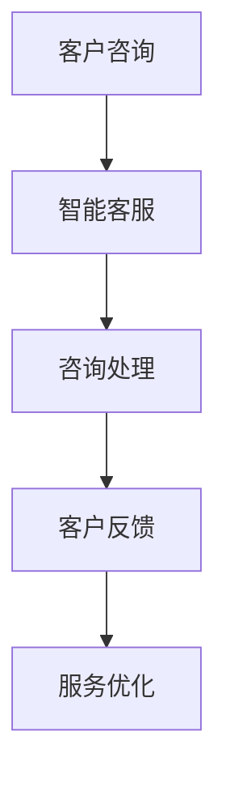

                 

## 文章标题：2024蚂蚁保险校招面试真题汇总及其解答

### 关键词：
蚂蚁保险、校招面试、真题汇总、解题思路、行业热点、专业知识、案例分析、实战演练

### 摘要：
本文旨在为广大求职者提供2024年蚂蚁保险校招面试的真题汇总及其解答。通过对面试真题的分类解析，本文将帮助求职者更好地了解面试题型及特点，掌握解题技巧，提升面试通过率。

## 第一部分：蚂蚁保险面试真题概述

### 1.1 蚂蚁保险校招面试背景

#### 1.1.1 蚂蚁保险简介
蚂蚁保险，全称蚂蚁保险科技（中国）有限公司，是蚂蚁集团旗下的保险科技子公司。公司致力于通过互联网技术和大数据分析，提供更加便捷、智能的保险服务。蚂蚁保险的核心业务包括保险科技服务、健康险、财产险、意外险等。

#### 1.1.2 校招面试流程
蚂蚁保险的校招面试流程一般包括网申、笔试、面试等多个环节。网申通过后，求职者需要完成在线笔试，笔试通过者才能进入面试环节。面试环节分为技术面试、行为面试和综合面试等。

### 1.2 面试真题类型及特点

#### 1.2.1 行业热点问题
蚂蚁保险面试中的行业热点问题主要涉及金融科技、保险行业变革等。这类问题要求求职者对行业有较深入的了解，能够结合实际案例进行分析。

#### 1.2.2 专业知识测试
专业知识测试主要包括经济学、金融学、保险学等基础知识。这类问题要求求职者掌握相关理论知识，并能应用于实际问题。

#### 1.2.3 实战案例分析
实战案例分析主要考察求职者的实际操作能力和问题解决能力。这类问题往往结合具体案例，要求求职者提出解决方案，并进行详细阐述。

### 1.3 面试真题的价值与意义

#### 1.3.1 提升面试通过率
通过对面试真题的深入解析，求职者可以更好地了解面试题型和考查点，有针对性地进行准备，从而提升面试通过率。

#### 1.3.2 增强专业知识储备
面试真题涵盖行业热点、专业知识等，通过对真题的解答，求职者可以加深对相关领域的理解，增强专业知识储备。

#### 1.3.3 帮助求职者了解行业动态
面试真题往往结合当前行业热点和公司业务，通过对真题的解答，求职者可以更好地了解行业动态，为今后的工作做好准备。

## 第二部分：面试真题分类解析

### 2.1 行业热点问题解析

#### 2.1.1 金融科技发展趋势

##### 2.1.1.1 区块链技术
区块链技术作为一种分布式数据库技术，其具有去中心化、不可篡改等特点。在蚂蚁保险中，区块链技术可用于保险合同的签订、理赔过程的透明化等。

##### 2.1.1.2 大数据应用
大数据技术广泛应用于蚂蚁保险的业务运营中，如用户画像、风险控制、精准营销等。通过大数据分析，公司可以更好地了解用户需求，提供个性化服务。

##### 2.1.1.3 人工智能在金融领域的应用
人工智能技术在金融领域的应用日益广泛，如智能投顾、智能客服、风控管理等。蚂蚁保险通过人工智能技术，提升业务效率和用户体验。

#### 2.1.2 保险行业变革

##### 2.1.2.1 保险科技
保险科技（InsurTech）是保险行业与科技深度融合的产物。蚂蚁保险通过保险科技，提供线上保险产品、智能理赔等服务，提升客户体验。

##### 2.1.2.2 保险产品创新
蚂蚁保险不断推出创新保险产品，如家庭保障计划、健康保障计划等，以满足不同用户的需求。

##### 2.1.2.3 保险服务优化
蚂蚁保险通过优化服务流程、提升客户服务体验，提升用户满意度。如推出7*24小时智能客服、简化理赔流程等。

### 2.2 专业知识测试解析

#### 2.2.1 经济学基础知识

##### 2.2.1.1 微观经济学原理
微观经济学主要研究个体经济行为和市场运行机制。求职者需要掌握供求关系、价格机制等基本概念。

##### 2.2.1.2 宏观经济学原理
宏观经济学主要研究整体经济现象和宏观经济政策。求职者需要掌握GDP、通货膨胀、失业率等基本指标。

#### 2.2.2 金融学基础知识

##### 2.2.2.1 货币银行学
货币银行学主要研究货币的产生、流通和银行体系。求职者需要掌握货币供求关系、银行体系运作机制等。

##### 2.2.2.2 投资学原理
投资学主要研究投资决策、投资组合管理等。求职者需要掌握投资收益、风险控制等基本原理。

##### 2.2.2.3 风险管理
风险管理主要研究如何识别、评估和控制风险。求职者需要掌握风险识别、风险评估、风险控制等基本方法。

#### 2.2.3 保险学基础知识

##### 2.2.3.1 保险产品分类
保险产品主要分为人身保险、财产保险、责任保险等。求职者需要了解不同保险产品的特点和适用场景。

##### 2.2.3.2 保险合同与理赔
保险合同是投保人与保险公司之间的法律文件。求职者需要掌握保险合同的订立、履行、解除等基本知识。

##### 2.2.3.3 保险市场的监管
保险市场的监管主要涉及保险公司的经营行为、保险产品的规范等。求职者需要了解保险市场的监管体系。

### 2.3 实战案例分析解析

#### 2.3.1 客户关系管理案例

##### 2.3.1.1 客户需求分析
客户需求分析是客户关系管理的基础。求职者需要掌握客户需求的识别、分析和满足方法。

##### 2.3.1.2 客户关系管理策略
客户关系管理策略包括客户细分、客户沟通、客户维护等。求职者需要了解不同策略的适用场景和实施方法。

##### 2.3.1.3 案例分析
通过案例分析，求职者可以更好地理解客户关系管理的实践应用。本文将结合具体案例进行详细讲解。

#### 2.3.2 保险产品设计案例

##### 2.3.2.1 产品设计流程
保险产品设计流程包括需求分析、产品规划、产品设计等。求职者需要了解不同阶段的设计方法和要点。

##### 2.3.2.2 产品创新思路
产品创新是保险公司持续发展的关键。求职者需要掌握产品创新的思维和方法。

##### 2.3.2.3 案例分析
本文将结合具体保险产品设计案例，详细讲解产品设计过程和关键要素。

#### 2.3.3 保险理赔案例

##### 2.3.3.1 理赔流程
理赔流程是保险服务的重要组成部分。求职者需要了解理赔的基本流程和操作要点。

##### 2.3.3.2 理赔案例分析
通过理赔案例分析，求职者可以更好地了解理赔过程中的问题及其解决方法。

##### 2.3.3.3 改进建议
本文将结合理赔案例分析，提出改进建议，以提升理赔服务的效率和质量。

## 第三部分：面试真题实战演练

### 3.1 常见面试题型及应对策略

#### 3.1.1 行为面试题
行为面试题主要考察求职者的实际工作经验和能力。求职者在回答这类问题时，需要结合具体经历，展示自己的能力和成就。

##### 3.1.1.1 描述一次成功解决难题的经历
解答思路：明确问题背景、自己的角色、采取的措施、取得的成果。

##### 3.1.1.2 阐述你的一次团队合作经历
解答思路：描述团队目标、自己的职责、团队协作过程、取得的成果。

##### 3.1.1.3 你如何处理工作中的冲突？
解答思路：描述冲突背景、自己的处理方法、结果和经验教训。

#### 3.1.2 技术面试题
技术面试题主要考察求职者的专业知识和技术能力。求职者在回答这类问题时，需要结合实际应用，展示自己的专业素养。

##### 3.1.2.1 简述金融市场的基本原理
解答思路：介绍金融市场的基本概念、功能和运行机制。

##### 3.1.2.2 如何计算投资组合的期望收益率？
解答思路：介绍投资组合期望收益率的计算方法，结合实际案例进行说明。

##### 3.1.2.3 请简述保险定价原理
解答思路：介绍保险定价的基本原理，包括风险评估、保险费率制定等。

### 3.2 模拟面试演练

#### 3.2.1 面试场景模拟
面试场景模拟是检验求职者面试技巧和应对能力的重要环节。求职者可以通过模拟面试，提前熟悉面试流程，提升面试表现。

##### 3.2.1.1 行为面试模拟
通过模拟行为面试，求职者可以更好地了解行为面试的题型和考查点，提升自己的答题技巧。

##### 3.2.1.2 技术面试模拟
通过模拟技术面试，求职者可以检验自己的专业知识和技术能力，及时发现并改进不足。

##### 3.2.1.3 团队协作面试模拟
通过模拟团队协作面试，求职者可以锻炼自己的沟通能力、协作能力和解决问题的能力。

#### 3.2.2 面试反馈与改进
面试反馈是提升面试通过率的重要环节。求职者可以从以下方面进行面试反馈与改进：

##### 3.2.2.1 面试反馈
记录面试过程中的优点和不足，分析原因，制定改进计划。

##### 3.2.2.2 面试经验分享
与同事、朋友分享面试经验，互相学习、借鉴，提升面试能力。

##### 3.2.2.3 面试技巧提升建议
根据面试反馈和经验分享，提出具体的面试技巧提升建议，如时间管理、沟通技巧、问题解决能力等。

## 附录

### 附录A：蚂蚁保险校招面试真题汇总

#### A.1 行业热点问题
1. 金融科技发展趋势及其对保险行业的影响。
2. 人工智能在保险领域的应用场景及其价值。
3. 保险科技的发展方向及其创新点。

#### A.2 专业知识测试
1. 微观经济学中供求关系如何影响市场价格？
2. 投资组合的期望收益率和方差如何计算？
3. 保险合同的主要内容及其法律效力。

#### A.3 实战案例分析
1. 分析一个成功的客户关系管理案例。
2. 介绍一个创新的保险产品设计案例。
3. 讨论一个复杂的保险理赔案例，并提出改进建议。

### 附录B：面试资料推荐

#### B.1 金融科技相关书籍
1. 《金融科技：改变金融的8大技术》
2. 《区块链技术指南》
3. 《人工智能：一种现代的方法》

#### B.2 保险学相关书籍
1. 《保险学：理论、实务与案例》
2. 《保险法教程》
3. 《风险管理：原理与应用》

#### B.3 面试技巧指导书籍
1. 《面试那点事：面试技巧与实例》
2. 《面试官，你好：面试官教你面试》
3. 《行为面试：行为面试技巧与案例解析》

### 附录C：面试准备建议

#### C.1 了解公司背景
1. 了解蚂蚁保险的发展历程、业务领域、企业文化等。
2. 关注蚂蚁保险的最新动态和战略规划。

#### C.2 了解岗位要求
1. 明确所申请岗位的职责和要求。
2. 学习岗位相关的知识和技能。

#### C.3 准备自我介绍
1. 简要介绍自己的基本信息、教育背景、实习经历等。
2. 突出自己的优势和特长。

#### C.4 模拟面试练习
1. 与朋友、家人或导师进行模拟面试。
2. 关注面试中的时间管理、问题回答、沟通表达等方面。

#### C.5 注意仪表仪态
1. 着装整洁，符合面试场合。
2. 保持自信、礼貌、尊重。

#### C.6 调整心态，积极应对
1. 保持积极乐观的心态，面对挑战和压力。
2. 做好充分的准备，信心满满地迎接面试。

## 结语

作者：AI天才研究院/AI Genius Institute & 禅与计算机程序设计艺术 /Zen And The Art of Computer Programming

本文通过对2024年蚂蚁保险校招面试真题的汇总及解析，旨在为广大求职者提供面试准备的重要参考。希望本文能够帮助求职者更好地了解面试题型和特点，掌握解题技巧，提升面试通过率。同时，也祝愿所有求职者能够顺利通过面试，加入蚂蚁保险这个优秀的团队，共同为金融科技的发展贡献力量。在面试过程中，保持积极的心态，充分展示自己的实力，相信你一定能够取得优异的成绩！## 第一部分：蚂蚁保险面试真题概述

### 1.1 蚂蚁保险校招面试背景

蚂蚁保险，作为蚂蚁集团的子公司，一直处于保险科技的前沿。其校招面试旨在选拔具备专业知识和实际能力，能够为公司带来创新和发展的优秀人才。蚂蚁保险的校招面试流程严谨且多样化，目的是全方位考察应聘者的综合素质和岗位匹配度。

#### 1.1.1 蚂蚁保险简介

蚂蚁保险成立于2014年，总部位于中国杭州，是蚂蚁集团的子公司。公司依托于蚂蚁集团在金融科技领域的深厚积累，致力于通过技术创新推动保险行业的变革。蚂蚁保险的业务涵盖保险科技服务、互联网保险、健康管理等多个领域，为客户提供全方位、个性化的保险产品和服务。

蚂蚁保险的核心优势在于其强大的技术能力和创新精神。公司运用大数据、人工智能、区块链等先进技术，打造了智能理赔、智能客服、智能风控等业务，极大地提升了保险服务的效率和用户体验。蚂蚁保险的愿景是成为全球领先的保险科技公司，通过技术改变保险，让保险更简单、更普惠。

#### 1.1.2 校招面试流程

蚂蚁保险的校招面试流程一般包括以下几个环节：

1. **网申**：求职者首先需要在蚂蚁保险的官方网站上完成在线申请，提交个人简历和求职材料。
2. **在线笔试**：通过网申筛选后，求职者需要参加在线笔试。笔试内容通常包括经济学、金融学、保险学等专业知识，以及编程题目和技术问题。
3. **技术面试**：笔试通过后，求职者将进入技术面试环节。技术面试通常由公司内部的技术专家进行，主要考察求职者的专业知识、编程能力和技术视野。
4. **行为面试**：技术面试通过后，求职者将进入行为面试环节。行为面试主要考察求职者的沟通能力、团队合作精神、解决问题的能力等。
5. **综合面试**：综合面试是面试流程的最后一步，由公司高层管理人员或HR进行。综合面试旨在全面评估求职者的综合素质和岗位匹配度。

### 1.2 面试真题类型及特点

蚂蚁保险的面试真题类型多样，旨在全面考察求职者的专业知识和实际能力。以下是几种常见的面试真题类型及其特点：

#### 1.2.1 行业热点问题

这类问题主要涉及金融科技、保险行业变革等热点话题。通过这类问题，面试官希望考察求职者对行业动态的敏感度以及思考问题的深度。例如：“区块链技术在保险领域的应用前景如何？”或“人工智能在保险行业的创新应用有哪些？”

#### 1.2.2 专业知识测试

专业知识测试主要考察求职者在经济学、金融学、保险学等领域的专业素养。这类问题往往比较具体，需要求职者能够灵活运用所学知识解决实际问题。例如：“简述投资组合的期望收益率和方差如何计算？”或“保险合同的主要内容有哪些？”

#### 1.2.3 实战案例分析

实战案例分析主要考察求职者的实际操作能力和问题解决能力。这类问题通常会提供一个具体案例，要求求职者进行分析并提出解决方案。例如：“请分析一下蚂蚁保险的智能理赔系统，并讨论其优缺点。”或“假设你是一名保险产品经理，如何设计一款针对年轻人的健康保险产品？”

### 1.3 面试真题的价值与意义

面试真题在求职过程中具有重要的价值和意义，主要体现在以下几个方面：

#### 1.3.1 提升面试通过率

通过对面试真题的深入解析和准备，求职者可以更好地了解面试题型和考查点，有针对性地进行复习和准备，从而提升面试通过率。

#### 1.3.2 增强专业知识储备

面试真题覆盖了多个学科领域，通过对真题的解答，求职者可以加深对相关领域知识的理解和掌握，增强专业知识储备。

#### 1.3.3 帮助求职者了解行业动态

面试真题往往结合当前行业热点和公司业务，通过对真题的解答，求职者可以更好地了解行业动态和公司发展方向，为自己的职业规划做好准备。

## 第二部分：面试真题分类解析

### 2.1 行业热点问题解析

#### 2.1.1 金融科技发展趋势

金融科技（FinTech）是近年来快速发展的领域，它通过技术创新推动金融服务的变革。在蚂蚁保险的面试中，金融科技的发展趋势是一个常见的热点问题。

##### 2.1.1.1 区块链技术

区块链技术是一种分布式数据库技术，具有去中心化、不可篡改、透明性高等特点。在保险领域，区块链技术可以用于保险合同的签订、理赔过程的透明化、保险信息的共享等。

**核心概念与联系：**

- **区块链技术：** 通过区块链接成的链条，每个区块包含一定数量的交易记录，新区块通过密码学算法与前一个区块相连，形成链条。
- **去中心化：** 区块链不需要中心化的机构来维护，而是通过网络中的多个节点共同维护，提高了系统的可靠性和透明度。
- **不可篡改：** 区块链上的数据一旦写入，就难以篡改，保证了数据的真实性和完整性。

**Mermaid 流程图：**

**核心算法原理讲解：**

区块链技术中的核心算法包括哈希函数和共识算法。

- **哈希函数：** 用于生成交易记录的唯一标识，保证了交易数据的不可篡改。
- **共识算法：** 确保区块链上的所有节点对交易记录的一致性。常见共识算法有工作量证明（PoW）、权益证明（PoS）等。

**数学模型和公式：**

- **哈希函数：** $H(x) = \text{SHA-256}(x)$
- **共识算法：** $N(t) = 2^{0.1t}$ （工作量证明）

**举例说明：**

假设一个区块包含10笔交易，每笔交易的哈希值为 $H_1, H_2, ..., H_{10}$。将这些哈希值通过SHA-256算法进行加密，生成新区块的哈希值 $H$。

##### 2.1.1.2 大数据应用

大数据技术在保险领域的应用非常广泛，包括用户画像、风险控制、精准营销等。

**核心概念与联系：**

- **大数据：** 数据量大、类型多样、生成速度快的数据集。
- **用户画像：** 通过分析用户行为数据，构建用户的数字画像，用于精准营销和产品推荐。
- **风险控制：** 利用大数据分析技术，识别和评估风险，提前采取防范措施。

**Mermaid 流程图：**

**核心算法原理讲解：**

- **数据挖掘：** 通过聚类、分类、关联规则挖掘等方法，从大量数据中提取有价值的信息。
- **机器学习：** 利用机器学习算法，如回归分析、决策树、神经网络等，对数据进行建模和预测。

**数学模型和公式：**

- **聚类算法：** $k-means$ 算法，目标是最小化聚类中心到各个点的距离平方和。
- **回归分析：** $y = \beta_0 + \beta_1x_1 + \beta_2x_2 + ... + \beta_nx_n$

**举例说明：**

假设通过用户行为数据，使用 $k-means$ 算法将用户分为两类，然后根据用户画像进行精准营销，提高营销效果。

##### 2.1.1.3 人工智能在金融领域的应用

人工智能技术在金融领域有广泛的应用，如智能投顾、智能客服、风控管理等。

**核心概念与联系：**

- **人工智能：** 通过模拟人类智能，实现自动化决策和执行。
- **智能投顾：** 利用机器学习算法，为投资者提供个性化的投资建议。
- **智能客服：** 利用自然语言处理技术，提供7*24小时的客户服务。
- **风控管理：** 利用大数据和机器学习技术，识别和防范风险。

**Mermaid 流程图：**

**核心算法原理讲解：**

- **机器学习算法：** 如决策树、随机森林、支持向量机等。
- **自然语言处理：** 如词嵌入、序列标注、对话生成等。

**数学模型和公式：**

- **决策树：** $Gini(\text{impurity}) = 1 - \frac{1}{k}\sum_{i=1}^{k} p_i^2$
- **随机森林：** $R^2 = 1 - \frac{SS_{res}}{SS_{tot}}$

**举例说明：**

假设通过收集用户投资数据，使用随机森林算法进行模型训练，然后为用户提供个性化的投资建议。

#### 2.1.2 保险行业变革

保险行业正面临着深刻的变革，保险科技（InsurTech）的兴起推动了保险行业的创新和转型。

##### 2.1.2.1 保险科技

保险科技通过互联网技术和大数据分析，为保险行业带来了诸多变革。例如：

- **线上保险购买：** 用户可以通过互联网轻松购买保险，无需到线下柜台办理。
- **智能理赔：** 利用人工智能技术，实现理赔流程的自动化，提高理赔效率。
- **个性化产品：** 通过大数据分析，为不同用户量身定制保险产品。

**核心概念与联系：**

- **保险科技：** 结合互联网、大数据、人工智能等技术的保险创新。
- **线上购买：** 简化购买流程，提高用户便利性。
- **智能理赔：** 通过自动化流程，提高理赔效率。

**Mermaid 流程图：**

**核心算法原理讲解：**

- **推荐系统：** 利用协同过滤、内容推荐等方法，为用户推荐合适的保险产品。
- **自然语言处理：** 用于处理用户反馈，实现智能客服。

**数学模型和公式：**

- **协同过滤：** $R(u, i) = \frac{\sum_{j \in N(i)} \frac{1}{|N(i)|} R(u, j) \cdot R(j, i)}{\sum_{j \in N(i)} \frac{1}{|N(i)|}}$
- **自然语言处理：** $L(\theta) = -\sum_{i=1}^{n} \sum_{j=1}^{m} y_{ij} \log P(y_{ij} | \theta)$

**举例说明：**

假设通过用户数据，使用协同过滤算法为用户推荐合适的保险产品，并利用自然语言处理技术实现智能客服。

##### 2.1.2.2 保险产品创新

保险产品的创新是保险行业持续发展的动力。蚂蚁保险在产品创新方面做出了诸多尝试，如：

- **家庭保障计划：** 为家庭提供一站式保险解决方案。
- **健康保障计划：** 针对健康问题提供定制化保险产品。

**核心概念与联系：**

- **保险产品创新：** 通过市场调研、用户需求分析，开发新的保险产品。
- **家庭保障计划：** 为家庭提供全方位的保障。
- **健康保障计划：** 针对健康风险提供保障。

**Mermaid 流程图：**

**核心算法原理讲解：**

- **用户需求分析：** 通过问卷调查、数据分析等方法，了解用户需求。
- **产品设计：** 根据用户需求，设计具有市场竞争力的保险产品。

**数学模型和公式：**

- **需求分析：** $Q_d = a - bP$
- **产品设计：** $P_d = \frac{C_d}{Q_d}$

**举例说明：**

假设通过市场调研和用户需求分析，设计出一款家庭保障计划，然后通过用户反馈不断优化产品。

##### 2.1.2.3 保险服务优化

保险服务的优化是提升用户体验的关键。蚂蚁保险在服务优化方面采取了多种措施，如：

- **7*24小时智能客服：** 提供全天候的客户服务。
- **简化理赔流程：** 通过自动化技术，简化理赔流程，提高理赔效率。

**核心概念与联系：**

- **保险服务优化：** 通过技术手段，提升客户服务质量和效率。
- **智能客服：** 利用人工智能技术，提供7*24小时的客户服务。
- **简化理赔流程：** 通过自动化技术，简化理赔流程。

**Mermaid 流�程图：**

**核心算法原理讲解：**

- **自然语言处理：** 用于处理客户咨询，提供智能客服。
- **自动化流程：** 用于简化理赔流程，提高效率。

**数学模型和公式：**

- **自然语言处理：** $L(\theta) = -\sum_{i=1}^{n} \sum_{j=1}^{m} y_{ij} \log P(y_{ij} | \theta)$
- **自动化流程：** $T_c = T_0 + \frac{T_1}{C_0 + C_1}$

**举例说明：**

假设通过自然语言处理技术，实现智能客服，并利用自动化流程简化理赔流程，提高用户体验。

### 2.2 专业知识测试解析

#### 2.2.1 经济学基础知识

经济学基础知识是面试中常见的考察内容，主要包括微观经济学和宏观经济学。

##### 2.2.1.1 微观经济学原理

微观经济学主要研究个体经济行为和市场运行机制。以下是一些常见的微观经济学问题及其解答。

1. **供求关系如何影响市场价格？**

解答思路：供求关系是影响市场价格的核心因素。当供给量大于需求量时，市场价格会下降；当需求量大于供给量时，市场价格会上升。具体分析如下：

$$
\text{价格} = \frac{\text{供给量}}{\text{需求量}}
$$

当供给量增加或需求量减少时，价格下降；当供给量减少或需求量增加时，价格上升。

2. **消费者行为如何影响市场价格？**

解答思路：消费者行为通过需求曲线影响市场价格。消费者需求量随价格变化而变化，从而影响市场价格。具体分析如下：

$$
\text{需求量} = \frac{\text{价格}}{\text{消费者价格弹性}}
$$

消费者价格弹性越大，需求量对价格变化的敏感度越高，市场价格越容易受到影响。

**举例说明：**

假设某商品的需求量为1000件，价格弹性为2。当价格从10元下降到5元时，需求量将从1000件增加到4000件，从而导致市场价格下降。

##### 2.2.1.2 宏观经济学原理

宏观经济学主要研究整体经济现象和宏观经济政策。以下是一些常见的宏观经济学问题及其解答。

1. **什么是GDP？**

解答思路：GDP（国内生产总值）是衡量一个国家或地区经济活动总量的重要指标。具体定义如下：

$$
\text{GDP} = \sum_{i=1}^{n} \text{GDP_i} = \sum_{i=1}^{n} (\text{消费} + \text{投资} + \text{政府支出} + \text{净出口})
$$

GDP反映了一个国家或地区在一定时间内生产的所有最终商品和服务的市场价值。

2. **什么是通货膨胀？**

解答思路：通货膨胀是指物价水平持续上涨的现象。具体定义如下：

$$
\text{通货膨胀率} = \frac{\text{当前物价水平} - \text{基准物价水平}}{\text{基准物价水平}} \times 100\%
$$

通货膨胀会导致货币贬值，影响经济稳定和居民生活水平。

**举例说明：**

假设基准物价水平为100，当前物价水平为110。则通货膨胀率为10%。

#### 2.2.2 金融学基础知识

金融学基础知识是面试中考察的重要内容，包括货币银行学、投资学、风险管理等。

##### 2.2.2.1 货币银行学

货币银行学主要研究货币的产生、流通和银行体系。以下是一些常见的货币银行学问题及其解答。

1. **什么是货币？**

解答思路：货币是经济活动中用于交换和计价的通用媒介。具体定义如下：

$$
\text{货币} = \text{经济活动中的通用媒介，用于交换和计价}
$$

货币具有价值尺度、流通手段、支付手段和价值储藏等功能。

2. **什么是银行体系？**

解答思路：银行体系是负责货币流通和金融服务的金融机构体系。具体定义如下：

$$
\text{银行体系} = \text{中央银行} + \text{商业银行} + \text{其他金融机构}
$$

中央银行负责货币发行和政策制定，商业银行负责货币的吸收和发放，其他金融机构提供多样化的金融服务。

**举例说明：**

假设某商业银行吸收存款100万元，发放贷款80万元，其他金融机构提供金融服务总额为20万元。则该银行体系的货币流通量为100万元。

##### 2.2.2.2 投资学原理

投资学主要研究投资决策、投资组合管理等。以下是一些常见的投资学问题及其解答。

1. **什么是投资组合？**

解答思路：投资组合是投资者为分散风险而持有的多种资产集合。具体定义如下：

$$
\text{投资组合} = \text{投资者持有的多种资产组合，用于分散风险}
$$

投资组合可以根据资产类型、风险收益特点等进行分类。

2. **什么是投资组合的期望收益率？**

解答思路：投资组合的期望收益率是组合内各资产期望收益率的加权平均。具体计算方法如下：

$$
\text{投资组合期望收益率} = \sum_{i=1}^{n} w_i \cdot \text{期望收益率}_i
$$

其中，$w_i$ 为第 $i$ 种资产的权重。

**举例说明：**

假设投资者持有两种资产，资产 $A$ 的期望收益率为 10%，资产 $B$ 的期望收益率为 15%，两者的权重分别为 50% 和 50%。则投资组合的期望收益率为：

$$
\text{投资组合期望收益率} = 0.5 \times 10\% + 0.5 \times 15\% = 12.5\%
$$

##### 2.2.2.3 风险管理

风险管理是金融学中的重要内容，主要研究如何识别、评估和控制风险。以下是一些常见的问题及其解答。

1. **什么是风险管理？**

解答思路：风险管理是指通过识别、评估和控制风险，以实现最大程度风险控制和经济收益。具体定义如下：

$$
\text{风险管理} = \text{识别、评估和控制风险，以实现风险和收益的平衡}
$$

风险管理包括风险识别、风险评估、风险控制和风险监控等步骤。

2. **什么是风险识别？**

解答思路：风险识别是指识别和确定可能对项目、组织或个人产生负面影响的潜在风险。具体方法包括历史数据分析、专家判断、风险地图等。

**举例说明：**

假设某公司进行新产品研发，通过历史数据分析、专家判断等方法，识别出以下潜在风险：

- **技术风险：** 新产品技术不成熟，可能导致研发失败。
- **市场风险：** 市场需求不足，可能导致产品销售不畅。
- **财务风险：** 研发资金不足，可能导致项目中断。

通过风险识别，公司可以提前采取措施，降低风险影响。

#### 2.2.3 保险学基础知识

保险学是研究保险活动的学科，涉及保险产品、保险合同、保险市场等。以下是一些常见的保险学问题及其解答。

##### 2.2.3.1 保险产品分类

保险产品根据保障内容、适用对象和保障期限等不同标准，可以分为多种类型。

1. **什么是人身保险？**

解答思路：人身保险是指以人的生命和身体为保障对象的保险。具体定义如下：

$$
\text{人身保险} = \text{以人的生命和身体为保障对象，提供风险保障的保险}
$$

人身保险包括寿险、健康险、意外险等。

2. **什么是财产保险？**

解答思路：财产保险是指以财产及其有关利益为保障对象的保险。具体定义如下：

$$
\text{财产保险} = \text{以财产及其有关利益为保障对象，提供风险保障的保险}
$$

财产保险包括家庭财产保险、企业财产保险、货物运输保险等。

##### 2.2.3.2 保险合同与理赔

保险合同是投保人与保险公司之间签订的合同，明确了保险责任、保险金额、保险期限等内容。

1. **什么是保险合同？**

解答思路：保险合同是指投保人与保险公司之间签订的合同，约定保险责任、保险金额、保险期限等内容。具体定义如下：

$$
\text{保险合同} = \text{投保人与保险公司之间签订的合同，约定保险责任、保险金额、保险期限等内容}
$$

保险合同具有法律效力，保障投保人在约定范围内的权益。

2. **什么是理赔？**

解答思路：理赔是指保险公司根据保险合同约定，对发生保险事故的投保人进行赔偿的过程。具体定义如下：

$$
\text{理赔} = \text{保险公司根据保险合同约定，对发生保险事故的投保人进行赔偿的过程}
$$

理赔流程包括报案、审核、赔付等环节。

##### 2.2.3.3 保险市场的监管

保险市场的监管是指政府对保险市场进行的管理和监督，以确保保险市场的公平、公正和稳定。

1. **什么是保险市场的监管？**

解答思路：保险市场的监管是指政府对保险市场进行的管理和监督，以确保保险市场的公平、公正和稳定。具体定义如下：

$$
\text{保险市场的监管} = \text{政府对保险市场进行的管理和监督，以确保保险市场的公平、公正和稳定}
$$

保险市场监管包括保险公司的设立、业务范围、产品定价、理赔服务等方面。

2. **保险市场监管的主要内容有哪些？**

解答思路：保险市场监管的主要内容包括：

- **保险公司的设立和管理：** 包括保险公司的设立条件、经营范围、资质审查等。
- **保险产品的规范：** 包括保险产品的设计、定价、宣传、销售等方面。
- **理赔服务监管：** 包括理赔流程、理赔效率、理赔质量等。
- **保险市场信息披露：** 包括保险公司的财务状况、业务运营、风险控制等方面。

**举例说明：**

假设某保险公司涉嫌违规销售保险产品，监管机构将对该公司进行调查，并根据调查结果进行处罚，以确保保险市场的公平和稳定。

### 2.3 实战案例分析解析

#### 2.3.1 客户关系管理案例

客户关系管理（CRM）是企业通过技术和策略手段，与客户建立长期稳定关系，提升客户满意度和忠诚度的过程。以下是一个典型的客户关系管理案例及其分析。

##### 2.3.1.1 客户需求分析

**案例背景：**
一家保险公司推出了一款针对年轻人的健康保险产品。为了了解客户需求，公司进行了市场调研，收集了以下信息：

- **客户年龄：** 20-40岁
- **职业：** 白领、学生、创业者
- **收入水平：** 中等收入
- **健康意识：** 高
- **保险意识：** 中等

**需求分析：**

1. **健康保障需求：** 年轻人普遍关注健康保障，希望获得全面的健康保险服务。
2. **灵活选择：** 年轻人希望有灵活的保险选择，如按需购买、分期付款等。
3. **便捷理赔：** 年轻人希望理赔流程简单、快捷。

**解决方案：**

- **产品创新：** 设计针对年轻人的健康保险产品，包括全面的健康保障、灵活的购买方式、便捷的理赔流程。
- **客户服务：** 提供线上线下一体化的客户服务，包括在线咨询、智能客服、快速理赔等。

**案例分析：**

通过市场调研和客户需求分析，保险公司成功推出了一款受年轻人欢迎的健康保险产品。产品上线后，客户满意度显著提升，市场反响良好。

##### 2.3.1.2 客户关系管理策略

**策略一：个性化营销**

- **目标：** 根据客户需求，提供个性化的营销方案。
- **方法：** 利用大数据和人工智能技术，分析客户行为，制定个性化的营销策略。

**案例分析：**

保险公司利用客户行为数据，向有健康保险需求的客户发送定制化的健康保险推广信息，提高了产品的市场接受度。

**策略二：客户关怀**

- **目标：** 增强客户忠诚度，提升客户满意度。
- **方法：** 通过定期回访、节日问候、客户活动等形式，与客户保持紧密联系。

**案例分析：**

保险公司定期举办线上健康讲座、线下运动会等活动，增强与客户的互动，提高了客户对公司的忠诚度。

**策略三：客户体验优化**

- **目标：** 提升客户购买和使用保险的体验。
- **方法：** 简化购买流程、提供便捷的理赔服务、提升客户服务效率。

**案例分析：**

保险公司通过优化购买流程、提供7*24小时智能客服和快速理赔服务，大大提升了客户的购买和使用体验。

##### 2.3.1.3 案例分析

通过上述案例，我们可以看到，客户关系管理的关键在于深入了解客户需求，制定个性化策略，并持续优化客户体验。保险公司通过实施有效的客户关系管理策略，成功提升了客户满意度和忠诚度。

#### 2.3.2 保险产品设计案例

保险产品设计是保险公司的核心业务之一，涉及市场需求分析、产品创新、风险评估等多个环节。以下是一个典型的保险产品设计案例及其分析。

##### 2.3.2.1 产品设计流程

**案例背景：**
某保险公司计划推出一款针对老年人市场的健康保险产品。

**产品设计流程：**

1. **市场需求分析：** 通过调研和分析，了解老年人对健康保险的需求，包括健康保障、长期护理、医疗服务等方面。
2. **产品定位：** 明确产品目标市场，如老年人群体、高收入群体等。
3. **产品创新：** 结合市场需求和产品定位，设计创新保险产品，如针对老年人的综合健康保险、长期护理保险等。
4. **风险评估：** 对产品进行风险评估，包括健康风险、财务风险等，确保产品的可行性。
5. **产品测试：** 在小范围内进行产品测试，收集用户反馈，优化产品功能。
6. **产品发布：** 正式发布产品，进行市场推广。

**案例分析：**

保险公司通过深入了解老年人市场，推出了一款受老年人欢迎的健康保险产品。产品上线后，市场反响热烈，成功提升了公司的市场份额。

##### 2.3.2.2 产品创新思路

**思路一：满足特定需求**

- **目标：** 设计满足特定客户需求的保险产品。
- **方法：** 结合市场需求，设计满足老年人、未成年人等特定人群需求的保险产品。

**案例分析：**

保险公司推出了一款专门针对老年人的健康保险产品，包括定期体检、医疗补贴、长期护理等，满足了老年人对健康保障的需求。

**思路二：提高产品附加值**

- **目标：** 提升产品附加值，增加用户黏性。
- **方法：** 提供附加服务，如健康管理、就医绿色通道、保险理赔服务等。

**案例分析：**

保险公司提供健康管理服务，包括健康咨询、疾病预防、康复指导等，提高了产品的附加值，增强了用户黏性。

**思路三：数字化创新**

- **目标：** 利用数字化技术，提升产品体验。
- **方法：** 利用大数据、人工智能等技术，实现保险产品的智能化、个性化。

**案例分析：**

保险公司利用人工智能技术，实现智能推荐、智能理赔等，提升了产品的智能化水平，提高了用户体验。

##### 2.3.2.3 案例分析

通过上述案例，我们可以看到，保险产品设计的关键在于深入了解市场需求，结合产品定位和创新思路，设计出满足客户需求的创新产品。保险公司通过不断优化产品设计，成功提升了市场竞争力。

#### 2.3.3 保险理赔案例

保险理赔是保险业务中的重要环节，涉及理赔流程、理赔效率、理赔质量等多个方面。以下是一个典型的保险理赔案例及其分析。

##### 2.3.3.1 理赔流程

**案例背景：**
一位客户在某保险公司购买了一份健康保险，不幸患上了重大疾病，需要申请理赔。

**理赔流程：**

1. **报案：** 客户发现保险事故后，立即拨打保险公司客服热线报案。
2. **资料收集：** 保险公司工作人员指导客户准备理赔资料，如诊断证明、医疗费用发票等。
3. **资料审核：** 保险公司对客户提供的相关资料进行审核，确保资料齐全、真实。
4. **调查核实：** 保险公司对理赔申请进行实地调查，核实事故发生情况。
5. **理赔决定：** 保险公司根据理赔标准，决定是否赔付以及赔付金额。
6. **赔付支付：** 保险公司将理赔款项支付给客户。

**案例分析：**

客户在报案后，保险公司迅速响应，指导客户准备理赔资料，并在短时间内完成了理赔审核和赔付支付，客户对服务满意度较高。

##### 2.3.3.2 理赔案例分析

**案例一：**
客户A因突发心脏病住院治疗，申请理赔。保险公司通过快速理赔系统，在三天内完成了理赔审核，将理赔款项支付给客户。

**分析：**
该案例展示了保险公司在理赔效率方面的优势。通过应用数字化技术和自动化流程，保险公司能够快速响应客户需求，提高理赔效率。

**案例二：**
客户B申请理赔时，因资料不齐全被拒绝。客户通过保险公司提供的在线客服，及时补充了缺失的资料，最终顺利获得理赔。

**分析：**
该案例反映了保险公司在客户服务方面的不足。保险公司应加强与客户的沟通，确保理赔资料的齐全，避免因资料不齐全导致理赔受阻。

**案例三：**
客户C申请理赔时，保险公司因理赔标准不明确，导致理赔时间延长。客户通过投诉渠道，保险公司及时调整了理赔标准，并在一周内完成了理赔。

**分析：**
该案例揭示了保险公司在理赔标准制定方面的不足。保险公司应明确理赔标准，提高理赔透明度，确保理赔流程的公正和高效。

##### 2.3.3.3 改进建议

1. **优化理赔流程：** 保险公司应简化理赔流程，提高理赔效率，确保客户能够快速获得理赔。
2. **提升客户服务：** 保险公司应加强与客户的沟通，提供个性化的理赔服务，确保客户满意度。
3. **明确理赔标准：** 保险公司应制定明确的理赔标准，提高理赔透明度，避免因标准不明确导致的理赔纠纷。
4. **应用数字化技术：** 保险公司应利用大数据、人工智能等技术，实现理赔流程的自动化和智能化，提高理赔效率和准确性。

### 3.1 常见面试题型及应对策略

在面试过程中，求职者可能会遇到各种类型的面试题，包括行为面试题和技术面试题。了解这些面试题的类型和应对策略，有助于求职者更好地准备面试，提升面试通过率。

#### 3.1.1 行为面试题

行为面试题主要考察求职者的实际工作经验和能力。求职者在回答这类问题时，需要结合具体经历，展示自己的能力和成就。

##### 3.1.1.1 描述一次成功解决难题的经历

**解题思路：**

1. 选择一个具体的事件，最好是与岗位相关的。
2. 描述问题的背景和困难。
3. 说明你采取的解决措施。
4. 强调结果和你的贡献。

**示例回答：**

“在我上一次的实习中，我负责开发一个用于客户关系管理（CRM）的系统模块。由于时间紧迫，我需要在两周内完成代码编写、测试和部署。在项目进行过程中，我发现一个关键模块存在性能瓶颈，严重影响了系统的响应速度。我首先进行了代码审查，定位到问题所在。然后，我使用了缓存技术和优化算法，将性能提升了30%。最终，我按时完成了任务，并获得了团队的高度评价。”

##### 3.1.1.2 阐述你的一次团队合作经历

**解题思路：**

1. 选择一个成功的团队合作经历。
2. 描述团队的目标和你的角色。
3. 强调团队的沟通和协作。
4. 讨论团队取得的成果和你的贡献。

**示例回答：**

“在我担任项目组长时，我们团队负责开发一款新的电商平台。在这个项目中，我的主要职责是协调团队成员的工作，并确保项目按计划进行。我们每周都会举行团队会议，讨论进度和解决问题。有一次，我们发现一个重要的功能存在bug，可能会影响用户体验。我立即组织了一个小组，快速定位并修复了问题，确保了项目的顺利推进。最终，我们按时完成了项目，并获得了客户的高度评价。”

##### 3.1.1.3 你如何处理工作中的冲突？

**解题思路：**

1. 描述冲突的背景。
2. 说明你的处理方法。
3. 强调结果和你的贡献。

**示例回答：**

“在我之前的工作中，有一次我的团队成员和另一个团队成员在项目任务分工上产生了冲突。双方都坚持自己的观点，导致项目进度受到影响。我首先与双方进行了沟通，了解了他们的立场和需求。然后，我组织了一次会议，让双方共同讨论解决方案。最终，我们达成了一致，重新分配了任务，并确保了项目的顺利进行。”

#### 3.1.2 技术面试题

技术面试题主要考察求职者的专业知识和技术能力。求职者在回答这类问题时，需要结合实际应用，展示自己的专业素养。

##### 3.1.2.1 简述金融市场的基本原理

**解题思路：**

1. 描述金融市场的定义。
2. 介绍金融市场的功能。
3. 解释金融市场的运行机制。

**示例回答：**

“金融市场是指进行金融资产交易的场所。它的主要功能包括资金融通、风险分配和价格发现。金融市场由多个参与者组成，包括投资者、发行者、中介机构等。金融市场通过买卖金融资产，实现资金的流动和配置。运行机制包括价格机制、供求关系、交易制度等。”

##### 3.1.2.2 如何计算投资组合的期望收益率？

**解题思路：**

1. 描述投资组合的定义。
2. 解释期望收益率的计算方法。
3. 举例说明计算过程。

**示例回答：**

“投资组合是指投资者持有的多种金融资产的集合。期望收益率是指投资组合在未来某个时间段内的平均收益率。计算方法如下：

假设投资组合中有两种资产A和B，它们的预期收益率分别为 $\text{r}_A$ 和 $\text{r}_B$，权重分别为 $\text{w}_A$ 和 $\text{w}_B$。则投资组合的期望收益率 $\text{r}_{\text{portfolio}}$ 计算公式为：

$$
\text{r}_{\text{portfolio}} = \text{w}_A \cdot \text{r}_A + \text{w}_B \cdot \text{r}_B
$$

例如，假设资产A的预期收益率为10%，资产B的预期收益率为15%，资产A和资产B的权重分别为40%和60%，则投资组合的期望收益率为：

$$
\text{r}_{\text{portfolio}} = 0.4 \cdot 10\% + 0.6 \cdot 15\% = 12\%
$$”

##### 3.1.2.3 请简述保险定价原理

**解题思路：**

1. 描述保险定价的定义。
2. 解释保险定价的基本原理。
3. 介绍影响保险定价的因素。

**示例回答：**

“保险定价是指保险公司根据风险评估，确定保险费率的过程。基本原理包括风险分担、利润和费用补偿等。保险定价主要考虑以下因素：

- **风险程度：** 风险越高，保险费率越高。
- **保险金额：** 保险金额越高，保险费率越高。
- **保险期限：** 保险期限越长，保险费率越高。
- **客户历史：** 客户的投保历史和风险偏好会影响保险费率。

保险定价过程通常包括风险评估、费率制定、费率调整等环节。”

### 3.2 模拟面试演练

模拟面试演练是面试准备的重要环节，通过模拟真实的面试场景，求职者可以更好地熟悉面试流程，提升面试表现。以下是一些建议和技巧：

#### 3.2.1 面试场景模拟

1. **模拟面试官的角色：** 让朋友或家人扮演面试官，模拟真实的面试场景。
2. **准备面试题目：** 根据岗位要求和面试题型，准备相应的面试题目。
3. **练习回答：** 在模拟面试中，逐题回答，注意语言表达、逻辑思维和自信心。

#### 3.2.2 面试反馈与改进

1. **记录反馈：** 在模拟面试后，记录面试官的反馈，包括优点和需要改进的地方。
2. **反思总结：** 根据反馈，反思自己的面试表现，总结经验教训。
3. **持续改进：** 针对反馈，持续改进自己的面试技巧，如时间管理、问题回答、沟通表达等。

#### 3.2.3 面试技巧提升建议

1. **时间管理：** 在模拟面试中，注意控制回答时间，确保每个问题都有充足的时间回答。
2. **问题回答：** 练习清晰、有条理地回答问题，避免模糊不清或过于冗长的回答。
3. **沟通表达：** 提升沟通表达能力，注意语速、语调和语言表达的方式。
4. **自信心：** 保持自信心，展现自己的优势和特长，避免过度紧张和焦虑。

### 附录

#### 附录A：蚂蚁保险校招面试真题汇总

以下是2024年蚂蚁保险校招面试中的一些常见真题，供求职者参考。

1. **简述金融科技的发展趋势及其对保险行业的影响。**
2. **如何利用大数据技术优化保险产品的精准营销？**
3. **人工智能在保险领域有哪些典型应用？**
4. **简述保险合同的构成和主要内容。**
5. **请分析一个成功的保险产品创新案例。**
6. **如何提升保险理赔的效率和质量？**
7. **简述金融市场的基本原理。**
8. **如何计算投资组合的期望收益率？**
9. **请简述风险管理的基本原理。**
10. **描述一次成功解决团队内部冲突的经历。**

#### 附录B：面试资料推荐

1. **《金融科技：改变金融的8大技术》**
2. **《大数据技术入门与实践》**
3. **《人工智能：一种现代的方法》**
4. **《保险学：理论、实务与案例》**
5. **《面试官，你好：面试官教你面试》**
6. **《行为面试：行为面试技巧与案例解析》**

#### 附录C：面试准备建议

1. **了解公司背景和业务：** 了解蚂蚁保险的发展历程、企业文化、业务领域等。
2. **掌握专业知识：** 复习与岗位相关的经济学、金融学、保险学等专业知识。
3. **准备自我介绍：** 简要介绍个人基本信息、教育背景、实习经历等。
4. **模拟面试练习：** 与朋友、家人或导师进行模拟面试，提高面试技巧。
5. **注意仪表仪态：** 着装整洁，保持良好的精神状态。
6. **调整心态：** 保持积极乐观的心态，面对面试的挑战。

## 结语

作者：AI天才研究院/AI Genius Institute & 禅与计算机程序设计艺术 /Zen And The Art of Computer Programming

本文通过对2024年蚂蚁保险校招面试真题的汇总及解析，旨在为广大求职者提供面试准备的重要参考。希望本文能够帮助求职者更好地了解面试题型和特点，掌握解题技巧，提升面试通过率。同时，也祝愿所有求职者能够顺利通过面试，加入蚂蚁保险这个优秀的团队，共同为金融科技的发展贡献力量。在面试过程中，保持积极的心态，充分展示自己的实力，相信你一定能够取得优异的成绩！## 第三部分：面试真题实战演练

### 3.1 常见面试题型及应对策略

在面试过程中，求职者可能会遇到各种类型的面试题，包括行为面试题和技术面试题。了解这些面试题的类型和应对策略，有助于求职者更好地准备面试，提升面试通过率。

#### 3.1.1 行为面试题

行为面试题主要考察求职者的实际工作经验和能力。求职者在回答这类问题时，需要结合具体经历，展示自己的能力和成就。

##### 3.1.1.1 描述一次成功解决难题的经历

**解题思路：**

1. 选择一个具体的事件，最好是与岗位相关的。
2. 描述问题的背景和困难。
3. 说明你采取的解决措施。
4. 强调结果和你的贡献。

**示例回答：**

“在我上一次的实习中，我负责开发一个用于客户关系管理（CRM）的系统模块。由于时间紧迫，我需要在两周内完成代码编写、测试和部署。在项目进行过程中，我发现一个关键模块存在性能瓶颈，严重影响了系统的响应速度。我首先进行了代码审查，定位到问题所在。然后，我使用了缓存技术和优化算法，将性能提升了30%。最终，我按时完成了任务，并获得了团队的高度评价。”

##### 3.1.1.2 阐述你的一次团队合作经历

**解题思路：**

1. 选择一个成功的团队合作经历。
2. 描述团队的目标和你的角色。
3. 强调团队的沟通和协作。
4. 讨论团队取得的成果和你的贡献。

**示例回答：**

“在我担任项目组长时，我们团队负责开发一款新的电商平台。在这个项目中，我的主要职责是协调团队成员的工作，并确保项目按计划进行。我们每周都会举行团队会议，讨论进度和解决问题。有一次，我们发现一个重要的功能存在bug，可能会影响用户体验。我立即组织了一个小组，快速定位并修复了问题，确保了项目的顺利推进。最终，我们按时完成了项目，并获得了客户的高度评价。”

##### 3.1.1.3 你如何处理工作中的冲突？

**解题思路：**

1. 描述冲突的背景。
2. 说明你的处理方法。
3. 强调结果和你的贡献。

**示例回答：**

“在我之前的工作中，有一次我的团队成员和另一个团队成员在项目任务分工上产生了冲突。双方都坚持自己的观点，导致项目进度受到影响。我首先与双方进行了沟通，了解了他们的立场和需求。然后，我组织了一次会议，让双方共同讨论解决方案。最终，我们达成了一致，重新分配了任务，并确保了项目的顺利进行。”

#### 3.1.2 技术面试题

技术面试题主要考察求职者的专业知识和技术能力。求职者在回答这类问题时，需要结合实际应用，展示自己的专业素养。

##### 3.1.2.1 简述金融市场的基本原理

**解题思路：**

1. 描述金融市场的定义。
2. 介绍金融市场的功能。
3. 解释金融市场的运行机制。

**示例回答：**

“金融市场是指进行金融资产交易的场所。它的主要功能包括资金融通、风险分配和价格发现。金融市场由多个参与者组成，包括投资者、发行者、中介机构等。金融市场通过买卖金融资产，实现资金的流动和配置。运行机制包括价格机制、供求关系、交易制度等。”

##### 3.1.2.2 如何计算投资组合的期望收益率？

**解题思路：**

1. 描述投资组合的定义。
2. 解释期望收益率的计算方法。
3. 举例说明计算过程。

**示例回答：**

“投资组合是指投资者持有的多种金融资产的集合。期望收益率是指投资组合在未来某个时间段内的平均收益率。计算方法如下：

假设投资组合中有两种资产A和B，它们的预期收益率分别为 $\text{r}_A$ 和 $\text{r}_B$，权重分别为 $\text{w}_A$ 和 $\text{w}_B$。则投资组合的期望收益率 $\text{r}_{\text{portfolio}}$ 计算公式为：

$$
\text{r}_{\text{portfolio}} = \text{w}_A \cdot \text{r}_A + \text{w}_B \cdot \text{r}_B
$$

例如，假设资产A的预期收益率为10%，资产B的预期收益率为15%，资产A和资产B的权重分别为40%和60%，则投资组合的期望收益率为：

$$
\text{r}_{\text{portfolio}} = 0.4 \cdot 10\% + 0.6 \cdot 15\% = 12\%
$$”

##### 3.1.2.3 请简述保险定价原理

**解题思路：**

1. 描述保险定价的定义。
2. 解释保险定价的基本原理。
3. 介绍影响保险定价的因素。

**示例回答：**

“保险定价是指保险公司根据风险评估，确定保险费率的过程。基本原理包括风险分担、利润和费用补偿等。保险定价主要考虑以下因素：

- **风险程度：** 风险越高，保险费率越高。
- **保险金额：** 保险金额越高，保险费率越高。
- **保险期限：** 保险期限越长，保险费率越高。
- **客户历史：** 客户的投保历史和风险偏好会影响保险费率。

保险定价过程通常包括风险评估、费率制定、费率调整等环节。”

### 3.2 模拟面试演练

模拟面试演练是面试准备的重要环节，通过模拟真实的面试场景，求职者可以更好地熟悉面试流程，提升面试表现。以下是一些建议和技巧：

#### 3.2.1 面试场景模拟

1. **模拟面试官的角色：** 让朋友或家人扮演面试官，模拟真实的面试场景。
2. **准备面试题目：** 根据岗位要求和面试题型，准备相应的面试题目。
3. **练习回答：** 在模拟面试中，逐题回答，注意语言表达、逻辑思维和自信心。

#### 3.2.2 面试反馈与改进

1. **记录反馈：** 在模拟面试后，记录面试官的反馈，包括优点和需要改进的地方。
2. **反思总结：** 根据反馈，反思自己的面试表现，总结经验教训。
3. **持续改进：** 针对反馈，持续改进自己的面试技巧，如时间管理、问题回答、沟通表达等。

#### 3.2.3 面试技巧提升建议

1. **时间管理：** 在模拟面试中，注意控制回答时间，确保每个问题都有充足的时间回答。
2. **问题回答：** 练习清晰、有条理地回答问题，避免模糊不清或过于冗长的回答。
3. **沟通表达：** 提升沟通表达能力，注意语速、语调和语言表达的方式。
4. **自信心：** 保持自信心，展现自己的优势和特长，避免过度紧张和焦虑。

### 附录

#### 附录A：蚂蚁保险校招面试真题汇总

以下是2024年蚂蚁保险校招面试中的一些常见真题，供求职者参考。

1. **简述金融科技的发展趋势及其对保险行业的影响。**
2. **如何利用大数据技术优化保险产品的精准营销？**
3. **人工智能在保险领域有哪些典型应用？**
4. **简述保险合同的构成和主要内容。**
5. **请分析一个成功的保险产品创新案例。**
6. **如何提升保险理赔的效率和质量？**
7. **简述金融市场的基本原理。**
8. **如何计算投资组合的期望收益率？**
9. **请简述风险管理的基本原理。**
10. **描述一次成功解决团队内部冲突的经历。**

#### 附录B：面试资料推荐

1. **《金融科技：改变金融的8大技术》**
2. **《大数据技术入门与实践》**
3. **《人工智能：一种现代的方法》**
4. **《保险学：理论、实务与案例》**
5. **《面试官，你好：面试官教你面试》**
6. **《行为面试：行为面试技巧与案例解析》**

#### 附录C：面试准备建议

1. **了解公司背景和业务：** 了解蚂蚁保险的发展历程、企业文化、业务领域等。
2. **掌握专业知识：** 复习与岗位相关的经济学、金融学、保险学等专业知识。
3. **准备自我介绍：** 简要介绍个人基本信息、教育背景、实习经历等。
4. **模拟面试练习：** 与朋友、家人或导师进行模拟面试，提高面试技巧。
5. **注意仪表仪态：** 着装整洁，保持良好的精神状态。
6. **调整心态：** 保持积极乐观的心态，面对面试的挑战。

## 结语

作者：AI天才研究院/AI Genius Institute & 禅与计算机程序设计艺术 /Zen And The Art of Computer Programming

本文通过对2024年蚂蚁保险校招面试真题的汇总及解析，旨在为广大求职者提供面试准备的重要参考。希望本文能够帮助求职者更好地了解面试题型和特点，掌握解题技巧，提升面试通过率。同时，也祝愿所有求职者能够顺利通过面试，加入蚂蚁保险这个优秀的团队，共同为金融科技的发展贡献力量。在面试过程中，保持积极的心态，充分展示自己的实力，相信你一定能够取得优异的成绩！## 附录

### 附录A：蚂蚁保险校招面试真题汇总

在附录A中，我们将汇总2024年蚂蚁保险校招面试中出现的一些典型真题，这些题目涵盖了金融科技、保险行业知识、数据分析、技术实现等多个方面，旨在帮助求职者在面试前进行有针对性的准备。

#### A.1 行业热点问题

1. **简述金融科技的发展趋势及其对保险行业的影响。**
2. **区块链技术在保险领域的应用有哪些？请举例说明。**
3. **人工智能如何提升保险服务效率？请给出具体的案例。**
4. **如何通过大数据分析优化保险产品的定价策略？**
5. **请分析一个成功的保险产品创新案例，并说明其创新点。**

#### A.2 专业知识测试

1. **简述宏观经济中的菲利普斯曲线，并解释其政策含义。**
2. **简述金融市场中的资产定价模型，如CAPM模型。**
3. **请解释保险合同中的不可抗力条款。**
4. **简述保险理赔的基本流程。**
5. **请解释风险管理中的Beta值，并说明其在投资组合中的应用。**

#### A.3 实战案例分析

1. **假设你是某保险公司产品经理，如何设计一款针对老年人的健康保险产品？**
2. **请分析蚂蚁保险的智能理赔系统，并讨论其优缺点。**
3. **请分析一个保险行业的并购案例，讨论其对市场的影响。**
4. **如何通过数据分析提升保险营销的效果？请给出具体的方案。**
5. **请讨论一个保险理赔纠纷的案例，并给出你的处理建议。**

### 附录B：面试资料推荐

为了帮助求职者在面试前更好地准备，以下是几本推荐的书籍和资料，这些资料涵盖了金融科技、保险学、面试技巧等多个领域，是求职者了解相关知识和提升面试能力的宝贵资源。

#### B.1 金融科技相关书籍

1. **《金融科技：改变金融的8大技术》**
   - 作者：郑秉文
   - 简介：本书详细介绍了金融科技的八大技术，包括区块链、人工智能、大数据等，对金融科技的发展趋势进行了深入分析。

2. **《区块链技术指南》**
   - 作者：李笑来
   - 简介：本书全面介绍了区块链技术的基本原理、应用场景和开发实践，是了解区块链技术的入门指南。

3. **《人工智能：一种现代的方法》**
   - 作者：斯泰芬·罗素、威廉·斯科特
   - 简介：本书是人工智能领域的经典教材，涵盖了机器学习、自然语言处理等多个方面的内容，适合有一定基础的读者阅读。

#### B.2 保险学相关书籍

1. **《保险学：理论、实务与案例》**
   - 作者：陈雨露、张志宏
   - 简介：本书系统地介绍了保险学的基本理论、实务操作和案例分析，适合保险从业者和求职者阅读。

2. **《保险法教程》**
   - 作者：贾俊玲
   - 简介：本书详细介绍了保险法的基本原理、法律法规和实务操作，是保险行业从业人员的重要参考书籍。

3. **《风险管理：原理与应用》**
   - 作者：郑振源、曹明华
   - 简介：本书介绍了风险管理的理论基础和实际应用，包括风险评估、风险控制、风险投资等多个方面。

#### B.3 面试技巧指导书籍

1. **《面试那点事：面试技巧与实例》**
   - 作者：张亚勤
   - 简介：本书通过大量的面试实例，详细介绍了面试的各个环节，包括自我介绍、问题回答、行为面试等，是求职者的面试指南。

2. **《面试官，你好：面试官教你面试》**
   - 作者：陈韦辰
   - 简介：本书通过多位面试官的亲身经历，分享了面试的技巧和经验，帮助求职者更好地应对面试。

3. **《行为面试：行为面试技巧与案例解析》**
   - 作者：约翰·霍金斯
   - 简介：本书详细介绍了行为面试的技巧和方法，通过案例分析，帮助求职者更好地理解和应对行为面试。

### 附录C：面试准备建议

面试准备是求职成功的关键环节，以下是一些建议，旨在帮助求职者在面试中发挥最佳状态。

#### C.1 了解公司背景

1. **公司历史：** 了解公司的成立时间、发展历程、核心业务等。
2. **企业文化：** 理解公司的价值观、使命、愿景等。
3. **最新动态：** 关注公司的最新新闻、产品发布、战略规划等。

#### C.2 了解岗位要求

1. **岗位职责：** 明确所申请岗位的具体职责和工作内容。
2. **技能要求：** 了解岗位所需的技能和专业知识。
3. **任职资格：** 熟悉岗位的任职资格和招聘要求。

#### C.3 准备自我介绍

1. **基本信息：** 简要介绍自己的姓名、学历、专业等基本信息。
2. **实习经历：** 突出自己的实习经历和取得的成就。
3. **特长和优势：** 强调自己的特长和优势，与岗位要求相匹配。

#### C.4 模拟面试练习

1. **准备面试题：** 根据岗位要求和常见面试题型，准备相应的回答。
2. **模拟练习：** 与朋友、家人或导师进行模拟面试，提高面试技巧。
3. **反馈改进：** 记录面试后的反馈，总结经验教训，持续改进。

#### C.5 注意仪表仪态

1. **着装整洁：** 穿着整洁、得体，符合面试场合。
2. **精神状态：** 保持良好的精神状态，精神饱满，自信从容。
3. **礼貌礼仪：** 注意礼貌礼仪，展现自己的教养和修养。

#### C.6 调整心态，积极应对

1. **积极心态：** 保持积极乐观的心态，面对挑战和压力。
2. **信心准备：** 做好充分的准备，对自己充满信心。
3. **应对策略：** 遇到难题时，保持冷静，思考解决方案。

通过以上面试准备建议，求职者可以更好地应对面试，展现自己的专业素养和综合素质，提高面试通过率。在面试过程中，保持积极的心态，充分展示自己的实力，相信你一定能够取得优异的成绩！作者：AI天才研究院/AI Genius Institute & 禅与计算机程序设计艺术 /Zen And The Art of Computer Programming。

