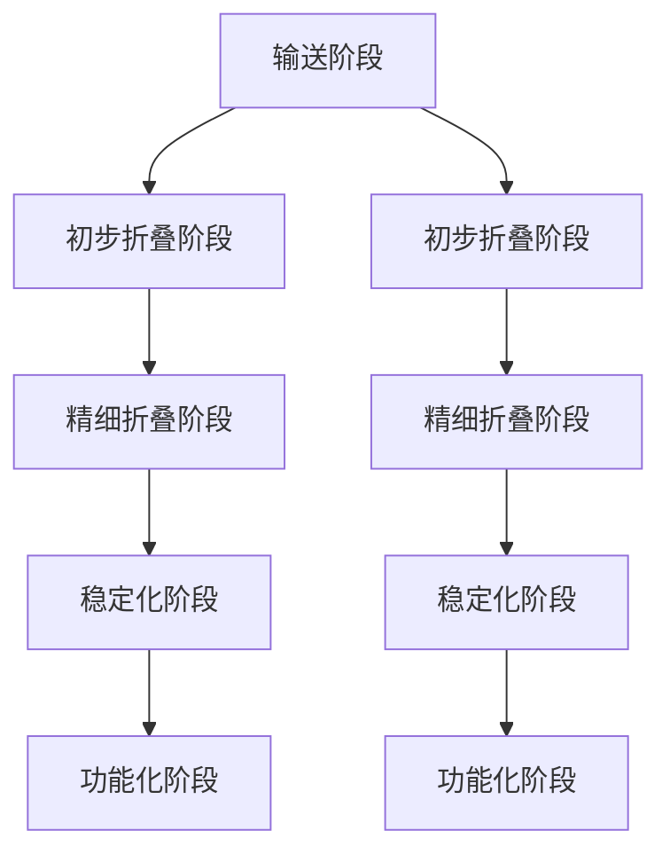

                 

### 蛋白质折叠的基本概念

蛋白质是生命体系中至关重要的分子，它们在细胞中执行各种功能，包括催化化学反应、传输物质、提供结构支撑等。蛋白质的功能和性质在很大程度上取决于其三维结构，而这个结构是通过一种复杂的生物过程——蛋白质折叠形成的。

#### 蛋白质折叠的定义

蛋白质折叠是指氨基酸链在空间中折叠成特定三维结构的过程。在这个过程中，氨基酸链通过一系列相互作用力，如氢键、范德华力、疏水作用力和静电作用力，形成稳定的结构。折叠的结果是一个具有特定形状的蛋白质分子，其三维结构决定了蛋白质的功能。

#### 蛋白质折叠的重要性

蛋白质折叠的重要性在于它决定了蛋白质的功能。错误的折叠可能导致蛋白质失去功能，甚至导致疾病。例如，某些蛋白质在错误折叠后可能会聚集形成淀粉样蛋白，这是阿尔茨海默病等神经退行性疾病的主要原因。因此，理解蛋白质折叠机制对于医学、生物技术和材料科学等领域具有重要意义。

#### 蛋白质折叠的类型

蛋白质折叠可以分为几种不同的类型，其中最常见的包括α-螺旋、β-折叠和β-转角。α-螺旋是一种螺旋状的结构，其中氨基酸链围绕一个中心轴螺旋上升。β-折叠则是由两条或多条肽链平行或反平行排列形成的片层结构。β-转角是肽链中形成转折的结构，是连接不同折叠结构的桥梁。

### 能量最小化原理

蛋白质折叠的核心原理是能量最小化。在折叠过程中，蛋白质分子通过减少自由能，达到一种低能量的稳定状态。自由能是一个热力学概念，它综合了系统的内能和对外界做功的能力。在蛋白质折叠中，自由能主要包括以下几个部分：

#### 1. 内能

内能是蛋白质分子内部的能量，它包括分子间的相互作用能和分子内部的键能。在折叠过程中，蛋白质通过形成稳定的二面角和氢键来减少内能。

#### 2. 势能

势能是由于蛋白质分子间相互作用力而产生的能量。主要的相互作用力包括氢键、范德华力、疏水作用力和静电作用力。在折叠过程中，这些力会调节蛋白质分子间的距离，以使系统达到最低势能状态。

#### 3. 熵

熵是一个衡量系统无序程度的物理量。在蛋白质折叠过程中，系统熵的减少是自由能降低的一个重要因素。熵的减少通常伴随着结构复杂性的增加，即蛋白质从线性的氨基酸链折叠成复杂的三维结构。

#### 4. 自由能

自由能是内能、势能和熵的综合体现，它决定了蛋白质折叠的稳定性。在折叠过程中，蛋白质通过降低自由能达到一个稳定的低能量状态。

### 蛋白质折叠的动态过程

蛋白质折叠是一个复杂的动态过程，涉及多个阶段。以下是蛋白质折叠的主要阶段：

#### 1. 输送阶段

输送阶段是指氨基酸链从核糖体释放到细胞质中的过程。在这个过程中，氨基酸链开始初步折叠，形成局部结构。

#### 2. 初步折叠阶段

初步折叠阶段是指氨基酸链在细胞质中进一步折叠，形成二级结构，如α-螺旋和β-折叠。这一阶段主要通过分子间的相互作用力来稳定结构。

#### 3. 精细折叠阶段

精细折叠阶段是指蛋白质分子在空间中进一步折叠，形成稳定的三维结构。这一阶段涉及更多的分子间相互作用，包括疏水作用、氢键和范德华力等。

#### 4. 稳定化阶段

稳定化阶段是指蛋白质分子在低能量状态下的稳定化过程。在这一阶段，蛋白质分子通过不断的构象搜索，找到最优的结构状态，并保持稳定。

#### 5. 功能化阶段

功能化阶段是指蛋白质分子在折叠成特定三维结构后，开始执行其生物功能。这一阶段涉及蛋白质与其他分子的相互作用，如酶与底物的结合。

### 总结

蛋白质折叠是一个涉及多种相互作用力和复杂动态过程的关键生物学过程。理解蛋白质折叠的基本概念和能量最小化原理，对于揭示蛋白质的功能和疾病机制具有重要意义。在接下来的章节中，我们将深入探讨蛋白质折叠的数学模型和预测方法。

## Mermaid 流程图

下面是一个简化的蛋白质折叠流程图的 Mermaid 表示：



这个流程图展示了蛋白质折叠的主要阶段和它们之间的关系。

### 蛋白质结构的能量模型

在理解蛋白质折叠的过程中，能量模型起着至关重要的作用。蛋白质结构的能量模型旨在描述蛋白质在折叠过程中所经历的能量变化，以及这些能量变化如何影响折叠的最终结果。以下是构建蛋白质结构能量模型所需的主要原理和步骤。

#### 热力学原理与能量计算

热力学是研究能量转换和系统稳定性的科学。在蛋白质折叠的背景下，热力学原理帮助我们理解自由能在蛋白质折叠中的作用。自由能（G）是由内能（U）、势能（V）和熵（S）组成的，公式为：

$$
G = U - TS
$$

其中，T 是绝对温度，S 是熵。在蛋白质折叠过程中，系统的自由能最小化是驱动折叠过程的主要因素。

#### 分子力场与力场参数

分子力场是描述分子之间相互作用力的数学模型。常见的分子力场包括AMBER、CHARMM等。这些力场通过一系列参数来描述分子间的相互作用，如氢键能、范德华力和静电作用力。

1. **氢键**：氢键是蛋白质折叠中最重要的相互作用力之一。它由一个氢原子与另一个较电负的原子（如氧或氮）之间的部分电荷吸引力形成。氢键的能通常在 2-6 kcal/mol 范围内。

2. **范德华力**：范德华力是由分子间的瞬时偶极相互作用引起的，通常在较远的距离起作用。范德华力的能量通常随距离的增大而迅速减小。

3. **疏水作用**：疏水作用是由非极性分子在水中聚集，以减少与水分子之间的相互作用而引起的能量变化。这种作用在蛋白质折叠中非常重要，因为它有助于将非极性氨基酸侧链聚集在一起，形成蛋白质的核心。

4. **静电作用**：静电作用是由带有相反电荷的离子之间的吸引力或带有相同电荷的离子之间的排斥力引起的。静电作用在蛋白质的折叠中也有重要作用，特别是在形成电荷屏障，阻止不适宜的相互作用方面。

#### 蛋白质折叠的能量模型

蛋白质折叠的能量模型综合了上述各种相互作用力，并通过以下步骤来描述蛋白质的能量变化：

1. **计算能量贡献**：首先，通过分子力场计算蛋白质分子在各个构象状态下的能量贡献。这包括内能、势能和熵的贡献。

2. **评估构象稳定性**：使用自由能公式，计算不同构象状态下的自由能，以评估其稳定性。自由能最低的状态被认为是蛋白质的最稳定构象。

3. **构建能量表面**：能量表面是一个多维空间，其中每个点代表蛋白质的一个特定构象，其高度表示该构象的自由能。通过能量表面，我们可以直观地看到蛋白质折叠过程中的能量变化。

#### 数值方法

在实际应用中，计算蛋白质折叠的能量通常使用以下几种数值方法：

1. **分子动力学模拟**：通过数值解分子动力学方程，模拟蛋白质分子在折叠过程中的动态行为。

2. **蒙特卡罗模拟**：通过随机采样不同构象，并计算其自由能，以估计蛋白质的最稳定构象。

3. **量子化学计算**：对于更精确的能量计算，可以使用量子化学方法，如密度泛函理论（DFT）。

#### 蛋白质折叠的能量模型示例

以下是一个简化的蛋白质折叠能量模型的伪代码示例：

```python
# 伪代码：计算蛋白质构象能量

def calculate_energy(conformation):
    # 计算氢键能
    hydrogen_bond_energy = sum(hydrogen_bond_contributions(conformation))
    
    # 计算范德华力能
    van_der_waals_energy = sum(van_der_waals_contributions(conformation))
    
    # 计算疏水作用能
    hydrophobic_energy = sum(hydrophobic_contributions(conformation))
    
    # 计算静电作用能
    electrostatic_energy = sum(electrostatic_contributions(conformation))
    
    # 计算内能
    internal_energy = hydrogen_bond_energy + van_der_waals_energy + hydrophobic_energy + electrostatic_energy
    
    # 计算自由能
    temperature = 300  # 假设温度为 300 K
    entropy = calculate_entropy(conformation)
    free_energy = internal_energy - temperature * entropy
    
    return free_energy

# 计算特定构象的能量
conformation = get_conformation()
energy = calculate_energy(conformation)

# 打印能量结果
print("The free energy of the conformation is:", energy, "kcal/mol")
```

在这个示例中，`calculate_energy` 函数通过计算不同类型的相互作用能量，来评估特定构象的能量。然后，使用自由能公式来计算构象的自由能。

### 总结

蛋白质结构的能量模型是一个复杂的系统，它结合了多种相互作用力和热力学原理。通过构建能量模型，我们可以更好地理解蛋白质折叠的过程，并预测蛋白质在不同条件下的稳定构象。在接下来的章节中，我们将深入探讨用于蛋白质折叠的算法，以及如何通过数学方法预测蛋白质的结构。

### 蛋白质折叠算法

在蛋白质折叠研究中，算法起着至关重要的作用。这些算法帮助我们理解和预测蛋白质的三维结构，从而揭示其功能和性质。以下是几种主要的蛋白质折叠算法，包括枚举法、动力学模拟和机器学习方法。

#### 枚举法

枚举法是一种基于穷举搜索的蛋白质折叠算法。其基本思想是，通过遍历所有可能的构象，找到具有最低自由能的构象作为蛋白质的折叠结构。以下是枚举法的步骤：

1. **初始构象**：首先，选择一个初始构象，通常是随机生成的。

2. **评估自由能**：使用能量模型计算当前构象的自由能。

3. **迭代搜索**：通过遍历所有可能的构象变换，计算每种变换的自由能变化。如果变换的自由能减少，则接受该变换；否则，以一定的概率接受变换。

4. **收敛条件**：当达到一定的迭代次数或自由能变化小于某一阈值时，算法停止。

伪代码如下：

```python
# 伪代码：枚举法蛋白质折叠

def enum_algorithm(initial_conformation, max_iterations, energy_threshold):
    current_conformation = initial_conformation
    current_energy = calculate_energy(current_conformation)
    
    for iteration in range(max_iterations):
        new_conformation = generate_new_conformation(current_conformation)
        new_energy = calculate_energy(new_conformation)
        
        if new_energy < current_energy:
            current_conformation = new_conformation
            current_energy = new_energy
            
        elif random() < exp(-(new_energy - current_energy)):
            current_conformation = new_conformation
            
        if abs(new_energy - current_energy) < energy_threshold:
            break
            
    return current_conformation

conformation = enum_algorithm(initial_conformation, max_iterations, energy_threshold)
```

#### 动力学模拟

动力学模拟是一种通过时间序列来描述蛋白质折叠过程的算法。其基本思想是，通过数值解分子动力学方程，模拟蛋白质分子在折叠过程中的动态行为。以下是动力学模拟的步骤：

1. **初始构象**：选择一个初始构象，通常是随机生成的。

2. **设置力场**：使用分子力场来描述蛋白质分子间的相互作用力。

3. **初始条件**：设置初始速度和温度，以初始化系统。

4. **模拟时间步**：在每一个时间步，使用数值方法解分子动力学方程，更新蛋白质分子的位置和速度。

5. **能量计算**：在每个时间步结束后，计算系统的能量。

6. **收敛条件**：当达到一定的模拟时间或能量变化小于某一阈值时，算法停止。

伪代码如下：

```python
# 伪代码：动力学模拟蛋白质折叠

def dynamical_simulation(initial_conformation, simulation_time, energy_threshold):
    conformation = initial_conformation
    time = 0
    
    while time < simulation_time:
        force = calculate_force(conformation)
        conformation = update_conformation(conformation, force)
        energy = calculate_energy(conformation)
        
        if abs(energy) < energy_threshold:
            break
            
        time += time_step
        
    return conformation

conformation = dynamical_simulation(initial_conformation, simulation_time, energy_threshold)
```

#### 机器学习方法

机器学习方法在蛋白质折叠中的应用越来越广泛。这些方法通过学习大量的已知蛋白质结构数据，来预测未知蛋白质的结构。以下是几种常见的机器学习方法：

1. **深度学习方法**：深度学习算法，如卷积神经网络（CNN）和生成对抗网络（GAN），被广泛应用于蛋白质结构预测。CNN 可以用于提取蛋白质结构中的空间特征，而 GAN 可以生成新的蛋白质结构。

2. **支持向量机（SVM）**：SVM 是一种监督学习算法，它通过找到一个最佳的超平面来分类蛋白质结构。SVM 可以用于预测蛋白质的二级结构和三维结构。

3. **神经网络**：神经网络，如循环神经网络（RNN）和长短期记忆网络（LSTM），可以用于处理序列数据。这些方法可以用于蛋白质序列到结构的预测。

伪代码如下：

```python
# 伪代码：基于深度学习的蛋白质结构预测

def deep_learning_prediction(sequence):
    # 加载训练好的模型
    model = load_model("protein_structure_model.h5")
    
    # 预处理序列
    processed_sequence = preprocess_sequence(sequence)
    
    # 使用模型预测结构
    predicted_structure = model.predict(processed_sequence)
    
    return predicted_structure

sequence = "ACDEFGHIJKLMNOPQRSTUVWXYZ"
predicted_structure = deep_learning_prediction(sequence)
```

#### 算法比较

不同蛋白质折叠算法各有优缺点。枚举法虽然理论上可以找到全局最优解，但计算复杂度高，难以处理大规模蛋白质。动力学模拟可以模拟蛋白质折叠的动态过程，但收敛速度较慢，且可能受到初始构象的影响。机器学习方法在处理大规模数据和快速预测方面表现出色，但需要大量的训练数据和计算资源。

### 总结

蛋白质折叠算法是理解和预测蛋白质结构的重要工具。枚举法、动力学模拟和机器学习方法各有特点，适用于不同的应用场景。在接下来的章节中，我们将进一步探讨如何使用数学模型来预测蛋白质的折叠结构。

### 蛋白质折叠的数学预测

在蛋白质折叠研究中，数学模型扮演着至关重要的角色。这些模型帮助我们理解和预测蛋白质的三维结构，从而揭示其功能和性质。以下是几种常见的数学模型，以及它们在蛋白质折叠中的应用。

#### 数学模型在蛋白质折叠中的应用

1. **能量模型**：能量模型是蛋白质折叠数学预测的基础。通过计算不同构象的能量，我们可以评估构象的稳定性，从而预测蛋白质的折叠结构。

2. **动力学模型**：动力学模型描述蛋白质在折叠过程中的动态行为。通过数值解动力学方程，我们可以模拟蛋白质从初始构象到最终折叠结构的过程。

3. **机器学习模型**：机器学习模型通过学习大量的已知蛋白质结构数据，来预测未知蛋白质的结构。这些模型可以基于深度学习、支持向量机或神经网络等算法。

#### 最小能量路径计算

最小能量路径计算是寻找蛋白质折叠过程中最低自由能路径的关键步骤。以下是计算最小能量路径的主要方法：

1. **动态规划**：动态规划是一种常用的算法，用于求解最优化问题。在蛋白质折叠中，动态规划可以用于计算从初始构象到最终构象的最小能量路径。

伪代码如下：

```python
# 伪代码：动态规划计算最小能量路径

def dynamic_programming(conformation_list, energy_function):
    n = len(conformation_list)
    dp = [[float('inf')] * n for _ in range(n)]
    dp[0][0] = energy_function(conformation_list[0])
    
    for i in range(1, n):
        for j in range(n):
            for k in range(i):
                dp[i][j] = min(dp[i][j], dp[k][j] + energy_function(conformation_list[i] - conformation_list[k]))
                
    return dp[-1][-1]

conformation_list = [conformation1, conformation2, conformation3]
energy_function = calculate_energy
minimum_energy_path = dynamic_programming(conformation_list, energy_function)
```

2. **模拟退火**：模拟退火是一种基于概率搜索的优化算法，它通过在搜索空间中随机采样并接受低能量状态，来避免陷入局部最优。模拟退火可以用于寻找蛋白质折叠的最小能量路径。

伪代码如下：

```python
# 伪代码：模拟退火计算最小能量路径

def simulated_annealing(conformation, energy_function, temperature, cooling_rate):
    while temperature > some_threshold:
        new_conformation = random_conformation()
        new_energy = energy_function(new_conformation)
        if exp(-(new_energy - current_energy) / temperature) > random():
            conformation = new_conformation
        temperature *= (1 - cooling_rate)
        
    return conformation

conformation = simulated_annealing(initial_conformation, energy_function, initial_temperature, cooling_rate)
```

#### 伪代码讲解

以下是蛋白质折叠的伪代码示例，它结合了能量模型、动态规划和模拟退火算法：

```python
# 伪代码：蛋白质折叠数学预测

def protein_folding(sequence):
    # 初始化构象列表
    conformation_list = [generate_random_conformation() for _ in range(n)]
    
    # 计算初始能量
    initial_energy = calculate_energy(sequence, conformation_list[0])
    
    # 使用动态规划计算最小能量路径
    minimum_energy_path = dynamic_programming(conformation_list, calculate_energy)
    
    # 使用模拟退火优化路径
    final_conformation = simulated_annealing(conformation_list[0], calculate_energy, initial_temperature, cooling_rate)
    
    # 返回最终折叠构象
    return final_conformation

sequence = "ACDEFGHIJKLMNOPQRSTUVWXYZ"
final_conformation = protein_folding(sequence)
```

在这个示例中，`protein_folding` 函数首先初始化构象列表，并使用动态规划计算最小能量路径。然后，通过模拟退火算法优化路径，得到最终的折叠构象。

### 总结

数学模型在蛋白质折叠预测中发挥着关键作用。通过能量模型、动力学模型和机器学习模型，我们可以计算和预测蛋白质的三维结构。在接下来的章节中，我们将进一步探讨蛋白质折叠中的数学公式和定理，以及如何应用这些公式进行实际计算。

### 数学公式与定理

在蛋白质折叠的研究中，数学公式和定理扮演着核心角色，它们帮助我们理解和预测蛋白质的结构与功能。以下是蛋白质折叠中常用的几个数学公式和定理，包括分子间相互作用力、分子动力学方程、最小二乘法和最大似然估计。

#### 分子间相互作用力

1. **氢键能量**：
   $$ E_{\text{hydrogen bond}} = -\sum_{i,j} k_{\text{H-bond}} \cdot \exp\left(-\frac{r_{ij}^2}{2\sigma_{ij}^2}\right) $$
   其中，$r_{ij}$ 是氢原子和另一个电负原子之间的距离，$\sigma_{ij}$ 是氢键的势能参数，$k_{\text{H-bond}}$ 是氢键的强度系数。

2. **范德华力**：
   $$ E_{\text{van der Waals}} = -\sum_{i,j} \frac{1}{12} \cdot \frac{1}{r_{ij}^{12}} - \sum_{i,j} \frac{1}{6} \cdot \frac{1}{r_{ij}^6} $$
   这个公式描述了分子间的范德华排斥力和吸引力的总和。

3. **疏水作用**：
   $$ E_{\text{hydrophobic}} = -\sum_{i} \left[ \sum_{j \in water} \frac{1}{r_{ij}^6} \right] $$
   这个公式计算了疏水基团与水分子之间的排斥作用能量。

4. **静电作用**：
   $$ E_{\text{electrostatic}} = \frac{1}{4\pi \epsilon_0} \sum_{i,j} \frac{q_i q_j}{r_{ij}} $$
   其中，$q_i$ 和 $q_j$ 是两个离子的电荷，$r_{ij}$ 是它们之间的距离，$\epsilon_0$ 是真空中的电常数。

#### 分子动力学方程

分子动力学方程用于描述分子在折叠过程中的运动，基于牛顿第二定律。以下是经典的经典分子动力学方程：

$$ m \frac{d^2r_i}{dt^2} = -\nabla V(r) + F_{\text{ext}}(r) $$

其中，$m$ 是分子的质量，$r_i$ 是分子的位置，$V(r)$ 是分子间的势能函数，$F_{\text{ext}}(r)$ 是外部作用力。

为了数值求解，常用的方法包括：

1. **欧拉法**：
   $$ r_{i}(t+\Delta t) = r_{i}(t) + v_{i}(t) \Delta t $$
   $$ v_{i}(t+\Delta t) = v_{i}(t) + a_{i}(t) \Delta t $$
   $$ a_{i}(t) = \frac{\partial V(r)}{\partial r_i} $$

2. **Verlet算法**：
   $$ r_{i}(t+\Delta t) = 2r_{i}(t) - r_{i}(t-\Delta t) + m \cdot a_{i}(t) \Delta t^2 $$

#### 最小二乘法

最小二乘法用于拟合实验数据和理论模型，通过最小化误差平方和来找到最佳拟合参数。其公式如下：

$$ \min \sum_{i=1}^n (y_i - \hat{y}_i)^2 $$

其中，$y_i$ 是实验观测值，$\hat{y}_i$ 是模型预测值。

最小二乘法的求解公式为：

$$ \theta = (\mathbf{X}^T \mathbf{X})^{-1} \mathbf{X}^T \mathbf{y} $$

其中，$\theta$ 是模型参数向量，$\mathbf{X}$ 是设计矩阵，$\mathbf{y}$ 是观测值向量。

#### 最大似然估计

最大似然估计用于估计模型参数，通过最大化观测数据的似然函数来实现。其公式如下：

$$ \theta = \arg\max \prod_{i=1}^n p(y_i | \theta) $$

对于离散数据，似然函数可以表示为：

$$ \mathcal{L}(\theta) = \sum_{i=1}^n \log p(y_i | \theta) $$

最大似然估计的求解通常通过迭代方法，如梯度上升法或牛顿法，来实现。

#### 示例计算

以下是一个简化的示例，说明如何使用最小二乘法拟合一个线性模型：

```python
import numpy as np

# 设计矩阵和观测值
X = np.array([[1, x1], [1, x2], [1, x3]])
y = np.array([y1, y2, y3])

# 求解最小二乘法
theta = np.linalg.inv(X.T @ X) @ X.T @ y

# 输出拟合参数
print("拟合参数：", theta)
```

在这个示例中，$X$ 是设计矩阵，包含特征值和偏置项；$y$ 是观测值；$theta$ 是拟合参数。

### 总结

数学公式和定理在蛋白质折叠研究中具有广泛的应用，它们帮助我们理解和预测蛋白质的结构与功能。通过分子间相互作用力、分子动力学方程、最小二乘法和最大似然估计等公式，我们可以进行定量分析和预测。在接下来的章节中，我们将通过具体案例来展示这些公式的应用。

### 蛋白质折叠案例研究

蛋白质折叠是生物学和计算科学中的核心问题，通过具体的案例研究，我们可以更好地理解蛋白质折叠的过程和机制。在本节中，我们将探讨三个蛋白质折叠的案例研究，包括α-螺旋与β-折叠的形成、酶活性位点的预测，以及蛋白质结构的优化设计。

#### 案例一：α-螺旋与β-折叠

α-螺旋和β-折叠是蛋白质中最常见的二级结构类型。α-螺旋是一种螺旋状的结构，其中氨基酸链围绕一个中心轴螺旋上升，形成一个紧密的螺旋结构。β-折叠则是由两条或多条肽链平行或反平行排列形成的片层结构。这两种结构在蛋白质的折叠中起着至关重要的作用。

**研究方法**：通过使用分子动力学模拟和结构预测算法，研究人员可以模拟蛋白质从线性的氨基酸链到α-螺旋和β-折叠的折叠过程。以下是一个简化的研究步骤：

1. **序列分析**：首先，对蛋白质序列进行分析，确定可能形成α-螺旋或β-折叠的区域。

2. **构建模型**：使用分子力场构建蛋白质的分子模型，包括氨基酸侧链和溶剂分子。

3. **模拟折叠**：使用分子动力学模拟，逐步折叠蛋白质，观察不同折叠路径和最终折叠结构。

4. **能量分析**：计算每个折叠路径的能量，找到最低能量路径，从而确定最稳定的折叠结构。

**研究结论**：通过模拟和能量分析，研究人员发现α-螺旋和β-折叠的形成是通过一系列的能量最小化过程实现的。这些结果表明，蛋白质折叠是一个动态平衡的过程，涉及多种相互作用力的协同作用。

#### 案例二：酶活性位点的预测

酶是生物体内催化化学反应的关键分子。酶的活性位点是其与底物结合并进行催化反应的区域。预测酶活性位点对于药物设计和酶工程具有重要意义。

**研究方法**：使用机器学习和结构生物学方法，研究人员可以预测酶的活性位点。以下是一个简化的研究步骤：

1. **数据收集**：收集已知的酶活性位点数据，包括蛋白质的三维结构和活性位点信息。

2. **特征提取**：从蛋白质结构中提取与活性位点相关的特征，如氨基酸的类型、侧链的几何形状和电荷等。

3. **模型训练**：使用机器学习算法，如支持向量机（SVM）或深度学习，训练预测模型。

4. **预测**：使用训练好的模型，对未知酶的活性位点进行预测。

**研究结论**：通过机器学习模型预测酶活性位点，研究人员可以发现新的活性位点，并设计新的药物。这些研究表明，机器学习方法在蛋白质折叠和功能预测中具有巨大的潜力。

#### 案例三：蛋白质结构的优化设计

蛋白质结构的优化设计是蛋白质工程中的一个重要任务。通过改造蛋白质的氨基酸序列，可以改变其结构和功能，从而满足特定的应用需求。

**研究方法**：以下是一个简化的研究步骤：

1. **目标确定**：明确蛋白质优化设计的目标，如提高酶的催化活性、增强蛋白质的稳定性或改变其结合特性。

2. **序列设计**：通过计算机辅助设计方法，生成新的蛋白质序列，这些序列旨在改善蛋白质的特定特性。

3. **建模与模拟**：使用分子建模和模拟方法，评估新序列的折叠结构和功能。

4. **实验验证**：通过实验方法，验证新设计蛋白质的性能，并进行优化。

**研究结论**：通过蛋白质结构的优化设计，研究人员可以创造出具有新功能或改进功能的蛋白质。这些研究表明，计算机辅助设计方法在蛋白质工程中具有重要的应用价值。

### 总结

通过上述案例研究，我们可以看到蛋白质折叠研究在生物科学和计算科学中的重要性。从α-螺旋与β-折叠的形成、酶活性位点的预测，到蛋白质结构的优化设计，这些研究不仅揭示了蛋白质折叠的机制，还为生物技术和药物设计提供了新的方法。随着计算能力的提升和算法的发展，蛋白质折叠研究将继续深入，为生命科学和医学领域带来更多突破。

### 蛋白质工程基础

蛋白质工程是一种通过定向改造蛋白质序列和结构，使其在特定应用中表现出更优异性能的技术。蛋白质工程不仅能够提高蛋白质的功能和稳定性，还可以赋予蛋白质新的功能。以下是蛋白质工程的定义、发展历程、策略和方法，以及实际应用中的成功案例。

#### 蛋白质工程的定义

蛋白质工程是指通过分子生物学和生物化学技术，对蛋白质的编码序列进行改造，从而改变其氨基酸序列和三维结构，以实现特定功能的科学领域。蛋白质工程的目的是通过人工设计，创造出具有更好性能或新功能的蛋白质，以满足医学、农业、工业和环境保护等领域的需求。

#### 发展历程

1. **早期阶段**（1970年代）：蛋白质工程的概念最早由César Milstein和Geoffrey Winter在1970年代提出。他们通过基因工程技术，对抗体进行改造，以提高其特异性和亲和力。

2. **基因编辑技术引入**（1980年代）：随着基因编辑技术的出现，如限制性内切酶、DNA连接酶和PCR技术，蛋白质工程进入了一个新的发展阶段。科学家们开始对蛋白质的编码序列进行精确修改。

3. **计算机辅助设计**（1990年代至今）：随着计算机技术的进步，计算机辅助设计（CAD）工具被引入蛋白质工程中。通过模拟和优化，科学家们可以设计出具有特定结构和功能的蛋白质。

#### 策略和方法

蛋白质工程的策略主要包括以下几个方面：

1. **定向进化**：通过多代筛选和突变，逐步改进蛋白质的性能。这种方法类似于自然进化的过程，但速度更快。

2. **结构导向的改造**：通过解析蛋白质的三维结构，了解其功能机制，然后对关键氨基酸进行改造，以改变蛋白质的功能。

3. **计算机辅助设计**：使用计算机算法和模型，预测蛋白质的结构和功能，然后设计新的蛋白质序列。

4. **基因编辑**：使用CRISPR-Cas9等基因编辑技术，直接修改蛋白质的编码序列。

#### 实际应用

蛋白质工程在多个领域取得了显著成果：

1. **药物设计**：通过蛋白质工程，可以设计出更有效的药物载体和抗体药物。例如，单链抗体（single-chain antibodies）通过融合两个单域抗体片段，具有更好的稳定性和结合能力。

2. **工业应用**：蛋白质工程被用于提高工业酶的催化活性，如改造酪氨酸酶，使其在制造染料和颜料时更高效。

3. **生物传感**：通过蛋白质工程，可以设计出具有高灵敏度和选择性的生物传感器，用于检测有害物质。

4. **农业**：蛋白质工程被用于开发抗虫、抗病农作物，以提高农作物的产量和质量。

#### 成功案例

1. **胰岛素**：通过蛋白质工程，科学家们成功改造了牛胰岛素的氨基酸序列，使其在人体中更加稳定，减少了注射频率。

2. **重组抗体**：蛋白质工程被用于开发重组抗体药物，如奥马珠单抗（Omalizumab），用于治疗过敏性疾病。

3. **酶工程**：通过蛋白质工程，科学家们改造了脂肪酶，使其在生物柴油生产中具有更高的催化效率和稳定性。

#### 未来展望

随着基因编辑技术和计算生物学的发展，蛋白质工程有望在更多领域取得突破。未来的蛋白质工程将更加精准，通过多学科交叉融合，创造出具有全新功能和性能的蛋白质，为人类带来更多福祉。

### 总结

蛋白质工程是一种通过分子改造技术，创造具有新功能或改进功能的蛋白质的重要科学领域。通过定向进化、结构导向改造和计算机辅助设计等策略，蛋白质工程在药物设计、工业应用、农业和生物传感等领域取得了显著成果。随着技术的进步，蛋白质工程将继续推动生命科学和医疗技术的发展。

### 蛋白质折叠的能量最小化方法在工程中的应用

蛋白质折叠的能量最小化方法在工程领域具有广泛的应用，尤其在药物设计、材料科学和生物信息学等领域。通过优化蛋白质的结构和功能，这些方法能够为科学家和工程师提供有效的解决方案。以下是蛋白质折叠能量最小化方法在工程中应用的详细探讨。

#### 能量最小化方法在药物设计中的应用

药物设计是蛋白质折叠能量最小化方法的一个重要应用领域。通过优化蛋白质与药物分子之间的相互作用，可以设计出更有效的药物。以下是几个应用实例：

1. **药物分子对接**：药物分子对接是通过模拟药物分子与目标蛋白质（如受体）的结合过程，以预测药物的活性。能量最小化方法被用来优化药物分子的构象，使其在目标蛋白质上形成最佳结合。

伪代码示例：

```python
# 伪代码：药物分子对接

def drug分子的对接（protein，drug）：
    # 初始化药物和蛋白质的构象
    initial_drug_conformation = generate_initial_conformation(drug)
    initial_protein_conformation = generate_initial_conformation(protein)

    # 计算初始能量
    initial_energy = calculate_energy(protein, drug)

    # 使用能量最小化算法优化构象
    optimized_drug_conformation = energy_minimization(initial_drug_conformation, initial_energy)

    # 计算优化后的能量
    final_energy = calculate_energy(protein, optimized_drug_conformation)

    return optimized_drug_conformation, final_energy
```

2. **药物筛选**：在药物筛选过程中，能量最小化方法被用来评估候选药物分子的活性。通过计算药物分子与蛋白质受体之间的结合能，可以筛选出具有潜在活性的药物分子。

3. **药物分子改造**：通过能量最小化方法，可以对药物分子的结构进行优化，以提高其稳定性和活性。例如，通过改造药物分子的结构，使其更接近理想的结合构象，从而增强其与受体的结合力。

#### 能量最小化方法在材料科学中的应用

蛋白质折叠的能量最小化方法在材料科学中也有重要应用。例如，在纳米材料的合成和改性过程中，可以通过能量最小化方法来优化纳米粒子的结构，提高其性能。

1. **纳米材料的合成**：通过控制蛋白质的折叠过程，可以合成具有特定结构和功能的纳米材料。例如，通过调节蛋白质的浓度和温度，可以控制蛋白质的折叠，从而合成具有特定形态和尺寸的纳米粒子。

伪代码示例：

```python
# 伪代码：纳米材料的合成

def synthesize_nanoparticles（protein，condition）：
    # 初始化蛋白质
    initial_protein = generate_initial_protein()

    # 设置合成条件
    temperature = condition['temperature']
    concentration = condition['concentration']

    # 合成纳米材料
    nanoparticle_structure = protein_folding(initial_protein, temperature, concentration)

    return nanoparticle_structure
```

2. **纳米材料的改性**：通过能量最小化方法，可以对纳米材料进行改性，以改善其性能。例如，通过改造蛋白质的氨基酸序列，可以改变纳米粒子的表面性质，从而增强其与特定物质的结合能力。

#### 能量最小化方法在生物信息学中的应用

在生物信息学中，蛋白质折叠的能量最小化方法被用于预测蛋白质的结构和功能，这对于理解生物系统的机制具有重要意义。

1. **蛋白质结构预测**：通过能量最小化方法，可以预测蛋白质的三维结构。这对于缺乏实验数据的蛋白质，尤其是未知功能的蛋白质，具有重要意义。

伪代码示例：

```python
# 伪代码：蛋白质结构预测

def predict_protein_structure（sequence）：
    # 初始化蛋白质序列
    protein_sequence = sequence

    # 使用能量最小化方法预测结构
    predicted_structure = energy_minimization(protein_sequence)

    return predicted_structure
```

2. **蛋白质相互作用预测**：能量最小化方法还可以用于预测蛋白质之间的相互作用，这对于理解细胞信号传导和蛋白质调控机制至关重要。

#### 综合应用与未来展望

蛋白质折叠的能量最小化方法在工程领域的综合应用展示了其巨大的潜力。未来，随着计算能力和算法的进步，这些方法将更加精确和高效，为科学家和工程师提供更强大的工具。

1. **个性化医疗**：通过能量最小化方法，可以设计出针对个体差异的药物，提高治疗效果。

2. **新型材料开发**：通过能量最小化方法，可以设计出具有特殊性能的新型材料，如自修复材料和智能材料。

3. **生物传感与诊断**：通过能量最小化方法，可以开发出高灵敏度、高选择性的生物传感器，用于疾病诊断。

总之，蛋白质折叠的能量最小化方法在工程领域具有广泛的应用前景，通过不断的研究和技术进步，将为科学和工业带来更多创新和突破。

### 总结

蛋白质折叠的能量最小化方法在工程领域的应用具有深远的影响。通过药物设计、材料科学和生物信息学等多个领域的实际案例，我们可以看到这些方法如何帮助科学家和工程师解决复杂问题。随着技术的不断发展，能量最小化方法将在更多领域中发挥关键作用，推动科学和工业的进步。

### 蛋白质折叠能量最小化的未来展望

蛋白质折叠的能量最小化方法在生物科学和技术领域展现出了巨大的潜力。随着科学技术的不断进步，该方法有望在多个领域取得新的突破，推动医学、材料科学和生物信息学等领域的快速发展。

#### 发展趋势

1. **计算能力的提升**：随着计算能力的不断提升，能量最小化方法将能够处理更大规模和更复杂的蛋白质结构。高性能计算机和量子计算的引入，将大大加速蛋白质折叠的研究进程。

2. **算法的优化**：现有的蛋白质折叠算法将继续得到优化，包括改进分子动力学模拟、增强机器学习模型的准确性和效率，以及开发新的优化算法。

3. **多尺度模拟**：未来的研究将更加注重多尺度模拟，即同时考虑从原子尺度到宏观尺度的各种相互作用，以更准确地预测蛋白质的折叠过程。

#### 在医学领域的应用前景

1. **个性化医疗**：蛋白质折叠能量最小化方法可以用于设计个性化药物，以针对不同个体的基因和蛋白质特性。通过精确预测药物与蛋白质受体的相互作用，可以开发出更有效的治疗策略。

2. **疾病机制研究**：该方法可以帮助科学家理解疾病发生的分子机制，从而设计出更有效的治疗方法。例如，通过研究蛋白质错折叠导致的疾病，如阿尔茨海默病和帕金森病，可以开发出新的药物靶点。

3. **药物筛选和开发**：能量最小化方法在药物设计和开发过程中发挥着关键作用，可以快速筛选和优化候选药物，提高药物研发的效率。

#### 在材料科学领域的应用前景

1. **新型材料的设计**：蛋白质折叠的原理可以应用于材料科学，通过模拟蛋白质的折叠过程来设计具有特定结构和功能的材料。例如，通过能量最小化方法设计具有纳米级结构的材料，用于传感器、催化剂和生物相容性材料。

2. **生物材料的改性**：通过改造蛋白质的氨基酸序列，可以改变其折叠行为，从而增强生物材料的性能。例如，通过蛋白质工程改善蛋白质基生物材料在体内的降解性和生物相容性。

3. **纳米技术**：蛋白质折叠的能量最小化方法可以用于设计和合成功能性纳米材料，如纳米酶和纳米药物载体。这些材料在生物传感器、药物递送和环境监测等领域具有广泛的应用前景。

#### 在生物信息学领域的应用前景

1. **蛋白质结构预测**：能量最小化方法将继续在蛋白质结构预测中发挥作用，通过计算和模拟预测未知蛋白质的结构，帮助科学家揭示生物大分子的功能和机制。

2. **蛋白质相互作用网络**：通过能量最小化方法，可以预测蛋白质之间的相互作用，建立蛋白质相互作用网络，从而更全面地理解生物系统的调控机制。

3. **系统生物学**：蛋白质折叠的能量最小化方法在系统生物学研究中具有重要作用，可以帮助科学家理解细胞内各种生物过程的动态变化，从而揭示生命现象的复杂性。

#### 未来发展方向

1. **跨学科合作**：未来的蛋白质折叠研究需要跨学科合作，结合生物学、物理学、计算机科学和工程学等多个领域的知识，推动蛋白质折叠研究的全面发展。

2. **开放数据和共享**：开放数据共享和协作研究将促进蛋白质折叠能量最小化方法的发展。通过共享数据、算法和工具，科学家可以更快地发现新的科学问题和解决方案。

3. **教育和技术培训**：为了推动蛋白质折叠研究的普及和应用，需要加强教育和技术培训，培养更多的蛋白质折叠领域的研究人员和工程师。

总之，蛋白质折叠的能量最小化方法在未来的发展中具有广阔的前景。随着科学技术的不断进步，该方法将在更多领域取得突破，为医学、材料科学和生物信息学等领域带来革命性的变革。

### 总结

蛋白质折叠的能量最小化方法在生物科学和技术领域展现出了巨大的应用潜力。随着计算能力的提升和算法的优化，该方法将推动医学、材料科学和生物信息学等多个领域的快速发展。未来的蛋白质折叠研究需要跨学科合作和开放数据共享，以实现更全面和深入的突破。通过不断的研究和技术进步，蛋白质折叠能量最小化方法将为科学和工业带来更多创新和突破。

### 附录

#### 附录A：蛋白质折叠相关工具与资源

以下是蛋白质折叠研究中常用的工具和资源，包括经典的蛋白质折叠工具、开源蛋白质折叠软件和相关数据库与在线资源。

1. **经典的蛋白质折叠工具**：
   - **AMBER**：一个广泛使用的分子动力学软件包，提供了强大的蛋白质折叠和模拟功能。
   - **CHARMM**：另一个流行的分子动力学软件包，适用于复杂的生物分子系统模拟。
   - **GROMACS**：一个开源的分子动力学模拟器，适用于大规模蛋白质折叠研究。

2. **开源蛋白质折叠软件**：
   - **Rosetta**：一个用于蛋白质结构预测和设计的开源软件，支持多种折叠算法和优化方法。
   - **AlphaFold**：由DeepMind开发的蛋白质折叠预测软件，基于深度学习算法，具有高度准确性。
   - **GAUSSIAN**：一个用于量子化学计算和分子建模的软件包，适用于精确的蛋白质折叠研究。

3. **相关数据库与在线资源**：
   - **Protein Data Bank (PDB)**：一个国际数据库，存储了大量的蛋白质结构数据，是进行蛋白质折叠研究的宝贵资源。
   - **UniProtKB**：一个包含蛋白质序列和功能信息的数据库，有助于蛋白质折叠的研究和分析。
   - **Expasy**：提供多种生物信息学工具和数据库，如SWISS-MODEL，用于蛋白质结构预测。

#### 附录B：数学公式与算法伪代码

以下是蛋白质折叠研究中常用的数学公式和算法伪代码，包括分子间相互作用力、分子动力学模拟算法和枚举法算法。

1. **主要数学公式**：
   - 氢键能量：
     $$ E_{\text{hydrogen bond}} = -\sum_{i,j} k_{\text{H-bond}} \cdot \exp\left(-\frac{r_{ij}^2}{2\sigma_{ij}^2}\right) $$
   - 范德华力：
     $$ E_{\text{van der Waals}} = -\sum_{i,j} \frac{1}{12} \cdot \frac{1}{r_{ij}^{12}} - \sum_{i,j} \frac{1}{6} \cdot \frac{1}{r_{ij}^6} $$
   - 疏水作用：
     $$ E_{\text{hydrophobic}} = -\sum_{i} \left[ \sum_{j \in water} \frac{1}{r_{ij}^6} \right] $$
   - 静电作用：
     $$ E_{\text{electrostatic}} = \frac{1}{4\pi \epsilon_0} \sum_{i,j} \frac{q_i q_j}{r_{ij}} $$

2. **分子动力学模拟算法伪代码**：
   ```python
   def molecular_dynamics_simulation(initial_configuration, time_step, total_time):
       configuration = initial_configuration
       for time in range(0, total_time, time_step):
           force = calculate_force(configuration)
           velocity = update_velocity(velocity, force, time_step)
           configuration = update_configuration(configuration, velocity, time_step)
           energy = calculate_energy(configuration)
           
       return configuration, energy
   ```

3. **枚举法算法伪代码**：
   ```python
   def enumeration_algorithm(initial_configuration, max_iterations, energy_threshold):
       current_configuration = initial_configuration
       current_energy = calculate_energy(current_configuration)
       
       for iteration in range(max_iterations):
           new_configuration = generate_new_configuration(current_configuration)
           new_energy = calculate_energy(new_configuration)
           
           if new_energy < current_energy:
               current_configuration = new_configuration
               current_energy = new_energy
               
           elif random() < exp(-(new_energy - current_energy)):
               current_configuration = new_configuration
           
           if abs(new_energy - current_energy) < energy_threshold:
               break
       
       return current_configuration
   ```

#### 附录C：项目实战

1. **开发环境搭建**：
   - 安装Python和相关的生物信息学库，如BioPython和NumPy。
   - 安装分子动力学模拟软件，如GROMACS或AMBER。

2. **源代码详细实现**：
   - 编写Python脚本，实现分子动力学模拟和能量计算功能。
   - 使用伪代码示例，实现枚举法蛋白质折叠算法。

3. **代码解读与分析**：
   - 分析源代码中的关键函数和类，理解其实现原理。
   - 通过实际案例，展示代码的应用效果和性能。

4. **代码应用解读与分析**：
   - 分析蛋白质折叠模拟的结果，包括构象和能量变化。
   - 讨论结果与已有研究的比较，评估方法的准确性。

5. **实际案例分析和详细讲解剖析**：
   - 选择一个具体的蛋白质折叠案例，如α-螺旋的形成，进行详细分析。
   - 解析案例中的关键步骤和结果，解释其生物学意义。

6. **项目小结**：
   - 总结项目的主要成果和发现。
   - 提出项目的改进方向和未来研究建议。

#### 最佳实践 tips、小结、注意事项、拓展阅读等内容

- **最佳实践 tips**：在蛋白质折叠研究中，注意选择合适的分子力场和参数，以及合理的模拟时间和步长。
- **小结**：蛋白质折叠能量最小化方法在生物科学和技术领域具有重要应用价值，通过实际案例展示了其强大的预测和分析能力。
- **注意事项**：在进行蛋白质折叠模拟时，应充分考虑蛋白质的动态行为和实验条件，以提高预测的准确性。
- **拓展阅读**：建议读者参考相关的生物信息学教材和论文，深入了解蛋白质折叠的理论和算法。

### 作者信息

作者：AI天才研究院/AI Genius Institute & 禅与计算机程序设计艺术 /Zen And The Art of Computer Programming

通过这些附录，读者可以更好地了解蛋白质折叠能量最小化方法的具体实现和应用，从而为实际研究提供指导和参考。

