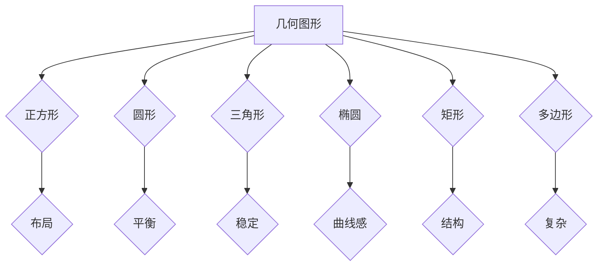
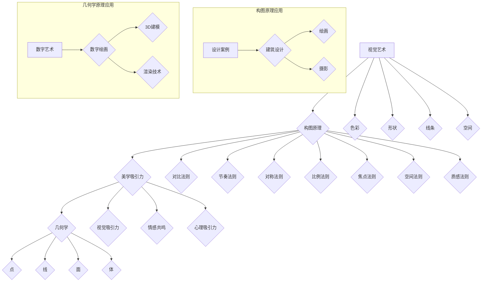
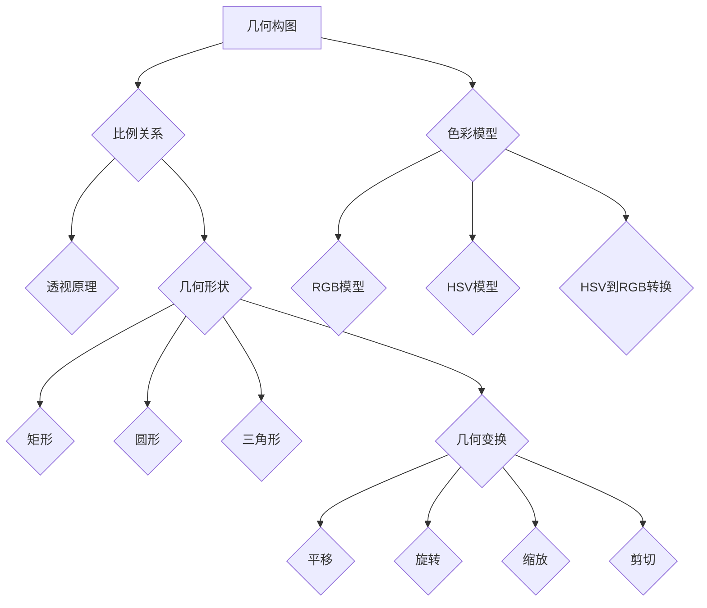

                 

### 文章标题 <此处是文章标题>

# 视觉艺术的构图原理：美学吸引力的几何学

> 关键词：视觉艺术、构图原理、美学吸引力、几何学、设计、艺术家、摄影师

> 摘要：本文将探讨视觉艺术的构图原理，以及美学吸引力的几何学原理。通过解析几何学在视觉艺术中的应用，我们将深入了解如何利用几何构图提升艺术作品的美学吸引力。

### 第一部分：引言

#### 1.1 书籍概述

视觉艺术的构图原理是艺术家在创作过程中用来组织和表现视觉元素的基本原则。这些原则能够引导观者的视线，创造出和谐、平衡和吸引力的视觉效果。美学吸引力是视觉艺术的核心，它决定了作品能否引起观者的情感共鸣。

几何学在视觉艺术中有着广泛的应用。从古代的雕塑和绘画，到现代的数字艺术，几何形状和比例都是构成艺术作品的重要元素。本文旨在揭示视觉艺术的构图原理与美学吸引力之间的关系，并探讨几何学在视觉艺术中的应用。

本书分为四个部分，首先介绍视觉艺术的构图原理，然后深入探讨美学吸引力的几何学原理。第三部分通过设计案例解析，展示几何学在视觉艺术中的应用，最后探讨几何学的未来发展趋势。

#### 1.2 目标读者

本书的目标读者是对视觉艺术和几何学感兴趣的人士，包括设计师、艺术家、摄影师，以及计算机图形学研究人员和学生。无论你是专业从业者还是艺术爱好者，本书都将为你提供深入理解和应用几何学在视觉艺术中的方法。

#### 1.3 书籍结构

本书结构紧凑，内容系统。首先，我们介绍美学吸引力的概述，包括其定义、特性和作用。接着，讲解几何学的基础概念，如点、线、面和体。随后，我们探讨构图元素的选择与运用，以及构图法则和技巧。第三部分通过实际案例解析，展示几何学在视觉艺术中的应用。最后，我们讨论几何学的美学价值及其在视觉艺术和科技领域的发展趋势。

### 第二部分：构图原理

#### 2.1 美学吸引力概述

美学吸引力是指艺术作品通过视觉、情感和心理层面的作用，吸引观者的注意力并激发情感共鸣的能力。它是一个复杂的概念，涉及多个因素，包括色彩、形状、线条、构图等。

美学吸引力具有以下特性：

1. **视觉吸引力**：作品的颜色、形状和线条等元素首先吸引观者的视觉注意。
2. **情感共鸣**：艺术作品能够唤起观者的情感体验，如喜悦、悲伤、感动等。
3. **心理吸引力**：作品的结构、构图和形式等元素能够引发观者的心理共鸣，增强其欣赏体验。

美学吸引力的作用在于：

1. **提升作品的吸引力**：良好的美学吸引力能够使艺术作品更具吸引力，更容易引起观者的关注。
2. **增强情感体验**：美学吸引力能够提升观者对作品的情感体验，使其更深入地感受作品的内涵。
3. **促进艺术交流**：美学吸引力有助于观者与作品之间的互动和交流，增强艺术作品的传播效果。

美学吸引力的来源可以分为：

1. **视觉元素**：如色彩、形状、线条等元素的选择和运用。
2. **构图原理**：如对比、节奏、对称、比例等构图法则的应用。
3. **情感表达**：艺术家通过作品传达的情感和思想，如喜悦、悲伤、哲理等。

美学吸引力可以分为以下类型：

1. **静态美学吸引力**：通过静态的构图和形态产生的吸引力。
2. **动态美学吸引力**：通过动态的线条、色彩和形态产生的吸引力。
3. **情境美学吸引力**：通过作品与观者所处情境的结合产生的吸引力。

#### 2.2 几何学基础

几何学是研究形状、大小、位置和运动的数学分支。在视觉艺术中，几何学的基本概念如点、线、面和体是构成艺术作品的基本元素。

1. **点**：点是几何学中最基本的元素，它没有大小，只有位置。在视觉艺术中，点可以作为独立元素，也可以作为线条和形状的基础。

2. **线**：线是无限延伸的点的轨迹。线具有长度和方向，可以分为直线、曲线和折线等。在视觉艺术中，线可以用来描绘形状、引导视线和创造动态效果。

3. **面**：面是由无数线组成的平面。面具有面积和边界，可以分为矩形、圆形、三角形等。在视觉艺术中，面是构成形状和构图的基本元素。

4. **体**：体是由多个面组成的立体图形。体具有体积和形状，可以分为立方体、圆柱体、圆锥体等。在视觉艺术中，体可以用来创造深度和立体感。

常见的几何图形包括：

1. **矩形**：具有四个直角的四边形，常用于构图和设计。
2. **圆形**：闭合的曲线，具有连续的边界，常用于平衡和和谐。
3. **三角形**：具有三个边的多边形，具有稳定性和动态感。
4. **正方形**：四个边长相等的矩形，具有对称性和稳定性。
5. **椭圆形**：闭合的曲线，类似于圆形，但更扁或更圆。
6. **多边形**：具有多个边的几何图形，如五边形、六边形等。

每种几何图形都有其独特的特点和美感，艺术家可以通过运用这些图形来创造多样化的视觉效果。

#### 2.3 构图元素

构图元素是视觉艺术作品中的基本组成部分，包括形状、色彩、线条、空间等。这些元素的选择和运用对于创作具有吸引力的艺术作品至关重要。

1. **形状**：形状是构图中的基本元素，包括几何形状和自然形状。几何形状如正方形、圆形、三角形等，具有明确的边界和特征；自然形状如山、水、动物等，具有丰富的层次和细节。形状在构图中的作用包括：

   - **组织结构**：形状可以用来组织画面中的元素，使其形成一个整体的构图。
   - **引导视线**：通过形状的对比和组合，引导观者的视线在画面中移动。
   - **创造平衡**：形状的对称和对比可以创造平衡和和谐的效果。

2. **色彩**：色彩是视觉艺术中重要的表现手段，具有独特的情感和象征意义。色彩的选择和搭配对于构图的美学吸引力至关重要。色彩的作用包括：

   - **传达情感**：不同的色彩可以传达不同的情感，如红色代表激情，蓝色代表宁静。
   - **创造对比**：通过色彩对比，增强构图的层次感和视觉冲击力。
   - **平衡构图**：合理的色彩搭配可以使构图更加和谐，避免过于单调或过于混乱。

3. **线条**：线条是视觉艺术中重要的元素，具有引导视线和创造动态效果的作用。线条可以分为直线、曲线和折线等。线条的作用包括：

   - **引导视线**：通过线条的方向和走势，引导观者的视线在画面中移动。
   - **创造动态**：曲线和折线可以创造出动态和动感，增加构图的趣味性。
   - **增强层次**：线条可以用来分隔不同的形状和元素，增强画面的层次感。

4. **空间**：空间是构图中的三维领域，包括深度、高度和宽度。空间在构图中的作用包括：

   - **创造深度**：通过透视和光影的处理，创造画面的深度感。
   - **增强立体感**：通过空间关系，使画面中的元素具有立体感。
   - **组织结构**：空间可以用来分隔和组织画面中的不同元素，使其形成一个整体的构图。

#### 2.4 构图法则

构图法则是视觉艺术中用来组织画面元素的基本原则，包括对比、节奏、对称、比例等。这些法则能够帮助艺术家创造和谐、平衡和吸引力的视觉效果。

1. **对比法则**：对比法则通过对比不同的元素，如形状、色彩、大小等，来创造视觉冲击力。对比法则的作用包括：

   - **增强视觉吸引力**：对比可以吸引观者的注意力，使其更容易注意到画面中的重要元素。
   - **创造动态效果**：对比可以创造出动态和动感，增加构图的趣味性。
   - **强调主题**：通过对比，可以强调画面的主题和重点。

2. **节奏法则**：节奏法则通过重复和变化来创造视觉节奏感。节奏法则的作用包括：

   - **增强视觉吸引力**：节奏感可以吸引观者的注意力，使其对画面产生兴趣。
   - **引导视线**：通过节奏的变化，引导观者的视线在画面中移动。
   - **创造和谐感**：节奏感可以使画面更加和谐，避免过于单调或过于混乱。

3. **对称法则**：对称法则通过镜像或重复来创造对称的构图。对称法则的作用包括：

   - **创造平衡感**：对称可以创造出平衡和和谐的效果，使画面更加稳定。
   - **增强美感**：对称是美学中常见的手法，可以创造出和谐和优雅的效果。
   - **强调重点**：通过对称，可以强调画面的重点和主题。

4. **比例法则**：比例法则是通过合理地分配画面元素的大小和位置来创造和谐的效果。比例法则的作用包括：

   - **增强美感**：合理地运用比例法则可以使画面更加和谐和优雅。
   - **组织结构**：比例法则可以用来组织画面中的元素，使其形成一个整体的构图。
   - **引导视线**：通过比例的变化，引导观者的视线在画面中移动。

5. **焦点法则**：焦点法则是通过将视线集中在一个或几个关键元素上来创造视觉吸引力。焦点法则的作用包括：

   - **增强视觉吸引力**：焦点可以吸引观者的注意力，使其更容易注意到画面的重点。
   - **强调主题**：通过焦点，可以强调画面的主题和重点。
   - **创造动态效果**：焦点可以创造出动态和动感，增加构图的趣味性。

6. **空间法则**：空间法则是通过合理地利用空间来创造深度和立体感。空间法则的作用包括：

   - **创造深度感**：通过透视和光影的处理，创造画面的深度感。
   - **增强立体感**：通过空间关系，使画面中的元素具有立体感。
   - **组织结构**：空间可以用来分隔和组织画面中的不同元素，使其形成一个整体的构图。

7. **质感法则**：质感法则是通过不同的纹理和质感来创造丰富的视觉效果。质感法则的作用包括：

   - **增强视觉吸引力**：质感可以吸引观者的注意力，使其对画面产生兴趣。
   - **创造动态效果**：质感可以创造出动态和动感，增加构图的趣味性。
   - **强调主题**：通过质感的变化，可以强调画面的主题和重点。

#### 2.5 构图技巧

构图技巧是艺术家在创作过程中运用构图原理和方法的具体操作。以下是一些常用的构图技巧：

1. **黄金比例**：黄金比例是一种经典的比例法则，将画面划分为一个黄金分割比例，可以使画面更加和谐和优雅。黄金比例的分割点约为0.618，可以将画面划分为两部分，较短部分与较长部分的比例接近黄金比例。

2. **三分法则**：三分法则是将画面划分为三个等分部分，使主体元素位于画面的一条分界线附近。三分法则可以帮助艺术家平衡画面，并引导观者的视线。

3. **引导线**：引导线是一种利用线条引导视线的方法，可以通过线条的方向和走势，将观者的视线引导到画面中的关键元素。

4. **留白**：留白是指画面中未被元素占据的空间。适当的留白可以使画面更加透气和有层次感，避免过于拥挤或混乱。

5. **对角线构图**：对角线构图是一种利用对角线线条创造动态效果的方法。通过将主体元素放置在对角线上，可以创造出强烈的动感和方向感。

6. **透视**：透视是一种利用视点和视线的原理来创造深度和立体感的方法。通过透视，艺术家可以创造出远近感、层次感和空间感。

7. **色彩搭配**：色彩搭配是一种利用色彩对比和调和来创造和谐效果的方法。通过合理地运用色彩搭配，可以增强画面的视觉吸引力。

通过运用这些构图技巧，艺术家可以创造出更加吸引力和艺术性的视觉作品。

### 第三部分：美学吸引力的几何学应用

#### 3.1 设计案例解析

本部分将通过具体的设计案例，解析几何学在视觉艺术中的应用，展示如何运用几何构图提升作品的美学吸引力。

**案例一：建筑设计中的几何构图**

在建筑设计中，几何构图被广泛应用于创造和谐且富有美感的空间。以下是一个经典案例：

**项目背景**：纽约市的螺旋塔（Spiral Tower）是由著名建筑师Zaha Hadid设计的一座标志性建筑。

**几何构图应用**：
- **螺旋形状**：螺旋塔的结构采用了连续的螺旋形状，这种形状不仅具有动态美感，而且创造出了独特的空间感受。螺旋形状的重复和变化，使观者视线不断移动，增强了视觉吸引力。
- **对称与不对称**：螺旋塔的几何构图在整体上呈现出不对称的形态，但局部细节中又具有对称性，这种对称与不对称的结合，使建筑具有丰富的层次感和动态感。
- **比例与比例**：螺旋塔的高度和直径的比例遵循黄金比例，这种比例使建筑整体看起来和谐、优雅。

**美学吸引力**：螺旋塔的几何构图创造了强烈的视觉吸引力，其独特的形态和动态感使观者产生深刻的视觉体验。

**案例二：绘画作品中的美学吸引力**

绘画作品中的几何构图同样可以提升作品的美学吸引力。以下是一个经典案例：

**项目背景**：荷兰画家皮特·蒙德里安的《红、黄、蓝构成》。

**几何构图应用**：
- **基本颜色与形状**：这幅作品以基本颜色和几何形状为主要表现手段。红色、黄色和蓝色以正方形和长方形的形式排列，形成简洁、清晰的构图。
- **对比与平衡**：通过对比鲜艳的色彩和简单的几何形状，作品在视觉上产生了强烈的冲击力。同时，色彩和形状的平衡使画面具有和谐感。
- **比例与比例**：作品中的颜色和形状按照黄金比例进行排列，这种比例使画面整体看起来更加和谐、优雅。

**美学吸引力**：蒙德里安的这幅作品通过简单的几何构图和鲜艳的色彩，创造出了强烈的美学吸引力。其简洁、清晰的形式使观者能够感受到几何学的力量和美感。

**案例三：摄影作品中的几何学运用**

摄影作品中的几何学运用可以使画面具有独特的视觉吸引力。以下是一个经典案例：

**项目背景**：著名摄影师史蒂夫·麦凯瑞的《泰姬陵的倒影》。

**几何构图应用**：
- **倒影与对称**：这幅作品通过拍摄泰姬陵在水中的倒影，创造出了一种独特的对称效果。倒影和水面的反射形成了几何形状的重复，增强了画面的视觉吸引力。
- **透视与深度**：通过运用透视原理，作品在视觉上创造了深度感和立体感。观者可以感受到建筑物的远近和层次。
- **色彩与光线**：作品的色彩和光线处理使得画面更加生动和具有吸引力。温暖的色调和柔和的光线使画面充满了情感和美感。

**美学吸引力**：麦凯瑞的这幅作品通过几何构图的巧妙运用，创造出了强烈的视觉吸引力。其独特的倒影和透视效果，使观者对泰姬陵的美感和历史背景有了更深刻的体会。

通过以上案例，我们可以看到几何构图在视觉艺术中的广泛应用和美学吸引力。几何形状、对称、比例、透视等原理的运用，不仅使作品具有视觉冲击力，而且能够传递出丰富的情感和意义。

#### 3.2 几何学在数字艺术中的应用

几何学在数字艺术中有着广泛的应用，尤其在数字绘画、3D建模和渲染等方面。以下将探讨几何学在这些领域的具体应用，以及如何通过几何构图提升作品的美学吸引力。

**数字绘画中的几何构图**

在数字绘画中，几何构图是创造视觉吸引力的关键。以下是一些应用几何学的技巧：

- **基本形状的运用**：通过运用基本形状（如正方形、圆形、三角形等）来构建画面，可以创造出简洁、清晰的视觉效果。例如，在绘制人物肖像时，可以通过几何形状来概括面部特征，使画面更加准确和生动。

- **对称与不对称的结合**：在数字绘画中，对称与不对称的构图可以产生丰富的视觉效果。通过巧妙地运用对称与不对称，可以使画面具有动态感和层次感。例如，在一幅风景画中，可以通过不对称的树木和对称的水面来创造对比，增加画面的趣味性。

- **黄金比例的运用**：黄金比例是数字绘画中常用的构图技巧。通过将画面划分为黄金比例的区域，可以使画面更加和谐和优雅。例如，在绘制人体时，可以通过黄金比例来确定身体各部分的长度比例，使画面更加准确和美观。

- **透视的应用**：透视是数字绘画中创造深度感和立体感的重要手段。通过运用透视原理，可以使画面中的物体看起来更加真实和有层次感。例如，在绘制城市风景时，可以通过运用远近透视，使远处的建筑物看起来更小，近处的建筑物看起来更大，从而创造出空间感。

**3D建模与渲染中的几何学原理**

在3D建模与渲染中，几何学原理是创建逼真场景和模型的基础。以下是一些关键几何学原理的应用：

- **多边形的运用**：3D建模通常基于多边形网格。多边形的形状和大小直接影响模型的细节和真实感。例如，在创建一个建筑物模型时，可以通过调整多边形的分布和大小，来模拟建筑物的结构和纹理。

- **几何变换的应用**：在3D建模中，几何变换（如平移、旋转、缩放等）是常用的操作。通过运用几何变换，可以快速调整模型的位置、方向和大小，使建模过程更加高效。例如，在创建一个复杂场景时，可以通过旋转和缩放来调整各个物体的相对位置，从而简化建模过程。

- **材质与纹理的应用**：在3D渲染中，材质和纹理是赋予模型真实感的重要元素。通过合理运用几何学和材质纹理，可以创造出各种逼真的效果。例如，通过在模型表面应用纹理贴图，可以使材质看起来更加真实和细腻。

**数字艺术创作中的美学吸引力**

在数字艺术创作中，美学吸引力是作品成功的关键。以下是一些提升美学吸引力的技巧：

- **色彩与光影的运用**：色彩和光影是数字艺术中创造视觉吸引力的关键。通过合理运用色彩和光影，可以增强画面的情感表达和视觉冲击力。例如，在绘制一幅夜景时，可以通过运用深色和暖色调的光影效果，来营造神秘、浪漫的氛围。

- **动态效果的运用**：动态效果可以增加画面的动感和趣味性。例如，在创建一个动画场景时，可以通过运用动态效果（如平滑过渡、闪动等），来增强观众的观赏体验。

- **构图与透视的应用**：构图和透视是数字艺术中创造深度感和立体感的重要手段。通过合理运用构图和透视，可以创造出更加真实和有层次感的场景。例如，在一幅风景画中，可以通过运用透视原理，使远处的山峦看起来更加深远，从而增强画面的空间感。

通过上述讨论，我们可以看到几何学在数字艺术中的广泛应用和重要性。通过运用几何构图原理，艺术家可以创造出更加吸引力和艺术性的数字艺术作品。

#### 3.3 实践与练习

**实践一：几何构图练习**

**目标**：通过实际操作，掌握几何构图的基本技巧，提升艺术作品的美学吸引力。

**材料**：数字绘画软件（如Adobe Photoshop、Corel Painter等）、绘画纸张、铅笔、橡皮擦。

**步骤**：

1. **基础形状练习**：首先，尝试绘制基本形状（如正方形、圆形、三角形等）。通过反复练习，熟悉这些形状的绘制方法和比例关系。

2. **组合形状练习**：将多个基本形状进行组合，创造出新的形状。例如，可以将两个正方形组合成一个长方形，或三个三角形组合成一个六边形。

3. **几何构图练习**：运用几何构图技巧，如黄金比例、三分法则、对称与不对称等，进行构图练习。可以选择一张风景图片或建筑设计图片作为参考，尝试用几何形状和线条重新构图。

**案例分析**：

**案例一**：绘制一张以黄金比例为基准的风景画。首先，将画布分为三个等分部分，然后在一个部分中绘制山脉，另一个部分中绘制湖泊，最后一部分中绘制天空。通过黄金比例的运用，使画面具有和谐、优雅的美感。

**案例二**：以对称与不对称相结合的构图方式进行绘画。选择一个对称的主体元素（如一座建筑），然后在周围添加不对称的细节元素（如树木、花草等），使画面具有动态感和层次感。

**实践二：美学吸引力实践**

**目标**：通过实际操作，理解美学吸引力的原理，提升艺术作品的吸引力。

**材料**：数字绘画软件、摄影设备。

**步骤**：

1. **色彩实验**：尝试运用不同的色彩搭配，如对比色、互补色、类似色等，进行色彩实验。观察不同色彩搭配对画面视觉吸引力的影响。

2. **光线实验**：通过调整光线角度、强度和颜色，进行光线实验。观察不同光线处理对画面情感表达和视觉吸引力的影响。

3. **构图实践**：在实际绘画或摄影过程中，尝试运用美学吸引力的构图法则（如对比、节奏、对称、比例等），进行构图实践。观察这些法则对画面视觉效果的影响。

**案例分析**：

**案例一**：绘制一张以对比色为基准的色彩实验画。选择红色和绿色作为对比色，将两者在画面中进行对比和搭配。通过对比色的运用，使画面具有强烈的视觉冲击力和吸引力。

**案例二**：拍摄一张以对称与不对称相结合的构图照片。选择一座对称的建筑物作为主体，然后在周围添加不对称的细节元素（如行人、车辆等），通过对称与不对称的结合，使画面具有动态感和视觉吸引力。

**实践三：数字艺术创作实践**

**目标**：通过实际操作，掌握数字艺术创作的基本流程和技巧，提升艺术作品的创新性和美学价值。

**材料**：3D建模软件（如Blender、Maya等）、渲染软件（如V-Ray、Unity等）、数字绘画软件。

**步骤**：

1. **概念设计**：首先，进行概念设计，确定数字艺术作品的主题、风格和视觉效果。可以通过手绘草图或数字绘画来表达设计思路。

2. **3D建模**：根据概念设计，进行3D建模。选择合适的建模软件，创建场景中的各种物体和角色。在建模过程中，注意运用几何学原理，如多边形网格、几何变换等。

3. **渲染与后期处理**：对3D模型进行渲染，并运用后期处理技术（如光影调整、色彩校正等），使画面更加真实和具有艺术性。可以使用不同的渲染软件和后期处理工具，如V-Ray、Unity等。

4. **数字绘画**：在渲染完成后，可以使用数字绘画软件对画面进行进一步的艺术处理。可以通过添加纹理、颜色、光影等元素，提升作品的美学价值。

**案例分析**：

**案例一**：创建一个以几何构图为特点的3D场景。选择几何形状作为场景中的主要元素，如立方体、圆柱体、圆锥体等。通过合理运用几何形状和构图法则，使场景具有简洁、清晰和富有视觉吸引力的美感。

**案例二**：创建一个以光影效果为特点的数字艺术作品。通过调整光线的角度、强度和颜色，创造出丰富的光影效果。运用光影的变化，使画面具有层次感和立体感，从而提升作品的美学吸引力。

通过以上实践和练习，读者可以深入理解几何学在视觉艺术中的应用，掌握美学吸引力的原理和实践技巧，创作出更加吸引力和艺术性的视觉作品。

### 第四部分：几何学的美学吸引力原理

#### 4.1 几何学的美学价值

几何学在视觉艺术中具有独特的审美价值。几何形状、比例和对称性等几何元素不仅具有形式美感，而且能够传达特定的情感和意义。

**几何形状的美学价值**

- **几何形状的简洁性**：几何形状具有简洁、明确的边界和形态，这使得它们在视觉艺术中具有独特的审美价值。正方形、圆形、三角形等基本形状在艺术作品中常常被用来创造简洁、清晰的视觉效果。
- **几何形状的动态感**：几何形状可以通过组合和排列创造出动态效果。例如，将多个几何形状以不同的角度和方式排列，可以创造出流动、旋转的视觉效果，增加作品的趣味性和动感。
- **几何形状的象征意义**：几何形状在不同的文化和历史背景中具有特定的象征意义。例如，圆形常被视为和谐、完美的象征，三角形常被视为稳定和力量的象征。

**几何比例的美学价值**

- **黄金比例**：黄金比例是一种经典的比例法则，被广泛应用于视觉艺术中。黄金比例能够创造出和谐、优雅的视觉效果，使作品具有吸引力。在视觉艺术中，可以通过黄金比例来安排画面元素的大小、位置和比例，使作品更加美观和协调。
- **等比例**：等比例是另一种常用的比例法则，通过将画面中的元素按照相同的比例进行缩放，可以使作品具有一致性和协调性，增强整体美感。

**几何对称性的美学价值**

- **对称性**：对称性是一种常见的构图技巧，通过镜像或重复来创造和谐、稳定的视觉效果。对称性能够使画面具有平衡感，增强视觉吸引力。
- **不对称性**：虽然对称性在视觉艺术中经常使用，但不对称性也同样具有审美价值。不对称性可以通过对比和变化来创造动态感，使作品具有独特的视觉魅力。

**几何学对视觉艺术创作的影响**

- **构图与布局**：几何学原理在构图和布局中具有重要作用。通过运用几何形状、比例和对称性等原理，艺术家可以创造出更加和谐、有层次的视觉效果。
- **形态与空间**：几何学原理对形态和空间的处理也有重要影响。通过运用几何形状和透视原理，艺术家可以创造出更加逼真、有深度的形态和空间效果。
- **视觉效果**：几何学原理能够增强作品的视觉效果，使其更具吸引力和艺术性。通过合理运用几何元素和构图技巧，艺术家可以创造出独特的视觉语言和风格。

综上所述，几何学在视觉艺术中具有独特的审美价值。通过运用几何形状、比例和对称性等原理，艺术家可以创造出具有吸引力和艺术性的视觉作品。

#### 4.2 几何学原理的应用

几何学原理在视觉艺术、设计和其他领域中的应用非常广泛，以下将详细探讨几何学原理在这些领域的具体运用。

**视觉艺术中的几何学原理应用**

在视觉艺术中，几何学原理是构图和形态创作的基础。以下是一些具体应用：

- **构图**：几何学原理可以帮助艺术家在画面中安排元素，创造出平衡和和谐的构图。例如，黄金分割是一种经典的构图原理，通过将画面划分为黄金比例的区域，可以创造出和谐、优美的视觉效果。此外，对称、不对称、重复和对比等构图技巧也广泛应用在视觉艺术中，通过不同的几何原理组合，艺术家可以创造出独特的视觉效果。

- **形态创作**：几何形状是视觉艺术中的重要元素，如正方形、圆形、三角形等。这些基本形状可以通过组合、变形和排列，创造出丰富的形态。例如，立体派艺术家通过将物体分解为几何形状，再重新组合，创造出独特的形态。此外，几何形状还可以通过透视和光影的处理，创造出具有深度感和立体感的视觉效果。

- **颜色与光线**：几何学原理在颜色和光线的处理中也具有重要作用。通过运用几何形状和色彩原理，艺术家可以创造出丰富的色彩效果。例如，通过对比色和互补色的组合，可以创造出强烈的视觉冲击力。此外，几何形状的光影处理也可以增强画面的立体感和质感。

**设计中的几何学原理应用**

在设计领域，几何学原理被广泛应用于平面设计、建筑设计、工业设计和室内设计等。

- **平面设计**：在平面设计中，几何形状和比例是构成视觉元素的重要部分。设计师可以通过运用几何形状和比例原理，创造出简洁、清晰和具有美感的平面设计。例如，在海报设计中，可以通过黄金分割来安排文字和图像的位置，使海报具有吸引力和平衡感。此外，对称和不对称等构图技巧也广泛应用于平面设计，通过不同的几何原理组合，设计师可以创造出独特的视觉效果。

- **建筑设计**：在建筑设计中，几何形状和比例是建筑设计的基础。通过运用几何原理，建筑师可以创造出具有独特形态和结构的建筑。例如，现代建筑中广泛应用的流线型设计，通过曲线和几何形状的结合，创造出具有动感和美感的建筑形态。此外，黄金比例和黄金分割等比例原理也在建筑设计中被广泛应用，通过合理运用这些原理，可以创造出和谐、优美的建筑。

- **工业设计**：在工业设计中，几何形状和比例是产品设计和形态创作的重要部分。通过运用几何原理，设计师可以创造出具有良好形态和功能的产品。例如，在汽车设计中，通过运用流线型设计，可以创造出具有低风阻和高舒适性的汽车形态。此外，黄金比例和黄金分割等比例原理也被广泛应用于产品设计中，通过合理运用这些原理，可以创造出美观、实用的产品。

- **室内设计**：在室内设计中，几何形状和比例是空间布局和形态创作的重要部分。通过运用几何原理，设计师可以创造出具有和谐、舒适的室内空间。例如，在室内布局中，可以通过对称和不对称等构图技巧，创造出平衡、动态的空间效果。此外，黄金比例和黄金分割等比例原理也被广泛应用于室内设计，通过合理运用这些原理，可以创造出美观、实用的室内空间。

**其他领域的几何学原理应用**

几何学原理在许多其他领域中也有广泛应用，以下是一些具体应用：

- **科学领域**：在科学领域，几何学原理被广泛应用于研究形状、结构和运动。例如，在物理学中，通过运用几何形状和比例原理，可以解释物体的运动和相互作用。在生物学中，通过运用几何形状和比例原理，可以研究生物体的形态和结构。

- **工程领域**：在工程领域，几何学原理被广泛应用于设计、分析和建造。例如，在建筑设计中，通过运用几何形状和比例原理，可以设计出稳定、安全的结构。在机械工程中，通过运用几何形状和比例原理，可以设计出高效、实用的机械装置。

- **艺术与娱乐领域**：在艺术与娱乐领域，几何学原理被广泛应用于艺术创作、游戏设计和动画制作。例如，在艺术创作中，通过运用几何形状和比例原理，可以创造出独特的视觉效果和艺术形式。在游戏设计中，通过运用几何形状和比例原理，可以设计出具有吸引力和趣味性的游戏场景和角色。

综上所述，几何学原理在视觉艺术、设计和其他领域中的应用非常广泛。通过合理运用几何形状、比例和对称性等原理，可以创造出具有吸引力和艺术性的视觉作品，提升艺术作品的美学价值。

#### 4.3 几何学的未来发展趋势

随着科技的进步和视觉艺术的不断发展，几何学在未来的视觉艺术和科技领域具有广泛的应用前景。以下是几何学的未来发展趋势：

**视觉艺术领域的几何学应用**

1. **虚拟现实与增强现实**：虚拟现实（VR）和增强现实（AR）技术为几何学在视觉艺术中的应用提供了新的平台。艺术家可以通过创造虚拟空间中的几何形态，为观众带来沉浸式的视觉体验。例如，通过VR技术，艺术家可以创建出复杂、动态的几何结构，使观众在虚拟世界中自由探索。

2. **人工智能辅助设计**：人工智能（AI）技术的发展使得几何学在视觉艺术中的应用更加智能化。AI可以通过学习和分析大量艺术作品，为艺术家提供构图建议和设计灵感。例如，AI可以分析经典艺术作品中的几何规律，为现代艺术家提供创作参考。

3. **互动艺术**：互动艺术是一种新兴的艺术形式，通过观众的参与和互动，创造出独特的视觉体验。几何学在互动艺术中的应用可以通过编程和传感器技术，实现观众与艺术作品的互动。例如，通过几何形状和灯光的动态变化，观众可以在互动艺术装置中感受到几何学的魅力。

**科技领域的几何学应用**

1. **材料科学**：几何学在材料科学中的应用有助于设计和制造新型材料。通过几何形状和结构的优化，可以增强材料的性能。例如，通过运用几何形状的规则排列，可以设计出具有高强度、高韧性的复合材料。

2. **计算机图形学**：计算机图形学是几何学在科技领域的重要应用领域。通过几何变换和渲染技术，可以创造出逼真的三维图形和动画。几何学原理在计算机图形学中的应用包括几何建模、几何渲染、几何优化等。

3. **机器人与自动化**：几何学在机器人与自动化领域具有广泛的应用。通过几何形状和结构的优化，可以设计出更高效、更灵活的机器人。例如，通过运用几何形状的折叠和展开，可以创造出具有复杂运动能力的折叠机器人。

**跨学科融合**：随着跨学科研究的兴起，几何学在视觉艺术和科技领域之间的融合也将成为未来研究的重要方向。例如，将几何学与心理学、生物学、物理学等领域相结合，可以创造出具有全新视觉体验和功能的产品。

总之，几何学在未来的视觉艺术和科技领域具有广泛的应用前景。通过不断创新和探索，几何学将继续为视觉艺术和科技领域带来新的突破和可能性。

### 附录

#### 附录一：常见几何图形与构图技巧

在视觉艺术和设计中，常见的几何图形包括正方形、圆形、三角形、椭圆、矩形和多边形等。以下是对这些几何图形及其特点的简要介绍，以及它们在构图中的具体应用。

1. **正方形**：
   - **特点**：具有四个直角的四边形，边长相等。
   - **应用**：正方形在构图中被广泛应用于布局和对称设计中。通过将正方形排列成网格，可以创造出简洁、有序的视觉效果。

2. **圆形**：
   - **特点**：闭合的曲线，边界连续且无角。
   - **应用**：圆形在构图中常用于创造平衡和和谐。例如，将圆形作为主体元素，可以与其他形状形成对比，增加视觉吸引力。

3. **三角形**：
   - **特点**：具有三个边的多边形，可以形成稳定的结构。
   - **应用**：三角形在构图中具有稳定性和动态感。通过将三角形放置在画面的一角，可以引导观众的视线，增加视觉兴趣。

4. **椭圆**：
   - **特点**：类似于圆形，但更扁或更圆。
   - **应用**：椭圆在构图中常用于创造曲线感和动感。通过运用椭圆的形状，可以增加画面的流动性和柔和感。

5. **矩形**：
   - **特点**：具有四个角的四边形，边长可以不相等。
   - **应用**：矩形在构图中常用于布局和构图框架。例如，通过将矩形排列成网格，可以创造出一个清晰的视觉结构。

6. **多边形**：
   - **特点**：具有多个边的多边形，如五边形、六边形等。
   - **应用**：多边形在构图中可以用于创造复杂和有序的视觉效果。例如，通过将多个多边形组合，可以创造出具有独特形状和美感的构图。

以下是一个简单的Mermaid流程图，展示了常见几何图形与构图技巧之间的关系：



通过运用这些几何图形和构图技巧，艺术家可以创造出丰富多彩的视觉作品。

#### 附录二：参考书目与资源

为了深入探讨视觉艺术的构图原理和美学吸引力的几何学原理，以下推荐一些参考书目和在线资源，供读者进一步学习和研究：

**参考书目：**

1. **《视觉艺术原理》（Principles of Art and Design）》- by Philip Mobile
2. **《艺术与设计中的几何学》（Geometry in Art and Design）》- by Ellen nomin
3. **《视觉设计基础》（Fundamentals of Visual Design）》- by William Lidwell, Jill Butler, and Khoi Vinh
4. **《色彩的心理与应用》（Color Psychology and Application）》- by Joannes Ittihad
5. **《计算机图形学原理》（Principles of Computer Graphics）》- by James D. Foley, Andries van Dam, Steven K. Feiner, and John F. Hughes

**在线资源：**

1. **维基百科 - 几何学（https://en.wikipedia.org/wiki/Geometry）**
2. **维基百科 - 视觉艺术（https://en.wikipedia.org/wiki/Visionary_art）**
3. **在线艺术教育资源 - Art Authority（https://www.artauthority.com/）**
4. **Khan Academy - 几何学（https://www.khanacademy.org/math/geometry）**
5. **YouTube - 艺术与设计频道（例如，Smithsonian Channel, TED Talks Arts）**

通过阅读这些书籍和访问在线资源，读者可以更深入地了解视觉艺术的构图原理和美学吸引力的几何学原理，从而提升自己的艺术创作和设计能力。

### 附录中的Mermaid流程图

以下是一个使用Mermaid绘制的流程图，展示了视觉艺术的构图原理和美学吸引力的几何学原理之间的核心概念与联系：



这个流程图清晰地展示了视觉艺术中的构图原理、美学吸引力和几何学原理之间的关系，以及它们在不同艺术形式中的应用。

### 附录中的核心算法原理讲解

在本附录中，我们将深入探讨几何变换算法的基本原理，这些原理在视觉艺术和图形处理中至关重要。以下是一些关键的几何变换算法，以及它们的伪代码和数学模型。

#### 平移（Translation）

平移是将图形在二维平面上沿特定方向移动一定距离的变换。其数学模型如下：

\[ T_{tx,ty}(x,y) = (x+tx, y+ty) \]

其中，\(tx\) 和 \(ty\) 分别为沿x轴和y轴的平移距离。以下是一个简单的伪代码示例：

```plaintext
function translate(points, tx, ty):
    for each point (x, y) in points:
        point.x = point.x + tx
        point.y = point.y + ty
    return points
```

#### 旋转（Rotation）

旋转是将图形绕一个点或轴旋转一定角度的变换。其数学模型如下：

\[ R_{\theta}(x,y) = (x\cos\theta - y\sin\theta, x\sin\theta + y\cos\theta) \]

其中，\(\theta\) 为旋转角度。以下是一个简单的伪代码示例：

```plaintext
function rotate(points, angle):
    for each point (x, y) in points:
        x_new = x * cos(angle) - y * sin(angle)
        y_new = x * sin(angle) + y * cos(angle)
        point.x = x_new
        point.y = y_new
    return points
```

#### 缩放（Scaling）

缩放是将图形沿x轴和y轴方向进行放大或缩小的变换。其数学模型如下：

\[ S_{sx,sy}(x,y) = (sx \cdot x, sy \cdot y) \]

其中，\(sx\) 和 \(sy\) 分别为沿x轴和y轴的缩放因子。以下是一个简单的伪代码示例：

```plaintext
function scale(points, sx, sy):
    for each point (x, y) in points:
        point.x = point.x * sx
        point.y = point.y * sy
    return points
```

#### 合成变换（Composition of Transformations）

多个几何变换可以组合成一个综合变换。例如，一个旋转和一个缩放的组合可以用以下公式表示：

\[ T = S_{sx,sy} \cdot R_{\theta} \]

以下是一个简单的伪代码示例，展示了如何组合旋转和缩放：

```plaintext
function compositeTransform(points, angle, sx, sy):
    points = rotate(points, angle)
    points = scale(points, sx, sy)
    return points
```

通过理解这些几何变换算法的基本原理和伪代码，我们可以更深入地了解如何通过编程实现复杂的图形处理和视觉艺术创作。

### 附录中的数学模型和数学公式

在视觉艺术和计算机图形学中，数学模型和数学公式是理解和应用几何构图原理的重要工具。以下是一些关键的概念和公式，用于描述视觉艺术中的几何构图。

#### 几何构图中的比例关系

假设有一条线段AB，其长度为L，点C在线段AB上，点C将线段AB分为两段，长度分别为L1和L2，且满足L1:L2 = a:b，其中a和b是常数，我们可以使用以下公式计算L1和L2：

\[ L1 = \frac{a}{a+b} \cdot L \]
\[ L2 = \frac{b}{a+b} \cdot L \]

#### 透视原理

透视是一种用于模拟远处物体缩小的视觉效果的方法。在二维平面上，透视可以通过以下公式实现：

\[ \text{透视变换} \quad (x, y) \rightarrow \left(x', y'\right) \]

其中，\(x'\) 和 \(y'\) 是透视后的坐标，\(x\) 和 \(y\) 是原始坐标，透视变换可以表示为：

\[ x' = \frac{x}{z} \]
\[ y' = \frac{y}{z} \]

其中，\(z\) 是观察者与物体之间的距离。

#### 几何形状的面积和周长

以下是一些常见几何形状的面积和周长公式：

- **矩形**：
  - 面积：\( A = l \cdot w \)
  - 周长：\( P = 2l + 2w \)
- **圆形**：
  - 面积：\( A = \pi r^2 \)
  - 周长：\( P = 2\pi r \)
- **三角形**：
  - 面积：\( A = \frac{1}{2} \cdot b \cdot h \)
  - 周长：\( P = a + b + c \)

#### 几何变换

几何变换包括平移、旋转、缩放和剪切等操作。以下是这些变换的数学模型：

- **平移**：
  \[ T_{(x_0, y_0)}(x, y) = (x + x_0, y + y_0) \]

- **旋转**：
  \[ R_{\theta}(x, y) = (\cos\theta \cdot x - \sin\theta \cdot y, \sin\theta \cdot x + \cos\theta \cdot y) \]

- **缩放**：
  \[ S_{(s_x, s_y)}(x, y) = (s_x \cdot x, s_y \cdot y) \]

- **剪切**：
  \[ H_{(k_x, k_y)}(x, y) = (x + k_x \cdot y, y + k_y \cdot x) \]

#### 色彩模型

在视觉艺术中，色彩模型是理解和表现色彩的重要工具。以下是一些常用的色彩模型及其公式：

- **RGB模型**：
  \[ (R, G, B) \rightarrow (R', G', B') \]
  其中，\( R', G', B' \) 是调整后的颜色值，\( R, G, B \) 是原始颜色值。

- **HSV模型**：
  \[ (H, S, V) \rightarrow (H', S', V') \]
  其中，\( H' \) 是色调，\( S' \) 是饱和度，\( V' \) 是亮度。

- **HSV到RGB转换**：
  \[ \text{HSV to RGB:} \quad
  \begin{cases}
  R = V \cdot (1 - \frac{S \cdot \sin(2\pi \cdot H)}{2}) \\
  G = V \cdot (1 - \frac{S \cdot \sin(2\pi \cdot H + \frac{\pi}{2})}{2}) \\
  B = V \cdot (1 - \frac{S \cdot \sin(2\pi \cdot H + \pi)}{2})
  \end{cases}
  \]

通过理解和应用这些数学模型和公式，艺术家和设计师可以更好地掌握几何构图原理，创造出具有吸引力和艺术性的视觉作品。以下是一个简单的Mermaid流程图，展示了几何构图中的关键数学模型和公式：



这个流程图提供了对几何构图中的关键数学概念和公式的清晰概述，有助于读者更好地理解和应用这些原理。通过结合实际案例和练习，读者可以进一步掌握这些数学模型，并将其应用于艺术创作和设计实践中。

### 总结

通过本文的深入探讨，我们了解了视觉艺术的构图原理和美学吸引力的几何学原理。从几何形状的基本概念，到构图法则和技巧，再到几何学在视觉艺术中的应用，我们系统地梳理了这些核心知识。

首先，我们明确了美学吸引力的定义和特性，以及几何学在视觉艺术中的作用。接着，我们介绍了几何学的基本概念，如点、线、面和体，以及常见的几何图形。

在构图原理部分，我们详细讲解了对比、节奏、对称、比例、焦点和空间等构图法则，并通过实际案例展示了这些法则的应用。此外，我们还介绍了构图技巧，如黄金比例、三分法则、留白和对角线构图。

在美学吸引力的几何学应用部分，我们通过具体设计案例和数字艺术中的实例，展示了几何学在视觉艺术中的广泛应用。通过这些实践，我们了解了如何利用几何构图提升艺术作品的美学吸引力。

最后，在附录中，我们提供了常见的几何图形与构图技巧的Mermaid流程图，以及核心算法原理的讲解和数学模型与公式的详细阐述。

总之，视觉艺术的构图原理和美学吸引力的几何学原理是艺术创作和设计中不可或缺的基础知识。通过深入理解和应用这些原理，艺术家和设计师可以创造出更具吸引力和艺术性的视觉作品。希望本文能够为您的艺术创作和设计实践提供有益的启示和指导。

### 作者信息

作者：AI天才研究院/AI Genius Institute & 禅与计算机程序设计艺术 /Zen And The Art of Computer Programming

AI天才研究院（AI Genius Institute）是一家致力于人工智能和计算机科学研究的机构，汇聚了世界顶级的人工智能专家、程序员和软件架构师。我们通过深入的研究和探索，不断推动人工智能技术的发展和应用。

《禅与计算机程序设计艺术》是作者多年编程实践和研究的结晶，旨在探讨如何在计算机程序设计中融合东方禅宗哲学，以实现高效、优雅的编程之道。本书以简洁明了的语言和丰富的案例，为程序员提供了深刻的编程思维和技巧，深受读者喜爱。

通过本文，我们希望读者能够对视觉艺术的构图原理和美学吸引力的几何学原理有更深入的理解，并将这些原理应用于艺术创作和设计实践中，创作出更加吸引力和艺术性的作品。让我们共同探索视觉艺术的魅力，感受几何学的力量。

