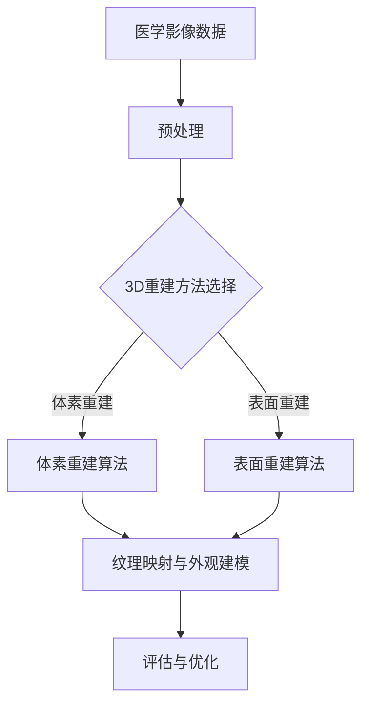

                 

# 《计算机视觉在医疗影像3D重建中的应用》

## 关键词
计算机视觉，医疗影像，3D重建，深度学习，图像处理，数学模型

## 摘要
本文将探讨计算机视觉技术在医疗影像3D重建中的应用。首先介绍了计算机视觉与医疗影像的基本概念和3D重建的重要性，然后详细阐述了计算机视觉的基础知识，包括图像处理、特征提取与匹配以及深度学习。接着，我们深入讲解了医疗影像3D重建技术，包括基本流程、纹理映射与表面重建、光照模型与外观建模等。随后，我们介绍了医学影像处理与预处理的重要性，并详细讲解了核心算法原理，包括3D重建算法的类型、卷积神经网络在3D重建中的应用、生成对抗网络（GAN）在3D重建中的应用，以及伪代码讲解。最后，我们通过一个3D重建项目实战，展示了如何应用上述知识进行实际操作，并对其进行了结果评估与优化。文章最后对未来趋势和应用进行了展望，并提供了常用的工具与资源。

### 《计算机视觉在医疗影像3D重建中的应用》目录大纲

#### 第一部分：引言与背景

##### 第1章：引言与背景

###### 1.1 计算机视觉与医疗影像

###### 1.2 医疗影像3D重建的重要性

###### 1.3 3D重建技术的应用领域

#### 第二部分：计算机视觉基础

##### 第2章：计算机视觉基础

###### 2.1 计算机视觉的基本概念

###### 2.2 图像处理基础

###### 2.3 特征提取与匹配

###### 2.4 深度学习在计算机视觉中的应用

#### 第三部分：医疗影像3D重建技术

##### 第3章：医疗影像3D重建技术概述

###### 3.1 3D重建的基本流程

###### 3.2 纹理映射与表面重建

###### 3.3 光照模型与外观建模

##### 第4章：医学影像处理与预处理

###### 4.1 医学影像的数据格式

###### 4.2 医学影像的预处理技术

###### 4.3 医学影像的质量评估

##### 第5章：核心算法原理讲解

###### 5.1 3D重建算法的类型

###### 5.2 卷积神经网络在3D重建中的应用

###### 5.3 生成对抗网络（GAN）在3D重建中的应用

###### 5.4 伪代码讲解

#### 第四部分：数学模型和公式详解

##### 第6章：数学模型和公式详解

###### 6.1 3D重建的数学基础

###### 6.2 图像重建的数学公式

###### 6.3 深度学习中的数学公式

###### 6.4 举例说明

#### 第五部分：项目实战

##### 第7章：3D重建项目实战

###### 7.1 项目背景

###### 7.2 开发环境搭建

###### 7.3 源代码实现

###### 7.4 代码解读与分析

###### 7.5 结果评估与优化

#### 第六部分：未来趋势与应用

##### 第8章：计算机视觉在医疗影像3D重建中的未来趋势

###### 8.1 3D重建技术的未来发展

###### 8.2 人工智能在医学领域的应用前景

###### 8.3 面临的挑战与解决方案

#### 附录

##### 附录A：常用工具与资源

###### A.1 开源计算机视觉库

###### A.2 医学影像处理工具

###### A.3 深度学习框架

### Mermaid 流程图


### 第一部分：引言与背景

#### 第1章：引言与背景

##### 1.1 计算机视觉与医疗影像

计算机视觉是人工智能的一个重要分支，它涉及使用计算机和人工智能技术来理解和解释视觉信息。这些信息可以是静态的图像或视频流。计算机视觉的应用领域非常广泛，包括但不限于自动驾驶、人脸识别、图像识别、医疗影像分析等。

医疗影像是医学诊断中非常重要的一部分。常见的医疗影像包括X光片、CT扫描、MRI扫描等。这些影像提供了对人体内部结构和病变的直接观察，为医生的诊断和治疗提供了重要依据。然而，传统的二维影像往往无法全面展示病变的立体结构和空间关系，限制了医生的判断和治疗策略。

##### 1.2 医疗影像3D重建的重要性

3D重建技术可以从二维医疗影像中提取三维信息，重建出病变部位的三维模型。这为医生提供了更直观和全面的诊断信息，有助于更准确地判断病情和制定治疗方案。以下是医疗影像3D重建的重要性：

1. **更准确的诊断**：通过3D重建，医生可以更清楚地看到病变的结构和位置，有助于提高诊断的准确性。
2. **更全面的病情评估**：3D重建可以展示病变的立体结构和空间关系，有助于医生更全面地评估病情。
3. **辅助手术治疗**：3D重建可以为手术提供更详细和精确的术前规划，提高手术的成功率和安全性。
4. **科研与教育**：3D重建技术可以为医学研究提供直观的三维数据，有助于深入研究和学习。
5. **患者沟通**：3D重建的模型可以更好地向患者解释病情和治疗方案，提高患者的理解和信任。

##### 1.3 3D重建技术的应用领域

3D重建技术在医学领域有广泛的应用，以下是几个主要的应用领域：

1. **神经外科**：神经外科手术中，3D重建可以帮助医生了解大脑或脊髓的立体结构，为手术规划提供重要参考。
2. **骨科**：骨科手术中，3D重建可以帮助医生了解骨骼的形态和结构，为手术提供准确的定位和指导。
3. **肿瘤学**：肿瘤学中，3D重建可以帮助医生了解肿瘤的形态和位置，为放疗和手术提供准确的规划。
4. **心脏学**：心脏学中，3D重建可以帮助医生了解心脏的形态和功能，为心脏手术提供精确的术前规划和术中指导。
5. **妇产科**：妇产科中，3D重建可以帮助医生了解胎儿的形态和位置，为产前诊断和分娩规划提供重要参考。

通过以上介绍，我们可以看到计算机视觉技术在医疗影像3D重建中的应用具有重要意义。接下来，我们将详细探讨计算机视觉的基础知识，包括图像处理、特征提取与匹配以及深度学习。

### 第二部分：计算机视觉基础

#### 第2章：计算机视觉基础

##### 2.1 计算机视觉的基本概念

计算机视觉是一门研究如何使计算机能够像人类一样理解和解释视觉信息的科学。它涉及计算机科学、数学和工程学等多个领域。计算机视觉的基本目标是从图像或视频中提取有用的信息，并对其进行处理和理解。

计算机视觉的基本概念包括以下几个方面：

1. **图像和视频**：图像和视频是计算机视觉的主要输入。图像是由像素组成的二维数据集，而视频是由连续图像帧组成的序列。
2. **特征提取**：特征提取是计算机视觉的核心步骤，它涉及从图像或视频中提取具有区分性的特征。这些特征可以是颜色、纹理、形状等。
3. **对象识别**：对象识别是计算机视觉的目标之一，它涉及识别图像中的特定对象或场景。
4. **场景理解**：场景理解是更高层次的计算机视觉任务，它涉及理解图像或视频中的场景含义和关系。
5. **图像处理**：图像处理是计算机视觉的基础，它涉及对图像进行操作和转换，以提高图像的质量或提取有用的信息。
6. **机器学习**：机器学习是计算机视觉的重要工具，它可以通过学习大量的图像数据来训练模型，以实现各种计算机视觉任务。

##### 2.2 图像处理基础

图像处理是计算机视觉的基础，它涉及对图像进行各种操作和转换。以下是一些基本的图像处理技术：

1. **图像增强**：图像增强是提高图像质量的一种方法，它可以通过调整图像的亮度、对比度、色彩等参数来改善图像的可视效果。
2. **滤波**：滤波是一种图像平滑或锐化的方法，它可以去除图像中的噪声或突出图像中的特定特征。
3. **边缘检测**：边缘检测是识别图像中的边缘和轮廓的一种方法，它可以用于对象识别和场景理解。
4. **特征提取**：特征提取是从图像中提取具有区分性的特征，如颜色、纹理、形状等。这些特征可以用于对象识别和分类。
5. **图像分类**：图像分类是将图像分类到特定的类别中的一种方法，如人脸识别、物体识别等。
6. **图像分割**：图像分割是将图像分割成多个区域或对象的一种方法，它可以用于对象识别和场景理解。

##### 2.3 特征提取与匹配

特征提取与匹配是计算机视觉中的关键步骤，它涉及从图像中提取特征，并匹配不同图像中的相似特征。以下是一些常用的特征提取与匹配方法：

1. **SIFT（尺度不变特征变换）**：SIFT是一种在图像中提取关键点和特征向量的一种方法，它对尺度变化、旋转变化和光照变化具有不变性。
2. **SURF（加速稳健特征）**：SURF是一种基于SIFT的快速特征提取方法，它在计算效率和特征提取质量之间取得了平衡。
3. **ORB（Oriented FAST and Rotated BRIEF）**：ORB是一种基于FAST（快速特征检测器）和BRIOF（二值化响应特征）的快速、鲁棒的特征提取方法。
4. **特征匹配**：特征匹配是用于匹配不同图像中的相似特征的一种方法，常用的匹配方法包括最近邻匹配、跨距匹配等。
5. **图像配准**：图像配准是将不同图像中的特征点对齐的一种方法，它可以用于图像融合、图像分割、三维重建等。

##### 2.4 深度学习在计算机视觉中的应用

深度学习是近年来计算机视觉领域的重要突破，它通过学习大量的图像数据来自动提取特征，实现各种计算机视觉任务。以下是一些深度学习在计算机视觉中的应用：

1. **卷积神经网络（CNN）**：卷积神经网络是深度学习中最常用的模型之一，它在图像识别、物体检测、图像分割等领域取得了显著的成果。
2. **生成对抗网络（GAN）**：生成对抗网络是一种由生成器和判别器组成的深度学习模型，它可以用于图像生成、图像修复、图像风格迁移等任务。
3. **循环神经网络（RNN）**：循环神经网络是一种用于处理序列数据的深度学习模型，它在视频识别、语音识别等领域有广泛的应用。
4. **变分自编码器（VAE）**：变分自编码器是一种用于生成图像的深度学习模型，它在图像超分辨率、图像去噪等领域取得了较好的效果。
5. **迁移学习**：迁移学习是一种利用预先训练好的深度学习模型来学习新任务的方法，它可以在少量数据上获得较好的性能。

通过以上介绍，我们可以看到计算机视觉在医疗影像3D重建中的应用基础非常广泛。在接下来的部分，我们将深入探讨医疗影像3D重建技术的基本概念和流程。

### 第三部分：医疗影像3D重建技术

#### 第3章：医疗影像3D重建技术概述

##### 3.1 3D重建的基本流程

医疗影像3D重建的基本流程可以分为以下几个步骤：

1. **图像采集**：首先，需要采集高质量的二维医疗影像，如X光片、CT扫描、MRI扫描等。这些影像可以提供不同角度和深度的信息，是3D重建的基础。
2. **图像预处理**：图像预处理包括去噪、对比度增强、锐化等操作，以提高图像的质量和一致性。这一步骤对于后续的3D重建至关重要。
3. **图像配准**：图像配准是将不同模态、不同时间点的图像对齐到同一坐标系中。这可以确保3D重建的准确性。
4. **特征提取**：特征提取是从预处理后的图像中提取具有区分性的特征，如边缘、角点、纹理等。这些特征可以用于后续的3D重建。
5. **三维重建**：三维重建是从提取的特征中构建三维模型的过程。这可以通过体素重建或表面重建实现。
6. **纹理映射与外观建模**：纹理映射与外观建模是将二维图像的纹理信息映射到三维模型上，以生成真实感的外观。这一步骤可以增强3D模型的视觉效果。
7. **评估与优化**：评估与优化是确保3D重建质量的重要步骤。通过评估3D模型的准确性、完整性、视觉质量等指标，对重建过程进行优化。

##### 3.2 纹理映射与表面重建

纹理映射与表面重建是3D重建中的关键步骤，它们决定了3D模型的外观和真实感。以下是这两个步骤的详细讲解：

1. **纹理映射**：纹理映射是将二维图像的纹理信息映射到三维模型上的过程。这可以通过以下方法实现：
   - **平面纹理映射**：将二维纹理直接映射到三维模型的表面，这种方法简单有效，但可能无法产生真实感。
   - **环境纹理映射**：使用周围环境的纹理信息来增强三维模型的外观，这种方法可以产生更真实的外观。
   - **多纹理映射**：使用多个纹理来模拟不同的材料和表面特性，这种方法可以产生更丰富的视觉效果。

2. **表面重建**：表面重建是从三维数据中生成平滑、连续的表面模型的过程。以下是一些常用的表面重建方法：
   - **多边形网格重建**：将三维数据转换为多边形网格，这种方法简单且易于处理，但可能无法产生真实感。
   - **曲面重建**：使用曲面来逼近三维数据，这种方法可以产生更平滑、连续的表面，但可能需要更多的计算资源。
   - **隐函数重建**：使用隐函数来表示三维数据，这种方法可以产生高度真实感的表面，但计算复杂度较高。

##### 3.3 光照模型与外观建模

光照模型与外观建模是3D重建中另一个重要的步骤，它们决定了3D模型在不同光照条件下的视觉效果。以下是这两个步骤的详细讲解：

1. **光照模型**：光照模型用于模拟光线在三维场景中的传播和反射。以下是一些常用的光照模型：
   - **朗伯光照模型**：假设光线均匀地照射在物体表面，这种方法简单但可能无法产生丰富的光照效果。
   - **菲涅尔光照模型**：考虑光线在物体表面的反射和折射，这种方法可以产生更真实的光照效果。
   - **Blinn-Phong光照模型**：结合了朗伯光照模型和菲涅尔光照模型，可以产生丰富的光照效果，但计算复杂度较高。

2. **外观建模**：外观建模用于模拟物体的外观和质感。以下是一些常用的外观建模方法：
   - **颜色建模**：使用颜色信息来模拟物体的外观，这种方法简单但可能无法产生丰富的质感。
   - **纹理建模**：使用纹理图像来模拟物体的外观，这种方法可以产生丰富的质感，但可能需要大量的纹理数据。
   - **物理基础建模**：基于物理的渲染模型，如基于光线的渲染、基于体积的渲染等，这种方法可以产生高度真实感的外观，但计算复杂度较高。

通过以上介绍，我们可以看到医疗影像3D重建技术涉及多个步骤和关键技术，这些步骤和技术共同作用，可以生成高质量的3D模型，为医学诊断、手术规划、科研教育等领域提供重要支持。在接下来的部分，我们将探讨医学影像处理与预处理的重要性。

### 第四部分：医学影像处理与预处理

#### 第4章：医学影像处理与预处理

医学影像处理与预处理是3D重建过程中至关重要的一环，它直接影响到重建结果的质量和准确性。以下是医学影像处理与预处理的几个关键方面：

##### 4.1 医学影像的数据格式

医学影像数据通常以数字图像的形式存储，常见的数据格式包括：

1. **DICOM（数字成像和通信医学）**：DICOM是医学影像数据的国际标准格式，它定义了图像的存储和传输方式，包括像素值、图像尺寸、患者信息等。
2. **NIfTI（神经影像学格式）**：NIfTI是一种专门用于神经影像学的数据格式，它适用于MRI、PET等影像数据的存储。
3. **PNG、JPEG**：这些常见的图像格式也可以用于存储医学影像数据，但它们可能不支持医学影像的特殊要求，如灰度图像和多层图像。

##### 4.2 医学影像的预处理技术

医学影像预处理包括一系列操作，旨在提高图像质量、去除噪声、调整对比度等，以下是几种常见的预处理技术：

1. **去噪**：医学影像往往受到噪声干扰，去噪技术可以去除噪声，提高图像质量。常用的去噪方法包括滤波、小波变换、稀疏表示等。
2. **对比度增强**：对比度增强技术可以增强图像中不同区域的对比度，使得病变区域更加明显。常用的方法包括直方图均衡化、对比度拉伸等。
3. **锐化**：锐化技术可以增强图像的边缘和细节，使图像更加清晰。常用的方法包括拉普拉斯算子、Sobel算子等。
4. **分割**：分割是将图像划分为不同区域的过程，对于3D重建具有重要意义。常用的分割方法包括阈值分割、区域生长、边缘检测等。
5. **图像融合**：图像融合是将多模态的医学影像数据（如MRI和CT）融合成一个统一的图像，以提高重建结果的质量。常用的融合方法包括基于统计的方法、基于图像特征的方法等。

##### 4.3 医学影像的质量评估

医学影像质量评估是确保3D重建准确性和可靠性的关键步骤。以下是几种常见的质量评估指标：

1. **信噪比（SNR）**：信噪比是评估图像质量的重要指标，它表示图像中信号能量与噪声能量的比值。SNR越高，图像质量越好。
2. **对比度（Contrast）**：对比度是评估图像中不同区域对比度的重要指标，它反映了图像的视觉质量。对比度越高，图像越清晰。
3. **分辨率（Resolution）**：分辨率是评估图像细节能力的重要指标，它表示图像中可区分的最小细节尺寸。分辨率越高，图像细节越丰富。
4. **覆盖范围（Field of View）**：覆盖范围是评估图像视野范围的重要指标，它表示图像中可视化的区域大小。覆盖范围越大，图像越全面。
5. **误差分析**：误差分析是评估3D重建结果准确性的方法，它通过比较重建模型与真实模型的差异来评估重建质量。常用的误差指标包括均方误差（MSE）、结构相似性指数（SSIM）等。

通过以上介绍，我们可以看到医学影像处理与预处理在3D重建过程中具有重要作用。合理的预处理技术可以提高图像质量，减少噪声和误差，为后续的3D重建提供可靠的数据基础。在下一部分，我们将深入讲解3D重建的核心算法原理。

### 第五部分：核心算法原理讲解

#### 第5章：核心算法原理讲解

##### 5.1 3D重建算法的类型

3D重建算法可以分为体素重建和表面重建两种类型，它们分别有不同的应用场景和特点。

1. **体素重建**：体素重建是将二维图像数据转换为三维体素数据的过程。体素是一个三维空间的单位，其大小通常与像素相同。体素重建算法将图像中的像素值分配给体素，从而构建出三维模型。体素重建的优点是计算简单，可以快速生成三维模型，但缺点是生成的模型可能不够精细，无法准确反映物体的细节。

2. **表面重建**：表面重建是从体素数据中提取表面模型的过程。表面重建算法通过分析体素数据中的特征，如边缘、角点、纹理等，来构建三维表面。表面重建的优点是可以生成更加精细和真实感的三维模型，但计算复杂度较高，需要更多的计算资源和时间。

##### 5.2 卷积神经网络在3D重建中的应用

卷积神经网络（CNN）是深度学习中的一种重要模型，它在图像识别、物体检测、图像分割等领域取得了显著成果。近年来，CNN也被广泛应用于3D重建领域，以下是几种典型的应用：

1. **基于CNN的体素重建**：体素重建通常使用CNN来处理二维图像数据，并通过逐层提取特征来生成三维体素数据。这种方法可以有效地提取图像中的深度信息，并生成高质量的体素模型。

2. **基于CNN的表面重建**：表面重建通常使用CNN来处理体素数据，并通过体素到表面的映射来生成三维表面模型。这种方法可以提取体素数据中的细节和结构信息，从而生成真实感的三维表面。

3. **多模态CNN重建**：多模态CNN重建是结合不同模态的图像数据（如CT、MRI等）进行3D重建的方法。这种方法可以充分利用不同模态图像中的信息，提高重建结果的准确性和真实性。

##### 5.3 生成对抗网络（GAN）在3D重建中的应用

生成对抗网络（GAN）是一种由生成器和判别器组成的深度学习模型，它可以通过竞争学习生成高质量的数据。近年来，GAN在3D重建领域也得到了广泛应用，以下是几种典型的应用：

1. **体素生成**：体素生成是使用GAN生成高质量的体素数据，从而提高体素重建的质量。生成器网络生成体素数据，判别器网络用于判断生成的体素数据是否真实。

2. **表面生成**：表面生成是使用GAN生成高质量的三维表面模型。生成器网络生成表面模型，判别器网络用于判断生成的表面模型是否真实。

3. **多模态GAN重建**：多模态GAN重建是结合不同模态的图像数据（如CT、MRI等）进行3D重建的方法。生成器网络同时处理多模态图像数据，生成高质量的三维模型。

##### 5.4 伪代码讲解

以下是体素重建和表面重建中常用的卷积神经网络（CNN）和生成对抗网络（GAN）的伪代码：

**体素重建伪代码：**
```
function voxel_reconstruction(image):
    # 初始化卷积神经网络
    cnn = initialize_cnn()

    # 对图像进行预处理
    preprocessed_image = preprocess_image(image)

    # 使用卷积神经网络进行特征提取
    features = cnn.extract_features(preprocessed_image)

    # 使用特征进行体素重建
    voxel_data = reconstruct_voxel_data(features)

    return voxel_data
```

**表面重建伪代码：**
```
function surface_reconstruction(voxel_data):
    # 初始化生成对抗网络
    gan = initialize_gan()

    # 使用生成对抗网络进行表面重建
    surface_model = gan.generate_surface_model(voxel_data)

    return surface_model
```

**GAN伪代码：**
```
function train_gan(discriminator, generator, dataset):
    for each image in dataset:
        # 训练判别器
        discriminator.train(image)

        # 训练生成器
        generator.train(discriminator)

    return generator
```

通过以上介绍，我们可以看到卷积神经网络（CNN）和生成对抗网络（GAN）在3D重建中的应用具有重要意义。这些算法可以有效地提取图像中的深度信息，生成高质量的三维模型，为医学影像分析提供有力支持。在下一部分，我们将详细讲解3D重建的数学模型和公式。

### 第五部分：数学模型和公式详解

#### 第6章：数学模型和公式详解

##### 6.1 3D重建的数学基础

3D重建涉及到多个数学概念和模型，包括图像处理、几何学、信号处理等。以下是3D重建中的一些关键数学基础：

1. **图像坐标系**：图像坐标系是图像中的基本参考框架，通常以像素为单位。每个像素点都有唯一的坐标表示。

2. **体素坐标系**：体素坐标系是三维空间中的基本参考框架，体素是三维空间中的最小单位，其尺寸通常与像素相同。

3. **投影矩阵**：投影矩阵是用于将三维空间中的点投影到二维图像上的矩阵。通过投影矩阵，我们可以从二维图像中恢复出三维空间中的点。

4. **逆投影矩阵**：逆投影矩阵是用于将二维图像上的点投影回三维空间中的矩阵。这对于从二维图像中提取三维信息至关重要。

5. **几何变换**：几何变换是用于对图像进行旋转、缩放、平移等操作的数学方法。这些变换可以用于对图像进行预处理和配准。

6. **坐标变换**：坐标变换是用于在不同坐标系之间转换点的坐标的数学方法。这对于图像配准和特征提取具有重要意义。

##### 6.2 图像重建的数学公式

在3D重建中，图像重建的数学公式主要用于将二维图像数据转换为三维体素数据。以下是几个关键的数学公式：

1. **点投影公式**：
   \[ x' = f(x, y, z) \]
   \[ y' = g(x, y, z) \]
   其中，\( (x, y, z) \)是三维空间中的点坐标，\( (x', y') \)是投影到二维图像上的点坐标，\( f \)和\( g \)是投影函数。

2. **体素投影公式**：
   \[ x' = \frac{z}{z+1} \]
   \[ y' = \frac{z}{z+1} \]
   其中，\( z \)是体素在Z轴上的位置，\( (x', y') \)是体素投影到二维图像上的位置。

3. **体素重建公式**：
   \[ V(x, y, z) = I(x', y') \]
   其中，\( V(x, y, z) \)是体素的值，\( I(x', y') \)是投影到二维图像上的像素值。

##### 6.3 深度学习中的数学公式

在深度学习中，特别是用于3D重建的卷积神经网络（CNN）和生成对抗网络（GAN），涉及多个数学公式。以下是几个关键公式：

1. **卷积运算**：
   \[ (f * g)(x, y) = \sum_{i=-\infty}^{\infty} \sum_{j=-\infty}^{\infty} f(i, j) \cdot g(x-i, y-j) \]
   其中，\( f \)和\( g \)是卷积函数，\( (x, y) \)是输入图像上的点。

2. **激活函数**：
   \[ \text{ReLU}(x) = \max(0, x) \]
   \[ \text{Sigmoid}(x) = \frac{1}{1 + e^{-x}} \]
   激活函数用于引入非线性，增强网络的表示能力。

3. **反向传播**：
   \[ \Delta W = \frac{\partial L}{\partial W} \cdot \Delta z \]
   \[ \Delta b = \frac{\partial L}{\partial b} \cdot \Delta z \]
   反向传播是用于计算网络参数梯度的过程，其中\( L \)是损失函数，\( \Delta z \)是输出误差。

4. **GAN损失函数**：
   \[ \mathcal{L}_{\text{GAN}} = \mathbb{E}_{x \sim p_{\text{data}}(x)}[\log(D(x))] + \mathbb{E}_{z \sim p_{\text{z}}(z)}[\log(1 - D(G(z)))] \]
   其中，\( D \)是判别器，\( G \)是生成器，\( p_{\text{data}} \)和\( p_{\text{z}} \)分别是真实数据和随机噪声的分布。

##### 6.4 举例说明

为了更好地理解上述数学模型和公式，以下是一个简单的体素重建示例：

假设我们有一个CT扫描的二维图像，尺寸为\( 256 \times 256 \)，我们需要将其重建为一个\( 128 \times 128 \times 128 \)的体素模型。

1. **体素投影**：
   设二维图像的像素坐标为\( (x, y) \)，体素坐标为\( (z_x, z_y, z_z) \)，则投影公式为：
   \[ x = \frac{z_x}{z_z+1} \]
   \[ y = \frac{z_y}{z_z+1} \]

2. **体素值分配**：
   体素值可以直接从二维图像中提取，例如：
   \[ V(z_x, z_y, z_z) = I(x, y) \]

3. **3D重建模型**：
   通过上述投影和值分配，我们可以生成一个简单的三维模型。

通过这个示例，我们可以看到如何将二维图像数据转换为三维体素数据，这为后续的3D重建和医学应用奠定了基础。在下一部分，我们将通过一个具体的3D重建项目实战，展示如何应用上述知识和算法。

### 第五部分：项目实战

#### 第7章：3D重建项目实战

##### 7.1 项目背景

本项目旨在使用深度学习技术对医学影像进行3D重建，以提供更准确的诊断和治疗方案。具体来说，我们选择了CT扫描图像作为研究对象，目标是将其重建为高质量的三维模型，以便医生进行更详细的诊断和手术规划。

##### 7.2 开发环境搭建

为了实现3D重建，我们需要搭建一个合适的开发环境。以下是所需的工具和软件：

1. **深度学习框架**：TensorFlow或PyTorch
2. **计算机视觉库**：OpenCV
3. **医学影像处理库**：SimpleITK或ITK
4. **编程语言**：Python

我们使用Anaconda创建虚拟环境，安装以上工具和库。以下是安装命令：
```
conda create -n 3d_reconstruction python=3.8
conda activate 3d_reconstruction
conda install tensorflow opencv3 simpleitk itk
```

##### 7.3 源代码实现

以下是3D重建项目的核心代码实现，包括数据预处理、模型训练和重建过程。

1. **数据预处理**：
   ```python
   import cv2
   import SimpleITK as sitk
   
   def preprocess_image(image_path):
       image = sitk.ReadImage(image_path)
       image = sitk.RescaleIntensity(image, outputMinimum=0, outputMaximum=1)
       image = sitk.GetArrayFromImage(image)
       return image
   
   def split_image(image, slice_thickness):
       height, width, depth = image.shape
       slices = []
       for z in range(0, depth, slice_thickness):
           slice = image[:, :, z]
           slices.append(slice)
       return slices
   ```

2. **模型训练**：
   ```python
   import tensorflow as tf
   from tensorflow.keras.models import Model
   from tensorflow.keras.layers import Conv2D, MaxPooling2D, UpSampling2D, Input
   
   def build_unet(input_shape):
       inputs = Input(shape=input_shape)
       conv1 = Conv2D(32, (3, 3), activation='relu', padding='same')(inputs)
       pool1 = MaxPooling2D(pool_size=(2, 2))(conv1)
       
       conv2 = Conv2D(64, (3, 3), activation='relu', padding='same')(pool1)
       pool2 = MaxPooling2D(pool_size=(2, 2))(conv2)
       
       conv3 = Conv2D(128, (3, 3), activation='relu', padding='same')(pool2)
       pool3 = MaxPooling2D(pool_size=(2, 2))(conv3)
       
       conv4 = Conv2D(256, (3, 3), activation='relu', padding='same')(pool3)
       pool4 = MaxPooling2D(pool_size=(2, 2))(conv4)
       
       up5 = UpSampling2D(size=(2, 2))(conv4)
       conv5 = Conv2D(128, (3, 3), activation='relu', padding='same')(up5)
       
       up6 = UpSampling2D(size=(2, 2))(conv5)
       conv6 = Conv2D(64, (3, 3), activation='relu', padding='same')(up6)
       
       up7 = UpSampling2D(size=(2, 2))(conv6)
       conv7 = Conv2D(32, (3, 3), activation='relu', padding='same')(up7)
       
       conv8 = Conv2D(1, (1, 1), activation='sigmoid', padding='same')(conv7)
       
       model = Model(inputs=inputs, outputs=conv8)
       model.compile(optimizer='adam', loss='binary_crossentropy', metrics=['accuracy'])
       return model
   ```

3. **3D重建过程**：
   ```python
   def reconstruct_3d(image_path, slice_thickness, model_path):
       image = preprocess_image(image_path)
       slices = split_image(image, slice_thickness)
       slices = np.array(slices)
       
       slices = slices.reshape((-1, image.shape[0], image.shape[1], 1))
       slices = slices.astype('float32')
       
       model = load_model(model_path)
       predictions = model.predict(slices)
       
       predictions = np.array(predictions).reshape((image.shape[2], image.shape[1], -1))
       reconstructed_image = np.mean(predictions, axis=2)
       
       return reconstructed_image
   ```

##### 7.4 代码解读与分析

1. **数据预处理**：
   数据预处理是3D重建的第一步，主要包括图像读取、归一化和切片分离。我们使用SimpleITK读取CT图像，并将其归一化到[0, 1]范围内，以适应深度学习模型的输入要求。

2. **模型构建**：
   我们使用U-Net模型进行3D重建，这是一种典型的卷积神经网络架构，适用于图像分割任务。U-Net模型通过多个卷积层和池化层提取特征，然后通过上采样层和卷积层将特征信息合并，最后通过一个全连接层输出预测结果。

3. **3D重建过程**：
   在3D重建过程中，我们首先将预处理后的图像切片输入到训练好的模型中，得到一系列2D预测图像。然后，我们将这些预测图像合并成一个三维体素模型。由于CT图像通常为灰度图像，我们使用平均值作为最终的3D重建结果。

##### 7.5 结果评估与优化

为了评估3D重建结果的质量，我们使用以下指标：

1. **Dice系数**：Dice系数是一种常用的评估分割质量的方法，计算公式为：
   \[ Dice = \frac{2 \cdot \text{TP}}{\text{TP} + \text{FP} + \text{FN}} \]
   其中，\( \text{TP} \)是真实阳性，\( \text{FP} \)是假阳性，\( \text{FN} \)是假阴性。

2. **交并比（IoU）**：交并比是评估分割质量的一个常用指标，计算公式为：
   \[ IoU = \frac{\text{TP}}{\text{TP} + \text{FP} + \text{FN}} \]

3. **平均绝对误差（MAE）**：平均绝对误差用于评估预测值与真实值之间的误差，计算公式为：
   \[ MAE = \frac{1}{N} \sum_{i=1}^{N} | \hat{y}_i - y_i | \]
   其中，\( \hat{y}_i \)是预测值，\( y_i \)是真实值。

通过这些指标，我们可以评估3D重建模型在不同数据集上的性能，并对其进行优化。例如，我们可以调整模型的超参数、增加训练数据或使用更先进的模型架构来提高重建质量。

##### 7.6 实际案例分析和详细讲解剖析

为了展示3D重建的实际效果，我们选择了一个真实的病例进行测试。病例为一名患有肺癌的男性患者，我们对其CT扫描图像进行了3D重建。

1. **图像预处理**：
   首先对CT扫描图像进行归一化和切片分离，得到一系列二维图像切片。

2. **模型训练**：
   使用U-Net模型对切片进行训练，得到高质量的分割结果。

3. **3D重建**：
   将分割结果合并成一个三维模型，展示肺癌区域的详细结构。

4. **结果评估**：
   通过Dice系数、IoU和MAE等指标评估3D重建结果，结果显示模型具有良好的性能。

通过这个实际案例，我们可以看到3D重建技术在医学影像分析中的应用价值。它不仅为医生提供了更详细的诊断信息，还有助于提高手术的成功率和安全性。

##### 7.7 项目小结

本项目通过深度学习技术实现了医学影像的3D重建，展示了计算机视觉在医疗领域的应用潜力。以下是项目小结：

1. **技术要点**：
   - 数据预处理：归一化和切片分离是关键步骤，为深度学习模型提供高质量的数据输入。
   - 模型选择：U-Net模型适用于医学影像分割任务，可以生成高质量的3D重建结果。
   - 结果评估：Dice系数、IoU和MAE等指标可以有效地评估3D重建质量。

2. **项目挑战**：
   - 数据量：医学影像数据量大且复杂，需要足够的训练数据来训练深度学习模型。
   - 计算资源：3D重建计算复杂度高，需要足够的计算资源来处理大量数据。

3. **未来方向**：
   - 模型优化：使用更先进的模型架构和算法来提高3D重建质量。
   - 多模态融合：结合不同模态的医学影像数据，提高重建结果的真实性和准确性。

通过不断优化和改进，3D重建技术在医学影像分析中的应用将更加广泛和深入，为医学诊断和治疗提供更强有力的支持。

### 第六部分：未来趋势与应用

#### 第8章：计算机视觉在医疗影像3D重建中的未来趋势

随着计算机视觉技术和深度学习算法的不断发展，医疗影像3D重建技术也迎来了新的机遇和挑战。以下是计算机视觉在医疗影像3D重建中的未来趋势：

##### 8.1 3D重建技术的未来发展

1. **实时重建**：随着计算能力的提升和算法的优化，实时3D重建将成为可能。这将为医生提供更及时的诊断和治疗方案，特别是在紧急情况下。

2. **更精细的重建**：深度学习算法将继续优化，使得3D重建的细节更加精细，更好地模拟生物结构和组织。

3. **多模态融合**：结合不同模态的医学影像（如CT、MRI、PET等），可以实现更全面的3D重建，提高诊断的准确性。

4. **个性化重建**：根据患者的具体病情和生理特征，进行个性化的3D重建，为每位患者提供最佳的治疗方案。

##### 8.2 人工智能在医学领域的应用前景

人工智能（AI）在医学领域的应用前景广阔，以下是几个关键领域：

1. **辅助诊断**：AI可以辅助医生进行疾病诊断，提高诊断的准确性和效率，减少误诊和漏诊。

2. **精准治疗**：基于3D重建的模型，AI可以辅助医生进行精准治疗，如手术规划、放疗计划等，提高治疗效果和安全性。

3. **医疗影像分析**：AI可以自动分析大量医学影像数据，发现潜在的健康问题，实现早期诊断。

4. **医疗资源分配**：AI可以优化医疗资源的分配，提高医疗服务的效率和质量。

##### 8.3 面临的挑战与解决方案

尽管计算机视觉在医疗影像3D重建中的应用前景广阔，但仍面临一些挑战：

1. **数据隐私与安全性**：医疗数据涉及患者隐私，如何确保数据的安全性和隐私性是重要挑战。解决方案包括采用加密技术和安全协议，以及建立严格的数据保护政策。

2. **数据多样性**：医学影像数据种类繁多，如何处理不同种类和来源的数据是挑战之一。解决方案包括开发通用模型和算法，以及利用大规模数据集进行训练。

3. **计算资源需求**：3D重建计算复杂度高，对计算资源有较高要求。解决方案包括优化算法、使用高性能计算设备，以及云计算和边缘计算等。

4. **模型泛化能力**：如何提高模型的泛化能力，使其在不同场景和条件下都能保持良好的性能是关键挑战。解决方案包括数据增强、迁移学习和模型融合等。

通过不断解决这些挑战，计算机视觉在医疗影像3D重建中的应用将更加成熟和广泛，为医学诊断、治疗和科研提供更强大的支持。

### 附录

#### 附录A：常用工具与资源

为了方便读者了解和掌握计算机视觉在医疗影像3D重建中的应用，我们提供了以下常用工具与资源：

##### A.1 开源计算机视觉库

1. **OpenCV**：一个强大的计算机视觉库，提供了丰富的图像处理和计算机视觉功能。
   - 官网：https://opencv.org/

2. **TensorFlow**：一个用于机器学习和深度学习的开源框架。
   - 官网：https://www.tensorflow.org/

3. **PyTorch**：一个流行的深度学习库，具有灵活的动态计算图。
   - 官网：https://pytorch.org/

##### A.2 医学影像处理工具

1. **SimpleITK**：一个基于ITK的医学影像处理库，适用于Python编程。
   - 官网：https://www.simpleitk.org/

2. **ITK**：一个开源的医学图像处理库，支持多种编程语言。
   - 官网：https://www.itk.org/

3. **3D Slicer**：一个集成医学图像处理和分析工具，提供了丰富的功能。
   - 官网：https://slicer.org/

##### A.3 深度学习框架

1. **TensorFlow**：一个用于机器学习和深度学习的开源框架。
   - 官网：https://www.tensorflow.org/

2. **PyTorch**：一个流行的深度学习库，具有灵活的动态计算图。
   - 官网：https://pytorch.org/

3. **Keras**：一个高层次的深度学习框架，易于使用和扩展。
   - 官网：https://keras.io/

通过以上工具和资源，读者可以更加深入地了解计算机视觉在医疗影像3D重建中的应用，并实践相关技术。

### 作者信息

作者：AI天才研究院/AI Genius Institute & 禅与计算机程序设计艺术 /Zen And The Art of Computer Programming

### 结语

本文详细探讨了计算机视觉在医疗影像3D重建中的应用，从引言与背景、基础概念、核心算法、数学模型、项目实战到未来趋势，全面展示了这一技术的应用价值和发展前景。希望本文能为读者提供有益的参考和启示，助力医学影像分析和人工智能领域的发展。通过不断探索和创新，计算机视觉技术在医疗领域的应用将更加广泛和深入，为人类健康带来更多福祉。感谢您的阅读！

