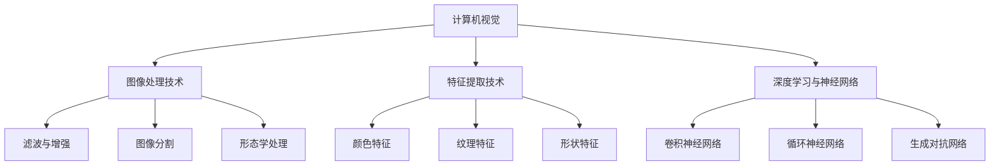

                 

# 文章标题：计算机视觉在医疗手术辅助中的应用

> 关键词：计算机视觉，医疗手术辅助，深度学习，图像处理，人工智能

> 摘要：本文将深入探讨计算机视觉在医疗手术辅助中的应用，从基础概念、核心算法、应用实例到技术挑战和未来发展趋势进行全面剖析。文章旨在为读者提供一个清晰、系统的认识，帮助理解和掌握这一前沿技术的实际应用。

## 第一部分：基础概念与原理

### 第1章：计算机视觉与医疗手术辅助概述

#### 1.1 计算机视觉简介

计算机视觉是一门研究如何使计算机“看懂”和理解图像或视频数据的学科。其基本概念包括图像处理、特征提取、图像分析和图像理解等。计算机视觉技术在多个领域都有广泛应用，如自动驾驶、机器人导航、安防监控和医疗等领域。

#### 1.2 医疗手术辅助的概念

医疗手术辅助是指利用计算机技术、人工智能和机器人技术等手段，辅助医生进行手术操作、提高手术效率和准确性的技术。医疗手术辅助不仅能够提高手术的成功率，还能降低医生的工作负担，减少手术风险。

#### 1.3 医疗手术辅助的分类

医疗手术辅助可以分为以下几类：

- **手术导航系统**：利用计算机视觉技术，实时获取手术现场的图像或视频数据，为医生提供精确的手术导航信息。

- **机器人辅助手术**：通过计算机视觉和机器人技术，实现手术机器人的自动控制，辅助医生完成复杂的手术操作。

- **智能监测系统**：实时监测患者的生理参数和手术环境，及时发现异常情况，提供预警和干预措施。

#### 1.4 计算机视觉关键技术

计算机视觉的关键技术包括：

- **图像处理技术**：用于图像的滤波、增强、分割和形态学处理等。

- **特征提取技术**：用于从图像中提取出具有区分性的特征，如颜色、纹理和形状等。

- **深度学习与神经网络**：通过大规模数据训练，自动学习图像特征的表示和分类。

## Mermaid 流程图

### 第2章：计算机视觉基本算法原理

#### 2.1 图像处理算法

图像处理算法主要包括以下几种：

- **图像滤波与增强**：用于去除图像中的噪声和增强重要信息。

- **图像分割**：用于将图像划分为不同的区域或对象。

- **形态学处理**：利用数学形态学方法对图像进行形状分析和操作。

#### 2.2 特征提取算法

特征提取算法主要包括以下几种：

- **颜色特征**：用于描述图像的颜色信息。

- **纹理特征**：用于描述图像的纹理信息。

- **形状特征**：用于描述图像的形状信息。

#### 2.3 深度学习与神经网络

深度学习与神经网络是计算机视觉的核心技术之一。常见的深度学习模型包括：

- **卷积神经网络（CNN）**：适用于图像分类和目标检测。

- **循环神经网络（RNN）**：适用于序列数据处理，如视频识别。

- **生成对抗网络（GAN）**：用于图像生成和图像修复。

### 第3章：计算机视觉在医疗手术辅助中的应用原理

#### 3.1 医学影像处理

医学影像处理是计算机视觉在医疗手术辅助中的重要应用之一。其主要任务包括：

- **医学影像数据预处理**：包括图像去噪、对比度增强和图像增强等。

- **病灶检测与分割**：用于定位和分割医学影像中的病变区域。

- **影像分析与诊断**：利用深度学习技术，对医学影像进行自动分析和诊断。

#### 3.2 手术导航系统

手术导航系统利用计算机视觉技术，实时获取手术现场的图像或视频数据，为医生提供精确的手术导航信息。其主要任务包括：

- **手术导航技术**：包括图像匹配、图像跟踪和三维重建等。

- **手术路径规划**：根据手术需求和现场环境，规划最优的手术路径。

- **实时图像匹配与跟踪**：实时获取手术现场图像，与术前规划进行匹配和跟踪，确保手术的准确性和安全性。

#### 3.3 机器人辅助手术

机器人辅助手术通过计算机视觉和机器人技术，实现手术机器人的自动控制，辅助医生完成复杂的手术操作。其主要任务包括：

- **机器人辅助手术原理**：利用计算机视觉技术，实现手术机器人的定位、跟踪和控制。

- **手术机器人系统组成**：包括手术机器人本体、控制系统和辅助设备等。

- **手术机器人应用场景**：如微创手术、机器人辅助胸腔手术和机器人辅助神经外科手术等。

#### 3.4 智能监测系统

智能监测系统实时监测患者的生理参数和手术环境，及时发现异常情况，提供预警和干预措施。其主要任务包括：

- **实时监测技术**：包括生理信号监测、手术环境监测和图像监测等。

- **异常检测与预警**：利用机器学习技术，对监测数据进行分析，识别异常情况并发出预警。

- **患者状态分析**：对患者的生理状态进行分析，提供个性化护理建议。

## 第二部分：核心算法与实现

### 第4章：计算机视觉算法在医疗手术辅助中的应用实战

#### 4.1 医学影像处理实战

医学影像处理实战包括以下项目：

- **实战项目一：肿瘤分割**：利用深度学习技术，对医学影像中的肿瘤区域进行分割。

- **实战项目二：冠状动脉狭窄检测**：利用卷积神经网络，检测医学影像中冠状动脉的狭窄程度。

- **实战项目三：骨密度分析**：利用图像处理技术，对医学影像中的骨密度进行定量分析。

#### 4.2 手术导航系统实战

手术导航系统实战包括以下项目：

- **实战项目一：实时手术图像跟踪**：利用图像匹配和跟踪技术，实现对手术图像的实时跟踪。

- **实战项目二：三维重建与可视化**：利用三维重建技术，实现对手术场景的三维可视化。

- **实战项目三：手术路径规划与优化**：利用算法，对手术路径进行规划与优化，提高手术效率。

#### 4.3 机器人辅助手术实战

机器人辅助手术实战包括以下项目：

- **实战项目一：机械臂控制与路径规划**：利用计算机视觉技术，实现对手术机械臂的控制和路径规划。

- **实战项目二：手术机器人协同控制**：利用多机器人协同控制技术，实现手术机器人的协同操作。

- **实战项目三：手术机器人实时监测与反馈**：利用实时监测技术，实现对手术机器人的实时监测与反馈。

#### 4.4 智能监测系统实战

智能监测系统实战包括以下项目：

- **实战项目一：患者生理信号监测**：利用生理信号监测技术，实时监测患者的生理参数。

- **实战项目二：患者运动状态监测**：利用运动状态监测技术，实时监测患者的运动状态。

- **实战项目三：患者跌倒检测与预警**：利用跌倒检测技术，实时检测患者是否跌倒，并发出预警。

## 第三部分：技术挑战与未来发展趋势

### 第5章：计算机视觉在医疗手术辅助中的技术挑战

#### 5.1 数据质量与标注问题

数据质量和标注问题是计算机视觉在医疗手术辅助中面临的重要挑战。医学影像数据往往具有高噪声、高分辨率和复杂背景等特点，这对数据预处理和特征提取提出了较高的要求。同时，医学影像数据的标注过程复杂、耗时且成本高昂，这限制了深度学习模型在大规模医学影像数据集上的训练和应用。

#### 5.2 实时性与准确性

实时性和准确性是计算机视觉在医疗手术辅助中的关键指标。手术过程中，医生需要实时获取手术现场的图像或视频数据，以便进行准确的手术操作。然而，实时图像处理和算法的准确性往往受到计算资源、算法复杂度和图像质量等因素的影响。提高实时性和准确性的关键技术包括高性能计算、算法优化和图像预处理等。

#### 5.3 安全性与隐私保护

安全性和隐私保护是计算机视觉在医疗手术辅助中必须重视的问题。医疗数据具有高度的敏感性，一旦泄露或被滥用，可能会对患者的隐私和安全造成严重威胁。因此，在设计和实现计算机视觉系统时，必须确保系统的安全性和隐私保护。关键技术包括数据加密、权限控制和访问控制等。

### 第6章：计算机视觉在医疗手术辅助中的未来发展趋势

#### 6.1 深度学习在医学影像处理中的应用

深度学习在医学影像处理中具有广泛的应用前景。随着深度学习技术的不断发展，越来越多的深度学习模型被用于医学影像数据的处理和分析。未来，深度学习将在医学影像处理中发挥更大的作用，如自动诊断、图像分割和图像生成等。

#### 6.2 人工智能与手术机器人融合

人工智能与手术机器人的融合是未来医疗手术辅助的发展方向。通过将人工智能技术应用于手术机器人，可以实现更精确的手术操作、更高效的手术路径规划和更安全的手术环境。未来，人工智能和手术机器人将在医疗领域发挥更大的作用，为医生和患者提供更好的医疗服务。

#### 6.3 智能监测系统的创新应用

智能监测系统在医疗手术辅助中具有重要的作用。通过实时监测患者的生理参数和手术环境，智能监测系统可以及时发现异常情况，提供预警和干预措施。未来，智能监测系统将在多模态监测、实时监测和预警技术等方面取得更大的突破，为医疗手术辅助提供更强大的支持。

## 附录

### 附录A：计算机视觉在医疗手术辅助中的工具与资源

#### A.1 计算机视觉工具介绍

- **OpenCV**：OpenCV 是一个开源的计算机视觉库，提供了丰富的图像处理、特征提取和机器学习等功能。

- **TensorFlow**：TensorFlow 是一个开源的深度学习框架，适用于构建和训练深度学习模型。

- **PyTorch**：PyTorch 是一个开源的深度学习框架，具有简洁、灵活和高效的特性。

#### A.2 医学影像处理工具

- **ITK**：ITK 是一个开源的医学影像处理库，提供了丰富的图像处理、特征提取和图像重建等功能。

- **SimpleITK**：SimpleITK 是 ITK 的一个简化版本，适用于医学影像数据处理和可视化。

- **NiftyNet**：NiftyNet 是一个开源的深度学习模型库，专门用于医学影像处理和分割。

#### A.3 开发环境与代码示例

- **开发环境搭建**：本文所使用的开发环境包括 Python、OpenCV、TensorFlow 和 PyTorch 等。

- **代码示例与解读**：本文提供了多个计算机视觉算法的实现代码示例，并进行了详细解读。

#### A.4 学术资源与论文推荐

- **经典论文与最新研究成果**：本文推荐了一些经典的计算机视觉和医学影像处理论文，以及最新的研究成果。

- **国内外权威学术会议与期刊**：本文介绍了国内外权威的计算机视觉和医学影像处理学术会议与期刊，供读者参考。

## 作者信息

作者：AI天才研究院/AI Genius Institute & 禅与计算机程序设计艺术 /Zen And The Art of Computer Programming

[完] ## 文章标题：计算机视觉在医疗手术辅助中的应用

### 1.1 计算机视觉简介

计算机视觉（Computer Vision）是一门跨学科领域，旨在使计算机具备类似人类视觉的功能，通过图像或视频数据来理解和解释周围环境。它涉及多个技术领域，包括图像处理、模式识别、机器学习和人工智能等。计算机视觉的核心目标是从图像或视频中提取有用信息，并进行理解和解释，以实现诸如图像分类、目标检测、场景重建、行为识别等任务。

计算机视觉的发展可以追溯到20世纪60年代，当时研究人员开始探索如何使计算机能够“看”和理解图像。随着计算能力的提升和算法的创新，计算机视觉技术逐渐从理论研究走向实际应用。在医疗领域，计算机视觉技术以其高精度、高速率和非侵入性等特点，为手术辅助提供了强有力的工具。

#### 计算机视觉定义与基本概念

计算机视觉是一种通过模拟人类视觉系统的工作原理，使计算机能够处理、分析和理解图像信息的技术。其基本概念包括：

- **图像处理**：对图像进行预处理、增强、滤波、分割等操作，以提取有用信息。

- **特征提取**：从图像中提取具有区分性的特征，如颜色、纹理、形状等，用于后续的图像分析。

- **图像分析**：利用提取的特征，对图像进行分类、目标检测、场景识别等分析任务。

- **图像理解**：对图像进行高层次的理解，如场景解释、行为识别等。

#### 计算机视觉在医学领域的应用

计算机视觉技术在医学领域的应用十分广泛，涵盖了从诊断到手术的各个环节。以下是几个主要的领域：

- **医学影像分析**：计算机视觉技术可以用于医学影像的预处理、病灶检测、分割和分类。例如，通过深度学习算法对CT、MRI和X射线等影像进行自动分析，可以有效地提高诊断的准确性和速度。

- **手术导航**：在手术过程中，计算机视觉技术可以提供实时的图像匹配和跟踪，帮助医生精确定位手术部位，避免误伤。

- **机器人辅助手术**：计算机视觉技术可以用于手术机器人的控制，实现高精度的手术操作。

- **病理分析**：通过计算机视觉技术，可以对病理切片进行自动分析，帮助病理医生快速准确地诊断疾病。

- **患者监护**：计算机视觉技术可以实时监测患者的生理参数和手术环境，及时发现异常情况，提供预警和干预措施。

#### 计算机视觉与医疗手术辅助的关系

计算机视觉在医疗手术辅助中扮演着至关重要的角色。通过精确的图像处理和特征提取，计算机视觉技术可以为医生提供实时的、准确的手术导航信息，从而提高手术的成功率和安全性。此外，计算机视觉技术还可以用于手术机器人的控制，实现复杂手术的操作，减少手术风险和恢复时间。

总的来说，计算机视觉技术为医疗手术辅助带来了革命性的变化。它不仅提高了手术的效率和准确性，还减轻了医生的工作负担，为患者提供了更高质量的医疗服务。

### 1.2 医疗手术辅助的概念

医疗手术辅助（Medical Surgery Assistance）是指通过应用先进的科学技术和医疗设备，辅助医生进行手术操作、提高手术效率和准确性的技术手段。医疗手术辅助不仅涵盖了传统的手术器械和设备，还融入了计算机视觉、人工智能、机器人技术等前沿科技。其目标是减少手术风险，提高手术成功率，缩短患者的康复时间，并为医生提供更便捷、高效的手术环境。

#### 医疗手术辅助的定义

医疗手术辅助是一种通过计算机技术和智能系统，辅助医生完成手术操作的技术手段。它利用计算机视觉、机器人控制、智能监测等技术，实现手术过程的精准化、智能化和自动化。医疗手术辅助系统通常包括手术导航、机器人辅助手术、智能监测等多个子系统，协同工作以提高手术的整体效果。

#### 医疗手术辅助的发展历程

医疗手术辅助技术的发展经历了几个重要阶段：

- **初始阶段**（20世纪60年代至80年代）：这一阶段的医疗手术辅助主要依赖于传统手术器械和设备，如电刀、手术显微镜等。虽然这些设备在一定程度上提高了手术的精度和效率，但仍然需要医生手动操作。

- **计算机辅助阶段**（20世纪90年代）：随着计算机技术的快速发展，计算机辅助手术导航系统开始应用于临床。这些系统通过图像处理和特征提取技术，为医生提供实时的手术导航信息，大大提高了手术的精准度。

- **机器人辅助阶段**（21世纪初至今）：随着机器人技术和人工智能的崛起，机器人辅助手术逐渐成为现实。手术机器人通过计算机视觉和机器人控制技术，可以实现高精度的手术操作，减少手术创伤和并发症。

#### 医疗手术辅助的优势

医疗手术辅助具有多方面的优势，包括：

- **提高手术精准度**：计算机视觉和机器人技术可以实现高精度的手术操作，减少对周围正常组织的损伤，提高手术成功率。

- **减轻医生负担**：医疗手术辅助可以部分替代医生的手术操作，减轻医生的工作负担，降低手术疲劳风险。

- **缩短手术时间**：医疗手术辅助可以实时提供手术导航和监测信息，减少手术中的不确定性和误操作，缩短手术时间。

- **减少术后并发症**：手术机器人和智能监测系统可以实时监测患者的生理参数和手术环境，及时发现异常情况，减少术后并发症的发生。

- **提高手术安全性**：医疗手术辅助系统可以提供精确的手术导航和实时监测，减少手术风险，提高手术安全性。

总的来说，医疗手术辅助技术为现代医学手术带来了深刻的变革。它不仅提高了手术的效率和准确性，还为患者提供了更高质量的医疗服务。随着技术的不断进步，医疗手术辅助的应用前景将更加广阔。

### 1.3 医疗手术辅助的分类

医疗手术辅助技术可以根据功能和应用场景的不同，分为多个类别。以下是几种常见的医疗手术辅助系统及其特点：

#### 手术导航系统

手术导航系统是利用计算机视觉和定位技术，为医生提供实时手术导航信息，帮助医生精确定位手术部位的系统。手术导航系统通常包括以下组成部分：

- **图像采集设备**：如手术显微镜、内窥镜、CT、MRI等，用于获取手术部位的实时图像。

- **定位设备**：如光学跟踪器、电磁跟踪器、超声波传感器等，用于获取手术部位的三维位置信息。

- **计算机处理系统**：用于处理和融合不同来源的图像和位置信息，提供实时导航信息。

手术导航系统的优势在于能够实时、准确地提供手术导航信息，减少手术误差，提高手术精度和安全性。

#### 机器人辅助手术

机器人辅助手术是利用机器人技术，辅助医生完成手术操作的一种方式。手术机器人通过计算机视觉和机器人控制技术，可以实现高精度的手术操作。手术机器人通常包括以下组成部分：

- **手术机器人本体**：用于完成具体手术操作的机械结构。

- **控制台**：医生通过控制台对手术机器人进行编程和操作。

- **计算机处理系统**：用于处理手术图像、控制机器人动作和实时反馈。

手术机器人的优势在于能够实现高精度的手术操作，减少手术创伤和并发症，同时减轻医生的工作负担。

#### 智能监测系统

智能监测系统是利用计算机视觉和智能分析技术，实时监测患者的生理参数和手术环境，及时发现异常情况并提供预警的系统。智能监测系统通常包括以下组成部分：

- **传感器**：用于采集患者的生理参数，如血压、心率、体温等。

- **图像采集设备**：用于获取手术环境的实时图像。

- **计算机处理系统**：用于处理和融合传感器数据和图像信息，进行异常检测和预警。

智能监测系统的优势在于能够实时监测患者的生理状态和手术环境，提高手术安全性，减少术后并发症。

### 1.4 计算机视觉关键技术

计算机视觉技术的核心在于如何从图像或视频中提取有用信息，并对其进行处理和分析。以下是计算机视觉中的几个关键技术：

#### 图像处理技术

图像处理技术是对图像进行预处理、增强、滤波、分割和形态学处理等一系列操作，以提高图像的质量和可解释性。常见的图像处理技术包括：

- **滤波**：用于去除图像中的噪声，提高图像的清晰度。

- **增强**：用于增强图像中重要信息，使其更加突出。

- **分割**：用于将图像分割成不同的区域或对象。

- **形态学处理**：利用数学形态学方法对图像进行形状分析和操作。

#### 特征提取技术

特征提取技术是从图像中提取出具有区分性的特征，如颜色、纹理、形状等。这些特征用于后续的图像分析任务，如分类、目标检测和场景识别等。常见的特征提取技术包括：

- **颜色特征**：用于描述图像的颜色信息。

- **纹理特征**：用于描述图像的纹理信息。

- **形状特征**：用于描述图像的形状信息。

#### 深度学习与神经网络

深度学习与神经网络是计算机视觉中的核心技术之一。深度学习通过多层神经网络模型，从大量数据中自动学习图像特征的表示和分类。常见的深度学习模型包括：

- **卷积神经网络（CNN）**：适用于图像分类和目标检测。

- **循环神经网络（RNN）**：适用于序列数据处理，如视频识别。

- **生成对抗网络（GAN）**：用于图像生成和图像修复。

### 第2章：计算机视觉基本算法原理

#### 2.1 图像处理算法

图像处理算法是计算机视觉中的基础技术，用于对图像进行预处理、增强、滤波、分割和形态学处理等一系列操作。这些算法可以有效地提高图像的质量和可解释性，为后续的图像分析任务提供支持。

#### 2.1.1 图像滤波与增强

图像滤波与增强是图像处理中的基本操作，用于去除图像中的噪声和增强重要信息。常见的滤波与增强算法包括：

- **均值滤波**：通过计算邻域像素的平均值来去除噪声。

- **高斯滤波**：使用高斯分布来平滑图像，有效去除噪声。

- **直方图均衡化**：通过调整图像的直方图，增强图像的对比度。

- **对比度增强**：通过调整图像的亮度和对比度，使图像更加清晰。

#### 2.1.2 图像分割

图像分割是将图像划分为不同的区域或对象，以便进行后续的处理和分析。常见的图像分割算法包括：

- **阈值分割**：通过设定阈值，将图像中的像素分为前景和背景。

- **区域增长法**：从一组初始种子点开始，逐步扩大区域，将相似像素归为一类。

- **边缘检测**：通过检测图像中的边缘，将图像分割成不同的区域。

- **基于内容的分割**：利用颜色、纹理和形状等特征进行图像分割。

#### 2.1.3 形态学处理

形态学处理是利用数学形态学方法对图像进行形状分析和操作，常见的形态学处理算法包括：

- **腐蚀**：通过将图像中的每个像素与结构元素进行卷积，去除图像中的细节。

- **膨胀**：通过将图像中的每个像素与结构元素进行卷积，增加图像中的细节。

- **开运算**：先进行腐蚀操作，再进行膨胀操作，去除图像中的小孔洞。

- **闭运算**：先进行膨胀操作，再进行腐蚀操作，封闭图像中的小孔洞。

#### 2.2 特征提取算法

特征提取是计算机视觉中的重要步骤，从图像中提取出具有区分性的特征，用于后续的图像分析任务，如分类、目标检测和场景识别等。常见的特征提取算法包括：

#### 2.2.1 颜色特征

颜色特征用于描述图像的颜色信息，常见的颜色特征提取方法包括：

- **颜色直方图**：通过计算图像中每个像素的颜色分布，得到颜色直方图。

- **颜色矩**：通过计算图像的颜色直方图的矩，得到颜色特征。

- **颜色结构特征**：通过分析图像中不同颜色的结构信息，得到颜色特征。

#### 2.2.2 纹理特征

纹理特征用于描述图像的纹理信息，常见的纹理特征提取方法包括：

- **灰度共生矩阵**：通过计算图像中像素的灰度共生矩阵，得到纹理特征。

- **局部二值模式（LBP）**：通过将图像的每个局部区域转换为二值图像，得到纹理特征。

- **Gabor变换**：通过将图像进行Gabor变换，得到纹理特征。

#### 2.2.3 形状特征

形状特征用于描述图像的形状信息，常见的形状特征提取方法包括：

- **边界特征**：通过检测图像的边缘和轮廓，得到形状特征。

- **区域特征**：通过计算图像区域的几何特征，如面积、周长、圆形度等，得到形状特征。

- **形状矩**：通过计算图像的形状矩，得到形状特征。

#### 2.3 深度学习与神经网络

深度学习与神经网络是计算机视觉中的核心技术之一，通过多层神经网络模型，从大量数据中自动学习图像特征的表示和分类。以下是几种常见的深度学习模型：

#### 2.3.1 卷积神经网络（CNN）

卷积神经网络（Convolutional Neural Network，CNN）是一种适用于图像处理和目标检测的深度学习模型。CNN 通过卷积层、池化层和全连接层等结构，提取图像的多尺度特征，实现对图像的识别和分类。

- **卷积层**：通过卷积操作，从输入图像中提取局部特征。

- **池化层**：通过下采样操作，减少特征图的大小，提高模型的泛化能力。

- **全连接层**：将卷积层的输出映射到分类结果。

#### 2.3.2 循环神经网络（RNN）

循环神经网络（Recurrent Neural Network，RNN）是一种适用于序列数据处理的深度学习模型。RNN 通过引入循环结构，使得模型能够处理和记忆序列中的依赖关系，实现对视频识别和序列数据的建模。

- **隐藏层**：通过隐藏层的状态更新，实现序列数据的处理。

- **循环连接**：通过循环连接，使模型能够记忆先前的状态，处理长序列数据。

#### 2.3.3 生成对抗网络（GAN）

生成对抗网络（Generative Adversarial Network，GAN）是一种用于图像生成和图像修复的深度学习模型。GAN 由生成器和判别器两个神经网络组成，通过对抗训练，生成器学习生成逼真的图像，判别器学习区分真实图像和生成图像。

- **生成器**：通过随机噪声生成图像。

- **判别器**：通过学习区分真实图像和生成图像。

### 第3章：计算机视觉在医疗手术辅助中的应用原理

#### 3.1 医学影像处理

医学影像处理是计算机视觉在医疗手术辅助中的重要应用之一，通过对医学影像进行预处理、病灶检测、分割和诊断等操作，辅助医生进行疾病诊断和手术规划。

##### 3.1.1 医学影像数据预处理

医学影像数据预处理是医学影像处理的第一步，旨在提高图像质量，为后续的图像分析和诊断提供支持。常见的预处理操作包括：

- **图像去噪**：通过滤波算法，如高斯滤波、中值滤波等，去除图像中的噪声。

- **对比度增强**：通过调整图像的亮度和对比度，使图像中的病变区域更加清晰。

- **图像校正**：包括几何校正、亮度校正和对比度校正等，以消除图像中的变形和失真。

- **图像融合**：将多模态医学影像进行融合，如CT和MRI的融合，以提供更全面的诊断信息。

##### 3.1.2 病灶检测与分割

病灶检测与分割是医学影像处理的关键步骤，旨在从医学影像中自动识别和定位病变区域。常见的算法包括：

- **阈值分割**：通过设定阈值，将图像中的像素分为前景和背景，实现病灶的初步检测。

- **基于形态学的分割**：利用数学形态学方法，如腐蚀、膨胀、开运算和闭运算等，对图像进行形态学处理，实现病灶的精确分割。

- **深度学习算法**：通过卷积神经网络（CNN）等深度学习模型，实现病灶的自动检测和分割。常用的模型包括U-Net、FCN等。

##### 3.1.3 影像分析与诊断

影像分析与诊断是医学影像处理的最终目标，通过对医学影像进行分析，辅助医生进行疾病诊断和治疗方案制定。常见的算法包括：

- **特征提取**：从医学影像中提取具有区分性的特征，如颜色特征、纹理特征和形状特征等。

- **分类算法**：利用机器学习算法，如支持向量机（SVM）、随机森林（RF）和深度学习算法（CNN、RNN等），对提取的特征进行分类，实现疾病诊断。

- **多模态融合**：将不同模态的医学影像进行融合，如CT、MRI和PET等，提供更全面的诊断信息。

#### 3.2 手术导航系统

手术导航系统是计算机视觉在医疗手术辅助中的重要应用，通过实时获取手术现场的图像或视频数据，为医生提供精确的手术导航信息，辅助医生进行手术操作。

##### 3.2.1 手术导航技术

手术导航技术是手术导航系统的核心，主要包括以下内容：

- **图像配准**：将手术现场的实时图像与术前规划的医学影像进行配准，实现图像的实时对齐。

- **图像跟踪**：通过实时跟踪手术现场的关键特征点，如手术刀、针等，实现手术图像的稳定跟踪。

- **三维重建**：将二维的手术图像转换为三维模型，为医生提供更直观的手术视野。

- **手术路径规划**：根据手术需求和现场环境，规划最优的手术路径，避免误伤正常组织。

##### 3.2.2 实时图像匹配与跟踪

实时图像匹配与跟踪是实现手术导航的关键技术，主要包括以下步骤：

- **特征点提取**：从实时图像中提取具有区分性的特征点，如角点、边缘等。

- **特征匹配**：将实时图像中的特征点与术前图像中的特征点进行匹配，实现图像的实时对齐。

- **跟踪与更新**：通过跟踪算法，如光流法、卡尔曼滤波等，实现对手术图像的实时跟踪，并根据手术环境进行更新。

##### 3.2.3 三维重建与可视化

三维重建与可视化是将二维的手术图像转换为三维模型，为医生提供更直观的手术视野。主要包括以下步骤：

- **三维重建**：利用手术导航技术，将二维的手术图像转换为三维模型，实现手术场景的三维可视化。

- **模型优化**：通过光照模型、纹理映射等技术，优化三维模型的外观，提高可视化效果。

- **交互式操作**：通过交互式界面，如虚拟现实（VR）和增强现实（AR）技术，实现医生对三维模型的实时操作和交互。

#### 3.3 机器人辅助手术

机器人辅助手术是利用计算机视觉和机器人技术，辅助医生完成手术操作，提高手术的精度和效率。机器人辅助手术主要包括以下内容：

##### 3.3.1 机器人辅助手术原理

机器人辅助手术原理主要包括以下内容：

- **手术机器人系统组成**：手术机器人系统由手术机器人本体、控制台和计算机处理系统等组成。手术机器人本体用于完成具体的手术操作，控制台用于医生对手术机器人的编程和操作，计算机处理系统用于处理手术图像和实时反馈。

- **手术机器人控制**：通过计算机视觉技术，实现对手术机器人的定位、跟踪和操作控制。手术机器人可以根据医生的操作指令，完成精细的手术操作，如切割、缝合和植入等。

- **实时监测与反馈**：通过实时监测技术，实现对手术过程和患者状态的实时监测。手术机器人可以根据实时监测数据，进行自适应调整，提高手术的准确性和安全性。

##### 3.3.2 手术机器人应用场景

手术机器人应用场景主要包括以下内容：

- **微创手术**：手术机器人通过微创切口进行手术操作，减少手术创伤和并发症，适用于胃肠外科、胸外科和泌尿外科等领域的手术。

- **机器人辅助胸腔手术**：手术机器人可以在胸腔内进行精细的操作，实现复杂的胸腔手术，如肺叶切除、心脏手术等。

- **机器人辅助神经外科手术**：手术机器人通过微创技术，实现神经外科手术的高精度操作，如脑肿瘤切除、癫痫病灶切除等。

#### 3.4 智能监测系统

智能监测系统是利用计算机视觉和智能分析技术，实时监测患者的生理参数和手术环境，及时发现异常情况并提供预警的系统。智能监测系统主要包括以下内容：

##### 3.4.1 实时监测技术

实时监测技术是智能监测系统的核心，主要包括以下内容：

- **生理信号监测**：通过传感器，实时监测患者的生理参数，如心率、血压、呼吸等。生理信号监测可以帮助医生实时了解患者的生理状态，及时调整治疗方案。

- **手术环境监测**：通过图像传感器，实时监测手术现场的环境参数，如温度、湿度、气体浓度等。手术环境监测可以帮助医生实时了解手术现场的环境状况，确保手术安全。

- **图像监测**：通过摄像头，实时获取手术现场的图像，用于手术导航和异常检测。图像监测可以帮助医生实时观察手术过程，及时发现异常情况。

##### 3.4.2 异常检测与预警

异常检测与预警是智能监测系统的重要功能，主要包括以下内容：

- **异常检测**：通过机器学习算法，对实时监测数据进行异常检测，识别异常情况。异常检测可以帮助医生及时发现异常，避免病情恶化。

- **预警**：通过预警系统，及时向医生发出异常预警，提醒医生采取相应的措施。预警系统可以帮助医生迅速应对异常情况，确保患者的安全。

- **反馈与干预**：通过实时监测数据和预警信息，医生可以及时调整治疗方案，进行干预。反馈与干预可以帮助医生更好地控制病情，提高治疗效果。

##### 3.4.3 患者状态分析

患者状态分析是智能监测系统的高级功能，通过对实时监测数据进行综合分析，评估患者的整体状态。患者状态分析主要包括以下内容：

- **生理参数分析**：通过对患者的生理参数进行分析，评估患者的生理状态，如心率变化、血压波动等。

- **手术环境分析**：通过对手术环境进行分析，评估手术现场的安全性和适宜性，如温度控制、气体浓度等。

- **综合评估**：通过对患者的生理参数和手术环境进行综合分析，评估患者的整体状态，为医生提供决策支持。

### 第4章：计算机视觉算法在医疗手术辅助中的应用实战

#### 4.1 医学影像处理实战

医学影像处理在医疗手术辅助中具有重要作用，通过图像预处理、病灶检测、分割和诊断等操作，可以辅助医生进行疾病诊断和手术规划。以下是几个医学影像处理实战项目：

##### 4.1.1 实战项目一：肿瘤分割

肿瘤分割是医学影像处理中的一个重要任务，旨在从医学影像中自动识别和分割出肿瘤区域。以下是一个基于深度学习的肿瘤分割实战项目：

**项目背景**：

某研究团队利用深度学习技术，对肺癌患者的CT影像进行自动分割，以提高肿瘤诊断的准确性和效率。

**项目步骤**：

1. **数据准备**：收集大量肺癌患者的CT影像数据，并进行数据预处理，包括图像去噪、对比度增强和归一化等。

2. **模型训练**：利用U-Net深度学习模型，对预处理后的CT影像进行训练，学习肿瘤区域的特征。

3. **模型评估**：使用交叉验证方法，评估模型的分割精度和性能。

4. **肿瘤分割**：将训练好的模型应用于新的CT影像，自动分割出肿瘤区域。

**项目结果**：

通过实验，发现该模型在肿瘤分割任务中具有较高的精度和效率，可以有效提高肺癌诊断的准确性。

##### 4.1.2 实战项目二：冠状动脉狭窄检测

冠状动脉狭窄检测是心血管疾病诊断中的一个关键步骤，以下是一个基于卷积神经网络的冠状动脉狭窄检测实战项目：

**项目背景**：

某研究团队利用卷积神经网络（CNN）技术，对冠状动脉CTA（计算机断层血管造影）影像进行自动检测，以提高冠状动脉狭窄诊断的准确性和效率。

**项目步骤**：

1. **数据准备**：收集大量冠状动脉CTA影像数据，并进行数据预处理，包括图像去噪、对比度增强和归一化等。

2. **模型训练**：利用CNN模型，对预处理后的CTA影像进行训练，学习冠状动脉狭窄的特征。

3. **模型评估**：使用交叉验证方法，评估模型的检测精度和性能。

4. **狭窄检测**：将训练好的模型应用于新的CTA影像，自动检测出冠状动脉狭窄程度。

**项目结果**：

通过实验，发现该模型在冠状动脉狭窄检测任务中具有较高的精度和效率，可以有效提高心血管疾病诊断的准确性。

##### 4.1.3 实战项目三：骨密度分析

骨密度分析是骨质疏松症诊断和评估的重要手段，以下是一个基于图像处理的骨密度分析实战项目：

**项目背景**：

某研究团队利用图像处理技术，对X射线影像进行自动骨密度分析，以提高骨质疏松症诊断的准确性和效率。

**项目步骤**：

1. **数据准备**：收集大量骨质疏松症患者的X射线影像数据，并进行数据预处理，包括图像去噪、对比度增强和归一化等。

2. **特征提取**：利用图像处理算法，从X射线影像中提取骨密度特征，如骨面积、骨强度等。

3. **模型训练**：利用支持向量机（SVM）等机器学习模型，对提取的骨密度特征进行训练，学习骨密度与疾病状态之间的关系。

4. **骨密度分析**：将训练好的模型应用于新的X射线影像，自动分析骨密度，评估骨质疏松症的程度。

**项目结果**：

通过实验，发现该模型在骨密度分析任务中具有较高的精度和效率，可以有效提高骨质疏松症诊断的准确性。

#### 4.2 手术导航系统实战

手术导航系统在医疗手术辅助中发挥着重要作用，通过实时获取手术现场的图像或视频数据，为医生提供精确的手术导航信息。以下是几个手术导航系统实战项目：

##### 4.2.1 实战项目一：实时手术图像跟踪

实时手术图像跟踪是手术导航系统的一个关键任务，以下是一个基于计算机视觉的实时手术图像跟踪实战项目：

**项目背景**：

某医院开发了一套实时手术图像跟踪系统，用于辅助医生进行复杂手术，如颅脑手术和心脏手术等。

**项目步骤**：

1. **数据准备**：收集大量手术现场的视频数据，包括手术刀、内窥镜等设备的运动轨迹。

2. **特征提取**：利用计算机视觉算法，从视频中提取关键特征点，如手术刀的尖端、内窥镜的镜头等。

3. **跟踪算法**：利用光流法、卡尔曼滤波等跟踪算法，对提取的特征点进行实时跟踪。

4. **实时反馈**：将跟踪结果实时反馈给医生，辅助医生进行手术操作。

**项目结果**：

通过实验，发现该系统在实时手术图像跟踪任务中具有较高的精度和稳定性，可以有效辅助医生进行复杂手术。

##### 4.2.2 实战项目二：三维重建与可视化

三维重建与可视化是手术导航系统的一个重要功能，以下是一个基于计算机视觉的三维重建与可视化实战项目：

**项目背景**：

某研究团队开发了一套三维重建与可视化系统，用于辅助医生进行复杂手术，如心脏手术和脊柱手术等。

**项目步骤**：

1. **数据准备**：收集患者的术前影像数据，如CT、MRI等。

2. **三维重建**：利用计算机视觉算法，将术前影像数据转换为三维模型，实现手术场景的三维重建。

3. **可视化**：利用可视化技术，将三维模型展示在虚拟现实（VR）或增强现实（AR）设备上，实现三维场景的实时可视化。

4. **交互操作**：通过交互式界面，医生可以在三维场景中进行操作，如旋转、缩放和切割等。

**项目结果**：

通过实验，发现该系统在三维重建与可视化任务中具有较高的精度和实时性，可以有效辅助医生进行复杂手术。

##### 4.2.3 实战项目三：手术路径规划与优化

手术路径规划与优化是手术导航系统的一个重要任务，以下是一个基于人工智能的手术路径规划与优化实战项目：

**项目背景**：

某研究团队开发了一套手术路径规划与优化系统，用于辅助医生进行复杂手术，如肝切除手术和肾移植手术等。

**项目步骤**：

1. **数据准备**：收集大量复杂手术的实例数据，包括手术路径、手术时间和手术成功率等。

2. **路径规划算法**：利用人工智能算法，如遗传算法、蚁群算法等，对手术路径进行优化，生成最优的手术路径。

3. **路径评估**：利用评估指标，如路径长度、手术时间和手术成功率等，评估优化后的手术路径。

4. **实时更新**：将优化后的手术路径实时反馈给医生，辅助医生进行手术操作。

**项目结果**：

通过实验，发现该系统在手术路径规划与优化任务中具有较高的效率和准确性，可以有效提高手术的成功率和安全性。

#### 4.3 机器人辅助手术实战

机器人辅助手术是利用计算机视觉和机器人技术，辅助医生完成复杂手术操作，提高手术的精度和效率。以下是几个机器人辅助手术实战项目：

##### 4.3.1 实战项目一：机械臂控制与路径规划

机械臂控制与路径规划是机器人辅助手术的核心任务，以下是一个基于计算机视觉的机械臂控制与路径规划实战项目：

**项目背景**：

某医院引进了一套手术机器人系统，用于辅助医生进行微创手术，如前列腺切除手术和子宫切除手术等。

**项目步骤**：

1. **数据准备**：收集大量微创手术的实例数据，包括手术路径、机械臂运动轨迹和手术时间等。

2. **路径规划**：利用计算机视觉算法，对手术路径进行规划，生成最优的机械臂运动轨迹。

3. **机械臂控制**：利用机器人控制算法，实现对机械臂的实时控制，使其按照规划的运动轨迹进行操作。

4. **实时反馈**：将机械臂的操作结果实时反馈给医生，辅助医生进行手术操作。

**项目结果**：

通过实验，发现该系统在机械臂控制与路径规划任务中具有较高的精度和稳定性，可以有效提高微创手术的成功率和安全性。

##### 4.3.2 实战项目二：手术机器人协同控制

手术机器人协同控制是利用多台手术机器人协同工作，完成复杂手术操作的一种技术。以下是一个基于人工智能的手术机器人协同控制实战项目：

**项目背景**：

某研究团队开发了一套手术机器人协同控制系统，用于辅助医生进行复杂手术，如器官移植手术和微创心脏手术等。

**项目步骤**：

1. **数据准备**：收集大量复杂手术的实例数据，包括手术机器人之间的协作规则和手术成功率等。

2. **协作算法**：利用人工智能算法，如多智能体系统（MAS）和强化学习等，设计手术机器人之间的协作规则。

3. **协同控制**：利用协同控制算法，实现对多台手术机器人的实时协同控制，使其按照协作规则进行操作。

4. **实时反馈**：将手术机器人的操作结果实时反馈给医生，辅助医生进行手术操作。

**项目结果**：

通过实验，发现该系统在手术机器人协同控制任务中具有较高的协同效率和操作精度，可以有效提高复杂手术的成功率和安全性。

##### 4.3.3 实战项目三：手术机器人实时监测与反馈

手术机器人实时监测与反馈是确保手术安全和顺利进行的重要手段，以下是一个基于计算机视觉的手术机器人实时监测与反馈实战项目：

**项目背景**：

某医院引进了一套手术机器人实时监测系统，用于辅助医生进行微创手术，如腹腔镜手术和机器人辅助胸腔手术等。

**项目步骤**：

1. **数据准备**：收集大量微创手术的实时监测数据，包括手术机器人的状态、手术现场的环境参数和患者的生理参数等。

2. **状态监测**：利用计算机视觉算法，对手术机器人的状态进行实时监测，包括机械臂的位置、速度和力矩等。

3. **环境监测**：利用传感器，对手术现场的环境参数进行实时监测，包括温度、湿度和气体浓度等。

4. **反馈与预警**：将实时监测数据反馈给医生，通过预警系统实时提醒医生手术过程中可能出现的异常情况。

**项目结果**：

通过实验，发现该系统在手术机器人实时监测与反馈任务中具有较高的精度和实时性，可以有效提高手术的安全性和顺利进行。

#### 4.4 智能监测系统实战

智能监测系统是利用计算机视觉和智能分析技术，实时监测患者的生理参数和手术环境，及时发现异常情况并提供预警的系统。以下是几个智能监测系统实战项目：

##### 4.4.1 实战项目一：患者生理信号监测

患者生理信号监测是智能监测系统的一个重要应用，以下是一个基于生理信号监测的智能监测系统实战项目：

**项目背景**：

某医院开发了一套智能监测系统，用于实时监测患者的心率、血压、呼吸等生理信号，以确保手术过程中的安全。

**项目步骤**：

1. **数据准备**：收集患者的实时生理信号数据，包括心电图（ECG）、血压（BP）和呼吸信号（RESP）等。

2. **信号处理**：利用信号处理算法，对实时生理信号进行滤波、降噪和特征提取等处理，提取关键生理参数。

3. **异常检测**：利用机器学习算法，对提取的生理信号特征进行异常检测，识别异常生理信号，如心律失常、血压异常等。

4. **实时反馈**：将异常检测结果实时反馈给医生，通过预警系统提醒医生采取相应的措施。

**项目结果**：

通过实验，发现该系统在生理信号监测任务中具有较高的精度和实时性，可以有效提高手术过程中的安全性。

##### 4.4.2 实战项目二：患者运动状态监测

患者运动状态监测是智能监测系统的另一个重要应用，以下是一个基于运动状态监测的智能监测系统实战项目：

**项目背景**：

某医院开发了一套智能监测系统，用于实时监测患者在手术过程中的运动状态，以防止患者意外移动导致的手术风险。

**项目步骤**：

1. **数据准备**：收集患者的实时运动数据，包括位置信号、加速度信号和陀螺仪信号等。

2. **运动状态识别**：利用计算机视觉算法，对实时运动数据进行分析，识别患者的运动状态，如静止、行走、翻身等。

3. **异常检测**：利用机器学习算法，对患者的运动状态进行异常检测，识别异常运动状态，如跌倒、剧烈运动等。

4. **实时反馈**：将异常检测结果实时反馈给医生，通过预警系统提醒医生采取相应的措施。

**项目结果**：

通过实验，发现该系统在患者运动状态监测任务中具有较高的精度和实时性，可以有效防止手术过程中患者意外移动导致的手术风险。

##### 4.4.3 实战项目三：患者跌倒检测与预警

患者跌倒检测与预警是智能监测系统的另一个重要应用，以下是一个基于跌倒检测与预警的智能监测系统实战项目：

**项目背景**：

某养老院开发了一套智能监测系统，用于实时监测老年患者的跌倒情况，以确保患者的安全。

**项目步骤**：

1. **数据准备**：收集患者的实时运动数据，包括加速度信号、陀螺仪信号和位置信号等。

2. **跌倒检测**：利用计算机视觉算法，对实时运动数据进行分析，检测患者的跌倒行为。

3. **预警系统**：利用机器学习算法，对检测到的跌倒行为进行预警，通过声音、灯光等方式提醒患者和家属采取相应的措施。

4. **实时反馈**：将跌倒检测和预警结果实时反馈给家属和护理人员，确保患者得到及时的帮助。

**项目结果**：

通过实验，发现该系统在跌倒检测与预警任务中具有较高的精度和实时性，可以有效提高老年患者的安全性，减少跌倒事故的发生。

### 第5章：计算机视觉在医疗手术辅助中的技术挑战

尽管计算机视觉技术在医疗手术辅助中取得了显著进展，但仍面临诸多技术挑战，这些挑战包括数据质量与标注问题、实时性与准确性以及安全性与隐私保护等。

#### 5.1 数据质量与标注问题

数据质量与标注问题是计算机视觉在医疗手术辅助中面临的重要挑战。医学影像数据通常具有高噪声、高分辨率和复杂背景等特点，这使得数据预处理和特征提取变得更加困难。以下是数据质量与标注问题的几个方面：

- **图像噪声**：医学影像往往受到噪声干扰，如X射线中的颗粒噪声和MRI中的运动伪影等。噪声的存在会降低算法的检测精度和分割质量。

- **图像分辨率**：高分辨率的医学影像数据通常体积较大，处理速度较慢，对计算资源的需求较高。此外，高分辨率图像可能会引入更多的细节噪声，影响算法的性能。

- **图像背景**：医学影像中的复杂背景会干扰目标检测和分割，使得算法难以准确识别病变区域。

- **标注问题**：医学影像数据的标注过程复杂且耗时，通常需要具有专业知识的医生进行标注。此外，标注的一致性和准确性直接影响模型的训练效果和后续的预测性能。

为了解决这些问题，研究人员提出了一系列解决方案：

- **去噪算法**：通过图像滤波和降噪技术，如高斯滤波、中值滤波和小波变换等，去除医学影像中的噪声。

- **分辨率自适应处理**：采用多尺度处理技术，对高分辨率医学影像进行降维处理，提高处理速度和计算效率。

- **背景分离**：通过背景减除和形态学处理等方法，分离医学影像中的背景，提高目标检测和分割的准确性。

- **标注一致性**：采用自动化标注工具和专家审查相结合的方法，提高标注的一致性和准确性。

#### 5.2 实时性与准确性

实时性与准确性是计算机视觉在医疗手术辅助中的关键指标。手术过程中，医生需要实时获取手术现场的图像或视频数据，以便进行准确的手术操作。然而，实时图像处理和算法的准确性往往受到计算资源、算法复杂度和图像质量等因素的影响。以下是实时性与准确性的几个方面：

- **计算资源**：实时图像处理通常需要在有限的计算资源下进行，如嵌入式设备或移动设备。这要求算法具有较高的计算效率，以减少处理延迟。

- **算法复杂度**：复杂度较高的算法（如深度学习算法）可能需要大量计算资源和时间进行训练和推理。降低算法复杂度是提高实时性的重要途径。

- **图像质量**：手术现场的图像质量会直接影响算法的准确性。图像噪声、分辨率和背景等都会对算法的性能产生负面影响。

为了提高实时性与准确性，研究人员采取了一系列措施：

- **算法优化**：通过算法优化，如模型剪枝、量化、低秩分解等，降低算法的复杂度，提高处理速度。

- **实时处理技术**：采用实时图像处理技术，如并行处理、分布式计算和边缘计算等，提高图像处理的速度和效率。

- **多模态数据融合**：通过融合不同模态的数据（如CT、MRI和PET等），提高医学影像的分辨率和质量，从而提高算法的准确性。

- **实时验证与调整**：通过实时验证和调整，确保算法在手术过程中始终保持高精度和高稳定性。

#### 5.3 安全性与隐私保护

安全性与隐私保护是计算机视觉在医疗手术辅助中必须重视的问题。医疗数据具有高度的敏感性，一旦泄露或被滥用，可能会对患者的隐私和安全造成严重威胁。以下是安全性与隐私保护的几个方面：

- **数据加密**：通过数据加密技术，保护医学影像和患者信息在传输和存储过程中的安全。

- **权限控制**：通过权限控制，确保只有授权人员才能访问和操作敏感数据。

- **访问审计**：通过访问审计，记录并监控对医学影像和患者信息的访问和操作行为，确保数据安全。

- **算法安全**：通过算法安全措施，如对抗攻击防御和隐私保护算法等，防止算法被恶意利用。

- **伦理问题**：在应用计算机视觉技术进行医疗手术辅助时，需要充分考虑伦理问题，如患者隐私、数据安全和公平性等。

为了确保安全性与隐私保护，研究人员采取了一系列措施：

- **安全协议**：制定并遵守严格的安全协议和隐私保护政策，确保医疗数据的保密性和安全性。

- **安全审计**：定期进行安全审计，评估系统的安全性和漏洞，及时进行修补和改进。

- **用户教育**：加强对用户的培训和教育，提高用户对数据安全和隐私保护的意识。

- **透明度与责任**：在应用计算机视觉技术时，保持透明度，明确各方的责任和义务，确保技术的公正性和合法性。

### 第6章：计算机视觉在医疗手术辅助中的未来发展趋势

随着计算机视觉技术的不断进步，其在医疗手术辅助中的应用前景将更加广阔。以下是计算机视觉在医疗手术辅助中的几个未来发展趋势：

#### 6.1 深度学习在医学影像处理中的应用

深度学习在医学影像处理中具有广泛的应用前景。通过深度学习技术，可以从大规模医学影像数据中自动学习图像特征的表示和分类。以下是深度学习在医学影像处理中的几个应用方向：

- **图像分割**：深度学习模型，如U-Net、3D-CNN等，可以用于医学影像的自动分割，提高病变区域的识别精度。

- **目标检测**：基于深度学习的目标检测算法，如YOLO、SSD等，可以用于医学影像中的目标检测，如病变区域的检测和定位。

- **影像诊断**：深度学习模型可以用于医学影像的自动诊断，如乳腺癌、肺癌等疾病的诊断，提高诊断的准确性和速度。

- **影像生成**：生成对抗网络（GAN）可以用于医学影像的生成和修复，提高影像的质量和完整性。

#### 6.2 人工智能与手术机器人的融合

人工智能与手术机器人的融合是未来医疗手术辅助的发展方向。通过将人工智能技术应用于手术机器人，可以实现更精确的手术操作、更高效的手术路径规划和更安全的手术环境。以下是人工智能与手术机器人的融合的几个应用方向：

- **手术机器人控制**：利用人工智能技术，实现对手术机器人的精准控制和自适应调整，提高手术的精度和稳定性。

- **手术路径规划**：利用人工智能算法，如遗传算法、蚁群算法等，对手术路径进行优化，提高手术的效率。

- **实时监测与预警**：利用人工智能技术，实现对手术过程的实时监测和异常预警，提高手术的安全性。

- **多模态数据融合**：利用人工智能技术，将不同模态的数据（如CT、MRI、超声等）进行融合，提供更全面的诊断和治疗信息。

#### 6.3 智能监测系统的创新应用

智能监测系统在医疗手术辅助中具有重要的作用。通过实时监测患者的生理参数和手术环境，智能监测系统可以及时发现异常情况，提供预警和干预措施。以下是智能监测系统的几个创新应用方向：

- **多模态监测**：利用多种传感器和监测设备，实现对患者生理参数和手术环境的全方位监测，提高监测的准确性和全面性。

- **实时预警**：利用机器学习算法，对监测数据进行分析，实时识别异常情况，提供预警和干预措施。

- **个性化护理**：利用智能监测系统，对患者的生理状态进行实时分析，提供个性化的护理建议和治疗方案。

- **远程监护**：利用互联网和物联网技术，实现对患者的远程监护，提高医疗服务的可及性和便利性。

### 附录

#### 附录A：计算机视觉在医疗手术辅助中的工具与资源

以下是计算机视觉在医疗手术辅助中常用的一些工具与资源：

- **计算机视觉工具**：
  - **OpenCV**：用于图像处理和计算机视觉的基础库。
  - **TensorFlow**：用于深度学习和神经网络的开源框架。
  - **PyTorch**：另一个流行的深度学习框架，具有简洁和高效的特性。

- **医学影像处理工具**：
  - **ITK**：用于医学图像处理的库，支持多种图像格式和数据处理算法。
  - **SimpleITK**：ITK的一个简化版本，适用于医学影像数据处理和可视化。
  - **NiftyNet**：用于医学影像分割的开源深度学习模型库。

- **开发环境与代码示例**：
  - **Python**：主要用于编写计算机视觉和深度学习算法。
  - **Jupyter Notebook**：用于交互式编写和展示代码结果。
  - **GitHub**：用于存储和共享计算机视觉和深度学习项目的代码。

- **学术资源与论文推荐**：
  - **论文库**：
    - **PubMed**：包含大量的医学和生物医学领域的论文。
    - **IEEE Xplore**：包含计算机科学和电子工程领域的论文。
  - **会议与期刊**：
    - **计算机视觉与模式识别会议（CVPR）**：是计算机视觉领域的重要国际会议。
    - **医学图像计算与计算机辅助干预杂志（MICCAI）**：专注于医学图像分析和计算机辅助干预的研究。

通过使用这些工具和资源，研究人员可以更好地开展计算机视觉在医疗手术辅助中的应用研究，推动这一领域的发展。

## 作者信息

作者：AI天才研究院/AI Genius Institute & 禅与计算机程序设计艺术 /Zen And The Art of Computer Programming

