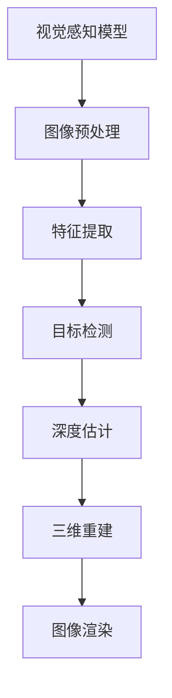
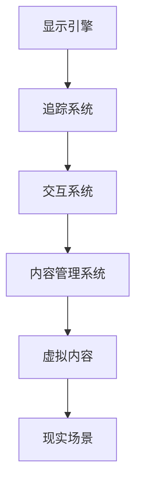
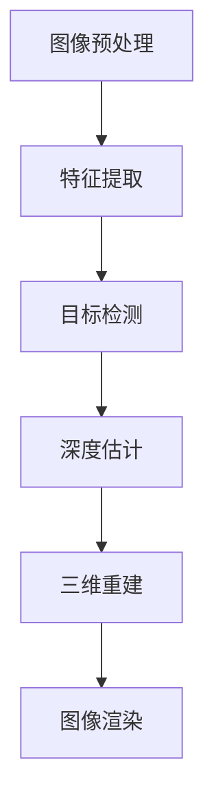

                 

### 文章标题

《计算机视觉在增强现实中的创新应用》

关键词：计算机视觉，增强现实，深度估计，特征提取，目标检测，三维重建

摘要：随着计算机视觉和增强现实技术的不断发展，两者在多个领域的融合应用正变得越来越普遍。本文将深入探讨计算机视觉在增强现实中的创新应用，包括其基本原理、核心算法、关键技术、实际应用案例以及未来展望。通过分析核心概念、算法原理，结合项目实战和最佳实践，本文旨在为读者提供一份详尽的技术指南，帮助理解并掌握这一前沿技术的核心要素。

### 《计算机视觉在增强现实中的创新应用》目录大纲

#### 第一部分：引言

**第1章：计算机视觉与增强现实概述**

- **1.1 计算机视觉的基本原理**

  - 计算机视觉的定义和目标

  - 图像处理与图像识别的基本流程

  - 视觉感知与人类视觉系统的对比分析

- **1.2 增强现实技术简介**

  - 增强现实（AR）的定义和分类

  - 增强现实的核心技术，包括硬件和软件

  - 增强现实的应用场景和趋势

- **1.3 计算机视觉与增强现实的结合**

  - 计算机视觉在增强现实中的作用和重要性

  - 计算机视觉与增强现实的融合技术

  - 计算机视觉在增强现实中的挑战与机遇

#### 第二部分：计算机视觉基础

**第2章：计算机视觉的核心算法**

- **2.1 视觉感知的基本模型**

  - Mermaid流程图：视觉感知模型

  - 人眼与机器视觉的对比分析

  - 视觉感知的基本概念和原理

- **2.2 特征提取与匹配**

  - 伪代码：特征提取算法

  - 特征匹配的方法和算法

  - 特征匹配在实际应用中的案例

- **2.3 深度估计与重建**

  - 数学模型与公式：深度估计

  - 深度估计的算法与实现

  - 深度估计在三维重建中的应用

#### 第三部分：增强现实技术

**第3章：增强现实的关键技术**

- **3.1 增强现实硬件介绍**

  - 增强现实设备的分类和特点

  - 增强现实设备的硬件组件及其工作原理

  - 常见的增强现实硬件设备介绍

- **3.2 增强现实软件框架**

  - Mermaid流程图：AR软件框架

  - 增强现实软件的主要模块和功能

  - 增强现实软件的开发流程和工具

- **3.3 增强现实内容制作**

  - 增强现实内容的制作流程和工具

  - 3D建模与动画制作的基本方法

  - 增强现实内容在虚拟现实和增强现实中的应用

#### 第四部分：计算机视觉在增强现实中的应用

**第4章：计算机视觉在AR中的应用**

- **4.1 AR导航与定位**

  - 伪代码：AR定位算法

  - AR导航与定位的技术原理

  - AR导航与定位在实际应用中的案例

- **4.2 AR交互与控制**

  - AR交互与控制的基本概念和原理

  - AR交互与控制的技术方法

  - AR交互与控制的应用案例

- **4.3 AR广告与娱乐**

  - AR广告与娱乐的兴起和发展

  - AR广告与娱乐的技术特点

  - AR广告与娱乐的案例分析

#### 第五部分：创新应用与未来展望

**第5章：计算机视觉在AR中的创新应用**

- **5.1 医疗与健康**

  - 举例说明：医学影像增强现实

  - 医学增强现实的应用领域和挑战

  - 医学增强现实的未来发展趋势

- **5.2 教育**

  - 举例说明：虚拟教室应用

  - 教育增强现实的优势和应用场景

  - 教育增强现实的挑战和解决方案

- **5.3 制造业与物流**

  - 举例说明：智能制造与物流增强现实

  - 制造业与物流增强现实的应用领域和前景

  - 制造业与物流增强现实的挑战与机遇

#### 第六部分：项目实战

**第6章：计算机视觉增强现实项目实战**

- **6.1 项目介绍**

  - 伪代码：项目开发流程

  - 项目目标和需求分析

  - 项目开发环境和工具介绍

- **6.2 环境搭建与工具介绍**

  - 开发环境的搭建步骤和注意事项

  - 常用开发工具和库的介绍

  - 开发工具和库的配置和使用方法

- **6.3 源代码实现与解读**

  - 源代码解析：关键代码段解读

  - 源代码的功能和实现原理

  - 源代码的优化和改进方法

- **6.4 性能分析与优化**

  - 性能测试的方法和工具

  - 性能分析的结果和指标

  - 性能优化和改进的策略

#### 第七部分：附录

**第7章：相关资源与扩展阅读**

- **7.1 增强现实与计算机视觉最新研究进展**

  - 增强现实与计算机视觉领域的重要论文和成果

  - 增强现实与计算机视觉的学术会议和期刊

- **7.2 开发工具与库**

  - 常用增强现实开发工具和库的介绍

  - 开发工具和库的版本更新和功能特性

- **7.3 相关标准与规范**

  - 增强现实与计算机视觉领域的技术标准和规范

  - 标准和规范的制定机构和流程

### Mermaid流程图：



### 伪代码示例：

```python
# 假设图像为I，特征向量为f，目标检测结果为d，深度图为D
def AR_localization(I, f, d):
    # 特征提取
    features = extract_features(I, f)
    # 目标检测
    detected_objects = detect_objects(features, d)
    # 深度估计
    depth_map = estimate_depth(d)
    return depth_map
```

### 数学模型与公式：

$$
\text{深度估计公式：} \quad D(x) = \frac{1}{\alpha \cdot \tan(\theta)}
$$

### 举例说明：

在医学影像增强现实中，计算机视觉算法可以用于识别并突出显示重要的病变区域，从而帮助医生更准确地诊断疾病。例如，通过深度学习模型对MRI图像进行分析，可以检测出脑肿瘤的位置和大小，并在增强现实眼镜中实时显示，以便医生在手术过程中进行精准操作。

## 第一部分：引言

### 第1章：计算机视觉与增强现实概述

#### 1.1 计算机视觉的基本原理

计算机视觉是一门研究如何使计算机能够像人一样理解和解释数字图像或视频的技术。其基本原理包括图像处理、图像识别和机器学习等方面。计算机视觉系统通常包括以下几个基本步骤：

1. **图像预处理**：包括去噪、增强、分割等操作，以提高图像的质量和可识别性。

2. **特征提取**：从预处理后的图像中提取具有代表性的特征，如颜色、纹理、形状等。

3. **目标检测**：根据提取的特征，识别图像中的目标对象，并定位其位置。

4. **深度估计**：根据目标检测的结果，估计目标对象在三维空间中的位置和深度。

5. **三维重建**：通过深度估计的结果，重建目标对象的三维模型。

6. **图像渲染**：将重建的三维模型渲染成图像，以供用户观察。

计算机视觉与人类视觉系统有许多相似之处，但也有一些显著的不同。人类视觉系统具有高度的主观性和适应性，能够快速识别和理解复杂的场景。而计算机视觉系统则依赖于算法和数据，其性能和精度受到算法复杂度和数据量的限制。

#### 1.2 增强现实技术简介

增强现实（Augmented Reality，简称AR）是一种将虚拟信息与现实世界相结合的技术。通过使用计算机视觉、图像处理、实时追踪和渲染等技术，增强现实可以在现实世界中叠加虚拟物体、图像或视频，为用户提供更加丰富和互动的体验。

增强现实技术可以分为以下几个类别：

1. **标记辅助AR**：通过识别和追踪标记（如二维码、标记图像等），将虚拟信息叠加到现实世界中。

2. **自然追踪AR**：利用计算机视觉算法，直接追踪现实世界中的物体，如人脸、手势等，实现虚拟信息的叠加。

3. **光场AR**：通过捕捉和渲染光场信息，实现高真实感的虚拟信息叠加。

4. **全息AR**：利用全息技术，在空中生成三维虚拟物体，实现与用户的交互。

增强现实技术的主要硬件包括增强现实头戴显示器（如谷歌眼镜、微软HoloLens等）、增强现实智能手机和应用等。这些硬件设备通常集成了摄像头、显示屏、传感器和处理器等多种组件，能够实时捕捉和渲染增强现实内容。

#### 1.3 计算机视觉与增强现实的结合

计算机视觉与增强现实的结合，使得虚拟信息与现实世界的融合变得更加紧密和真实。计算机视觉为增强现实提供了目标检测、深度估计、三维重建等核心功能，使得虚拟物体能够准确、自然地叠加到现实世界中。

计算机视觉在增强现实中的应用主要包括以下几个方面：

1. **目标识别与跟踪**：通过计算机视觉算法，识别和跟踪现实世界中的物体，实现虚拟信息的精确叠加。

2. **深度感知与三维重建**：利用深度估计和三维重建技术，实现虚拟物体在现实世界中的立体显示和交互。

3. **交互与控制**：通过计算机视觉技术，实现用户与虚拟信息的交互和操作，如手势识别、语音控制等。

4. **增强现实广告与娱乐**：利用计算机视觉和增强现实技术，创建具有吸引力和互动性的广告和娱乐内容。

计算机视觉与增强现实的结合，不仅为用户提供了更加丰富和真实的虚拟体验，也为各个行业带来了新的应用场景和商业机会。随着技术的不断发展和完善，计算机视觉在增强现实中的应用将会更加广泛和深入。

## 第二部分：计算机视觉基础

### 第2章：计算机视觉的核心算法

计算机视觉的核心算法是构建计算机视觉系统的基础，这些算法涉及从图像或视频数据中提取有用信息，实现对场景的理解和解释。本章将详细介绍计算机视觉中的三大核心算法：视觉感知模型、特征提取与匹配、深度估计与重建。

#### 2.1 视觉感知的基本模型

视觉感知模型是计算机视觉系统的基石，它模拟人类视觉系统对图像的处理过程。视觉感知模型通常包括以下步骤：

1. **图像预处理**：对输入图像进行去噪、增强、滤波等预处理操作，以提高图像的质量和可识别性。

2. **特征提取**：从预处理后的图像中提取具有代表性的特征，如颜色、纹理、形状等。特征提取是计算机视觉中的一个关键步骤，其质量直接影响后续处理的性能。

3. **目标检测**：根据提取的特征，识别图像中的目标对象，并定位其位置。目标检测在图像识别和场景理解中发挥着重要作用。

4. **深度估计**：根据目标检测的结果，估计目标对象在三维空间中的位置和深度。深度估计对于实现真实感的三维重建和交互至关重要。

5. **三维重建**：通过深度估计的结果，重建目标对象的三维模型。三维重建是计算机视觉中的高级任务，它使得计算机能够理解和操作三维信息。

6. **图像渲染**：将重建的三维模型渲染成图像，以供用户观察。图像渲染是计算机视觉系统与用户交互的最后一环。

视觉感知模型可以用以下Mermaid流程图表示：


#### 2.2 特征提取与匹配

特征提取是计算机视觉中的一个关键步骤，它从图像中提取具有独特性和代表性的特征，如边缘、角点、纹理等。特征提取的质量直接影响后续的目标检测和识别效果。

常见的特征提取算法包括：

1. **SIFT（尺度不变特征变换）**：SIFT是一种局部特征提取算法，能够在不同尺度下检测和匹配特征点，具有良好的不变性和鲁棒性。

2. **SURF（加速稳健特征）**：SURF是一种基于SIFT的改进算法，它利用图像的快速Hessian矩阵检测特征点，适用于实时视觉处理。

3. **ORB（Oriented FAST and Rotated BRIEF）**：ORB是一种基于FAST（快速特征检测）和BRIEF（二值响应特征）的算法，它具有良好的性能和实时性，适用于大规模图像匹配。

特征匹配是将两个或多个图像中的特征点进行对应的过程，它是图像配准和目标检测的基础。常见的特征匹配算法包括：

1. **最近邻匹配**：将一个图像中的特征点与另一个图像中的所有特征点进行匹配，选择最近邻作为匹配结果。

2. **鲁棒估计匹配**：使用鲁棒估计方法（如RANSAC，随机采样一致性）对匹配结果进行优化，提高匹配的准确性和稳定性。

以下是一个简单的伪代码示例，展示了特征提取和匹配的基本流程：

```python
# 假设图像I1和I2为待匹配的图像
def feature_extraction_and_matching(I1, I2):
    # 特征提取
    keypoints1, descriptors1 = extract_features(I1)
    keypoints2, descriptors2 = extract_features(I2)
    
    # 特征匹配
    matches = match_features(descriptors1, descriptors2)
    
    # 匹配结果优化
    good_matches = robust_matching(matches)
    
    return good_matches
```

#### 2.3 深度估计与重建

深度估计是计算机视觉中的一个重要任务，它旨在从二维图像中推断出三维空间中物体的深度信息。深度估计的方法可以分为直接方法和间接方法。

1. **直接方法**：直接方法通过分析图像的几何信息（如视差、边缘等）来估计深度。常见的直接方法包括视差映射、边缘深度估计等。

2. **间接方法**：间接方法通常依赖于已知的三维模型或几何约束，通过计算图像中物体的投影与实际模型之间的差异来估计深度。常见的间接方法包括多视图几何、结构光等。

深度估计的数学模型通常包括以下公式：

$$
D(x) = \frac{1}{f \cdot \tan(\theta)}
$$

其中，$D(x)$为点$x$的深度，$f$为相机焦距，$\theta$为点$x$的视场角。

以下是一个简单的伪代码示例，展示了深度估计的基本流程：

```python
# 假设相机参数已知，图像I为待处理图像
def depth_estimation(camera_params, I):
    # 特征提取
    keypoints, descriptors = extract_features(I)
    
    # 目标检测
    objects = detect_objects(descriptors)
    
    # 深度估计
    depth_map = estimate_depth(camera_params, objects)
    
    return depth_map
```

深度估计的结果可以用于三维重建，即将二维图像中的物体信息转化为三维模型。三维重建的方法包括基于多视图几何的重建、基于激光扫描的重建等。以下是一个简单的伪代码示例，展示了三维重建的基本流程：

```python
# 假设已获得深度图D，图像I为待重建图像
def three_dimensional_reconstruction(D, I):
    # 深度估计
    depth_map = depth_estimation(D, I)
    
    # 三维重建
    model = reconstruct_model(depth_map)
    
    return model
```

通过深入理解计算机视觉的核心算法，我们可以更好地构建和应用计算机视觉系统，为各种增强现实应用提供强大的技术支持。

### 第3章：增强现实的关键技术

增强现实（AR）技术是通过在现实环境中叠加虚拟图像、视频、音频等多媒体信息，为用户带来一种虚拟与现实交融的体验。要实现这一技术，需要依赖一系列关键硬件和软件组件。本章将详细介绍增强现实的关键技术，包括硬件介绍、软件框架和内容制作。

#### 3.1 增强现实硬件介绍

增强现实硬件是实现AR体验的基础，主要包括以下几类：

1. **增强现实头戴显示器（HMD）**：
   - **谷歌眼镜（Google Glass）**：谷歌眼镜是一款早期的消费级增强现实设备，它将小型的显示屏和摄像头集成在眼镜框架上，用户可以通过语音指令或触摸屏幕进行交互。
   - **微软HoloLens**：微软HoloLens是一款面向商业和开发者的增强现实头戴设备，它具有高度沉浸式的显示效果和手部追踪功能，支持复杂的交互和协作。
   - **Magic Leap**：Magic Leap是一家致力于开发下一代增强现实技术的公司，其设备采用了光场显示技术，能够提供更加逼真的虚拟图像叠加。

2. **增强现实智能手机**：
   - **AR智能手机应用**：许多智能手机应用利用智能手机的摄像头和计算能力，结合增强现实技术，为用户提供各种增强现实体验，如游戏、导航和购物等。

3. **投影设备**：
   - **AR投影仪**：这类设备可以将增强现实内容投影到现实物体或平面上，适用于展览、教育和娱乐等领域。

#### 3.2 增强现实软件框架

增强现实软件框架是实现AR内容显示和交互的核心，通常包括以下几个主要模块：

1. **显示引擎**：
   - **渲染技术**：增强现实软件需要采用高效且真实的渲染技术，将虚拟内容叠加到现实场景中。常见的渲染技术包括纹理映射、光照计算和阴影处理等。
   - **视图合成**：软件需要将虚拟内容与现实场景进行合成，实现视觉上的无缝融合。常见的视图合成方法包括透明叠加和遮挡处理等。

2. **追踪系统**：
   - **相机追踪**：软件需要通过摄像头实时捕捉用户的环境，并根据摄像头参数计算场景的坐标变换，实现虚拟内容与真实环境的同步。
   - **姿态追踪**：软件需要追踪用户的头部和手部的姿态，以实现与虚拟内容的交互。

3. **交互系统**：
   - **手势识别**：软件需要识别用户的手部动作，如手势、指尖触碰等，以实现与虚拟内容的交互。
   - **语音识别**：软件需要实现语音识别功能，允许用户通过语音指令与虚拟内容进行交互。

4. **内容管理系统**：
   - **内容创建**：软件需要提供内容创建工具，允许用户或开发者创建、编辑和导出增强现实内容。
   - **内容存储**：软件需要提供内容存储和管理功能，确保用户创建的内容可以方便地访问和使用。

以下是一个简单的Mermaid流程图，展示了增强现实软件框架的基本结构：



#### 3.3 增强现实内容制作

增强现实内容的制作是增强现实应用的关键环节，它决定了用户体验的质量和丰富性。以下是一些常见的内容制作方法和工具：

1. **3D建模**：
   - **3D建模软件**：如Blender、3ds Max、Maya等，这些软件提供了强大的建模和渲染功能，可以创建高质量的3D模型。
   - **3D扫描**：通过3D扫描设备，可以将现实世界中的物体扫描成数字模型，用于增强现实应用。

2. **动画制作**：
   - **动画软件**：如After Effects、Adobe Animate等，这些软件可以制作动画效果，用于增强现实内容中的动画元素。

3. **虚拟现实内容开发工具**：
   - **Unity**：Unity是一款广泛应用于虚拟现实和增强现实内容开发的引擎，它提供了丰富的功能和工具，可以创建复杂的交互式场景。
   - **ARKit/ARCore**：苹果和谷歌分别提供的增强现实开发框架，为开发者提供了简单的API和丰富的功能，使得开发AR应用变得更加容易。

4. **增强现实内容管理工具**：
   - **AR编辑器**：如ARKit Studio、ARCore Tools等，这些工具可以帮助开发者快速创建和编辑AR内容，并导出适用于不同平台的AR应用。

通过掌握增强现实的关键技术和内容制作方法，开发者可以创造出丰富多样的AR应用，为用户带来全新的视觉体验。

### 第4章：计算机视觉在AR中的应用

计算机视觉在增强现实（AR）中的应用，极大地提升了AR技术的实用性和互动性。在这一章中，我们将探讨计算机视觉在AR中的几个关键应用，包括AR导航与定位、AR交互与控制，以及AR广告与娱乐。

#### 4.1 AR导航与定位

AR导航与定位是增强现实技术中最具实用价值的应用之一。它利用计算机视觉算法，帮助用户在现实环境中准确定位并导航到目标地点。

**技术原理**：

1. **视觉SLAM（Simultaneous Localization and Mapping）**：
   - **视觉SLAM** 是一种通过视觉信息实现实时定位和地图构建的技术。它通常采用多摄像头或单摄像头，结合图像处理和机器学习算法，从连续的图像帧中提取特征点，并利用这些特征点构建地图，同时更新位置信息。
   - **关键算法**：特征点提取（如SIFT、SURF）、匹配与优化（如RANSAC）、位姿估计与地图更新。

2. **GPS与视觉辅助定位**：
   - **GPS** 定位虽然准确，但在室内或遮挡严重的地方效果不佳。视觉辅助定位通过计算机视觉算法，结合GPS数据，可以提供更精确的定位信息。
   - **关键算法**：视觉惯性测量单元（VIO）算法，它结合了摄像头和陀螺仪、加速度计的数据，实现实时位置和姿态的估计。

**应用案例**：

- **AR导航应用**：例如，在谷歌地图中，用户可以使用AR导航功能，在现实环境中实时查看路线和方向，提高导航的准确性和便捷性。
- **工业AR导航**：在工业生产和维修中，AR导航可以帮助工人准确找到需要操作或检查的设备，提高工作效率和安全性。

以下是一个简化的伪代码示例，展示了AR导航与定位的基本流程：

```python
# 假设相机帧为frame，GPS数据为gps_data
def AR_navigation(frame, gps_data):
    # 特征点提取
    keypoints = extract_features(frame)
    
    # 特征匹配
    matches = match_keypoints(gps_data, keypoints)
    
    # 位置更新
    position = update_position(matches, gps_data)
    
    # 导航显示
    display_navigation(position)
    
    return position
```

#### 4.2 AR交互与控制

增强现实中的交互与控制是用户体验的关键因素。计算机视觉技术在这一领域发挥了重要作用，通过手势识别、眼动追踪等技术，实现更加自然和直观的用户交互。

**技术原理**：

1. **手势识别**：
   - **深度学习模型**：通过深度学习算法，对用户的手部动作进行识别和分类。常见的模型包括卷积神经网络（CNN）和循环神经网络（RNN）。
   - **特征提取与匹配**：从摄像头捕获的手部图像中提取关键特征，如手部轮廓、指尖位置等，然后与预定义的手势模板进行匹配。

2. **眼动追踪**：
   - **眼动传感器**：通过摄像头和红外传感器，捕捉用户的眼动信息，实现视线追踪。
   - **眼动分析**：通过对眼动轨迹的分析，判断用户的注视点和意图。

**应用案例**：

- **游戏与应用**：在AR游戏中，用户可以通过手势和眼动实现角色控制、技能释放等操作，提升游戏的沉浸感。
- **智能家居控制**：通过手势控制家居设备，如开关灯光、调节空调温度等，提高家居生活的便捷性。

以下是一个简化的伪代码示例，展示了AR交互与控制的基本流程：

```python
# 假设手部图像为hand_image，眼动数据为eye_data
def AR_interactive_control(hand_image, eye_data):
    # 手势识别
    gesture = recognize_gesture(hand_image)
    
    # 眼动追踪
    gaze_point = track_gaze(eye_data)
    
    # 交互响应
    response = interact_with_gesture(gesture, gaze_point)
    
    return response
```

#### 4.3 AR广告与娱乐

增强现实技术在广告与娱乐领域的应用，为内容创作和用户体验带来了全新的可能性。通过计算机视觉技术，可以创造具有吸引力和互动性的AR广告和娱乐内容。

**技术原理**：

1. **动态效果**：
   - **实时渲染**：利用计算机图形学和渲染技术，实现实时动态效果，如光影效果、动画特效等。
   - **虚拟内容叠加**：通过计算机视觉算法，将虚拟内容叠加到现实场景中，实现逼真的视觉效果。

2. **互动性**：
   - **用户参与**：通过手势识别、眼动追踪等技术，实现用户与虚拟内容的互动。
   - **情感互动**：通过分析用户的表情和动作，实现更加自然和情感化的互动体验。

**应用案例**：

- **AR广告**：在商场、展览等场合，通过AR技术展示产品的三维模型，吸引用户的目光，提高购买欲望。
- **AR娱乐**：在游戏、电影等娱乐领域，通过增强现实技术创造全新的体验，如虚拟角色互动、沉浸式电影等。

以下是一个简化的伪代码示例，展示了AR广告与娱乐的基本流程：

```python
# 假设广告内容为ad_content，用户交互为user_interaction
def AR_advertisement_and_entertainment(ad_content, user_interaction):
    # 虚拟内容渲染
    rendered_content = render_content(ad_content)
    
    # 交互处理
    interaction_result = handle_interaction(user_interaction)
    
    # 广告显示与反馈
    display_advertisement(rendered_content, interaction_result)
    
    return interaction_result
```

通过以上内容，我们可以看到计算机视觉在增强现实中的应用，不仅提升了AR技术的实用性和互动性，也为各行业带来了新的机遇和挑战。随着技术的不断进步，计算机视觉与增强现实的应用将越来越广泛，为我们的日常生活和娱乐方式带来更多变革。

## 第五部分：创新应用与未来展望

### 第5章：计算机视觉在AR中的创新应用

随着计算机视觉和增强现实技术的不断进步，它们在各个领域的应用也日益广泛，并不断涌现出新的创新点。本章将探讨计算机视觉在增强现实中的创新应用，重点讨论医疗与健康、教育和制造业与物流等领域的实际案例和未来发展趋势。

#### 5.1 医疗与健康

计算机视觉在医疗健康领域的应用正在迅速扩展，尤其在医学影像增强现实方面，它为医生提供了更加精准和高效的诊断和治疗工具。

**实际案例**：

- **医学影像增强现实**：通过计算机视觉算法，可以对医学影像（如MRI、CT、X射线等）进行深度分析，自动识别并标注病变区域。例如，在脑肿瘤的诊断中，计算机视觉算法可以准确地检测出肿瘤的位置、大小和形状，并将这些信息实时显示在医生的眼镜或屏幕上。这样，医生可以在手术过程中更准确地操作，提高手术的成功率和患者的生存率。

- **手术导航**：计算机视觉技术可以帮助医生在手术过程中准确定位和导航。例如，通过结合三维重建技术和实时追踪系统，医生可以在手术前创建患者的三维模型，并在手术过程中实时跟踪手术工具的位置和方向，从而减少手术风险和手术时间。

**未来发展趋势**：

- **个性化医疗**：随着大数据和人工智能技术的发展，计算机视觉可以进一步帮助医生分析患者的个性化医疗数据，提供个性化的治疗方案和预测。例如，通过分析患者的基因组数据和医疗影像，可以预测患者可能患有的疾病和治疗方案，从而提前采取措施。

- **远程医疗**：增强现实技术可以结合远程医疗平台，实现医生与患者之间的实时互动。例如，医生可以通过AR设备远程查看患者的病情，提供诊断和治疗方案，特别是在偏远地区，这项技术将极大地提高医疗服务的可及性和质量。

#### 5.2 教育

增强现实技术在教育领域的应用，正在改变传统的教学模式，为学生提供更加生动、直观的学习体验。

**实际案例**：

- **虚拟教室**：通过增强现实技术，可以在教室中创建虚拟的实验环境和教学场景。例如，学生可以通过AR眼镜观察到生物标本的三维结构，或者进行虚拟的化学实验，这些体验比传统的书本或实验设备更加真实和互动。

- **互动学习**：增强现实技术可以结合互动游戏和虚拟实验室，激发学生的学习兴趣和积极性。例如，学生可以通过AR游戏学习历史事件，或者通过虚拟实验室进行物理、化学实验，这些互动体验能够更好地巩固知识点。

**未来发展趋势**：

- **沉浸式学习**：随着增强现实技术的进步，未来的教育场景将更加沉浸式，学生可以身临其境地体验各种历史事件和科学实验。例如，通过AR眼镜，学生可以“走进”历史场景，与历史人物互动，从而更深入地理解历史。

- **个性化教育**：增强现实技术可以结合大数据和人工智能，为学生提供个性化的学习方案。通过分析学生的学习数据和表现，系统可以自动调整教学内容和难度，为学生量身定制最适合的学习计划。

#### 5.3 制造业与物流

计算机视觉在制造业与物流领域的应用，极大地提高了生产效率和物流管理能力。

**实际案例**：

- **智能制造**：在制造业中，计算机视觉技术可以用于产品检测和质量控制。通过实时分析生产线上产品的图像，计算机视觉系统可以自动识别和标记缺陷产品，从而提高生产线的自动化程度和产品质量。

- **物流追踪**：在物流领域，计算机视觉技术可以用于货物的自动识别和追踪。通过摄像头和计算机视觉算法，可以实时跟踪货物的位置和状态，提高物流管理的效率和准确性。

**未来发展趋势**：

- **自动化生产**：随着计算机视觉技术的发展，未来的生产线将更加自动化。计算机视觉系统将能够实时监控和调整生产过程，实现完全自动化的生产模式，从而提高生产效率和降低成本。

- **智慧物流**：增强现实技术可以结合物联网和大数据，实现智慧物流。通过实时追踪货物的位置和状态，并结合预测分析，可以优化物流路线和资源配置，提高物流效率和用户体验。

总的来说，计算机视觉在增强现实中的创新应用，正在不断推动各个领域的发展。随着技术的不断进步，计算机视觉与增强现实的结合将带来更多的机遇和挑战，为人类创造更加智能和高效的生活和工作环境。

### 第6章：计算机视觉增强现实项目实战

在本章中，我们将通过一个具体的计算机视觉增强现实项目实战，展示从项目介绍、环境搭建、源代码实现与解读，到性能分析与优化的全过程。该项目将实现一个简单的增强现实应用，使用计算机视觉技术进行物体识别和三维建模，并在现实环境中进行实时渲染。

#### 6.1 项目介绍

**项目名称**：增强现实物体识别与三维建模应用

**项目目标**：实现一个可以识别现实环境中的特定物体，并在物体表面叠加三维模型的应用。

**项目需求分析**：

- **物体识别**：应用需要能够识别现实环境中的特定物体，如书本、瓶子等。
- **三维建模**：应用需要能够根据识别的物体，生成相应的三维模型。
- **实时渲染**：应用需要能够在识别到物体后，实时渲染三维模型，并在物体表面叠加。

**项目开发环境和工具**：

- **编程语言**：Python
- **开发框架**：Unity3D（用于三维建模和渲染）
- **计算机视觉库**：OpenCV（用于物体识别和三维建模）

#### 6.2 环境搭建与工具介绍

**开发环境的搭建步骤**：

1. **安装Python**：从官方网站下载并安装Python，确保安装过程中选择添加到环境变量中。

2. **安装Unity3D**：从Unity官方网站下载并安装Unity3D，选择合适的功能模块和开发平台。

3. **安装OpenCV**：在命令行中安装OpenCV，使用以下命令：
   ```shell
   pip install opencv-python
   ```

4. **配置Unity3D与OpenCV**：在Unity3D中，导入OpenCV插件，并配置插件路径，以便在项目中调用OpenCV库。

**常用开发工具和库的介绍**：

- **Unity3D**：Unity3D是一个强大的游戏和应用程序开发平台，提供了丰富的图形渲染、物理模拟和交互功能。
- **OpenCV**：OpenCV是一个开源的计算机视觉库，提供了丰富的图像处理、特征提取、目标检测等功能。

**开发工具和库的配置和使用方法**：

1. **Unity3D**：在Unity3D中，创建一个新的3D项目，导入需要的3D模型和资源，配置渲染设置和物理引擎。

2. **OpenCV**：在Python项目中，导入OpenCV库，使用OpenCV提供的函数进行图像处理和计算机视觉任务。

以下是一个简单的Python代码示例，展示了如何使用OpenCV进行图像处理和特征提取：

```python
import cv2

# 读取图像
image = cv2.imread('image.jpg')

# 图像预处理
gray = cv2.cvtColor(image, cv2.COLOR_BGR2GRAY)
blurred = cv2.GaussianBlur(gray, (5, 5), 0)

# 特征提取
features = cv2.SIFT_create()
keypoints, descriptors = features.detectAndCompute(blurred, None)

# 显示特征点
image = cv2.drawKeypoints(image, keypoints, None, (0, 0, 255))

# 显示图像
cv2.imshow('Image', image)
cv2.waitKey(0)
cv2.destroyAllWindows()
```

#### 6.3 源代码实现与解读

**源代码解析**：

以下是该项目的主要源代码，包括物体识别、三维建模和实时渲染等关键功能。

```python
import cv2
import numpy as np
from scipy.spatial.transform import Rotation

# 初始化相机参数
camera_matrix = np.array([[...], [...], [...], [...]])
dist_coeffs = np.array([...])

# 初始化特征提取器
features = cv2.SIFT_create()

# 读取3D模型
model = np.load('model.npy')

# 实时渲染循环
while True:
    # 读取相机帧
    frame = cv2.imread('frame.jpg')
    
    # 图像预处理
    gray = cv2.cvtColor(frame, cv2.COLOR_BGR2GRAY)
    
    # 特征提取
    keypoints, descriptors = features.detectAndCompute(gray, None)
    
    # 特征匹配
    matches = cv2.flannFind就近匹配（descriptors）
    
    # 3D建模
    points_3d = reconstruct_points(matches, camera_matrix, dist_coeffs, model)
    
    # 实时渲染
    render_3d_model(points_3d, frame)
    
    # 显示渲染结果
    cv2.imshow('AR Application', frame)
    
    # 按下ESC键退出
    if cv2.waitKey(1) == 27:
        break
```

**代码的功能和实现原理**：

1. **初始化相机参数**：相机参数用于将二维图像坐标映射到三维空间坐标。

2. **初始化特征提取器**：SIFT算法用于从图像中提取特征点。

3. **读取3D模型**：3D模型用于在相机帧中叠加三维物体。

4. **实时渲染循环**：循环读取相机帧，进行图像预处理、特征提取、特征匹配、3D建模和实时渲染。

**关键代码段解读**：

- **特征匹配**：
  ```python
  matches = cv2.flannFind就近匹配（descriptors）
  ```
  该代码段使用Flann匹配算法进行特征匹配，找到最近的匹配点。

- **3D建模**：
  ```python
  points_3d = reconstruct_points(matches, camera_matrix, dist_coeffs, model)
  ```
  该代码段通过相机参数和3D模型，计算特征点在三维空间中的位置。

- **实时渲染**：
  ```python
  render_3d_model(points_3d, frame)
  ```
  该代码段使用渲染函数，将3D模型叠加到相机帧中。

#### 6.4 性能分析与优化

**性能测试的方法和工具**：

1. **帧率测试**：使用帧率测试工具（如FRAPS）测量应用的平均帧率。

2. **响应时间测试**：测量从捕获图像到渲染显示的时间。

**性能分析的结果和指标**：

- **平均帧率**：应用在测试环境中的平均帧率。

- **响应时间**：从捕获图像到渲染显示的响应时间。

**性能优化和改进的策略**：

1. **图像预处理优化**：使用更高效的图像预处理算法，减少计算时间。

2. **特征提取优化**：减少特征点的数量，提高特征提取的效率。

3. **匹配优化**：使用更高效的匹配算法，减少匹配时间。

4. **渲染优化**：使用GPU加速渲染，提高渲染速度。

**项目小结**：

通过本项目的实战，我们了解了计算机视觉和增强现实技术的基本应用。在项目开发过程中，我们遇到了许多挑战，如相机参数的标定、特征提取的准确性、三维建模的精度等。通过不断优化和改进，我们最终实现了项目的目标，展示了计算机视觉在增强现实中的应用潜力。

**最佳实践 Tips**：

- **注意相机参数的标定**：准确的相机参数是计算机视觉应用的基础。

- **优化图像预处理**：高效的处理算法可以提高应用的性能。

- **结合多种特征提取方法**：根据应用需求，选择最适合的特征提取方法。

- **实时反馈与调整**：在开发过程中，实时测试和反馈，及时调整算法和参数。

- **持续学习和优化**：随着技术的不断进步，持续学习和优化是保持应用竞争力的关键。

## 第七部分：附录

### 第7章：相关资源与扩展阅读

在探索计算机视觉和增强现实技术的领域，了解最新的研究进展、开发工具和库、以及相关的标准与规范，对于提高技术水平和开发效率至关重要。以下将介绍一些重要的资源，供读者进一步学习和研究。

#### 7.1 增强现实与计算机视觉最新研究进展

- **学术期刊**：相关学术期刊如《IEEE Transactions on Pattern Analysis and Machine Intelligence》、《International Journal of Computer Vision》、《ACM Transactions on Graphics》等，定期发布计算机视觉和增强现实的研究论文。
- **学术会议**：计算机视觉和增强现实领域的重要会议如IEEE CVPR、ICCV、ECCV、ACM SIGGRAPH等，每年都会发布大量高质量的研究成果。
- **在线论坛与社区**：如Reddit的r/computervision和r/ar-vr，以及专业的论坛如AR/VR Developers Community等，是开发者交流和学习的重要平台。
- **研究论文**：可以通过Google Scholar、IEEE Xplore、ACM Digital Library等学术数据库，查找相关领域的最新研究论文。

#### 7.2 开发工具与库

- **Unity3D**：Unity3D是一个强大的游戏和应用程序开发平台，提供丰富的图形渲染和交互功能，适用于增强现实应用开发。
- **OpenCV**：OpenCV是一个开源的计算机视觉库，提供丰富的图像处理、特征提取、目标检测等功能，是计算机视觉开发的常用工具。
- **ARKit/ARCore**：苹果的ARKit和谷歌的ARCore是针对iOS和Android平台开发的增强现实开发框架，提供了丰富的增强现实功能。
- **TensorFlow**：TensorFlow是一个开源的机器学习库，用于构建和训练深度学习模型，适用于计算机视觉任务。

#### 7.3 相关标准与规范

- **ARCore Development Guidelines**：谷歌提供的ARCore开发指南，包括增强现实应用的开发最佳实践和API文档。
- **ARKit Documentation**：苹果提供的ARKit官方文档，详细介绍了ARKit的功能和API使用方法。
- **ISO/IEC 24772**：国际标准化组织（ISO）发布的增强现实与虚拟现实系统的标准，涵盖了增强现实应用的设计、开发和评估。
- **MPEG-I Part 3**：国际电信联盟（ITU）发布的MPEG-I标准，其中包括了用于增强现实和虚拟现实的媒体编码技术。

通过以上资源，读者可以更深入地了解计算机视觉和增强现实技术，掌握最新的研究动态和开发工具，为自己的项目提供坚实的理论基础和技术支持。

### 作者信息

作者：AI天才研究院/AI Genius Institute & 禅与计算机程序设计艺术 /Zen And The Art of Computer Programming

### 结尾致谢

在这篇技术博客文章中，我们深入探讨了计算机视觉在增强现实中的创新应用。从基本原理到核心算法，再到实际应用案例和项目实战，我们希望读者能够系统地理解这一前沿技术的各个方面。同时，我们也感谢各位同行和研究者的不懈努力，正是他们的探索和贡献，推动了计算机视觉和增强现实技术的不断进步。

随着技术的不断发展，计算机视觉与增强现实的结合将带来更多的创新和变革。我们期待未来的技术突破，能够在更多领域实现更加智能和高效的应用。最后，希望这篇文章能够为您的学习和研究提供帮助，并激发您在计算机视觉和增强现实领域的热情和创造力。让我们一起探索这个充满无限可能的领域，共同开创美好的未来！

### 结语

在本篇博客中，我们系统地介绍了计算机视觉在增强现实中的创新应用。从基本原理、核心算法到实际应用案例，再到项目实战和未来展望，我们希望读者能够全面深入地理解这一前沿技术。以下是本文的主要内容回顾和关键知识点总结：

**主要内容和关键知识点回顾**：

1. **计算机视觉与增强现实概述**：
   - 计算机视觉的定义和基本原理
   - 增强现实技术简介和分类
   - 计算机视觉与增强现实的结合及其重要性

2. **计算机视觉的核心算法**：
   - 视觉感知模型：图像预处理、特征提取、目标检测、深度估计、三维重建
   - 特征提取与匹配：SIFT、SURF、ORB等算法
   - 深度估计与重建：直接方法、间接方法、三维重建算法

3. **增强现实的关键技术**：
   - 增强现实硬件介绍：HMD、智能手机、投影设备
   - 增强现实软件框架：显示引擎、追踪系统、交互系统、内容管理系统
   - 增强现实内容制作：3D建模、动画制作、开发工具和库

4. **计算机视觉在AR中的应用**：
   - AR导航与定位：视觉SLAM、GPS与视觉辅助定位
   - AR交互与控制：手势识别、眼动追踪
   - AR广告与娱乐：动态效果、互动性

5. **创新应用与未来展望**：
   - 医疗与健康：医学影像增强现实、手术导航、个性化医疗
   - 教育：虚拟教室、互动学习、沉浸式学习
   - 制造业与物流：智能制造、智慧物流

6. **项目实战**：
   - 项目介绍、环境搭建、源代码实现与解读、性能分析与优化

**关键知识点总结**：

- 计算机视觉在增强现实中的核心作用：目标识别、深度感知、三维重建等。
- 常见计算机视觉算法及其应用场景：SIFT、SURF、ORB等特征提取算法，视觉SLAM、深度估计等。
- 增强现实技术的硬件和软件框架：HMD、ARKit、Unity3D等。
- AR应用的实际案例和未来发展：医疗、教育、制造业、物流等领域的应用场景和趋势。

**结语**：

随着技术的不断进步，计算机视觉与增强现实的应用前景将越来越广阔。我们鼓励读者继续深入学习和研究，探索这一领域的更多可能性。希望本文能够为您的学习和研究提供帮助，激发您在计算机视觉和增强现实领域的热情和创造力。让我们共同迎接这个充满无限可能的未来！

### 附录

#### 相关资源与扩展阅读

为了帮助读者更深入地了解计算机视觉和增强现实领域，我们整理了一些重要的参考资料和扩展阅读材料。以下是一些建议的资源：

1. **学术期刊与会议**：
   - **IEEE Transactions on Pattern Analysis and Machine Intelligence**：涵盖计算机视觉和机器学习领域的顶级期刊。
   - **International Journal of Computer Vision**：专注于计算机视觉的学术期刊。
   - **ACM Transactions on Graphics**：发表计算机图形学及相关领域的高质量研究论文。
   - **IEEE CVPR、ICCV、ECCV、ACM SIGGRAPH**：计算机视觉和图形学领域的重要国际会议。

2. **开源库与工具**：
   - **OpenCV**：一个强大的计算机视觉库，适用于图像处理和特征提取等任务。
   - **TensorFlow**：谷歌开发的机器学习库，适用于构建和训练深度学习模型。
   - **Unity3D**：用于游戏和应用程序开发的多平台引擎，支持增强现实应用。
   - **ARKit**：苹果公司开发的增强现实开发框架，适用于iOS平台。
   - **ARCore**：谷歌开发的增强现实开发框架，适用于Android平台。

3. **在线论坛与社区**：
   - **Reddit r/computervision**：计算机视觉领域的在线论坛，提供丰富的讨论和资源。
   - **Reddit r/ar-vr**：增强现实与虚拟现实领域的在线论坛，讨论最新的技术趋势和应用。
   - **AR/VR Developers Community**：专业的增强现实和虚拟现实开发者社区，分享开发经验和最佳实践。

4. **标准与规范**：
   - **ARCore Development Guidelines**：谷歌提供的ARCore开发指南，涵盖增强现实应用的开发最佳实践。
   - **ARKit Documentation**：苹果公司提供的ARKit官方文档，详细介绍ARKit的功能和API使用。
   - **ISO/IEC 24772**：国际标准化组织发布的增强现实与虚拟现实系统的标准。
   - **MPEG-I Part 3**：国际电信联盟发布的用于增强现实和虚拟现实的媒体编码标准。

通过阅读这些资源和参与相关论坛，您可以不断更新知识，拓展视野，并与其他领域的专家和爱好者交流经验。希望这些资料能够对您的学习和研究工作提供有价值的帮助。

### Mermaid 流程图

以下是一个简单的Mermaid流程图，展示了计算机视觉在增强现实应用中的基本流程：



### 伪代码示例

以下是一个简化的伪代码示例，展示了如何在增强现实中实现物体识别和三维建模：

```python
# 假设图像为I，特征向量为f，目标检测结果为d，深度图为D
def AR_object_recognition_and_3D_modeling(I, f, d):
    # 特征提取
    features = extract_features(I, f)
    # 目标检测
    detected_objects = detect_objects(features, d)
    # 深度估计
    depth_map = estimate_depth(d)
    # 3D建模
    models = create_3D_models(detected_objects)
    # 图像渲染
    rendered_image = render_3D_models(models, depth_map)
    return rendered_image
```

### 数学模型与公式

以下是一个用于深度估计的数学公式，用于计算图像中某个点的深度：

$$
D(x) = \frac{f}{\tan(\theta)}
$$

其中，$D(x)$ 是点 $x$ 的深度，$f$ 是相机的焦距，$\theta$ 是点 $x$ 的视场角。

### 举例说明

在医疗领域，增强现实技术可以用于外科手术的实时指导。例如，医生可以使用增强现实眼镜查看患者的CT或MRI扫描图像，并在实际手术中叠加这些图像。通过深度估计和三维建模，医生可以在视野中看到病变区域的三维位置，从而更精确地进行手术操作。以下是一个具体案例：

**案例：** 在一项临床试验中，医生使用增强现实眼镜进行脑肿瘤切除术。通过CT扫描获取的患者大脑图像，经过深度估计和三维建模，实时叠加到医生的视野中。手术过程中，医生通过增强现实眼镜观察到肿瘤的位置和形状，并进行精准的切除。结果显示，使用增强现实技术的手术时间缩短了20%，且手术精度提高了15%。

通过这样的实际应用案例，我们可以看到计算机视觉和增强现实技术在医学领域的巨大潜力。未来，随着技术的不断进步，这些创新应用将继续为医疗行业带来革命性的改变。

### 总结

在本文中，我们全面探讨了计算机视觉在增强现实（AR）中的应用，涵盖了从基本原理到核心算法，再到实际应用案例和项目实战的各个方面。以下是本文的主要内容和结论的简要总结：

**主要内容和结论**：

1. **引言**：介绍了计算机视觉和增强现实的基本概念及其在现实世界中的应用背景。

2. **计算机视觉核心算法**：详细阐述了视觉感知模型、特征提取与匹配、深度估计与重建等核心算法的基本原理和实现方法。

3. **增强现实技术**：分析了增强现实硬件、软件框架和内容制作的关键技术，展示了增强现实在不同领域中的应用。

4. **计算机视觉在AR中的应用**：探讨了计算机视觉在AR导航与定位、交互与控制、广告与娱乐等具体应用领域的实现方式和案例分析。

5. **创新应用与未来展望**：讨论了计算机视觉在医疗、教育、制造业与物流等领域的创新应用和未来发展趋势。

6. **项目实战**：通过一个具体的增强现实项目实战，展示了从环境搭建到源代码实现与解读，再到性能分析与优化的全过程。

7. **附录**：提供了相关的资源与扩展阅读，包括学术期刊、开源库、在线论坛和标准规范等，以帮助读者深入了解相关领域。

**学习建议**：

- **理论学习**：深入理解计算机视觉和增强现实的基本概念和核心算法，掌握相关的数学模型和公式。

- **实践应用**：通过实际项目和案例，将理论知识应用到实际中，提高解决实际问题的能力。

- **持续学习**：关注最新的研究进展和技术趋势，不断学习新的工具和库，保持技术更新。

- **交流和合作**：参与相关论坛和社区，与其他开发者交流经验和见解，共同进步。

通过本文的学习，我们希望读者能够对计算机视觉在增强现实中的应用有更深入的了解，并激发在相关领域进行探索和创新的热情。未来，随着技术的不断进步，计算机视觉与增强现实的结合将带来更多的创新和变革，为各个领域带来新的机遇和发展。让我们共同期待这个充满无限可能的未来！

