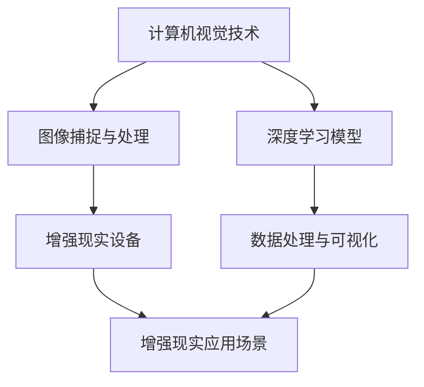
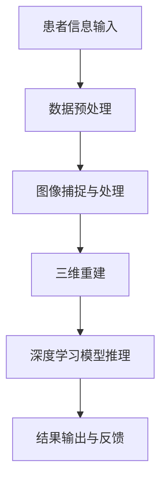

                 

### 文章标题：计算机视觉在增强现实手术辅助中的实践

#### 关键词：计算机视觉、增强现实、手术辅助、实时图像处理、三维重建、深度学习模型

> 摘要：本文深入探讨计算机视觉技术在增强现实（AR）手术辅助中的应用，通过解析基本概念、应用原理、核心算法，以及实际案例，全面揭示这一前沿技术的实践价值与未来发展趋势。

---

### 第一部分：计算机视觉在增强现实手术辅助中的基本概念

#### 第1章：计算机视觉与增强现实的基本概念

##### 1.1 计算机视觉的起源与定义

**计算机视觉**是指使计算机能够像人眼一样感知和理解图像的技术。它起源于20世纪60年代，随着计算机性能的不断提升和图像处理算法的进步，计算机视觉逐渐成为人工智能领域的一个重要分支。

- **定义**：计算机视觉是研究如何让计算机从图像或视频中自动获取信息，并进行处理和理解的一门科学。

- **发展历史**：计算机视觉经历了从早期基于规则的方法，到基于特征的识别方法，再到现代基于深度学习的识别方法的发展历程。

- **关键术语解释**：
  - **图像处理**：对图像进行增强、滤波、分割等操作的技术。
  - **机器学习**：利用数据驱动的方式，从训练数据中学习规律，自动改进模型的过程。
  - **深度学习**：一种基于多层神经网络的学习方法，能够自动提取特征并进行复杂模式识别。

- **计算机视觉的挑战与机遇**：
  - **挑战**：如何处理大规模、高维度、复杂背景下的图像，提高识别的准确性和实时性。
  - **机遇**：随着硬件性能的提升和算法的优化，计算机视觉技术将在更多领域得到应用。

##### 1.2 增强现实的概念与发展历程

**增强现实（AR）**是一种通过在真实世界中叠加虚拟信息来增强用户体验的技术。它将数字内容与现实世界相结合，为用户提供更加丰富和互动的体验。

- **定义**：增强现实（AR）是通过计算机生成的增强信息叠加在真实世界之上，为用户提供虚实结合的体验。

- **技术基础**：AR技术依赖于摄像头、显示屏幕、传感器和计算平台等技术，通过实时捕捉用户环境并叠加虚拟信息来实现增强效果。

- **历史发展**：
  - **初始概念**：AR最早可以追溯到20世纪60年代，最初是用于军事和科研领域。
  - **现代应用**：随着技术的进步，AR逐渐应用于消费电子、娱乐、医疗、教育等多个领域。

- **核心技术**：
  - **AR眼镜**：如Microsoft HoloLens、Google Glass等，提供沉浸式体验。
  - **头戴显示器**：如Oculus Rift、HTC Vive等，提供虚拟现实（VR）体验，但也可用于AR。

##### 1.3 计算机视觉与增强现实的结合

**计算机视觉与增强现实**的结合，使得AR在医疗领域，尤其是手术辅助中，展现出巨大的潜力。

- **集成优势**：计算机视觉技术可以为AR提供精确的环境感知和实时数据处理能力，从而增强手术过程中的信息显示和辅助功能。

- **AR在医疗领域的应用前景**：包括手术导航、术前规划、术中实时监测、术后评估等多个方面，能够显著提高手术的准确性和效率。

- **未来发展趋势**：随着技术的不断进步，计算机视觉与增强现实的结合将在更多复杂的医疗场景中发挥作用，如微创手术、远程手术等。

##### 1.4 本书的结构安排与目标

- **章节安排概述**：本书共分为四个部分，第一部分介绍基本概念，第二部分讨论应用原理，第三部分解析核心算法，第四部分分析实际案例。

- **读者目标**：通过本书的学习，读者将能够理解计算机视觉和增强现实在手术辅助中的应用，掌握相关技术原理，并具备开发实际应用系统的能力。

### Mermaid 流程图：计算机视觉与增强现实的集成架构



### 伪代码：计算机视觉算法的基本框架

```python
# 输入：图像数据
# 输出：处理后的图像数据及特征提取

function computer_vision_algorithm(image):
    # 图像预处理
    preprocessed_image = preprocess_image(image)
    
    # 特征提取
    features = extract_features(preprocessed_image)
    
    # 深度学习模型推理
    predicted_output = model_inference(features)
    
    # 可视化与结果输出
    visualize_results(predicted_output)
    return predicted_output
```

### 数学模型：图像识别的损失函数（例如：交叉熵损失函数）

$$
\text{Loss} = -\sum_{i=1}^{N} y_i \log(p_i)
$$

其中，$y_i$ 为标签，$p_i$ 为模型预测的概率分布。

### 举例说明：交叉熵损失函数的直观理解

假设一个二分类问题，模型预测某图像是猫的概率为 $0.8$，实际标签为猫。则交叉熵损失函数计算如下：

$$
\text{Loss} = -1 \cdot \log(0.8) \approx 0.223
$$

损失值越低，说明模型预测越准确。

---

#### 第2章：计算机视觉在增强现实手术辅助中的应用原理

##### 2.1 增强现实手术辅助的基本原理

**增强现实手术辅助**是通过计算机视觉技术，将虚拟信息叠加到真实手术场景中，为外科医生提供实时、准确的辅助信息，从而提高手术的准确性和效率。

- **手术流程中的AR应用**：
  - **术前规划**：使用计算机视觉技术对患者的CT、MRI等图像进行处理，生成三维模型，帮助医生进行术前规划和决策。
  - **术中导航**：在手术过程中，通过摄像头实时捕捉手术场景，结合三维模型进行实时导航，辅助医生进行精准操作。
  - **术后评估**：使用计算机视觉技术对手术结果进行分析和评估，辅助医生进行术后康复指导和治疗。

- **计算机视觉技术在手术中的关键作用**：
  - **实时定位**：通过摄像头捕捉到的图像，结合三维模型，实现手术工具和患者器官的实时定位。
  - **三维重建**：利用计算机视觉技术对手术区域进行三维重建，提供更准确的手术环境。
  - **图像融合**：将手术图像与CT、MRI等医学图像进行融合，提供全面的手术信息。

##### 2.2 实时图像处理与融合技术

**实时图像处理**与**融合技术**是增强现实手术辅助中至关重要的技术。

- **图像捕捉与处理**：
  - **图像同步**：确保不同摄像头捕捉到的图像具有相同的时间戳和坐标系，以便后续处理。
  - **滤波与增强**：对捕捉到的图像进行滤波和增强，提高图像质量，便于后续处理。

- **图像融合技术**：
  - **多模态图像融合**：将不同类型的医学图像（如CT、MRI、手术图像等）进行融合，提供更全面的信息。
  - **深度融合**：通过深度学习模型，将虚拟信息和现实图像进行深度融合，提高图像的真实感和交互性。

- **实时处理的需求与挑战**：
  - **低延迟**：手术过程中需要实时处理图像，以确保医生能够及时获得辅助信息。
  - **高精度**：图像处理和融合技术需要高精度，以保证手术的准确性和安全性。

##### 2.3 传感器技术与三维重建

**传感器技术**与**三维重建**是增强现实手术辅助中的核心技术。

- **常见传感器**：
  - **摄像头**：用于捕捉手术场景和患者器官的实时图像。
  - **激光雷达**：用于获取手术区域的深度信息，实现三维建模。
  - **超声**：用于获取体内器官的实时信息，辅助医生进行手术。

- **三维重建的基本原理**：
  - **点云生成**：通过激光雷达或摄像头获取的深度信息，生成三维点云。
  - **表面重建**：将点云转换为表面模型，实现三维重建。
  - **模型优化**：通过迭代优化，提高三维模型的精度和可靠性。

- **三维重建在实际手术中的应用**：
  - **术前规划**：通过三维重建，医生可以更准确地了解患者的解剖结构，制定手术方案。
  - **术中导航**：在手术过程中，三维重建模型可以实时显示患者器官的位置和状态，辅助医生进行操作。

##### 2.4 深度学习模型在手术辅助中的应用

**深度学习模型**在增强现实手术辅助中发挥着重要作用。

- **常用深度学习模型**：
  - **卷积神经网络（CNN）**：用于图像分类、目标检测和图像分割。
  - **循环神经网络（RNN）**：用于处理序列数据，如视频流。

- **深度学习模型在手术中的应用**：
  - **图像分类**：用于识别手术图像中的关键结构，如肿瘤、血管等。
  - **目标检测**：用于定位手术工具和患者器官的位置和状态。
  - **图像分割**：用于分割手术图像中的不同区域，实现更精细的操作。

- **深度学习在手术辅助中的优势与挑战**：
  - **优势**：深度学习模型能够自动提取复杂特征，提高识别的准确性和效率。
  - **挑战**：深度学习模型对数据量和计算资源要求较高，且需要大量的数据集进行训练。

##### 2.5 增强现实手术辅助系统的设计与实现

**增强现实手术辅助系统**的设计与实现是一个复杂的过程，需要综合考虑硬件、软件、算法等多个方面。

- **系统架构**：
  - **硬件平台**：包括摄像头、激光雷达、计算机等硬件设备。
  - **软件平台**：包括操作系统、编程语言、深度学习框架等软件工具。
  - **交互界面**：用于医生与系统之间的交互，包括用户界面和控制系统。

- **系统开发的关键技术**：
  - **实时数据处理**：实现实时捕捉和处理手术图像，为医生提供实时辅助信息。
  - **三维重建**：实现手术区域的三维建模，提供精确的手术环境。
  - **交互设计**：设计用户友好的交互界面，使医生能够方便地使用系统。

- **系统实现中的挑战与解决方案**：
  - **系统集成**：将不同硬件和软件模块集成在一起，确保系统的稳定运行。
  - **稳定性**：确保系统在长时间运行中保持高稳定性，避免出现故障。
  - **可靠性**：通过严格的测试和验证，确保系统的可靠性和安全性。

---

### Mermaid 流程图：增强现实手术辅助系统的架构



### 项目实战：开发环境搭建与源代码实现

在本节中，我们将探讨如何搭建一个增强现实手术辅助系统的开发环境，并详细讲解核心功能的源代码实现。

#### 1. 开发环境搭建

搭建开发环境是进行系统开发的第一步，以下是一个基本的开发环境搭建步骤：

- **硬件设备**：选择一款合适的增强现实头戴设备，如Microsoft HoloLens。
- **计算机**：配置高性能计算机，用于处理图像数据和运行深度学习模型。
- **传感器**：配置摄像头和激光雷达等传感器，用于捕捉手术场景。
- **编程语言**：选择适合的编程语言，如Python，用于开发系统软件。
- **深度学习框架**：使用流行的深度学习框架，如TensorFlow或PyTorch，进行模型训练和推理。

#### 2. 核心功能源代码实现

以下是一个简化的源代码实现，用于处理手术图像、进行三维重建和模型推理：

```python
import cv2
import numpy as np
import tensorflow as tf

# 加载深度学习模型
model = tf.keras.models.load_model('model.h5')

# 处理手术图像
def process_image(image_path):
    image = cv2.imread(image_path)
    processed_image = cv2.cvtColor(image, cv2.COLOR_BGR2RGB)
    return processed_image

# 三维重建
def reconstruct_3D(image):
    # 代码实现三维重建逻辑
    pass

# 模型推理
def model_inference(image):
    prediction = model.predict(image)
    return prediction

# 主函数
def main():
    image_path = 'surgical_image.jpg'
    image = process_image(image_path)
    three_d_model = reconstruct_3D(image)
    prediction = model_inference(image)
    print(prediction)

if __name__ == '__main__':
    main()
```

#### 3. 代码解读与分析

- **图像处理**：`process_image` 函数用于读取并预处理手术图像，包括颜色转换等操作。
- **三维重建**：`reconstruct_3D` 函数是实现三维重建的核心，用于将二维图像转换为三维模型。
- **模型推理**：`model_inference` 函数使用训练好的深度学习模型对图像进行推理，返回预测结果。

#### 4. 实际案例分析与详细讲解

以下是一个实际案例，用于说明如何使用增强现实手术辅助系统进行术中导航：

- **案例背景**：某次肝移植手术中，外科医生需要精确定位肝脏位置并进行切割。
- **实现过程**：
  1. 使用摄像头捕捉手术现场，并实时传输图像。
  2. 对图像进行预处理和三维重建，生成肝脏的三维模型。
  3. 使用深度学习模型对图像进行推理，识别肝脏的位置和状态。
  4. 将推理结果叠加到AR头戴设备中，为医生提供实时导航信息。

通过以上案例，我们可以看到增强现实手术辅助系统在实际应用中的强大功能和价值。

#### 5. 项目小结

本节介绍了增强现实手术辅助系统的开发环境和核心功能的源代码实现，并通过实际案例展示了系统的应用效果。未来，随着技术的不断进步，增强现实手术辅助系统将在更多复杂手术场景中发挥重要作用。

### 最佳实践 tips

1. **数据质量**：确保输入图像的数据质量，使用高分辨率摄像头和高质量的传感器设备。
2. **模型训练**：使用大规模、高质量的训练数据集进行模型训练，以提高识别的准确性和鲁棒性。
3. **系统集成**：在系统集成过程中，注意硬件和软件之间的兼容性和稳定性。
4. **实时性优化**：对实时数据处理和模型推理进行优化，降低延迟，提高系统性能。

### 小结

本文深入探讨了计算机视觉在增强现实手术辅助中的应用，从基本概念、应用原理到核心算法，再到实际案例，全面展示了这一前沿技术的实践价值。随着技术的不断进步，计算机视觉与增强现实技术的结合将在更多医疗领域发挥重要作用，为患者带来更好的治疗效果。

### 注意事项

1. **安全性**：在手术过程中，确保增强现实系统的稳定性和安全性，避免对手术过程产生不利影响。
2. **隐私保护**：在数据处理和传输过程中，严格遵守隐私保护法律法规，确保患者数据的安全。
3. **培训与指导**：对医生和手术团队成员进行增强现实技术的培训，确保其能够熟练掌握和运用系统。

### 拓展阅读

1. **增强现实技术在医疗领域的应用**：可以阅读相关文献，了解增强现实技术在其他医疗场景中的应用。
2. **深度学习模型优化**：可以学习深度学习模型的优化方法，提高模型的性能和效率。
3. **计算机视觉算法实战**：可以参考计算机视觉相关的实战项目，提升算法应用能力。

---

**作者：AI天才研究院/AI Genius Institute & 禅与计算机程序设计艺术 /Zen And The Art of Computer Programming**

