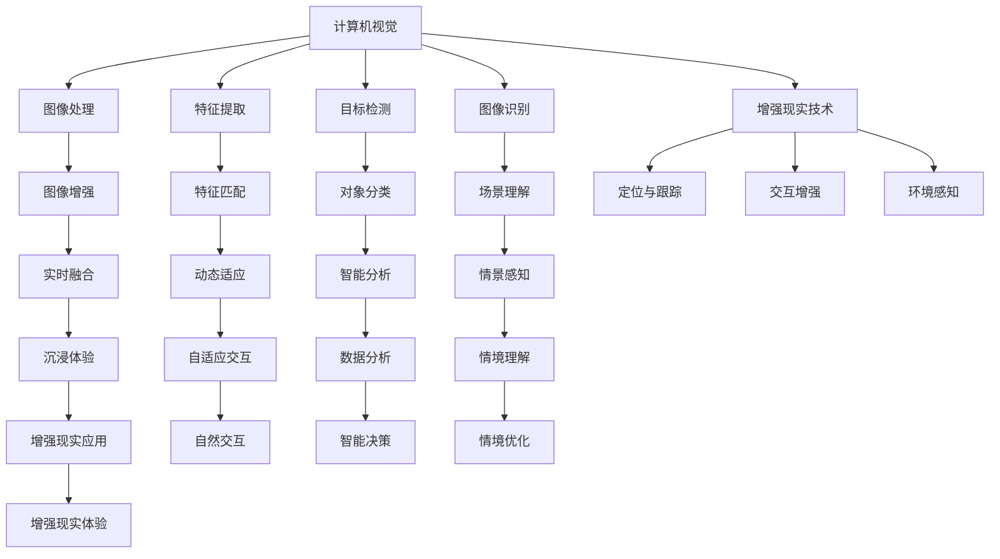

                 

## 计算机视觉与增强现实技术的基本概念

### 1.1 计算机视觉

#### 背景介绍

计算机视觉是人工智能领域的一个重要分支，旨在使计算机能够像人类一样理解和解释视觉信息。它起源于20世纪60年代，随着计算能力的提升和算法的进步，计算机视觉逐渐成为计算机科学与工程领域的热点研究方向。

#### 核心概念

**计算机视觉的定义**：计算机视觉是一门研究如何使计算机能从图像或视频中提取信息，并使用这些信息进行决策或执行任务的学科。

**计算机视觉的主要应用领域**：
- **图像识别**：识别图像中的物体、场景和特征。
- **物体检测**：检测图像或视频中的特定物体。
- **动作识别**：分析视频中的运动行为。
- **图像分割**：将图像划分为不同的区域或对象。

**计算机视觉与人类视觉系统的比较**：
- **能力**：人类的视觉系统能够处理复杂的场景和变化，而计算机视觉系统通常局限于特定场景和任务。
- **效率**：计算机视觉系统在处理大量数据时可能更高效，但人类在处理复杂情境时更具优势。

#### 计算机视觉技术概述

**基本概念**：

计算机视觉技术主要包括以下几个核心部分：
- **图像处理**：对图像进行滤波、增强、变换等操作。
- **特征提取**：从图像中提取有用的特征，如边缘、角点、纹理等。
- **目标检测**：识别图像中的特定对象。
- **图像识别**：识别图像中的物体或场景。

**主要应用领域**：

计算机视觉技术广泛应用于多个领域，包括：
- **安防监控**：人脸识别、行为分析等。
- **自动驾驶**：车辆检测、车道线识别等。
- **医疗影像**：疾病诊断、影像分析等。
- **工业自动化**：质量检测、故障诊断等。

**计算机视觉与增强现实技术的联系**：

计算机视觉技术在增强现实（AR）技术中发挥着关键作用。在AR系统中，计算机视觉用于实时捕捉现实世界的场景，并在这个基础上叠加虚拟信息。具体应用包括：
- **定位与跟踪**：计算机视觉用于确定设备在现实世界中的位置和方向。
- **环境感知**：通过计算机视觉分析现实环境，以增强虚拟信息的显示。

#### 计算机视觉技术在增强现实中的应用

计算机视觉技术在增强现实中的应用主要体现在以下几个方面：
- **现实世界与虚拟世界的融合**：通过计算机视觉技术，将虚拟信息与现实环境进行无缝融合，实现更加逼真的增强现实体验。
- **交互增强**：利用计算机视觉技术实现更加自然的交互方式，如手势识别、面部识别等。
- **实时环境感知**：计算机视觉技术能够实时分析现实环境，为增强现实应用提供动态数据支持。

#### 计算机视觉与增强现实技术的未来发展趋势

随着技术的不断进步，计算机视觉和增强现实技术将更加紧密地融合，为各行各业带来深远的影响。未来，以下几个趋势值得关注：
- **实时性与精确度的提升**：随着算法和硬件的发展，计算机视觉技术在实时性和精确度上将有显著提升。
- **跨领域应用**：计算机视觉技术在医疗、教育、娱乐等领域的应用将更加广泛。
- **人机交互的革新**：通过计算机视觉技术，人机交互将变得更加自然和直观。

#### 核心概念原理之间的关系架构

为了更好地理解计算机视觉与增强现实技术之间的联系，我们可以使用Mermaid流程图来展示它们的核心概念原理之间的关系：



#### 核心算法原理讲解

以下我们将详细讲解计算机视觉中的核心算法原理，包括图像处理、特征提取、目标检测和图像识别。

**1. 图像处理的基本概念和算法**

图像处理是计算机视觉的基础，包括对图像进行滤波、增强、变换等操作。

- **滤波**：如高斯滤波、中值滤波等，用于去除图像噪声。
- **增强**：如直方图均衡化、对比度增强等，用于提高图像质量。
- **变换**：如傅里叶变换、小波变换等，用于图像的特征提取和压缩。

**伪代码：**
```python
function image_filter(image, filter):
    filtered_image = apply_filter(image, filter)
    return filtered_image

function image_enhance(image):
    enhanced_image = apply_enhancement(image)
    return enhanced_image

function image_transform(image, transform_type):
    transformed_image = apply_transform(image, transform_type)
    return transformed_image
```

**2. 特征提取的基本方法**

特征提取是从图像中提取具有区分性的特征，如边缘、角点、纹理等。

- **边缘检测**：如Sobel算子、Canny算子等。
- **角点检测**：如Harris角点检测、Shi-Tomasi角点检测等。
- **纹理分析**：如Gabor滤波器、LBP（局部二值模式）等。

**伪代码：**
```python
function edge_detection(image):
    edges = apply_edge_detection(image)
    return edges

function corner_detection(image):
    corners = apply_corner_detection(image)
    return corners

function texture_analysis(image):
    textures = apply_texture_analysis(image)
    return textures
```

**3. 目标检测的基本算法**

目标检测是识别图像中的特定对象。

- **滑动窗口**：对图像进行窗口扫描，逐个检测窗口内的对象。
- **特征分类**：使用深度学习模型，如YOLO、SSD、Faster R-CNN等，对检测到的特征进行分类。

**伪代码：**
```python
function object_detection(image, model):
    windows = generate_windows(image)
    for window in windows:
        features = extract_features(window)
        label = classify_object(features, model)
    return labels
```

**4. 图像识别的基本方法**

图像识别是识别图像中的物体或场景。

- **模板匹配**：使用预定义的模板在图像中寻找匹配的对象。
- **卷积神经网络**：如AlexNet、VGG、ResNet等，通过深度学习实现图像分类。

**伪代码：**
```python
function image_recognition(image, model):
    features = extract_features(image, model)
    label = classify_image(features)
    return label
```

#### 数学模型和公式

在计算机视觉中，许多算法都基于数学模型和公式，如：

**1. 傅里叶变换**：
$$
\mathcal{F}\{f(x, y)\} = F(u, v) = \int_{-\infty}^{\infty} \int_{-\infty}^{\infty} f(x, y) e^{-j2\pi ux} e^{-j2\pi vy} \, dx \, dy
$$

**2. 拉普拉斯算子**：
$$
\nabla^2 f = \frac{\partial^2 f}{\partial x^2} + \frac{\partial^2 f}{\partial y^2}
$$

**3. 神经网络激活函数**：
$$
\sigma(x) = \frac{1}{1 + e^{-x}}
$$

#### 举例说明

**1. 图像滤波**

假设我们有一张噪声图像，我们可以使用高斯滤波器对其进行滤波。

```python
import numpy as np
from scipy.ndimage import gaussian_filter

# 噪声图像
noisy_image = np.random.randn(100, 100)

# 高斯滤波器参数
sigma = 1.0

# 应用高斯滤波
filtered_image = gaussian_filter(noisy_image, sigma)

# 显示滤波结果
plt.imshow(filtered_image, cmap='gray')
plt.show()
```

**2. 边缘检测**

使用Sobel算子检测图像中的边缘。

```python
import cv2
import matplotlib.pyplot as plt

# 载入图像
image = cv2.imread('image.jpg', cv2.IMREAD_GRAYSCALE)

# Sobel算子
sobelx = cv2.Sobel(image, cv2.CV_64F, 1, 0, ksize=3)
sobely = cv2.Sobel(image, cv2.CV_64F, 0, 1, ksize=3)

# 计算边缘强度
edge_intensity = np.sqrt(sobelx**2 + sobely**2)

# 转换为整数类型
edge_intensity = edge_intensity.astype(np.uint8)

# 显示边缘检测结果
plt.imshow(edge_intensity, cmap='gray')
plt.show()
```

#### 项目实战

**开发环境搭建**

搭建计算机视觉项目开发环境，我们需要安装以下软件和库：

- Python 3.x
- OpenCV
- TensorFlow 或 PyTorch

安装命令如下：

```bash
pip install python-opencv-python tensorflow
```

或

```bash
pip install python-opencv-python torchvision
```

**源代码详细实现和代码解读**

以下是一个简单的图像滤波项目，演示如何使用OpenCV对图像进行高斯滤波。

```python
import cv2
import numpy as np
import matplotlib.pyplot as plt

def main():
    # 载入图像
    image = cv2.imread('image.jpg', cv2.IMREAD_GRAYSCALE)

    # 应用高斯滤波
    filtered_image = cv2.GaussianBlur(image, (5, 5), 0)

    # 显示原图和滤波结果
    plt.figure(figsize=(10, 5))
    plt.subplot(1, 2, 1)
    plt.imshow(image, cmap='gray')
    plt.title('Original Image')
    plt.subplot(1, 2, 2)
    plt.imshow(filtered_image, cmap='gray')
    plt.title('Filtered Image')
    plt.show()

if __name__ == '__main__':
    main()
```

**代码应用解读与分析**

在上面的代码中，我们首先使用`cv2.imread()`函数读取图像，然后使用`cv2.GaussianBlur()`函数对图像进行高斯滤波。`GaussianBlur()`函数接受三个参数：原始图像、滤波器大小和标准差。滤波器大小决定了滤波器的形状，而标准差则决定了滤波的强度。最后，我们使用`matplotlib`库显示原图和滤波结果。

**实际案例分析和详细讲解剖析**

假设我们需要对一张含有噪声的医学影像进行滤波处理，以减少噪声对诊断结果的影响。我们可以按照以下步骤进行：

1. 载入医学影像。
2. 对影像进行高斯滤波。
3. 分析滤波前后影像的噪声水平。
4. 评估滤波效果。

**项目小结**

通过本案例，我们学习了如何使用OpenCV库对图像进行高斯滤波。滤波技术在医学影像处理中具有重要意义，能够帮助医生更准确地诊断疾病。然而，滤波器参数的选择对滤波效果有很大影响，需要根据具体应用场景进行调整。

#### 最佳实践 tips

- **选择合适的滤波器**：根据图像的噪声特性选择合适的滤波器。
- **参数调整**：适当调整滤波器的参数，以达到最佳滤波效果。
- **图像增强**：在滤波前或后，可以结合图像增强技术，进一步提高图像质量。

### 摘要

本文系统地介绍了计算机视觉与增强现实技术的基本概念、核心算法以及它们在增强现实中的应用。计算机视觉技术通过图像处理、特征提取、目标检测和图像识别等核心算法，实现对图像的理解和处理。在增强现实技术中，计算机视觉技术用于定位与跟踪、交互增强和环境感知等，实现虚拟信息与现实世界的无缝融合。本文通过具体案例，展示了计算机视觉技术在实际项目中的应用，并提出了最佳实践 tips。随着技术的不断进步，计算机视觉和增强现实技术将在未来发挥更加重要的作用。

