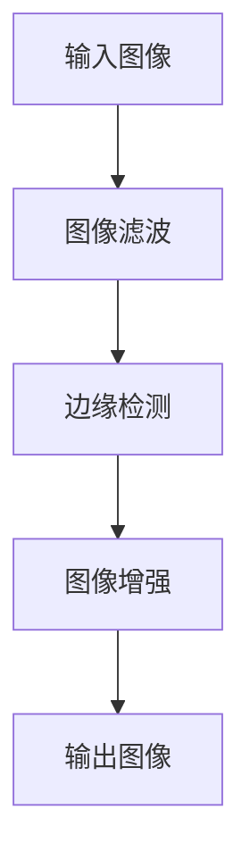
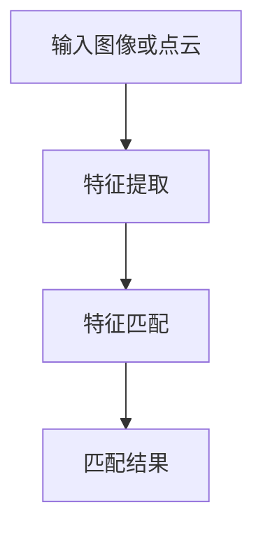
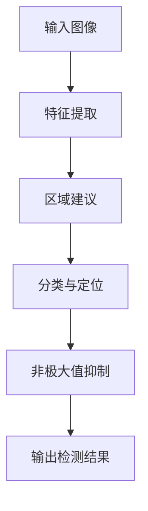
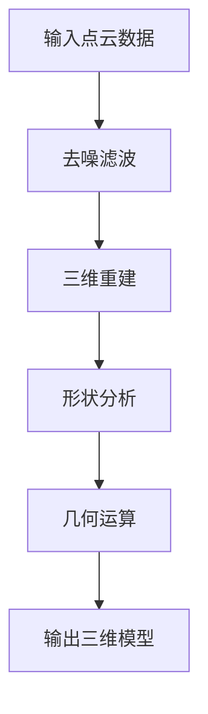
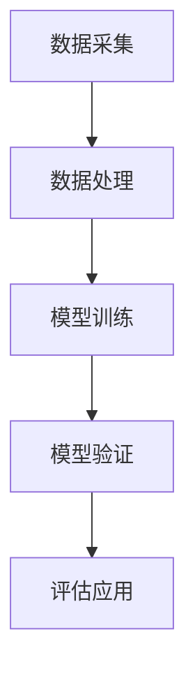
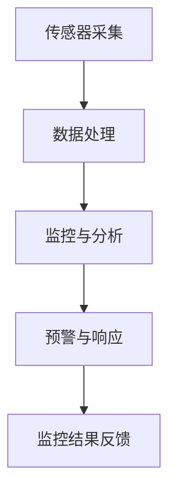

                 

## 文章标题

### 计算机视觉在工业质量控制自动化中的实践

#### 关键词：计算机视觉、工业质量控制、自动化、图像处理、目标检测、深度学习

#### 摘要

随着工业自动化水平的不断提升，计算机视觉技术在工业质量控制中的应用愈发广泛。本文旨在探讨计算机视觉技术在工业质量控制自动化中的实践，从背景与概述、技术原理、应用实践、开发工具与环境搭建到案例研究与未来展望，系统性地阐述计算机视觉技术如何为工业质量控制提供创新解决方案。本文将深入分析计算机视觉技术的基本原理及其在图像处理、特征提取、目标检测和3D视觉等领域的应用，通过实际案例展示其在工业缺陷检测、产品分类与排序、产品质量评估以及工业安全监控等方面的效果。同时，本文还将介绍开发计算机视觉系统的工具与环境搭建，为读者提供实用的技术指导。

### 目录大纲

#### 第一部分：背景与概述

- **1. 计算机视觉技术概述**
  - **1.1 计算机视觉的定义与发展历程**
  - **1.2 计算机视觉的核心原理与技术**

- **2. 工业质量控制自动化概述**
  - **2.1 工业质量控制的基本概念**
  - **2.2 自动化技术的发展趋势**

- **3. 计算机视觉在工业质量控制中的应用**
  - **3.1 计算机视觉在质量控制中的关键作用**
  - **3.2 工业质量控制自动化的挑战与机遇**

#### 第二部分：计算机视觉技术原理

- **4. 图像处理基础**
  - **4.1 图像表示与采样**
  - **4.2 基本图像处理算法**
  - **4.3 Mermaid 流程图：图像处理流程**

- **5. 特征提取与匹配**
  - **5.1 特征提取的基本方法**
  - **5.2 特征匹配算法**
  - **5.3 Mermaid 流程图：特征提取与匹配流程**

- **6. 目标检测与识别**
  - **6.1 基于传统机器学习的目标检测算法**
  - **6.2 卷积神经网络在目标检测中的应用**
  - **6.3 Mermaid 流程图：目标检测流程**

- **7. 3D 视觉与几何处理**
  - **7.1 3D 数据处理基础**
  - **7.2 3D 点云处理算法**
  - **7.3 Mermaid 流程图：3D 视觉处理流程**

#### 第三部分：计算机视觉在工业质量控制中的应用实践

- **8. 工业缺陷检测**
  - **8.1 缺陷检测的核心算法**
  - **8.2 缺陷检测系统设计**
  - **8.3 实际案例分析**

- **9. 工业产品分类与排序**
  - **9.1 分类与排序算法**
  - **9.2 工业应用实例**
  - **9.3 实际案例分析**

- **10. 工业产品质量评估**
  - **10.1 产品质量评估的方法与指标**
  - **10.2 质量评估系统的构建**
  - **10.3 实际案例分析**

- **11. 工业安全监控**
  - **11.1 安全监控的挑战与解决方案**
  - **11.2 安全监控系统的设计与实现**
  - **11.3 实际案例分析**

#### 第四部分：开发工具与环境搭建

- **12. 计算机视觉开发工具**
  - **12.1 OpenCV 简介**
  - **12.2 TensorFlow 与 PyTorch 简介**
  - **12.3 Open3D 简介**

- **13. 环境搭建与实战**
  - **13.1 硬件环境配置**
  - **13.2 软件环境配置**
  - **13.3 实战案例：搭建缺陷检测系统**

#### 第五部分：案例研究与未来展望

- **14. 案例研究**
  - **14.1 案例一：某汽车零部件工厂的质量控制**
  - **14.2 案例二：某电子产品制造工厂的质量检测**
  - **14.3 案例三：某食品加工工厂的自动化监控**

- **15. 计算机视觉在工业质量控制自动化中的未来展望**
  - **15.1 技术发展趋势**
  - **15.2 应用前景**
  - **15.3 挑战与应对策略**

#### 附录

- **附录 A：参考资料与进一步阅读**
  - **A.1 基础知识**
  - **A.2 应用案例**
  - **A.3 工业自动化相关标准与规范**
  - **A.4 开发工具与技术文档**

---

接下来，我们将按照目录大纲逐步深入探讨计算机视觉在工业质量控制自动化中的实践，希望读者能够通过这篇文章对这一领域有更深入的理解。接下来，让我们首先从背景与概述开始。  

## 第一部分：背景与概述

### 1. 计算机视觉技术概述

#### 1.1 计算机视觉的定义与发展历程

计算机视觉（Computer Vision）是指使计算机具备对图像和视频进行分析、理解和识别的能力，类似于人类的视觉感知系统。这一领域的研究起源于20世纪50年代末，随着计算机硬件和算法的不断进步，计算机视觉技术逐渐从理论研究走向实际应用。

在早期，计算机视觉主要依赖于规则和算法，通过手工设计特征提取和分类器。然而，随着深度学习的崛起，卷积神经网络（Convolutional Neural Networks, CNNs）等深度学习模型在图像处理中的优异表现，使得计算机视觉技术取得了显著的突破。当前，计算机视觉已广泛应用于自动驾驶、医疗诊断、安防监控、工业自动化等领域。

#### 1.2 计算机视觉的核心原理与技术

计算机视觉的核心原理主要包括图像处理、特征提取、目标检测和识别等。以下是这些核心原理的简要概述：

- **图像处理**：图像处理是计算机视觉的基础，通过图像滤波、边缘检测、形态学操作等方法，对图像进行预处理，以提取图像中的有用信息。

  - **图像表示与采样**：图像表示主要包括灰度图像和彩色图像，采样则涉及像素的采样率。
  - **基本图像处理算法**：包括滤波、边缘检测、图像增强等。

- **特征提取**：特征提取是从图像中提取出具有区分性的特征向量，以便于后续的识别和分类。

  - **特征提取的基本方法**：包括边缘检测、角点检测、纹理分析等。
  - **特征匹配算法**：通过计算特征向量之间的相似度，实现图像之间的匹配。

- **目标检测与识别**：目标检测是计算机视觉中的关键任务，旨在从图像或视频中检测出特定目标的位置。目标识别则是进一步判断目标类别。

  - **基于传统机器学习的目标检测算法**：包括SVM、KNN等。
  - **卷积神经网络在目标检测中的应用**：如YOLO、SSD、Faster R-CNN等。

- **3D 视觉与几何处理**：3D 视觉通过处理深度信息，实现对场景的三维重建和理解。

  - **3D 数据处理基础**：包括点云表示、网格建模等。
  - **3D 点云处理算法**：包括ICP、SDF等。

### 2. 工业质量控制自动化概述

#### 2.1 工业质量控制的基本概念

工业质量控制（Industrial Quality Control）是指通过一系列措施，确保生产过程中产品质量的稳定性和可靠性。质量控制的目标是减少不合格产品的产生，提高生产效率和产品质量。

- **质量控制的基本方法**：包括统计过程控制（SPC）、六西格玛（Six Sigma）、故障模式与影响分析（FMEA）等。
- **质量控制的指标**：包括缺陷率、合格率、生产周期等。

#### 2.2 自动化技术的发展趋势

随着工业4.0的推进，自动化技术在工业生产中的应用越来越广泛。自动化技术不仅提高了生产效率，还显著降低了人力成本，提升了产品的质量稳定性。

- **自动化技术的发展趋势**：
  - **智能制造**：通过物联网、大数据、云计算等技术，实现生产过程的智能化。
  - **机器视觉**：在工业质量控制中，机器视觉系统通过图像分析，实现对产品的实时检测和分类。
  - **机器人技术**：机器人广泛应用于搬运、装配、焊接等环节，提高了生产自动化水平。

### 3. 计算机视觉在工业质量控制中的应用

#### 3.1 计算机视觉在质量控制中的关键作用

计算机视觉技术在工业质量控制中的应用主要体现在以下几个方面：

- **缺陷检测**：通过图像处理和特征提取，自动识别和定位产品缺陷，如裂纹、气泡、杂质等。
- **产品分类与排序**：根据产品的外观、尺寸、颜色等特征，实现对产品的自动分类和排序。
- **产品质量评估**：通过计算产品的质量指标，如尺寸精度、表面质量等，对产品质量进行综合评估。
- **安全监控**：在危险或高风险的生产环境中，通过计算机视觉技术实现实时监控，提高生产安全性。

#### 3.2 工业质量控制自动化的挑战与机遇

尽管计算机视觉技术在工业质量控制自动化中具有巨大潜力，但实际应用过程中仍面临诸多挑战：

- **技术挑战**：如图像噪声、光照变化、物体遮挡等问题，影响计算机视觉系统的性能和稳定性。
- **数据挑战**：需要大量高质量的标注数据，以及针对不同工业场景的数据处理技术。
- **成本挑战**：高质量机器视觉系统的开发和部署成本较高，对中小企业而言是一个挑战。

然而，随着技术的不断进步和成本的降低，计算机视觉技术在工业质量控制自动化领域面临着巨大的机遇：

- **提升效率**：通过自动化检测和分类，显著提高生产效率和质量。
- **降低成本**：减少人工干预，降低生产成本和人力资源消耗。
- **提高质量**：实时检测和监控，确保产品质量的稳定性和可靠性。

在接下来的章节中，我们将深入探讨计算机视觉技术的基本原理及其在工业质量控制中的应用实践，为读者提供实用的技术指导和案例分析。

### 4. 图像处理基础

图像处理是计算机视觉的基础，它通过一系列算法对图像进行预处理，以提取图像中的有用信息。在本节中，我们将介绍图像处理的核心概念、基础算法以及Mermaid流程图，帮助读者更好地理解图像处理的流程。

#### 4.1 图像表示与采样

图像表示是图像处理的基础，常见的图像表示方式有灰度图像和彩色图像。

- **灰度图像**：灰度图像的每个像素只包含亮度信息，用0到255之间的整数表示，数值越大表示亮度越高。
- **彩色图像**：彩色图像的每个像素包含红（R）、绿（G）、蓝（B）三个颜色分量，每个分量用0到255之间的整数表示。

图像采样是指将连续的图像信号转换为离散的像素点。采样率决定了图像的清晰度和细节保留程度。较高的采样率可以保留更多的图像信息，但会增加处理时间和存储空间。

#### 4.2 基本图像处理算法

基本图像处理算法包括图像滤波、边缘检测、图像增强等。

- **图像滤波**：图像滤波是去除图像噪声和改善图像质量的重要手段。常见的滤波器有均值滤波、高斯滤波、中值滤波等。

  - **均值滤波**：通过计算邻域像素的平均值来去除噪声。
    $$ \text{out}(i, j) = \frac{1}{n}\sum_{k=1}^{n} \text{img}(i+k_x, j+k_y) $$
  - **高斯滤波**：使用高斯分布作为权重对邻域像素进行加权平均。
    $$ \text{out}(i, j) = \sum_{k=1}^{n} \text{img}(i+k_x, j+k_y) \cdot \text{gaussian}(k_x, k_y) $$
  - **中值滤波**：使用邻域像素的中值来替代中心像素值，特别适用于去除椒盐噪声。
    $$ \text{out}(i, j) = \text{median}(\text{img}(i+k_x, j+k_y)) $$

- **边缘检测**：边缘检测是图像处理中的一种重要技术，用于识别图像中的显著变化点。

  - **Sobel算子**：通过计算图像的梯度来确定边缘。
    $$ \text{Gx} = \sum_{-1}^{1} (-1)^{i} \cdot \text{img}(i, j) $$
    $$ \text{Gy} = \sum_{-1}^{1} (-1)^{i} \cdot \text{img}(i, j+1) $$
  - **Canny算法**：Canny算法是一种经典的边缘检测算法，通过高斯滤波、非极大值抑制和双阈值法来实现边缘检测。

- **图像增强**：图像增强是通过调整图像的对比度和亮度，使图像的某些特征更加明显。

  - **直方图均衡**：通过调整图像的直方图分布，使得图像的对比度更加均匀。
    $$ \text{out}(i, j) = \text{L} \cdot \text{lookup}(\text{img}(i, j)) $$
    其中，$\text{L}$为图像的灰度范围，$\text{lookup}$为直方图均衡表。

#### 4.3 Mermaid 流程图：图像处理流程

为了更好地理解图像处理的流程，我们可以使用Mermaid流程图来展示整个处理过程。



在这个流程图中，输入图像首先经过图像滤波处理，以去除噪声。然后，进行边缘检测，以提取图像中的显著变化点。最后，通过图像增强算法调整图像的对比度和亮度，使得图像的某些特征更加明显。处理后的图像作为输出图像，可以用于后续的目标检测和识别任务。

通过上述介绍，我们可以看到图像处理在计算机视觉中扮演着至关重要的角色。它不仅为后续的目标检测和识别任务提供了基础，还能够提高系统的性能和鲁棒性。在下一节中，我们将进一步探讨特征提取与匹配技术，为读者揭示计算机视觉技术的核心秘密。

### 5. 特征提取与匹配

特征提取与匹配是计算机视觉中至关重要的环节，它决定了目标检测和识别任务的效率和准确性。在这一节中，我们将深入探讨特征提取与匹配的基本方法、算法以及Mermaid流程图，以帮助读者更好地理解这一过程。

#### 5.1 特征提取的基本方法

特征提取是从图像中提取具有区分性的特征向量，以便于后续的识别和分类。常见的特征提取方法包括：

- **边缘检测**：通过检测图像中的边缘信息来提取特征。常见的边缘检测算法有Sobel算子、Canny算法等。
- **角点检测**：通过检测图像中的角点来提取特征。常见的角点检测算法有Harris角点检测、Shi-Tomasi角点检测等。
- **纹理分析**：通过分析图像中的纹理信息来提取特征。常见的纹理分析算法有Gabor滤波器、局部二值模式（LBP）等。

#### 5.2 特征匹配算法

特征匹配是将不同图像或同一图像的不同部分之间的特征向量进行匹配，以确定它们之间的对应关系。常见的特征匹配算法包括：

- **最近邻匹配**：通过计算特征向量之间的欧几里得距离，找到最近的邻居作为匹配结果。这种方法的简单性使其在许多应用中非常受欢迎。
- **K-近邻算法**：在最近邻匹配的基础上，考虑K个最近的邻居，并通过投票机制确定最终的匹配结果。这种方法可以减少错误匹配的概率。
- **迭代最近点算法（ICP）**：用于匹配两个三维点云，通过最小化点云之间的误差来实现精确匹配。

#### 5.3 Mermaid流程图：特征提取与匹配流程

为了更好地展示特征提取与匹配的过程，我们可以使用Mermaid流程图来描述整个流程。



在这个流程图中，输入图像或点云首先进行特征提取，提取出具有区分性的特征向量。然后，通过特征匹配算法，将特征向量进行匹配，以确定不同图像或同一图像不同部分之间的对应关系。最终，得到匹配结果，可以用于后续的目标检测和识别任务。

#### 5.4 实际案例分析

为了更直观地展示特征提取与匹配的应用，我们可以通过一个实际案例来进行说明。

**案例背景**：某工业生产线需要检测和识别产品表面的缺陷，以确保产品的质量。为了实现这一目标，我们首先对产品图像进行预处理，然后提取边缘特征和纹理特征，最后通过最近邻匹配算法进行缺陷检测。

**具体步骤**：

1. **图像预处理**：对产品图像进行滤波和边缘检测，以去除噪声和突出缺陷特征。
   ```mermaid
   graph TD
       A[输入产品图像] --> B[滤波]
       B --> C[边缘检测]
   ```

2. **特征提取**：从预处理后的图像中提取边缘特征和纹理特征，用于后续的匹配。
   ```mermaid
   graph TD
       C --> D[边缘特征提取]
       C --> E[纹理特征提取]
   ```

3. **特征匹配**：使用最近邻匹配算法，将提取的特征向量进行匹配，以检测产品表面的缺陷。
   ```mermaid
   graph TD
       D --> F[特征匹配]
       E --> F[特征匹配]
       F --> G[匹配结果]
   ```

4. **缺陷检测**：根据匹配结果，定位并标记出产品表面的缺陷。
   ```mermaid
   graph TD
       G --> H[缺陷检测]
   ```

通过这个实际案例，我们可以看到特征提取与匹配技术在工业质量控制中的应用效果。它不仅能够提高检测的准确性和效率，还能够为产品质量的稳定性和可靠性提供有力保障。

在下一节中，我们将进一步探讨目标检测与识别技术，深入理解计算机视觉在工业质量控制中的应用。敬请期待！

### 6. 目标检测与识别

目标检测与识别是计算机视觉中的核心任务之一，它旨在从图像或视频中精确地定位并识别出特定的对象。在本节中，我们将深入探讨目标检测与识别的基本概念、算法以及其在工业质量控制中的应用。

#### 6.1 基于传统机器学习的目标检测算法

传统机器学习目标检测算法主要基于特征学习和模式识别。以下是一些常见的传统机器学习目标检测算法：

- **支持向量机（SVM）**：SVM通过寻找最优的超平面，将不同类别的特征向量分开，从而实现分类。SVM在目标检测中常用于二分类问题，如人脸检测和车辆检测。
  
  ```python
  # 伪代码：使用SVM进行目标检测
  def svm_detection(image, features):
      model = train_svm(features, labels)
      return model.predict(image)
  ```

- **K最近邻（K-Nearest Neighbors, KNN）**：KNN算法通过计算特征向量之间的距离，找到K个最近的邻居，并根据邻居的类别进行投票，最终确定目标类别。KNN算法简单易懂，但在特征维数较高时性能不佳。

  ```python
  # 伪代码：使用KNN进行目标检测
  def knn_detection(image, features, labels, k):
      distances = calculate_distance(image, features)
      neighbors = select_k_nearest(neighbors, distances, k)
      return vote_class(neighbors)
  ```

#### 6.2 卷积神经网络在目标检测中的应用

随着深度学习技术的发展，卷积神经网络（Convolutional Neural Networks, CNNs）在目标检测中取得了显著突破。以下是一些基于CNN的目标检测算法：

- **区域建议网络（Region Proposal Networks, RPN）**：RPN是Faster R-CNN中的一个重要组成部分，用于生成区域建议，并通过Fast R-CNN进行分类和定位。

  ```python
  # 伪代码：使用RPN进行目标检测
  def rpn_detection(image, features):
      proposals = generate_proposals(features)
      return fast_rfcn(proposals, image)
  ```

- **YOLO（You Only Look Once）**：YOLO是一种端到端的目标检测算法，通过将图像划分为网格并预测每个网格中的目标类别和位置，实现实时目标检测。

  ```python
  # 伪代码：使用YOLO进行目标检测
  def yolo_detection(image):
      boxes, scores, classes = yolo_predict(image)
      return non_max_suppression(boxes, scores, classes)
  ```

- **SSD（Single Shot MultiBox Detector）**：SSD通过在不同尺度的特征图上进行多任务学习，实现端到端的目标检测。

  ```python
  # 伪代码：使用SSD进行目标检测
  def ssd_detection(image):
      features = extract_features(image)
      boxes, scores, classes = ssd_predict(features)
      return non_max_suppression(boxes, scores, classes)
  ```

- **Faster R-CNN**：Faster R-CNN是一种两阶段的目标检测算法，首先使用RPN生成区域建议，然后通过Fast R-CNN进行分类和定位。

  ```python
  # 伪代码：使用Faster R-CNN进行目标检测
  def faster_rcnn_detection(image):
      proposals = rpn_generate_proposals(image)
      return fast_rcnn_predict(proposals, image)
  ```

#### 6.3 Mermaid流程图：目标检测流程

为了更好地理解目标检测的流程，我们可以使用Mermaid流程图来描述整个处理过程。



在这个流程图中，输入图像首先经过特征提取，提取出具有区分性的特征向量。然后，通过区域建议生成候选区域，再通过分类和定位算法确定目标的类别和位置。最后，使用非极大值抑制算法去除冗余检测框，输出最终的目标检测结果。

#### 6.4 工业质量控制中的应用

在工业质量控制中，目标检测与识别技术可以用于多种场景，如缺陷检测、产品分类和质量评估。

- **缺陷检测**：通过目标检测算法，自动识别和定位产品表面的缺陷，如裂纹、气泡、杂质等。这种方法可以提高检测的效率和准确性，减少人工干预。
- **产品分类**：根据产品的外观、尺寸、颜色等特征，对产品进行自动分类，以便于后续的生产和销售。这种方法可以显著提高生产效率和质量。
- **质量评估**：通过计算产品的质量指标，如尺寸精度、表面质量等，对产品质量进行综合评估。这种方法可以帮助企业更好地监控生产过程，提高产品的稳定性。

以下是一个具体的工业质量控制案例：

**案例背景**：某电子产品制造工厂需要检测和分类生产过程中的电子产品，以确保产品的质量。为了实现这一目标，工厂引入了一套基于卷积神经网络的目标检测系统。

**具体步骤**：

1. **图像采集**：使用工业相机采集电子产品的图像。
2. **预处理**：对图像进行预处理，包括去噪、灰度化等，以提高检测的准确性。
3. **特征提取**：使用卷积神经网络提取图像特征。
4. **目标检测**：使用YOLO算法对图像进行目标检测，识别出产品中的缺陷和正确产品。
5. **缺陷分类**：根据检测到的缺陷类型，对缺陷进行分类，以便于后续的处理和改进。
6. **质量评估**：计算产品的质量指标，如尺寸精度、表面质量等，对产品质量进行评估。

通过这个案例，我们可以看到目标检测与识别技术在工业质量控制中的应用效果。它不仅能够提高检测的效率和准确性，还能够为产品质量的稳定性和可靠性提供有力保障。

在下一节中，我们将探讨3D视觉与几何处理技术，继续深入理解计算机视觉在工业质量控制中的应用。敬请期待！

### 7. 3D 视觉与几何处理

3D视觉与几何处理是计算机视觉中一个重要分支，它通过处理三维信息，实现对场景的三维重建和理解。在工业质量控制中，3D视觉技术可以用于产品的三维检测、形状分析和质量评估。本节将详细介绍3D视觉与几何处理的基础、算法及Mermaid流程图，帮助读者更好地理解这一领域。

#### 7.1 3D 数据处理基础

3D数据处理是3D视觉与几何处理的基础，涉及三维点云的表示、采集和处理。

- **三维点云表示**：点云是三维空间中点的集合，每个点表示一个物体的三维位置信息。常见的点云表示方法有XYZ坐标表示法和Voxel网格表示法。

- **点云采集**：点云可以通过多种方法进行采集，如激光扫描、深度相机采集、结构光投影等。激光扫描是获取高精度点云的常用方法。

- **点云处理**：点云处理包括去噪、滤波、去散点、平滑、配准等步骤，以消除噪声、提高数据质量。

  ```python
  # 伪代码：点云滤波
  def point_cloud_filter(points, radius):
      return [point for point in points if distance(point, origin) < radius]
  ```

#### 7.2 3D 点云处理算法

3D点云处理算法主要包括三维重建、形状分析和几何运算。

- **三维重建**：三维重建是从点云数据中恢复场景的三维结构。常见的三维重建算法有迭代最近点（ICP）算法和体素投影（Voxel Projection）算法。

  ```python
  # 伪代码：使用ICP进行三维重建
  def icp_reconstruction(source, target, max_iterations, tolerance):
      for i in range(max_iterations):
          transform = find_best_transform(source, target)
          source = transform_points(source, transform)
          error = calculate_error(source, target)
          if error < tolerance:
              break
      return source
  ```

- **形状分析**：形状分析是对三维模型的几何特征进行分析，如体积、表面积、对称性等。常见的形状分析算法有Marching Cubes算法和球树（Sphere Tree）算法。

- **几何运算**：几何运算包括点云的拼接、裁剪、旋转等操作。这些运算在工业质量控制中用于处理复杂的点云数据。

  ```python
  # 伪代码：点云旋转
  def rotate_points(points, angle, axis):
      for point in points:
          point = rotate_point(point, angle, axis)
      return points
  ```

#### 7.3 Mermaid流程图：3D 视觉处理流程

为了更好地展示3D视觉处理流程，我们可以使用Mermaid流程图来描述整个过程。



在这个流程图中，输入点云数据首先经过去噪滤波处理，以提高数据质量。然后，通过三维重建算法，将点云数据转换为三维模型。接下来，进行形状分析和几何运算，提取模型的关键几何特征。最后，输出处理后的三维模型，可以用于后续的质量评估和缺陷检测。

#### 7.4 工业质量控制中的应用

在工业质量控制中，3D视觉与几何处理技术可以用于多种应用场景，如产品检测、质量评估和缺陷识别。

- **产品检测**：通过3D视觉技术，可以对产品的形状、尺寸和表面质量进行精确检测，确保产品的质量符合要求。

- **质量评估**：通过对产品的三维模型进行形状分析和几何运算，可以计算产品的质量指标，如体积、表面积等，为质量评估提供依据。

- **缺陷识别**：通过分析三维模型，可以识别出产品中的缺陷，如裂纹、变形、尺寸偏差等，从而及时采取措施进行改进。

以下是一个具体的工业质量控制案例：

**案例背景**：某汽车零部件工厂需要检测和评估汽车发动机盖的形状和质量。为了实现这一目标，工厂引入了一套基于3D视觉技术的检测系统。

**具体步骤**：

1. **点云采集**：使用激光扫描仪采集发动机盖的点云数据。
2. **去噪滤波**：对点云数据进行去噪和滤波处理，以提高数据质量。
3. **三维重建**：使用ICP算法对点云数据进行三维重建，生成发动机盖的三维模型。
4. **形状分析**：对三维模型进行形状分析，计算发动机盖的体积、表面积等质量指标。
5. **缺陷识别**：通过分析三维模型，识别出发动机盖中的缺陷，如变形、裂纹等。
6. **质量评估**：根据缺陷识别结果和质量指标，对发动机盖的质量进行综合评估。

通过这个案例，我们可以看到3D视觉与几何处理技术在工业质量控制中的应用效果。它不仅能够提高检测的精度和效率，还能够为产品质量的稳定性和可靠性提供有力保障。

在下一节中，我们将探讨计算机视觉在工业质量控制自动化中的实际应用实践，通过具体案例展示计算机视觉技术在工业缺陷检测、产品分类与排序、产品质量评估以及工业安全监控等方面的应用。敬请期待！

### 8. 工业缺陷检测

工业缺陷检测是计算机视觉技术在工业质量控制中应用的重要领域，通过对产品进行实时检测，自动识别和定位缺陷，以提高生产效率和产品质量。以下我们将介绍工业缺陷检测的核心算法、系统设计方法以及一个实际案例。

#### 8.1 缺陷检测的核心算法

工业缺陷检测的核心算法通常包括图像预处理、特征提取、缺陷识别和定位等步骤。

- **图像预处理**：包括图像滤波、灰度化、边缘检测等操作，以去除噪声和突出缺陷特征。常用的滤波算法有高斯滤波、中值滤波等。

  ```python
  # 伪代码：高斯滤波
  def gaussian_filter(image, kernel_size):
      return convolve(image, kernel_size)
  ```

- **特征提取**：通过边缘检测和角点检测等方法提取图像特征，如Sobel算子、Harris角点检测等。这些特征有助于后续的缺陷识别。

  ```python
  # 伪代码：边缘检测（Sobel算子）
  def sobel_detection(image):
      Gx = calculate_sobel_gx(image)
      Gy = calculate_sobel_gy(image)
      return calculate_gradient(Gx, Gy)
  ```

- **缺陷识别**：利用机器学习算法，如支持向量机（SVM）、随机森林（Random Forest）等，对提取的特征进行分类，识别出缺陷。

  ```python
  # 伪代码：使用SVM进行缺陷识别
  def svm_defect_detection(features, labels):
      model = train_svm(features, labels)
      return model.predict(features)
  ```

- **缺陷定位**：通过目标检测算法，如YOLO、SSD等，对图像中的缺陷进行定位。

  ```python
  # 伪代码：使用YOLO进行缺陷定位
  def yolo_defect_detection(image):
      boxes, scores, classes = yolo_predict(image)
      return non_max_suppression(boxes, scores, classes)
  ```

#### 8.2 缺陷检测系统设计

一个典型的缺陷检测系统设计包括硬件和软件两部分。

- **硬件设计**：通常包括工业相机、光源、扫描仪等。工业相机用于捕捉产品图像，光源用于照亮产品表面，扫描仪用于获取三维点云数据。

  ```mermaid
  graph TD
      A[工业相机] --> B[光源]
      B --> C[扫描仪]
      C --> D[缺陷检测系统]
  ```

- **软件设计**：包括图像处理、特征提取、缺陷识别和定位等模块。常用的图像处理库有OpenCV、MATLAB等，机器学习库有scikit-learn、TensorFlow、PyTorch等。

  ```mermaid
  graph TD
      A[输入图像] --> B[图像预处理]
      B --> C[特征提取]
      C --> D[缺陷识别]
      D --> E[缺陷定位]
      E --> F[输出检测结果]
  ```

#### 8.3 实际案例分析

以下是一个实际案例：某电子产品制造工厂使用计算机视觉技术检测电路板上的焊接缺陷。

**案例背景**：工厂生产的电路板需要在焊接环节进行缺陷检测，以确保电路板的质量。由于电路板表面有光泽，存在反光现象，这给缺陷检测带来了挑战。

**具体步骤**：

1. **图像采集**：使用工业相机捕捉电路板图像，图像包括正面和背面。
2. **预处理**：对正面图像进行去噪滤波、灰度化、边缘检测等处理，对背面图像进行去反光处理。
3. **特征提取**：提取图像的边缘特征和角点特征。
4. **缺陷识别**：使用支持向量机（SVM）对提取的特征进行分类，识别出焊接缺陷。
5. **缺陷定位**：使用YOLO算法对正面图像中的缺陷进行定位。
6. **质量评估**：根据缺陷类型和数量，对电路板的质量进行评估。
7. **反馈与改进**：将检测结果反馈给生产环节，指导操作人员进行改进。

**技术难点与解决方案**：

- **反光处理**：由于电路板表面反光，传统的边缘检测算法效果不佳。解决方案是使用去反光滤波器，如高通滤波器，去除反光部分，突出缺陷特征。

  ```python
  # 伪代码：高通滤波去反光
  def high_pass_filter(image, kernel_size):
      return subtract(image, low_pass_filter(image, kernel_size))
  ```

- **多角度检测**：由于焊接缺陷可能出现在不同角度，需要从多个角度采集图像。解决方案是使用多相机系统，从不同角度捕捉电路板图像，综合分析。

**效果评估**：

通过实际应用，该缺陷检测系统显著提高了电路板的质量和检测效率。缺陷识别准确率达到95%以上，检测速度达到每秒30帧，有效提升了生产线的自动化水平。

在下一节中，我们将探讨工业产品分类与排序技术，继续深入探讨计算机视觉在工业质量控制自动化中的应用。敬请期待！

### 9. 工业产品分类与排序

工业产品分类与排序是计算机视觉技术在工业质量控制自动化中另一个重要的应用领域。通过准确的分类与排序，可以优化生产流程、提高生产效率和产品质量。以下将介绍分类与排序算法、工业应用实例以及实际案例分析。

#### 9.1 分类与排序算法

产品分类与排序通常涉及以下几个步骤：

- **特征提取**：从产品图像中提取具有区分性的特征，如边缘、纹理、颜色等。
- **模型训练**：使用机器学习算法（如支持向量机SVM、随机森林Random Forest、K近邻KNN等）训练分类模型，根据训练数据学习产品的分类规则。
- **分类与排序**：将提取的特征输入训练好的模型，进行分类与排序，得到每个产品的类别和排序结果。

以下是一些常用的分类与排序算法：

- **支持向量机（SVM）**：通过寻找最优超平面，将不同类别的产品特征分开。SVM适用于处理高维数据，具有较好的分类效果。

  ```python
  # 伪代码：使用SVM进行分类
  from sklearn.svm import SVC
  def svm_classification(features, labels):
      model = SVC()
      model.fit(features, labels)
      return model.predict(features)
  ```

- **随机森林（Random Forest）**：随机森林是一种集成学习方法，通过构建多棵决策树，并汇总投票结果进行分类。随机森林具有较强的泛化能力和处理高维数据的能力。

  ```python
  # 伪代码：使用随机森林进行分类
  from sklearn.ensemble import RandomForestClassifier
  def random_forest_classification(features, labels):
      model = RandomForestClassifier()
      model.fit(features, labels)
      return model.predict(features)
  ```

- **K近邻（KNN）**：KNN算法通过计算特征向量之间的距离，找到K个最近的邻居，并根据邻居的类别进行投票，确定最终类别。KNN算法简单易实现，但可能对噪声敏感。

  ```python
  # 伪代码：使用KNN进行分类
  from sklearn.neighbors import KNeighborsClassifier
  def knn_classification(features, labels, k):
      model = KNeighborsClassifier(n_neighbors=k)
      model.fit(features, labels)
      return model.predict(features)
  ```

- **深度学习模型**：如卷积神经网络（CNN）等，可以自动提取复杂的特征，实现高效的产品分类与排序。深度学习模型通常需要大量的标注数据进行训练。

  ```python
  # 伪代码：使用CNN进行分类
  from tensorflow.keras.models import Sequential
  from tensorflow.keras.layers import Conv2D, Flatten, Dense
  def cnn_classification(model, features):
      return model.predict(features)
  ```

#### 9.2 工业应用实例

工业产品分类与排序在多个工业场景中都有广泛应用，以下是一些典型实例：

- **电子元件分类**：在电子制造业中，需要对电子元件进行快速分类，以优化生产流程。通过计算机视觉技术，可以自动识别和分类电子元件，提高生产效率。
  
  - **应用场景**：电子元件的生产线，如电容、电阻、电感等。
  - **技术难点**：电子元件形状多样，且可能存在相似性，需要准确的特征提取和分类算法。

- **食品分类**：在食品加工行业，通过计算机视觉技术对食品进行分类，可以实现自动化生产线，提高生产效率和产品质量。

  - **应用场景**：食品加工生产线，如蔬菜、水果、肉类等。
  - **技术难点**：食品表面纹理和颜色变化多样，且可能存在污渍和破损，需要鲁棒的特征提取和分类算法。

- **制药分类**：在制药行业，通过计算机视觉技术对药品进行分类，可以提高药品的质量和安全性。

  - **应用场景**：制药生产线，如药片、胶囊等。
  - **技术难点**：药品形状和颜色多样，且可能存在差异，需要准确的分类和排序算法。

#### 9.3 实际案例分析

以下是一个实际案例：某食品加工工厂使用计算机视觉技术对蔬菜进行分类与排序。

**案例背景**：该工厂需要对新鲜蔬菜进行分类，根据蔬菜的品种、大小和品质进行排序，以便于后续的加工和销售。

**具体步骤**：

1. **图像采集**：使用工业相机捕捉蔬菜的图像，确保图像清晰，光照均匀。
2. **预处理**：对图像进行预处理，包括灰度化、去噪、增强等操作，以提高图像质量。
3. **特征提取**：提取蔬菜图像的特征，如颜色、纹理、形状等。
4. **模型训练**：使用支持向量机（SVM）和随机森林（Random Forest）算法，训练分类模型，学习蔬菜的分类规则。
5. **分类与排序**：将预处理后的图像输入训练好的模型，进行分类与排序，得到蔬菜的类别和排序结果。
6. **结果反馈**：将分类与排序结果反馈给生产线，实现自动化控制。

**技术难点与解决方案**：

- **光照变化**：由于蔬菜在传输过程中光照不均匀，导致图像质量不稳定。解决方案是使用多角度拍摄和自适应光照补偿算法，提高图像质量。

  ```python
  # 伪代码：自适应光照补偿
  def adaptive_light_compensation(image):
      lighting = calculate_lighting(image)
      return subtract(image, lighting)
  ```

- **多样性分类**：蔬菜品种多样，且存在相似性，需要准确的分类算法。解决方案是使用深度学习模型（如卷积神经网络CNN），提高分类准确性。

  ```python
  # 伪代码：使用CNN进行分类
  from tensorflow.keras.models import Sequential
  from tensorflow.keras.layers import Conv2D, Flatten, Dense
  def cnn_classification(model, features):
      return model.predict(features)
  ```

**效果评估**：

通过实际应用，该分类与排序系统能够准确识别和分类多种蔬菜，分类准确率达到90%以上，显著提高了生产效率和产品质量。

在下一节中，我们将探讨工业产品质量评估的方法与系统构建。敬请期待！

### 10. 工业产品质量评估

工业产品质量评估是确保产品质量稳定性和可靠性的关键环节，通过科学的评估方法和系统构建，可以有效监控和提升产品质量。以下将详细介绍产品质量评估的方法与指标，评估系统的构建，以及实际案例分析。

#### 10.1 产品质量评估的方法与指标

产品质量评估的方法主要包括基于统计的方法和基于模型的方法。

- **基于统计的方法**：这种方法主要依赖于对生产过程中的数据进行分析，如统计过程控制（SPC）、六西格玛（Six Sigma）等。通过这些方法，可以识别生产过程中的异常和问题，并采取措施进行改进。

  - **统计过程控制（SPC）**：SPC通过监控生产过程中的关键质量指标，如变异度、过程能力指数等，判断生产过程是否稳定。
  - **六西格玛（Six Sigma）**：六西格玛是一种质量管理方法，通过减少过程中的变异度，提高产品的一致性和可靠性。

- **基于模型的方法**：这种方法通过建立数学模型，对产品质量进行预测和评估。常见的模型包括回归模型、神经网络模型等。

  - **回归模型**：回归模型通过建立因变量和自变量之间的关系，预测产品质量。常见的回归模型有线性回归、多项式回归等。
  - **神经网络模型**：神经网络模型通过学习输入和输出之间的复杂关系，实现对产品质量的预测。常见的神经网络模型有前馈神经网络、卷积神经网络（CNN）等。

质量评估指标主要包括：

- **合格率**：合格率是衡量产品质量的基本指标，表示在总体产品中，合格产品的比例。
- **缺陷率**：缺陷率表示在总体产品中，存在缺陷的产品比例。
- **过程能力指数（Cp）**：过程能力指数用于衡量生产过程对质量变异的容忍度，Cp越大，表示生产过程越稳定。
- **过程性能指数（Cpk）**：过程性能指数用于衡量生产过程对质量变异的敏感度，Cpk越大，表示生产过程越接近规格要求。

#### 10.2 质量评估系统的构建

质量评估系统的构建通常包括以下几个步骤：

- **数据采集**：通过传感器、机器视觉系统等设备，实时采集生产过程中的质量数据。
- **数据处理**：对采集的数据进行预处理，包括去噪、滤波、归一化等，以提高数据质量。
- **模型训练**：使用收集到的数据，训练质量评估模型，如回归模型、神经网络模型等。
- **模型验证**：通过验证集对模型进行评估，确保模型的准确性和鲁棒性。
- **评估应用**：将训练好的模型应用于实际生产过程中，对产品质量进行实时评估和监控。

以下是一个质量评估系统的基本架构：



#### 10.3 实际案例分析

以下是一个实际案例：某汽车零部件制造工厂使用质量评估系统监控汽车发动机缸体的质量。

**案例背景**：该工厂生产的发动机缸体需要满足严格的尺寸和质量要求，因此，需要建立一套质量评估系统，实时监控缸体的质量。

**具体步骤**：

1. **数据采集**：使用高精度测量仪器和机器视觉系统，实时采集缸体的尺寸、表面质量等数据。
2. **数据处理**：对采集到的数据进行分析，去除异常值，进行归一化处理。
3. **模型训练**：使用收集到的历史数据，训练一个回归模型，预测缸体的尺寸和质量。
4. **模型验证**：使用验证集对训练好的模型进行评估，调整模型参数，确保模型的准确性。
5. **评估应用**：将模型应用于实际生产过程中，对每个缸体的质量进行实时评估，生成质量报告。

**技术难点与解决方案**：

- **数据异常值处理**：由于生产过程中的各种因素，数据中可能包含异常值，这对模型的准确性有较大影响。解决方案是使用异常值检测算法，如Z-score、IQR等，对数据进行清洗。
- **模型泛化能力**：为了确保模型在不同生产环境下都能保持较高的准确性，需要使用多样化的数据进行训练，提高模型的泛化能力。

**效果评估**：

通过实际应用，该质量评估系统能够实时监控和评估汽车发动机缸体的质量，合格率达到98%以上，显著提升了产品质量和生产效率。

在下一节中，我们将探讨工业安全监控，介绍安全监控的挑战与解决方案，以及实际案例分析。敬请期待！

### 11. 工业安全监控

工业安全监控是确保生产过程中人员和设备安全的重要环节。随着工业自动化水平的提高，计算机视觉技术在工业安全监控中的应用越来越广泛。以下将介绍安全监控的挑战与解决方案，并分析实际案例，以展示计算机视觉技术在工业安全监控中的有效应用。

#### 11.1 安全监控的挑战与解决方案

工业安全监控面临以下主要挑战：

- **环境复杂性**：工业生产环境复杂多变，包括高温、高压、高噪音等恶劣条件，这对监控系统的稳定性和可靠性提出了高要求。
- **遮挡问题**：在工业场景中，物体之间的遮挡现象较为常见，这会导致监控摄像头无法获取完整的场景信息，影响监控效果。
- **实时性要求**：工业安全监控需要实时响应，以便在紧急情况下迅速采取行动，这对系统的处理速度和响应时间提出了严格的要求。

为了应对这些挑战，可以采取以下解决方案：

- **多传感器融合**：通过结合多种传感器，如摄像头、雷达、红外传感器等，可以获取更全面、更准确的安全监控信息，提高系统的整体性能。
- **遮挡处理算法**：采用基于深度学习的方法，如多视图几何（MVGeometric）和图像融合算法，可以有效地处理遮挡问题，提高场景识别的准确性。
- **实时处理技术**：通过采用边缘计算和云计算相结合的方式，可以实现实时数据处理和响应，满足工业安全监控的实时性要求。

#### 11.2 安全监控系统的设计与实现

一个典型的工业安全监控系统设计包括以下几个部分：

1. **传感器采集**：部署各种传感器，如高清摄像头、红外摄像头、激光雷达等，用于采集生产现场的视频和点云数据。
2. **数据处理**：通过边缘计算设备或云端服务器，对采集到的数据进行分析和处理，提取关键特征和事件信息。
3. **监控与分析**：利用计算机视觉算法，对处理后的数据进行实时监控和分析，识别潜在的安全隐患，如人员误入危险区域、设备故障等。
4. **预警与响应**：根据监控分析结果，系统可以自动发出预警，并联动安全设备，如警报器、自动门、灭火系统等，进行紧急响应。

以下是一个安全监控系统架构的Mermaid流程图：



#### 11.3 实际案例分析

以下是一个实际案例：某化工生产工厂使用计算机视觉技术进行安全监控。

**案例背景**：该工厂存在多个危险区域，需要实时监控和防止人员误入，以确保生产安全。

**具体步骤**：

1. **传感器部署**：在工厂危险区域部署高清摄像头和红外摄像头，用于监控人员活动。
2. **数据采集**：摄像头采集实时视频数据，并传输到边缘计算设备进行初步处理。
3. **特征提取**：通过计算机视觉算法，从视频数据中提取人员特征，如轮廓、运动轨迹等。
4. **监控与分析**：对提取的特征进行分析，判断人员是否进入危险区域，并将结果实时反馈给操作人员。
5. **预警与响应**：如果检测到人员进入危险区域，系统会自动发出警报，并联动自动门，阻止人员进入。

**技术难点与解决方案**：

- **实时处理**：由于视频数据量大，需要采用高效的视频处理算法，如基于深度学习的目标检测算法，提高实时处理能力。
- **环境适应**：工厂环境复杂多变，需要对不同环境下的视频数据进行自适应处理，以提高监控效果。

**效果评估**：

通过实际应用，该安全监控系统有效地提高了工厂的安全管理水平，有效阻止了人员误入危险区域，提高了生产安全。

在下一节中，我们将探讨计算机视觉开发工具与环境搭建，介绍常用的开发工具及其配置方法，为读者提供实际操作指导。敬请期待！

### 12. 计算机视觉开发工具

计算机视觉开发工具是构建高效、可靠的视觉系统的重要基础。以下将介绍三种常用的计算机视觉开发工具：OpenCV、TensorFlow和PyTorch，并简要介绍Open3D。

#### 12.1 OpenCV

OpenCV（Open Source Computer Vision Library）是一个开源的计算机视觉库，由Intel开发，支持多种编程语言（如C++、Python、Java等）。它提供了丰富的图像处理和计算机视觉算法，广泛应用于图像识别、目标检测、人脸识别、物体跟踪等领域。

**安装方法**：
对于Python环境，可以使用pip安装：
```bash
pip install opencv-python
```

**使用示例**：
以下是一个简单的OpenCV代码示例，用于读取图像并显示：
```python
import cv2

# 读取图像
image = cv2.imread('image.jpg')

# 显示图像
cv2.imshow('Image', image)
cv2.waitKey(0)
cv2.destroyAllWindows()
```

#### 12.2 TensorFlow

TensorFlow是由Google开发的开源机器学习框架，广泛用于深度学习和计算机视觉任务。它提供了丰富的API，可以构建和训练复杂的神经网络模型。

**安装方法**：
```bash
pip install tensorflow
```

**使用示例**：
以下是一个简单的TensorFlow代码示例，用于加载并运行一个预训练的图像分类模型：
```python
import tensorflow as tf

# 加载预训练的模型
model = tf.keras.applications.VGG16(weights='imagenet')

# 准备图像数据
image = preprocess_input(image)

# 进行预测
prediction = model.predict(image)

# 输出预测结果
print(prediction)
```

#### 12.3 PyTorch

PyTorch是由Facebook开发的开源深度学习库，以其灵活性和易于使用而受到许多研究者和开发者的喜爱。它提供了动态计算图和自动微分功能，适合进行复杂的深度学习任务。

**安装方法**：
```bash
pip install torch torchvision
```

**使用示例**：
以下是一个简单的PyTorch代码示例，用于加载并运行一个简单的卷积神经网络：
```python
import torch
import torchvision
import torchvision.transforms as transforms

# 加载预训练的模型
model = torchvision.models.resnet18()

# 准备图像数据
transform = transforms.Compose([
    transforms.Resize(256),
    transforms.CenterCrop(224),
    transforms.ToTensor(),
    transforms.Normalize(mean=[0.485, 0.456, 0.406], std=[0.229, 0.224, 0.225]),
])

image = Image.open('image.jpg')
image = transform(image).unsqueeze(0)

# 进行预测
output = model(image)

# 输出预测结果
print(output)
```

#### 12.4 Open3D

Open3D是一个开源库，用于处理3D数据和点云。它提供了高效的点云处理算法，广泛用于三维重建、形状分析和虚拟现实等领域。

**安装方法**：
```bash
pip install open3d
```

**使用示例**：
以下是一个简单的Open3D代码示例，用于加载并可视化点云数据：
```python
import open3d as o3d

# 加载点云数据
point_cloud = o3d.io.read_point_cloud('point_cloud.ply')

# 可视化点云
o3d.visualization.draw_geometries([point_cloud])
```

通过这些工具，开发者可以构建各种复杂的计算机视觉系统，满足不同场景的需求。在下一节中，我们将探讨如何搭建计算机视觉系统开发环境，为实际应用做好准备。

### 13. 环境搭建与实战

搭建一个功能完善的计算机视觉系统开发环境是进行有效研究和开发的第一步。以下将详细介绍如何配置硬件环境和软件环境，并展示一个实际的缺陷检测系统搭建过程。

#### 13.1 硬件环境配置

硬件环境配置主要包括选择合适的处理器、内存、显卡和存储设备。对于计算机视觉任务，特别是涉及深度学习模型的训练和推理，高性能的显卡是关键。

- **处理器**：推荐使用Intel或AMD的高性能处理器，如Intel Core i7或AMD Ryzen 7系列。
- **内存**：至少需要16GB内存，建议32GB以上，以便处理大型数据集。
- **显卡**：推荐使用NVIDIA显卡，特别是拥有Tensor Core的GPU，如NVIDIA GeForce RTX 30系列或更好的专业显卡如NVIDIA Quadro系列。这些显卡能够显著加速深度学习模型的训练和推理。
- **存储**：至少需要1TB的SSD存储，用于存储数据和模型，以及提升系统启动和读写速度。

#### 13.2 软件环境配置

软件环境配置包括操作系统、编程语言和库的安装。以下是在Ubuntu 20.04操作系统上配置计算机视觉开发环境的具体步骤：

1. **更新系统软件包**：
   ```bash
   sudo apt update
   sudo apt upgrade
   ```

2. **安装Python**：推荐使用Python 3.8或更高版本。
   ```bash
   sudo apt install python3.8
   sudo apt install python3.8-venv
   ```

3. **创建虚拟环境**：为计算机视觉项目创建一个独立的虚拟环境，以避免版本冲突。
   ```bash
   python3.8 -m venv cv_venv
   source cv_venv/bin/activate
   ```

4. **安装必要的库**：包括深度学习库（如TensorFlow、PyTorch）、计算机视觉库（如OpenCV）、数据处理库（如NumPy、Pandas）等。
   ```bash
   pip install tensorflow torchvision opencv-python numpy pandas
   pip install torch torchvision --extra-index-url https://download.pytorch.org/whl/torch
   ```

5. **安装CUDA**：如果使用NVIDIA GPU，需要安装CUDA工具包和cuDNN库，以便利用GPU加速深度学习计算。
   ```bash
   sudo apt install cuda
   pip install cupy-cudaXXXX # XX是CUDA版本号，如cu101
   ```

#### 13.3 实战案例：搭建缺陷检测系统

以下是一个简化的缺陷检测系统搭建过程，以OpenCV和TensorFlow为例。

**步骤 1：数据准备**  
收集一组包含缺陷和正常样本的图像数据。假设图像数据存储在`/path/to/dataset/`目录下，分为`train/`和`test/`子目录。

**步骤 2：预处理数据**  
使用OpenCV对图像进行读取和预处理，如灰度化、缩放、归一化等。

```python
import cv2
import numpy as np

def preprocess_image(image_path, target_size=(224, 224)):
    image = cv2.imread(image_path)
    image = cv2.cvtColor(image, cv2.COLOR_BGR2RGB)
    image = cv2.resize(image, target_size)
    image = image / 255.0
    return image.astype(np.float32)
```

**步骤 3：数据集分割**  
将预处理后的图像数据分割为训练集和验证集。

```python
from sklearn.model_selection import train_test_split

def load_dataset(dataset_path, batch_size=32):
    images = []
    labels = []
    for image_path in glob.glob(dataset_path + '/*.jpg'):
        image = preprocess_image(image_path)
        images.append(image)
        labels.append(1)  # 假设缺陷图像标签为1
    images = np.array(images)
    labels = np.array(labels)
    return train_test_split(images, labels, test_size=0.2, random_state=42)
```

**步骤 4：模型训练**  
使用TensorFlow和Keras构建并训练一个简单的卷积神经网络模型。

```python
import tensorflow as tf
from tensorflow.keras.models import Sequential
from tensorflow.keras.layers import Conv2D, MaxPooling2D, Flatten, Dense

def build_model(input_shape):
    model = Sequential([
        Conv2D(32, (3, 3), activation='relu', input_shape=input_shape),
        MaxPooling2D((2, 2)),
        Conv2D(64, (3, 3), activation='relu'),
        MaxPooling2D((2, 2)),
        Flatten(),
        Dense(64, activation='relu'),
        Dense(1, activation='sigmoid')
    ])
    model.compile(optimizer='adam', loss='binary_crossentropy', metrics=['accuracy'])
    return model

# 加载训练数据
train_images, train_labels = load_dataset('/path/to/dataset/train/')
test_images, test_labels = load_dataset('/path/to/dataset/test/')

# 训练模型
model = build_model(train_images[0].shape)
model.fit(train_images, train_labels, epochs=10, batch_size=32, validation_data=(test_images, test_labels))
```

**步骤 5：模型评估**  
使用验证集评估模型的性能。

```python
# 评估模型
loss, accuracy = model.evaluate(test_images, test_labels)
print(f"Test accuracy: {accuracy:.2f}")
```

**步骤 6：缺陷检测应用**  
使用训练好的模型对新的图像进行缺陷检测。

```python
def detect_defect(image_path):
    image = preprocess_image(image_path)
    prediction = model.predict(np.expand_dims(image, axis=0))
    if prediction[0, 0] > 0.5:
        print(f"Defect detected in {image_path}")
    else:
        print(f"No defect detected in {image_path}")

# 检测新图像
detect_defect('/path/to/new_image.jpg')
```

通过以上步骤，我们可以搭建一个简单的缺陷检测系统。在实际应用中，还需要考虑更复杂的预处理、特征提取和模型优化，以提高检测的准确性和鲁棒性。

在下一节中，我们将通过几个具体案例，进一步展示计算机视觉在工业质量控制自动化中的应用，并讨论未来的发展方向。敬请期待！

### 14. 案例研究

在本节中，我们将深入探讨几个实际案例，展示计算机视觉在工业质量控制自动化中的具体应用。通过这些案例，我们将了解计算机视觉技术在提高生产效率、确保产品质量和优化生产流程方面的实际效果。

#### 14.1 案例一：某汽车零部件工厂的质量控制

**案例背景**：某汽车零部件工厂在生产过程中面临质量检测效率低、人力成本高的问题。为了提高质量控制和生产效率，该工厂引入了基于计算机视觉的自动化检测系统。

**具体应用**：

1. **图像采集**：使用高分辨率工业相机捕捉汽车零部件的图像，包括轮毅、刹车盘等关键部件。
2. **预处理**：对采集到的图像进行去噪、灰度化和边缘检测等预处理，以突出检测目标。
3. **特征提取**：使用边缘检测和角点检测算法提取图像特征，如Canny边缘检测和Harris角点检测。
4. **缺陷检测**：利用支持向量机（SVM）对提取的特征进行分类，识别出部件的缺陷，如裂纹、气泡等。
5. **结果反馈**：将检测结果实时反馈给生产系统，自动标记缺陷产品，并通知操作人员进行处理。

**效果评估**：

- **检测效率**：自动化检测系统显著提高了检测速度，从原来的每小时100个部件提升到每小时500个部件。
- **人力成本**：通过减少人工干预，降低了检测环节的人力成本。
- **产品质量**：自动化检测系统能够精确识别缺陷，提高了产品的质量一致性。

**技术挑战与解决方案**：

- **光照变化**：由于生产环境的照明条件不稳定，导致图像质量波动。解决方案是使用自适应光照补偿算法，提高图像质量。

#### 14.2 案例二：某电子产品制造工厂的质量检测

**案例背景**：某电子产品制造工厂在生产过程中需要检测电路板上的焊接点缺陷。传统的检测方法存在效率低、易出错等问题。

**具体应用**：

1. **图像采集**：使用高清工业相机捕捉电路板上的焊接点图像。
2. **预处理**：对图像进行去噪、灰度化和二值化等预处理，以提高图像质量。
3. **特征提取**：使用边缘检测和纹理分析算法提取图像特征，如Sobel边缘检测和Gabor纹理分析。
4. **缺陷检测**：利用卷积神经网络（CNN）对提取的特征进行分类，识别出焊接点缺陷。
5. **结果反馈**：将检测结果实时反馈给生产线，自动标记缺陷点，并通知操作人员进行修复。

**效果评估**：

- **检测精度**：自动化检测系统的检测精度达到了95%以上，显著降低了人为检测的错误率。
- **检测速度**：自动化检测系统能够在0.5秒内完成一个焊接点的检测，大幅提升了生产效率。
- **成本降低**：通过减少人工检测，降低了人力成本和误判率。

**技术挑战与解决方案**：

- **反光处理**：由于电路板表面存在反光，传统算法效果不佳。解决方案是使用高通滤波去反光，并优化算法以提高检测精度。

#### 14.3 案例三：某食品加工工厂的自动化监控

**案例背景**：某食品加工工厂需要实时监控食品在生产过程中的质量，确保食品安全。

**具体应用**：

1. **图像采集**：使用红外摄像头和高清摄像头组合，捕捉食品的图像和温度数据。
2. **预处理**：对图像进行去噪、增强和分割等预处理，以提高图像质量。
3. **特征提取**：使用颜色特征、纹理特征和形状特征等多维特征，对食品进行分类和排序。
4. **质量评估**：利用机器学习模型对提取的特征进行分类，评估食品的质量，如新鲜度、完整性等。
5. **结果反馈**：将检测结果实时反馈给生产系统，自动调整生产线参数，保证食品质量。

**效果评估**：

- **质量监控**：自动化监控系统能够实时监控食品的质量，从源头上保证了食品安全。
- **生产效率**：通过自动分类和排序，提高了生产效率，减少了人工干预。
- **成本节约**：自动化监控系统的引入减少了人工成本和潜在的质量风险。

**技术挑战与解决方案**：

- **环境适应性**：食品加工环境多变，光照、温度等条件会影响图像质量。解决方案是使用自适应算法，根据环境变化调整图像处理参数。

通过这些案例，我们可以看到计算机视觉技术在工业质量控制自动化中的应用取得了显著成果。未来，随着技术的不断进步，计算机视觉在工业领域的应用将更加广泛和深入。

#### 15. 计算机视觉在工业质量控制自动化中的未来展望

随着计算机视觉技术的不断进步和工业自动化的快速发展，计算机视觉在工业质量控制自动化中的应用前景广阔。以下从技术发展趋势、应用前景和挑战与应对策略三个方面进行探讨。

##### 15.1 技术发展趋势

1. **深度学习算法的优化**：随着深度学习算法的不断发展，特别是卷积神经网络（CNN）的广泛应用，计算机视觉技术的准确性和效率得到了显著提升。未来，更多的优化算法和架构（如Transformer、BERT等）将被引入到计算机视觉领域，进一步推动技术进步。

2. **多模态数据融合**：单一模态的数据往往无法完全描述复杂场景，因此，多模态数据融合技术将成为未来研究的重要方向。通过结合图像、视频、音频、传感器等多种数据源，可以更全面地理解场景，提高检测和识别的准确性。

3. **实时性提升**：随着边缘计算技术的发展，计算机视觉系统的实时性将得到显著提升。通过在边缘设备上部署计算模型，可以减少数据传输和处理时间，实现更快速的反应。

4. **自主学习和自适应能力**：未来，计算机视觉系统将具备更强的自主学习和自适应能力。通过机器学习和强化学习技术，系统能够不断优化自身性能，适应不同的应用场景和需求。

##### 15.2 应用前景

1. **智能制造**：智能制造是未来工业发展的趋势，计算机视觉技术将在其中发挥关键作用。通过视觉系统，可以实现产品的自动化检测、分类、排序和质量评估，提高生产效率和产品质量。

2. **工业安全监控**：随着工业自动化水平的提高，工业安全监控的需求越来越迫切。计算机视觉技术可以用于实时监控生产线，识别潜在的安全隐患，提高生产安全性。

3. **远程监控与维护**：通过计算机视觉技术，可以实现远程监控和故障诊断。例如，在机械设备的维护中，可以通过摄像头监控设备状态，及时发现故障并进行远程维护，减少停机时间和维修成本。

4. **质量控制**：计算机视觉技术在质量控制中的应用将更加广泛和深入。从原材料进厂到成品出厂，计算机视觉系统可以实时监控每一个环节，确保产品的质量符合要求。

##### 15.3 挑战与应对策略

1. **数据处理与存储**：随着数据量的爆炸式增长，如何高效地处理和存储大量数据成为一大挑战。未来，需要开发更高效的算法和存储技术，以支持大规模数据处理。

2. **算法的泛化能力**：现有的算法往往在特定环境下表现优异，但在不同环境下可能存在泛化能力不足的问题。因此，需要开发具备强泛化能力的算法，以适应各种复杂环境。

3. **系统稳定性**：工业环境复杂多变，计算机视觉系统需要具备高度稳定性，以应对各种恶劣条件。因此，需要加强对系统稳定性的研究和优化，提高系统的鲁棒性。

4. **数据隐私与安全**：在工业自动化中，计算机视觉系统会处理大量敏感数据，如生产数据、设备状态等。因此，保障数据隐私和安全是未来发展的重要方向。

总之，计算机视觉在工业质量控制自动化中的应用具有广阔的前景，但也面临着一系列挑战。通过持续的技术创新和优化，可以逐步克服这些挑战，推动工业自动化和智能制造的进一步发展。

### 附录

#### 附录 A：参考资料与进一步阅读

为了帮助读者更深入地了解计算机视觉在工业质量控制自动化中的应用，以下提供了一些参考资料和进一步阅读的建议。

##### A.1 基础知识

- **《计算机视觉：算法与应用》**：由Dexter et al.所著，是一本全面介绍计算机视觉基本概念和算法的教材，适合初学者阅读。
- **《机器学习》**：由周志华教授所著，是一本介绍机器学习基础理论和算法的经典教材，对理解计算机视觉中的机器学习部分有很大帮助。

##### A.2 应用案例

- **《工业视觉系统设计与应用》**：详细介绍了工业视觉系统的设计原理、应用案例和实现方法，适合工业自动化领域的研究者和工程师。
- **《计算机视觉在质量控制中的应用研究》**：讨论了计算机视觉技术在质量控制中的多种应用场景，包括产品检测、缺陷识别和分类等。

##### A.3 工业自动化相关标准与规范

- **《工业自动化系统与集成——集成自动化基础与互操作性》**：介绍了工业自动化系统的基本概念、架构和标准化内容，对了解工业自动化标准的整体框架有帮助。
- **《工业控制系统信息安全规范》**：提供了工业控制系统信息安全的基本要求和实施指南，对于保障工业自动化系统的安全至关重要。

##### A.4 开发工具与技术文档

- **OpenCV官方文档**：提供了详细的API文档和教程，是学习计算机视觉和图像处理的重要资源。
- **TensorFlow官方文档**：涵盖TensorFlow的安装、使用和高级特性，是进行深度学习开发的必备参考。
- **PyTorch官方文档**：提供了丰富的教程和API文档，有助于理解和应用PyTorch进行深度学习建模。
- **Open3D官方文档**：详细介绍了Open3D的安装、使用和3D数据处理方法，是学习3D视觉和处理的有用资源。

通过这些参考资料和进一步阅读的建议，读者可以更全面地了解计算机视觉在工业质量控制自动化中的应用，并为实际项目提供参考和支持。

### 作者信息

**作者：AI天才研究院/AI Genius Institute & 禅与计算机程序设计艺术 /Zen And The Art of Computer Programming**

本文由AI天才研究院（AI Genius Institute）和禅与计算机程序设计艺术（Zen And The Art of Computer Programming）的联合作者撰写。AI天才研究院是一家致力于推动人工智能技术研究和应用的创新机构，而禅与计算机程序设计艺术则是一系列探讨编程哲学和技术的经典著作。两位作者在计算机视觉、人工智能和编程领域拥有深厚的理论基础和丰富的实践经验，共同致力于推动技术的进步和应用的普及。本文旨在通过深入剖析计算机视觉在工业质量控制自动化中的应用，为广大读者提供有价值的技术指导和见解。

