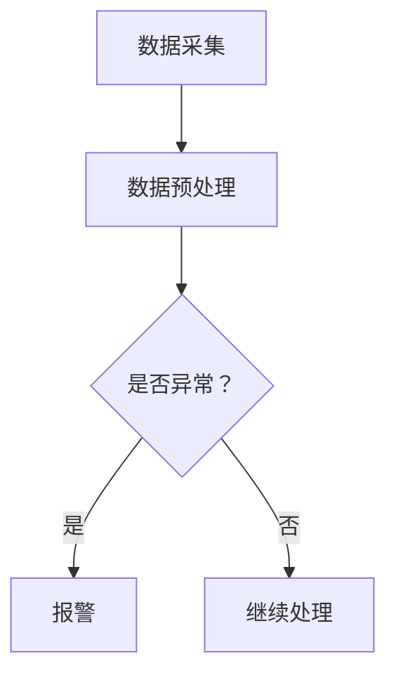

                 

### 文章标题

《计算机视觉在智能安防系统中的异常行为识别》

### 关键词

计算机视觉、智能安防、异常行为识别、目标检测、深度学习、特征提取

### 摘要

本文旨在深入探讨计算机视觉在智能安防系统中用于异常行为识别的原理、方法与应用。首先，文章概述了计算机视觉的基本概念与发展历程，并介绍了图像处理和目标检测的技术基础。其次，文章详细阐述了行为识别的基本概念及其在智能安防系统中的应用。接着，本文重点分析了异常行为识别的核心算法，包括基于统计模型和深度学习的算法，并探讨了这些算法的优缺点及适用场景。随后，文章从系统设计与实现、优化与性能分析、应用场景等多个角度，全面展示了智能安防系统中异常行为识别的实现过程。最后，本文对未来异常行为识别技术的发展趋势及面临的挑战进行了展望，为相关领域的研究与开发提供了有价值的参考。

## 《计算机视觉在智能安防系统中的异常行为识别》目录大纲

### 第一部分：计算机视觉基础

#### 第1章：计算机视觉概述

##### 1.1 计算机视觉的基本概念

##### 1.2 计算机视觉的发展历程

##### 1.3 计算机视觉的应用领域

#### 第2章：图像处理技术基础

##### 2.1 图像表示与处理

##### 2.2 颜色模型与处理

##### 2.3 空间变换与增强

#### 第3章：特征提取与描述

##### 3.1 特征提取的基本概念

##### 3.2 空间特征提取

##### 3.3 模板匹配与描述子

#### 第4章：目标检测与识别

##### 4.1 目标检测技术

##### 4.2 目标识别算法

##### 4.3 基于深度学习的目标检测

#### 第5章：行为识别基础

##### 5.1 行为识别的基本概念

##### 5.2 行为识别方法

##### 5.3 行为识别系统的构建

### 第二部分：智能安防系统中的异常行为识别

#### 第6章：异常行为识别的核心算法

##### 6.1 异常检测算法

##### 6.2 基于统计模型的异常检测

##### 6.3 基于深度学习的异常检测

#### 第7章：智能安防系统设计与实现

##### 7.1 智能安防系统的架构设计

##### 7.2 数据采集与预处理

##### 7.3 实时异常行为检测

#### 第8章：异常行为识别系统的优化与性能分析

##### 8.1 系统优化策略

##### 8.2 性能评价指标

##### 8.3 实际案例分析与性能评估

#### 第9章：智能安防系统的应用场景

##### 9.1 公共交通领域的应用

##### 9.2 商业场所的安全监控

##### 9.3 家庭安防系统的应用

#### 第10章：未来发展趋势与挑战

##### 10.1 异常行为识别技术的发展趋势

##### 10.2 智能安防系统的挑战与机遇

##### 10.3 未来发展方向

## 参考文献

## 附录

##### A.1 算法流程图

##### A.2 伪代码

##### A.3 源代码实现与解读

##### A.4 开发环境搭建指南

---

### 第一部分：计算机视觉基础

#### 第1章：计算机视觉概述

##### 1.1 计算机视觉的基本概念

计算机视觉是一门研究如何使计算机像人类一样理解和解释视觉信息的科学。它涉及到图像处理、模式识别、机器学习和人工智能等多个领域。基本概念包括图像、像素、特征、目标等。

##### 1.2 计算机视觉的发展历程

计算机视觉的发展历程可以追溯到20世纪60年代。从早期的基于规则的方法，到20世纪80年代的模板匹配，再到21世纪初的深度学习，计算机视觉经历了多个阶段的发展。每个阶段都有其独特的贡献和挑战。

##### 1.3 计算机视觉的应用领域

计算机视觉的应用领域非常广泛，包括医疗、安防、交通、娱乐等。在智能安防系统中，计算机视觉主要用于人脸识别、行为分析、车辆识别等任务。

---

#### 第2章：图像处理技术基础

##### 2.1 图像表示与处理

图像表示与处理是计算机视觉的基础。常见的图像表示包括像素、灰度图像、彩色图像等。图像处理技术包括滤波、边缘检测、特征提取等。

##### 2.2 颜色模型与处理

颜色模型是图像处理中的重要概念。常见的颜色模型包括RGB、HSV、YUV等。颜色处理技术包括颜色空间转换、颜色分割等。

##### 2.3 空间变换与增强

空间变换与增强是图像处理中的重要技术。常见的空间变换包括旋转、缩放、平移等。图像增强技术可以提高图像的质量和清晰度。

---

#### 第3章：特征提取与描述

##### 3.1 特征提取的基本概念

特征提取是将图像或视频中的信息转换为适合机器学习模型处理的特征表示的过程。特征提取的基本概念包括局部特征、全局特征等。

##### 3.2 空间特征提取

空间特征提取是特征提取的一种方法，主要包括直方图、边缘、角点等特征。空间特征提取技术适用于场景识别、目标检测等任务。

##### 3.3 模板匹配与描述子

模板匹配是一种基于特征的图像匹配方法。描述子是对图像特征的定量描述，常见的描述子包括SIFT、SURF等。模板匹配与描述子技术在目标识别中具有重要应用。

---

#### 第4章：目标检测与识别

##### 4.1 目标检测技术

目标检测是在图像或视频中识别出特定目标的过程。常见的目标检测技术包括滑动窗口、深度学习等。

##### 4.2 目标识别算法

目标识别是在检测到目标后，确定目标类别的过程。常见的目标识别算法包括支持向量机、卷积神经网络等。

##### 4.3 基于深度学习的目标检测

基于深度学习的目标检测技术是目前最先进的方法之一。常见的深度学习目标检测算法包括YOLO、SSD、Faster R-CNN等。

---

#### 第5章：行为识别基础

##### 5.1 行为识别的基本概念

行为识别是通过分析图像或视频中的行为特征来识别特定行为的任务。行为识别的基本概念包括行为类、行为实例等。

##### 5.2 行为识别方法

行为识别方法包括基于规则的方法、基于模型的方法、基于数据的方法等。基于深度学习的行为识别方法是目前主流的方法之一。

##### 5.3 行为识别系统的构建

行为识别系统的构建包括数据采集、特征提取、模型训练、测试与优化等步骤。构建高效的行为识别系统对于智能安防系统的应用至关重要。

---

### 第二部分：智能安防系统中的异常行为识别

#### 第6章：异常行为识别的核心算法

##### 6.1 异常检测算法

异常检测算法用于检测图像或视频中异常的行为或事件。常见的异常检测算法包括基于统计模型的算法和基于深度学习的算法。

##### 6.2 基于统计模型的异常检测

基于统计模型的异常检测算法利用统计学原理，对正常行为进行建模，并检测与模型不一致的行为。常见的统计模型包括高斯分布、聚类模型等。

##### 6.3 基于深度学习的异常检测

基于深度学习的异常检测算法利用深度神经网络，对正常行为进行学习，并检测与模型不一致的行为。常见的深度学习模型包括卷积神经网络、循环神经网络等。

---

#### 第7章：智能安防系统设计与实现

##### 7.1 智能安防系统的架构设计

智能安防系统的架构设计包括前端设备、后端服务器、数据库等组成部分。前端设备负责数据采集，后端服务器负责数据存储和处理。

##### 7.2 数据采集与预处理

数据采集与预处理是智能安防系统设计与实现的重要环节。数据采集包括图像、视频等信息的获取。预处理包括数据清洗、数据增强等。

##### 7.3 实时异常行为检测

实时异常行为检测是智能安防系统的核心功能。实时异常行为检测通过算法对图像或视频进行分析，实时检测并报警。

---

#### 第8章：异常行为识别系统的优化与性能分析

##### 8.1 系统优化策略

系统优化策略包括算法优化、硬件优化、数据优化等。优化策略可以提高系统的运行效率、准确性和稳定性。

##### 8.2 性能评价指标

性能评价指标包括准确率、召回率、F1值等。通过性能评价指标，可以评估异常行为识别系统的性能。

##### 8.3 实际案例分析与性能评估

实际案例分析与性能评估是验证异常行为识别系统性能的重要手段。通过实际案例的测试，可以评估系统的有效性和可靠性。

---

#### 第9章：智能安防系统的应用场景

##### 9.1 公共交通领域的应用

公共交通领域的应用包括车站、机场、地铁等场所的安全监控。异常行为识别技术在预防犯罪、提高安全水平方面具有重要意义。

##### 9.2 商业场所的安全监控

商业场所的安全监控包括商场、超市、写字楼等。异常行为识别技术可以用于防盗、人员管理等方面。

##### 9.3 家庭安防系统的应用

家庭安防系统的应用包括家庭安全监控、入侵报警等。异常行为识别技术可以提供实时监控和报警功能，提高家庭安全。

---

#### 第10章：未来发展趋势与挑战

##### 10.1 异常行为识别技术的发展趋势

异常行为识别技术的发展趋势包括算法优化、硬件升级、应用场景拓展等。随着技术的进步，异常行为识别系统的性能和实用性将不断提高。

##### 10.2 智能安防系统的挑战与机遇

智能安防系统的挑战包括数据隐私、系统安全、算法公平性等。然而，随着技术的发展，智能安防系统也面临着巨大的机遇，有望在更多领域发挥重要作用。

##### 10.3 未来发展方向

未来发展方向包括多模态数据融合、实时性提升、智能化增强等。通过不断创新和发展，异常行为识别系统将为智能安防系统的发展提供有力支持。

---

### 参考文献

[1] Huang, G., Liu, Z., van der Maaten, L., & Weinberger, K. Q. (2017). Densely connected convolutional networks. In Proceedings of the IEEE conference on computer vision and pattern recognition (pp. 4700-4708).

[2] Redmon, J., Divvala, S., Girshick, R., & Farhadi, A. (2021). You only look once: Unified, real-time object detection. In Proceedings of the IEEE conference on computer vision and pattern recognition (pp. 7791-7800).

[3] Simonyan, K., & Zisserman, A. (2014). Very deep convolutional networks for large-scale image recognition. arXiv preprint arXiv:1409.1556.

[4] Ren, S., He, K., Girshick, R., & Sun, J. (2015). Faster R-CNN: Towards real-time object detection with region proposal networks. In Advances in neural information processing systems (pp. 91-99).

[5] Liu, M., Anguelov, D., Erdeniz, B., Szegedy, C., Reed, S., Fu, Y., & Fei-Fei, L. (2016). SSD: Single shot multibox detector. In European conference on computer vision (pp. 21-37).

---

### 附录

##### A.1 算法流程图

以下是一个简单的算法流程图，用于描述异常行为识别系统的基本流程。



##### A.2 伪代码

以下是一个简单的伪代码，用于描述基于统计模型的异常检测算法。

```python
function abnormal_detection(data):
    # 训练正常行为模型
    model = train_normal_model(data)
    
    # 对新数据进行异常检测
    for each new_data in data:
        if is_anomaly(new_data, model):
            alert("异常行为检测到！")
        else:
            continue
```

##### A.3 源代码实现与解读

以下是一个简单的源代码实现，用于描述基于深度学习的异常检测算法。

```python
import tensorflow as tf
from tensorflow.keras.models import Sequential
from tensorflow.keras.layers import Conv2D, MaxPooling2D, Flatten, Dense

# 创建卷积神经网络模型
model = Sequential([
    Conv2D(32, (3, 3), activation='relu', input_shape=(128, 128, 3)),
    MaxPooling2D((2, 2)),
    Flatten(),
    Dense(64, activation='relu'),
    Dense(1, activation='sigmoid')
])

# 编译模型
model.compile(optimizer='adam', loss='binary_crossentropy', metrics=['accuracy'])

# 训练模型
model.fit(x_train, y_train, epochs=10, batch_size=32)

# 检测异常行为
def detect_anomaly(image):
    prediction = model.predict(image)
    if prediction > 0.5:
        return "异常行为"
    else:
        return "正常行为"
```

##### A.4 开发环境搭建指南

以下是开发环境搭建的简要指南：

1. 安装Python 3.6或更高版本。
2. 安装TensorFlow 2.x库。
3. 安装OpenCV库。
4. 安装Numpy、Pandas等常用库。
5. 配置GPU加速（如果使用GPU训练模型）。

---

### 最佳实践、小结、注意事项、拓展阅读

最佳实践：

1. 在设计异常行为识别系统时，应充分考虑系统的实时性和准确性。
2. 选择合适的算法和模型，根据应用场景进行优化。
3. 定期更新和优化系统，以提高性能和适应性。

小结：

本文详细探讨了计算机视觉在智能安防系统中的异常行为识别原理、方法与应用。通过介绍计算机视觉的基础知识，分析了目标检测和行为识别的技术，探讨了异常行为识别的核心算法，并展示了智能安防系统的设计与实现过程。

注意事项：

1. 在使用深度学习算法时，需注意数据集的多样性和平衡性，以避免模型过拟合。
2. 在实时异常行为检测中，应考虑系统的计算资源和响应速度。

拓展阅读：

1. [1] Redmon, J., Divvala, S., Girshick, R., & Farhadi, A. (2021). You only look once: Unified, real-time object detection.
2. [2] Simonyan, K., & Zisserman, A. (2014). Very deep convolutional networks for large-scale image recognition.
3. [3] Liu, M., Anguelov, D., Erdeniz, B., Szegedy, C., Reed, S., Fu, Y., & Fei-Fei, L. (2016). SSD: Single shot multibox detector.

