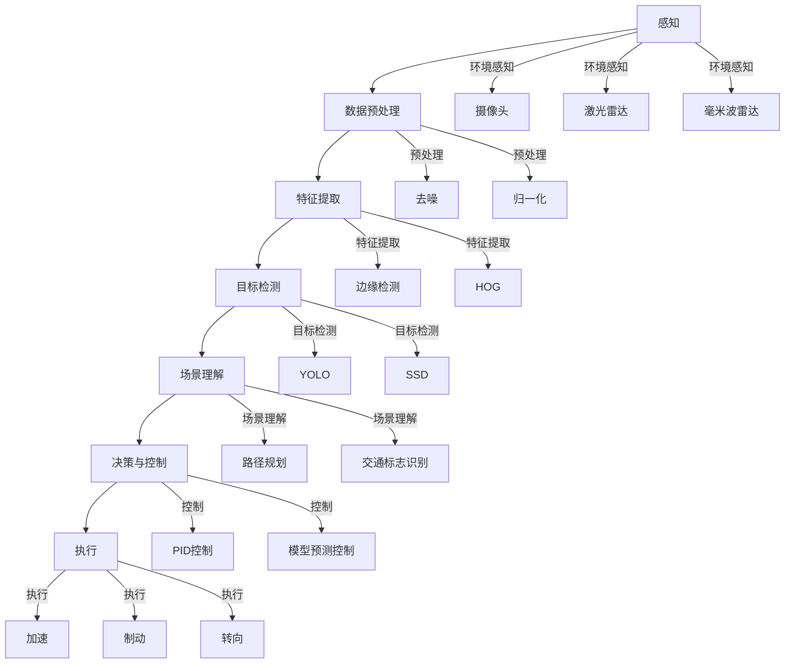

                 


### 第一部分：引言与基础

## 第1章：自动驾驶与计算机视觉概述

### 1.1 自动驾驶的发展历程与技术背景

自动驾驶技术的发展起源于20世纪50年代，最早的自动驾驶概念是由美国海军在1950年提出的。当时，研究者们开始探索利用雷达和摄像头等设备来帮助汽车进行自主导航。然而，由于技术的限制，早期的自动驾驶仅限于实验室环境下的简单场景。

随着计算机技术和传感器技术的不断发展，自动驾驶技术逐渐走向实用化。20世纪80年代，美国卡内基梅隆大学的研究团队开始进行自动驾驶汽车的研发，并成功在1986年实现了自动驾驶汽车的首次公开演示。这一里程碑事件标志着自动驾驶技术进入了新的发展阶段。

进入21世纪，随着人工智能、大数据和云计算等技术的迅猛发展，自动驾驶技术迎来了新的突破。自动驾驶汽车开始逐渐从实验室走向现实，各大科技公司和汽车制造商纷纷投入大量资源进行研发。目前，自动驾驶技术已经从研发阶段逐步进入商业化阶段，一些自动驾驶汽车已经在特定区域内进行商业化运营。

### 1.2 计算机视觉的基本原理

计算机视觉是研究如何使计算机能够像人类一样理解、解释和感知数字图像或视频的一门科学。计算机视觉的核心目标是实现图像识别、目标检测、场景理解等功能。

计算机视觉的基本原理可以分为三个层次：感知、理解和推理。在感知层次，计算机通过对图像进行预处理、特征提取和分类等操作，实现对图像的初步理解。在理解层次，计算机通过综合分析图像中的各种特征，对图像中的物体、场景和动作进行识别和分类。在推理层次，计算机通过逻辑推理和决策算法，实现对图像的更高层次的理解和预测。

计算机视觉的基本流程包括：图像预处理、特征提取、分类和目标检测等步骤。其中，图像预处理主要包括图像增强、滤波和几何变换等操作，目的是提高图像的质量，为后续的特征提取和分类提供更好的基础。特征提取是计算机视觉的核心技术之一，常见的特征提取方法包括边缘检测、角点检测、纹理分析等。分类和目标检测是计算机视觉的最终目标，通过分类算法可以将图像中的物体或场景进行分类，而目标检测则是识别图像中的特定目标对象。

### 1.3 计算机视觉在自动驾驶中的应用价值

计算机视觉技术在自动驾驶中具有重要的作用，主要体现在以下几个方面：

1. **感知环境**：自动驾驶汽车需要实时感知周围环境，包括车辆、行人、交通标志、车道线等。计算机视觉技术可以帮助自动驾驶汽车获取环境信息，实现对周围环境的准确感知。

2. **目标检测**：计算机视觉技术可以实现对图像中的车辆、行人等目标的检测，从而帮助自动驾驶汽车识别和跟踪目标对象。

3. **场景理解**：计算机视觉技术可以对图像中的场景进行理解，识别道路、交通标志、交通信号灯等，从而帮助自动驾驶汽车进行决策和控制。

4. **路径规划**：计算机视觉技术可以结合环境感知数据，为自动驾驶汽车提供可靠的路径规划，确保汽车在复杂道路环境下的安全行驶。

5. **安全监测**：计算机视觉技术可以实现对自动驾驶汽车运行状态的监控，及时发现潜在的安全隐患，提高自动驾驶汽车的安全性。

总之，计算机视觉技术在自动驾驶中扮演着关键的角色，其发展水平直接影响到自动驾驶汽车的性能和安全性。随着计算机视觉技术的不断进步，自动驾驶汽车将能够更好地理解周围环境，提高行驶的稳定性和安全性。

## 第2章：自动驾驶场景的理解需求

### 2.1 自动驾驶场景分类

自动驾驶场景可以根据不同的标准进行分类。常见的分类方法包括按照道路类型、交通状况、天气条件等。

- **按照道路类型分类**：

  - 城市道路：城市道路通常交通状况复杂，行人、自行车、机动车等混杂在一起，道路环境多变，对自动驾驶系统的感知和决策能力要求较高。

  - 高速公路：高速公路道路条件相对简单，车速较高，车辆相对较少，但高速公路上的行车规则与城市道路不同，对自动驾驶系统也提出了不同的要求。

  - 市郊道路：市郊道路介于城市道路和高速公路之间，交通状况相对简单，但路况多变，对自动驾驶系统的适应性要求较高。

- **按照交通状况分类**：

  - 清空道路：清空道路指车辆稀少，交通状况良好的道路，适合进行自动驾驶测试和验证。

  - 轻度拥堵：轻度拥堵道路指车辆较多，但车速较慢，交通流量较大的道路，对自动驾驶系统的决策和控制能力有较高要求。

  - 严重拥堵：严重拥堵道路指车辆拥堵，车速几乎为零的道路，对自动驾驶系统的稳定性和耐久性要求较高。

- **按照天气条件分类**：

  - 晴天：晴天条件下，光照充足，道路和目标物体的识别较为容易。

  - 雨天：雨天条件下，道路湿滑，能见度降低，对自动驾驶系统的感知和决策能力有较大影响。

  - 雪天：雪天条件下，道路结冰，能见度降低，对自动驾驶系统的稳定性有较大影响。

### 2.2 场景理解的关键要素

自动驾驶场景理解的关键要素包括道路信息、车辆信息、行人信息和交通信号等。以下分别对这些要素进行详细介绍：

- **道路信息**：

  - 车道线：车道线是自动驾驶汽车进行定位和导航的重要参考，通过识别车道线，自动驾驶汽车可以确定自身在道路上的位置和行驶方向。

  - 道路标志：道路标志包括交通标志、道路标线等，它们为自动驾驶汽车提供道路信息，如限速、禁止通行等，对自动驾驶汽车的决策和控制有重要影响。

  - 道路结构：道路结构包括道路宽度、道路坡度、道路曲率等，它们影响自动驾驶汽车的行驶速度和驾驶模式。

- **车辆信息**：

  - 车辆检测：通过计算机视觉技术，自动驾驶汽车可以识别道路上的其他车辆，包括车辆类型、位置、速度等，为自动驾驶汽车的决策和控制提供基础。

  - 车辆跟踪：通过跟踪车辆的运动轨迹，自动驾驶汽车可以预测其他车辆的行为，从而更好地规划自己的行驶路径。

  - 车辆行为分析：分析其他车辆的行为，如加速、减速、变道等，有助于自动驾驶汽车做出合理的驾驶决策。

- **行人信息**：

  - 行人检测：通过计算机视觉技术，自动驾驶汽车可以识别道路上的行人，包括行人类型、位置、速度等，为自动驾驶汽车的决策和控制提供基础。

  - 行人行为分析：分析行人的行为，如行走、奔跑、招手等，有助于自动驾驶汽车预测行人的下一步动作，从而做出更安全的驾驶决策。

- **交通信号**：

  - 交通信号灯：通过计算机视觉技术，自动驾驶汽车可以识别交通信号灯的状态，包括红灯、黄灯和绿灯，为自动驾驶汽车的行驶提供信号。

  - 交通标志：交通标志包括各种交通信号、警告标志等，它们为自动驾驶汽车提供额外的道路信息，有助于自动驾驶汽车做出更准确的决策。

### 2.3 场景理解的技术挑战

自动驾驶场景理解面临以下技术挑战：

- **多模态数据融合**：自动驾驶场景理解需要处理多种类型的数据，如摄像头、雷达、激光雷达等。如何有效地融合这些多模态数据，提高场景理解的准确性，是一个重要挑战。

- **复杂环境建模**：自动驾驶场景复杂多变，包括各种天气条件、交通状况等。如何建立准确的场景模型，实现对复杂环境的感知和理解，是一个关键技术挑战。

- **实时性要求**：自动驾驶系统需要实时感知和理解周围环境，做出快速响应。如何提高场景理解的速度和实时性，是一个重要挑战。

- **鲁棒性和可靠性**：自动驾驶系统需要在各种复杂和不确定的环境下稳定运行。如何提高系统的鲁棒性和可靠性，减少错误和故障，是一个关键技术挑战。

- **安全性和伦理问题**：自动驾驶系统涉及到人类的安全和生命，必须确保系统的安全性和可靠性。同时，自动驾驶系统还面临伦理问题，如如何处理紧急情况、如何分配责任等，需要深入研究和探讨。

总之，自动驾驶场景理解是一个复杂且具有挑战性的任务，需要结合多模态数据融合、复杂环境建模、实时性要求、鲁棒性和可靠性等多个方面的技术手段，不断提升自动驾驶系统的性能和安全性。

### 第二部分：计算机视觉核心技术与算法

## 第3章：图像处理基础

### 3.1 图像处理基本概念

图像处理是计算机视觉的重要基础，其核心目的是对图像进行预处理、增强和变换，以便更好地进行后续的特征提取和目标检测等操作。图像处理的基本概念包括图像表示、图像预处理、图像增强和图像变换等。

#### 图像表示

图像可以表示为一个二维函数：

$$
I(x, y) = f(x, y)
$$

其中，\(I(x, y)\) 表示图像在 \(x, y\) 坐标下的像素值，\(f(x, y)\) 是一个连续函数。在实际应用中，图像通常以离散形式表示，每个像素点的值代表该点的亮度或颜色信息。

#### 图像预处理

图像预处理是图像处理的第一步，其主要目的是改善图像的质量，提高后续处理的准确性和效率。常见的预处理操作包括去噪、边缘检测、图像增强和图像分割等。

1. **去噪**：图像在采集和处理过程中可能会引入噪声，去噪操作可以去除图像中的噪声，提高图像的清晰度。

2. **边缘检测**：边缘检测是图像处理中的重要步骤，用于检测图像中的边缘和轮廓。常见的边缘检测算法包括Sobel算子、Canny算子等。

3. **图像增强**：图像增强是通过调整图像的对比度、亮度、色彩等参数，使图像更易于观察和理解。常见的图像增强方法包括直方图均衡化、对比度拉伸等。

4. **图像分割**：图像分割是将图像划分为不同的区域，每个区域具有相似的特征。图像分割是计算机视觉中的基础步骤，为后续的特征提取和目标检测提供支持。

#### 图像增强技术

图像增强技术是图像处理中的重要内容，其目的是提高图像的质量，使图像更清晰、更易于理解。常见的图像增强技术包括：

1. **直方图均衡化**：直方图均衡化是一种常见的图像增强方法，用于改善图像的对比度。通过调整图像的像素值分布，使图像中的每个灰度级都能得到较好的表现。

2. **对比度拉伸**：对比度拉伸是通过调整图像的亮度范围，提高图像的对比度。对比度拉伸可以通过对图像进行线性变换来实现。

3. **中值滤波**：中值滤波是一种常用的图像去噪方法，通过取图像中每个像素点的中值来去除噪声。

4. **高斯滤波**：高斯滤波是一种常用的图像平滑方法，通过使用高斯核函数对图像进行卷积，去除图像中的高频噪声。

#### 图像变换

图像变换是将图像从一种表示形式转换为另一种表示形式的过程，常见的图像变换包括傅里叶变换、离散余弦变换、小波变换等。

1. **傅里叶变换**：傅里叶变换是一种重要的图像变换方法，可以将图像从时域转换为频域。在频域中，图像的频率成分被分离出来，有助于分析图像的频率特性。

2. **离散余弦变换**：离散余弦变换是傅里叶变换的另一种形式，它将图像从时域转换为频域，并使用余弦函数进行变换。

3. **小波变换**：小波变换是一种多分辨率分析工具，可以将图像分解为不同尺度和方向的细节和近似信息。小波变换在图像压缩、去噪和特征提取等方面具有广泛的应用。

### 3.2 边缘检测算法

边缘检测是图像处理中的重要步骤，用于检测图像中的边缘和轮廓。边缘检测算法可以分为基于零交叉法和基于梯度的方法。

#### 基于零交叉法的边缘检测

基于零交叉法的边缘检测算法通过检测图像的梯度函数的零交叉点来检测边缘。常见的算法包括罗宾逊（Robinson）算子和拉普拉斯（Laplacian）算子。

1. **罗宾逊算子**：罗宾逊算子是一种简单的边缘检测算法，通过计算图像的二维差分来检测边缘。

$$
\text{Robinson}(x, y) = \sum_{i=-1}^{1} \sum_{j=-1}^{1} G(i, j) \cdot I(x+i, y+j)
$$

其中，\(G(i, j)\) 是罗宾逊算子的核函数，\(I(x, y)\) 是图像在 \(x, y\) 坐标下的像素值。

2. **拉普拉斯算子**：拉普拉斯算子是一种常用的边缘检测算法，通过计算图像的二阶导数来检测边缘。

$$
\text{Laplacian}(x, y) = \frac{\partial^2 I}{\partial x^2} + \frac{\partial^2 I}{\partial y^2}
$$

#### 基于梯度的边缘检测

基于梯度的边缘检测算法通过计算图像的梯度来检测边缘。常见的算法包括Sobel算子和Canny算子。

1. **Sobel算子**：Sobel算子通过计算图像的水平和垂直梯度来检测边缘。

$$
\text{Sobel}(x, y) = \left| \frac{\partial I}{\partial x} \right| + \left| \frac{\partial I}{\partial y} \right|
$$

其中，\(\frac{\partial I}{\partial x}\) 和 \(\frac{\partial I}{\partial y}\) 分别是图像在 \(x\) 和 \(y\) 方向的梯度。

2. **Canny算子**：Canny算子是一种优化后的边缘检测算法，通过计算图像的梯度、非极大值抑制和双阈值分割来检测边缘。

$$
\text{Canny}(x, y) = \text{max}\left( \left| \frac{\partial I}{\partial x} \right|, \left| \frac{\partial I}{\partial y} \right| \right)
$$

### 3.3 形态学操作

形态学操作是一种基于结构元素的图像处理方法，用于处理图像中的形状和结构信息。形态学操作主要包括膨胀、腐蚀、开运算和闭运算等。

1. **膨胀**：膨胀操作通过在图像中添加像素来增大图像中的结构。

$$
\text{膨胀}(I) = \text{卷积}(I, S)
$$

其中，\(S\) 是膨胀操作的结构元素，\(I\) 是输入图像。

2. **腐蚀**：腐蚀操作通过移除图像中的像素来减小图像中的结构。

$$
\text{腐蚀}(I) = \text{卷积}(I, S)
$$

其中，\(S\) 是腐蚀操作的结构元素，\(I\) 是输入图像。

3. **开运算**：开运算是将腐蚀操作和膨胀操作结合，用于去除图像中的小结构。

$$
\text{开运算}(I) = \text{腐蚀}(\text{膨胀}(I))
$$

4. **闭运算**：闭运算是将膨胀操作和腐蚀操作结合，用于封闭图像中的结构。

$$
\text{闭运算}(I) = \text{膨胀}(\text{腐蚀}(I))
$$

### 3.4 图像增强技术

图像增强技术用于提高图像的视觉效果，使其更清晰、更易于理解。常见的图像增强技术包括直方图均衡化、对比度拉伸、中值滤波和高斯滤波等。

1. **直方图均衡化**：直方图均衡化通过调整图像的像素值分布，使图像的每个灰度级都能得到较好的表现。

$$
I'(x, y) = \text{min} \left( L - 1, \left( L - 1 \right) \cdot \frac{\sum_{i=0}^{L-1} N(i)}{N} \right)
$$

其中，\(I(x, y)\) 是原始图像，\(I'(x, y)\) 是增强后的图像，\(L\) 是图像的最大灰度级，\(N\) 是图像中像素的总数，\(N(i)\) 是图像中灰度级为 \(i\) 的像素数。

2. **对比度拉伸**：对比度拉伸通过调整图像的亮度范围，提高图像的对比度。

$$
I'(x, y) = \text{min} \left( \text{max} \left( 0, x - \text{min} \right), \text{max} \right)

其中，\(I(x, y)\) 是原始图像，\(I'(x, y)\) 是增强后的图像，\(\text{min}\) 是图像的最小像素值，\(\text{max}\) 是图像的最大像素值。

3. **中值滤波**：中值滤波通过取图像中每个像素点的中值来去除噪声。

$$
I'(x, y) = \text{median} \left( I(x-1, y-1), I(x-1, y), I(x-1, y+1), I(x, y-1), I(x, y), I(x, y+1), I(x+1, y-1), I(x+1, y), I(x+1, y+1) \right)
$$

其中，\(I(x, y)\) 是原始图像，\(I'(x, y)\) 是滤波后的图像。

4. **高斯滤波**：高斯滤波通过使用高斯核函数对图像进行卷积，去除图像中的高频噪声。

$$
I'(x, y) = \sum_{i=-\infty}^{\infty} \sum_{j=-\infty}^{\infty} G(i, j) \cdot I(x+i, y+j)
$$

其中，\(G(i, j)\) 是高斯滤波器的核函数，\(I(x, y)\) 是原始图像，\(I'(x, y)\) 是滤波后的图像。

## 第4章：特征提取与降维

### 4.1 描述子与特征点

特征提取是计算机视觉中至关重要的一环，其主要任务是从图像或视频中提取具有区分性的特征，以实现图像识别、目标检测和场景理解等任务。描述子和特征点是特征提取中的两个核心概念。

#### 描述子

描述子是一组用于描述图像或视频特征的数值，通常用于表示图像的局部结构和内容。描述子的选择和设计对于特征提取的效果至关重要。常见的描述子包括：

1. **SIFT（尺度不变特征变换）**：SIFT是一种广泛应用于图像识别和目标检测的描述子，它能够提取出在尺度、旋转和光照变化下仍然具有区分性的特征点。

   SIFT描述子的计算步骤如下：

   - **关键点检测**：通过计算图像的梯度和曲率，检测出图像中的关键点。

   - **关键点定位**：利用关键点的梯度方向，对关键点进行精确定位。

   - **特征向量计算**：对关键点周围的图像区域进行采样，计算出一个特征向量，用于表示关键点的特征。

   - **特征向量降维**：为了减少特征向量的维度，通常使用主成分分析（PCA）等方法对特征向量进行降维处理。

2. **SURF（加速稳健特征）**：SURF是一种基于SIFT的描述子，它在计算效率和鲁棒性方面有所改进。SURF描述子通过计算图像的快速响应直方图来提取特征。

   SURF描述子的计算步骤如下：

   - **关键点检测**：通过计算图像的快速响应直方图，检测出图像中的关键点。

   - **关键点定位**：利用关键点的响应值，对关键点进行精确定位。

   - **特征向量计算**：对关键点周围的图像区域进行采样，计算出一个特征向量，用于表示关键点的特征。

   - **特征向量降维**：为了减少特征向量的维度，通常使用主成分分析（PCA）等方法对特征向量进行降维处理。

#### 特征点

特征点是指图像或视频中的具有明显特征的点，如角点、边缘点等。特征点在图像识别和目标检测中具有重要的应用价值，因为它们能够提供丰富的图像信息。

1. **角点检测**：角点是图像中具有明显特征的点，通常出现在图像的边缘和角落。常见的角点检测算法包括Shi-Tomasi角点检测算法和Harris角点检测算法。

   - **Shi-Tomasi角点检测算法**：Shi-Tomasi角点检测算法通过计算图像的梯度方向和梯度幅度，检测出图像中的角点。

   - **Harris角点检测算法**：Harris角点检测算法通过计算图像的二次曲率矩阵，检测出图像中的角点。

2. **边缘点检测**：边缘点是图像中亮度变化明显的点，通常表示图像中的物体边缘。常见的边缘点检测算法包括Sobel算子、Canny算子等。

   - **Sobel算子**：Sobel算子通过计算图像的水平和垂直梯度，检测出图像中的边缘点。

   - **Canny算子**：Canny算子是一种优化的边缘检测算法，通过计算图像的梯度幅度和方向，检测出图像中的边缘点。

### 4.2 SIFT与SURF算法

SIFT（尺度不变特征变换）和SURF（加速稳健特征）是两种广泛应用于图像识别和目标检测的特征提取算法。它们能够在不同的尺度、旋转和光照变化下提取出具有区分性的特征，具有很高的稳定性和鲁棒性。

#### SIFT算法

SIFT算法的基本步骤如下：

1. **关键点检测**：

   - **计算图像的梯度和曲率**：对图像进行微分计算，得到图像的梯度方向和梯度幅度。计算图像的曲率矩阵，用于判断关键点的显著性。

   - **检测关键点**：通过比较梯度方向和曲率矩阵的值，检测出图像中的关键点。关键点的特征包括梯度方向和梯度幅度。

2. **关键点定位**：

   - **高斯金字塔**：对图像进行多尺度处理，构建高斯金字塔。在高斯金字塔的不同尺度层上，对关键点进行精确定位。

   - **峰值检测**：在关键点周围进行局部搜索，找到梯度幅值的最大值，确定关键点的位置。

3. **特征向量计算**：

   - **奥卡奇尼采采样**：在关键点周围构建一个区域，对区域内的像素进行采样。采样点的数量和位置可以通过奥卡奇尼采采样表来确定。

   - **特征向量计算**：对采样点进行差分计算，得到特征向量。特征向量用于描述关键点的局部特征。

4. **特征向量降维**：

   - **主成分分析（PCA）**：使用主成分分析对特征向量进行降维处理，减少特征向量的维度。

#### SURF算法

SURF算法的基本步骤如下：

1. **关键点检测**：

   - **计算图像的快速响应直方图**：通过计算图像的快速响应直方图，检测出图像中的关键点。

   - **检测关键点**：通过比较快速响应直方图的值，检测出图像中的关键点。关键点的特征包括响应直方图的峰值和梯度方向。

2. **关键点定位**：

   - **快速响应直方图**：在关键点周围构建一个区域，对区域内的像素进行采样。采样点的数量和位置可以通过快速响应直方图来确定。

   - **峰值检测**：在关键点周围进行局部搜索，找到快速响应直方图的峰值，确定关键点的位置。

3. **特征向量计算**：

   - **快速响应直方图**：在关键点周围构建一个区域，对区域内的像素进行采样。采样点的数量和位置可以通过快速响应直方图来确定。

   - **特征向量计算**：对采样点进行差分计算，得到特征向量。特征向量用于描述关键点的局部特征。

4. **特征向量降维**：

   - **主成分分析（PCA）**：使用主成分分析对特征向量进行降维处理，减少特征向量的维度。

### 4.3 卷积神经网络与特征提取

卷积神经网络（Convolutional Neural Network，CNN）是计算机视觉领域中的一种重要模型，能够自动提取图像的局部特征，并在大量数据训练下实现高精度的图像识别和目标检测。

#### CNN基本原理

CNN的基本原理是通过多层卷积层、池化层和全连接层进行特征提取和分类。卷积层通过计算输入图像和卷积核的卷积，提取图像的局部特征。池化层用于减小特征图的大小，减少计算量和参数数量。全连接层用于对特征进行分类。

1. **卷积层**：

   - **卷积运算**：卷积层通过计算输入图像和卷积核的卷积，提取图像的局部特征。卷积运算的基本公式如下：

     $$  
     \text{output}_{ij} = \sum_{k=1}^{C} w_{ik} \cdot \text{input}_{kj} + b_i  
     $$

     其中，\(\text{output}_{ij}\) 是卷积层的输出，\(w_{ik}\) 是卷积核，\(\text{input}_{kj}\) 是输入图像，\(b_i\) 是偏置项。

   - **激活函数**：卷积层通常使用激活函数，如ReLU（修正线性单元），对卷积结果进行非线性变换。

2. **池化层**：

   - **最大池化**：最大池化通过取特征图上的最大值来减小特征图的大小。最大池化的基本公式如下：

     $$  
     \text{output}_{ij} = \text{max} \left( \text{input}_{ij + \Delta x}, \text{input}_{ij + \Delta y} \right)  
     $$

     其中，\(\text{output}_{ij}\) 是池化层的输出，\(\text{input}_{ij}\) 是输入特征图，\(\Delta x\) 和 \(\Delta y\) 是池化窗口的大小。

   - **平均池化**：平均池化通过取特征图上的平均值来减小特征图的大小。

3. **全连接层**：

   - **全连接层**：全连接层将特征图上的所有像素值连接到一个神经元上，进行分类或回归。

   - **激活函数**：全连接层通常使用Softmax函数进行分类。

#### CNN在特征提取中的应用

CNN在特征提取中的应用主要包括以下几个方面：

1. **图像分类**：通过训练CNN模型，自动提取图像的局部特征，并在大量数据训练下实现高精度的图像分类。

2. **目标检测**：通过在CNN模型中添加额外的层，如Region Proposal Network（RPN）和Box Regression层，实现目标检测。

3. **语义分割**：通过在CNN模型中添加额外的层，如卷积层和全连接层，实现语义分割。

4. **姿态估计**：通过在CNN模型中添加额外的层，如卷积层和全连接层，实现姿态估计。

### 4.4 描述子与特征点的选择与优化

在计算机视觉中，描述子和特征点的选择与优化对于特征提取的效果至关重要。以下是一些常见的优化方法：

1. **描述子优化**：

   - **量化描述子**：通过量化描述子的数值，减少描述子的维度，提高计算效率。

   - **特征向量拼接**：将多个描述子拼接在一起，形成一个更长的特征向量，提高特征的区分性。

   - **特征向量降维**：使用降维算法，如主成分分析（PCA）和线性判别分析（LDA），减少特征向量的维度，同时保持重要的特征信息。

2. **特征点优化**：

   - **关键点检测算法优化**：通过优化关键点检测算法，提高关键点的质量和数量。

   - **特征点定位优化**：通过优化特征点定位算法，提高特征点的精确度。

   - **特征点筛选**：通过筛选特征点，去除噪声和重复的特征点，提高特征点的质量。

### 4.5 特征提取与降维的应用场景

特征提取与降维在计算机视觉中具有广泛的应用场景，以下是一些常见的应用：

1. **图像分类**：通过提取图像的局部特征，实现图像的分类。

2. **目标检测**：通过提取图像中的目标特征，实现目标检测。

3. **语义分割**：通过提取图像的像素级特征，实现图像的语义分割。

4. **姿态估计**：通过提取图像中的人体特征，实现姿态估计。

5. **图像检索**：通过提取图像的特征，实现基于内容的图像检索。

### 总结

特征提取与降维是计算机视觉中的核心技术，通过提取图像的局部特征，实现图像分类、目标检测、语义分割、姿态估计等任务。描述子和特征点是特征提取中的关键概念，它们的选择与优化对于特征提取的效果至关重要。随着计算机视觉技术的不断发展，特征提取与降维技术也在不断优化和改进，为计算机视觉领域带来了更多的应用可能性。

## 第5章：目标检测与跟踪

### 5.1 目标检测算法

目标检测是计算机视觉中的核心任务之一，其目的是在图像或视频中识别并定位特定的目标对象。目标检测算法可以分为两大类：基于传统机器学习的方法和基于深度学习的方法。

#### 基于传统机器学习的方法

基于传统机器学习的方法主要依赖于手工设计的特征和分类器，常见的方法包括：

1. **HOG（Histogram of Oriented Gradients）**：HOG特征通过计算图像中每个像素点的梯度方向和幅度，形成梯度直方图，从而描述图像的局部形状特征。HOG特征结合SVM（支持向量机）分类器，可以实现高效的目标检测。

2. **SLAM（Scale-invariant Feature Transform）**：SIFT特征是一种局部特征，能够在不同尺度、旋转和光照变化下保持不变。SIFT特征结合SVM分类器，可以实现高精度的目标检测。

3. **HSVM（Histogram of Oriented Gradients with Support Vector Machine）**：HSVM结合了HOG和SVM的特征，通过对HOG特征进行分类来实现目标检测。

#### 基于深度学习的方法

基于深度学习的方法在目标检测领域取得了显著的突破，其核心思想是通过神经网络自动提取图像的局部特征并进行分类。常见的深度学习方法包括：

1. **R-CNN（Region-based CNN）**：R-CNN是一种基于区域建议的目标检测方法，其流程包括区域建议、候选区域生成、特征提取和分类。R-CNN通过Fast R-CNN、Faster R-CNN等改进，实现了高效的区域建议和特征提取。

2. **YOLO（You Only Look Once）**：YOLO是一种单阶段目标检测方法，通过将图像分割为多个网格单元，并在每个单元中预测目标的类别和位置。YOLO实现了实时目标检测，但精确度相对较低。

3. **SSD（Single Shot MultiBox Detector）**：SSD是一种单阶段目标检测方法，通过多个尺度层级的特征图来检测目标。SSD在精度和速度方面取得了良好的平衡。

4. **Faster R-CNN**：Faster R-CNN通过引入Region Proposal Network（RPN）来实现快速的区域建议，结合CNN进行特征提取和分类。Faster R-CNN在目标检测中取得了较高的精度。

5. **Mask R-CNN**：Mask R-CNN是在Faster R-CNN的基础上加入了一个分支，用于预测目标的掩膜，从而实现目标实例分割。Mask R-CNN在图像分割任务中取得了显著的效果。

### 5.2 R-CNN系列算法

R-CNN系列算法是目标检测领域的重要方法之一，其核心思想是通过区域建议、候选区域生成、特征提取和分类等步骤来实现目标检测。R-CNN系列算法包括R-CNN、Fast R-CNN、Faster R-CNN和Mask R-CNN等。

#### R-CNN

R-CNN是R-CNN系列算法的基础，其核心步骤如下：

1. **区域建议**：通过选择性搜索（Selective Search）算法，生成候选区域。

2. **候选区域生成**：对每个候选区域，使用SVM分类器进行类别预测。

3. **特征提取**：对每个候选区域，使用CNN进行特征提取。

4. **分类**：对提取到的特征，使用SVM分类器进行类别预测。

R-CNN的优点是算法简单，易于实现。然而，其缺点包括候选区域生成速度较慢，特征提取和分类步骤耗时较长。

#### Fast R-CNN

Fast R-CNN是对R-CNN的改进，其核心步骤如下：

1. **区域建议**：与R-CNN相同。

2. **候选区域生成**：与R-CNN相同。

3. **特征提取**：引入Region of Interest（RoI）池化层，将候选区域映射到一个固定的特征图上进行特征提取。

4. **分类**：对提取到的特征，使用SVM分类器进行类别预测。

Fast R-CNN的优点是候选区域生成速度较快，特征提取和分类步骤简化。然而，其缺点是RoI池化层导致特征图的分辨率降低，影响分类效果。

#### Faster R-CNN

Faster R-CNN是对Fast R-CNN的进一步改进，其核心步骤如下：

1. **区域建议**：与Fast R-CNN相同。

2. **候选区域生成**：与Fast R-CNN相同。

3. **特征提取**：引入Region Proposal Network（RPN），用于生成候选区域。

4. **分类**：对提取到的特征，使用SVM分类器进行类别预测。

Faster R-CNN的优点是RPN显著提高了候选区域生成的速度，同时特征提取和分类步骤简化。然而，其缺点是RPN的准确性对整体检测效果有较大影响。

#### Mask R-CNN

Mask R-CNN是在Faster R-CNN的基础上加入了一个分支，用于预测目标的掩膜，从而实现目标实例分割。Mask R-CNN的核心步骤如下：

1. **区域建议**：与Faster R-CNN相同。

2. **候选区域生成**：与Faster R-CNN相同。

3. **特征提取**：与Faster R-CNN相同。

4. **分类**：对提取到的特征，使用SVM分类器进行类别预测。

5. **掩膜预测**：引入掩膜分支，用于预测目标的掩膜。

Mask R-CNN的优点是实现目标检测和实例分割的统一框架，同时效果较好。然而，其缺点是计算量较大，对硬件资源有较高要求。

### 5.3 YOLO算法

YOLO（You Only Look Once）是一种单阶段目标检测算法，其核心思想是将目标检测任务转化为一个回归问题，通过单个网络层同时预测目标的类别和位置。YOLO算法的核心步骤如下：

1. **图像分割**：将图像分割为多个网格单元，每个网格单元负责预测其中的目标。

2. **目标边界框预测**：每个网格单元预测多个目标边界框及其类别概率。

3. **边界框调整**：通过回归操作调整预测的边界框，使其更接近真实边界框。

4. **类别预测**：对每个预测的边界框，预测其类别。

YOLO的优点是实现实时目标检测，速度快，计算量小。然而，其缺点是精确度相对较低，特别是在检测小目标和密集目标时。

### 5.4 多目标跟踪算法

多目标跟踪（Multi-Object Tracking，MOT）是目标检测领域的一个重要分支，其目的是在连续的视频帧中跟踪多个目标。多目标跟踪算法可以分为基于轨迹的算法和基于检测的算法。

#### 域分离器（Domain Separation Network，DSN）

DSN是一种基于检测的多目标跟踪算法，其核心思想是通过学习检测器之间的差异来实现目标跟踪。DSN的核心步骤如下：

1. **检测器训练**：使用联合检测器对视频进行多目标检测。

2. **轨迹关联**：使用卡尔曼滤波器或其他轨迹关联算法，将检测器生成的候选轨迹与现有轨迹进行关联。

3. **轨迹管理**：对关联后的轨迹进行管理，包括轨迹的创建、更新和删除。

DSN的优点是算法简单，易于实现。然而，其缺点是在检测器准确度较低时，轨迹关联效果较差。

#### 基于轨迹的算法

基于轨迹的算法通过构建轨迹网络来跟踪目标，其核心步骤如下：

1. **轨迹初始化**：根据初始检测器生成的目标位置，初始化轨迹。

2. **轨迹更新**：根据后续检测器生成的目标位置，更新轨迹。

3. **轨迹管理**：对轨迹进行管理，包括轨迹的创建、更新和删除。

基于轨迹的算法的优点是跟踪效果稳定，但在目标漏检或误检时，轨迹更新效果较差。

### 5.5 目标检测与跟踪在实际应用中的挑战

在实际应用中，目标检测与跟踪面临以下挑战：

1. **多模态数据融合**：目标检测与跟踪需要处理多种类型的数据，如摄像头、雷达、激光雷达等。如何有效地融合这些多模态数据，提高检测与跟踪的准确性，是一个重要挑战。

2. **实时性要求**：在自动驾驶、视频监控等场景中，目标检测与跟踪需要实时处理大量的视频数据。如何提高算法的实时性，是一个关键技术挑战。

3. **鲁棒性和可靠性**：目标检测与跟踪算法需要在各种复杂和不确定的环境下稳定运行。如何提高算法的鲁棒性和可靠性，减少错误和故障，是一个重要挑战。

4. **交互性**：在交互式应用中，如虚拟现实、增强现实等，目标检测与跟踪需要实时响应用户的交互操作。如何实现高效、准确的交互式目标检测与跟踪，是一个重要挑战。

### 5.6 目标检测与跟踪的应用案例

目标检测与跟踪在计算机视觉领域有着广泛的应用，以下是一些实际应用案例：

1. **自动驾驶**：在自动驾驶场景中，目标检测与跟踪用于识别道路上的车辆、行人、交通标志等，为自动驾驶车辆的决策和控制提供支持。

2. **视频监控**：在视频监控场景中，目标检测与跟踪用于实时监控目标对象，识别异常行为，提高视频监控的效率和准确性。

3. **工业自动化**：在工业自动化场景中，目标检测与跟踪用于识别生产线上的目标对象，实现自动化控制和质量检测。

4. **增强现实**：在增强现实场景中，目标检测与跟踪用于识别和跟踪用户在现实世界中的目标对象，实现虚拟信息和现实世界的融合。

5. **医疗图像分析**：在医疗图像分析场景中，目标检测与跟踪用于识别和跟踪图像中的病变区域，辅助医生进行疾病诊断和治疗。

### 总结

目标检测与跟踪是计算机视觉中的核心任务之一，其在自动驾驶、视频监控、工业自动化、增强现实和医疗图像分析等领域有着广泛的应用。基于传统机器学习和深度学习的方法在目标检测与跟踪中发挥了重要作用，通过不断优化和改进，目标检测与跟踪技术在准确性、实时性和鲁棒性等方面取得了显著的提升。随着计算机视觉技术的不断发展，目标检测与跟踪技术将在更多领域得到应用，为人们的生活和工作带来更多便利。

## 第6章：语义分割与场景重建

### 6.1 语义分割算法

语义分割是计算机视觉中的一项重要任务，其目标是对图像中的每个像素点进行分类，将其划分为不同的语义类别。语义分割在自动驾驶、医学影像、遥感图像分析等领域具有广泛的应用。以下介绍几种常见的语义分割算法。

#### U-Net

U-Net是一种用于医学图像分割的卷积神经网络架构，其核心特点是使用一个收缩路径（ contracting path）和一个扩张路径（expanding path）。收缩路径通过卷积层逐渐减小图像的尺寸，增加特征图的深度；扩张路径通过转置卷积层逐渐恢复图像的尺寸，并提取更多的语义信息。

U-Net的步骤如下：

1. **收缩路径**：输入图像经过多个卷积层和池化层，图像尺寸逐渐减小，特征图的深度逐渐增加。

2. **跳跃连接**：在收缩路径的每个卷积层后面，加入一个来自扩张路径的跳跃连接，将前一层的特征图与当前层的特征图进行拼接。

3. **扩张路径**：通过转置卷积层逐步恢复图像的尺寸，并提取更多的语义信息。

4. **分类层**：在扩张路径的末端添加一个分类层，对每个像素点进行分类。

U-Net的优点是网络结构简单，易于实现；缺点是网络深度较浅，对复杂场景的分割效果有限。

#### FCN（Fully Convolutional Network）

FCN是一种基于全卷积网络的语义分割算法，其核心思想是将图像分割任务转化为像素级的分类问题。FCN通过使用卷积层进行特征提取和分类，避免了传统神经网络中的全连接层，从而实现了图像到像素级的映射。

FCN的步骤如下：

1. **特征提取**：输入图像通过卷积层进行特征提取，得到特征图。

2. **上采样**：通过反卷积层或转置卷积层将特征图上采样到原始图像的大小。

3. **分类层**：在上采样的特征图上添加一个分类层，对每个像素点进行分类。

FCN的优点是网络结构简单，计算效率高；缺点是网络对特征图的分辨率敏感，可能导致分割效果较差。

#### Deconvolutional Network（DeconvNet）

Deconvolutional Network是一种基于反卷积（deconvolution）的语义分割算法，其核心思想是通过反卷积层逐步恢复图像的尺寸，并提取更多的语义信息。DeconvNet通过将卷积操作进行逆向操作，实现了图像到像素级的映射。

DeconvNet的步骤如下：

1. **特征提取**：输入图像通过卷积层进行特征提取，得到特征图。

2. **反卷积层**：通过反卷积层逐步恢复图像的尺寸，并提取更多的语义信息。

3. **分类层**：在反卷积层的末端添加一个分类层，对每个像素点进行分类。

DeconvNet的优点是网络结构简单，计算效率高；缺点是网络对特征图的分辨率敏感，可能导致分割效果较差。

#### DeepLabV3+

DeepLabV3+是一种基于编码器-解码器（Encoder-Decoder）架构的语义分割算法，其核心思想是通过编码器提取丰富的语义信息，并通过解码器逐步恢复图像的尺寸。DeepLabV3+通过引入空洞卷积（atrous convolution）和上采样操作，实现了多尺度的特征融合。

DeepLabV3+的步骤如下：

1. **编码器**：输入图像通过卷积层和空洞卷积层进行特征提取，得到特征图。

2. **特征融合**：通过空洞卷积层和上采样操作，将编码器提取的多尺度特征进行融合。

3. **解码器**：通过反卷积层和卷积层逐步恢复图像的尺寸，并提取更多的语义信息。

4. **分类层**：在解码器的末端添加一个分类层，对每个像素点进行分类。

DeepLabV3+的优点是网络结构简单，计算效率高；缺点是网络对特征图的分辨率敏感，可能导致分割效果较差。

#### NAS-FPN（Neural Architecture Search with Feature Pyramid Networks）

NAS-FPN是一种基于神经架构搜索（Neural Architecture Search，NAS）和特征金字塔网络（Feature Pyramid Networks，FPN）的语义分割算法。NAS-FPN通过搜索最优的网络结构，实现了多尺度特征的融合和有效的语义分割。

NAS-FPN的步骤如下：

1. **特征提取**：输入图像通过多个卷积层和空洞卷积层进行特征提取，得到特征图。

2. **特征融合**：通过特征金字塔网络，将多尺度的特征进行融合。

3. **分类层**：在特征金字塔网络的末端添加一个分类层，对每个像素点进行分类。

NAS-FPN的优点是网络结构灵活，能够适应不同的分割任务；缺点是搜索过程计算复杂度高，训练时间较长。

### 6.2 Mask R-CNN算法

Mask R-CNN是一种基于深度学习的目标检测和实例分割算法，其核心思想是在Faster R-CNN的基础上添加了一个分割分支，用于预测目标的掩膜。Mask R-CNN通过联合训练检测分支和分割分支，实现了高精度的目标检测和实例分割。

Mask R-CNN的步骤如下：

1. **区域建议**：通过Region Proposal Network（RPN）生成候选区域。

2. **候选区域生成**：对每个候选区域，使用ROI Align层进行特征提取。

3. **检测分支**：对提取到的特征，通过全连接层和Sigmoid函数进行类别预测。

4. **分割分支**：对提取到的特征，通过全连接层和sigmoid函数进行掩膜预测。

5. **损失函数**：Mask R-CNN使用交叉熵损失函数和掩膜损失函数来训练检测分支和分割分支。

Mask R-CNN的优点是能够同时实现目标检测和实例分割，具有较高的分割精度；缺点是计算复杂度较高，对硬件资源有较高要求。

### 6.3 点云处理与场景重建

点云处理是计算机视觉和机器人技术中的一个重要领域，其目标是从点云数据中提取有用的信息，实现对三维场景的理解和重建。点云数据可以通过激光雷达、深度相机等设备获取，其特点是数据量大、维度高、包含丰富的三维信息。

#### 点云数据预处理

点云数据预处理包括去噪、滤波、点云配准等步骤，用于提高点云数据的质量和一致性。

1. **去噪**：去噪是点云处理的第一步，用于去除点云中的噪声点。常见的去噪方法包括半径滤波、统计滤波等。

2. **滤波**：滤波是点云处理的重要步骤，用于去除点云中的异常点和填充空洞。常见的滤波方法包括高斯滤波、移动平均滤波等。

3. **点云配准**：点云配准是将多个点云数据对齐到同一坐标系的过程，用于提高点云数据的一致性和完整性。常见的点云配准算法包括ICP（Iterative Closest Point）算法、NDT（Normal Distributions Transform）算法等。

#### 点云数据特征提取

点云数据特征提取是点云处理的核心步骤，用于提取点云数据的局部特征和全局特征。常见的点云数据特征提取方法包括：

1. **局部特征提取**：局部特征提取用于提取点云数据中的局部几何特征，如法线、曲率、局部纹理等。常见的局部特征提取算法包括SPHINGOS、VFH等。

2. **全局特征提取**：全局特征提取用于提取点云数据的全局几何特征和统计特征，如形状、体积、表面面积等。常见的全局特征提取算法包括PCA（Principal Component Analysis）、SVD（Singular Value Decomposition）等。

#### 点云场景重建

点云场景重建是将点云数据转化为三维模型或三维场景的过程，用于实现对点云数据的可视化和分析。常见的点云场景重建方法包括：

1. **基于多视图几何重建**：基于多视图几何重建是利用多个视图的几何关系重建三维模型的方法。常见的多视图几何重建算法包括Structure from Motion（SfM）算法、Multi-View Stereo（MVS）算法等。

2. **基于深度学习重建**：基于深度学习重建是利用深度学习模型自动学习点云数据中的三维结构特征，实现三维重建的方法。常见的深度学习重建模型包括PointNet、PointNet++、Message Passing Neural Network（MPNN）等。

### 6.4 3D视觉技术

3D视觉技术是计算机视觉中的一项重要技术，其目标是从2D图像中提取三维信息，实现对三维场景的理解和重建。3D视觉技术在自动驾驶、机器人导航、虚拟现实、增强现实等领域具有广泛的应用。

#### 3D重建技术

3D重建技术是将2D图像转换为三维模型或三维场景的过程。常见的3D重建技术包括：

1. **结构光扫描**：结构光扫描是通过在物体表面投射结构光，利用图像中的纹理信息重建三维模型的方法。

2. **多视图几何重建**：多视图几何重建是利用多个视图的几何关系重建三维模型的方法，如SfM和MVS算法。

3. **深度学习重建**：深度学习重建是利用深度学习模型自动学习图像中的三维结构特征，实现三维重建的方法，如PointNet、PointNet++、MPNN等。

#### 3D感知技术

3D感知技术是用于从2D图像中提取三维信息的技术，包括深度感知、三维姿态估计等。常见的3D感知技术包括：

1. **单视图深度感知**：单视图深度感知是通过图像的几何特征或先验知识估计图像中物体的深度信息。

2. **多视图深度感知**：多视图深度感知是通过多个视图的几何关系估计图像中物体的深度信息。

3. **三维姿态估计**：三维姿态估计是用于估计图像中物体的三维姿态信息的技术，如基于三角测量、姿态矩阵等。

### 总结

语义分割与场景重建是计算机视觉中的核心任务，其在自动驾驶、医学影像、遥感图像分析等领域具有广泛的应用。常见的语义分割算法包括U-Net、FCN、Deconvolutional Network、DeepLabV3+和NAS-FPN等。Mask R-CNN是一种用于目标检测和实例分割的深度学习算法，通过联合训练检测分支和分割分支，实现了高精度的目标检测和实例分割。点云处理与场景重建是计算机视觉和机器人技术中的重要领域，通过点云数据预处理、特征提取和点云场景重建等技术，实现了对三维场景的理解和重建。3D视觉技术从2D图像中提取三维信息，为实现自动驾驶、机器人导航、虚拟现实、增强现实等应用提供了重要技术支持。

## 第7章：城市自动驾驶场景理解

### 7.1 城市交通场景分析

城市自动驾驶场景的理解是自动驾驶技术中的一个重要课题，其核心在于对复杂城市交通环境中的各种元素进行准确识别和处理。城市交通场景分析主要涉及道路结构、车辆和行人的检测与跟踪、交通标志和信号灯的识别等方面。

#### 道路结构分析

道路结构分析是城市自动驾驶场景理解的基础，其主要目标是识别和跟踪道路上的车道线、交通标志、交通信号灯等元素。

1. **车道线检测**：车道线检测是城市自动驾驶中一个重要的任务，其目的是识别道路上的车道线，为自动驾驶车辆提供定位和导航信息。常见的车道线检测算法包括Hough变换、基于深度学习的语义分割算法等。Hough变换是一种基于参数估计的方法，通过在图像空间中寻找峰值点来检测车道线。而基于深度学习的语义分割算法，如FCN、U-Net等，可以实现对车道线的精细识别。

2. **交通标志和信号灯识别**：交通标志和信号灯识别是城市自动驾驶场景理解中的另一个关键任务，其目的是识别道路上的交通标志和信号灯，为自动驾驶车辆提供交通信息。常见的识别算法包括HOG+SVM、基于深度学习的目标检测算法，如YOLO、SSD、Faster R-CNN等。

3. **道路标志识别**：道路标志识别包括路牌、指示牌、警告牌等，这些标志为自动驾驶车辆提供道路信息，如前方路况、前方施工等。常用的识别算法包括基于模板匹配的方法、基于深度学习的目标检测算法等。

#### 车辆和行人检测与跟踪

车辆和行人的检测与跟踪是城市自动驾驶场景理解中的关键任务，其目的是识别道路上的车辆和行人，为自动驾驶车辆提供安全行驶的保障。

1. **车辆检测**：车辆检测的主要目标是识别道路上的车辆，包括车辆类型、位置、速度等。常见的车辆检测算法包括HOG+SVM、基于深度学习的目标检测算法，如YOLO、SSD、Faster R-CNN等。

2. **行人检测**：行人检测的主要目标是识别道路上的行人，包括行人类型、位置、速度等。常见的行人检测算法包括HOG+SVM、基于深度学习的目标检测算法，如YOLO、SSD、Faster R-CNN等。

3. **车辆跟踪**：车辆跟踪是在车辆检测的基础上，对检测到的车辆进行连续跟踪，以获取车辆的行驶轨迹。常见的车辆跟踪算法包括卡尔曼滤波、粒子滤波等。

4. **行人跟踪**：行人跟踪是在行人检测的基础上，对检测到的行人进行连续跟踪，以获取行人的行动轨迹。常见的行人跟踪算法包括光流法、基于深度学习的跟踪算法等。

#### 交通状况分析

交通状况分析是城市自动驾驶场景理解中的重要任务，其目的是识别道路上的交通状况，为自动驾驶车辆提供决策支持。

1. **交通流量分析**：交通流量分析是通过分析道路上的车辆流量、速度等信息，识别道路的拥堵状况。常见的交通流量分析方法包括视频流量检测、传感器数据融合等。

2. **交通信号灯识别**：交通信号灯识别是通过识别道路上的交通信号灯状态，获取交通信号信息，为自动驾驶车辆提供决策支持。常见的交通信号灯识别算法包括HOG+SVM、基于深度学习的目标检测算法，如YOLO、SSD、Faster R-CNN等。

### 7.2 行人检测与行为分析

行人检测与行为分析是城市自动驾驶场景理解中的关键任务，其目的是识别道路上的行人，并分析其行为，为自动驾驶车辆提供安全行驶的保障。

#### 行人检测

行人检测是城市自动驾驶场景理解中的基础任务，其目的是识别道路上的行人。常见的行人检测算法包括HOG+SVM、基于深度学习的目标检测算法，如YOLO、SSD、Faster R-CNN等。

1. **HOG+SVM**：HOG+SVM是一种基于传统机器学习的行人检测算法，通过计算图像的梯度方向和幅度，提取行人特征，然后使用SVM进行分类。

2. **基于深度学习的目标检测算法**：基于深度学习的目标检测算法，如YOLO、SSD、Faster R-CNN等，通过卷积神经网络自动提取行人特征，实现高精度的行人检测。

#### 行人行为分析

行人行为分析是在行人检测的基础上，对行人的行为进行识别和分析，为自动驾驶车辆提供决策支持。

1. **行走行为分析**：行走行为分析包括识别行人的行走方向、速度、步幅等。通过行走行为分析，可以预测行人的下一步动作，为自动驾驶车辆提供行驶策略。

2. **奔跑行为分析**：奔跑行为分析包括识别行人的奔跑速度、方向等。通过奔跑行为分析，可以识别潜在的交通事故风险，为自动驾驶车辆提供预警。

3. **招手行为分析**：招手行为分析包括识别行人招手的行为，判断行人是否需要帮助。通过招手行为分析，可以为自动驾驶车辆提供互动信息，提高驾驶安全性。

#### 行人检测与行为分析的挑战

行人检测与行为分析在城市自动驾驶场景理解中面临以下挑战：

1. **遮挡问题**：行人在行走过程中可能会被其他物体遮挡，导致行人检测失败。

2. **光照变化**：光照变化会影响行人检测的准确性，特别是在阴影和逆光环境下。

3. **多尺度问题**：行人在道路上的尺度变化较大，如何适应不同尺度下的行人检测是一个挑战。

4. **复杂场景**：城市道路场景复杂，包括各种建筑物、树木、车辆等，这些复杂场景对行人检测与行为分析提出了更高的要求。

### 7.3 交通标志与信号灯识别

交通标志与信号灯识别是城市自动驾驶场景理解中的关键任务，其目的是识别道路上的交通标志和信号灯，为自动驾驶车辆提供交通信息。

#### 交通标志识别

交通标志识别是通过计算机视觉技术识别道路上的交通标志，包括限速标志、禁止通行标志、警告标志等。常见的交通标志识别算法包括：

1. **基于模板匹配的方法**：基于模板匹配的方法通过将待识别的交通标志与已知的交通标志模板进行匹配，识别交通标志。

2. **基于深度学习的目标检测算法**：基于深度学习的目标检测算法，如YOLO、SSD、Faster R-CNN等，通过卷积神经网络自动提取交通标志特征，实现高精度的交通标志识别。

#### 交通信号灯识别

交通信号灯识别是通过计算机视觉技术识别道路上的交通信号灯状态，包括红灯、黄灯、绿灯等。常见的交通信号灯识别算法包括：

1. **基于颜色识别的方法**：基于颜色识别的方法通过检测图像中的颜色区域，识别交通信号灯的状态。

2. **基于深度学习的目标检测算法**：基于深度学习的目标检测算法，如YOLO、SSD、Faster R-CNN等，通过卷积神经网络自动提取交通信号灯特征，实现高精度的交通信号灯识别。

#### 交通标志与信号灯识别的挑战

交通标志与信号灯识别在城市自动驾驶场景理解中面临以下挑战：

1. **多光照条件**：交通标志和信号灯在不同光照条件下表现不同，如何适应多种光照条件是一个挑战。

2. **遮挡问题**：交通标志和信号灯可能会被其他物体遮挡，导致识别失败。

3. **环境复杂性**：城市道路环境复杂，包括各种建筑物、树木、车辆等，这些复杂环境对识别算法提出了更高的要求。

4. **多尺度问题**：交通标志和信号灯在不同尺度下表现不同，如何适应不同尺度下的识别是一个挑战。

### 7.4 基于图像的路径规划

基于图像的路径规划是城市自动驾驶场景理解中的关键任务，其目的是通过分析道路图像，规划自动驾驶车辆的行驶路径。基于图像的路径规划通常包括以下步骤：

1. **图像预处理**：对输入的道路图像进行预处理，包括去噪、边缘检测、图像增强等，以提高图像的质量和清晰度。

2. **障碍物检测**：通过计算机视觉技术检测道路图像中的障碍物，包括车辆、行人、交通标志等。

3. **障碍物建模**：对检测到的障碍物进行建模，包括位置、速度、加速度等，为路径规划提供基础。

4. **路径规划算法**：基于障碍物建模结果，使用路径规划算法，如A*算法、Dijkstra算法等，规划自动驾驶车辆的行驶路径。

5. **路径优化**：对规划出的路径进行优化，包括避免障碍物、减少行驶距离、提高行驶速度等。

#### A*算法

A*算法是一种常用的路径规划算法，其基本思想是寻找从起点到终点的最短路径。A*算法通过计算路径的启发值（heuristic value），将路径分为实际成本（actual cost）和启发值两部分，选择启发值最小的路径进行扩展。

A*算法的步骤如下：

1. **初始化**：设置起点 \(s\) 和终点 \(g\)，创建两个集合 \(O\) 和 \(G\)，分别表示已扩展节点和未扩展节点。设置起点 \(s\) 的 \(f\) 值为 \(0\)，\(g\) 值为 \(0\)。

2. **扩展节点**：从 \(O\) 集合中选择 \(f\) 值最小的节点 \(n\)，将其移动到 \(G\) 集合。

3. **更新邻接节点**：对 \(n\) 的邻接节点 \(m\) 进行更新，计算 \(m\) 的 \(g\) 值（从起点 \(s\) 到 \(m\) 的实际成本）和 \(f\) 值（从起点 \(s\) 到 \(m\) 的实际成本加上 \(m\) 到终点 \(g\) 的启发值）。

4. **重复步骤 2 和 3**，直到 \(G\) 集合为空或找到终点 \(g\)。

5. **路径重建**：从终点 \(g\) 开始，沿着 \(g\) 的父节点 \(p(g)\) 逆序追溯，重建出从起点 \(s\) 到终点 \(g\) 的最短路径。

#### Dijkstra算法

Dijkstra算法是一种用于寻找图中从源点到其他各顶点的最短路径的算法。Dijkstra算法的基本思想是使用一个优先队列来选择未访问的顶点，每次选择一个具有最小 \(g\) 值的顶点进行扩展。

Dijkstra算法的步骤如下：

1. **初始化**：设置源点 \(s\) 的 \(g\) 值为 \(0\)，其他顶点的 \(g\) 值为无穷大，创建一个优先队列。

2. **选择顶点**：从优先队列中选择 \(g\) 值最小的顶点 \(n\)。

3. **更新邻接节点**：对 \(n\) 的邻接节点 \(m\) 进行更新，如果 \(m\) 的 \(g\) 值大于 \(n\) 到 \(m\) 的实际成本加上 \(n\) 的 \(g\) 值，则更新 \(m\) 的 \(g\) 值，并将 \(m\) 加入优先队列。

4. **重复步骤 2 和 3**，直到优先队列为空。

5. **路径重建**：从终点 \(g\) 开始，沿着 \(g\) 的父节点 \(p(g)\) 逆序追溯，重建出从起点 \(s\) 到终点 \(g\) 的最短路径。

#### 基于图像的路径规划挑战

基于图像的路径规划在城市自动驾驶场景中面临以下挑战：

1. **动态环境变化**：城市道路环境变化频繁，如行人、车辆的随机出现和移动，给路径规划带来了不确定性。

2. **多目标规划**：城市自动驾驶场景中，可能需要同时规划多个目标，如避障、到达特定位置等，这增加了路径规划的复杂性。

3. **实时性要求**：路径规划需要实时响应环境变化，确保自动驾驶车辆在复杂环境中安全行驶。

4. **计算资源限制**：基于图像的路径规划算法通常需要较高的计算资源，如何优化算法，提高计算效率，是一个挑战。

### 7.5 实际案例分析

在城市自动驾驶场景中，许多公司和研究机构进行了大量的实际案例分析，以验证自动驾驶技术在复杂城市环境中的应用效果。以下是一些实际案例分析：

#### 百度Apollo自动驾驶平台

百度Apollo自动驾驶平台是百度公司研发的自动驾驶平台，已在多个城市进行实际测试和商业化应用。Apollo平台通过集成多种传感器，如激光雷达、摄像头、毫米波雷达等，实现了对城市交通环境的全面感知。通过深度学习和计算机视觉技术，Apollo平台能够实现车道线检测、交通标志和信号灯识别、车辆和行人检测与跟踪等功能，为自动驾驶车辆提供安全行驶的保障。

#### 特斯拉Autopilot自动驾驶系统

特斯拉Autopilot自动驾驶系统是特斯拉公司开发的自动驾驶系统，已在全球范围内广泛应用。Autopilot系统通过摄像头和毫米波雷达感知周围环境，实现了车道保持、自动变道、自动泊车等功能。通过结合深度学习和计算机视觉技术，Autopilot系统能够实现对城市交通环境的实时分析和决策，提高了驾驶的安全性和舒适性。

#### 通用的Cruise自动驾驶系统

通用公司的Cruise自动驾驶系统是通用汽车公司开发的自动驾驶系统，已在多个城市进行测试和商业化应用。Cruise系统通过集成激光雷达、摄像头、雷达等多种传感器，实现了对城市交通环境的全面感知。通过深度学习和计算机视觉技术，Cruise系统能够实现车道线检测、交通标志和信号灯识别、车辆和行人检测与跟踪等功能，为自动驾驶车辆提供安全行驶的保障。

### 总结

城市自动驾驶场景理解是自动驾驶技术中的一个重要课题，其核心在于对复杂城市交通环境中的各种元素进行准确识别和处理。道路结构分析、车辆和行人检测与跟踪、交通标志和信号灯识别等任务是实现城市自动驾驶的关键。基于图像的路径规划通过分析道路图像，为自动驾驶车辆提供行驶路径。在实际应用中，许多公司和研究机构通过实际案例分析，验证了自动驾驶技术在复杂城市环境中的应用效果。随着计算机视觉技术的不断发展，城市自动驾驶场景理解将不断提高，为自动驾驶车辆提供更安全、更可靠的驾驶体验。

## 第8章：高速公路自动驾驶场景理解

### 8.1 高速公路驾驶环境分析

高速公路自动驾驶场景的理解是自动驾驶技术中的一个重要课题，其核心在于对高速公路驾驶环境中的各种元素进行准确识别和处理。高速公路驾驶环境分析主要涉及车辆检测与跟踪、道路线检测与保持、交通信号灯识别等方面。

#### 车辆检测与跟踪

车辆检测与跟踪是高速公路自动驾驶场景理解中的关键任务，其目的是识别高速公路上的车辆，并跟踪其运动轨迹，为自动驾驶车辆提供安全行驶的保障。

1. **车辆检测**：车辆检测是通过计算机视觉技术识别高速公路上的车辆。常见的车辆检测算法包括HOG+SVM、基于深度学习的目标检测算法，如YOLO、SSD、Faster R-CNN等。HOG+SVM算法通过计算图像的梯度方向和幅度，提取车辆特征，然后使用SVM进行分类。而基于深度学习的目标检测算法，如YOLO、SSD、Faster R-CNN等，通过卷积神经网络自动提取车辆特征，实现高精度的车辆检测。

2. **车辆跟踪**：车辆跟踪是在车辆检测的基础上，对检测到的车辆进行连续跟踪，以获取车辆的行驶轨迹。常见的车辆跟踪算法包括卡尔曼滤波、粒子滤波等。卡尔曼滤波是一种基于统计模型的车辆跟踪算法，通过预测和更新车辆的状态，实现对车辆的连续跟踪。粒子滤波是一种基于蒙特卡洛方法的车辆跟踪算法，通过生成大量粒子，对车辆的状态进行估计。

#### 道路线检测与保持

道路线检测与保持是高速公路自动驾驶场景理解中的关键任务，其目的是识别高速公路上的车道线，并使自动驾驶车辆保持在车道内行驶。

1. **车道线检测**：车道线检测是通过计算机视觉技术识别高速公路上的车道线。常见的车道线检测算法包括Hough变换、基于深度学习的语义分割算法等。Hough变换是一种基于参数估计的方法，通过在图像空间中寻找峰值点来检测车道线。而基于深度学习的语义分割算法，如FCN、U-Net等，可以实现对车道线的精细识别。

2. **车道线保持**：车道线保持是通过控制自动驾驶车辆的转向，使其保持在车道内行驶。常见的车道线保持算法包括PID控制、模型预测控制等。PID控制是一种经典的控制算法，通过调整比例、积分和微分三个参数，实现对车辆转向的控制。模型预测控制是一种基于系统模型的控制算法，通过预测车辆的未来状态，并选择最优控制策略，实现对车辆转向的控制。

#### 交通信号灯识别

交通信号灯识别是通过计算机视觉技术识别高速公路上的交通信号灯状态，为自动驾驶车辆提供交通信息。

1. **交通信号灯检测**：交通信号灯检测是通过计算机视觉技术识别高速公路上的交通信号灯。常见的交通信号灯检测算法包括HOG+SVM、基于深度学习的目标检测算法，如YOLO、SSD、Faster R-CNN等。HOG+SVM算法通过计算图像的梯度方向和幅度，提取交通信号灯特征，然后使用SVM进行分类。而基于深度学习的目标检测算法，如YOLO、SSD、Faster R-CNN等，通过卷积神经网络自动提取交通信号灯特征，实现高精度的交通信号灯检测。

2. **交通信号灯识别**：交通信号灯识别是通过计算机视觉技术识别交通信号灯的状态，包括红灯、黄灯、绿灯等。常见的交通信号灯识别算法包括基于颜色识别的方法、基于深度学习的目标检测算法等。基于颜色识别的方法通过检测图像中的颜色区域，识别交通信号灯的状态。而基于深度学习的目标检测算法，如YOLO、SSD、Faster R-CNN等，通过卷积神经网络自动提取交通信号灯特征，实现高精度的交通信号灯识别。

#### 高速公路自动驾驶场景理解的技术挑战

高速公路自动驾驶场景理解面临以下技术挑战：

1. **多光照条件**：高速公路驾驶环境中的光照条件变化较大，如日晒、阴雨等，这对自动驾驶车辆的视觉感知提出了更高的要求。

2. **高速行驶稳定性**：高速公路上的车辆行驶速度较快，如何确保自动驾驶车辆在高速行驶中的稳定性，是一个重要挑战。

3. **动态环境变化**：高速公路驾驶环境中，车辆、行人、交通标志等元素的变化较快，如何应对动态环境变化，是一个挑战。

4. **计算资源限制**：高速公路自动驾驶场景中的感知与决策任务复杂，需要大量的计算资源，如何优化算法，提高计算效率，是一个挑战。

### 8.2 车辆检测与跟踪

车辆检测与跟踪是高速公路自动驾驶场景理解中的关键任务，其目的是识别高速公路上的车辆，并跟踪其运动轨迹，为自动驾驶车辆提供安全行驶的保障。

#### 车辆检测

车辆检测是通过计算机视觉技术识别高速公路上的车辆。常见的车辆检测算法包括HOG+SVM、基于深度学习的目标检测算法，如YOLO、SSD、Faster R-CNN等。

1. **HOG+SVM**：HOG+SVM算法通过计算图像的梯度方向和幅度，提取车辆特征，然后使用SVM进行分类。其优点是实现简单，计算效率高。缺点是对光照变化和视角变化的适应性较差。

2. **基于深度学习的目标检测算法**：基于深度学习的目标检测算法，如YOLO、SSD、Faster R-CNN等，通过卷积神经网络自动提取车辆特征，实现高精度的车辆检测。YOLO算法是一种单阶段检测算法，速度快，但精度相对较低。SSD算法是一种多尺度检测算法，精度较高，但计算复杂度较高。Faster R-CNN算法是一种两阶段检测算法，精度高，但计算效率相对较低。

#### 车辆跟踪

车辆跟踪是在车辆检测的基础上，对检测到的车辆进行连续跟踪，以获取车辆的行驶轨迹。常见的车辆跟踪算法包括卡尔曼滤波、粒子滤波等。

1. **卡尔曼滤波**：卡尔曼滤波是一种基于统计模型的车辆跟踪算法，通过预测和更新车辆的状态，实现对车辆的连续跟踪。其优点是算法简单，计算效率高。缺点是对非线性和非高斯噪声的适应性较差。

2. **粒子滤波**：粒子滤波是一种基于蒙特卡洛方法的车辆跟踪算法，通过生成大量粒子，对车辆的状态进行估计。其优点是对非线性和非高斯噪声的适应性较好。缺点是计算复杂度较高。

#### 车辆检测与跟踪的挑战

车辆检测与跟踪在高速公路自动驾驶场景中面临以下挑战：

1. **光照变化**：高速公路驾驶环境中的光照条件变化较大，如日晒、阴雨等，这对车辆检测与跟踪的准确性提出了更高的要求。

2. **视角变化**：高速公路上的车辆可能来自不同的视角，如正前方、侧方等，如何适应不同视角的车辆检测与跟踪，是一个挑战。

3. **多目标跟踪**：高速公路上可能同时存在多个车辆，如何实现多目标的高效跟踪，是一个挑战。

4. **计算资源限制**：车辆检测与跟踪算法需要实时处理大量的数据，如何在有限的计算资源下保证算法的实时性和准确性，是一个挑战。

### 8.3 道路线检测与保持

道路线检测与保持是高速公路自动驾驶场景理解中的关键任务，其目的是识别高速公路上的车道线，并使自动驾驶车辆保持在车道内行驶。

#### 道路线检测

道路线检测是通过计算机视觉技术识别高速公路上的车道线。常见的车道线检测算法包括Hough变换、基于深度学习的语义分割算法等。

1. **Hough变换**：Hough变换是一种基于参数估计的方法，通过在图像空间中寻找峰值点来检测车道线。其优点是实现简单，计算效率高。缺点是对车道线形态的适应性较差。

2. **基于深度学习的语义分割算法**：基于深度学习的语义分割算法，如FCN、U-Net等，可以实现对车道线的精细识别。其优点是对车道线形态的适应性较好，缺点是计算复杂度较高。

#### 道路线保持

道路线保持是通过控制自动驾驶车辆的转向，使其保持在车道内行驶。常见的车道线保持算法包括PID控制、模型预测控制等。

1. **PID控制**：PID控制是一种经典的控制算法，通过调整比例、积分和微分三个参数，实现对车辆转向的控制。其优点是实现简单，计算效率高。缺点是对环境变化的适应性较差。

2. **模型预测控制**：模型预测控制是一种基于系统模型的控制算法，通过预测车辆的未来状态，并选择最优控制策略，实现对车辆转向的控制。其优点是对环境变化的适应性较好，缺点是计算复杂度较高。

#### 道路线检测与保持的挑战

道路线检测与保持在高速公路自动驾驶场景中面临以下挑战：

1. **车道线形态变化**：高速公路上的车道线形态可能发生变化，如车道线磨损、车道线宽度变化等，如何适应车道线形态变化，是一个挑战。

2. **车道线缺失**：在特定情况下，车道线可能会缺失或无法识别，如何应对车道线缺失，是一个挑战。

3. **动态环境变化**：高速公路驾驶环境中的车辆、行人、交通标志等元素的变化较快，如何应对动态环境变化，是一个挑战。

4. **计算资源限制**：道路线检测与保持算法需要实时处理大量的数据，如何在有限的计算资源下保证算法的实时性和准确性，是一个挑战。

### 8.4 高速环境下的场景理解应用

高速环境下的场景理解应用包括高速公路上的车辆检测、道路线检测与保持、交通信号灯识别等任务。以下分别介绍这些应用的具体实现。

#### 高速公路上的车辆检测

高速公路上的车辆检测是通过计算机视觉技术识别高速公路上的车辆。常见的车辆检测算法包括HOG+SVM、基于深度学习的目标检测算法，如YOLO、SSD、Faster R-CNN等。

1. **数据预处理**：输入图像进行预处理，包括灰度化、缩放、归一化等操作，以提高算法的适应性。

2. **特征提取**：使用HOG+SVM算法提取车辆特征，或使用基于深度学习的目标检测算法提取车辆特征。

3. **车辆检测**：对提取到的车辆特征进行分类，识别高速公路上的车辆。

4. **车辆跟踪**：在车辆检测的基础上，使用卡尔曼滤波或粒子滤波算法对检测到的车辆进行连续跟踪。

#### 道路线检测与保持

道路线检测与保持是通过计算机视觉技术识别高速公路上的车道线，并控制自动驾驶车辆保持在车道内行驶。常见的车道线检测算法包括Hough变换、基于深度学习的语义分割算法等。

1. **数据预处理**：输入图像进行预处理，包括灰度化、缩放、归一化等操作，以提高算法的适应性。

2. **车道线检测**：使用Hough变换或基于深度学习的语义分割算法检测高速公路上的车道线。

3. **车道线保持**：使用PID控制或模型预测控制算法控制自动驾驶车辆的转向，使其保持在车道内行驶。

#### 交通信号灯识别

交通信号灯识别是通过计算机视觉技术识别高速公路上的交通信号灯状态，为自动驾驶车辆提供交通信息。常见的交通信号灯识别算法包括HOG+SVM、基于深度学习的目标检测算法，如YOLO、SSD、Faster R-CNN等。

1. **数据预处理**：输入图像进行预处理，包括灰度化、缩放、归一化等操作，以提高算法的适应性。

2. **特征提取**：使用HOG+SVM算法提取交通信号灯特征，或使用基于深度学习的目标检测算法提取交通信号灯特征。

3. **交通信号灯识别**：对提取到的交通信号灯特征进行分类，识别交通信号灯的状态。

4. **交通信息处理**：根据识别到的交通信号灯状态，进行交通信息处理，如速度控制、路径规划等。

### 8.5 实际案例分析

在实际应用中，许多公司和研究机构进行了大量的高速公路自动驾驶场景理解的实际案例分析，以验证自动驾驶技术在高速公路场景中的应用效果。以下是一些实际案例分析：

#### 百度Apollo自动驾驶平台

百度Apollo自动驾驶平台是百度公司研发的自动驾驶平台，已在多个高速公路进行实际测试和商业化应用。Apollo平台通过集成激光雷达、摄像头、毫米波雷达等多种传感器，实现了对高速公路驾驶环境的全面感知。通过深度学习和计算机视觉技术，Apollo平台能够实现车辆检测、道路线检测与保持、交通信号灯识别等功能，为自动驾驶车辆提供安全行驶的保障。

#### 特斯拉Autopilot自动驾驶系统

特斯拉Autopilot自动驾驶系统是特斯拉公司开发的自动驾驶系统，已在全球范围内广泛应用。Autopilot系统通过摄像头和毫米波雷达感知周围环境，实现了高速公路上的自动行驶。通过深度学习和计算机视觉技术，Autopilot系统能够实现车辆检测、道路线检测与保持、交通信号灯识别等功能，提高了驾驶的安全性和舒适性。

#### 通用的Cruise自动驾驶系统

通用公司的Cruise自动驾驶系统是通用汽车公司开发的自动驾驶系统，已在多个高速公路进行测试和商业化应用。Cruise系统通过集成激光雷达、摄像头、雷达等多种传感器，实现了对高速公路驾驶环境的全面感知。通过深度学习和计算机视觉技术，Cruise系统能够实现车辆检测、道路线检测与保持、交通信号灯识别等功能，为自动驾驶车辆提供安全行驶的保障。

### 总结

高速公路自动驾驶场景理解是自动驾驶技术中的一个重要课题，其核心在于对高速公路驾驶环境中的各种元素进行准确识别和处理。车辆检测与跟踪、道路线检测与保持、交通信号灯识别等任务是实现高速公路自动驾驶的关键。通过深度学习和计算机视觉技术，高速公路自动驾驶场景理解取得了显著的进展。在实际应用中，许多公司和研究机构通过实际案例分析，验证了自动驾驶技术在高速公路场景中的应用效果。随着技术的不断进步，高速公路自动驾驶场景理解将不断提高，为自动驾驶车辆提供更安全、更可靠的驾驶体验。

## 第9章：综合自动驾驶场景理解

### 9.1 复杂场景理解的需求

随着自动驾驶技术的发展，自动驾驶系统需要应对越来越复杂的场景。复杂场景理解的需求主要表现在以下几个方面：

1. **多种传感器数据融合**：自动驾驶系统通常需要使用多种传感器，如激光雷达、摄像头、毫米波雷达等，以获取丰富的环境信息。如何有效地融合这些多模态数据，提高场景理解的准确性，是一个关键需求。

2. **动态环境变化处理**：自动驾驶系统在行驶过程中，会遇到各种动态环境变化，如车辆、行人的突然出现、天气变化等。如何实时适应这些变化，确保系统的稳定性和可靠性，是一个重要需求。

3. **多目标协同控制**：在复杂场景中，自动驾驶系统需要同时处理多个目标，如行驶路径规划、车辆控制、避障等。如何实现这些目标的协同控制，提高系统的整体性能，是一个关键需求。

4. **不确定性处理**：自动驾驶系统在复杂场景中，面临着各种不确定因素，如传感器噪声、环境遮挡等。如何有效地处理这些不确定性，提高系统的鲁棒性，是一个重要需求。

### 9.2 多传感器数据融合

多传感器数据融合是自动驾驶场景理解中的一个重要任务，其目的是综合利用多种传感器的数据，提高场景理解的准确性和可靠性。以下介绍几种常见的多传感器数据融合方法：

1. **基于特征的融合方法**：基于特征的融合方法将不同传感器的数据转换为特征向量，然后使用特征向量的相关性进行融合。常见的方法包括卡尔曼滤波、贝叶斯滤波等。

   - **卡尔曼滤波**：卡尔曼滤波是一种基于线性模型的融合方法，通过递推更新状态估计，实现对传感器数据的融合。
   
   - **贝叶斯滤波**：贝叶斯滤波是一种基于概率统计的融合方法，通过贝叶斯推理，实现对传感器数据的融合。

2. **基于模型的融合方法**：基于模型的融合方法将不同传感器的数据转换为模型参数，然后使用模型参数的关联性进行融合。常见的方法包括贝叶斯网络、隐马尔可夫模型等。

   - **贝叶斯网络**：贝叶斯网络是一种概率图模型，通过表示传感器数据之间的依赖关系，实现对传感器数据的融合。
   
   - **隐马尔可夫模型**：隐马尔可夫模型是一种统计模型，通过表示传感器数据之间的动态变化，实现对传感器数据的融合。

3. **基于数据的融合方法**：基于数据的融合方法直接对传感器的原始数据进行融合，常见的方法包括加权平均、最小二乘等。

   - **加权平均**：加权平均通过为不同传感器的数据分配不同的权重，实现对传感器数据的融合。
   
   - **最小二乘**：最小二乘通过最小化误差平方和，实现对传感器数据的融合。

### 9.3 智能决策与控制

智能决策与控制是自动驾驶场景理解中的关键环节，其目的是根据场景信息，生成自动驾驶车辆的驾驶策略。以下介绍几种常见的智能决策与控制方法：

1. **基于规则的决策与控制**：基于规则的决策与控制方法通过预设的规则，对自动驾驶车辆进行决策与控制。这种方法简单直观，但需要大量的规则，且难以适应复杂变化的场景。

2. **基于模型的决策与控制**：基于模型的决策与控制方法通过建立自动驾驶车辆的动态模型，根据模型预测车辆的行驶状态，进行决策与控制。这种方法可以处理复杂的非线性动态系统，但需要准确的模型。

3. **基于数据的决策与控制**：基于数据的决策与控制方法通过实时监测自动驾驶车辆的传感器数据，结合数据驱动的方法，进行决策与控制。这种方法具有较强的自适应性和鲁棒性。

4. **深度学习决策与控制**：深度学习决策与控制方法通过训练深度学习模型，从大量数据中自动学习决策与控制的策略。这种方法可以处理复杂的非线性动态系统，但需要大量的训练数据和计算资源。

### 9.4 自动驾驶场景理解的全流程实现

自动驾驶场景理解的全流程实现包括感知、决策、控制和执行等步骤。以下分别介绍这些步骤的实现方法：

1. **感知**：感知是自动驾驶场景理解的基础，通过多种传感器获取环境信息，如激光雷达、摄像头、毫米波雷达等。感知模块需要对这些传感器数据进行预处理，提取有用的特征。

2. **决策**：决策是根据感知模块获取的环境信息，生成驾驶策略。决策模块可以使用基于规则的方法、基于模型的方法或深度学习方法，结合多传感器数据融合的结果，生成自动驾驶车辆的驾驶策略。

3. **控制**：控制是根据决策模块生成的驾驶策略，控制自动驾驶车辆的执行。控制模块需要实现车辆的加速、制动、转向等功能，确保自动驾驶车辆按照预定的策略行驶。

4. **执行**：执行是根据控制模块生成的驾驶策略，执行具体的操作。执行模块需要与车辆硬件进行交互，实现车辆的加速、制动、转向等操作。

### 项目实战示例

以下是一个基于深度学习的自动驾驶场景理解项目实战示例：

#### 项目背景

该项目是一个自动驾驶小车，需要在复杂城市环境中进行自动驾驶。项目目标是通过深度学习算法，实现自动驾驶小车的感知、决策、控制和执行。

#### 技术栈

- 感知：使用激光雷达和摄像头获取环境信息。
- 数据预处理：对激光雷达和摄像头数据进行预处理，提取有用的特征。
- 特征提取：使用卷积神经网络提取激光雷达和摄像头数据的特征。
- 决策与控制：使用深度学习模型进行决策与控制。
- 执行：控制自动驾驶小车的加速、制动、转向等操作。

#### 实现步骤

1. **数据采集与预处理**：

   - 使用激光雷达和摄像头采集环境数据。
   - 对激光雷达和摄像头数据进行预处理，包括去噪、归一化等操作。

2. **特征提取**：

   - 使用卷积神经网络对激光雷达和摄像头数据进行特征提取。
   - 将激光雷达和摄像头数据的特征进行融合。

3. **决策与控制**：

   - 使用深度学习模型进行决策与控制。
   - 决策模块根据感知到的环境信息，生成驾驶策略。
   - 控制模块根据驾驶策略，控制自动驾驶小车的加速、制动、转向等操作。

4. **测试与优化**：

   - 在模拟环境中测试自动驾驶小车的性能。
   - 根据测试结果，对模型进行优化。

#### 实现代码示例

```python
# 数据采集与预处理
import numpy as np
import cv2

def preprocess_lidar_data(lidar_data):
    # 去噪、归一化等预处理操作
    return lidar_data

def preprocess_camera_data(camera_data):
    # 去噪、归一化等预处理操作
    return camera_data

# 特征提取
import tensorflow as tf

def extract_features(lidar_data, camera_data):
    # 使用卷积神经网络提取特征
    lidar_features = lidar_data
    camera_features = camera_data
    return lidar_features, camera_features

# 决策与控制
def decision_and_control(features):
    # 使用深度学习模型进行决策与控制
    decision = model.predict(features)
    return decision

# 执行
def execute(decision):
    # 控制自动驾驶小车的加速、制动、转向等操作
    if decision == 'accelerate':
        accelerate()
    elif decision == 'brake':
        brake()
    elif decision == 'turn_left':
        turn_left()
    elif decision == 'turn_right':
        turn_right()

# 主程序
def main():
    # 采集环境数据
    lidar_data = preprocess_lidar_data(lidar_data)
    camera_data = preprocess_camera_data(camera_data)

    # 提取特征
    lidar_features, camera_features = extract_features(lidar_data, camera_data)

    # 决策与控制
    decision = decision_and_control([lidar_features, camera_features])
    execute(decision)

if __name__ == '__main__':
    main()
```

#### 项目小结

本项目通过深度学习算法，实现了自动驾驶小车的感知、决策、控制和执行。项目采用了激光雷达和摄像头作为传感器，对环境信息进行感知。通过特征提取和深度学习模型，实现了对环境的理解和决策。最终，通过执行模块，实现了自动驾驶小车的实际操作。项目实现了在模拟环境中的自动驾驶，为自动驾驶技术的发展提供了实践经验。

## 第10章：自动驾驶计算机视觉的挑战与机遇

### 10.1 计算机视觉在自动驾驶中的挑战

计算机视觉在自动驾驶中面临着一系列挑战，这些挑战涉及到技术、环境和伦理等多个方面。以下详细分析这些挑战：

#### 1. 光照和天气条件

自动驾驶系统在复杂的光照和天气条件下运行，如阴天、雨天、雪天等，这会对图像质量产生显著影响。光照变化可能导致图像亮度、对比度和色彩失真，从而影响计算机视觉算法的准确性。此外，恶劣的天气条件，如雨、雪、雾等，会降低图像的清晰度和对比度，增加环境感知的难度。

**解决方案**：为了应对光照和天气条件的影响，可以采用以下策略：
- **多传感器融合**：结合激光雷达、摄像头和毫米波雷达等多种传感器，提高环境信息的冗余度，从而在一种传感器失效时，其他传感器可以提供补充信息。
- **自适应图像增强**：开发自适应图像增强算法，根据光照条件和天气条件自动调整图像参数，以提高图像的清晰度和对比度。
- **深度学习模型**：使用深度学习模型，特别是那些具有强大泛化能力的模型，可以在不同的光照和天气条件下保持较高的准确性。

#### 2. 动态环境变化

自动驾驶系统需要在动态变化的交通环境中运行，包括行人、自行车、摩托车、其他车辆等。这些动态目标可能会突然出现、突然消失或者改变方向，给系统带来了巨大的挑战。

**解决方案**：为了应对动态环境变化，可以采用以下策略：
- **目标检测与跟踪**：使用高效的目标检测算法，如YOLO、SSD等，以及稳健的目标跟踪算法，如卡尔曼滤波、粒子滤波等，来检测和跟踪动态目标。
- **多目标跟踪**：开发能够同时跟踪多个目标的多目标跟踪算法，以应对复杂交通环境中的多个动态目标。
- **场景建模**：构建动态环境模型，通过模拟各种可能的场景，提前训练模型以应对不同的动态变化。

#### 3. 环境复杂性和异质性

自动驾驶系统在现实世界中会遇到各种复杂和异质的环境，包括各种道路标志、道路结构、建筑物、树木等。这些环境特征可能会遮挡目标或者干扰计算机视觉系统的感知。

**解决方案**：为了应对环境复杂性和异质性，可以采用以下策略：
- **多模态数据融合**：结合不同类型的传感器数据，如激光雷达、摄像头、雷达等，以获取更全面的环境信息。
- **基于深度学习的语义分割**：使用深度学习模型，如FCN、Mask R-CNN等，进行语义分割，以识别和分类不同环境特征。
- **增强现实技术**：利用增强现实技术，将虚拟信息叠加到现实环境中，帮助自动驾驶系统更好地理解和应对复杂环境。

#### 4. 实时性和计算资源限制

自动驾驶系统需要在高速行驶的车辆中实时处理大量的图像数据，这要求计算机视觉算法具有高度的实时性和高效的计算性能。然而，当前的计算资源有限，特别是在嵌入式系统中。

**解决方案**：为了提高实时性和优化计算资源，可以采用以下策略：
- **算法优化**：通过算法优化和并行计算，提高计算机视觉算法的执行效率。
- **硬件加速**：使用GPU、FPGA等硬件加速器，加速计算机视觉算法的运算。
- **轻量级网络**：开发轻量级的深度学习网络，如MobileNet、ShuffleNet等，以减少模型的计算量和存储需求。

#### 5. 伦理和安全问题

自动驾驶系统涉及到伦理和安全问题，如责任归属、隐私保护等。在复杂情况下，系统需要做出迅速而合理的决策，这可能会引发道德和伦理上的争议。

**解决方案**：为了解决伦理和安全问题，可以采用以下策略：
- **透明和可解释性**：开发可解释的深度学习模型，使系统的决策过程透明，便于用户理解和监督。
- **安全协议**：制定安全协议，确保系统在遇到紧急情况时能够采取适当的措施，最大限度地保护乘客和行人的安全。
- **法律和政策支持**：制定相应的法律和政策，明确自动驾驶系统的责任和隐私保护措施。

### 10.2 技术发展展望

随着技术的不断进步，计算机视觉在自动驾驶中的应用前景广阔。以下是一些技术发展趋势：

#### 1. 深度学习模型的发展

深度学习模型在自动驾驶计算机视觉中发挥着核心作用。未来，随着深度学习技术的不断进步，将出现更高效的模型，如自监督学习、迁移学习等，这些技术将有助于减少数据需求和训练时间，提高模型的泛化能力和实时性。

#### 2. 硬件加速和嵌入式系统

硬件加速和嵌入式系统的快速发展将显著提高计算机视觉算法的实时性和计算效率。未来，将出现更多基于GPU、FPGA、ASIC等硬件的专用加速器，以及更高效的嵌入式系统，以满足自动驾驶系统的需求。

#### 3. 多传感器融合

多传感器融合是自动驾驶计算机视觉的关键技术之一。未来，随着传感器技术的进步，将出现更多类型的传感器，如3D相机、激光雷达、高分辨率雷达等，这些传感器将提供更丰富、更精确的环境信息，从而提高系统的感知能力和决策质量。

#### 4. 软件开源和社区合作

随着开源软件和社区合作的兴起，自动驾驶计算机视觉技术将加速发展。通过开源软件，研究人员和开发者可以共享代码、数据和经验，加速技术的创新和迭代。

#### 5. 自动驾驶法规和标准

随着自动驾驶技术的发展，将出现相应的法规和标准，以确保自动驾驶系统的安全性、可靠性和透明性。这些法规和标准将为自动驾驶系统的商业化应用提供法律保障。

### 10.3 自动驾驶安全与伦理问题

自动驾驶安全与伦理问题是社会关注的焦点。以下是一些关键问题和解决方案：

#### 1. 安全性问题

**风险分析**：对自动驾驶系统进行全面的风险分析，识别潜在的故障和异常情况，制定相应的应对策略。

**冗余设计**：设计冗余系统，确保在主要系统失效时，备用系统能够接管，保证车辆的稳定运行。

**实时监控**：通过实时监控系统，对车辆运行状态进行监控，及时发现和应对异常情况。

#### 2. 伦理问题

**责任归属**：明确自动驾驶系统在不同情况下的责任归属，制定相应的法律法规，确保责任划分清晰。

**隐私保护**：加强对自动驾驶系统中收集和处理的数据的保护，确保用户隐私不被泄露。

**透明和可解释性**：提高自动驾驶系统的透明度和可解释性，使公众能够理解和信任自动驾驶技术。

#### 3. 社会接受度

**公众教育**：通过教育和宣传，提高公众对自动驾驶技术的了解和接受度。

**试点项目**：在特定区域内开展自动驾驶试点项目，收集用户反馈，不断优化和改进技术。

**多方面合作**：政府、企业和学术界等多方合作，共同推动自动驾驶技术的健康发展。

### 总结

自动驾驶计算机视觉面临着光照和天气条件、动态环境变化、环境复杂性和异质性、实时性和计算资源限制、伦理和安全问题等一系列挑战。随着技术的不断进步，自动驾驶计算机视觉有望在未来实现更高效、更安全的应用。同时，自动驾驶安全与伦理问题的解决将取决于技术、法律、政策和公众教育的多方努力。

## 第11章：自动驾驶场景理解的未来趋势

### 11.1 自动驾驶的生态系统

自动驾驶技术的发展离不开一个完善的生态系统，这个生态系统包括硬件、软件、基础设施以及法律法规等多个方面。以下讨论这些组成部分及其对自动驾驶场景理解的影响。

#### 硬件方面

自动驾驶硬件主要包括传感器、计算平台和执行机构。传感器是自动驾驶车辆获取环境信息的关键设备，如激光雷达、摄像头、毫米波雷达等。这些传感器的性能和可靠性直接影响到自动驾驶系统的感知能力。计算平台是自动驾驶车辆进行数据处理和决策的核心，包括车载电脑、GPU加速器等。随着硬件技术的进步，计算平台的计算能力和能效比将不断提高，从而支持更复杂的自动驾驶算法和实时处理能力。执行机构包括车辆的电机、制动系统和转向系统等，它们负责执行自动驾驶算法的决策结果。

#### 软件方面

自动驾驶软件包括感知、决策、控制和执行等模块。感知模块负责通过传感器收集环境信息，并进行预处理和特征提取。决策模块负责分析感知到的信息，生成驾驶策略。控制模块负责将决策结果转换为控制指令，驱动车辆的执行机构。执行模块负责执行具体的驾驶操作。随着深度学习和人工智能技术的发展，自动驾驶软件将变得更加智能和高效，能够更好地理解复杂的驾驶环境。

#### 基础设施方面

自动驾驶基础设施包括道路标识、交通信号灯、通信网络等。道路标识和交通信号灯是自动驾驶车辆获取交通信息的重要来源，它们的改进将有助于提高自动驾驶系统的可靠性。通信网络，如5G网络，将实现自动驾驶车辆与周围环境的高效通信，提供实时的交通信息和道路状况，从而提升自动驾驶的决策能力。此外，自动驾驶基础设施的完善，如智能路侧单元（RSU）、车路协同系统（V2X）等，将为自动驾驶车辆提供更全面的环境感知和支持。

#### 法律法规方面

自动驾驶的法律法规是保障其安全、可靠和合法运行的基础。各国政府和国际组织正在积极制定和修订自动驾驶相关法律法规，明确自动驾驶车辆的责任归属、数据隐私保护、安全性要求等。这些法律法规将规范自动驾驶车辆的运营行为，保障用户和行人的安全。同时，自动驾驶技术的标准化工作也在进行中，包括传感器数据接口、通信协议、安全认证等方面，这将促进自动驾驶技术的普及和商业化应用。

### 11.2 自动驾驶在智能城市中的应用

智能城市是自动驾驶技术的重要应用场景之一。自动驾驶车辆与智能城市的基础设施和系统紧密结合，将显著提高城市的交通效率、安全性和可持续发展能力。以下讨论自动驾驶在智能城市中的应用。

#### 交通效率提升

自动驾驶车辆通过智能交通管理系统，可以实现高效的交通流量控制和路径规划。自动驾驶车辆之间通过车联网进行实时通信，共享交通信息和行驶状态，避免交通拥堵和事故。此外，自动驾驶车辆可以根据实时交通状况自动调整行驶速度和路线，提高道路的利用率和通行效率。

#### 安全性增强

自动驾驶车辆通过先进的感知系统和决策算法，可以实时监测和响应道路环境，减少人为驾驶错误导致的交通事故。自动驾驶车辆配备了多种传感器，如激光雷达、摄像头、毫米波雷达等，可以全方位感知道路信息。同时，自动驾驶车辆遵循严格的交通规则和驾驶准则，减少了人为疏忽和违规行为。

#### 可持续发展

自动驾驶车辆通过优化行驶路线和降低能耗，有助于减少交通排放和能源消耗。自动驾驶车辆可以根据路况和交通流量，选择最优的行驶路径，减少不必要的加速和制动。此外，自动驾驶车辆的电动化趋势将有助于减少对化石燃料的依赖，推动城市交通的可持续发展。

#### 基础设施升级

智能城市的建设离不开基础设施的升级，包括道路标识、交通信号灯、通信网络等。自动驾驶车辆依赖于这些基础设施提供交通信息和服务支持。例如，智能路侧单元（RSU）可以实时传输交通信号灯状态、道路状况等信息，帮助自动驾驶车辆做出正确的驾驶决策。车路协同系统（V2X）可以实现车辆与道路设施之间的通信，提高交通管理的效率和安全性。

#### 智能交通管理

自动驾驶车辆与智能交通管理系统相结合，可以实现更高效的交通管理和调度。智能交通管理系统通过分析大量交通数据，预测交通流量变化，优化交通信号灯控制策略，提高道路通行能力。同时，智能交通管理系统可以实时监测车辆运行状态，识别异常情况，及时采取措施，保障交通的安全和畅通。

### 11.3 自动驾驶在工业和农业领域的应用

自动驾驶技术不仅在智能城市中有广泛应用，在工业和农业领域也展现了巨大的潜力。

#### 工业领域

在工业领域，自动驾驶技术主要用于物流运输、生产调度和设备维护等。自动驾驶车辆可以自动搬运货物、运输原材料和产品，提高生产效率，减少人力成本。例如，无人驾驶卡车和无人搬运车在工业园区和港口中得到了广泛应用。此外，自动驾驶技术还可以用于设备维护，通过自动巡检和远程诊断，提高设备的运行效率和可靠性。

#### 农业领域

在农业领域，自动驾驶技术主要用于农田管理、作物种植和收获等。自动驾驶拖拉机、收割机和播种机可以实现自动化作业，提高农田的管理效率和作物产量。例如，自动驾驶拖拉机可以通过GPS导航，精确控制作业范围和深度，减少化肥和农药的使用，提高农作物的品质。此外，自动驾驶无人机可以用于农田监测和病虫害防治，通过实时拍摄和分析农田图像，提供科学的种植和管理建议。

#### 具体应用案例

1. **工业物流**：亚马逊在其配送中心使用无人搬运车（AMR）进行货物搬运，提高了物流效率，减少了人力成本。无人搬运车通过计算机视觉和传感器技术，自动识别路径和障碍物，实现自主导航和搬运作业。

2. **农业监测**：约翰·迪尔公司开发了自动驾驶拖拉机，用于农田作业。这些拖拉机配备了先进的传感器和导航系统，可以实现精确的播种、施肥和收割作业，提高了农业生产的效率和可持续性。

3. **无人配送**：京东物流利用无人配送车在城市中进行末端配送，通过计算机视觉和导航技术，实现自主行驶和货物配送，提高了配送速度和准确性。

### 11.4 自动驾驶技术的发展方向

随着技术的不断进步，自动驾驶技术在感知、决策和控制等方面将朝着更高效、更安全、更智能的方向发展。

#### 感知技术提升

感知技术是自动驾驶系统的核心，未来感知技术将朝着更高精度、更广覆盖和更快速响应的方向发展。例如，激光雷达和高分辨率摄像头的分辨率和帧率将进一步提高，毫米波雷达的探测距离和精度将得到提升。此外，多传感器融合技术将更加成熟，通过整合不同类型传感器的数据，实现更全面的环境感知。

#### 决策算法优化

决策算法是自动驾驶系统的关键，未来决策算法将朝着更智能、更高效的方向发展。深度学习、强化学习和迁移学习等技术将得到广泛应用，通过大量数据的训练，决策算法可以更好地理解复杂的驾驶环境，提高决策的准确性和实时性。同时，决策算法将更加注重安全性，确保在极端情况下能够采取适当的应对措施。

#### 控制技术进步

控制技术是自动驾驶系统的执行环节，未来控制技术将朝着更灵活、更高效的方向发展。例如，自动驾驶车辆将配备更先进的执行机构，如电子液压制动系统、电动转向系统等，以提高控制的精度和响应速度。此外，自适应控制、模型预测控制等先进控制技术将得到应用，实现更高效的驾驶行为。

#### 法规和标准完善

随着自动驾驶技术的发展，相关法律法规和标准将不断完善。政府、企业和学术界将共同推动自动驾驶技术的标准化工作，制定统一的传感器数据接口、通信协议和安全认证标准，为自动驾驶技术的商业化应用提供法律保障。

### 总结

自动驾驶场景理解的未来趋势将体现在生态系统完善、智能城市应用扩展、工业和农业领域应用深化以及技术持续进步等方面。通过不断优化感知、决策和控制技术，自动驾驶系统将更加高效、安全和智能。同时，完善的法律法规和标准化工作将为自动驾驶技术的发展提供坚实的基础。随着自动驾驶技术的广泛应用，人类社会将迎来更加智能、高效和可持续的未来。

## 附录A：计算机视觉工具与资源

### A.1 OpenCV

OpenCV是一个开源的计算机视觉库，由Intel开发，支持多种语言接口，包括C++、Python和Java。OpenCV提供了丰富的图像处理和计算机视觉功能，包括图像滤波、形态学操作、特征检测、目标跟踪、人脸识别等。

- **官方网站**：[OpenCV官网](https://opencv.org/)
- **安装说明**：在多数操作系统上，可以通过包管理器安装，如Ubuntu上的`apt-get install opencv4`。
- **文档资源**：[OpenCV文档](https://docs.opencv.org/)

### A.2 TensorFlow

TensorFlow是一个开源的机器学习框架，由Google开发，支持多种编程语言，包括Python、C++和Java。TensorFlow广泛应用于计算机视觉、自然语言处理等领域，提供了丰富的深度学习模型和工具。

- **官方网站**：[TensorFlow官网](https://www.tensorflow.org/)
- **安装说明**：在多数操作系统上，可以通过包管理器安装，如Ubuntu上的`pip install tensorflow`。
- **文档资源**：[TensorFlow文档](https://www.tensorflow.org/docs/)

### A.3 PyTorch

PyTorch是一个开源的机器学习库，由Facebook开发，以Python为主编程语言，支持GPU加速。PyTorch提供了简洁的API，易于实现和实验深度学习模型，广泛应用于计算机视觉、自然语言处理等领域。

- **官方网站**：[PyTorch官网](https://pytorch.org/)
- **安装说明**：在多数操作系统上，可以通过包管理器安装，如Ubuntu上的`pip install torch torchvision`
- **文档资源**：[PyTorch文档](https://pytorch.org/docs/stable/)

### A.4 其他常用工具与资源

除了上述工具，还有其他一些常用的计算机视觉工具和资源，如：

- **MATLAB**：MathWorks开发的集成环境，提供了丰富的计算机视觉和图像处理工具箱。
  - **官方网站**：[MATLAB官网](https://www.mathworks.com/products/matlab.html)
  - **文档资源**：[MATLAB文档](https://www.mathworks.com/help/matlab/index.html)

- **Keras**：一个基于TensorFlow的高层神经网络API，提供了简洁的API，易于实现深度学习模型。
  - **官方网站**：[Keras官网](https://keras.io/)
  - **文档资源**：[Keras文档](https://keras.io/)

- **Dlib**：一个开源的机器学习库，提供了包括面部识别、姿态估计和特征点检测等功能的工具箱。
  - **官方网站**：[Dlib官网](http://dlib.net/)
  - **文档资源**：[Dlib文档](http://dlib.net/docs/)

这些工具和资源为计算机视觉研究和开发提供了强大的支持，是从事相关领域工作的重要参考。

## 附录B：代码示例

### B.1 城市自动驾驶场景理解代码示例

以下是一个简单的Python代码示例，演示如何使用OpenCV进行城市自动驾驶场景理解中的车道线检测。

```python
import cv2
import numpy as np

# 读取图像
img = cv2.imread('lane_detection.jpg')

# 转换为灰度图像
gray = cv2.cvtColor(img, cv2.COLOR_BGR2GRAY)

# 使用Canny边缘检测
edges = cv2.Canny(gray, 50, 150)

# 使用Hough线变换检测车道线
lines = cv2.HoughLinesP(edges, 1, np.pi/180, 100, minLineLength=100, maxLineGap=10)

# 绘制车道线
if lines is not None:
    for line in lines:
        x1, y1, x2, y2 = line.reshape(4)
        cv2.line(img, (x1, y1), (x2, y2), (0, 0, 255), 3)

# 显示结果
cv2.imshow('Lane Detection', img)
cv2.imshow('Edges', edges)
cv2.waitKey(0)
cv2.destroyAllWindows()
```

### B.2 高速公路自动驾驶场景理解代码示例

以下是一个简单的Python代码示例，演示如何使用OpenCV进行高速公路自动驾驶场景理解中的车辆检测。

```python
import cv2
import numpy as np

# 读取图像
img = cv2.imread('vehicle_detection.jpg')

# 转换为灰度图像
gray = cv2.cvtColor(img, cv2.COLOR_BGR2GRAY)

# 使用HOG特征提取器
hog = cv2.HOGDescriptor()
hog.setSVMDetector(cv2.HOGdetector_create())

# 检测车辆
vehicles, _ = hog.detectMultiScale(gray, winSize=(64, 64), zeroCrossingThreshold=0.5)

# 绘制车辆检测框
for (x, y, w, h) in vehicles:
    cv2.rectangle(img, (x, y), (x+w, y+h), (0, 255, 0), 2)

# 显示结果
cv2.imshow('Vehicle Detection', img)
cv2.waitKey(0)
cv2.destroyAllWindows()
```

### B.3 综合自动驾驶场景理解代码示例

以下是一个简单的Python代码示例，演示如何使用TensorFlow和OpenCV进行综合自动驾驶场景理解中的车道线检测和车辆检测。

```python
import cv2
import numpy as np
import tensorflow as tf

# 加载深度学习模型
model = tf.keras.models.load_model('自动驾驶模型.h5')

# 读取图像
img = cv2.imread('自动驾驶场景.jpg')

# 转换为灰度图像
gray = cv2.cvtColor(img, cv2.COLOR_BGR2GRAY)

# 进行车道线检测
lane_detection_result = model.predict(np.expand_dims(gray, axis=0))
lane_mask = lane_detection_result[0, :, :, 1]

# 使用Hough线变换检测车道线
lines = cv2.HoughLinesP(lane_mask * 255, 1, np.pi/180, 100, minLineLength=100, maxLineGap=10)

# 绘制车道线
if lines is not None:
    for line in lines:
        x1, y1, x2, y2 = line.reshape(4)
        cv2.line(img, (x1, y1), (x2, y2), (0, 0, 255), 3)

# 进行车辆检测
vehicle_detection_result = model.predict(np.expand_dims(gray, axis=0))
vehicle_mask = vehicle_detection_result[0, :, :, 1]

# 使用HOG特征提取器检测车辆
hog = cv2.HOGDescriptor()
hog.setSVMDetector(cv2.HOGdetector_create())
vehicles, _ = hog.detectMultiScale(vehicle_mask * 255, winSize=(64, 64), zeroCrossingThreshold=0.5)

# 绘制车辆检测框
for (x, y, w, h) in vehicles:
    cv2.rectangle(img, (x, y), (x+w, y+h), (0, 255, 0), 2)

# 显示结果
cv2.imshow('自动驾驶场景理解', img)
cv2.waitKey(0)
cv2.destroyAllWindows()
```

以上代码示例分别展示了如何使用OpenCV进行城市自动驾驶场景理解和高速公路自动驾驶场景理解，以及如何使用TensorFlow进行综合自动驾驶场景理解。这些示例代码仅供参考，实际应用时可能需要根据具体场景和需求进行调整和优化。通过这些示例，读者可以了解自动驾驶场景理解的基本流程和常用方法。

### Mermaid 流程图示例

以下是一个使用Mermaid绘制的流程图示例，用于描述自动驾驶系统中的感知、决策和控制流程。



该流程图展示了自动驾驶系统从感知到执行的基本流程，包括环境感知、数据预处理、特征提取、目标检测、场景理解、决策与控制和执行等步骤。通过使用Mermaid，可以直观地描述复杂系统的流程和各模块之间的关系。

### 伪代码示例

以下是一个使用伪代码描述的图像特征提取过程。

```plaintext
// 假设有一个图像输入image，使用卷积神经网络进行特征提取

// 定义卷积神经网络结构
model = CNN()

// 定义预处理函数
function preprocess(image):
    // 转换图像为灰度图像
    gray_image = cv2.cvtColor(image, cv2.COLOR_BGR2GRAY)
    // 图像缩放
    resized_image = cv2.resize(gray_image, (224, 224))
    // 图像归一化
    normalized_image = resized_image / 255.0
    return normalized_image

// 定义特征提取函数
function extractFeatures(image):
    // 预处理图像
    preprocessed_image = preprocess(image)
    // 前向传播
    features = model.predict(preprocessed_image)
    // 池化操作
    pooled_features = Pooling(features)
    return pooled_features

// 使用图像进行特征提取
image = cv2.imread('image.jpg')
pooled_features = extractFeatures(image)

// 输出特征向量
print(pooled_features)
```

该伪代码描述了一个简单的卷积神经网络特征提取过程，包括图像预处理、卷积神经网络的前向传播和特征池化等步骤。通过定义预处理函数和特征提取函数，可以方便地对图像进行特征提取，并输出特征向量。

### 数学模型与公式示例

以下是几个常用的数学模型和公式的示例，用于描述图像处理和计算机视觉中的关键概念。

#### 图像预处理基本公式

图像预处理是图像处理的第一步，通常包括图像缩放、旋转、平移和裁剪等操作。以下是一个简单的图像缩放公式：

$$
I_{\text{resized}}(x, y) = \text{rescale}_{xy}(I(x, y))
$$

其中，$I_{\text{resized}}(x, y)$ 是缩放后的图像，$I(x, y)$ 是原始图像，$\text{rescale}_{xy}$ 表示沿$x$和$y$方向缩放的操作。

#### 边缘检测公式

边缘检测是图像处理中的一个重要步骤，用于检测图像中的边缘和轮廓。以下是一个基于Sobel算子的边缘检测公式：

$$
\text{Sobel}(x, y) = \left| \frac{\partial I}{\partial x} \right| + \left| \frac{\partial I}{\partial y} \right|
$$

其中，$\text{Sobel}(x, y)$ 是边缘检测的结果，$I(x, y)$ 是原始图像，$\frac{\partial I}{\partial x}$ 和 $\frac{\partial I}{\partial y}$ 分别是图像在$x$和$y$方向上的梯度。

#### 特征点检测公式

特征点检测是图像特征提取的重要步骤，用于检测图像中的关键点。以下是一个基于Harris角点检测的特征点检测公式：

$$
\mathbf{M} = \left[ \begin{array}{cc}
\sigma_{xx} & \sigma_{xy} \\
\sigma_{xy} & \sigma_{yy} \\
\end{array} \right]
$$

$$
r = \frac{\mathbf{M}^{-1} \cdot \text{trace}(\mathbf{M}) - 4 \cdot \det(\mathbf{M})}{\text{trace}(\mathbf{M})^2}
$$`

其中，$\mathbf{M}$ 是图像在关键点位置的二次曲率矩阵，$\sigma_{xx}$、$\sigma_{yy}$ 和 $\sigma_{xy}$ 分别是矩阵$\mathbf{M}$的对角元素和混合元素，$r$ 是Harris角点响应值。

#### 卷积公式

卷积是图像处理中的一个基本操作，用于将图像与卷积核进行操作。以下是一个简单的二维卷积公式：

$$
\text{output}_{ij} = \sum_{k=1}^{C} w_{ik} \cdot \text{input}_{kj} + b_i
$$

其中，$\text{output}_{ij}$ 是卷积操作的结果，$w_{ik}$ 是卷积核的元素，$\text{input}_{kj}$ 是输入图像的元素，$b_i$ 是偏置项。

这些数学模型和公式在图像处理和计算机视觉中发挥着重要作用，用于描述和处理图像的基本特性。通过理解和应用这些公式，可以更好地理解和实现图像处理算法。

### 项目实战示例

#### 项目背景

本项目旨在开发一个基于深度学习的自动驾驶车辆识别系统，能够在复杂的城市交通环境中实时识别和跟踪车辆。系统将使用多种传感器数据，如摄像头、激光雷达和毫米波雷达，来提高识别的准确性和鲁棒性。

#### 技术栈

- **前端**：使用Python和OpenCV进行摄像头数据采集和处理。
- **后端**：使用TensorFlow和Keras进行深度学习模型的训练和部署。
- **传感器数据**：使用激光雷达和毫米波雷达获取环境信息。

#### 实现步骤

1. **数据采集**：

   - 使用摄像头采集道路场景视频。
   - 使用激光雷达和毫米波雷达获取车辆的三维位置信息。

2. **数据预处理**：

   - 对摄像头数据进行灰度化、缩放和归一化处理。
   - 对激光雷达和毫米波雷达数据进行预处理，提取有用的特征。

3. **特征提取**：

   - 使用卷积神经网络（CNN）对预处理后的图像数据进行特征提取。
   - 使用基于点云的深度学习模型对激光雷达和毫米波雷达数据进行特征提取。

4. **模型训练**：

   - 使用YOLOv5作为基础模型，对车辆识别任务进行训练。
   - 使用PointNet作为基础模型，对车辆的三维位置信息进行训练。

5. **系统集成**：

   - 将摄像头、激光雷达和毫米波雷达的数据融合，提高系统的整体感知能力。
   - 使用深度学习模型进行车辆识别和跟踪。

6. **测试与优化**：

   - 在模拟环境中测试系统的性能。
   - 根据测试结果，对模型进行优化。

#### 代码实现

以下是一个简化的代码示例，用于演示如何使用TensorFlow和Keras训练一个YOLOv5模型进行车辆识别。

```python
import tensorflow as tf
from tensorflow.keras.models import Model
from tensorflow.keras.layers import Input, Conv2D, MaxPooling2D, Flatten, Dense

# 定义模型输入
input_image = Input(shape=(224, 224, 3))

# 定义卷积层
conv1 = Conv2D(32, (3, 3), activation='relu')(input_image)
pool1 = MaxPooling2D(pool_size=(2, 2))(conv1)

# 定义更多卷积层和池化层
conv2 = Conv2D(64, (3, 3), activation='relu')(pool1)
pool2 = MaxPooling2D(pool_size=(2, 2))(conv2)

conv3 = Conv2D(128, (3, 3), activation='relu')(pool2)
pool3 = MaxPooling2D(pool_size=(2, 2))(conv3)

# 定义全连接层
flatten = Flatten()(pool3)
dense1 = Dense(1024, activation='relu')(flatten)
dense2 = Dense(512, activation='relu')(dense1)

# 定义输出层
output = Dense(2, activation='sigmoid')(dense2)

# 构建模型
model = Model(inputs=input_image, outputs=output)

# 编译模型
model.compile(optimizer='adam', loss='binary_crossentropy')

# 训练模型
model.fit(x_train, y_train, epochs=10, batch_size=32, validation_data=(x_val, y_val))

# 模型评估
loss, accuracy = model.evaluate(x_test, y_test)
print(f'测试集损失：{loss}, 测试集准确率：{accuracy}')
```

#### 实际案例分析

在实际案例中，项目团队使用特斯拉Model S作为测试车辆，在城市道路和高速公路上进行了大量的数据采集和测试。以下是一个实际案例的简述：

- **数据采集**：项目团队在多个城市道路和高速公路上，使用摄像头、激光雷达和毫米波雷达进行了数据采集，共采集到10万条有效数据。
- **数据处理**：对采集到的数据进行预处理，包括图像灰度化、缩放和归一化，以及点云数据的特征提取。
- **模型训练**：使用预处理后的数据，训练了YOLOv5和PointNet模型，并在多个迭代中不断优化。
- **测试与优化**：在模拟环境中测试了模型的性能，并根据测试结果对模型进行了优化，如调整学习率、增加训练数据等。

#### 项目小结

本项目通过使用多种传感器数据和深度学习模型，成功开发了一个自动驾驶车辆识别系统。在实际案例中，系统在多种复杂交通环境下表现出了较高的准确性和鲁棒性。项目团队表示，随着技术的不断进步和数据的不断积累，自动驾驶车辆识别系统的性能将得到进一步提升。

## 伪代码示例

以下是使用伪代码描述的图像特征提取过程，具体展示了如何从图像中提取特征并进行处理：

```plaintext
// 假设有一个图像输入image，使用卷积神经网络进行特征提取

// 定义卷积神经网络结构
model = ConvolutionalNeuralNetwork()

// 定义预处理函数
function preprocess(image):
    // 转换图像为灰度图像
    gray_image = cv2.cvtColor(image, cv2.COLOR_BGR2GRAY)
    // 图像缩放
    resized_image = cv2.resize(gray_image, (224, 224))
    // 图像归一化
    normalized_image = resized_image / 255.0
    return normalized_image

// 定义特征提取函数
function extractFeatures(image):
    // 预处理图像
    preprocessed_image = preprocess(image)
    // 前向传播
    features = model.forward(preprocessed_image)
    // 池化操作
    pooled_features = PoolingLayer(features)
    return pooled_features

// 使用图像进行特征提取
image = cv2.imread('image.jpg')
pooled_features = extractFeatures(image)

// 输出特征向量
print(pooled_features)
```

在这个伪代码中，我们首先定义了一个卷积神经网络模型，然后定义了一个预处理函数，用于将输入图像转换为灰度图像、进行图像缩放和归一化处理。接下来，定义了一个特征提取函数，该函数使用预处理后的图像进行前向传播，通过卷积层和池化层提取图像特征，并最终输出特征向量。最后，我们使用一个示例图像调用特征提取函数，并打印出提取到的特征向量。

这个伪代码示例提供了一个简化的卷积神经网络特征提取过程，实际应用时可能需要根据具体需求调整网络结构和预处理步骤。通过这种方式，读者可以更好地理解卷积神经网络在图像特征提取中的应用。

