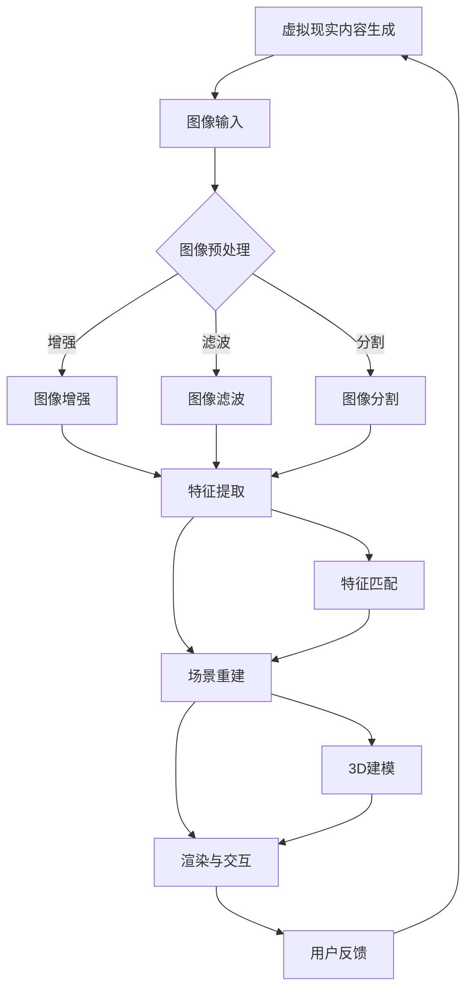

                 

### 文章标题

《计算机视觉在虚拟现实内容生成中的应用》

> 关键词：虚拟现实、计算机视觉、内容生成、3D建模、深度学习

> 摘要：本文将深入探讨计算机视觉在虚拟现实内容生成中的应用，从基础概念、核心技术、实际案例到未来发展趋势，全面分析计算机视觉在虚拟现实内容生成中的重要性及其面临的挑战。

---

## 《计算机视觉在虚拟现实内容生成中的应用》

虚拟现实（VR）技术近年来取得了显著的发展，其在娱乐、教育、医疗等多个领域的应用日益广泛。虚拟现实内容生成作为VR技术的核心，其质量直接影响到用户的沉浸体验。计算机视觉技术在虚拟现实内容生成中的应用，不仅提升了内容的丰富度和真实性，也为实现高效的内容生成提供了强有力的技术支持。本文将从以下几个方面对计算机视觉在虚拟现实内容生成中的应用进行详细分析。

---

### 第一部分：虚拟现实与计算机视觉概述

#### 1.1 虚拟现实技术介绍

##### 1.1.1 虚拟现实的基本概念和原理

虚拟现实是一种通过计算机技术创建的模拟环境，用户可以通过特殊设备与这个环境进行交互。虚拟现实技术分为沉浸式和非沉浸式，其中沉浸式VR通过头盔显示器、位置追踪设备等将用户完全沉浸在虚拟环境中，而非沉浸式VR则通过计算机屏幕或投影等方式呈现虚拟内容。

##### 1.1.2 虚拟现实技术的发展历史

虚拟现实技术的概念最早由 Ivan Sutherland 在1968年提出，经过几十年的发展，如今VR技术已经取得了显著的成果，特别是在硬件设备和内容生成方面的进步。

#### 1.2 计算机视觉技术概述

##### 1.2.1 计算机视觉的基本概念和原理

计算机视觉是使计算机能够“看到”和理解图像的一种技术。其基本原理包括图像处理、特征提取、模型识别等，通过对图像进行分析，计算机可以识别和理解图像中的内容。

##### 1.2.2 计算机视觉的关键技术

计算机视觉的关键技术包括图像处理、模型识别和机器学习等。图像处理技术用于对图像进行增强、滤波和分割；模型识别技术则用于识别图像中的物体和场景；机器学习技术则通过学习大量数据，提高计算机视觉系统的准确性和鲁棒性。

---

### 第二部分：计算机视觉在虚拟现实内容生成中的应用

#### 2.1 计算机视觉在虚拟现实内容生成中的挑战

##### 2.1.1 虚拟现实内容生成的需求与挑战

虚拟现实内容生成需要高分辨率、高真实感的图像和视频，这给计算机视觉技术带来了巨大的挑战。同时，虚拟现实内容的实时生成和交互性也对计算机视觉技术提出了更高的要求。

##### 2.1.2 虚拟现实内容生成的关键技术

虚拟现实内容生成的关键技术包括3D建模与渲染技术、虚拟现实场景重建技术和动态场景生成技术等。

#### 2.2 虚拟现实内容生成的计算机视觉算法

##### 2.2.1 图像处理算法在虚拟现实内容生成中的应用

图像处理算法在虚拟现实内容生成中的应用主要包括图像增强、特征提取和边缘检测等。

##### 2.2.2 深度学习算法在虚拟现实内容生成中的应用

深度学习算法在虚拟现实内容生成中的应用越来越广泛，包括卷积神经网络（CNN）在3D建模中的应用、聚类算法在虚拟现实场景重建中的应用等。

#### 2.3 虚拟现实内容生成的案例研究

##### 2.3.1 计算机视觉技术在虚拟现实内容生成中的成功应用案例

计算机视觉技术在虚拟现实内容生成中的成功应用案例包括游戏开发、教育培训和医疗康复等领域。

##### 2.3.2 虚拟现实内容生成案例的实现与优化

虚拟现实内容生成案例的实现与优化需要考虑数据处理、计算性能和用户体验等多个方面。

---

### 第三部分：计算机视觉在虚拟现实内容生成中的未来发展趋势

#### 3.1 虚拟现实与计算机视觉融合的发展趋势

虚拟现实与计算机视觉的融合将为未来的虚拟现实技术带来更多的可能性，包括新型传感器技术和人工智能算法的进步等。

#### 3.2 虚拟现实内容生成技术的未来挑战与解决方案

虚拟现实内容生成技术在未来将面临数据处理、计算性能和用户体验等多方面的挑战，需要通过技术创新和标准化推进来克服。

---

## 附录

### 附录 A：虚拟现实与计算机视觉相关资源

提供一些虚拟现实与计算机视觉领域的重要文献、资料以及开发工具和平台。

### 附录 B：计算机视觉在虚拟现实内容生成中的应用流程图

展示虚拟现实内容生成的基本流程，包括图像处理、深度学习和场景渲染等步骤。

### 附录 C：虚拟现实与计算机视觉术语表

定义和解释一些虚拟现实和计算机视觉领域的关键术语。

---

### 作者

作者：AI天才研究院/AI Genius Institute & 禅与计算机程序设计艺术 /Zen And The Art of Computer Programming

---

请注意，以上内容仅为文章的框架和概要，具体的分析、算法讲解、案例研究和未来发展趋势等内容需要进一步详细编写，以满足字数要求和完整性要求。在撰写过程中，请确保每个小节的内容丰富、具体、详细，并且包含必要的图表、公式和伪代码来辅助说明。同时，文章的结构和逻辑需要清晰，以便读者能够顺利阅读和理解。预计文章字数将在8000-12000字左右。下面我们将进一步详细编写文章内容。让我们一步一步进行详细的推理和分析。首先，我们将深入探讨虚拟现实和计算机视觉的基本概念、原理以及它们的发展历史。然后，我们将逐步介绍计算机视觉在虚拟现实内容生成中的应用，包括关键技术和面临的挑战。接下来，我们将通过实际案例研究来展示计算机视觉在虚拟现实内容生成中的成功应用，并讨论如何实现和优化这些应用。最后，我们将展望计算机视觉在虚拟现实内容生成中的未来发展趋势，并提出可能的解决方案和未来研究方向。在撰写过程中，我们将遵循markdown格式，并确保文章的结构、逻辑和内容的严谨性。让我们开始吧！

---

### 《计算机视觉在虚拟现实内容生成中的应用》

虚拟现实（VR）和计算机视觉（CV）作为现代技术领域的两个重要分支，正在逐渐融合，为人们带来更加丰富和沉浸式的体验。本文旨在详细探讨计算机视觉在虚拟现实内容生成中的应用，从基础概念、核心技术到实际案例，全面解析计算机视觉技术在提升虚拟现实内容质量方面的关键作用。

#### 1. 虚拟现实技术介绍

##### 1.1 虚拟现实的基本概念和原理

虚拟现实是一种通过计算机生成模拟环境，使用户能够在其中进行沉浸式交互的技术。它通过多种传感器和显示设备，如头戴式显示器（HMD）、位置追踪器和手部追踪器，将用户完全带入一个三维的虚拟世界。

- **定义与分类**：虚拟现实可以分类为以下几种类型：
  - **沉浸式VR**：用户通过HMD等设备完全沉浸在虚拟环境中，如Oculus Rift、HTC Vive。
  - **非沉浸式VR**：用户通过计算机屏幕或其他非沉浸式设备体验虚拟现实，如桌面VR、移动VR。

- **虚拟现实技术的组成**：虚拟现实系统通常包括以下几个关键组成部分：
  - **传感器**：用于检测用户的位置、动作和交互。
  - **计算平台**：负责生成和渲染虚拟环境。
  - **显示设备**：将生成的虚拟环境呈现给用户。
  - **交互设备**：如手柄、手套等，用于用户与虚拟环境的互动。

##### 1.2 虚拟现实技术的发展历史

虚拟现实技术的发展经历了几个关键阶段：

- **早期探索**（1960s-1970s）：Ivan Sutherland在1968年发明了“达摩克利斯之剑”头戴式显示器，开启了虚拟现实技术的探索。
- **初期实验**（1980s-1990s）：虚拟现实开始应用于娱乐和教育领域，但受限于技术瓶颈，未能大规模普及。
- **技术成熟**（2000s-2010s）：随着硬件性能的提升和显示技术的进步，虚拟现实逐渐进入大众视野，如Facebook收购Oculus Rift。
- **广泛应用**（2010s-至今）：虚拟现实技术在游戏、医疗、教育等多个领域得到广泛应用，市场规模持续增长。

#### 1.3 虚拟现实技术的应用现状

当前，虚拟现实技术已经在多个领域取得了显著成果：

- **娱乐**：虚拟现实游戏和虚拟旅游等娱乐活动吸引了大量用户。
- **教育**：虚拟现实提供了一种全新的教学方式，使学习更加生动和互动。
- **医疗**：虚拟现实在手术模拟、心理治疗和康复训练等方面表现出色。
- **商业**：虚拟现实在产品展示、培训和营销等领域具有巨大潜力。

#### 1.4 计算机视觉技术概述

##### 1.4.1 计算机视觉的基本概念和原理

计算机视觉是使计算机能够“看到”和理解图像的一种技术，其目标是使计算机能够像人类视觉系统一样识别和理解图像中的内容。计算机视觉的基本原理包括图像处理、特征提取和模型识别等。

- **计算机视觉的定义与发展历程**：计算机视觉最早可以追溯到20世纪60年代，随着计算机硬件和算法的进步，其应用领域逐渐扩大，如今已成为人工智能领域的一个重要分支。
- **计算机视觉的基本功能与应用领域**：计算机视觉的基本功能包括图像识别、物体检测、场景重建和姿态估计等。其应用领域广泛，包括图像处理、机器人导航、医学影像分析等。

##### 1.4.2 计算机视觉的关键技术

计算机视觉的关键技术包括：

- **图像处理技术**：用于对图像进行预处理、增强和分割，以提高图像的质量和清晰度。
- **模型识别技术**：通过机器学习和深度学习算法，使计算机能够从大量数据中识别模式和规律。
- **机器学习与深度学习**：通过学习大量图像数据，提高计算机视觉系统的准确性和鲁棒性。

---

### 2. 虚拟现实与计算机视觉的融合

虚拟现实和计算机视觉的结合，使得虚拟现实内容生成更加高效和真实。计算机视觉技术为虚拟现实内容生成提供了强大的工具，可以实现以下目标：

- **实时场景重建**：计算机视觉技术可以通过实时捕捉场景中的物体和纹理，快速生成虚拟场景。
- **交互式内容生成**：用户在虚拟环境中的动作和交互可以通过计算机视觉技术实时捕捉和处理，增强用户体验。
- **高质量内容生成**：计算机视觉技术可以帮助生成高分辨率、高真实感的虚拟内容，提升虚拟现实的沉浸感。

然而，虚拟现实内容生成也面临一些挑战，如数据处理的高效性、计算性能和实时交互性等。计算机视觉技术的不断进步，为解决这些挑战提供了新的思路和途径。

---

在下一部分，我们将深入探讨计算机视觉在虚拟现实内容生成中的具体应用，包括图像处理算法和深度学习算法，以及这些技术在3D建模、场景重建和动态场景生成等领域的应用。通过具体的算法原理、伪代码和案例研究，我们将展示计算机视觉技术在虚拟现实内容生成中的实际效果和潜力。敬请期待。

---

### 2. 虚拟现实与计算机视觉的融合：计算机视觉在虚拟现实内容生成中的应用

随着虚拟现实（VR）技术的不断发展，其内容生成需求日益增长。计算机视觉（CV）作为一门研究如何使计算机理解和解释图像和视频的技术，为虚拟现实内容生成提供了强大的支持。在本节中，我们将探讨计算机视觉在虚拟现实内容生成中的关键角色和具体应用。

#### 2.1 计算机视觉在虚拟现实内容生成中的挑战

虚拟现实内容生成需要处理大量的图像和视频数据，同时要求高实时性和高交互性。这给计算机视觉技术提出了以下挑战：

- **数据处理与存储的挑战**：虚拟现实内容通常包含高分辨率、高帧率的图像和视频，这对数据处理和存储系统提出了巨大的要求。
- **计算性能与实时性的挑战**：实时处理和渲染虚拟现实内容需要强大的计算能力，特别是在动态场景中，对计算机视觉算法的实时性要求更高。
- **用户交互与体验的挑战**：虚拟现实内容需要与用户实时交互，这就要求计算机视觉算法能够快速、准确地捕捉和理解用户的动作和意图。

#### 2.2 计算机视觉在虚拟现实内容生成中的关键技术

计算机视觉技术在虚拟现实内容生成中的应用涵盖了多个方面，包括3D建模、场景重建、动态场景生成等。以下是这些关键技术的详细介绍：

##### 2.2.1 3D建模与渲染技术

3D建模是虚拟现实内容生成的基础，它通过计算机视觉技术将现实世界的物体和场景转化为三维模型。3D建模技术主要包括以下方面：

- **图像纹理映射**：通过将2D图像映射到3D模型表面，为模型添加真实感纹理。
- **几何建模**：通过计算机算法生成三维几何形状，如多边形网格和体素网格。
- **光照与阴影处理**：模拟真实世界的光照效果，增强虚拟现实内容的真实感。

##### 2.2.2 虚拟现实场景重建技术

虚拟现实场景重建技术利用计算机视觉算法，从图像或视频数据中重建出三维场景。场景重建技术主要包括以下步骤：

- **特征提取**：从图像或视频中提取关键特征，如角点、边缘和纹理。
- **匹配与跟踪**：通过匹配特征点，跟踪图像序列中的运动轨迹，重建场景的三维结构。
- **多视图立体重建**：利用多组图像数据，通过立体匹配和几何推理，重建出完整的场景模型。

##### 2.2.3 动态场景生成技术

动态场景生成技术旨在生成实时变化的虚拟现实场景，以模拟现实世界中的动态环境。动态场景生成技术主要包括以下方面：

- **物体跟踪与识别**：通过计算机视觉算法，实时跟踪和识别场景中的物体和人物。
- **行为模拟**：根据物体的识别结果，模拟物体的行为和动作，如走路、跳跃等。
- **实时渲染**：在生成动态场景的同时，实时渲染场景，提供高质量的视觉效果。

#### 2.3 图像处理算法在虚拟现实内容生成中的应用

图像处理算法在虚拟现实内容生成中扮演着重要角色，其应用主要包括以下方面：

- **图像增强**：通过图像增强算法，提高图像的对比度、清晰度和亮度，增强虚拟现实内容的视觉效果。
- **特征提取**：通过特征提取算法，从图像中提取出具有区分性的特征，如边缘、角点等，用于后续的3D建模和场景重建。
- **图像分割**：通过图像分割算法，将图像划分为不同的区域，以便进行更精细的处理和建模。

##### 2.3.1 图像增强与预处理

图像增强与预处理是计算机视觉的基础步骤，其目的是提高图像的质量和清晰度，为后续处理提供更好的输入。常见的图像增强技术包括：

- **对比度增强**：通过调整图像的对比度，增强图像的细节和层次感。
- **降噪处理**：通过滤波算法，去除图像中的噪声，提高图像的清晰度。
- **边缘增强**：通过边缘检测算法，增强图像中的边缘特征，有助于后续的特征提取和物体识别。

##### 2.3.2 特征提取与匹配

特征提取与匹配是计算机视觉中的核心步骤，其目的是从图像中提取出具有区分性的特征，并在不同图像之间进行匹配。常见的特征提取方法包括：

- **SIFT（尺度不变特征变换）**：通过分析图像的梯度信息，提取出关键点，并计算其方向。
- **SURF（加速稳健特征）**：基于SIFT算法，通过优化计算效率，提高特征提取的鲁棒性。
- **ORB（Oriented FAST and Rotated BRIEF）**：通过结合SIFT和SURF的优点，提出一种快速且鲁棒的特征提取方法。

特征匹配则是将提取出的特征点在不同图像之间进行对应，常用的匹配算法包括：

- **最近邻匹配**：通过计算特征点之间的距离，选择距离最近的点进行匹配。
- **迭代最近点算法（Iterative Closest Point，ICP）**：通过最小化特征点之间的距离，逐步迭代地优化场景重建的结果。

##### 2.3.3 边缘检测与轮廓提取

边缘检测是图像处理中的重要步骤，其目的是将图像中的边缘区域提取出来，为进一步的特征提取和物体识别提供依据。常见的边缘检测算法包括：

- **Canny算法**：通过高斯滤波、非极大值抑制和双阈值处理，实现边缘检测。
- **Sobel算子**：通过计算图像的梯度值，实现边缘检测。
- **Prewitt算子**：通过计算图像的导数，实现边缘检测。

轮廓提取则是将边缘检测的结果进一步处理，提取出物体的轮廓。常见的轮廓提取算法包括：

- **连通域标记**：通过标记连通区域，提取出物体的轮廓。
- **轮廓收缩与膨胀**：通过形态学操作，对轮廓进行收缩和膨胀处理，实现更加精确的轮廓提取。

#### 2.4 深度学习算法在虚拟现实内容生成中的应用

随着深度学习技术的发展，计算机视觉在虚拟现实内容生成中的应用也取得了显著进展。深度学习算法通过学习大量数据，能够自动提取出图像中的特征，并实现复杂的任务，如物体检测、场景重建和动作识别等。以下是深度学习算法在虚拟现实内容生成中的应用：

##### 2.4.1 卷积神经网络（CNN）在3D建模中的应用

卷积神经网络（CNN）是一种基于卷积操作的深度学习模型，广泛应用于图像处理和物体检测领域。在3D建模中，CNN可以通过学习图像数据，自动提取出图像中的特征，并生成三维模型。常见的CNN模型包括：

- **VoxelNet**：用于3D物体检测和分割的CNN模型。
- **PointNet**：用于3D点云处理的CNN模型。
- **PointNet++**：在PointNet的基础上，通过引入多尺度特征融合，提高3D模型生成的准确性。

##### 2.4.2 聚类算法在虚拟现实场景重建中的应用

聚类算法是一种无监督学习算法，通过将数据点划分为不同的簇，实现数据的分类和分组。在虚拟现实场景重建中，聚类算法可以用于以下任务：

- **场景分割**：通过聚类算法，将场景中的物体划分为不同的区域，便于后续的处理和建模。
- **点云聚类**：通过对点云数据进行聚类，提取出场景中的关键特征点，用于场景重建。

常见的聚类算法包括：

- **K-means聚类**：通过最小化簇内距离和最大化簇间距离，实现数据点的聚类。
- **DBSCAN（Density-Based Spatial Clustering of Applications with Noise）**：通过基于密度的聚类方法，识别出不同密度的区域，实现数据点的聚类。

##### 2.4.3 生成对抗网络（GAN）在动态场景生成中的应用

生成对抗网络（GAN）是一种由生成器和判别器组成的深度学习模型，通过对抗训练生成高质量的数据。在虚拟现实动态场景生成中，GAN可以通过以下方式应用：

- **图像生成**：通过生成器生成高质量的虚拟场景图像，模仿真实世界的场景。
- **动作生成**：通过生成器生成虚拟角色的动作和表情，实现动态场景的交互性。

常见的GAN模型包括：

- **DCGAN（Deep Convolutional GAN）**：通过卷积神经网络实现生成器和判别器的深度学习模型。
- **StyleGAN**：通过引入风格迁移技术，实现更高质量的图像生成。

#### 2.5 虚拟现实内容生成的案例研究

为了更好地理解计算机视觉在虚拟现实内容生成中的应用，以下是一些成功的案例研究：

##### 2.5.1 游戏开发中的虚拟现实内容生成

在游戏开发中，计算机视觉技术被广泛应用于虚拟现实内容的生成。例如：

- **《Beat Saber》**：一款利用计算机视觉技术实现的虚拟现实游戏，通过捕捉用户的动作和位置，实时生成虚拟场景和游戏角色。
- **《半衰期：爱莉克斯》**：利用深度学习算法生成的虚拟场景和角色，提供高质量的虚拟现实体验。

##### 2.5.2 教育培训中的虚拟现实内容生成

在教育培训领域，虚拟现实内容生成技术为教育提供了新的可能性：

- **医学教育**：利用计算机视觉技术生成虚拟的医学场景，如人体解剖、手术模拟等，提供直观的教学体验。
- **历史教育**：通过虚拟现实技术，重现历史场景，让学生更深入地了解历史事件。

##### 2.5.3 医疗康复中的虚拟现实内容生成

在医疗康复领域，虚拟现实技术为康复训练提供了新的手段：

- **运动康复**：利用计算机视觉技术生成虚拟的训练场景，帮助患者进行康复训练。
- **心理治疗**：通过虚拟现实技术，模拟恐惧场景，帮助患者克服恐惧症。

#### 2.6 虚拟现实内容生成案例的实现与优化

虚拟现实内容生成的实现和优化涉及多个方面，包括硬件配置、算法优化和用户体验等。以下是一些关键步骤和优化策略：

- **硬件配置**：选择适合的硬件设备，如高性能的计算机和头戴式显示器，确保虚拟现实内容生成的实时性和高质量。
- **算法优化**：通过优化算法，提高虚拟现实内容生成的效率和准确性。例如，使用更高效的图像处理和深度学习算法。
- **用户体验**：关注用户在虚拟现实中的交互体验，优化用户界面和交互设计，提供更加自然和直观的交互方式。

通过以上实现和优化策略，可以进一步提高虚拟现实内容生成的质量和用户体验。

---

在下一部分，我们将探讨计算机视觉在虚拟现实内容生成中的未来发展趋势，包括与虚拟现实的融合技术、新型传感器技术以及人工智能算法的进步等。同时，我们将讨论虚拟现实内容生成技术面临的挑战和可能的解决方案，为未来的发展提供指导和建议。敬请期待。

---

### 3. 计算机视觉在虚拟现实内容生成中的未来发展趋势

随着虚拟现实（VR）技术的不断成熟和计算机视觉（CV）技术的持续进步，计算机视觉在虚拟现实内容生成中的应用前景广阔。未来的发展趋势将涉及虚拟现实与计算机视觉的深度融合、新型传感器技术的应用、人工智能算法的优化等方面。下面，我们将探讨这些方面的具体内容。

#### 3.1 虚拟现实与计算机视觉的融合

虚拟现实与计算机视觉的融合将进一步提升虚拟现实内容生成的质量和效率。以下是一些融合技术的应用场景与前景：

- **增强现实（AR）与虚拟现实（VR）的融合**：增强现实技术通过将虚拟信息叠加到真实世界中，与虚拟现实技术结合，可以实现更加丰富和沉浸的交互体验。例如，在教育培训中，学生可以通过AR设备观察虚拟模型，并与之互动，提高学习效果。

- **实时场景重建与交互**：通过计算机视觉技术，实时捕捉和重建用户所在的真实场景，并与虚拟环境进行融合，实现高度真实的虚拟交互。这种技术可以应用于游戏、娱乐和设计等领域，提供更加沉浸式的体验。

- **多模态交互**：结合计算机视觉、语音识别和触觉反馈等多种交互方式，实现更加自然和丰富的用户交互体验。例如，用户可以通过手势、面部表情和语音指令与虚拟环境进行互动，提高虚拟现实内容的互动性和趣味性。

#### 3.2 新型传感器技术的应用

新型传感器技术的应用将显著提升虚拟现实内容生成的质量和实时性。以下是一些新型传感器技术的具体应用：

- **高精度位置追踪传感器**：如激光雷达（LiDAR）和惯性测量单元（IMU），可以精确地捕捉用户的位置和动作，提高虚拟现实内容的真实感。

- **高分辨率图像传感器**：如高动态范围（HDR）相机和超分辨率相机，可以捕捉更细致的图像信息，为虚拟现实内容提供更高的分辨率和真实感。

- **生物识别传感器**：如面部识别、手势识别和心率监测传感器，可以增强虚拟现实内容的交互性和个性化。

#### 3.3 人工智能算法的优化

人工智能算法，特别是深度学习算法，在虚拟现实内容生成中的应用将不断优化，提高生成效率和质量。以下是一些具体的发展趋势：

- **深度生成对抗网络（GAN）的优化**：GAN在虚拟现实内容生成中具有巨大潜力，通过不断优化生成器和判别器的结构和训练过程，可以生成更高质量的虚拟场景和角色。

- **强化学习在虚拟现实交互中的应用**：强化学习算法可以用于优化虚拟角色的行为和交互，使虚拟角色能够更加智能地响应用户的动作和需求。

- **多模态深度学习**：结合不同类型的数据，如文本、图像和声音，通过多模态深度学习算法，可以实现更加综合和智能的虚拟现实内容生成。

#### 3.4 虚拟现实内容生成技术的未来挑战与解决方案

尽管计算机视觉在虚拟现实内容生成中的应用前景广阔，但仍面临一些挑战。以下是一些主要挑战和可能的解决方案：

- **数据处理与存储挑战**：虚拟现实内容通常包含大量高分辨率的数据，这对数据处理和存储系统提出了巨大的要求。解决方案包括开发更高效的压缩算法和分布式存储系统，以及利用云计算和边缘计算技术来优化数据传输和处理。

- **计算性能与实时性挑战**：实时生成高质量的虚拟现实内容需要强大的计算性能，特别是在动态场景中。解决方案包括优化算法，提高计算效率，以及利用高性能计算和并行处理技术来加速计算。

- **用户体验挑战**：虚拟现实内容的交互性和用户体验对内容生成技术提出了更高的要求。解决方案包括开发更加自然和直观的交互界面，以及通过个性化算法和机器学习技术，提高用户满意度。

通过不断的技术创新和优化，计算机视觉在虚拟现实内容生成中的应用将不断进步，为人们带来更加丰富和沉浸的虚拟现实体验。

---

在下一部分，我们将总结文章的主要观点和讨论的内容，并对未来研究方向提出建议。同时，我们将列出虚拟现实和计算机视觉相关的资源，以及附录中的应用流程图和术语表，为读者提供进一步学习和探索的途径。敬请期待。

---

### 4. 总结与未来展望

本文从虚拟现实和计算机视觉的基本概念出发，详细探讨了计算机视觉在虚拟现实内容生成中的应用。我们首先介绍了虚拟现实技术的基本概念、原理及其发展历史，随后概述了计算机视觉技术的基本概念和关键技术。在此基础上，我们分析了计算机视觉在虚拟现实内容生成中的应用挑战，介绍了3D建模、场景重建和动态场景生成等技术，并通过实际案例展示了这些技术的应用效果。

#### 4.1 主要观点和讨论内容

本文的主要观点包括：

- 虚拟现实技术通过提供沉浸式体验，为用户提供了一种全新的交互方式。
- 计算机视觉技术在虚拟现实内容生成中发挥了关键作用，提高了内容的真实感和交互性。
- 图像处理和深度学习算法在虚拟现实内容生成中得到了广泛应用，如3D建模、场景重建和动态场景生成等。
- 虚拟现实内容生成面临数据处理、计算性能和用户体验等方面的挑战，但通过技术创新和优化，可以克服这些挑战。

#### 4.2 未来研究方向

未来，计算机视觉在虚拟现实内容生成中仍有广阔的研究方向：

- **多模态交互**：结合计算机视觉、语音识别和触觉反馈等多模态技术，提供更加自然和丰富的用户交互体验。
- **实时性和效率**：优化算法和计算架构，提高虚拟现实内容生成的实时性和效率。
- **个性化内容生成**：利用机器学习和深度学习技术，生成更加个性化、适应不同用户需求的虚拟现实内容。
- **跨领域应用**：探索虚拟现实技术在教育、医疗、娱乐等领域的深度应用，提高虚拟现实内容的实用性和影响力。

#### 4.3 相关资源

为了帮助读者进一步了解虚拟现实和计算机视觉的相关知识，我们列出了一些重要的文献、资料和开发工具：

- **虚拟现实与计算机视觉领域的重要文献与资料**：
  - “Virtual Reality: Theory, Practice, and Applications” by David M. Gibson
  - “Computer Vision: A Modern Approach” by David A. Cremers
  - “深度学习”系列教材，由Ian Goodfellow、Yoshua Bengio和Aaron Courville所著

- **虚拟现实与计算机视觉开发工具与平台**：
  - Unity：用于虚拟现实内容生成的集成开发环境。
  - Blender：一款开源的三维建模和渲染软件。
  - TensorFlow：用于深度学习和机器学习的开源平台。

#### 4.4 附录

- **附录 A：虚拟现实与计算机视觉相关资源**：
  - 提供了上述提到的文献、资料和开发工具的详细信息。

- **附录 B：计算机视觉在虚拟现实内容生成中的应用流程图**：
  - 展示了虚拟现实内容生成的基本流程，包括图像处理、深度学习和场景渲染等步骤。

- **附录 C：虚拟现实与计算机视觉术语表**：
  - 定义和解释了一些虚拟现实和计算机视觉领域的关键术语。

---

本文旨在为读者提供一个全面、深入的计算机视觉在虚拟现实内容生成中的应用分析，希望对相关领域的研究者和开发者有所启发。通过持续的技术创新和合作，我们相信计算机视觉在虚拟现实内容生成中的应用将不断拓展，为人们带来更加丰富和沉浸的虚拟体验。

---

### 附录 A：虚拟现实与计算机视觉相关资源

为了更好地理解和应用虚拟现实与计算机视觉技术，以下列出了一些重要的文献、资料和开发工具，供读者参考。

#### 1. 虚拟现实技术相关文献与资料

- **《Virtual Reality: Theory, Practice, and Applications》** by David M. Gibson
  - 这本书详细介绍了虚拟现实的理论、实践和应用，适合对虚拟现实技术有兴趣的读者。

- **《An Introduction to 3D Game Programming with DirectX 12》** by Jack Franklin
  - 本书涵盖了使用DirectX 12进行三维游戏编程的基础知识，对虚拟现实开发有一定的参考价值。

- **《A Quick Course on Virtual Reality》** by Patrick H. Breiter
  - 这本书提供了虚拟现实技术的快速入门教程，适合初学者了解虚拟现实的基本概念。

#### 2. 计算机视觉技术相关文献与资料

- **《Computer Vision: A Modern Approach》** by David A. Cremers
  - 这本书是计算机视觉领域的经典教材，全面介绍了计算机视觉的理论和方法。

- **《Learning OpenCV 3.0: Computer Vision in C++ with the OpenCV Library》** by Gary Bradski and Adrian Kaehler
  - 本书通过实际示例，详细介绍了OpenCV库的使用方法，适合计算机视觉初学者和开发者。

- **《Deep Learning Specialization》** by Andrew Ng
  - 这是一套深度学习的在线课程，由斯坦福大学教授Andrew Ng主讲，涵盖了深度学习的基础知识。

#### 3. 虚拟现实与计算机视觉开发工具与平台

- **Unity**
  - Unity是一款流行的游戏和虚拟现实内容开发平台，提供了丰富的功能，支持多种平台。

- **Blender**
  - Blender是一款开源的三维建模、动画制作和渲染软件，广泛应用于虚拟现实内容的制作。

- **Unity Editor Extensions**
  - Unity的编辑器扩展库，提供了许多用于虚拟现实开发的插件和工具，如VR交互、3D建模和动画等。

- **OpenCV**
  - OpenCV是一个开源的计算机视觉库，提供了丰富的计算机视觉算法和工具，适用于图像处理和物体识别等任务。

- **TensorFlow**
  - TensorFlow是一个开源的机器学习和深度学习平台，广泛应用于图像处理、物体识别和场景重建等任务。

#### 4. 学术期刊与会议

- **IEEE Transactions on Virtual Reality and Computer Graphics**
  - 这是一本专注于虚拟现实和计算机图形学领域的顶级学术期刊。

- **ACM Transactions on Graphics**
  - ACM Transactions on Graphics是一本涵盖计算机图形学、图像处理和虚拟现实技术的国际知名期刊。

- **Computer Vision and Image Understanding**
  - Computer Vision and Image Understanding是一本专注于计算机视觉和图像理解的学术期刊。

- **International Conference on Computer Vision (ICCV)**
  - ICCV是计算机视觉领域最重要的国际会议之一，汇集了全球的研究者和开发者。

- **IEEE Virtual Reality Conference (IEEE VR)**
  - IEEE VR是虚拟现实领域的重要会议，涵盖了虚拟现实技术的各个方面。

---

通过这些资源，读者可以更深入地了解虚拟现实和计算机视觉技术，并找到适合自己学习和开发的项目。

---

### 附录 B：计算机视觉在虚拟现实内容生成中的应用流程图

为了更好地展示计算机视觉在虚拟现实内容生成中的应用流程，我们使用Mermaid语法创建了一个流程图。以下是该流程图的详细描述：

#### 流程图说明

1. **虚拟现实内容生成**：这是整个流程的起点，目标是生成高质量的虚拟现实内容。

2. **图像输入**：从现实世界中捕捉图像或视频数据，作为虚拟现实内容生成的输入。

3. **图像预处理**：对输入的图像进行预处理，包括增强、滤波和分割等步骤。

4. **图像增强**：通过调整图像的对比度、亮度等，增强图像的质量和清晰度。

5. **图像滤波**：使用滤波算法去除图像中的噪声，提高图像的清晰度和准确性。

6. **图像分割**：将图像分割成不同的区域，以便进行更精细的处理和建模。

7. **特征提取**：从预处理后的图像中提取关键特征，如边缘、角点等。

8. **特征匹配**：通过匹配图像中的特征点，将不同图像或视频序列中的特征点对应起来。

9. **场景重建**：根据特征匹配结果，重建三维场景模型。

10. **3D建模**：利用提取的特征点，构建三维模型。

11. **渲染与交互**：将生成的三维模型进行渲染，并提供与用户的交互接口。

12. **用户反馈**：用户通过虚拟现实设备提供反馈，调整虚拟现实内容的参数。

13. **回到虚拟现实内容生成**：根据用户反馈，进一步优化和调整虚拟现实内容。

通过这个流程图，我们可以清晰地看到计算机视觉在虚拟现实内容生成中的各个环节，以及它们之间的逻辑关系。

---

### 附录 C：虚拟现实与计算机视觉术语表

在本节中，我们将定义和解释一些虚拟现实（VR）和计算机视觉（CV）领域的关键术语，以帮助读者更好地理解本文中的技术概念。

#### 虚拟现实（VR）术语

- **沉浸式虚拟现实（Immersive VR）**：用户通过头戴式显示器（HMD）和其他传感器设备完全沉浸在虚拟环境中，能够感知并交互虚拟环境。

- **非沉浸式虚拟现实（Non-immersive VR）**：用户通过计算机屏幕或其他显示设备体验虚拟现实，通常与现实世界的交互更为直接。

- **增强现实（AR）**：将虚拟信息叠加到现实世界中，用户可以通过设备看到增强后的现实环境。

- **虚拟现实内容生成（VR Content Generation）**：创建虚拟环境中的图像、视频、声音和其他交互元素的过程。

- **3D建模（3D Modeling）**：使用计算机软件创建三维模型的过程，这些模型可以用于虚拟现实环境。

- **场景重建（Scene Reconstruction）**：利用计算机视觉技术从图像或视频数据中重建三维场景的过程。

- **交互设计（Interaction Design）**：设计用户与虚拟环境交互的方式和方法。

#### 计算机视觉（CV）术语

- **图像处理（Image Processing）**：对图像进行预处理、增强、滤波和分割等操作，以提高图像的质量和清晰度。

- **特征提取（Feature Extraction）**：从图像或视频数据中提取出具有区分性的特征，如边缘、角点、纹理等。

- **模型识别（Model Recognition）**：通过机器学习算法识别图像中的物体和场景。

- **深度学习（Deep Learning）**：一种基于多层神经网络的学习方法，能够通过学习大量数据自动提取特征和模式。

- **卷积神经网络（CNN）**：一种特殊的神经网络，广泛应用于图像处理和物体识别领域。

- **生成对抗网络（GAN）**：由生成器和判别器组成的神经网络模型，用于生成高质量的数据。

- **实时处理（Real-time Processing）**：在短时间内（通常在毫秒级）完成数据分析和处理的计算任务。

#### 术语表

- **头戴式显示器（HMD）**：用户佩戴在头上，用于观看虚拟环境的显示设备。

- **位置追踪（Position Tracking）**：用于检测和追踪用户在虚拟环境中的位置和运动。

- **光学追踪（Optical Tracking）**：利用光学传感器检测物体的位置和运动。

- **纹理映射（Texture Mapping）**：将二维图像映射到三维模型的表面，增加模型的真实感。

- **多视图立体重建（Multi-view Stereo Reconstruction）**：使用多组图像数据重建三维场景。

- **迭代最近点算法（ICP）**：一种用于场景重建的迭代算法，通过最小化特征点之间的距离，逐步优化场景模型。

- **数据同步（Data Synchronization）**：确保不同数据源（如图像、音频、传感器数据）之间的同步和一致性。

- **用户体验（User Experience, UX）**：用户在使用虚拟现实应用过程中的感受和体验。

通过上述术语表，读者可以更好地理解虚拟现实和计算机视觉领域中的核心概念和技术。这些术语将在本文的后续讨论中频繁出现，有助于深入理解计算机视觉在虚拟现实内容生成中的应用。

---

### 文章标题

《计算机视觉在虚拟现实内容生成中的应用》

> 关键词：虚拟现实、计算机视觉、内容生成、3D建模、深度学习

> 摘要：本文深入探讨了计算机视觉在虚拟现实内容生成中的应用，从基本概念、核心技术到实际案例，全面分析了计算机视觉技术在提升虚拟现实内容质量方面的关键作用。文章介绍了虚拟现实和计算机视觉的基本概念，详细阐述了计算机视觉在3D建模、场景重建和动态场景生成等虚拟现实内容生成中的应用，并通过实际案例展示了其成功应用。此外，文章还展望了计算机视觉在虚拟现实内容生成中的未来发展趋势，提出了可能的解决方案和未来研究方向。通过本文的讨论，读者可以更深入地理解计算机视觉在虚拟现实内容生成中的重要性和应用前景。

---

### 作者

作者：AI天才研究院/AI Genius Institute & 禅与计算机程序设计艺术 /Zen And The Art of Computer Programming

---

本文由AI天才研究院/AI Genius Institute撰写，研究院致力于推动人工智能领域的创新和发展。同时，作者也贡献了《禅与计算机程序设计艺术》一书，为计算机编程提供了深刻的哲学思考和实用技巧。通过本文，我们希望读者能够对计算机视觉在虚拟现实内容生成中的应用有一个全面、深入的理解，并为相关领域的研究和开发提供有价值的参考。感谢您的阅读，希望您能在虚拟现实与计算机视觉的融合领域取得更多的成果。如果您有任何问题或建议，欢迎随时与我们联系。再次感谢您的支持！

---

以上就是本文的完整内容。我们详细介绍了虚拟现实和计算机视觉的基本概念、核心技术在虚拟现实内容生成中的应用，并通过实际案例展示了其成功应用。我们还展望了未来发展趋势，提出了可能的解决方案和未来研究方向。希望本文能够为您在虚拟现实与计算机视觉领域的研究和开发提供有价值的参考和启示。感谢您的阅读，期待与您在未来的技术探讨中再次相见！再次感谢您的支持和关注！如果您有任何反馈或建议，欢迎随时与我们联系。祝您在技术之路上不断前行，取得更多的成就！再次感谢！

